**\[MS-SMB2\]:**

**Server Message Block (SMB) Protocol Versions 2 and 3**

Intellectual Property Rights Notice for Open Specifications Documentation

- **Technical Documentation.** Microsoft publishes Open Specifications documentation ("this documentation") for protocols, file formats, data portability, computer languages, and standards support. Additionally, overview documents cover inter-protocol relationships and interactions.

- **Copyrights**. This documentation is covered by Microsoft copyrights. Regardless of any other terms that are contained in the terms of use for the Microsoft website that hosts this documentation, you can make copies of it in order to develop implementations of the technologies that are described in this documentation and can distribute portions of it in your implementations that use these technologies or in your documentation as necessary to properly document the implementation. You can also distribute in your implementation, with or without modification, any schemas, IDLs, or code samples that are included in the documentation. This permission also applies to any documents that are referenced in the Open Specifications documentation.

- **No Trade Secrets**. Microsoft does not claim any trade secret rights in this documentation.

- **Patents**. Microsoft has patents that might cover your implementations of the technologies described in the Open Specifications documentation. Neither this notice nor Microsoft\'s delivery of this documentation grants any licenses under those patents or any other Microsoft patents. However, a given Open Specifications document might be covered by the Microsoft [Open Specifications Promise](https://go.microsoft.com/fwlink/?LinkId=214445) or the [Microsoft Community Promise](https://go.microsoft.com/fwlink/?LinkId=214448). If you would prefer a written license, or if the technologies described in this documentation are not covered by the Open Specifications Promise or Community Promise, as applicable, patent licenses are available by contacting <iplg@microsoft.com>.

- **License Programs**. To see all of the protocols in scope under a specific license program and the associated patents, visit the [Patent Map](https://aka.ms/AA9ufj8).

- **Trademarks**. The names of companies and products contained in this documentation might be covered by trademarks or similar intellectual property rights. This notice does not grant any licenses under those rights. For a list of Microsoft trademarks, visit [www.microsoft.com/trademarks](https://www.microsoft.com/trademarks).

- **Fictitious Names**. The example companies, organizations, products, domain names, email addresses, logos, people, places, and events that are depicted in this documentation are fictitious. No association with any real company, organization, product, domain name, email address, logo, person, place, or event is intended or should be inferred.

**Reservation of Rights**. All other rights are reserved, and this notice does not grant any rights other than as specifically described above, whether by implication, estoppel, or otherwise.

**Tools**. The Open Specifications documentation does not require the use of Microsoft programming tools or programming environments in order for you to develop an implementation. If you have access to Microsoft programming tools and environments, you are free to take advantage of them. Certain Open Specifications documents are intended for use in conjunction with publicly available standards specifications and network programming art and, as such, assume that the reader either is familiar with the aforementioned material or has immediate access to it.

**Support.** For questions and support, please contact <dochelp@microsoft.com>.

**Revision Summary**

  ------------------------------------------------------------------------------------------------------------
  Date         Revision History   Revision Class   Comments
  ------------ ------------------ ---------------- -----------------------------------------------------------
  10/22/2006   0.01               New              Version 0.01 release

  1/19/2007    1.0                Major            Version 1.0 release

  3/2/2007     1.1                Minor            Version 1.1 release

  4/3/2007     1.2                Minor            Version 1.2 release

  5/11/2007    1.3                Minor            Version 1.3 release

  6/1/2007     1.3.1              Editorial        Changed language and formatting in the technical content.

  7/3/2007     2.0                Major            MLonghorn+90

  7/20/2007    3.0                Major            Updated and revised the technical content.

  8/10/2007    4.0                Major            Updated and revised the technical content.

  9/28/2007    5.0                Major            Updated and revised the technical content.

  10/23/2007   6.0                Major            Updated and revised the technical content.

  11/30/2007   7.0                Major            Updated and revised the technical content.

  1/25/2008    7.0.1              Editorial        Changed language and formatting in the technical content.

  3/14/2008    8.0                Major            Updated and revised the technical content.

  5/16/2008    9.0                Major            Updated and revised the technical content.

  6/20/2008    10.0               Major            Updated and revised the technical content.

  7/25/2008    11.0               Major            Updated and revised the technical content.

  8/29/2008    12.0               Major            Updated and revised the technical content.

  10/24/2008   13.0               Major            Updated and revised the technical content.

  12/5/2008    14.0               Major            Updated and revised the technical content.

  1/16/2009    15.0               Major            Updated and revised the technical content.

  2/27/2009    16.0               Major            Updated and revised the technical content.

  4/10/2009    17.0               Major            Updated and revised the technical content.

  5/22/2009    18.0               Major            Updated and revised the technical content.

  7/2/2009     19.0               Major            Updated and revised the technical content.

  8/14/2009    20.0               Major            Updated and revised the technical content.

  9/25/2009    21.0               Major            Updated and revised the technical content.

  11/6/2009    22.0               Major            Updated and revised the technical content.

  12/18/2009   23.0               Major            Updated and revised the technical content.

  1/29/2010    24.0               Major            Updated and revised the technical content.

  3/12/2010    25.0               Major            Updated and revised the technical content.

  4/23/2010    26.0               Major            Updated and revised the technical content.

  6/4/2010     27.0               Major            Updated and revised the technical content.

  7/16/2010    28.0               Major            Updated and revised the technical content.

  8/27/2010    29.0               Major            Updated and revised the technical content.

  10/8/2010    30.0               Major            Updated and revised the technical content.

  11/19/2010   31.0               Major            Updated and revised the technical content.

  1/7/2011     32.0               Major            Updated and revised the technical content.

  2/11/2011    33.0               Major            Updated and revised the technical content.

  3/25/2011    34.0               Major            Updated and revised the technical content.

  5/6/2011     35.0               Major            Updated and revised the technical content.

  6/17/2011    36.0               Major            Updated and revised the technical content.

  9/23/2011    37.0               Major            Updated and revised the technical content.

  12/16/2011   38.0               Major            Updated and revised the technical content.

  3/30/2012    39.0               Major            Updated and revised the technical content.

  7/12/2012    40.0               Major            Updated and revised the technical content.

  10/25/2012   41.0               Major            Updated and revised the technical content.

  1/31/2013    42.0               Major            Updated and revised the technical content.

  8/8/2013     43.0               Major            Updated and revised the technical content.

  11/14/2013   44.0               Major            Updated and revised the technical content.

  2/13/2014    45.0               Major            Updated and revised the technical content.

  5/15/2014    46.0               Major            Updated and revised the technical content.

  6/30/2015    47.0               Major            Significantly changed the technical content.

  10/16/2015   48.0               Major            Significantly changed the technical content.

  7/14/2016    49.0               Major            Significantly changed the technical content.

  9/26/2016    50.0               Major            Significantly changed the technical content.

  3/16/2017    51.0               Major            Significantly changed the technical content.

  6/1/2017     52.0               Major            Significantly changed the technical content.

  9/15/2017    53.0               Major            Significantly changed the technical content.

  12/1/2017    54.0               Major            Significantly changed the technical content.

  3/16/2018    55.0               Major            Significantly changed the technical content.

  9/12/2018    56.0               Major            Significantly changed the technical content.

  3/13/2019    57.0               Major            Significantly changed the technical content.

  4/30/2019    58.0               Major            Significantly changed the technical content.

  9/23/2019    59.0               Major            Significantly changed the technical content.

  3/4/2020     60.0               Major            Significantly changed the technical content.

  8/26/2020    61.0               Major            Significantly changed the technical content.

  4/7/2021     62.0               Major            Significantly changed the technical content.

  6/2/2021     63.0               Major            Significantly changed the technical content.

  6/25/2021    64.0               Major            Significantly changed the technical content.

  10/6/2021    65.0               Major            Significantly changed the technical content.

  4/29/2022    66.0               Major            Significantly changed the technical content.

  2/27/2023    67.0               Major            Significantly changed the technical content.

  9/20/2023    68.0               Major            Significantly changed the technical content.

  1/29/2024    69.0               Major            Significantly changed the technical content.

  2/26/2024    70.0               Major            Significantly changed the technical content.

  3/11/2024    71.0               Major            Significantly changed the technical content.

  3/25/2024    72.0               Major            Significantly changed the technical content.

  4/8/2024     73.0               Major            Significantly changed the technical content.

  4/23/2024    74.0               Major            Significantly changed the technical content.

  5/13/2024    75.0               Major            Significantly changed the technical content.

  5/24/2024    76.0               Major            Significantly changed the technical content.

  6/10/2024    77.0               Major            Significantly changed the technical content.

  7/8/2024     78.0               Major            Significantly changed the technical content.

  7/29/2024    79.0               Major            Significantly changed the technical content.

  11/19/2024   80.0               Major            Significantly changed the technical content.

  4/7/2025     81.0               Major            Significantly changed the technical content.

  7/7/2025     82.0               Major            Significantly changed the technical content.

  7/28/2025    83.0               Major            Significantly changed the technical content.
  ------------------------------------------------------------------------------------------------------------

Table of Contents

[1 Introduction [15](#introduction)](#introduction)

[1.1 Glossary [15](#glossary)](#glossary)

[1.2 References [19](#references)](#references)

[1.2.1 Normative References [19](#normative-references)](#normative-references)

[1.2.2 Informative References [21](#informative-references)](#informative-references)

[1.3 Overview [23](#overview)](#overview)

[1.4 Relationship to Other Protocols [26](#relationship-to-other-protocols)](#relationship-to-other-protocols)

[1.5 Prerequisites/Preconditions [27](#prerequisitespreconditions)](#prerequisitespreconditions)

[1.6 Applicability Statement [28](#applicability-statement)](#applicability-statement)

[1.7 Versioning and Capability Negotiation [28](#versioning-and-capability-negotiation)](#versioning-and-capability-negotiation)

[1.8 Vendor-Extensible Fields [30](#vendor-extensible-fields)](#vendor-extensible-fields)

[1.9 Standards Assignments [30](#standards-assignments)](#standards-assignments)

[2 Messages [32](#messages)](#messages)

[2.1 Transport [32](#transport)](#transport)

[2.2 Message Syntax [32](#message-syntax)](#message-syntax)

[2.2.1 SMB2 Packet Header [34](#smb2-packet-header)](#smb2-packet-header)

[2.2.1.1 SMB2 Packet Header - ASYNC [34](#smb2-packet-header---async)](#smb2-packet-header---async)

[2.2.1.2 SMB2 Packet Header - SYNC [37](#smb2-packet-header---sync)](#smb2-packet-header---sync)

[2.2.2 SMB2 ERROR Response [40](#smb2-error-response)](#smb2-error-response)

[2.2.2.1 SMB2 ERROR Context Response [41](#smb2-error-context-response)](#smb2-error-context-response)

[2.2.2.2 ErrorData format [42](#errordata-format)](#errordata-format)

[2.2.2.2.1 Symbolic Link Error Response [42](#symbolic-link-error-response)](#symbolic-link-error-response)

[2.2.2.2.1.1 Handling the Symbolic Link Error Response [44](#handling-the-symbolic-link-error-response)](#handling-the-symbolic-link-error-response)

[2.2.2.2.2 Share Redirect Error Context Response [45](#share-redirect-error-context-response)](#share-redirect-error-context-response)

[2.2.2.2.2.1 MOVE_DST_IPADDR structure [46](#move_dst_ipaddr-structure)](#move_dst_ipaddr-structure)

[2.2.3 SMB2 NEGOTIATE Request [47](#smb2-negotiate-request)](#smb2-negotiate-request)

[2.2.3.1 SMB2 NEGOTIATE_CONTEXT Request Values [49](#smb2-negotiate_context-request-values)](#smb2-negotiate_context-request-values)

[2.2.3.1.1 SMB2_PREAUTH_INTEGRITY_CAPABILITIES [50](#smb2_preauth_integrity_capabilities)](#smb2_preauth_integrity_capabilities)

[2.2.3.1.2 SMB2_ENCRYPTION_CAPABILITIES [51](#smb2_encryption_capabilities)](#smb2_encryption_capabilities)

[2.2.3.1.3 SMB2_COMPRESSION_CAPABILITIES [51](#smb2_compression_capabilities)](#smb2_compression_capabilities)

[2.2.3.1.4 SMB2_NETNAME_NEGOTIATE_CONTEXT_ID [52](#smb2_netname_negotiate_context_id)](#smb2_netname_negotiate_context_id)

[2.2.3.1.5 SMB2_TRANSPORT_CAPABILITIES [53](#smb2_transport_capabilities)](#smb2_transport_capabilities)

[2.2.3.1.6 SMB2_RDMA_TRANSFORM_CAPABILITIES [53](#smb2_rdma_transform_capabilities)](#smb2_rdma_transform_capabilities)

[2.2.3.1.7 SMB2_SIGNING_CAPABILITIES [54](#smb2_signing_capabilities)](#smb2_signing_capabilities)

[2.2.4 SMB2 NEGOTIATE Response [54](#smb2-negotiate-response)](#smb2-negotiate-response)

[2.2.4.1 SMB2 NEGOTIATE_CONTEXT Response Values [58](#smb2-negotiate_context-response-values)](#smb2-negotiate_context-response-values)

[2.2.4.1.1 SMB2_PREAUTH_INTEGRITY_CAPABILITIES [58](#smb2_preauth_integrity_capabilities-1)](#smb2_preauth_integrity_capabilities-1)

[2.2.4.1.2 SMB2_ENCRYPTION_CAPABILITIES [58](#smb2_encryption_capabilities-1)](#smb2_encryption_capabilities-1)

[2.2.4.1.3 SMB2_COMPRESSION_CAPABILITIES [58](#smb2_compression_capabilities-1)](#smb2_compression_capabilities-1)

[2.2.4.1.4 SMB2_NETNAME_NEGOTIATE_CONTEXT_ID [58](#smb2_netname_negotiate_context_id-1)](#smb2_netname_negotiate_context_id-1)

[2.2.4.1.5 SMB2_TRANSPORT_CAPABILITIES [58](#smb2_transport_capabilities-1)](#smb2_transport_capabilities-1)

[2.2.4.1.6 SMB2_RDMA_TRANSFORM_CAPABILITIES [58](#smb2_rdma_transform_capabilities-1)](#smb2_rdma_transform_capabilities-1)

[2.2.4.1.7 SMB2_SIGNING_CAPABILITIES [58](#smb2_signing_capabilities-1)](#smb2_signing_capabilities-1)

[2.2.5 SMB2 SESSION_SETUP Request [59](#smb2-session_setup-request)](#smb2-session_setup-request)

[2.2.6 SMB2 SESSION_SETUP Response [60](#smb2-session_setup-response)](#smb2-session_setup-response)

[2.2.7 SMB2 LOGOFF Request [61](#smb2-logoff-request)](#smb2-logoff-request)

[2.2.8 SMB2 LOGOFF Response [61](#smb2-logoff-response)](#smb2-logoff-response)

[2.2.9 SMB2 TREE_CONNECT Request [62](#smb2-tree_connect-request)](#smb2-tree_connect-request)

[2.2.9.1 SMB2 TREE_CONNECT Request Extension [63](#smb2-tree_connect-request-extension)](#smb2-tree_connect-request-extension)

[2.2.9.2 SMB2 TREE_CONNECT_CONTEXT Request Values [63](#smb2-tree_connect_context-request-values)](#smb2-tree_connect_context-request-values)

[2.2.9.2.1 SMB2_REMOTED_IDENTITY_TREE_CONNECT Context [64](#smb2_remoted_identity_tree_connect-context)](#smb2_remoted_identity_tree_connect-context)

[2.2.9.2.1.1 BLOB_DATA [66](#blob_data)](#blob_data)

[2.2.9.2.1.2 SID_ATTR_DATA [66](#sid_attr_data)](#sid_attr_data)

[2.2.9.2.1.3 SID_ARRAY_DATA [67](#sid_array_data)](#sid_array_data)

[2.2.9.2.1.4 LUID_ATTR_DATA [67](#luid_attr_data)](#luid_attr_data)

[2.2.9.2.1.5 PRIVILEGE_DATA [68](#privilege_data)](#privilege_data)

[2.2.9.2.1.6 PRIVILEGE_ARRAY_DATA [68](#privilege_array_data)](#privilege_array_data)

[2.2.10 SMB2 TREE_CONNECT Response [68](#smb2-tree_connect-response)](#smb2-tree_connect-response)

[2.2.11 SMB2 TREE_DISCONNECT Request [71](#smb2-tree_disconnect-request)](#smb2-tree_disconnect-request)

[2.2.12 SMB2 TREE_DISCONNECT Response [71](#smb2-tree_disconnect-response)](#smb2-tree_disconnect-response)

[2.2.13 SMB2 CREATE Request [71](#smb2-create-request)](#smb2-create-request)

[2.2.13.1 SMB2 Access Mask Encoding [76](#smb2-access-mask-encoding)](#smb2-access-mask-encoding)

[2.2.13.1.1 File_Pipe_Printer_Access_Mask [77](#file_pipe_printer_access_mask)](#file_pipe_printer_access_mask)

[2.2.13.1.2 Directory_Access_Mask [78](#directory_access_mask)](#directory_access_mask)

[2.2.13.2 SMB2_CREATE_CONTEXT Request Values [80](#smb2_create_context-request-values)](#smb2_create_context-request-values)

[2.2.13.2.1 SMB2_CREATE_EA_BUFFER [82](#smb2_create_ea_buffer)](#smb2_create_ea_buffer)

[2.2.13.2.2 SMB2_CREATE_SD_BUFFER [82](#smb2_create_sd_buffer)](#smb2_create_sd_buffer)

[2.2.13.2.3 SMB2_CREATE_DURABLE_HANDLE_REQUEST [82](#smb2_create_durable_handle_request)](#smb2_create_durable_handle_request)

[2.2.13.2.4 SMB2_CREATE_DURABLE_HANDLE_RECONNECT [83](#smb2_create_durable_handle_reconnect)](#smb2_create_durable_handle_reconnect)

[2.2.13.2.5 SMB2_CREATE_QUERY_MAXIMAL_ACCESS_REQUEST [83](#smb2_create_query_maximal_access_request)](#smb2_create_query_maximal_access_request)

[2.2.13.2.6 SMB2_CREATE_ALLOCATION_SIZE [83](#smb2_create_allocation_size)](#smb2_create_allocation_size)

[2.2.13.2.7 SMB2_CREATE_TIMEWARP_TOKEN [83](#smb2_create_timewarp_token)](#smb2_create_timewarp_token)

[2.2.13.2.8 SMB2_CREATE_REQUEST_LEASE [84](#smb2_create_request_lease)](#smb2_create_request_lease)

[2.2.13.2.9 SMB2_CREATE_QUERY_ON_DISK_ID [85](#smb2_create_query_on_disk_id)](#smb2_create_query_on_disk_id)

[2.2.13.2.10 SMB2_CREATE_REQUEST_LEASE_V2 [85](#smb2_create_request_lease_v2)](#smb2_create_request_lease_v2)

[2.2.13.2.11 SMB2_CREATE_DURABLE_HANDLE_REQUEST_V2 [86](#smb2_create_durable_handle_request_v2)](#smb2_create_durable_handle_request_v2)

[2.2.13.2.12 SMB2_CREATE_DURABLE_HANDLE_RECONNECT_V2 [87](#smb2_create_durable_handle_reconnect_v2)](#smb2_create_durable_handle_reconnect_v2)

[2.2.13.2.13 SMB2_CREATE_APP_INSTANCE_ID [88](#smb2_create_app_instance_id)](#smb2_create_app_instance_id)

[2.2.13.2.14 SVHDX_OPEN_DEVICE_CONTEXT [88](#svhdx_open_device_context)](#svhdx_open_device_context)

[2.2.13.2.15 SMB2_CREATE_APP_INSTANCE_VERSION [88](#smb2_create_app_instance_version)](#smb2_create_app_instance_version)

[2.2.14 SMB2 CREATE Response [89](#smb2-create-response)](#smb2-create-response)

[2.2.14.1 SMB2_FILEID [92](#smb2_fileid)](#smb2_fileid)

[2.2.14.2 SMB2_CREATE_CONTEXT Response Values [92](#smb2_create_context-response-values)](#smb2_create_context-response-values)

[2.2.14.2.1 SMB2_CREATE_EA_BUFFER [93](#smb2_create_ea_buffer-1)](#smb2_create_ea_buffer-1)

[2.2.14.2.2 SMB2_CREATE_SD_BUFFER [93](#smb2_create_sd_buffer-1)](#smb2_create_sd_buffer-1)

[2.2.14.2.3 SMB2_CREATE_DURABLE_HANDLE_RESPONSE [93](#smb2_create_durable_handle_response)](#smb2_create_durable_handle_response)

[2.2.14.2.4 SMB2_CREATE_DURABLE_HANDLE_RECONNECT [94](#smb2_create_durable_handle_reconnect-1)](#smb2_create_durable_handle_reconnect-1)

[2.2.14.2.5 SMB2_CREATE_QUERY_MAXIMAL_ACCESS_RESPONSE [94](#smb2_create_query_maximal_access_response)](#smb2_create_query_maximal_access_response)

[2.2.14.2.6 SMB2_CREATE_APP_INSTANCE_ID [94](#smb2_create_app_instance_id-1)](#smb2_create_app_instance_id-1)

[2.2.14.2.7 SMB2_CREATE_ALLOCATION_SIZE [94](#smb2_create_allocation_size-1)](#smb2_create_allocation_size-1)

[2.2.14.2.8 SMB2_CREATE_TIMEWARP_TOKEN [94](#smb2_create_timewarp_token-1)](#smb2_create_timewarp_token-1)

[2.2.14.2.9 SMB2_CREATE_QUERY_ON_DISK_ID [94](#smb2_create_query_on_disk_id-1)](#smb2_create_query_on_disk_id-1)

[2.2.14.2.10 SMB2_CREATE_RESPONSE_LEASE [95](#smb2_create_response_lease)](#smb2_create_response_lease)

[2.2.14.2.11 SMB2_CREATE_RESPONSE_LEASE_V2 [96](#smb2_create_response_lease_v2)](#smb2_create_response_lease_v2)

[2.2.14.2.12 SMB2_CREATE_DURABLE_HANDLE_RESPONSE_V2 [97](#smb2_create_durable_handle_response_v2)](#smb2_create_durable_handle_response_v2)

[2.2.14.2.13 SMB2_CREATE_DURABLE_HANDLE_RECONNECT_V2 [98](#smb2_create_durable_handle_reconnect_v2-1)](#smb2_create_durable_handle_reconnect_v2-1)

[2.2.14.2.14 SVHDX_OPEN_DEVICE_CONTEXT_RESPONSE [98](#svhdx_open_device_context_response)](#svhdx_open_device_context_response)

[2.2.14.2.15 SMB2_CREATE_APP_INSTANCE_VERSION [98](#smb2_create_app_instance_version-1)](#smb2_create_app_instance_version-1)

[2.2.15 SMB2 CLOSE Request [98](#smb2-close-request)](#smb2-close-request)

[2.2.16 SMB2 CLOSE Response [99](#smb2-close-response)](#smb2-close-response)

[2.2.17 SMB2 FLUSH Request [100](#smb2-flush-request)](#smb2-flush-request)

[2.2.18 SMB2 FLUSH Response [101](#smb2-flush-response)](#smb2-flush-response)

[2.2.19 SMB2 READ Request [101](#smb2-read-request)](#smb2-read-request)

[2.2.20 SMB2 READ Response [103](#smb2-read-response)](#smb2-read-response)

[2.2.21 SMB2 WRITE Request [105](#smb2-write-request)](#smb2-write-request)

[2.2.22 SMB2 WRITE Response [107](#smb2-write-response)](#smb2-write-response)

[2.2.23 SMB2 OPLOCK_BREAK Notification [107](#smb2-oplock_break-notification)](#smb2-oplock_break-notification)

[2.2.23.1 Oplock Break Notification [107](#oplock-break-notification)](#oplock-break-notification)

[2.2.23.2 Lease Break Notification [108](#lease-break-notification)](#lease-break-notification)

[2.2.24 SMB2 OPLOCK_BREAK Acknowledgment [110](#smb2-oplock_break-acknowledgment)](#smb2-oplock_break-acknowledgment)

[2.2.24.1 Oplock Break Acknowledgment [110](#oplock-break-acknowledgment)](#oplock-break-acknowledgment)

[2.2.24.2 Lease Break Acknowledgment [111](#lease-break-acknowledgment)](#lease-break-acknowledgment)

[2.2.25 SMB2 OPLOCK_BREAK Response [112](#smb2-oplock_break-response)](#smb2-oplock_break-response)

[2.2.25.1 Oplock Break Response [112](#oplock-break-response)](#oplock-break-response)

[2.2.25.2 Lease Break Response [113](#lease-break-response)](#lease-break-response)

[2.2.26 SMB2 LOCK Request [114](#smb2-lock-request)](#smb2-lock-request)

[2.2.26.1 SMB2_LOCK_ELEMENT Structure [115](#smb2_lock_element-structure)](#smb2_lock_element-structure)

[2.2.27 SMB2 LOCK Response [116](#smb2-lock-response)](#smb2-lock-response)

[2.2.28 SMB2 ECHO Request [116](#smb2-echo-request)](#smb2-echo-request)

[2.2.29 SMB2 ECHO Response [116](#smb2-echo-response)](#smb2-echo-response)

[2.2.30 SMB2 CANCEL Request [117](#smb2-cancel-request)](#smb2-cancel-request)

[2.2.31 SMB2 IOCTL Request [117](#smb2-ioctl-request)](#smb2-ioctl-request)

[2.2.31.1 SRV_COPYCHUNK_COPY [119](#srv_copychunk_copy)](#srv_copychunk_copy)

[2.2.31.1.1 SRV_COPYCHUNK [120](#srv_copychunk)](#srv_copychunk)

[2.2.31.2 SRV_READ_HASH Request [121](#srv_read_hash-request)](#srv_read_hash-request)

[2.2.31.3 NETWORK_RESILIENCY_REQUEST Request [122](#network_resiliency_request-request)](#network_resiliency_request-request)

[2.2.31.4 VALIDATE_NEGOTIATE_INFO Request [122](#validate_negotiate_info-request)](#validate_negotiate_info-request)

[2.2.32 SMB2 IOCTL Response [123](#smb2-ioctl-response)](#smb2-ioctl-response)

[2.2.32.1 SRV_COPYCHUNK_RESPONSE [124](#srv_copychunk_response)](#srv_copychunk_response)

[2.2.32.2 SRV_SNAPSHOT_ARRAY [125](#srv_snapshot_array)](#srv_snapshot_array)

[2.2.32.3 SRV_REQUEST_RESUME_KEY Response [126](#srv_request_resume_key-response)](#srv_request_resume_key-response)

[2.2.32.4 SRV_READ_HASH Response [126](#srv_read_hash-response)](#srv_read_hash-response)

[2.2.32.4.1 HASH_HEADER [127](#hash_header)](#hash_header)

[2.2.32.4.2 SRV_HASH_RETRIEVE_HASH_BASED [128](#srv_hash_retrieve_hash_based)](#srv_hash_retrieve_hash_based)

[2.2.32.4.3 SRV_HASH_RETRIEVE_FILE_BASED [128](#srv_hash_retrieve_file_based)](#srv_hash_retrieve_file_based)

[2.2.32.5 NETWORK_INTERFACE_INFO Response [129](#network_interface_info-response)](#network_interface_info-response)

[2.2.32.5.1 SOCKADDR_STORAGE [130](#sockaddr_storage)](#sockaddr_storage)

[2.2.32.5.1.1 SOCKADDR_IN [131](#sockaddr_in)](#sockaddr_in)

[2.2.32.5.1.2 SOCKADDR_IN6 [131](#sockaddr_in6)](#sockaddr_in6)

[2.2.32.6 VALIDATE_NEGOTIATE_INFO Response [132](#validate_negotiate_info-response)](#validate_negotiate_info-response)

[2.2.33 SMB2 QUERY_DIRECTORY Request [132](#smb2-query_directory-request)](#smb2-query_directory-request)

[2.2.34 SMB2 QUERY_DIRECTORY Response [134](#smb2-query_directory-response)](#smb2-query_directory-response)

[2.2.35 SMB2 CHANGE_NOTIFY Request [135](#smb2-change_notify-request)](#smb2-change_notify-request)

[2.2.36 SMB2 CHANGE_NOTIFY Response [137](#smb2-change_notify-response)](#smb2-change_notify-response)

[2.2.37 SMB2 QUERY_INFO Request [137](#smb2-query_info-request)](#smb2-query_info-request)

[2.2.37.1 SMB2_QUERY_QUOTA_INFO [141](#smb2_query_quota_info)](#smb2_query_quota_info)

[2.2.38 SMB2 QUERY_INFO Response [142](#smb2-query_info-response)](#smb2-query_info-response)

[2.2.39 SMB2 SET_INFO Request [143](#smb2-set_info-request)](#smb2-set_info-request)

[2.2.40 SMB2 SET_INFO Response [145](#smb2-set_info-response)](#smb2-set_info-response)

[2.2.41 SMB2 TRANSFORM_HEADER [146](#smb2-transform_header)](#smb2-transform_header)

[2.2.42 SMB2 COMPRESSION_TRANSFORM_HEADER [148](#smb2-compression_transform_header)](#smb2-compression_transform_header)

[2.2.42.1 SMB2_COMPRESSION_TRANSFORM_HEADER_UNCHAINED [148](#smb2_compression_transform_header_unchained)](#smb2_compression_transform_header_unchained)

[2.2.42.2 SMB2_COMPRESSION_TRANSFORM_HEADER_CHAINED [149](#smb2_compression_transform_header_chained)](#smb2_compression_transform_header_chained)

[2.2.42.2.1 SMB2_COMPRESSION_CHAINED_PAYLOAD_HEADER [149](#smb2_compression_chained_payload_header)](#smb2_compression_chained_payload_header)

[2.2.42.2.2 SMB2_COMPRESSION_PATTERN_PAYLOAD_V1 [150](#smb2_compression_pattern_payload_v1)](#smb2_compression_pattern_payload_v1)

[2.2.43 SMB2_RDMA_TRANSFORM [150](#smb2_rdma_transform)](#smb2_rdma_transform)

[2.2.43.1 SMB2_RDMA_CRYPTO_TRANSFORM [151](#smb2_rdma_crypto_transform)](#smb2_rdma_crypto_transform)

[2.2.44 SMB2 SERVER_TO_CLIENT Notification [152](#smb2-server_to_client-notification)](#smb2-server_to_client-notification)

[2.2.44.1 Server to Client Notification [152](#server-to-client-notification)](#server-to-client-notification)

[2.2.44.2 SMB2 Notify Session Closed [153](#smb2-notify-session-closed)](#smb2-notify-session-closed)

[3 Protocol Details [154](#protocol-details)](#protocol-details)

[3.1 Common Details [154](#common-details)](#common-details)

[3.1.1 Abstract Data Model [154](#abstract-data-model)](#abstract-data-model)

[3.1.1.1 Global [154](#global)](#global)

[3.1.2 Timers [154](#timers)](#timers)

[3.1.3 Initialization [154](#initialization)](#initialization)

[3.1.4 Higher-Layer Triggered Events [155](#higher-layer-triggered-events)](#higher-layer-triggered-events)

[3.1.4.1 Signing An Outgoing Message [155](#signing-an-outgoing-message)](#signing-an-outgoing-message)

[3.1.4.2 Generating Cryptographic Keys [155](#generating-cryptographic-keys)](#generating-cryptographic-keys)

[3.1.4.3 Encrypting the Message [156](#encrypting-the-message)](#encrypting-the-message)

[3.1.4.4 Compressing the Message [156](#compressing-the-message)](#compressing-the-message)

[3.1.4.4.1 Algorithm for Scanning Data Patterns V1 [158](#algorithm-for-scanning-data-patterns-v1)](#algorithm-for-scanning-data-patterns-v1)

[3.1.5 Processing Events and Sequencing Rules [159](#processing-events-and-sequencing-rules)](#processing-events-and-sequencing-rules)

[3.1.5.1 Verifying an Incoming Message [159](#verifying-an-incoming-message)](#verifying-an-incoming-message)

[3.1.5.2 Calculating the CreditCharge [159](#calculating-the-creditcharge)](#calculating-the-creditcharge)

[3.1.5.3 Decompressing the Chained Message [160](#decompressing-the-chained-message)](#decompressing-the-chained-message)

[3.1.6 Timer Events [160](#timer-events)](#timer-events)

[3.1.7 Other Local Events [161](#other-local-events)](#other-local-events)

[3.2 Client Details [161](#client-details)](#client-details)

[3.2.1 Abstract Data Model [161](#abstract-data-model-1)](#abstract-data-model-1)

[3.2.1.1 Global [161](#global-1)](#global-1)

[3.2.1.2 Per SMB2 Transport Connection [162](#per-smb2-transport-connection)](#per-smb2-transport-connection)

[3.2.1.3 Per Session [164](#per-session)](#per-session)

[3.2.1.4 Per Tree Connect [165](#per-tree-connect)](#per-tree-connect)

[3.2.1.5 Per Open File [165](#per-open-file)](#per-open-file)

[3.2.1.6 Per Application Open of a File [166](#per-application-open-of-a-file)](#per-application-open-of-a-file)

[3.2.1.7 Per Pending Request [167](#per-pending-request)](#per-pending-request)

[3.2.1.8 Per Channel [167](#per-channel)](#per-channel)

[3.2.1.9 Per Server [167](#per-server)](#per-server)

[3.2.1.10 Per Share [168](#per-share)](#per-share)

[3.2.1.11 Per ClientCertificateMappingEntry [168](#per-clientcertificatemappingentry)](#per-clientcertificatemappingentry)

[3.2.2 Timers [168](#timers-1)](#timers-1)

[3.2.2.1 Request Expiration Timer [168](#request-expiration-timer)](#request-expiration-timer)

[3.2.2.2 Idle Connection Timer [168](#idle-connection-timer)](#idle-connection-timer)

[3.2.2.3 Network Interface Information Timer [168](#network-interface-information-timer)](#network-interface-information-timer)

[3.2.3 Initialization [168](#initialization-1)](#initialization-1)

[3.2.4 Higher-Layer Triggered Events [169](#higher-layer-triggered-events-1)](#higher-layer-triggered-events-1)

[3.2.4.1 Sending Any Outgoing Message [169](#sending-any-outgoing-message)](#sending-any-outgoing-message)

[3.2.4.1.1 Signing the Message [170](#signing-the-message)](#signing-the-message)

[3.2.4.1.2 Requesting Credits from the Server [170](#requesting-credits-from-the-server)](#requesting-credits-from-the-server)

[3.2.4.1.3 Associating the Message with a MessageId [170](#associating-the-message-with-a-messageid)](#associating-the-message-with-a-messageid)

[3.2.4.1.4 Sending Compounded Requests [171](#sending-compounded-requests)](#sending-compounded-requests)

[3.2.4.1.5 Sending Multi-Credit Requests [172](#sending-multi-credit-requests)](#sending-multi-credit-requests)

[3.2.4.1.6 Algorithm for Handling Available Message Sequence Numbers by the Client [172](#algorithm-for-handling-available-message-sequence-numbers-by-the-client)](#algorithm-for-handling-available-message-sequence-numbers-by-the-client)

[3.2.4.1.7 Selecting a Connection [172](#selecting-a-connection)](#selecting-a-connection)

[3.2.4.1.8 Encrypting the Message [172](#encrypting-the-message-1)](#encrypting-the-message-1)

[3.2.4.1.9 Compressing the Message [173](#compressing-the-message-1)](#compressing-the-message-1)

[3.2.4.2 Application Requests a Connection to a Share [173](#application-requests-a-connection-to-a-share)](#application-requests-a-connection-to-a-share)

[3.2.4.2.1 Connecting to the Target Server [175](#connecting-to-the-target-server)](#connecting-to-the-target-server)

[3.2.4.2.2 Negotiating the Protocol [176](#negotiating-the-protocol)](#negotiating-the-protocol)

[3.2.4.2.2.1 Multi-Protocol Negotiate [176](#multi-protocol-negotiate)](#multi-protocol-negotiate)

[3.2.4.2.2.2 SMB2-Only Negotiate [176](#smb2-only-negotiate)](#smb2-only-negotiate)

[3.2.4.2.3 Authenticating the User [179](#authenticating-the-user)](#authenticating-the-user)

[3.2.4.2.3.1 Application Requests Reauthenticating a User [180](#application-requests-reauthenticating-a-user)](#application-requests-reauthenticating-a-user)

[3.2.4.2.4 Connecting to the Share [181](#connecting-to-the-share)](#connecting-to-the-share)

[3.2.4.3 Application Requests Opening a File [182](#application-requests-opening-a-file)](#application-requests-opening-a-file)

[3.2.4.3.1 Application Requests Opening a Named Pipe [184](#application-requests-opening-a-named-pipe)](#application-requests-opening-a-named-pipe)

[3.2.4.3.2 Application Requests Sending a File to Print [185](#application-requests-sending-a-file-to-print)](#application-requests-sending-a-file-to-print)

[3.2.4.3.3 Application Requests Creating a File with Extended Attributes [185](#application-requests-creating-a-file-with-extended-attributes)](#application-requests-creating-a-file-with-extended-attributes)

[3.2.4.3.4 Application Requests Creating a File with a Security Descriptor [185](#application-requests-creating-a-file-with-a-security-descriptor)](#application-requests-creating-a-file-with-a-security-descriptor)

[3.2.4.3.5 Application Requests Creating a File Opened for Durable Operation [185](#application-requests-creating-a-file-opened-for-durable-operation)](#application-requests-creating-a-file-opened-for-durable-operation)

[3.2.4.3.6 Application Requests Opening a Previous Version of a File [186](#application-requests-opening-a-previous-version-of-a-file)](#application-requests-opening-a-previous-version-of-a-file)

[3.2.4.3.7 Application Requests Creating a File with a Specific Allocation Size [186](#application-requests-creating-a-file-with-a-specific-allocation-size)](#application-requests-creating-a-file-with-a-specific-allocation-size)

[3.2.4.3.8 Requesting a Lease on a File or a Directory [186](#requesting-a-lease-on-a-file-or-a-directory)](#requesting-a-lease-on-a-file-or-a-directory)

[3.2.4.3.9 Application Requests Maximal Access Information of a File [187](#application-requests-maximal-access-information-of-a-file)](#application-requests-maximal-access-information-of-a-file)

[3.2.4.3.10 Application Requests Identifier of a File [187](#application-requests-identifier-of-a-file)](#application-requests-identifier-of-a-file)

[3.2.4.3.11 Application Supplies its Identifier [187](#application-supplies-its-identifier)](#application-supplies-its-identifier)

[3.2.4.3.12 Application Provides an Application-Specific Create Context Structure to Open a Remote File [187](#application-provides-an-application-specific-create-context-structure-to-open-a-remote-file)](#application-provides-an-application-specific-create-context-structure-to-open-a-remote-file)

[3.2.4.3.13 Application Supplies a Version for its Identifier [187](#application-supplies-a-version-for-its-identifier)](#application-supplies-a-version-for-its-identifier)

[3.2.4.4 Re-establishing a Durable Open [187](#re-establishing-a-durable-open)](#re-establishing-a-durable-open)

[3.2.4.5 Application Requests Closing a File or Named Pipe [188](#application-requests-closing-a-file-or-named-pipe)](#application-requests-closing-a-file-or-named-pipe)

[3.2.4.6 Application Requests Reading from a File or Named Pipe [189](#application-requests-reading-from-a-file-or-named-pipe)](#application-requests-reading-from-a-file-or-named-pipe)

[3.2.4.7 Application Requests Writing to a File or Named Pipe [191](#application-requests-writing-to-a-file-or-named-pipe)](#application-requests-writing-to-a-file-or-named-pipe)

[3.2.4.8 Application Requests Querying File Attributes [193](#application-requests-querying-file-attributes)](#application-requests-querying-file-attributes)

[3.2.4.9 Application Requests Applying File Attributes [195](#application-requests-applying-file-attributes)](#application-requests-applying-file-attributes)

[3.2.4.10 Application Requests Querying File System Attributes [196](#application-requests-querying-file-system-attributes)](#application-requests-querying-file-system-attributes)

[3.2.4.11 Application Requests Applying File System Attributes [196](#application-requests-applying-file-system-attributes)](#application-requests-applying-file-system-attributes)

[3.2.4.12 Application Requests Querying File Security [197](#application-requests-querying-file-security)](#application-requests-querying-file-security)

[3.2.4.13 Application Requests Applying File Security [198](#application-requests-applying-file-security)](#application-requests-applying-file-security)

[3.2.4.14 Application Requests Querying Quota Information [199](#application-requests-querying-quota-information)](#application-requests-querying-quota-information)

[3.2.4.15 Application Requests Applying Quota Information [200](#application-requests-applying-quota-information)](#application-requests-applying-quota-information)

[3.2.4.16 Application Requests Flushing Cached Data [201](#application-requests-flushing-cached-data)](#application-requests-flushing-cached-data)

[3.2.4.17 Application Requests Enumerating a Directory [202](#application-requests-enumerating-a-directory)](#application-requests-enumerating-a-directory)

[3.2.4.17.1 Application Requests Continuing a Directory Enumeration [203](#application-requests-continuing-a-directory-enumeration)](#application-requests-continuing-a-directory-enumeration)

[3.2.4.18 Application Requests Change Notifications for a Directory [203](#application-requests-change-notifications-for-a-directory)](#application-requests-change-notifications-for-a-directory)

[3.2.4.19 Application Requests Locking of an Array of Byte Ranges [204](#application-requests-locking-of-an-array-of-byte-ranges)](#application-requests-locking-of-an-array-of-byte-ranges)

[3.2.4.20 Application Requests an IO Control Code Operation [205](#application-requests-an-io-control-code-operation)](#application-requests-an-io-control-code-operation)

[3.2.4.20.1 Application Requests Enumeration of Previous Versions [205](#application-requests-enumeration-of-previous-versions)](#application-requests-enumeration-of-previous-versions)

[3.2.4.20.2 Application Requests a Server-Side Data Copy [206](#application-requests-a-server-side-data-copy)](#application-requests-a-server-side-data-copy)

[3.2.4.20.2.1 Application Requests a Source File Key [207](#application-requests-a-source-file-key)](#application-requests-a-source-file-key)

[3.2.4.20.2.2 Application Requests a Server Side Data Copy [208](#application-requests-a-server-side-data-copy-1)](#application-requests-a-server-side-data-copy-1)

[3.2.4.20.3 Application Requests DFS Referral Information [209](#application-requests-dfs-referral-information)](#application-requests-dfs-referral-information)

[3.2.4.20.4 Application Requests a Pipe Transaction [210](#application-requests-a-pipe-transaction)](#application-requests-a-pipe-transaction)

[3.2.4.20.5 Application Requests a Peek at Pipe Data [211](#application-requests-a-peek-at-pipe-data)](#application-requests-a-peek-at-pipe-data)

[3.2.4.20.6 Application Requests a Pass-Through Operation [212](#application-requests-a-pass-through-operation)](#application-requests-a-pass-through-operation)

[3.2.4.20.7 Application Requests Content Information for a File [213](#application-requests-content-information-for-a-file)](#application-requests-content-information-for-a-file)

[3.2.4.20.8 Application Requests Resiliency on an Open File [214](#application-requests-resiliency-on-an-open-file)](#application-requests-resiliency-on-an-open-file)

[3.2.4.20.9 Application Requests Waiting for a Connection to a Pipe [215](#application-requests-waiting-for-a-connection-to-a-pipe)](#application-requests-waiting-for-a-connection-to-a-pipe)

[3.2.4.20.10 Application Requests Querying Server\'s Network Interfaces [216](#application-requests-querying-servers-network-interfaces)](#application-requests-querying-servers-network-interfaces)

[3.2.4.20.11 Application Requests Remote Shared Virtual Disk File Control Operation [217](#application-requests-remote-shared-virtual-disk-file-control-operation)](#application-requests-remote-shared-virtual-disk-file-control-operation)

[3.2.4.20.12 Application Requests Extent Duplication [217](#application-requests-extent-duplication)](#application-requests-extent-duplication)

[3.2.4.20.13 Application Requests Extended Extent Duplication [218](#application-requests-extended-extent-duplication)](#application-requests-extended-extent-duplication)

[3.2.4.21 Application Requests Unlocking of an Array of Byte Ranges [220](#application-requests-unlocking-of-an-array-of-byte-ranges)](#application-requests-unlocking-of-an-array-of-byte-ranges)

[3.2.4.22 Application Requests Closing a Share Connection [221](#application-requests-closing-a-share-connection)](#application-requests-closing-a-share-connection)

[3.2.4.23 Application Requests Terminating an Authenticated Context [221](#application-requests-terminating-an-authenticated-context)](#application-requests-terminating-an-authenticated-context)

[3.2.4.24 Application Requests Canceling an Operation [221](#application-requests-canceling-an-operation)](#application-requests-canceling-an-operation)

[3.2.4.25 Application Requests the Session Key for an Authenticated Context [222](#application-requests-the-session-key-for-an-authenticated-context)](#application-requests-the-session-key-for-an-authenticated-context)

[3.2.4.26 Application Requests Number of Opens on a Tree Connect [222](#application-requests-number-of-opens-on-a-tree-connect)](#application-requests-number-of-opens-on-a-tree-connect)

[3.2.4.27 Application Notifies Offline Status of a Server [222](#application-notifies-offline-status-of-a-server)](#application-notifies-offline-status-of-a-server)

[3.2.4.28 Application Notifies Online Status of a Server [223](#application-notifies-online-status-of-a-server)](#application-notifies-online-status-of-a-server)

[3.2.4.29 Application Requests Moving to a Server Instance [223](#application-requests-moving-to-a-server-instance)](#application-requests-moving-to-a-server-instance)

[3.2.5 Processing Events and Sequencing Rules [223](#processing-events-and-sequencing-rules-1)](#processing-events-and-sequencing-rules-1)

[3.2.5.1 Receiving Any Message [223](#receiving-any-message)](#receiving-any-message)

[3.2.5.1.1 Handling the Transformed Message [224](#handling-the-transformed-message)](#handling-the-transformed-message)

[3.2.5.1.1.1 Decrypting the Message [224](#decrypting-the-message)](#decrypting-the-message)

[3.2.5.1.1.2 Decompressing the Message [225](#decompressing-the-message)](#decompressing-the-message)

[3.2.5.1.2 Finding the Application Request for This Response [226](#finding-the-application-request-for-this-response)](#finding-the-application-request-for-this-response)

[3.2.5.1.3 Verifying the Signature [226](#verifying-the-signature)](#verifying-the-signature)

[3.2.5.1.4 Granting Message Credits [226](#granting-message-credits)](#granting-message-credits)

[3.2.5.1.5 Handling Asynchronous Responses [226](#handling-asynchronous-responses)](#handling-asynchronous-responses)

[3.2.5.1.6 Handling Session Expiration [227](#handling-session-expiration)](#handling-session-expiration)

[3.2.5.1.7 Handling Incorrectly Formatted Responses [227](#handling-incorrectly-formatted-responses)](#handling-incorrectly-formatted-responses)

[3.2.5.1.8 Processing the Response [227](#processing-the-response)](#processing-the-response)

[3.2.5.1.9 Handling Compounded Responses [227](#handling-compounded-responses)](#handling-compounded-responses)

[3.2.5.2 Receiving an SMB2 NEGOTIATE Response [227](#receiving-an-smb2-negotiate-response)](#receiving-an-smb2-negotiate-response)

[3.2.5.3 Receiving an SMB2 SESSION_SETUP Response [232](#receiving-an-smb2-session_setup-response)](#receiving-an-smb2-session_setup-response)

[3.2.5.3.1 Handling a New Authentication [232](#handling-a-new-authentication)](#handling-a-new-authentication)

[3.2.5.3.2 Handling a Reauthentication [236](#handling-a-reauthentication)](#handling-a-reauthentication)

[3.2.5.3.3 Handling Session Binding [237](#handling-session-binding)](#handling-session-binding)

[3.2.5.4 Receiving an SMB2 LOGOFF Response [239](#receiving-an-smb2-logoff-response)](#receiving-an-smb2-logoff-response)

[3.2.5.5 Receiving an SMB2 TREE_CONNECT Response [239](#receiving-an-smb2-tree_connect-response)](#receiving-an-smb2-tree_connect-response)

[3.2.5.6 Receiving an SMB2 TREE_DISCONNECT Response [242](#receiving-an-smb2-tree_disconnect-response)](#receiving-an-smb2-tree_disconnect-response)

[3.2.5.7 Receiving an SMB2 CREATE Response for a New Create Operation [242](#receiving-an-smb2-create-response-for-a-new-create-operation)](#receiving-an-smb2-create-response-for-a-new-create-operation)

[3.2.5.7.1 SMB2_CREATE_DURABLE_HANDLE_RESPONSE Create Context [244](#smb2_create_durable_handle_response-create-context)](#smb2_create_durable_handle_response-create-context)

[3.2.5.7.2 SMB2_CREATE_QUERY_MAXIMAL_ACCESS_RESPONSE Create Context [244](#smb2_create_query_maximal_access_response-create-context)](#smb2_create_query_maximal_access_response-create-context)

[3.2.5.7.3 SMB2_CREATE_QUERY_ON_DISK_ID Create Context [244](#smb2_create_query_on_disk_id-create-context)](#smb2_create_query_on_disk_id-create-context)

[3.2.5.7.4 SMB2_CREATE_RESPONSE_LEASE Create Context [244](#smb2_create_response_lease-create-context)](#smb2_create_response_lease-create-context)

[3.2.5.7.5 SMB2_CREATE_RESPONSE_LEASE_V2 Create Context [244](#smb2_create_response_lease_v2-create-context)](#smb2_create_response_lease_v2-create-context)

[3.2.5.7.6 SMB2_CREATE_DURABLE_HANDLE_RESPONSE_V2 Create Context [245](#smb2_create_durable_handle_response_v2-create-context)](#smb2_create_durable_handle_response_v2-create-context)

[3.2.5.8 Receiving an SMB2 CREATE Response for an Open Reestablishment [245](#receiving-an-smb2-create-response-for-an-open-reestablishment)](#receiving-an-smb2-create-response-for-an-open-reestablishment)

[3.2.5.9 Receiving an SMB2 CLOSE Response [246](#receiving-an-smb2-close-response)](#receiving-an-smb2-close-response)

[3.2.5.10 Receiving an SMB2 FLUSH Response [247](#receiving-an-smb2-flush-response)](#receiving-an-smb2-flush-response)

[3.2.5.11 Receiving an SMB2 READ Response [247](#receiving-an-smb2-read-response)](#receiving-an-smb2-read-response)

[3.2.5.12 Receiving an SMB2 WRITE Response [248](#receiving-an-smb2-write-response)](#receiving-an-smb2-write-response)

[3.2.5.13 Receiving an SMB2 LOCK Response [248](#receiving-an-smb2-lock-response)](#receiving-an-smb2-lock-response)

[3.2.5.14 Receiving an SMB2 IOCTL Response [249](#receiving-an-smb2-ioctl-response)](#receiving-an-smb2-ioctl-response)

[3.2.5.14.1 Handling an Enumeration of Previous Versions Response [249](#handling-an-enumeration-of-previous-versions-response)](#handling-an-enumeration-of-previous-versions-response)

[3.2.5.14.2 Handling a Server-Side Data Copy Source File Key Response [249](#handling-a-server-side-data-copy-source-file-key-response)](#handling-a-server-side-data-copy-source-file-key-response)

[3.2.5.14.3 Handling a Server-Side Data Copy Response [249](#handling-a-server-side-data-copy-response)](#handling-a-server-side-data-copy-response)

[3.2.5.14.4 Handling a DFS Referral Information Response [249](#handling-a-dfs-referral-information-response)](#handling-a-dfs-referral-information-response)

[3.2.5.14.5 Handling a Pipe Transaction Response [250](#handling-a-pipe-transaction-response)](#handling-a-pipe-transaction-response)

[3.2.5.14.6 Handling a Peek at Pipe Data Response [250](#handling-a-peek-at-pipe-data-response)](#handling-a-peek-at-pipe-data-response)

[3.2.5.14.7 Handling a Content Information Retrieval Response [250](#handling-a-content-information-retrieval-response)](#handling-a-content-information-retrieval-response)

[3.2.5.14.8 Handling a Pass-Through Operation Response [250](#handling-a-pass-through-operation-response)](#handling-a-pass-through-operation-response)

[3.2.5.14.9 Handling a Resiliency Response [250](#handling-a-resiliency-response)](#handling-a-resiliency-response)

[3.2.5.14.10 Handling a Pipe Wait Response [251](#handling-a-pipe-wait-response)](#handling-a-pipe-wait-response)

[3.2.5.14.11 Handling a Network Interfaces Response [251](#handling-a-network-interfaces-response)](#handling-a-network-interfaces-response)

[3.2.5.14.12 Handling a Validate Negotiate Info Response [251](#handling-a-validate-negotiate-info-response)](#handling-a-validate-negotiate-info-response)

[3.2.5.14.13 Handling a Shared Virtual Disk File Control Response [252](#handling-a-shared-virtual-disk-file-control-response)](#handling-a-shared-virtual-disk-file-control-response)

[3.2.5.15 Receiving an SMB2 QUERY_DIRECTORY Response [252](#receiving-an-smb2-query_directory-response)](#receiving-an-smb2-query_directory-response)

[3.2.5.16 Receiving an SMB2 CHANGE_NOTIFY Response [252](#receiving-an-smb2-change_notify-response)](#receiving-an-smb2-change_notify-response)

[3.2.5.17 Receiving an SMB2 QUERY_INFO Response [252](#receiving-an-smb2-query_info-response)](#receiving-an-smb2-query_info-response)

[3.2.5.18 Receiving an SMB2 SET_INFO Response [252](#receiving-an-smb2-set_info-response)](#receiving-an-smb2-set_info-response)

[3.2.5.19 Receiving an SMB2 OPLOCK_BREAK Notification [253](#receiving-an-smb2-oplock_break-notification)](#receiving-an-smb2-oplock_break-notification)

[3.2.5.19.1 Receiving an Oplock Break Notification [253](#receiving-an-oplock-break-notification)](#receiving-an-oplock-break-notification)

[3.2.5.19.2 Receiving a Lease Break Notification [254](#receiving-a-lease-break-notification)](#receiving-a-lease-break-notification)

[3.2.5.19.3 Receiving an Oplock Break Response [255](#receiving-an-oplock-break-response)](#receiving-an-oplock-break-response)

[3.2.5.19.4 Receiving a Lease Break Response [255](#receiving-a-lease-break-response)](#receiving-a-lease-break-response)

[3.2.5.20 Receiving a Server to Client Notification [255](#receiving-a-server-to-client-notification)](#receiving-a-server-to-client-notification)

[3.2.6 Timer Events [256](#timer-events-1)](#timer-events-1)

[3.2.6.1 Request Expiration Timer Event [256](#request-expiration-timer-event)](#request-expiration-timer-event)

[3.2.6.2 Idle Connection Timer Event [256](#idle-connection-timer-event)](#idle-connection-timer-event)

[3.2.6.3 Network Interface Information Timer Event [256](#network-interface-information-timer-event)](#network-interface-information-timer-event)

[3.2.7 Other Local Events [256](#other-local-events-1)](#other-local-events-1)

[3.2.7.1 Handling a Network Disconnect [256](#handling-a-network-disconnect)](#handling-a-network-disconnect)

[3.2.7.2 Handling Interface State Change [258](#handling-interface-state-change)](#handling-interface-state-change)

[3.3 Server Details [258](#server-details)](#server-details)

[3.3.1 Abstract Data Model [258](#abstract-data-model-2)](#abstract-data-model-2)

[3.3.1.1 Algorithm for Handling Available Message Sequence Numbers by the Server [258](#algorithm-for-handling-available-message-sequence-numbers-by-the-server)](#algorithm-for-handling-available-message-sequence-numbers-by-the-server)

[3.3.1.2 Algorithm for the Granting of Credits [259](#algorithm-for-the-granting-of-credits)](#algorithm-for-the-granting-of-credits)

[3.3.1.3 Algorithm for Change Notifications in an Object Store [259](#algorithm-for-change-notifications-in-an-object-store)](#algorithm-for-change-notifications-in-an-object-store)

[3.3.1.4 Algorithm for Leasing in an Object Store [260](#algorithm-for-leasing-in-an-object-store)](#algorithm-for-leasing-in-an-object-store)

[3.3.1.5 Global [261](#global-2)](#global-2)

[3.3.1.6 Per Share [263](#per-share-1)](#per-share-1)

[3.3.1.7 Per Transport Connection [264](#per-transport-connection)](#per-transport-connection)

[3.3.1.8 Per Session [266](#per-session-1)](#per-session-1)

[3.3.1.9 Per Tree Connect [267](#per-tree-connect-1)](#per-tree-connect-1)

[3.3.1.10 Per Open [268](#per-open)](#per-open)

[3.3.1.11 Per Lease Table [270](#per-lease-table)](#per-lease-table)

[3.3.1.12 Per Lease [270](#per-lease)](#per-lease)

[3.3.1.13 Per Request [271](#per-request)](#per-request)

[3.3.1.14 Per Channel [272](#per-channel-1)](#per-channel-1)

[3.3.1.15 Per PreauthSession [272](#per-preauthsession)](#per-preauthsession)

[3.3.1.16 Per Client [272](#per-client)](#per-client)

[3.3.1.17 Per ServerCertificateMappingEntry [272](#per-servercertificatemappingentry)](#per-servercertificatemappingentry)

[3.3.1.18 Algorithm for Determining Client Access to the Server during SMB Over QUIC Mutual Authentication [273](#algorithm-for-determining-client-access-to-the-server-during-smb-over-quic-mutual-authentication)](#algorithm-for-determining-client-access-to-the-server-during-smb-over-quic-mutual-authentication)

[3.3.2 Timers [275](#timers-2)](#timers-2)

[3.3.2.1 Oplock Break Acknowledgment Timer [275](#oplock-break-acknowledgment-timer)](#oplock-break-acknowledgment-timer)

[3.3.2.2 Durable Open Scavenger Timer [275](#durable-open-scavenger-timer)](#durable-open-scavenger-timer)

[3.3.2.3 Session Expiration Timer [275](#session-expiration-timer)](#session-expiration-timer)

[3.3.2.4 Resilient Open Scavenger Timer [275](#resilient-open-scavenger-timer)](#resilient-open-scavenger-timer)

[3.3.2.5 Lease Break Acknowledgment Timer [275](#lease-break-acknowledgment-timer)](#lease-break-acknowledgment-timer)

[3.3.3 Initialization [275](#initialization-2)](#initialization-2)

[3.3.4 Higher-Layer Triggered Events [277](#higher-layer-triggered-events-2)](#higher-layer-triggered-events-2)

[3.3.4.1 Sending Any Outgoing Message [277](#sending-any-outgoing-message-1)](#sending-any-outgoing-message-1)

[3.3.4.1.1 Signing the Message [277](#signing-the-message-1)](#signing-the-message-1)

[3.3.4.1.2 Granting Credits to the Client [278](#granting-credits-to-the-client)](#granting-credits-to-the-client)

[3.3.4.1.3 Sending Compounded Responses [278](#sending-compounded-responses)](#sending-compounded-responses)

[3.3.4.1.4 Encrypting the Message [278](#encrypting-the-message-2)](#encrypting-the-message-2)

[3.3.4.1.5 Compressing the Message [278](#compressing-the-message-2)](#compressing-the-message-2)

[3.3.4.1.6 Selecting a Connection [279](#selecting-a-connection-1)](#selecting-a-connection-1)

[3.3.4.2 Sending an Interim Response for an Asynchronous Operation [279](#sending-an-interim-response-for-an-asynchronous-operation)](#sending-an-interim-response-for-an-asynchronous-operation)

[3.3.4.3 Sending a Success Response [279](#sending-a-success-response)](#sending-a-success-response)

[3.3.4.4 Sending an Error Response [280](#sending-an-error-response)](#sending-an-error-response)

[3.3.4.5 Server Application Requests Session Key of the Client [281](#server-application-requests-session-key-of-the-client)](#server-application-requests-session-key-of-the-client)

[3.3.4.6 Object Store Indicates an Oplock Break [282](#object-store-indicates-an-oplock-break)](#object-store-indicates-an-oplock-break)

[3.3.4.7 Object Store Indicates a Lease Break [282](#object-store-indicates-a-lease-break)](#object-store-indicates-a-lease-break)

[3.3.4.8 DFS Server Notifies SMB2 Server That DFS Is Active [284](#dfs-server-notifies-smb2-server-that-dfs-is-active)](#dfs-server-notifies-smb2-server-that-dfs-is-active)

[3.3.4.9 DFS Server Notifies SMB2 Server That a Share Is a DFS Share [284](#dfs-server-notifies-smb2-server-that-a-share-is-a-dfs-share)](#dfs-server-notifies-smb2-server-that-a-share-is-a-dfs-share)

[3.3.4.10 DFS Server Notifies SMB2 Server That a Share Is Not a DFS Share [284](#dfs-server-notifies-smb2-server-that-a-share-is-not-a-dfs-share)](#dfs-server-notifies-smb2-server-that-a-share-is-not-a-dfs-share)

[3.3.4.11 Server Application Requests Security Context of the Client [284](#server-application-requests-security-context-of-the-client)](#server-application-requests-security-context-of-the-client)

[3.3.4.12 Server Application Requests Closing a Session [284](#server-application-requests-closing-a-session)](#server-application-requests-closing-a-session)

[3.3.4.13 Server Application Registers a Share [285](#server-application-registers-a-share)](#server-application-registers-a-share)

[3.3.4.14 Server Application Updates a Share [286](#server-application-updates-a-share)](#server-application-updates-a-share)

[3.3.4.15 Server Application Deregisters a Share [287](#server-application-deregisters-a-share)](#server-application-deregisters-a-share)

[3.3.4.16 Server Application Requests Querying a Share [287](#server-application-requests-querying-a-share)](#server-application-requests-querying-a-share)

[3.3.4.17 Server Application Requests Closing an Open [288](#server-application-requests-closing-an-open)](#server-application-requests-closing-an-open)

[3.3.4.18 Server Application Queries a Session [289](#server-application-queries-a-session)](#server-application-queries-a-session)

[3.3.4.19 Server Application Queries a TreeConnect [289](#server-application-queries-a-treeconnect)](#server-application-queries-a-treeconnect)

[3.3.4.20 Server Application Queries an Open [290](#server-application-queries-an-open)](#server-application-queries-an-open)

[3.3.4.21 Server Application Requests Transport Binding Change [290](#server-application-requests-transport-binding-change)](#server-application-requests-transport-binding-change)

[3.3.4.22 Server Application Enables the SMB2 Server [291](#server-application-enables-the-smb2-server)](#server-application-enables-the-smb2-server)

[3.3.4.23 Server Application Disables the SMB2 Server [291](#server-application-disables-the-smb2-server)](#server-application-disables-the-smb2-server)

[3.3.4.24 Server Application Requests Server Statistics [291](#server-application-requests-server-statistics)](#server-application-requests-server-statistics)

[3.3.4.25 RSVD Server Notifies SMB2 Server That Shared Virtual Disks Are Supported [292](#rsvd-server-notifies-smb2-server-that-shared-virtual-disks-are-supported)](#rsvd-server-notifies-smb2-server-that-shared-virtual-disks-are-supported)

[3.3.5 Processing Events and Sequencing Rules [292](#processing-events-and-sequencing-rules-2)](#processing-events-and-sequencing-rules-2)

[3.3.5.1 Accepting an Incoming Connection [292](#accepting-an-incoming-connection)](#accepting-an-incoming-connection)

[3.3.5.2 Receiving Any Message [293](#receiving-any-message-1)](#receiving-any-message-1)

[3.3.5.2.1 Handling the Transformed Message [294](#handling-the-transformed-message-1)](#handling-the-transformed-message-1)

[3.3.5.2.1.1 Decrypting the Message [294](#decrypting-the-message-1)](#decrypting-the-message-1)

[3.3.5.2.1.2 Decompressing the Message [296](#decompressing-the-message-1)](#decompressing-the-message-1)

[3.3.5.2.2 Verifying the Connection State [296](#verifying-the-connection-state)](#verifying-the-connection-state)

[3.3.5.2.3 Verifying the Sequence Number [297](#verifying-the-sequence-number)](#verifying-the-sequence-number)

[3.3.5.2.4 Verifying the Signature [297](#verifying-the-signature-1)](#verifying-the-signature-1)

[3.3.5.2.5 Verifying the Credit Charge and the Payload Size [298](#verifying-the-credit-charge-and-the-payload-size)](#verifying-the-credit-charge-and-the-payload-size)

[3.3.5.2.6 Handling Incorrectly Formatted Requests [298](#handling-incorrectly-formatted-requests)](#handling-incorrectly-formatted-requests)

[3.3.5.2.7 Handling Compounded Requests [298](#handling-compounded-requests)](#handling-compounded-requests)

[3.3.5.2.7.1 Handling Compounded Unrelated Requests [298](#handling-compounded-unrelated-requests)](#handling-compounded-unrelated-requests)

[3.3.5.2.7.2 Handling Compounded Related Requests [299](#handling-compounded-related-requests)](#handling-compounded-related-requests)

[3.3.5.2.8 Updating Idle Time [299](#updating-idle-time)](#updating-idle-time)

[3.3.5.2.9 Verifying the Session [299](#verifying-the-session)](#verifying-the-session)

[3.3.5.2.10 Verifying the Channel Sequence Number [300](#verifying-the-channel-sequence-number)](#verifying-the-channel-sequence-number)

[3.3.5.2.11 Verifying the Tree Connect [301](#verifying-the-tree-connect)](#verifying-the-tree-connect)

[3.3.5.2.12 Receiving an SVHDX operation Request [301](#receiving-an-svhdx-operation-request)](#receiving-an-svhdx-operation-request)

[3.3.5.3 Receiving an SMB_COM_NEGOTIATE [301](#receiving-an-smb_com_negotiate)](#receiving-an-smb_com_negotiate)

[3.3.5.3.1 SMB 2.1 or SMB 3.x Support [301](#smb-2.1-or-smb-3.x-support)](#smb-2.1-or-smb-3.x-support)

[3.3.5.3.2 SMB 2.0.2 Support [303](#smb-2.0.2-support)](#smb-2.0.2-support)

[3.3.5.4 Receiving an SMB2 NEGOTIATE Request [304](#receiving-an-smb2-negotiate-request)](#receiving-an-smb2-negotiate-request)

[3.3.5.5 Receiving an SMB2 SESSION_SETUP Request [310](#receiving-an-smb2-session_setup-request)](#receiving-an-smb2-session_setup-request)

[3.3.5.5.1 Authenticating a New Session [311](#authenticating-a-new-session)](#authenticating-a-new-session)

[3.3.5.5.2 Reauthenticating an Existing Session [312](#reauthenticating-an-existing-session)](#reauthenticating-an-existing-session)

[3.3.5.5.3 Handling GSS-API Authentication [312](#handling-gss-api-authentication)](#handling-gss-api-authentication)

[3.3.5.6 Receiving an SMB2 LOGOFF Request [319](#receiving-an-smb2-logoff-request)](#receiving-an-smb2-logoff-request)

[3.3.5.7 Receiving an SMB2 TREE_CONNECT Request [320](#receiving-an-smb2-tree_connect-request)](#receiving-an-smb2-tree_connect-request)

[3.3.5.8 Receiving an SMB2 TREE_DISCONNECT Request [324](#receiving-an-smb2-tree_disconnect-request)](#receiving-an-smb2-tree_disconnect-request)

[3.3.5.9 Receiving an SMB2 CREATE Request [324](#receiving-an-smb2-create-request)](#receiving-an-smb2-create-request)

[3.3.5.9.1 Handling the SMB2_CREATE_EA_BUFFER Create Context [332](#handling-the-smb2_create_ea_buffer-create-context)](#handling-the-smb2_create_ea_buffer-create-context)

[3.3.5.9.2 Handling the SMB2_CREATE_SD_BUFFER Create Context [333](#handling-the-smb2_create_sd_buffer-create-context)](#handling-the-smb2_create_sd_buffer-create-context)

[3.3.5.9.3 Handling the SMB2_CREATE_ALLOCATION_SIZE Create Context [333](#handling-the-smb2_create_allocation_size-create-context)](#handling-the-smb2_create_allocation_size-create-context)

[3.3.5.9.4 Handling the SMB2_CREATE_TIMEWARP_TOKEN Create Context [333](#handling-the-smb2_create_timewarp_token-create-context)](#handling-the-smb2_create_timewarp_token-create-context)

[3.3.5.9.5 Handling the SMB2_CREATE_QUERY_MAXIMAL_ACCESS_REQUEST Create Context [333](#handling-the-smb2_create_query_maximal_access_request-create-context)](#handling-the-smb2_create_query_maximal_access_request-create-context)

[3.3.5.9.6 Handling the SMB2_CREATE_DURABLE_HANDLE_REQUEST Create Context [334](#handling-the-smb2_create_durable_handle_request-create-context)](#handling-the-smb2_create_durable_handle_request-create-context)

[3.3.5.9.7 Handling the SMB2_CREATE_DURABLE_HANDLE_RECONNECT Create Context [334](#handling-the-smb2_create_durable_handle_reconnect-create-context)](#handling-the-smb2_create_durable_handle_reconnect-create-context)

[3.3.5.9.8 Handling the SMB2_CREATE_REQUEST_LEASE Create Context [336](#handling-the-smb2_create_request_lease-create-context)](#handling-the-smb2_create_request_lease-create-context)

[3.3.5.9.9 Handling the SMB2_CREATE_QUERY_ON_DISK_ID Create Context [338](#handling-the-smb2_create_query_on_disk_id-create-context)](#handling-the-smb2_create_query_on_disk_id-create-context)

[3.3.5.9.10 Handling the SMB2_CREATE_DURABLE_HANDLE_REQUEST_V2 Create Context [338](#handling-the-smb2_create_durable_handle_request_v2-create-context)](#handling-the-smb2_create_durable_handle_request_v2-create-context)

[3.3.5.9.11 Handling the SMB2_CREATE_REQUEST_LEASE_V2 Create Context [340](#handling-the-smb2_create_request_lease_v2-create-context)](#handling-the-smb2_create_request_lease_v2-create-context)

[3.3.5.9.12 Handling the SMB2_CREATE_DURABLE_HANDLE_RECONNECT_V2 Create Context [342](#handling-the-smb2_create_durable_handle_reconnect_v2-create-context)](#handling-the-smb2_create_durable_handle_reconnect_v2-create-context)

[3.3.5.9.13 Handling the SMB2_CREATE_APP_INSTANCE_ID and SMB2_CREATE_APP_INSTANCE_VERSION Create Contexts [344](#handling-the-smb2_create_app_instance_id-and-smb2_create_app_instance_version-create-contexts)](#handling-the-smb2_create_app_instance_id-and-smb2_create_app_instance_version-create-contexts)

[3.3.5.9.14 Handling the SVHDX_OPEN_DEVICE_CONTEXT Create Context [345](#handling-the-svhdx_open_device_context-create-context)](#handling-the-svhdx_open_device_context-create-context)

[3.3.5.10 Receiving an SMB2 CLOSE Request [345](#receiving-an-smb2-close-request)](#receiving-an-smb2-close-request)

[3.3.5.11 Receiving an SMB2 FLUSH Request [347](#receiving-an-smb2-flush-request)](#receiving-an-smb2-flush-request)

[3.3.5.12 Receiving an SMB2 READ Request [348](#receiving-an-smb2-read-request)](#receiving-an-smb2-read-request)

[3.3.5.13 Receiving an SMB2 WRITE Request [351](#receiving-an-smb2-write-request)](#receiving-an-smb2-write-request)

[3.3.5.14 Receiving an SMB2 LOCK Request [355](#receiving-an-smb2-lock-request)](#receiving-an-smb2-lock-request)

[3.3.5.14.1 Processing Unlocks [356](#processing-unlocks)](#processing-unlocks)

[3.3.5.14.2 Processing Locks [356](#processing-locks)](#processing-locks)

[3.3.5.15 Receiving an SMB2 IOCTL Request [357](#receiving-an-smb2-ioctl-request)](#receiving-an-smb2-ioctl-request)

[3.3.5.15.1 Handling an Enumeration of Previous Versions Request [359](#handling-an-enumeration-of-previous-versions-request)](#handling-an-enumeration-of-previous-versions-request)

[3.3.5.15.2 Handling a DFS Referral Information Request [360](#handling-a-dfs-referral-information-request)](#handling-a-dfs-referral-information-request)

[3.3.5.15.3 Handling a Pipe Transaction Request [361](#handling-a-pipe-transaction-request)](#handling-a-pipe-transaction-request)

[3.3.5.15.4 Handling a Peek at Pipe Data Request [361](#handling-a-peek-at-pipe-data-request)](#handling-a-peek-at-pipe-data-request)

[3.3.5.15.5 Handling a Source File Key Request [362](#handling-a-source-file-key-request)](#handling-a-source-file-key-request)

[3.3.5.15.6 Handling a Server-Side Data Copy Request [363](#handling-a-server-side-data-copy-request)](#handling-a-server-side-data-copy-request)

[3.3.5.15.6.1 Sending a Copy Failure Server-Side Copy Response [364](#sending-a-copy-failure-server-side-copy-response)](#sending-a-copy-failure-server-side-copy-response)

[3.3.5.15.6.2 Sending an Invalid Parameter Server-Side Copy Response [365](#sending-an-invalid-parameter-server-side-copy-response)](#sending-an-invalid-parameter-server-side-copy-response)

[3.3.5.15.7 Handling a Content Information Retrieval Request [365](#handling-a-content-information-retrieval-request)](#handling-a-content-information-retrieval-request)

[3.3.5.15.8 Handling a Pass-Through Operation Request [368](#handling-a-pass-through-operation-request)](#handling-a-pass-through-operation-request)

[3.3.5.15.9 Handling a Resiliency Request [369](#handling-a-resiliency-request)](#handling-a-resiliency-request)

[3.3.5.15.10 Handling a Pipe Wait Request [369](#handling-a-pipe-wait-request)](#handling-a-pipe-wait-request)

[3.3.5.15.11 Handling a Query Network Interface Request [370](#handling-a-query-network-interface-request)](#handling-a-query-network-interface-request)

[3.3.5.15.12 Handling a Validate Negotiate Info Request [371](#handling-a-validate-negotiate-info-request)](#handling-a-validate-negotiate-info-request)

[3.3.5.15.13 Handling a Set Reparse Point Request [372](#handling-a-set-reparse-point-request)](#handling-a-set-reparse-point-request)

[3.3.5.15.14 Handling a File Level Trim Request [372](#handling-a-file-level-trim-request)](#handling-a-file-level-trim-request)

[3.3.5.15.15 Handling a Shared Virtual Disk Sync Tunnel Request [372](#handling-a-shared-virtual-disk-sync-tunnel-request)](#handling-a-shared-virtual-disk-sync-tunnel-request)

[3.3.5.15.16 Handling a Query Shared Virtual Disk Support Request [372](#handling-a-query-shared-virtual-disk-support-request)](#handling-a-query-shared-virtual-disk-support-request)

[3.3.5.15.17 Handling a Duplicate Extents To File Request [373](#handling-a-duplicate-extents-to-file-request)](#handling-a-duplicate-extents-to-file-request)

[3.3.5.15.18 Handling an Extended Duplicate Extents To File Request [373](#handling-an-extended-duplicate-extents-to-file-request)](#handling-an-extended-duplicate-extents-to-file-request)

[3.3.5.15.19 Handling a Set Read CopyNumber Request [373](#handling-a-set-read-copynumber-request)](#handling-a-set-read-copynumber-request)

[3.3.5.16 Receiving an SMB2 CANCEL Request [374](#receiving-an-smb2-cancel-request)](#receiving-an-smb2-cancel-request)

[3.3.5.17 Receiving an SMB2 ECHO Request [374](#receiving-an-smb2-echo-request)](#receiving-an-smb2-echo-request)

[3.3.5.18 Receiving an SMB2 QUERY_DIRECTORY Request [375](#receiving-an-smb2-query_directory-request)](#receiving-an-smb2-query_directory-request)

[3.3.5.19 Receiving an SMB2 CHANGE_NOTIFY Request [377](#receiving-an-smb2-change_notify-request)](#receiving-an-smb2-change_notify-request)

[3.3.5.20 Receiving an SMB2 QUERY_INFO Request [379](#receiving-an-smb2-query_info-request)](#receiving-an-smb2-query_info-request)

[3.3.5.20.1 Handling SMB2_0_INFO_FILE [380](#handling-smb2_0_info_file)](#handling-smb2_0_info_file)

[3.3.5.20.2 Handling SMB2_0_INFO_FILESYSTEM [381](#handling-smb2_0_info_filesystem)](#handling-smb2_0_info_filesystem)

[3.3.5.20.3 Handling SMB2_0_INFO_SECURITY [382](#handling-smb2_0_info_security)](#handling-smb2_0_info_security)

[3.3.5.20.4 Handling SMB2_0_INFO_QUOTA [383](#handling-smb2_0_info_quota)](#handling-smb2_0_info_quota)

[3.3.5.21 Receiving an SMB2 SET_INFO Request [384](#receiving-an-smb2-set_info-request)](#receiving-an-smb2-set_info-request)

[3.3.5.21.1 Handling SMB2_0_INFO_FILE [385](#handling-smb2_0_info_file-1)](#handling-smb2_0_info_file-1)

[3.3.5.21.2 Handling SMB2_0_INFO_FILESYSTEM [386](#handling-smb2_0_info_filesystem-1)](#handling-smb2_0_info_filesystem-1)

[3.3.5.21.3 Handling SMB2_0_INFO_SECURITY [386](#handling-smb2_0_info_security-1)](#handling-smb2_0_info_security-1)

[3.3.5.21.4 Handling SMB2_0_INFO_QUOTA [387](#handling-smb2_0_info_quota-1)](#handling-smb2_0_info_quota-1)

[3.3.5.22 Receiving an SMB2 OPLOCK_BREAK Acknowledgment [388](#receiving-an-smb2-oplock_break-acknowledgment)](#receiving-an-smb2-oplock_break-acknowledgment)

[3.3.5.22.1 Processing an Oplock Acknowledgment [388](#processing-an-oplock-acknowledgment)](#processing-an-oplock-acknowledgment)

[3.3.5.22.2 Processing a Lease Acknowledgment [389](#processing-a-lease-acknowledgment)](#processing-a-lease-acknowledgment)

[3.3.6 Timer Events [390](#timer-events-2)](#timer-events-2)

[3.3.6.1 Oplock Break Acknowledgment Timer Event [390](#oplock-break-acknowledgment-timer-event)](#oplock-break-acknowledgment-timer-event)

[3.3.6.2 Durable Open Scavenger Timer Event [390](#durable-open-scavenger-timer-event)](#durable-open-scavenger-timer-event)

[3.3.6.3 Session Expiration Timer Event [391](#session-expiration-timer-event)](#session-expiration-timer-event)

[3.3.6.4 Resilient Open Scavenger Timer Event [391](#resilient-open-scavenger-timer-event)](#resilient-open-scavenger-timer-event)

[3.3.6.5 Lease Break Acknowledgment Timer Event [391](#lease-break-acknowledgment-timer-event)](#lease-break-acknowledgment-timer-event)

[3.3.7 Other Local Events [392](#other-local-events-2)](#other-local-events-2)

[3.3.7.1 Handling Loss of a Connection [392](#handling-loss-of-a-connection)](#handling-loss-of-a-connection)

[4 Protocol Examples [394](#protocol-examples)](#protocol-examples)

[4.1 Connecting to a Share by Using a Multi-Protocol Negotiate [394](#connecting-to-a-share-by-using-a-multi-protocol-negotiate)](#connecting-to-a-share-by-using-a-multi-protocol-negotiate)

[4.2 Negotiating SMB 2.1 dialect by using Multi-Protocol Negotiate [399](#negotiating-smb-2.1-dialect-by-using-multi-protocol-negotiate)](#negotiating-smb-2.1-dialect-by-using-multi-protocol-negotiate)

[4.3 Connecting to a Share by Using an SMB2 Negotiate [404](#connecting-to-a-share-by-using-an-smb2-negotiate)](#connecting-to-a-share-by-using-an-smb2-negotiate)

[4.4 Executing an Operation on a Named Pipe [409](#executing-an-operation-on-a-named-pipe)](#executing-an-operation-on-a-named-pipe)

[4.5 Reading from a Remote File [416](#reading-from-a-remote-file)](#reading-from-a-remote-file)

[4.6 Writing to a Remote File [421](#writing-to-a-remote-file)](#writing-to-a-remote-file)

[4.7 Disconnecting a Share and Logging Off [430](#disconnecting-a-share-and-logging-off)](#disconnecting-a-share-and-logging-off)

[4.8 Establish Alternate Channel [432](#establish-alternate-channel)](#establish-alternate-channel)

[4.9 Replay Create Request on an Alternate Channel [441](#replay-create-request-on-an-alternate-channel)](#replay-create-request-on-an-alternate-channel)

[4.10 Negotiating Transport Level Encryption [445](#negotiating-transport-level-encryption)](#negotiating-transport-level-encryption)

[4.11 Sending and Processing a Session Closed Notification [447](#sending-and-processing-a-session-closed-notification)](#sending-and-processing-a-session-closed-notification)

[4.11.1 Nuances with Multichannel, Signing, & Encryption [448](#nuances-with-multichannel-signing-encryption)](#nuances-with-multichannel-signing-encryption)

[5 Security [449](#security)](#security)

[5.1 Security Considerations for Implementers [449](#security-considerations-for-implementers)](#security-considerations-for-implementers)

[5.2 Index of Security Parameters [449](#index-of-security-parameters)](#index-of-security-parameters)

[6 Appendix A: Product Behavior [450](#appendix-a-product-behavior)](#appendix-a-product-behavior)

[7 Change Tracking [490](#change-tracking)](#change-tracking)

[8 Index [491](#index)](#index)

# Introduction[]{.indexref entry="Introduction"}

The Server Message Block (SMB) Protocol Versions 2 and 3 supports the sharing of file and print resources between machines. The protocol borrows and extends concepts from the Server Message Block (SMB) Version 1.0 Protocol, as specified in [\[MS-SMB\]](%5bMS-SMB%5d.pdf#Section_f210069c70864dc2885e861d837df688). This specification assumes familiarity with \[MS-SMB\], and with the security concepts described in [\[MS-WPO\]](%5bMS-WPO%5d.pdf#Section_c5f54a7765be40a0bb829e4181d8ab67) section 9.

Sections 1.5, 1.8, 1.9, 2, and 3 of this specification are normative. All other sections and examples in this specification are informative.

## Glossary[]{.indexref entry="Glossary"}

This document uses the following terms:

> []{#gt_9fb4d987-6d9a-4ef5-81be-eeae393afb40 .anchor}**\@GMT token**: A special token that can be present as part of a file path to indicate a request to see a previous version of the file or directory. The format is \"@GMT-YYYY.MM.DD-HH.MM.SS\". This 16-bit Unicode string represents a time and date in Coordinated Universal Time (UTC), with YYYY representing the year, MM the month, DD the day, HH the hour, MM the minute, and SS the seconds.
>
> []{#gt_2ae47996-2ca2-4ca7-9e80-8ba36f62051a .anchor}**ASN.1**: Abstract Syntax Notation One. ASN.1 is used to describe Kerberos datagrams as a sequence of components, sent in messages. ASN.1 is described in the following specifications: [\[ITUX660\]](https://go.microsoft.com/fwlink/?LinkId=89922) for general procedures; [\[ITUX680\]](https://go.microsoft.com/fwlink/?LinkId=89923) for syntax specification, and [\[ITUX690\]](https://go.microsoft.com/fwlink/?LinkId=89924) for the Basic Encoding Rules (BER), Canonical Encoding Rules (CER), and Distinguished Encoding Rules (DER) encoding rules.
>
> []{#gt_39858d0a-1ad2-4bc5-83de-eed37f151a8d .anchor}**authenticated context**: The runtime state that is associated with the successful authentication of a security principal between the client and the server, such as the security principal itself, the cryptographic key that was generated during authentication, and the rights and privileges of this security principal.
>
> []{#gt_a84c1aa6-d21e-4290-8e9f-263ffb674054 .anchor}**Branch Cache**: Branch Cache is intended to reduce bandwidth consumption on branch-office wide area network (WAN) links. Branch Cache clients retrieve content from distributed caches within a branch instead of remote servers. Distributed caches in the branch can either be on peer clients within the branch or be on dedicated caching servers. Branch Cache details are discussed in [\[MS-PCCRR\]](%5bMS-PCCRR%5d.pdf#Section_6409c1688a3a473cb3336438f067ef56).
>
> []{#gt_9964c8b0-1d25-4e8e-9dd1-4a51577698f5 .anchor}**channel**: A logical entity that associates a transport connection to a session.
>
> []{#gt_3d5b08e2-38da-4cee-93d8-7e9a32f14670 .anchor}**compounded requests and responses**: A method of combining multiple SMB 2 Protocol requests or responses into a single transmission request for submission to the underlying transport.
>
> []{#gt_866b0055-ceba-4acf-a692-98452943b981 .anchor}**connection**: Either a [**TCP**](#gt_b08d36f6-b5c6-4ce4-8d2d-6f2ab75ea4cb) or [**NetBIOS**](#gt_b86c44e6-57df-4c48-8163-5e3fa7bdcff4) over TCP connection between an SMB 2 Protocol client and an SMB 2 Protocol server.
>
> []{#gt_8eec8cdd-8534-4ad1-97dc-7a765440a804 .anchor}**content**: Items that correspond to a file that an application attempts to access. Examples of [**content**](#gt_8eec8cdd-8534-4ad1-97dc-7a765440a804) include web pages and documents stored on either HTTP servers or SMB file servers. Each [**content**](#gt_8eec8cdd-8534-4ad1-97dc-7a765440a804) item consists of an ordered collection of one or more segments.
>
> []{#gt_4400f3c3-f4cb-4f27-84ab-ae4b66adf09a .anchor}**content information**: An opaque blob of data containing a set of hashes for a specific file that can be used by the application to retrieve the contents of the file using the branch cache. The details of content information are discussed in [\[MS-PCCRC\]](%5bMS-PCCRC%5d.pdf#Section_51cb03f8c0dd45659882aeb5ab0fa07e).
>
> []{#gt_2523a985-62d3-46d5-8307-542c5509d7f7 .anchor}**content information file**: A file that stores [**Content Information**](#gt_4400f3c3-f4cb-4f27-84ab-ae4b66adf09a) along with a HASH_HEADER (see section 2.2.32.4.1).
>
> []{#gt_230c55f3-4b14-43ce-a2d1-26580cf4a023 .anchor}**create context**: A variable-length attribute that is sent with an SMB2 CREATE Request or SMB2 CREATE Response that either gives extra information about how the create will be processed, or returns extra information about how the create was processed. See sections 2.2.13.2 and 2.2.14.2.
>
> []{#gt_99b28556-d321-4a40-a062-65b5a49870e3 .anchor}**credit**: A value that is granted to an SMB 2 Protocol client by an SMB 2 Protocol server that limits the number of outstanding requests that a client can send to a server.
>
> []{#gt_d727f612-7a45-48e4-9d87-71735d62b321 .anchor}**discretionary access control list (DACL)**: An access control list (ACL) that is controlled by the owner of an object and that specifies the access particular users or groups can have to the object.
>
> []{#gt_0b8086c9-d025-45b8-bf09-6b5eca72713e .anchor}**Distributed File System (DFS)**: A file system that logically groups physical shared folders located on different servers by transparently connecting them to one or more hierarchical namespaces. [**DFS**](#gt_0b8086c9-d025-45b8-bf09-6b5eca72713e) also provides fault-tolerance and load-sharing capabilities.
>
> []{#gt_639b7503-b879-4ef7-98a8-14adf85bc16d .anchor}**Distributed File System (DFS) root**: The starting point of the DFS namespace. The root is often used to refer to the namespace as a whole. A [**DFS root**](#gt_639b7503-b879-4ef7-98a8-14adf85bc16d) maps to one or more root targets, each of which corresponds to a share on a separate server. A DFS root has one of the following formats \"\\\\\<ServerName\>\\\<RootName\>\" or \"\\\\\<DomainName\>\\\<RootName\>\". Where \<ServerName\> is the name of the root target server hosting the DFS namespace; \<DomainName\> is the name of the domain that hosts the DFS root; and \<RootName\> is the name of the root of a domain-based [**DFS**](#gt_0b8086c9-d025-45b8-bf09-6b5eca72713e). The DFS root has to reside on an NTFS volume.
>
> []{#gt_e051d0d9-14c8-47c3-b1fc-5a3c8370a058 .anchor}**durable open**: An [**open**](#gt_0d572cce-4683-4b21-945a-7f8035bb6469) to a file that allows the client to attempt to preserve and reestablish the [**open**](#gt_0d572cce-4683-4b21-945a-7f8035bb6469) after a network disconnect. It cannot be permissible to a directory, named pipe, or printer.
>
> []{#gt_528b06a4-e67c-43b3-a02d-8738858a691d .anchor}**file system**: A system that enables applications to store and retrieve files on storage devices. Files are placed in a hierarchical structure. The file system specifies naming conventions for files and the format for specifying the path to a file in the tree structure. Each file system consists of one or more drivers and DLLs that define the data formats and features of the file system. File systems can exist on the following storage devices: diskettes, hard disks, jukeboxes, removable optical disks, and tape backup units.
>
> []{#gt_4ffb96a7-5fad-488e-9438-b7707d2e4226 .anchor}**file system control (FSCTL)**: A command issued to a [**file system**](#gt_528b06a4-e67c-43b3-a02d-8738858a691d) to alter or query the behavior of the [**file system**](#gt_528b06a4-e67c-43b3-a02d-8738858a691d) and/or set or query metadata that is associated with a particular file or with the [**file system**](#gt_528b06a4-e67c-43b3-a02d-8738858a691d) itself.
>
> []{#gt_1769aec9-237e-44ed-9014-1abb3ec6de6e .anchor}**fully qualified domain name (FQDN)**: An unambiguous domain name that gives an absolute location in the Domain Name System\'s (DNS) hierarchy tree, as defined in [\[RFC1035\]](https://go.microsoft.com/fwlink/?LinkId=90264) section 3.1 and [\[RFC2181\]](https://go.microsoft.com/fwlink/?LinkId=127732) section 11.
>
> []{#gt_f49694cc-c350-462d-ab8e-816f0103c6c1 .anchor}**globally unique identifier (GUID)**: A term used interchangeably with universally unique identifier (UUID) in Microsoft protocol technical documents (TDs). Interchanging the usage of these terms does not imply or require a specific algorithm or mechanism to generate the value. Specifically, the use of this term does not imply or require that the algorithms described in [\[RFC4122\]](https://go.microsoft.com/fwlink/?LinkId=90460) or [\[C706\]](https://go.microsoft.com/fwlink/?LinkId=89824) have to be used for generating the GUID. See also universally unique identifier (UUID).
>
> []{#gt_0377d4d6-d45e-4121-8f20-cba8f7fbb7a4 .anchor}**guest account**: A security account available to users who do not have an account on the computer.
>
> []{#gt_5044babb-08e3-4bb9-bc12-fe8f542b05ee .anchor}**handle**: Any token that can be used to identify and access an object such as a device, file, or a window.
>
> []{#gt_09d6bc87-34ed-48e8-b4d4-962e90543462 .anchor}**I/O control (IOCTL)**: A command that is issued to a target file system or target device in order to query or alter the behavior of the target; or to query or alter the data and attributes that are associated with the target or the objects that are exposed by the target.
>
> []{#gt_0f25c9b5-dc73-4c3e-9433-f09d1f62ea8e .anchor}**Internet Protocol version 4 (IPv4)**: An Internet protocol that has 32-bit source and destination addresses. IPv4 is the predecessor of IPv6.
>
> []{#gt_64c29bb6-c8b2-4281-9f3a-c1eb5d2288aa .anchor}**Internet Protocol version 6 (IPv6)**: A revised version of the Internet Protocol (IP) designed to address growth on the Internet. Improvements include a 128-bit IP address size, expanded routing capabilities, and support for authentication and privacy.
>
> []{#gt_64fb5ff5-d55a-4aca-a2c0-359d55ebad1f .anchor}**lease**: A mechanism that is designed to allow clients to dynamically alter their buffering strategy in a consistent manner in order to increase performance and reduce network use. The network performance for remote file operations can be increased if a client can locally buffer file data, which reduces or eliminates the need to send and receive network packets. For example, a client might not have to write information into a file on a remote server if the client confirms that no other client is accessing the data. Likewise, the client can buffer read-ahead data from the remote file if the client confirms that no other client is writing data to the remote file. There are three types of leases: a read-caching lease allows a client to cache reads and can be granted to multiple clients, a write-caching lease allows a client to cache writes and byte range locks and can only be granted to a single client and a handle-caching lease allows a client to cache open handles and can be granted to multiple clients. A lease can be a combination of one or more of the lease types listed above. When a client opens a file, it requests that the server grant it a lease on the file. The response from the server indicates the lease that is granted to the client. The client uses the granted lease to adjust its buffering policy. A lease can span multiple opens as well as multiple connections from the same client.
>
> []{#gt_6f48d392-78e1-4fa2-a8cd-65d68fc36b4b .anchor}**Lease Break**: An unsolicited request that is sent by an SMB 2 Protocol server to an SMB 2 Protocol client to inform the client to change the lease state for a file.
>
> []{#gt_e8cc17be-a4d2-4bde-aa8a-08935e47255e .anchor}**Local object store**: A system that provides the ability to create, query, modify, or apply policy to a local resource on behalf of a remote client. The object store is backed by a [**file system**](#gt_528b06a4-e67c-43b3-a02d-8738858a691d), a [**named pipe**](#gt_34f1dfa8-b1df-4d77-aa6e-d777422f9dca), or a print job that is accessed as a file.
>
> []{#gt_34f1dfa8-b1df-4d77-aa6e-d777422f9dca .anchor}**named pipe**: A named, one-way, or duplex pipe for communication between a pipe server and one or more pipe clients.
>
> []{#gt_03d3ec14-995b-486a-8938-e2a73f6de7e1 .anchor}**named stream**: A place within a file in addition to the main stream where data is stored, or the data stored therein. File systems support a mode in which it is possible to open either the main stream of a file and/or to open a named stream. Named streams and the main stream each have different data than each other and can be read and written independently. Not all file systems support named streams. See also [**stream**](#gt_f3529cd8-50da-4f36-aa0b-66af455edbb6).
>
> []{#gt_b86c44e6-57df-4c48-8163-5e3fa7bdcff4 .anchor}**NetBIOS**: A particular network transport that is part of the LAN Manager protocol suite. [**NetBIOS**](#gt_b86c44e6-57df-4c48-8163-5e3fa7bdcff4) uses a broadcast communication style that was applicable to early segmented local area networks. A protocol family including name resolution, datagram, and connection services. For more information, see [\[RFC1001\]](https://go.microsoft.com/fwlink/?LinkId=90260) and [\[RFC1002\]](https://go.microsoft.com/fwlink/?LinkId=90261).
>
> []{#gt_502de58c-ffc0-4dda-8fcb-b152b2c31fba .anchor}**network byte order**: The order in which the bytes of a multiple-byte number are transmitted on a network, most significant byte first (in big-endian storage). This does not always match the order in which numbers are normally stored in memory for a particular processor.
>
> []{#gt_ddee8c72-9376-4c59-b84a-da7d8826b326 .anchor}**normalized path name**: A full pathname of a directory or a file relative to the root of the share on which it resides.
>
> []{#gt_0d572cce-4683-4b21-945a-7f8035bb6469 .anchor}**open**: A runtime object that corresponds to a currently established access to a specific file or a named pipe from a specific client to a specific server, using a specific user security context. Both clients and servers maintain opens that represent active accesses.
>
> []{#gt_5c86b468-90a1-4542-8bde-460c098d2a5a .anchor}**oplock break**: An unsolicited request sent by a Server Message Block (SMB) server to an SMB client to inform the client to change the [**oplock**](#gt_7b8c743e-84b1-4c7e-83ea-cfb818cdb394) level for a file.
>
> []{#gt_7b8c743e-84b1-4c7e-83ea-cfb818cdb394 .anchor}**opportunistic lock (oplock)**: A mechanism designed to allow clients to dynamically alter their buffering strategy in a consistent manner to increase performance and reduce network use. The network performance for remote file operations can be increased if a client can locally buffer file data, which reduces or eliminates the need to send and receive network packets. For example, a client might not have to write information into a file on a remote server if the client knows that no other process is accessing the data. Likewise, the client can buffer read-ahead data from the remote file if the client knows that no other process is writing data to the remote file.
>
> []{#gt_4fed0b53-5fc8-4818-886f-93d87f3035e1 .anchor}**reparse point**: An attribute that can be added to a file to store a collection of user-defined data that is opaque to NTFS or ReFS. If a file that has a reparse point is opened, the open will normally fail with STATUS_REPARSE, so that the relevant file system filter driver can detect the open of a file associated with (owned by) this reparse point. At that point, each installed filter driver can check to see if it is the owner of the reparse point, and, if so, perform any special processing required for a file with that reparse point. The format of this data is understood by the application that stores the data and the file system filter that interprets the data and processes the file. For example, an encryption filter that is marked as the owner of a file\'s reparse point could look up the encryption key for that file. A file can have (at most) 1 reparse point associated with it. For more information, see [\[MS-FSCC\]](%5bMS-FSCC%5d.pdf#Section_efbfe12773ad41409967ec6500e66d5e).
>
> []{#gt_88d49f20-6c95-4b64-a52c-c3eca2fe5709 .anchor}**security context**: An abstract data structure that contains authorization information for a particular [**security principal**](#gt_f3ef2572-95cf-4c5c-b3c9-551fd648f409) in the form of a Token/Authorization Context (see [\[MS-DTYP\]](%5bMS-DTYP%5d.pdf#Section_cca2742956894a16b2b49325d93e4ba2) section 2.5.2). A server uses the authorization information in a [**security context**](#gt_88d49f20-6c95-4b64-a52c-c3eca2fe5709) to check access to requested resources. A [**security context**](#gt_88d49f20-6c95-4b64-a52c-c3eca2fe5709) also contains a key identifier that associates mutually established cryptographic keys, along with other information needed to perform secure communication with another security principal.
>
> []{#gt_e5213722-75a9-44e7-b026-8e4833f0d350 .anchor}**security descriptor**: A data structure containing the security information associated with a securable object. A [**security descriptor**](#gt_e5213722-75a9-44e7-b026-8e4833f0d350) identifies an object\'s owner by its [**security identifier (SID)**](#gt_83f2020d-0804-4840-a5ac-e06439d50f8d). If access control is configured for the object, its [**security descriptor**](#gt_e5213722-75a9-44e7-b026-8e4833f0d350) contains a [**discretionary access control list (DACL)**](#gt_d727f612-7a45-48e4-9d87-71735d62b321) with [**SIDs**](#gt_83f2020d-0804-4840-a5ac-e06439d50f8d) for the [**security principals**](#gt_f3ef2572-95cf-4c5c-b3c9-551fd648f409) who are allowed or denied access. Applications use this structure to set and query an object\'s security status. The [**security descriptor**](#gt_e5213722-75a9-44e7-b026-8e4833f0d350) is used to guard access to an object as well as to control which type of auditing takes place when the object is accessed. The [**security descriptor**](#gt_e5213722-75a9-44e7-b026-8e4833f0d350) format is specified in \[MS-DTYP\] section 2.4.6; a string representation of [**security descriptors**](#gt_e5213722-75a9-44e7-b026-8e4833f0d350), called SDDL, is specified in \[MS-DTYP\] section 2.5.1.
>
> []{#gt_83f2020d-0804-4840-a5ac-e06439d50f8d .anchor}**security identifier (SID)**: An identifier for [**security principals**](#gt_f3ef2572-95cf-4c5c-b3c9-551fd648f409) that is used to identify an account or a group. Conceptually, the [**SID**](#gt_83f2020d-0804-4840-a5ac-e06439d50f8d) is composed of an account authority portion (typically a domain) and a smaller integer representing an identity relative to the account authority, termed the relative identifier (RID). The [**SID**](#gt_83f2020d-0804-4840-a5ac-e06439d50f8d) format is specified in \[MS-DTYP\] section 2.4.2; a string representation of [**SIDs**](#gt_83f2020d-0804-4840-a5ac-e06439d50f8d) is specified in \[MS-DTYP\] section 2.4.2 and [\[MS-AZOD\]](%5bMS-AZOD%5d.pdf#Section_5a0a0a3ec7a742e1b5f2cc8d8bd9739e) section 1.1.1.2.
>
> []{#gt_f3ef2572-95cf-4c5c-b3c9-551fd648f409 .anchor}**security principal**: A unique entity that is identifiable through cryptographic means by at least one key. It frequently corresponds to a human user, but also can be a service that offers a resource to other security principals. Also referred to as principal.
>
> []{#gt_9c2d7dfc-4958-48b1-bbab-f23e97e71ff3 .anchor}**sequence number**: A number that uniquely identifies a request and response that is sent on an SMB 2 Protocol connection. For a description of how sequence numbers are allocated, see \[MS-SMB2\] sections 3.2.4.1.6 and 3.3.1.1.
>
> []{#gt_0cd96b80-a737-4f06-bca4-cf9efb449d12 .anchor}**session**: An [**authenticated context**](#gt_39858d0a-1ad2-4bc5-83de-eed37f151a8d) that is established between an SMB 2 Protocol client and an SMB 2 Protocol server over an SMB 2 Protocol [**connection**](#gt_866b0055-ceba-4acf-a692-98452943b981) for a specific security principal. There could be multiple active sessions over a single SMB 2 Protocol connection. The SessionId field in the SMB2 packet header distinguishes the various sessions.
>
> []{#gt_4b437f5b-b4b8-4601-9b87-3f78803638c7 .anchor}**SHA1 hash**: A hashing algorithm defined in [\[FIPS180\]](https://go.microsoft.com/fwlink/?LinkId=89867) that was developed by the National Institute of Standards and Technology (NIST) and the National Security Agency (NSA).
>
> []{#gt_a49a79ea-dac7-4016-9a84-cf87161db7e3 .anchor}**share**: A local resource that is offered by an SMB 2 Protocol server for access by SMB 2 Protocol clients over the network. The SMB 2 Protocol defines three types of shares: file (or disk) shares, which represent a directory tree and its included files; pipe shares, which expose access to named pipes; and print shares, which provide access to print resources on the server. A pipe share as defined by the SMB 2 Protocol has to always have the name \"IPC\$\". A pipe share has to allow only named pipe operations and DFS referral requests to itself.
>
> []{#gt_ab49c371-09d3-4978-83fb-890f6b008a93 .anchor}**share level redirection**: Occurs when a client supports moving connections to a more optimal node and establishes a separate set of connections to a share flagged with an asymmetric capability that is present on a server configuration that allows dynamic changes in the ownership of the share on a scale-out file server (SOFS).
>
> []{#gt_24e415c9-f158-4de0-b687-598511501c68 .anchor}**snapshot**: The point in time at which a shadow copy of a volume is made.
>
> []{#gt_f3529cd8-50da-4f36-aa0b-66af455edbb6 .anchor}**stream**: A sequence of bytes written to a file on the target [**file system**](#gt_528b06a4-e67c-43b3-a02d-8738858a691d). Every file stored on a volume that uses the file system contains at least one stream, which is normally used to store the primary contents of the file. Additional streams within the file can be used to store file attributes, application parameters, or other information specific to that file. Every file has a default data stream, which is unnamed by default. That data stream, and any other data stream associated with a file, can optionally be named.
>
> []{#gt_04f1ed93-15cb-4090-8204-c43bec8c7398 .anchor}**symbolic link**: A [**symbolic link**](#gt_04f1ed93-15cb-4090-8204-c43bec8c7398) is a [**reparse point**](#gt_4fed0b53-5fc8-4818-886f-93d87f3035e1) that points to another [**file system**](#gt_528b06a4-e67c-43b3-a02d-8738858a691d) object. The object being pointed to is called the target. [**Symbolic links**](#gt_04f1ed93-15cb-4090-8204-c43bec8c7398) are transparent to users; the links appear as normal files or directories, and can be acted upon by the user or application in exactly the same manner. [**Symbolic links**](#gt_04f1ed93-15cb-4090-8204-c43bec8c7398) can be created using the FSCTL_SET_REPARSE_POINT request as specified in \[MS-FSCC\] section 2.3.81. They can be deleted using the FSCTL_DELETE_REPARSE_POINT request as specified in \[MS-FSCC\] section 2.3.5. Implementing [**symbolic links**](#gt_04f1ed93-15cb-4090-8204-c43bec8c7398) is optional for a [**file system**](#gt_528b06a4-e67c-43b3-a02d-8738858a691d).
>
> []{#gt_c189801e-3752-4715-88f4-17804dad5782 .anchor}**system access control list (SACL)**: An access control list (ACL) that controls the generation of audit messages for attempts to access a securable object. The ability to get or set an object\'s [**SACL**](#gt_c189801e-3752-4715-88f4-17804dad5782) is controlled by a privilege typically held only by system administrators.
>
> []{#gt_b08d36f6-b5c6-4ce4-8d2d-6f2ab75ea4cb .anchor}**Transmission Control Protocol (TCP)**: A protocol used with the Internet Protocol (IP) to send data in the form of message units between computers over the Internet. TCP handles keeping track of the individual units of data (called packets) that a message is divided into for efficient routing through the Internet.
>
> []{#gt_c65d1989-3473-4fa9-ac45-6522573823e3 .anchor}**tree connect**: A connection by a specific session on an SMB 2 Protocol client to a specific share on an SMB 2 Protocol server over an SMB 2 Protocol connection. There could be multiple tree connects over a single SMB 2 Protocol connection. The TreeId field in the SMB2 packet header distinguishes the various tree connects.
>
> []{#gt_c305d0ab-8b94-461a-bd76-13b40cb8c4d8 .anchor}**Unicode**: A character encoding standard developed by the Unicode Consortium that represents almost all of the written languages of the world. The [**Unicode**](#gt_c305d0ab-8b94-461a-bd76-13b40cb8c4d8) standard [\[UNICODE5.0.0/2007\]](https://go.microsoft.com/fwlink/?LinkId=154659) provides three forms (UTF-8, UTF-16, and UTF-32) and seven schemes (UTF-8, UTF-16, UTF-16 BE, UTF-16 LE, UTF-32, UTF-32 LE, and UTF-32 BE).
>
> []{#gt_2069b65d-b546-4198-abfd-768badc2258e .anchor}**X.509**: An ITU-T standard for public key infrastructure subsequently adapted by the IETF, as specified in [\[RFC3280\]](https://go.microsoft.com/fwlink/?LinkId=90414).
>
> **MAY, SHOULD, MUST, SHOULD NOT, MUST NOT:** These terms (in all caps) are used as defined in [\[RFC2119\]](https://go.microsoft.com/fwlink/?LinkId=90317). All statements of optional behavior use either MAY, SHOULD, or SHOULD NOT.

## References[]{.indexref entry="References"}

Links to a document in the Microsoft Open Specifications library point to the correct section in the most recently published version of the referenced document. However, because individual documents in the library are not updated at the same time, the section numbers in the documents may not match. You can confirm the correct section numbering by checking the [Errata](https://go.microsoft.com/fwlink/?linkid=850906).

### Normative References[[]{.indexref entry="Normative references"}]{.indexref entry="References:normative"}

We conduct frequent surveys of the normative references to assure their continued availability. If you have any issue with finding a normative reference, please contact <dochelp@microsoft.com>. We will assist you in finding the relevant information.

\[FIPS180-4\] FIPS PUBS, \"Secure Hash Standards (SHS)\", March 2012, [http://csrc.nist.gov/publications/fips/fips180-4/fips-180-4.pdf](https://go.microsoft.com/fwlink/?LinkId=298918)

\[IANAPORT\] IANA, \"Service Name and Transport Protocol Port Number Registry\", [https://www.iana.org/assignments/service-names-port-numbers/service-names-port-numbers.xhtml](https://go.microsoft.com/fwlink/?LinkId=89888)

\[LZ4\] Yann Collet, \"LZ4 - Extremely fast compression\", July 2022, [https://lz4.org](https://go.microsoft.com/fwlink/?linkid=2259806)

**Note** LZ4 library is provided as open source software using a BSD license.

\[MS-CIFS\] Microsoft Corporation, \"[Common Internet File System (CIFS) Protocol](%5bMS-CIFS%5d.pdf#Section_d416ff7cc536406ea9514f04b2fd1d2b)\".

\[MS-DFSC\] Microsoft Corporation, \"[Distributed File System (DFS): Referral Protocol](%5bMS-DFSC%5d.pdf#Section_3109f4be2dbb42c99b8e0b34f7a2135e)\".

\[MS-DTYP\] Microsoft Corporation, \"[Windows Data Types](%5bMS-DTYP%5d.pdf#Section_cca2742956894a16b2b49325d93e4ba2)\".

\[MS-ERREF\] Microsoft Corporation, \"[Windows Error Codes](%5bMS-ERREF%5d.pdf#Section_1bc92ddfb79e413cbbaa99a5281a6c90)\".

\[MS-FSA\] Microsoft Corporation, \"[File System Algorithms](%5bMS-FSA%5d.pdf#Section_860b1516c45247b4bdbc625d344e2041)\".

\[MS-FSCC\] Microsoft Corporation, \"[File System Control Codes](%5bMS-FSCC%5d.pdf#Section_efbfe12773ad41409967ec6500e66d5e)\".

\[MS-KILE\] Microsoft Corporation, \"[Kerberos Protocol Extensions](%5bMS-KILE%5d.pdf#Section_2a32282edd484ad9a542609804b02cc9)\".

\[MS-LSAD\] Microsoft Corporation, \"[Local Security Authority (Domain Policy) Remote Protocol](%5bMS-LSAD%5d.pdf#Section_1b5471ef4c334a91b079dfcbb82f05cc)\".

\[MS-NLMP\] Microsoft Corporation, \"[NT LAN Manager (NTLM) Authentication Protocol](%5bMS-NLMP%5d.pdf#Section_b38c36ed28044868a9ff8dd3182128e4)\".

\[MS-PCCRC\] Microsoft Corporation, \"[Peer Content Caching and Retrieval: Content Identification](%5bMS-PCCRC%5d.pdf#Section_51cb03f8c0dd45659882aeb5ab0fa07e)\".

\[MS-RPCE\] Microsoft Corporation, \"[Remote Procedure Call Protocol Extensions](%5bMS-RPCE%5d.pdf#Section_290c38b192fe422991e64fc376610c15)\".

\[MS-RSVD\] Microsoft Corporation, \"[Remote Shared Virtual Disk Protocol](%5bMS-RSVD%5d.pdf#Section_c865c32647d64a91a62d0e8f26007d15)\".

\[MS-SMBD\] Microsoft Corporation, \"[SMB2 Remote Direct Memory Access (RDMA) Transport Protocol](%5bMS-SMBD%5d.pdf#Section_1ca5f4aee5b1493db87df4464325e6e3)\".

\[MS-SMB\] Microsoft Corporation, \"[Server Message Block (SMB) Protocol](%5bMS-SMB%5d.pdf#Section_f210069c70864dc2885e861d837df688)\".

\[MS-SPNG\] Microsoft Corporation, \"[Simple and Protected GSS-API Negotiation Mechanism (SPNEGO) Extension](%5bMS-SPNG%5d.pdf#Section_f377a379c24f4a0fa3eb0d835389e28a)\".

\[MS-SRVS\] Microsoft Corporation, \"[Server Service Remote Protocol](%5bMS-SRVS%5d.pdf#Section_accf23b00f57441c918543041f1b0ee9)\".

\[MS-SWN\] Microsoft Corporation, \"[Service Witness Protocol](%5bMS-SWN%5d.pdf#Section_1c404bcb4a194152a465ec9a27cb717d)\".

\[MS-XCA\] Microsoft Corporation, \"[Xpress Compression Algorithm](%5bMS-XCA%5d.pdf#Section_a8b7cb0a92a64187a23b5e14273b96f8)\".

\[RFC1001\] Network Working Group, \"Protocol Standard for a NetBIOS Service on a TCP/UDP Transport: Concepts and Methods\", RFC 1001, March 1987, [https://www.rfc-editor.org/info/rfc1001](https://go.microsoft.com/fwlink/?LinkId=90260)

\[RFC1002\] Network Working Group, \"Protocol Standard for a NetBIOS Service on a TCP/UDP Transport: Detailed Specifications\", STD 19, RFC 1002, March 1987, [https://www.rfc-editor.org/info/rfc1002](https://go.microsoft.com/fwlink/?LinkId=90261)

\[RFC2104\] Krawczyk, H., Bellare, M., and Canetti, R., \"HMAC: Keyed-Hashing for Message Authentication\", RFC 2104, February 1997, [https://www.rfc-editor.org/info/rfc2104](https://go.microsoft.com/fwlink/?LinkId=90314)

\[RFC2119\] Bradner, S., \"Key words for use in RFCs to Indicate Requirement Levels\", BCP 14, RFC 2119, March 1997, [https://www.rfc-editor.org/info/rfc2119](https://go.microsoft.com/fwlink/?LinkId=90317)

\[RFC2743\] Linn, J., \"Generic Security Service Application Program Interface Version 2, Update 1\", RFC 2743, January 2000, [https://www.rfc-editor.org/info/rfc2743](https://go.microsoft.com/fwlink/?LinkId=90378)

\[RFC4178\] Zhu, L., Leach, P., Jaganathan, K., and Ingersoll, W., \"The Simple and Protected Generic Security Service Application Program Interface (GSS-API) Negotiation Mechanism\", RFC 4178, October 2005, [https://www.rfc-editor.org/info/rfc4178](https://go.microsoft.com/fwlink/?LinkId=90461)

\[RFC4309\] Housley, R., \"Using Advanced Encryption Standard (AES) CCM Mode with IPsec Encapsulating Security Payload (ESP)\", RFC 4309, December 2005, [https://www.rfc-editor.org/info/rfc4309](https://go.microsoft.com/fwlink/?LinkId=90471)

\[RFC4493\] Song, JH., Poovendran, R., Lee, J., and Iwata, T., \"The AES-CMAC Algorithm\", RFC 4493, June 2006, [https://www.rfc-editor.org/info/rfc4493](https://go.microsoft.com/fwlink/?LinkId=238128)

\[RFC4543\] McGrew, D., and Viega, J., \"The Use of Galois Message Authentication Code (GMAC) in IPsec ESP and AH\", RFC 4543, May 2006, [https://www.rfc-editor.org/info/rfc4555](https://go.microsoft.com/fwlink/?LinkId=90481)

\[RFC5084\] Housley, R., \"Using AES-CCM and AES-GCM Authenticated Encryption in the Cryptographic Message Syntax (CMS)\", RFC 5084, November 2007, [https://www.rfc-editor.org/info/rfc5084](https://go.microsoft.com/fwlink/?LinkId=229742)

\[RFC5280\] Cooper, D., Santesson, S., Farrell, S., et al., \"Internet X.509 Public Key Infrastructure Certificate and Certificate Revocation List (CRL) Profile\", RFC 5280, May 2008, [https://www.rfc-editor.org/info/rfc5280](https://go.microsoft.com/fwlink/?LinkId=131034)

\[RFC8446\] Rescorla, E., \"The Transport Layer Security (TLS) Protocol Version 1.3\", RFC 8446, August 2018, [https://www.rfc-editor.org/info/rfc8446](https://go.microsoft.com/fwlink/?linkid=2147431)

\[RFC9000\] Iyengar, Ed., J., Thomson, Ed., M., \"QUIC: A UDP-Based Multiplexed and Secure Transport\", RFC 9000, May 2021, [https://www.rfc-editor.org/info/rfc9000](https://go.microsoft.com/fwlink/?linkid=2296951)

\[SP800-108\] National Institute of Standards and Technology., \"Special Publication 800-108, Recommendation for Key Derivation Using Pseudorandom Functions\", October 2009, [https://csrc.nist.gov/publications/detail/sp/800-108/final](https://go.microsoft.com/fwlink/?LinkId=186039)

\[UNICODE\] The Unicode Consortium, \"The Unicode Consortium Home Page\", [http://www.unicode.org/](https://go.microsoft.com/fwlink/?LinkId=90550)

### Informative References[[]{.indexref entry="Informative references"}]{.indexref entry="References:informative"}

\[FSBO\] Microsoft Corporation, \"File System Behavior in the Microsoft Windows Environment\", June 2008, [http://download.microsoft.com/download/4/3/8/43889780-8d45-4b2e-9d3a-c696a890309f/File%20System%20Behavior%20Overview.pdf](https://go.microsoft.com/fwlink/?LinkId=140636)

\[KB2770917\] Microsoft Corporation, \"Windows 8 and Windows Server 2012 update rollup: November 2012\", Version 6.0, [http://support.microsoft.com/kb/2770917/en-us](https://go.microsoft.com/fwlink/?LinkId=321737)

\[MS-AUTHSOD\] Microsoft Corporation, \"[Authentication Services Protocols Overview](%5bMS-AUTHSOD%5d.pdf#Section_953d700a57cb4cf7b0c3a64f34581cc9)\".

\[MS-PCCRR\] Microsoft Corporation, \"[Peer Content Caching and Retrieval: Retrieval Protocol](%5bMS-PCCRR%5d.pdf#Section_6409c1688a3a473cb3336438f067ef56)\".

\[MS-SQOS\] Microsoft Corporation, \"[Storage Quality of Service Protocol](%5bMS-SQOS%5d.pdf#Section_ccff4c80055e4ca7b3c5f3dc80068dcb)\".

\[MS-WPO\] Microsoft Corporation, \"[Windows Protocols Overview](%5bMS-WPO%5d.pdf#Section_c5f54a7765be40a0bb829e4181d8ab67)\".

\[MSDFS\] Microsoft Corporation, \"How DFS Works\", March 2003, [http://technet.microsoft.com/en-us/library/cc782417%28WS.10%29.aspx](https://go.microsoft.com/fwlink/?LinkId=89945)

\[MSDN-IMPERS\] Microsoft Corporation, \"Impersonation\", [http://msdn.microsoft.com/en-us/library/ms691341.aspx](https://go.microsoft.com/fwlink/?LinkId=106009)

\[MSDN-IoCtlCodes\] Microsoft Corporation, \"Defining I/O Control Codes\", [http://msdn.microsoft.com/en-us/library/ff543023.aspx](https://go.microsoft.com/fwlink/?LinkId=120805)

\[MSDOCS-ABEConcepts\] Microsoft Corporation, \"Access-Based Enumeration (ABE) Concepts (part 1 of 2)\", [https://learn.microsoft.com/en-us/archive/blogs/askds/access-based-enumeration-abe-concepts-part-1-of-2](https://go.microsoft.com/fwlink/?linkid=2196189)

\[MSKB-2536275\] Microsoft Corporation, \"Vulnerability in SMB Server could allow denial of service\", MS11-048, June 2011, [http://support.microsoft.com/kb/2536275](https://go.microsoft.com/fwlink/?LinkId=294564)

\[MSKB-2934016\] Microsoft Corporation, \"Windows RT, Windows 8, and Windows Server 2012 update rollup: April 2014\", [http://support.microsoft.com/kb/2934016](https://go.microsoft.com/fwlink/?LinkId=403955)

\[MSKB-2976995\] Microsoft Corporation, \"You cannot access an SMB share that is located on a Windows 8.1 or Windows Server 2012 R2-based file server\", August 2014, [http://support.microsoft.com/kb/2976995](https://go.microsoft.com/fwlink/?LinkId=509960)

\[MSKB-5001391\] Microsoft Corporation, \"April 28, 2021---KB5001391 (OS Builds 19041.964 and 19042.964) Preview\", April 2021, [https://support.microsoft.com/en-us/topic/april-28-2021-kb5001391-os-builds-19041-964-and-19042-964-preview-fc8959e2-f2a0-4223-b56b-0ad8d9b4f96c](https://go.microsoft.com/fwlink/?linkid=2172882)

\[MSKB-5035854\] Microsoft Corporation, \"March 2024 - MSKB-5035854\", March 2024, [https://support.microsoft.com/en-us/topic/march-12-2024-kb5035854-os-build-22000-2836-26a37476-3260-4ba7-b50a-8e70c6dace14](https://go.microsoft.com/fwlink/?linkid=2260955)

\[MSKB-5035856\] Microsoft Corporation, \"March 2024 - MSKB-5035856\", March 2024, [https://support.microsoft.com/en-us/topic/march-12-2024-kb5035856-os-build-25398-763-06191a55-b118-43eb-b265-5567d12c9460](https://go.microsoft.com/fwlink/?linkid=2261319)

\[MSKB-5035857\] Microsoft Corporation, \"March 2024 - MSKB-5035857\", March 2024, [https://support.microsoft.com/en-us/topic/march-12-2024-kb5035857-os-build-20348-2340-a7953024-bae2-4b1a-8fc1-74a17c68203c](https://go.microsoft.com/fwlink/?linkid=2281610)

\[MSKB-5035942\] Microsoft Corporation, \"March 2024 - MSKB-5035942\", March 2024, [https://support.microsoft.com/en-us/topic/march-26-2024-kb5035942-os-builds-22621-3374-and-22631-3374-preview-3ad9affc-1a91-4fcb-8f98-1fe3be91d8df](https://go.microsoft.com/fwlink/?linkid=2261409)

\[MSKB-5036894\] Microsoft Corporation, \"April 2024 - 5036894\", April 2024, [https://support.microsoft.com/en-us/topic/april-9-2024-kb5036894-os-build-22000-2899-165dd6e1-74be-45b7-84e3-0f2a25d375f3](https://go.microsoft.com/fwlink/?linkid=2264227)

\[MSKB-5036909\] Microsoft Corporation, \"April 2024 - 5036909\", April 2024, [https://support.microsoft.com/en-us/topic/april-9-2024-kb5036909-os-build-20348-2402-36062ce9-f426-40c6-9fb9-ee5ab428da8c](https://go.microsoft.com/fwlink/?linkid=2264304)

\[MSKB-5036910\] Microsoft Corporation, \"April 2024 - 5036910\", April 2024, [https://support.microsoft.com/en-us/topic/april-9-2024-kb5036910-os-build-25398-830-3be78748-f9a7-4ecc-abf0-822589f61d54](https://go.microsoft.com/fwlink/?linkid=2263465)

\[MSKB-5036980\] Microsoft Corporation, \"April 2024 - 5036980\", April 2024, [https://support.microsoft.com/en-us/topic/april-23-2024-kb5036980-os-builds-22621-3527-and-22631-3527-preview-5a0d6c49-e42e-4eb4-8541-33a7139281ed](https://go.microsoft.com/fwlink/?linkid=2264653)

\[MSKB-5037781\] Microsoft Corporation, \"May 2024 - 5037781\", May 2024, [https://support.microsoft.com/en-us/topic/may-14-2024-kb5037781-os-build-25398-887-c10d3156-5ea0-41b7-a754-8ae1463ecc78](https://go.microsoft.com/fwlink/?linkid=2267687)

\[MSKB-5037849\] Microsoft Corporation, \"May 2024- 5037849\", May 2024, [https://support.microsoft.com/en-us/topic/may-29-2024-kb5037849-os-build-19045-4474-preview-cda7ed71-6202-45ed-a649-63b11fedabfe](https://go.microsoft.com/fwlink/?linkid=2270125)

\[MSKB-5037853\] Microsoft Corporation, \"May 2024 - 5037853\", May 2024, [https://support.microsoft.com/en-us/topic/may-29-2024-kb5037853-os-builds-22621-3672-and-22631-3672-preview-dcf14fd8-84d6-4234-9d5b-784c319cd7cf](https://go.microsoft.com/fwlink/?linkid=2270126)

\[MSKB-5039213\] Microsoft Corporation, \"June 2024 - 5039213\", June 2024, [https://support.microsoft.com/en-us/topic/june-11-2024-kb5039213-os-build-22000-3019-162ab53e-6c89-4991-9c16-37633fdb0be0](https://go.microsoft.com/fwlink/?linkid=2271958)

\[MSKB-5039227\] Microsoft Corp., \"June 2024 - 5039227\", June 2024, [https://support.microsoft.com/en-us/topic/june-11-2024-kb5039227-os-build-20348-2527-894a0e2d-6b5f-4c5b-9e61-82f45024ff4f](https://go.microsoft.com/fwlink/?linkid=2271959)

\[MSKB-5039236\] Microsoft Corporation, \"June 2024 - 5039236\", June 2024, [https://support.microsoft.com/en-us/topic/june-11-2024-kb5039236-os-build-25398-950-441046e9-f48f-44f5-939c-60cbd895840d](https://go.microsoft.com/fwlink/?linkid=2272069)

\[MSKB-5040529\] Microsoft Corporation, \"July 2024 - 5040529\", July 2024, [https://support.microsoft.com/en-us/topic/july-30-2024-kb5040529-os-build-26100-1301-preview-89f3ad4f-a5fe-4065-b217-01e622133ca1](https://go.microsoft.com/fwlink/?linkid=2277306)

\[MSKB-5062660\] Microsoft Corporation, \"July 2025 - 5062660\", July 2025, [https://www.catalog.update.microsoft.com/Search.aspx?q=5062660](https://go.microsoft.com/fwlink/?linkid=2326402)

\[MSKB-5062663\] Microsoft Corporation, \"July 2025 - 5062663\", July 2025, [https://www.catalog.update.microsoft.com/Search.aspx?q=5062663](https://go.microsoft.com/fwlink/?linkid=2326502)

\[MSKB-5063880\] Microsoft Corporation, \"August 2025 - 5063880\", August 2025, [https://www.catalog.update.microsoft.com/Search.aspx?q=5063880](https://go.microsoft.com/fwlink/?linkid=2327426)

\[MSKB-5063899\] Microsoft Corporation, \"August 2025 - 5063899\", August 2025, [https://www.catalog.update.microsoft.com/Search.aspx?q=5063899](https://go.microsoft.com/fwlink/?linkid=2327818)

\[OFFLINE\] Microsoft Corporation, \"Offline Files\", January 2005, [https://learn.microsoft.com/en-us/windows-server/storage/folder-redirection/folder-redirection-rup-overview](https://go.microsoft.com/fwlink/?LinkId=90240)

## Overview[]{.indexref entry="Overview (synopsis)"}

The Server Message Block (SMB) Protocol Versions 2 and 3, hereafter referred to as \"SMB 2 Protocol\", is an extension of the original Server Message Block (SMB) Protocol (as specified in [\[MS-SMB\]](%5bMS-SMB%5d.pdf#Section_f210069c70864dc2885e861d837df688) and [\[MS-CIFS\]](%5bMS-CIFS%5d.pdf#Section_d416ff7cc536406ea9514f04b2fd1d2b)). Both protocols are used by clients to request file and print services from a server system over the network. Both are stateful protocols in which clients establish a connection to a server, establish an [**authenticated context**](#gt_39858d0a-1ad2-4bc5-83de-eed37f151a8d) on that [**connection**](#gt_866b0055-ceba-4acf-a692-98452943b981), and then issue a variety of requests to access files, printers, and named pipes for interprocess communication.

The SMB 2 Protocol is a major revision of the existing SMB Protocol, as specified in \[MS-SMB\]. The packet formats are completely different from those of the SMB Protocol; however, many of the underlying concepts are carried over. The underlying transports that are used to initiate and accept connections are either Direct TCP as specified in section [2.1](#Section_1dfacde4b5c744948a14a09d3ab4cc83) or NetBIOS over TCP transports as specified in [\[RFC1001\]](https://go.microsoft.com/fwlink/?LinkId=90260) and [\[RFC1002\]](https://go.microsoft.com/fwlink/?LinkId=90261).

To retain compatibility with existing clients and servers, the existing SMB Protocol can be used to negotiate the use of the SMB 2 Protocol, as described in section [1.7](#Section_fac3655a7eb54337b0ab244bbcd014e8). However, the two protocols will never be intermixed on a specified connection after one is selected during negotiation.

Like its predecessor, which was the original SMB Protocol (as specified in \[MS-SMB\]), the SMB 2 Protocol supports the following features:

- Establishing one or more authenticated contexts for different [**security principals**](#gt_f3ef2572-95cf-4c5c-b3c9-551fd648f409) on a connection.

- Connecting to multiple shared resources on the target server on a connection.

- Opening, reading, modifying, or closing multiple files or named pipes on the target server.

- Using the opportunistic locking of files to allow clients to cache data for better performance.

- Querying and applying attributes to files or volumes on the target server.

- Canceling outstanding operations.

- Passing through IO control code operations to the underlying object store on the server machine.

- Validating the integrity of requests and responses.

- Support for [**share**](#gt_a49a79ea-dac7-4016-9a84-cf87161db7e3) scoping and server aliases to allow a single server to appear as multiple distinct servers, as described in [\[MS-SRVS\]](%5bMS-SRVS%5d.pdf#Section_accf23b00f57441c918543041f1b0ee9) section 1.3.

The SMB 2 Protocol provides several enhancements in addition to the preceding features:

- Allowing an [**open**](#gt_0d572cce-4683-4b21-945a-7f8035bb6469) to a file to be reestablished after a client connection becomes temporarily disconnected.

- Allowing the server to balance the number of simultaneous operations that a client can have outstanding at any time.

- Providing scalability in terms of the number of shares, users, and simultaneously open files.

- Supporting symbolic links.

- Using a stronger algorithm to validate the integrity of requests and responses.

The SMB 2.1 dialect introduces the following enhancements:

- Allowing a client to indicate support for multiple SMB 2 dialects in a multi-protocol negotiate request.

- Allowing a client to obtain and preserve client caching state across multiple opens from the same client.

- Allowing a client to mark individual write operations on unbuffered handles to be treated as write-through.

- Allowing a client to retrieve hashes of a file for use in branch cache retrieval, as specified in [\[MS-PCCRC\]](%5bMS-PCCRC%5d.pdf#Section_51cb03f8c0dd45659882aeb5ab0fa07e) section 2.3.

The SMB 3.0 dialect introduces the following enhancements:

- Allowing a client to retrieve hashes for a particular region of a file for use in branch cache retrieval, as specified in \[MS-PCCRC\] section 2.4.

- Allowing a client to obtain lease on a directory.

- Supporting the encryption of traffic between client and server on a per-share basis.

- Supporting the use of Remote Direct Memory Access (RDMA) transports, when the appropriate hardware and network are available.

- Supporting enhanced failover between client and server, including optional handle persistence.

- Allowing an application to failover on a new client and open a file that was previously opened using an application instance identifier.

- Allowing a client to bind a [**session**](#gt_0cd96b80-a737-4f06-bca4-cf9efb449d12) to multiple connections to the server. A request can be sent through any [**channel**](#gt_9964c8b0-1d25-4e8e-9dd1-4a51577698f5) associated to the session, and the corresponding response is sent through the same channel as used by the request. The following diagram shows an example of two sessions using multiple channels to the server.

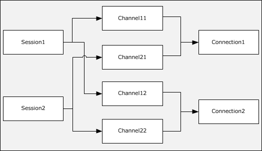{alt="Two sessions using multiple channels" width="5.583333333333333in" height="3.191666666666667in"}

The SMB 3.0.2 dialect introduces the following enhancements:

- Allowing a client to detect asymmetric shares through [**tree connect**](#gt_c65d1989-3473-4fa9-ac45-6522573823e3) response, so that client can optimize its connections to the server, in order to improve availability and performance when accessing such shares.

- Allowing a client to request unbuffered read, write operations.

- Allowing a client to request remote invalidation while performing I/O using RDMA transport.

The SMB 3.1.1 dialect introduces the following enhancements:

- Supporting the negotiation of encryption and integrity algorithms.

- Enhanced protection of negotiation and session establishment.

- Reconnecting with a specified dialect.

- Supporting the compression of messages between client and server.

- Supporting the encryption of RDMA payloads through negotiation of RDMA transforms.

- Supporting QUIC as a transport.

- Supporting mutual authentication and client access control over QUIC.

## Relationship to Other Protocols[]{.indexref entry="Relationship to other protocols"}

The SMB 2 Protocol can be negotiated by using an SMB negotiate, as specified in [\[MS-SMB\]](%5bMS-SMB%5d.pdf#Section_f210069c70864dc2885e861d837df688) section 1.7. After a dialect of the SMB 2 Protocol is selected during negotiation, all messages that are sent on the [**connection**](#gt_866b0055-ceba-4acf-a692-98452943b981) (including the negotiate response) will be SMB 2 Protocol messages, as specified in this document, and no further SMB traffic will be exchanged on the connection.

For authentication, the SMB 2 Protocol relies on Simple and Protected GSS-API Negotiation (SPNEGO), as described in [\[MS-AUTHSOD\]](%5bMS-AUTHSOD%5d.pdf#Section_953d700a57cb4cf7b0c3a64f34581cc9) section 2.1.2.3.1 and specified in [\[RFC4178\]](https://go.microsoft.com/fwlink/?LinkId=90461) and [\[MS-SPNG\]](%5bMS-SPNG%5d.pdf#Section_f377a379c24f4a0fa3eb0d835389e28a), which in turn can rely on the Kerberos Protocol Extensions (as specified in [\[MS-KILE\]](%5bMS-KILE%5d.pdf#Section_2a32282edd484ad9a542609804b02cc9)) or the NT LAN Manager (NTLM) Authentication Protocol (as specified in [\[MS-NLMP\]](%5bMS-NLMP%5d.pdf#Section_b38c36ed28044868a9ff8dd3182128e4)).

The SMB 2 Protocol uses either TCP or NetBIOS over TCP as underlying transports. The SMB 3.x dialect family also supports the use of RDMA as a transport. SMB 3.1.1 dialect also supports QUIC as a transport as specified in [\[RFC9000\]](https://go.microsoft.com/fwlink/?linkid=2296951).

Machines using the SMB 2 Protocol can use the Distributed File System (DFS): Referral Protocol as specified in [\[MS-DFSC\]](%5bMS-DFSC%5d.pdf#Section_3109f4be2dbb42c99b8e0b34f7a2135e) to resolve names from a namespace distributed across many servers and geographies into local names on specific file servers.

DFS clients communicate with DFS servers via referral requests/responses conveyed in SMB2 [**IOCTL**](#gt_09d6bc87-34ed-48e8-b4d4-962e90543462) messages, analogous to a file system client performing control operations on a remote object store via requests/responses conveyed in SMB2 IOCTL messages. The communication between the SMB2 server and the DFS server (or SMB2 server and object store), for the purpose of performing the specified IOCTL operations, is local to the server machine, and takes place via implementation-dependent means.

The Remote Procedure Call Protocol Extensions, as specified in [\[MS-RPCE\]](%5bMS-RPCE%5d.pdf#Section_290c38b192fe422991e64fc376610c15), define an RPC over SMB Protocol or SMB 2 Protocol sequence that can use SMB 2 Protocol named pipes as its underlying transport. The selection of protocol is based on client behavior during negotiation, as specified in section [1.7](#Section_fac3655a7eb54337b0ab244bbcd014e8).

Peer Content Caching and Retrieval framework, or [**Branch Cache**](#gt_a84c1aa6-d21e-4290-8e9f-263ffb674054) as described in [\[MS-PCCRR\]](%5bMS-PCCRR%5d.pdf#Section_6409c1688a3a473cb3336438f067ef56), is designed to reduce bandwidth consumption on branch-office wide area network (WAN) links by having clients request [**Content**](#gt_8eec8cdd-8534-4ad1-97dc-7a765440a804) from distributed caches. Content is uniquely identified by [**Content Information**](#gt_4400f3c3-f4cb-4f27-84ab-ae4b66adf09a) retrieved from the server through SMB 2 IOCTL messages, as specified in sections [3.2.4.20.7](#Section_3741a84245a444f0888c9ab56eceb7e5) and [3.3.5.15.7](#Section_e05145178b61415d88b41194d5a8d0cd). This capability is not supported for the SMB 2.0.2 dialect.

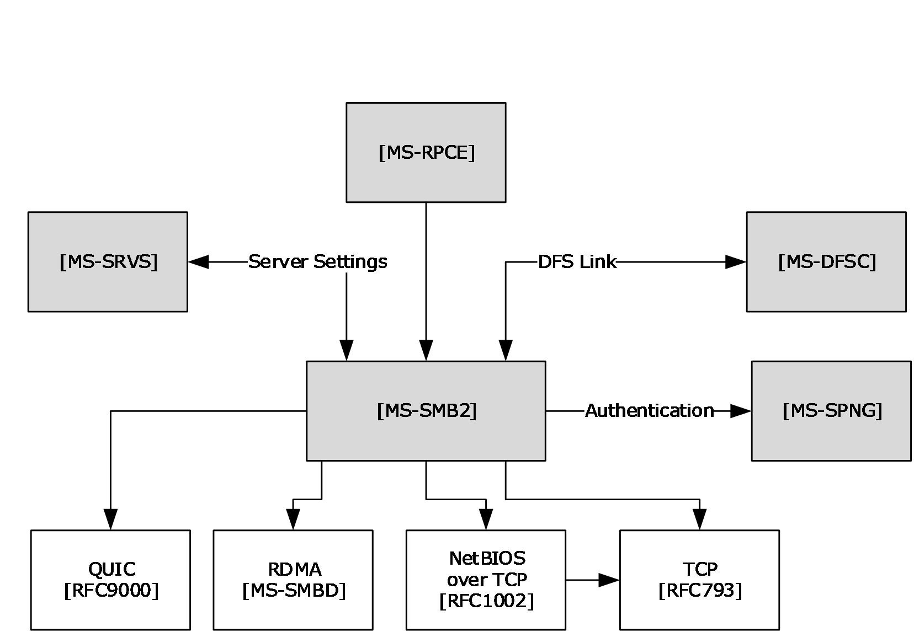{alt="Relationship to other protocols" width="5.739583333333333in" height="3.96875in"}

The diagram shows the following:

- \[MS-RPCE\] uses \[MS-SMB2\] named pipes as its underlying transport.

- \[MS-DFSC\] uses \[MS-SMB2\] as its transport layer.

- [\[MS-SRVS\]](%5bMS-SRVS%5d.pdf#Section_accf23b00f57441c918543041f1b0ee9) calls \[MS-SMB2\] for file server management.

- \[MS-SMB2\] calls \[MS-SPNG\] for authenticating the user.

- \[MS-SMB2\] calls \[MS-DFSC\] to resolve names from a namespace.

- \[MS-SMB2\] calls \[MS-SRVS\] for server management and for synchronizing information on shares, sessions, treeconnects, and file opens. The synchronization mechanism is dependent on the SMB2 server and the server service starting up and terminating at the same time.

- \[MS-SMB2\] uses either TCP, NetBIOS over TCP, QUIC, or RDMA as underlying transports.

## Prerequisites/Preconditions[[]{.indexref entry="Preconditions"}]{.indexref entry="Prerequisites"}

The SMB 2 Protocol assumes the availability of the following resources:

- The SMB2 protocol requires a transport to support reliable, in-order message delivery. Three such transports are used, depending on dialect, as specified in section [2.1](#Section_1dfacde4b5c744948a14a09d3ab4cc83).

- An underlying local resource, such as a [**file system**](#gt_528b06a4-e67c-43b3-a02d-8738858a691d) on the server side, exposing file, named pipe, or printer objects.

- Infrastructure that supports Simple and Protected GSS-API Negotiation (SPNEGO), as specified in [\[RFC4178\]](https://go.microsoft.com/fwlink/?LinkId=90461) and [\[MS-SPNG\]](%5bMS-SPNG%5d.pdf#Section_f377a379c24f4a0fa3eb0d835389e28a), on both the client and the server.

## Applicability Statement[]{.indexref entry="Applicability"}

The SMB 2 Protocol[]{#Appendix_A_Target_1 .anchor}[\<1\>](#Appendix_A_1) is applicable for all scenarios that involve transferring files between client and server. The SMB 2 Protocol is also applicable for inter-process communication between client and server using named pipes.

The SMB 2 Protocol can be more applicable than the SMB Protocol in scenarios that require the following features:

- Higher scalability of the number of files that a client can [**open**](#gt_0d572cce-4683-4b21-945a-7f8035bb6469) simultaneously, as well as the number of shares and user sessions that servers can maintain.

- Quality of Service guarantees from the server for the number of requests that can be outstanding against a server at any specified time.

- Symbolic link support.

- Stronger end-to-end data integrity protection, using the HMAC-SHA256 algorithm. The HMAC-SHA256 is specified in [\[FIPS180-4\]](https://go.microsoft.com/fwlink/?LinkId=298918) and [\[RFC2104\]](https://go.microsoft.com/fwlink/?LinkId=90314).

- Improved throughput across networks that have disparate characteristics.

- Improved resilience to intermittent losses of network connectivity.

- Encryption of client/server traffic when the SMB 3.x dialect family is negotiated.

- Compression of client/server traffic when the SMB 3.1.1 dialect and a compression algorithm is negotiated.

- Encryption of RDMA payloads when the SMB 3.1.1 dialect and RDMA transform is negotiated.

## Versioning and Capability Negotiation[[]{.indexref entry="Capability negotiation"}]{.indexref entry="Versioning"}

This document covers versioning in the following areas:

- Supported Transports: This protocol can be implemented on top of NetBIOS, [**TCP**](#gt_b08d36f6-b5c6-4ce4-8d2d-6f2ab75ea4cb), RDMA, or QUIC as defined in section [2.1](#Section_1dfacde4b5c744948a14a09d3ab4cc83).

- Protocol Versions: This protocol supports several capability bits. These are defined in section [2.2.5](#Section_5a3c2c28d6b048edb917a86b2ca4575f).

- Security and Authentication Methods: The SMB 2 Protocol supports authentication through the use of the Generic Security Service Application Programming Interface (GSS-API), as specified in [\[MS-SPNG\]](%5bMS-SPNG%5d.pdf#Section_f377a379c24f4a0fa3eb0d835389e28a).

> When a suitable authentication is performed, the authenticity and integrity of SMB2 operations are optionally protected by Message Authentication Code (MAC) signatures using cryptographically secure keys. HMAC-SHA256, AES-128-CMAC, or AES-GMAC is used, depending on the negotiated dialect and hash algorithm.
>
> When the SMB 3.x dialect family is negotiated, and when suitable authentication is performed, authenticated encryption and integrity protection are optionally supported through the use of AES-128-CCM or AES-128-GCM, depending on the negotiated dialect and cipher algorithm.
>
> When the SMB 3.1.1 dialect is negotiated, and when suitable authentication is performed, authenticated encryption and integrity protection are optionally supported through the use of AES-256-CCM or AES-256-GCM, depending on the cipher algorithm.

- Capability Negotiation: Though the semantics and the command set for the SMB 2 Protocol closely match the SMB Protocol, as specified in [\[MS-SMB\]](%5bMS-SMB%5d.pdf#Section_f210069c70864dc2885e861d837df688), the wire format for SMB 2 Protocol packets is different from that of the SMB Protocol. For maintaining interoperability between clients and servers in a mixed SMB 2/SMB Protocol environment, the SMB 2 Protocol can be negotiated in one of two ways:

  - By using an SMB negotiate message (as specified in \[MS-SMB\] sections 2.2.4.5.1 and 3.2.4.2.2).

  - By using an [SMB2 NEGOTIATE Request](#Section_e14db7ff763a42638b100c3944f52fc5), as specified in section 2.2.3.

If a client uses an SMB negotiate message to indicate to an SMB 2 Protocol--capable server that it requests to use SMB 2, the server responds with an [SMB2 NEGOTIATE Response](#Section_63abf97c0d0947e288d66bfa552949a5) as specified in section 2.2.4.

A client that maintains a runtime cache for each server with which it communicates, including whether the server is SMB 2 Protocol--capable, would then use an SMB2 NEGOTIATE Request (as specified in section 2.2.3) in future attempts to connect to any server whose cached entry indicates support for the SMB 2 Protocol.

Servers capable of only the SMB 2 Protocol would reject communication with traditional SMB Protocol clients that do not offer \"SMB 2.002\" or \"SMB 2.???\" as a negotiate dialect, and accept communication only from SMB 2 Protocol clients.

There are currently three dialect families of the SMB 2 Protocol:

+----------------+----------------------------+---------------+
| Dialect Family | Dialect Revisions          | Revision Code |
+================+============================+===============+
| SMB 2.0.2      | SMB 2.0.2 dialect revision | 0x0202        |
+----------------+----------------------------+---------------+
| SMB 2.1        | SMB 2.1 dialect revision   | 0x0210        |
+----------------+----------------------------+---------------+
| SMB 3.x        | SMB 3.0 dialect revision   | 0x0300        |
|                |                            |               |
|                | SMB 3.0.2 dialect revision | 0x0302        |
|                |                            |               |
|                | SMB 3.1.1 dialect revision | 0x0311        |
+----------------+----------------------------+---------------+

- Negotiating the SMB 2.0.2 dialect implies support for the requests and responses as specified in this document, except those explicitly marked for the SMB 2.1 or 3.x dialect family.

- Negotiating the SMB 2.1 dialect implies support for the requests and responses as specified in this document and support for the SMB 2.0.2 dialect, except those explicitly marked for the SMB 3.x dialect family.

- Negotiating the SMB 3.0 dialect implies support for the requests and responses as specified in this document and support for the SMB 2.0.2 and SMB 2.1 dialects, except those explicitly marked for the SMB 3.0.2 or SMB 3.1.1 dialect.

- Negotiating the SMB 3.0.2 dialect implies support for the requests and responses as specified in this document and support for the SMB 2.0.2, SMB 2.1, and SMB 3.0 dialects, except those explicitly marked for the SMB 3.1.1 dialect.

- Negotiating the SMB 3.1.1 dialect implies support for the requests and responses as specified in this document and support for the SMB 2.0.2, SMB 2.1, SMB 3.0, and SMB 3.0.2 dialects.

For the rest of the document, unless otherwise specified, the term \'SMB 3.x dialect family\' implies the SMB 3.0, SMB 3.0.2, and SMB 3.1.1 dialect revisions. The following state diagram illustrates dialect negotiation on the server implementing the SMB 2 Protocol dialects. In this diagram, state transitions occur as the SMB_COM_NEGOTIATE, SMB2 NEGOTIATE, and other requests are received from the client. The server uses a per-connection variable, **Connection.NegotiateDialect**, to represent the current state of dialect negotiation between client and server on each transport connection.

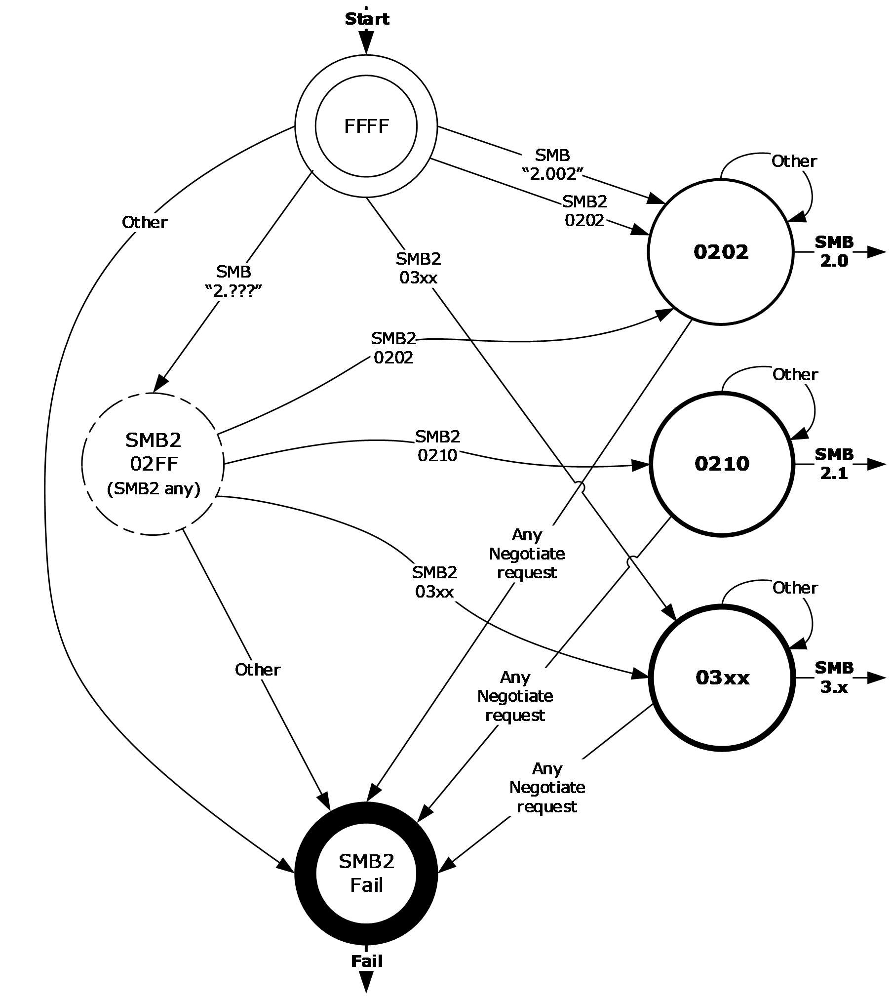{alt="Connection.NegotiateDialect state transitions in an SMB 2 Protocol server" width="6.25in" height="7.020833333333333in"}

## Vendor-Extensible Fields[[[]{.indexref entry="Fields – vendor-extensible"}]{.indexref entry="Fields - vendor-extensible"}]{.indexref entry="Vendor-extensible fields"}

There are no vendor-extensible fields for the Server Message Block (SMB) Version 2 Protocol.

## Standards Assignments[]{.indexref entry="Standards assignments"}

The SMB2 protocol supports Direct TCP Transport and makes use of the following assignments, as specified in section [2.1](#Section_1dfacde4b5c744948a14a09d3ab4cc83).

  -----------------------------------------------------------------------------------------------
  Parameter      TCP port value   Reference
  -------------- ---------------- ---------------------------------------------------------------
  Microsoft-DS   445 (0x01BD)     [\[IANAPORT\]](https://go.microsoft.com/fwlink/?LinkId=89888)

  -----------------------------------------------------------------------------------------------

When the SMB 3.x dialect family is negotiated and an RDMA transport is used, the standards assignment for the protocol specified in [\[MS-SMBD\]](%5bMS-SMBD%5d.pdf#Section_1ca5f4aee5b1493db87df4464325e6e3) is used.

When the SMB 3.1.1 dialect is negotiated, the SMB2 protocol supports QUIC over UDP port 443. The ALPN Identification sequence used to identify the SMB2 protocol over QUIC is 0x73 0x6D 0x62 (\"smb\").

This protocol shares the standards assignments of NetBIOS-over-TCP port, as specified in [\[RFC1001\]](https://go.microsoft.com/fwlink/?LinkId=90260) and [\[RFC1002\]](https://go.microsoft.com/fwlink/?LinkId=90261).

# Messages[]{.indexref entry="Messages:overview"}

The following sections specify how SMB 2 Protocol messages are encapsulated on the wire and common SMB 2 Protocol data types.

## Transport[[[[]{.indexref entry="Transport:messages"}]{.indexref entry="SMB2_Packet_Transport packet"}]{.indexref entry="Transport"}]{.indexref entry="Messages:transport"}

The SMB 2 Protocol supports Direct TCP, NetBIOS over TCP [\[RFC1001\]](https://go.microsoft.com/fwlink/?LinkId=90260) [\[RFC1002\]](https://go.microsoft.com/fwlink/?LinkId=90261), SMB2 Remote Direct Memory Access (RDMA) Transport [\[MS-SMBD\]](%5bMS-SMBD%5d.pdf#Section_1ca5f4aee5b1493db87df4464325e6e3), and QUIC [\[RFC9000\]](https://go.microsoft.com/fwlink/?linkid=2296951) as transports.[]{#Appendix_A_Target_2 .anchor}[\<2\>](#Appendix_A_2) These transports are supported by the various SMB2 dialects as follows:

- All dialects of SMB2 support operation over Direct TCP. The Direct TCP transport packet header has the following structure.

+------------------------+------------------------+------------------------+------------------------+------------------------+------------------------+------------------------+------------------------+------------------------+------------------------+------------------------+------------------------+------------------------+------------------------+------------------------+------------------------+------------------------+------------------------+------------------------+------------------------+------------------------+------------------------+------------------------+------------------------+------------------------+------------------------+------------------------+------------------------+------------------------+------------------------+------------------------+------------------------+
| 0                      | 1                      | 2                      | 3                      | 4                      | 5                      | 6                      | 7                      | 8                      | 9                      | 1                      | 1                      | 2                      | 3                      | 4                      | 5                      | 6                      | 7                      | 8                      | 9                      | 2                      | 1                      | 2                      | 3                      | 4                      | 5                      | 6                      | 7                      | 8                      | 9                      | 3                      | 1                      |
|                        |                        |                        |                        |                        |                        |                        |                        |                        |                        |                        |                        |                        |                        |                        |                        |                        |                        |                        |                        |                        |                        |                        |                        |                        |                        |                        |                        |                        |                        |                        |                        |
|                        |                        |                        |                        |                        |                        |                        |                        |                        |                        | 0                      |                        |                        |                        |                        |                        |                        |                        |                        |                        | 0                      |                        |                        |                        |                        |                        |                        |                        |                        |                        | 0                      |                        |
+========================+========================+========================+========================+========================+========================+========================+========================+========================+========================+========================+========================+========================+========================+========================+========================+========================+========================+========================+========================+========================+========================+========================+========================+========================+========================+========================+========================+========================+========================+========================+========================+
| Zero                                                                                                                                                                                                  | StreamProtocolLength                                                                                                                                                                                                                                                                                                                                                                                                                                                                                                                                                                                                  |
+-------------------------------------------------------------------------------------------------------------------------------------------------------------------------------------------------------+-----------------------------------------------------------------------------------------------------------------------------------------------------------------------------------------------------------------------------------------------------------------------------------------------------------------------------------------------------------------------------------------------------------------------------------------------------------------------------------------------------------------------------------------------------------------------------------------------------------------------+
| SMB2Message (variable)                                                                                                                                                                                                                                                                                                                                                                                                                                                                                                                                                                                                                                                                                                                                                                                                        |
+-------------------------------------------------------------------------------------------------------------------------------------------------------------------------------------------------------------------------------------------------------------------------------------------------------------------------------------------------------------------------------------------------------------------------------------------------------------------------------------------------------------------------------------------------------------------------------------------------------------------------------------------------------------------------------------------------------------------------------------------------------------------------------------------------------------------------------+
| \...                                                                                                                                                                                                                                                                                                                                                                                                                                                                                                                                                                                                                                                                                                                                                                                                                          |
+-------------------------------------------------------------------------------------------------------------------------------------------------------------------------------------------------------------------------------------------------------------------------------------------------------------------------------------------------------------------------------------------------------------------------------------------------------------------------------------------------------------------------------------------------------------------------------------------------------------------------------------------------------------------------------------------------------------------------------------------------------------------------------------------------------------------------------+

**Zero (1 byte):** The first byte of the Direct TCP transport packet header MUST be zero (0x00).

**StreamProtocolLength (3 bytes):** The length, in bytes, of the SMB2Message in [**network byte order**](#gt_502de58c-ffc0-4dda-8fcb-b152b2c31fba). This field does not include the 4-byte Direct TCP transport packet header; rather, it is only the length of the enclosed SMB2Message.

**SMB2Message (variable):** The body of the SMB2 packet. The length of an SMB2Message varies based on the SMB2 command represented by the message.

- SMB2 dialects 2.0.2, 2.1, 3.0, and 3.0.2 allow NetBIOS over TCP \[RFC1001\] \[RFC1002\].

- SMB2 dialects 3.0, 3.0.2, and 3.1.1 allow operation over SMB2 RDMA Transport \[MS-SMBD\].

- SMB2 dialect 3.1.1 allows operation over QUIC transport \[RFC9000\].

The server assigns an implementation-specific name to each transport, as specified in [\[MS-SRVS\]](%5bMS-SRVS%5d.pdf#Section_accf23b00f57441c918543041f1b0ee9) section 2.2.4.96.

The SMB2 Protocol can be negotiated as the result of a multi-protocol exchange as specified in section [3.2.4.2.1](#Section_b956c354c5844216a4d91986100219fe). When the SMB2 Protocol is negotiated on the connection, there is no inheritance of the base SMB Protocol state. The SMB2 Protocol takes over the transport connection that is initially used for negotiation, and thereafter, all protocol flow on that connection MUST be SMB2 Protocol.

## Message Syntax[[]{.indexref entry="Messages:syntax"}]{.indexref entry="Syntax"}

The SMB 2 Protocol is composed of, and driven by, message exchanges between the client and the server in the following categories:

- Protocol negotiation (SMB2 NEGOTIATE)

- User authentication (SMB2 SESSION_SETUP, SMB2 LOGOFF)

- Share access (SMB2 TREE_CONNECT, SMB2 TREE_DISCONNECT)

- File access (SMB2 CREATE, SMB2 CLOSE, SMB2 READ, SMB2 WRITE, SMB2 LOCK, SMB2 IOCTL, SMB2 QUERY_INFO, SMB2 SET_INFO, SMB2 FLUSH, SMB2 CANCEL)

- Directory access (SMB2 QUERY_DIRECTORY, SMB2 CHANGE_NOTIFY)

- Volume access (SMB2 QUERY_INFO, SMB2 SET_INFO)

- Cache coherency (SMB2 OPLOCK_BREAK)

- Simple messaging (SMB2 ECHO)

The SMB 2.1 dialect in the SMB 2 Protocol enhances the following categories of messages in the SMB 2 Protocol:

- Protocol Negotiation (SMB2 NEGOTIATE)

- Share Access (SMB2 TREE_CONNECT)

- File Access (SMB2 CREATE, SMB2 WRITE)

- Cache Coherency (SMB2 OPLOCK_BREAK)

- Hash Retrieval (SMB2 IOCTL)

The SMB 3.x dialect family in the SMB 2 Protocol further enhances the following categories of messages in the SMB 2 Protocol:

- Protocol Negotiation and secure dialect validation (SMB2 NEGOTIATE, SMB2 IOCTL)

- Share Access (SMB2 TREE_CONNECT)

- File Access (SMB2 CREATE, SMB2 READ, SMB2 WRITE)

- Hash Retrieval (SMB2 IOCTL)

- Encryption (SMB2 TRANSFORM_HEADER)

The SMB 3.1.1 dialect in the SMB 2 Protocol further enhances the following categories of messages in the SMB 2 Protocol:

- Compression (SMB2 COMPRESSION_TRANSFORM_HEADER)

This document specifies the messages in the preceding lists.

An SMB 2 Protocol message is the payload packet encapsulated in a transport packet.

All SMB 2 Protocol messages begin with a fixed-length [SMB2 header](#Section_5cd6452260b34f3ea157fe66f1228052) that is described in section 2.2.1. The SMB2 header contains a **Command** field indicating the operation code that is requested by the client or responded to by the server. An SMB 2 Protocol message is of variable length, depending on the **Command** field in the SMB2 header and on whether the SMB 2 Protocol message is a client request or a server response.

Unless otherwise specified, the SMB 2 Protocol does not support case-sensitivity in handling strings (file names, directory names, path names, share names, stream names, etc.).

Unless otherwise specified, multiple-byte fields (16-bit, 32-bit, and 64-bit fields) in an SMB 2 Protocol message MUST be transmitted in little-endian order (least-significant byte first).

Unless otherwise indicated, numeric fields are integers of the specified byte length.

Unless otherwise specified, all textual strings MUST be in [**Unicode**](#gt_c305d0ab-8b94-461a-bd76-13b40cb8c4d8) version 5.0 format, as specified in [\[UNICODE\]](https://go.microsoft.com/fwlink/?LinkId=90550), using the 16-bit Unicode Transformation Format (UTF-16) form of the encoding. Textual strings with separate fields identifying the length of the string MUST NOT be null-terminated unless otherwise specified.

Unless otherwise noted, fields marked as \"unused\" MUST be set to 0 when being sent and MUST be ignored when received. These fields are reserved for future protocol expansion and MUST NOT be used for implementation-specific functionality.

When it is necessary to insert unused padding bytes into a buffer for data alignment purposes, such bytes MUST be set to 0 when being sent and MUST be ignored when received.

When an error occurs, a server MUST send back an SMB 2 Protocol error response as specified in section [2.2.2](#Section_d4da8b67c18047e3ba7ad24214ac4aaa), unless otherwise noted in section [3.3](#Section_461decc561bb48858e2d4ef898f10e6f).

All constants in section 2 and 3 that begin with STATUS\_ have their values defined in [\[MS-ERREF\]](%5bMS-ERREF%5d.pdf#Section_1bc92ddfb79e413cbbaa99a5281a6c90) section 2.3.

Operations executed on a printer share are handled on the server by creating a file, and printing the contents of the file when it is closed. Unless otherwise specified, descriptions in this document concerning protocol behavior for files also apply to printers. More information about processing specific to printers is specified in section [2.2.13](#Section_e8fb45c1a03d44cab7ae47385cfd7997).

### SMB2 Packet Header[[[]{.indexref entry="SMB2 Packet Header"}]{.indexref entry="SMB2 Packet Header message"}]{.indexref entry="Messages:SMB2 Packet Header"}

The SMB2 Packet Header (also called the SMB2 header) is the header of all SMB 2 Protocol requests and responses.

There are two variants of this header:

- ASYNC

- SYNC

If the SMB2_FLAGS_ASYNC_COMMAND bit is set in **Flags**, the header takes the form [SMB2 Packet Header -- ASYNC](#Section_ea4560b790da480382b5344754b92a79) (section 2.2.1.1). This header format is used for responses to requests processed asynchronously by the server, as specified in sections [3.3.4.2](#Section_c1692ece7c6d45c8a0e36b53c0483030), [3.3.4.3](#Section_d39a64beb8f8424db8e5a2cf5257459e), [3.3.4.4](#Section_41295064be3f41dc9aa5f68545f945f0), and [3.2.5.1.5](#Section_a01c6101b94b45c1b7eccbcc94d51138). The [SMB2 CANCEL Request](#Section_91913fc64ec94a83961b370070067e63) MUST use this format for canceling requests that have received an interim response, as specified in sections [3.2.4.24](#Section_51f6a0ced25f4a55991f98f434be4411) and [3.3.5.16](#Section_57bae3d35dd74a5f92cbfc52e2087dad).

If the SMB2_FLAGS_ASYNC_COMMAND bit is not set in **Flags**, the header takes the form [SMB2 Packet Header -- SYNC](#Section_fb188936505048d3b350dc43059638a4) (section 2.2.1.2).

#### SMB2 Packet Header - ASYNC[]{.indexref entry="SMB2_Packet_Header_ASYNC packet"}

If the SMB2_FLAGS_ASYNC_COMMAND bit is set in **Flags**, the header takes the following form.

+------------------+------------------+------------------+------------------+------------------+------------------+------------------+------------------+------------------+------------------+------------------+------------------+------------------+------------------+------------------+------------------+------------------+------------------+------------------+------------------+------------------+------------------+------------------+------------------+------------------+------------------+------------------+------------------+------------------+------------------+------------------+------------------+
| 0                | 1                | 2                | 3                | 4                | 5                | 6                | 7                | 8                | 9                | 1                | 1                | 2                | 3                | 4                | 5                | 6                | 7                | 8                | 9                | 2                | 1                | 2                | 3                | 4                | 5                | 6                | 7                | 8                | 9                | 3                | 1                |
|                  |                  |                  |                  |                  |                  |                  |                  |                  |                  |                  |                  |                  |                  |                  |                  |                  |                  |                  |                  |                  |                  |                  |                  |                  |                  |                  |                  |                  |                  |                  |                  |
|                  |                  |                  |                  |                  |                  |                  |                  |                  |                  | 0                |                  |                  |                  |                  |                  |                  |                  |                  |                  | 0                |                  |                  |                  |                  |                  |                  |                  |                  |                  | 0                |                  |
+==================+==================+==================+==================+==================+==================+==================+==================+==================+==================+==================+==================+==================+==================+==================+==================+==================+==================+==================+==================+==================+==================+==================+==================+==================+==================+==================+==================+==================+==================+==================+==================+
| ProtocolId                                                                                                                                                                                                                                                                                                                                                                                                                                                                                                                                                                                                                    |
+---------------------------------------------------------------------------------------------------------------------------------------------------------------------------------------------------------------------------------------------------------------------------------------------------------------+---------------------------------------------------------------------------------------------------------------------------------------------------------------------------------------------------------------------------------------------------------------------------------------------------------------+
| StructureSize                                                                                                                                                                                                                                                                                                 | CreditCharge                                                                                                                                                                                                                                                                                                  |
+---------------------------------------------------------------------------------------------------------------------------------------------------------------------------------------------------------------------------------------------------------------------------------------------------------------+---------------------------------------------------------------------------------------------------------------------------------------------------------------------------------------------------------------------------------------------------------------------------------------------------------------+
| (ChannelSequence,Reserved)/Status                                                                                                                                                                                                                                                                                                                                                                                                                                                                                                                                                                                             |
+---------------------------------------------------------------------------------------------------------------------------------------------------------------------------------------------------------------------------------------------------------------------------------------------------------------+---------------------------------------------------------------------------------------------------------------------------------------------------------------------------------------------------------------------------------------------------------------------------------------------------------------+
| Command                                                                                                                                                                                                                                                                                                       | CreditRequest/CreditResponse                                                                                                                                                                                                                                                                                  |
+---------------------------------------------------------------------------------------------------------------------------------------------------------------------------------------------------------------------------------------------------------------------------------------------------------------+---------------------------------------------------------------------------------------------------------------------------------------------------------------------------------------------------------------------------------------------------------------------------------------------------------------+
| Flags                                                                                                                                                                                                                                                                                                                                                                                                                                                                                                                                                                                                                         |
+-------------------------------------------------------------------------------------------------------------------------------------------------------------------------------------------------------------------------------------------------------------------------------------------------------------------------------------------------------------------------------------------------------------------------------------------------------------------------------------------------------------------------------------------------------------------------------------------------------------------------------+
| NextCommand                                                                                                                                                                                                                                                                                                                                                                                                                                                                                                                                                                                                                   |
+-------------------------------------------------------------------------------------------------------------------------------------------------------------------------------------------------------------------------------------------------------------------------------------------------------------------------------------------------------------------------------------------------------------------------------------------------------------------------------------------------------------------------------------------------------------------------------------------------------------------------------+
| MessageId                                                                                                                                                                                                                                                                                                                                                                                                                                                                                                                                                                                                                     |
+-------------------------------------------------------------------------------------------------------------------------------------------------------------------------------------------------------------------------------------------------------------------------------------------------------------------------------------------------------------------------------------------------------------------------------------------------------------------------------------------------------------------------------------------------------------------------------------------------------------------------------+
| \...                                                                                                                                                                                                                                                                                                                                                                                                                                                                                                                                                                                                                          |
+-------------------------------------------------------------------------------------------------------------------------------------------------------------------------------------------------------------------------------------------------------------------------------------------------------------------------------------------------------------------------------------------------------------------------------------------------------------------------------------------------------------------------------------------------------------------------------------------------------------------------------+
| AsyncId                                                                                                                                                                                                                                                                                                                                                                                                                                                                                                                                                                                                                       |
+-------------------------------------------------------------------------------------------------------------------------------------------------------------------------------------------------------------------------------------------------------------------------------------------------------------------------------------------------------------------------------------------------------------------------------------------------------------------------------------------------------------------------------------------------------------------------------------------------------------------------------+
| \...                                                                                                                                                                                                                                                                                                                                                                                                                                                                                                                                                                                                                          |
+-------------------------------------------------------------------------------------------------------------------------------------------------------------------------------------------------------------------------------------------------------------------------------------------------------------------------------------------------------------------------------------------------------------------------------------------------------------------------------------------------------------------------------------------------------------------------------------------------------------------------------+
| SessionId                                                                                                                                                                                                                                                                                                                                                                                                                                                                                                                                                                                                                     |
+-------------------------------------------------------------------------------------------------------------------------------------------------------------------------------------------------------------------------------------------------------------------------------------------------------------------------------------------------------------------------------------------------------------------------------------------------------------------------------------------------------------------------------------------------------------------------------------------------------------------------------+
| \...                                                                                                                                                                                                                                                                                                                                                                                                                                                                                                                                                                                                                          |
+-------------------------------------------------------------------------------------------------------------------------------------------------------------------------------------------------------------------------------------------------------------------------------------------------------------------------------------------------------------------------------------------------------------------------------------------------------------------------------------------------------------------------------------------------------------------------------------------------------------------------------+
| Signature                                                                                                                                                                                                                                                                                                                                                                                                                                                                                                                                                                                                                     |
+-------------------------------------------------------------------------------------------------------------------------------------------------------------------------------------------------------------------------------------------------------------------------------------------------------------------------------------------------------------------------------------------------------------------------------------------------------------------------------------------------------------------------------------------------------------------------------------------------------------------------------+
| \...                                                                                                                                                                                                                                                                                                                                                                                                                                                                                                                                                                                                                          |
+-------------------------------------------------------------------------------------------------------------------------------------------------------------------------------------------------------------------------------------------------------------------------------------------------------------------------------------------------------------------------------------------------------------------------------------------------------------------------------------------------------------------------------------------------------------------------------------------------------------------------------+
| \...                                                                                                                                                                                                                                                                                                                                                                                                                                                                                                                                                                                                                          |
+-------------------------------------------------------------------------------------------------------------------------------------------------------------------------------------------------------------------------------------------------------------------------------------------------------------------------------------------------------------------------------------------------------------------------------------------------------------------------------------------------------------------------------------------------------------------------------------------------------------------------------+
| \...                                                                                                                                                                                                                                                                                                                                                                                                                                                                                                                                                                                                                          |
+-------------------------------------------------------------------------------------------------------------------------------------------------------------------------------------------------------------------------------------------------------------------------------------------------------------------------------------------------------------------------------------------------------------------------------------------------------------------------------------------------------------------------------------------------------------------------------------------------------------------------------+

**ProtocolId (4 bytes):** The protocol identifier. The value MUST be set to 0x424D53FE, also represented as (in network order) 0xFE, \'S\', \'M\', and \'B\'.

**StructureSize (2 bytes):** MUST be set to 64, which is the size, in bytes, of the [SMB2 header](#Section_5cd6452260b34f3ea157fe66f1228052) structure.

**CreditCharge (2 bytes):** In the SMB 2.0.2 dialect, this field MUST NOT be used and MUST be reserved. The sender MUST set this to 0, and the receiver MUST ignore it. In all other dialects, this field indicates the number of credits that this request consumes.

**(ChannelSequence,Reserved)/Status (4 bytes):** In a request, this field is interpreted in different ways depending on the SMB2 dialect.

In the SMB 3.x dialect family, this field is interpreted as the **ChannelSequence** field followed by the **Reserved** field in a request.

**ChannelSequence (2 bytes)**: This field is an indication to the server about the client\'s **Channel** change.

**Reserved (2 bytes)**: This field SHOULD be set to zero and the server MUST ignore it on receipt. 

In the SMB 2.0.2 and SMB 2.1 dialects, this field is interpreted as the **Status** field in a request.

**Status (4 bytes)**: The client MUST set this field to 0 and the server MUST ignore it on receipt.

In all SMB dialects for a response this field is interpreted as the **Status** field. This field can be set to any value. For a list of valid status codes, see [\[MS-ERREF\]](%5bMS-ERREF%5d.pdf#Section_1bc92ddfb79e413cbbaa99a5281a6c90) section 2.3.

**Command (2 bytes):** The command code of this packet. This field MUST contain one of the following valid commands:

  ---------------------------------------------
  Name                                 Value
  ------------------------------------ --------
  SMB2 NEGOTIATE                       0x0000

  SMB2 SESSION_SETUP                   0x0001

  SMB2 LOGOFF                          0x0002

  SMB2 TREE_CONNECT                    0x0003

  SMB2 TREE_DISCONNECT                 0x0004

  SMB2 CREATE                          0x0005

  SMB2 CLOSE                           0x0006

  SMB2 FLUSH                           0x0007

  SMB2 READ                            0x0008

  SMB2 WRITE                           0x0009

  SMB2 LOCK                            0x000A

  SMB2 IOCTL                           0x000B

  SMB2 CANCEL                          0x000C

  SMB2 ECHO                            0x000D

  SMB2 QUERY_DIRECTORY                 0x000E

  SMB2 CHANGE_NOTIFY                   0x000F

  SMB2 QUERY_INFO                      0x0010

  SMB2 SET_INFO                        0x0011

  SMB2 OPLOCK_BREAK                    0x0012

  SMB2 SERVER_TO_CLIENT_NOTIFICATION   0x0013
  ---------------------------------------------

**CreditRequest/CreditResponse (2 bytes):** On a request, this field indicates the number of [**credits**](#gt_99b28556-d321-4a40-a062-65b5a49870e3) the client is requesting. On a response, it indicates the number of credits granted to the client.

**Flags (4 bytes):** A flags field, which indicates how to process the operation. This field MUST be constructed using the following values:

+-------------------------------+-----------------------------------------------------------------------------------------------------------------------------------------------------------------------------------------------------------------------------------------------------------------------------------------------+
| Value                         | Meaning                                                                                                                                                                                                                                                                                       |
+===============================+===============================================================================================================================================================================================================================================================================================+
| SMB2_FLAGS_SERVER_TO_REDIR    | When set, indicates the message is a response rather than a request. This MUST be set on responses sent from the server to the client, and MUST NOT be set on requests sent from the client to the server.                                                                                    |
|                               |                                                                                                                                                                                                                                                                                               |
| 0x00000001                    |                                                                                                                                                                                                                                                                                               |
+-------------------------------+-----------------------------------------------------------------------------------------------------------------------------------------------------------------------------------------------------------------------------------------------------------------------------------------------+
| SMB2_FLAGS_ASYNC_COMMAND      | When set, indicates that this is an ASYNC SMB2 header. Always set for headers of the form described in this section.                                                                                                                                                                          |
|                               |                                                                                                                                                                                                                                                                                               |
| 0x00000002                    |                                                                                                                                                                                                                                                                                               |
+-------------------------------+-----------------------------------------------------------------------------------------------------------------------------------------------------------------------------------------------------------------------------------------------------------------------------------------------+
| SMB2_FLAGS_RELATED_OPERATIONS | When set in an SMB2 request, indicates that this request is a related operation in a compounded request chain. The use of this flag in an SMB2 request is as specified in section [3.2.4.1.4](#Section_fa6687f599d44c9bba2ea770310225e0).                                                     |
|                               |                                                                                                                                                                                                                                                                                               |
| 0x00000004                    | When set in an SMB2 compound response, indicates that the request corresponding to this response was part of a related operation in a compounded request chain. The use of this flag in an SMB2 response is as specified in section [3.3.5.2.7.2](#Section_46dd418262d34e309fe5e2ec124edca1). |
+-------------------------------+-----------------------------------------------------------------------------------------------------------------------------------------------------------------------------------------------------------------------------------------------------------------------------------------------+
| SMB2_FLAGS_SIGNED             | When set, indicates that this packet has been signed. The use of this flag is as specified in section [3.1.5.1](#Section_5b570c0b085443248fb5d410692dde3e).                                                                                                                                   |
|                               |                                                                                                                                                                                                                                                                                               |
| 0x00000008                    |                                                                                                                                                                                                                                                                                               |
+-------------------------------+-----------------------------------------------------------------------------------------------------------------------------------------------------------------------------------------------------------------------------------------------------------------------------------------------+
| SMB2_FLAGS_PRIORITY_MASK      | This flag is only valid for the SMB 3.1.1 dialect. It is a mask for the requested I/O priority of the request, and it MUST be a value in the range 0 to 7.                                                                                                                                    |
|                               |                                                                                                                                                                                                                                                                                               |
| 0x00000070                    |                                                                                                                                                                                                                                                                                               |
+-------------------------------+-----------------------------------------------------------------------------------------------------------------------------------------------------------------------------------------------------------------------------------------------------------------------------------------------+
| SMB2_FLAGS_DFS_OPERATIONS     | When set, indicates that this command is a [**Distributed File System (DFS)**](#gt_0b8086c9-d025-45b8-bf09-6b5eca72713e) operation. The use of this flag is as specified in section [3.3.5.9](#Section_8c61e928924244ed96a098d1032d0d39).                                                     |
|                               |                                                                                                                                                                                                                                                                                               |
| 0x10000000                    |                                                                                                                                                                                                                                                                                               |
+-------------------------------+-----------------------------------------------------------------------------------------------------------------------------------------------------------------------------------------------------------------------------------------------------------------------------------------------+
| SMB2_FLAGS_REPLAY_OPERATION   | This flag is only valid for the SMB 3.x dialect family. When set, it indicates that this command is a replay operation.                                                                                                                                                                       |
|                               |                                                                                                                                                                                                                                                                                               |
| 0x20000000                    | The client MUST ignore this bit on receipt.                                                                                                                                                                                                                                                   |
+-------------------------------+-----------------------------------------------------------------------------------------------------------------------------------------------------------------------------------------------------------------------------------------------------------------------------------------------+

**NextCommand (4 bytes):** For a compounded request and response, this field MUST be set to the offset, in bytes, from the beginning of this SMB2 header to the start of the subsequent 8-byte aligned SMB2 header. If this is not a compounded request or response, or this is the last header in a compounded request or response, this value MUST be 0.

**MessageId (8 bytes):** A value that identifies a message request and response uniquely across all messages that are sent on the same SMB 2 Protocol transport [**connection**](#gt_866b0055-ceba-4acf-a692-98452943b981).

**AsyncId (8 bytes):** A unique identification number that is created by the server to handle operations asynchronously, as specified in section [3.3.4.2](#Section_c1692ece7c6d45c8a0e36b53c0483030).

**SessionId (8 bytes):** Uniquely identifies the established [**session**](#gt_0cd96b80-a737-4f06-bca4-cf9efb449d12) for the command. This field MUST be set to 0 for an SMB2 NEGOTIATE Request (section [2.2.3](#Section_e14db7ff763a42638b100c3944f52fc5)) and for an SMB2 NEGOTIATE Response (section [2.2.4](#Section_63abf97c0d0947e288d66bfa552949a5)).

**Signature (16 bytes):** The 16-byte signature of the message, if SMB2_FLAGS_SIGNED is set in the **Flags** field of the SMB2 header and the message is not encrypted. If the message is not signed, this field MUST be 0.

#### SMB2 Packet Header - SYNC[]{.indexref entry="SMB2_Packet_Header_SYNC packet"}

If the SMB2_FLAGS_ASYNC_COMMAND bit is not set in **Flags**, the header takes the following form.

+------------------+------------------+------------------+------------------+------------------+------------------+------------------+------------------+------------------+------------------+------------------+------------------+------------------+------------------+------------------+------------------+------------------+------------------+------------------+------------------+------------------+------------------+------------------+------------------+------------------+------------------+------------------+------------------+------------------+------------------+------------------+------------------+
| 0                | 1                | 2                | 3                | 4                | 5                | 6                | 7                | 8                | 9                | 1                | 1                | 2                | 3                | 4                | 5                | 6                | 7                | 8                | 9                | 2                | 1                | 2                | 3                | 4                | 5                | 6                | 7                | 8                | 9                | 3                | 1                |
|                  |                  |                  |                  |                  |                  |                  |                  |                  |                  |                  |                  |                  |                  |                  |                  |                  |                  |                  |                  |                  |                  |                  |                  |                  |                  |                  |                  |                  |                  |                  |                  |
|                  |                  |                  |                  |                  |                  |                  |                  |                  |                  | 0                |                  |                  |                  |                  |                  |                  |                  |                  |                  | 0                |                  |                  |                  |                  |                  |                  |                  |                  |                  | 0                |                  |
+==================+==================+==================+==================+==================+==================+==================+==================+==================+==================+==================+==================+==================+==================+==================+==================+==================+==================+==================+==================+==================+==================+==================+==================+==================+==================+==================+==================+==================+==================+==================+==================+
| ProtocolId                                                                                                                                                                                                                                                                                                                                                                                                                                                                                                                                                                                                                    |
+---------------------------------------------------------------------------------------------------------------------------------------------------------------------------------------------------------------------------------------------------------------------------------------------------------------+---------------------------------------------------------------------------------------------------------------------------------------------------------------------------------------------------------------------------------------------------------------------------------------------------------------+
| StructureSize                                                                                                                                                                                                                                                                                                 | CreditCharge                                                                                                                                                                                                                                                                                                  |
+---------------------------------------------------------------------------------------------------------------------------------------------------------------------------------------------------------------------------------------------------------------------------------------------------------------+---------------------------------------------------------------------------------------------------------------------------------------------------------------------------------------------------------------------------------------------------------------------------------------------------------------+
| (ChannelSequence,Reserved)/Status                                                                                                                                                                                                                                                                                                                                                                                                                                                                                                                                                                                             |
+---------------------------------------------------------------------------------------------------------------------------------------------------------------------------------------------------------------------------------------------------------------------------------------------------------------+---------------------------------------------------------------------------------------------------------------------------------------------------------------------------------------------------------------------------------------------------------------------------------------------------------------+
| Command                                                                                                                                                                                                                                                                                                       | CreditRequest/CreditResponse                                                                                                                                                                                                                                                                                  |
+---------------------------------------------------------------------------------------------------------------------------------------------------------------------------------------------------------------------------------------------------------------------------------------------------------------+---------------------------------------------------------------------------------------------------------------------------------------------------------------------------------------------------------------------------------------------------------------------------------------------------------------+
| Flags                                                                                                                                                                                                                                                                                                                                                                                                                                                                                                                                                                                                                         |
+-------------------------------------------------------------------------------------------------------------------------------------------------------------------------------------------------------------------------------------------------------------------------------------------------------------------------------------------------------------------------------------------------------------------------------------------------------------------------------------------------------------------------------------------------------------------------------------------------------------------------------+
| NextCommand                                                                                                                                                                                                                                                                                                                                                                                                                                                                                                                                                                                                                   |
+-------------------------------------------------------------------------------------------------------------------------------------------------------------------------------------------------------------------------------------------------------------------------------------------------------------------------------------------------------------------------------------------------------------------------------------------------------------------------------------------------------------------------------------------------------------------------------------------------------------------------------+
| MessageId                                                                                                                                                                                                                                                                                                                                                                                                                                                                                                                                                                                                                     |
+-------------------------------------------------------------------------------------------------------------------------------------------------------------------------------------------------------------------------------------------------------------------------------------------------------------------------------------------------------------------------------------------------------------------------------------------------------------------------------------------------------------------------------------------------------------------------------------------------------------------------------+
| \...                                                                                                                                                                                                                                                                                                                                                                                                                                                                                                                                                                                                                          |
+-------------------------------------------------------------------------------------------------------------------------------------------------------------------------------------------------------------------------------------------------------------------------------------------------------------------------------------------------------------------------------------------------------------------------------------------------------------------------------------------------------------------------------------------------------------------------------------------------------------------------------+
| Reserved                                                                                                                                                                                                                                                                                                                                                                                                                                                                                                                                                                                                                      |
+-------------------------------------------------------------------------------------------------------------------------------------------------------------------------------------------------------------------------------------------------------------------------------------------------------------------------------------------------------------------------------------------------------------------------------------------------------------------------------------------------------------------------------------------------------------------------------------------------------------------------------+
| TreeId                                                                                                                                                                                                                                                                                                                                                                                                                                                                                                                                                                                                                        |
+-------------------------------------------------------------------------------------------------------------------------------------------------------------------------------------------------------------------------------------------------------------------------------------------------------------------------------------------------------------------------------------------------------------------------------------------------------------------------------------------------------------------------------------------------------------------------------------------------------------------------------+
| SessionId                                                                                                                                                                                                                                                                                                                                                                                                                                                                                                                                                                                                                     |
+-------------------------------------------------------------------------------------------------------------------------------------------------------------------------------------------------------------------------------------------------------------------------------------------------------------------------------------------------------------------------------------------------------------------------------------------------------------------------------------------------------------------------------------------------------------------------------------------------------------------------------+
| \...                                                                                                                                                                                                                                                                                                                                                                                                                                                                                                                                                                                                                          |
+-------------------------------------------------------------------------------------------------------------------------------------------------------------------------------------------------------------------------------------------------------------------------------------------------------------------------------------------------------------------------------------------------------------------------------------------------------------------------------------------------------------------------------------------------------------------------------------------------------------------------------+
| Signature                                                                                                                                                                                                                                                                                                                                                                                                                                                                                                                                                                                                                     |
+-------------------------------------------------------------------------------------------------------------------------------------------------------------------------------------------------------------------------------------------------------------------------------------------------------------------------------------------------------------------------------------------------------------------------------------------------------------------------------------------------------------------------------------------------------------------------------------------------------------------------------+
| \...                                                                                                                                                                                                                                                                                                                                                                                                                                                                                                                                                                                                                          |
+-------------------------------------------------------------------------------------------------------------------------------------------------------------------------------------------------------------------------------------------------------------------------------------------------------------------------------------------------------------------------------------------------------------------------------------------------------------------------------------------------------------------------------------------------------------------------------------------------------------------------------+
| \...                                                                                                                                                                                                                                                                                                                                                                                                                                                                                                                                                                                                                          |
+-------------------------------------------------------------------------------------------------------------------------------------------------------------------------------------------------------------------------------------------------------------------------------------------------------------------------------------------------------------------------------------------------------------------------------------------------------------------------------------------------------------------------------------------------------------------------------------------------------------------------------+
| \...                                                                                                                                                                                                                                                                                                                                                                                                                                                                                                                                                                                                                          |
+-------------------------------------------------------------------------------------------------------------------------------------------------------------------------------------------------------------------------------------------------------------------------------------------------------------------------------------------------------------------------------------------------------------------------------------------------------------------------------------------------------------------------------------------------------------------------------------------------------------------------------+

**ProtocolId (4 bytes):** The protocol identifier. The value MUST be set to 0x424D53FE, also represented as (in network order) 0xFE, \'S\', \'M\', and \'B\'.

**StructureSize (2 bytes):** This MUST be set to 64, which is the size, in bytes, of the [SMB2 header](#Section_5cd6452260b34f3ea157fe66f1228052) structure.

**CreditCharge (2 bytes):** In the SMB 2.0.2 dialect, this field MUST NOT be used and MUST be reserved. The sender MUST set this to 0, and the receiver MUST ignore it. In all other dialects, this field indicates the number of [**credits**](#gt_99b28556-d321-4a40-a062-65b5a49870e3) that this request consumes.

**(ChannelSequence,Reserved)/Status (4 bytes):** In a request, this field is interpreted in different ways depending on the SMB2 dialect.

In the SMB 3.x dialect family, this field is interpreted as the **ChannelSequence** field followed by the **Reserved** field in a request.

**ChannelSequence (2 bytes)**: This field is an indication to the server about the client\'s **Channel** change.

**Reserved (2 bytes)**: This field SHOULD be set to zero and the server MUST ignore it on receipt. 

In the SMB 2.0.2 and SMB 2.1 dialects, this field is interpreted as the **Status** field in a request.

**Status (4 bytes)**: The client MUST set this field to 0 and the server MUST ignore it on receipt.

In all SMB dialects for a response this field is interpreted as the **Status** field. This field can be set to any value. For a list of valid status codes, see [\[MS-ERREF\]](%5bMS-ERREF%5d.pdf#Section_1bc92ddfb79e413cbbaa99a5281a6c90) section 2.3.

**Command (2 bytes):** The command code of this packet. This field MUST contain one of the following valid commands.

  -------------------------------
  Name                   Value
  ---------------------- --------
  SMB2 NEGOTIATE         0x0000

  SMB2 SESSION_SETUP     0x0001

  SMB2 LOGOFF            0x0002

  SMB2 TREE_CONNECT      0x0003

  SMB2 TREE_DISCONNECT   0x0004

  SMB2 CREATE            0x0005

  SMB2 CLOSE             0x0006

  SMB2 FLUSH             0x0007

  SMB2 READ              0x0008

  SMB2 WRITE             0x0009

  SMB2 LOCK              0x000A

  SMB2 IOCTL             0x000B

  SMB2 CANCEL            0x000C

  SMB2 ECHO              0x000D

  SMB2 QUERY_DIRECTORY   0x000E

  SMB2 CHANGE_NOTIFY     0x000F

  SMB2 QUERY_INFO        0x0010

  SMB2 SET_INFO          0x0011

  SMB2 OPLOCK_BREAK      0x0012
  -------------------------------

**CreditRequest/CreditResponse (2 bytes):** On a request, this field indicates the number of credits the client is requesting. On a response, it indicates the number of credits granted to the client.

**Flags (4 bytes):** A **Flags** field indicates how to process the operation. This field MUST be constructed using the following values:

+-------------------------------+-----------------------------------------------------------------------------------------------------------------------------------------------------------------------------------------------------------------------------------------------------------------------------------------------+
| Value                         | Meaning                                                                                                                                                                                                                                                                                       |
+===============================+===============================================================================================================================================================================================================================================================================================+
| SMB2_FLAGS_SERVER_TO_REDIR    | When set, indicates the message is a response, rather than a request. This MUST be set on responses sent from the server to the client and MUST NOT be set on requests sent from the client to the server.                                                                                    |
|                               |                                                                                                                                                                                                                                                                                               |
| 0x00000001                    |                                                                                                                                                                                                                                                                                               |
+-------------------------------+-----------------------------------------------------------------------------------------------------------------------------------------------------------------------------------------------------------------------------------------------------------------------------------------------+
| SMB2_FLAGS_ASYNC_COMMAND      | When set, indicates that this is an ASYNC SMB2 header. This flag MUST NOT be set when using the SYNC SMB2 header.                                                                                                                                                                             |
|                               |                                                                                                                                                                                                                                                                                               |
| 0x00000002                    |                                                                                                                                                                                                                                                                                               |
+-------------------------------+-----------------------------------------------------------------------------------------------------------------------------------------------------------------------------------------------------------------------------------------------------------------------------------------------+
| SMB2_FLAGS_RELATED_OPERATIONS | When set in an SMB2 request, indicates that this request is a related operation in a compounded request chain. The use of this flag in an SMB2 request is as specified in section [3.2.4.1.4](#Section_fa6687f599d44c9bba2ea770310225e0).                                                     |
|                               |                                                                                                                                                                                                                                                                                               |
| 0x00000004                    | When set in an SMB2 compound response, indicates that the request corresponding to this response was part of a related operation in a compounded request chain. The use of this flag in an SMB2 response is as specified in section [3.3.5.2.7.2](#Section_46dd418262d34e309fe5e2ec124edca1). |
+-------------------------------+-----------------------------------------------------------------------------------------------------------------------------------------------------------------------------------------------------------------------------------------------------------------------------------------------+
| SMB2_FLAGS_SIGNED             | When set, indicates that this packet has been signed. The use of this flag is as specified in section [3.1.5.1](#Section_5b570c0b085443248fb5d410692dde3e).                                                                                                                                   |
|                               |                                                                                                                                                                                                                                                                                               |
| 0x00000008                    |                                                                                                                                                                                                                                                                                               |
+-------------------------------+-----------------------------------------------------------------------------------------------------------------------------------------------------------------------------------------------------------------------------------------------------------------------------------------------+
| SMB2_FLAGS_PRIORITY_MASK      | This flag is only valid for the SMB 3.1.1 dialect. It is a mask for the requested I/O priority of the request, and it MUST be a value in the range 0 to 7.                                                                                                                                    |
|                               |                                                                                                                                                                                                                                                                                               |
| 0x00000070                    |                                                                                                                                                                                                                                                                                               |
+-------------------------------+-----------------------------------------------------------------------------------------------------------------------------------------------------------------------------------------------------------------------------------------------------------------------------------------------+
| SMB2_FLAGS_DFS_OPERATIONS     | When set, indicates that this command is a [**DFS**](#gt_0b8086c9-d025-45b8-bf09-6b5eca72713e) operation. The use of this flag is as specified in section [3.3.5.9](#Section_8c61e928924244ed96a098d1032d0d39).                                                                               |
|                               |                                                                                                                                                                                                                                                                                               |
| 0x10000000                    |                                                                                                                                                                                                                                                                                               |
+-------------------------------+-----------------------------------------------------------------------------------------------------------------------------------------------------------------------------------------------------------------------------------------------------------------------------------------------+
| SMB2_FLAGS_REPLAY_OPERATION   | This flag is only valid for the SMB 3.x dialect family. When set, it indicates that this command is a replay operation.                                                                                                                                                                       |
|                               |                                                                                                                                                                                                                                                                                               |
| 0x20000000                    | The client MUST ignore this bit on receipt.                                                                                                                                                                                                                                                   |
+-------------------------------+-----------------------------------------------------------------------------------------------------------------------------------------------------------------------------------------------------------------------------------------------------------------------------------------------+

**NextCommand (4 bytes):** For a [**compounded request**](#gt_3d5b08e2-38da-4cee-93d8-7e9a32f14670) and response, this field MUST be set to the offset, in bytes, from the beginning of this SMB2 header to the start of the subsequent 8-byte aligned SMB2 header. If this is not a compounded request or response, or this is the last header in a compounded request or response, this value MUST be 0.

**MessageId (8 bytes):** A value that identifies a message request and response uniquely across all messages that are sent on the same SMB 2 Protocol transport [**connection**](#gt_866b0055-ceba-4acf-a692-98452943b981).

**Reserved (4 bytes):** The client SHOULD[]{#Appendix_A_Target_3 .anchor}[\<3\>](#Appendix_A_3) set this field to 0. The server MAY[]{#Appendix_A_Target_4 .anchor}[\<4\>](#Appendix_A_4) ignore this field on receipt.

**TreeId (4 bytes):** Uniquely identifies the [**tree connect**](#gt_c65d1989-3473-4fa9-ac45-6522573823e3) for the command. This MUST be 0 for the [SMB2 TREE_CONNECT Request](#Section_832d213022e84afbaafdb30bb0901798). The **TreeId** can be any unsigned 32-bit integer that is received from a previous [SMB2 TREE_CONNECT Response](#Section_dd34e26ca75e47faaab26efc27502e96). **TreeId** SHOULD be set to 0 for the following commands:

- [SMB2 NEGOTIATE Request](#Section_e14db7ff763a42638b100c3944f52fc5)

- [SMB2 NEGOTIATE Response](#Section_63abf97c0d0947e288d66bfa552949a5)

- [SMB2 SESSION_SETUP Request](#Section_5a3c2c28d6b048edb917a86b2ca4575f)

- [SMB2 SESSION_SETUP Response](#Section_0324190fa31b46669fa95c624273a694)

- [SMB2 LOGOFF Request](#Section_abdc4ea952df480e9a3634f104797d2c)

- [SMB2 LOGOFF Response](#Section_7539feb46fbb499681ac06863bb1a89e)

- [SMB2 ECHO Request](#Section_d939504d57e24c0e8ad51678b6fccca1)

- [SMB2 ECHO Response](#Section_2abe9b3cc5ab417fbcc39ab51f2fce35)

- [SMB2 CANCEL Request](#Section_91913fc64ec94a83961b370070067e63)

**SessionId (8 bytes):** Uniquely identifies the established [**session**](#gt_0cd96b80-a737-4f06-bca4-cf9efb449d12) for the command. This field MUST be set to 0 for an SMB2 NEGOTIATE Request (section 2.2.3) and for an SMB2 NEGOTIATE Response (section 2.2.4).

**Signature (16 bytes):** The 16-byte signature of the message, if SMB2_FLAGS_SIGNED is set in the **Flags** field of the SMB2 header and the message is not encrypted. If the message is not signed, this field MUST be 0.

### SMB2 ERROR Response[[[]{.indexref entry="SMB2_ERROR_Response packet"}]{.indexref entry="SMB2 ERROR Response message"}]{.indexref entry="Messages:SMB2 ERROR Response"}

The SMB2 ERROR Response packet is sent by the server to respond to a request that has failed or encountered an error. This response is composed of an [SMB2 Packet Header](#Section_5cd6452260b34f3ea157fe66f1228052) (section 2.2.1) followed by this response structure.

+----------------------+----------------------+----------------------+----------------------+----------------------+----------------------+----------------------+----------------------+----------------------+----------------------+----------------------+----------------------+----------------------+----------------------+----------------------+----------------------+----------------------+----------------------+----------------------+----------------------+----------------------+----------------------+----------------------+----------------------+----------------------+----------------------+----------------------+----------------------+----------------------+----------------------+----------------------+----------------------+
| 0                    | 1                    | 2                    | 3                    | 4                    | 5                    | 6                    | 7                    | 8                    | 9                    | 1                    | 1                    | 2                    | 3                    | 4                    | 5                    | 6                    | 7                    | 8                    | 9                    | 2                    | 1                    | 2                    | 3                    | 4                    | 5                    | 6                    | 7                    | 8                    | 9                    | 3                    | 1                    |
|                      |                      |                      |                      |                      |                      |                      |                      |                      |                      |                      |                      |                      |                      |                      |                      |                      |                      |                      |                      |                      |                      |                      |                      |                      |                      |                      |                      |                      |                      |                      |                      |
|                      |                      |                      |                      |                      |                      |                      |                      |                      |                      | 0                    |                      |                      |                      |                      |                      |                      |                      |                      |                      | 0                    |                      |                      |                      |                      |                      |                      |                      |                      |                      | 0                    |                      |
+======================+======================+======================+======================+======================+======================+======================+======================+======================+======================+======================+======================+======================+======================+======================+======================+======================+======================+======================+======================+======================+======================+======================+======================+======================+======================+======================+======================+======================+======================+======================+======================+
| StructureSize                                                                                                                                                                                                                                                                                                                                                                 | ErrorContextCount                                                                                                                                                                     | Reserved                                                                                                                                                                              |
+-------------------------------------------------------------------------------------------------------------------------------------------------------------------------------------------------------------------------------------------------------------------------------------------------------------------------------------------------------------------------------+---------------------------------------------------------------------------------------------------------------------------------------------------------------------------------------+---------------------------------------------------------------------------------------------------------------------------------------------------------------------------------------+
| ByteCount                                                                                                                                                                                                                                                                                                                                                                                                                                                                                                                                                                                                                                                                                                                                                     |
+---------------------------------------------------------------------------------------------------------------------------------------------------------------------------------------------------------------------------------------------------------------------------------------------------------------------------------------------------------------------------------------------------------------------------------------------------------------------------------------------------------------------------------------------------------------------------------------------------------------------------------------------------------------------------------------------------------------------------------------------------------------+
| ErrorData (variable)                                                                                                                                                                                                                                                                                                                                                                                                                                                                                                                                                                                                                                                                                                                                          |
+---------------------------------------------------------------------------------------------------------------------------------------------------------------------------------------------------------------------------------------------------------------------------------------------------------------------------------------------------------------------------------------------------------------------------------------------------------------------------------------------------------------------------------------------------------------------------------------------------------------------------------------------------------------------------------------------------------------------------------------------------------------+
| \...                                                                                                                                                                                                                                                                                                                                                                                                                                                                                                                                                                                                                                                                                                                                                          |
+---------------------------------------------------------------------------------------------------------------------------------------------------------------------------------------------------------------------------------------------------------------------------------------------------------------------------------------------------------------------------------------------------------------------------------------------------------------------------------------------------------------------------------------------------------------------------------------------------------------------------------------------------------------------------------------------------------------------------------------------------------------+

**StructureSize (2 bytes):** The server MUST set this field to 9, indicating the size of the response structure, not including the header. The server MUST set it to this value regardless of how long **ErrorData**\[\] actually is in the response being sent.

**ErrorContextCount (1 byte)**: This field MUST be set to 0 for SMB dialects other than 3.1.1. For the SMB dialect 3.1.1, if this field is nonzero, the **ErrorData** field MUST be formatted as a variable-length array of **SMB2 ERROR Context** structures containing **ErrorContextCount** entries.

**Reserved (1 byte):** This field MUST NOT be used and MUST be reserved. The server MUST set this to 0, and the client MUST ignore it on receipt.

**ByteCount (4 bytes):** The number of bytes of data contained in **ErrorData**\[\].

**ErrorData (variable):** A variable-length data field that contains extended error information. If the **ErrorContextCount** field in the response is nonzero, this field MUST be formatted as a variable-length array of **SMB2 ERROR Context** structures as specified in section [2.2.2.1](#Section_9ff8837cc4f7452b92728818a119dae9). Each **SMB2 ERROR Context** MUST start at an 8-byte aligned boundary relative to the start of the **SMB2 ERROR** Response. Otherwise, it SHOULD[]{#Appendix_A_Target_5 .anchor}[\<5\>](#Appendix_A_5) be formatted as specified in section [2.2.2.2](#Section_7722d25dcec74baf83439ef84f48a52c).

#### SMB2 ERROR Context Response

For the SMB dialect 3.1.1, the servers format the error data as an array of **SMB2 ERROR Context** structures. Each error context is a variable-length structure that contains an identifier for the error context followed by the error data.

+-----------------------------+-----------------------------+-----------------------------+-----------------------------+-----------------------------+-----------------------------+-----------------------------+-----------------------------+-----------------------------+-----------------------------+-----------------------------+-----------------------------+-----------------------------+-----------------------------+-----------------------------+-----------------------------+-----------------------------+-----------------------------+-----------------------------+-----------------------------+-----------------------------+-----------------------------+-----------------------------+-----------------------------+-----------------------------+-----------------------------+-----------------------------+-----------------------------+-----------------------------+-----------------------------+-----------------------------+-----------------------------+
| 0                           | 1                           | 2                           | 3                           | 4                           | 5                           | 6                           | 7                           | 8                           | 9                           | 1                           | 1                           | 2                           | 3                           | 4                           | 5                           | 6                           | 7                           | 8                           | 9                           | 2                           | 1                           | 2                           | 3                           | 4                           | 5                           | 6                           | 7                           | 8                           | 9                           | 3                           | 1                           |
|                             |                             |                             |                             |                             |                             |                             |                             |                             |                             |                             |                             |                             |                             |                             |                             |                             |                             |                             |                             |                             |                             |                             |                             |                             |                             |                             |                             |                             |                             |                             |                             |
|                             |                             |                             |                             |                             |                             |                             |                             |                             |                             | 0                           |                             |                             |                             |                             |                             |                             |                             |                             |                             | 0                           |                             |                             |                             |                             |                             |                             |                             |                             |                             | 0                           |                             |
+=============================+=============================+=============================+=============================+=============================+=============================+=============================+=============================+=============================+=============================+=============================+=============================+=============================+=============================+=============================+=============================+=============================+=============================+=============================+=============================+=============================+=============================+=============================+=============================+=============================+=============================+=============================+=============================+=============================+=============================+=============================+=============================+
| ErrorDataLength                                                                                                                                                                                                                                                                                                                                                                                                                                                                                                                                                                                                                                                                                                                                                                                                                                                                                                                                                                               |
+-----------------------------------------------------------------------------------------------------------------------------------------------------------------------------------------------------------------------------------------------------------------------------------------------------------------------------------------------------------------------------------------------------------------------------------------------------------------------------------------------------------------------------------------------------------------------------------------------------------------------------------------------------------------------------------------------------------------------------------------------------------------------------------------------------------------------------------------------------------------------------------------------------------------------------------------------------------------------------------------------+
| ErrorId                                                                                                                                                                                                                                                                                                                                                                                                                                                                                                                                                                                                                                                                                                                                                                                                                                                                                                                                                                                       |
+-----------------------------------------------------------------------------------------------------------------------------------------------------------------------------------------------------------------------------------------------------------------------------------------------------------------------------------------------------------------------------------------------------------------------------------------------------------------------------------------------------------------------------------------------------------------------------------------------------------------------------------------------------------------------------------------------------------------------------------------------------------------------------------------------------------------------------------------------------------------------------------------------------------------------------------------------------------------------------------------------+
| ErrorContextData (variable)                                                                                                                                                                                                                                                                                                                                                                                                                                                                                                                                                                                                                                                                                                                                                                                                                                                                                                                                                                   |
+-----------------------------------------------------------------------------------------------------------------------------------------------------------------------------------------------------------------------------------------------------------------------------------------------------------------------------------------------------------------------------------------------------------------------------------------------------------------------------------------------------------------------------------------------------------------------------------------------------------------------------------------------------------------------------------------------------------------------------------------------------------------------------------------------------------------------------------------------------------------------------------------------------------------------------------------------------------------------------------------------+
| \...                                                                                                                                                                                                                                                                                                                                                                                                                                                                                                                                                                                                                                                                                                                                                                                                                                                                                                                                                                                          |
+-----------------------------------------------------------------------------------------------------------------------------------------------------------------------------------------------------------------------------------------------------------------------------------------------------------------------------------------------------------------------------------------------------------------------------------------------------------------------------------------------------------------------------------------------------------------------------------------------------------------------------------------------------------------------------------------------------------------------------------------------------------------------------------------------------------------------------------------------------------------------------------------------------------------------------------------------------------------------------------------------+

**ErrorDataLength (4 bytes):** The length, in bytes, of the **ErrorContextData** field.

**ErrorId (4 bytes):** An identifier for the error context. This field MUST be set to one of the following values.

+------------------------------+-----------------------------------------------------------------------------------------------------------------------------------------------+
| ErrorId                      | Description                                                                                                                                   |
+==============================+===============================================================================================================================================+
| SMB2_ERROR_ID_DEFAULT        | Unless otherwise specified, all errors defined in the \[MS-SMB2\] protocol use this error ID.                                                 |
|                              |                                                                                                                                               |
| 0x00000000                   |                                                                                                                                               |
+------------------------------+-----------------------------------------------------------------------------------------------------------------------------------------------+
| SMB2_ERROR_ID_SHARE_REDIRECT | The **ErrorContextData** field contains a share redirect message described in section [2.2.2.2.2](#Section_f3073a8b9f0f47c091e5ec3be9a49f37). |
|                              |                                                                                                                                               |
| 0x72645253                   |                                                                                                                                               |
+------------------------------+-----------------------------------------------------------------------------------------------------------------------------------------------+

**ErrorContextData (variable):** Variable-length error data formatted as specified in section [2.2.2.2](#Section_7722d25dcec74baf83439ef84f48a52c).

#### ErrorData format

The **ErrorData** MUST be formatted based on the error code being returned in the **Status** field of the SMB2 Packet header for the SMB2 ERROR Response (section [2.2.2](#Section_d4da8b67c18047e3ba7ad24214ac4aaa)).

If the **Status** field of the header of the response is set to STATUS_STOPPED_ON_SYMLINK, this field MUST contain a Symbolic Link Error Response as specified in section [2.2.2.2.1](#Section_f15ae37da7874bf29940025a8c9c0022).

If the **Status** field of the header of the response is set to STATUS_BAD_NETWORK_NAME, and the **ErrorId** in the SMB2 ERROR Context response is set to SMB2_ERROR_ID_SHARE_REDIRECT, this field MUST contain a Share Redirect Error Response as specified in section [2.2.2.2.2](#Section_f3073a8b9f0f47c091e5ec3be9a49f37).

If the **Status** field of the header of the response is set to STATUS_BUFFER_TOO_SMALL, this field MUST be set to a 4-byte value indicating the minimum required buffer length.

##### Symbolic Link Error Response[]{.indexref entry="Symbolic_Link_Error_Response packet"}

The Symbolic Link Error Response is used to indicate that a symbolic link was encountered on create; it describes the target path that the client MUST use if it requires to follow the symbolic link. This structure is contained in the **ErrorData** section of the [SMB2 ERROR Response](#Section_d4da8b67c18047e3ba7ad24214ac4aaa) (section 2.2.2). This structure MUST NOT be returned in an SMB2 ERROR Response unless the **Status** code in the header of that response is set to STATUS_STOPPED_ON_SYMLINK.[]{#Appendix_A_Target_6 .anchor}[\<6\>](#Appendix_A_6) The structure has the following format.

+-----------------------+-----------------------+-----------------------+-----------------------+-----------------------+-----------------------+-----------------------+-----------------------+-----------------------+-----------------------+-----------------------+-----------------------+-----------------------+-----------------------+-----------------------+-----------------------+-----------------------+-----------------------+-----------------------+-----------------------+-----------------------+-----------------------+-----------------------+-----------------------+-----------------------+-----------------------+-----------------------+-----------------------+-----------------------+-----------------------+-----------------------+-----------------------+
| 0                     | 1                     | 2                     | 3                     | 4                     | 5                     | 6                     | 7                     | 8                     | 9                     | 1                     | 1                     | 2                     | 3                     | 4                     | 5                     | 6                     | 7                     | 8                     | 9                     | 2                     | 1                     | 2                     | 3                     | 4                     | 5                     | 6                     | 7                     | 8                     | 9                     | 3                     | 1                     |
|                       |                       |                       |                       |                       |                       |                       |                       |                       |                       |                       |                       |                       |                       |                       |                       |                       |                       |                       |                       |                       |                       |                       |                       |                       |                       |                       |                       |                       |                       |                       |                       |
|                       |                       |                       |                       |                       |                       |                       |                       |                       |                       | 0                     |                       |                       |                       |                       |                       |                       |                       |                       |                       | 0                     |                       |                       |                       |                       |                       |                       |                       |                       |                       | 0                     |                       |
+=======================+=======================+=======================+=======================+=======================+=======================+=======================+=======================+=======================+=======================+=======================+=======================+=======================+=======================+=======================+=======================+=======================+=======================+=======================+=======================+=======================+=======================+=======================+=======================+=======================+=======================+=======================+=======================+=======================+=======================+=======================+=======================+
| SymLinkLength                                                                                                                                                                                                                                                                                                                                                                                                                                                                                                                                                                                                                                                                                                                                                                                 |
+-----------------------------------------------------------------------------------------------------------------------------------------------------------------------------------------------------------------------------------------------------------------------------------------------------------------------------------------------------------------------------------------------------------------------------------------------------------------------------------------------------------------------------------------------------------------------------------------------------------------------------------------------------------------------------------------------------------------------------------------------------------------------------------------------+
| SymLinkErrorTag                                                                                                                                                                                                                                                                                                                                                                                                                                                                                                                                                                                                                                                                                                                                                                               |
+-----------------------------------------------------------------------------------------------------------------------------------------------------------------------------------------------------------------------------------------------------------------------------------------------------------------------------------------------------------------------------------------------------------------------------------------------------------------------------------------------------------------------------------------------------------------------------------------------------------------------------------------------------------------------------------------------------------------------------------------------------------------------------------------------+
| ReparseTag                                                                                                                                                                                                                                                                                                                                                                                                                                                                                                                                                                                                                                                                                                                                                                                    |
+-----------------------------------------------------------------------------------------------------------------------------------------------------------------------------------------------------------------------------------------------------------------------------------------------------------------------------------------------------------------------------------------------+-----------------------------------------------------------------------------------------------------------------------------------------------------------------------------------------------------------------------------------------------------------------------------------------------------------------------------------------------------------------------------------------------+
| ReparseDataLength                                                                                                                                                                                                                                                                                                                                                                             | UnparsedPathLength                                                                                                                                                                                                                                                                                                                                                                            |
+-----------------------------------------------------------------------------------------------------------------------------------------------------------------------------------------------------------------------------------------------------------------------------------------------------------------------------------------------------------------------------------------------+-----------------------------------------------------------------------------------------------------------------------------------------------------------------------------------------------------------------------------------------------------------------------------------------------------------------------------------------------------------------------------------------------+
| SubstituteNameOffset                                                                                                                                                                                                                                                                                                                                                                          | SubstituteNameLength                                                                                                                                                                                                                                                                                                                                                                          |
+-----------------------------------------------------------------------------------------------------------------------------------------------------------------------------------------------------------------------------------------------------------------------------------------------------------------------------------------------------------------------------------------------+-----------------------------------------------------------------------------------------------------------------------------------------------------------------------------------------------------------------------------------------------------------------------------------------------------------------------------------------------------------------------------------------------+
| PrintNameOffset                                                                                                                                                                                                                                                                                                                                                                               | PrintNameLength                                                                                                                                                                                                                                                                                                                                                                               |
+-----------------------------------------------------------------------------------------------------------------------------------------------------------------------------------------------------------------------------------------------------------------------------------------------------------------------------------------------------------------------------------------------+-----------------------------------------------------------------------------------------------------------------------------------------------------------------------------------------------------------------------------------------------------------------------------------------------------------------------------------------------------------------------------------------------+
| Flags                                                                                                                                                                                                                                                                                                                                                                                                                                                                                                                                                                                                                                                                                                                                                                                         |
+-----------------------------------------------------------------------------------------------------------------------------------------------------------------------------------------------------------------------------------------------------------------------------------------------------------------------------------------------------------------------------------------------------------------------------------------------------------------------------------------------------------------------------------------------------------------------------------------------------------------------------------------------------------------------------------------------------------------------------------------------------------------------------------------------+
| PathBuffer (variable)                                                                                                                                                                                                                                                                                                                                                                                                                                                                                                                                                                                                                                                                                                                                                                         |
+-----------------------------------------------------------------------------------------------------------------------------------------------------------------------------------------------------------------------------------------------------------------------------------------------------------------------------------------------------------------------------------------------------------------------------------------------------------------------------------------------------------------------------------------------------------------------------------------------------------------------------------------------------------------------------------------------------------------------------------------------------------------------------------------------+
| \...                                                                                                                                                                                                                                                                                                                                                                                                                                                                                                                                                                                                                                                                                                                                                                                          |
+-----------------------------------------------------------------------------------------------------------------------------------------------------------------------------------------------------------------------------------------------------------------------------------------------------------------------------------------------------------------------------------------------------------------------------------------------------------------------------------------------------------------------------------------------------------------------------------------------------------------------------------------------------------------------------------------------------------------------------------------------------------------------------------------------+

**SymLinkLength (4 bytes):** The length, in bytes, of the response including the variable-length portion and excluding **SymLinkLength**.

**SymLinkErrorTag (4 bytes):** The server MUST set this field to 0x4C4D5953.

**ReparseTag (4 bytes):** The type of link encountered. The server MUST set this field to 0xA000000C.

**ReparseDataLength (2 bytes):** The length, in bytes, of the variable-length portion of the symbolic link error response plus the size of the static portion, not including **SymLinkLength**, **SymLinkErrorTag**, **ReparseTag**, **ReparseDataLength**, and **UnparsedPathLength**. The server MUST set this to the size of **PathBuffer**\[\], in bytes, plus 12. (12 is the size of **SubstituteNameOffset**, **SubstituteNameLength**, **PrintNameOffset**, **PrintNameLength**, and **Flags**.)

**UnparsedPathLength (2 bytes):** The length, in bytes, of the unparsed portion of the path. The unparsed portion is the remaining part of the path after the symbolic link. See section [2.2.2.2.1.1](#Section_a8da655c8b0b415ab72616dc33fa5827) for examples.

**SubstituteNameOffset (2 bytes):** The offset, in bytes, from the beginning of the **PathBuffer** field, at which the substitute name is located. The substitute name is the name the client MUST use to access this file if it requires to follow the symbolic link.

**SubstituteNameLength (2 bytes):** The length, in bytes, of the substitute name string. If there is a terminating null character at the end of the string, it is not included in the **SubstituteNameLength** count. This value MUST be greater than or equal to 0.

**PrintNameOffset (2 bytes):** The offset, in bytes, from the beginning of the **PathBuffer** field, at which the print name is located. The print name is the user-friendly name the client MUST return to the application if it requests the name of the symbolic link target.

**PrintNameLength (2 bytes):** The length, in bytes, of the print name string. If there is a terminating null character at the end of the string, it is not included in the **PrintNameLength** count. This value MUST be greater than or equal to 0.

**Flags (4 bytes):** A 32-bit bit field that specifies whether the substitute is an absolute target path name or a path name relative to the directory containing the symbolic link.

This field contains one of the values in the table below.

+-----------------------+------------------------------------------------------------------------------------------------------------------------------+
| Value                 | Meaning                                                                                                                      |
+=======================+==============================================================================================================================+
| 0x00000000            | The substitute name is an absolute target path name.                                                                         |
+-----------------------+------------------------------------------------------------------------------------------------------------------------------+
| SYMLINK_FLAG_RELATIVE | When this **Flags** value is set, the substitute name is a path name relative to the directory containing the symbolic link. |
|                       |                                                                                                                              |
| 0x00000001            |                                                                                                                              |
+-----------------------+------------------------------------------------------------------------------------------------------------------------------+

**PathBuffer (variable):** A buffer that contains the [**Unicode**](#gt_c305d0ab-8b94-461a-bd76-13b40cb8c4d8) strings for the substitute name and the print name, as described by **SubstituteNameOffset**, **SubstituteNameLength**, **PrintNameOffset**, and **PrintNameLength**. The substitute name string MUST be a Unicode path to the target of the symbolic link. The print name string MUST be a Unicode string, suitable for display to a user, that also identifies the target of the symbolic link.

- For an absolute target that is on a remote machine, the server MUST return the path in the format \"\\??\\UNC\\server\\share\\\...\" where server is replaced by the target server name, share is replaced by the target [**share**](#gt_a49a79ea-dac7-4016-9a84-cf87161db7e3) name, and \... is replaced by the remainder of the path to the target.

- The server SHOULD NOT return symbolic link information with an absolute target that is a local resource, because local evaluation will vary based on client operating system (OS).[]{#Appendix_A_Target_7 .anchor}[\<7\>](#Appendix_A_7)

- For a relative target, the server MUST return a path that does not start with \"\\\". The path MUST be evaluated, by the calling application, relative to the directory containing the symbolic link. The path can contain either \".\" to refer to the current directory or \"..\" to refer to the parent directory, and could contain multiple elements.

> For more information on absolute and relative targets, see Handling the Symbolic Link Error Response (section 2.2.2.2.1.1).

###### Handling the Symbolic Link Error Response

If a symbolic link error response is received, it MUST be processed by the calling application as follows:

1.  The unparsed portion of the original path name that is located at the end of the path-name string MUST be extracted.

The size, in bytes, of the unparsed portion is specified in the **UnparsedPathLength** field. The byte count MUST be used from the end of the path-name string and walked backward to find the starting location of the unparsed bytes.

2.  If the SYMLINK_FLAG_RELATIVE flag is not set in the **Flags** field of the symbolic link error response, the unparsed portion of the file name MUST be appended to the substitute name to create the new target path name.

3.  If the SYMLINK_FLAG_RELATIVE flag is set in the **Flags** field of the symbolic link error response, the symbolic link name MUST be identified by backing up one path name element from the unparsed portion of the path name. The symbolic link MUST be replaced with the substitute name to create the new target path name.

The following clarifies handling of the symbolic link error response:

- An absolute symbolic link located on the server links \"\\\\MachX\\ShareY\\Public\\ProtocolDocs\" to \"\\??\\D:\\DonHall\\MiscDocuments\\PDocs\".

  1.  The original open request is for \"\\\\MachX\\ShareY\\Public\\ProtocolDocs\\DailyDocs\\\[MS-SMB\].doc\".

  2.  The server returns a symbolic link error response with the following data:

      - **UnparsedPathLength** field value of 0x2E

      - **PathBuffer** containing the Unicode string substitute name and print name \"\\??\\D:\\DonHall\\MiscDocuments\\PDocsD:\\DonHall\\MiscDocuments\\PDocs\"

      - **SubstituteNameoffset** 0x00

      - **SubstituteNamelength** 0x44

The unparsed portion of the path name will be \"\\DailyDocs\\\[MS-SMB\].doc\". Appending the substitute name with the unparsed portion of the file name gives the new target path name of \"\\??\\D:\\DonHall\\MiscDocuments\\PDocs\\DailyDocs\\\[MS-SMB\].doc\".

- A relative symbolic link located on the server links \"\\\\MachX\\ShareY\\Public\\ProtocolDocs\" to \"..\\DonHall\\Documents\\PDocs\".

  1.  The original open request is for \"\\\\MachX\\ShareY\\Public\\ProtocolDocs\\DailyDocs\\\[MS-SMB\].doc\".

  2.  The server returns a symbolic link error response with the following data:

      - **UnparsedPathLength** field value of 0x2E

      - **PathBuffer** containing the Unicode string substitute name and print name \"..\\DonHall\\Documents\\PDocs..\\DonHall\\Documents\\PDocs\"

      - **SubstituteNameoffset** 0x00

      - **SubstituteNamelength** 0x34

The symbolic link name in this case is \"ProtocolDocs\".

Replacing the symbolic link name \"ProtocolDocs\" in the original open request (path name \"\\\\MachX\\ShareY\\Public\\ProtocolDocs\\DailyDocs\\\[MS-SMB\].doc\") with the substitute name \"..\\DonHall\\Documents\\PDocs\" gives the new target path name \"\\\\MachX\\ShareY\\Public\\..\\DonHall\\Documents\\PDocs\\DailyDocs\\\[MS-SMB\].doc\". Because \".\" and \"..\" are not permitted as components of a path name to be sent over the wire, before reissuing the SMB2 CREATE request the client MUST first eliminate the \"..\" by normalizing the new target path name to \"\\\\MachX\\ShareY\\DonHall\\Documents\\PDocs\\DailyDocs\\\[MS-SMB\].doc\".

##### Share Redirect Error Context Response

Servers which negotiate SMB 3.1.1 or higher can return this error context to a client in response to a tree connect request with the SMB2_TREE_CONNECT_FLAG_REDIRECT_TO_OWNER bit set in the **Flags** field of the SMB2 TREE_CONNECT request. The corresponding **Status** code in the SMB2 header of the response MUST be set to STATUS_BAD_NETWORK_NAME. The error context data is formatted as follows.

+---------------------------+---------------------------+---------------------------+---------------------------+---------------------------+---------------------------+---------------------------+---------------------------+---------------------------+---------------------------+---------------------------+---------------------------+---------------------------+---------------------------+---------------------------+---------------------------+---------------------------+---------------------------+---------------------------+---------------------------+---------------------------+---------------------------+---------------------------+---------------------------+---------------------------+---------------------------+---------------------------+---------------------------+---------------------------+---------------------------+---------------------------+---------------------------+
| 0                         | 1                         | 2                         | 3                         | 4                         | 5                         | 6                         | 7                         | 8                         | 9                         | 1                         | 1                         | 2                         | 3                         | 4                         | 5                         | 6                         | 7                         | 8                         | 9                         | 2                         | 1                         | 2                         | 3                         | 4                         | 5                         | 6                         | 7                         | 8                         | 9                         | 3                         | 1                         |
|                           |                           |                           |                           |                           |                           |                           |                           |                           |                           |                           |                           |                           |                           |                           |                           |                           |                           |                           |                           |                           |                           |                           |                           |                           |                           |                           |                           |                           |                           |                           |                           |
|                           |                           |                           |                           |                           |                           |                           |                           |                           |                           | 0                         |                           |                           |                           |                           |                           |                           |                           |                           |                           | 0                         |                           |                           |                           |                           |                           |                           |                           |                           |                           | 0                         |                           |
+===========================+===========================+===========================+===========================+===========================+===========================+===========================+===========================+===========================+===========================+===========================+===========================+===========================+===========================+===========================+===========================+===========================+===========================+===========================+===========================+===========================+===========================+===========================+===========================+===========================+===========================+===========================+===========================+===========================+===========================+===========================+===========================+
| StructureSize                                                                                                                                                                                                                                                                                                                                                                                                                                                                                                                                                                                                                                                                                                                                                                                                                                                                                                                 |
+-------------------------------------------------------------------------------------------------------------------------------------------------------------------------------------------------------------------------------------------------------------------------------------------------------------------------------------------------------------------------------------------------------------------------------------------------------------------------------------------------------------------------------------------------------------------------------------------------------------------------------------------------------------------------------------------------------------------------------------------------------------------------------------------------------------------------------------------------------------------------------------------------------------------------------+
| NotificationType                                                                                                                                                                                                                                                                                                                                                                                                                                                                                                                                                                                                                                                                                                                                                                                                                                                                                                              |
+-------------------------------------------------------------------------------------------------------------------------------------------------------------------------------------------------------------------------------------------------------------------------------------------------------------------------------------------------------------------------------------------------------------------------------------------------------------------------------------------------------------------------------------------------------------------------------------------------------------------------------------------------------------------------------------------------------------------------------------------------------------------------------------------------------------------------------------------------------------------------------------------------------------------------------+
| ResourceNameOffset                                                                                                                                                                                                                                                                                                                                                                                                                                                                                                                                                                                                                                                                                                                                                                                                                                                                                                            |
+-------------------------------------------------------------------------------------------------------------------------------------------------------------------------------------------------------------------------------------------------------------------------------------------------------------------------------------------------------------------------------------------------------------------------------------------------------------------------------------------------------------------------------------------------------------------------------------------------------------------------------------------------------------------------------------------------------------------------------------------------------------------------------------------------------------------------------------------------------------------------------------------------------------------------------+
| ResourceNameLength                                                                                                                                                                                                                                                                                                                                                                                                                                                                                                                                                                                                                                                                                                                                                                                                                                                                                                            |
+---------------------------------------------------------------------------------------------------------------------------------------------------------------------------------------------------------------------------------------------------------------------------------------------------------------------------------------------------------------------------------------------------------------------------------------------------------------+---------------------------------------------------------------------------------------------------------------------------------------------------------------------------------------------------------------------------------------------------------------------------------------------------------------------------------------------------------------------------------------------------------------------------------------------------------------+
| Reserved                                                                                                                                                                                                                                                                                                                                                                                                                                                      | TargetType                                                                                                                                                                                                                                                                                                                                                                                                                                                    |
+---------------------------------------------------------------------------------------------------------------------------------------------------------------------------------------------------------------------------------------------------------------------------------------------------------------------------------------------------------------------------------------------------------------------------------------------------------------+---------------------------------------------------------------------------------------------------------------------------------------------------------------------------------------------------------------------------------------------------------------------------------------------------------------------------------------------------------------------------------------------------------------------------------------------------------------+
| IPAddrCount                                                                                                                                                                                                                                                                                                                                                                                                                                                                                                                                                                                                                                                                                                                                                                                                                                                                                                                   |
+-------------------------------------------------------------------------------------------------------------------------------------------------------------------------------------------------------------------------------------------------------------------------------------------------------------------------------------------------------------------------------------------------------------------------------------------------------------------------------------------------------------------------------------------------------------------------------------------------------------------------------------------------------------------------------------------------------------------------------------------------------------------------------------------------------------------------------------------------------------------------------------------------------------------------------+
| IPAddrMoveList (variable)                                                                                                                                                                                                                                                                                                                                                                                                                                                                                                                                                                                                                                                                                                                                                                                                                                                                                                     |
+-------------------------------------------------------------------------------------------------------------------------------------------------------------------------------------------------------------------------------------------------------------------------------------------------------------------------------------------------------------------------------------------------------------------------------------------------------------------------------------------------------------------------------------------------------------------------------------------------------------------------------------------------------------------------------------------------------------------------------------------------------------------------------------------------------------------------------------------------------------------------------------------------------------------------------+
| \...                                                                                                                                                                                                                                                                                                                                                                                                                                                                                                                                                                                                                                                                                                                                                                                                                                                                                                                          |
+-------------------------------------------------------------------------------------------------------------------------------------------------------------------------------------------------------------------------------------------------------------------------------------------------------------------------------------------------------------------------------------------------------------------------------------------------------------------------------------------------------------------------------------------------------------------------------------------------------------------------------------------------------------------------------------------------------------------------------------------------------------------------------------------------------------------------------------------------------------------------------------------------------------------------------+
| ResourceName (variable)                                                                                                                                                                                                                                                                                                                                                                                                                                                                                                                                                                                                                                                                                                                                                                                                                                                                                                       |
+-------------------------------------------------------------------------------------------------------------------------------------------------------------------------------------------------------------------------------------------------------------------------------------------------------------------------------------------------------------------------------------------------------------------------------------------------------------------------------------------------------------------------------------------------------------------------------------------------------------------------------------------------------------------------------------------------------------------------------------------------------------------------------------------------------------------------------------------------------------------------------------------------------------------------------+
| \...                                                                                                                                                                                                                                                                                                                                                                                                                                                                                                                                                                                                                                                                                                                                                                                                                                                                                                                          |
+-------------------------------------------------------------------------------------------------------------------------------------------------------------------------------------------------------------------------------------------------------------------------------------------------------------------------------------------------------------------------------------------------------------------------------------------------------------------------------------------------------------------------------------------------------------------------------------------------------------------------------------------------------------------------------------------------------------------------------------------------------------------------------------------------------------------------------------------------------------------------------------------------------------------------------+

**StructureSize (4 bytes)**: This field MUST be set to 48, indicating the size of this structure with a single MOVE_DST_IPADDR structure. This value is set regardless of the number of MOVE_DST_IPADDR structures returned and the length of **ResourceName** field.

**NotificationType (4 bytes)**: This field indicates the notification type and MUST be set to 3 (SHARE_MOVE_NOTIFICATION) defined in [\[MS-SWN\]](%5bMS-SWN%5d.pdf#Section_1c404bcb4a194152a465ec9a27cb717d) section 2.2.2.4.

**ResourceNameOffset (4 bytes)**: The offset from the start of this structure to the **ResourceName** field.

**ResourceNameLength (4 bytes)**: The length of the share name provided in the **ResourceName** field, in bytes.

**Reserved (2 bytes)**: This field MUST NOT be used and MUST be reserved. This field MUST be set to zero and MUST be ignored on receipt.

**TargetType (2 bytes)**: This field indicates the target is an IP address and MUST be set to zero.

**IPAddrCount (4 bytes)**: The number of MOVE_DST_IPADDR structures in the **IPAddrMoveList** field.

**IPAddrMoveList (variable)**: Array of MOVE_DST_IPADDR structures, as specified in section [2.2.2.2.2.1](#Section_0d2e8ab8826142d8a90bbdcb1fb40515).

**ResourceName (variable)**: A Unicode string containing the share name.

###### MOVE_DST_IPADDR structure

The MOVE_DST_IPADDR structure is used in Share Redirect Error Context Response to indicate the destination IP address.

+----------+----------+----------+----------+----------+----------+----------+----------+----------+----------+----------+----------+----------+----------+----------+----------+----------+----------+----------+----------+----------+----------+----------+----------+----------+----------+----------+----------+----------+----------+----------+----------+
| 0        | 1        | 2        | 3        | 4        | 5        | 6        | 7        | 8        | 9        | 1        | 1        | 2        | 3        | 4        | 5        | 6        | 7        | 8        | 9        | 2        | 1        | 2        | 3        | 4        | 5        | 6        | 7        | 8        | 9        | 3        | 1        |
|          |          |          |          |          |          |          |          |          |          |          |          |          |          |          |          |          |          |          |          |          |          |          |          |          |          |          |          |          |          |          |          |
|          |          |          |          |          |          |          |          |          |          | 0        |          |          |          |          |          |          |          |          |          | 0        |          |          |          |          |          |          |          |          |          | 0        |          |
+==========+==========+==========+==========+==========+==========+==========+==========+==========+==========+==========+==========+==========+==========+==========+==========+==========+==========+==========+==========+==========+==========+==========+==========+==========+==========+==========+==========+==========+==========+==========+==========+
| Type                                                                                                                                                                                                                                                                                                                                                          |
+---------------------------------------------------------------------------------------------------------------------------------------------------------------------------------------------------------------------------------------------------------------------------------------------------------------------------------------------------------------+
| Reserved                                                                                                                                                                                                                                                                                                                                                      |
+---------------------------------------------------------------------------------------------------------------------------------------------------------------------------------------------------------------------------------------------------------------------------------------------------------------------------------------------------------------+
| (IPv4Address,Reserved2)/IPv6Address                                                                                                                                                                                                                                                                                                                           |
+---------------------------------------------------------------------------------------------------------------------------------------------------------------------------------------------------------------------------------------------------------------------------------------------------------------------------------------------------------------+
| \...                                                                                                                                                                                                                                                                                                                                                          |
+---------------------------------------------------------------------------------------------------------------------------------------------------------------------------------------------------------------------------------------------------------------------------------------------------------------------------------------------------------------+
| \...                                                                                                                                                                                                                                                                                                                                                          |
+---------------------------------------------------------------------------------------------------------------------------------------------------------------------------------------------------------------------------------------------------------------------------------------------------------------------------------------------------------------+
| \...                                                                                                                                                                                                                                                                                                                                                          |
+---------------------------------------------------------------------------------------------------------------------------------------------------------------------------------------------------------------------------------------------------------------------------------------------------------------------------------------------------------------+

**Type (4 bytes):** This field indicates the type of destination IP address. The field MUST be one of the following values.

+----------------------------------+-----------------------------------------------------------------------+
| **Value**                        | **Meaning**                                                           |
+==================================+=======================================================================+
| MOVE_DST_IPADDR_V4               | The type of destination IP address in this structure is IPv4 address. |
|                                  |                                                                       |
| 0x00000001                       |                                                                       |
+----------------------------------+-----------------------------------------------------------------------+
| MOVE_DST_IPADDR_V6               | The type of destination IP address in this structure is IPv6 address. |
|                                  |                                                                       |
| 0x00000002                       |                                                                       |
+----------------------------------+-----------------------------------------------------------------------+

**Reserved (4 bytes):** This field MUST NOT be used and MUST be reserved. The server SHOULD set this field to zero, and the client MUST ignore it on receipt.

**(IPv4Address,Reserved2)/ IPv6Address (16 bytes):** This field is interpreted in different ways depending on the value of the **Type** field.

- If the value of the **Type** field is MOVE_DST_IPADDR_V4, this field is the **IPv4Address** field followed by **Reserved2** fields.

**IPv4Address (4 bytes):** 32-bit destination IPv4 address.

**Reserved2 (12 bytes):** The server MUST set this to 0, and the client MUST ignore it on receipt.

- If the value of the **Type** field is MOVE_DST_IPADDR_V6, this field is the **IPv6Address** field.

**IPv6Address (16 bytes):** 128-bit destination IPv6 address.

### SMB2 NEGOTIATE Request[[[]{.indexref entry="SMB2_NEGOTIATE_Request packet"}]{.indexref entry="SMB2 NEGOTIATE Request message"}]{.indexref entry="Messages:SMB2 NEGOTIATE Request"}

The SMB2 NEGOTIATE Request packet is used by the client to notify the server what dialects of the SMB 2 Protocol the client understands. This request is composed of an [SMB2 header](#Section_5cd6452260b34f3ea157fe66f1228052), as specified in section 2.2.1, followed by this request structure.

+---------------------------------+---------------------------------+---------------------------------+---------------------------------+---------------------------------+---------------------------------+---------------------------------+---------------------------------+---------------------------------+---------------------------------+---------------------------------+---------------------------------+---------------------------------+---------------------------------+---------------------------------+---------------------------------+---------------------------------+---------------------------------+---------------------------------+---------------------------------+---------------------------------+---------------------------------+---------------------------------+---------------------------------+---------------------------------+---------------------------------+---------------------------------+---------------------------------+---------------------------------+---------------------------------+---------------------------------+---------------------------------+
| 0                               | 1                               | 2                               | 3                               | 4                               | 5                               | 6                               | 7                               | 8                               | 9                               | 1                               | 1                               | 2                               | 3                               | 4                               | 5                               | 6                               | 7                               | 8                               | 9                               | 2                               | 1                               | 2                               | 3                               | 4                               | 5                               | 6                               | 7                               | 8                               | 9                               | 3                               | 1                               |
|                                 |                                 |                                 |                                 |                                 |                                 |                                 |                                 |                                 |                                 |                                 |                                 |                                 |                                 |                                 |                                 |                                 |                                 |                                 |                                 |                                 |                                 |                                 |                                 |                                 |                                 |                                 |                                 |                                 |                                 |                                 |                                 |
|                                 |                                 |                                 |                                 |                                 |                                 |                                 |                                 |                                 |                                 | 0                               |                                 |                                 |                                 |                                 |                                 |                                 |                                 |                                 |                                 | 0                               |                                 |                                 |                                 |                                 |                                 |                                 |                                 |                                 |                                 | 0                               |                                 |
+=================================+=================================+=================================+=================================+=================================+=================================+=================================+=================================+=================================+=================================+=================================+=================================+=================================+=================================+=================================+=================================+=================================+=================================+=================================+=================================+=================================+=================================+=================================+=================================+=================================+=================================+=================================+=================================+=================================+=================================+=================================+=================================+
| StructureSize                                                                                                                                                                                                                                                                                                                                                                                                                                                                                                                                                 | DialectCount                                                                                                                                                                                                                                                                                                                                                                                                                                                                                                                                                  |
+---------------------------------------------------------------------------------------------------------------------------------------------------------------------------------------------------------------------------------------------------------------------------------------------------------------------------------------------------------------------------------------------------------------------------------------------------------------------------------------------------------------------------------------------------------------+---------------------------------------------------------------------------------------------------------------------------------------------------------------------------------------------------------------------------------------------------------------------------------------------------------------------------------------------------------------------------------------------------------------------------------------------------------------------------------------------------------------------------------------------------------------+
| SecurityMode                                                                                                                                                                                                                                                                                                                                                                                                                                                                                                                                                  | Reserved                                                                                                                                                                                                                                                                                                                                                                                                                                                                                                                                                      |
+---------------------------------------------------------------------------------------------------------------------------------------------------------------------------------------------------------------------------------------------------------------------------------------------------------------------------------------------------------------------------------------------------------------------------------------------------------------------------------------------------------------------------------------------------------------+---------------------------------------------------------------------------------------------------------------------------------------------------------------------------------------------------------------------------------------------------------------------------------------------------------------------------------------------------------------------------------------------------------------------------------------------------------------------------------------------------------------------------------------------------------------+
| Capabilities                                                                                                                                                                                                                                                                                                                                                                                                                                                                                                                                                                                                                                                                                                                                                                                                                                                                                                                                                                                                                                                                                                                  |
+-------------------------------------------------------------------------------------------------------------------------------------------------------------------------------------------------------------------------------------------------------------------------------------------------------------------------------------------------------------------------------------------------------------------------------------------------------------------------------------------------------------------------------------------------------------------------------------------------------------------------------------------------------------------------------------------------------------------------------------------------------------------------------------------------------------------------------------------------------------------------------------------------------------------------------------------------------------------------------------------------------------------------------------------------------------------------------------------------------------------------------+
| ClientGuid                                                                                                                                                                                                                                                                                                                                                                                                                                                                                                                                                                                                                                                                                                                                                                                                                                                                                                                                                                                                                                                                                                                    |
+-------------------------------------------------------------------------------------------------------------------------------------------------------------------------------------------------------------------------------------------------------------------------------------------------------------------------------------------------------------------------------------------------------------------------------------------------------------------------------------------------------------------------------------------------------------------------------------------------------------------------------------------------------------------------------------------------------------------------------------------------------------------------------------------------------------------------------------------------------------------------------------------------------------------------------------------------------------------------------------------------------------------------------------------------------------------------------------------------------------------------------+
| \...                                                                                                                                                                                                                                                                                                                                                                                                                                                                                                                                                                                                                                                                                                                                                                                                                                                                                                                                                                                                                                                                                                                          |
+-------------------------------------------------------------------------------------------------------------------------------------------------------------------------------------------------------------------------------------------------------------------------------------------------------------------------------------------------------------------------------------------------------------------------------------------------------------------------------------------------------------------------------------------------------------------------------------------------------------------------------------------------------------------------------------------------------------------------------------------------------------------------------------------------------------------------------------------------------------------------------------------------------------------------------------------------------------------------------------------------------------------------------------------------------------------------------------------------------------------------------+
| \...                                                                                                                                                                                                                                                                                                                                                                                                                                                                                                                                                                                                                                                                                                                                                                                                                                                                                                                                                                                                                                                                                                                          |
+-------------------------------------------------------------------------------------------------------------------------------------------------------------------------------------------------------------------------------------------------------------------------------------------------------------------------------------------------------------------------------------------------------------------------------------------------------------------------------------------------------------------------------------------------------------------------------------------------------------------------------------------------------------------------------------------------------------------------------------------------------------------------------------------------------------------------------------------------------------------------------------------------------------------------------------------------------------------------------------------------------------------------------------------------------------------------------------------------------------------------------+
| \...                                                                                                                                                                                                                                                                                                                                                                                                                                                                                                                                                                                                                                                                                                                                                                                                                                                                                                                                                                                                                                                                                                                          |
+-------------------------------------------------------------------------------------------------------------------------------------------------------------------------------------------------------------------------------------------------------------------------------------------------------------------------------------------------------------------------------------------------------------------------------------------------------------------------------------------------------------------------------------------------------------------------------------------------------------------------------------------------------------------------------------------------------------------------------------------------------------------------------------------------------------------------------------------------------------------------------------------------------------------------------------------------------------------------------------------------------------------------------------------------------------------------------------------------------------------------------+
| (NegotiateContextOffset,NegotiateContextCount,Reserved2)/ClientStartTime                                                                                                                                                                                                                                                                                                                                                                                                                                                                                                                                                                                                                                                                                                                                                                                                                                                                                                                                                                                                                                                      |
+-------------------------------------------------------------------------------------------------------------------------------------------------------------------------------------------------------------------------------------------------------------------------------------------------------------------------------------------------------------------------------------------------------------------------------------------------------------------------------------------------------------------------------------------------------------------------------------------------------------------------------------------------------------------------------------------------------------------------------------------------------------------------------------------------------------------------------------------------------------------------------------------------------------------------------------------------------------------------------------------------------------------------------------------------------------------------------------------------------------------------------+
| \...                                                                                                                                                                                                                                                                                                                                                                                                                                                                                                                                                                                                                                                                                                                                                                                                                                                                                                                                                                                                                                                                                                                          |
+-------------------------------------------------------------------------------------------------------------------------------------------------------------------------------------------------------------------------------------------------------------------------------------------------------------------------------------------------------------------------------------------------------------------------------------------------------------------------------------------------------------------------------------------------------------------------------------------------------------------------------------------------------------------------------------------------------------------------------------------------------------------------------------------------------------------------------------------------------------------------------------------------------------------------------------------------------------------------------------------------------------------------------------------------------------------------------------------------------------------------------+
| Dialects (variable)                                                                                                                                                                                                                                                                                                                                                                                                                                                                                                                                                                                                                                                                                                                                                                                                                                                                                                                                                                                                                                                                                                           |
+-------------------------------------------------------------------------------------------------------------------------------------------------------------------------------------------------------------------------------------------------------------------------------------------------------------------------------------------------------------------------------------------------------------------------------------------------------------------------------------------------------------------------------------------------------------------------------------------------------------------------------------------------------------------------------------------------------------------------------------------------------------------------------------------------------------------------------------------------------------------------------------------------------------------------------------------------------------------------------------------------------------------------------------------------------------------------------------------------------------------------------+
| \...                                                                                                                                                                                                                                                                                                                                                                                                                                                                                                                                                                                                                                                                                                                                                                                                                                                                                                                                                                                                                                                                                                                          |
+-------------------------------------------------------------------------------------------------------------------------------------------------------------------------------------------------------------------------------------------------------------------------------------------------------------------------------------------------------------------------------------------------------------------------------------------------------------------------------------------------------------------------------------------------------------------------------------------------------------------------------------------------------------------------------------------------------------------------------------------------------------------------------------------------------------------------------------------------------------------------------------------------------------------------------------------------------------------------------------------------------------------------------------------------------------------------------------------------------------------------------+
| Padding (variable)                                                                                                                                                                                                                                                                                                                                                                                                                                                                                                                                                                                                                                                                                                                                                                                                                                                                                                                                                                                                                                                                                                            |
+-------------------------------------------------------------------------------------------------------------------------------------------------------------------------------------------------------------------------------------------------------------------------------------------------------------------------------------------------------------------------------------------------------------------------------------------------------------------------------------------------------------------------------------------------------------------------------------------------------------------------------------------------------------------------------------------------------------------------------------------------------------------------------------------------------------------------------------------------------------------------------------------------------------------------------------------------------------------------------------------------------------------------------------------------------------------------------------------------------------------------------+
| \...                                                                                                                                                                                                                                                                                                                                                                                                                                                                                                                                                                                                                                                                                                                                                                                                                                                                                                                                                                                                                                                                                                                          |
+-------------------------------------------------------------------------------------------------------------------------------------------------------------------------------------------------------------------------------------------------------------------------------------------------------------------------------------------------------------------------------------------------------------------------------------------------------------------------------------------------------------------------------------------------------------------------------------------------------------------------------------------------------------------------------------------------------------------------------------------------------------------------------------------------------------------------------------------------------------------------------------------------------------------------------------------------------------------------------------------------------------------------------------------------------------------------------------------------------------------------------+
| NegotiateContextList (variable)                                                                                                                                                                                                                                                                                                                                                                                                                                                                                                                                                                                                                                                                                                                                                                                                                                                                                                                                                                                                                                                                                               |
+-------------------------------------------------------------------------------------------------------------------------------------------------------------------------------------------------------------------------------------------------------------------------------------------------------------------------------------------------------------------------------------------------------------------------------------------------------------------------------------------------------------------------------------------------------------------------------------------------------------------------------------------------------------------------------------------------------------------------------------------------------------------------------------------------------------------------------------------------------------------------------------------------------------------------------------------------------------------------------------------------------------------------------------------------------------------------------------------------------------------------------+
| \...                                                                                                                                                                                                                                                                                                                                                                                                                                                                                                                                                                                                                                                                                                                                                                                                                                                                                                                                                                                                                                                                                                                          |
+-------------------------------------------------------------------------------------------------------------------------------------------------------------------------------------------------------------------------------------------------------------------------------------------------------------------------------------------------------------------------------------------------------------------------------------------------------------------------------------------------------------------------------------------------------------------------------------------------------------------------------------------------------------------------------------------------------------------------------------------------------------------------------------------------------------------------------------------------------------------------------------------------------------------------------------------------------------------------------------------------------------------------------------------------------------------------------------------------------------------------------+

**StructureSize (2 bytes):** The client MUST set this field to 36, indicating the size of a NEGOTIATE request. This is not the size of the structure with a single dialect in the **Dialects**\[\] array. This value MUST be set regardless of the number of dialects or number of negotiate contexts sent.

**DialectCount (2 bytes):** The number of dialects that are contained in the **Dialects**\[\] array. This value MUST be greater than 0.[]{#Appendix_A_Target_8 .anchor}[\<8\>](#Appendix_A_8)

**SecurityMode (2 bytes):** The security mode field specifies whether SMB signing is enabled or required at the client. This field MUST be constructed using the following values.

+---------------------------------+----------------------------------------------------------------------------------------------------------+
| Value                           | Meaning                                                                                                  |
+=================================+==========================================================================================================+
| SMB2_NEGOTIATE_SIGNING_ENABLED  | When set, indicates that security signatures are enabled on the client. The server MUST ignore this bit. |
|                                 |                                                                                                          |
| 0x0001                          |                                                                                                          |
+---------------------------------+----------------------------------------------------------------------------------------------------------+
| SMB2_NEGOTIATE_SIGNING_REQUIRED | When set, indicates that security signatures are required by the client.                                 |
|                                 |                                                                                                          |
| 0x0002                          |                                                                                                          |
+---------------------------------+----------------------------------------------------------------------------------------------------------+

**Reserved (2 bytes):** The client MUST set this to 0, and the server SHOULD[]{#Appendix_A_Target_9 .anchor}[\<9\>](#Appendix_A_9) ignore it on receipt.

**Capabilities (4 bytes):** If the client implements the SMB 3.x dialect family, the **Capabilities** field MUST be constructed using the following values. Otherwise, this field MUST be set to 0.

+------------------------------------+-----------------------------------------------------------------------------------------------------------------------------------------------------------------------+
| Value                              | Meaning                                                                                                                                                               |
+====================================+=======================================================================================================================================================================+
| SMB2_GLOBAL_CAP_DFS                | When set, indicates that the client supports the Distributed File System (DFS).                                                                                       |
|                                    |                                                                                                                                                                       |
| 0x00000001                         |                                                                                                                                                                       |
+------------------------------------+-----------------------------------------------------------------------------------------------------------------------------------------------------------------------+
| SMB2_GLOBAL_CAP_LEASING            | When set, indicates that the client supports leasing.                                                                                                                 |
|                                    |                                                                                                                                                                       |
| 0x00000002                         |                                                                                                                                                                       |
+------------------------------------+-----------------------------------------------------------------------------------------------------------------------------------------------------------------------+
| SMB2_GLOBAL_CAP_LARGE_MTU          | When set, indicates that the client supports multi-credit operations.                                                                                                 |
|                                    |                                                                                                                                                                       |
| 0x00000004                         |                                                                                                                                                                       |
+------------------------------------+-----------------------------------------------------------------------------------------------------------------------------------------------------------------------+
| SMB2_GLOBAL_CAP_MULTI_CHANNEL      | When set, indicates that the client supports establishing multiple channels for a single session.                                                                     |
|                                    |                                                                                                                                                                       |
| 0x00000008                         |                                                                                                                                                                       |
+------------------------------------+-----------------------------------------------------------------------------------------------------------------------------------------------------------------------+
| SMB2_GLOBAL_CAP_PERSISTENT_HANDLES | When set, indicates that the client supports persistent handles.                                                                                                      |
|                                    |                                                                                                                                                                       |
| 0x00000010                         |                                                                                                                                                                       |
+------------------------------------+-----------------------------------------------------------------------------------------------------------------------------------------------------------------------+
| SMB2_GLOBAL_CAP_DIRECTORY_LEASING  | When set, indicates that the client supports directory leasing.                                                                                                       |
|                                    |                                                                                                                                                                       |
| 0x00000020                         |                                                                                                                                                                       |
+------------------------------------+-----------------------------------------------------------------------------------------------------------------------------------------------------------------------+
| SMB2_GLOBAL_CAP_ENCRYPTION         | When set, indicates that the client supports encryption with AES-128-CCM cipher.                                                                                      |
|                                    |                                                                                                                                                                       |
| 0x00000040                         |                                                                                                                                                                       |
+------------------------------------+-----------------------------------------------------------------------------------------------------------------------------------------------------------------------+
| SMB2_GLOBAL_CAP_NOTIFICATIONS      | When set, indicates that the client supports receiving one-way notifications from a server, specified in section [2.2.44](#Section_b907ba4267dd41f4ba63076d4a58b20f). |
|                                    |                                                                                                                                                                       |
| 0x00000080                         |                                                                                                                                                                       |
+------------------------------------+-----------------------------------------------------------------------------------------------------------------------------------------------------------------------+

**ClientGuid (16 bytes):** It MUST be a [**GUID**](#gt_f49694cc-c350-462d-ab8e-816f0103c6c1) (as specified in [\[MS-DTYP\]](%5bMS-DTYP%5d.pdf#Section_cca2742956894a16b2b49325d93e4ba2) section 2.3.4.2) generated by the client.

**(NegotiateContextOffset,NegotiateContextCount,Reserved2)/ClientStartTime (8 bytes):** This field is interpreted in different ways depending on the SMB2 Dialects field.

If the Dialects field contains 0x0311, this field is interpreted as the **NegotiateContextOffset**, **NegotiateContextCount**, and **Reserved2** fields.

**NegotiateContextOffset (4 bytes):** The offset, in bytes, from the beginning of the SMB2 header to the first, 8-byte-aligned negotiate context in the **NegotiateContextList**.

**NegotiateContextCount** **(2 bytes)**: The number of negotiate contexts in **NegotiateContextList**.

**Reserved2 (2 bytes):** The client MUST set this to 0, and the server MUST ignore it on receipt.

If the **Dialects** field doesn\'t contain 0x0311, this field is interpreted as the **ClientStartTime** field.

**ClientStartTime (8 bytes):** This field MUST NOT be used and MUST be reserved. The client MUST set this to 0, and the server MUST ignore it on receipt.

**Dialects (variable):** An array of one or more 16-bit integers specifying the supported dialect revision numbers. The array MUST contain at least one of the following values.

  ------------------------------------------------------------------------------------------------------
  Value    Meaning
  -------- ---------------------------------------------------------------------------------------------
  0x0202   SMB 2.0.2 dialect revision number.

  0x0210   SMB 2.1 dialect revision number.[]{#Appendix_A_Target_10 .anchor}[\<10\>](#Appendix_A_10)

  0x0300   SMB 3.0 dialect revision number. []{#Appendix_A_Target_11 .anchor}[\<11\>](#Appendix_A_11)

  0x0302   SMB 3.0.2 dialect revision number.[]{#Appendix_A_Target_12 .anchor}[\<12\>](#Appendix_A_12)

  0x0311   SMB 3.1.1 dialect revision number.[]{#Appendix_A_Target_13 .anchor}[\<13\>](#Appendix_A_13)
  ------------------------------------------------------------------------------------------------------

**Padding (variable):** Optional padding between the end of the **Dialects** array and the first negotiate context in **NegotiateContextList** so that the first negotiate context is 8-byte aligned.

**NegotiateContextList (variable):** If the **Dialects** field contains 0x0311, then this field will contain an array of SMB2 NEGOTIATE_CONTEXTs. The first negotiate context in the list MUST appear at the byte offset indicated by the SMB2 NEGOTIATE request\'s **NegotiateContextOffset** field. Subsequent negotiate contexts MUST appear at the first 8-byte-aligned offset following the previous negotiate context.

#### SMB2 NEGOTIATE_CONTEXT Request Values[]{.indexref entry="SMB2_NEGOTIATE_CONTEXT_Request_Values packet"}

The SMB2_NEGOTIATE_CONTEXT structure is used by the SMB2 NEGOTIATE Request and the SMB2 NEGOTIATE Response to encode additional properties.

The server MUST support receiving negotiate contexts in any order.

Each structure takes the following form.

+------------------+------------------+------------------+------------------+------------------+------------------+------------------+------------------+------------------+------------------+------------------+------------------+------------------+------------------+------------------+------------------+------------------+------------------+------------------+------------------+------------------+------------------+------------------+------------------+------------------+------------------+------------------+------------------+------------------+------------------+------------------+------------------+
| 0                | 1                | 2                | 3                | 4                | 5                | 6                | 7                | 8                | 9                | 1                | 1                | 2                | 3                | 4                | 5                | 6                | 7                | 8                | 9                | 2                | 1                | 2                | 3                | 4                | 5                | 6                | 7                | 8                | 9                | 3                | 1                |
|                  |                  |                  |                  |                  |                  |                  |                  |                  |                  |                  |                  |                  |                  |                  |                  |                  |                  |                  |                  |                  |                  |                  |                  |                  |                  |                  |                  |                  |                  |                  |                  |
|                  |                  |                  |                  |                  |                  |                  |                  |                  |                  | 0                |                  |                  |                  |                  |                  |                  |                  |                  |                  | 0                |                  |                  |                  |                  |                  |                  |                  |                  |                  | 0                |                  |
+==================+==================+==================+==================+==================+==================+==================+==================+==================+==================+==================+==================+==================+==================+==================+==================+==================+==================+==================+==================+==================+==================+==================+==================+==================+==================+==================+==================+==================+==================+==================+==================+
| ContextType                                                                                                                                                                                                                                                                                                   | DataLength                                                                                                                                                                                                                                                                                                    |
+---------------------------------------------------------------------------------------------------------------------------------------------------------------------------------------------------------------------------------------------------------------------------------------------------------------+---------------------------------------------------------------------------------------------------------------------------------------------------------------------------------------------------------------------------------------------------------------------------------------------------------------+
| Reserved                                                                                                                                                                                                                                                                                                                                                                                                                                                                                                                                                                                                                      |
+-------------------------------------------------------------------------------------------------------------------------------------------------------------------------------------------------------------------------------------------------------------------------------------------------------------------------------------------------------------------------------------------------------------------------------------------------------------------------------------------------------------------------------------------------------------------------------------------------------------------------------+
| Data (variable)                                                                                                                                                                                                                                                                                                                                                                                                                                                                                                                                                                                                               |
+-------------------------------------------------------------------------------------------------------------------------------------------------------------------------------------------------------------------------------------------------------------------------------------------------------------------------------------------------------------------------------------------------------------------------------------------------------------------------------------------------------------------------------------------------------------------------------------------------------------------------------+
| \...                                                                                                                                                                                                                                                                                                                                                                                                                                                                                                                                                                                                                          |
+-------------------------------------------------------------------------------------------------------------------------------------------------------------------------------------------------------------------------------------------------------------------------------------------------------------------------------------------------------------------------------------------------------------------------------------------------------------------------------------------------------------------------------------------------------------------------------------------------------------------------------+

**ContextType (2 bytes):** Specifies the type of context in the **Data** field. This field MUST be one of the following values:

+------------------------------------------+--------------------------------------------------------------------------------------------------------------------------------------------------------------------------------------------------------+
| Value                                    | Meaning                                                                                                                                                                                                |
+==========================================+========================================================================================================================================================================================================+
| SMB2_PREAUTH_INTEGRITY_CAPABILITIES      | The **Data** field contains a list of preauthentication integrity hash functions as well as an optional salt value, as specified in section [2.2.3.1.1](#Section_5a07bd6647344af8abcf5a44ff7ee0e5).    |
|                                          |                                                                                                                                                                                                        |
| 0x0001                                   |                                                                                                                                                                                                        |
+------------------------------------------+--------------------------------------------------------------------------------------------------------------------------------------------------------------------------------------------------------+
| SMB2_ENCRYPTION_CAPABILITIES             | The **Data** field contains a list of encryption algorithms, as specified in section [2.2.3.1.2](#Section_16693be72b274d3b804bf605bde5bcdd).                                                           |
|                                          |                                                                                                                                                                                                        |
| 0x0002                                   |                                                                                                                                                                                                        |
+------------------------------------------+--------------------------------------------------------------------------------------------------------------------------------------------------------------------------------------------------------+
| SMB2_COMPRESSION_CAPABILITIES            | The **Data** field contains a list of compression algorithms, as specified in section [2.2.3.1.3](#Section_78e0c942ab41472bb1174a95ebe88271)[]{#Appendix_A_Target_14 .anchor}[\<14\>](#Appendix_A_14). |
|                                          |                                                                                                                                                                                                        |
| 0x0003                                   |                                                                                                                                                                                                        |
+------------------------------------------+--------------------------------------------------------------------------------------------------------------------------------------------------------------------------------------------------------+
| SMB2_NETNAME_NEGOTIATE_CONTEXT_ID 0x0005 | The **Data** field contains the server name to which the client connects[]{#Appendix_A_Target_15 .anchor}[\<15\>](#Appendix_A_15).                                                                     |
+------------------------------------------+--------------------------------------------------------------------------------------------------------------------------------------------------------------------------------------------------------+
| SMB2_TRANSPORT_CAPABILITIES              | The **Data** field contains transport capabilities, as specified in section [2.2.3.1.5](#Section_450a1888a645498886385a11f4617545).[]{#Appendix_A_Target_16 .anchor}[\<16\>](#Appendix_A_16)           |
|                                          |                                                                                                                                                                                                        |
| 0x0006                                   |                                                                                                                                                                                                        |
+------------------------------------------+--------------------------------------------------------------------------------------------------------------------------------------------------------------------------------------------------------+
| SMB2_RDMA_TRANSFORM_CAPABILITIES         | The **Data** field contains a list of RDMA transforms, as specified in section [2.2.3.1.6](#Section_52b74a7498384f51b2b0efeb23bd79d6).[]{#Appendix_A_Target_17 .anchor}[\<17\>](#Appendix_A_17)        |
|                                          |                                                                                                                                                                                                        |
| 0x0007                                   |                                                                                                                                                                                                        |
+------------------------------------------+--------------------------------------------------------------------------------------------------------------------------------------------------------------------------------------------------------+
| SMB2_SIGNING_CAPABILITIES                | The **Data** field contains a list of signing algorithms, as specified in section [2.2.3.1.7](#Section_cb9b5d66b6be4d18aa668784a871cc10). []{#Appendix_A_Target_18 .anchor}[\<18\>](#Appendix_A_18)    |
|                                          |                                                                                                                                                                                                        |
| 0x0008                                   |                                                                                                                                                                                                        |
+------------------------------------------+--------------------------------------------------------------------------------------------------------------------------------------------------------------------------------------------------------+
| SMB2_CONTEXTTYPE_RESERVED                | This value MUST be reserved and MUST be ignored on receipt.                                                                                                                                            |
|                                          |                                                                                                                                                                                                        |
| 0x0100                                   |                                                                                                                                                                                                        |
+------------------------------------------+--------------------------------------------------------------------------------------------------------------------------------------------------------------------------------------------------------+

**DataLength (2 bytes):** The length, in bytes, of the **Data** field.

**Reserved (4 bytes):** This field MUST NOT be used and MUST be reserved. This value MUST be set to 0 by the client, and MUST be ignored by the server.

**Data (variable):** A variable-length field that contains the negotiate context specified by the **ContextType** field.

##### SMB2_PREAUTH_INTEGRITY_CAPABILITIES[]{.indexref entry="SMB2_PREAUTH_INTEGRITY_CAPABILITIES packet"}

The SMB2_PREAUTH_INTEGRITY_CAPABILITIES context is specified in an SMB2 NEGOTIATE request by the client to indicate which preauthentication integrity hash algorithms the client supports and to optionally supply a preauthentication integrity hash salt value. The format of the data in the **Data** field of this SMB2_NEGOTIATE_CONTEXT is as follows.

+---------------------------+---------------------------+---------------------------+---------------------------+---------------------------+---------------------------+---------------------------+---------------------------+---------------------------+---------------------------+---------------------------+---------------------------+---------------------------+---------------------------+---------------------------+---------------------------+---------------------------+---------------------------+---------------------------+---------------------------+---------------------------+---------------------------+---------------------------+---------------------------+---------------------------+---------------------------+---------------------------+---------------------------+---------------------------+---------------------------+---------------------------+---------------------------+
| 0                         | 1                         | 2                         | 3                         | 4                         | 5                         | 6                         | 7                         | 8                         | 9                         | 1                         | 1                         | 2                         | 3                         | 4                         | 5                         | 6                         | 7                         | 8                         | 9                         | 2                         | 1                         | 2                         | 3                         | 4                         | 5                         | 6                         | 7                         | 8                         | 9                         | 3                         | 1                         |
|                           |                           |                           |                           |                           |                           |                           |                           |                           |                           |                           |                           |                           |                           |                           |                           |                           |                           |                           |                           |                           |                           |                           |                           |                           |                           |                           |                           |                           |                           |                           |                           |
|                           |                           |                           |                           |                           |                           |                           |                           |                           |                           | 0                         |                           |                           |                           |                           |                           |                           |                           |                           |                           | 0                         |                           |                           |                           |                           |                           |                           |                           |                           |                           | 0                         |                           |
+===========================+===========================+===========================+===========================+===========================+===========================+===========================+===========================+===========================+===========================+===========================+===========================+===========================+===========================+===========================+===========================+===========================+===========================+===========================+===========================+===========================+===========================+===========================+===========================+===========================+===========================+===========================+===========================+===========================+===========================+===========================+===========================+
| HashAlgorithmCount                                                                                                                                                                                                                                                                                                                                                                                                                                            | SaltLength                                                                                                                                                                                                                                                                                                                                                                                                                                                    |
+---------------------------------------------------------------------------------------------------------------------------------------------------------------------------------------------------------------------------------------------------------------------------------------------------------------------------------------------------------------------------------------------------------------------------------------------------------------+---------------------------------------------------------------------------------------------------------------------------------------------------------------------------------------------------------------------------------------------------------------------------------------------------------------------------------------------------------------------------------------------------------------------------------------------------------------+
| HashAlgorithms (variable)                                                                                                                                                                                                                                                                                                                                                                                                                                                                                                                                                                                                                                                                                                                                                                                                                                                                                                     |
+-------------------------------------------------------------------------------------------------------------------------------------------------------------------------------------------------------------------------------------------------------------------------------------------------------------------------------------------------------------------------------------------------------------------------------------------------------------------------------------------------------------------------------------------------------------------------------------------------------------------------------------------------------------------------------------------------------------------------------------------------------------------------------------------------------------------------------------------------------------------------------------------------------------------------------+
| \...                                                                                                                                                                                                                                                                                                                                                                                                                                                                                                                                                                                                                                                                                                                                                                                                                                                                                                                          |
+-------------------------------------------------------------------------------------------------------------------------------------------------------------------------------------------------------------------------------------------------------------------------------------------------------------------------------------------------------------------------------------------------------------------------------------------------------------------------------------------------------------------------------------------------------------------------------------------------------------------------------------------------------------------------------------------------------------------------------------------------------------------------------------------------------------------------------------------------------------------------------------------------------------------------------+
| Salt (variable)                                                                                                                                                                                                                                                                                                                                                                                                                                                                                                                                                                                                                                                                                                                                                                                                                                                                                                               |
+-------------------------------------------------------------------------------------------------------------------------------------------------------------------------------------------------------------------------------------------------------------------------------------------------------------------------------------------------------------------------------------------------------------------------------------------------------------------------------------------------------------------------------------------------------------------------------------------------------------------------------------------------------------------------------------------------------------------------------------------------------------------------------------------------------------------------------------------------------------------------------------------------------------------------------+
| \...                                                                                                                                                                                                                                                                                                                                                                                                                                                                                                                                                                                                                                                                                                                                                                                                                                                                                                                          |
+-------------------------------------------------------------------------------------------------------------------------------------------------------------------------------------------------------------------------------------------------------------------------------------------------------------------------------------------------------------------------------------------------------------------------------------------------------------------------------------------------------------------------------------------------------------------------------------------------------------------------------------------------------------------------------------------------------------------------------------------------------------------------------------------------------------------------------------------------------------------------------------------------------------------------------+

**HashAlgorithmCount (2 bytes):** The number of hash algorithms in the **HashAlgorithms** array. This value MUST be greater than zero.

**SaltLength (2 bytes):** The size, in bytes, of the **Salt** field.

**HashAlgorithms (variable):** An array of **HashAlgorithmCount** 16-bit integer IDs specifying the supported preauthentication integrity hash functions. The following IDs are defined.

  --------------------------------------------------------------------------------------------------
  Value    Meaning
  -------- -----------------------------------------------------------------------------------------
  0x0001   SHA-512 as specified in [\[FIPS180-4\]](https://go.microsoft.com/fwlink/?LinkId=298918)

  --------------------------------------------------------------------------------------------------

**Salt (variable):** A buffer containing the salt value of the hash.

##### SMB2_ENCRYPTION_CAPABILITIES[]{.indexref entry="SMB2_ENCRYPTION_CAPABILITIES packet"}

The SMB2_ENCRYPTION_CAPABILITIES context is specified in an SMB2 NEGOTIATE request by the client to indicate which encryption algorithms the client supports. The format of the data in the **Data** field of this SMB2_NEGOTIATE_CONTEXT is as follows.

+------------------+------------------+------------------+------------------+------------------+------------------+------------------+------------------+------------------+------------------+------------------+------------------+------------------+------------------+------------------+------------------+------------------+------------------+------------------+------------------+------------------+------------------+------------------+------------------+------------------+------------------+------------------+------------------+------------------+------------------+------------------+------------------+
| 0                | 1                | 2                | 3                | 4                | 5                | 6                | 7                | 8                | 9                | 1                | 1                | 2                | 3                | 4                | 5                | 6                | 7                | 8                | 9                | 2                | 1                | 2                | 3                | 4                | 5                | 6                | 7                | 8                | 9                | 3                | 1                |
|                  |                  |                  |                  |                  |                  |                  |                  |                  |                  |                  |                  |                  |                  |                  |                  |                  |                  |                  |                  |                  |                  |                  |                  |                  |                  |                  |                  |                  |                  |                  |                  |
|                  |                  |                  |                  |                  |                  |                  |                  |                  |                  | 0                |                  |                  |                  |                  |                  |                  |                  |                  |                  | 0                |                  |                  |                  |                  |                  |                  |                  |                  |                  | 0                |                  |
+==================+==================+==================+==================+==================+==================+==================+==================+==================+==================+==================+==================+==================+==================+==================+==================+==================+==================+==================+==================+==================+==================+==================+==================+==================+==================+==================+==================+==================+==================+==================+==================+
| CipherCount                                                                                                                                                                                                                                                                                                   | Ciphers (variable)                                                                                                                                                                                                                                                                                            |
+---------------------------------------------------------------------------------------------------------------------------------------------------------------------------------------------------------------------------------------------------------------------------------------------------------------+---------------------------------------------------------------------------------------------------------------------------------------------------------------------------------------------------------------------------------------------------------------------------------------------------------------+
| \...                                                                                                                                                                                                                                                                                                                                                                                                                                                                                                                                                                                                                          |
+-------------------------------------------------------------------------------------------------------------------------------------------------------------------------------------------------------------------------------------------------------------------------------------------------------------------------------------------------------------------------------------------------------------------------------------------------------------------------------------------------------------------------------------------------------------------------------------------------------------------------------+

**CipherCount (2 bytes):** The number of ciphers in the **Ciphers** array. This value MUST be greater than zero.

**Ciphers (variable):** An array of **CipherCount** 16-bit integer IDs specifying the supported encryption algorithms. These IDs MUST be in an order such that the most preferred cipher MUST be at the beginning of the array and least preferred cipher at the end of the array. The following IDs are defined.

  ----------------------
  Value    Meaning
  -------- -------------
  0x0001   AES-128-CCM

  0x0002   AES-128-GCM

  0x0003   AES-256-CCM

  0x0004   AES-256-GCM
  ----------------------

##### SMB2_COMPRESSION_CAPABILITIES

The SMB2_COMPRESSION_CAPABILITIES context is specified in an SMB2 NEGOTIATE request by the client to indicate which compression algorithms the client supports. The format of the data in the **Data** field of this SMB2_NEGOTIATE_CONTEXT is as follows.

+------------------+------------------+------------------+------------------+------------------+------------------+------------------+------------------+------------------+------------------+------------------+------------------+------------------+------------------+------------------+------------------+------------------+------------------+------------------+------------------+------------------+------------------+------------------+------------------+------------------+------------------+------------------+------------------+------------------+------------------+------------------+------------------+
| 0                | 1                | 2                | 3                | 4                | 5                | 6                | 7                | 8                | 9                | 1                | 1                | 2                | 3                | 4                | 5                | 6                | 7                | 8                | 9                | 2                | 1                | 2                | 3                | 4                | 5                | 6                | 7                | 8                | 9                | 3                | 1                |
|                  |                  |                  |                  |                  |                  |                  |                  |                  |                  |                  |                  |                  |                  |                  |                  |                  |                  |                  |                  |                  |                  |                  |                  |                  |                  |                  |                  |                  |                  |                  |                  |
|                  |                  |                  |                  |                  |                  |                  |                  |                  |                  | 0                |                  |                  |                  |                  |                  |                  |                  |                  |                  | 0                |                  |                  |                  |                  |                  |                  |                  |                  |                  | 0                |                  |
+==================+==================+==================+==================+==================+==================+==================+==================+==================+==================+==================+==================+==================+==================+==================+==================+==================+==================+==================+==================+==================+==================+==================+==================+==================+==================+==================+==================+==================+==================+==================+==================+
| CompressionAlgorithmCount                                                                                                                                                                                                                                                                                     | Padding                                                                                                                                                                                                                                                                                                       |
+---------------------------------------------------------------------------------------------------------------------------------------------------------------------------------------------------------------------------------------------------------------------------------------------------------------+---------------------------------------------------------------------------------------------------------------------------------------------------------------------------------------------------------------------------------------------------------------------------------------------------------------+
| Flags                                                                                                                                                                                                                                                                                                                                                                                                                                                                                                                                                                                                                         |
+-------------------------------------------------------------------------------------------------------------------------------------------------------------------------------------------------------------------------------------------------------------------------------------------------------------------------------------------------------------------------------------------------------------------------------------------------------------------------------------------------------------------------------------------------------------------------------------------------------------------------------+
| CompressionAlgorithms (variable)                                                                                                                                                                                                                                                                                                                                                                                                                                                                                                                                                                                              |
+-------------------------------------------------------------------------------------------------------------------------------------------------------------------------------------------------------------------------------------------------------------------------------------------------------------------------------------------------------------------------------------------------------------------------------------------------------------------------------------------------------------------------------------------------------------------------------------------------------------------------------+
| ...                                                                                                                                                                                                                                                                                                                                                                                                                                                                                                                                                                                                                           |
+-------------------------------------------------------------------------------------------------------------------------------------------------------------------------------------------------------------------------------------------------------------------------------------------------------------------------------------------------------------------------------------------------------------------------------------------------------------------------------------------------------------------------------------------------------------------------------------------------------------------------------+

**CompressionAlgorithmCount (2 bytes):** The number of elements in **CompressionAlgorithms** array.

**Padding (2 bytes):** The sender MUST set this to 0, and the receiver MUST ignore it on receipt.

**Flags (4 bytes):** This field MUST be set to one of the following values:

+--------------------------------------------+------------------------------------------------------+
| Value                                      | Meaning                                              |
+============================================+======================================================+
| SMB2_COMPRESSION_CAPABILITIES_FLAG_NONE    | Chained compression is not supported.                |
|                                            |                                                      |
| 0x00000000                                 |                                                      |
+--------------------------------------------+------------------------------------------------------+
| SMB2_COMPRESSION_CAPABILITIES_FLAG_CHAINED | Chained compression is supported on this connection. |
|                                            |                                                      |
| 0x00000001                                 |                                                      |
+--------------------------------------------+------------------------------------------------------+

**CompressionAlgorithms (variable):** An array of 16-bit integer IDs specifying the supported compression algorithms. These IDs MUST be in order of preference from most to least. The following IDs are defined.

+--------------+------------------------------------+
| Value        | Meaning                            |
+==============+====================================+
| NONE         | No compression                     |
|              |                                    |
| 0x0000       |                                    |
+--------------+------------------------------------+
| LZNT1        | LZNT1 compression algorithm        |
|              |                                    |
| 0x0001       |                                    |
+--------------+------------------------------------+
| LZ77         | LZ77 compression algorithm         |
|              |                                    |
| 0x0002       |                                    |
+--------------+------------------------------------+
| LZ77+Huffman | LZ77+Huffman compression algorithm |
|              |                                    |
| 0x0003       |                                    |
+--------------+------------------------------------+
| Pattern_V1   | Pattern Scanning algorithm         |
|              |                                    |
| 0x0004       |                                    |
+--------------+------------------------------------+
| LZ4          | LZ4 compression algorithm          |
|              |                                    |
| 0x0005       |                                    |
+--------------+------------------------------------+

##### SMB2_NETNAME_NEGOTIATE_CONTEXT_ID

The SMB2_NETNAME_NEGOTIATE_CONTEXT_ID context is specified in an SMB2 NEGOTIATE request to indicate the server name the client connects to. The format of the data in the **Data** field of this SMB2_NEGOTIATE_CONTEXT is as follows.

+-------------------+-------------------+-------------------+-------------------+-------------------+-------------------+-------------------+-------------------+-------------------+-------------------+-------------------+-------------------+-------------------+-------------------+-------------------+-------------------+-------------------+-------------------+-------------------+-------------------+-------------------+-------------------+-------------------+-------------------+-------------------+-------------------+-------------------+-------------------+-------------------+-------------------+-------------------+-------------------+
| 0                 | 1                 | 2                 | 3                 | 4                 | 5                 | 6                 | 7                 | 8                 | 9                 | 1                 | 1                 | 2                 | 3                 | 4                 | 5                 | 6                 | 7                 | 8                 | 9                 | 2                 | 1                 | 2                 | 3                 | 4                 | 5                 | 6                 | 7                 | 8                 | 9                 | 3                 | 1                 |
|                   |                   |                   |                   |                   |                   |                   |                   |                   |                   |                   |                   |                   |                   |                   |                   |                   |                   |                   |                   |                   |                   |                   |                   |                   |                   |                   |                   |                   |                   |                   |                   |
|                   |                   |                   |                   |                   |                   |                   |                   |                   |                   | 0                 |                   |                   |                   |                   |                   |                   |                   |                   |                   | 0                 |                   |                   |                   |                   |                   |                   |                   |                   |                   | 0                 |                   |
+===================+===================+===================+===================+===================+===================+===================+===================+===================+===================+===================+===================+===================+===================+===================+===================+===================+===================+===================+===================+===================+===================+===================+===================+===================+===================+===================+===================+===================+===================+===================+===================+
| NetName(variable)                                                                                                                                                                                                                                                                                                                                                                                                                                                                                                                                                                                                                                             |
+---------------------------------------------------------------------------------------------------------------------------------------------------------------------------------------------------------------------------------------------------------------------------------------------------------------------------------------------------------------------------------------------------------------------------------------------------------------------------------------------------------------------------------------------------------------------------------------------------------------------------------------------------------------+
| \...                                                                                                                                                                                                                                                                                                                                                                                                                                                                                                                                                                                                                                                          |
+---------------------------------------------------------------------------------------------------------------------------------------------------------------------------------------------------------------------------------------------------------------------------------------------------------------------------------------------------------------------------------------------------------------------------------------------------------------------------------------------------------------------------------------------------------------------------------------------------------------------------------------------------------------+

**NetName (variable):** A Unicode string containing the server name and specified by the client application.

##### SMB2_TRANSPORT_CAPABILITIES

The SMB2_TRANSPORT_CAPABILITIES context is specified in an SMB2 NEGOTIATE request to indicate transport capabilities over which the connection is made. The format of the data in the **Data** field of this SMB2_NEGOTIATE_CONTEXT is as follows.

+-------+-------+-------+-------+-------+-------+-------+-------+-------+-------+-------+-------+-------+-------+-------+-------+-------+-------+-------+-------+-------+-------+-------+-------+-------+-------+-------+-------+-------+-------+-------+-------+
| 0     | 1     | 2     | 3     | 4     | 5     | 6     | 7     | 8     | 9     | 1     | 1     | 2     | 3     | 4     | 5     | 6     | 7     | 8     | 9     | 2     | 1     | 2     | 3     | 4     | 5     | 6     | 7     | 8     | 9     | 3     | 1     |
|       |       |       |       |       |       |       |       |       |       |       |       |       |       |       |       |       |       |       |       |       |       |       |       |       |       |       |       |       |       |       |       |
|       |       |       |       |       |       |       |       |       |       | 0     |       |       |       |       |       |       |       |       |       | 0     |       |       |       |       |       |       |       |       |       | 0     |       |
+=======+=======+=======+=======+=======+=======+=======+=======+=======+=======+=======+=======+=======+=======+=======+=======+=======+=======+=======+=======+=======+=======+=======+=======+=======+=======+=======+=======+=======+=======+=======+=======+
| Flags                                                                                                                                                                                                                                                         |
+---------------------------------------------------------------------------------------------------------------------------------------------------------------------------------------------------------------------------------------------------------------+

**Flags (4 bytes):** This field MUST contain zero or more of the following values.

+--------------------------------------+------------------------------------------------------------------------------------------------------------------------------------+
| Value                                | Meaning                                                                                                                            |
+======================================+====================================================================================================================================+
| SMB2_ACCEPT_TRANSPORT_LEVEL_SECURITY | Transport security is offered to skip SMB2 encryption on this connection.[]{#Appendix_A_Target_19 .anchor}[\<19\>](#Appendix_A_19) |
|                                      |                                                                                                                                    |
| 0x00000001                           |                                                                                                                                    |
+--------------------------------------+------------------------------------------------------------------------------------------------------------------------------------+

##### SMB2_RDMA_TRANSFORM_CAPABILITIES

The SMB2_RDMA_TRANSFORM_CAPABILITIES context is specified in an SMB2 NEGOTIATE request by the client to indicate the transforms supported when data is sent over RDMA. The format of the data in the **Data** field of this SMB2_NEGOTIATE_CONTEXT is as follows:

+-----------------------------+-----------------------------+-----------------------------+-----------------------------+-----------------------------+-----------------------------+-----------------------------+-----------------------------+-----------------------------+-----------------------------+-----------------------------+-----------------------------+-----------------------------+-----------------------------+-----------------------------+-----------------------------+-----------------------------+-----------------------------+-----------------------------+-----------------------------+-----------------------------+-----------------------------+-----------------------------+-----------------------------+-----------------------------+-----------------------------+-----------------------------+-----------------------------+-----------------------------+-----------------------------+-----------------------------+-----------------------------+
| 0                           | 1                           | 2                           | 3                           | 4                           | 5                           | 6                           | 7                           | 8                           | 9                           | 1                           | 1                           | 2                           | 3                           | 4                           | 5                           | 6                           | 7                           | 8                           | 9                           | 2                           | 1                           | 2                           | 3                           | 4                           | 5                           | 6                           | 7                           | 8                           | 9                           | 3                           | 1                           |
|                             |                             |                             |                             |                             |                             |                             |                             |                             |                             |                             |                             |                             |                             |                             |                             |                             |                             |                             |                             |                             |                             |                             |                             |                             |                             |                             |                             |                             |                             |                             |                             |
|                             |                             |                             |                             |                             |                             |                             |                             |                             |                             | 0                           |                             |                             |                             |                             |                             |                             |                             |                             |                             | 0                           |                             |                             |                             |                             |                             |                             |                             |                             |                             | 0                           |                             |
+=============================+=============================+=============================+=============================+=============================+=============================+=============================+=============================+=============================+=============================+=============================+=============================+=============================+=============================+=============================+=============================+=============================+=============================+=============================+=============================+=============================+=============================+=============================+=============================+=============================+=============================+=============================+=============================+=============================+=============================+=============================+=============================+
| TransformCount                                                                                                                                                                                                                                                                                                                                                                                                                                                                                | Reserved1                                                                                                                                                                                                                                                                                                                                                                                                                                                                                     |
+-----------------------------------------------------------------------------------------------------------------------------------------------------------------------------------------------------------------------------------------------------------------------------------------------------------------------------------------------------------------------------------------------------------------------------------------------------------------------------------------------+-----------------------------------------------------------------------------------------------------------------------------------------------------------------------------------------------------------------------------------------------------------------------------------------------------------------------------------------------------------------------------------------------------------------------------------------------------------------------------------------------+
| Reserved2                                                                                                                                                                                                                                                                                                                                                                                                                                                                                                                                                                                                                                                                                                                                                                                                                                                                                                                                                                                     |
+-----------------------------------------------------------------------------------------------------------------------------------------------------------------------------------------------------------------------------------------------------------------------------------------------------------------------------------------------------------------------------------------------------------------------------------------------------------------------------------------------------------------------------------------------------------------------------------------------------------------------------------------------------------------------------------------------------------------------------------------------------------------------------------------------------------------------------------------------------------------------------------------------------------------------------------------------------------------------------------------------+
| RDMATransformIds (variable)                                                                                                                                                                                                                                                                                                                                                                                                                                                                                                                                                                                                                                                                                                                                                                                                                                                                                                                                                                   |
+-----------------------------------------------------------------------------------------------------------------------------------------------------------------------------------------------------------------------------------------------------------------------------------------------------------------------------------------------------------------------------------------------------------------------------------------------------------------------------------------------------------------------------------------------------------------------------------------------------------------------------------------------------------------------------------------------------------------------------------------------------------------------------------------------------------------------------------------------------------------------------------------------------------------------------------------------------------------------------------------------+
| ...                                                                                                                                                                                                                                                                                                                                                                                                                                                                                                                                                                                                                                                                                                                                                                                                                                                                                                                                                                                           |
+-----------------------------------------------------------------------------------------------------------------------------------------------------------------------------------------------------------------------------------------------------------------------------------------------------------------------------------------------------------------------------------------------------------------------------------------------------------------------------------------------------------------------------------------------------------------------------------------------------------------------------------------------------------------------------------------------------------------------------------------------------------------------------------------------------------------------------------------------------------------------------------------------------------------------------------------------------------------------------------------------+

**TransformCount (2 bytes):** The number of elements in **RDMATransformIds** array. This value MUST be greater than 0.

**Reserved1 (2 bytes):** This field MUST NOT be used and MUST be reserved. The sender MUST set this to 0, and the receiver MUST ignore it on receipt.

**Reserved2 (4 bytes):** This field MUST NOT be used and MUST be reserved. The sender MUST set this to 0, and the receiver MUST ignore it on receipt.

**RDMATransformIds (variable):** An array of 16-bit integer IDs specifying the supported RDMA transforms. The following IDs are defined.

+--------------------------------+------------------------------------+
| Value                          | Meaning                            |
+================================+====================================+
| SMB2_RDMA_TRANSFORM_NONE       | None.                              |
|                                |                                    |
| 0x0000                         |                                    |
+--------------------------------+------------------------------------+
| SMB2_RDMA_TRANSFORM_ENCRYPTION | Encryption of data sent over RDMA. |
|                                |                                    |
| 0x0001                         |                                    |
+--------------------------------+------------------------------------+
| SMB2_RDMA_TRANSFORM_SIGNING    | Signing of data sent over RDMA.    |
|                                |                                    |
| 0x0002                         |                                    |
+--------------------------------+------------------------------------+

##### SMB2_SIGNING_CAPABILITIES

The SMB2_SIGNING_CAPABILITIES context is specified in an SMB2 NEGOTIATE request by the client to indicate which signing algorithms the client supports. The format of the data in the **Data** field of this SMB2_NEGOTIATE_CONTEXT is as follows.

+------------------+------------------+------------------+------------------+------------------+------------------+------------------+------------------+------------------+------------------+------------------+------------------+------------------+------------------+------------------+------------------+------------------+------------------+------------------+------------------+------------------+------------------+------------------+------------------+------------------+------------------+------------------+------------------+------------------+------------------+------------------+------------------+
| 0                | 1                | 2                | 3                | 4                | 5                | 6                | 7                | 8                | 9                | 1                | 1                | 2                | 3                | 4                | 5                | 6                | 7                | 8                | 9                | 2                | 1                | 2                | 3                | 4                | 5                | 6                | 7                | 8                | 9                | 3                | 1                |
|                  |                  |                  |                  |                  |                  |                  |                  |                  |                  |                  |                  |                  |                  |                  |                  |                  |                  |                  |                  |                  |                  |                  |                  |                  |                  |                  |                  |                  |                  |                  |                  |
|                  |                  |                  |                  |                  |                  |                  |                  |                  |                  | 0                |                  |                  |                  |                  |                  |                  |                  |                  |                  | 0                |                  |                  |                  |                  |                  |                  |                  |                  |                  | 0                |                  |
+==================+==================+==================+==================+==================+==================+==================+==================+==================+==================+==================+==================+==================+==================+==================+==================+==================+==================+==================+==================+==================+==================+==================+==================+==================+==================+==================+==================+==================+==================+==================+==================+
| SigningAlgorithmCount                                                                                                                                                                                                                                                                                         | SigningAlgorithms (variable)                                                                                                                                                                                                                                                                                  |
+---------------------------------------------------------------------------------------------------------------------------------------------------------------------------------------------------------------------------------------------------------------------------------------------------------------+---------------------------------------------------------------------------------------------------------------------------------------------------------------------------------------------------------------------------------------------------------------------------------------------------------------+
| ...                                                                                                                                                                                                                                                                                                                                                                                                                                                                                                                                                                                                                           |
+-------------------------------------------------------------------------------------------------------------------------------------------------------------------------------------------------------------------------------------------------------------------------------------------------------------------------------------------------------------------------------------------------------------------------------------------------------------------------------------------------------------------------------------------------------------------------------------------------------------------------------+

**SigningAlgorithmCount (2 bytes)**: The number of signing algorithms in the SigningAlgorithms array. This value MUST be greater than zero.

**SigningAlgorithms (variable):** An array of 16-bit integer IDs specifying the supported signing algorithms. These IDs MUST be in an order such that the most preferred signing algorithm MUST be at the beginning of the array and least preferred signing algorithm at the end of the array. The following IDs are defined.

  -----------------------------------------------------------------------
  Value                               Meaning
  ----------------------------------- -----------------------------------
  0x0000                              HMAC-SHA256

  0x0001                              AES-CMAC

  0x0002                              AES-GMAC
  -----------------------------------------------------------------------

### SMB2 NEGOTIATE Response[[[]{.indexref entry="SMB2_NEGOTIATE_Response packet"}]{.indexref entry="SMB2 NEGOTIATE Response message"}]{.indexref entry="Messages:SMB2 NEGOTIATE Response"}

The SMB2 NEGOTIATE Response packet is sent by the server to notify the client of the preferred common dialect. This response is composed of an [SMB2 header](#Section_5cd6452260b34f3ea157fe66f1228052), as specified in section 2.2.1, followed by this response structure.

+---------------------------------+---------------------------------+---------------------------------+---------------------------------+---------------------------------+---------------------------------+---------------------------------+---------------------------------+---------------------------------+---------------------------------+---------------------------------+---------------------------------+---------------------------------+---------------------------------+---------------------------------+---------------------------------+---------------------------------+---------------------------------+---------------------------------+---------------------------------+---------------------------------+---------------------------------+---------------------------------+---------------------------------+---------------------------------+---------------------------------+---------------------------------+---------------------------------+---------------------------------+---------------------------------+---------------------------------+---------------------------------+
| 0                               | 1                               | 2                               | 3                               | 4                               | 5                               | 6                               | 7                               | 8                               | 9                               | 1                               | 1                               | 2                               | 3                               | 4                               | 5                               | 6                               | 7                               | 8                               | 9                               | 2                               | 1                               | 2                               | 3                               | 4                               | 5                               | 6                               | 7                               | 8                               | 9                               | 3                               | 1                               |
|                                 |                                 |                                 |                                 |                                 |                                 |                                 |                                 |                                 |                                 |                                 |                                 |                                 |                                 |                                 |                                 |                                 |                                 |                                 |                                 |                                 |                                 |                                 |                                 |                                 |                                 |                                 |                                 |                                 |                                 |                                 |                                 |
|                                 |                                 |                                 |                                 |                                 |                                 |                                 |                                 |                                 |                                 | 0                               |                                 |                                 |                                 |                                 |                                 |                                 |                                 |                                 |                                 | 0                               |                                 |                                 |                                 |                                 |                                 |                                 |                                 |                                 |                                 | 0                               |                                 |
+=================================+=================================+=================================+=================================+=================================+=================================+=================================+=================================+=================================+=================================+=================================+=================================+=================================+=================================+=================================+=================================+=================================+=================================+=================================+=================================+=================================+=================================+=================================+=================================+=================================+=================================+=================================+=================================+=================================+=================================+=================================+=================================+
| StructureSize                                                                                                                                                                                                                                                                                                                                                                                                                                                                                                                                                 | SecurityMode                                                                                                                                                                                                                                                                                                                                                                                                                                                                                                                                                  |
+---------------------------------------------------------------------------------------------------------------------------------------------------------------------------------------------------------------------------------------------------------------------------------------------------------------------------------------------------------------------------------------------------------------------------------------------------------------------------------------------------------------------------------------------------------------+---------------------------------------------------------------------------------------------------------------------------------------------------------------------------------------------------------------------------------------------------------------------------------------------------------------------------------------------------------------------------------------------------------------------------------------------------------------------------------------------------------------------------------------------------------------+
| DialectRevision                                                                                                                                                                                                                                                                                                                                                                                                                                                                                                                                               | NegotiateContextCount/Reserved                                                                                                                                                                                                                                                                                                                                                                                                                                                                                                                                |
+---------------------------------------------------------------------------------------------------------------------------------------------------------------------------------------------------------------------------------------------------------------------------------------------------------------------------------------------------------------------------------------------------------------------------------------------------------------------------------------------------------------------------------------------------------------+---------------------------------------------------------------------------------------------------------------------------------------------------------------------------------------------------------------------------------------------------------------------------------------------------------------------------------------------------------------------------------------------------------------------------------------------------------------------------------------------------------------------------------------------------------------+
| ServerGuid                                                                                                                                                                                                                                                                                                                                                                                                                                                                                                                                                                                                                                                                                                                                                                                                                                                                                                                                                                                                                                                                                                                    |
+-------------------------------------------------------------------------------------------------------------------------------------------------------------------------------------------------------------------------------------------------------------------------------------------------------------------------------------------------------------------------------------------------------------------------------------------------------------------------------------------------------------------------------------------------------------------------------------------------------------------------------------------------------------------------------------------------------------------------------------------------------------------------------------------------------------------------------------------------------------------------------------------------------------------------------------------------------------------------------------------------------------------------------------------------------------------------------------------------------------------------------+
| \...                                                                                                                                                                                                                                                                                                                                                                                                                                                                                                                                                                                                                                                                                                                                                                                                                                                                                                                                                                                                                                                                                                                          |
+-------------------------------------------------------------------------------------------------------------------------------------------------------------------------------------------------------------------------------------------------------------------------------------------------------------------------------------------------------------------------------------------------------------------------------------------------------------------------------------------------------------------------------------------------------------------------------------------------------------------------------------------------------------------------------------------------------------------------------------------------------------------------------------------------------------------------------------------------------------------------------------------------------------------------------------------------------------------------------------------------------------------------------------------------------------------------------------------------------------------------------+
| \...                                                                                                                                                                                                                                                                                                                                                                                                                                                                                                                                                                                                                                                                                                                                                                                                                                                                                                                                                                                                                                                                                                                          |
+-------------------------------------------------------------------------------------------------------------------------------------------------------------------------------------------------------------------------------------------------------------------------------------------------------------------------------------------------------------------------------------------------------------------------------------------------------------------------------------------------------------------------------------------------------------------------------------------------------------------------------------------------------------------------------------------------------------------------------------------------------------------------------------------------------------------------------------------------------------------------------------------------------------------------------------------------------------------------------------------------------------------------------------------------------------------------------------------------------------------------------+
| \...                                                                                                                                                                                                                                                                                                                                                                                                                                                                                                                                                                                                                                                                                                                                                                                                                                                                                                                                                                                                                                                                                                                          |
+-------------------------------------------------------------------------------------------------------------------------------------------------------------------------------------------------------------------------------------------------------------------------------------------------------------------------------------------------------------------------------------------------------------------------------------------------------------------------------------------------------------------------------------------------------------------------------------------------------------------------------------------------------------------------------------------------------------------------------------------------------------------------------------------------------------------------------------------------------------------------------------------------------------------------------------------------------------------------------------------------------------------------------------------------------------------------------------------------------------------------------+
| Capabilities                                                                                                                                                                                                                                                                                                                                                                                                                                                                                                                                                                                                                                                                                                                                                                                                                                                                                                                                                                                                                                                                                                                  |
+-------------------------------------------------------------------------------------------------------------------------------------------------------------------------------------------------------------------------------------------------------------------------------------------------------------------------------------------------------------------------------------------------------------------------------------------------------------------------------------------------------------------------------------------------------------------------------------------------------------------------------------------------------------------------------------------------------------------------------------------------------------------------------------------------------------------------------------------------------------------------------------------------------------------------------------------------------------------------------------------------------------------------------------------------------------------------------------------------------------------------------+
| MaxTransactSize                                                                                                                                                                                                                                                                                                                                                                                                                                                                                                                                                                                                                                                                                                                                                                                                                                                                                                                                                                                                                                                                                                               |
+-------------------------------------------------------------------------------------------------------------------------------------------------------------------------------------------------------------------------------------------------------------------------------------------------------------------------------------------------------------------------------------------------------------------------------------------------------------------------------------------------------------------------------------------------------------------------------------------------------------------------------------------------------------------------------------------------------------------------------------------------------------------------------------------------------------------------------------------------------------------------------------------------------------------------------------------------------------------------------------------------------------------------------------------------------------------------------------------------------------------------------+
| MaxReadSize                                                                                                                                                                                                                                                                                                                                                                                                                                                                                                                                                                                                                                                                                                                                                                                                                                                                                                                                                                                                                                                                                                                   |
+-------------------------------------------------------------------------------------------------------------------------------------------------------------------------------------------------------------------------------------------------------------------------------------------------------------------------------------------------------------------------------------------------------------------------------------------------------------------------------------------------------------------------------------------------------------------------------------------------------------------------------------------------------------------------------------------------------------------------------------------------------------------------------------------------------------------------------------------------------------------------------------------------------------------------------------------------------------------------------------------------------------------------------------------------------------------------------------------------------------------------------+
| MaxWriteSize                                                                                                                                                                                                                                                                                                                                                                                                                                                                                                                                                                                                                                                                                                                                                                                                                                                                                                                                                                                                                                                                                                                  |
+-------------------------------------------------------------------------------------------------------------------------------------------------------------------------------------------------------------------------------------------------------------------------------------------------------------------------------------------------------------------------------------------------------------------------------------------------------------------------------------------------------------------------------------------------------------------------------------------------------------------------------------------------------------------------------------------------------------------------------------------------------------------------------------------------------------------------------------------------------------------------------------------------------------------------------------------------------------------------------------------------------------------------------------------------------------------------------------------------------------------------------+
| SystemTime                                                                                                                                                                                                                                                                                                                                                                                                                                                                                                                                                                                                                                                                                                                                                                                                                                                                                                                                                                                                                                                                                                                    |
+-------------------------------------------------------------------------------------------------------------------------------------------------------------------------------------------------------------------------------------------------------------------------------------------------------------------------------------------------------------------------------------------------------------------------------------------------------------------------------------------------------------------------------------------------------------------------------------------------------------------------------------------------------------------------------------------------------------------------------------------------------------------------------------------------------------------------------------------------------------------------------------------------------------------------------------------------------------------------------------------------------------------------------------------------------------------------------------------------------------------------------+
| \...                                                                                                                                                                                                                                                                                                                                                                                                                                                                                                                                                                                                                                                                                                                                                                                                                                                                                                                                                                                                                                                                                                                          |
+-------------------------------------------------------------------------------------------------------------------------------------------------------------------------------------------------------------------------------------------------------------------------------------------------------------------------------------------------------------------------------------------------------------------------------------------------------------------------------------------------------------------------------------------------------------------------------------------------------------------------------------------------------------------------------------------------------------------------------------------------------------------------------------------------------------------------------------------------------------------------------------------------------------------------------------------------------------------------------------------------------------------------------------------------------------------------------------------------------------------------------+
| ServerStartTime                                                                                                                                                                                                                                                                                                                                                                                                                                                                                                                                                                                                                                                                                                                                                                                                                                                                                                                                                                                                                                                                                                               |
+-------------------------------------------------------------------------------------------------------------------------------------------------------------------------------------------------------------------------------------------------------------------------------------------------------------------------------------------------------------------------------------------------------------------------------------------------------------------------------------------------------------------------------------------------------------------------------------------------------------------------------------------------------------------------------------------------------------------------------------------------------------------------------------------------------------------------------------------------------------------------------------------------------------------------------------------------------------------------------------------------------------------------------------------------------------------------------------------------------------------------------+
| \...                                                                                                                                                                                                                                                                                                                                                                                                                                                                                                                                                                                                                                                                                                                                                                                                                                                                                                                                                                                                                                                                                                                          |
+---------------------------------------------------------------------------------------------------------------------------------------------------------------------------------------------------------------------------------------------------------------------------------------------------------------------------------------------------------------------------------------------------------------------------------------------------------------------------------------------------------------------------------------------------------------+---------------------------------------------------------------------------------------------------------------------------------------------------------------------------------------------------------------------------------------------------------------------------------------------------------------------------------------------------------------------------------------------------------------------------------------------------------------------------------------------------------------------------------------------------------------+
| SecurityBufferOffset                                                                                                                                                                                                                                                                                                                                                                                                                                                                                                                                          | SecurityBufferLength                                                                                                                                                                                                                                                                                                                                                                                                                                                                                                                                          |
+---------------------------------------------------------------------------------------------------------------------------------------------------------------------------------------------------------------------------------------------------------------------------------------------------------------------------------------------------------------------------------------------------------------------------------------------------------------------------------------------------------------------------------------------------------------+---------------------------------------------------------------------------------------------------------------------------------------------------------------------------------------------------------------------------------------------------------------------------------------------------------------------------------------------------------------------------------------------------------------------------------------------------------------------------------------------------------------------------------------------------------------+
| NegotiateContextOffset/Reserved2                                                                                                                                                                                                                                                                                                                                                                                                                                                                                                                                                                                                                                                                                                                                                                                                                                                                                                                                                                                                                                                                                              |
+-------------------------------------------------------------------------------------------------------------------------------------------------------------------------------------------------------------------------------------------------------------------------------------------------------------------------------------------------------------------------------------------------------------------------------------------------------------------------------------------------------------------------------------------------------------------------------------------------------------------------------------------------------------------------------------------------------------------------------------------------------------------------------------------------------------------------------------------------------------------------------------------------------------------------------------------------------------------------------------------------------------------------------------------------------------------------------------------------------------------------------+
| Buffer (variable)                                                                                                                                                                                                                                                                                                                                                                                                                                                                                                                                                                                                                                                                                                                                                                                                                                                                                                                                                                                                                                                                                                             |
+-------------------------------------------------------------------------------------------------------------------------------------------------------------------------------------------------------------------------------------------------------------------------------------------------------------------------------------------------------------------------------------------------------------------------------------------------------------------------------------------------------------------------------------------------------------------------------------------------------------------------------------------------------------------------------------------------------------------------------------------------------------------------------------------------------------------------------------------------------------------------------------------------------------------------------------------------------------------------------------------------------------------------------------------------------------------------------------------------------------------------------+
| \...                                                                                                                                                                                                                                                                                                                                                                                                                                                                                                                                                                                                                                                                                                                                                                                                                                                                                                                                                                                                                                                                                                                          |
+-------------------------------------------------------------------------------------------------------------------------------------------------------------------------------------------------------------------------------------------------------------------------------------------------------------------------------------------------------------------------------------------------------------------------------------------------------------------------------------------------------------------------------------------------------------------------------------------------------------------------------------------------------------------------------------------------------------------------------------------------------------------------------------------------------------------------------------------------------------------------------------------------------------------------------------------------------------------------------------------------------------------------------------------------------------------------------------------------------------------------------+
| Padding (variable)                                                                                                                                                                                                                                                                                                                                                                                                                                                                                                                                                                                                                                                                                                                                                                                                                                                                                                                                                                                                                                                                                                            |
+-------------------------------------------------------------------------------------------------------------------------------------------------------------------------------------------------------------------------------------------------------------------------------------------------------------------------------------------------------------------------------------------------------------------------------------------------------------------------------------------------------------------------------------------------------------------------------------------------------------------------------------------------------------------------------------------------------------------------------------------------------------------------------------------------------------------------------------------------------------------------------------------------------------------------------------------------------------------------------------------------------------------------------------------------------------------------------------------------------------------------------+
| \...                                                                                                                                                                                                                                                                                                                                                                                                                                                                                                                                                                                                                                                                                                                                                                                                                                                                                                                                                                                                                                                                                                                          |
+-------------------------------------------------------------------------------------------------------------------------------------------------------------------------------------------------------------------------------------------------------------------------------------------------------------------------------------------------------------------------------------------------------------------------------------------------------------------------------------------------------------------------------------------------------------------------------------------------------------------------------------------------------------------------------------------------------------------------------------------------------------------------------------------------------------------------------------------------------------------------------------------------------------------------------------------------------------------------------------------------------------------------------------------------------------------------------------------------------------------------------+
| NegotiateContextList (variable)                                                                                                                                                                                                                                                                                                                                                                                                                                                                                                                                                                                                                                                                                                                                                                                                                                                                                                                                                                                                                                                                                               |
+-------------------------------------------------------------------------------------------------------------------------------------------------------------------------------------------------------------------------------------------------------------------------------------------------------------------------------------------------------------------------------------------------------------------------------------------------------------------------------------------------------------------------------------------------------------------------------------------------------------------------------------------------------------------------------------------------------------------------------------------------------------------------------------------------------------------------------------------------------------------------------------------------------------------------------------------------------------------------------------------------------------------------------------------------------------------------------------------------------------------------------+
| \...                                                                                                                                                                                                                                                                                                                                                                                                                                                                                                                                                                                                                                                                                                                                                                                                                                                                                                                                                                                                                                                                                                                          |
+-------------------------------------------------------------------------------------------------------------------------------------------------------------------------------------------------------------------------------------------------------------------------------------------------------------------------------------------------------------------------------------------------------------------------------------------------------------------------------------------------------------------------------------------------------------------------------------------------------------------------------------------------------------------------------------------------------------------------------------------------------------------------------------------------------------------------------------------------------------------------------------------------------------------------------------------------------------------------------------------------------------------------------------------------------------------------------------------------------------------------------+

**StructureSize (2 bytes):** The server MUST set this field to 65, indicating the size of the response structure, not including the header. The server MUST set it to this value, regardless of the number of negotiate contexts or how long **Buffer**\[\] actually is in the response being sent.

**SecurityMode (2 bytes):** The security mode field specifies whether SMB signing is enabled, required at the server, or both. This field MUST be constructed using the following values.

+---------------------------------+--------------------------------------------------------------------------+
| Value                           | Meaning                                                                  |
+=================================+==========================================================================+
| SMB2_NEGOTIATE_SIGNING_ENABLED  | When set, indicates that security signatures are enabled on the server.  |
|                                 |                                                                          |
| 0x0001                          |                                                                          |
+---------------------------------+--------------------------------------------------------------------------+
| SMB2_NEGOTIATE_SIGNING_REQUIRED | When set, indicates that security signatures are required by the server. |
|                                 |                                                                          |
| 0x0002                          |                                                                          |
+---------------------------------+--------------------------------------------------------------------------+

**DialectRevision (2 bytes):** The preferred common SMB 2 Protocol dialect number from the **Dialects** array that is sent in the [SMB2 NEGOTIATE Request](#Section_e14db7ff763a42638b100c3944f52fc5) (section 2.2.3) or the SMB2 wildcard revision number. The server SHOULD set this field to one of the following values.

  ---------------------------------------------------------------------------------------------------------------------------------------------------------------------------------------------------------------------------------------------------------------------------------------------------------------------------------------------------------------------------------------------------------------------------------------------
  Value    Meaning
  -------- ------------------------------------------------------------------------------------------------------------------------------------------------------------------------------------------------------------------------------------------------------------------------------------------------------------------------------------------------------------------------------------------------------------------------------------
  0x0202   SMB 2.0.2 dialect revision number.

  0x0210   SMB 2.1 dialect revision number.[]{#Appendix_A_Target_20 .anchor}[\<20\>](#Appendix_A_20)

  0x0300   SMB 3.0 dialect revision number.[]{#Appendix_A_Target_21 .anchor}[\<21\>](#Appendix_A_21)

  0x0302   SMB 3.0.2 dialect revision number.[]{#Appendix_A_Target_22 .anchor}[\<22\>](#Appendix_A_22)

  0x0311   SMB 3.1.1 dialect revision number. []{#Appendix_A_Target_23 .anchor}[\<23\>](#Appendix_A_23)

  0x02FF   SMB2 wildcard revision number; indicates that the server implements SMB 2.1 or future dialect revisions and expects the client to send a subsequent SMB2 Negotiate request to negotiate the actual SMB 2 Protocol revision to be used. The wildcard revision number is sent only in response to a multi-protocol negotiate request with the \"SMB 2.???\" dialect string.[]{#Appendix_A_Target_24 .anchor}[\<24\>](#Appendix_A_24)
  ---------------------------------------------------------------------------------------------------------------------------------------------------------------------------------------------------------------------------------------------------------------------------------------------------------------------------------------------------------------------------------------------------------------------------------------------

**NegotiateContextCount/Reserved (2 bytes):** If the **DialectRevision** field is 0x0311, this field specifies the number of negotiate contexts in **NegotiateContextList**; otherwise, this field MUST NOT be used and MUST be reserved. The server SHOULD set this to 0, and the client MUST ignore it on receipt.[]{#Appendix_A_Target_25 .anchor}[\<25\>](#Appendix_A_25)

**ServerGuid (16 bytes):** A [**globally unique identifier (GUID)**](#gt_f49694cc-c350-462d-ab8e-816f0103c6c1) that is generated by the server to uniquely identify this server. This field MUST NOT be used by a client as a secure method of identifying a server.[]{#Appendix_A_Target_26 .anchor}[\<26\>](#Appendix_A_26)

**Capabilities (4 bytes):** The Capabilities field specifies protocol capabilities for the server. This field MUST be constructed using a combination of zero or more of the following values.

+------------------------------------+-------------------------------------------------------------------------------------------------------------------------------------------------------------------------------------------------------------------------------+
| Value                              | Meaning                                                                                                                                                                                                                       |
+====================================+===============================================================================================================================================================================================================================+
| SMB2_GLOBAL_CAP_DFS                | When set, indicates that the server supports the [**Distributed File System (DFS)**](#gt_0b8086c9-d025-45b8-bf09-6b5eca72713e).                                                                                               |
|                                    |                                                                                                                                                                                                                               |
| 0x00000001                         |                                                                                                                                                                                                                               |
+------------------------------------+-------------------------------------------------------------------------------------------------------------------------------------------------------------------------------------------------------------------------------+
| SMB2_GLOBAL_CAP_LEASING            | When set, indicates that the server supports leasing. This flag is not valid for the SMB 2.0.2 dialect.                                                                                                                       |
|                                    |                                                                                                                                                                                                                               |
| 0x00000002                         |                                                                                                                                                                                                                               |
+------------------------------------+-------------------------------------------------------------------------------------------------------------------------------------------------------------------------------------------------------------------------------+
| SMB2_GLOBAL_CAP_LARGE_MTU          | When set, indicates that the server supports multi-credit operations. This flag is not valid for the SMB 2.0.2 dialect.                                                                                                       |
|                                    |                                                                                                                                                                                                                               |
| 0x00000004                         |                                                                                                                                                                                                                               |
+------------------------------------+-------------------------------------------------------------------------------------------------------------------------------------------------------------------------------------------------------------------------------+
| SMB2_GLOBAL_CAP_MULTI_CHANNEL      | When set, indicates that the server supports establishing multiple channels for a single session. This flag is not valid for the SMB 2.0.2 and SMB 2.1 dialects. .                                                            |
|                                    |                                                                                                                                                                                                                               |
| 0x00000008                         |                                                                                                                                                                                                                               |
+------------------------------------+-------------------------------------------------------------------------------------------------------------------------------------------------------------------------------------------------------------------------------+
| SMB2_GLOBAL_CAP_PERSISTENT_HANDLES | When set, indicates that the server supports persistent handles. This flag is not valid for the SMB 2.0.2 and SMB 2.1 dialects.                                                                                               |
|                                    |                                                                                                                                                                                                                               |
| 0x00000010                         |                                                                                                                                                                                                                               |
+------------------------------------+-------------------------------------------------------------------------------------------------------------------------------------------------------------------------------------------------------------------------------+
| SMB2_GLOBAL_CAP_DIRECTORY_LEASING  | When set, indicates that the server supports directory leasing. This flag is not valid for the SMB 2.0.2 and SMB 2.1 dialects.                                                                                                |
|                                    |                                                                                                                                                                                                                               |
| 0x00000020                         |                                                                                                                                                                                                                               |
+------------------------------------+-------------------------------------------------------------------------------------------------------------------------------------------------------------------------------------------------------------------------------+
| SMB2_GLOBAL_CAP_ENCRYPTION         | When set, indicates that the server supports encryption. This flag is valid for the SMB 3.0 and 3.0.2 dialects.                                                                                                               |
|                                    |                                                                                                                                                                                                                               |
| 0x00000040                         |                                                                                                                                                                                                                               |
+------------------------------------+-------------------------------------------------------------------------------------------------------------------------------------------------------------------------------------------------------------------------------+
| SMB2_GLOBAL_CAP_NOTIFICATIONS      | When set, indicates that the server supports server-to-client notifications, specified in section [2.2.44](#Section_b907ba4267dd41f4ba63076d4a58b20f). This flag is not valid for the SMB 2.0.2, 2.1, 3.0 and 3.0.2 dialects. |
|                                    |                                                                                                                                                                                                                               |
| 0x00000080                         |                                                                                                                                                                                                                               |
+------------------------------------+-------------------------------------------------------------------------------------------------------------------------------------------------------------------------------------------------------------------------------+

**MaxTransactSize (4 bytes):** The maximum size, in bytes, of the buffer that can be used for QUERY_INFO, QUERY_DIRECTORY, SET_INFO and CHANGE_NOTIFY operations. This field is applicable only for buffers sent by the client in [SET_INFO](#Section_ee9614c4be544a3c98f1769a7032a0e4) requests, or returned from the server in [QUERY_INFO](#Section_3b1b3598a89844cabfac2dcae065247f), [QUERY_DIRECTORY](#Section_4f75351b048c4a0c9ea3addd55a71956), and [CHANGE_NOTIFY](#Section_14f9d05027b249dfb00954e08e8bf7b5) responses.[]{#Appendix_A_Target_27 .anchor}[\<27\>](#Appendix_A_27)

**MaxReadSize (4 bytes):** The maximum size, in bytes, of the **Length** in an [SMB2 READ Request](#Section_320f04f31b2845cdaaa19e5aed810dca) (section 2.2.19) that the server will accept.

**MaxWriteSize (4 bytes):** The maximum size, in bytes, of the **Length** in an [SMB2 WRITE Request (section 2.2.21)](#Section_e704696133184350be2aa8d69bb59ce8) that the server will accept.

**SystemTime (8 bytes):** The system time of the SMB2 server when the SMB2 NEGOTIATE Request was processed; in FILETIME format as specified in [\[MS-DTYP\]](%5bMS-DTYP%5d.pdf#Section_cca2742956894a16b2b49325d93e4ba2) section 2.3.3.

**ServerStartTime (8 bytes):** The SMB2 server start time, in FILETIME format as specified in \[MS-DTYP\] section 2.3.3.

**SecurityBufferOffset (2 bytes):** The offset, in bytes, from the beginning of the SMB2 header to the security buffer.

**SecurityBufferLength (2 bytes):** The length, in bytes, of the security buffer.

**NegotiateContextOffset/Reserved2 (4 bytes):** If the **DialectRevision** field is 0x0311, then this field specifies the offset, in bytes, from the beginning of the SMB2 header to the first 8-byte aligned negotiate context in **NegotiateContextList**; otherwise, the server MUST set this to 0 and the client MUST ignore it on receipt.

**Buffer (variable):** The variable-length buffer that contains the security buffer for the response, as specified by **SecurityBufferOffset** and **SecurityBufferLength**. The buffer SHOULD contain a token as produced by the GSS protocol as specified in section [3.3.5.4](#Section_b39f253e496340df8dff2f9040ebbeb1). If **SecurityBufferLength** is 0, this field is empty and then client-initiated authentication, with an authentication protocol of the client\'s choice, will be used instead of server-initiated SPNEGO authentication as described in [\[MS-AUTHSOD\]](%5bMS-AUTHSOD%5d.pdf#Section_953d700a57cb4cf7b0c3a64f34581cc9) section 2.1.2.2.

**Padding (variable):** Optional padding between the end of the **Buffer** field and the first negotiate context in the **NegotiateContextList** so that the first negotiate context is 8-byte aligned.

**NegotiateContextList (variable):** If the **DialectRevision** field is 0x0311, a list of negotiate contexts. The first negotiate context in the list MUST appear at the byte offset indicated by the SMB2 NEGOTIATE response\'s **NegotiateContextOffset**. Subsequent negotiate contexts MUST appear at the first 8-byte aligned offset following the previous negotiate context.

#### SMB2 NEGOTIATE_CONTEXT Response Values

The SMB2_NEGOTIATE_CONTEXT structure is used by the SMB2 NEGOTIATE Response to encode additional connection properties.

The client MUST support receiving negotiate contexts in any order.

Each structure takes the form specified in section [2.2.3.1](#Section_15332256522e4a538cd70bd17678a2f7)

##### SMB2_PREAUTH_INTEGRITY_CAPABILITIES

The SMB2_PREAUTH_INTEGRITY_CAPABILITIES context is specified in an SMB2 NEGOTIATE response by the server to indicate which preauthentication integrity hash algorithm the server selected for the connection and to optionally supply a preauthentication integrity hash salt value. The format of the data in the **Data** field of this SMB2_NEGOTIATE_CONTEXT MUST take the same form specified in section [2.2.3.1.1](#Section_5a07bd6647344af8abcf5a44ff7ee0e5) except that the **HashAlgorithmCount** field MUST be 1.

##### SMB2_ENCRYPTION_CAPABILITIES

The SMB2_ENCRYPTION_CAPABILITIES context is specified in an SMB2 NEGOTIATE response by the server to indicate which encryption algorithm the server selected for the connection. The format of the data in the **Data** field of this SMB2_NEGOTIATE_CONTEXT MUST take the same form specified in section [2.2.3.1.2](#Section_16693be72b274d3b804bf605bde5bcdd) except that the **CipherCount** field MUST be 1.

##### SMB2_COMPRESSION_CAPABILITIES

The SMB2_COMPRESSION_CAPABILITIES context is specified in an SMB2 NEGOTIATE response by the server to indicate which compression algorithms the server supports of the set offered in the request. The format of the data in the **Data** field of this SMB2_NEGOTIATE_CONTEXT MUST take the same form specified in section [2.2.3.1.3](#Section_78e0c942ab41472bb1174a95ebe88271).

##### SMB2_NETNAME_NEGOTIATE_CONTEXT_ID

The SMB2_NETNAME_NEGOTIATE_CONTEXT_ID request does not have an associated SMB2 NEGOTIATE_CONTEXT response.

##### SMB2_TRANSPORT_CAPABILITIES

The SMB2_TRANSPORT_CAPABILITIES context is specified in an SMB2 NEGOTIATE response by the server to indicate whether transport security is selected for the connection. The format of the data in the **Data** field of this SMB2_NEGOTIATE_CONTEXT MUST take the same form specified in section [2.2.3.1.5](#Section_450a1888a645498886385a11f4617545).

##### SMB2_RDMA_TRANSFORM_CAPABILITIES

The SMB2_RDMA_TRANSFORM_CAPABILITIES context is specified in an SMB2 NEGOTIATE response by the server to indicate RDMA transforms the server supports of the set offered in the request. The format of the data in the **Data** field of this SMB2_NEGOTIATE_CONTEXT MUST take the same form specified in section [2.2.3.1.6](#Section_52b74a7498384f51b2b0efeb23bd79d6).

##### SMB2_SIGNING_CAPABILITIES

The SMB2_SIGNING_CAPABILITIES context is specified in an SMB2 NEGOTIATE response by the server to indicate which signing algorithm the server selected for the connection. The format of the data in the **Data** field of this SMB2_NEGOTIATE_CONTEXT MUST take the same form specified in section [2.2.3.1.7](#Section_cb9b5d66b6be4d18aa668784a871cc10) except that the **SigningAlgorithmCount** field MUST be 1.

### SMB2 SESSION_SETUP Request[[[]{.indexref entry="SMB2_SESSION_SETUP_Request packet"}]{.indexref entry="SMB2 SESSION_SETUP Request message"}]{.indexref entry="Messages:SMB2 SESSION_SETUP Request"}

The SMB2 SESSION_SETUP Request packet is sent by the client to request a new authenticated session within a new or existing SMB 2 Protocol transport [**connection**](#gt_866b0055-ceba-4acf-a692-98452943b981) to the server. This request is composed of an [SMB2 header](#Section_5cd6452260b34f3ea157fe66f1228052) as specified in section 2.2.1 followed by this request structure.

+-------------------+-------------------+-------------------+-------------------+-------------------+-------------------+-------------------+-------------------+-------------------+-------------------+-------------------+-------------------+-------------------+-------------------+-------------------+-------------------+-------------------+-------------------+-------------------+-------------------+-------------------+-------------------+-------------------+-------------------+-------------------+-------------------+-------------------+-------------------+-------------------+-------------------+-------------------+-------------------+
| 0                 | 1                 | 2                 | 3                 | 4                 | 5                 | 6                 | 7                 | 8                 | 9                 | 1                 | 1                 | 2                 | 3                 | 4                 | 5                 | 6                 | 7                 | 8                 | 9                 | 2                 | 1                 | 2                 | 3                 | 4                 | 5                 | 6                 | 7                 | 8                 | 9                 | 3                 | 1                 |
|                   |                   |                   |                   |                   |                   |                   |                   |                   |                   |                   |                   |                   |                   |                   |                   |                   |                   |                   |                   |                   |                   |                   |                   |                   |                   |                   |                   |                   |                   |                   |                   |
|                   |                   |                   |                   |                   |                   |                   |                   |                   |                   | 0                 |                   |                   |                   |                   |                   |                   |                   |                   |                   | 0                 |                   |                   |                   |                   |                   |                   |                   |                   |                   | 0                 |                   |
+===================+===================+===================+===================+===================+===================+===================+===================+===================+===================+===================+===================+===================+===================+===================+===================+===================+===================+===================+===================+===================+===================+===================+===================+===================+===================+===================+===================+===================+===================+===================+===================+
| StructureSize                                                                                                                                                                                                                                                                                                                 | Flags                                                                                                                                                         | SecurityMode                                                                                                                                                  |
+-------------------------------------------------------------------------------------------------------------------------------------------------------------------------------------------------------------------------------------------------------------------------------------------------------------------------------+---------------------------------------------------------------------------------------------------------------------------------------------------------------+---------------------------------------------------------------------------------------------------------------------------------------------------------------+
| Capabilities                                                                                                                                                                                                                                                                                                                                                                                                                                                                                                                                                                                                                                                  |
+---------------------------------------------------------------------------------------------------------------------------------------------------------------------------------------------------------------------------------------------------------------------------------------------------------------------------------------------------------------------------------------------------------------------------------------------------------------------------------------------------------------------------------------------------------------------------------------------------------------------------------------------------------------+
| Channel                                                                                                                                                                                                                                                                                                                                                                                                                                                                                                                                                                                                                                                       |
+-------------------------------------------------------------------------------------------------------------------------------------------------------------------------------------------------------------------------------------------------------------------------------------------------------------------------------+-------------------------------------------------------------------------------------------------------------------------------------------------------------------------------------------------------------------------------------------------------------------------------------------------------------------------------+
| SecurityBufferOffset                                                                                                                                                                                                                                                                                                          | SecurityBufferLength                                                                                                                                                                                                                                                                                                          |
+-------------------------------------------------------------------------------------------------------------------------------------------------------------------------------------------------------------------------------------------------------------------------------------------------------------------------------+-------------------------------------------------------------------------------------------------------------------------------------------------------------------------------------------------------------------------------------------------------------------------------------------------------------------------------+
| PreviousSessionId                                                                                                                                                                                                                                                                                                                                                                                                                                                                                                                                                                                                                                             |
+---------------------------------------------------------------------------------------------------------------------------------------------------------------------------------------------------------------------------------------------------------------------------------------------------------------------------------------------------------------------------------------------------------------------------------------------------------------------------------------------------------------------------------------------------------------------------------------------------------------------------------------------------------------+
| \...                                                                                                                                                                                                                                                                                                                                                                                                                                                                                                                                                                                                                                                          |
+---------------------------------------------------------------------------------------------------------------------------------------------------------------------------------------------------------------------------------------------------------------------------------------------------------------------------------------------------------------------------------------------------------------------------------------------------------------------------------------------------------------------------------------------------------------------------------------------------------------------------------------------------------------+
| Buffer (variable)                                                                                                                                                                                                                                                                                                                                                                                                                                                                                                                                                                                                                                             |
+---------------------------------------------------------------------------------------------------------------------------------------------------------------------------------------------------------------------------------------------------------------------------------------------------------------------------------------------------------------------------------------------------------------------------------------------------------------------------------------------------------------------------------------------------------------------------------------------------------------------------------------------------------------+
| \...                                                                                                                                                                                                                                                                                                                                                                                                                                                                                                                                                                                                                                                          |
+---------------------------------------------------------------------------------------------------------------------------------------------------------------------------------------------------------------------------------------------------------------------------------------------------------------------------------------------------------------------------------------------------------------------------------------------------------------------------------------------------------------------------------------------------------------------------------------------------------------------------------------------------------------+

**StructureSize (2 bytes):** The client MUST set this field to 25, indicating the size of the request structure, not including the header. The client MUST set it to this value regardless of how long **Buffer**\[\] actually is in the request being sent.

**Flags (1 byte):** If the client implements the SMB 3.x dialect family, this field MUST be set to combination of zero or more of the following values. Otherwise, it MUST be set to 0.

+---------------------------+------------------------------------------------------------------------------------------+
| Value                     | Meaning                                                                                  |
+===========================+==========================================================================================+
| SMB2_SESSION_FLAG_BINDING | When set, indicates that the request is to bind an existing session to a new connection. |
|                           |                                                                                          |
| 0x01                      |                                                                                          |
+---------------------------+------------------------------------------------------------------------------------------+

**SecurityMode (1 byte):** The security mode field specifies whether SMB signing is enabled or required at the client. This field MUST be constructed using the following values.

+---------------------------------+----------------------------------------------------------------------------------------------------------+
| Value                           | Meaning                                                                                                  |
+=================================+==========================================================================================================+
| SMB2_NEGOTIATE_SIGNING_ENABLED  | When set, indicates that security signatures are enabled on the client. The server MUST ignore this bit. |
|                                 |                                                                                                          |
| 0x01                            |                                                                                                          |
+---------------------------------+----------------------------------------------------------------------------------------------------------+
| SMB2_NEGOTIATE_SIGNING_REQUIRED | When set, indicates that security signatures are required by the client.                                 |
|                                 |                                                                                                          |
| 0x02                            |                                                                                                          |
+---------------------------------+----------------------------------------------------------------------------------------------------------+

**Capabilities (4 bytes):** Specifies protocol capabilities for the client. This field MUST be constructed using the following values.

+-------------------------+---------------------------------------------------------------------------------------------------------------------------------+
| Value                   | Meaning                                                                                                                         |
+=========================+=================================================================================================================================+
| SMB2_GLOBAL_CAP_DFS     | When set, indicates that the client supports the [**Distributed File System (DFS)**](#gt_0b8086c9-d025-45b8-bf09-6b5eca72713e). |
|                         |                                                                                                                                 |
| 0x00000001              |                                                                                                                                 |
+-------------------------+---------------------------------------------------------------------------------------------------------------------------------+
| SMB2_GLOBAL_CAP_UNUSED1 | SHOULD be set to zero, and server MUST ignore.                                                                                  |
|                         |                                                                                                                                 |
| 0x00000002              |                                                                                                                                 |
+-------------------------+---------------------------------------------------------------------------------------------------------------------------------+
| SMB2_GLOBAL_CAP_UNUSED2 | SHOULD be set to zero and server MUST ignore.                                                                                   |
|                         |                                                                                                                                 |
| 0x00000004              |                                                                                                                                 |
+-------------------------+---------------------------------------------------------------------------------------------------------------------------------+
| SMB2_GLOBAL_CAP_UNUSED3 | SHOULD be set to zero and server MUST ignore.                                                                                   |
|                         |                                                                                                                                 |
| 0x00000008              |                                                                                                                                 |
+-------------------------+---------------------------------------------------------------------------------------------------------------------------------+

> Values other than those that are defined in the previous table are unused at present and SHOULD[]{#Appendix_A_Target_28 .anchor}[\<28\>](#Appendix_A_28) be treated as reserved.

**Channel (4 bytes):** This field MUST NOT be used and MUST be reserved. The client MUST set this to 0, and the server MUST ignore it on receipt.

**SecurityBufferOffset (2 bytes):** The offset, in bytes, from the beginning of the SMB 2 Protocol header to the security buffer.

**SecurityBufferLength (2 bytes):** The length, in bytes, of the security buffer.

**PreviousSessionId (8 bytes):** A previously established session identifier. The server uses this value to identify the client session that was disconnected due to a network error.

**Buffer (variable):** A variable-length buffer that contains the security buffer for the request, as specified by **SecurityBufferOffset** and **SecurityBufferLength**. If the server initiated authentication using SPNEGO, the buffer MUST contain a token as produced by the GSS protocol as specified in section [3.2.4.2.3](#Section_8b90c3355a644238981384bd734599eb). If the client initiated authentication, see section [2.2.4](#Section_63abf97c0d0947e288d66bfa552949a5), the buffer SHOULD[]{#Appendix_A_Target_29 .anchor}[\<29\>](#Appendix_A_29) contain a token as produced by an authentication protocol of the client\'s choice.

### SMB2 SESSION_SETUP Response[[[]{.indexref entry="SMB2_SESSION_SETUP_Response packet"}]{.indexref entry="SMB2 SESSION_SETUP Response message"}]{.indexref entry="Messages:SMB2 SESSION_SETUP Response"}

The SMB2 SESSION_SETUP Response packet is sent by the server in response to an [SMB2 SESSION_SETUP Request](#Section_5a3c2c28d6b048edb917a86b2ca4575f) packet. This response is composed of an [SMB2 header](#Section_5cd6452260b34f3ea157fe66f1228052), as specified in section 2.2.1, that is followed by this response structure:

+-------------------+-------------------+-------------------+-------------------+-------------------+-------------------+-------------------+-------------------+-------------------+-------------------+-------------------+-------------------+-------------------+-------------------+-------------------+-------------------+-------------------+-------------------+-------------------+-------------------+-------------------+-------------------+-------------------+-------------------+-------------------+-------------------+-------------------+-------------------+-------------------+-------------------+-------------------+-------------------+
| 0                 | 1                 | 2                 | 3                 | 4                 | 5                 | 6                 | 7                 | 8                 | 9                 | 1                 | 1                 | 2                 | 3                 | 4                 | 5                 | 6                 | 7                 | 8                 | 9                 | 2                 | 1                 | 2                 | 3                 | 4                 | 5                 | 6                 | 7                 | 8                 | 9                 | 3                 | 1                 |
|                   |                   |                   |                   |                   |                   |                   |                   |                   |                   |                   |                   |                   |                   |                   |                   |                   |                   |                   |                   |                   |                   |                   |                   |                   |                   |                   |                   |                   |                   |                   |                   |
|                   |                   |                   |                   |                   |                   |                   |                   |                   |                   | 0                 |                   |                   |                   |                   |                   |                   |                   |                   |                   | 0                 |                   |                   |                   |                   |                   |                   |                   |                   |                   | 0                 |                   |
+===================+===================+===================+===================+===================+===================+===================+===================+===================+===================+===================+===================+===================+===================+===================+===================+===================+===================+===================+===================+===================+===================+===================+===================+===================+===================+===================+===================+===================+===================+===================+===================+
| StructureSize                                                                                                                                                                                                                                                                                                                 | SessionFlags                                                                                                                                                                                                                                                                                                                  |
+-------------------------------------------------------------------------------------------------------------------------------------------------------------------------------------------------------------------------------------------------------------------------------------------------------------------------------+-------------------------------------------------------------------------------------------------------------------------------------------------------------------------------------------------------------------------------------------------------------------------------------------------------------------------------+
| SecurityBufferOffset                                                                                                                                                                                                                                                                                                          | SecurityBufferLength                                                                                                                                                                                                                                                                                                          |
+-------------------------------------------------------------------------------------------------------------------------------------------------------------------------------------------------------------------------------------------------------------------------------------------------------------------------------+-------------------------------------------------------------------------------------------------------------------------------------------------------------------------------------------------------------------------------------------------------------------------------------------------------------------------------+
| Buffer (variable)                                                                                                                                                                                                                                                                                                                                                                                                                                                                                                                                                                                                                                             |
+---------------------------------------------------------------------------------------------------------------------------------------------------------------------------------------------------------------------------------------------------------------------------------------------------------------------------------------------------------------------------------------------------------------------------------------------------------------------------------------------------------------------------------------------------------------------------------------------------------------------------------------------------------------+
| \...                                                                                                                                                                                                                                                                                                                                                                                                                                                                                                                                                                                                                                                          |
+---------------------------------------------------------------------------------------------------------------------------------------------------------------------------------------------------------------------------------------------------------------------------------------------------------------------------------------------------------------------------------------------------------------------------------------------------------------------------------------------------------------------------------------------------------------------------------------------------------------------------------------------------------------+

**StructureSize (2 bytes):** The server MUST set this to 9, indicating the size of the fixed part of the response structure not including the header. The server MUST set it to this value regardless of how long **Buffer**\[\] actually is in the response.

**SessionFlags (2 bytes):** A flags field that indicates additional information about the session. This field MUST contain either 0 or one of the following values:

+--------------------------------+-----------------------------------------------------------------------------------------------------------------------------------------------------------------------------------------------------------------------------+
| Value                          | Meaning                                                                                                                                                                                                                     |
+================================+=============================================================================================================================================================================================================================+
| SMB2_SESSION_FLAG_IS_GUEST     | If set, the client has been authenticated as a guest user.                                                                                                                                                                  |
|                                |                                                                                                                                                                                                                             |
| 0x0001                         |                                                                                                                                                                                                                             |
+--------------------------------+-----------------------------------------------------------------------------------------------------------------------------------------------------------------------------------------------------------------------------+
| SMB2_SESSION_FLAG_IS_NULL      | If set, the client has been authenticated as an anonymous user.                                                                                                                                                             |
|                                |                                                                                                                                                                                                                             |
| 0x0002                         |                                                                                                                                                                                                                             |
+--------------------------------+-----------------------------------------------------------------------------------------------------------------------------------------------------------------------------------------------------------------------------+
| SMB2_SESSION_FLAG_ENCRYPT_DATA | If set, the server requires encryption of messages on this session, per the conditions specified in section [3.3.5.2.9](#Section_b495e2da87114772b292453be0394b49). This flag is only valid for the SMB 3.x dialect family. |
|                                |                                                                                                                                                                                                                             |
| 0x0004                         |                                                                                                                                                                                                                             |
+--------------------------------+-----------------------------------------------------------------------------------------------------------------------------------------------------------------------------------------------------------------------------+

**SecurityBufferOffset (2 bytes):** The offset, in bytes, from the beginning of the SMB2 header to the security buffer.

**SecurityBufferLength (2 bytes):** The length, in bytes, of the security buffer.

**Buffer (variable):** A variable-length buffer that contains the security buffer for the response, as specified by **SecurityBufferOffset** and **SecurityBufferLength**. If the server initiated authentication using SPNEGO, the buffer MUST contain a token as produced by the GSS protocol as specified in section [3.3.5.5.3](#Section_5ed93f06a1d248378954fa8b833c2654). If the client initiated authentication, see section [2.2.4](#Section_63abf97c0d0947e288d66bfa552949a5), the buffer SHOULD[]{#Appendix_A_Target_30 .anchor}[\<30\>](#Appendix_A_30) contain a token as produced by an authentication protocol of the client\'s choice.

### SMB2 LOGOFF Request[[[]{.indexref entry="SMB2_LOGOFF_Request packet"}]{.indexref entry="SMB2 LOGOFF Request message"}]{.indexref entry="Messages:SMB2 LOGOFF Request"}

The SMB2 LOGOFF Request packet is sent by the client to request termination of a particular session. This request is composed of an SMB2 header as specified in section [2.2.1](#Section_5cd6452260b34f3ea157fe66f1228052) followed by this request structure.

+------------------+------------------+------------------+------------------+------------------+------------------+------------------+------------------+------------------+------------------+------------------+------------------+------------------+------------------+------------------+------------------+------------------+------------------+------------------+------------------+------------------+------------------+------------------+------------------+------------------+------------------+------------------+------------------+------------------+------------------+------------------+------------------+
| 0                | 1                | 2                | 3                | 4                | 5                | 6                | 7                | 8                | 9                | 1                | 1                | 2                | 3                | 4                | 5                | 6                | 7                | 8                | 9                | 2                | 1                | 2                | 3                | 4                | 5                | 6                | 7                | 8                | 9                | 3                | 1                |
|                  |                  |                  |                  |                  |                  |                  |                  |                  |                  |                  |                  |                  |                  |                  |                  |                  |                  |                  |                  |                  |                  |                  |                  |                  |                  |                  |                  |                  |                  |                  |                  |
|                  |                  |                  |                  |                  |                  |                  |                  |                  |                  | 0                |                  |                  |                  |                  |                  |                  |                  |                  |                  | 0                |                  |                  |                  |                  |                  |                  |                  |                  |                  | 0                |                  |
+==================+==================+==================+==================+==================+==================+==================+==================+==================+==================+==================+==================+==================+==================+==================+==================+==================+==================+==================+==================+==================+==================+==================+==================+==================+==================+==================+==================+==================+==================+==================+==================+
| StructureSize                                                                                                                                                                                                                                                                                                 | Reserved                                                                                                                                                                                                                                                                                                      |
+---------------------------------------------------------------------------------------------------------------------------------------------------------------------------------------------------------------------------------------------------------------------------------------------------------------+---------------------------------------------------------------------------------------------------------------------------------------------------------------------------------------------------------------------------------------------------------------------------------------------------------------+

**StructureSize (2 bytes):** The client MUST set this field to 4, indicating the size of the request structure not including the header.

**Reserved (2 bytes):** This field MUST NOT be used and MUST be reserved. The client MUST set this to 0, and the server MUST ignore it on receipt.

### SMB2 LOGOFF Response[[[]{.indexref entry="SMB2_LOGOFF_Response packet"}]{.indexref entry="SMB2 LOGOFF Response message"}]{.indexref entry="Messages:SMB2 LOGOFF Response"}

The SMB2 LOGOFF Response packet is sent by the server to confirm that an [SMB2 LOGOFF Request](#Section_abdc4ea952df480e9a3634f104797d2c) (section 2.2.7) was completed successfully. This response is composed of an [SMB2 header](#Section_5cd6452260b34f3ea157fe66f1228052), as specified in section 2.2.1, followed by this request structure:

+------------------+------------------+------------------+------------------+------------------+------------------+------------------+------------------+------------------+------------------+------------------+------------------+------------------+------------------+------------------+------------------+------------------+------------------+------------------+------------------+------------------+------------------+------------------+------------------+------------------+------------------+------------------+------------------+------------------+------------------+------------------+------------------+
| 0                | 1                | 2                | 3                | 4                | 5                | 6                | 7                | 8                | 9                | 1                | 1                | 2                | 3                | 4                | 5                | 6                | 7                | 8                | 9                | 2                | 1                | 2                | 3                | 4                | 5                | 6                | 7                | 8                | 9                | 3                | 1                |
|                  |                  |                  |                  |                  |                  |                  |                  |                  |                  |                  |                  |                  |                  |                  |                  |                  |                  |                  |                  |                  |                  |                  |                  |                  |                  |                  |                  |                  |                  |                  |                  |
|                  |                  |                  |                  |                  |                  |                  |                  |                  |                  | 0                |                  |                  |                  |                  |                  |                  |                  |                  |                  | 0                |                  |                  |                  |                  |                  |                  |                  |                  |                  | 0                |                  |
+==================+==================+==================+==================+==================+==================+==================+==================+==================+==================+==================+==================+==================+==================+==================+==================+==================+==================+==================+==================+==================+==================+==================+==================+==================+==================+==================+==================+==================+==================+==================+==================+
| StructureSize                                                                                                                                                                                                                                                                                                 | Reserved                                                                                                                                                                                                                                                                                                      |
+---------------------------------------------------------------------------------------------------------------------------------------------------------------------------------------------------------------------------------------------------------------------------------------------------------------+---------------------------------------------------------------------------------------------------------------------------------------------------------------------------------------------------------------------------------------------------------------------------------------------------------------+

**StructureSize (2 bytes):** The server MUST set this field to 4, indicating the size of the response structure, not including the header.

**Reserved (2 bytes):** This field MUST NOT be used and MUST be reserved. The server MUST set this to 0, and the client MUST ignore it on receipt.

### SMB2 TREE_CONNECT Request[[[]{.indexref entry="SMB2_TREE_CONNECT_Request packet"}]{.indexref entry="SMB2 TREE_CONNECT Request message"}]{.indexref entry="Messages:SMB2 TREE_CONNECT Request"}

The SMB2 TREE_CONNECT Request packet is sent by a client to request access to a particular [**share**](#gt_a49a79ea-dac7-4016-9a84-cf87161db7e3) on the server. This request is composed of an [SMB2 Packet Header](#Section_5cd6452260b34f3ea157fe66f1228052) (section 2.2.1) that is followed by this request structure.

+-------------------+-------------------+-------------------+-------------------+-------------------+-------------------+-------------------+-------------------+-------------------+-------------------+-------------------+-------------------+-------------------+-------------------+-------------------+-------------------+-------------------+-------------------+-------------------+-------------------+-------------------+-------------------+-------------------+-------------------+-------------------+-------------------+-------------------+-------------------+-------------------+-------------------+-------------------+-------------------+
| 0                 | 1                 | 2                 | 3                 | 4                 | 5                 | 6                 | 7                 | 8                 | 9                 | 1                 | 1                 | 2                 | 3                 | 4                 | 5                 | 6                 | 7                 | 8                 | 9                 | 2                 | 1                 | 2                 | 3                 | 4                 | 5                 | 6                 | 7                 | 8                 | 9                 | 3                 | 1                 |
|                   |                   |                   |                   |                   |                   |                   |                   |                   |                   |                   |                   |                   |                   |                   |                   |                   |                   |                   |                   |                   |                   |                   |                   |                   |                   |                   |                   |                   |                   |                   |                   |
|                   |                   |                   |                   |                   |                   |                   |                   |                   |                   | 0                 |                   |                   |                   |                   |                   |                   |                   |                   |                   | 0                 |                   |                   |                   |                   |                   |                   |                   |                   |                   | 0                 |                   |
+===================+===================+===================+===================+===================+===================+===================+===================+===================+===================+===================+===================+===================+===================+===================+===================+===================+===================+===================+===================+===================+===================+===================+===================+===================+===================+===================+===================+===================+===================+===================+===================+
| StructureSize                                                                                                                                                                                                                                                                                                                 | Flags/Reserved                                                                                                                                                                                                                                                                                                                |
+-------------------------------------------------------------------------------------------------------------------------------------------------------------------------------------------------------------------------------------------------------------------------------------------------------------------------------+-------------------------------------------------------------------------------------------------------------------------------------------------------------------------------------------------------------------------------------------------------------------------------------------------------------------------------+
| PathOffset                                                                                                                                                                                                                                                                                                                    | PathLength                                                                                                                                                                                                                                                                                                                    |
+-------------------------------------------------------------------------------------------------------------------------------------------------------------------------------------------------------------------------------------------------------------------------------------------------------------------------------+-------------------------------------------------------------------------------------------------------------------------------------------------------------------------------------------------------------------------------------------------------------------------------------------------------------------------------+
| Buffer (variable)                                                                                                                                                                                                                                                                                                                                                                                                                                                                                                                                                                                                                                             |
+---------------------------------------------------------------------------------------------------------------------------------------------------------------------------------------------------------------------------------------------------------------------------------------------------------------------------------------------------------------------------------------------------------------------------------------------------------------------------------------------------------------------------------------------------------------------------------------------------------------------------------------------------------------+
| \...                                                                                                                                                                                                                                                                                                                                                                                                                                                                                                                                                                                                                                                          |
+---------------------------------------------------------------------------------------------------------------------------------------------------------------------------------------------------------------------------------------------------------------------------------------------------------------------------------------------------------------------------------------------------------------------------------------------------------------------------------------------------------------------------------------------------------------------------------------------------------------------------------------------------------------+

**StructureSize (2 bytes):** The client MUST set this field to 9, indicating the size of the request structure, not including the header. The client MUST set it to this value regardless of how long **Buffer**\[\] actually is in the request being sent.

**Flags/Reserved (2 bytes):** This field is interpreted in different ways depending on the SMB2 dialect.

In the SMB 3.1.1 dialect, this field is interpreted as the **Flags** field, which indicates how to process the operation. This field MUST be constructed using the following values:

+------------------------------------------+------------------------------------------------------------------------------------------------------------------------------------------------------------------------------------------------------------------------------------------------------------------+
| Value                                    | Meaning                                                                                                                                                                                                                                                          |
+==========================================+==================================================================================================================================================================================================================================================================+
| SMB2_TREE_CONNECT_FLAG_CLUSTER_RECONNECT | When set, indicates that the client has previously connected to the specified cluster share using the SMB dialect of the connection on which the request is received.                                                                                            |
|                                          |                                                                                                                                                                                                                                                                  |
| 0x0001                                   |                                                                                                                                                                                                                                                                  |
+------------------------------------------+------------------------------------------------------------------------------------------------------------------------------------------------------------------------------------------------------------------------------------------------------------------+
| SMB2_TREE_CONNECT_FLAG_REDIRECT_TO_OWNER | When set, indicates that the client can handle synchronous share redirects via a Share Redirect error context response as specified in section [2.2.2.2.2](#Section_f3073a8b9f0f47c091e5ec3be9a49f37). []{#Appendix_A_Target_31 .anchor}[\<31\>](#Appendix_A_31) |
|                                          |                                                                                                                                                                                                                                                                  |
| 0x0002                                   |                                                                                                                                                                                                                                                                  |
+------------------------------------------+------------------------------------------------------------------------------------------------------------------------------------------------------------------------------------------------------------------------------------------------------------------+
| SMB2_TREE_CONNECT_FLAG_EXTENSION_PRESENT | When set, indicates that a tree connect request extension, as specified in section [2.2.9.1](#Section_9ca7328bb6ca41a797730fa237261b76), is present, starting at the Buffer field of this tree connect request.                                                  |
|                                          |                                                                                                                                                                                                                                                                  |
| 0x0004                                   |                                                                                                                                                                                                                                                                  |
+------------------------------------------+------------------------------------------------------------------------------------------------------------------------------------------------------------------------------------------------------------------------------------------------------------------+

> If the dialect is not 3.1.1, then this field MUST NOT be used and MUST be reserved. The client MUST set this to 0, and the server MUST ignore it on receipt.

**PathOffset (2 bytes):** The offset, in bytes, of the full share path name from the beginning of the packet header. The full share pathname is Unicode in the form \"\\\\server\\share\" for the request. The server component of the path MUST be less than 256 characters in length, and it MUST be a NetBIOS name, a fully qualified domain name (FQDN), or a textual IPv4 or IPv6 address. The share component of the path MUST be less than or equal to 80 characters in length. The share name MUST NOT contain any invalid characters, as specified in [\[MS-FSCC\]](%5bMS-FSCC%5d.pdf#Section_efbfe12773ad41409967ec6500e66d5e) section 2.1.6. []{#Appendix_A_Target_32 .anchor}[\<32\>](#Appendix_A_32)

**PathLength (2 bytes):** The length, in bytes, of the full share path name.

**Buffer (variable):** If SMB2_TREE_CONNECT_FLAG_EXTENSION_PRESENT is not set in the **Flags** field of this structure, this field is a variable-length buffer that contains the full share path name.

If SMB2_TREE_CONNECT_FLAG_EXTENSION_PRESENT is set in the **Flags** field in this structure, this field is a variable-length buffer that contains the tree connect request extension, as specified in section 2.2.9.1.

#### SMB2 TREE_CONNECT Request Extension

If the Flags field of the SMB2 TREE_CONNECT request has the SMB2_TREE_CONNECT_FLAG_EXTENSION_PRESENT bit set, the following structure MUST be added at the beginning of the **Buffer** field.

+--------------------------------+--------------------------------+--------------------------------+--------------------------------+--------------------------------+--------------------------------+--------------------------------+--------------------------------+--------------------------------+--------------------------------+--------------------------------+--------------------------------+--------------------------------+--------------------------------+--------------------------------+--------------------------------+--------------------------------+--------------------------------+--------------------------------+--------------------------------+--------------------------------+--------------------------------+--------------------------------+--------------------------------+--------------------------------+--------------------------------+--------------------------------+--------------------------------+--------------------------------+--------------------------------+--------------------------------+--------------------------------+
| 0                              | 1                              | 2                              | 3                              | 4                              | 5                              | 6                              | 7                              | 8                              | 9                              | 1                              | 1                              | 2                              | 3                              | 4                              | 5                              | 6                              | 7                              | 8                              | 9                              | 2                              | 1                              | 2                              | 3                              | 4                              | 5                              | 6                              | 7                              | 8                              | 9                              | 3                              | 1                              |
|                                |                                |                                |                                |                                |                                |                                |                                |                                |                                |                                |                                |                                |                                |                                |                                |                                |                                |                                |                                |                                |                                |                                |                                |                                |                                |                                |                                |                                |                                |                                |                                |
|                                |                                |                                |                                |                                |                                |                                |                                |                                |                                | 0                              |                                |                                |                                |                                |                                |                                |                                |                                |                                | 0                              |                                |                                |                                |                                |                                |                                |                                |                                |                                | 0                              |                                |
+================================+================================+================================+================================+================================+================================+================================+================================+================================+================================+================================+================================+================================+================================+================================+================================+================================+================================+================================+================================+================================+================================+================================+================================+================================+================================+================================+================================+================================+================================+================================+================================+
| TreeConnectContextOffset                                                                                                                                                                                                                                                                                                                                                                                                                                                                                                                                                                                                                                                                                                                                                                                                                                                                                                                                                                                                                                                                      |
+-----------------------------------------------------------------------------------------------------------------------------------------------------------------------------------------------------------------------------------------------------------------------------------------------------------------------------------------------------------------------------------------------------------------------------------------------------------------------------------------------------------------------------------------------+-----------------------------------------------------------------------------------------------------------------------------------------------------------------------------------------------------------------------------------------------------------------------------------------------------------------------------------------------------------------------------------------------------------------------------------------------------------------------------------------------------------------------------------------------+
| TreeConnectContextCount                                                                                                                                                                                                                                                                                                                                                                                                                                                                                                                       | Reserved                                                                                                                                                                                                                                                                                                                                                                                                                                                                                                                                      |
+-----------------------------------------------------------------------------------------------------------------------------------------------------------------------------------------------------------------------------------------------------------------------------------------------------------------------------------------------------------------------------------------------------------------------------------------------------------------------------------------------------------------------------------------------+-----------------------------------------------------------------------------------------------------------------------------------------------------------------------------------------------------------------------------------------------------------------------------------------------------------------------------------------------------------------------------------------------------------------------------------------------------------------------------------------------------------------------------------------------+
| \...                                                                                                                                                                                                                                                                                                                                                                                                                                                                                                                                                                                                                                                                                                                                                                                                                                                                                                                                                                                                                                                                                          |
+-----------------------------------------------------------------------------------------------------------------------------------------------------------------------------------------------------------------------------------------------------------------------------------------------------------------------------------------------------------------------------------------------------------------------------------------------------------------------------------------------------------------------------------------------------------------------------------------------------------------------------------------------------------------------------------------------------------------------------------------------------------------------------------------------------------------------------------------------------------------------------------------------------------------------------------------------------------------------------------------------------------------------------------------------------------------------------------------------+
| \...                                                                                                                                                                                                                                                                                                                                                                                                                                                                                                                                                                                                                                                                                                                                                                                                                                                                                                                                                                                                                                                                                          |
+-----------------------------------------------------------------------------------------------------------------------------------------------------------------------------------------------------------------------------------------------------------------------------------------------------------------------------------------------------------------------------------------------------------------------------------------------------------------------------------------------------------------------------------------------------------------------------------------------------------------------------------------------------------------------------------------------------------------------------------------------------------------------------------------------------------------------------------------------------------------------------------------------------------------------------------------------------------------------------------------------------------------------------------------------------------------------------------------------+
| PathName (variable)                                                                                                                                                                                                                                                                                                                                                                                                                                                                                                                                                                                                                                                                                                                                                                                                                                                                                                                                                                                                                                                                           |
+-----------------------------------------------------------------------------------------------------------------------------------------------------------------------------------------------------------------------------------------------------------------------------------------------------------------------------------------------------------------------------------------------------------------------------------------------------------------------------------------------------------------------------------------------------------------------------------------------------------------------------------------------------------------------------------------------------------------------------------------------------------------------------------------------------------------------------------------------------------------------------------------------------------------------------------------------------------------------------------------------------------------------------------------------------------------------------------------------+
| \...                                                                                                                                                                                                                                                                                                                                                                                                                                                                                                                                                                                                                                                                                                                                                                                                                                                                                                                                                                                                                                                                                          |
+-----------------------------------------------------------------------------------------------------------------------------------------------------------------------------------------------------------------------------------------------------------------------------------------------------------------------------------------------------------------------------------------------------------------------------------------------------------------------------------------------------------------------------------------------------------------------------------------------------------------------------------------------------------------------------------------------------------------------------------------------------------------------------------------------------------------------------------------------------------------------------------------------------------------------------------------------------------------------------------------------------------------------------------------------------------------------------------------------+
| TreeConnectContexts (variable)                                                                                                                                                                                                                                                                                                                                                                                                                                                                                                                                                                                                                                                                                                                                                                                                                                                                                                                                                                                                                                                                |
+-----------------------------------------------------------------------------------------------------------------------------------------------------------------------------------------------------------------------------------------------------------------------------------------------------------------------------------------------------------------------------------------------------------------------------------------------------------------------------------------------------------------------------------------------------------------------------------------------------------------------------------------------------------------------------------------------------------------------------------------------------------------------------------------------------------------------------------------------------------------------------------------------------------------------------------------------------------------------------------------------------------------------------------------------------------------------------------------------+
| \...                                                                                                                                                                                                                                                                                                                                                                                                                                                                                                                                                                                                                                                                                                                                                                                                                                                                                                                                                                                                                                                                                          |
+-----------------------------------------------------------------------------------------------------------------------------------------------------------------------------------------------------------------------------------------------------------------------------------------------------------------------------------------------------------------------------------------------------------------------------------------------------------------------------------------------------------------------------------------------------------------------------------------------------------------------------------------------------------------------------------------------------------------------------------------------------------------------------------------------------------------------------------------------------------------------------------------------------------------------------------------------------------------------------------------------------------------------------------------------------------------------------------------------+

**TreeConnectContextOffset (4 bytes):** The offset from the start of the SMB2 TREE_CONNECT request of an array of tree connect contexts.

**TreeConnectContextCount (2 bytes):** The count of elements in the tree connect context array.

**Reserved (10 bytes):** MUST be set to zero.

**PathName** (variable): This field is a variable-length buffer that contains the full share path name as specified in section [2.2.9](#Section_832d213022e84afbaafdb30bb0901798).

**TreeConnectContexts (variable):** A variable length array of SMB2_TREE_CONNECT_CONTEXT structures as described in section [2.2.9.2](#Section_06eaaabccaca47769daf82439e90dacd).

#### SMB2 TREE_CONNECT_CONTEXT Request Values

The SMB2_TREE_CONNECT_CONTEXT structure is used by the SMB2 TREE_CONNECT request and the SMB2 TREE_CONNECT response to encode additional properties.

+------------------+------------------+------------------+------------------+------------------+------------------+------------------+------------------+------------------+------------------+------------------+------------------+------------------+------------------+------------------+------------------+------------------+------------------+------------------+------------------+------------------+------------------+------------------+------------------+------------------+------------------+------------------+------------------+------------------+------------------+------------------+------------------+
| 0                | 1                | 2                | 3                | 4                | 5                | 6                | 7                | 8                | 9                | 1                | 1                | 2                | 3                | 4                | 5                | 6                | 7                | 8                | 9                | 2                | 1                | 2                | 3                | 4                | 5                | 6                | 7                | 8                | 9                | 3                | 1                |
|                  |                  |                  |                  |                  |                  |                  |                  |                  |                  |                  |                  |                  |                  |                  |                  |                  |                  |                  |                  |                  |                  |                  |                  |                  |                  |                  |                  |                  |                  |                  |                  |
|                  |                  |                  |                  |                  |                  |                  |                  |                  |                  | 0                |                  |                  |                  |                  |                  |                  |                  |                  |                  | 0                |                  |                  |                  |                  |                  |                  |                  |                  |                  | 0                |                  |
+==================+==================+==================+==================+==================+==================+==================+==================+==================+==================+==================+==================+==================+==================+==================+==================+==================+==================+==================+==================+==================+==================+==================+==================+==================+==================+==================+==================+==================+==================+==================+==================+
| ContextType                                                                                                                                                                                                                                                                                                   | DataLength                                                                                                                                                                                                                                                                                                    |
+---------------------------------------------------------------------------------------------------------------------------------------------------------------------------------------------------------------------------------------------------------------------------------------------------------------+---------------------------------------------------------------------------------------------------------------------------------------------------------------------------------------------------------------------------------------------------------------------------------------------------------------+
| Reserved                                                                                                                                                                                                                                                                                                                                                                                                                                                                                                                                                                                                                      |
+-------------------------------------------------------------------------------------------------------------------------------------------------------------------------------------------------------------------------------------------------------------------------------------------------------------------------------------------------------------------------------------------------------------------------------------------------------------------------------------------------------------------------------------------------------------------------------------------------------------------------------+
| Data (variable)                                                                                                                                                                                                                                                                                                                                                                                                                                                                                                                                                                                                               |
+-------------------------------------------------------------------------------------------------------------------------------------------------------------------------------------------------------------------------------------------------------------------------------------------------------------------------------------------------------------------------------------------------------------------------------------------------------------------------------------------------------------------------------------------------------------------------------------------------------------------------------+
| \...                                                                                                                                                                                                                                                                                                                                                                                                                                                                                                                                                                                                                          |
+-------------------------------------------------------------------------------------------------------------------------------------------------------------------------------------------------------------------------------------------------------------------------------------------------------------------------------------------------------------------------------------------------------------------------------------------------------------------------------------------------------------------------------------------------------------------------------------------------------------------------------+

**ContextType (2 bytes)**: Specifies the type of context in the **Data** field. This field MUST be one of the following values:

+-----------------------------------------------+--------------------------------------------------------------------------------------------------------------------------------------------------------+
| **Value**                                     | **Meaning**                                                                                                                                            |
+===============================================+========================================================================================================================================================+
| SMB2_RESERVED_TREE_CONNECT_CONTEXT_ID         | This value is reserved.                                                                                                                                |
|                                               |                                                                                                                                                        |
| 0x0000                                        |                                                                                                                                                        |
+-----------------------------------------------+--------------------------------------------------------------------------------------------------------------------------------------------------------+
| SMB2_REMOTED_IDENTITY_TREE_CONNECT_CONTEXT_ID | The **Data** field contains remoted identity tree connect context data as specified in section [2.2.9.2.1](#Section_ee7ff41193e0484f9f7331916fee4cb8). |
|                                               |                                                                                                                                                        |
| 0x0001                                        |                                                                                                                                                        |
+-----------------------------------------------+--------------------------------------------------------------------------------------------------------------------------------------------------------+

**DataLength (2 bytes)**: The length, in bytes, of the **Data** field.

**Reserved (4 bytes)**: This field MUST NOT be used and MUST be reserved. This value MUST be set to 0 by the client, and MUST be ignored by the server.

**Data (variable)**: A variable-length field that contains the tree connect context specified by the **ContextType** field.

##### SMB2_REMOTED_IDENTITY_TREE_CONNECT Context

The SMB2_REMOTED_IDENTITY_TREE_CONNECT context is specified in SMB2_TREE_CONNECT_CONTEXT structure when the **ContextType** is set to SMB2_REMOTED_IDENTITY_TREE_CONNECT_CONTEXT_ID. The format of the data in the Data field of this SMB2_TREE_CONNECT_CONTEXT is as follows:

+-----------------------+-----------------------+-----------------------+-----------------------+-----------------------+-----------------------+-----------------------+-----------------------+-----------------------+-----------------------+-----------------------+-----------------------+-----------------------+-----------------------+-----------------------+-----------------------+-----------------------+-----------------------+-----------------------+-----------------------+-----------------------+-----------------------+-----------------------+-----------------------+-----------------------+-----------------------+-----------------------+-----------------------+-----------------------+-----------------------+-----------------------+-----------------------+
| 0                     | 1                     | 2                     | 3                     | 4                     | 5                     | 6                     | 7                     | 8                     | 9                     | 1                     | 1                     | 2                     | 3                     | 4                     | 5                     | 6                     | 7                     | 8                     | 9                     | 2                     | 1                     | 2                     | 3                     | 4                     | 5                     | 6                     | 7                     | 8                     | 9                     | 3                     | 1                     |
|                       |                       |                       |                       |                       |                       |                       |                       |                       |                       |                       |                       |                       |                       |                       |                       |                       |                       |                       |                       |                       |                       |                       |                       |                       |                       |                       |                       |                       |                       |                       |                       |
|                       |                       |                       |                       |                       |                       |                       |                       |                       |                       | 0                     |                       |                       |                       |                       |                       |                       |                       |                       |                       | 0                     |                       |                       |                       |                       |                       |                       |                       |                       |                       | 0                     |                       |
+=======================+=======================+=======================+=======================+=======================+=======================+=======================+=======================+=======================+=======================+=======================+=======================+=======================+=======================+=======================+=======================+=======================+=======================+=======================+=======================+=======================+=======================+=======================+=======================+=======================+=======================+=======================+=======================+=======================+=======================+=======================+=======================+
| TicketType                                                                                                                                                                                                                                                                                                                                                                                    | TicketSize                                                                                                                                                                                                                                                                                                                                                                                    |
+-----------------------------------------------------------------------------------------------------------------------------------------------------------------------------------------------------------------------------------------------------------------------------------------------------------------------------------------------------------------------------------------------+-----------------------------------------------------------------------------------------------------------------------------------------------------------------------------------------------------------------------------------------------------------------------------------------------------------------------------------------------------------------------------------------------+
| User                                                                                                                                                                                                                                                                                                                                                                                          | UserName                                                                                                                                                                                                                                                                                                                                                                                      |
+-----------------------------------------------------------------------------------------------------------------------------------------------------------------------------------------------------------------------------------------------------------------------------------------------------------------------------------------------------------------------------------------------+-----------------------------------------------------------------------------------------------------------------------------------------------------------------------------------------------------------------------------------------------------------------------------------------------------------------------------------------------------------------------------------------------+
| Domain                                                                                                                                                                                                                                                                                                                                                                                        | Groups                                                                                                                                                                                                                                                                                                                                                                                        |
+-----------------------------------------------------------------------------------------------------------------------------------------------------------------------------------------------------------------------------------------------------------------------------------------------------------------------------------------------------------------------------------------------+-----------------------------------------------------------------------------------------------------------------------------------------------------------------------------------------------------------------------------------------------------------------------------------------------------------------------------------------------------------------------------------------------+
| RestrictedGroups                                                                                                                                                                                                                                                                                                                                                                              | Privileges                                                                                                                                                                                                                                                                                                                                                                                    |
+-----------------------------------------------------------------------------------------------------------------------------------------------------------------------------------------------------------------------------------------------------------------------------------------------------------------------------------------------------------------------------------------------+-----------------------------------------------------------------------------------------------------------------------------------------------------------------------------------------------------------------------------------------------------------------------------------------------------------------------------------------------------------------------------------------------+
| PrimaryGroup                                                                                                                                                                                                                                                                                                                                                                                  | Owner                                                                                                                                                                                                                                                                                                                                                                                         |
+-----------------------------------------------------------------------------------------------------------------------------------------------------------------------------------------------------------------------------------------------------------------------------------------------------------------------------------------------------------------------------------------------+-----------------------------------------------------------------------------------------------------------------------------------------------------------------------------------------------------------------------------------------------------------------------------------------------------------------------------------------------------------------------------------------------+
| DefaultDacl                                                                                                                                                                                                                                                                                                                                                                                   | DeviceGroups                                                                                                                                                                                                                                                                                                                                                                                  |
+-----------------------------------------------------------------------------------------------------------------------------------------------------------------------------------------------------------------------------------------------------------------------------------------------------------------------------------------------------------------------------------------------+-----------------------------------------------------------------------------------------------------------------------------------------------------------------------------------------------------------------------------------------------------------------------------------------------------------------------------------------------------------------------------------------------+
| UserClaims                                                                                                                                                                                                                                                                                                                                                                                    | DeviceClaims                                                                                                                                                                                                                                                                                                                                                                                  |
+-----------------------------------------------------------------------------------------------------------------------------------------------------------------------------------------------------------------------------------------------------------------------------------------------------------------------------------------------------------------------------------------------+-----------------------------------------------------------------------------------------------------------------------------------------------------------------------------------------------------------------------------------------------------------------------------------------------------------------------------------------------------------------------------------------------+
| TicketInfo (variable)                                                                                                                                                                                                                                                                                                                                                                                                                                                                                                                                                                                                                                                                                                                                                                         |
+-----------------------------------------------------------------------------------------------------------------------------------------------------------------------------------------------------------------------------------------------------------------------------------------------------------------------------------------------------------------------------------------------------------------------------------------------------------------------------------------------------------------------------------------------------------------------------------------------------------------------------------------------------------------------------------------------------------------------------------------------------------------------------------------------+
| \...                                                                                                                                                                                                                                                                                                                                                                                                                                                                                                                                                                                                                                                                                                                                                                                          |
+-----------------------------------------------------------------------------------------------------------------------------------------------------------------------------------------------------------------------------------------------------------------------------------------------------------------------------------------------------------------------------------------------------------------------------------------------------------------------------------------------------------------------------------------------------------------------------------------------------------------------------------------------------------------------------------------------------------------------------------------------------------------------------------------------+

**TicketType (2 bytes):** A 16-bit integer specifying the type of ticket requested. The value in this field MUST be set to 0x0001.

**TicketSize (2 bytes):** A 16-bit integer specifying the total size of this structure.

**User (2 bytes):** A 16-bit integer specifying the offset, in bytes, from the beginning of this structure to the user information in the TicketInfo buffer. The user information is stored in SID_ATTR_DATA format as specified in section [2.2.9.2.1.2](#Section_2158be913b854e499f0e2538856f5c55).

**UserName (2 bytes):** A 16-bit integer specifying the offset, in bytes, from the beginning of this structure to the null-terminated Unicode string containing the username in the **TicketInfo** field.

**Domain (2 bytes):** A 16-bit integer specifying the offset, in bytes, from the beginning of this structure to the null-terminated Unicode string containing the domain name in the **TicketInfo** field.

**Groups (2 bytes):** A 16-bit integer specifying the offset, in bytes, from the beginning of this structure to the information about the groups in the TicketInfo buffer. The information is stored in SID_ARRAY_DATA format as specified in section [2.2.9.2.1.3](#Section_c81af3458357498d874f010b061b1966).

**RestrictedGroups (2 bytes):** A 16-bit integer specifying the offset, in bytes, from the beginning of this structure to the information about the restricted groups in the **TicketInfo** field. The information is stored in SID_ARRAY_DATA format as specified in section 2.2.9.2.1.3.

**Privileges (2 bytes):** A 16-bit integer specifying the offset, in bytes, from the beginning of this structure to the information about the privileges in the **TicketInfo** field. The information is stored in PRIVILEGE_ARRAY_DATA format as specified in section [2.2.9.2.1.6](#Section_9a6a0384f8e749108f8693c1d3c5e2a3).

**PrimaryGroup (2 bytes):** A 16-bit integer specifying the offset, in bytes, from the beginning of this structure to the information about the primary group in the **TicketInfo** field. The information is stored in SID_ARRAY_DATA format as specified in section 2.2.9.2.1.3.

**Owner (2 bytes):** A 16-bit integer specifying the offset, in bytes, from the beginning of this structure to the information about the owner in the **TicketInfo** field. The information is stored in BLOB_DATA format as specified in section [2.2.9.2.1.1](#Section_4c93dfc24f91489fbee1eab7df7a0f62), where **BlobData** contains the SID, as specified in [\[MS-DTYP\]](%5bMS-DTYP%5d.pdf#Section_cca2742956894a16b2b49325d93e4ba2) section 2.4.2.2, representing the owner, and **BlobSize** contains the size of SID.

**DefaultDacl (2 bytes):** A 16-bit integer specifying the offset, in bytes, from the beginning of this structure to the information about the DACL, as specified in \[MS-DTYP\] section 2.5.2, in the **TicketInfo** field. Information about the DACL is stored in BLOB_DATA format as specified in section 2.2.9.2.1.1, where **BlobSize** contains the size of the ACL structure, as specified in \[MS-DTYP\] section 2.4.5, and **BlobData** contains the DACL data.

**DeviceGroups (2 bytes):** A 16-bit integer specifying the offset, in bytes, from the beginning of this structure to the information about the device groups in the **TicketInfo** field. The information is stored in SID_ARRAY_DATA format as specified in section 2.2.9.2.1.3.

**UserClaims (2 bytes):** A 16-bit integer specifying the offset, in bytes, from the beginning of this structure to the user claims data in the **TicketInfo** field. Information about user claims is stored in BLOB_DATA format as specified in section 2.2.9.2.1.1, where **BlobData** contains an array of CLAIM_SECURITY_ATTRIBUTE_RELATIVE_V1 structures, as specified in \[MS-DTYP\] section 2.4.10.1, representing the claims issued to the user, and **BlobSize** contains the size of the user claims data.

**DeviceClaims (2 bytes):** A 16-bit integer specifying the offset, in bytes, from the beginning of this structure to the device claims data in the **TicketInfo** field. Information about device claims is stored in BLOB_DATA format as specified in section 2.2.9.2.1.1, where **BlobData** contains an array of CLAIM_SECURITY_ATTRIBUTE_RELATIVE_V1 structures, as specified in \[MS-DTYP\] section 2.4.10.1, representing the claims issued to the account of the device which the user is connected from, and **BlobSize** contains the size of the device claims data.

**TicketInfo (variable):** A variable-length buffer containing the remoted identity tree connect context data, including the information about all the previously defined fields in this structure.

###### BLOB_DATA

+------------------+------------------+------------------+------------------+------------------+------------------+------------------+------------------+------------------+------------------+------------------+------------------+------------------+------------------+------------------+------------------+------------------+------------------+------------------+------------------+------------------+------------------+------------------+------------------+------------------+------------------+------------------+------------------+------------------+------------------+------------------+------------------+
| 0                | 1                | 2                | 3                | 4                | 5                | 6                | 7                | 8                | 9                | 1                | 1                | 2                | 3                | 4                | 5                | 6                | 7                | 8                | 9                | 2                | 1                | 2                | 3                | 4                | 5                | 6                | 7                | 8                | 9                | 3                | 1                |
|                  |                  |                  |                  |                  |                  |                  |                  |                  |                  |                  |                  |                  |                  |                  |                  |                  |                  |                  |                  |                  |                  |                  |                  |                  |                  |                  |                  |                  |                  |                  |                  |
|                  |                  |                  |                  |                  |                  |                  |                  |                  |                  | 0                |                  |                  |                  |                  |                  |                  |                  |                  |                  | 0                |                  |                  |                  |                  |                  |                  |                  |                  |                  | 0                |                  |
+==================+==================+==================+==================+==================+==================+==================+==================+==================+==================+==================+==================+==================+==================+==================+==================+==================+==================+==================+==================+==================+==================+==================+==================+==================+==================+==================+==================+==================+==================+==================+==================+
| BlobSize                                                                                                                                                                                                                                                                                                      | BlobData (variable)                                                                                                                                                                                                                                                                                           |
+---------------------------------------------------------------------------------------------------------------------------------------------------------------------------------------------------------------------------------------------------------------------------------------------------------------+---------------------------------------------------------------------------------------------------------------------------------------------------------------------------------------------------------------------------------------------------------------------------------------------------------------+
| \...                                                                                                                                                                                                                                                                                                                                                                                                                                                                                                                                                                                                                          |
+-------------------------------------------------------------------------------------------------------------------------------------------------------------------------------------------------------------------------------------------------------------------------------------------------------------------------------------------------------------------------------------------------------------------------------------------------------------------------------------------------------------------------------------------------------------------------------------------------------------------------------+

**BlobSize (2 bytes):** Size of the data, in bytes, in **BlobData**.

**BlobData (variable):** Blob data.

###### SID_ATTR_DATA

+--------------------+--------------------+--------------------+--------------------+--------------------+--------------------+--------------------+--------------------+--------------------+--------------------+--------------------+--------------------+--------------------+--------------------+--------------------+--------------------+--------------------+--------------------+--------------------+--------------------+--------------------+--------------------+--------------------+--------------------+--------------------+--------------------+--------------------+--------------------+--------------------+--------------------+--------------------+--------------------+
| 0                  | 1                  | 2                  | 3                  | 4                  | 5                  | 6                  | 7                  | 8                  | 9                  | 1                  | 1                  | 2                  | 3                  | 4                  | 5                  | 6                  | 7                  | 8                  | 9                  | 2                  | 1                  | 2                  | 3                  | 4                  | 5                  | 6                  | 7                  | 8                  | 9                  | 3                  | 1                  |
|                    |                    |                    |                    |                    |                    |                    |                    |                    |                    |                    |                    |                    |                    |                    |                    |                    |                    |                    |                    |                    |                    |                    |                    |                    |                    |                    |                    |                    |                    |                    |                    |
|                    |                    |                    |                    |                    |                    |                    |                    |                    |                    | 0                  |                    |                    |                    |                    |                    |                    |                    |                    |                    | 0                  |                    |                    |                    |                    |                    |                    |                    |                    |                    | 0                  |                    |
+====================+====================+====================+====================+====================+====================+====================+====================+====================+====================+====================+====================+====================+====================+====================+====================+====================+====================+====================+====================+====================+====================+====================+====================+====================+====================+====================+====================+====================+====================+====================+====================+
| SidData (variable)                                                                                                                                                                                                                                                                                                                                                                                                                                                                                                                                                                                                                                                                            |
+-----------------------------------------------------------------------------------------------------------------------------------------------------------------------------------------------------------------------------------------------------------------------------------------------------------------------------------------------------------------------------------------------------------------------------------------------------------------------------------------------------------------------------------------------------------------------------------------------------------------------------------------------------------------------------------------------+
| \...                                                                                                                                                                                                                                                                                                                                                                                                                                                                                                                                                                                                                                                                                          |
+-----------------------------------------------------------------------------------------------------------------------------------------------------------------------------------------------------------------------------------------------------------------------------------------------------------------------------------------------------------------------------------------------------------------------------------------------------------------------------------------------------------------------------------------------------------------------------------------------------------------------------------------------------------------------------------------------+
| Attr                                                                                                                                                                                                                                                                                                                                                                                                                                                                                                                                                                                                                                                                                          |
+-----------------------------------------------------------------------------------------------------------------------------------------------------------------------------------------------------------------------------------------------------------------------------------------------------------------------------------------------------------------------------------------------------------------------------------------------------------------------------------------------------------------------------------------------------------------------------------------------------------------------------------------------------------------------------------------------+

**SidData (variable):** SID, as specified in [\[MS-DTYP\]](%5bMS-DTYP%5d.pdf#Section_cca2742956894a16b2b49325d93e4ba2) section 2.4.2.2, information in BLOB_DATA format as specified in section [2.2.9.2.1.1](#Section_4c93dfc24f91489fbee1eab7df7a0f62). **BlobSize** MUST be set to the size of SID and **BlobData** MUST be set to the SID value.

**Attr (4 bytes):** Specified attributes of the SID, containing the following values.

+----------------------------------+----------------------------------------------------------------------------------------------------------------------------------------------------------------+
| Value                            | Meaning                                                                                                                                                        |
+==================================+================================================================================================================================================================+
| SE_GROUP_ENABLED                 | The SID is enabled for access checks. A SID without this attribute is ignored during an access check unless the SE_GROUP_USE_FOR_DENY_ONLY attribute is set.   |
|                                  |                                                                                                                                                                |
| 0x00000004                       |                                                                                                                                                                |
+----------------------------------+----------------------------------------------------------------------------------------------------------------------------------------------------------------+
| SE_GROUP_ENABLED_BY_DEFAULT      | The SID is enabled by default.                                                                                                                                 |
|                                  |                                                                                                                                                                |
| 0x00000002                       |                                                                                                                                                                |
+----------------------------------+----------------------------------------------------------------------------------------------------------------------------------------------------------------+
| SE_GROUP_INTEGRITY               | The SID is a mandatory integrity SID.                                                                                                                          |
|                                  |                                                                                                                                                                |
| 0x00000020                       |                                                                                                                                                                |
+----------------------------------+----------------------------------------------------------------------------------------------------------------------------------------------------------------+
| SE_GROUP_INTEGRITY_ENABLED       | The SID is enabled for mandatory integrity checks.                                                                                                             |
|                                  |                                                                                                                                                                |
| 0x00000040                       |                                                                                                                                                                |
+----------------------------------+----------------------------------------------------------------------------------------------------------------------------------------------------------------+
| SE_GROUP_LOGON_ID                | The SID is a logon SID that identifies the logon session associated with an access token.                                                                      |
|                                  |                                                                                                                                                                |
| 0xC0000000                       |                                                                                                                                                                |
+----------------------------------+----------------------------------------------------------------------------------------------------------------------------------------------------------------+
| SE_GROUP_MANDATORY               | The SID cannot have the SE_GROUP_ENABLED attribute cleared.                                                                                                    |
|                                  |                                                                                                                                                                |
| 0x00000001                       |                                                                                                                                                                |
+----------------------------------+----------------------------------------------------------------------------------------------------------------------------------------------------------------+
| SE_GROUP_OWNER                   | The SID identifies a group account for which the user of the token is the owner of the group, or the SID can be assigned as the owner of the token or objects. |
|                                  |                                                                                                                                                                |
| 0x00000008                       |                                                                                                                                                                |
+----------------------------------+----------------------------------------------------------------------------------------------------------------------------------------------------------------+
| SE_GROUP_RESOURCE                | The SID identifies a domain-local group.                                                                                                                       |
|                                  |                                                                                                                                                                |
| 0x20000000                       |                                                                                                                                                                |
+----------------------------------+----------------------------------------------------------------------------------------------------------------------------------------------------------------+
| SE_GROUP_USE_FOR_DENY_ONLY       | The SID is a deny-only SID in a restricted token. If this attribute is set, SE_GROUP_ENABLED is not set, and the SID cannot be reenabled.                      |
|                                  |                                                                                                                                                                |
| 0x00000010                       |                                                                                                                                                                |
+----------------------------------+----------------------------------------------------------------------------------------------------------------------------------------------------------------+

###### SID_ARRAY_DATA

+------------------+------------------+------------------+------------------+------------------+------------------+------------------+------------------+------------------+------------------+------------------+------------------+------------------+------------------+------------------+------------------+------------------+------------------+------------------+------------------+------------------+------------------+------------------+------------------+------------------+------------------+------------------+------------------+------------------+------------------+------------------+------------------+
| 0                | 1                | 2                | 3                | 4                | 5                | 6                | 7                | 8                | 9                | 1                | 1                | 2                | 3                | 4                | 5                | 6                | 7                | 8                | 9                | 2                | 1                | 2                | 3                | 4                | 5                | 6                | 7                | 8                | 9                | 3                | 1                |
|                  |                  |                  |                  |                  |                  |                  |                  |                  |                  |                  |                  |                  |                  |                  |                  |                  |                  |                  |                  |                  |                  |                  |                  |                  |                  |                  |                  |                  |                  |                  |                  |
|                  |                  |                  |                  |                  |                  |                  |                  |                  |                  | 0                |                  |                  |                  |                  |                  |                  |                  |                  |                  | 0                |                  |                  |                  |                  |                  |                  |                  |                  |                  | 0                |                  |
+==================+==================+==================+==================+==================+==================+==================+==================+==================+==================+==================+==================+==================+==================+==================+==================+==================+==================+==================+==================+==================+==================+==================+==================+==================+==================+==================+==================+==================+==================+==================+==================+
| SidAttrCount                                                                                                                                                                                                                                                                                                  | SidAttrList (variable)                                                                                                                                                                                                                                                                                        |
+---------------------------------------------------------------------------------------------------------------------------------------------------------------------------------------------------------------------------------------------------------------------------------------------------------------+---------------------------------------------------------------------------------------------------------------------------------------------------------------------------------------------------------------------------------------------------------------------------------------------------------------+
| \...                                                                                                                                                                                                                                                                                                                                                                                                                                                                                                                                                                                                                          |
+-------------------------------------------------------------------------------------------------------------------------------------------------------------------------------------------------------------------------------------------------------------------------------------------------------------------------------------------------------------------------------------------------------------------------------------------------------------------------------------------------------------------------------------------------------------------------------------------------------------------------------+

**SidAttrCount (2 bytes):** Number of SID_ATTR_DATA elements in **SidAttrList** array.

**SidAttrList (variable):** An array with **SidAttrCount** number of SID_ATTR_DATA elements as specified in section [2.2.9.2.1.2](#Section_2158be913b854e499f0e2538856f5c55).

###### LUID_ATTR_DATA

+------+------+------+------+------+------+------+------+------+------+------+------+------+------+------+------+------+------+------+------+------+------+------+------+------+------+------+------+------+------+------+------+
| 0    | 1    | 2    | 3    | 4    | 5    | 6    | 7    | 8    | 9    | 1    | 1    | 2    | 3    | 4    | 5    | 6    | 7    | 8    | 9    | 2    | 1    | 2    | 3    | 4    | 5    | 6    | 7    | 8    | 9    | 3    | 1    |
|      |      |      |      |      |      |      |      |      |      |      |      |      |      |      |      |      |      |      |      |      |      |      |      |      |      |      |      |      |      |      |      |
|      |      |      |      |      |      |      |      |      |      | 0    |      |      |      |      |      |      |      |      |      | 0    |      |      |      |      |      |      |      |      |      | 0    |      |
+======+======+======+======+======+======+======+======+======+======+======+======+======+======+======+======+======+======+======+======+======+======+======+======+======+======+======+======+======+======+======+======+
| Luid                                                                                                                                                                                                                          |
+-------------------------------------------------------------------------------------------------------------------------------------------------------------------------------------------------------------------------------+
| \...                                                                                                                                                                                                                          |
+-------------------------------------------------------------------------------------------------------------------------------------------------------------------------------------------------------------------------------+
| Attr                                                                                                                                                                                                                          |
+-------------------------------------------------------------------------------------------------------------------------------------------------------------------------------------------------------------------------------+

**Luid (8 bytes):** Locally unique identifier, as specified in [\[MS-DTYP\]](%5bMS-DTYP%5d.pdf#Section_cca2742956894a16b2b49325d93e4ba2) section 2.3.7.

**Attr (4 bytes):** LUID attributes as specified in [\[MS-LSAD\]](%5bMS-LSAD%5d.pdf#Section_1b5471ef4c334a91b079dfcbb82f05cc) section 2.2.5.4.

###### PRIVILEGE_DATA

PRIVILEGE_DATA takes the form BLOB_DATA as specified in section [2.2.9.2.1.1](#Section_4c93dfc24f91489fbee1eab7df7a0f62). **BlobSize** MUST be set to the size of LUID_ATTR_DATA structure and **BlobData** MUST be set to the LUID_ATTR_DATA specified in section [2.2.9.2.1.4](#Section_ae5c8955fb3b4226bc28042f27393cd0).

###### PRIVILEGE_ARRAY_DATA

+------------------+------------------+------------------+------------------+------------------+------------------+------------------+------------------+------------------+------------------+------------------+------------------+------------------+------------------+------------------+------------------+------------------+------------------+------------------+------------------+------------------+------------------+------------------+------------------+------------------+------------------+------------------+------------------+------------------+------------------+------------------+------------------+
| 0                | 1                | 2                | 3                | 4                | 5                | 6                | 7                | 8                | 9                | 1                | 1                | 2                | 3                | 4                | 5                | 6                | 7                | 8                | 9                | 2                | 1                | 2                | 3                | 4                | 5                | 6                | 7                | 8                | 9                | 3                | 1                |
|                  |                  |                  |                  |                  |                  |                  |                  |                  |                  |                  |                  |                  |                  |                  |                  |                  |                  |                  |                  |                  |                  |                  |                  |                  |                  |                  |                  |                  |                  |                  |                  |
|                  |                  |                  |                  |                  |                  |                  |                  |                  |                  | 0                |                  |                  |                  |                  |                  |                  |                  |                  |                  | 0                |                  |                  |                  |                  |                  |                  |                  |                  |                  | 0                |                  |
+==================+==================+==================+==================+==================+==================+==================+==================+==================+==================+==================+==================+==================+==================+==================+==================+==================+==================+==================+==================+==================+==================+==================+==================+==================+==================+==================+==================+==================+==================+==================+==================+
| PrivilegeCount                                                                                                                                                                                                                                                                                                | PrivilegeList (variable)                                                                                                                                                                                                                                                                                      |
+---------------------------------------------------------------------------------------------------------------------------------------------------------------------------------------------------------------------------------------------------------------------------------------------------------------+---------------------------------------------------------------------------------------------------------------------------------------------------------------------------------------------------------------------------------------------------------------------------------------------------------------+
| \...                                                                                                                                                                                                                                                                                                                                                                                                                                                                                                                                                                                                                          |
+-------------------------------------------------------------------------------------------------------------------------------------------------------------------------------------------------------------------------------------------------------------------------------------------------------------------------------------------------------------------------------------------------------------------------------------------------------------------------------------------------------------------------------------------------------------------------------------------------------------------------------+
| \...                                                                                                                                                                                                                                                                                                                                                                                                                                                                                                                                                                                                                          |
+-------------------------------------------------------------------------------------------------------------------------------------------------------------------------------------------------------------------------------------------------------------------------------------------------------------------------------------------------------------------------------------------------------------------------------------------------------------------------------------------------------------------------------------------------------------------------------------------------------------------------------+

**PrivilegeCount (2 bytes):** Number of PRIVILEGE_DATA elements in **PrivilegeList** array.

**PrivilegeList (variable):** An array with **PrivilegeCount** number of PRIVILEGE_DATA elements as specified in section [2.2.9.2.1.5](#Section_289956b3e92b447ca0896b2055d02046).

### SMB2 TREE_CONNECT Response[[[]{.indexref entry="SMB2_TREE_CONNECT_Response packet"}]{.indexref entry="SMB2 TREE_CONNECT Response message"}]{.indexref entry="Messages:SMB2 TREE_CONNECT Response"}

The SMB2 TREE_CONNECT Response packet is sent by the server when an [SMB2 TREE_CONNECT request](#Section_832d213022e84afbaafdb30bb0901798) is processed successfully by the server. This response is composed of an [SMB2 Packet Header](#Section_5cd6452260b34f3ea157fe66f1228052) (section 2.2.1) that is followed by this response structure.

+------------------+------------------+------------------+------------------+------------------+------------------+------------------+------------------+------------------+------------------+------------------+------------------+------------------+------------------+------------------+------------------+---------------+---------------+---------------+---------------+---------------+---------------+---------------+---------------+---------------+---------------+---------------+---------------+---------------+---------------+---------------+---------------+
| 0                | 1                | 2                | 3                | 4                | 5                | 6                | 7                | 8                | 9                | 1                | 1                | 2                | 3                | 4                | 5                | 6             | 7             | 8             | 9             | 2             | 1             | 2             | 3             | 4             | 5             | 6             | 7             | 8             | 9             | 3             | 1             |
|                  |                  |                  |                  |                  |                  |                  |                  |                  |                  |                  |                  |                  |                  |                  |                  |               |               |               |               |               |               |               |               |               |               |               |               |               |               |               |               |
|                  |                  |                  |                  |                  |                  |                  |                  |                  |                  | 0                |                  |                  |                  |                  |                  |               |               |               |               | 0             |               |               |               |               |               |               |               |               |               | 0             |               |
+==================+==================+==================+==================+==================+==================+==================+==================+==================+==================+==================+==================+==================+==================+==================+==================+===============+===============+===============+===============+===============+===============+===============+===============+===============+===============+===============+===============+===============+===============+===============+===============+
| StructureSize                                                                                                                                                                                                                                                                                                 | ShareType                                                                                                                     | Reserved                                                                                                                      |
+---------------------------------------------------------------------------------------------------------------------------------------------------------------------------------------------------------------------------------------------------------------------------------------------------------------+-------------------------------------------------------------------------------------------------------------------------------+-------------------------------------------------------------------------------------------------------------------------------+
| ShareFlags                                                                                                                                                                                                                                                                                                                                                                                                                                                                                                                                                                    |
+-------------------------------------------------------------------------------------------------------------------------------------------------------------------------------------------------------------------------------------------------------------------------------------------------------------------------------------------------------------------------------------------------------------------------------------------------------------------------------------------------------------------------------------------------------------------------------+
| Capabilities                                                                                                                                                                                                                                                                                                                                                                                                                                                                                                                                                                  |
+-------------------------------------------------------------------------------------------------------------------------------------------------------------------------------------------------------------------------------------------------------------------------------------------------------------------------------------------------------------------------------------------------------------------------------------------------------------------------------------------------------------------------------------------------------------------------------+
| MaximalAccess                                                                                                                                                                                                                                                                                                                                                                                                                                                                                                                                                                 |
+-------------------------------------------------------------------------------------------------------------------------------------------------------------------------------------------------------------------------------------------------------------------------------------------------------------------------------------------------------------------------------------------------------------------------------------------------------------------------------------------------------------------------------------------------------------------------------+

**StructureSize (2 bytes):** The server MUST set this field to 16, indicating the size of the response structure, not including the header.

**ShareType (1 byte):** The type of [**share**](#gt_a49a79ea-dac7-4016-9a84-cf87161db7e3) being accessed. This field MUST contain one of the following values.

+-----------------------+----------------------+
| Value                 | Meaning              |
+=======================+======================+
| SMB2_SHARE_TYPE_DISK  | Physical disk share. |
|                       |                      |
| 0x01                  |                      |
+-----------------------+----------------------+
| SMB2_SHARE_TYPE_PIPE  | Named pipe share.    |
|                       |                      |
| 0x02                  |                      |
+-----------------------+----------------------+
| SMB2_SHARE_TYPE_PRINT | Printer share.       |
|                       |                      |
| 0x03                  |                      |
+-----------------------+----------------------+

**Reserved (1 byte):** This field MUST NOT be used and MUST be reserved. The server MUST set this to 0, and the client MUST ignore it on receipt.

**ShareFlags (4 bytes):** This field contains properties for this share.

This field MUST contain one of the following offline caching properties: SMB2_SHAREFLAG_MANUAL_CACHING, SMB2_SHAREFLAG_AUTO_CACHING, SMB2_SHAREFLAG_VDO_CACHING and SMB2_SHAREFLAG_NO_CACHING.

For more information about offline caching, see [\[OFFLINE\]](https://go.microsoft.com/fwlink/?LinkId=90240).

This field MUST contain zero or more of the following values.

+--------------------------------------------+------------------------------------------------------------------------------------------------------------------------------------------------------------------------------------------------------------------------------------------------------------------------------------------------+
| Value                                      | Meaning                                                                                                                                                                                                                                                                                        |
+============================================+================================================================================================================================================================================================================================================================================================+
| SMB2_SHAREFLAG_MANUAL_CACHING              | The client can cache files that are explicitly selected by the user for offline use.                                                                                                                                                                                                           |
|                                            |                                                                                                                                                                                                                                                                                                |
| 0x00000000                                 |                                                                                                                                                                                                                                                                                                |
+--------------------------------------------+------------------------------------------------------------------------------------------------------------------------------------------------------------------------------------------------------------------------------------------------------------------------------------------------+
| SMB2_SHAREFLAG_AUTO_CACHING                | The client can automatically cache files that are used by the user for offline access.                                                                                                                                                                                                         |
|                                            |                                                                                                                                                                                                                                                                                                |
| 0x00000010                                 |                                                                                                                                                                                                                                                                                                |
+--------------------------------------------+------------------------------------------------------------------------------------------------------------------------------------------------------------------------------------------------------------------------------------------------------------------------------------------------+
| SMB2_SHAREFLAG_VDO_CACHING                 | The client can automatically cache files that are used by the user for offline access and can use those files in an offline mode even if the share is available.                                                                                                                               |
|                                            |                                                                                                                                                                                                                                                                                                |
| 0x00000020                                 |                                                                                                                                                                                                                                                                                                |
+--------------------------------------------+------------------------------------------------------------------------------------------------------------------------------------------------------------------------------------------------------------------------------------------------------------------------------------------------+
| SMB2_SHAREFLAG_NO_CACHING                  | Offline caching MUST NOT occur.                                                                                                                                                                                                                                                                |
|                                            |                                                                                                                                                                                                                                                                                                |
| 0x00000030                                 |                                                                                                                                                                                                                                                                                                |
+--------------------------------------------+------------------------------------------------------------------------------------------------------------------------------------------------------------------------------------------------------------------------------------------------------------------------------------------------+
| SMB2_SHAREFLAG_DFS                         | The specified share is present in a [**Distributed File System (DFS)**](#gt_0b8086c9-d025-45b8-bf09-6b5eca72713e) tree structure.                                                                                                                                                              |
|                                            |                                                                                                                                                                                                                                                                                                |
| 0x00000001                                 |                                                                                                                                                                                                                                                                                                |
+--------------------------------------------+------------------------------------------------------------------------------------------------------------------------------------------------------------------------------------------------------------------------------------------------------------------------------------------------+
| SMB2_SHAREFLAG_DFS_ROOT                    | The specified share is present in a [**DFS Root**](#gt_639b7503-b879-4ef7-98a8-14adf85bc16d) (as specified in \[MS-DFSC\]) tree structure.                                                                                                                                                     |
|                                            |                                                                                                                                                                                                                                                                                                |
| 0x00000002                                 |                                                                                                                                                                                                                                                                                                |
+--------------------------------------------+------------------------------------------------------------------------------------------------------------------------------------------------------------------------------------------------------------------------------------------------------------------------------------------------+
| SMB2_SHAREFLAG_RESTRICT_EXCLUSIVE_OPENS    | The specified share disallows exclusive file opens that deny reads to an open file.                                                                                                                                                                                                            |
|                                            |                                                                                                                                                                                                                                                                                                |
| 0x00000100                                 |                                                                                                                                                                                                                                                                                                |
+--------------------------------------------+------------------------------------------------------------------------------------------------------------------------------------------------------------------------------------------------------------------------------------------------------------------------------------------------+
| SMB2_SHAREFLAG_FORCE_SHARED_DELETE         | The specified share disallows clients from opening files on the share in an exclusive mode that prevents the file from being deleted until the client closes the file.                                                                                                                         |
|                                            |                                                                                                                                                                                                                                                                                                |
| 0x00000200                                 |                                                                                                                                                                                                                                                                                                |
+--------------------------------------------+------------------------------------------------------------------------------------------------------------------------------------------------------------------------------------------------------------------------------------------------------------------------------------------------+
| SMB2_SHAREFLAG_ALLOW_NAMESPACE_CACHING     | The client MUST ignore this flag.                                                                                                                                                                                                                                                              |
|                                            |                                                                                                                                                                                                                                                                                                |
| 0x00000400                                 |                                                                                                                                                                                                                                                                                                |
+--------------------------------------------+------------------------------------------------------------------------------------------------------------------------------------------------------------------------------------------------------------------------------------------------------------------------------------------------+
| SMB2_SHAREFLAG_ACCESS_BASED_DIRECTORY_ENUM | The server will filter directory entries based on the access permissions of the client.                                                                                                                                                                                                        |
|                                            |                                                                                                                                                                                                                                                                                                |
| 0x00000800                                 |                                                                                                                                                                                                                                                                                                |
+--------------------------------------------+------------------------------------------------------------------------------------------------------------------------------------------------------------------------------------------------------------------------------------------------------------------------------------------------+
| SMB2_SHAREFLAG_FORCE_LEVELII_OPLOCK        | The server will not issue exclusive caching rights on this share.[]{#Appendix_A_Target_33 .anchor}[\<33\>](#Appendix_A_33)                                                                                                                                                                     |
|                                            |                                                                                                                                                                                                                                                                                                |
| 0x00001000                                 |                                                                                                                                                                                                                                                                                                |
+--------------------------------------------+------------------------------------------------------------------------------------------------------------------------------------------------------------------------------------------------------------------------------------------------------------------------------------------------+
| SMB2_SHAREFLAG_ENABLE_HASH_V1              | The share supports hash generation for branch cache retrieval of data. For more information, see section [2.2.31.2](#Section_9d15448255324424be1118c578893aa9). This flag is not valid for the SMB 2.0.2 dialect.                                                                              |
|                                            |                                                                                                                                                                                                                                                                                                |
| 0x00002000                                 |                                                                                                                                                                                                                                                                                                |
+--------------------------------------------+------------------------------------------------------------------------------------------------------------------------------------------------------------------------------------------------------------------------------------------------------------------------------------------------+
| SMB2_SHAREFLAG_ENABLE_HASH_V2              | The share supports v2 hash generation for branch cache retrieval of data. For more information, see section 2.2.31.2. This flag is not valid for the SMB 2.0.2 and SMB 2.1 dialects.                                                                                                           |
|                                            |                                                                                                                                                                                                                                                                                                |
| 0x00004000                                 |                                                                                                                                                                                                                                                                                                |
+--------------------------------------------+------------------------------------------------------------------------------------------------------------------------------------------------------------------------------------------------------------------------------------------------------------------------------------------------+
| SMB2_SHAREFLAG_ENCRYPT_DATA                | The server requires encryption of remote file access messages on this share, per the conditions specified in section [3.3.5.2.11](#Section_9a63936087be4d49a1dd4c6be0c020bd). This flag is only valid for the SMB 3.x dialect family.                                                          |
|                                            |                                                                                                                                                                                                                                                                                                |
| 0x00008000                                 |                                                                                                                                                                                                                                                                                                |
+--------------------------------------------+------------------------------------------------------------------------------------------------------------------------------------------------------------------------------------------------------------------------------------------------------------------------------------------------+
| SMB2_SHAREFLAG_IDENTITY_REMOTING           | The share supports identity remoting. The client can request remoted identity access for the share via the SMB2_REMOTED_IDENTITY_TREE_CONNECT context as specified in section [2.2.9.2.1](#Section_ee7ff41193e0484f9f7331916fee4cb8).[]{#Appendix_A_Target_34 .anchor}[\<34\>](#Appendix_A_34) |
|                                            |                                                                                                                                                                                                                                                                                                |
| 0x00040000                                 |                                                                                                                                                                                                                                                                                                |
+--------------------------------------------+------------------------------------------------------------------------------------------------------------------------------------------------------------------------------------------------------------------------------------------------------------------------------------------------+
| SMB2_SHAREFLAG_COMPRESS_DATA               | The server supports compression of read/write messages on this share. This flag is only valid for the SMB 3.1.1 dialect.[]{#Appendix_A_Target_35 .anchor}[\<35\>](#Appendix_A_35)                                                                                                              |
|                                            |                                                                                                                                                                                                                                                                                                |
| 0x00100000                                 |                                                                                                                                                                                                                                                                                                |
+--------------------------------------------+------------------------------------------------------------------------------------------------------------------------------------------------------------------------------------------------------------------------------------------------------------------------------------------------+
| SMB2_SHAREFLAG_ISOLATED_TRANSPORT          | The server indicates that administrator set share property telling client that it is preferable to isolate communication to that share on a separate set of connections. This flag is advisory and can be ignored by SMB clients.                                                              |
|                                            |                                                                                                                                                                                                                                                                                                |
| 0x00200000                                 |                                                                                                                                                                                                                                                                                                |
+--------------------------------------------+------------------------------------------------------------------------------------------------------------------------------------------------------------------------------------------------------------------------------------------------------------------------------------------------+

**Capabilities (4 bytes):** Indicates various capabilities for this share. This field MUST be constructed using the following values.

+----------------------------------------+----------------------------------------------------------------------------------------------------------------------------------------------------------------------------------------------------------------------------------------------------------------------------------------------------------------------------------------------+
| Value                                  | Meaning                                                                                                                                                                                                                                                                                                                                      |
+========================================+==============================================================================================================================================================================================================================================================================================================================================+
| SMB2_SHARE_CAP_DFS                     | The specified share is present in a DFS tree structure.                                                                                                                                                                                                                                                                                      |
|                                        |                                                                                                                                                                                                                                                                                                                                              |
| 0x00000008                             |                                                                                                                                                                                                                                                                                                                                              |
+----------------------------------------+----------------------------------------------------------------------------------------------------------------------------------------------------------------------------------------------------------------------------------------------------------------------------------------------------------------------------------------------+
| SMB2_SHARE_CAP_CONTINUOUS_AVAILABILITY | The specified share is continuously available. This flag is only valid for the SMB 3.x dialect family.                                                                                                                                                                                                                                       |
|                                        |                                                                                                                                                                                                                                                                                                                                              |
| 0x00000010                             |                                                                                                                                                                                                                                                                                                                                              |
+----------------------------------------+----------------------------------------------------------------------------------------------------------------------------------------------------------------------------------------------------------------------------------------------------------------------------------------------------------------------------------------------+
| SMB2_SHARE_CAP_SCALEOUT                | The specified share is present on a server configuration which facilitates faster recovery of durable handles. This flag is only valid for the SMB 3.x dialect family.                                                                                                                                                                       |
|                                        |                                                                                                                                                                                                                                                                                                                                              |
| 0x00000020                             |                                                                                                                                                                                                                                                                                                                                              |
+----------------------------------------+----------------------------------------------------------------------------------------------------------------------------------------------------------------------------------------------------------------------------------------------------------------------------------------------------------------------------------------------+
| SMB2_SHARE_CAP_CLUSTER                 | The specified share is present on a server configuration which provides monitoring of the availability of share through the Witness service specified in [\[MS-SWN\]](%5bMS-SWN%5d.pdf#Section_1c404bcb4a194152a465ec9a27cb717d). This flag is only valid for the SMB 3.x dialect family.                                                    |
|                                        |                                                                                                                                                                                                                                                                                                                                              |
| 0x00000040                             |                                                                                                                                                                                                                                                                                                                                              |
+----------------------------------------+----------------------------------------------------------------------------------------------------------------------------------------------------------------------------------------------------------------------------------------------------------------------------------------------------------------------------------------------+
| SMB2_SHARE_CAP_ASYMMETRIC              | The specified share is present on a server configuration that allows dynamic changes in the ownership of the share. This flag is not valid for the SMB 2.0.2, 2.1, and 3.0 dialects.                                                                                                                                                         |
|                                        |                                                                                                                                                                                                                                                                                                                                              |
| 0x00000080                             |                                                                                                                                                                                                                                                                                                                                              |
+----------------------------------------+----------------------------------------------------------------------------------------------------------------------------------------------------------------------------------------------------------------------------------------------------------------------------------------------------------------------------------------------+
| SMB2_SHARE_CAP_REDIRECT_TO_OWNER       | The specified share is present on a server configuration that supports synchronous [**share level redirection**](#gt_ab49c371-09d3-4978-83fb-890f6b008a93) via a Share Redirect error context response (section [2.2.2.2.2](#Section_f3073a8b9f0f47c091e5ec3be9a49f37)). This flag is not valid for SMB 2.0.2, 2.1, 3.0, and 3.0.2 dialects. |
|                                        |                                                                                                                                                                                                                                                                                                                                              |
| 0x00000100                             |                                                                                                                                                                                                                                                                                                                                              |
+----------------------------------------+----------------------------------------------------------------------------------------------------------------------------------------------------------------------------------------------------------------------------------------------------------------------------------------------------------------------------------------------+

**MaximalAccess (4 bytes):** Contains the maximal access for the user that establishes the [**tree connect**](#gt_c65d1989-3473-4fa9-ac45-6522573823e3) on the share based on the share\'s permissions. This value takes the form as specified in section [2.2.13.1](#Section_b3af3aaf92714419b326eba0341df7d2).

### SMB2 TREE_DISCONNECT Request[[[]{.indexref entry="SMB2_TREE_DISCONNECT_Request packet"}]{.indexref entry="SMB2 TREE_DISCONNECT Request message"}]{.indexref entry="Messages:SMB2 TREE_DISCONNECT Request"}

The SMB2 TREE_DISCONNECT Request packet is sent by the client to request that the [**tree connect**](#gt_c65d1989-3473-4fa9-ac45-6522573823e3) that is specified in the **TreeId** within the [SMB2 header](#Section_5cd6452260b34f3ea157fe66f1228052) be disconnected. This request is composed of an SMB2 header, as specified in section 2.2.1, that is followed by this variable-length request structure.

+------------------+------------------+------------------+------------------+------------------+------------------+------------------+------------------+------------------+------------------+------------------+------------------+------------------+------------------+------------------+------------------+------------------+------------------+------------------+------------------+------------------+------------------+------------------+------------------+------------------+------------------+------------------+------------------+------------------+------------------+------------------+------------------+
| 0                | 1                | 2                | 3                | 4                | 5                | 6                | 7                | 8                | 9                | 1                | 1                | 2                | 3                | 4                | 5                | 6                | 7                | 8                | 9                | 2                | 1                | 2                | 3                | 4                | 5                | 6                | 7                | 8                | 9                | 3                | 1                |
|                  |                  |                  |                  |                  |                  |                  |                  |                  |                  |                  |                  |                  |                  |                  |                  |                  |                  |                  |                  |                  |                  |                  |                  |                  |                  |                  |                  |                  |                  |                  |                  |
|                  |                  |                  |                  |                  |                  |                  |                  |                  |                  | 0                |                  |                  |                  |                  |                  |                  |                  |                  |                  | 0                |                  |                  |                  |                  |                  |                  |                  |                  |                  | 0                |                  |
+==================+==================+==================+==================+==================+==================+==================+==================+==================+==================+==================+==================+==================+==================+==================+==================+==================+==================+==================+==================+==================+==================+==================+==================+==================+==================+==================+==================+==================+==================+==================+==================+
| StructureSize                                                                                                                                                                                                                                                                                                 | Reserved                                                                                                                                                                                                                                                                                                      |
+---------------------------------------------------------------------------------------------------------------------------------------------------------------------------------------------------------------------------------------------------------------------------------------------------------------+---------------------------------------------------------------------------------------------------------------------------------------------------------------------------------------------------------------------------------------------------------------------------------------------------------------+

**StructureSize (2 bytes):** The client MUST set this field to 4, indicating the size of the request structure, not including the header.

**Reserved (2 bytes):** This field MUST NOT be used and MUST be reserved. The client MUST set this to 0, and the server MUST ignore it on receipt.

### SMB2 TREE_DISCONNECT Response[[[]{.indexref entry="SMB2_TREE_DISCONNECT_Response packet"}]{.indexref entry="SMB2 TREE_DISCONNECT Response message"}]{.indexref entry="Messages:SMB2 TREE_DISCONNECT Response"}

The SMB2 TREE_DISCONNECT Response packet is sent by the server to confirm that an [SMB2 TREE_DISCONNECT Request](#Section_8a622ecbffee41b9b4c483ff2d3aba1b) (section 2.2.11) was successfully processed. This response is composed of an [SMB2 header](#Section_5cd6452260b34f3ea157fe66f1228052), as specified in section 2.2.1, that is followed by this request structure.

+------------------+------------------+------------------+------------------+------------------+------------------+------------------+------------------+------------------+------------------+------------------+------------------+------------------+------------------+------------------+------------------+------------------+------------------+------------------+------------------+------------------+------------------+------------------+------------------+------------------+------------------+------------------+------------------+------------------+------------------+------------------+------------------+
| 0                | 1                | 2                | 3                | 4                | 5                | 6                | 7                | 8                | 9                | 1                | 1                | 2                | 3                | 4                | 5                | 6                | 7                | 8                | 9                | 2                | 1                | 2                | 3                | 4                | 5                | 6                | 7                | 8                | 9                | 3                | 1                |
|                  |                  |                  |                  |                  |                  |                  |                  |                  |                  |                  |                  |                  |                  |                  |                  |                  |                  |                  |                  |                  |                  |                  |                  |                  |                  |                  |                  |                  |                  |                  |                  |
|                  |                  |                  |                  |                  |                  |                  |                  |                  |                  | 0                |                  |                  |                  |                  |                  |                  |                  |                  |                  | 0                |                  |                  |                  |                  |                  |                  |                  |                  |                  | 0                |                  |
+==================+==================+==================+==================+==================+==================+==================+==================+==================+==================+==================+==================+==================+==================+==================+==================+==================+==================+==================+==================+==================+==================+==================+==================+==================+==================+==================+==================+==================+==================+==================+==================+
| StructureSize                                                                                                                                                                                                                                                                                                 | Reserved                                                                                                                                                                                                                                                                                                      |
+---------------------------------------------------------------------------------------------------------------------------------------------------------------------------------------------------------------------------------------------------------------------------------------------------------------+---------------------------------------------------------------------------------------------------------------------------------------------------------------------------------------------------------------------------------------------------------------------------------------------------------------+

**StructureSize (2 bytes):** The server MUST set this field to 4, indicating the size of the response structure, not including the header.

**Reserved (2 bytes):** This field MUST NOT be used and MUST be reserved. The server MUST set this to 0, and the client MUST ignore it on receipt.

### SMB2 CREATE Request[[[]{.indexref entry="SMB2_CREATE_Request packet"}]{.indexref entry="SMB2 CREATE Request message"}]{.indexref entry="Messages:SMB2 CREATE Request"}

The SMB2 CREATE Request packet is sent by a client to request either creation of or access to a file. In case of a named pipe or printer, the server MUST create a new file.

This request is composed of an [SMB2 Packet Header](#Section_5cd6452260b34f3ea157fe66f1228052), as specified in section 2.2.1, that is followed by this request structure.

+----------------------+----------------------+----------------------+----------------------+----------------------+----------------------+----------------------+----------------------+----------------------+----------------------+----------------------+----------------------+----------------------+----------------------+----------------------+----------------------+----------------------+----------------------+----------------------+----------------------+----------------------+----------------------+----------------------+----------------------+----------------------+----------------------+----------------------+----------------------+----------------------+----------------------+----------------------+----------------------+
| 0                    | 1                    | 2                    | 3                    | 4                    | 5                    | 6                    | 7                    | 8                    | 9                    | 1                    | 1                    | 2                    | 3                    | 4                    | 5                    | 6                    | 7                    | 8                    | 9                    | 2                    | 1                    | 2                    | 3                    | 4                    | 5                    | 6                    | 7                    | 8                    | 9                    | 3                    | 1                    |
|                      |                      |                      |                      |                      |                      |                      |                      |                      |                      |                      |                      |                      |                      |                      |                      |                      |                      |                      |                      |                      |                      |                      |                      |                      |                      |                      |                      |                      |                      |                      |                      |
|                      |                      |                      |                      |                      |                      |                      |                      |                      |                      | 0                    |                      |                      |                      |                      |                      |                      |                      |                      |                      | 0                    |                      |                      |                      |                      |                      |                      |                      |                      |                      | 0                    |                      |
+======================+======================+======================+======================+======================+======================+======================+======================+======================+======================+======================+======================+======================+======================+======================+======================+======================+======================+======================+======================+======================+======================+======================+======================+======================+======================+======================+======================+======================+======================+======================+======================+
| StructureSize                                                                                                                                                                                                                                                                                                                                                                 | SecurityFlags                                                                                                                                                                         | RequestedOplockLevel                                                                                                                                                                  |
+-------------------------------------------------------------------------------------------------------------------------------------------------------------------------------------------------------------------------------------------------------------------------------------------------------------------------------------------------------------------------------+---------------------------------------------------------------------------------------------------------------------------------------------------------------------------------------+---------------------------------------------------------------------------------------------------------------------------------------------------------------------------------------+
| ImpersonationLevel                                                                                                                                                                                                                                                                                                                                                                                                                                                                                                                                                                                                                                                                                                                                            |
+---------------------------------------------------------------------------------------------------------------------------------------------------------------------------------------------------------------------------------------------------------------------------------------------------------------------------------------------------------------------------------------------------------------------------------------------------------------------------------------------------------------------------------------------------------------------------------------------------------------------------------------------------------------------------------------------------------------------------------------------------------------+
| SmbCreateFlags                                                                                                                                                                                                                                                                                                                                                                                                                                                                                                                                                                                                                                                                                                                                                |
+---------------------------------------------------------------------------------------------------------------------------------------------------------------------------------------------------------------------------------------------------------------------------------------------------------------------------------------------------------------------------------------------------------------------------------------------------------------------------------------------------------------------------------------------------------------------------------------------------------------------------------------------------------------------------------------------------------------------------------------------------------------+
| \...                                                                                                                                                                                                                                                                                                                                                                                                                                                                                                                                                                                                                                                                                                                                                          |
+---------------------------------------------------------------------------------------------------------------------------------------------------------------------------------------------------------------------------------------------------------------------------------------------------------------------------------------------------------------------------------------------------------------------------------------------------------------------------------------------------------------------------------------------------------------------------------------------------------------------------------------------------------------------------------------------------------------------------------------------------------------+
| Reserved                                                                                                                                                                                                                                                                                                                                                                                                                                                                                                                                                                                                                                                                                                                                                      |
+---------------------------------------------------------------------------------------------------------------------------------------------------------------------------------------------------------------------------------------------------------------------------------------------------------------------------------------------------------------------------------------------------------------------------------------------------------------------------------------------------------------------------------------------------------------------------------------------------------------------------------------------------------------------------------------------------------------------------------------------------------------+
| \...                                                                                                                                                                                                                                                                                                                                                                                                                                                                                                                                                                                                                                                                                                                                                          |
+---------------------------------------------------------------------------------------------------------------------------------------------------------------------------------------------------------------------------------------------------------------------------------------------------------------------------------------------------------------------------------------------------------------------------------------------------------------------------------------------------------------------------------------------------------------------------------------------------------------------------------------------------------------------------------------------------------------------------------------------------------------+
| DesiredAccess                                                                                                                                                                                                                                                                                                                                                                                                                                                                                                                                                                                                                                                                                                                                                 |
+---------------------------------------------------------------------------------------------------------------------------------------------------------------------------------------------------------------------------------------------------------------------------------------------------------------------------------------------------------------------------------------------------------------------------------------------------------------------------------------------------------------------------------------------------------------------------------------------------------------------------------------------------------------------------------------------------------------------------------------------------------------+
| FileAttributes                                                                                                                                                                                                                                                                                                                                                                                                                                                                                                                                                                                                                                                                                                                                                |
+---------------------------------------------------------------------------------------------------------------------------------------------------------------------------------------------------------------------------------------------------------------------------------------------------------------------------------------------------------------------------------------------------------------------------------------------------------------------------------------------------------------------------------------------------------------------------------------------------------------------------------------------------------------------------------------------------------------------------------------------------------------+
| ShareAccess                                                                                                                                                                                                                                                                                                                                                                                                                                                                                                                                                                                                                                                                                                                                                   |
+---------------------------------------------------------------------------------------------------------------------------------------------------------------------------------------------------------------------------------------------------------------------------------------------------------------------------------------------------------------------------------------------------------------------------------------------------------------------------------------------------------------------------------------------------------------------------------------------------------------------------------------------------------------------------------------------------------------------------------------------------------------+
| CreateDisposition                                                                                                                                                                                                                                                                                                                                                                                                                                                                                                                                                                                                                                                                                                                                             |
+---------------------------------------------------------------------------------------------------------------------------------------------------------------------------------------------------------------------------------------------------------------------------------------------------------------------------------------------------------------------------------------------------------------------------------------------------------------------------------------------------------------------------------------------------------------------------------------------------------------------------------------------------------------------------------------------------------------------------------------------------------------+
| CreateOptions                                                                                                                                                                                                                                                                                                                                                                                                                                                                                                                                                                                                                                                                                                                                                 |
+-------------------------------------------------------------------------------------------------------------------------------------------------------------------------------------------------------------------------------------------------------------------------------------------------------------------------------------------------------------------------------+-------------------------------------------------------------------------------------------------------------------------------------------------------------------------------------------------------------------------------------------------------------------------------------------------------------------------------------------------------------------------------+
| NameOffset                                                                                                                                                                                                                                                                                                                                                                    | NameLength                                                                                                                                                                                                                                                                                                                                                                    |
+-------------------------------------------------------------------------------------------------------------------------------------------------------------------------------------------------------------------------------------------------------------------------------------------------------------------------------------------------------------------------------+-------------------------------------------------------------------------------------------------------------------------------------------------------------------------------------------------------------------------------------------------------------------------------------------------------------------------------------------------------------------------------+
| CreateContextsOffset                                                                                                                                                                                                                                                                                                                                                                                                                                                                                                                                                                                                                                                                                                                                          |
+---------------------------------------------------------------------------------------------------------------------------------------------------------------------------------------------------------------------------------------------------------------------------------------------------------------------------------------------------------------------------------------------------------------------------------------------------------------------------------------------------------------------------------------------------------------------------------------------------------------------------------------------------------------------------------------------------------------------------------------------------------------+
| CreateContextsLength                                                                                                                                                                                                                                                                                                                                                                                                                                                                                                                                                                                                                                                                                                                                          |
+---------------------------------------------------------------------------------------------------------------------------------------------------------------------------------------------------------------------------------------------------------------------------------------------------------------------------------------------------------------------------------------------------------------------------------------------------------------------------------------------------------------------------------------------------------------------------------------------------------------------------------------------------------------------------------------------------------------------------------------------------------------+
| Buffer (variable)                                                                                                                                                                                                                                                                                                                                                                                                                                                                                                                                                                                                                                                                                                                                             |
+---------------------------------------------------------------------------------------------------------------------------------------------------------------------------------------------------------------------------------------------------------------------------------------------------------------------------------------------------------------------------------------------------------------------------------------------------------------------------------------------------------------------------------------------------------------------------------------------------------------------------------------------------------------------------------------------------------------------------------------------------------------+
| \...                                                                                                                                                                                                                                                                                                                                                                                                                                                                                                                                                                                                                                                                                                                                                          |
+---------------------------------------------------------------------------------------------------------------------------------------------------------------------------------------------------------------------------------------------------------------------------------------------------------------------------------------------------------------------------------------------------------------------------------------------------------------------------------------------------------------------------------------------------------------------------------------------------------------------------------------------------------------------------------------------------------------------------------------------------------------+

**StructureSize (2 bytes):** The client MUST set this field to 57, indicating the size of the request structure, not including the header. The client MUST set it to this value regardless of how long **Buffer**\[\] actually is in the request being sent.

**SecurityFlags (1 byte):** This field MUST NOT be used and MUST be reserved. The client MUST set this to 0, and the server MUST ignore it.

**RequestedOplockLevel (1 byte):** The requested [**oplock**](#gt_7b8c743e-84b1-4c7e-83ea-cfb818cdb394) level. This field MUST contain one of the following values.[]{#Appendix_A_Target_36 .anchor}[\<36\>](#Appendix_A_36) For named pipes, the server MUST always revert to SMB2_OPLOCK_LEVEL_NONE irrespective of the value of this field.

+-----------------------------+---------------------------------------------------------------------------------------------------------------------------------------------------------------------------------------------------------------------------------------------------------------------------------------------------------------------------------------+
| Value                       | Meaning                                                                                                                                                                                                                                                                                                                               |
+=============================+=======================================================================================================================================================================================================================================================================================================================================+
| SMB2_OPLOCK_LEVEL_NONE      | No oplock is requested.                                                                                                                                                                                                                                                                                                               |
|                             |                                                                                                                                                                                                                                                                                                                                       |
| 0x00                        |                                                                                                                                                                                                                                                                                                                                       |
+-----------------------------+---------------------------------------------------------------------------------------------------------------------------------------------------------------------------------------------------------------------------------------------------------------------------------------------------------------------------------------+
| SMB2_OPLOCK_LEVEL_II        | A level II oplock is requested.                                                                                                                                                                                                                                                                                                       |
|                             |                                                                                                                                                                                                                                                                                                                                       |
| 0x01                        |                                                                                                                                                                                                                                                                                                                                       |
+-----------------------------+---------------------------------------------------------------------------------------------------------------------------------------------------------------------------------------------------------------------------------------------------------------------------------------------------------------------------------------+
| SMB2_OPLOCK_LEVEL_EXCLUSIVE | An exclusive oplock is requested.                                                                                                                                                                                                                                                                                                     |
|                             |                                                                                                                                                                                                                                                                                                                                       |
| 0x08                        |                                                                                                                                                                                                                                                                                                                                       |
+-----------------------------+---------------------------------------------------------------------------------------------------------------------------------------------------------------------------------------------------------------------------------------------------------------------------------------------------------------------------------------+
| SMB2_OPLOCK_LEVEL_BATCH     | A batch oplock is requested.                                                                                                                                                                                                                                                                                                          |
|                             |                                                                                                                                                                                                                                                                                                                                       |
| 0x09                        |                                                                                                                                                                                                                                                                                                                                       |
+-----------------------------+---------------------------------------------------------------------------------------------------------------------------------------------------------------------------------------------------------------------------------------------------------------------------------------------------------------------------------------+
| SMB2_OPLOCK_LEVEL_LEASE     | A lease is requested. If set, the request packet MUST contain an [SMB2_CREATE_REQUEST_LEASE (section 2.2.13.2.8)](#Section_250a5100f8b04b32a202f592ce4c05e7) or an SMB2_CREATE_REQUEST_LEASE_V2 (section [2.2.13.2.10](#Section_32c16a84123f40a999a800d34964308f)) create context. This value is not valid for the SMB 2.0.2 dialect. |
|                             |                                                                                                                                                                                                                                                                                                                                       |
| 0xFF                        |                                                                                                                                                                                                                                                                                                                                       |
+-----------------------------+---------------------------------------------------------------------------------------------------------------------------------------------------------------------------------------------------------------------------------------------------------------------------------------------------------------------------------------+

**ImpersonationLevel (4 bytes):** This field specifies the impersonation level requested by the application that is issuing the create request and MUST contain one of the following values.

+----------------+------------------------------------------------------------------+
| Value          | Meaning                                                          |
+================+==================================================================+
| Anonymous      | The application-requested impersonation level is Anonymous.      |
|                |                                                                  |
| 0x00000000     |                                                                  |
+----------------+------------------------------------------------------------------+
| Identification | The application-requested impersonation level is Identification. |
|                |                                                                  |
| 0x00000001     |                                                                  |
+----------------+------------------------------------------------------------------+
| Impersonation  | The application-requested impersonation level is Impersonation.  |
|                |                                                                  |
| 0x00000002     |                                                                  |
+----------------+------------------------------------------------------------------+
| Delegate       | The application-requested impersonation level is Delegate.       |
|                |                                                                  |
| 0x00000003     |                                                                  |
+----------------+------------------------------------------------------------------+

Impersonation is specified in [\[MS-WPO\]](%5bMS-WPO%5d.pdf#Section_c5f54a7765be40a0bb829e4181d8ab67) section 9.7; for more information about impersonation, see [\[MSDN-IMPERS\]](https://go.microsoft.com/fwlink/?LinkId=106009).

**SmbCreateFlags (8 bytes):** This field MUST NOT be used and MUST be reserved. The client SHOULD set this field to zero, and the server MUST ignore it on receipt.

**Reserved (8 bytes):** This field MUST NOT be used and MUST be reserved. The client sets this to any value, and the server MUST ignore it on receipt.

**DesiredAccess (4 bytes):** The level of access that is required, as specified in section [2.2.13.1](#Section_b3af3aaf92714419b326eba0341df7d2).

**FileAttributes (4 bytes):** This field MUST be a combination of the values specified in [\[MS-FSCC\]](%5bMS-FSCC%5d.pdf#Section_efbfe12773ad41409967ec6500e66d5e) section 2.6, and MUST NOT include any values other than those specified in that section.

**ShareAccess (4 bytes):** Specifies the sharing mode for the [**open**](#gt_0d572cce-4683-4b21-945a-7f8035bb6469). If **ShareAccess** values of FILE_SHARE_READ, FILE_SHARE_WRITE and FILE_SHARE_DELETE are set for a printer file or a named pipe, the server SHOULD[]{#Appendix_A_Target_37 .anchor}[\<37\>](#Appendix_A_37) ignore these values. The field MUST be constructed using a combination of zero or more of the following bit values.

+-------------------+---------------------------------------------------------------------------------------------------------------------------------------------------------------------------------------------------------------------------------------------------------------------------------------+
| Value             | Meaning                                                                                                                                                                                                                                                                               |
+===================+=======================================================================================================================================================================================================================================================================================+
| FILE_SHARE_READ   | When set, indicates that other opens are allowed to read this file while this open is present. This bit MUST NOT be set for a named pipe or a printer file. Each open creates a new instance of a named pipe. Likewise, opening a printer file always creates a new file.             |
|                   |                                                                                                                                                                                                                                                                                       |
| 0x00000001        |                                                                                                                                                                                                                                                                                       |
+-------------------+---------------------------------------------------------------------------------------------------------------------------------------------------------------------------------------------------------------------------------------------------------------------------------------+
| FILE_SHARE_WRITE  | When set, indicates that other opens are allowed to write this file while this open is present. This bit MUST NOT be set for a named pipe or a printer file. Each open creates a new instance of a named pipe. Likewise, opening a printer file always creates a new file.            |
|                   |                                                                                                                                                                                                                                                                                       |
| 0x00000002        |                                                                                                                                                                                                                                                                                       |
+-------------------+---------------------------------------------------------------------------------------------------------------------------------------------------------------------------------------------------------------------------------------------------------------------------------------+
| FILE_SHARE_DELETE | When set, indicates that other opens are allowed to delete or rename this file while this open is present. This bit MUST NOT be set for a named pipe or a printer file. Each open creates a new instance of a named pipe. Likewise, opening a printer file always creates a new file. |
|                   |                                                                                                                                                                                                                                                                                       |
| 0x00000004        |                                                                                                                                                                                                                                                                                       |
+-------------------+---------------------------------------------------------------------------------------------------------------------------------------------------------------------------------------------------------------------------------------------------------------------------------------+

**CreateDisposition (4 bytes):** Defines the action the server MUST take if the file that is specified in the name field already exists. For opening named pipes, this field can be set to any value by the client and MUST be ignored by the server. For other files, this field MUST contain one of the following values.

+-------------------+------------------------------------------------------------------------------------------------------------------------------------------------------------------------------------+
| Value             | Meaning                                                                                                                                                                            |
+===================+====================================================================================================================================================================================+
| FILE_SUPERSEDE    | If the file already exists, supersede it. Otherwise, create the file. This value SHOULD NOT be used for a printer object.[]{#Appendix_A_Target_38 .anchor}[\<38\>](#Appendix_A_38) |
|                   |                                                                                                                                                                                    |
| 0x00000000        |                                                                                                                                                                                    |
+-------------------+------------------------------------------------------------------------------------------------------------------------------------------------------------------------------------+
| FILE_OPEN         | If the file already exists, return success; otherwise, fail the operation. MUST NOT be used for a printer object.                                                                  |
|                   |                                                                                                                                                                                    |
| 0x00000001        |                                                                                                                                                                                    |
+-------------------+------------------------------------------------------------------------------------------------------------------------------------------------------------------------------------+
| FILE_CREATE       | If the file already exists, fail the operation; otherwise, create the file.                                                                                                        |
|                   |                                                                                                                                                                                    |
| 0x00000002        |                                                                                                                                                                                    |
+-------------------+------------------------------------------------------------------------------------------------------------------------------------------------------------------------------------+
| FILE_OPEN_IF      | Open the file if it already exists; otherwise, create the file. This value SHOULD NOT be used for a printer object.[]{#Appendix_A_Target_39 .anchor}[\<39\>](#Appendix_A_39)       |
|                   |                                                                                                                                                                                    |
| 0x00000003        |                                                                                                                                                                                    |
+-------------------+------------------------------------------------------------------------------------------------------------------------------------------------------------------------------------+
| FILE_OVERWRITE    | Overwrite the file if it already exists; otherwise, fail the operation. MUST NOT be used for a printer object.                                                                     |
|                   |                                                                                                                                                                                    |
| 0x00000004        |                                                                                                                                                                                    |
+-------------------+------------------------------------------------------------------------------------------------------------------------------------------------------------------------------------+
| FILE_OVERWRITE_IF | Overwrite the file if it already exists; otherwise, create the file. This value SHOULD NOT be used for a printer object.[]{#Appendix_A_Target_40 .anchor}[\<40\>](#Appendix_A_40)  |
|                   |                                                                                                                                                                                    |
| 0x00000005        |                                                                                                                                                                                    |
+-------------------+------------------------------------------------------------------------------------------------------------------------------------------------------------------------------------+

**CreateOptions (4 bytes):** Specifies the options to be applied when creating or opening the file. Combinations of the bit positions listed below are valid, unless otherwise noted. This field MUST be constructed using the following values.[]{#Appendix_A_Target_41 .anchor}[\<41\>](#Appendix_A_41)

+--------------------------------+------------------------------------------------------------------------------------------------------------------------------------------------------------------------------------------------------------------------------------------------------------------------------------------------------------------------------------------------------------------------------------------------------------------------------------------------------------------------------------------------------------------------------------------------------------------------------------------------------------------------------------------------------------------------------------------------------------------------------------------------------------------------------------------------------------------------------------------------------------------------------------------------------------------------------------------+
| Value                          | Meaning                                                                                                                                                                                                                                                                                                                                                                                                                                                                                                                                                                                                                                                                                                                                                                                                                                                                                                                                  |
+================================+==========================================================================================================================================================================================================================================================================================================================================================================================================================================================================================================================================================================================================================================================================================================================================================================================================================================================================================================================================+
| FILE_DIRECTORY_FILE            | The file being created or opened is a directory file. With this flag, the **CreateDisposition** field MUST be set to FILE_CREATE, FILE_OPEN_IF, or FILE_OPEN. With this flag, only the following **CreateOptions** values are valid: FILE_WRITE_THROUGH, FILE_OPEN_FOR_BACKUP_INTENT, FILE_DELETE_ON_CLOSE, and FILE_OPEN_REPARSE_POINT. If the file being created or opened already exists and is not a directory file and FILE_CREATE is specified in the **CreateDisposition** field, then the server MUST fail the request with STATUS_OBJECT_NAME_COLLISION. If the file being created or opened already exists and is not a directory file and FILE_CREATE is not specified in the **CreateDisposition** field, then the server MUST fail the request with STATUS_NOT_A_DIRECTORY. The server MUST fail an invalid **CreateDisposition** field or an invalid combination of **CreateOptions** flags with STATUS_INVALID_PARAMETER. |
|                                |                                                                                                                                                                                                                                                                                                                                                                                                                                                                                                                                                                                                                                                                                                                                                                                                                                                                                                                                          |
| 0x00000001                     |                                                                                                                                                                                                                                                                                                                                                                                                                                                                                                                                                                                                                                                                                                                                                                                                                                                                                                                                          |
+--------------------------------+------------------------------------------------------------------------------------------------------------------------------------------------------------------------------------------------------------------------------------------------------------------------------------------------------------------------------------------------------------------------------------------------------------------------------------------------------------------------------------------------------------------------------------------------------------------------------------------------------------------------------------------------------------------------------------------------------------------------------------------------------------------------------------------------------------------------------------------------------------------------------------------------------------------------------------------+
| FILE_WRITE_THROUGH             | The server performs file write-through; file data is written to the underlying storage before completing the write operation on this open.                                                                                                                                                                                                                                                                                                                                                                                                                                                                                                                                                                                                                                                                                                                                                                                               |
|                                |                                                                                                                                                                                                                                                                                                                                                                                                                                                                                                                                                                                                                                                                                                                                                                                                                                                                                                                                          |
| 0x00000002                     |                                                                                                                                                                                                                                                                                                                                                                                                                                                                                                                                                                                                                                                                                                                                                                                                                                                                                                                                          |
+--------------------------------+------------------------------------------------------------------------------------------------------------------------------------------------------------------------------------------------------------------------------------------------------------------------------------------------------------------------------------------------------------------------------------------------------------------------------------------------------------------------------------------------------------------------------------------------------------------------------------------------------------------------------------------------------------------------------------------------------------------------------------------------------------------------------------------------------------------------------------------------------------------------------------------------------------------------------------------+
| FILE_SEQUENTIAL_ONLY           | This indicates that the application intends to read or write at sequential offsets using this handle, so the server SHOULD optimize for sequential access. However, the server MUST accept any access pattern. This flag value is incompatible with the FILE_RANDOM_ACCESS value.                                                                                                                                                                                                                                                                                                                                                                                                                                                                                                                                                                                                                                                        |
|                                |                                                                                                                                                                                                                                                                                                                                                                                                                                                                                                                                                                                                                                                                                                                                                                                                                                                                                                                                          |
| 0x00000004                     |                                                                                                                                                                                                                                                                                                                                                                                                                                                                                                                                                                                                                                                                                                                                                                                                                                                                                                                                          |
+--------------------------------+------------------------------------------------------------------------------------------------------------------------------------------------------------------------------------------------------------------------------------------------------------------------------------------------------------------------------------------------------------------------------------------------------------------------------------------------------------------------------------------------------------------------------------------------------------------------------------------------------------------------------------------------------------------------------------------------------------------------------------------------------------------------------------------------------------------------------------------------------------------------------------------------------------------------------------------+
| FILE_NO_INTERMEDIATE_BUFFERING | File buffering is not performed on this open; file data is not retained in memory upon writing it to, or reading it from, the underlying storage.                                                                                                                                                                                                                                                                                                                                                                                                                                                                                                                                                                                                                                                                                                                                                                                        |
|                                |                                                                                                                                                                                                                                                                                                                                                                                                                                                                                                                                                                                                                                                                                                                                                                                                                                                                                                                                          |
| 0x00000008                     |                                                                                                                                                                                                                                                                                                                                                                                                                                                                                                                                                                                                                                                                                                                                                                                                                                                                                                                                          |
+--------------------------------+------------------------------------------------------------------------------------------------------------------------------------------------------------------------------------------------------------------------------------------------------------------------------------------------------------------------------------------------------------------------------------------------------------------------------------------------------------------------------------------------------------------------------------------------------------------------------------------------------------------------------------------------------------------------------------------------------------------------------------------------------------------------------------------------------------------------------------------------------------------------------------------------------------------------------------------+
| FILE_SYNCHRONOUS_IO_ALERT      | This bit SHOULD be set to 0 and MUST be ignored by the server.[]{#Appendix_A_Target_42 .anchor}[\<42\>](#Appendix_A_42)                                                                                                                                                                                                                                                                                                                                                                                                                                                                                                                                                                                                                                                                                                                                                                                                                  |
|                                |                                                                                                                                                                                                                                                                                                                                                                                                                                                                                                                                                                                                                                                                                                                                                                                                                                                                                                                                          |
| 0x00000010                     |                                                                                                                                                                                                                                                                                                                                                                                                                                                                                                                                                                                                                                                                                                                                                                                                                                                                                                                                          |
+--------------------------------+------------------------------------------------------------------------------------------------------------------------------------------------------------------------------------------------------------------------------------------------------------------------------------------------------------------------------------------------------------------------------------------------------------------------------------------------------------------------------------------------------------------------------------------------------------------------------------------------------------------------------------------------------------------------------------------------------------------------------------------------------------------------------------------------------------------------------------------------------------------------------------------------------------------------------------------+
| FILE_SYNCHRONOUS_IO_NONALERT   | This bit SHOULD be set to 0 and MUST be ignored by the server.[]{#Appendix_A_Target_43 .anchor}[\<43\>](#Appendix_A_43)                                                                                                                                                                                                                                                                                                                                                                                                                                                                                                                                                                                                                                                                                                                                                                                                                  |
|                                |                                                                                                                                                                                                                                                                                                                                                                                                                                                                                                                                                                                                                                                                                                                                                                                                                                                                                                                                          |
| 0x00000020                     |                                                                                                                                                                                                                                                                                                                                                                                                                                                                                                                                                                                                                                                                                                                                                                                                                                                                                                                                          |
+--------------------------------+------------------------------------------------------------------------------------------------------------------------------------------------------------------------------------------------------------------------------------------------------------------------------------------------------------------------------------------------------------------------------------------------------------------------------------------------------------------------------------------------------------------------------------------------------------------------------------------------------------------------------------------------------------------------------------------------------------------------------------------------------------------------------------------------------------------------------------------------------------------------------------------------------------------------------------------+
| FILE_NON_DIRECTORY_FILE        | If the name of the file being created or opened matches with an existing directory file, the server MUST fail the request with STATUS_FILE_IS_A_DIRECTORY. This flag MUST NOT be used with FILE_DIRECTORY_FILE or the server MUST fail the request with STATUS_INVALID_PARAMETER.                                                                                                                                                                                                                                                                                                                                                                                                                                                                                                                                                                                                                                                        |
|                                |                                                                                                                                                                                                                                                                                                                                                                                                                                                                                                                                                                                                                                                                                                                                                                                                                                                                                                                                          |
| 0x00000040                     |                                                                                                                                                                                                                                                                                                                                                                                                                                                                                                                                                                                                                                                                                                                                                                                                                                                                                                                                          |
+--------------------------------+------------------------------------------------------------------------------------------------------------------------------------------------------------------------------------------------------------------------------------------------------------------------------------------------------------------------------------------------------------------------------------------------------------------------------------------------------------------------------------------------------------------------------------------------------------------------------------------------------------------------------------------------------------------------------------------------------------------------------------------------------------------------------------------------------------------------------------------------------------------------------------------------------------------------------------------+
| FILE_COMPLETE_IF_OPLOCKED      | This bit SHOULD be set to 0 and MUST be ignored by the server.[]{#Appendix_A_Target_44 .anchor}[\<44\>](#Appendix_A_44)                                                                                                                                                                                                                                                                                                                                                                                                                                                                                                                                                                                                                                                                                                                                                                                                                  |
|                                |                                                                                                                                                                                                                                                                                                                                                                                                                                                                                                                                                                                                                                                                                                                                                                                                                                                                                                                                          |
| 0x00000100                     |                                                                                                                                                                                                                                                                                                                                                                                                                                                                                                                                                                                                                                                                                                                                                                                                                                                                                                                                          |
+--------------------------------+------------------------------------------------------------------------------------------------------------------------------------------------------------------------------------------------------------------------------------------------------------------------------------------------------------------------------------------------------------------------------------------------------------------------------------------------------------------------------------------------------------------------------------------------------------------------------------------------------------------------------------------------------------------------------------------------------------------------------------------------------------------------------------------------------------------------------------------------------------------------------------------------------------------------------------------+
| FILE_NO_EA_KNOWLEDGE           | The caller does not understand how to handle extended attributes. If the request includes an [SMB2_CREATE_EA_BUFFER](#Section_989faa38d97243c191be624acd6a7622) create context, then the server MUST fail this request with STATUS_ACCESS_DENIED. If extended attributes with the FILE_NEED_EA flag (see \[MS-FSCC\] section 2.4.16) set are associated with the file being opened, then the server MUST fail this request with STATUS_ACCESS_DENIED.                                                                                                                                                                                                                                                                                                                                                                                                                                                                                    |
|                                |                                                                                                                                                                                                                                                                                                                                                                                                                                                                                                                                                                                                                                                                                                                                                                                                                                                                                                                                          |
| 0x00000200                     |                                                                                                                                                                                                                                                                                                                                                                                                                                                                                                                                                                                                                                                                                                                                                                                                                                                                                                                                          |
+--------------------------------+------------------------------------------------------------------------------------------------------------------------------------------------------------------------------------------------------------------------------------------------------------------------------------------------------------------------------------------------------------------------------------------------------------------------------------------------------------------------------------------------------------------------------------------------------------------------------------------------------------------------------------------------------------------------------------------------------------------------------------------------------------------------------------------------------------------------------------------------------------------------------------------------------------------------------------------+
| FILE_RANDOM_ACCESS             | This indicates that the application intends to read or write at random offsets using this handle, so the server SHOULD optimize for random access. However, the server MUST accept any access pattern. This flag value is incompatible with the FILE_SEQUENTIAL_ONLY value. If both FILE_RANDOM_ACCESS and FILE_SEQUENTIAL_ONLY are set, then FILE_SEQUENTIAL_ONLY is ignored.                                                                                                                                                                                                                                                                                                                                                                                                                                                                                                                                                           |
|                                |                                                                                                                                                                                                                                                                                                                                                                                                                                                                                                                                                                                                                                                                                                                                                                                                                                                                                                                                          |
| 0x00000800                     |                                                                                                                                                                                                                                                                                                                                                                                                                                                                                                                                                                                                                                                                                                                                                                                                                                                                                                                                          |
+--------------------------------+------------------------------------------------------------------------------------------------------------------------------------------------------------------------------------------------------------------------------------------------------------------------------------------------------------------------------------------------------------------------------------------------------------------------------------------------------------------------------------------------------------------------------------------------------------------------------------------------------------------------------------------------------------------------------------------------------------------------------------------------------------------------------------------------------------------------------------------------------------------------------------------------------------------------------------------+
| FILE_DELETE_ON_CLOSE           | The file MUST be automatically deleted when the last open request on this file is closed. When this option is set, the **DesiredAccess** field MUST include the DELETE flag. This option is often used for temporary files.                                                                                                                                                                                                                                                                                                                                                                                                                                                                                                                                                                                                                                                                                                              |
|                                |                                                                                                                                                                                                                                                                                                                                                                                                                                                                                                                                                                                                                                                                                                                                                                                                                                                                                                                                          |
| 0x00001000                     |                                                                                                                                                                                                                                                                                                                                                                                                                                                                                                                                                                                                                                                                                                                                                                                                                                                                                                                                          |
+--------------------------------+------------------------------------------------------------------------------------------------------------------------------------------------------------------------------------------------------------------------------------------------------------------------------------------------------------------------------------------------------------------------------------------------------------------------------------------------------------------------------------------------------------------------------------------------------------------------------------------------------------------------------------------------------------------------------------------------------------------------------------------------------------------------------------------------------------------------------------------------------------------------------------------------------------------------------------------+
| FILE_OPEN_BY_FILE_ID           | This bit SHOULD be set to 0 and the server MUST fail the request with a STATUS_NOT_SUPPORTED error if this bit is set.[]{#Appendix_A_Target_45 .anchor}[\<45\>](#Appendix_A_45)                                                                                                                                                                                                                                                                                                                                                                                                                                                                                                                                                                                                                                                                                                                                                          |
|                                |                                                                                                                                                                                                                                                                                                                                                                                                                                                                                                                                                                                                                                                                                                                                                                                                                                                                                                                                          |
| 0x00002000                     |                                                                                                                                                                                                                                                                                                                                                                                                                                                                                                                                                                                                                                                                                                                                                                                                                                                                                                                                          |
+--------------------------------+------------------------------------------------------------------------------------------------------------------------------------------------------------------------------------------------------------------------------------------------------------------------------------------------------------------------------------------------------------------------------------------------------------------------------------------------------------------------------------------------------------------------------------------------------------------------------------------------------------------------------------------------------------------------------------------------------------------------------------------------------------------------------------------------------------------------------------------------------------------------------------------------------------------------------------------+
| FILE_OPEN_FOR_BACKUP_INTENT    | The file is being opened for backup intent. That is, it is being opened or created for the purposes of either a backup or a restore operation. The server can check to ensure that the caller is capable of overriding whatever security checks have been placed on the file to allow a backup or restore operation to occur. The server can check for access rights to the file before checking the **DesiredAccess** field.                                                                                                                                                                                                                                                                                                                                                                                                                                                                                                            |
|                                |                                                                                                                                                                                                                                                                                                                                                                                                                                                                                                                                                                                                                                                                                                                                                                                                                                                                                                                                          |
| 0x00004000                     |                                                                                                                                                                                                                                                                                                                                                                                                                                                                                                                                                                                                                                                                                                                                                                                                                                                                                                                                          |
+--------------------------------+------------------------------------------------------------------------------------------------------------------------------------------------------------------------------------------------------------------------------------------------------------------------------------------------------------------------------------------------------------------------------------------------------------------------------------------------------------------------------------------------------------------------------------------------------------------------------------------------------------------------------------------------------------------------------------------------------------------------------------------------------------------------------------------------------------------------------------------------------------------------------------------------------------------------------------------+
| FILE_NO_COMPRESSION            | The file cannot be compressed. This bit is ignored when FILE_DIRECTORY_FILE is set in **CreateOptions**.                                                                                                                                                                                                                                                                                                                                                                                                                                                                                                                                                                                                                                                                                                                                                                                                                                 |
|                                |                                                                                                                                                                                                                                                                                                                                                                                                                                                                                                                                                                                                                                                                                                                                                                                                                                                                                                                                          |
| 0x00008000                     |                                                                                                                                                                                                                                                                                                                                                                                                                                                                                                                                                                                                                                                                                                                                                                                                                                                                                                                                          |
+--------------------------------+------------------------------------------------------------------------------------------------------------------------------------------------------------------------------------------------------------------------------------------------------------------------------------------------------------------------------------------------------------------------------------------------------------------------------------------------------------------------------------------------------------------------------------------------------------------------------------------------------------------------------------------------------------------------------------------------------------------------------------------------------------------------------------------------------------------------------------------------------------------------------------------------------------------------------------------+
| FILE_OPEN_REMOTE_INSTANCE      | This bit SHOULD be set to 0 and MUST be ignored by the server.                                                                                                                                                                                                                                                                                                                                                                                                                                                                                                                                                                                                                                                                                                                                                                                                                                                                           |
|                                |                                                                                                                                                                                                                                                                                                                                                                                                                                                                                                                                                                                                                                                                                                                                                                                                                                                                                                                                          |
| 0x00000400                     |                                                                                                                                                                                                                                                                                                                                                                                                                                                                                                                                                                                                                                                                                                                                                                                                                                                                                                                                          |
+--------------------------------+------------------------------------------------------------------------------------------------------------------------------------------------------------------------------------------------------------------------------------------------------------------------------------------------------------------------------------------------------------------------------------------------------------------------------------------------------------------------------------------------------------------------------------------------------------------------------------------------------------------------------------------------------------------------------------------------------------------------------------------------------------------------------------------------------------------------------------------------------------------------------------------------------------------------------------------+
| FILE_OPEN_REQUIRING_OPLOCK     | This bit SHOULD be set to 0 and MUST be ignored by the server.                                                                                                                                                                                                                                                                                                                                                                                                                                                                                                                                                                                                                                                                                                                                                                                                                                                                           |
|                                |                                                                                                                                                                                                                                                                                                                                                                                                                                                                                                                                                                                                                                                                                                                                                                                                                                                                                                                                          |
| 0x00010000                     |                                                                                                                                                                                                                                                                                                                                                                                                                                                                                                                                                                                                                                                                                                                                                                                                                                                                                                                                          |
+--------------------------------+------------------------------------------------------------------------------------------------------------------------------------------------------------------------------------------------------------------------------------------------------------------------------------------------------------------------------------------------------------------------------------------------------------------------------------------------------------------------------------------------------------------------------------------------------------------------------------------------------------------------------------------------------------------------------------------------------------------------------------------------------------------------------------------------------------------------------------------------------------------------------------------------------------------------------------------+
| FILE_DISALLOW_EXCLUSIVE        | This bit SHOULD be set to 0 and MUST be ignored by the server.                                                                                                                                                                                                                                                                                                                                                                                                                                                                                                                                                                                                                                                                                                                                                                                                                                                                           |
|                                |                                                                                                                                                                                                                                                                                                                                                                                                                                                                                                                                                                                                                                                                                                                                                                                                                                                                                                                                          |
| 0x00020000                     |                                                                                                                                                                                                                                                                                                                                                                                                                                                                                                                                                                                                                                                                                                                                                                                                                                                                                                                                          |
+--------------------------------+------------------------------------------------------------------------------------------------------------------------------------------------------------------------------------------------------------------------------------------------------------------------------------------------------------------------------------------------------------------------------------------------------------------------------------------------------------------------------------------------------------------------------------------------------------------------------------------------------------------------------------------------------------------------------------------------------------------------------------------------------------------------------------------------------------------------------------------------------------------------------------------------------------------------------------------+
| FILE_RESERVE_OPFILTER          | This bit SHOULD be set to 0 and the server MUST fail the request with a STATUS_NOT_SUPPORTED error if this bit is set.[]{#Appendix_A_Target_46 .anchor}[\<46\>](#Appendix_A_46)                                                                                                                                                                                                                                                                                                                                                                                                                                                                                                                                                                                                                                                                                                                                                          |
|                                |                                                                                                                                                                                                                                                                                                                                                                                                                                                                                                                                                                                                                                                                                                                                                                                                                                                                                                                                          |
| 0x00100000                     |                                                                                                                                                                                                                                                                                                                                                                                                                                                                                                                                                                                                                                                                                                                                                                                                                                                                                                                                          |
+--------------------------------+------------------------------------------------------------------------------------------------------------------------------------------------------------------------------------------------------------------------------------------------------------------------------------------------------------------------------------------------------------------------------------------------------------------------------------------------------------------------------------------------------------------------------------------------------------------------------------------------------------------------------------------------------------------------------------------------------------------------------------------------------------------------------------------------------------------------------------------------------------------------------------------------------------------------------------------+
| FILE_OPEN_REPARSE_POINT        | If the file or directory being opened is a [**reparse point**](#gt_4fed0b53-5fc8-4818-886f-93d87f3035e1), open the reparse point itself rather than the target that the reparse point references.                                                                                                                                                                                                                                                                                                                                                                                                                                                                                                                                                                                                                                                                                                                                        |
|                                |                                                                                                                                                                                                                                                                                                                                                                                                                                                                                                                                                                                                                                                                                                                                                                                                                                                                                                                                          |
| 0x00200000                     |                                                                                                                                                                                                                                                                                                                                                                                                                                                                                                                                                                                                                                                                                                                                                                                                                                                                                                                                          |
+--------------------------------+------------------------------------------------------------------------------------------------------------------------------------------------------------------------------------------------------------------------------------------------------------------------------------------------------------------------------------------------------------------------------------------------------------------------------------------------------------------------------------------------------------------------------------------------------------------------------------------------------------------------------------------------------------------------------------------------------------------------------------------------------------------------------------------------------------------------------------------------------------------------------------------------------------------------------------------+
| FILE_OPEN_NO_RECALL            | In an HSM (Hierarchical Storage Management) environment, this flag means the file SHOULD NOT be recalled from tertiary storage such as tape. The recall can take several minutes. The caller can specify this flag to avoid those delays.                                                                                                                                                                                                                                                                                                                                                                                                                                                                                                                                                                                                                                                                                                |
|                                |                                                                                                                                                                                                                                                                                                                                                                                                                                                                                                                                                                                                                                                                                                                                                                                                                                                                                                                                          |
| 0x00400000                     |                                                                                                                                                                                                                                                                                                                                                                                                                                                                                                                                                                                                                                                                                                                                                                                                                                                                                                                                          |
+--------------------------------+------------------------------------------------------------------------------------------------------------------------------------------------------------------------------------------------------------------------------------------------------------------------------------------------------------------------------------------------------------------------------------------------------------------------------------------------------------------------------------------------------------------------------------------------------------------------------------------------------------------------------------------------------------------------------------------------------------------------------------------------------------------------------------------------------------------------------------------------------------------------------------------------------------------------------------------+
| FILE_OPEN_FOR_FREE_SPACE_QUERY | Open file to query for free space. The client SHOULD set this to 0 and the server MUST ignore it.[]{#Appendix_A_Target_47 .anchor}[\<47\>](#Appendix_A_47)                                                                                                                                                                                                                                                                                                                                                                                                                                                                                                                                                                                                                                                                                                                                                                               |
|                                |                                                                                                                                                                                                                                                                                                                                                                                                                                                                                                                                                                                                                                                                                                                                                                                                                                                                                                                                          |
| 0x00800000                     |                                                                                                                                                                                                                                                                                                                                                                                                                                                                                                                                                                                                                                                                                                                                                                                                                                                                                                                                          |
+--------------------------------+------------------------------------------------------------------------------------------------------------------------------------------------------------------------------------------------------------------------------------------------------------------------------------------------------------------------------------------------------------------------------------------------------------------------------------------------------------------------------------------------------------------------------------------------------------------------------------------------------------------------------------------------------------------------------------------------------------------------------------------------------------------------------------------------------------------------------------------------------------------------------------------------------------------------------------------+

**NameOffset (2 bytes):** The offset, in bytes, from the beginning of the SMB2 header to the 8-byte aligned file name. If SMB2_FLAGS_DFS_OPERATIONS is set in the Flags field of the SMB2 header, the file name includes a prefix that will be processed during DFS name normalization as specified in section [3.3.5.9](#Section_8c61e928924244ed96a098d1032d0d39). Otherwise, the file name is relative to the share that is identified by the TreeId in the SMB2 header. The **NameOffset** field SHOULD be set to the offset of the **Buffer** field from the beginning of the SMB2 header. The file name (after DFS normalization if needed) MUST conform to the specification of a relative pathname in \[MS-FSCC\] section 2.1.5. A zero length file name indicates a request to open the root of the share.

**NameLength (2 bytes):** The length of the file name, in bytes. If no file name is provided, this field MUST be set to 0.

**CreateContextsOffset (4 bytes):** The offset, in bytes, from the beginning of the SMB2 header to the first 8-byte aligned [SMB2_CREATE_CONTEXT](#Section_753646673a934e2cb771592d8d5e876d) structure in the request. If no SMB2_CREATE_CONTEXTs are being sent, this value MUST be 0.

**CreateContextsLength (4 bytes):** The length, in bytes, of the list of SMB2_CREATE_CONTEXT structures sent in this request.

**Buffer (variable):** A variable-length buffer that contains the [**Unicode**](#gt_c305d0ab-8b94-461a-bd76-13b40cb8c4d8) file name and [**create context**](#gt_230c55f3-4b14-43ce-a2d1-26580cf4a023) list, as defined by **NameOffset**, **NameLength**, **CreateContextsOffset**, and **CreateContextsLength**. In the request, the **Buffer** field MUST be at least one byte in length.

#### SMB2 Access Mask Encoding[]{.indexref entry="Access mask encoding"}

The SMB2 Access Mask Encoding in SMB2 is a 4-byte bit field value that contains an array of flags. An access mask can specify access for one of two basic groups: either for a file, pipe, or printer (specified in section [2.2.13.1.1](#Section_77b36d0f6016458aa7a00f4a72ae1534)) or for a directory (specified in section [2.2.13.1.2](#Section_0a5934b180f14da0b1bf5e021c309b71)). Each access mask MUST be a combination of zero or more of the bit positions that are shown below.

##### File_Pipe_Printer_Access_Mask[]{.indexref entry="File_Pipe_Printer_Access_Mask packet"}

The following SMB2 Access Mask flag values can be used when accessing a file, pipe or printer.

+-------------------------------+-------------------------------+-------------------------------+-------------------------------+-------------------------------+-------------------------------+-------------------------------+-------------------------------+-------------------------------+-------------------------------+-------------------------------+-------------------------------+-------------------------------+-------------------------------+-------------------------------+-------------------------------+-------------------------------+-------------------------------+-------------------------------+-------------------------------+-------------------------------+-------------------------------+-------------------------------+-------------------------------+-------------------------------+-------------------------------+-------------------------------+-------------------------------+-------------------------------+-------------------------------+-------------------------------+-------------------------------+
| 0                             | 1                             | 2                             | 3                             | 4                             | 5                             | 6                             | 7                             | 8                             | 9                             | 1                             | 1                             | 2                             | 3                             | 4                             | 5                             | 6                             | 7                             | 8                             | 9                             | 2                             | 1                             | 2                             | 3                             | 4                             | 5                             | 6                             | 7                             | 8                             | 9                             | 3                             | 1                             |
|                               |                               |                               |                               |                               |                               |                               |                               |                               |                               |                               |                               |                               |                               |                               |                               |                               |                               |                               |                               |                               |                               |                               |                               |                               |                               |                               |                               |                               |                               |                               |                               |
|                               |                               |                               |                               |                               |                               |                               |                               |                               |                               | 0                             |                               |                               |                               |                               |                               |                               |                               |                               |                               | 0                             |                               |                               |                               |                               |                               |                               |                               |                               |                               | 0                             |                               |
+===============================+===============================+===============================+===============================+===============================+===============================+===============================+===============================+===============================+===============================+===============================+===============================+===============================+===============================+===============================+===============================+===============================+===============================+===============================+===============================+===============================+===============================+===============================+===============================+===============================+===============================+===============================+===============================+===============================+===============================+===============================+===============================+
| File_Pipe_Printer_Access_Mask                                                                                                                                                                                                                                                                                                                                                                                                                                                                                                                                                                                                                                                                                                                                                                                                                                                                                                                                                                                                                                 |
+---------------------------------------------------------------------------------------------------------------------------------------------------------------------------------------------------------------------------------------------------------------------------------------------------------------------------------------------------------------------------------------------------------------------------------------------------------------------------------------------------------------------------------------------------------------------------------------------------------------------------------------------------------------------------------------------------------------------------------------------------------------------------------------------------------------------------------------------------------------------------------------------------------------------------------------------------------------------------------------------------------------------------------------------------------------+

**File_Pipe_Printer_Access_Mask (4 bytes):** For a file, pipe, or printer, the value MUST be constructed using the following values (for a printer, the value MUST have at least one of the following: FILE_WRITE_DATA, FILE_APPEND_DATA, or GENERIC_WRITE).

+------------------------+-----------------------------------------------------------------------------------------------------------------------------------------------------------------------------------------------------------------------------------------------------------------------------------------------------------------+
| Value                  | Meaning                                                                                                                                                                                                                                                                                                         |
+========================+=================================================================================================================================================================================================================================================================================================================+
| FILE_READ_DATA         | This value indicates the right to read data from the file or named pipe.                                                                                                                                                                                                                                        |
|                        |                                                                                                                                                                                                                                                                                                                 |
| 0x00000001             |                                                                                                                                                                                                                                                                                                                 |
+------------------------+-----------------------------------------------------------------------------------------------------------------------------------------------------------------------------------------------------------------------------------------------------------------------------------------------------------------+
| FILE_WRITE_DATA        | This value indicates the right to write data into the file or named pipe beyond the end of the file.                                                                                                                                                                                                            |
|                        |                                                                                                                                                                                                                                                                                                                 |
| 0x00000002             |                                                                                                                                                                                                                                                                                                                 |
+------------------------+-----------------------------------------------------------------------------------------------------------------------------------------------------------------------------------------------------------------------------------------------------------------------------------------------------------------+
| FILE_APPEND_DATA       | This value indicates the right to append data into the file or named pipe.                                                                                                                                                                                                                                      |
|                        |                                                                                                                                                                                                                                                                                                                 |
| 0x00000004             |                                                                                                                                                                                                                                                                                                                 |
+------------------------+-----------------------------------------------------------------------------------------------------------------------------------------------------------------------------------------------------------------------------------------------------------------------------------------------------------------+
| FILE_READ_EA           | This value indicates the right to read the extended attributes of the file or named pipe.                                                                                                                                                                                                                       |
|                        |                                                                                                                                                                                                                                                                                                                 |
| 0x00000008             |                                                                                                                                                                                                                                                                                                                 |
+------------------------+-----------------------------------------------------------------------------------------------------------------------------------------------------------------------------------------------------------------------------------------------------------------------------------------------------------------+
| FILE_WRITE_EA          | This value indicates the right to write or change the extended attributes to the file or named pipe.                                                                                                                                                                                                            |
|                        |                                                                                                                                                                                                                                                                                                                 |
| 0x00000010             |                                                                                                                                                                                                                                                                                                                 |
+------------------------+-----------------------------------------------------------------------------------------------------------------------------------------------------------------------------------------------------------------------------------------------------------------------------------------------------------------+
| FILE_DELETE_CHILD      | This value indicates the right to delete entries within a directory.                                                                                                                                                                                                                                            |
|                        |                                                                                                                                                                                                                                                                                                                 |
| 0x00000040             |                                                                                                                                                                                                                                                                                                                 |
+------------------------+-----------------------------------------------------------------------------------------------------------------------------------------------------------------------------------------------------------------------------------------------------------------------------------------------------------------+
| FILE_EXECUTE           | This value indicates the right to execute the file.                                                                                                                                                                                                                                                             |
|                        |                                                                                                                                                                                                                                                                                                                 |
| 0x00000020             |                                                                                                                                                                                                                                                                                                                 |
+------------------------+-----------------------------------------------------------------------------------------------------------------------------------------------------------------------------------------------------------------------------------------------------------------------------------------------------------------+
| FILE_READ_ATTRIBUTES   | This value indicates the right to read the attributes of the file.                                                                                                                                                                                                                                              |
|                        |                                                                                                                                                                                                                                                                                                                 |
| 0x00000080             |                                                                                                                                                                                                                                                                                                                 |
+------------------------+-----------------------------------------------------------------------------------------------------------------------------------------------------------------------------------------------------------------------------------------------------------------------------------------------------------------+
| FILE_WRITE_ATTRIBUTES  | This value indicates the right to change the attributes of the file.                                                                                                                                                                                                                                            |
|                        |                                                                                                                                                                                                                                                                                                                 |
| 0x00000100             |                                                                                                                                                                                                                                                                                                                 |
+------------------------+-----------------------------------------------------------------------------------------------------------------------------------------------------------------------------------------------------------------------------------------------------------------------------------------------------------------+
| DELETE                 | This value indicates the right to delete the file.                                                                                                                                                                                                                                                              |
|                        |                                                                                                                                                                                                                                                                                                                 |
| 0x00010000             |                                                                                                                                                                                                                                                                                                                 |
+------------------------+-----------------------------------------------------------------------------------------------------------------------------------------------------------------------------------------------------------------------------------------------------------------------------------------------------------------+
| READ_CONTROL           | This value indicates the right to read the security descriptor for the file or named pipe.                                                                                                                                                                                                                      |
|                        |                                                                                                                                                                                                                                                                                                                 |
| 0x00020000             |                                                                                                                                                                                                                                                                                                                 |
+------------------------+-----------------------------------------------------------------------------------------------------------------------------------------------------------------------------------------------------------------------------------------------------------------------------------------------------------------+
| WRITE_DAC              | This value indicates the right to change the [**discretionary access control list (DACL)**](#gt_d727f612-7a45-48e4-9d87-71735d62b321) in the security descriptor for the file or named pipe. For the DACL data structure, see ACL in [\[MS-DTYP\]](%5bMS-DTYP%5d.pdf#Section_cca2742956894a16b2b49325d93e4ba2). |
|                        |                                                                                                                                                                                                                                                                                                                 |
| 0x00040000             |                                                                                                                                                                                                                                                                                                                 |
+------------------------+-----------------------------------------------------------------------------------------------------------------------------------------------------------------------------------------------------------------------------------------------------------------------------------------------------------------+
| WRITE_OWNER            | This value indicates the right to change the owner in the security descriptor for the file or named pipe.                                                                                                                                                                                                       |
|                        |                                                                                                                                                                                                                                                                                                                 |
| 0x00080000             |                                                                                                                                                                                                                                                                                                                 |
+------------------------+-----------------------------------------------------------------------------------------------------------------------------------------------------------------------------------------------------------------------------------------------------------------------------------------------------------------+
| SYNCHRONIZE            | SMB2 clients set this flag to any value.[]{#Appendix_A_Target_48 .anchor}[\<48\>](#Appendix_A_48)                                                                                                                                                                                                               |
|                        |                                                                                                                                                                                                                                                                                                                 |
| 0x00100000             | SMB2 servers SHOULD[]{#Appendix_A_Target_49 .anchor}[\<49\>](#Appendix_A_49) ignore this flag.                                                                                                                                                                                                                  |
+------------------------+-----------------------------------------------------------------------------------------------------------------------------------------------------------------------------------------------------------------------------------------------------------------------------------------------------------------+
| ACCESS_SYSTEM_SECURITY | This value indicates the right to read or change the [**system access control list (SACL)**](#gt_c189801e-3752-4715-88f4-17804dad5782) in the security descriptor for the file or named pipe. For the SACL data structure, see ACL in \[MS-DTYP\].[]{#Appendix_A_Target_50 .anchor}[\<50\>](#Appendix_A_50)     |
|                        |                                                                                                                                                                                                                                                                                                                 |
| 0x01000000             |                                                                                                                                                                                                                                                                                                                 |
+------------------------+-----------------------------------------------------------------------------------------------------------------------------------------------------------------------------------------------------------------------------------------------------------------------------------------------------------------+
| MAXIMUM_ALLOWED        | This value indicates that the client is requesting an [**open**](#gt_0d572cce-4683-4b21-945a-7f8035bb6469) to the file with the highest level of access the client has on this file. If no access is granted for the client on this file, the server MUST fail the open with STATUS_ACCESS_DENIED.              |
|                        |                                                                                                                                                                                                                                                                                                                 |
| 0x02000000             |                                                                                                                                                                                                                                                                                                                 |
+------------------------+-----------------------------------------------------------------------------------------------------------------------------------------------------------------------------------------------------------------------------------------------------------------------------------------------------------------+
| GENERIC_ALL            | This value indicates a request for all the access flags that are previously listed except MAXIMUM_ALLOWED and ACCESS_SYSTEM_SECURITY.                                                                                                                                                                           |
|                        |                                                                                                                                                                                                                                                                                                                 |
| 0x10000000             |                                                                                                                                                                                                                                                                                                                 |
+------------------------+-----------------------------------------------------------------------------------------------------------------------------------------------------------------------------------------------------------------------------------------------------------------------------------------------------------------+
| GENERIC_EXECUTE        | This value indicates a request for the following combination of access flags listed above: FILE_READ_ATTRIBUTES\| FILE_EXECUTE\| SYNCHRONIZE\| READ_CONTROL.                                                                                                                                                    |
|                        |                                                                                                                                                                                                                                                                                                                 |
| 0x20000000             |                                                                                                                                                                                                                                                                                                                 |
+------------------------+-----------------------------------------------------------------------------------------------------------------------------------------------------------------------------------------------------------------------------------------------------------------------------------------------------------------+
| GENERIC_WRITE          | This value indicates a request for the following combination of access flags listed above: FILE_WRITE_DATA\| FILE_APPEND_DATA\| FILE_WRITE_ATTRIBUTES\| FILE_WRITE_EA\| SYNCHRONIZE\| READ_CONTROL.                                                                                                             |
|                        |                                                                                                                                                                                                                                                                                                                 |
| 0x40000000             |                                                                                                                                                                                                                                                                                                                 |
+------------------------+-----------------------------------------------------------------------------------------------------------------------------------------------------------------------------------------------------------------------------------------------------------------------------------------------------------------+
| GENERIC_READ           | This value indicates a request for the following combination of access flags listed above: FILE_READ_DATA\| FILE_READ_ATTRIBUTES\| FILE_READ_EA\| SYNCHRONIZE\| READ_CONTROL.                                                                                                                                   |
|                        |                                                                                                                                                                                                                                                                                                                 |
| 0x80000000             |                                                                                                                                                                                                                                                                                                                 |
+------------------------+-----------------------------------------------------------------------------------------------------------------------------------------------------------------------------------------------------------------------------------------------------------------------------------------------------------------+

##### Directory_Access_Mask[]{.indexref entry="Directory_Access_Mask packet"}

The following SMB2 Access Mask flag values can be used when accessing a directory.

+-----------------------+-----------------------+-----------------------+-----------------------+-----------------------+-----------------------+-----------------------+-----------------------+-----------------------+-----------------------+-----------------------+-----------------------+-----------------------+-----------------------+-----------------------+-----------------------+-----------------------+-----------------------+-----------------------+-----------------------+-----------------------+-----------------------+-----------------------+-----------------------+-----------------------+-----------------------+-----------------------+-----------------------+-----------------------+-----------------------+-----------------------+-----------------------+
| 0                     | 1                     | 2                     | 3                     | 4                     | 5                     | 6                     | 7                     | 8                     | 9                     | 1                     | 1                     | 2                     | 3                     | 4                     | 5                     | 6                     | 7                     | 8                     | 9                     | 2                     | 1                     | 2                     | 3                     | 4                     | 5                     | 6                     | 7                     | 8                     | 9                     | 3                     | 1                     |
|                       |                       |                       |                       |                       |                       |                       |                       |                       |                       |                       |                       |                       |                       |                       |                       |                       |                       |                       |                       |                       |                       |                       |                       |                       |                       |                       |                       |                       |                       |                       |                       |
|                       |                       |                       |                       |                       |                       |                       |                       |                       |                       | 0                     |                       |                       |                       |                       |                       |                       |                       |                       |                       | 0                     |                       |                       |                       |                       |                       |                       |                       |                       |                       | 0                     |                       |
+=======================+=======================+=======================+=======================+=======================+=======================+=======================+=======================+=======================+=======================+=======================+=======================+=======================+=======================+=======================+=======================+=======================+=======================+=======================+=======================+=======================+=======================+=======================+=======================+=======================+=======================+=======================+=======================+=======================+=======================+=======================+=======================+
| Directory_Access_Mask                                                                                                                                                                                                                                                                                                                                                                                                                                                                                                                                                                                                                                                                                                                                                                         |
+-----------------------------------------------------------------------------------------------------------------------------------------------------------------------------------------------------------------------------------------------------------------------------------------------------------------------------------------------------------------------------------------------------------------------------------------------------------------------------------------------------------------------------------------------------------------------------------------------------------------------------------------------------------------------------------------------------------------------------------------------------------------------------------------------+

**Directory_Access_Mask (4 bytes):** For a directory, the value MUST be constructed using the following values:

+------------------------+-------------------------------------------------------------------------------------------------------------------------------------------------------------------------------------------------------------------------------------------------------------------------------------------------------------------+
| Value                  | Meaning                                                                                                                                                                                                                                                                                                           |
+========================+===================================================================================================================================================================================================================================================================================================================+
| FILE_LIST_DIRECTORY    | This value indicates the right to enumerate the contents of the directory.                                                                                                                                                                                                                                        |
|                        |                                                                                                                                                                                                                                                                                                                   |
| 0x00000001             |                                                                                                                                                                                                                                                                                                                   |
+------------------------+-------------------------------------------------------------------------------------------------------------------------------------------------------------------------------------------------------------------------------------------------------------------------------------------------------------------+
| FILE_ADD_FILE          | This value indicates the right to create a file under the directory.                                                                                                                                                                                                                                              |
|                        |                                                                                                                                                                                                                                                                                                                   |
| 0x00000002             |                                                                                                                                                                                                                                                                                                                   |
+------------------------+-------------------------------------------------------------------------------------------------------------------------------------------------------------------------------------------------------------------------------------------------------------------------------------------------------------------+
| FILE_ADD_SUBDIRECTORY  | This value indicates the right to add a sub-directory under the directory.                                                                                                                                                                                                                                        |
|                        |                                                                                                                                                                                                                                                                                                                   |
| 0x00000004             |                                                                                                                                                                                                                                                                                                                   |
+------------------------+-------------------------------------------------------------------------------------------------------------------------------------------------------------------------------------------------------------------------------------------------------------------------------------------------------------------+
| FILE_READ_EA           | This value indicates the right to read the extended attributes of the directory.                                                                                                                                                                                                                                  |
|                        |                                                                                                                                                                                                                                                                                                                   |
| 0x00000008             |                                                                                                                                                                                                                                                                                                                   |
+------------------------+-------------------------------------------------------------------------------------------------------------------------------------------------------------------------------------------------------------------------------------------------------------------------------------------------------------------+
| FILE_WRITE_EA          | This value indicates the right to write or change the extended attributes of the directory.                                                                                                                                                                                                                       |
|                        |                                                                                                                                                                                                                                                                                                                   |
| 0x00000010             |                                                                                                                                                                                                                                                                                                                   |
+------------------------+-------------------------------------------------------------------------------------------------------------------------------------------------------------------------------------------------------------------------------------------------------------------------------------------------------------------+
| FILE_TRAVERSE          | This value indicates the right to traverse this directory if the server enforces traversal checking.                                                                                                                                                                                                              |
|                        |                                                                                                                                                                                                                                                                                                                   |
| 0x00000020             |                                                                                                                                                                                                                                                                                                                   |
+------------------------+-------------------------------------------------------------------------------------------------------------------------------------------------------------------------------------------------------------------------------------------------------------------------------------------------------------------+
| FILE_DELETE_CHILD      | This value indicates the right to delete the files and directories within this directory.                                                                                                                                                                                                                         |
|                        |                                                                                                                                                                                                                                                                                                                   |
| 0x00000040             |                                                                                                                                                                                                                                                                                                                   |
+------------------------+-------------------------------------------------------------------------------------------------------------------------------------------------------------------------------------------------------------------------------------------------------------------------------------------------------------------+
| FILE_READ_ATTRIBUTES   | This value indicates the right to read the attributes of the directory.                                                                                                                                                                                                                                           |
|                        |                                                                                                                                                                                                                                                                                                                   |
| 0x00000080             |                                                                                                                                                                                                                                                                                                                   |
+------------------------+-------------------------------------------------------------------------------------------------------------------------------------------------------------------------------------------------------------------------------------------------------------------------------------------------------------------+
| FILE_WRITE_ATTRIBUTES  | This value indicates the right to change the attributes of the directory.                                                                                                                                                                                                                                         |
|                        |                                                                                                                                                                                                                                                                                                                   |
| 0x00000100             |                                                                                                                                                                                                                                                                                                                   |
+------------------------+-------------------------------------------------------------------------------------------------------------------------------------------------------------------------------------------------------------------------------------------------------------------------------------------------------------------+
| DELETE                 | This value indicates the right to delete the directory.                                                                                                                                                                                                                                                           |
|                        |                                                                                                                                                                                                                                                                                                                   |
| 0x00010000             |                                                                                                                                                                                                                                                                                                                   |
+------------------------+-------------------------------------------------------------------------------------------------------------------------------------------------------------------------------------------------------------------------------------------------------------------------------------------------------------------+
| READ_CONTROL           | This value indicates the right to read the security descriptor for the directory.                                                                                                                                                                                                                                 |
|                        |                                                                                                                                                                                                                                                                                                                   |
| 0x00020000             |                                                                                                                                                                                                                                                                                                                   |
+------------------------+-------------------------------------------------------------------------------------------------------------------------------------------------------------------------------------------------------------------------------------------------------------------------------------------------------------------+
| WRITE_DAC              | This value indicates the right to change the [**DACL**](#gt_d727f612-7a45-48e4-9d87-71735d62b321) in the security descriptor for the directory. For the DACL data structure, see ACL in [\[MS-DTYP\]](%5bMS-DTYP%5d.pdf#Section_cca2742956894a16b2b49325d93e4ba2).                                                |
|                        |                                                                                                                                                                                                                                                                                                                   |
| 0x00040000             |                                                                                                                                                                                                                                                                                                                   |
+------------------------+-------------------------------------------------------------------------------------------------------------------------------------------------------------------------------------------------------------------------------------------------------------------------------------------------------------------+
| WRITE_OWNER            | This value indicates the right to change the owner in the security descriptor for the directory.                                                                                                                                                                                                                  |
|                        |                                                                                                                                                                                                                                                                                                                   |
| 0x00080000             |                                                                                                                                                                                                                                                                                                                   |
+------------------------+-------------------------------------------------------------------------------------------------------------------------------------------------------------------------------------------------------------------------------------------------------------------------------------------------------------------+
| SYNCHRONIZE            | SMB2 clients set this flag to any value.[]{#Appendix_A_Target_51 .anchor}[\<51\>](#Appendix_A_51) SMB2 servers SHOULD[]{#Appendix_A_Target_52 .anchor}[\<52\>](#Appendix_A_52) ignore this flag.                                                                                                                  |
|                        |                                                                                                                                                                                                                                                                                                                   |
| 0x00100000             |                                                                                                                                                                                                                                                                                                                   |
+------------------------+-------------------------------------------------------------------------------------------------------------------------------------------------------------------------------------------------------------------------------------------------------------------------------------------------------------------+
| ACCESS_SYSTEM_SECURITY | This value indicates the right to read or change the [**SACL**](#gt_c189801e-3752-4715-88f4-17804dad5782) in the security descriptor for the directory. For the SACL data structure, see ACL in \[MS-DTYP\].[]{#Appendix_A_Target_53 .anchor}[\<53\>](#Appendix_A_53)                                             |
|                        |                                                                                                                                                                                                                                                                                                                   |
| 0x01000000             |                                                                                                                                                                                                                                                                                                                   |
+------------------------+-------------------------------------------------------------------------------------------------------------------------------------------------------------------------------------------------------------------------------------------------------------------------------------------------------------------+
| MAXIMUM_ALLOWED        | This value indicates that the client is requesting an [**open**](#gt_0d572cce-4683-4b21-945a-7f8035bb6469) to the directory with the highest level of access the client has on this directory. If no access is granted for the client on this directory, the server MUST fail the open with STATUS_ACCESS_DENIED. |
|                        |                                                                                                                                                                                                                                                                                                                   |
| 0x02000000             |                                                                                                                                                                                                                                                                                                                   |
+------------------------+-------------------------------------------------------------------------------------------------------------------------------------------------------------------------------------------------------------------------------------------------------------------------------------------------------------------+
| GENERIC_ALL            | This value indicates a request for all the access flags that are listed above except MAXIMUM_ALLOWED and ACCESS_SYSTEM_SECURITY.                                                                                                                                                                                  |
|                        |                                                                                                                                                                                                                                                                                                                   |
| 0x10000000             |                                                                                                                                                                                                                                                                                                                   |
+------------------------+-------------------------------------------------------------------------------------------------------------------------------------------------------------------------------------------------------------------------------------------------------------------------------------------------------------------+
| GENERIC_EXECUTE        | This value indicates a request for the following access flags listed above: FILE_READ_ATTRIBUTES\| FILE_TRAVERSE\| SYNCHRONIZE\| READ_CONTROL.                                                                                                                                                                    |
|                        |                                                                                                                                                                                                                                                                                                                   |
| 0x20000000             |                                                                                                                                                                                                                                                                                                                   |
+------------------------+-------------------------------------------------------------------------------------------------------------------------------------------------------------------------------------------------------------------------------------------------------------------------------------------------------------------+
| GENERIC_WRITE          | This value indicates a request for the following access flags listed above: FILE_ADD_FILE\| FILE_ADD_SUBDIRECTORY\| FILE_WRITE_ATTRIBUTES\| FILE_WRITE_EA\| SYNCHRONIZE\| READ_CONTROL.                                                                                                                           |
|                        |                                                                                                                                                                                                                                                                                                                   |
| 0x40000000             |                                                                                                                                                                                                                                                                                                                   |
+------------------------+-------------------------------------------------------------------------------------------------------------------------------------------------------------------------------------------------------------------------------------------------------------------------------------------------------------------+
| GENERIC_READ           | This value indicates a request for the following access flags listed above: FILE_LIST_DIRECTORY\| FILE_READ_ATTRIBUTES\| FILE_READ_EA\| SYNCHRONIZE\| READ_CONTROL.                                                                                                                                               |
|                        |                                                                                                                                                                                                                                                                                                                   |
| 0x80000000             |                                                                                                                                                                                                                                                                                                                   |
+------------------------+-------------------------------------------------------------------------------------------------------------------------------------------------------------------------------------------------------------------------------------------------------------------------------------------------------------------+

#### SMB2_CREATE_CONTEXT Request Values[]{.indexref entry="SMB2_CREATE_CONTEXT_Request_Values packet"}

The SMB2_CREATE_CONTEXT structure is used by the [SMB2 CREATE Request](#Section_e8fb45c1a03d44cab7ae47385cfd7997) and the [SMB2 CREATE Response](#Section_d166aa9e0b53410eb35e3933d8131927) to encode additional flags and attributes: in requests to specify how the CREATE request MUST be processed, and in responses to specify how the CREATE request was in fact processed.

There is no required ordering when multiple [**Create Context**](#gt_230c55f3-4b14-43ce-a2d1-26580cf4a023) structures are used. The server MUST support receiving the contexts in any order.

Each structure takes the following form.

+-------------------+-------------------+-------------------+-------------------+-------------------+-------------------+-------------------+-------------------+-------------------+-------------------+-------------------+-------------------+-------------------+-------------------+-------------------+-------------------+-------------------+-------------------+-------------------+-------------------+-------------------+-------------------+-------------------+-------------------+-------------------+-------------------+-------------------+-------------------+-------------------+-------------------+-------------------+-------------------+
| 0                 | 1                 | 2                 | 3                 | 4                 | 5                 | 6                 | 7                 | 8                 | 9                 | 1                 | 1                 | 2                 | 3                 | 4                 | 5                 | 6                 | 7                 | 8                 | 9                 | 2                 | 1                 | 2                 | 3                 | 4                 | 5                 | 6                 | 7                 | 8                 | 9                 | 3                 | 1                 |
|                   |                   |                   |                   |                   |                   |                   |                   |                   |                   |                   |                   |                   |                   |                   |                   |                   |                   |                   |                   |                   |                   |                   |                   |                   |                   |                   |                   |                   |                   |                   |                   |
|                   |                   |                   |                   |                   |                   |                   |                   |                   |                   | 0                 |                   |                   |                   |                   |                   |                   |                   |                   |                   | 0                 |                   |                   |                   |                   |                   |                   |                   |                   |                   | 0                 |                   |
+===================+===================+===================+===================+===================+===================+===================+===================+===================+===================+===================+===================+===================+===================+===================+===================+===================+===================+===================+===================+===================+===================+===================+===================+===================+===================+===================+===================+===================+===================+===================+===================+
| Next                                                                                                                                                                                                                                                                                                                                                                                                                                                                                                                                                                                                                                                          |
+-------------------------------------------------------------------------------------------------------------------------------------------------------------------------------------------------------------------------------------------------------------------------------------------------------------------------------+-------------------------------------------------------------------------------------------------------------------------------------------------------------------------------------------------------------------------------------------------------------------------------------------------------------------------------+
| NameOffset                                                                                                                                                                                                                                                                                                                    | NameLength                                                                                                                                                                                                                                                                                                                    |
+-------------------------------------------------------------------------------------------------------------------------------------------------------------------------------------------------------------------------------------------------------------------------------------------------------------------------------+-------------------------------------------------------------------------------------------------------------------------------------------------------------------------------------------------------------------------------------------------------------------------------------------------------------------------------+
| Reserved                                                                                                                                                                                                                                                                                                                      | DataOffset                                                                                                                                                                                                                                                                                                                    |
+-------------------------------------------------------------------------------------------------------------------------------------------------------------------------------------------------------------------------------------------------------------------------------------------------------------------------------+-------------------------------------------------------------------------------------------------------------------------------------------------------------------------------------------------------------------------------------------------------------------------------------------------------------------------------+
| DataLength                                                                                                                                                                                                                                                                                                                                                                                                                                                                                                                                                                                                                                                    |
+---------------------------------------------------------------------------------------------------------------------------------------------------------------------------------------------------------------------------------------------------------------------------------------------------------------------------------------------------------------------------------------------------------------------------------------------------------------------------------------------------------------------------------------------------------------------------------------------------------------------------------------------------------------+
| Buffer (variable)                                                                                                                                                                                                                                                                                                                                                                                                                                                                                                                                                                                                                                             |
+---------------------------------------------------------------------------------------------------------------------------------------------------------------------------------------------------------------------------------------------------------------------------------------------------------------------------------------------------------------------------------------------------------------------------------------------------------------------------------------------------------------------------------------------------------------------------------------------------------------------------------------------------------------+
| \...                                                                                                                                                                                                                                                                                                                                                                                                                                                                                                                                                                                                                                                          |
+---------------------------------------------------------------------------------------------------------------------------------------------------------------------------------------------------------------------------------------------------------------------------------------------------------------------------------------------------------------------------------------------------------------------------------------------------------------------------------------------------------------------------------------------------------------------------------------------------------------------------------------------------------------+

**Next (4 bytes):** The offset from the beginning of this Create Context to the beginning of a subsequent 8-byte aligned Create Context. This field MUST be set to 0 if there are no subsequent contexts.

**NameOffset (2 bytes):** The offset from the beginning of this structure to its 8-byte aligned name value.

**NameLength (2 bytes):** The length, in bytes, of the Create Context name.

**Reserved (2 bytes):** This field MUST NOT be used and MUST be reserved. This value MUST be set to 0 by the client, and ignored by the server.

**DataOffset (2 bytes):** The offset, in bytes, from the beginning of this structure to the 8-byte aligned data payload. If DataLength is 0, the client SHOULD set this value to 0 and the server MUST ignore it on receipt.[]{#Appendix_A_Target_54 .anchor}[\<54\>](#Appendix_A_54)

**DataLength (4 bytes):** The length, in bytes, of the data. The format of the data is determined by the type of SMB2_CREATE_CONTEXT request, as outlined in the following sections. The type is inferred from the Create Context name specified by the **NameOffset** and **NameLength** fields.

**Buffer (variable):** A variable-length buffer that contains the name and data fields, as defined by **NameOffset**, **NameLength**, **DataOffset**, and **DataLength**. The name is represented as four or more octets and MUST be one of the values provided in the following table. The structure name indicates what information is encoded by the data payload. The following values are the valid Create Context values and are defined to be in network byte order. More details are provided for each of these values in the following subsections.

+------------------------------------------+-------------------------------------------------------------------------------------------------------------------------------------------------------------------------------------------------------------------------------------------------------------------------------------------------------------+
| Value                                    | Meaning                                                                                                                                                                                                                                                                                                     |
+==========================================+=============================================================================================================================================================================================================================================================================================================+
| SMB2_CREATE_EA_BUFFER                    | (\"ExtA\")                                                                                                                                                                                                                                                                                                  |
|                                          |                                                                                                                                                                                                                                                                                                             |
| 0x45787441                               | The data contains the extended attributes that MUST be stored on the created file.                                                                                                                                                                                                                          |
|                                          |                                                                                                                                                                                                                                                                                                             |
|                                          | This value MUST NOT be set for named pipes and print files.                                                                                                                                                                                                                                                 |
+------------------------------------------+-------------------------------------------------------------------------------------------------------------------------------------------------------------------------------------------------------------------------------------------------------------------------------------------------------------+
| SMB2_CREATE_SD_BUFFER                    | (\"SecD\")                                                                                                                                                                                                                                                                                                  |
|                                          |                                                                                                                                                                                                                                                                                                             |
| 0x53656344                               | The data contains a security descriptor that MUST be stored on the created file.                                                                                                                                                                                                                            |
|                                          |                                                                                                                                                                                                                                                                                                             |
|                                          | This value MUST NOT be set for named pipes and print files.                                                                                                                                                                                                                                                 |
+------------------------------------------+-------------------------------------------------------------------------------------------------------------------------------------------------------------------------------------------------------------------------------------------------------------------------------------------------------------+
| SMB2_CREATE_DURABLE_HANDLE_REQUEST       | (\"DHnQ\")                                                                                                                                                                                                                                                                                                  |
|                                          |                                                                                                                                                                                                                                                                                                             |
| 0x44486e51                               | The client is requesting the open to be durable (see section [3.3.5.9.6](#Section_9adbc3545fad40e79a624a4b6c1ff8a0)).                                                                                                                                                                                       |
+------------------------------------------+-------------------------------------------------------------------------------------------------------------------------------------------------------------------------------------------------------------------------------------------------------------------------------------------------------------+
| SMB2_CREATE_DURABLE_HANDLE_RECONNECT     | (\"DHnC\")                                                                                                                                                                                                                                                                                                  |
|                                          |                                                                                                                                                                                                                                                                                                             |
| 0x44486e43                               | The client is requesting to reconnect to a [**durable open**](#gt_e051d0d9-14c8-47c3-b1fc-5a3c8370a058) after being disconnected (see section [3.3.5.9.7](#Section_ba7499c346794d07a82ac80d9c2c6905)).                                                                                                      |
+------------------------------------------+-------------------------------------------------------------------------------------------------------------------------------------------------------------------------------------------------------------------------------------------------------------------------------------------------------------+
| SMB2_CREATE_ALLOCATION_SIZE              | (\"AlSi\")                                                                                                                                                                                                                                                                                                  |
|                                          |                                                                                                                                                                                                                                                                                                             |
| 0x416c5369                               | The data contains the required allocation size of the newly created file.                                                                                                                                                                                                                                   |
+------------------------------------------+-------------------------------------------------------------------------------------------------------------------------------------------------------------------------------------------------------------------------------------------------------------------------------------------------------------+
| SMB2_CREATE_QUERY_MAXIMAL_ACCESS_REQUEST | (\"MxAc\")                                                                                                                                                                                                                                                                                                  |
|                                          |                                                                                                                                                                                                                                                                                                             |
| 0x4d784163                               | The client is requesting that the server return maximal access information.                                                                                                                                                                                                                                 |
+------------------------------------------+-------------------------------------------------------------------------------------------------------------------------------------------------------------------------------------------------------------------------------------------------------------------------------------------------------------+
| SMB2_CREATE_TIMEWARP_TOKEN               | (\"TWrp\")                                                                                                                                                                                                                                                                                                  |
|                                          |                                                                                                                                                                                                                                                                                                             |
| 0x54577270                               | The client is requesting that the server open an earlier version of the file identified by the provided time stamp.                                                                                                                                                                                         |
+------------------------------------------+-------------------------------------------------------------------------------------------------------------------------------------------------------------------------------------------------------------------------------------------------------------------------------------------------------------+
| SMB2_CREATE_QUERY_ON_DISK_ID             | (\"QFid\")                                                                                                                                                                                                                                                                                                  |
|                                          |                                                                                                                                                                                                                                                                                                             |
| 0x51466964                               | The client is requesting that the server return a 32-byte opaque BLOB that uniquely identifies the file being opened on disk. No data is passed to the server by the client.                                                                                                                                |
+------------------------------------------+-------------------------------------------------------------------------------------------------------------------------------------------------------------------------------------------------------------------------------------------------------------------------------------------------------------+
| SMB2_CREATE_REQUEST LEASE                | (\"RqLs\")                                                                                                                                                                                                                                                                                                  |
|                                          |                                                                                                                                                                                                                                                                                                             |
| 0x52714c73                               | The client is requesting that the server return a [**lease**](#gt_64fb5ff5-d55a-4aca-a2c0-359d55ebad1f). This value is only supported for the SMB 2.1 and 3.x dialect family.                                                                                                                               |
+------------------------------------------+-------------------------------------------------------------------------------------------------------------------------------------------------------------------------------------------------------------------------------------------------------------------------------------------------------------+
| SMB2_CREATE_REQUEST_LEASE_V2             | (\"RqLs\")                                                                                                                                                                                                                                                                                                  |
|                                          |                                                                                                                                                                                                                                                                                                             |
| 0x52714c73                               | The client is requesting that the server return a lease for a file or a directory. This value is only supported for the SMB 3.x dialect family. This context value is the same as the SMB2_CREATE_REQUEST_LEASE value; the server differentiates these requests based on the value of the DataLength field. |
+------------------------------------------+-------------------------------------------------------------------------------------------------------------------------------------------------------------------------------------------------------------------------------------------------------------------------------------------------------------+
| SMB2_CREATE_DURABLE_HANDLE_REQUEST_V2    | (\"DH2Q\")                                                                                                                                                                                                                                                                                                  |
|                                          |                                                                                                                                                                                                                                                                                                             |
| 0x44483251                               | The client is requesting the open to be durable. This value is only supported for the SMB 3.x dialect family.                                                                                                                                                                                               |
+------------------------------------------+-------------------------------------------------------------------------------------------------------------------------------------------------------------------------------------------------------------------------------------------------------------------------------------------------------------+
| SMB2_CREATE_DURABLE_HANDLE_RECONNECT_V2  | (\"DH2C\")                                                                                                                                                                                                                                                                                                  |
|                                          |                                                                                                                                                                                                                                                                                                             |
| 0x44483243                               | The client is requesting to reconnect to a durable open after being disconnected. This value is only supported for the SMB 3.x dialect family.                                                                                                                                                              |
+------------------------------------------+-------------------------------------------------------------------------------------------------------------------------------------------------------------------------------------------------------------------------------------------------------------------------------------------------------------+
| SMB2_CREATE_APP_INSTANCE_ID              | The client is supplying an identifier provided by an application instance while opening a file. This value is only supported for the SMB 3.x dialect family.                                                                                                                                                |
|                                          |                                                                                                                                                                                                                                                                                                             |
| 0x45BCA66AEFA7F74A9008FA462E144D74       |                                                                                                                                                                                                                                                                                                             |
+------------------------------------------+-------------------------------------------------------------------------------------------------------------------------------------------------------------------------------------------------------------------------------------------------------------------------------------------------------------+
| SMB2_CREATE_APP_INSTANCE_VERSION         | The client is supplying a version to correspond to the application instance identifier. This value is only supported for SMB 3.1.1 dialect.                                                                                                                                                                 |
|                                          |                                                                                                                                                                                                                                                                                                             |
| 0xB982D0B73B56074FA07B524A8116A010       |                                                                                                                                                                                                                                                                                                             |
+------------------------------------------+-------------------------------------------------------------------------------------------------------------------------------------------------------------------------------------------------------------------------------------------------------------------------------------------------------------+
| SVHDX_OPEN_DEVICE_CONTEXT                | Provided by an application while opening a shared virtual disk file, as specified in [\[MS-RSVD\]](%5bMS-RSVD%5d.pdf#Section_c865c32647d64a91a62d0e8f26007d15) sections 2.2.4.12 and 2.2.4.32. This Create Context value is not valid for the SMB 2.002, SMB 2.1, and SMB 3.0 dialects.                     |
|                                          |                                                                                                                                                                                                                                                                                                             |
| 0x9CCBCF9E04C1E643980E158DA1F6EC83       |                                                                                                                                                                                                                                                                                                             |
+------------------------------------------+-------------------------------------------------------------------------------------------------------------------------------------------------------------------------------------------------------------------------------------------------------------------------------------------------------------+
| SMB2_CREATECONTEXT_RESERVED              | This value MUST be reserved and MUST be ignored on receipt.                                                                                                                                                                                                                                                 |
|                                          |                                                                                                                                                                                                                                                                                                             |
| 0x93AD25509CB411E7B42383DE968BCD7C       |                                                                                                                                                                                                                                                                                                             |
+------------------------------------------+-------------------------------------------------------------------------------------------------------------------------------------------------------------------------------------------------------------------------------------------------------------------------------------------------------------+

##### SMB2_CREATE_EA_BUFFER

The SMB2_CREATE_EA_BUFFER context is specified on an [SMB2 CREATE Request](#Section_e8fb45c1a03d44cab7ae47385cfd7997) (section 2.2.13) when the client is applying extended attributes as part of creating a new file. The extended attributes are provided in the **Data** buffer of the SMB2_CREATE_CONTEXT request and MUST be in the format that is specified for FILE_FULL_EA_INFORMATION in [\[MS-FSCC\]](%5bMS-FSCC%5d.pdf#Section_efbfe12773ad41409967ec6500e66d5e) section 2.4.16.

##### SMB2_CREATE_SD_BUFFER

The SMB2_CREATE_SD_BUFFER context is specified on an [SMB2 CREATE Request](#Section_e8fb45c1a03d44cab7ae47385cfd7997) when the client is applying a security descriptor to a newly created file. The Data in the **Buffer** field of the SMB2_CREATE_CONTEXT MUST contain a security descriptor that MUST be a self-relative SECURITY_DESCRIPTOR in the format as specified in [\[MS-DTYP\]](%5bMS-DTYP%5d.pdf#Section_cca2742956894a16b2b49325d93e4ba2) section 2.4.6.

##### SMB2_CREATE_DURABLE_HANDLE_REQUEST[]{.indexref entry="SMB2_CREATE_DURABLE_HANDLE_REQUEST packet"}

The SMB2_CREATE_DURABLE_HANDLE_REQUEST context is specified in an SMB2 CREATE request when the client is requesting the server to mark the open as a [**durable open**](#gt_e051d0d9-14c8-47c3-b1fc-5a3c8370a058). The format of the data in the **Buffer** field of this SMB2_CREATE_CONTEXT MUST be as follows.

+----------------+----------------+----------------+----------------+----------------+----------------+----------------+----------------+----------------+----------------+----------------+----------------+----------------+----------------+----------------+----------------+----------------+----------------+----------------+----------------+----------------+----------------+----------------+----------------+----------------+----------------+----------------+----------------+----------------+----------------+----------------+----------------+
| 0              | 1              | 2              | 3              | 4              | 5              | 6              | 7              | 8              | 9              | 1              | 1              | 2              | 3              | 4              | 5              | 6              | 7              | 8              | 9              | 2              | 1              | 2              | 3              | 4              | 5              | 6              | 7              | 8              | 9              | 3              | 1              |
|                |                |                |                |                |                |                |                |                |                |                |                |                |                |                |                |                |                |                |                |                |                |                |                |                |                |                |                |                |                |                |                |
|                |                |                |                |                |                |                |                |                |                | 0              |                |                |                |                |                |                |                |                |                | 0              |                |                |                |                |                |                |                |                |                | 0              |                |
+================+================+================+================+================+================+================+================+================+================+================+================+================+================+================+================+================+================+================+================+================+================+================+================+================+================+================+================+================+================+================+================+
| DurableRequest                                                                                                                                                                                                                                                                                                                                                                                                                                                                                                                                                |
+---------------------------------------------------------------------------------------------------------------------------------------------------------------------------------------------------------------------------------------------------------------------------------------------------------------------------------------------------------------------------------------------------------------------------------------------------------------------------------------------------------------------------------------------------------------+
| \...                                                                                                                                                                                                                                                                                                                                                                                                                                                                                                                                                          |
+---------------------------------------------------------------------------------------------------------------------------------------------------------------------------------------------------------------------------------------------------------------------------------------------------------------------------------------------------------------------------------------------------------------------------------------------------------------------------------------------------------------------------------------------------------------+
| \...                                                                                                                                                                                                                                                                                                                                                                                                                                                                                                                                                          |
+---------------------------------------------------------------------------------------------------------------------------------------------------------------------------------------------------------------------------------------------------------------------------------------------------------------------------------------------------------------------------------------------------------------------------------------------------------------------------------------------------------------------------------------------------------------+
| \...                                                                                                                                                                                                                                                                                                                                                                                                                                                                                                                                                          |
+---------------------------------------------------------------------------------------------------------------------------------------------------------------------------------------------------------------------------------------------------------------------------------------------------------------------------------------------------------------------------------------------------------------------------------------------------------------------------------------------------------------------------------------------------------------+

**DurableRequest (16 bytes):** A 16-byte field that MUST NOT be used and MUST be reserved. This value MUST be set to 0 by the client and ignored by the server.

##### SMB2_CREATE_DURABLE_HANDLE_RECONNECT[]{.indexref entry="SMB2_CREATE_DURABLE_HANDLE_RECONNECT packet"}

The SMB2_CREATE_DURABLE_HANDLE_RECONNECT context is specified when the client is attempting to reestablish a [**durable open**](#gt_e051d0d9-14c8-47c3-b1fc-5a3c8370a058) as specified in section [3.2.4.4](#Section_3309c3d13daf44489faa81d2d6aa3315).

+------+------+------+------+------+------+------+------+------+------+------+------+------+------+------+------+------+------+------+------+------+------+------+------+------+------+------+------+------+------+------+------+
| 0    | 1    | 2    | 3    | 4    | 5    | 6    | 7    | 8    | 9    | 1    | 1    | 2    | 3    | 4    | 5    | 6    | 7    | 8    | 9    | 2    | 1    | 2    | 3    | 4    | 5    | 6    | 7    | 8    | 9    | 3    | 1    |
|      |      |      |      |      |      |      |      |      |      |      |      |      |      |      |      |      |      |      |      |      |      |      |      |      |      |      |      |      |      |      |      |
|      |      |      |      |      |      |      |      |      |      | 0    |      |      |      |      |      |      |      |      |      | 0    |      |      |      |      |      |      |      |      |      | 0    |      |
+======+======+======+======+======+======+======+======+======+======+======+======+======+======+======+======+======+======+======+======+======+======+======+======+======+======+======+======+======+======+======+======+
| Data                                                                                                                                                                                                                          |
+-------------------------------------------------------------------------------------------------------------------------------------------------------------------------------------------------------------------------------+
| \...                                                                                                                                                                                                                          |
+-------------------------------------------------------------------------------------------------------------------------------------------------------------------------------------------------------------------------------+
| \...                                                                                                                                                                                                                          |
+-------------------------------------------------------------------------------------------------------------------------------------------------------------------------------------------------------------------------------+
| \...                                                                                                                                                                                                                          |
+-------------------------------------------------------------------------------------------------------------------------------------------------------------------------------------------------------------------------------+

**Data (16 bytes):** An [SMB2_FILEID](#Section_f1d9b40de33545fc9d0b199a31ede4c3) structure, as specified in section 2.2.14.1, for the [**open**](#gt_0d572cce-4683-4b21-945a-7f8035bb6469) that is being reestablished.

##### SMB2_CREATE_QUERY_MAXIMAL_ACCESS_REQUEST[]{.indexref entry="SMB2_CREATE_QUERY_MAXIMAL_ACCESS_REQUEST packet"}

The SMB2_CREATE_QUERY_MAXIMAL_ACCESS_REQUEST context is specified on an [SMB2 CREATE Request](#Section_e8fb45c1a03d44cab7ae47385cfd7997) when the client is requesting the server to retrieve maximal access information as part of processing the [**open**](#gt_0d572cce-4683-4b21-945a-7f8035bb6469). The Data in the **Buffer** field of the SMB2_CREATE_CONTEXT MUST either contain the following structure or be empty (0 bytes in length).

+-----------+-----------+-----------+-----------+-----------+-----------+-----------+-----------+-----------+-----------+-----------+-----------+-----------+-----------+-----------+-----------+-----------+-----------+-----------+-----------+-----------+-----------+-----------+-----------+-----------+-----------+-----------+-----------+-----------+-----------+-----------+-----------+
| 0         | 1         | 2         | 3         | 4         | 5         | 6         | 7         | 8         | 9         | 1         | 1         | 2         | 3         | 4         | 5         | 6         | 7         | 8         | 9         | 2         | 1         | 2         | 3         | 4         | 5         | 6         | 7         | 8         | 9         | 3         | 1         |
|           |           |           |           |           |           |           |           |           |           |           |           |           |           |           |           |           |           |           |           |           |           |           |           |           |           |           |           |           |           |           |           |
|           |           |           |           |           |           |           |           |           |           | 0         |           |           |           |           |           |           |           |           |           | 0         |           |           |           |           |           |           |           |           |           | 0         |           |
+===========+===========+===========+===========+===========+===========+===========+===========+===========+===========+===========+===========+===========+===========+===========+===========+===========+===========+===========+===========+===========+===========+===========+===========+===========+===========+===========+===========+===========+===========+===========+===========+
| Timestamp                                                                                                                                                                                                                                                                                                                                                                                     |
+-----------------------------------------------------------------------------------------------------------------------------------------------------------------------------------------------------------------------------------------------------------------------------------------------------------------------------------------------------------------------------------------------+
| \...                                                                                                                                                                                                                                                                                                                                                                                          |
+-----------------------------------------------------------------------------------------------------------------------------------------------------------------------------------------------------------------------------------------------------------------------------------------------------------------------------------------------------------------------------------------------+

**Timestamp (8 bytes):** A time stamp in the FILETIME format, as specified in [\[MS-DTYP\]](%5bMS-DTYP%5d.pdf#Section_cca2742956894a16b2b49325d93e4ba2) section 2.3.3.

##### SMB2_CREATE_ALLOCATION_SIZE[]{.indexref entry="SMB2_CREATE_ALLOCATION_SIZE packet"}

The SMB2_CREATE_ALLOCATION_SIZE context is specified on an [SMB2 CREATE Request](#Section_e8fb45c1a03d44cab7ae47385cfd7997) (section 2.2.13) when the client is setting the allocation size of a file that is being newly created or overwritten. The Data in the **Buffer** field of the SMB2_CREATE_CONTEXT MUST be as follows.

+----------------+----------------+----------------+----------------+----------------+----------------+----------------+----------------+----------------+----------------+----------------+----------------+----------------+----------------+----------------+----------------+----------------+----------------+----------------+----------------+----------------+----------------+----------------+----------------+----------------+----------------+----------------+----------------+----------------+----------------+----------------+----------------+
| 0              | 1              | 2              | 3              | 4              | 5              | 6              | 7              | 8              | 9              | 1              | 1              | 2              | 3              | 4              | 5              | 6              | 7              | 8              | 9              | 2              | 1              | 2              | 3              | 4              | 5              | 6              | 7              | 8              | 9              | 3              | 1              |
|                |                |                |                |                |                |                |                |                |                |                |                |                |                |                |                |                |                |                |                |                |                |                |                |                |                |                |                |                |                |                |                |
|                |                |                |                |                |                |                |                |                |                | 0              |                |                |                |                |                |                |                |                |                | 0              |                |                |                |                |                |                |                |                |                | 0              |                |
+================+================+================+================+================+================+================+================+================+================+================+================+================+================+================+================+================+================+================+================+================+================+================+================+================+================+================+================+================+================+================+================+
| AllocationSize                                                                                                                                                                                                                                                                                                                                                                                                                                                                                                                                                |
+---------------------------------------------------------------------------------------------------------------------------------------------------------------------------------------------------------------------------------------------------------------------------------------------------------------------------------------------------------------------------------------------------------------------------------------------------------------------------------------------------------------------------------------------------------------+
| \...                                                                                                                                                                                                                                                                                                                                                                                                                                                                                                                                                          |
+---------------------------------------------------------------------------------------------------------------------------------------------------------------------------------------------------------------------------------------------------------------------------------------------------------------------------------------------------------------------------------------------------------------------------------------------------------------------------------------------------------------------------------------------------------------+

**AllocationSize (8 bytes):** The size, in bytes, that the newly created file MUST have reserved on disk.

##### SMB2_CREATE_TIMEWARP_TOKEN[]{.indexref entry="SMB2_CREATE_TIMEWARP_TOKEN packet"}

The SMB2_CREATE_TIMEWARP_TOKEN context is specified on an [SMB2 CREATE Request](#Section_e8fb45c1a03d44cab7ae47385cfd7997) (section 2.2.13) when the client is requesting the server to [**open**](#gt_0d572cce-4683-4b21-945a-7f8035bb6469) a version of the file at a previous point in time. The Data in the **Buffer** field of the SMB2_CREATE_CONTEXT MUST contain the following structure.

+-----------+-----------+-----------+-----------+-----------+-----------+-----------+-----------+-----------+-----------+-----------+-----------+-----------+-----------+-----------+-----------+-----------+-----------+-----------+-----------+-----------+-----------+-----------+-----------+-----------+-----------+-----------+-----------+-----------+-----------+-----------+-----------+
| 0         | 1         | 2         | 3         | 4         | 5         | 6         | 7         | 8         | 9         | 1         | 1         | 2         | 3         | 4         | 5         | 6         | 7         | 8         | 9         | 2         | 1         | 2         | 3         | 4         | 5         | 6         | 7         | 8         | 9         | 3         | 1         |
|           |           |           |           |           |           |           |           |           |           |           |           |           |           |           |           |           |           |           |           |           |           |           |           |           |           |           |           |           |           |           |           |
|           |           |           |           |           |           |           |           |           |           | 0         |           |           |           |           |           |           |           |           |           | 0         |           |           |           |           |           |           |           |           |           | 0         |           |
+===========+===========+===========+===========+===========+===========+===========+===========+===========+===========+===========+===========+===========+===========+===========+===========+===========+===========+===========+===========+===========+===========+===========+===========+===========+===========+===========+===========+===========+===========+===========+===========+
| Timestamp                                                                                                                                                                                                                                                                                                                                                                                     |
+-----------------------------------------------------------------------------------------------------------------------------------------------------------------------------------------------------------------------------------------------------------------------------------------------------------------------------------------------------------------------------------------------+
| \...                                                                                                                                                                                                                                                                                                                                                                                          |
+-----------------------------------------------------------------------------------------------------------------------------------------------------------------------------------------------------------------------------------------------------------------------------------------------------------------------------------------------------------------------------------------------+

**Timestamp (8 bytes):** The time stamp of the version of the file to be opened, in FILETIME format as specified in [\[MS-DTYP\]](%5bMS-DTYP%5d.pdf#Section_cca2742956894a16b2b49325d93e4ba2) section 2.3.3. If no version of this file exists at this time stamp, the operation MUST be failed.

##### SMB2_CREATE_REQUEST_LEASE[]{.indexref entry="SMB2_CREATE_REQUEST_LEASE packet"}

The SMB2_CREATE_REQUEST_LEASE context is specified on an [SMB2 CREATE Request (section 2.2.13)](#Section_e8fb45c1a03d44cab7ae47385cfd7997) packet when the client is requesting the server to return a lease. This value is not valid for the SMB 2.0.2 dialect. The Data in the **Buffer** field of the [SMB2_CREATE_CONTEXT (section 2.2.13.2)](#Section_753646673a934e2cb771592d8d5e876d) structure MUST contain the following structure.

+---------------+---------------+---------------+---------------+---------------+---------------+---------------+---------------+---------------+---------------+---------------+---------------+---------------+---------------+---------------+---------------+---------------+---------------+---------------+---------------+---------------+---------------+---------------+---------------+---------------+---------------+---------------+---------------+---------------+---------------+---------------+---------------+
| 0             | 1             | 2             | 3             | 4             | 5             | 6             | 7             | 8             | 9             | 1             | 1             | 2             | 3             | 4             | 5             | 6             | 7             | 8             | 9             | 2             | 1             | 2             | 3             | 4             | 5             | 6             | 7             | 8             | 9             | 3             | 1             |
|               |               |               |               |               |               |               |               |               |               |               |               |               |               |               |               |               |               |               |               |               |               |               |               |               |               |               |               |               |               |               |               |
|               |               |               |               |               |               |               |               |               |               | 0             |               |               |               |               |               |               |               |               |               | 0             |               |               |               |               |               |               |               |               |               | 0             |               |
+===============+===============+===============+===============+===============+===============+===============+===============+===============+===============+===============+===============+===============+===============+===============+===============+===============+===============+===============+===============+===============+===============+===============+===============+===============+===============+===============+===============+===============+===============+===============+===============+
| LeaseKey                                                                                                                                                                                                                                                                                                                                                                                                                                                                                                                      |
+-------------------------------------------------------------------------------------------------------------------------------------------------------------------------------------------------------------------------------------------------------------------------------------------------------------------------------------------------------------------------------------------------------------------------------------------------------------------------------------------------------------------------------+
| \...                                                                                                                                                                                                                                                                                                                                                                                                                                                                                                                          |
+-------------------------------------------------------------------------------------------------------------------------------------------------------------------------------------------------------------------------------------------------------------------------------------------------------------------------------------------------------------------------------------------------------------------------------------------------------------------------------------------------------------------------------+
| \...                                                                                                                                                                                                                                                                                                                                                                                                                                                                                                                          |
+-------------------------------------------------------------------------------------------------------------------------------------------------------------------------------------------------------------------------------------------------------------------------------------------------------------------------------------------------------------------------------------------------------------------------------------------------------------------------------------------------------------------------------+
| \...                                                                                                                                                                                                                                                                                                                                                                                                                                                                                                                          |
+-------------------------------------------------------------------------------------------------------------------------------------------------------------------------------------------------------------------------------------------------------------------------------------------------------------------------------------------------------------------------------------------------------------------------------------------------------------------------------------------------------------------------------+
| LeaseState                                                                                                                                                                                                                                                                                                                                                                                                                                                                                                                    |
+-------------------------------------------------------------------------------------------------------------------------------------------------------------------------------------------------------------------------------------------------------------------------------------------------------------------------------------------------------------------------------------------------------------------------------------------------------------------------------------------------------------------------------+
| LeaseFlags                                                                                                                                                                                                                                                                                                                                                                                                                                                                                                                    |
+-------------------------------------------------------------------------------------------------------------------------------------------------------------------------------------------------------------------------------------------------------------------------------------------------------------------------------------------------------------------------------------------------------------------------------------------------------------------------------------------------------------------------------+
| LeaseDuration                                                                                                                                                                                                                                                                                                                                                                                                                                                                                                                 |
+-------------------------------------------------------------------------------------------------------------------------------------------------------------------------------------------------------------------------------------------------------------------------------------------------------------------------------------------------------------------------------------------------------------------------------------------------------------------------------------------------------------------------------+
| \...                                                                                                                                                                                                                                                                                                                                                                                                                                                                                                                          |
+-------------------------------------------------------------------------------------------------------------------------------------------------------------------------------------------------------------------------------------------------------------------------------------------------------------------------------------------------------------------------------------------------------------------------------------------------------------------------------------------------------------------------------+

**LeaseKey (16 bytes):** A client-generated key that identifies the owner of the lease.

**LeaseState (4 bytes):** The requested lease state. This field MUST be constructed as a combination of the following values.[]{#Appendix_A_Target_55 .anchor}[\<55\>](#Appendix_A_55)

+---------------------------+--------------------------------------+
| Value                     | Meaning                              |
+===========================+======================================+
| SMB2_LEASE_NONE           | No lease is requested.               |
|                           |                                      |
| 0x00                      |                                      |
+---------------------------+--------------------------------------+
| SMB2_LEASE_READ_CACHING   | A read caching lease is requested.   |
|                           |                                      |
| 0x01                      |                                      |
+---------------------------+--------------------------------------+
| SMB2_LEASE_HANDLE_CACHING | A handle caching lease is requested. |
|                           |                                      |
| 0x02                      |                                      |
+---------------------------+--------------------------------------+
| SMB2_LEASE_WRITE_CACHING  | A write caching lease is requested.  |
|                           |                                      |
| 0x04                      |                                      |
+---------------------------+--------------------------------------+

**LeaseFlags (4 bytes):** This field MUST NOT be used and MUST be reserved. The client MUST set this to 0, and the server MUST ignore it on receipt.

**LeaseDuration (8 bytes):** This field MUST NOT be used and MUST be reserved. The client MUST set this to 0, and the server MUST ignore it on receipt.

##### SMB2_CREATE_QUERY_ON_DISK_ID[]{.indexref entry="SMB2_CREATE_QUERY_ON_DISK_ID"}

The SMB2_CREATE_QUERY_ON_DISK_ID context is specified on an SMB2 CREATE Request (section [2.2.13](#Section_e8fb45c1a03d44cab7ae47385cfd7997)) when the client is requesting that the server return an identifier for the open file. The Data in the **Buffer** field of the SMB2_CREATE_CONTEXT MUST be empty.

##### SMB2_CREATE_REQUEST_LEASE_V2[]{.indexref entry="SMB2_CREATE_REQUEST_LEASE_V2 packet"}

The SMB2_CREATE_REQUEST_LEASE_V2 context is specified on an SMB2 CREATE Request when the client is requesting the server to return a lease on a file or a directory. This is valid only for the SMB 3.x dialect family. The data in the **Buffer** field of the SMB2_CREATE_CONTEXT (section [2.2.13.2](#Section_753646673a934e2cb771592d8d5e876d)) structure MUST contain the following structure.

+------------------+------------------+------------------+------------------+------------------+------------------+------------------+------------------+------------------+------------------+------------------+------------------+------------------+------------------+------------------+------------------+------------------+------------------+------------------+------------------+------------------+------------------+------------------+------------------+------------------+------------------+------------------+------------------+------------------+------------------+------------------+------------------+
| 0                | 1                | 2                | 3                | 4                | 5                | 6                | 7                | 8                | 9                | 1                | 1                | 2                | 3                | 4                | 5                | 6                | 7                | 8                | 9                | 2                | 1                | 2                | 3                | 4                | 5                | 6                | 7                | 8                | 9                | 3                | 1                |
|                  |                  |                  |                  |                  |                  |                  |                  |                  |                  |                  |                  |                  |                  |                  |                  |                  |                  |                  |                  |                  |                  |                  |                  |                  |                  |                  |                  |                  |                  |                  |                  |
|                  |                  |                  |                  |                  |                  |                  |                  |                  |                  | 0                |                  |                  |                  |                  |                  |                  |                  |                  |                  | 0                |                  |                  |                  |                  |                  |                  |                  |                  |                  | 0                |                  |
+==================+==================+==================+==================+==================+==================+==================+==================+==================+==================+==================+==================+==================+==================+==================+==================+==================+==================+==================+==================+==================+==================+==================+==================+==================+==================+==================+==================+==================+==================+==================+==================+
| LeaseKey                                                                                                                                                                                                                                                                                                                                                                                                                                                                                                                                                                                                                      |
+-------------------------------------------------------------------------------------------------------------------------------------------------------------------------------------------------------------------------------------------------------------------------------------------------------------------------------------------------------------------------------------------------------------------------------------------------------------------------------------------------------------------------------------------------------------------------------------------------------------------------------+
| \...                                                                                                                                                                                                                                                                                                                                                                                                                                                                                                                                                                                                                          |
+-------------------------------------------------------------------------------------------------------------------------------------------------------------------------------------------------------------------------------------------------------------------------------------------------------------------------------------------------------------------------------------------------------------------------------------------------------------------------------------------------------------------------------------------------------------------------------------------------------------------------------+
| \...                                                                                                                                                                                                                                                                                                                                                                                                                                                                                                                                                                                                                          |
+-------------------------------------------------------------------------------------------------------------------------------------------------------------------------------------------------------------------------------------------------------------------------------------------------------------------------------------------------------------------------------------------------------------------------------------------------------------------------------------------------------------------------------------------------------------------------------------------------------------------------------+
| \...                                                                                                                                                                                                                                                                                                                                                                                                                                                                                                                                                                                                                          |
+-------------------------------------------------------------------------------------------------------------------------------------------------------------------------------------------------------------------------------------------------------------------------------------------------------------------------------------------------------------------------------------------------------------------------------------------------------------------------------------------------------------------------------------------------------------------------------------------------------------------------------+
| LeaseState                                                                                                                                                                                                                                                                                                                                                                                                                                                                                                                                                                                                                    |
+-------------------------------------------------------------------------------------------------------------------------------------------------------------------------------------------------------------------------------------------------------------------------------------------------------------------------------------------------------------------------------------------------------------------------------------------------------------------------------------------------------------------------------------------------------------------------------------------------------------------------------+
| Flags                                                                                                                                                                                                                                                                                                                                                                                                                                                                                                                                                                                                                         |
+-------------------------------------------------------------------------------------------------------------------------------------------------------------------------------------------------------------------------------------------------------------------------------------------------------------------------------------------------------------------------------------------------------------------------------------------------------------------------------------------------------------------------------------------------------------------------------------------------------------------------------+
| LeaseDuration                                                                                                                                                                                                                                                                                                                                                                                                                                                                                                                                                                                                                 |
+-------------------------------------------------------------------------------------------------------------------------------------------------------------------------------------------------------------------------------------------------------------------------------------------------------------------------------------------------------------------------------------------------------------------------------------------------------------------------------------------------------------------------------------------------------------------------------------------------------------------------------+
| \...                                                                                                                                                                                                                                                                                                                                                                                                                                                                                                                                                                                                                          |
+-------------------------------------------------------------------------------------------------------------------------------------------------------------------------------------------------------------------------------------------------------------------------------------------------------------------------------------------------------------------------------------------------------------------------------------------------------------------------------------------------------------------------------------------------------------------------------------------------------------------------------+
| ParentLeaseKey                                                                                                                                                                                                                                                                                                                                                                                                                                                                                                                                                                                                                |
+-------------------------------------------------------------------------------------------------------------------------------------------------------------------------------------------------------------------------------------------------------------------------------------------------------------------------------------------------------------------------------------------------------------------------------------------------------------------------------------------------------------------------------------------------------------------------------------------------------------------------------+
| \...                                                                                                                                                                                                                                                                                                                                                                                                                                                                                                                                                                                                                          |
+-------------------------------------------------------------------------------------------------------------------------------------------------------------------------------------------------------------------------------------------------------------------------------------------------------------------------------------------------------------------------------------------------------------------------------------------------------------------------------------------------------------------------------------------------------------------------------------------------------------------------------+
| \...                                                                                                                                                                                                                                                                                                                                                                                                                                                                                                                                                                                                                          |
+-------------------------------------------------------------------------------------------------------------------------------------------------------------------------------------------------------------------------------------------------------------------------------------------------------------------------------------------------------------------------------------------------------------------------------------------------------------------------------------------------------------------------------------------------------------------------------------------------------------------------------+
| \...                                                                                                                                                                                                                                                                                                                                                                                                                                                                                                                                                                                                                          |
+---------------------------------------------------------------------------------------------------------------------------------------------------------------------------------------------------------------------------------------------------------------------------------------------------------------+---------------------------------------------------------------------------------------------------------------------------------------------------------------------------------------------------------------------------------------------------------------------------------------------------------------+
| Epoch                                                                                                                                                                                                                                                                                                         | Reserved                                                                                                                                                                                                                                                                                                      |
+---------------------------------------------------------------------------------------------------------------------------------------------------------------------------------------------------------------------------------------------------------------------------------------------------------------+---------------------------------------------------------------------------------------------------------------------------------------------------------------------------------------------------------------------------------------------------------------------------------------------------------------+

**LeaseKey (16 bytes):** A client-generated key that identifies the owner of the lease.

**LeaseState (4 bytes):** The requested lease state. This field MUST be constructed as a combination of the following values.[]{#Appendix_A_Target_56 .anchor}[\<56\>](#Appendix_A_56)

+---------------------------+--------------------------------------+
| Value                     | Meaning                              |
+===========================+======================================+
| SMB2_LEASE_NONE           | No lease is requested.               |
|                           |                                      |
| 0x00000000                |                                      |
+---------------------------+--------------------------------------+
| SMB2_LEASE_READ_CACHING   | A read caching lease is requested.   |
|                           |                                      |
| 0x00000001                |                                      |
+---------------------------+--------------------------------------+
| SMB2_LEASE_HANDLE_CACHING | A handle caching lease is requested. |
|                           |                                      |
| 0x00000002                |                                      |
+---------------------------+--------------------------------------+
| SMB2_LEASE_WRITE_CACHING  | A write caching lease is requested.  |
|                           |                                      |
| 0x00000004                |                                      |
+---------------------------+--------------------------------------+

**Flags (4 bytes):** This field MUST be set as a combination of the following values.

+--------------------------------------+---------------------------------------------------------+
| Value                                | Meaning                                                 |
+======================================+=========================================================+
| SMB2_LEASE_FLAG_PARENT_LEASE_KEY_SET | When set, indicates that the **ParentLeaseKey** is set. |
|                                      |                                                         |
| 0x00000004                           |                                                         |
+--------------------------------------+---------------------------------------------------------+

**LeaseDuration (8 bytes):** This field MUST NOT be used and MUST be reserved. The client MUST set this to 0, and the server MUST ignore it on receipt.

**ParentLeaseKey (16 bytes):** A key that identifies the owner of the lease for the parent directory.

**Epoch (2 bytes):** A 16-bit unsigned integer used to track lease state changes.

**Reserved (2 bytes):** This field MUST NOT be used and MUST be reserved. The client MUST set this to 0, and the server MUST ignore it on receipt.

##### SMB2_CREATE_DURABLE_HANDLE_REQUEST_V2[]{.indexref entry="SMB2_CREATE_DURABLE_HANDLE_REQUEST_V2 packet"}

The SMB2_CREATE_DURABLE_HANDLE_REQUEST_V2 context is only valid for the SMB 3.x dialect family. The SMB2_CREATE_DURABLE_HANDLE_REQUEST_V2 context is specified in an SMB2 CREATE request when the client requests the server to mark the open as durable or persistent. The format of the data in the **Buffer** field of this SMB2_CREATE_CONTEXT MUST be as follows:

+------------+------------+------------+------------+------------+------------+------------+------------+------------+------------+------------+------------+------------+------------+------------+------------+------------+------------+------------+------------+------------+------------+------------+------------+------------+------------+------------+------------+------------+------------+------------+------------+
| 0          | 1          | 2          | 3          | 4          | 5          | 6          | 7          | 8          | 9          | 1          | 1          | 2          | 3          | 4          | 5          | 6          | 7          | 8          | 9          | 2          | 1          | 2          | 3          | 4          | 5          | 6          | 7          | 8          | 9          | 3          | 1          |
|            |            |            |            |            |            |            |            |            |            |            |            |            |            |            |            |            |            |            |            |            |            |            |            |            |            |            |            |            |            |            |            |
|            |            |            |            |            |            |            |            |            |            | 0          |            |            |            |            |            |            |            |            |            | 0          |            |            |            |            |            |            |            |            |            | 0          |            |
+============+============+============+============+============+============+============+============+============+============+============+============+============+============+============+============+============+============+============+============+============+============+============+============+============+============+============+============+============+============+============+============+
| Timeout                                                                                                                                                                                                                                                                                                                                                                                                                       |
+-------------------------------------------------------------------------------------------------------------------------------------------------------------------------------------------------------------------------------------------------------------------------------------------------------------------------------------------------------------------------------------------------------------------------------+
| Flags                                                                                                                                                                                                                                                                                                                                                                                                                         |
+-------------------------------------------------------------------------------------------------------------------------------------------------------------------------------------------------------------------------------------------------------------------------------------------------------------------------------------------------------------------------------------------------------------------------------+
| Reserved                                                                                                                                                                                                                                                                                                                                                                                                                      |
+-------------------------------------------------------------------------------------------------------------------------------------------------------------------------------------------------------------------------------------------------------------------------------------------------------------------------------------------------------------------------------------------------------------------------------+
| \...                                                                                                                                                                                                                                                                                                                                                                                                                          |
+-------------------------------------------------------------------------------------------------------------------------------------------------------------------------------------------------------------------------------------------------------------------------------------------------------------------------------------------------------------------------------------------------------------------------------+
| CreateGuid                                                                                                                                                                                                                                                                                                                                                                                                                    |
+-------------------------------------------------------------------------------------------------------------------------------------------------------------------------------------------------------------------------------------------------------------------------------------------------------------------------------------------------------------------------------------------------------------------------------+
| \...                                                                                                                                                                                                                                                                                                                                                                                                                          |
+-------------------------------------------------------------------------------------------------------------------------------------------------------------------------------------------------------------------------------------------------------------------------------------------------------------------------------------------------------------------------------------------------------------------------------+
| \...                                                                                                                                                                                                                                                                                                                                                                                                                          |
+-------------------------------------------------------------------------------------------------------------------------------------------------------------------------------------------------------------------------------------------------------------------------------------------------------------------------------------------------------------------------------------------------------------------------------+
| \...                                                                                                                                                                                                                                                                                                                                                                                                                          |
+-------------------------------------------------------------------------------------------------------------------------------------------------------------------------------------------------------------------------------------------------------------------------------------------------------------------------------------------------------------------------------------------------------------------------------+

**Timeout (4 bytes):** The time, in milliseconds, for which the server reserves the handle after a failover, waiting for the client to reconnect. To let the server use a default timeout value, the client MUST set this field to 0.

**Flags (4 bytes):** This field MUST be constructed by using zero or more of the following values:

+------------------------------+-----------------------------------+
| Value                        | Meaning                           |
+==============================+===================================+
| SMB2_DHANDLE_FLAG_PERSISTENT | A persistent handle is requested. |
|                              |                                   |
| 0x00000002                   |                                   |
+------------------------------+-----------------------------------+

**Reserved (8 bytes):** This field MUST NOT be used and MUST be reserved. The client MUST set this to 0, and the server MUST ignore it on receipt.

**CreateGuid (16 bytes):** A [**GUID**](#gt_f49694cc-c350-462d-ab8e-816f0103c6c1) that identifies the create request.

##### SMB2_CREATE_DURABLE_HANDLE_RECONNECT_V2[]{.indexref entry="SMB2_CREATE_DURABLE_HANDLE_RECONNECT_V2 packet"}

The SMB2_CREATE_DURABLE_HANDLE_RECONNECT_V2 context is specified when the client is attempting to reestablish a durable open as specified in section [3.2.4.4](#Section_3309c3d13daf44489faa81d2d6aa3315). The SMB2_CREATE_DURABLE_HANDLE_RECONNECT_V2 context is valid only for the SMB 3.x dialect family.

+------------+------------+------------+------------+------------+------------+------------+------------+------------+------------+------------+------------+------------+------------+------------+------------+------------+------------+------------+------------+------------+------------+------------+------------+------------+------------+------------+------------+------------+------------+------------+------------+
| 0          | 1          | 2          | 3          | 4          | 5          | 6          | 7          | 8          | 9          | 1          | 1          | 2          | 3          | 4          | 5          | 6          | 7          | 8          | 9          | 2          | 1          | 2          | 3          | 4          | 5          | 6          | 7          | 8          | 9          | 3          | 1          |
|            |            |            |            |            |            |            |            |            |            |            |            |            |            |            |            |            |            |            |            |            |            |            |            |            |            |            |            |            |            |            |            |
|            |            |            |            |            |            |            |            |            |            | 0          |            |            |            |            |            |            |            |            |            | 0          |            |            |            |            |            |            |            |            |            | 0          |            |
+============+============+============+============+============+============+============+============+============+============+============+============+============+============+============+============+============+============+============+============+============+============+============+============+============+============+============+============+============+============+============+============+
| FileId                                                                                                                                                                                                                                                                                                                                                                                                                        |
+-------------------------------------------------------------------------------------------------------------------------------------------------------------------------------------------------------------------------------------------------------------------------------------------------------------------------------------------------------------------------------------------------------------------------------+
| \...                                                                                                                                                                                                                                                                                                                                                                                                                          |
+-------------------------------------------------------------------------------------------------------------------------------------------------------------------------------------------------------------------------------------------------------------------------------------------------------------------------------------------------------------------------------------------------------------------------------+
| \...                                                                                                                                                                                                                                                                                                                                                                                                                          |
+-------------------------------------------------------------------------------------------------------------------------------------------------------------------------------------------------------------------------------------------------------------------------------------------------------------------------------------------------------------------------------------------------------------------------------+
| \...                                                                                                                                                                                                                                                                                                                                                                                                                          |
+-------------------------------------------------------------------------------------------------------------------------------------------------------------------------------------------------------------------------------------------------------------------------------------------------------------------------------------------------------------------------------------------------------------------------------+
| CreateGuid                                                                                                                                                                                                                                                                                                                                                                                                                    |
+-------------------------------------------------------------------------------------------------------------------------------------------------------------------------------------------------------------------------------------------------------------------------------------------------------------------------------------------------------------------------------------------------------------------------------+
| \...                                                                                                                                                                                                                                                                                                                                                                                                                          |
+-------------------------------------------------------------------------------------------------------------------------------------------------------------------------------------------------------------------------------------------------------------------------------------------------------------------------------------------------------------------------------------------------------------------------------+
| \...                                                                                                                                                                                                                                                                                                                                                                                                                          |
+-------------------------------------------------------------------------------------------------------------------------------------------------------------------------------------------------------------------------------------------------------------------------------------------------------------------------------------------------------------------------------------------------------------------------------+
| \...                                                                                                                                                                                                                                                                                                                                                                                                                          |
+-------------------------------------------------------------------------------------------------------------------------------------------------------------------------------------------------------------------------------------------------------------------------------------------------------------------------------------------------------------------------------------------------------------------------------+
| Flags                                                                                                                                                                                                                                                                                                                                                                                                                         |
+-------------------------------------------------------------------------------------------------------------------------------------------------------------------------------------------------------------------------------------------------------------------------------------------------------------------------------------------------------------------------------------------------------------------------------+

**FileId (16 bytes):** An [SMB2_FILEID](#Section_f1d9b40de33545fc9d0b199a31ede4c3) structure, as specified in section 2.2.14.1, for the open that is being reestablished.

**CreateGuid (16 bytes):** A unique ID that identifies the create request.

**Flags (4 bytes):** This field MUST be constructed using zero or more of the following values:

+------------------------------+-----------------------------------+
| Value                        | Meaning                           |
+==============================+===================================+
| SMB2_DHANDLE_FLAG_PERSISTENT | A persistent handle is requested. |
|                              |                                   |
| 0x00000002                   |                                   |
+------------------------------+-----------------------------------+

##### SMB2_CREATE_APP_INSTANCE_ID[]{.indexref entry="SMB2_CREATE_APP_INSTANCE_ID packet"}

The SMB2_CREATE_APP_INSTANCE_ID context is specified on an SMB2 CREATE Request when the client is supplying an identifier provided by an application. The SMB2_CREATE_APP_INSTANCE_ID context is only valid for the SMB 3.x dialect family. The client SHOULD also request a durable handle by using an SMB2_CREATE_DURABLE_HANDLE_REQUEST_V2 or SMB2_CREATE_DURABLE_HANDLE_RECONNECT_V2 [**create context**](#gt_230c55f3-4b14-43ce-a2d1-26580cf4a023).

+------------------+------------------+------------------+------------------+------------------+------------------+------------------+------------------+------------------+------------------+------------------+------------------+------------------+------------------+------------------+------------------+------------------+------------------+------------------+------------------+------------------+------------------+------------------+------------------+------------------+------------------+------------------+------------------+------------------+------------------+------------------+------------------+
| 0                | 1                | 2                | 3                | 4                | 5                | 6                | 7                | 8                | 9                | 1                | 1                | 2                | 3                | 4                | 5                | 6                | 7                | 8                | 9                | 2                | 1                | 2                | 3                | 4                | 5                | 6                | 7                | 8                | 9                | 3                | 1                |
|                  |                  |                  |                  |                  |                  |                  |                  |                  |                  |                  |                  |                  |                  |                  |                  |                  |                  |                  |                  |                  |                  |                  |                  |                  |                  |                  |                  |                  |                  |                  |                  |
|                  |                  |                  |                  |                  |                  |                  |                  |                  |                  | 0                |                  |                  |                  |                  |                  |                  |                  |                  |                  | 0                |                  |                  |                  |                  |                  |                  |                  |                  |                  | 0                |                  |
+==================+==================+==================+==================+==================+==================+==================+==================+==================+==================+==================+==================+==================+==================+==================+==================+==================+==================+==================+==================+==================+==================+==================+==================+==================+==================+==================+==================+==================+==================+==================+==================+
| StructureSize                                                                                                                                                                                                                                                                                                 | Reserved                                                                                                                                                                                                                                                                                                      |
+---------------------------------------------------------------------------------------------------------------------------------------------------------------------------------------------------------------------------------------------------------------------------------------------------------------+---------------------------------------------------------------------------------------------------------------------------------------------------------------------------------------------------------------------------------------------------------------------------------------------------------------+
| AppInstanceId                                                                                                                                                                                                                                                                                                                                                                                                                                                                                                                                                                                                                 |
+-------------------------------------------------------------------------------------------------------------------------------------------------------------------------------------------------------------------------------------------------------------------------------------------------------------------------------------------------------------------------------------------------------------------------------------------------------------------------------------------------------------------------------------------------------------------------------------------------------------------------------+
| \...                                                                                                                                                                                                                                                                                                                                                                                                                                                                                                                                                                                                                          |
+-------------------------------------------------------------------------------------------------------------------------------------------------------------------------------------------------------------------------------------------------------------------------------------------------------------------------------------------------------------------------------------------------------------------------------------------------------------------------------------------------------------------------------------------------------------------------------------------------------------------------------+
| \...                                                                                                                                                                                                                                                                                                                                                                                                                                                                                                                                                                                                                          |
+-------------------------------------------------------------------------------------------------------------------------------------------------------------------------------------------------------------------------------------------------------------------------------------------------------------------------------------------------------------------------------------------------------------------------------------------------------------------------------------------------------------------------------------------------------------------------------------------------------------------------------+
| \...                                                                                                                                                                                                                                                                                                                                                                                                                                                                                                                                                                                                                          |
+-------------------------------------------------------------------------------------------------------------------------------------------------------------------------------------------------------------------------------------------------------------------------------------------------------------------------------------------------------------------------------------------------------------------------------------------------------------------------------------------------------------------------------------------------------------------------------------------------------------------------------+

**StructureSize (2 bytes):** This field MUST be set to 20, indicating the size of this structure.

**Reserved (2 bytes):** This field MUST NOT be used and MUST be reserved. This field MUST be set to zero.

**AppInstanceId (16 bytes):** A unique ID that identifies an application instance.

##### SVHDX_OPEN_DEVICE_CONTEXT

The SVHDX_OPEN_DEVICE_CONTEXT and SVHDX_OPEN_DEVICE_CONTEXT_V2 are used to open the shared virtual disk file as specified in [\[MS-RSVD\]](%5bMS-RSVD%5d.pdf#Section_c865c32647d64a91a62d0e8f26007d15) sections 2.2.4.12 and 2.2.4.32.

##### SMB2_CREATE_APP_INSTANCE_VERSION

The SMB2_CREATE_APP_INSTANCE_VERSION context is specified on an SMB2 CREATE Request when the client is supplying a version for the app instance identifier provided by an application. The SMB2_CREATE_APP_INSTANCE_VERSION context is only valid for the SMB 3.1.1 dialect.

+------------------------+------------------------+------------------------+------------------------+------------------------+------------------------+------------------------+------------------------+------------------------+------------------------+------------------------+------------------------+------------------------+------------------------+------------------------+------------------------+------------------------+------------------------+------------------------+------------------------+------------------------+------------------------+------------------------+------------------------+------------------------+------------------------+------------------------+------------------------+------------------------+------------------------+------------------------+------------------------+
| 0                      | 1                      | 2                      | 3                      | 4                      | 5                      | 6                      | 7                      | 8                      | 9                      | 1                      | 1                      | 2                      | 3                      | 4                      | 5                      | 6                      | 7                      | 8                      | 9                      | 2                      | 1                      | 2                      | 3                      | 4                      | 5                      | 6                      | 7                      | 8                      | 9                      | 3                      | 1                      |
|                        |                        |                        |                        |                        |                        |                        |                        |                        |                        |                        |                        |                        |                        |                        |                        |                        |                        |                        |                        |                        |                        |                        |                        |                        |                        |                        |                        |                        |                        |                        |                        |
|                        |                        |                        |                        |                        |                        |                        |                        |                        |                        | 0                      |                        |                        |                        |                        |                        |                        |                        |                        |                        | 0                      |                        |                        |                        |                        |                        |                        |                        |                        |                        | 0                      |                        |
+========================+========================+========================+========================+========================+========================+========================+========================+========================+========================+========================+========================+========================+========================+========================+========================+========================+========================+========================+========================+========================+========================+========================+========================+========================+========================+========================+========================+========================+========================+========================+========================+
| StructureSize                                                                                                                                                                                                                                                                                                                                                                                                 | Reserved                                                                                                                                                                                                                                                                                                                                                                                                      |
+---------------------------------------------------------------------------------------------------------------------------------------------------------------------------------------------------------------------------------------------------------------------------------------------------------------------------------------------------------------------------------------------------------------+---------------------------------------------------------------------------------------------------------------------------------------------------------------------------------------------------------------------------------------------------------------------------------------------------------------------------------------------------------------------------------------------------------------+
| Padding                                                                                                                                                                                                                                                                                                                                                                                                                                                                                                                                                                                                                                                                                                                                                                                                                       |
+-------------------------------------------------------------------------------------------------------------------------------------------------------------------------------------------------------------------------------------------------------------------------------------------------------------------------------------------------------------------------------------------------------------------------------------------------------------------------------------------------------------------------------------------------------------------------------------------------------------------------------------------------------------------------------------------------------------------------------------------------------------------------------------------------------------------------------+
| AppInstanceVersionHigh                                                                                                                                                                                                                                                                                                                                                                                                                                                                                                                                                                                                                                                                                                                                                                                                        |
+-------------------------------------------------------------------------------------------------------------------------------------------------------------------------------------------------------------------------------------------------------------------------------------------------------------------------------------------------------------------------------------------------------------------------------------------------------------------------------------------------------------------------------------------------------------------------------------------------------------------------------------------------------------------------------------------------------------------------------------------------------------------------------------------------------------------------------+
| ...                                                                                                                                                                                                                                                                                                                                                                                                                                                                                                                                                                                                                                                                                                                                                                                                                           |
+-------------------------------------------------------------------------------------------------------------------------------------------------------------------------------------------------------------------------------------------------------------------------------------------------------------------------------------------------------------------------------------------------------------------------------------------------------------------------------------------------------------------------------------------------------------------------------------------------------------------------------------------------------------------------------------------------------------------------------------------------------------------------------------------------------------------------------+
| AppInstanceVersionLow                                                                                                                                                                                                                                                                                                                                                                                                                                                                                                                                                                                                                                                                                                                                                                                                         |
+-------------------------------------------------------------------------------------------------------------------------------------------------------------------------------------------------------------------------------------------------------------------------------------------------------------------------------------------------------------------------------------------------------------------------------------------------------------------------------------------------------------------------------------------------------------------------------------------------------------------------------------------------------------------------------------------------------------------------------------------------------------------------------------------------------------------------------+
| ...                                                                                                                                                                                                                                                                                                                                                                                                                                                                                                                                                                                                                                                                                                                                                                                                                           |
+-------------------------------------------------------------------------------------------------------------------------------------------------------------------------------------------------------------------------------------------------------------------------------------------------------------------------------------------------------------------------------------------------------------------------------------------------------------------------------------------------------------------------------------------------------------------------------------------------------------------------------------------------------------------------------------------------------------------------------------------------------------------------------------------------------------------------------+

**StructureSize (2 bytes)**: This field MUST be set to 24, indicating the size of this structure.

**Reserved (2 bytes)**: This field MUST NOT be used and MUST be reserved. This field MUST be set to zero.

**Padding (4 bytes):** This value MUST be set to 0 by the client and MUST be ignored by the server.

**AppInstanceVersionHigh (8 bytes)**: An unsigned 64-bit integer containing the most significant value of the version.

**AppInstanceVersionLow (8 bytes)**: An unsigned 64-bit integer containing the least significant value of the version.

### SMB2 CREATE Response[[[]{.indexref entry="SMB2_CREATE_Response packet"}]{.indexref entry="SMB2 CREATE Response message"}]{.indexref entry="Messages:SMB2 CREATE Response"}

The SMB2 CREATE Response packet is sent by the server to notify the client of the status of its [SMB2 CREATE Request](#Section_e8fb45c1a03d44cab7ae47385cfd7997). This response is composed of an [SMB2 header](#Section_5cd6452260b34f3ea157fe66f1228052), as specified in section 2.2.1, followed by this response structure.

+----------------------+----------------------+----------------------+----------------------+----------------------+----------------------+----------------------+----------------------+----------------------+----------------------+----------------------+----------------------+----------------------+----------------------+----------------------+----------------------+----------------------+----------------------+----------------------+----------------------+----------------------+----------------------+----------------------+----------------------+----------------------+----------------------+----------------------+----------------------+----------------------+----------------------+----------------------+----------------------+
| 0                    | 1                    | 2                    | 3                    | 4                    | 5                    | 6                    | 7                    | 8                    | 9                    | 1                    | 1                    | 2                    | 3                    | 4                    | 5                    | 6                    | 7                    | 8                    | 9                    | 2                    | 1                    | 2                    | 3                    | 4                    | 5                    | 6                    | 7                    | 8                    | 9                    | 3                    | 1                    |
|                      |                      |                      |                      |                      |                      |                      |                      |                      |                      |                      |                      |                      |                      |                      |                      |                      |                      |                      |                      |                      |                      |                      |                      |                      |                      |                      |                      |                      |                      |                      |                      |
|                      |                      |                      |                      |                      |                      |                      |                      |                      |                      | 0                    |                      |                      |                      |                      |                      |                      |                      |                      |                      | 0                    |                      |                      |                      |                      |                      |                      |                      |                      |                      | 0                    |                      |
+======================+======================+======================+======================+======================+======================+======================+======================+======================+======================+======================+======================+======================+======================+======================+======================+======================+======================+======================+======================+======================+======================+======================+======================+======================+======================+======================+======================+======================+======================+======================+======================+
| StructureSize                                                                                                                                                                                                                                                                                                                                                                 | OplockLevel                                                                                                                                                                           | Flags                                                                                                                                                                                 |
+-------------------------------------------------------------------------------------------------------------------------------------------------------------------------------------------------------------------------------------------------------------------------------------------------------------------------------------------------------------------------------+---------------------------------------------------------------------------------------------------------------------------------------------------------------------------------------+---------------------------------------------------------------------------------------------------------------------------------------------------------------------------------------+
| CreateAction                                                                                                                                                                                                                                                                                                                                                                                                                                                                                                                                                                                                                                                                                                                                                  |
+---------------------------------------------------------------------------------------------------------------------------------------------------------------------------------------------------------------------------------------------------------------------------------------------------------------------------------------------------------------------------------------------------------------------------------------------------------------------------------------------------------------------------------------------------------------------------------------------------------------------------------------------------------------------------------------------------------------------------------------------------------------+
| CreationTime                                                                                                                                                                                                                                                                                                                                                                                                                                                                                                                                                                                                                                                                                                                                                  |
+---------------------------------------------------------------------------------------------------------------------------------------------------------------------------------------------------------------------------------------------------------------------------------------------------------------------------------------------------------------------------------------------------------------------------------------------------------------------------------------------------------------------------------------------------------------------------------------------------------------------------------------------------------------------------------------------------------------------------------------------------------------+
| \...                                                                                                                                                                                                                                                                                                                                                                                                                                                                                                                                                                                                                                                                                                                                                          |
+---------------------------------------------------------------------------------------------------------------------------------------------------------------------------------------------------------------------------------------------------------------------------------------------------------------------------------------------------------------------------------------------------------------------------------------------------------------------------------------------------------------------------------------------------------------------------------------------------------------------------------------------------------------------------------------------------------------------------------------------------------------+
| LastAccessTime                                                                                                                                                                                                                                                                                                                                                                                                                                                                                                                                                                                                                                                                                                                                                |
+---------------------------------------------------------------------------------------------------------------------------------------------------------------------------------------------------------------------------------------------------------------------------------------------------------------------------------------------------------------------------------------------------------------------------------------------------------------------------------------------------------------------------------------------------------------------------------------------------------------------------------------------------------------------------------------------------------------------------------------------------------------+
| \...                                                                                                                                                                                                                                                                                                                                                                                                                                                                                                                                                                                                                                                                                                                                                          |
+---------------------------------------------------------------------------------------------------------------------------------------------------------------------------------------------------------------------------------------------------------------------------------------------------------------------------------------------------------------------------------------------------------------------------------------------------------------------------------------------------------------------------------------------------------------------------------------------------------------------------------------------------------------------------------------------------------------------------------------------------------------+
| LastWriteTime                                                                                                                                                                                                                                                                                                                                                                                                                                                                                                                                                                                                                                                                                                                                                 |
+---------------------------------------------------------------------------------------------------------------------------------------------------------------------------------------------------------------------------------------------------------------------------------------------------------------------------------------------------------------------------------------------------------------------------------------------------------------------------------------------------------------------------------------------------------------------------------------------------------------------------------------------------------------------------------------------------------------------------------------------------------------+
| \...                                                                                                                                                                                                                                                                                                                                                                                                                                                                                                                                                                                                                                                                                                                                                          |
+---------------------------------------------------------------------------------------------------------------------------------------------------------------------------------------------------------------------------------------------------------------------------------------------------------------------------------------------------------------------------------------------------------------------------------------------------------------------------------------------------------------------------------------------------------------------------------------------------------------------------------------------------------------------------------------------------------------------------------------------------------------+
| ChangeTime                                                                                                                                                                                                                                                                                                                                                                                                                                                                                                                                                                                                                                                                                                                                                    |
+---------------------------------------------------------------------------------------------------------------------------------------------------------------------------------------------------------------------------------------------------------------------------------------------------------------------------------------------------------------------------------------------------------------------------------------------------------------------------------------------------------------------------------------------------------------------------------------------------------------------------------------------------------------------------------------------------------------------------------------------------------------+
| \...                                                                                                                                                                                                                                                                                                                                                                                                                                                                                                                                                                                                                                                                                                                                                          |
+---------------------------------------------------------------------------------------------------------------------------------------------------------------------------------------------------------------------------------------------------------------------------------------------------------------------------------------------------------------------------------------------------------------------------------------------------------------------------------------------------------------------------------------------------------------------------------------------------------------------------------------------------------------------------------------------------------------------------------------------------------------+
| AllocationSize                                                                                                                                                                                                                                                                                                                                                                                                                                                                                                                                                                                                                                                                                                                                                |
+---------------------------------------------------------------------------------------------------------------------------------------------------------------------------------------------------------------------------------------------------------------------------------------------------------------------------------------------------------------------------------------------------------------------------------------------------------------------------------------------------------------------------------------------------------------------------------------------------------------------------------------------------------------------------------------------------------------------------------------------------------------+
| \...                                                                                                                                                                                                                                                                                                                                                                                                                                                                                                                                                                                                                                                                                                                                                          |
+---------------------------------------------------------------------------------------------------------------------------------------------------------------------------------------------------------------------------------------------------------------------------------------------------------------------------------------------------------------------------------------------------------------------------------------------------------------------------------------------------------------------------------------------------------------------------------------------------------------------------------------------------------------------------------------------------------------------------------------------------------------+
| EndofFile                                                                                                                                                                                                                                                                                                                                                                                                                                                                                                                                                                                                                                                                                                                                                     |
+---------------------------------------------------------------------------------------------------------------------------------------------------------------------------------------------------------------------------------------------------------------------------------------------------------------------------------------------------------------------------------------------------------------------------------------------------------------------------------------------------------------------------------------------------------------------------------------------------------------------------------------------------------------------------------------------------------------------------------------------------------------+
| \...                                                                                                                                                                                                                                                                                                                                                                                                                                                                                                                                                                                                                                                                                                                                                          |
+---------------------------------------------------------------------------------------------------------------------------------------------------------------------------------------------------------------------------------------------------------------------------------------------------------------------------------------------------------------------------------------------------------------------------------------------------------------------------------------------------------------------------------------------------------------------------------------------------------------------------------------------------------------------------------------------------------------------------------------------------------------+
| FileAttributes                                                                                                                                                                                                                                                                                                                                                                                                                                                                                                                                                                                                                                                                                                                                                |
+---------------------------------------------------------------------------------------------------------------------------------------------------------------------------------------------------------------------------------------------------------------------------------------------------------------------------------------------------------------------------------------------------------------------------------------------------------------------------------------------------------------------------------------------------------------------------------------------------------------------------------------------------------------------------------------------------------------------------------------------------------------+
| Reserved2                                                                                                                                                                                                                                                                                                                                                                                                                                                                                                                                                                                                                                                                                                                                                     |
+---------------------------------------------------------------------------------------------------------------------------------------------------------------------------------------------------------------------------------------------------------------------------------------------------------------------------------------------------------------------------------------------------------------------------------------------------------------------------------------------------------------------------------------------------------------------------------------------------------------------------------------------------------------------------------------------------------------------------------------------------------------+
| FileId                                                                                                                                                                                                                                                                                                                                                                                                                                                                                                                                                                                                                                                                                                                                                        |
+---------------------------------------------------------------------------------------------------------------------------------------------------------------------------------------------------------------------------------------------------------------------------------------------------------------------------------------------------------------------------------------------------------------------------------------------------------------------------------------------------------------------------------------------------------------------------------------------------------------------------------------------------------------------------------------------------------------------------------------------------------------+
| \...                                                                                                                                                                                                                                                                                                                                                                                                                                                                                                                                                                                                                                                                                                                                                          |
+---------------------------------------------------------------------------------------------------------------------------------------------------------------------------------------------------------------------------------------------------------------------------------------------------------------------------------------------------------------------------------------------------------------------------------------------------------------------------------------------------------------------------------------------------------------------------------------------------------------------------------------------------------------------------------------------------------------------------------------------------------------+
| \...                                                                                                                                                                                                                                                                                                                                                                                                                                                                                                                                                                                                                                                                                                                                                          |
+---------------------------------------------------------------------------------------------------------------------------------------------------------------------------------------------------------------------------------------------------------------------------------------------------------------------------------------------------------------------------------------------------------------------------------------------------------------------------------------------------------------------------------------------------------------------------------------------------------------------------------------------------------------------------------------------------------------------------------------------------------------+
| \...                                                                                                                                                                                                                                                                                                                                                                                                                                                                                                                                                                                                                                                                                                                                                          |
+---------------------------------------------------------------------------------------------------------------------------------------------------------------------------------------------------------------------------------------------------------------------------------------------------------------------------------------------------------------------------------------------------------------------------------------------------------------------------------------------------------------------------------------------------------------------------------------------------------------------------------------------------------------------------------------------------------------------------------------------------------------+
| CreateContextsOffset                                                                                                                                                                                                                                                                                                                                                                                                                                                                                                                                                                                                                                                                                                                                          |
+---------------------------------------------------------------------------------------------------------------------------------------------------------------------------------------------------------------------------------------------------------------------------------------------------------------------------------------------------------------------------------------------------------------------------------------------------------------------------------------------------------------------------------------------------------------------------------------------------------------------------------------------------------------------------------------------------------------------------------------------------------------+
| CreateContextsLength                                                                                                                                                                                                                                                                                                                                                                                                                                                                                                                                                                                                                                                                                                                                          |
+---------------------------------------------------------------------------------------------------------------------------------------------------------------------------------------------------------------------------------------------------------------------------------------------------------------------------------------------------------------------------------------------------------------------------------------------------------------------------------------------------------------------------------------------------------------------------------------------------------------------------------------------------------------------------------------------------------------------------------------------------------------+
| Buffer (variable)                                                                                                                                                                                                                                                                                                                                                                                                                                                                                                                                                                                                                                                                                                                                             |
+---------------------------------------------------------------------------------------------------------------------------------------------------------------------------------------------------------------------------------------------------------------------------------------------------------------------------------------------------------------------------------------------------------------------------------------------------------------------------------------------------------------------------------------------------------------------------------------------------------------------------------------------------------------------------------------------------------------------------------------------------------------+
| \...                                                                                                                                                                                                                                                                                                                                                                                                                                                                                                                                                                                                                                                                                                                                                          |
+---------------------------------------------------------------------------------------------------------------------------------------------------------------------------------------------------------------------------------------------------------------------------------------------------------------------------------------------------------------------------------------------------------------------------------------------------------------------------------------------------------------------------------------------------------------------------------------------------------------------------------------------------------------------------------------------------------------------------------------------------------------+

**StructureSize (2 bytes):** The server MUST set this field to 89, indicating the size of the request structure, not including the header. The server MUST set this field to this value regardless of how long **Buffer**\[\] actually is in the request being sent.

**OplockLevel (1 byte):** The [**oplock**](#gt_7b8c743e-84b1-4c7e-83ea-cfb818cdb394) level that is granted to the client for this [**open**](#gt_0d572cce-4683-4b21-945a-7f8035bb6469). This field MUST contain one of the following values.

+-----------------------------+-----------------------------------------------------------------------------------------------------------------------------------------------------------+
| Value                       | Meaning                                                                                                                                                   |
+=============================+===========================================================================================================================================================+
| SMB2_OPLOCK_LEVEL_NONE      | No oplock was granted.                                                                                                                                    |
|                             |                                                                                                                                                           |
| 0x00                        |                                                                                                                                                           |
+-----------------------------+-----------------------------------------------------------------------------------------------------------------------------------------------------------+
| SMB2_OPLOCK_LEVEL_II        | A level II oplock was granted.                                                                                                                            |
|                             |                                                                                                                                                           |
| 0x01                        |                                                                                                                                                           |
+-----------------------------+-----------------------------------------------------------------------------------------------------------------------------------------------------------+
| SMB2_OPLOCK_LEVEL_EXCLUSIVE | An exclusive oplock was granted.                                                                                                                          |
|                             |                                                                                                                                                           |
| 0x08                        |                                                                                                                                                           |
+-----------------------------+-----------------------------------------------------------------------------------------------------------------------------------------------------------+
| SMB2_OPLOCK_LEVEL_BATCH     | A batch oplock was granted.                                                                                                                               |
|                             |                                                                                                                                                           |
| 0x09                        |                                                                                                                                                           |
+-----------------------------+-----------------------------------------------------------------------------------------------------------------------------------------------------------+
| SMB2_OPLOCK_LEVEL_LEASE     | A lease is requested. If set, the response packet MUST contain an [SMB2_CREATE_RESPONSE_LEASE](#Section_a60d6c9515ca4c69816ec145506108a3) create context. |
|                             |                                                                                                                                                           |
| 0xFF                        |                                                                                                                                                           |
+-----------------------------+-----------------------------------------------------------------------------------------------------------------------------------------------------------+

**Flags (1 byte):** If the server implements the SMB 3.x dialect family, this field MUST be constructed using the following value. Otherwise, this field MUST NOT be used and MUST be reserved.

+-------------------------------+----------------------------------------------------------------------------------------------------------------------------------------------------------------------------------------------------------------------------------------+
| Value                         | Meaning                                                                                                                                                                                                                                |
+===============================+========================================================================================================================================================================================================================================+
| SMB2_CREATE_FLAG_REPARSEPOINT | When set, indicates the last portion of the file path is a reparse point. This MUST be used when the last component of a file opened is a reparse point, and the create request Create Options do not contain FILE_OPEN_REPARSE_POINT. |
|                               |                                                                                                                                                                                                                                        |
| 0x01                          |                                                                                                                                                                                                                                        |
+-------------------------------+----------------------------------------------------------------------------------------------------------------------------------------------------------------------------------------------------------------------------------------+

**CreateAction (4 bytes):** The action taken in establishing the open. This field MUST contain one of the following values.[]{#Appendix_A_Target_57 .anchor}[\<57\>](#Appendix_A_57)

+------------------+-----------------------------------------------------------------------+
| Value            | Meaning                                                               |
+==================+=======================================================================+
| FILE_SUPERSEDED  | An existing file was deleted and a new file was created in its place. |
|                  |                                                                       |
| 0x00000000       |                                                                       |
+------------------+-----------------------------------------------------------------------+
| FILE_OPENED      | An existing file was opened.                                          |
|                  |                                                                       |
| 0x00000001       |                                                                       |
+------------------+-----------------------------------------------------------------------+
| FILE_CREATED     | A new file was created.                                               |
|                  |                                                                       |
| 0x00000002       |                                                                       |
+------------------+-----------------------------------------------------------------------+
| FILE_OVERWRITTEN | An existing file was overwritten.                                     |
|                  |                                                                       |
| 0x00000003       |                                                                       |
+------------------+-----------------------------------------------------------------------+

**CreationTime (8 bytes):** The time when the file was created; in FILETIME format as specified in [\[MS-DTYP\]](%5bMS-DTYP%5d.pdf#Section_cca2742956894a16b2b49325d93e4ba2) section 2.3.3.

**LastAccessTime (8 bytes):** The time the file was last accessed; in FILETIME format as specified in \[MS-DTYP\] section 2.3.3.

**LastWriteTime (8 bytes):** The time when data was last written to the file; in FILETIME format as specified in \[MS-DTYP\] section 2.3.3.

**ChangeTime (8 bytes):** The time when the file was last modified; in FILETIME format as specified in \[MS-DTYP\] section 2.3.3.

**AllocationSize (8 bytes):** The size, in bytes, of the data that is allocated to the file.

**EndofFile (8 bytes):** The size, in bytes, of the file.

**FileAttributes (4 bytes):** The attributes of the file. The valid flags are as specified in [\[MS-FSCC\]](%5bMS-FSCC%5d.pdf#Section_efbfe12773ad41409967ec6500e66d5e) section 2.6.

**Reserved2 (4 bytes):** This field MUST NOT be used and MUST be reserved. The server SHOULD set this to 0, and the client MUST ignore it on receipt.[]{#Appendix_A_Target_58 .anchor}[\<58\>](#Appendix_A_58)

**FileId (16 bytes):** An [SMB2_FILEID](#Section_f1d9b40de33545fc9d0b199a31ede4c3), as specified in section 2.2.14.1.

The identifier of the open to a file or pipe that was established.

**CreateContextsOffset (4 bytes):** The offset, in bytes, from the beginning of the SMB2 header to the first 8-byte aligned [SMB2_CREATE_CONTEXT response](#Section_893bff0258154bc19693669ed6e85307) that is contained in this response. If none are being returned in the response, this value MUST be 0. These values are specified in section 2.2.14.2.

**CreateContextsLength (4 bytes):** The length, in bytes, of the list of SMB2_CREATE_CONTEXT response structures that are contained in this response.

**Buffer (variable):** A variable-length buffer that contains the list of [**create contexts**](#gt_230c55f3-4b14-43ce-a2d1-26580cf4a023) that are contained in this response, as described by **CreateContextsOffset** and **CreateContextsLength**. This takes the form of a list of SMB2_CREATE_CONTEXT Response Values, as specified in section 2.2.14.2.

#### SMB2_FILEID[]{.indexref entry="SMB2_FILEID packet"}

The SMB2 FILEID is used to represent an [**open**](#gt_0d572cce-4683-4b21-945a-7f8035bb6469) to a file.

+------------+------------+------------+------------+------------+------------+------------+------------+------------+------------+------------+------------+------------+------------+------------+------------+------------+------------+------------+------------+------------+------------+------------+------------+------------+------------+------------+------------+------------+------------+------------+------------+
| 0          | 1          | 2          | 3          | 4          | 5          | 6          | 7          | 8          | 9          | 1          | 1          | 2          | 3          | 4          | 5          | 6          | 7          | 8          | 9          | 2          | 1          | 2          | 3          | 4          | 5          | 6          | 7          | 8          | 9          | 3          | 1          |
|            |            |            |            |            |            |            |            |            |            |            |            |            |            |            |            |            |            |            |            |            |            |            |            |            |            |            |            |            |            |            |            |
|            |            |            |            |            |            |            |            |            |            | 0          |            |            |            |            |            |            |            |            |            | 0          |            |            |            |            |            |            |            |            |            | 0          |            |
+============+============+============+============+============+============+============+============+============+============+============+============+============+============+============+============+============+============+============+============+============+============+============+============+============+============+============+============+============+============+============+============+
| Persistent                                                                                                                                                                                                                                                                                                                                                                                                                    |
+-------------------------------------------------------------------------------------------------------------------------------------------------------------------------------------------------------------------------------------------------------------------------------------------------------------------------------------------------------------------------------------------------------------------------------+
| \...                                                                                                                                                                                                                                                                                                                                                                                                                          |
+-------------------------------------------------------------------------------------------------------------------------------------------------------------------------------------------------------------------------------------------------------------------------------------------------------------------------------------------------------------------------------------------------------------------------------+
| Volatile                                                                                                                                                                                                                                                                                                                                                                                                                      |
+-------------------------------------------------------------------------------------------------------------------------------------------------------------------------------------------------------------------------------------------------------------------------------------------------------------------------------------------------------------------------------------------------------------------------------+
| \...                                                                                                                                                                                                                                                                                                                                                                                                                          |
+-------------------------------------------------------------------------------------------------------------------------------------------------------------------------------------------------------------------------------------------------------------------------------------------------------------------------------------------------------------------------------------------------------------------------------+

**Persistent (8 bytes):** A file handle that remains persistent when an open is reconnected after being lost on a disconnect, as specified in section [3.3.5.9.7](#Section_ba7499c346794d07a82ac80d9c2c6905). The server MUST return this file handle as part of an [SMB2 CREATE Response](#Section_d166aa9e0b53410eb35e3933d8131927) (section 2.2.14).

**Volatile (8 bytes):** A file handle that can be changed when an open is reconnected after being lost on a disconnect, as specified in section 3.3.5.9.7. The server MUST return this file handle as part of an SMB2 CREATE Response (section 2.2.14). This value MUST NOT change unless a reconnection is performed. This value MUST be unique for all volatile handles within the scope of a session.

#### SMB2_CREATE_CONTEXT Response Values[]{.indexref entry="SMB2_CREATE_CONTEXT Response Values"}

The SMB2_CREATE_CONTEXT Response Values MUST take the same form as specified in section [2.2.13.2](#Section_753646673a934e2cb771592d8d5e876d) except that the **Buffer** field MUST be one of the values provided in the following table. The following values are the valid [**create context**](#gt_230c55f3-4b14-43ce-a2d1-26580cf4a023) values and are defined to be in network byte order. The individual values that are contained in the data buffer of the create context responses varies, based on the name of the create context in the request.

+-------------------------------------------+---------------------------------------------------------------------------------------------------------------------------------------------------------------------------------------------------------------------------------------------------------------------------------------+
| Value                                     | Meaning                                                                                                                                                                                                                                                                               |
+===========================================+=======================================================================================================================================================================================================================================================================================+
| SMB2_CREATE_DURABLE_HANDLE_RESPONSE       | (\"DHnQ\")                                                                                                                                                                                                                                                                            |
|                                           |                                                                                                                                                                                                                                                                                       |
| 0x44486e51                                | The server marked the open to be durable.                                                                                                                                                                                                                                             |
|                                           |                                                                                                                                                                                                                                                                                       |
|                                           | SMB2_CREATE_CONTEXT Response takes the same form as defined in section 2.2.13.2.                                                                                                                                                                                                      |
+-------------------------------------------+---------------------------------------------------------------------------------------------------------------------------------------------------------------------------------------------------------------------------------------------------------------------------------------+
| SMB2_CREATE_QUERY_MAXIMAL_ACCESS_RESPONSE | (\"MxAc\")                                                                                                                                                                                                                                                                            |
|                                           |                                                                                                                                                                                                                                                                                       |
| 0x4d784163                                | The server returned maximal access information.                                                                                                                                                                                                                                       |
|                                           |                                                                                                                                                                                                                                                                                       |
|                                           | SMB2_CREATE_CONTEXT Response takes the same form as defined in section 2.2.13.2.                                                                                                                                                                                                      |
+-------------------------------------------+---------------------------------------------------------------------------------------------------------------------------------------------------------------------------------------------------------------------------------------------------------------------------------------+
| SMB2_CREATE_QUERY_ON_DISK_ID              | (\"QFid\")                                                                                                                                                                                                                                                                            |
|                                           |                                                                                                                                                                                                                                                                                       |
| 0x51466964                                | The server returned DiskID of the open file in a volume.                                                                                                                                                                                                                              |
|                                           |                                                                                                                                                                                                                                                                                       |
|                                           | SMB2_CREATE_CONTEXT Response takes the same form as defined in section 2.2.13.2.                                                                                                                                                                                                      |
+-------------------------------------------+---------------------------------------------------------------------------------------------------------------------------------------------------------------------------------------------------------------------------------------------------------------------------------------+
| SMB2_CREATE_RESPONSE_LEASE                | (\"RqLs\")                                                                                                                                                                                                                                                                            |
|                                           |                                                                                                                                                                                                                                                                                       |
| 0x52714c73                                | The server returned a lease. This value is only supported for the SMB 2.1 and 3.x dialect family.                                                                                                                                                                                     |
|                                           |                                                                                                                                                                                                                                                                                       |
|                                           | SMB2_CREATE_CONTEXT Response takes the same form as defined in section 2.2.13.2.                                                                                                                                                                                                      |
+-------------------------------------------+---------------------------------------------------------------------------------------------------------------------------------------------------------------------------------------------------------------------------------------------------------------------------------------+
| SMB2_CREATE_RESPONSE_LEASE_V2             | (\"RqLs\")                                                                                                                                                                                                                                                                            |
|                                           |                                                                                                                                                                                                                                                                                       |
| 0x52714c73                                | The server returned a lease for a file or a directory. This value is only supported for the SMB 3.x dialect family. This context value is the same as the SMB2_CREATE_RESPONSE_LEASE value; the client differentiates these responses based on the value of the **DataLength** field. |
|                                           |                                                                                                                                                                                                                                                                                       |
|                                           | SMB2_CREATE_CONTEXT Response takes the same form as defined in section 2.2.13.2.                                                                                                                                                                                                      |
+-------------------------------------------+---------------------------------------------------------------------------------------------------------------------------------------------------------------------------------------------------------------------------------------------------------------------------------------+
| SMB2_CREATE_DURABLE_HANDLE_RESPONSE_V2    | (\"DH2Q\")                                                                                                                                                                                                                                                                            |
|                                           |                                                                                                                                                                                                                                                                                       |
| 0x44483251                                | The server marked the open to be durable. This value is only supported for the SMB 3.x dialect family.                                                                                                                                                                                |
|                                           |                                                                                                                                                                                                                                                                                       |
|                                           | SMB2_CREATE_CONTEXT Response takes the same form as defined in section 2.2.13.2.                                                                                                                                                                                                      |
+-------------------------------------------+---------------------------------------------------------------------------------------------------------------------------------------------------------------------------------------------------------------------------------------------------------------------------------------+
| SVHDX_OPEN_DEVICE_CONTEXT_RESPONSE        | A response context as specified in [\[MS-RSVD\]](%5bMS-RSVD%5d.pdf#Section_c865c32647d64a91a62d0e8f26007d15) sections 2.2.4.31 and 2.2.4.33 is returned. This create context value is not valid for the SMB 2.002, SMB 2.1, and SMB 3.0 dialects.                                     |
|                                           |                                                                                                                                                                                                                                                                                       |
| 0x9CCBCF9E04C1E643980E158DA1F6EC83        |                                                                                                                                                                                                                                                                                       |
+-------------------------------------------+---------------------------------------------------------------------------------------------------------------------------------------------------------------------------------------------------------------------------------------------------------------------------------------+

For each well-known name that is specified in the previous table, the format of the response is provided in the following sections.

##### SMB2_CREATE_EA_BUFFER[]{.indexref entry="SMB2_CREATE_EA_BUFFER"}

The SMB2_CREATE_EA_BUFFER request does not generate an [SMB2_CREATE_CONTEXT Response](#Section_893bff0258154bc19693669ed6e85307).

##### SMB2_CREATE_SD_BUFFER[]{.indexref entry="SMB2_CREATE_SD_BUFFER"}

The SMB2_CREATE_SD_BUFFER request does not generate an [SMB2_CREATE_CONTEXT Response](#Section_893bff0258154bc19693669ed6e85307).

##### SMB2_CREATE_DURABLE_HANDLE_RESPONSE[]{.indexref entry="SMB2_CREATE_DURABLE_HANDLE_RESPONSE packet"}

The SMB2_CREATE_DURABLE_HANDLE_RESPONSE is sent by the server in response to an SMB2_CREATE_DURABLE_HANDLE_REQUEST (section [2.2.13.2.3](#Section_9999d870b6644e51a1871c3c16a1ae1c)) to inform the client that a durable handle to a file was created successfully.

+----------+----------+----------+----------+----------+----------+----------+----------+----------+----------+----------+----------+----------+----------+----------+----------+----------+----------+----------+----------+----------+----------+----------+----------+----------+----------+----------+----------+----------+----------+----------+----------+
| 0        | 1        | 2        | 3        | 4        | 5        | 6        | 7        | 8        | 9        | 1        | 1        | 2        | 3        | 4        | 5        | 6        | 7        | 8        | 9        | 2        | 1        | 2        | 3        | 4        | 5        | 6        | 7        | 8        | 9        | 3        | 1        |
|          |          |          |          |          |          |          |          |          |          |          |          |          |          |          |          |          |          |          |          |          |          |          |          |          |          |          |          |          |          |          |          |
|          |          |          |          |          |          |          |          |          |          | 0        |          |          |          |          |          |          |          |          |          | 0        |          |          |          |          |          |          |          |          |          | 0        |          |
+==========+==========+==========+==========+==========+==========+==========+==========+==========+==========+==========+==========+==========+==========+==========+==========+==========+==========+==========+==========+==========+==========+==========+==========+==========+==========+==========+==========+==========+==========+==========+==========+
| Reserved                                                                                                                                                                                                                                                                                                                                                      |
+---------------------------------------------------------------------------------------------------------------------------------------------------------------------------------------------------------------------------------------------------------------------------------------------------------------------------------------------------------------+
| \...                                                                                                                                                                                                                                                                                                                                                          |
+---------------------------------------------------------------------------------------------------------------------------------------------------------------------------------------------------------------------------------------------------------------------------------------------------------------------------------------------------------------+

**Reserved (8 bytes):** This field MUST NOT be used and MUST be reserved. The server MUST set this to 0, and the client MUST ignore the value on receipt.

##### SMB2_CREATE_DURABLE_HANDLE_RECONNECT[]{.indexref entry="SMB2_CREATE_DURABLE_HANDLE_RECONNECT"}

The server responds to an [SMB2_CREATE_DURABLE_HANDLE_RECONNECT](#Section_8fcaf4e5db4d40ec8debf22a33c4ce7b) request as specified in section [3.3.5.9.7](#Section_ba7499c346794d07a82ac80d9c2c6905).

##### SMB2_CREATE_QUERY_MAXIMAL_ACCESS_RESPONSE[]{.indexref entry="SMB2_CREATE_QUERY_MAXIMAL_ACCESS_RESPONSE packet"}

The SMB2_CREATE_QUERY_MAXIMAL_ACCESS_RESPONSE is sent by the server in response to an SMB2_CREATE_QUERY_MAXIMAL_ACCESS_REQUEST (section [2.2.13.2.5](#Section_5ea408355d404e85977d13cd745d3af8)) to return the results of the query for maximal access information.

+---------------+---------------+---------------+---------------+---------------+---------------+---------------+---------------+---------------+---------------+---------------+---------------+---------------+---------------+---------------+---------------+---------------+---------------+---------------+---------------+---------------+---------------+---------------+---------------+---------------+---------------+---------------+---------------+---------------+---------------+---------------+---------------+
| 0             | 1             | 2             | 3             | 4             | 5             | 6             | 7             | 8             | 9             | 1             | 1             | 2             | 3             | 4             | 5             | 6             | 7             | 8             | 9             | 2             | 1             | 2             | 3             | 4             | 5             | 6             | 7             | 8             | 9             | 3             | 1             |
|               |               |               |               |               |               |               |               |               |               |               |               |               |               |               |               |               |               |               |               |               |               |               |               |               |               |               |               |               |               |               |               |
|               |               |               |               |               |               |               |               |               |               | 0             |               |               |               |               |               |               |               |               |               | 0             |               |               |               |               |               |               |               |               |               | 0             |               |
+===============+===============+===============+===============+===============+===============+===============+===============+===============+===============+===============+===============+===============+===============+===============+===============+===============+===============+===============+===============+===============+===============+===============+===============+===============+===============+===============+===============+===============+===============+===============+===============+
| QueryStatus                                                                                                                                                                                                                                                                                                                                                                                                                                                                                                                   |
+-------------------------------------------------------------------------------------------------------------------------------------------------------------------------------------------------------------------------------------------------------------------------------------------------------------------------------------------------------------------------------------------------------------------------------------------------------------------------------------------------------------------------------+
| MaximalAccess                                                                                                                                                                                                                                                                                                                                                                                                                                                                                                                 |
+-------------------------------------------------------------------------------------------------------------------------------------------------------------------------------------------------------------------------------------------------------------------------------------------------------------------------------------------------------------------------------------------------------------------------------------------------------------------------------------------------------------------------------+

**QueryStatus (4 bytes):** The resulting status code of the attempt to query maximal access. The **MaximalAccess** field is valid only if **QueryStatus** is STATUS_SUCCESS. The status code MUST be one of those defined in [\[MS-ERREF\]](%5bMS-ERREF%5d.pdf#Section_1bc92ddfb79e413cbbaa99a5281a6c90) section 2.3.

**MaximalAccess (4 bytes):** The maximal access that the user who is described by **SessionId** has on the file or named pipe that was opened. This is an access mask value, as specified in section [2.2.13.1](#Section_b3af3aaf92714419b326eba0341df7d2).

##### SMB2_CREATE_APP_INSTANCE_ID

The SMB2_CREATE_APP_INSTANCE_ID request has no associated [SMB2_CREATE_CONTEXT Response](#Section_d166aa9e0b53410eb35e3933d8131927).

##### SMB2_CREATE_ALLOCATION_SIZE[]{.indexref entry="SMB2_CREATE_ALLOCATION_SIZE"}

The SMB2_CREATE_ALLOCATION_SIZE request does not generate an [SMB2_CREATE_CONTEXT Response](#Section_893bff0258154bc19693669ed6e85307).

##### SMB2_CREATE_TIMEWARP_TOKEN[]{.indexref entry="SMB2_CREATE_TIMEWARP_TOKEN"}

The SMB2_CREATE_TIMEWARP_TOKEN request does not generate an [SMB2_CREATE_CONTEXT Response](#Section_893bff0258154bc19693669ed6e85307).

##### SMB2_CREATE_QUERY_ON_DISK_ID[]{.indexref entry="SMB2_CREATE_QUERY_ON_DISK_ID packet"}

The server responds with a 32-byte structure that the client can use to identify the open file in a volume. The SMB2_CREATE_QUERY_ON_DISK_ID returns an SMB2_CREATE_CONTEXT in the response with the Name that is identified by SMB2_CREATE_QUERY_ON_DISK_ID as specified in section [2.2.13.2](#Section_753646673a934e2cb771592d8d5e876d).

+------------+------------+------------+------------+------------+------------+------------+------------+------------+------------+------------+------------+------------+------------+------------+------------+------------+------------+------------+------------+------------+------------+------------+------------+------------+------------+------------+------------+------------+------------+------------+------------+
| 0          | 1          | 2          | 3          | 4          | 5          | 6          | 7          | 8          | 9          | 1          | 1          | 2          | 3          | 4          | 5          | 6          | 7          | 8          | 9          | 2          | 1          | 2          | 3          | 4          | 5          | 6          | 7          | 8          | 9          | 3          | 1          |
|            |            |            |            |            |            |            |            |            |            |            |            |            |            |            |            |            |            |            |            |            |            |            |            |            |            |            |            |            |            |            |            |
|            |            |            |            |            |            |            |            |            |            | 0          |            |            |            |            |            |            |            |            |            | 0          |            |            |            |            |            |            |            |            |            | 0          |            |
+============+============+============+============+============+============+============+============+============+============+============+============+============+============+============+============+============+============+============+============+============+============+============+============+============+============+============+============+============+============+============+============+
| DiskFileId                                                                                                                                                                                                                                                                                                                                                                                                                    |
+-------------------------------------------------------------------------------------------------------------------------------------------------------------------------------------------------------------------------------------------------------------------------------------------------------------------------------------------------------------------------------------------------------------------------------+
| \...                                                                                                                                                                                                                                                                                                                                                                                                                          |
+-------------------------------------------------------------------------------------------------------------------------------------------------------------------------------------------------------------------------------------------------------------------------------------------------------------------------------------------------------------------------------------------------------------------------------+
| VolumeId                                                                                                                                                                                                                                                                                                                                                                                                                      |
+-------------------------------------------------------------------------------------------------------------------------------------------------------------------------------------------------------------------------------------------------------------------------------------------------------------------------------------------------------------------------------------------------------------------------------+
| \...                                                                                                                                                                                                                                                                                                                                                                                                                          |
+-------------------------------------------------------------------------------------------------------------------------------------------------------------------------------------------------------------------------------------------------------------------------------------------------------------------------------------------------------------------------------------------------------------------------------+
| Reserved                                                                                                                                                                                                                                                                                                                                                                                                                      |
+-------------------------------------------------------------------------------------------------------------------------------------------------------------------------------------------------------------------------------------------------------------------------------------------------------------------------------------------------------------------------------------------------------------------------------+
| \...                                                                                                                                                                                                                                                                                                                                                                                                                          |
+-------------------------------------------------------------------------------------------------------------------------------------------------------------------------------------------------------------------------------------------------------------------------------------------------------------------------------------------------------------------------------------------------------------------------------+
| \...                                                                                                                                                                                                                                                                                                                                                                                                                          |
+-------------------------------------------------------------------------------------------------------------------------------------------------------------------------------------------------------------------------------------------------------------------------------------------------------------------------------------------------------------------------------------------------------------------------------+
| \...                                                                                                                                                                                                                                                                                                                                                                                                                          |
+-------------------------------------------------------------------------------------------------------------------------------------------------------------------------------------------------------------------------------------------------------------------------------------------------------------------------------------------------------------------------------------------------------------------------------+

**DiskFileId (8 bytes):** The 64-bit file ID, as specified in [\[MS-FSCC\]](%5bMS-FSCC%5d.pdf#Section_efbfe12773ad41409967ec6500e66d5e) section 2.1.9, that identifies the open file within the **VolumeId**.

**VolumeId (8 bytes):** An 8-byte value assigned by the server that identifies the volume within which the file is opened.

**Reserved (16 bytes):** This field MUST NOT be used and MUST be reserved. The server MUST set this to 0, and the client MUST ignore it on receipt.

##### SMB2_CREATE_RESPONSE_LEASE[]{.indexref entry="SMB2_CREATE_RESPONSE_LEASE packet"}

The server responds with a lease that is granted for this open. The data in the **Buffer** field of the [SMB2_CREATE_CONTEXT](#Section_753646673a934e2cb771592d8d5e876d) structure MUST contain the following structure.

+---------------+---------------+---------------+---------------+---------------+---------------+---------------+---------------+---------------+---------------+---------------+---------------+---------------+---------------+---------------+---------------+---------------+---------------+---------------+---------------+---------------+---------------+---------------+---------------+---------------+---------------+---------------+---------------+---------------+---------------+---------------+---------------+
| 0             | 1             | 2             | 3             | 4             | 5             | 6             | 7             | 8             | 9             | 1             | 1             | 2             | 3             | 4             | 5             | 6             | 7             | 8             | 9             | 2             | 1             | 2             | 3             | 4             | 5             | 6             | 7             | 8             | 9             | 3             | 1             |
|               |               |               |               |               |               |               |               |               |               |               |               |               |               |               |               |               |               |               |               |               |               |               |               |               |               |               |               |               |               |               |               |
|               |               |               |               |               |               |               |               |               |               | 0             |               |               |               |               |               |               |               |               |               | 0             |               |               |               |               |               |               |               |               |               | 0             |               |
+===============+===============+===============+===============+===============+===============+===============+===============+===============+===============+===============+===============+===============+===============+===============+===============+===============+===============+===============+===============+===============+===============+===============+===============+===============+===============+===============+===============+===============+===============+===============+===============+
| LeaseKey                                                                                                                                                                                                                                                                                                                                                                                                                                                                                                                      |
+-------------------------------------------------------------------------------------------------------------------------------------------------------------------------------------------------------------------------------------------------------------------------------------------------------------------------------------------------------------------------------------------------------------------------------------------------------------------------------------------------------------------------------+
| \...                                                                                                                                                                                                                                                                                                                                                                                                                                                                                                                          |
+-------------------------------------------------------------------------------------------------------------------------------------------------------------------------------------------------------------------------------------------------------------------------------------------------------------------------------------------------------------------------------------------------------------------------------------------------------------------------------------------------------------------------------+
| \...                                                                                                                                                                                                                                                                                                                                                                                                                                                                                                                          |
+-------------------------------------------------------------------------------------------------------------------------------------------------------------------------------------------------------------------------------------------------------------------------------------------------------------------------------------------------------------------------------------------------------------------------------------------------------------------------------------------------------------------------------+
| \...                                                                                                                                                                                                                                                                                                                                                                                                                                                                                                                          |
+-------------------------------------------------------------------------------------------------------------------------------------------------------------------------------------------------------------------------------------------------------------------------------------------------------------------------------------------------------------------------------------------------------------------------------------------------------------------------------------------------------------------------------+
| LeaseState                                                                                                                                                                                                                                                                                                                                                                                                                                                                                                                    |
+-------------------------------------------------------------------------------------------------------------------------------------------------------------------------------------------------------------------------------------------------------------------------------------------------------------------------------------------------------------------------------------------------------------------------------------------------------------------------------------------------------------------------------+
| LeaseFlags                                                                                                                                                                                                                                                                                                                                                                                                                                                                                                                    |
+-------------------------------------------------------------------------------------------------------------------------------------------------------------------------------------------------------------------------------------------------------------------------------------------------------------------------------------------------------------------------------------------------------------------------------------------------------------------------------------------------------------------------------+
| LeaseDuration                                                                                                                                                                                                                                                                                                                                                                                                                                                                                                                 |
+-------------------------------------------------------------------------------------------------------------------------------------------------------------------------------------------------------------------------------------------------------------------------------------------------------------------------------------------------------------------------------------------------------------------------------------------------------------------------------------------------------------------------------+
| \...                                                                                                                                                                                                                                                                                                                                                                                                                                                                                                                          |
+-------------------------------------------------------------------------------------------------------------------------------------------------------------------------------------------------------------------------------------------------------------------------------------------------------------------------------------------------------------------------------------------------------------------------------------------------------------------------------------------------------------------------------+

**LeaseKey (16 bytes):** The client-generated key that identifies the owner of the lease.

**LeaseState (4 bytes):** The granted lease state. This field MUST be constructed using the following values.

+---------------------------+------------------------------------+
| Value                     | Meaning                            |
+===========================+====================================+
| SMB2_LEASE_NONE           | No lease is granted.               |
|                           |                                    |
| 0x00                      |                                    |
+---------------------------+------------------------------------+
| SMB2_LEASE_READ_CACHING   | A read caching lease is granted.   |
|                           |                                    |
| 0x01                      |                                    |
+---------------------------+------------------------------------+
| SMB2_LEASE_HANDLE_CACHING | A handle caching lease is granted. |
|                           |                                    |
| 0x02                      |                                    |
+---------------------------+------------------------------------+
| SMB2_LEASE_WRITE_CACHING  | A write caching lease is granted.  |
|                           |                                    |
| 0x04                      |                                    |
+---------------------------+------------------------------------+

**LeaseFlags (4 bytes):** This field MUST be set to zero or more of the following values.

+-----------------------------------+-------------------------------------------------------------------+
| Value                             | Meaning                                                           |
+===================================+===================================================================+
| SMB2_LEASE_FLAG_BREAK_IN_PROGRESS | A break for the lease identified by the lease key is in progress. |
|                                   |                                                                   |
| 0x02                              |                                                                   |
+-----------------------------------+-------------------------------------------------------------------+

**LeaseDuration (8 bytes):** This field MUST NOT be used and MUST be reserved. The server MUST set this to 0, and the client MUST ignore it on receipt.

##### SMB2_CREATE_RESPONSE_LEASE_V2[]{.indexref entry="SMB2_CREATE_RESPONSE_LEASE_V2 packet"}

The server responds with a lease that is granted for this [**open**](#gt_0d572cce-4683-4b21-945a-7f8035bb6469). The data in the **Buffer** field of the SMB2_CREATE_CONTEXT structure MUST contain the following structure. The SMB2_CREATE_RESPONSE_LEASE_V2 context is only valid for the SMB 3.x dialect family.

+------------------+------------------+------------------+------------------+------------------+------------------+------------------+------------------+------------------+------------------+------------------+------------------+------------------+------------------+------------------+------------------+------------------+------------------+------------------+------------------+------------------+------------------+------------------+------------------+------------------+------------------+------------------+------------------+------------------+------------------+------------------+------------------+
| 0                | 1                | 2                | 3                | 4                | 5                | 6                | 7                | 8                | 9                | 1                | 1                | 2                | 3                | 4                | 5                | 6                | 7                | 8                | 9                | 2                | 1                | 2                | 3                | 4                | 5                | 6                | 7                | 8                | 9                | 3                | 1                |
|                  |                  |                  |                  |                  |                  |                  |                  |                  |                  |                  |                  |                  |                  |                  |                  |                  |                  |                  |                  |                  |                  |                  |                  |                  |                  |                  |                  |                  |                  |                  |                  |
|                  |                  |                  |                  |                  |                  |                  |                  |                  |                  | 0                |                  |                  |                  |                  |                  |                  |                  |                  |                  | 0                |                  |                  |                  |                  |                  |                  |                  |                  |                  | 0                |                  |
+==================+==================+==================+==================+==================+==================+==================+==================+==================+==================+==================+==================+==================+==================+==================+==================+==================+==================+==================+==================+==================+==================+==================+==================+==================+==================+==================+==================+==================+==================+==================+==================+
| LeaseKey                                                                                                                                                                                                                                                                                                                                                                                                                                                                                                                                                                                                                      |
+-------------------------------------------------------------------------------------------------------------------------------------------------------------------------------------------------------------------------------------------------------------------------------------------------------------------------------------------------------------------------------------------------------------------------------------------------------------------------------------------------------------------------------------------------------------------------------------------------------------------------------+
| \...                                                                                                                                                                                                                                                                                                                                                                                                                                                                                                                                                                                                                          |
+-------------------------------------------------------------------------------------------------------------------------------------------------------------------------------------------------------------------------------------------------------------------------------------------------------------------------------------------------------------------------------------------------------------------------------------------------------------------------------------------------------------------------------------------------------------------------------------------------------------------------------+
| \...                                                                                                                                                                                                                                                                                                                                                                                                                                                                                                                                                                                                                          |
+-------------------------------------------------------------------------------------------------------------------------------------------------------------------------------------------------------------------------------------------------------------------------------------------------------------------------------------------------------------------------------------------------------------------------------------------------------------------------------------------------------------------------------------------------------------------------------------------------------------------------------+
| \...                                                                                                                                                                                                                                                                                                                                                                                                                                                                                                                                                                                                                          |
+-------------------------------------------------------------------------------------------------------------------------------------------------------------------------------------------------------------------------------------------------------------------------------------------------------------------------------------------------------------------------------------------------------------------------------------------------------------------------------------------------------------------------------------------------------------------------------------------------------------------------------+
| LeaseState                                                                                                                                                                                                                                                                                                                                                                                                                                                                                                                                                                                                                    |
+-------------------------------------------------------------------------------------------------------------------------------------------------------------------------------------------------------------------------------------------------------------------------------------------------------------------------------------------------------------------------------------------------------------------------------------------------------------------------------------------------------------------------------------------------------------------------------------------------------------------------------+
| Flags                                                                                                                                                                                                                                                                                                                                                                                                                                                                                                                                                                                                                         |
+-------------------------------------------------------------------------------------------------------------------------------------------------------------------------------------------------------------------------------------------------------------------------------------------------------------------------------------------------------------------------------------------------------------------------------------------------------------------------------------------------------------------------------------------------------------------------------------------------------------------------------+
| LeaseDuration                                                                                                                                                                                                                                                                                                                                                                                                                                                                                                                                                                                                                 |
+-------------------------------------------------------------------------------------------------------------------------------------------------------------------------------------------------------------------------------------------------------------------------------------------------------------------------------------------------------------------------------------------------------------------------------------------------------------------------------------------------------------------------------------------------------------------------------------------------------------------------------+
| \...                                                                                                                                                                                                                                                                                                                                                                                                                                                                                                                                                                                                                          |
+-------------------------------------------------------------------------------------------------------------------------------------------------------------------------------------------------------------------------------------------------------------------------------------------------------------------------------------------------------------------------------------------------------------------------------------------------------------------------------------------------------------------------------------------------------------------------------------------------------------------------------+
| ParentLeaseKey                                                                                                                                                                                                                                                                                                                                                                                                                                                                                                                                                                                                                |
+-------------------------------------------------------------------------------------------------------------------------------------------------------------------------------------------------------------------------------------------------------------------------------------------------------------------------------------------------------------------------------------------------------------------------------------------------------------------------------------------------------------------------------------------------------------------------------------------------------------------------------+
| \...                                                                                                                                                                                                                                                                                                                                                                                                                                                                                                                                                                                                                          |
+-------------------------------------------------------------------------------------------------------------------------------------------------------------------------------------------------------------------------------------------------------------------------------------------------------------------------------------------------------------------------------------------------------------------------------------------------------------------------------------------------------------------------------------------------------------------------------------------------------------------------------+
| \...                                                                                                                                                                                                                                                                                                                                                                                                                                                                                                                                                                                                                          |
+-------------------------------------------------------------------------------------------------------------------------------------------------------------------------------------------------------------------------------------------------------------------------------------------------------------------------------------------------------------------------------------------------------------------------------------------------------------------------------------------------------------------------------------------------------------------------------------------------------------------------------+
| \...                                                                                                                                                                                                                                                                                                                                                                                                                                                                                                                                                                                                                          |
+---------------------------------------------------------------------------------------------------------------------------------------------------------------------------------------------------------------------------------------------------------------------------------------------------------------+---------------------------------------------------------------------------------------------------------------------------------------------------------------------------------------------------------------------------------------------------------------------------------------------------------------+
| Epoch                                                                                                                                                                                                                                                                                                         | Reserved                                                                                                                                                                                                                                                                                                      |
+---------------------------------------------------------------------------------------------------------------------------------------------------------------------------------------------------------------------------------------------------------------------------------------------------------------+---------------------------------------------------------------------------------------------------------------------------------------------------------------------------------------------------------------------------------------------------------------------------------------------------------------+

**LeaseKey (16 bytes):** The client-generated key that identifies the owner of the lease.

**LeaseState (4 bytes):** The granted lease state. This field MUST be constructed by using the following values.

+---------------------------+------------------------------------+
| Value                     | Meaning                            |
+===========================+====================================+
| SMB2_LEASE_NONE           | No lease is granted.               |
|                           |                                    |
| 0x00000000                |                                    |
+---------------------------+------------------------------------+
| SMB2_LEASE_READ_CACHING   | A read caching lease is granted.   |
|                           |                                    |
| 0x00000001                |                                    |
+---------------------------+------------------------------------+
| SMB2_LEASE_HANDLE_CACHING | A handle caching lease is granted. |
|                           |                                    |
| 0x00000002                |                                    |
+---------------------------+------------------------------------+
| SMB2_LEASE_WRITE_CACHING  | A write caching lease is granted.  |
|                           |                                    |
| 0x00000004                |                                    |
+---------------------------+------------------------------------+

**Flags (4 bytes):** This field MUST be set to zero or the following value.

+--------------------------------------+-------------------------------------------------------------------+
| Value                                | Meaning                                                           |
+======================================+===================================================================+
| SMB2_LEASE_FLAG_BREAK_IN_PROGRESS    | A break for the lease identified by the lease key is in progress. |
|                                      |                                                                   |
| 0x00000002                           |                                                                   |
+--------------------------------------+-------------------------------------------------------------------+
| SMB2_LEASE_FLAG_PARENT_LEASE_KEY_SET | When set, indicates that the ParentLeaseKey is set.               |
|                                      |                                                                   |
| 0x00000004                           |                                                                   |
+--------------------------------------+-------------------------------------------------------------------+

**LeaseDuration (8 bytes):** This field MUST NOT be used and MUST be reserved. The server MUST set this to zero, and the client MUST ignore it on receipt.

**ParentLeaseKey (16 bytes):** A key that identifies the owner of the lease for the parent directory.

**Epoch (2 bytes):** A 16-bit unsigned integer incremented by the server on a lease state change.

**Reserved (2 bytes):** This field MUST NOT be used and MUST be reserved. The server SHOULD[]{#Appendix_A_Target_59 .anchor}[\<59\>](#Appendix_A_59) set this to 0, and the client MUST ignore it on receipt.

##### SMB2_CREATE_DURABLE_HANDLE_RESPONSE_V2[]{.indexref entry="SMB2_CREATE_DURABLE_HANDLE_RESPONSE_V2 packet"}

SMB2_CREATE_DURABLE_HANDLE_RESPONSE_V2 is sent by the server in response to an SMB2_CREATE_DURABLE_HANDLE_REQUEST_V2 (section [2.2.13.2.11](#Section_5e361a2981a74774861df290ea53a00e)) to inform the client that a durable handle to a file was created successfully. The SMB2_CREATE_DURABLE_HANDLE_RESPONSE_V2 context is only valid for the SMB 3.x dialect family.

+---------+---------+---------+---------+---------+---------+---------+---------+---------+---------+---------+---------+---------+---------+---------+---------+---------+---------+---------+---------+---------+---------+---------+---------+---------+---------+---------+---------+---------+---------+---------+---------+
| 0       | 1       | 2       | 3       | 4       | 5       | 6       | 7       | 8       | 9       | 1       | 1       | 2       | 3       | 4       | 5       | 6       | 7       | 8       | 9       | 2       | 1       | 2       | 3       | 4       | 5       | 6       | 7       | 8       | 9       | 3       | 1       |
|         |         |         |         |         |         |         |         |         |         |         |         |         |         |         |         |         |         |         |         |         |         |         |         |         |         |         |         |         |         |         |         |
|         |         |         |         |         |         |         |         |         |         | 0       |         |         |         |         |         |         |         |         |         | 0       |         |         |         |         |         |         |         |         |         | 0       |         |
+=========+=========+=========+=========+=========+=========+=========+=========+=========+=========+=========+=========+=========+=========+=========+=========+=========+=========+=========+=========+=========+=========+=========+=========+=========+=========+=========+=========+=========+=========+=========+=========+
| Timeout                                                                                                                                                                                                                                                                                                                       |
+-------------------------------------------------------------------------------------------------------------------------------------------------------------------------------------------------------------------------------------------------------------------------------------------------------------------------------+
| Flags                                                                                                                                                                                                                                                                                                                         |
+-------------------------------------------------------------------------------------------------------------------------------------------------------------------------------------------------------------------------------------------------------------------------------------------------------------------------------+

**Timeout (4 bytes):** The server MUST set this field to the time, in milliseconds, it waits for the client to reconnect after a failover.

**Flags (4 bytes):** This field MUST be constructed using zero or more of the following values:

+------------------------------+---------------------------------+
| Value                        | Meaning                         |
+==============================+=================================+
| SMB2_DHANDLE_FLAG_PERSISTENT | A persistent handle is granted. |
|                              |                                 |
| 0x00000002                   |                                 |
+------------------------------+---------------------------------+

##### SMB2_CREATE_DURABLE_HANDLE_RECONNECT_V2

The server responds to an SMB2_CREATE_DURABLE_HANDLE_RECONNECT_V2 request as specified in section [3.3.5.9.12](#Section_62ba68d088064aefa229eefb5827160f).

##### SVHDX_OPEN_DEVICE_CONTEXT_RESPONSE

If the processing in [\[MS-RSVD\]](%5bMS-RSVD%5d.pdf#Section_c865c32647d64a91a62d0e8f26007d15) section 3.2.5.1 is successful, a response context as specified in \[MS-RSVD\] sections 2.2.4.31 and 2.2.4.33 is returned.

##### SMB2_CREATE_APP_INSTANCE_VERSION

The SMB2_CREATE_APP_INSTANCE_VERSION request has no associated SMB2_CREATE_CONTEXT Response.

### SMB2 CLOSE Request[[[]{.indexref entry="SMB2_CLOSE_Request packet"}]{.indexref entry="SMB2 CLOSE Request message"}]{.indexref entry="Messages:SMB2 CLOSE Request"}

The SMB2 CLOSE Request packet is used by the client to close an instance of a file that was opened previously with a successful [SMB2 CREATE Request](#Section_e8fb45c1a03d44cab7ae47385cfd7997). This request is composed of an [SMB2 header](#Section_5cd6452260b34f3ea157fe66f1228052), as specified in section 2.2.1, followed by this request structure:

+------------------+------------------+------------------+------------------+------------------+------------------+------------------+------------------+------------------+------------------+------------------+------------------+------------------+------------------+------------------+------------------+------------------+------------------+------------------+------------------+------------------+------------------+------------------+------------------+------------------+------------------+------------------+------------------+------------------+------------------+------------------+------------------+
| 0                | 1                | 2                | 3                | 4                | 5                | 6                | 7                | 8                | 9                | 1                | 1                | 2                | 3                | 4                | 5                | 6                | 7                | 8                | 9                | 2                | 1                | 2                | 3                | 4                | 5                | 6                | 7                | 8                | 9                | 3                | 1                |
|                  |                  |                  |                  |                  |                  |                  |                  |                  |                  |                  |                  |                  |                  |                  |                  |                  |                  |                  |                  |                  |                  |                  |                  |                  |                  |                  |                  |                  |                  |                  |                  |
|                  |                  |                  |                  |                  |                  |                  |                  |                  |                  | 0                |                  |                  |                  |                  |                  |                  |                  |                  |                  | 0                |                  |                  |                  |                  |                  |                  |                  |                  |                  | 0                |                  |
+==================+==================+==================+==================+==================+==================+==================+==================+==================+==================+==================+==================+==================+==================+==================+==================+==================+==================+==================+==================+==================+==================+==================+==================+==================+==================+==================+==================+==================+==================+==================+==================+
| StructureSize                                                                                                                                                                                                                                                                                                 | Flags                                                                                                                                                                                                                                                                                                         |
+---------------------------------------------------------------------------------------------------------------------------------------------------------------------------------------------------------------------------------------------------------------------------------------------------------------+---------------------------------------------------------------------------------------------------------------------------------------------------------------------------------------------------------------------------------------------------------------------------------------------------------------+
| Reserved                                                                                                                                                                                                                                                                                                                                                                                                                                                                                                                                                                                                                      |
+-------------------------------------------------------------------------------------------------------------------------------------------------------------------------------------------------------------------------------------------------------------------------------------------------------------------------------------------------------------------------------------------------------------------------------------------------------------------------------------------------------------------------------------------------------------------------------------------------------------------------------+
| FileId                                                                                                                                                                                                                                                                                                                                                                                                                                                                                                                                                                                                                        |
+-------------------------------------------------------------------------------------------------------------------------------------------------------------------------------------------------------------------------------------------------------------------------------------------------------------------------------------------------------------------------------------------------------------------------------------------------------------------------------------------------------------------------------------------------------------------------------------------------------------------------------+
| \...                                                                                                                                                                                                                                                                                                                                                                                                                                                                                                                                                                                                                          |
+-------------------------------------------------------------------------------------------------------------------------------------------------------------------------------------------------------------------------------------------------------------------------------------------------------------------------------------------------------------------------------------------------------------------------------------------------------------------------------------------------------------------------------------------------------------------------------------------------------------------------------+
| \...                                                                                                                                                                                                                                                                                                                                                                                                                                                                                                                                                                                                                          |
+-------------------------------------------------------------------------------------------------------------------------------------------------------------------------------------------------------------------------------------------------------------------------------------------------------------------------------------------------------------------------------------------------------------------------------------------------------------------------------------------------------------------------------------------------------------------------------------------------------------------------------+
| \...                                                                                                                                                                                                                                                                                                                                                                                                                                                                                                                                                                                                                          |
+-------------------------------------------------------------------------------------------------------------------------------------------------------------------------------------------------------------------------------------------------------------------------------------------------------------------------------------------------------------------------------------------------------------------------------------------------------------------------------------------------------------------------------------------------------------------------------------------------------------------------------+

**StructureSize (2 bytes):** The client MUST set this field to 24, indicating the size of the request structure, not including the header.

**Flags (2 bytes):** A **Flags** field indicates how to process the operation. This field MUST be constructed using the following value:

+----------------------------------+---------------------------------------------------------------------------------------------------------------------------------------------------------------------------------------------------------------------------------------------------+
| Value                            | Meaning                                                                                                                                                                                                                                           |
+==================================+===================================================================================================================================================================================================================================================+
| SMB2_CLOSE_FLAG_POSTQUERY_ATTRIB | If set, the server MUST set the attribute fields in the response, as specified in section [2.2.16](#Section_c0c15c573f3e452bb51c9cc650a13f7b), to valid values. If not set, the client MUST NOT use the values that are returned in the response. |
|                                  |                                                                                                                                                                                                                                                   |
| 0x0001                           |                                                                                                                                                                                                                                                   |
+----------------------------------+---------------------------------------------------------------------------------------------------------------------------------------------------------------------------------------------------------------------------------------------------+

**Reserved (4 bytes):** This field MUST NOT be used and MUST be reserved. The client MUST set this to 0, and the server MUST ignore it on receipt.

**FileId (16 bytes):** An [SMB2_FILEID](#Section_f1d9b40de33545fc9d0b199a31ede4c3) structure, as specified in section 2.2.14.1.

The identifier of the [**open**](#gt_0d572cce-4683-4b21-945a-7f8035bb6469) to a file or named pipe that is being closed.

### SMB2 CLOSE Response[[[]{.indexref entry="SMB2_CLOSE_Response packet"}]{.indexref entry="SMB2 CLOSE Response message"}]{.indexref entry="Messages:SMB2 CLOSE Response"}

The SMB2 CLOSE Response packet is sent by the server to indicate that an [SMB2 CLOSE Request](#Section_f84053b0bcb24f859717536dae2b02bd) was processed successfully. This response is composed of an [SMB2 header](#Section_5cd6452260b34f3ea157fe66f1228052), as specified in section 2.2.1, followed by this response structure:

+------------------+------------------+------------------+------------------+------------------+------------------+------------------+------------------+------------------+------------------+------------------+------------------+------------------+------------------+------------------+------------------+------------------+------------------+------------------+------------------+------------------+------------------+------------------+------------------+------------------+------------------+------------------+------------------+------------------+------------------+------------------+------------------+
| 0                | 1                | 2                | 3                | 4                | 5                | 6                | 7                | 8                | 9                | 1                | 1                | 2                | 3                | 4                | 5                | 6                | 7                | 8                | 9                | 2                | 1                | 2                | 3                | 4                | 5                | 6                | 7                | 8                | 9                | 3                | 1                |
|                  |                  |                  |                  |                  |                  |                  |                  |                  |                  |                  |                  |                  |                  |                  |                  |                  |                  |                  |                  |                  |                  |                  |                  |                  |                  |                  |                  |                  |                  |                  |                  |
|                  |                  |                  |                  |                  |                  |                  |                  |                  |                  | 0                |                  |                  |                  |                  |                  |                  |                  |                  |                  | 0                |                  |                  |                  |                  |                  |                  |                  |                  |                  | 0                |                  |
+==================+==================+==================+==================+==================+==================+==================+==================+==================+==================+==================+==================+==================+==================+==================+==================+==================+==================+==================+==================+==================+==================+==================+==================+==================+==================+==================+==================+==================+==================+==================+==================+
| StructureSize                                                                                                                                                                                                                                                                                                 | Flags                                                                                                                                                                                                                                                                                                         |
+---------------------------------------------------------------------------------------------------------------------------------------------------------------------------------------------------------------------------------------------------------------------------------------------------------------+---------------------------------------------------------------------------------------------------------------------------------------------------------------------------------------------------------------------------------------------------------------------------------------------------------------+
| Reserved                                                                                                                                                                                                                                                                                                                                                                                                                                                                                                                                                                                                                      |
+-------------------------------------------------------------------------------------------------------------------------------------------------------------------------------------------------------------------------------------------------------------------------------------------------------------------------------------------------------------------------------------------------------------------------------------------------------------------------------------------------------------------------------------------------------------------------------------------------------------------------------+
| CreationTime                                                                                                                                                                                                                                                                                                                                                                                                                                                                                                                                                                                                                  |
+-------------------------------------------------------------------------------------------------------------------------------------------------------------------------------------------------------------------------------------------------------------------------------------------------------------------------------------------------------------------------------------------------------------------------------------------------------------------------------------------------------------------------------------------------------------------------------------------------------------------------------+
| \...                                                                                                                                                                                                                                                                                                                                                                                                                                                                                                                                                                                                                          |
+-------------------------------------------------------------------------------------------------------------------------------------------------------------------------------------------------------------------------------------------------------------------------------------------------------------------------------------------------------------------------------------------------------------------------------------------------------------------------------------------------------------------------------------------------------------------------------------------------------------------------------+
| LastAccessTime                                                                                                                                                                                                                                                                                                                                                                                                                                                                                                                                                                                                                |
+-------------------------------------------------------------------------------------------------------------------------------------------------------------------------------------------------------------------------------------------------------------------------------------------------------------------------------------------------------------------------------------------------------------------------------------------------------------------------------------------------------------------------------------------------------------------------------------------------------------------------------+
| \...                                                                                                                                                                                                                                                                                                                                                                                                                                                                                                                                                                                                                          |
+-------------------------------------------------------------------------------------------------------------------------------------------------------------------------------------------------------------------------------------------------------------------------------------------------------------------------------------------------------------------------------------------------------------------------------------------------------------------------------------------------------------------------------------------------------------------------------------------------------------------------------+
| LastWriteTime                                                                                                                                                                                                                                                                                                                                                                                                                                                                                                                                                                                                                 |
+-------------------------------------------------------------------------------------------------------------------------------------------------------------------------------------------------------------------------------------------------------------------------------------------------------------------------------------------------------------------------------------------------------------------------------------------------------------------------------------------------------------------------------------------------------------------------------------------------------------------------------+
| \...                                                                                                                                                                                                                                                                                                                                                                                                                                                                                                                                                                                                                          |
+-------------------------------------------------------------------------------------------------------------------------------------------------------------------------------------------------------------------------------------------------------------------------------------------------------------------------------------------------------------------------------------------------------------------------------------------------------------------------------------------------------------------------------------------------------------------------------------------------------------------------------+
| ChangeTime                                                                                                                                                                                                                                                                                                                                                                                                                                                                                                                                                                                                                    |
+-------------------------------------------------------------------------------------------------------------------------------------------------------------------------------------------------------------------------------------------------------------------------------------------------------------------------------------------------------------------------------------------------------------------------------------------------------------------------------------------------------------------------------------------------------------------------------------------------------------------------------+
| \...                                                                                                                                                                                                                                                                                                                                                                                                                                                                                                                                                                                                                          |
+-------------------------------------------------------------------------------------------------------------------------------------------------------------------------------------------------------------------------------------------------------------------------------------------------------------------------------------------------------------------------------------------------------------------------------------------------------------------------------------------------------------------------------------------------------------------------------------------------------------------------------+
| AllocationSize                                                                                                                                                                                                                                                                                                                                                                                                                                                                                                                                                                                                                |
+-------------------------------------------------------------------------------------------------------------------------------------------------------------------------------------------------------------------------------------------------------------------------------------------------------------------------------------------------------------------------------------------------------------------------------------------------------------------------------------------------------------------------------------------------------------------------------------------------------------------------------+
| \...                                                                                                                                                                                                                                                                                                                                                                                                                                                                                                                                                                                                                          |
+-------------------------------------------------------------------------------------------------------------------------------------------------------------------------------------------------------------------------------------------------------------------------------------------------------------------------------------------------------------------------------------------------------------------------------------------------------------------------------------------------------------------------------------------------------------------------------------------------------------------------------+
| EndofFile                                                                                                                                                                                                                                                                                                                                                                                                                                                                                                                                                                                                                     |
+-------------------------------------------------------------------------------------------------------------------------------------------------------------------------------------------------------------------------------------------------------------------------------------------------------------------------------------------------------------------------------------------------------------------------------------------------------------------------------------------------------------------------------------------------------------------------------------------------------------------------------+
| \...                                                                                                                                                                                                                                                                                                                                                                                                                                                                                                                                                                                                                          |
+-------------------------------------------------------------------------------------------------------------------------------------------------------------------------------------------------------------------------------------------------------------------------------------------------------------------------------------------------------------------------------------------------------------------------------------------------------------------------------------------------------------------------------------------------------------------------------------------------------------------------------+
| FileAttributes                                                                                                                                                                                                                                                                                                                                                                                                                                                                                                                                                                                                                |
+-------------------------------------------------------------------------------------------------------------------------------------------------------------------------------------------------------------------------------------------------------------------------------------------------------------------------------------------------------------------------------------------------------------------------------------------------------------------------------------------------------------------------------------------------------------------------------------------------------------------------------+

**StructureSize (2 bytes):** The server MUST set this field to 60, indicating the size of the response structure, not including the header.

**Flags (2 bytes):** A **Flags** field indicates how to process the operation. This field MUST be either zero or the following value:

+----------------------------------+---------------------------------------------------------------------------------------------------------------------------------------------------------------+
| Value                            | Meaning                                                                                                                                                       |
+==================================+===============================================================================================================================================================+
| SMB2_CLOSE_FLAG_POSTQUERY_ATTRIB | If set, the client MUST use the attribute fields in the response. If not set, the client MUST NOT use the attribute fields that are returned in the response. |
|                                  |                                                                                                                                                               |
| 0x0001                           |                                                                                                                                                               |
+----------------------------------+---------------------------------------------------------------------------------------------------------------------------------------------------------------+

**Reserved (4 bytes):** This field MUST NOT be used and MUST be reserved. The server MUST set this to 0, and the client MUST ignore it on receipt.

**CreationTime (8 bytes):** The time when the file was created; in FILETIME format as specified in [\[MS-DTYP\]](%5bMS-DTYP%5d.pdf#Section_cca2742956894a16b2b49325d93e4ba2) section 2.3.3. If the SMB2_CLOSE_FLAG_POSTQUERY_ATTRIB flag in the SMB2 CLOSE Request was set, this field MUST be set to the value that is returned by the attribute query. If the flag is not set, the field SHOULD be set to zero and MUST NOT be checked on receipt.

**LastAccessTime (8 bytes):** The time when the file was last accessed; in FILETIME format as specified in \[MS-DTYP\] section 2.3.3. If the SMB2_CLOSE_FLAG_POSTQUERY_ATTRIB flag in the SMB2 CLOSE Request was set, this field MUST be set to the value that is returned by the attribute query. If the flag is not set, this field MUST be set to zero.

**LastWriteTime (8 bytes):** The time when data was last written to the file; in FILETIME format as specified in \[MS-DTYP\] section 2.3.3. If the SMB2_CLOSE_FLAG_POSTQUERY_ATTRIB flag in the SMB2 CLOSE Request was set, this field MUST be set to the value that is returned by the attribute query. If the flag is not set, this field MUST be set to zero.

**ChangeTime (8 bytes):** The time when the file was last modified; in FILETIME format as specified in \[MS-DTYP\] section 2.3.3. If the SMB2_CLOSE_FLAG_POSTQUERY_ATTRIB flag in the SMB2 CLOSE Request was set, this field MUST be set to the value that is returned by the attribute query. If the flag is not set, this field MUST be set to zero.

**AllocationSize (8 bytes):** The size, in bytes, of the data that is allocated to the file. If the SMB2_CLOSE_FLAG_POSTQUERY_ATTRIB flag in the SMB2 CLOSE Request was set, this field MUST be set to the value that is returned by the attribute query. If the flag is not set, this field MUST be set to zero.

**EndofFile (8 bytes):** The size, in bytes, of the file. If the SMB2_CLOSE_FLAG_POSTQUERY_ATTRIB flag in the SMB2 CLOSE Request was set, this field MUST be set to the value that is returned by the attribute query. If the flag is not set, this field MUST be set to zero.

**FileAttributes (4 bytes):** The attributes of the file. If the SMB2_CLOSE_FLAG_POSTQUERY_ATTRIB flag in the SMB2 CLOSE Request was set, this field MUST be set to the value that is returned by the attribute query. If the flag is not set, this field MUST be set to zero. For more information about valid flags, see [\[MS-FSCC\]](%5bMS-FSCC%5d.pdf#Section_efbfe12773ad41409967ec6500e66d5e) section 2.6.

### SMB2 FLUSH Request[[[]{.indexref entry="SMB2_FLUSH_Request packet"}]{.indexref entry="SMB2 FLUSH Request message"}]{.indexref entry="Messages:SMB2 FLUSH Request"}

The SMB2 FLUSH Request packet is sent by a client to request that a server flush all cached file information for a specified [**open**](#gt_0d572cce-4683-4b21-945a-7f8035bb6469) of a file to the persistent store that backs the file. If the open refers to a named pipe, the operation will complete once all data written to the pipe has been consumed by a reader. This request is composed of an [SMB2 header](#Section_5cd6452260b34f3ea157fe66f1228052), as specified in section 2.2.1, followed by this request structure:

+------------------+------------------+------------------+------------------+------------------+------------------+------------------+------------------+------------------+------------------+------------------+------------------+------------------+------------------+------------------+------------------+------------------+------------------+------------------+------------------+------------------+------------------+------------------+------------------+------------------+------------------+------------------+------------------+------------------+------------------+------------------+------------------+
| 0                | 1                | 2                | 3                | 4                | 5                | 6                | 7                | 8                | 9                | 1                | 1                | 2                | 3                | 4                | 5                | 6                | 7                | 8                | 9                | 2                | 1                | 2                | 3                | 4                | 5                | 6                | 7                | 8                | 9                | 3                | 1                |
|                  |                  |                  |                  |                  |                  |                  |                  |                  |                  |                  |                  |                  |                  |                  |                  |                  |                  |                  |                  |                  |                  |                  |                  |                  |                  |                  |                  |                  |                  |                  |                  |
|                  |                  |                  |                  |                  |                  |                  |                  |                  |                  | 0                |                  |                  |                  |                  |                  |                  |                  |                  |                  | 0                |                  |                  |                  |                  |                  |                  |                  |                  |                  | 0                |                  |
+==================+==================+==================+==================+==================+==================+==================+==================+==================+==================+==================+==================+==================+==================+==================+==================+==================+==================+==================+==================+==================+==================+==================+==================+==================+==================+==================+==================+==================+==================+==================+==================+
| StructureSize                                                                                                                                                                                                                                                                                                 | Reserved1                                                                                                                                                                                                                                                                                                     |
+---------------------------------------------------------------------------------------------------------------------------------------------------------------------------------------------------------------------------------------------------------------------------------------------------------------+---------------------------------------------------------------------------------------------------------------------------------------------------------------------------------------------------------------------------------------------------------------------------------------------------------------+
| Reserved2                                                                                                                                                                                                                                                                                                                                                                                                                                                                                                                                                                                                                     |
+-------------------------------------------------------------------------------------------------------------------------------------------------------------------------------------------------------------------------------------------------------------------------------------------------------------------------------------------------------------------------------------------------------------------------------------------------------------------------------------------------------------------------------------------------------------------------------------------------------------------------------+
| FileId                                                                                                                                                                                                                                                                                                                                                                                                                                                                                                                                                                                                                        |
+-------------------------------------------------------------------------------------------------------------------------------------------------------------------------------------------------------------------------------------------------------------------------------------------------------------------------------------------------------------------------------------------------------------------------------------------------------------------------------------------------------------------------------------------------------------------------------------------------------------------------------+
| \...                                                                                                                                                                                                                                                                                                                                                                                                                                                                                                                                                                                                                          |
+-------------------------------------------------------------------------------------------------------------------------------------------------------------------------------------------------------------------------------------------------------------------------------------------------------------------------------------------------------------------------------------------------------------------------------------------------------------------------------------------------------------------------------------------------------------------------------------------------------------------------------+
| \...                                                                                                                                                                                                                                                                                                                                                                                                                                                                                                                                                                                                                          |
+-------------------------------------------------------------------------------------------------------------------------------------------------------------------------------------------------------------------------------------------------------------------------------------------------------------------------------------------------------------------------------------------------------------------------------------------------------------------------------------------------------------------------------------------------------------------------------------------------------------------------------+
| \...                                                                                                                                                                                                                                                                                                                                                                                                                                                                                                                                                                                                                          |
+-------------------------------------------------------------------------------------------------------------------------------------------------------------------------------------------------------------------------------------------------------------------------------------------------------------------------------------------------------------------------------------------------------------------------------------------------------------------------------------------------------------------------------------------------------------------------------------------------------------------------------+

**StructureSize (2 bytes):** The client MUST set this field to 24, indicating the size of the request structure, not including the header.

**Reserved1 (2 bytes):** This field MUST NOT be used and MUST be reserved. The client MUST set this to 0, and the server MUST ignore it on receipt.

**Reserved2 (4 bytes):** This field MUST NOT be used and MUST be reserved. The client MUST set this to 0, and the server MUST ignore it on receipt.

**FileId (16 bytes):** An [SMB2_FILEID](#Section_f1d9b40de33545fc9d0b199a31ede4c3), as specified in section 2.2.14.1.

The client MUST set this field to the identifier of the open to a file or named pipe that is being flushed.

### SMB2 FLUSH Response[[[]{.indexref entry="SMB2_FLUSH_Response packet"}]{.indexref entry="SMB2 FLUSH Response message"}]{.indexref entry="Messages:SMB2 FLUSH Response"}

The SMB2 FLUSH Response packet is sent by the server to confirm that an [SMB2 FLUSH Request (section 2.2.17)](#Section_e494678bb1fc44a0b86e8195acf74ad7) was successfully processed. This response is composed of an [SMB2 header](#Section_5cd6452260b34f3ea157fe66f1228052), as specified in section 2.2.1, followed by this request structure:

+------------------+------------------+------------------+------------------+------------------+------------------+------------------+------------------+------------------+------------------+------------------+------------------+------------------+------------------+------------------+------------------+------------------+------------------+------------------+------------------+------------------+------------------+------------------+------------------+------------------+------------------+------------------+------------------+------------------+------------------+------------------+------------------+
| 0                | 1                | 2                | 3                | 4                | 5                | 6                | 7                | 8                | 9                | 1                | 1                | 2                | 3                | 4                | 5                | 6                | 7                | 8                | 9                | 2                | 1                | 2                | 3                | 4                | 5                | 6                | 7                | 8                | 9                | 3                | 1                |
|                  |                  |                  |                  |                  |                  |                  |                  |                  |                  |                  |                  |                  |                  |                  |                  |                  |                  |                  |                  |                  |                  |                  |                  |                  |                  |                  |                  |                  |                  |                  |                  |
|                  |                  |                  |                  |                  |                  |                  |                  |                  |                  | 0                |                  |                  |                  |                  |                  |                  |                  |                  |                  | 0                |                  |                  |                  |                  |                  |                  |                  |                  |                  | 0                |                  |
+==================+==================+==================+==================+==================+==================+==================+==================+==================+==================+==================+==================+==================+==================+==================+==================+==================+==================+==================+==================+==================+==================+==================+==================+==================+==================+==================+==================+==================+==================+==================+==================+
| StructureSize                                                                                                                                                                                                                                                                                                 | Reserved                                                                                                                                                                                                                                                                                                      |
+---------------------------------------------------------------------------------------------------------------------------------------------------------------------------------------------------------------------------------------------------------------------------------------------------------------+---------------------------------------------------------------------------------------------------------------------------------------------------------------------------------------------------------------------------------------------------------------------------------------------------------------+

**StructureSize (2 bytes):** The server MUST set this field to 4, indicating the size of the response structure, not including the header.

**Reserved (2 bytes):** This field MUST NOT be used and MUST be reserved. The server MUST set this field to 0, and the client MUST ignore it on receipt.

### SMB2 READ Request[[[]{.indexref entry="SMB2_READ_Request packet"}]{.indexref entry="SMB2 READ Request message"}]{.indexref entry="Messages:SMB2 READ Request"}

The SMB2 READ Request packet is sent by the client to request a read operation on the file that is specified by the **FileId**. This request is composed of an [SMB2 header](#Section_5cd6452260b34f3ea157fe66f1228052), as specified in section 2.2.1, followed by this request structure:

+-------------------+-------------------+-------------------+-------------------+-------------------+-------------------+-------------------+-------------------+-------------------+-------------------+-------------------+-------------------+-------------------+-------------------+-------------------+-------------------+-------------------+-------------------+-------------------+-------------------+-------------------+-------------------+-------------------+-------------------+-------------------+-------------------+-------------------+-------------------+-------------------+-------------------+-------------------+-------------------+
| 0                 | 1                 | 2                 | 3                 | 4                 | 5                 | 6                 | 7                 | 8                 | 9                 | 1                 | 1                 | 2                 | 3                 | 4                 | 5                 | 6                 | 7                 | 8                 | 9                 | 2                 | 1                 | 2                 | 3                 | 4                 | 5                 | 6                 | 7                 | 8                 | 9                 | 3                 | 1                 |
|                   |                   |                   |                   |                   |                   |                   |                   |                   |                   |                   |                   |                   |                   |                   |                   |                   |                   |                   |                   |                   |                   |                   |                   |                   |                   |                   |                   |                   |                   |                   |                   |
|                   |                   |                   |                   |                   |                   |                   |                   |                   |                   | 0                 |                   |                   |                   |                   |                   |                   |                   |                   |                   | 0                 |                   |                   |                   |                   |                   |                   |                   |                   |                   | 0                 |                   |
+===================+===================+===================+===================+===================+===================+===================+===================+===================+===================+===================+===================+===================+===================+===================+===================+===================+===================+===================+===================+===================+===================+===================+===================+===================+===================+===================+===================+===================+===================+===================+===================+
| StructureSize                                                                                                                                                                                                                                                                                                                 | Padding                                                                                                                                                       | Flags                                                                                                                                                         |
+-------------------------------------------------------------------------------------------------------------------------------------------------------------------------------------------------------------------------------------------------------------------------------------------------------------------------------+---------------------------------------------------------------------------------------------------------------------------------------------------------------+---------------------------------------------------------------------------------------------------------------------------------------------------------------+
| Length                                                                                                                                                                                                                                                                                                                                                                                                                                                                                                                                                                                                                                                        |
+---------------------------------------------------------------------------------------------------------------------------------------------------------------------------------------------------------------------------------------------------------------------------------------------------------------------------------------------------------------------------------------------------------------------------------------------------------------------------------------------------------------------------------------------------------------------------------------------------------------------------------------------------------------+
| Offset                                                                                                                                                                                                                                                                                                                                                                                                                                                                                                                                                                                                                                                        |
+---------------------------------------------------------------------------------------------------------------------------------------------------------------------------------------------------------------------------------------------------------------------------------------------------------------------------------------------------------------------------------------------------------------------------------------------------------------------------------------------------------------------------------------------------------------------------------------------------------------------------------------------------------------+
| \...                                                                                                                                                                                                                                                                                                                                                                                                                                                                                                                                                                                                                                                          |
+---------------------------------------------------------------------------------------------------------------------------------------------------------------------------------------------------------------------------------------------------------------------------------------------------------------------------------------------------------------------------------------------------------------------------------------------------------------------------------------------------------------------------------------------------------------------------------------------------------------------------------------------------------------+
| FileId                                                                                                                                                                                                                                                                                                                                                                                                                                                                                                                                                                                                                                                        |
+---------------------------------------------------------------------------------------------------------------------------------------------------------------------------------------------------------------------------------------------------------------------------------------------------------------------------------------------------------------------------------------------------------------------------------------------------------------------------------------------------------------------------------------------------------------------------------------------------------------------------------------------------------------+
| \...                                                                                                                                                                                                                                                                                                                                                                                                                                                                                                                                                                                                                                                          |
+---------------------------------------------------------------------------------------------------------------------------------------------------------------------------------------------------------------------------------------------------------------------------------------------------------------------------------------------------------------------------------------------------------------------------------------------------------------------------------------------------------------------------------------------------------------------------------------------------------------------------------------------------------------+
| \...                                                                                                                                                                                                                                                                                                                                                                                                                                                                                                                                                                                                                                                          |
+---------------------------------------------------------------------------------------------------------------------------------------------------------------------------------------------------------------------------------------------------------------------------------------------------------------------------------------------------------------------------------------------------------------------------------------------------------------------------------------------------------------------------------------------------------------------------------------------------------------------------------------------------------------+
| \...                                                                                                                                                                                                                                                                                                                                                                                                                                                                                                                                                                                                                                                          |
+---------------------------------------------------------------------------------------------------------------------------------------------------------------------------------------------------------------------------------------------------------------------------------------------------------------------------------------------------------------------------------------------------------------------------------------------------------------------------------------------------------------------------------------------------------------------------------------------------------------------------------------------------------------+
| MinimumCount                                                                                                                                                                                                                                                                                                                                                                                                                                                                                                                                                                                                                                                  |
+---------------------------------------------------------------------------------------------------------------------------------------------------------------------------------------------------------------------------------------------------------------------------------------------------------------------------------------------------------------------------------------------------------------------------------------------------------------------------------------------------------------------------------------------------------------------------------------------------------------------------------------------------------------+
| Channel                                                                                                                                                                                                                                                                                                                                                                                                                                                                                                                                                                                                                                                       |
+---------------------------------------------------------------------------------------------------------------------------------------------------------------------------------------------------------------------------------------------------------------------------------------------------------------------------------------------------------------------------------------------------------------------------------------------------------------------------------------------------------------------------------------------------------------------------------------------------------------------------------------------------------------+
| RemainingBytes                                                                                                                                                                                                                                                                                                                                                                                                                                                                                                                                                                                                                                                |
+-------------------------------------------------------------------------------------------------------------------------------------------------------------------------------------------------------------------------------------------------------------------------------------------------------------------------------+-------------------------------------------------------------------------------------------------------------------------------------------------------------------------------------------------------------------------------------------------------------------------------------------------------------------------------+
| ReadChannelInfoOffset                                                                                                                                                                                                                                                                                                         | ReadChannelInfoLength                                                                                                                                                                                                                                                                                                         |
+-------------------------------------------------------------------------------------------------------------------------------------------------------------------------------------------------------------------------------------------------------------------------------------------------------------------------------+-------------------------------------------------------------------------------------------------------------------------------------------------------------------------------------------------------------------------------------------------------------------------------------------------------------------------------+
| Buffer (variable)                                                                                                                                                                                                                                                                                                                                                                                                                                                                                                                                                                                                                                             |
+---------------------------------------------------------------------------------------------------------------------------------------------------------------------------------------------------------------------------------------------------------------------------------------------------------------------------------------------------------------------------------------------------------------------------------------------------------------------------------------------------------------------------------------------------------------------------------------------------------------------------------------------------------------+
| \...                                                                                                                                                                                                                                                                                                                                                                                                                                                                                                                                                                                                                                                          |
+---------------------------------------------------------------------------------------------------------------------------------------------------------------------------------------------------------------------------------------------------------------------------------------------------------------------------------------------------------------------------------------------------------------------------------------------------------------------------------------------------------------------------------------------------------------------------------------------------------------------------------------------------------------+

**StructureSize (2 bytes):** The client MUST set this field to 49, indicating the size of the request structure, not including the header. The client MUST set it to this value regardless of how long **Buffer**\[\] actually is in the request being sent.

**Padding (1 byte):** The requested offset from the start of the SMB2 header, in bytes, at which to place the data read in the [SMB2 READ Response (section 2.2.20)](#Section_3e3d2f2c0e2f41eaad07fbca6ffdfd90). This value is provided to optimize data placement on the client and is not binding on the server.

**Flags (1 byte):** For the SMB 2.0.2, 2.1 and 3.0 dialects, this field MUST NOT be used and MUST be reserved. The client MUST set this field to 0, and the server MUST ignore it on receipt. For the SMB 3.0.2 and SMB 3.1.1 dialects, this field MUST contain zero or more of the following values:

+----------------------------------+-----------------------------------------------------------------------------------------------------------------------------------------------------------------------------------------------------------------------+
| Value                            | Meaning                                                                                                                                                                                                               |
+==================================+=======================================================================================================================================================================================================================+
| SMB2_READFLAG_READ_UNBUFFERED    | The data is read directly from the underlying storage.                                                                                                                                                                |
|                                  |                                                                                                                                                                                                                       |
| 0x01                             |                                                                                                                                                                                                                       |
+----------------------------------+-----------------------------------------------------------------------------------------------------------------------------------------------------------------------------------------------------------------------+
| SMB2_READFLAG_REQUEST_COMPRESSED | The server is requested to compress the read response when responding to the request. This flag is not valid for the SMB 2.0.2, 2.1, 3.0 and 3.0.2 dialects[]{#Appendix_A_Target_60 .anchor}[\<60\>](#Appendix_A_60). |
|                                  |                                                                                                                                                                                                                       |
| 0x02                             |                                                                                                                                                                                                                       |
+----------------------------------+-----------------------------------------------------------------------------------------------------------------------------------------------------------------------------------------------------------------------+

**Length (4 bytes):** The length, in bytes, of the data to read from the specified file or pipe. The length of the data being read can be zero bytes.

**Offset (8 bytes):** The offset, in bytes, into the file from which the data MUST be read. If the read is being executed on a pipe, the Offset MUST be set to 0 by the client and MUST be ignored by the server.

**FileId (16 bytes):** An [SMB2_FILEID](#Section_f1d9b40de33545fc9d0b199a31ede4c3), as specified in section 2.2.14.1.

The identifier of the file or pipe on which to perform the read.

**MinimumCount (4 bytes):** The minimum number of bytes to be read for this operation to be successful.

**Channel (4 bytes):** For SMB 2.0.2 and 2.1 dialects, this field MUST NOT be used and MUST be reserved. The client MUST set this field to 0, and the server MUST ignore it on receipt. For the SMB 3.x dialect family, this field MUST contain exactly one of the following values:

+---------------------------------+----------------------------------------------------------------------------------------------------------------------------------------------------------------------------------------------------------------------------------------------------------------------------------------------------------------------------------------------------------------------------------------------------------------------------------+
| Value                           | Meaning                                                                                                                                                                                                                                                                                                                                                                                                                          |
+=================================+==================================================================================================================================================================================================================================================================================================================================================================================================================================+
| SMB2_CHANNEL_NONE               | No channel information is present in the request. The **RemainingBytes, ReadChannelInfoOffset,** and **ReadChannelInfoLength** fields MUST be set to 0 by the client and MUST be ignored by the server.                                                                                                                                                                                                                          |
|                                 |                                                                                                                                                                                                                                                                                                                                                                                                                                  |
| 0x00000000                      |                                                                                                                                                                                                                                                                                                                                                                                                                                  |
+---------------------------------+----------------------------------------------------------------------------------------------------------------------------------------------------------------------------------------------------------------------------------------------------------------------------------------------------------------------------------------------------------------------------------------------------------------------------------+
| SMB2_CHANNEL_RDMA_V1            | One or more SMB_DIRECT_BUFFER_DESCRIPTOR_V1 structures as specified in [\[MS-SMBD\]](%5bMS-SMBD%5d.pdf#Section_1ca5f4aee5b1493db87df4464325e6e3) section 2.2.3.1 are present in the channel information specified by **RemainingBytes,** **ReadChannelInfoOffset,** and **ReadChannelInfoLength** fields.                                                                                                                        |
|                                 |                                                                                                                                                                                                                                                                                                                                                                                                                                  |
| 0x00000001                      |                                                                                                                                                                                                                                                                                                                                                                                                                                  |
+---------------------------------+----------------------------------------------------------------------------------------------------------------------------------------------------------------------------------------------------------------------------------------------------------------------------------------------------------------------------------------------------------------------------------------------------------------------------------+
| SMB2_CHANNEL_RDMA_V1_INVALIDATE | This flag is not valid for the SMB 3.0 dialect. One or more SMB_DIRECT_BUFFER_DESCRIPTOR_V1 structures, as specified in \[MS-SMBD\] section 2.2.3.1, are present in the channel information specified by the **RemainingBytes, ReadChannelInfoOffset,** and **ReadChannelInfoLength** fields. The server is requested to perform remote invalidation when responding to the request as specified in \[MS-SMBD\] section 3.1.4.2. |
|                                 |                                                                                                                                                                                                                                                                                                                                                                                                                                  |
| 0x00000002                      |                                                                                                                                                                                                                                                                                                                                                                                                                                  |
+---------------------------------+----------------------------------------------------------------------------------------------------------------------------------------------------------------------------------------------------------------------------------------------------------------------------------------------------------------------------------------------------------------------------------------------------------------------------------+

**RemainingBytes (4 bytes):** For the SMB 3.x dialect family, if the **Channel** field of the request contains SMB2_CHANNEL_RDMA_V1 or SMB2_CHANNEL_RDMA_V1_INVALIDATE, this field contains the length, in bytes, of the data to be read.

**ReadChannelInfoOffset (2 bytes):** For the SMB 3.x dialect family, it contains the offset, in bytes, from the beginning of the SMB2 header to the channel data as specified by the **Channel** field of the request.

**ReadChannelInfoLength (2 bytes):** For the SMB 3.x dialect family, it contains the length, in bytes, of the channel data as specified by the **Channel** field of the request.

**Buffer (variable):** A variable-length buffer that contains the read channel information, as described by **ReadChannelInfoOffset** and **ReadChannelInfoLength**.

### SMB2 READ Response[[[]{.indexref entry="SMB2_READ_Response packet"}]{.indexref entry="SMB2 READ Response message"}]{.indexref entry="Messages:SMB2 READ Response"}

The SMB2 READ Response packet is sent in response to an [SMB2 READ Request (section 2.2.19)](#Section_320f04f31b2845cdaaa19e5aed810dca) packet. This response is composed of an [SMB2 header](#Section_5cd6452260b34f3ea157fe66f1228052), as specified in section 2.2.1, followed by this response structure:

+-------------------+-------------------+-------------------+-------------------+-------------------+-------------------+-------------------+-------------------+-------------------+-------------------+-------------------+-------------------+-------------------+-------------------+-------------------+-------------------+-------------------+-------------------+-------------------+-------------------+-------------------+-------------------+-------------------+-------------------+-------------------+-------------------+-------------------+-------------------+-------------------+-------------------+-------------------+-------------------+
| 0                 | 1                 | 2                 | 3                 | 4                 | 5                 | 6                 | 7                 | 8                 | 9                 | 1                 | 1                 | 2                 | 3                 | 4                 | 5                 | 6                 | 7                 | 8                 | 9                 | 2                 | 1                 | 2                 | 3                 | 4                 | 5                 | 6                 | 7                 | 8                 | 9                 | 3                 | 1                 |
|                   |                   |                   |                   |                   |                   |                   |                   |                   |                   |                   |                   |                   |                   |                   |                   |                   |                   |                   |                   |                   |                   |                   |                   |                   |                   |                   |                   |                   |                   |                   |                   |
|                   |                   |                   |                   |                   |                   |                   |                   |                   |                   | 0                 |                   |                   |                   |                   |                   |                   |                   |                   |                   | 0                 |                   |                   |                   |                   |                   |                   |                   |                   |                   | 0                 |                   |
+===================+===================+===================+===================+===================+===================+===================+===================+===================+===================+===================+===================+===================+===================+===================+===================+===================+===================+===================+===================+===================+===================+===================+===================+===================+===================+===================+===================+===================+===================+===================+===================+
| StructureSize                                                                                                                                                                                                                                                                                                                 | DataOffset                                                                                                                                                    | Reserved                                                                                                                                                      |
+-------------------------------------------------------------------------------------------------------------------------------------------------------------------------------------------------------------------------------------------------------------------------------------------------------------------------------+---------------------------------------------------------------------------------------------------------------------------------------------------------------+---------------------------------------------------------------------------------------------------------------------------------------------------------------+
| DataLength                                                                                                                                                                                                                                                                                                                                                                                                                                                                                                                                                                                                                                                    |
+---------------------------------------------------------------------------------------------------------------------------------------------------------------------------------------------------------------------------------------------------------------------------------------------------------------------------------------------------------------------------------------------------------------------------------------------------------------------------------------------------------------------------------------------------------------------------------------------------------------------------------------------------------------+
| DataRemaining                                                                                                                                                                                                                                                                                                                                                                                                                                                                                                                                                                                                                                                 |
+---------------------------------------------------------------------------------------------------------------------------------------------------------------------------------------------------------------------------------------------------------------------------------------------------------------------------------------------------------------------------------------------------------------------------------------------------------------------------------------------------------------------------------------------------------------------------------------------------------------------------------------------------------------+
| Reserved2/Flags                                                                                                                                                                                                                                                                                                                                                                                                                                                                                                                                                                                                                                               |
+---------------------------------------------------------------------------------------------------------------------------------------------------------------------------------------------------------------------------------------------------------------------------------------------------------------------------------------------------------------------------------------------------------------------------------------------------------------------------------------------------------------------------------------------------------------------------------------------------------------------------------------------------------------+
| Buffer (variable)                                                                                                                                                                                                                                                                                                                                                                                                                                                                                                                                                                                                                                             |
+---------------------------------------------------------------------------------------------------------------------------------------------------------------------------------------------------------------------------------------------------------------------------------------------------------------------------------------------------------------------------------------------------------------------------------------------------------------------------------------------------------------------------------------------------------------------------------------------------------------------------------------------------------------+
| \...                                                                                                                                                                                                                                                                                                                                                                                                                                                                                                                                                                                                                                                          |
+---------------------------------------------------------------------------------------------------------------------------------------------------------------------------------------------------------------------------------------------------------------------------------------------------------------------------------------------------------------------------------------------------------------------------------------------------------------------------------------------------------------------------------------------------------------------------------------------------------------------------------------------------------------+

**StructureSize (2 bytes):** The server MUST set this field to 17, indicating the size of the response structure, not including the header. This value MUST be used regardless of how large **Buffer**\[\] is in the actual response.

**DataOffset (1 byte):** The offset, in bytes, from the beginning of the header to the data read being returned in this response.

**Reserved (1 byte):** This field MUST NOT be used and MUST be reserved. The server MUST set this to 0, and the client MUST ignore it on receipt.

**DataLength (4 bytes):** The length, in bytes, of the data read being returned in this response.

**DataRemaining (4 bytes):** The length, in bytes, of the data being sent on the **Channel** specified in the request.

**Reserved2/Flags (4 bytes):** For SMB 2.0.2, 2.1, 3.0, and 3.0.2 dialects, this field MUST NOT be used and MUST be reserved. The server MUST set this to 0, and the client MUST ignore it on receipt.

For SMB 3.1.1 dialect, this field MUST be interpreted as **Flags** and MUST contain one of the following values:

+---------------------------------------+------------------------------------------------------------------------------------------------------------------------------------------------------------------------------------------------------+
| Value                                 | Meaning                                                                                                                                                                                              |
+=======================================+======================================================================================================================================================================================================+
| SMB2_READFLAG_RESPONSE_NONE           | None.                                                                                                                                                                                                |
|                                       |                                                                                                                                                                                                      |
| 0x00000000                            |                                                                                                                                                                                                      |
+---------------------------------------+------------------------------------------------------------------------------------------------------------------------------------------------------------------------------------------------------+
| SMB2_READFLAG_RESPONSE_RDMA_TRANSFORM | The **Buffer** field in the response contains SMB2_RDMA_TRANSFORM specified in section [2.2.43](#Section_5cf594dd6fc74c13bb48585069efc285).[]{#Appendix_A_Target_61 .anchor}[\<61\>](#Appendix_A_61) |
|                                       |                                                                                                                                                                                                      |
| 0x00000001                            |                                                                                                                                                                                                      |
+---------------------------------------+------------------------------------------------------------------------------------------------------------------------------------------------------------------------------------------------------+

**Buffer (variable):** A variable-length buffer that contains the data read for the response, as described by **DataOffset** and **DataLength**. The minimum length is 1 byte. If 0 bytes are returned from the underlying object store, the server MUST send a failure response with status equal to STATUS_END_OF_FILE.

### SMB2 WRITE Request[[[]{.indexref entry="SMB2_WRITE_Request packet"}]{.indexref entry="SMB2 WRITE Request message"}]{.indexref entry="Messages:SMB2 WRITE Request"}

The SMB2 WRITE Request packet is sent by the client to write data to the file or named pipe on the server. This request is composed of an [SMB2 header](#Section_5cd6452260b34f3ea157fe66f1228052), as specified in section 2.2.1, followed by this request structure:

+-------------------+-------------------+-------------------+-------------------+-------------------+-------------------+-------------------+-------------------+-------------------+-------------------+-------------------+-------------------+-------------------+-------------------+-------------------+-------------------+-------------------+-------------------+-------------------+-------------------+-------------------+-------------------+-------------------+-------------------+-------------------+-------------------+-------------------+-------------------+-------------------+-------------------+-------------------+-------------------+
| 0                 | 1                 | 2                 | 3                 | 4                 | 5                 | 6                 | 7                 | 8                 | 9                 | 1                 | 1                 | 2                 | 3                 | 4                 | 5                 | 6                 | 7                 | 8                 | 9                 | 2                 | 1                 | 2                 | 3                 | 4                 | 5                 | 6                 | 7                 | 8                 | 9                 | 3                 | 1                 |
|                   |                   |                   |                   |                   |                   |                   |                   |                   |                   |                   |                   |                   |                   |                   |                   |                   |                   |                   |                   |                   |                   |                   |                   |                   |                   |                   |                   |                   |                   |                   |                   |
|                   |                   |                   |                   |                   |                   |                   |                   |                   |                   | 0                 |                   |                   |                   |                   |                   |                   |                   |                   |                   | 0                 |                   |                   |                   |                   |                   |                   |                   |                   |                   | 0                 |                   |
+===================+===================+===================+===================+===================+===================+===================+===================+===================+===================+===================+===================+===================+===================+===================+===================+===================+===================+===================+===================+===================+===================+===================+===================+===================+===================+===================+===================+===================+===================+===================+===================+
| StructureSize                                                                                                                                                                                                                                                                                                                 | DataOffset                                                                                                                                                                                                                                                                                                                    |
+-------------------------------------------------------------------------------------------------------------------------------------------------------------------------------------------------------------------------------------------------------------------------------------------------------------------------------+-------------------------------------------------------------------------------------------------------------------------------------------------------------------------------------------------------------------------------------------------------------------------------------------------------------------------------+
| Length                                                                                                                                                                                                                                                                                                                                                                                                                                                                                                                                                                                                                                                        |
+---------------------------------------------------------------------------------------------------------------------------------------------------------------------------------------------------------------------------------------------------------------------------------------------------------------------------------------------------------------------------------------------------------------------------------------------------------------------------------------------------------------------------------------------------------------------------------------------------------------------------------------------------------------+
| Offset                                                                                                                                                                                                                                                                                                                                                                                                                                                                                                                                                                                                                                                        |
+---------------------------------------------------------------------------------------------------------------------------------------------------------------------------------------------------------------------------------------------------------------------------------------------------------------------------------------------------------------------------------------------------------------------------------------------------------------------------------------------------------------------------------------------------------------------------------------------------------------------------------------------------------------+
| \...                                                                                                                                                                                                                                                                                                                                                                                                                                                                                                                                                                                                                                                          |
+---------------------------------------------------------------------------------------------------------------------------------------------------------------------------------------------------------------------------------------------------------------------------------------------------------------------------------------------------------------------------------------------------------------------------------------------------------------------------------------------------------------------------------------------------------------------------------------------------------------------------------------------------------------+
| FileId                                                                                                                                                                                                                                                                                                                                                                                                                                                                                                                                                                                                                                                        |
+---------------------------------------------------------------------------------------------------------------------------------------------------------------------------------------------------------------------------------------------------------------------------------------------------------------------------------------------------------------------------------------------------------------------------------------------------------------------------------------------------------------------------------------------------------------------------------------------------------------------------------------------------------------+
| \...                                                                                                                                                                                                                                                                                                                                                                                                                                                                                                                                                                                                                                                          |
+---------------------------------------------------------------------------------------------------------------------------------------------------------------------------------------------------------------------------------------------------------------------------------------------------------------------------------------------------------------------------------------------------------------------------------------------------------------------------------------------------------------------------------------------------------------------------------------------------------------------------------------------------------------+
| \...                                                                                                                                                                                                                                                                                                                                                                                                                                                                                                                                                                                                                                                          |
+---------------------------------------------------------------------------------------------------------------------------------------------------------------------------------------------------------------------------------------------------------------------------------------------------------------------------------------------------------------------------------------------------------------------------------------------------------------------------------------------------------------------------------------------------------------------------------------------------------------------------------------------------------------+
| \...                                                                                                                                                                                                                                                                                                                                                                                                                                                                                                                                                                                                                                                          |
+---------------------------------------------------------------------------------------------------------------------------------------------------------------------------------------------------------------------------------------------------------------------------------------------------------------------------------------------------------------------------------------------------------------------------------------------------------------------------------------------------------------------------------------------------------------------------------------------------------------------------------------------------------------+
| Channel                                                                                                                                                                                                                                                                                                                                                                                                                                                                                                                                                                                                                                                       |
+---------------------------------------------------------------------------------------------------------------------------------------------------------------------------------------------------------------------------------------------------------------------------------------------------------------------------------------------------------------------------------------------------------------------------------------------------------------------------------------------------------------------------------------------------------------------------------------------------------------------------------------------------------------+
| RemainingBytes                                                                                                                                                                                                                                                                                                                                                                                                                                                                                                                                                                                                                                                |
+-------------------------------------------------------------------------------------------------------------------------------------------------------------------------------------------------------------------------------------------------------------------------------------------------------------------------------+-------------------------------------------------------------------------------------------------------------------------------------------------------------------------------------------------------------------------------------------------------------------------------------------------------------------------------+
| WriteChannelInfoOffset                                                                                                                                                                                                                                                                                                        | WriteChannelInfoLength                                                                                                                                                                                                                                                                                                        |
+-------------------------------------------------------------------------------------------------------------------------------------------------------------------------------------------------------------------------------------------------------------------------------------------------------------------------------+-------------------------------------------------------------------------------------------------------------------------------------------------------------------------------------------------------------------------------------------------------------------------------------------------------------------------------+
| Flags                                                                                                                                                                                                                                                                                                                                                                                                                                                                                                                                                                                                                                                         |
+---------------------------------------------------------------------------------------------------------------------------------------------------------------------------------------------------------------------------------------------------------------------------------------------------------------------------------------------------------------------------------------------------------------------------------------------------------------------------------------------------------------------------------------------------------------------------------------------------------------------------------------------------------------+
| Buffer (variable)                                                                                                                                                                                                                                                                                                                                                                                                                                                                                                                                                                                                                                             |
+---------------------------------------------------------------------------------------------------------------------------------------------------------------------------------------------------------------------------------------------------------------------------------------------------------------------------------------------------------------------------------------------------------------------------------------------------------------------------------------------------------------------------------------------------------------------------------------------------------------------------------------------------------------+
| \...                                                                                                                                                                                                                                                                                                                                                                                                                                                                                                                                                                                                                                                          |
+---------------------------------------------------------------------------------------------------------------------------------------------------------------------------------------------------------------------------------------------------------------------------------------------------------------------------------------------------------------------------------------------------------------------------------------------------------------------------------------------------------------------------------------------------------------------------------------------------------------------------------------------------------------+

**StructureSize (2 bytes):** The client MUST set this field to 49, indicating the size of the request structure, not including the header. The client MUST set it to this value regardless of how long **Buffer**\[\] actually is in the request being sent.

**DataOffset (2 bytes):** The offset, in bytes, from the beginning of the SMB2 header to the data being written.

**Length (4 bytes):** The length of the data being written, in bytes. The length of the data being written can be zero bytes.

**Offset (8 bytes):** The offset, in bytes, of where to write the data in the destination file. If the write is being executed on a pipe, the **Offset** MUST be set to 0 by the client and MUST be ignored by the server.

**FileId (16 bytes):** An [SMB2_FILEID](#Section_f1d9b40de33545fc9d0b199a31ede4c3), as specified in section 2.2.14.1.

The identifier of the file or pipe on which to perform the write.

**Channel (4 bytes):** For the SMB 2.0.2 and 2.1 dialects, this field MUST NOT be used and MUST be reserved. The client MUST set this field to 0, and the server MUST ignore it on receipt. For the SMB 3.x dialect family, this field MUST contain exactly one of the following values:

+---------------------------------+-------------------------------------------------------------------------------------------------------------------------------------------------------------------------------------------------------------------------------------------------------------------------------------------------------------------------------------------------------------------------------------------------------------------------------------+
| Value                           | Meaning                                                                                                                                                                                                                                                                                                                                                                                                                             |
+=================================+=====================================================================================================================================================================================================================================================================================================================================================================================================================================+
| SMB2_CHANNEL_NONE               | No channel information is present in the request. The **RemainingBytes**, **WriteChannelInfoOffset** and **WriteChannelInfoLength** fields MUST be set to zero by the client and MUST be ignored by the server.                                                                                                                                                                                                                     |
|                                 |                                                                                                                                                                                                                                                                                                                                                                                                                                     |
| 0x00000000                      |                                                                                                                                                                                                                                                                                                                                                                                                                                     |
+---------------------------------+-------------------------------------------------------------------------------------------------------------------------------------------------------------------------------------------------------------------------------------------------------------------------------------------------------------------------------------------------------------------------------------------------------------------------------------+
| SMB2_CHANNEL_RDMA_V1            | One or more SMB_DIRECT_BUFFER_DESCRIPTOR_V1 structures as specified in [\[MS-SMBD\]](%5bMS-SMBD%5d.pdf#Section_1ca5f4aee5b1493db87df4464325e6e3) section 2.2.3.1 are present in the channel information specified by **RemainingBytes**, **WriteChannelInfoOffset** and **WriteChannelInfoLength** fields.                                                                                                                          |
|                                 |                                                                                                                                                                                                                                                                                                                                                                                                                                     |
| 0x00000001                      |                                                                                                                                                                                                                                                                                                                                                                                                                                     |
+---------------------------------+-------------------------------------------------------------------------------------------------------------------------------------------------------------------------------------------------------------------------------------------------------------------------------------------------------------------------------------------------------------------------------------------------------------------------------------+
| SMB2_CHANNEL_RDMA_V1_INVALIDATE | This flag is not valid for the SMB 3.0 dialect. One or more SMB_DIRECT_BUFFER_DESCRIPTOR_V1 structures as specified in \[MS-SMBD\] section 2.2.3.1 are present in the channel information specified by the **RemainingBytes**, **WriteChannelInfoOffset** and **WriteChannelInfoLength** fields. The server is requested to perform remote invalidation when responding to the request as specified in \[MS-SMBD\] section 3.1.4.2. |
|                                 |                                                                                                                                                                                                                                                                                                                                                                                                                                     |
| 0x00000002                      |                                                                                                                                                                                                                                                                                                                                                                                                                                     |
+---------------------------------+-------------------------------------------------------------------------------------------------------------------------------------------------------------------------------------------------------------------------------------------------------------------------------------------------------------------------------------------------------------------------------------------------------------------------------------+
| SMB2_CHANNEL_RDMA_TRANSFORM     | This flag is not valid for SMB 3.0 and 3.0.2 dialects. When connection supports RDMA transform, SMB2_RDMA_TRANSFORM structure is present in the channel information specified by the **RemainingBytes**, **WriteChannelInfoOffset**, and **WriteChannelInfoLength** fields.[]{#Appendix_A_Target_62 .anchor}[\<62\>](#Appendix_A_62)                                                                                                |
|                                 |                                                                                                                                                                                                                                                                                                                                                                                                                                     |
| 0x00000003                      |                                                                                                                                                                                                                                                                                                                                                                                                                                     |
+---------------------------------+-------------------------------------------------------------------------------------------------------------------------------------------------------------------------------------------------------------------------------------------------------------------------------------------------------------------------------------------------------------------------------------------------------------------------------------+

**RemainingBytes (4 bytes):** For the SMB 3.x dialect family, if the **Channel** field of the request contains SMB2_CHANNEL_RDMA_V1, SMB2_CHANNEL_RDMA_V1_INVALIDATE, or SMB2_CHANNEL_RDMA_TRANSFORM, this field contains the length, in bytes, of the data being written.

**WriteChannelInfoOffset (2 bytes):** For the SMB 3.x dialect family, if the **Channel** field of the request contains SMB2_CHANNEL_RDMA_V1, SMB2_CHANNEL_RDMA_V1_INVALIDATE, or SMB2_CHANNEL_RDMA_TRANSFORM, it contains the offset, in bytes, from the beginning of the SMB2 header to the channel data as specified by the **Channel** field of the request.

**WriteChannelInfoLength (2 bytes):** For the SMB 3.x dialect family, if the **Channel** field of the request contains SMB2_CHANNEL_RDMA_V1, SMB2_CHANNEL_RDMA_V1_INVALIDATE, or SMB2_CHANNEL_RDMA_TRANSFORM, it contains the length, in bytes, of the channel data as specified by the **Channel** field of the request.

**Flags (4 bytes):** A **Flags** field indicates how to process the operation. This field MUST be constructed using zero or more of the following values:

+---------------------------------+-------------------------------------------------------------------------------------------------------------------+
| Value                           | Meaning                                                                                                           |
+=================================+===================================================================================================================+
| SMB2_WRITEFLAG_WRITE_THROUGH    | The server performs File write-through on the write operation. This value is not valid for the SMB 2.0.2 dialect. |
|                                 |                                                                                                                   |
| 0x00000001                      |                                                                                                                   |
+---------------------------------+-------------------------------------------------------------------------------------------------------------------+
| SMB2_WRITEFLAG_WRITE_UNBUFFERED | File buffering is not performed. This bit is not valid for the SMB 2.0.2, 2.1, and 3.0 dialects.                  |
|                                 |                                                                                                                   |
| 0x00000002                      |                                                                                                                   |
+---------------------------------+-------------------------------------------------------------------------------------------------------------------+

**Buffer (variable):** A variable-length buffer that contains the data to write and the write channel information, as described by **DataOffset**, **Length**, **WriteChannelInfoOffset**, and **WriteChannelInfoLength**.

### SMB2 WRITE Response[[[]{.indexref entry="SMB2_WRITE_Response packet"}]{.indexref entry="SMB2 WRITE Response message"}]{.indexref entry="Messages:SMB2 WRITE Response"}

The SMB2 WRITE Response packet is sent in response to an [SMB2 WRITE Request (section 2.2.21)](#Section_e704696133184350be2aa8d69bb59ce8) packet. This response is composed of an [SMB2 header](#Section_5cd6452260b34f3ea157fe66f1228052), as specified in section 2.2.1, followed by this response structure:

+------------------+------------------+------------------+------------------+------------------+------------------+------------------+------------------+------------------+------------------+------------------+------------------+------------------+------------------+------------------+------------------+------------------+------------------+------------------+------------------+------------------+------------------+------------------+------------------+------------------+------------------+------------------+------------------+------------------+------------------+------------------+------------------+
| 0                | 1                | 2                | 3                | 4                | 5                | 6                | 7                | 8                | 9                | 1                | 1                | 2                | 3                | 4                | 5                | 6                | 7                | 8                | 9                | 2                | 1                | 2                | 3                | 4                | 5                | 6                | 7                | 8                | 9                | 3                | 1                |
|                  |                  |                  |                  |                  |                  |                  |                  |                  |                  |                  |                  |                  |                  |                  |                  |                  |                  |                  |                  |                  |                  |                  |                  |                  |                  |                  |                  |                  |                  |                  |                  |
|                  |                  |                  |                  |                  |                  |                  |                  |                  |                  | 0                |                  |                  |                  |                  |                  |                  |                  |                  |                  | 0                |                  |                  |                  |                  |                  |                  |                  |                  |                  | 0                |                  |
+==================+==================+==================+==================+==================+==================+==================+==================+==================+==================+==================+==================+==================+==================+==================+==================+==================+==================+==================+==================+==================+==================+==================+==================+==================+==================+==================+==================+==================+==================+==================+==================+
| StructureSize                                                                                                                                                                                                                                                                                                 | Reserved                                                                                                                                                                                                                                                                                                      |
+---------------------------------------------------------------------------------------------------------------------------------------------------------------------------------------------------------------------------------------------------------------------------------------------------------------+---------------------------------------------------------------------------------------------------------------------------------------------------------------------------------------------------------------------------------------------------------------------------------------------------------------+
| Count                                                                                                                                                                                                                                                                                                                                                                                                                                                                                                                                                                                                                         |
+-------------------------------------------------------------------------------------------------------------------------------------------------------------------------------------------------------------------------------------------------------------------------------------------------------------------------------------------------------------------------------------------------------------------------------------------------------------------------------------------------------------------------------------------------------------------------------------------------------------------------------+
| Remaining                                                                                                                                                                                                                                                                                                                                                                                                                                                                                                                                                                                                                     |
+---------------------------------------------------------------------------------------------------------------------------------------------------------------------------------------------------------------------------------------------------------------------------------------------------------------+---------------------------------------------------------------------------------------------------------------------------------------------------------------------------------------------------------------------------------------------------------------------------------------------------------------+
| WriteChannelInfoOffset                                                                                                                                                                                                                                                                                        | WriteChannelInfoLength                                                                                                                                                                                                                                                                                        |
+---------------------------------------------------------------------------------------------------------------------------------------------------------------------------------------------------------------------------------------------------------------------------------------------------------------+---------------------------------------------------------------------------------------------------------------------------------------------------------------------------------------------------------------------------------------------------------------------------------------------------------------+

**StructureSize (2 bytes):** The server MUST set this field to 17, the actual size of the response structure notwithstanding.

**Reserved (2 bytes):** This field MUST NOT be used and MUST be reserved. The server MUST set this to 0, and the client MUST ignore it on receipt.

**Count (4 bytes):** The number of bytes written.

**Remaining (4 bytes):** This field MUST NOT be used and MUST be reserved. The server MUST set this to 0, and the client MUST ignore it on receipt.

**WriteChannelInfoOffset (2 bytes):** This field MUST NOT be used and MUST be reserved. The server MUST set this to 0, and the client MUST ignore it on receipt.

**WriteChannelInfoLength (2 bytes):** This field MUST NOT be used and MUST be reserved. The server MUST set this to 0, and the client MUST ignore it on receipt.

### SMB2 OPLOCK_BREAK Notification

#### Oplock Break Notification[]{.indexref entry="SMB2_Oplock_Break_Notification packet"}

The SMB2 Oplock Break Notification packet is sent by the server when the underlying object store indicates that an [**opportunistic lock (oplock)**](#gt_7b8c743e-84b1-4c7e-83ea-cfb818cdb394) is being broken, representing a change in the oplock level. This message is composed of an [SMB2 header](#Section_5cd6452260b34f3ea157fe66f1228052), as specified in section 2.2.1, followed by this notification structure:

+------------------+------------------+------------------+------------------+------------------+------------------+------------------+------------------+------------------+------------------+------------------+------------------+------------------+------------------+------------------+------------------+-----------+-----------+-----------+-----------+-----------+-----------+-----------+-----------+-----------+-----------+-----------+-----------+-----------+-----------+-----------+-----------+
| 0                | 1                | 2                | 3                | 4                | 5                | 6                | 7                | 8                | 9                | 1                | 1                | 2                | 3                | 4                | 5                | 6         | 7         | 8         | 9         | 2         | 1         | 2         | 3         | 4         | 5         | 6         | 7         | 8         | 9         | 3         | 1         |
|                  |                  |                  |                  |                  |                  |                  |                  |                  |                  |                  |                  |                  |                  |                  |                  |           |           |           |           |           |           |           |           |           |           |           |           |           |           |           |           |
|                  |                  |                  |                  |                  |                  |                  |                  |                  |                  | 0                |                  |                  |                  |                  |                  |           |           |           |           | 0         |           |           |           |           |           |           |           |           |           | 0         |           |
+==================+==================+==================+==================+==================+==================+==================+==================+==================+==================+==================+==================+==================+==================+==================+==================+===========+===========+===========+===========+===========+===========+===========+===========+===========+===========+===========+===========+===========+===========+===========+===========+
| StructureSize                                                                                                                                                                                                                                                                                                 | OplockLevel                                                                                   | Reserved                                                                                      |
+---------------------------------------------------------------------------------------------------------------------------------------------------------------------------------------------------------------------------------------------------------------------------------------------------------------+-----------------------------------------------------------------------------------------------+-----------------------------------------------------------------------------------------------+
| Reserved2                                                                                                                                                                                                                                                                                                                                                                                                                                                                                                     |
+---------------------------------------------------------------------------------------------------------------------------------------------------------------------------------------------------------------------------------------------------------------------------------------------------------------------------------------------------------------------------------------------------------------------------------------------------------------------------------------------------------------+
| FileId                                                                                                                                                                                                                                                                                                                                                                                                                                                                                                        |
+---------------------------------------------------------------------------------------------------------------------------------------------------------------------------------------------------------------------------------------------------------------------------------------------------------------------------------------------------------------------------------------------------------------------------------------------------------------------------------------------------------------+
| \...                                                                                                                                                                                                                                                                                                                                                                                                                                                                                                          |
+---------------------------------------------------------------------------------------------------------------------------------------------------------------------------------------------------------------------------------------------------------------------------------------------------------------------------------------------------------------------------------------------------------------------------------------------------------------------------------------------------------------+
| \...                                                                                                                                                                                                                                                                                                                                                                                                                                                                                                          |
+---------------------------------------------------------------------------------------------------------------------------------------------------------------------------------------------------------------------------------------------------------------------------------------------------------------------------------------------------------------------------------------------------------------------------------------------------------------------------------------------------------------+
| \...                                                                                                                                                                                                                                                                                                                                                                                                                                                                                                          |
+---------------------------------------------------------------------------------------------------------------------------------------------------------------------------------------------------------------------------------------------------------------------------------------------------------------------------------------------------------------------------------------------------------------------------------------------------------------------------------------------------------------+

**StructureSize (2 bytes):** The server MUST set this to 24, indicating the size of the response structure, not including the header.

**OplockLevel (1 byte):** The server sets this to the maximum value of the **OplockLevel** that the server will accept for an acknowledgment from the client. This field MUST contain one of the following values.

+-----------------------------+---------------------------------+
| Value                       | Meaning                         |
+=============================+=================================+
| SMB2_OPLOCK_LEVEL_NONE      | No oplock is available.         |
|                             |                                 |
| 0x00                        |                                 |
+-----------------------------+---------------------------------+
| SMB2_OPLOCK_LEVEL_II        | A level II oplock is available. |
|                             |                                 |
| 0x01                        |                                 |
+-----------------------------+---------------------------------+
| SMB2_OPLOCK_LEVEL_EXCLUSIVE | Exclusive oplock is available.  |
|                             |                                 |
| 0x08                        |                                 |
+-----------------------------+---------------------------------+

**Reserved (1 byte):** This field MUST NOT be used and MUST be reserved. The server MUST set this to 0, and the client MUST ignore it on receipt.

**Reserved2 (4 bytes):** This field MUST NOT be used and MUST be reserved. The server MUST set this to 0, and the client MUST ignore it on receipt.

**FileId (16 bytes):** An [SMB2_FILEID](#Section_f1d9b40de33545fc9d0b199a31ede4c3), as specified in section 2.2.14.1.

The identifier of the file or pipe on which the [**oplock break**](#gt_5c86b468-90a1-4542-8bde-460c098d2a5a) occurred.

#### Lease Break Notification[]{.indexref entry="SMB2_Lease_Break_Notification packet"}

The SMB2 Lease Break Notification packet is sent by the server when the underlying object store indicates that a lease is being broken, representing a change in the lease state. This notification is not valid for the SMB 2.0.2 dialect. This message is composed of an SMB2 header, as specified in section [2.2.1](#Section_5cd6452260b34f3ea157fe66f1228052), followed by this notification structure:

+-------------------+-------------------+-------------------+-------------------+-------------------+-------------------+-------------------+-------------------+-------------------+-------------------+-------------------+-------------------+-------------------+-------------------+-------------------+-------------------+-------------------+-------------------+-------------------+-------------------+-------------------+-------------------+-------------------+-------------------+-------------------+-------------------+-------------------+-------------------+-------------------+-------------------+-------------------+-------------------+
| 0                 | 1                 | 2                 | 3                 | 4                 | 5                 | 6                 | 7                 | 8                 | 9                 | 1                 | 1                 | 2                 | 3                 | 4                 | 5                 | 6                 | 7                 | 8                 | 9                 | 2                 | 1                 | 2                 | 3                 | 4                 | 5                 | 6                 | 7                 | 8                 | 9                 | 3                 | 1                 |
|                   |                   |                   |                   |                   |                   |                   |                   |                   |                   |                   |                   |                   |                   |                   |                   |                   |                   |                   |                   |                   |                   |                   |                   |                   |                   |                   |                   |                   |                   |                   |                   |
|                   |                   |                   |                   |                   |                   |                   |                   |                   |                   | 0                 |                   |                   |                   |                   |                   |                   |                   |                   |                   | 0                 |                   |                   |                   |                   |                   |                   |                   |                   |                   | 0                 |                   |
+===================+===================+===================+===================+===================+===================+===================+===================+===================+===================+===================+===================+===================+===================+===================+===================+===================+===================+===================+===================+===================+===================+===================+===================+===================+===================+===================+===================+===================+===================+===================+===================+
| StructureSize                                                                                                                                                                                                                                                                                                                 | NewEpoch                                                                                                                                                                                                                                                                                                                      |
+-------------------------------------------------------------------------------------------------------------------------------------------------------------------------------------------------------------------------------------------------------------------------------------------------------------------------------+-------------------------------------------------------------------------------------------------------------------------------------------------------------------------------------------------------------------------------------------------------------------------------------------------------------------------------+
| Flags                                                                                                                                                                                                                                                                                                                                                                                                                                                                                                                                                                                                                                                         |
+---------------------------------------------------------------------------------------------------------------------------------------------------------------------------------------------------------------------------------------------------------------------------------------------------------------------------------------------------------------------------------------------------------------------------------------------------------------------------------------------------------------------------------------------------------------------------------------------------------------------------------------------------------------+
| LeaseKey                                                                                                                                                                                                                                                                                                                                                                                                                                                                                                                                                                                                                                                      |
+---------------------------------------------------------------------------------------------------------------------------------------------------------------------------------------------------------------------------------------------------------------------------------------------------------------------------------------------------------------------------------------------------------------------------------------------------------------------------------------------------------------------------------------------------------------------------------------------------------------------------------------------------------------+
| \...                                                                                                                                                                                                                                                                                                                                                                                                                                                                                                                                                                                                                                                          |
+---------------------------------------------------------------------------------------------------------------------------------------------------------------------------------------------------------------------------------------------------------------------------------------------------------------------------------------------------------------------------------------------------------------------------------------------------------------------------------------------------------------------------------------------------------------------------------------------------------------------------------------------------------------+
| \...                                                                                                                                                                                                                                                                                                                                                                                                                                                                                                                                                                                                                                                          |
+---------------------------------------------------------------------------------------------------------------------------------------------------------------------------------------------------------------------------------------------------------------------------------------------------------------------------------------------------------------------------------------------------------------------------------------------------------------------------------------------------------------------------------------------------------------------------------------------------------------------------------------------------------------+
| \...                                                                                                                                                                                                                                                                                                                                                                                                                                                                                                                                                                                                                                                          |
+---------------------------------------------------------------------------------------------------------------------------------------------------------------------------------------------------------------------------------------------------------------------------------------------------------------------------------------------------------------------------------------------------------------------------------------------------------------------------------------------------------------------------------------------------------------------------------------------------------------------------------------------------------------+
| CurrentLeaseState                                                                                                                                                                                                                                                                                                                                                                                                                                                                                                                                                                                                                                             |
+---------------------------------------------------------------------------------------------------------------------------------------------------------------------------------------------------------------------------------------------------------------------------------------------------------------------------------------------------------------------------------------------------------------------------------------------------------------------------------------------------------------------------------------------------------------------------------------------------------------------------------------------------------------+
| NewLeaseState                                                                                                                                                                                                                                                                                                                                                                                                                                                                                                                                                                                                                                                 |
+---------------------------------------------------------------------------------------------------------------------------------------------------------------------------------------------------------------------------------------------------------------------------------------------------------------------------------------------------------------------------------------------------------------------------------------------------------------------------------------------------------------------------------------------------------------------------------------------------------------------------------------------------------------+
| BreakReason                                                                                                                                                                                                                                                                                                                                                                                                                                                                                                                                                                                                                                                   |
+---------------------------------------------------------------------------------------------------------------------------------------------------------------------------------------------------------------------------------------------------------------------------------------------------------------------------------------------------------------------------------------------------------------------------------------------------------------------------------------------------------------------------------------------------------------------------------------------------------------------------------------------------------------+
| AccessMaskHint                                                                                                                                                                                                                                                                                                                                                                                                                                                                                                                                                                                                                                                |
+---------------------------------------------------------------------------------------------------------------------------------------------------------------------------------------------------------------------------------------------------------------------------------------------------------------------------------------------------------------------------------------------------------------------------------------------------------------------------------------------------------------------------------------------------------------------------------------------------------------------------------------------------------------+
| ShareMaskHint                                                                                                                                                                                                                                                                                                                                                                                                                                                                                                                                                                                                                                                 |
+---------------------------------------------------------------------------------------------------------------------------------------------------------------------------------------------------------------------------------------------------------------------------------------------------------------------------------------------------------------------------------------------------------------------------------------------------------------------------------------------------------------------------------------------------------------------------------------------------------------------------------------------------------------+

**StructureSize (2 bytes):** The server MUST set this to 44, indicating the size of the response structure, not including the header.

**NewEpoch (2 bytes):** A 16-bit unsigned integer indicating a lease state change by the server. This field is only valid for a server implementing the SMB 3.x dialect family.

For the SMB 2.1 dialect, this field MUST NOT be used and MUST be reserved. The server MUST set this to 0, and the client MUST ignore it on receipt.

**Flags (4 bytes):** The field MUST be constructed by using zero or more of the following values.

+-------------------------------------------+----------------------------------------------------------------------------------------+
| Value                                     | Meaning                                                                                |
+===========================================+========================================================================================+
| SMB2_NOTIFY_BREAK_LEASE_FLAG_ACK_REQUIRED | A [Lease Break Acknowledgment](#Section_048aae063421418b85b30f7605749596) is required. |
|                                           |                                                                                        |
| 0x01                                      |                                                                                        |
+-------------------------------------------+----------------------------------------------------------------------------------------+

**LeaseKey (16 bytes):** The client-generated key that identifies the owner of the lease.

**CurrentLeaseState (4 bytes):** The current lease state of the open. This field MUST be constructed using the following values.

+---------------------------+------------------------------------+
| Value                     | Meaning                            |
+===========================+====================================+
| SMB2_LEASE_READ_CACHING   | A read caching lease is granted.   |
|                           |                                    |
| 0x01                      |                                    |
+---------------------------+------------------------------------+
| SMB2_LEASE_HANDLE_CACHING | A handle caching lease is granted. |
|                           |                                    |
| 0x02                      |                                    |
+---------------------------+------------------------------------+
| SMB2_LEASE_WRITE_CACHING  | A write caching lease is granted.  |
|                           |                                    |
| 0x04                      |                                    |
+---------------------------+------------------------------------+

**NewLeaseState (4 bytes):** The new lease state for the open. This field MUST be constructed using the SMB2_LEASE_NONE or above values.

**BreakReason (4 bytes):** This field MUST NOT be used and MUST be reserved. The server MUST set this to 0, and the client MUST ignore it on receipt.

**AccessMaskHint (4 bytes):** This field MUST NOT be used and MUST be reserved. The server MUST set this to 0, and the client MUST ignore it on receipt.

**ShareMaskHint (4 bytes):** This field MUST NOT be used and MUST be reserved. The server MUST set this to 0, and the client MUST ignore it on receipt.

### SMB2 OPLOCK_BREAK Acknowledgment

#### Oplock Break Acknowledgment[]{.indexref entry="SMB2_Oplock_Break_Acknowledgment packet"}

The Oplock Break Acknowledgment packet is sent by the client in response to an SMB2 [Oplock Break Notification](#Section_5982a3d44f3a448486ae0e35c2fa7e8a) packet sent by the server. The server responds to an [**oplock break**](#gt_5c86b468-90a1-4542-8bde-460c098d2a5a) acknowledgment with an SMB2 Oplock Break response. A break from level II MUST transition to none. Thus, the client does not send a request to the server because there is no question how the transition was made. This message is composed of an SMB2 header, as specified in section [2.2.1](#Section_5cd6452260b34f3ea157fe66f1228052), followed by this acknowledgement structure.

+------------------+------------------+------------------+------------------+------------------+------------------+------------------+------------------+------------------+------------------+------------------+------------------+------------------+------------------+------------------+------------------+-----------+-----------+-----------+-----------+-----------+-----------+-----------+-----------+-----------+-----------+-----------+-----------+-----------+-----------+-----------+-----------+
| 0                | 1                | 2                | 3                | 4                | 5                | 6                | 7                | 8                | 9                | 1                | 1                | 2                | 3                | 4                | 5                | 6         | 7         | 8         | 9         | 2         | 1         | 2         | 3         | 4         | 5         | 6         | 7         | 8         | 9         | 3         | 1         |
|                  |                  |                  |                  |                  |                  |                  |                  |                  |                  |                  |                  |                  |                  |                  |                  |           |           |           |           |           |           |           |           |           |           |           |           |           |           |           |           |
|                  |                  |                  |                  |                  |                  |                  |                  |                  |                  | 0                |                  |                  |                  |                  |                  |           |           |           |           | 0         |           |           |           |           |           |           |           |           |           | 0         |           |
+==================+==================+==================+==================+==================+==================+==================+==================+==================+==================+==================+==================+==================+==================+==================+==================+===========+===========+===========+===========+===========+===========+===========+===========+===========+===========+===========+===========+===========+===========+===========+===========+
| StructureSize                                                                                                                                                                                                                                                                                                 | OplockLevel                                                                                   | Reserved                                                                                      |
+---------------------------------------------------------------------------------------------------------------------------------------------------------------------------------------------------------------------------------------------------------------------------------------------------------------+-----------------------------------------------------------------------------------------------+-----------------------------------------------------------------------------------------------+
| Reserved2                                                                                                                                                                                                                                                                                                                                                                                                                                                                                                     |
+---------------------------------------------------------------------------------------------------------------------------------------------------------------------------------------------------------------------------------------------------------------------------------------------------------------------------------------------------------------------------------------------------------------------------------------------------------------------------------------------------------------+
| FileId                                                                                                                                                                                                                                                                                                                                                                                                                                                                                                        |
+---------------------------------------------------------------------------------------------------------------------------------------------------------------------------------------------------------------------------------------------------------------------------------------------------------------------------------------------------------------------------------------------------------------------------------------------------------------------------------------------------------------+
| \...                                                                                                                                                                                                                                                                                                                                                                                                                                                                                                          |
+---------------------------------------------------------------------------------------------------------------------------------------------------------------------------------------------------------------------------------------------------------------------------------------------------------------------------------------------------------------------------------------------------------------------------------------------------------------------------------------------------------------+
| \...                                                                                                                                                                                                                                                                                                                                                                                                                                                                                                          |
+---------------------------------------------------------------------------------------------------------------------------------------------------------------------------------------------------------------------------------------------------------------------------------------------------------------------------------------------------------------------------------------------------------------------------------------------------------------------------------------------------------------+
| \...                                                                                                                                                                                                                                                                                                                                                                                                                                                                                                          |
+---------------------------------------------------------------------------------------------------------------------------------------------------------------------------------------------------------------------------------------------------------------------------------------------------------------------------------------------------------------------------------------------------------------------------------------------------------------------------------------------------------------+

**StructureSize (2 bytes):** The client MUST set this to 24, indicating the size of the request structure, not including the header.

**OplockLevel (1 byte):** The client will set this field to the lowered oplock level that the client accepts for this file. This field MUST contain one of the following values.

+-----------------------------+----------------------------------------------------------------------------------------------------------------+
| Value                       | Meaning                                                                                                        |
+=============================+================================================================================================================+
| SMB2_OPLOCK_LEVEL_NONE      | The client has lowered its [**oplock**](#gt_7b8c743e-84b1-4c7e-83ea-cfb818cdb394) level for this file to none. |
|                             |                                                                                                                |
| 0x00                        |                                                                                                                |
+-----------------------------+----------------------------------------------------------------------------------------------------------------+
| SMB2_OPLOCK_LEVEL_II        | The client has lowered its oplock level for this file to level II.                                             |
|                             |                                                                                                                |
| 0x01                        |                                                                                                                |
+-----------------------------+----------------------------------------------------------------------------------------------------------------+
| SMB2_OPLOCK_LEVEL_EXCLUSIVE | The client has lowered its oplock level for this file to level Exclusive.                                      |
|                             |                                                                                                                |
| 0x08                        |                                                                                                                |
+-----------------------------+----------------------------------------------------------------------------------------------------------------+

**Reserved (1 byte):** This field MUST NOT be used and MUST be reserved. The client MUST set this to 0, and the server MUST ignore it on receipt.

**Reserved2 (4 bytes):** This field MUST NOT be used and MUST be reserved. The client MUST set this to 0, and the server MUST ignore it on receipt.

**FileId (16 bytes):** An [SMB2_FILEID](#Section_f1d9b40de33545fc9d0b199a31ede4c3), as specified in section 2.2.14.1.

The identifier of the file or pipe on which the oplock break occurred.

#### Lease Break Acknowledgment[]{.indexref entry="SMB2_Lease_Break_Acknowledgment packet"}

The SMB2 Lease Break Acknowledgment packet is sent by the client in response to an SMB2 [Lease Break Notification](#Section_9abe6f73f32f4a23998dee9da2b90e2e) packet sent by the server. This acknowledgment is not valid for the SMB 2.0.2 dialect. The server responds to a [**lease break**](#gt_6f48d392-78e1-4fa2-a8cd-65d68fc36b4b) acknowledgment with an SMB2 [Lease Break Response](#Section_237ef233d640432a8694266b8e1994ef). This message is composed of an SMB2 header, as specified in section [2.2.1](#Section_5cd6452260b34f3ea157fe66f1228052), followed by this acknowledgement structure.

+------------------+------------------+------------------+------------------+------------------+------------------+------------------+------------------+------------------+------------------+------------------+------------------+------------------+------------------+------------------+------------------+------------------+------------------+------------------+------------------+------------------+------------------+------------------+------------------+------------------+------------------+------------------+------------------+------------------+------------------+------------------+------------------+
| 0                | 1                | 2                | 3                | 4                | 5                | 6                | 7                | 8                | 9                | 1                | 1                | 2                | 3                | 4                | 5                | 6                | 7                | 8                | 9                | 2                | 1                | 2                | 3                | 4                | 5                | 6                | 7                | 8                | 9                | 3                | 1                |
|                  |                  |                  |                  |                  |                  |                  |                  |                  |                  |                  |                  |                  |                  |                  |                  |                  |                  |                  |                  |                  |                  |                  |                  |                  |                  |                  |                  |                  |                  |                  |                  |
|                  |                  |                  |                  |                  |                  |                  |                  |                  |                  | 0                |                  |                  |                  |                  |                  |                  |                  |                  |                  | 0                |                  |                  |                  |                  |                  |                  |                  |                  |                  | 0                |                  |
+==================+==================+==================+==================+==================+==================+==================+==================+==================+==================+==================+==================+==================+==================+==================+==================+==================+==================+==================+==================+==================+==================+==================+==================+==================+==================+==================+==================+==================+==================+==================+==================+
| StructureSize                                                                                                                                                                                                                                                                                                 | Reserved                                                                                                                                                                                                                                                                                                      |
+---------------------------------------------------------------------------------------------------------------------------------------------------------------------------------------------------------------------------------------------------------------------------------------------------------------+---------------------------------------------------------------------------------------------------------------------------------------------------------------------------------------------------------------------------------------------------------------------------------------------------------------+
| Flags                                                                                                                                                                                                                                                                                                                                                                                                                                                                                                                                                                                                                         |
+-------------------------------------------------------------------------------------------------------------------------------------------------------------------------------------------------------------------------------------------------------------------------------------------------------------------------------------------------------------------------------------------------------------------------------------------------------------------------------------------------------------------------------------------------------------------------------------------------------------------------------+
| LeaseKey                                                                                                                                                                                                                                                                                                                                                                                                                                                                                                                                                                                                                      |
+-------------------------------------------------------------------------------------------------------------------------------------------------------------------------------------------------------------------------------------------------------------------------------------------------------------------------------------------------------------------------------------------------------------------------------------------------------------------------------------------------------------------------------------------------------------------------------------------------------------------------------+
| \...                                                                                                                                                                                                                                                                                                                                                                                                                                                                                                                                                                                                                          |
+-------------------------------------------------------------------------------------------------------------------------------------------------------------------------------------------------------------------------------------------------------------------------------------------------------------------------------------------------------------------------------------------------------------------------------------------------------------------------------------------------------------------------------------------------------------------------------------------------------------------------------+
| \...                                                                                                                                                                                                                                                                                                                                                                                                                                                                                                                                                                                                                          |
+-------------------------------------------------------------------------------------------------------------------------------------------------------------------------------------------------------------------------------------------------------------------------------------------------------------------------------------------------------------------------------------------------------------------------------------------------------------------------------------------------------------------------------------------------------------------------------------------------------------------------------+
| \...                                                                                                                                                                                                                                                                                                                                                                                                                                                                                                                                                                                                                          |
+-------------------------------------------------------------------------------------------------------------------------------------------------------------------------------------------------------------------------------------------------------------------------------------------------------------------------------------------------------------------------------------------------------------------------------------------------------------------------------------------------------------------------------------------------------------------------------------------------------------------------------+
| LeaseState                                                                                                                                                                                                                                                                                                                                                                                                                                                                                                                                                                                                                    |
+-------------------------------------------------------------------------------------------------------------------------------------------------------------------------------------------------------------------------------------------------------------------------------------------------------------------------------------------------------------------------------------------------------------------------------------------------------------------------------------------------------------------------------------------------------------------------------------------------------------------------------+
| LeaseDuration                                                                                                                                                                                                                                                                                                                                                                                                                                                                                                                                                                                                                 |
+-------------------------------------------------------------------------------------------------------------------------------------------------------------------------------------------------------------------------------------------------------------------------------------------------------------------------------------------------------------------------------------------------------------------------------------------------------------------------------------------------------------------------------------------------------------------------------------------------------------------------------+
| \...                                                                                                                                                                                                                                                                                                                                                                                                                                                                                                                                                                                                                          |
+-------------------------------------------------------------------------------------------------------------------------------------------------------------------------------------------------------------------------------------------------------------------------------------------------------------------------------------------------------------------------------------------------------------------------------------------------------------------------------------------------------------------------------------------------------------------------------------------------------------------------------+

**StructureSize (2 bytes):** The client MUST set this to 36, indicating the size of the request structure, not including the header.

**Reserved (2 bytes):** This field MUST NOT be used and MUST be reserved. The client MUST set this to 0, and the server MUST ignore it on receipt.

**Flags (4 bytes):** This field MUST NOT be used and MUST be reserved. The client MUST set this to 0, and the server MUST ignore it on receipt.

**LeaseKey (16 bytes):** The client-generated key that identifies the owner of the lease.

**LeaseState (4 bytes):** The lease state in the Lease Break Acknowledgment message MUST be a subset of the lease state granted by the server via the preceding Lease Break Notification message.[]{#Appendix_A_Target_63 .anchor}[\<63\>](#Appendix_A_63) This field MUST be constructed using the following values:

+---------------------------+-------------------------------------+
| Value                     | Meaning                             |
+===========================+=====================================+
| SMB2_LEASE_NONE           | No lease is granted.                |
|                           |                                     |
| 0x00                      |                                     |
+---------------------------+-------------------------------------+
| SMB2_LEASE_READ_CACHING   | A read caching lease is accepted.   |
|                           |                                     |
| 0x01                      |                                     |
+---------------------------+-------------------------------------+
| SMB2_LEASE_HANDLE_CACHING | A handle caching lease is accepted. |
|                           |                                     |
| 0x02                      |                                     |
+---------------------------+-------------------------------------+
| SMB2_LEASE_WRITE_CACHING  | A write caching lease is accepted.  |
|                           |                                     |
| 0x04                      |                                     |
+---------------------------+-------------------------------------+

**LeaseDuration (8 bytes):** This field MUST NOT be used and MUST be reserved. The client MUST set this to 0, and the server MUST ignore it on receipt.

### SMB2 OPLOCK_BREAK Response

#### Oplock Break Response[]{.indexref entry="SMB2_Oplock_Break_Response packet"}

The Oplock Break Response packet is sent by the server in response to an [Oplock Break Acknowledgment](#Section_8b2f9f4993de479c81c2795b1059deea) from the client. This response is composed of an [SMB2 header](#Section_5cd6452260b34f3ea157fe66f1228052), as specified in section 2.2.1, followed by this response structure:

+------------------+------------------+------------------+------------------+------------------+------------------+------------------+------------------+------------------+------------------+------------------+------------------+------------------+------------------+------------------+------------------+-----------+-----------+-----------+-----------+-----------+-----------+-----------+-----------+-----------+-----------+-----------+-----------+-----------+-----------+-----------+-----------+
| 0                | 1                | 2                | 3                | 4                | 5                | 6                | 7                | 8                | 9                | 1                | 1                | 2                | 3                | 4                | 5                | 6         | 7         | 8         | 9         | 2         | 1         | 2         | 3         | 4         | 5         | 6         | 7         | 8         | 9         | 3         | 1         |
|                  |                  |                  |                  |                  |                  |                  |                  |                  |                  |                  |                  |                  |                  |                  |                  |           |           |           |           |           |           |           |           |           |           |           |           |           |           |           |           |
|                  |                  |                  |                  |                  |                  |                  |                  |                  |                  | 0                |                  |                  |                  |                  |                  |           |           |           |           | 0         |           |           |           |           |           |           |           |           |           | 0         |           |
+==================+==================+==================+==================+==================+==================+==================+==================+==================+==================+==================+==================+==================+==================+==================+==================+===========+===========+===========+===========+===========+===========+===========+===========+===========+===========+===========+===========+===========+===========+===========+===========+
| StructureSize                                                                                                                                                                                                                                                                                                 | OplockLevel                                                                                   | Reserved                                                                                      |
+---------------------------------------------------------------------------------------------------------------------------------------------------------------------------------------------------------------------------------------------------------------------------------------------------------------+-----------------------------------------------------------------------------------------------+-----------------------------------------------------------------------------------------------+
| Reserved2                                                                                                                                                                                                                                                                                                                                                                                                                                                                                                     |
+---------------------------------------------------------------------------------------------------------------------------------------------------------------------------------------------------------------------------------------------------------------------------------------------------------------------------------------------------------------------------------------------------------------------------------------------------------------------------------------------------------------+
| FileId                                                                                                                                                                                                                                                                                                                                                                                                                                                                                                        |
+---------------------------------------------------------------------------------------------------------------------------------------------------------------------------------------------------------------------------------------------------------------------------------------------------------------------------------------------------------------------------------------------------------------------------------------------------------------------------------------------------------------+
| \...                                                                                                                                                                                                                                                                                                                                                                                                                                                                                                          |
+---------------------------------------------------------------------------------------------------------------------------------------------------------------------------------------------------------------------------------------------------------------------------------------------------------------------------------------------------------------------------------------------------------------------------------------------------------------------------------------------------------------+
| \...                                                                                                                                                                                                                                                                                                                                                                                                                                                                                                          |
+---------------------------------------------------------------------------------------------------------------------------------------------------------------------------------------------------------------------------------------------------------------------------------------------------------------------------------------------------------------------------------------------------------------------------------------------------------------------------------------------------------------+
| \...                                                                                                                                                                                                                                                                                                                                                                                                                                                                                                          |
+---------------------------------------------------------------------------------------------------------------------------------------------------------------------------------------------------------------------------------------------------------------------------------------------------------------------------------------------------------------------------------------------------------------------------------------------------------------------------------------------------------------+

**StructureSize (2 bytes):** The server MUST set this to 24, indicating the size of the response structure, not including the header.

**OplockLevel (1 byte):** The server will set this field to the granted **OplockLevel** value. This field MUST contain one of the following values.

+-----------------------------+-----------------------------------------------------------------------+
| Value                       | Meaning                                                               |
+=============================+=======================================================================+
| SMB2_OPLOCK_LEVEL_NONE      | The server has lowered oplock level for this file to none.            |
|                             |                                                                       |
| 0x00                        |                                                                       |
+-----------------------------+-----------------------------------------------------------------------+
| SMB2_OPLOCK_LEVEL_II        | The server has lowered oplock level for this file to level II.        |
|                             |                                                                       |
| 0x01                        |                                                                       |
+-----------------------------+-----------------------------------------------------------------------+
| SMB2_OPLOCK_LEVEL_EXCLUSIVE | The server has lowered oplock level for this file to level Exclusive. |
|                             |                                                                       |
| 0x08                        |                                                                       |
+-----------------------------+-----------------------------------------------------------------------+

**Reserved (1 byte):** This field MUST NOT be used and MUST be reserved. The server MUST set this to 0, and the client MUST ignore it on receipt.

**Reserved2 (4 bytes):** This field MUST NOT be used and MUST be reserved. The server MUST set this to 0, and the client MUST ignore it on receipt.

**FileId (16 bytes):** An [SMB2_FILEID](#Section_f1d9b40de33545fc9d0b199a31ede4c3), as specified in section 2.2.14.1.

The identifier of the file or pipe on which the [**oplock break**](#gt_5c86b468-90a1-4542-8bde-460c098d2a5a) occurred.

#### Lease Break Response[]{.indexref entry="SMB2_Lease_Break_Response packet"}

The SMB2 Lease Break Response packet is sent by the server in response to a [Lease Break Acknowledgment](#Section_048aae063421418b85b30f7605749596) from the client. This response is not valid for the SMB 2.0.2 dialect.

+------------------+------------------+------------------+------------------+------------------+------------------+------------------+------------------+------------------+------------------+------------------+------------------+------------------+------------------+------------------+------------------+------------------+------------------+------------------+------------------+------------------+------------------+------------------+------------------+------------------+------------------+------------------+------------------+------------------+------------------+------------------+------------------+
| 0                | 1                | 2                | 3                | 4                | 5                | 6                | 7                | 8                | 9                | 1                | 1                | 2                | 3                | 4                | 5                | 6                | 7                | 8                | 9                | 2                | 1                | 2                | 3                | 4                | 5                | 6                | 7                | 8                | 9                | 3                | 1                |
|                  |                  |                  |                  |                  |                  |                  |                  |                  |                  |                  |                  |                  |                  |                  |                  |                  |                  |                  |                  |                  |                  |                  |                  |                  |                  |                  |                  |                  |                  |                  |                  |
|                  |                  |                  |                  |                  |                  |                  |                  |                  |                  | 0                |                  |                  |                  |                  |                  |                  |                  |                  |                  | 0                |                  |                  |                  |                  |                  |                  |                  |                  |                  | 0                |                  |
+==================+==================+==================+==================+==================+==================+==================+==================+==================+==================+==================+==================+==================+==================+==================+==================+==================+==================+==================+==================+==================+==================+==================+==================+==================+==================+==================+==================+==================+==================+==================+==================+
| StructureSize                                                                                                                                                                                                                                                                                                 | Reserved                                                                                                                                                                                                                                                                                                      |
+---------------------------------------------------------------------------------------------------------------------------------------------------------------------------------------------------------------------------------------------------------------------------------------------------------------+---------------------------------------------------------------------------------------------------------------------------------------------------------------------------------------------------------------------------------------------------------------------------------------------------------------+
| Flags                                                                                                                                                                                                                                                                                                                                                                                                                                                                                                                                                                                                                         |
+-------------------------------------------------------------------------------------------------------------------------------------------------------------------------------------------------------------------------------------------------------------------------------------------------------------------------------------------------------------------------------------------------------------------------------------------------------------------------------------------------------------------------------------------------------------------------------------------------------------------------------+
| LeaseKey                                                                                                                                                                                                                                                                                                                                                                                                                                                                                                                                                                                                                      |
+-------------------------------------------------------------------------------------------------------------------------------------------------------------------------------------------------------------------------------------------------------------------------------------------------------------------------------------------------------------------------------------------------------------------------------------------------------------------------------------------------------------------------------------------------------------------------------------------------------------------------------+
| \...                                                                                                                                                                                                                                                                                                                                                                                                                                                                                                                                                                                                                          |
+-------------------------------------------------------------------------------------------------------------------------------------------------------------------------------------------------------------------------------------------------------------------------------------------------------------------------------------------------------------------------------------------------------------------------------------------------------------------------------------------------------------------------------------------------------------------------------------------------------------------------------+
| \...                                                                                                                                                                                                                                                                                                                                                                                                                                                                                                                                                                                                                          |
+-------------------------------------------------------------------------------------------------------------------------------------------------------------------------------------------------------------------------------------------------------------------------------------------------------------------------------------------------------------------------------------------------------------------------------------------------------------------------------------------------------------------------------------------------------------------------------------------------------------------------------+
| \...                                                                                                                                                                                                                                                                                                                                                                                                                                                                                                                                                                                                                          |
+-------------------------------------------------------------------------------------------------------------------------------------------------------------------------------------------------------------------------------------------------------------------------------------------------------------------------------------------------------------------------------------------------------------------------------------------------------------------------------------------------------------------------------------------------------------------------------------------------------------------------------+
| LeaseState                                                                                                                                                                                                                                                                                                                                                                                                                                                                                                                                                                                                                    |
+-------------------------------------------------------------------------------------------------------------------------------------------------------------------------------------------------------------------------------------------------------------------------------------------------------------------------------------------------------------------------------------------------------------------------------------------------------------------------------------------------------------------------------------------------------------------------------------------------------------------------------+
| LeaseDuration                                                                                                                                                                                                                                                                                                                                                                                                                                                                                                                                                                                                                 |
+-------------------------------------------------------------------------------------------------------------------------------------------------------------------------------------------------------------------------------------------------------------------------------------------------------------------------------------------------------------------------------------------------------------------------------------------------------------------------------------------------------------------------------------------------------------------------------------------------------------------------------+
| \...                                                                                                                                                                                                                                                                                                                                                                                                                                                                                                                                                                                                                          |
+-------------------------------------------------------------------------------------------------------------------------------------------------------------------------------------------------------------------------------------------------------------------------------------------------------------------------------------------------------------------------------------------------------------------------------------------------------------------------------------------------------------------------------------------------------------------------------------------------------------------------------+

**StructureSize (2 bytes):** The server MUST set this to 36, indicating the size of the response structure, not including the header.

**Reserved (2 bytes):** This field MUST NOT be used and MUST be reserved. The server MUST set this to 0, and the client MUST ignore it on receipt.

**Flags (4 bytes):** This field MUST NOT be used and MUST be reserved. The server MUST set this to 0, and the client MUST ignore it on receipt.

**LeaseKey (16 bytes):** The client-generated key that identifies the owner of the lease.

**LeaseState (4 bytes):** The requested lease state. This field MUST be constructed using the following values:

+---------------------------+------------------------------------+
| Value                     | Meaning                            |
+===========================+====================================+
| SMB2_LEASE_NONE           | No lease is granted.               |
|                           |                                    |
| 0x00                      |                                    |
+---------------------------+------------------------------------+
| SMB2_LEASE_READ_CACHING   | A read caching lease is granted.   |
|                           |                                    |
| 0x01                      |                                    |
+---------------------------+------------------------------------+
| SMB2_LEASE_HANDLE_CACHING | A handle caching lease is granted. |
|                           |                                    |
| 0x02                      |                                    |
+---------------------------+------------------------------------+
| SMB2_LEASE_WRITE_CACHING  | A write caching lease is granted.  |
|                           |                                    |
| 0x04                      |                                    |
+---------------------------+------------------------------------+

**LeaseDuration (8 bytes):** This field MUST NOT be used and MUST be reserved. The server MUST set this to 0, and the client MUST ignore it on receipt.

### SMB2 LOCK Request[[[[]{.indexref entry="SMB2 LOCK Request packet"}]{.indexref entry="SMB2_LOCK_Request packet"}]{.indexref entry="SMB2 LOCK Request message"}]{.indexref entry="Messages:SMB2 LOCK Request"}

The SMB2 LOCK Request packet is sent by the client to either lock or unlock portions of a file. Several different segments of the file can be affected with a single SMB2 LOCK Request packet, but they all MUST be within the same file.

Byte range locks in SMB2 are associated with the handle (SMB2 **FileId**) on which the lock is taken. It is the client\'s responsibility to locally resolve lock conflicts across multiple processes on the same client, if any such conflicts exist. This message is composed of an SMB2 header, as specified in section [2.2.1](#Section_5cd6452260b34f3ea157fe66f1228052), followed by this acknowledgement structure.

+------------------+------------------+------------------+------------------+------------------+------------------+------------------+------------------+------------------+------------------+------------------+------------------+------------------+------------------+------------------+------------------+------------------+------------------+------------------+------------------+------------------+------------------+------------------+------------------+------------------+------------------+------------------+------------------+------------------+------------------+------------------+------------------+
| 0                | 1                | 2                | 3                | 4                | 5                | 6                | 7                | 8                | 9                | 1                | 1                | 2                | 3                | 4                | 5                | 6                | 7                | 8                | 9                | 2                | 1                | 2                | 3                | 4                | 5                | 6                | 7                | 8                | 9                | 3                | 1                |
|                  |                  |                  |                  |                  |                  |                  |                  |                  |                  |                  |                  |                  |                  |                  |                  |                  |                  |                  |                  |                  |                  |                  |                  |                  |                  |                  |                  |                  |                  |                  |                  |
|                  |                  |                  |                  |                  |                  |                  |                  |                  |                  | 0                |                  |                  |                  |                  |                  |                  |                  |                  |                  | 0                |                  |                  |                  |                  |                  |                  |                  |                  |                  | 0                |                  |
+==================+==================+==================+==================+==================+==================+==================+==================+==================+==================+==================+==================+==================+==================+==================+==================+==================+==================+==================+==================+==================+==================+==================+==================+==================+==================+==================+==================+==================+==================+==================+==================+
| StructureSize                                                                                                                                                                                                                                                                                                 | LockCount                                                                                                                                                                                                                                                                                                     |
+---------------------------------------------------------------------------------------------------------------------------------------------------------------------------------------------------------------------------------------------------------------------------------------------------------------+---------------------------------------------------------------------------------------------------------------------------------------------------------------------------------------------------------------------------------------------------------------------------------------------------------------+
| LockSequenceNumber,LockSequenceIndex                                                                                                                                                                                                                                                                                                                                                                                                                                                                                                                                                                                          |
+-------------------------------------------------------------------------------------------------------------------------------------------------------------------------------------------------------------------------------------------------------------------------------------------------------------------------------------------------------------------------------------------------------------------------------------------------------------------------------------------------------------------------------------------------------------------------------------------------------------------------------+
| FileId                                                                                                                                                                                                                                                                                                                                                                                                                                                                                                                                                                                                                        |
+-------------------------------------------------------------------------------------------------------------------------------------------------------------------------------------------------------------------------------------------------------------------------------------------------------------------------------------------------------------------------------------------------------------------------------------------------------------------------------------------------------------------------------------------------------------------------------------------------------------------------------+
| \...                                                                                                                                                                                                                                                                                                                                                                                                                                                                                                                                                                                                                          |
+-------------------------------------------------------------------------------------------------------------------------------------------------------------------------------------------------------------------------------------------------------------------------------------------------------------------------------------------------------------------------------------------------------------------------------------------------------------------------------------------------------------------------------------------------------------------------------------------------------------------------------+
| \...                                                                                                                                                                                                                                                                                                                                                                                                                                                                                                                                                                                                                          |
+-------------------------------------------------------------------------------------------------------------------------------------------------------------------------------------------------------------------------------------------------------------------------------------------------------------------------------------------------------------------------------------------------------------------------------------------------------------------------------------------------------------------------------------------------------------------------------------------------------------------------------+
| \...                                                                                                                                                                                                                                                                                                                                                                                                                                                                                                                                                                                                                          |
+-------------------------------------------------------------------------------------------------------------------------------------------------------------------------------------------------------------------------------------------------------------------------------------------------------------------------------------------------------------------------------------------------------------------------------------------------------------------------------------------------------------------------------------------------------------------------------------------------------------------------------+
| Locks (variable)                                                                                                                                                                                                                                                                                                                                                                                                                                                                                                                                                                                                              |
+-------------------------------------------------------------------------------------------------------------------------------------------------------------------------------------------------------------------------------------------------------------------------------------------------------------------------------------------------------------------------------------------------------------------------------------------------------------------------------------------------------------------------------------------------------------------------------------------------------------------------------+
| \...                                                                                                                                                                                                                                                                                                                                                                                                                                                                                                                                                                                                                          |
+-------------------------------------------------------------------------------------------------------------------------------------------------------------------------------------------------------------------------------------------------------------------------------------------------------------------------------------------------------------------------------------------------------------------------------------------------------------------------------------------------------------------------------------------------------------------------------------------------------------------------------+

**StructureSize (2 bytes):** The client MUST set this to 48, indicating the size of an SMB2 LOCK Request with a single [SMB2_LOCK_ELEMENT](#Section_73e941c79b0742f68b0f31c1a2cbf0b2) structure. This value is set regardless of the number of locks that are sent.

**LockCount (2 bytes):** MUST be set to the number of SMB2_LOCK_ELEMENT structures that are contained in the **Locks\[\]** array. The lock count MUST be greater than or equal to 1.

**LockSequenceNumber,LockSequenceIndex (4 bytes):** A 32-bit unsigned integer. In the SMB 2.0.2 dialect, this field is unused and MUST be reserved. The client MUST set this to 0, and the server MUST ignore it on receipt. In all other dialects, this field is interpreted as **LockSequenceNumber** and **LockSequenceIndex** fields.

**LockSequenceNumber (4 bits):** The 4 least significant bits of this field containing integer value.

**LockSequenceIndex (28 bits):** A 28-bit integer value that MUST contain a value from 0 to 64, where 0 is reserved.

**FileId (16 bytes):** An [SMB2_FILEID](#Section_f1d9b40de33545fc9d0b199a31ede4c3) that identifies the file on which to perform the byte range locks or unlocks.

**Locks (variable):** An array of **LockCount** (SMB2_LOCK_ELEMENT) structures that define the ranges to be locked or unlocked.

#### SMB2_LOCK_ELEMENT Structure[]{.indexref entry="SMB2_LOCK_ELEMENT packet"}

The SMB2_LOCK_ELEMENT Structure packet is used by the [SMB2 LOCK Request](#Section_6178b96048b64999b589669f88e9017d) packet to indicate segments of files that are locked or unlocked.

+----------+----------+----------+----------+----------+----------+----------+----------+----------+----------+----------+----------+----------+----------+----------+----------+----------+----------+----------+----------+----------+----------+----------+----------+----------+----------+----------+----------+----------+----------+----------+----------+
| 0        | 1        | 2        | 3        | 4        | 5        | 6        | 7        | 8        | 9        | 1        | 1        | 2        | 3        | 4        | 5        | 6        | 7        | 8        | 9        | 2        | 1        | 2        | 3        | 4        | 5        | 6        | 7        | 8        | 9        | 3        | 1        |
|          |          |          |          |          |          |          |          |          |          |          |          |          |          |          |          |          |          |          |          |          |          |          |          |          |          |          |          |          |          |          |          |
|          |          |          |          |          |          |          |          |          |          | 0        |          |          |          |          |          |          |          |          |          | 0        |          |          |          |          |          |          |          |          |          | 0        |          |
+==========+==========+==========+==========+==========+==========+==========+==========+==========+==========+==========+==========+==========+==========+==========+==========+==========+==========+==========+==========+==========+==========+==========+==========+==========+==========+==========+==========+==========+==========+==========+==========+
| Offset                                                                                                                                                                                                                                                                                                                                                        |
+---------------------------------------------------------------------------------------------------------------------------------------------------------------------------------------------------------------------------------------------------------------------------------------------------------------------------------------------------------------+
| \...                                                                                                                                                                                                                                                                                                                                                          |
+---------------------------------------------------------------------------------------------------------------------------------------------------------------------------------------------------------------------------------------------------------------------------------------------------------------------------------------------------------------+
| Length                                                                                                                                                                                                                                                                                                                                                        |
+---------------------------------------------------------------------------------------------------------------------------------------------------------------------------------------------------------------------------------------------------------------------------------------------------------------------------------------------------------------+
| \...                                                                                                                                                                                                                                                                                                                                                          |
+---------------------------------------------------------------------------------------------------------------------------------------------------------------------------------------------------------------------------------------------------------------------------------------------------------------------------------------------------------------+
| Flags                                                                                                                                                                                                                                                                                                                                                         |
+---------------------------------------------------------------------------------------------------------------------------------------------------------------------------------------------------------------------------------------------------------------------------------------------------------------------------------------------------------------+
| Reserved                                                                                                                                                                                                                                                                                                                                                      |
+---------------------------------------------------------------------------------------------------------------------------------------------------------------------------------------------------------------------------------------------------------------------------------------------------------------------------------------------------------------+

**Offset (8 bytes):** The starting offset, in bytes, in the destination file from where the range being locked or unlocked starts.

**Length (8 bytes):** The length, in bytes, of the range being locked or unlocked.

**Flags (4 bytes):** The description of how the range is being locked or unlocked and how to process the operation. This field takes the following format:

+--------------------------------+-----------------------------------------------------------------------------------------------------------------------------------------------------------------------------------------------------------------------------------------------------------------------+
| Value                          | Meaning                                                                                                                                                                                                                                                               |
+================================+=======================================================================================================================================================================================================================================================================+
| SMB2_LOCKFLAG_SHARED_LOCK      | The range MUST be locked shared, allowing other [**opens**](#gt_0d572cce-4683-4b21-945a-7f8035bb6469) to read from or take a shared lock on the range. All opens MUST NOT be allowed to write within the range. Other locks can be requested and taken on this range. |
|                                |                                                                                                                                                                                                                                                                       |
| 0x00000001                     |                                                                                                                                                                                                                                                                       |
+--------------------------------+-----------------------------------------------------------------------------------------------------------------------------------------------------------------------------------------------------------------------------------------------------------------------+
| SMB2_LOCKFLAG_EXCLUSIVE_LOCK   | The range MUST be locked exclusive, not allowing other opens to read, write, or lock within the range.                                                                                                                                                                |
|                                |                                                                                                                                                                                                                                                                       |
| 0x00000002                     |                                                                                                                                                                                                                                                                       |
+--------------------------------+-----------------------------------------------------------------------------------------------------------------------------------------------------------------------------------------------------------------------------------------------------------------------+
| SMB2_LOCKFLAG_UNLOCK           | The range MUST be unlocked from a previous lock taken on this range. The unlock range MUST be identical to the lock range. Sub-ranges cannot be unlocked.                                                                                                             |
|                                |                                                                                                                                                                                                                                                                       |
| 0x00000004                     |                                                                                                                                                                                                                                                                       |
+--------------------------------+-----------------------------------------------------------------------------------------------------------------------------------------------------------------------------------------------------------------------------------------------------------------------+
| SMB2_LOCKFLAG_FAIL_IMMEDIATELY | The lock operation MUST fail immediately if it conflicts with an existing lock, instead of waiting for the range to become available.                                                                                                                                 |
|                                |                                                                                                                                                                                                                                                                       |
| 0x00000010                     |                                                                                                                                                                                                                                                                       |
+--------------------------------+-----------------------------------------------------------------------------------------------------------------------------------------------------------------------------------------------------------------------------------------------------------------------+

> The following are the only valid combinations for the flags field:

- SMB2_LOCKFLAG_SHARED_LOCK

- SMB2_LOCKFLAG_EXCLUSIVE_LOCK

- SMB2_LOCKFLAG_SHARED_LOCK \| SMB2_LOCKFLAG_FAIL_IMMEDIATELY

- SMB2_LOCKFLAG_EXCLUSIVE_LOCK \| SMB2_LOCKFLAG_FAIL_IMMEDIATELY

- SMB2_LOCKFLAG_UNLOCK

**Reserved (4 bytes):** This field MUST NOT be used and MUST be reserved. The client MUST set this to 0, and the server MUST ignore it on receipt.

### SMB2 LOCK Response[[[]{.indexref entry="SMB2_LOCK_Response packet"}]{.indexref entry="SMB2 LOCK Response message"}]{.indexref entry="Messages:SMB2 LOCK Response"}

The SMB2 LOCK Response packet is sent by a server in response to an [SMB2 LOCK Request (section 2.2.26)](#Section_6178b96048b64999b589669f88e9017d) packet. This response is composed of an [SMB2 header](#Section_5cd6452260b34f3ea157fe66f1228052), as specified in section 2.2.1, followed by this request structure:

+------------------+------------------+------------------+------------------+------------------+------------------+------------------+------------------+------------------+------------------+------------------+------------------+------------------+------------------+------------------+------------------+------------------+------------------+------------------+------------------+------------------+------------------+------------------+------------------+------------------+------------------+------------------+------------------+------------------+------------------+------------------+------------------+
| 0                | 1                | 2                | 3                | 4                | 5                | 6                | 7                | 8                | 9                | 1                | 1                | 2                | 3                | 4                | 5                | 6                | 7                | 8                | 9                | 2                | 1                | 2                | 3                | 4                | 5                | 6                | 7                | 8                | 9                | 3                | 1                |
|                  |                  |                  |                  |                  |                  |                  |                  |                  |                  |                  |                  |                  |                  |                  |                  |                  |                  |                  |                  |                  |                  |                  |                  |                  |                  |                  |                  |                  |                  |                  |                  |
|                  |                  |                  |                  |                  |                  |                  |                  |                  |                  | 0                |                  |                  |                  |                  |                  |                  |                  |                  |                  | 0                |                  |                  |                  |                  |                  |                  |                  |                  |                  | 0                |                  |
+==================+==================+==================+==================+==================+==================+==================+==================+==================+==================+==================+==================+==================+==================+==================+==================+==================+==================+==================+==================+==================+==================+==================+==================+==================+==================+==================+==================+==================+==================+==================+==================+
| StructureSize                                                                                                                                                                                                                                                                                                 | Reserved                                                                                                                                                                                                                                                                                                      |
+---------------------------------------------------------------------------------------------------------------------------------------------------------------------------------------------------------------------------------------------------------------------------------------------------------------+---------------------------------------------------------------------------------------------------------------------------------------------------------------------------------------------------------------------------------------------------------------------------------------------------------------+

**StructureSize (2 bytes):** The server MUST set this to 4, indicating the size of the response structure, not including the header.

**Reserved (2 bytes):** This field MUST NOT be used and MUST be reserved. The server MUST set this to 0, and the client MUST ignore it on receipt.

### SMB2 ECHO Request[[[]{.indexref entry="SMB2_ECHO_Request packet"}]{.indexref entry="SMB2 ECHO Request message"}]{.indexref entry="Messages:SMB2 ECHO Request"}

The SMB2 ECHO Request packet is sent by a client to determine whether a server is processing requests. This request is composed of an [SMB2 header](#Section_5cd6452260b34f3ea157fe66f1228052), as specified in section 2.2.1, followed by this request structure:

+------------------+------------------+------------------+------------------+------------------+------------------+------------------+------------------+------------------+------------------+------------------+------------------+------------------+------------------+------------------+------------------+------------------+------------------+------------------+------------------+------------------+------------------+------------------+------------------+------------------+------------------+------------------+------------------+------------------+------------------+------------------+------------------+
| 0                | 1                | 2                | 3                | 4                | 5                | 6                | 7                | 8                | 9                | 1                | 1                | 2                | 3                | 4                | 5                | 6                | 7                | 8                | 9                | 2                | 1                | 2                | 3                | 4                | 5                | 6                | 7                | 8                | 9                | 3                | 1                |
|                  |                  |                  |                  |                  |                  |                  |                  |                  |                  |                  |                  |                  |                  |                  |                  |                  |                  |                  |                  |                  |                  |                  |                  |                  |                  |                  |                  |                  |                  |                  |                  |
|                  |                  |                  |                  |                  |                  |                  |                  |                  |                  | 0                |                  |                  |                  |                  |                  |                  |                  |                  |                  | 0                |                  |                  |                  |                  |                  |                  |                  |                  |                  | 0                |                  |
+==================+==================+==================+==================+==================+==================+==================+==================+==================+==================+==================+==================+==================+==================+==================+==================+==================+==================+==================+==================+==================+==================+==================+==================+==================+==================+==================+==================+==================+==================+==================+==================+
| StructureSize                                                                                                                                                                                                                                                                                                 | Reserved                                                                                                                                                                                                                                                                                                      |
+---------------------------------------------------------------------------------------------------------------------------------------------------------------------------------------------------------------------------------------------------------------------------------------------------------------+---------------------------------------------------------------------------------------------------------------------------------------------------------------------------------------------------------------------------------------------------------------------------------------------------------------+

**StructureSize (2 bytes):** The client MUST set this to 4, indicating the size of the request structure, not including the header.

**Reserved (2 bytes):** This field MUST NOT be used and MUST be reserved. The client MUST set this to 0, and the server MUST ignore it on receipt.

### SMB2 ECHO Response[[[]{.indexref entry="SMB2_ECHO_Response packet"}]{.indexref entry="SMB2 ECHO Response message"}]{.indexref entry="Messages:SMB2 ECHO Response"}

The SMB2 ECHO Response packet is sent by the server to confirm that an SMB2 ECHO Request (section [2.2.28](#Section_d939504d57e24c0e8ad51678b6fccca1)) was successfully processed. This response is composed of an [SMB2 header](#Section_5cd6452260b34f3ea157fe66f1228052), as specified in section 2.2.1, followed by the following response structure.

+------------------+------------------+------------------+------------------+------------------+------------------+------------------+------------------+------------------+------------------+------------------+------------------+------------------+------------------+------------------+------------------+------------------+------------------+------------------+------------------+------------------+------------------+------------------+------------------+------------------+------------------+------------------+------------------+------------------+------------------+------------------+------------------+
| 0                | 1                | 2                | 3                | 4                | 5                | 6                | 7                | 8                | 9                | 1                | 1                | 2                | 3                | 4                | 5                | 6                | 7                | 8                | 9                | 2                | 1                | 2                | 3                | 4                | 5                | 6                | 7                | 8                | 9                | 3                | 1                |
|                  |                  |                  |                  |                  |                  |                  |                  |                  |                  |                  |                  |                  |                  |                  |                  |                  |                  |                  |                  |                  |                  |                  |                  |                  |                  |                  |                  |                  |                  |                  |                  |
|                  |                  |                  |                  |                  |                  |                  |                  |                  |                  | 0                |                  |                  |                  |                  |                  |                  |                  |                  |                  | 0                |                  |                  |                  |                  |                  |                  |                  |                  |                  | 0                |                  |
+==================+==================+==================+==================+==================+==================+==================+==================+==================+==================+==================+==================+==================+==================+==================+==================+==================+==================+==================+==================+==================+==================+==================+==================+==================+==================+==================+==================+==================+==================+==================+==================+
| StructureSize                                                                                                                                                                                                                                                                                                 | Reserved                                                                                                                                                                                                                                                                                                      |
+---------------------------------------------------------------------------------------------------------------------------------------------------------------------------------------------------------------------------------------------------------------------------------------------------------------+---------------------------------------------------------------------------------------------------------------------------------------------------------------------------------------------------------------------------------------------------------------------------------------------------------------+

**StructureSize (2 bytes):** The server MUST set this to 4, indicating the size of the response structure, not including the header.

**Reserved (2 bytes):** This field MUST NOT be used and MUST be reserved. The server MUST set this to 0, and the client MUST ignore it on receipt.

### SMB2 CANCEL Request[[[]{.indexref entry="SMB2_CANCEL_Request packet"}]{.indexref entry="SMB2 CANCEL Request message"}]{.indexref entry="Messages:SMB2 CANCEL Request"}

The SMB2 CANCEL Request packet is sent by the client to cancel a previously sent message on the same SMB2 transport [**connection**](#gt_866b0055-ceba-4acf-a692-98452943b981). The **MessageId** of the request to be canceled MUST be set in the [SMB2 header](#Section_5cd6452260b34f3ea157fe66f1228052) of the request. This request is composed of an SMB2 header, as specified in section 2.2.1, followed by this request structure:

+------------------+------------------+------------------+------------------+------------------+------------------+------------------+------------------+------------------+------------------+------------------+------------------+------------------+------------------+------------------+------------------+------------------+------------------+------------------+------------------+------------------+------------------+------------------+------------------+------------------+------------------+------------------+------------------+------------------+------------------+------------------+------------------+
| 0                | 1                | 2                | 3                | 4                | 5                | 6                | 7                | 8                | 9                | 1                | 1                | 2                | 3                | 4                | 5                | 6                | 7                | 8                | 9                | 2                | 1                | 2                | 3                | 4                | 5                | 6                | 7                | 8                | 9                | 3                | 1                |
|                  |                  |                  |                  |                  |                  |                  |                  |                  |                  |                  |                  |                  |                  |                  |                  |                  |                  |                  |                  |                  |                  |                  |                  |                  |                  |                  |                  |                  |                  |                  |                  |
|                  |                  |                  |                  |                  |                  |                  |                  |                  |                  | 0                |                  |                  |                  |                  |                  |                  |                  |                  |                  | 0                |                  |                  |                  |                  |                  |                  |                  |                  |                  | 0                |                  |
+==================+==================+==================+==================+==================+==================+==================+==================+==================+==================+==================+==================+==================+==================+==================+==================+==================+==================+==================+==================+==================+==================+==================+==================+==================+==================+==================+==================+==================+==================+==================+==================+
| StructureSize                                                                                                                                                                                                                                                                                                 | Reserved                                                                                                                                                                                                                                                                                                      |
+---------------------------------------------------------------------------------------------------------------------------------------------------------------------------------------------------------------------------------------------------------------------------------------------------------------+---------------------------------------------------------------------------------------------------------------------------------------------------------------------------------------------------------------------------------------------------------------------------------------------------------------+

**StructureSize (2 bytes):** The client MUST set this field to 4, indicating the size of the request structure, not including the header.

**Reserved (2 bytes):** This field MUST NOT be used and MUST be reserved. The client MUST set this field to 0, and the server MUST ignore it on receipt.

### SMB2 IOCTL Request[[[]{.indexref entry="SMB2_IOCTL_Request packet"}]{.indexref entry="SMB2 IOCTL Request message"}]{.indexref entry="Messages:SMB2 IOCTL Request"}

The SMB2 IOCTL Request packet is sent by a client to issue an implementation-specific [**file system control**](#gt_4ffb96a7-5fad-488e-9438-b7707d2e4226) or device control (FSCTL/[**IOCTL**](#gt_09d6bc87-34ed-48e8-b4d4-962e90543462)) command across the network. For a list of IOCTL operations, see section [3.2.4.20](#Section_b42115a777314333b8dab0f9b8697243) and [\[MS-FSCC\]](%5bMS-FSCC%5d.pdf#Section_efbfe12773ad41409967ec6500e66d5e) section 2.3. This request is composed of an [SMB2 header](#Section_5cd6452260b34f3ea157fe66f1228052), as specified in section 2.2.1, followed by this request structure.

+-------------------+-------------------+-------------------+-------------------+-------------------+-------------------+-------------------+-------------------+-------------------+-------------------+-------------------+-------------------+-------------------+-------------------+-------------------+-------------------+-------------------+-------------------+-------------------+-------------------+-------------------+-------------------+-------------------+-------------------+-------------------+-------------------+-------------------+-------------------+-------------------+-------------------+-------------------+-------------------+
| 0                 | 1                 | 2                 | 3                 | 4                 | 5                 | 6                 | 7                 | 8                 | 9                 | 1                 | 1                 | 2                 | 3                 | 4                 | 5                 | 6                 | 7                 | 8                 | 9                 | 2                 | 1                 | 2                 | 3                 | 4                 | 5                 | 6                 | 7                 | 8                 | 9                 | 3                 | 1                 |
|                   |                   |                   |                   |                   |                   |                   |                   |                   |                   |                   |                   |                   |                   |                   |                   |                   |                   |                   |                   |                   |                   |                   |                   |                   |                   |                   |                   |                   |                   |                   |                   |
|                   |                   |                   |                   |                   |                   |                   |                   |                   |                   | 0                 |                   |                   |                   |                   |                   |                   |                   |                   |                   | 0                 |                   |                   |                   |                   |                   |                   |                   |                   |                   | 0                 |                   |
+===================+===================+===================+===================+===================+===================+===================+===================+===================+===================+===================+===================+===================+===================+===================+===================+===================+===================+===================+===================+===================+===================+===================+===================+===================+===================+===================+===================+===================+===================+===================+===================+
| StructureSize                                                                                                                                                                                                                                                                                                                 | Reserved                                                                                                                                                                                                                                                                                                                      |
+-------------------------------------------------------------------------------------------------------------------------------------------------------------------------------------------------------------------------------------------------------------------------------------------------------------------------------+-------------------------------------------------------------------------------------------------------------------------------------------------------------------------------------------------------------------------------------------------------------------------------------------------------------------------------+
| CtlCode                                                                                                                                                                                                                                                                                                                                                                                                                                                                                                                                                                                                                                                       |
+---------------------------------------------------------------------------------------------------------------------------------------------------------------------------------------------------------------------------------------------------------------------------------------------------------------------------------------------------------------------------------------------------------------------------------------------------------------------------------------------------------------------------------------------------------------------------------------------------------------------------------------------------------------+
| FileId                                                                                                                                                                                                                                                                                                                                                                                                                                                                                                                                                                                                                                                        |
+---------------------------------------------------------------------------------------------------------------------------------------------------------------------------------------------------------------------------------------------------------------------------------------------------------------------------------------------------------------------------------------------------------------------------------------------------------------------------------------------------------------------------------------------------------------------------------------------------------------------------------------------------------------+
| \...                                                                                                                                                                                                                                                                                                                                                                                                                                                                                                                                                                                                                                                          |
+---------------------------------------------------------------------------------------------------------------------------------------------------------------------------------------------------------------------------------------------------------------------------------------------------------------------------------------------------------------------------------------------------------------------------------------------------------------------------------------------------------------------------------------------------------------------------------------------------------------------------------------------------------------+
| \...                                                                                                                                                                                                                                                                                                                                                                                                                                                                                                                                                                                                                                                          |
+---------------------------------------------------------------------------------------------------------------------------------------------------------------------------------------------------------------------------------------------------------------------------------------------------------------------------------------------------------------------------------------------------------------------------------------------------------------------------------------------------------------------------------------------------------------------------------------------------------------------------------------------------------------+
| \...                                                                                                                                                                                                                                                                                                                                                                                                                                                                                                                                                                                                                                                          |
+---------------------------------------------------------------------------------------------------------------------------------------------------------------------------------------------------------------------------------------------------------------------------------------------------------------------------------------------------------------------------------------------------------------------------------------------------------------------------------------------------------------------------------------------------------------------------------------------------------------------------------------------------------------+
| InputOffset                                                                                                                                                                                                                                                                                                                                                                                                                                                                                                                                                                                                                                                   |
+---------------------------------------------------------------------------------------------------------------------------------------------------------------------------------------------------------------------------------------------------------------------------------------------------------------------------------------------------------------------------------------------------------------------------------------------------------------------------------------------------------------------------------------------------------------------------------------------------------------------------------------------------------------+
| InputCount                                                                                                                                                                                                                                                                                                                                                                                                                                                                                                                                                                                                                                                    |
+---------------------------------------------------------------------------------------------------------------------------------------------------------------------------------------------------------------------------------------------------------------------------------------------------------------------------------------------------------------------------------------------------------------------------------------------------------------------------------------------------------------------------------------------------------------------------------------------------------------------------------------------------------------+
| MaxInputResponse                                                                                                                                                                                                                                                                                                                                                                                                                                                                                                                                                                                                                                              |
+---------------------------------------------------------------------------------------------------------------------------------------------------------------------------------------------------------------------------------------------------------------------------------------------------------------------------------------------------------------------------------------------------------------------------------------------------------------------------------------------------------------------------------------------------------------------------------------------------------------------------------------------------------------+
| OutputOffset                                                                                                                                                                                                                                                                                                                                                                                                                                                                                                                                                                                                                                                  |
+---------------------------------------------------------------------------------------------------------------------------------------------------------------------------------------------------------------------------------------------------------------------------------------------------------------------------------------------------------------------------------------------------------------------------------------------------------------------------------------------------------------------------------------------------------------------------------------------------------------------------------------------------------------+
| OutputCount                                                                                                                                                                                                                                                                                                                                                                                                                                                                                                                                                                                                                                                   |
+---------------------------------------------------------------------------------------------------------------------------------------------------------------------------------------------------------------------------------------------------------------------------------------------------------------------------------------------------------------------------------------------------------------------------------------------------------------------------------------------------------------------------------------------------------------------------------------------------------------------------------------------------------------+
| MaxOutputResponse                                                                                                                                                                                                                                                                                                                                                                                                                                                                                                                                                                                                                                             |
+---------------------------------------------------------------------------------------------------------------------------------------------------------------------------------------------------------------------------------------------------------------------------------------------------------------------------------------------------------------------------------------------------------------------------------------------------------------------------------------------------------------------------------------------------------------------------------------------------------------------------------------------------------------+
| Flags                                                                                                                                                                                                                                                                                                                                                                                                                                                                                                                                                                                                                                                         |
+---------------------------------------------------------------------------------------------------------------------------------------------------------------------------------------------------------------------------------------------------------------------------------------------------------------------------------------------------------------------------------------------------------------------------------------------------------------------------------------------------------------------------------------------------------------------------------------------------------------------------------------------------------------+
| Reserved2                                                                                                                                                                                                                                                                                                                                                                                                                                                                                                                                                                                                                                                     |
+---------------------------------------------------------------------------------------------------------------------------------------------------------------------------------------------------------------------------------------------------------------------------------------------------------------------------------------------------------------------------------------------------------------------------------------------------------------------------------------------------------------------------------------------------------------------------------------------------------------------------------------------------------------+
| Buffer (variable)                                                                                                                                                                                                                                                                                                                                                                                                                                                                                                                                                                                                                                             |
+---------------------------------------------------------------------------------------------------------------------------------------------------------------------------------------------------------------------------------------------------------------------------------------------------------------------------------------------------------------------------------------------------------------------------------------------------------------------------------------------------------------------------------------------------------------------------------------------------------------------------------------------------------------+
| \...                                                                                                                                                                                                                                                                                                                                                                                                                                                                                                                                                                                                                                                          |
+---------------------------------------------------------------------------------------------------------------------------------------------------------------------------------------------------------------------------------------------------------------------------------------------------------------------------------------------------------------------------------------------------------------------------------------------------------------------------------------------------------------------------------------------------------------------------------------------------------------------------------------------------------------+

**StructureSize (2 bytes):** The client MUST set this field to 57, indicating the size of the request structure, not including the header. The client MUST set this field to this value regardless of how long **Buffer**\[\] actually is in the request being sent.

**Reserved (2 bytes):** This field MUST NOT be used and MUST be reserved. The client MUST set this field to 0, and the server MUST ignore it on receipt.

**CtlCode (4 bytes):** The control code of the FSCTL/IOCTL method. The values are listed in subsequent sections, and in \[MS-FSCC\] section 2.3. The following values indicate SMB2-specific processing as specified in sections 3.2.4.20 and [3.3.5.15](#Section_c348a671775049f89e61cc59fa1a5701).

  -------------------------------------------------
  Name                                 Value
  ------------------------------------ ------------
  FSCTL_DFS_GET_REFERRALS              0x00060194

  FSCTL_PIPE_PEEK                      0x0011400C

  FSCTL_PIPE_WAIT                      0x00110018

  FSCTL_PIPE_TRANSCEIVE                0x0011C017

  FSCTL_SRV_COPYCHUNK                  0x001440F2

  FSCTL_SRV_ENUMERATE_SNAPSHOTS        0x00144064

  FSCTL_SRV_REQUEST_RESUME_KEY         0x00140078

  FSCTL_SRV_READ_HASH                  0x001441bb

  FSCTL_SRV_COPYCHUNK_WRITE            0x001480F2

  FSCTL_LMR_REQUEST_RESILIENCY         0x001401D4

  FSCTL_QUERY_NETWORK_INTERFACE_INFO   0x001401FC

  FSCTL_SET_REPARSE_POINT              0x000900A4

  FSCTL_DFS_GET_REFERRALS_EX           0x000601B0

  FSCTL_FILE_LEVEL_TRIM                0x00098208

  FSCTL_VALIDATE_NEGOTIATE_INFO        0x00140204
  -------------------------------------------------

> FSCTL_PIPE_TRANSCEIVE is valid only on a named pipe with mode set to FILE_PIPE_MESSAGE_MODE as specified in \[MS-FSCC\] section 2.4.37.
>
> FSCTL_SRV_COPYCHUNK and FSCTL_SRV_COPYCHUNK_WRITE FSCTL codes are used for performing server side copy operations. These FSCTLs are issued by the application against an open handle to the target file. FSCTL_SRV_COPYCHUNK is issued when a handle has FILE_READ_DATA and FILE_WRITE_DATA access to the file; FSCTL_SRV_COPYCHUNK_WRITE is issued when a handle only has FILE_WRITE_DATA access.

**FileId (16 bytes):** An [SMB2_FILEID](#Section_f1d9b40de33545fc9d0b199a31ede4c3) identifier of the file on which to perform the command.

**InputOffset (4 bytes):** The offset, in bytes, from the beginning of the SMB2 header to the input data buffer. If no input data is required for the FSCTL/IOCTL command being issued, this field can be set to any value by the client and MUST be ignored by the server.

**InputCount (4 bytes):** The size, in bytes, of the input data.

**MaxInputResponse (4 bytes):** The maximum number of bytes that the server can return for the input data in the [SMB2 IOCTL Response](#Section_f70eccb6e1be4db89c479ac86ef18dbb).

**OutputOffset (4 bytes):** The client SHOULD set this to 0.[]{#Appendix_A_Target_64 .anchor}[\<64\>](#Appendix_A_64)

**OutputCount (4 bytes):** The client MUST set this to 0.

**MaxOutputResponse (4 bytes):** The maximum number of bytes that the server can return for the output data in the SMB2 IOCTL Response.

**Flags (4 bytes):** A **Flags** field indicating how to process the operation. This field MUST be constructed using one of the following values.

+-----------------------+-----------------------------------------------------------------+
| Value                 | Meaning                                                         |
+=======================+=================================================================+
| 0x00000000            | If Flags is set to this value, the request is an IOCTL request. |
+-----------------------+-----------------------------------------------------------------+
| SMB2_0_IOCTL_IS_FSCTL | If Flags is set to this value, the request is an FSCTL request. |
|                       |                                                                 |
| 0x00000001            |                                                                 |
+-----------------------+-----------------------------------------------------------------+

**Reserved2 (4 bytes):** This field MUST NOT be used and MUST be reserved. The client MUST set this field to 0, and the server MUST ignore it on receipt.

**Buffer (variable):** A variable-length buffer that contains the input and output data buffer for the request, as described by the **InputOffset**, **InputCount**, **OutputOffset**, and **OutputCount**. There is no minimum size restriction for this field as there can be FSCTLs with no input or output buffers. The format of this buffer for FSCTLs is specified in subsequent sections of 3.2.4.20.

The following FSCTL requests do not provide an input buffer:

- FSCTL_PIPE_PEEK

- FSCTL_SRV_ENUMERATE_SNAPSHOTS

- FSCTL_SRV_REQUEST_RESUME_KEY

- FSCTL_QUERY_NETWORK_INTERFACE_INFO

#### SRV_COPYCHUNK_COPY[]{.indexref entry="SRV_COPYCHUNK_COPY packet"}

The SRV_COPYCHUNK_COPY packet is sent to the server in an [SMB2 IOCTL Request](#Section_5c03c9d615de48a298358fb37f8a79d8) using FSCTL_SRV_COPYCHUNK or FSCTL_SRV_COPYCHUNK_WRITE by the client to initiate a server-side copy of data. It is set as the contents of the input data buffer. This packet consists of the following:

+-------------------+-------------------+-------------------+-------------------+-------------------+-------------------+-------------------+-------------------+-------------------+-------------------+-------------------+-------------------+-------------------+-------------------+-------------------+-------------------+-------------------+-------------------+-------------------+-------------------+-------------------+-------------------+-------------------+-------------------+-------------------+-------------------+-------------------+-------------------+-------------------+-------------------+-------------------+-------------------+
| 0                 | 1                 | 2                 | 3                 | 4                 | 5                 | 6                 | 7                 | 8                 | 9                 | 1                 | 1                 | 2                 | 3                 | 4                 | 5                 | 6                 | 7                 | 8                 | 9                 | 2                 | 1                 | 2                 | 3                 | 4                 | 5                 | 6                 | 7                 | 8                 | 9                 | 3                 | 1                 |
|                   |                   |                   |                   |                   |                   |                   |                   |                   |                   |                   |                   |                   |                   |                   |                   |                   |                   |                   |                   |                   |                   |                   |                   |                   |                   |                   |                   |                   |                   |                   |                   |
|                   |                   |                   |                   |                   |                   |                   |                   |                   |                   | 0                 |                   |                   |                   |                   |                   |                   |                   |                   |                   | 0                 |                   |                   |                   |                   |                   |                   |                   |                   |                   | 0                 |                   |
+===================+===================+===================+===================+===================+===================+===================+===================+===================+===================+===================+===================+===================+===================+===================+===================+===================+===================+===================+===================+===================+===================+===================+===================+===================+===================+===================+===================+===================+===================+===================+===================+
| SourceKey                                                                                                                                                                                                                                                                                                                                                                                                                                                                                                                                                                                                                                                     |
+---------------------------------------------------------------------------------------------------------------------------------------------------------------------------------------------------------------------------------------------------------------------------------------------------------------------------------------------------------------------------------------------------------------------------------------------------------------------------------------------------------------------------------------------------------------------------------------------------------------------------------------------------------------+
| \...                                                                                                                                                                                                                                                                                                                                                                                                                                                                                                                                                                                                                                                          |
+---------------------------------------------------------------------------------------------------------------------------------------------------------------------------------------------------------------------------------------------------------------------------------------------------------------------------------------------------------------------------------------------------------------------------------------------------------------------------------------------------------------------------------------------------------------------------------------------------------------------------------------------------------------+
| \...                                                                                                                                                                                                                                                                                                                                                                                                                                                                                                                                                                                                                                                          |
+---------------------------------------------------------------------------------------------------------------------------------------------------------------------------------------------------------------------------------------------------------------------------------------------------------------------------------------------------------------------------------------------------------------------------------------------------------------------------------------------------------------------------------------------------------------------------------------------------------------------------------------------------------------+
| \...                                                                                                                                                                                                                                                                                                                                                                                                                                                                                                                                                                                                                                                          |
+---------------------------------------------------------------------------------------------------------------------------------------------------------------------------------------------------------------------------------------------------------------------------------------------------------------------------------------------------------------------------------------------------------------------------------------------------------------------------------------------------------------------------------------------------------------------------------------------------------------------------------------------------------------+
| \...                                                                                                                                                                                                                                                                                                                                                                                                                                                                                                                                                                                                                                                          |
+---------------------------------------------------------------------------------------------------------------------------------------------------------------------------------------------------------------------------------------------------------------------------------------------------------------------------------------------------------------------------------------------------------------------------------------------------------------------------------------------------------------------------------------------------------------------------------------------------------------------------------------------------------------+
| \...                                                                                                                                                                                                                                                                                                                                                                                                                                                                                                                                                                                                                                                          |
+---------------------------------------------------------------------------------------------------------------------------------------------------------------------------------------------------------------------------------------------------------------------------------------------------------------------------------------------------------------------------------------------------------------------------------------------------------------------------------------------------------------------------------------------------------------------------------------------------------------------------------------------------------------+
| ChunkCount                                                                                                                                                                                                                                                                                                                                                                                                                                                                                                                                                                                                                                                    |
+---------------------------------------------------------------------------------------------------------------------------------------------------------------------------------------------------------------------------------------------------------------------------------------------------------------------------------------------------------------------------------------------------------------------------------------------------------------------------------------------------------------------------------------------------------------------------------------------------------------------------------------------------------------+
| Reserved                                                                                                                                                                                                                                                                                                                                                                                                                                                                                                                                                                                                                                                      |
+---------------------------------------------------------------------------------------------------------------------------------------------------------------------------------------------------------------------------------------------------------------------------------------------------------------------------------------------------------------------------------------------------------------------------------------------------------------------------------------------------------------------------------------------------------------------------------------------------------------------------------------------------------------+
| Chunks (variable)                                                                                                                                                                                                                                                                                                                                                                                                                                                                                                                                                                                                                                             |
+---------------------------------------------------------------------------------------------------------------------------------------------------------------------------------------------------------------------------------------------------------------------------------------------------------------------------------------------------------------------------------------------------------------------------------------------------------------------------------------------------------------------------------------------------------------------------------------------------------------------------------------------------------------+
| \...                                                                                                                                                                                                                                                                                                                                                                                                                                                                                                                                                                                                                                                          |
+---------------------------------------------------------------------------------------------------------------------------------------------------------------------------------------------------------------------------------------------------------------------------------------------------------------------------------------------------------------------------------------------------------------------------------------------------------------------------------------------------------------------------------------------------------------------------------------------------------------------------------------------------------------+

**SourceKey (24 bytes):** A key, obtained from the server in a [SRV_REQUEST_RESUME_KEY Response (section 2.2.32.3)](#Section_feeba6793f2042b8b16a1235d0696897), that represents the source file for the copy.

**ChunkCount (4 bytes):** The number of chunks of data that are to be copied.

**Reserved (4 bytes):** This field MUST NOT be used and MUST be reserved. This field MUST be set to 0 by the client, and ignored by the server.

**Chunks (variable):** An array of packets describing the ranges to be copied. This array MUST be of a length equal to **ChunkCount** \* size of [SRV_COPYCHUNK](#Section_676ae4b4675849309f73f0853fcad081).

##### SRV_COPYCHUNK[]{.indexref entry="SRV_COPYCHUNK packet"}

The SRV_COPYCHUNK packet is sent in the **Chunks** array of a [SRV_COPYCHUNK_COPY](#Section_1c91ae6146ad4953805fafc06ce4c70b) packet to describe an individual data range to copy. This packet consists of the following:

+--------------+--------------+--------------+--------------+--------------+--------------+--------------+--------------+--------------+--------------+--------------+--------------+--------------+--------------+--------------+--------------+--------------+--------------+--------------+--------------+--------------+--------------+--------------+--------------+--------------+--------------+--------------+--------------+--------------+--------------+--------------+--------------+
| 0            | 1            | 2            | 3            | 4            | 5            | 6            | 7            | 8            | 9            | 1            | 1            | 2            | 3            | 4            | 5            | 6            | 7            | 8            | 9            | 2            | 1            | 2            | 3            | 4            | 5            | 6            | 7            | 8            | 9            | 3            | 1            |
|              |              |              |              |              |              |              |              |              |              |              |              |              |              |              |              |              |              |              |              |              |              |              |              |              |              |              |              |              |              |              |              |
|              |              |              |              |              |              |              |              |              |              | 0            |              |              |              |              |              |              |              |              |              | 0            |              |              |              |              |              |              |              |              |              | 0            |              |
+==============+==============+==============+==============+==============+==============+==============+==============+==============+==============+==============+==============+==============+==============+==============+==============+==============+==============+==============+==============+==============+==============+==============+==============+==============+==============+==============+==============+==============+==============+==============+==============+
| SourceOffset                                                                                                                                                                                                                                                                                                                                                                                                                                                                                  |
+-----------------------------------------------------------------------------------------------------------------------------------------------------------------------------------------------------------------------------------------------------------------------------------------------------------------------------------------------------------------------------------------------------------------------------------------------------------------------------------------------+
| \...                                                                                                                                                                                                                                                                                                                                                                                                                                                                                          |
+-----------------------------------------------------------------------------------------------------------------------------------------------------------------------------------------------------------------------------------------------------------------------------------------------------------------------------------------------------------------------------------------------------------------------------------------------------------------------------------------------+
| TargetOffset                                                                                                                                                                                                                                                                                                                                                                                                                                                                                  |
+-----------------------------------------------------------------------------------------------------------------------------------------------------------------------------------------------------------------------------------------------------------------------------------------------------------------------------------------------------------------------------------------------------------------------------------------------------------------------------------------------+
| \...                                                                                                                                                                                                                                                                                                                                                                                                                                                                                          |
+-----------------------------------------------------------------------------------------------------------------------------------------------------------------------------------------------------------------------------------------------------------------------------------------------------------------------------------------------------------------------------------------------------------------------------------------------------------------------------------------------+
| Length                                                                                                                                                                                                                                                                                                                                                                                                                                                                                        |
+-----------------------------------------------------------------------------------------------------------------------------------------------------------------------------------------------------------------------------------------------------------------------------------------------------------------------------------------------------------------------------------------------------------------------------------------------------------------------------------------------+
| Reserved                                                                                                                                                                                                                                                                                                                                                                                                                                                                                      |
+-----------------------------------------------------------------------------------------------------------------------------------------------------------------------------------------------------------------------------------------------------------------------------------------------------------------------------------------------------------------------------------------------------------------------------------------------------------------------------------------------+

**SourceOffset (8 bytes):** The offset, in bytes, from the beginning of the source file to the location from which the data will be copied.

**TargetOffset (8 bytes):** The offset, in bytes, from the beginning of the destination file to where the data will be copied.

**Length (4 bytes):** The number of bytes of data to copy.

**Reserved (4 bytes):** This field SHOULD[]{#Appendix_A_Target_65 .anchor}[\<65\>](#Appendix_A_65) be set to zero and MUST be ignored on receipt.

#### SRV_READ_HASH Request[]{.indexref entry="SRV_READ_HASH packet"}

The SRV_READ_HASH request is sent to the server by the client in an **SMB2 IOCTL Request** FSCTL_SRV_READ_HASH to retrieve data from the [**Content Information File**](#gt_2523a985-62d3-46d5-8307-542c5509d7f7) associated with a specified file. The request is not valid for the SMB 2.0.2 dialect. It is set as the contents of the input data buffer. This packet consists of the following:

+-------------------+-------------------+-------------------+-------------------+-------------------+-------------------+-------------------+-------------------+-------------------+-------------------+-------------------+-------------------+-------------------+-------------------+-------------------+-------------------+-------------------+-------------------+-------------------+-------------------+-------------------+-------------------+-------------------+-------------------+-------------------+-------------------+-------------------+-------------------+-------------------+-------------------+-------------------+-------------------+
| 0                 | 1                 | 2                 | 3                 | 4                 | 5                 | 6                 | 7                 | 8                 | 9                 | 1                 | 1                 | 2                 | 3                 | 4                 | 5                 | 6                 | 7                 | 8                 | 9                 | 2                 | 1                 | 2                 | 3                 | 4                 | 5                 | 6                 | 7                 | 8                 | 9                 | 3                 | 1                 |
|                   |                   |                   |                   |                   |                   |                   |                   |                   |                   |                   |                   |                   |                   |                   |                   |                   |                   |                   |                   |                   |                   |                   |                   |                   |                   |                   |                   |                   |                   |                   |                   |
|                   |                   |                   |                   |                   |                   |                   |                   |                   |                   | 0                 |                   |                   |                   |                   |                   |                   |                   |                   |                   | 0                 |                   |                   |                   |                   |                   |                   |                   |                   |                   | 0                 |                   |
+===================+===================+===================+===================+===================+===================+===================+===================+===================+===================+===================+===================+===================+===================+===================+===================+===================+===================+===================+===================+===================+===================+===================+===================+===================+===================+===================+===================+===================+===================+===================+===================+
| HashType                                                                                                                                                                                                                                                                                                                                                                                                                                                                                                                                                                                                                                                      |
+---------------------------------------------------------------------------------------------------------------------------------------------------------------------------------------------------------------------------------------------------------------------------------------------------------------------------------------------------------------------------------------------------------------------------------------------------------------------------------------------------------------------------------------------------------------------------------------------------------------------------------------------------------------+
| HashVersion                                                                                                                                                                                                                                                                                                                                                                                                                                                                                                                                                                                                                                                   |
+---------------------------------------------------------------------------------------------------------------------------------------------------------------------------------------------------------------------------------------------------------------------------------------------------------------------------------------------------------------------------------------------------------------------------------------------------------------------------------------------------------------------------------------------------------------------------------------------------------------------------------------------------------------+
| HashRetrievalType                                                                                                                                                                                                                                                                                                                                                                                                                                                                                                                                                                                                                                             |
+---------------------------------------------------------------------------------------------------------------------------------------------------------------------------------------------------------------------------------------------------------------------------------------------------------------------------------------------------------------------------------------------------------------------------------------------------------------------------------------------------------------------------------------------------------------------------------------------------------------------------------------------------------------+
| Length                                                                                                                                                                                                                                                                                                                                                                                                                                                                                                                                                                                                                                                        |
+---------------------------------------------------------------------------------------------------------------------------------------------------------------------------------------------------------------------------------------------------------------------------------------------------------------------------------------------------------------------------------------------------------------------------------------------------------------------------------------------------------------------------------------------------------------------------------------------------------------------------------------------------------------+
| Offset                                                                                                                                                                                                                                                                                                                                                                                                                                                                                                                                                                                                                                                        |
+---------------------------------------------------------------------------------------------------------------------------------------------------------------------------------------------------------------------------------------------------------------------------------------------------------------------------------------------------------------------------------------------------------------------------------------------------------------------------------------------------------------------------------------------------------------------------------------------------------------------------------------------------------------+
| \...                                                                                                                                                                                                                                                                                                                                                                                                                                                                                                                                                                                                                                                          |
+---------------------------------------------------------------------------------------------------------------------------------------------------------------------------------------------------------------------------------------------------------------------------------------------------------------------------------------------------------------------------------------------------------------------------------------------------------------------------------------------------------------------------------------------------------------------------------------------------------------------------------------------------------------+

**HashType (4 bytes):** The hash type of the request indicates what the hash is used for. This field MUST be set to the following value:

+-------------------------+-------------------------------------------------------------------------------------------------------------------------------------------------+
| Value                   | Meaning                                                                                                                                         |
+=========================+=================================================================================================================================================+
| SRV_HASH_TYPE_PEER_DIST | Indicates the hash is requested for branch caching as described in [\[MS-PCCRC\]](%5bMS-PCCRC%5d.pdf#Section_51cb03f8c0dd45659882aeb5ab0fa07e). |
|                         |                                                                                                                                                 |
| 0x00000001              |                                                                                                                                                 |
+-------------------------+-------------------------------------------------------------------------------------------------------------------------------------------------+

**HashVersion (4 bytes):** The version number of the algorithm used to create the Content Information. This field MUST be set to one of the following values:

+----------------+---------------------------------------------------------------------------------------+
| Value          | Meaning                                                                               |
+================+=======================================================================================+
| SRV_HASH_VER_1 | Branch cache version 1.                                                               |
|                |                                                                                       |
| 0x00000001     |                                                                                       |
+----------------+---------------------------------------------------------------------------------------+
| SRV_HASH_VER_2 | Branch cache version 2. This value is only applicable for the SMB 3.x dialect family. |
|                |                                                                                       |
| 0x00000002     |                                                                                       |
+----------------+---------------------------------------------------------------------------------------+

**HashRetrievalType (4 bytes):** Indicates the nature of the **Offset** field. This field MUST be set to one of the following values:

+------------------------------+------------------------------------------------------------------------------------------------------------------------------------------------------------------------------------------------------------------+
| Value                        | Meaning                                                                                                                                                                                                          |
+==============================+==================================================================================================================================================================================================================+
| SRV_HASH_RETRIEVE_HASH_BASED | The **Offset** field in the SRV_READ_HASH request is relative to the beginning of the Content Information File.                                                                                                  |
|                              |                                                                                                                                                                                                                  |
| 0x00000001                   |                                                                                                                                                                                                                  |
+------------------------------+------------------------------------------------------------------------------------------------------------------------------------------------------------------------------------------------------------------+
| SRV_HASH_RETRIEVE_FILE_BASED | The **Offset** field in the SRV_READ_HASH request is relative to the beginning of the file indicated by the **FileId** field in the IOCTL request. This value is only applicable for the SMB 3.x dialect family. |
|                              |                                                                                                                                                                                                                  |
| 0x00000002                   |                                                                                                                                                                                                                  |
+------------------------------+------------------------------------------------------------------------------------------------------------------------------------------------------------------------------------------------------------------+

**Length (4 bytes):** If **HashRetrievalType** is SRV_HASH_RETRIEVE_HASH_BASED, this value is the maximum length, in bytes, of the hash data to be returned in the SRV_READ_HASH response to the client. If **HashRetrievalType** is SRV_HASH_RETRIEVE_FILE_BASED, this value is the maximum length, in bytes, of the file data for which the hash information is to be retrieved and returned in the SRV_READ_HASH response to the client.

**Offset (8 bytes):** If **HashRetrievalType** is SRV_HASH_RETRIEVE_HASH_BASED, this value is the offset of the data to be retrieved, in bytes, from the beginning of the Content Information File. If **HashRetrievalType** is SRV_HASH_RETRIEVE_FILE_BASED, this value is the offset in the file for which the hash information is to be retrieved.

#### NETWORK_RESILIENCY_REQUEST Request[]{.indexref entry="NETWORK_RESILIENCY_REQUEST_Request packet"}

The NETWORK_RESILIENCY_REQUEST request packet is sent to the server by the client in an [SMB2 IOCTL Request (section 2.2.31)](#Section_5c03c9d615de48a298358fb37f8a79d8) FSCTL_LMR_REQUEST_RESILIENCY to request resiliency for a specified open file. This request is not valid for the SMB 2.0.2 dialect. It is set as the contents of the input data buffer. This packet consists of the following:

+----------+----------+----------+----------+----------+----------+----------+----------+----------+----------+----------+----------+----------+----------+----------+----------+----------+----------+----------+----------+----------+----------+----------+----------+----------+----------+----------+----------+----------+----------+----------+----------+
| 0        | 1        | 2        | 3        | 4        | 5        | 6        | 7        | 8        | 9        | 1        | 1        | 2        | 3        | 4        | 5        | 6        | 7        | 8        | 9        | 2        | 1        | 2        | 3        | 4        | 5        | 6        | 7        | 8        | 9        | 3        | 1        |
|          |          |          |          |          |          |          |          |          |          |          |          |          |          |          |          |          |          |          |          |          |          |          |          |          |          |          |          |          |          |          |          |
|          |          |          |          |          |          |          |          |          |          | 0        |          |          |          |          |          |          |          |          |          | 0        |          |          |          |          |          |          |          |          |          | 0        |          |
+==========+==========+==========+==========+==========+==========+==========+==========+==========+==========+==========+==========+==========+==========+==========+==========+==========+==========+==========+==========+==========+==========+==========+==========+==========+==========+==========+==========+==========+==========+==========+==========+
| Timeout                                                                                                                                                                                                                                                                                                                                                       |
+---------------------------------------------------------------------------------------------------------------------------------------------------------------------------------------------------------------------------------------------------------------------------------------------------------------------------------------------------------------+
| Reserved                                                                                                                                                                                                                                                                                                                                                      |
+---------------------------------------------------------------------------------------------------------------------------------------------------------------------------------------------------------------------------------------------------------------------------------------------------------------------------------------------------------------+

**Timeout (4 bytes):** The requested time the server holds the file open after a disconnect before releasing it. This time is in milliseconds.

**Reserved (4 bytes):** This field MUST NOT be used and MUST be reserved. The client MUST set this to 0, and the server MUST ignore it on receipt.

#### VALIDATE_NEGOTIATE_INFO Request[]{.indexref entry="VALIDATE_NEGOTIATE_INFO_Request packet"}

The VALIDATE_NEGOTIATE_INFO request packet is sent to the server by the client in an SMB2 IOCTL Request FSCTL_VALIDATE_NEGOTIATE_INFO to request validation of a previous SMB 2 NEGOTIATE. The request is valid for clients and servers which implement the SMB 3.0 and SMB 3.0.2 dialects.

+---------------------+---------------------+---------------------+---------------------+---------------------+---------------------+---------------------+---------------------+---------------------+---------------------+---------------------+---------------------+---------------------+---------------------+---------------------+---------------------+---------------------+---------------------+---------------------+---------------------+---------------------+---------------------+---------------------+---------------------+---------------------+---------------------+---------------------+---------------------+---------------------+---------------------+---------------------+---------------------+
| 0                   | 1                   | 2                   | 3                   | 4                   | 5                   | 6                   | 7                   | 8                   | 9                   | 1                   | 1                   | 2                   | 3                   | 4                   | 5                   | 6                   | 7                   | 8                   | 9                   | 2                   | 1                   | 2                   | 3                   | 4                   | 5                   | 6                   | 7                   | 8                   | 9                   | 3                   | 1                   |
|                     |                     |                     |                     |                     |                     |                     |                     |                     |                     |                     |                     |                     |                     |                     |                     |                     |                     |                     |                     |                     |                     |                     |                     |                     |                     |                     |                     |                     |                     |                     |                     |
|                     |                     |                     |                     |                     |                     |                     |                     |                     |                     | 0                   |                     |                     |                     |                     |                     |                     |                     |                     |                     | 0                   |                     |                     |                     |                     |                     |                     |                     |                     |                     | 0                   |                     |
+=====================+=====================+=====================+=====================+=====================+=====================+=====================+=====================+=====================+=====================+=====================+=====================+=====================+=====================+=====================+=====================+=====================+=====================+=====================+=====================+=====================+=====================+=====================+=====================+=====================+=====================+=====================+=====================+=====================+=====================+=====================+=====================+
| Capabilities                                                                                                                                                                                                                                                                                                                                                                                                                                                                                                                                                                                                                                                                                                                  |
+-------------------------------------------------------------------------------------------------------------------------------------------------------------------------------------------------------------------------------------------------------------------------------------------------------------------------------------------------------------------------------------------------------------------------------------------------------------------------------------------------------------------------------------------------------------------------------------------------------------------------------------------------------------------------------------------------------------------------------+
| Guid                                                                                                                                                                                                                                                                                                                                                                                                                                                                                                                                                                                                                                                                                                                          |
+-------------------------------------------------------------------------------------------------------------------------------------------------------------------------------------------------------------------------------------------------------------------------------------------------------------------------------------------------------------------------------------------------------------------------------------------------------------------------------------------------------------------------------------------------------------------------------------------------------------------------------------------------------------------------------------------------------------------------------+
| \...                                                                                                                                                                                                                                                                                                                                                                                                                                                                                                                                                                                                                                                                                                                          |
+-------------------------------------------------------------------------------------------------------------------------------------------------------------------------------------------------------------------------------------------------------------------------------------------------------------------------------------------------------------------------------------------------------------------------------------------------------------------------------------------------------------------------------------------------------------------------------------------------------------------------------------------------------------------------------------------------------------------------------+
| \...                                                                                                                                                                                                                                                                                                                                                                                                                                                                                                                                                                                                                                                                                                                          |
+-------------------------------------------------------------------------------------------------------------------------------------------------------------------------------------------------------------------------------------------------------------------------------------------------------------------------------------------------------------------------------------------------------------------------------------------------------------------------------------------------------------------------------------------------------------------------------------------------------------------------------------------------------------------------------------------------------------------------------+
| \...                                                                                                                                                                                                                                                                                                                                                                                                                                                                                                                                                                                                                                                                                                                          |
+---------------------------------------------------------------------------------------------------------------------------------------------------------------------------------------------------------------------------------------------------------------------------------------------------------------------------------------------------------------+---------------------------------------------------------------------------------------------------------------------------------------------------------------------------------------------------------------------------------------------------------------------------------------------------------------------------------------------------------------+
| SecurityMode                                                                                                                                                                                                                                                                                                                                                  | DialectCount                                                                                                                                                                                                                                                                                                                                                  |
+---------------------------------------------------------------------------------------------------------------------------------------------------------------------------------------------------------------------------------------------------------------------------------------------------------------------------------------------------------------+---------------------------------------------------------------------------------------------------------------------------------------------------------------------------------------------------------------------------------------------------------------------------------------------------------------------------------------------------------------+
| Dialects (variable)                                                                                                                                                                                                                                                                                                                                                                                                                                                                                                                                                                                                                                                                                                           |
+-------------------------------------------------------------------------------------------------------------------------------------------------------------------------------------------------------------------------------------------------------------------------------------------------------------------------------------------------------------------------------------------------------------------------------------------------------------------------------------------------------------------------------------------------------------------------------------------------------------------------------------------------------------------------------------------------------------------------------+
| \...                                                                                                                                                                                                                                                                                                                                                                                                                                                                                                                                                                                                                                                                                                                          |
+-------------------------------------------------------------------------------------------------------------------------------------------------------------------------------------------------------------------------------------------------------------------------------------------------------------------------------------------------------------------------------------------------------------------------------------------------------------------------------------------------------------------------------------------------------------------------------------------------------------------------------------------------------------------------------------------------------------------------------+

**Capabilities (4 bytes):** The **Capabilities** of the client.

**Guid (16 bytes):** The **ClientGuid** of the client.

**SecurityMode (2 bytes):** The **SecurityMode** of the client.

**DialectCount (2 bytes):** The number of entries in the **Dialects** field.

**Dialects (variable):** The list of SMB2 dialects supported by the client. These entries SHOULD contain only the 2-byte **Dialects** values defined in section [2.2.3](#Section_e14db7ff763a42638b100c3944f52fc5).

### SMB2 IOCTL Response[[[]{.indexref entry="SMB2_IOCTL_Response packet"}]{.indexref entry="SMB2 IOCTL Response message"}]{.indexref entry="Messages:SMB2 IOCTL Response"}

The SMB2 IOCTL Response packet is sent by the server to transmit the results of a client [SMB2 IOCTL Request](#Section_5c03c9d615de48a298358fb37f8a79d8). This response consists of an [SMB2 header](#Section_5cd6452260b34f3ea157fe66f1228052), as specified in section 2.2.1, followed by this response structure:

+-------------------+-------------------+-------------------+-------------------+-------------------+-------------------+-------------------+-------------------+-------------------+-------------------+-------------------+-------------------+-------------------+-------------------+-------------------+-------------------+-------------------+-------------------+-------------------+-------------------+-------------------+-------------------+-------------------+-------------------+-------------------+-------------------+-------------------+-------------------+-------------------+-------------------+-------------------+-------------------+
| 0                 | 1                 | 2                 | 3                 | 4                 | 5                 | 6                 | 7                 | 8                 | 9                 | 1                 | 1                 | 2                 | 3                 | 4                 | 5                 | 6                 | 7                 | 8                 | 9                 | 2                 | 1                 | 2                 | 3                 | 4                 | 5                 | 6                 | 7                 | 8                 | 9                 | 3                 | 1                 |
|                   |                   |                   |                   |                   |                   |                   |                   |                   |                   |                   |                   |                   |                   |                   |                   |                   |                   |                   |                   |                   |                   |                   |                   |                   |                   |                   |                   |                   |                   |                   |                   |
|                   |                   |                   |                   |                   |                   |                   |                   |                   |                   | 0                 |                   |                   |                   |                   |                   |                   |                   |                   |                   | 0                 |                   |                   |                   |                   |                   |                   |                   |                   |                   | 0                 |                   |
+===================+===================+===================+===================+===================+===================+===================+===================+===================+===================+===================+===================+===================+===================+===================+===================+===================+===================+===================+===================+===================+===================+===================+===================+===================+===================+===================+===================+===================+===================+===================+===================+
| StructureSize                                                                                                                                                                                                                                                                                                                 | Reserved                                                                                                                                                                                                                                                                                                                      |
+-------------------------------------------------------------------------------------------------------------------------------------------------------------------------------------------------------------------------------------------------------------------------------------------------------------------------------+-------------------------------------------------------------------------------------------------------------------------------------------------------------------------------------------------------------------------------------------------------------------------------------------------------------------------------+
| CtlCode                                                                                                                                                                                                                                                                                                                                                                                                                                                                                                                                                                                                                                                       |
+---------------------------------------------------------------------------------------------------------------------------------------------------------------------------------------------------------------------------------------------------------------------------------------------------------------------------------------------------------------------------------------------------------------------------------------------------------------------------------------------------------------------------------------------------------------------------------------------------------------------------------------------------------------+
| FileId                                                                                                                                                                                                                                                                                                                                                                                                                                                                                                                                                                                                                                                        |
+---------------------------------------------------------------------------------------------------------------------------------------------------------------------------------------------------------------------------------------------------------------------------------------------------------------------------------------------------------------------------------------------------------------------------------------------------------------------------------------------------------------------------------------------------------------------------------------------------------------------------------------------------------------+
| \...                                                                                                                                                                                                                                                                                                                                                                                                                                                                                                                                                                                                                                                          |
+---------------------------------------------------------------------------------------------------------------------------------------------------------------------------------------------------------------------------------------------------------------------------------------------------------------------------------------------------------------------------------------------------------------------------------------------------------------------------------------------------------------------------------------------------------------------------------------------------------------------------------------------------------------+
| \...                                                                                                                                                                                                                                                                                                                                                                                                                                                                                                                                                                                                                                                          |
+---------------------------------------------------------------------------------------------------------------------------------------------------------------------------------------------------------------------------------------------------------------------------------------------------------------------------------------------------------------------------------------------------------------------------------------------------------------------------------------------------------------------------------------------------------------------------------------------------------------------------------------------------------------+
| \...                                                                                                                                                                                                                                                                                                                                                                                                                                                                                                                                                                                                                                                          |
+---------------------------------------------------------------------------------------------------------------------------------------------------------------------------------------------------------------------------------------------------------------------------------------------------------------------------------------------------------------------------------------------------------------------------------------------------------------------------------------------------------------------------------------------------------------------------------------------------------------------------------------------------------------+
| InputOffset                                                                                                                                                                                                                                                                                                                                                                                                                                                                                                                                                                                                                                                   |
+---------------------------------------------------------------------------------------------------------------------------------------------------------------------------------------------------------------------------------------------------------------------------------------------------------------------------------------------------------------------------------------------------------------------------------------------------------------------------------------------------------------------------------------------------------------------------------------------------------------------------------------------------------------+
| InputCount                                                                                                                                                                                                                                                                                                                                                                                                                                                                                                                                                                                                                                                    |
+---------------------------------------------------------------------------------------------------------------------------------------------------------------------------------------------------------------------------------------------------------------------------------------------------------------------------------------------------------------------------------------------------------------------------------------------------------------------------------------------------------------------------------------------------------------------------------------------------------------------------------------------------------------+
| OutputOffset                                                                                                                                                                                                                                                                                                                                                                                                                                                                                                                                                                                                                                                  |
+---------------------------------------------------------------------------------------------------------------------------------------------------------------------------------------------------------------------------------------------------------------------------------------------------------------------------------------------------------------------------------------------------------------------------------------------------------------------------------------------------------------------------------------------------------------------------------------------------------------------------------------------------------------+
| OutputCount                                                                                                                                                                                                                                                                                                                                                                                                                                                                                                                                                                                                                                                   |
+---------------------------------------------------------------------------------------------------------------------------------------------------------------------------------------------------------------------------------------------------------------------------------------------------------------------------------------------------------------------------------------------------------------------------------------------------------------------------------------------------------------------------------------------------------------------------------------------------------------------------------------------------------------+
| Flags                                                                                                                                                                                                                                                                                                                                                                                                                                                                                                                                                                                                                                                         |
+---------------------------------------------------------------------------------------------------------------------------------------------------------------------------------------------------------------------------------------------------------------------------------------------------------------------------------------------------------------------------------------------------------------------------------------------------------------------------------------------------------------------------------------------------------------------------------------------------------------------------------------------------------------+
| Reserved2                                                                                                                                                                                                                                                                                                                                                                                                                                                                                                                                                                                                                                                     |
+---------------------------------------------------------------------------------------------------------------------------------------------------------------------------------------------------------------------------------------------------------------------------------------------------------------------------------------------------------------------------------------------------------------------------------------------------------------------------------------------------------------------------------------------------------------------------------------------------------------------------------------------------------------+
| Buffer (variable)                                                                                                                                                                                                                                                                                                                                                                                                                                                                                                                                                                                                                                             |
+---------------------------------------------------------------------------------------------------------------------------------------------------------------------------------------------------------------------------------------------------------------------------------------------------------------------------------------------------------------------------------------------------------------------------------------------------------------------------------------------------------------------------------------------------------------------------------------------------------------------------------------------------------------+
| \...                                                                                                                                                                                                                                                                                                                                                                                                                                                                                                                                                                                                                                                          |
+---------------------------------------------------------------------------------------------------------------------------------------------------------------------------------------------------------------------------------------------------------------------------------------------------------------------------------------------------------------------------------------------------------------------------------------------------------------------------------------------------------------------------------------------------------------------------------------------------------------------------------------------------------------+

**StructureSize (2 bytes):** The server MUST set this field to 49, indicating the size of the response structure, not including the header. This value MUST be used regardless of how large **Buffer**\[\] is in the actual response.

**Reserved (2 bytes):** This field MUST NOT be used and MUST be reserved. The server MUST set this field to 0, and the client MUST ignore it on receipt.

**CtlCode (4 bytes):** The control code of the [**FSCTL**](#gt_4ffb96a7-5fad-488e-9438-b7707d2e4226)/[**IOCTL**](#gt_09d6bc87-34ed-48e8-b4d4-962e90543462) method that was executed. SMB2-specific values are listed in section 2.2.31.

**FileId (16 bytes):** An [SMB2_FILEID](#Section_f1d9b40de33545fc9d0b199a31ede4c3) identifier of the file on which the command was performed. If the **CtlCode** field value is FSCTL_DFS_GET_REFERRALS or FSCTL_PIPE_WAIT, this field MUST be set to { 0xFFFFFFFFFFFFFFFF, 0xFFFFFFFFFFFFFFFF } by the server and MUST be ignored by the client.

**InputOffset (4 bytes):** The **InputOffset** field SHOULD be set to the offset, in bytes, from the beginning of the SMB2 header to the **Buffer\[\]** field of the IOCTL response.

**InputCount (4 bytes):** The **InputCount** field SHOULD[]{#Appendix_A_Target_66 .anchor}[\<66\>](#Appendix_A_66) be set to zero in the IOCTL response. An exception for pass-through operations is discussed in section [3.3.5.15.8](#Section_0cd969e950db4146a69644afa060172b).

**OutputOffset (4 bytes):** The offset, in bytes, from the beginning of the SMB2 header to the output data buffer. If output data is returned, the output offset MUST be set to **InputOffset** + **InputCount** rounded up to a multiple of 8. If no output data is returned for the FSCTL/IOCTL command that was issued, then this value SHOULD[]{#Appendix_A_Target_67 .anchor}[\<67\>](#Appendix_A_67) be set to 0.

**OutputCount (4 bytes):** The size, in bytes, of the output data.

**Flags (4 bytes):** This field MUST NOT be used and MUST be reserved. The server MUST set this field to 0, and the client MUST ignore it on receipt.

**Reserved2 (4 bytes):** This field MUST NOT be used and MUST be reserved. The server MUST set this field to 0, and the client MUST ignore it on receipt.

**Buffer (variable):** A variable-length buffer that contains the input and output data buffer for the response, as described by **InputOffset**, **InputCount**, **OutputOffset**, and **OutputCount**. For more details, refer to section [3.3.5.15](#Section_c348a671775049f89e61cc59fa1a5701).

The following FSCTL responses do not provide an output buffer:

- FSCTL_PIPE_WAIT

- FSCTL_LMR_REQUEST_RESILIENCY

#### SRV_COPYCHUNK_RESPONSE[]{.indexref entry="SRV_COPYCHUNK_RESPONSE packet"}

The SRV_COPYCHUNK_RESPONSE packet is sent to the client by the server in an [SMB2 IOCTL Response](#Section_f70eccb6e1be4db89c479ac86ef18dbb) for FSCTL_SRV_COPYCHUNK or FSCTL_SRV_COPYCHUNK_WRITE requests to return the results of a server-side copy operation. It is placed in the **Buffer** field of the SMB2 IOCTL Response packet. This packet consists of the following:

+-------------------+-------------------+-------------------+-------------------+-------------------+-------------------+-------------------+-------------------+-------------------+-------------------+-------------------+-------------------+-------------------+-------------------+-------------------+-------------------+-------------------+-------------------+-------------------+-------------------+-------------------+-------------------+-------------------+-------------------+-------------------+-------------------+-------------------+-------------------+-------------------+-------------------+-------------------+-------------------+
| 0                 | 1                 | 2                 | 3                 | 4                 | 5                 | 6                 | 7                 | 8                 | 9                 | 1                 | 1                 | 2                 | 3                 | 4                 | 5                 | 6                 | 7                 | 8                 | 9                 | 2                 | 1                 | 2                 | 3                 | 4                 | 5                 | 6                 | 7                 | 8                 | 9                 | 3                 | 1                 |
|                   |                   |                   |                   |                   |                   |                   |                   |                   |                   |                   |                   |                   |                   |                   |                   |                   |                   |                   |                   |                   |                   |                   |                   |                   |                   |                   |                   |                   |                   |                   |                   |
|                   |                   |                   |                   |                   |                   |                   |                   |                   |                   | 0                 |                   |                   |                   |                   |                   |                   |                   |                   |                   | 0                 |                   |                   |                   |                   |                   |                   |                   |                   |                   | 0                 |                   |
+===================+===================+===================+===================+===================+===================+===================+===================+===================+===================+===================+===================+===================+===================+===================+===================+===================+===================+===================+===================+===================+===================+===================+===================+===================+===================+===================+===================+===================+===================+===================+===================+
| ChunksWritten                                                                                                                                                                                                                                                                                                                                                                                                                                                                                                                                                                                                                                                 |
+---------------------------------------------------------------------------------------------------------------------------------------------------------------------------------------------------------------------------------------------------------------------------------------------------------------------------------------------------------------------------------------------------------------------------------------------------------------------------------------------------------------------------------------------------------------------------------------------------------------------------------------------------------------+
| ChunkBytesWritten                                                                                                                                                                                                                                                                                                                                                                                                                                                                                                                                                                                                                                             |
+---------------------------------------------------------------------------------------------------------------------------------------------------------------------------------------------------------------------------------------------------------------------------------------------------------------------------------------------------------------------------------------------------------------------------------------------------------------------------------------------------------------------------------------------------------------------------------------------------------------------------------------------------------------+
| TotalBytesWritten                                                                                                                                                                                                                                                                                                                                                                                                                                                                                                                                                                                                                                             |
+---------------------------------------------------------------------------------------------------------------------------------------------------------------------------------------------------------------------------------------------------------------------------------------------------------------------------------------------------------------------------------------------------------------------------------------------------------------------------------------------------------------------------------------------------------------------------------------------------------------------------------------------------------------+

**ChunksWritten (4 bytes):** If the **Status** field in the [SMB2 header](#Section_5cd6452260b34f3ea157fe66f1228052) of the response is not STATUS_INVALID_PARAMETER, as specified in [\[MS-ERREF\]](%5bMS-ERREF%5d.pdf#Section_1bc92ddfb79e413cbbaa99a5281a6c90) section 2.3, this value indicates the number of chunks that were successfully written. If the **Status** field in the SMB2 header of the response is STATUS_INVALID_PARAMETER, this value indicates the maximum number of chunks that the server will accept in a single request. This would allow the client to correctly reissue the request.

**ChunkBytesWritten (4 bytes):** If the **Status** field in the SMB2 header of the response is not STATUS_INVALID_PARAMETER, as specified in \[MS-ERREF\] section 2.3, this value indicates the number of bytes written in the last chunk that did not successfully process (if a partial write occurred). If the **Status** field in the SMB2 header of the response is STATUS_INVALID_PARAMETER, this value indicates the maximum number of bytes the server will allow to be written in a single chunk.

**TotalBytesWritten (4 bytes):** If the **Status** field in the SMB2 header of the response is not STATUS_INVALID_PARAMETER, as specified in \[MS-ERREF\] section 2.3, this value indicates the total number of bytes written in the server-side copy operation. If the **Status** field in the SMB2 header of the response is STATUS_INVALID_PARAMETER, this value indicates the maximum number of bytes the server will accept to copy in a single request.

#### SRV_SNAPSHOT_ARRAY[]{.indexref entry="SRV_SNAPSHOT_ARRAY packet"}

The SRV_SNAPSHOT_ARRAY packet is returned to the client by the server in an [SMB2 IOCTL Response](#Section_f70eccb6e1be4db89c479ac86ef18dbb) for the FSCTL_SRV_ENUMERATE_SNAPSHOTS request, as specified in section [3.3.5.15.1](#Section_c631e4979a47453798178af2a4834d03). This packet MUST contain all the revision time-stamps that are associated with the Tree Connect share in which the [**open**](#gt_0d572cce-4683-4b21-945a-7f8035bb6469) resides, provided that the buffer size required is less than or equal to the maximum output buffer size received in the SMB2 IOCTL request. This SRV_SNAPSHOT_ARRAY is placed in the **Buffer** field in the SMB2 IOCTL Response,[]{#Appendix_A_Target_68 .anchor}[\<68\>](#Appendix_A_68) and the **OutputOffset** and **OutputCount** fields MUST be updated to describe the buffer as specified in section 2.2.32. This packet consists of the following:

+---------------------------+---------------------------+---------------------------+---------------------------+---------------------------+---------------------------+---------------------------+---------------------------+---------------------------+---------------------------+---------------------------+---------------------------+---------------------------+---------------------------+---------------------------+---------------------------+---------------------------+---------------------------+---------------------------+---------------------------+---------------------------+---------------------------+---------------------------+---------------------------+---------------------------+---------------------------+---------------------------+---------------------------+---------------------------+---------------------------+---------------------------+---------------------------+
| 0                         | 1                         | 2                         | 3                         | 4                         | 5                         | 6                         | 7                         | 8                         | 9                         | 1                         | 1                         | 2                         | 3                         | 4                         | 5                         | 6                         | 7                         | 8                         | 9                         | 2                         | 1                         | 2                         | 3                         | 4                         | 5                         | 6                         | 7                         | 8                         | 9                         | 3                         | 1                         |
|                           |                           |                           |                           |                           |                           |                           |                           |                           |                           |                           |                           |                           |                           |                           |                           |                           |                           |                           |                           |                           |                           |                           |                           |                           |                           |                           |                           |                           |                           |                           |                           |
|                           |                           |                           |                           |                           |                           |                           |                           |                           |                           | 0                         |                           |                           |                           |                           |                           |                           |                           |                           |                           | 0                         |                           |                           |                           |                           |                           |                           |                           |                           |                           | 0                         |                           |
+===========================+===========================+===========================+===========================+===========================+===========================+===========================+===========================+===========================+===========================+===========================+===========================+===========================+===========================+===========================+===========================+===========================+===========================+===========================+===========================+===========================+===========================+===========================+===========================+===========================+===========================+===========================+===========================+===========================+===========================+===========================+===========================+
| NumberOfSnapShots                                                                                                                                                                                                                                                                                                                                                                                                                                                                                                                                                                                                                                                                                                                                                                                                                                                                                                             |
+-------------------------------------------------------------------------------------------------------------------------------------------------------------------------------------------------------------------------------------------------------------------------------------------------------------------------------------------------------------------------------------------------------------------------------------------------------------------------------------------------------------------------------------------------------------------------------------------------------------------------------------------------------------------------------------------------------------------------------------------------------------------------------------------------------------------------------------------------------------------------------------------------------------------------------+
| NumberOfSnapShotsReturned                                                                                                                                                                                                                                                                                                                                                                                                                                                                                                                                                                                                                                                                                                                                                                                                                                                                                                     |
+-------------------------------------------------------------------------------------------------------------------------------------------------------------------------------------------------------------------------------------------------------------------------------------------------------------------------------------------------------------------------------------------------------------------------------------------------------------------------------------------------------------------------------------------------------------------------------------------------------------------------------------------------------------------------------------------------------------------------------------------------------------------------------------------------------------------------------------------------------------------------------------------------------------------------------+
| SnapShotArraySize                                                                                                                                                                                                                                                                                                                                                                                                                                                                                                                                                                                                                                                                                                                                                                                                                                                                                                             |
+-------------------------------------------------------------------------------------------------------------------------------------------------------------------------------------------------------------------------------------------------------------------------------------------------------------------------------------------------------------------------------------------------------------------------------------------------------------------------------------------------------------------------------------------------------------------------------------------------------------------------------------------------------------------------------------------------------------------------------------------------------------------------------------------------------------------------------------------------------------------------------------------------------------------------------+
| SnapShots (variable)                                                                                                                                                                                                                                                                                                                                                                                                                                                                                                                                                                                                                                                                                                                                                                                                                                                                                                          |
+-------------------------------------------------------------------------------------------------------------------------------------------------------------------------------------------------------------------------------------------------------------------------------------------------------------------------------------------------------------------------------------------------------------------------------------------------------------------------------------------------------------------------------------------------------------------------------------------------------------------------------------------------------------------------------------------------------------------------------------------------------------------------------------------------------------------------------------------------------------------------------------------------------------------------------+
| \...                                                                                                                                                                                                                                                                                                                                                                                                                                                                                                                                                                                                                                                                                                                                                                                                                                                                                                                          |
+-------------------------------------------------------------------------------------------------------------------------------------------------------------------------------------------------------------------------------------------------------------------------------------------------------------------------------------------------------------------------------------------------------------------------------------------------------------------------------------------------------------------------------------------------------------------------------------------------------------------------------------------------------------------------------------------------------------------------------------------------------------------------------------------------------------------------------------------------------------------------------------------------------------------------------+

**NumberOfSnapShots (4 bytes):** The number of previous versions associated with the volume that backs this file.

**NumberOfSnapShotsReturned (4 bytes):** The number of previous version time stamps returned in the SnapShots\[ \] array. If the output buffer could not accommodate the entire array, NumberOfSnapShotsReturned will be zero.

**SnapShotArraySize (4 bytes):** The length, in bytes, of the SnapShots\[ \] array. If the output buffer is too small to accommodate the entire array, SnapShotArraySize will be the amount of space that the array would have occupied.

**SnapShots (variable):** An array of time stamps in GMT format, as specified by an [**\@GMT token**](#gt_9fb4d987-6d9a-4ef5-81be-eeae393afb40), which are separated by UNICODE null characters and terminated by two UNICODE null characters. It will be empty if the output buffer could not accommodate the entire array.

#### SRV_REQUEST_RESUME_KEY Response[]{.indexref entry="SRV_REQUEST_RESUME_KEY_Response packet"}

The SRV_REQUEST_RESUME_KEY packet is returned to the client by the server in an [SMB2 IOCTL Response](#Section_f70eccb6e1be4db89c479ac86ef18dbb) for the **FSCTL_SRV_REQUEST_RESUME_KEY** request. This **SRV_REQUEST_RESUME_KEY** is placed in the **Buffer** field in the SMB2 IOCTL Response, and the **OutputOffset** and **OutputCount** fields MUST be updated to describe the buffer as specified in section 2.2.32. This packet consists of the following:

+--------------------+--------------------+--------------------+--------------------+--------------------+--------------------+--------------------+--------------------+--------------------+--------------------+--------------------+--------------------+--------------------+--------------------+--------------------+--------------------+--------------------+--------------------+--------------------+--------------------+--------------------+--------------------+--------------------+--------------------+--------------------+--------------------+--------------------+--------------------+--------------------+--------------------+--------------------+--------------------+
| 0                  | 1                  | 2                  | 3                  | 4                  | 5                  | 6                  | 7                  | 8                  | 9                  | 1                  | 1                  | 2                  | 3                  | 4                  | 5                  | 6                  | 7                  | 8                  | 9                  | 2                  | 1                  | 2                  | 3                  | 4                  | 5                  | 6                  | 7                  | 8                  | 9                  | 3                  | 1                  |
|                    |                    |                    |                    |                    |                    |                    |                    |                    |                    |                    |                    |                    |                    |                    |                    |                    |                    |                    |                    |                    |                    |                    |                    |                    |                    |                    |                    |                    |                    |                    |                    |
|                    |                    |                    |                    |                    |                    |                    |                    |                    |                    | 0                  |                    |                    |                    |                    |                    |                    |                    |                    |                    | 0                  |                    |                    |                    |                    |                    |                    |                    |                    |                    | 0                  |                    |
+====================+====================+====================+====================+====================+====================+====================+====================+====================+====================+====================+====================+====================+====================+====================+====================+====================+====================+====================+====================+====================+====================+====================+====================+====================+====================+====================+====================+====================+====================+====================+====================+
| ResumeKey                                                                                                                                                                                                                                                                                                                                                                                                                                                                                                                                                                                                                                                                                     |
+-----------------------------------------------------------------------------------------------------------------------------------------------------------------------------------------------------------------------------------------------------------------------------------------------------------------------------------------------------------------------------------------------------------------------------------------------------------------------------------------------------------------------------------------------------------------------------------------------------------------------------------------------------------------------------------------------+
| \...                                                                                                                                                                                                                                                                                                                                                                                                                                                                                                                                                                                                                                                                                          |
+-----------------------------------------------------------------------------------------------------------------------------------------------------------------------------------------------------------------------------------------------------------------------------------------------------------------------------------------------------------------------------------------------------------------------------------------------------------------------------------------------------------------------------------------------------------------------------------------------------------------------------------------------------------------------------------------------+
| \...                                                                                                                                                                                                                                                                                                                                                                                                                                                                                                                                                                                                                                                                                          |
+-----------------------------------------------------------------------------------------------------------------------------------------------------------------------------------------------------------------------------------------------------------------------------------------------------------------------------------------------------------------------------------------------------------------------------------------------------------------------------------------------------------------------------------------------------------------------------------------------------------------------------------------------------------------------------------------------+
| \...                                                                                                                                                                                                                                                                                                                                                                                                                                                                                                                                                                                                                                                                                          |
+-----------------------------------------------------------------------------------------------------------------------------------------------------------------------------------------------------------------------------------------------------------------------------------------------------------------------------------------------------------------------------------------------------------------------------------------------------------------------------------------------------------------------------------------------------------------------------------------------------------------------------------------------------------------------------------------------+
| \...                                                                                                                                                                                                                                                                                                                                                                                                                                                                                                                                                                                                                                                                                          |
+-----------------------------------------------------------------------------------------------------------------------------------------------------------------------------------------------------------------------------------------------------------------------------------------------------------------------------------------------------------------------------------------------------------------------------------------------------------------------------------------------------------------------------------------------------------------------------------------------------------------------------------------------------------------------------------------------+
| \...                                                                                                                                                                                                                                                                                                                                                                                                                                                                                                                                                                                                                                                                                          |
+-----------------------------------------------------------------------------------------------------------------------------------------------------------------------------------------------------------------------------------------------------------------------------------------------------------------------------------------------------------------------------------------------------------------------------------------------------------------------------------------------------------------------------------------------------------------------------------------------------------------------------------------------------------------------------------------------+
| ContextLength                                                                                                                                                                                                                                                                                                                                                                                                                                                                                                                                                                                                                                                                                 |
+-----------------------------------------------------------------------------------------------------------------------------------------------------------------------------------------------------------------------------------------------------------------------------------------------------------------------------------------------------------------------------------------------------------------------------------------------------------------------------------------------------------------------------------------------------------------------------------------------------------------------------------------------------------------------------------------------+
| Context (variable)                                                                                                                                                                                                                                                                                                                                                                                                                                                                                                                                                                                                                                                                            |
+-----------------------------------------------------------------------------------------------------------------------------------------------------------------------------------------------------------------------------------------------------------------------------------------------------------------------------------------------------------------------------------------------------------------------------------------------------------------------------------------------------------------------------------------------------------------------------------------------------------------------------------------------------------------------------------------------+
| \...                                                                                                                                                                                                                                                                                                                                                                                                                                                                                                                                                                                                                                                                                          |
+-----------------------------------------------------------------------------------------------------------------------------------------------------------------------------------------------------------------------------------------------------------------------------------------------------------------------------------------------------------------------------------------------------------------------------------------------------------------------------------------------------------------------------------------------------------------------------------------------------------------------------------------------------------------------------------------------+

**ResumeKey (24 bytes):** A 24-byte resume key generated by the server that can be subsequently used by the client to uniquely identify the source file in an **FSCTL_SRV_COPYCHUNK** or **FSCTL_SRV_COPYCHUNK_WRITE** request. The resume key MUST be treated as a 24-byte opaque structure. The client that receives the 24-byte resume key MUST NOT attach any interpretation to this key and MUST treat it as an opaque value.

**ContextLength (4 bytes):** The length, in bytes, of the context information. This field is unused. The server MUST set this field to 0, and the client MUST ignore it on receipt.

**Context (variable):** The context extended information.[]{#Appendix_A_Target_69 .anchor}[\<69\>](#Appendix_A_69)

#### SRV_READ_HASH Response[]{.indexref entry="SRV_READ_HASH response"}

The SRV_READ_HASH response is returned to the client by the server in an SMB2 IOCTL Response for the FSCTL_SRV_READ_HASH request. The response is not valid for the SMB 2.0.2 dialect. This structure is placed in the **Buffer** field in the SMB2 IOCTL Response, and the **OutputOffset** and **OutputCount** fields MUST be updated to describe the buffer as specified in section [2.2.32](#Section_f70eccb6e1be4db89c479ac86ef18dbb).

##### HASH_HEADER[]{.indexref entry="HASH_HEADER packet"}

All [**content information files**](#gt_2523a985-62d3-46d5-8307-542c5509d7f7) MUST start with a valid format HASH_HEADER as follows.

[**Content information**](#gt_4400f3c3-f4cb-4f27-84ab-ae4b66adf09a) follows this header at an offset indicated by the **HashBlobOffset** field, if **HashVersion** is set to SRV_HASH_VER_1, the Content Information data structure is as specified in [\[MS-PCCRC\]](%5bMS-PCCRC%5d.pdf#Section_51cb03f8c0dd45659882aeb5ab0fa07e) section 2.3; if **HashVersion** is set to SRV_HASH_VER_2, the Content Information data structure is as specified in \[MS-PCCRC\] section 2.4.

+---------------------------+---------------------------+---------------------------+---------------------------+---------------------------+---------------------------+---------------------------+---------------------------+---------------------------+---------------------------+---------------------------+---------------------------+---------------------------+---------------------------+---------------------------+---------------------------+---------------------------+---------------------------+---------------------------+---------------------------+---------------------------+---------------------------+---------------------------+---------------------------+---------------------------+---------------------------+---------------------------+---------------------------+---------------------------+---------------------------+---------------------------+---------------------------+
| 0                         | 1                         | 2                         | 3                         | 4                         | 5                         | 6                         | 7                         | 8                         | 9                         | 1                         | 1                         | 2                         | 3                         | 4                         | 5                         | 6                         | 7                         | 8                         | 9                         | 2                         | 1                         | 2                         | 3                         | 4                         | 5                         | 6                         | 7                         | 8                         | 9                         | 3                         | 1                         |
|                           |                           |                           |                           |                           |                           |                           |                           |                           |                           |                           |                           |                           |                           |                           |                           |                           |                           |                           |                           |                           |                           |                           |                           |                           |                           |                           |                           |                           |                           |                           |                           |
|                           |                           |                           |                           |                           |                           |                           |                           |                           |                           | 0                         |                           |                           |                           |                           |                           |                           |                           |                           |                           | 0                         |                           |                           |                           |                           |                           |                           |                           |                           |                           | 0                         |                           |
+===========================+===========================+===========================+===========================+===========================+===========================+===========================+===========================+===========================+===========================+===========================+===========================+===========================+===========================+===========================+===========================+===========================+===========================+===========================+===========================+===========================+===========================+===========================+===========================+===========================+===========================+===========================+===========================+===========================+===========================+===========================+===========================+
| HashType                                                                                                                                                                                                                                                                                                                                                                                                                                                                                                                                                                                                                                                                                                                                                                                                                                                                                                                      |
+-------------------------------------------------------------------------------------------------------------------------------------------------------------------------------------------------------------------------------------------------------------------------------------------------------------------------------------------------------------------------------------------------------------------------------------------------------------------------------------------------------------------------------------------------------------------------------------------------------------------------------------------------------------------------------------------------------------------------------------------------------------------------------------------------------------------------------------------------------------------------------------------------------------------------------+
| HashVersion                                                                                                                                                                                                                                                                                                                                                                                                                                                                                                                                                                                                                                                                                                                                                                                                                                                                                                                   |
+-------------------------------------------------------------------------------------------------------------------------------------------------------------------------------------------------------------------------------------------------------------------------------------------------------------------------------------------------------------------------------------------------------------------------------------------------------------------------------------------------------------------------------------------------------------------------------------------------------------------------------------------------------------------------------------------------------------------------------------------------------------------------------------------------------------------------------------------------------------------------------------------------------------------------------+
| SourceFileChangeTime                                                                                                                                                                                                                                                                                                                                                                                                                                                                                                                                                                                                                                                                                                                                                                                                                                                                                                          |
+-------------------------------------------------------------------------------------------------------------------------------------------------------------------------------------------------------------------------------------------------------------------------------------------------------------------------------------------------------------------------------------------------------------------------------------------------------------------------------------------------------------------------------------------------------------------------------------------------------------------------------------------------------------------------------------------------------------------------------------------------------------------------------------------------------------------------------------------------------------------------------------------------------------------------------+
| \...                                                                                                                                                                                                                                                                                                                                                                                                                                                                                                                                                                                                                                                                                                                                                                                                                                                                                                                          |
+-------------------------------------------------------------------------------------------------------------------------------------------------------------------------------------------------------------------------------------------------------------------------------------------------------------------------------------------------------------------------------------------------------------------------------------------------------------------------------------------------------------------------------------------------------------------------------------------------------------------------------------------------------------------------------------------------------------------------------------------------------------------------------------------------------------------------------------------------------------------------------------------------------------------------------+
| SourceFileSize                                                                                                                                                                                                                                                                                                                                                                                                                                                                                                                                                                                                                                                                                                                                                                                                                                                                                                                |
+-------------------------------------------------------------------------------------------------------------------------------------------------------------------------------------------------------------------------------------------------------------------------------------------------------------------------------------------------------------------------------------------------------------------------------------------------------------------------------------------------------------------------------------------------------------------------------------------------------------------------------------------------------------------------------------------------------------------------------------------------------------------------------------------------------------------------------------------------------------------------------------------------------------------------------+
| \...                                                                                                                                                                                                                                                                                                                                                                                                                                                                                                                                                                                                                                                                                                                                                                                                                                                                                                                          |
+-------------------------------------------------------------------------------------------------------------------------------------------------------------------------------------------------------------------------------------------------------------------------------------------------------------------------------------------------------------------------------------------------------------------------------------------------------------------------------------------------------------------------------------------------------------------------------------------------------------------------------------------------------------------------------------------------------------------------------------------------------------------------------------------------------------------------------------------------------------------------------------------------------------------------------+
| HashBlobLength                                                                                                                                                                                                                                                                                                                                                                                                                                                                                                                                                                                                                                                                                                                                                                                                                                                                                                                |
+-------------------------------------------------------------------------------------------------------------------------------------------------------------------------------------------------------------------------------------------------------------------------------------------------------------------------------------------------------------------------------------------------------------------------------------------------------------------------------------------------------------------------------------------------------------------------------------------------------------------------------------------------------------------------------------------------------------------------------------------------------------------------------------------------------------------------------------------------------------------------------------------------------------------------------+
| HashBlobOffset                                                                                                                                                                                                                                                                                                                                                                                                                                                                                                                                                                                                                                                                                                                                                                                                                                                                                                                |
+---------------------------------------------------------------------------------------------------------------------------------------------------------------------------------------------------------------------------------------------------------------------------------------------------------------------------------------------------------------------------------------------------------------------------------------------------------------+---------------------------------------------------------------------------------------------------------------------------------------------------------------------------------------------------------------------------------------------------------------------------------------------------------------------------------------------------------------------------------------------------------------------------------------------------------------+
| Dirty                                                                                                                                                                                                                                                                                                                                                                                                                                                         | SourceFileNameLength                                                                                                                                                                                                                                                                                                                                                                                                                                          |
+---------------------------------------------------------------------------------------------------------------------------------------------------------------------------------------------------------------------------------------------------------------------------------------------------------------------------------------------------------------------------------------------------------------------------------------------------------------+---------------------------------------------------------------------------------------------------------------------------------------------------------------------------------------------------------------------------------------------------------------------------------------------------------------------------------------------------------------------------------------------------------------------------------------------------------------+
| SourceFileName (variable)                                                                                                                                                                                                                                                                                                                                                                                                                                                                                                                                                                                                                                                                                                                                                                                                                                                                                                     |
+-------------------------------------------------------------------------------------------------------------------------------------------------------------------------------------------------------------------------------------------------------------------------------------------------------------------------------------------------------------------------------------------------------------------------------------------------------------------------------------------------------------------------------------------------------------------------------------------------------------------------------------------------------------------------------------------------------------------------------------------------------------------------------------------------------------------------------------------------------------------------------------------------------------------------------+
| \...                                                                                                                                                                                                                                                                                                                                                                                                                                                                                                                                                                                                                                                                                                                                                                                                                                                                                                                          |
+-------------------------------------------------------------------------------------------------------------------------------------------------------------------------------------------------------------------------------------------------------------------------------------------------------------------------------------------------------------------------------------------------------------------------------------------------------------------------------------------------------------------------------------------------------------------------------------------------------------------------------------------------------------------------------------------------------------------------------------------------------------------------------------------------------------------------------------------------------------------------------------------------------------------------------+

**HashType (4 bytes):** The hash type indicates what the hash is used for. This field MUST be constructed using the following value.

+-------------------------+----------------------------------------------------------------------------------+
| Value                   | Meaning                                                                          |
+=========================+==================================================================================+
| SRV_HASH_TYPE_PEER_DIST | Indicates that the hash is used for branch caching as described in \[MS-PCCRC\]. |
|                         |                                                                                  |
| 0x00000001              |                                                                                  |
+-------------------------+----------------------------------------------------------------------------------+

**HashVersion (4 bytes):** The version number of the algorithm used to create the Content Information. This field MUST be constructed using one of the following values.

+----------------+--------------------------------------------------------------------------------------------------------------+
| Value          | Meaning                                                                                                      |
+================+==============================================================================================================+
| SRV_HASH_VER_1 | Branch cache version 1.                                                                                      |
|                |                                                                                                              |
| 0x00000001     |                                                                                                              |
+----------------+--------------------------------------------------------------------------------------------------------------+
| SRV_HASH_VER_2 | Branch cache version 2. This value is only applicable for servers that implement the SMB 3.x dialect family. |
|                |                                                                                                              |
| 0x00000002     |                                                                                                              |
+----------------+--------------------------------------------------------------------------------------------------------------+

**SourceFileChangeTime (8 bytes):** The last update time for the source file from which the Content Information is generated, in FILETIME format as specified in [\[MS-DTYP\]](%5bMS-DTYP%5d.pdf#Section_cca2742956894a16b2b49325d93e4ba2) section 2.3.3.

**SourceFileSize (8 bytes):** The length, in bytes, of the source file from which the Content Information is generated.

**HashBlobLength (4 bytes):** The length, in bytes, of the Content Information.

**HashBlobOffset (4 bytes):** The offset of the Content Information, in bytes, from the beginning of the Content Information File.

**Dirty (2 bytes):** A flag that indicates whether the Content Information File is currently being updated. A nonzero value indicates TRUE.

**SourceFileNameLength (2 bytes):** The length, in bytes, of the source file full name.

**SourceFileName (variable):** A variable-length buffer that contains the source file full name, with length indicated by **SourceFileNameLength**.[]{#Appendix_A_Target_70 .anchor}[\<70\>](#Appendix_A_70)

##### SRV_HASH_RETRIEVE_HASH_BASED[]{.indexref entry="SRV_READ_HASH_Response packet"}

If the **HashRetrievalType** in the request is SRV_HASH_RETRIEVE_HASH_BASED the SRV_READ_HASH response MUST be formatted as follows:

+-------------------+-------------------+-------------------+-------------------+-------------------+-------------------+-------------------+-------------------+-------------------+-------------------+-------------------+-------------------+-------------------+-------------------+-------------------+-------------------+-------------------+-------------------+-------------------+-------------------+-------------------+-------------------+-------------------+-------------------+-------------------+-------------------+-------------------+-------------------+-------------------+-------------------+-------------------+-------------------+
| 0                 | 1                 | 2                 | 3                 | 4                 | 5                 | 6                 | 7                 | 8                 | 9                 | 1                 | 1                 | 2                 | 3                 | 4                 | 5                 | 6                 | 7                 | 8                 | 9                 | 2                 | 1                 | 2                 | 3                 | 4                 | 5                 | 6                 | 7                 | 8                 | 9                 | 3                 | 1                 |
|                   |                   |                   |                   |                   |                   |                   |                   |                   |                   |                   |                   |                   |                   |                   |                   |                   |                   |                   |                   |                   |                   |                   |                   |                   |                   |                   |                   |                   |                   |                   |                   |
|                   |                   |                   |                   |                   |                   |                   |                   |                   |                   | 0                 |                   |                   |                   |                   |                   |                   |                   |                   |                   | 0                 |                   |                   |                   |                   |                   |                   |                   |                   |                   | 0                 |                   |
+===================+===================+===================+===================+===================+===================+===================+===================+===================+===================+===================+===================+===================+===================+===================+===================+===================+===================+===================+===================+===================+===================+===================+===================+===================+===================+===================+===================+===================+===================+===================+===================+
| Offset                                                                                                                                                                                                                                                                                                                                                                                                                                                                                                                                                                                                                                                        |
+---------------------------------------------------------------------------------------------------------------------------------------------------------------------------------------------------------------------------------------------------------------------------------------------------------------------------------------------------------------------------------------------------------------------------------------------------------------------------------------------------------------------------------------------------------------------------------------------------------------------------------------------------------------+
| \...                                                                                                                                                                                                                                                                                                                                                                                                                                                                                                                                                                                                                                                          |
+---------------------------------------------------------------------------------------------------------------------------------------------------------------------------------------------------------------------------------------------------------------------------------------------------------------------------------------------------------------------------------------------------------------------------------------------------------------------------------------------------------------------------------------------------------------------------------------------------------------------------------------------------------------+
| BufferLength                                                                                                                                                                                                                                                                                                                                                                                                                                                                                                                                                                                                                                                  |
+---------------------------------------------------------------------------------------------------------------------------------------------------------------------------------------------------------------------------------------------------------------------------------------------------------------------------------------------------------------------------------------------------------------------------------------------------------------------------------------------------------------------------------------------------------------------------------------------------------------------------------------------------------------+
| Reserved                                                                                                                                                                                                                                                                                                                                                                                                                                                                                                                                                                                                                                                      |
+---------------------------------------------------------------------------------------------------------------------------------------------------------------------------------------------------------------------------------------------------------------------------------------------------------------------------------------------------------------------------------------------------------------------------------------------------------------------------------------------------------------------------------------------------------------------------------------------------------------------------------------------------------------+
| Buffer (variable)                                                                                                                                                                                                                                                                                                                                                                                                                                                                                                                                                                                                                                             |
+---------------------------------------------------------------------------------------------------------------------------------------------------------------------------------------------------------------------------------------------------------------------------------------------------------------------------------------------------------------------------------------------------------------------------------------------------------------------------------------------------------------------------------------------------------------------------------------------------------------------------------------------------------------+
| \...                                                                                                                                                                                                                                                                                                                                                                                                                                                                                                                                                                                                                                                          |
+---------------------------------------------------------------------------------------------------------------------------------------------------------------------------------------------------------------------------------------------------------------------------------------------------------------------------------------------------------------------------------------------------------------------------------------------------------------------------------------------------------------------------------------------------------------------------------------------------------------------------------------------------------------+

**Offset (8 bytes):** The offset, in bytes, from the beginning of the [**Content Information File**](#gt_2523a985-62d3-46d5-8307-542c5509d7f7) to the portion retrieved. This is equal to the **Offset** field in the [SRV_READ_HASH request](#Section_9d15448255324424be1118c578893aa9).

**BufferLength (4 bytes):** The length, in bytes, of the retrieved portion of the Content Information File.

**Reserved (4 bytes):** This field MUST NOT be used and MUST be reserved. The server MUST set this field to 0, and the client MUST ignore it on receipt.

**Buffer (variable):** A variable-length buffer that contains the retrieved portion of the Content Information File, as specified in [\[MS-PCCRC\]](%5bMS-PCCRC%5d.pdf#Section_51cb03f8c0dd45659882aeb5ab0fa07e) section 2.3.

##### SRV_HASH_RETRIEVE_FILE_BASED[]{.indexref entry="SRV_HASH_RETRIEVE_FILE_BASED_Response packet"}

This response is valid for servers that implement the SMB 3.x dialect family. If the **HashRetrievalType** in the request is SRV_HASH_RETRIEVE_FILE_BASED, the SRV_READ_HASH response MUST be formatted as follows:

+-------------------+-------------------+-------------------+-------------------+-------------------+-------------------+-------------------+-------------------+-------------------+-------------------+-------------------+-------------------+-------------------+-------------------+-------------------+-------------------+-------------------+-------------------+-------------------+-------------------+-------------------+-------------------+-------------------+-------------------+-------------------+-------------------+-------------------+-------------------+-------------------+-------------------+-------------------+-------------------+
| 0                 | 1                 | 2                 | 3                 | 4                 | 5                 | 6                 | 7                 | 8                 | 9                 | 1                 | 1                 | 2                 | 3                 | 4                 | 5                 | 6                 | 7                 | 8                 | 9                 | 2                 | 1                 | 2                 | 3                 | 4                 | 5                 | 6                 | 7                 | 8                 | 9                 | 3                 | 1                 |
|                   |                   |                   |                   |                   |                   |                   |                   |                   |                   |                   |                   |                   |                   |                   |                   |                   |                   |                   |                   |                   |                   |                   |                   |                   |                   |                   |                   |                   |                   |                   |                   |
|                   |                   |                   |                   |                   |                   |                   |                   |                   |                   | 0                 |                   |                   |                   |                   |                   |                   |                   |                   |                   | 0                 |                   |                   |                   |                   |                   |                   |                   |                   |                   | 0                 |                   |
+===================+===================+===================+===================+===================+===================+===================+===================+===================+===================+===================+===================+===================+===================+===================+===================+===================+===================+===================+===================+===================+===================+===================+===================+===================+===================+===================+===================+===================+===================+===================+===================+
| FileDataOffset                                                                                                                                                                                                                                                                                                                                                                                                                                                                                                                                                                                                                                                |
+---------------------------------------------------------------------------------------------------------------------------------------------------------------------------------------------------------------------------------------------------------------------------------------------------------------------------------------------------------------------------------------------------------------------------------------------------------------------------------------------------------------------------------------------------------------------------------------------------------------------------------------------------------------+
| \...                                                                                                                                                                                                                                                                                                                                                                                                                                                                                                                                                                                                                                                          |
+---------------------------------------------------------------------------------------------------------------------------------------------------------------------------------------------------------------------------------------------------------------------------------------------------------------------------------------------------------------------------------------------------------------------------------------------------------------------------------------------------------------------------------------------------------------------------------------------------------------------------------------------------------------+
| FileDataLength                                                                                                                                                                                                                                                                                                                                                                                                                                                                                                                                                                                                                                                |
+---------------------------------------------------------------------------------------------------------------------------------------------------------------------------------------------------------------------------------------------------------------------------------------------------------------------------------------------------------------------------------------------------------------------------------------------------------------------------------------------------------------------------------------------------------------------------------------------------------------------------------------------------------------+
| \...                                                                                                                                                                                                                                                                                                                                                                                                                                                                                                                                                                                                                                                          |
+---------------------------------------------------------------------------------------------------------------------------------------------------------------------------------------------------------------------------------------------------------------------------------------------------------------------------------------------------------------------------------------------------------------------------------------------------------------------------------------------------------------------------------------------------------------------------------------------------------------------------------------------------------------+
| BufferLength                                                                                                                                                                                                                                                                                                                                                                                                                                                                                                                                                                                                                                                  |
+---------------------------------------------------------------------------------------------------------------------------------------------------------------------------------------------------------------------------------------------------------------------------------------------------------------------------------------------------------------------------------------------------------------------------------------------------------------------------------------------------------------------------------------------------------------------------------------------------------------------------------------------------------------+
| Reserved                                                                                                                                                                                                                                                                                                                                                                                                                                                                                                                                                                                                                                                      |
+---------------------------------------------------------------------------------------------------------------------------------------------------------------------------------------------------------------------------------------------------------------------------------------------------------------------------------------------------------------------------------------------------------------------------------------------------------------------------------------------------------------------------------------------------------------------------------------------------------------------------------------------------------------+
| Buffer (variable)                                                                                                                                                                                                                                                                                                                                                                                                                                                                                                                                                                                                                                             |
+---------------------------------------------------------------------------------------------------------------------------------------------------------------------------------------------------------------------------------------------------------------------------------------------------------------------------------------------------------------------------------------------------------------------------------------------------------------------------------------------------------------------------------------------------------------------------------------------------------------------------------------------------------------+
| \...                                                                                                                                                                                                                                                                                                                                                                                                                                                                                                                                                                                                                                                          |
+---------------------------------------------------------------------------------------------------------------------------------------------------------------------------------------------------------------------------------------------------------------------------------------------------------------------------------------------------------------------------------------------------------------------------------------------------------------------------------------------------------------------------------------------------------------------------------------------------------------------------------------------------------------+

**FileDataOffset (8 bytes):** File data offset corresponding to the start of the hash data returned.

**FileDataLength (8 bytes):** The length, in bytes, starting from the **FileDataOffset** that is covered by the hash data returned.

**BufferLength (4 bytes):** The length, in bytes, of the retrieved portion of the [**Content Information File**](#gt_2523a985-62d3-46d5-8307-542c5509d7f7).

**Reserved (4 bytes):** This field MUST NOT be used and MUST be reserved. The server MUST set this field to zero, and the client MUST ignore it on receipt.

**Buffer (variable):** A variable-length buffer that contains the retrieved portion of the Content Information File, as specified in [\[MS-PCCRC\]](%5bMS-PCCRC%5d.pdf#Section_51cb03f8c0dd45659882aeb5ab0fa07e) section 2.4.

#### NETWORK_INTERFACE_INFO Response[]{.indexref entry="NETWORK_INTERFACE_INFO_Response packet"}

The NETWORK_INTERFACE_INFO is returned to the client by the server in an SMB2 IOCTL response for FSCTL_QUERY_NETWORK_INTERFACE_INFO request. The interface structure is defined as following.

+------------------------------+------------------------------+------------------------------+------------------------------+------------------------------+------------------------------+------------------------------+------------------------------+------------------------------+------------------------------+------------------------------+------------------------------+------------------------------+------------------------------+------------------------------+------------------------------+------------------------------+------------------------------+------------------------------+------------------------------+------------------------------+------------------------------+------------------------------+------------------------------+------------------------------+------------------------------+------------------------------+------------------------------+------------------------------+------------------------------+------------------------------+------------------------------+
| 0                            | 1                            | 2                            | 3                            | 4                            | 5                            | 6                            | 7                            | 8                            | 9                            | 1                            | 1                            | 2                            | 3                            | 4                            | 5                            | 6                            | 7                            | 8                            | 9                            | 2                            | 1                            | 2                            | 3                            | 4                            | 5                            | 6                            | 7                            | 8                            | 9                            | 3                            | 1                            |
|                              |                              |                              |                              |                              |                              |                              |                              |                              |                              |                              |                              |                              |                              |                              |                              |                              |                              |                              |                              |                              |                              |                              |                              |                              |                              |                              |                              |                              |                              |                              |                              |
|                              |                              |                              |                              |                              |                              |                              |                              |                              |                              | 0                            |                              |                              |                              |                              |                              |                              |                              |                              |                              | 0                            |                              |                              |                              |                              |                              |                              |                              |                              |                              | 0                            |                              |
+==============================+==============================+==============================+==============================+==============================+==============================+==============================+==============================+==============================+==============================+==============================+==============================+==============================+==============================+==============================+==============================+==============================+==============================+==============================+==============================+==============================+==============================+==============================+==============================+==============================+==============================+==============================+==============================+==============================+==============================+==============================+==============================+
| Next                                                                                                                                                                                                                                                                                                                                                                                                                                                                                                                                                                                                                                                                                                                                                                                                                                                                                                                                                                                                                          |
+-------------------------------------------------------------------------------------------------------------------------------------------------------------------------------------------------------------------------------------------------------------------------------------------------------------------------------------------------------------------------------------------------------------------------------------------------------------------------------------------------------------------------------------------------------------------------------------------------------------------------------------------------------------------------------------------------------------------------------------------------------------------------------------------------------------------------------------------------------------------------------------------------------------------------------------------------------------------------------------------------------------------------------+
| IfIndex                                                                                                                                                                                                                                                                                                                                                                                                                                                                                                                                                                                                                                                                                                                                                                                                                                                                                                                                                                                                                       |
+-------------------------------------------------------------------------------------------------------------------------------------------------------------------------------------------------------------------------------------------------------------------------------------------------------------------------------------------------------------------------------------------------------------------------------------------------------------------------------------------------------------------------------------------------------------------------------------------------------------------------------------------------------------------------------------------------------------------------------------------------------------------------------------------------------------------------------------------------------------------------------------------------------------------------------------------------------------------------------------------------------------------------------+
| Capability                                                                                                                                                                                                                                                                                                                                                                                                                                                                                                                                                                                                                                                                                                                                                                                                                                                                                                                                                                                                                    |
+-------------------------------------------------------------------------------------------------------------------------------------------------------------------------------------------------------------------------------------------------------------------------------------------------------------------------------------------------------------------------------------------------------------------------------------------------------------------------------------------------------------------------------------------------------------------------------------------------------------------------------------------------------------------------------------------------------------------------------------------------------------------------------------------------------------------------------------------------------------------------------------------------------------------------------------------------------------------------------------------------------------------------------+
| Reserved                                                                                                                                                                                                                                                                                                                                                                                                                                                                                                                                                                                                                                                                                                                                                                                                                                                                                                                                                                                                                      |
+-------------------------------------------------------------------------------------------------------------------------------------------------------------------------------------------------------------------------------------------------------------------------------------------------------------------------------------------------------------------------------------------------------------------------------------------------------------------------------------------------------------------------------------------------------------------------------------------------------------------------------------------------------------------------------------------------------------------------------------------------------------------------------------------------------------------------------------------------------------------------------------------------------------------------------------------------------------------------------------------------------------------------------+
| LinkSpeed                                                                                                                                                                                                                                                                                                                                                                                                                                                                                                                                                                                                                                                                                                                                                                                                                                                                                                                                                                                                                     |
+-------------------------------------------------------------------------------------------------------------------------------------------------------------------------------------------------------------------------------------------------------------------------------------------------------------------------------------------------------------------------------------------------------------------------------------------------------------------------------------------------------------------------------------------------------------------------------------------------------------------------------------------------------------------------------------------------------------------------------------------------------------------------------------------------------------------------------------------------------------------------------------------------------------------------------------------------------------------------------------------------------------------------------+
| \...                                                                                                                                                                                                                                                                                                                                                                                                                                                                                                                                                                                                                                                                                                                                                                                                                                                                                                                                                                                                                          |
+-------------------------------------------------------------------------------------------------------------------------------------------------------------------------------------------------------------------------------------------------------------------------------------------------------------------------------------------------------------------------------------------------------------------------------------------------------------------------------------------------------------------------------------------------------------------------------------------------------------------------------------------------------------------------------------------------------------------------------------------------------------------------------------------------------------------------------------------------------------------------------------------------------------------------------------------------------------------------------------------------------------------------------+
| SockAddr_Storage (128 bytes)                                                                                                                                                                                                                                                                                                                                                                                                                                                                                                                                                                                                                                                                                                                                                                                                                                                                                                                                                                                                  |
+-------------------------------------------------------------------------------------------------------------------------------------------------------------------------------------------------------------------------------------------------------------------------------------------------------------------------------------------------------------------------------------------------------------------------------------------------------------------------------------------------------------------------------------------------------------------------------------------------------------------------------------------------------------------------------------------------------------------------------------------------------------------------------------------------------------------------------------------------------------------------------------------------------------------------------------------------------------------------------------------------------------------------------+
| \...                                                                                                                                                                                                                                                                                                                                                                                                                                                                                                                                                                                                                                                                                                                                                                                                                                                                                                                                                                                                                          |
+-------------------------------------------------------------------------------------------------------------------------------------------------------------------------------------------------------------------------------------------------------------------------------------------------------------------------------------------------------------------------------------------------------------------------------------------------------------------------------------------------------------------------------------------------------------------------------------------------------------------------------------------------------------------------------------------------------------------------------------------------------------------------------------------------------------------------------------------------------------------------------------------------------------------------------------------------------------------------------------------------------------------------------+
| \...                                                                                                                                                                                                                                                                                                                                                                                                                                                                                                                                                                                                                                                                                                                                                                                                                                                                                                                                                                                                                          |
+-------------------------------------------------------------------------------------------------------------------------------------------------------------------------------------------------------------------------------------------------------------------------------------------------------------------------------------------------------------------------------------------------------------------------------------------------------------------------------------------------------------------------------------------------------------------------------------------------------------------------------------------------------------------------------------------------------------------------------------------------------------------------------------------------------------------------------------------------------------------------------------------------------------------------------------------------------------------------------------------------------------------------------+

**Next (4 bytes):** The offset, in bytes, from the beginning of this structure to the beginning of a subsequent 8-byte aligned network interface. This field MUST be set to zero if there are no subsequent network interfaces.

**IfIndex (4 bytes):** This field specifies the network interface index.

**Capability (4 bytes):** This field specifies the capabilities of the network interface. This field MUST be constructed using zero or more of the following values:

+--------------+---------------------------------------------------------+
| Value        | Meaning                                                 |
+==============+=========================================================+
| RSS_CAPABLE  | When set, specifies that the interface is RSS-capable.  |
|              |                                                         |
| 0x00000001   |                                                         |
+--------------+---------------------------------------------------------+
| RDMA_CAPABLE | When set, specifies that the interface is RDMA-capable. |
|              |                                                         |
| 0x00000002   |                                                         |
+--------------+---------------------------------------------------------+

**Reserved (4 bytes):** This field MUST be set to zero and the client MUST ignore it on receipt.

**LinkSpeed (8 bytes):** The field specifies the speed of the network interface in bits per second.

**SockAddr_Storage (128 bytes):** The field describes socket address information as specified in section [2.2.32.5.1](#Section_4b77102f769f414db13747cabfe8be8f).

##### SOCKADDR_STORAGE[]{.indexref entry="SOCKADDR_STORAGE packet"}

Socket Address Information is a 128-byte structure formatted as follows:

+---------------------+---------------------+---------------------+---------------------+---------------------+---------------------+---------------------+---------------------+---------------------+---------------------+---------------------+---------------------+---------------------+---------------------+---------------------+---------------------+---------------------+---------------------+---------------------+---------------------+---------------------+---------------------+---------------------+---------------------+---------------------+---------------------+---------------------+---------------------+---------------------+---------------------+---------------------+---------------------+
| 0                   | 1                   | 2                   | 3                   | 4                   | 5                   | 6                   | 7                   | 8                   | 9                   | 1                   | 1                   | 2                   | 3                   | 4                   | 5                   | 6                   | 7                   | 8                   | 9                   | 2                   | 1                   | 2                   | 3                   | 4                   | 5                   | 6                   | 7                   | 8                   | 9                   | 3                   | 1                   |
|                     |                     |                     |                     |                     |                     |                     |                     |                     |                     |                     |                     |                     |                     |                     |                     |                     |                     |                     |                     |                     |                     |                     |                     |                     |                     |                     |                     |                     |                     |                     |                     |
|                     |                     |                     |                     |                     |                     |                     |                     |                     |                     | 0                   |                     |                     |                     |                     |                     |                     |                     |                     |                     | 0                   |                     |                     |                     |                     |                     |                     |                     |                     |                     | 0                   |                     |
+=====================+=====================+=====================+=====================+=====================+=====================+=====================+=====================+=====================+=====================+=====================+=====================+=====================+=====================+=====================+=====================+=====================+=====================+=====================+=====================+=====================+=====================+=====================+=====================+=====================+=====================+=====================+=====================+=====================+=====================+=====================+=====================+
| Family                                                                                                                                                                                                                                                                                                                                                        | Buffer (variable)                                                                                                                                                                                                                                                                                                                                             |
+---------------------------------------------------------------------------------------------------------------------------------------------------------------------------------------------------------------------------------------------------------------------------------------------------------------------------------------------------------------+---------------------------------------------------------------------------------------------------------------------------------------------------------------------------------------------------------------------------------------------------------------------------------------------------------------------------------------------------------------+
| \...                                                                                                                                                                                                                                                                                                                                                                                                                                                                                                                                                                                                                                                                                                                          |
+-------------------------------------------------------------------------------------------------------------------------------------------------------------------------------------------------------------------------------------------------------------------------------------------------------------------------------------------------------------------------------------------------------------------------------------------------------------------------------------------------------------------------------------------------------------------------------------------------------------------------------------------------------------------------------------------------------------------------------+
| Reserved (variable)                                                                                                                                                                                                                                                                                                                                                                                                                                                                                                                                                                                                                                                                                                           |
+-------------------------------------------------------------------------------------------------------------------------------------------------------------------------------------------------------------------------------------------------------------------------------------------------------------------------------------------------------------------------------------------------------------------------------------------------------------------------------------------------------------------------------------------------------------------------------------------------------------------------------------------------------------------------------------------------------------------------------+
| \...                                                                                                                                                                                                                                                                                                                                                                                                                                                                                                                                                                                                                                                                                                                          |
+-------------------------------------------------------------------------------------------------------------------------------------------------------------------------------------------------------------------------------------------------------------------------------------------------------------------------------------------------------------------------------------------------------------------------------------------------------------------------------------------------------------------------------------------------------------------------------------------------------------------------------------------------------------------------------------------------------------------------------+

**Family (2 bytes):** Address family of the socket. This field MUST contain one of the following values:

+----------------+----------------------------------------------------------------------------------------------------+
| Value          | Meaning                                                                                            |
+================+====================================================================================================+
| InterNetwork   | When set, indicates an [**IPv4**](#gt_0f25c9b5-dc73-4c3e-9433-f09d1f62ea8e) address in the socket. |
|                |                                                                                                    |
| 0x0002         |                                                                                                    |
+----------------+----------------------------------------------------------------------------------------------------+
| InterNetworkV6 | When set, indicates an [**IPv6**](#gt_64c29bb6-c8b2-4281-9f3a-c1eb5d2288aa) address in the socket. |
|                |                                                                                                    |
| 0x0017         |                                                                                                    |
+----------------+----------------------------------------------------------------------------------------------------+

**Buffer (variable):** A variable-length buffer that contains the socket address information. If the value of the field **Family** is 0x0002, this field MUST be interpreted as **SOCKADDR_IN**, specified in [2.2.32.5.1.1](#Section_b5bf4d5255ed4e6a94b8b7b129aa98de). Otherwise, if the value of the field **Family** is 0x0017, this field MUST be interpreted as **SOCKADDR_IN6**, specified in [2.2.32.5.1.2](#Section_98a4f6477ed24417b92291cd29f35902).

**Reserved (variable):** The remaining bytes within the size of **SOCKADDR_STORAGE** structure (128 bytes) MUST NOT be used and MUST be reserved. The server SHOULD set this to zero, and the client MUST ignore it on receipt.

###### SOCKADDR_IN[]{.indexref entry="SOCKADDR_IN packet"}

This socket address information is a 14-byte structure formatted as follows. All fields in this structure are in network byte order.

+------------------+------------------+------------------+------------------+------------------+------------------+------------------+------------------+------------------+------------------+------------------+------------------+------------------+------------------+------------------+------------------+------------------+------------------+------------------+------------------+------------------+------------------+------------------+------------------+------------------+------------------+------------------+------------------+------------------+------------------+------------------+------------------+
| 0                | 1                | 2                | 3                | 4                | 5                | 6                | 7                | 8                | 9                | 1                | 1                | 2                | 3                | 4                | 5                | 6                | 7                | 8                | 9                | 2                | 1                | 2                | 3                | 4                | 5                | 6                | 7                | 8                | 9                | 3                | 1                |
|                  |                  |                  |                  |                  |                  |                  |                  |                  |                  |                  |                  |                  |                  |                  |                  |                  |                  |                  |                  |                  |                  |                  |                  |                  |                  |                  |                  |                  |                  |                  |                  |
|                  |                  |                  |                  |                  |                  |                  |                  |                  |                  | 0                |                  |                  |                  |                  |                  |                  |                  |                  |                  | 0                |                  |                  |                  |                  |                  |                  |                  |                  |                  | 0                |                  |
+==================+==================+==================+==================+==================+==================+==================+==================+==================+==================+==================+==================+==================+==================+==================+==================+==================+==================+==================+==================+==================+==================+==================+==================+==================+==================+==================+==================+==================+==================+==================+==================+
| Port                                                                                                                                                                                                                                                                                                          | IPv4Address                                                                                                                                                                                                                                                                                                   |
+---------------------------------------------------------------------------------------------------------------------------------------------------------------------------------------------------------------------------------------------------------------------------------------------------------------+---------------------------------------------------------------------------------------------------------------------------------------------------------------------------------------------------------------------------------------------------------------------------------------------------------------+
| \...                                                                                                                                                                                                                                                                                                          | Reserved                                                                                                                                                                                                                                                                                                      |
+---------------------------------------------------------------------------------------------------------------------------------------------------------------------------------------------------------------------------------------------------------------------------------------------------------------+---------------------------------------------------------------------------------------------------------------------------------------------------------------------------------------------------------------------------------------------------------------------------------------------------------------+
| \...                                                                                                                                                                                                                                                                                                                                                                                                                                                                                                                                                                                                                          |
+---------------------------------------------------------------------------------------------------------------------------------------------------------------------------------------------------------------------------------------------------------------------------------------------------------------+------------------+------------------+------------------+------------------+------------------+------------------+------------------+------------------+------------------+------------------+------------------+------------------+------------------+------------------+------------------+------------------+
| \...                                                                                                                                                                                                                                                                                                          |                  |                  |                  |                  |                  |                  |                  |                  |                  |                  |                  |                  |                  |                  |                  |                  |
+---------------------------------------------------------------------------------------------------------------------------------------------------------------------------------------------------------------------------------------------------------------------------------------------------------------+------------------+------------------+------------------+------------------+------------------+------------------+------------------+------------------+------------------+------------------+------------------+------------------+------------------+------------------+------------------+------------------+

**Port (2 bytes):** This field MUST NOT be used and MUST be reserved. The server SHOULD set this field to zero, and the client MUST ignore it on receipt.

**IPv4Address (4 bytes): [IPv4](#gt_0f25c9b5-dc73-4c3e-9433-f09d1f62ea8e)** address.

**Reserved (8 bytes):** This field MUST NOT be used and MUST be reserved. The server SHOULD set this field to zero, and the client MUST ignore it on receipt.

###### SOCKADDR_IN6[]{.indexref entry="SOCKADDR_IN6 packet"}

This socket address information is a 26-byte structure formatted as follows. All fields in this structure are in network byte order.

+------------------+------------------+------------------+------------------+------------------+------------------+------------------+------------------+------------------+------------------+------------------+------------------+------------------+------------------+------------------+------------------+------------------+------------------+------------------+------------------+------------------+------------------+------------------+------------------+------------------+------------------+------------------+------------------+------------------+------------------+------------------+------------------+
| 0                | 1                | 2                | 3                | 4                | 5                | 6                | 7                | 8                | 9                | 1                | 1                | 2                | 3                | 4                | 5                | 6                | 7                | 8                | 9                | 2                | 1                | 2                | 3                | 4                | 5                | 6                | 7                | 8                | 9                | 3                | 1                |
|                  |                  |                  |                  |                  |                  |                  |                  |                  |                  |                  |                  |                  |                  |                  |                  |                  |                  |                  |                  |                  |                  |                  |                  |                  |                  |                  |                  |                  |                  |                  |                  |
|                  |                  |                  |                  |                  |                  |                  |                  |                  |                  | 0                |                  |                  |                  |                  |                  |                  |                  |                  |                  | 0                |                  |                  |                  |                  |                  |                  |                  |                  |                  | 0                |                  |
+==================+==================+==================+==================+==================+==================+==================+==================+==================+==================+==================+==================+==================+==================+==================+==================+==================+==================+==================+==================+==================+==================+==================+==================+==================+==================+==================+==================+==================+==================+==================+==================+
| Port                                                                                                                                                                                                                                                                                                          | FlowInfo                                                                                                                                                                                                                                                                                                      |
+---------------------------------------------------------------------------------------------------------------------------------------------------------------------------------------------------------------------------------------------------------------------------------------------------------------+---------------------------------------------------------------------------------------------------------------------------------------------------------------------------------------------------------------------------------------------------------------------------------------------------------------+
| \...                                                                                                                                                                                                                                                                                                          | IPv6Address                                                                                                                                                                                                                                                                                                   |
+---------------------------------------------------------------------------------------------------------------------------------------------------------------------------------------------------------------------------------------------------------------------------------------------------------------+---------------------------------------------------------------------------------------------------------------------------------------------------------------------------------------------------------------------------------------------------------------------------------------------------------------+
| \...                                                                                                                                                                                                                                                                                                                                                                                                                                                                                                                                                                                                                          |
+-------------------------------------------------------------------------------------------------------------------------------------------------------------------------------------------------------------------------------------------------------------------------------------------------------------------------------------------------------------------------------------------------------------------------------------------------------------------------------------------------------------------------------------------------------------------------------------------------------------------------------+
| \...                                                                                                                                                                                                                                                                                                                                                                                                                                                                                                                                                                                                                          |
+-------------------------------------------------------------------------------------------------------------------------------------------------------------------------------------------------------------------------------------------------------------------------------------------------------------------------------------------------------------------------------------------------------------------------------------------------------------------------------------------------------------------------------------------------------------------------------------------------------------------------------+
| \...                                                                                                                                                                                                                                                                                                                                                                                                                                                                                                                                                                                                                          |
+---------------------------------------------------------------------------------------------------------------------------------------------------------------------------------------------------------------------------------------------------------------------------------------------------------------+---------------------------------------------------------------------------------------------------------------------------------------------------------------------------------------------------------------------------------------------------------------------------------------------------------------+
| \...                                                                                                                                                                                                                                                                                                          | ScopeId                                                                                                                                                                                                                                                                                                       |
+---------------------------------------------------------------------------------------------------------------------------------------------------------------------------------------------------------------------------------------------------------------------------------------------------------------+------------------+------------------+------------------+------------------+------------------+------------------+------------------+------------------+------------------+------------------+------------------+------------------+------------------+------------------+------------------+------------------+
| \...                                                                                                                                                                                                                                                                                                          |                  |                  |                  |                  |                  |                  |                  |                  |                  |                  |                  |                  |                  |                  |                  |                  |
+---------------------------------------------------------------------------------------------------------------------------------------------------------------------------------------------------------------------------------------------------------------------------------------------------------------+------------------+------------------+------------------+------------------+------------------+------------------+------------------+------------------+------------------+------------------+------------------+------------------+------------------+------------------+------------------+------------------+

**Port (2 bytes):** This field MUST NOT be used and MUST be reserved. The server SHOULD set this field to zero, and the client MUST ignore it on receipt.

**FlowInfo (4 bytes):** The server SHOULD set this field to zero, and the client MUST ignore it on receipt.

**IPv6Address (16 bytes): [IPv6](#gt_64c29bb6-c8b2-4281-9f3a-c1eb5d2288aa)** address.

**ScopeId (4 bytes):** The server SHOULD[]{#Appendix_A_Target_71 .anchor}[\<71\>](#Appendix_A_71) set this field to zero, and the client MUST ignore it on receipt.

#### VALIDATE_NEGOTIATE_INFO Response[]{.indexref entry="VALIDATE_NEGOTIATE_INFO_Response packet"}

The VALIDATE_NEGOTIATE_INFO response is returned to the client by the server in an SMB2 IOCTL response for FSCTL_VALIDATE_NEGOTIATE_INFO request. The response is valid for servers which implement the SMB 3.x dialect family, and optional for others.

+------------------+------------------+------------------+------------------+------------------+------------------+------------------+------------------+------------------+------------------+------------------+------------------+------------------+------------------+------------------+------------------+------------------+------------------+------------------+------------------+------------------+------------------+------------------+------------------+------------------+------------------+------------------+------------------+------------------+------------------+------------------+------------------+
| 0                | 1                | 2                | 3                | 4                | 5                | 6                | 7                | 8                | 9                | 1                | 1                | 2                | 3                | 4                | 5                | 6                | 7                | 8                | 9                | 2                | 1                | 2                | 3                | 4                | 5                | 6                | 7                | 8                | 9                | 3                | 1                |
|                  |                  |                  |                  |                  |                  |                  |                  |                  |                  |                  |                  |                  |                  |                  |                  |                  |                  |                  |                  |                  |                  |                  |                  |                  |                  |                  |                  |                  |                  |                  |                  |
|                  |                  |                  |                  |                  |                  |                  |                  |                  |                  | 0                |                  |                  |                  |                  |                  |                  |                  |                  |                  | 0                |                  |                  |                  |                  |                  |                  |                  |                  |                  | 0                |                  |
+==================+==================+==================+==================+==================+==================+==================+==================+==================+==================+==================+==================+==================+==================+==================+==================+==================+==================+==================+==================+==================+==================+==================+==================+==================+==================+==================+==================+==================+==================+==================+==================+
| Capabilities                                                                                                                                                                                                                                                                                                                                                                                                                                                                                                                                                                                                                  |
+-------------------------------------------------------------------------------------------------------------------------------------------------------------------------------------------------------------------------------------------------------------------------------------------------------------------------------------------------------------------------------------------------------------------------------------------------------------------------------------------------------------------------------------------------------------------------------------------------------------------------------+
| Guid                                                                                                                                                                                                                                                                                                                                                                                                                                                                                                                                                                                                                          |
+-------------------------------------------------------------------------------------------------------------------------------------------------------------------------------------------------------------------------------------------------------------------------------------------------------------------------------------------------------------------------------------------------------------------------------------------------------------------------------------------------------------------------------------------------------------------------------------------------------------------------------+
| \...                                                                                                                                                                                                                                                                                                                                                                                                                                                                                                                                                                                                                          |
+-------------------------------------------------------------------------------------------------------------------------------------------------------------------------------------------------------------------------------------------------------------------------------------------------------------------------------------------------------------------------------------------------------------------------------------------------------------------------------------------------------------------------------------------------------------------------------------------------------------------------------+
| \...                                                                                                                                                                                                                                                                                                                                                                                                                                                                                                                                                                                                                          |
+-------------------------------------------------------------------------------------------------------------------------------------------------------------------------------------------------------------------------------------------------------------------------------------------------------------------------------------------------------------------------------------------------------------------------------------------------------------------------------------------------------------------------------------------------------------------------------------------------------------------------------+
| \...                                                                                                                                                                                                                                                                                                                                                                                                                                                                                                                                                                                                                          |
+---------------------------------------------------------------------------------------------------------------------------------------------------------------------------------------------------------------------------------------------------------------------------------------------------------------+---------------------------------------------------------------------------------------------------------------------------------------------------------------------------------------------------------------------------------------------------------------------------------------------------------------+
| SecurityMode                                                                                                                                                                                                                                                                                                  | Dialect                                                                                                                                                                                                                                                                                                       |
+---------------------------------------------------------------------------------------------------------------------------------------------------------------------------------------------------------------------------------------------------------------------------------------------------------------+---------------------------------------------------------------------------------------------------------------------------------------------------------------------------------------------------------------------------------------------------------------------------------------------------------------+

**Capabilities (4 bytes):** The **Capabilities** of the server.

**Guid (16 bytes):** The **ServerGuid** of the server.

**SecurityMode (2 bytes):** The **SecurityMode** of the server.

**Dialect (2 bytes):** The SMB2 **dialect** in use by the server on the connection.

### SMB2 QUERY_DIRECTORY Request[[[]{.indexref entry="SMB2_QUERY_DIRECTORY_Request packet"}]{.indexref entry="SMB2 QUERY_DIRECTORY Request message"}]{.indexref entry="Messages:SMB2 QUERY_DIRECTORY Request"}

The SMB2 QUERY_DIRECTORY Request packet is sent by the client to obtain a directory enumeration on a directory [**open**](#gt_0d572cce-4683-4b21-945a-7f8035bb6469). This request consists of an [SMB2 header](#Section_5cd6452260b34f3ea157fe66f1228052), as specified in section 2.2.1, followed by this request structure:

+--------------------+--------------------+--------------------+--------------------+--------------------+--------------------+--------------------+--------------------+--------------------+--------------------+--------------------+--------------------+--------------------+--------------------+--------------------+--------------------+--------------------+--------------------+--------------------+--------------------+--------------------+--------------------+--------------------+--------------------+--------------------+--------------------+--------------------+--------------------+--------------------+--------------------+--------------------+--------------------+
| 0                  | 1                  | 2                  | 3                  | 4                  | 5                  | 6                  | 7                  | 8                  | 9                  | 1                  | 1                  | 2                  | 3                  | 4                  | 5                  | 6                  | 7                  | 8                  | 9                  | 2                  | 1                  | 2                  | 3                  | 4                  | 5                  | 6                  | 7                  | 8                  | 9                  | 3                  | 1                  |
|                    |                    |                    |                    |                    |                    |                    |                    |                    |                    |                    |                    |                    |                    |                    |                    |                    |                    |                    |                    |                    |                    |                    |                    |                    |                    |                    |                    |                    |                    |                    |                    |
|                    |                    |                    |                    |                    |                    |                    |                    |                    |                    | 0                  |                    |                    |                    |                    |                    |                    |                    |                    |                    | 0                  |                    |                    |                    |                    |                    |                    |                    |                    |                    | 0                  |                    |
+====================+====================+====================+====================+====================+====================+====================+====================+====================+====================+====================+====================+====================+====================+====================+====================+====================+====================+====================+====================+====================+====================+====================+====================+====================+====================+====================+====================+====================+====================+====================+====================+
| StructureSize                                                                                                                                                                                                                                                                                                                                 | FileInformationClass                                                                                                                                                  | Flags                                                                                                                                                                 |
+-----------------------------------------------------------------------------------------------------------------------------------------------------------------------------------------------------------------------------------------------------------------------------------------------------------------------------------------------+-----------------------------------------------------------------------------------------------------------------------------------------------------------------------+-----------------------------------------------------------------------------------------------------------------------------------------------------------------------+
| FileIndex                                                                                                                                                                                                                                                                                                                                                                                                                                                                                                                                                                                                                                                                                     |
+-----------------------------------------------------------------------------------------------------------------------------------------------------------------------------------------------------------------------------------------------------------------------------------------------------------------------------------------------------------------------------------------------------------------------------------------------------------------------------------------------------------------------------------------------------------------------------------------------------------------------------------------------------------------------------------------------+
| FileId                                                                                                                                                                                                                                                                                                                                                                                                                                                                                                                                                                                                                                                                                        |
+-----------------------------------------------------------------------------------------------------------------------------------------------------------------------------------------------------------------------------------------------------------------------------------------------------------------------------------------------------------------------------------------------------------------------------------------------------------------------------------------------------------------------------------------------------------------------------------------------------------------------------------------------------------------------------------------------+
| \...                                                                                                                                                                                                                                                                                                                                                                                                                                                                                                                                                                                                                                                                                          |
+-----------------------------------------------------------------------------------------------------------------------------------------------------------------------------------------------------------------------------------------------------------------------------------------------------------------------------------------------------------------------------------------------------------------------------------------------------------------------------------------------------------------------------------------------------------------------------------------------------------------------------------------------------------------------------------------------+
| \...                                                                                                                                                                                                                                                                                                                                                                                                                                                                                                                                                                                                                                                                                          |
+-----------------------------------------------------------------------------------------------------------------------------------------------------------------------------------------------------------------------------------------------------------------------------------------------------------------------------------------------------------------------------------------------------------------------------------------------------------------------------------------------------------------------------------------------------------------------------------------------------------------------------------------------------------------------------------------------+
| \...                                                                                                                                                                                                                                                                                                                                                                                                                                                                                                                                                                                                                                                                                          |
+-----------------------------------------------------------------------------------------------------------------------------------------------------------------------------------------------------------------------------------------------------------------------------------------------------------------------------------------------+-----------------------------------------------------------------------------------------------------------------------------------------------------------------------------------------------------------------------------------------------------------------------------------------------------------------------------------------------+
| FileNameOffset                                                                                                                                                                                                                                                                                                                                | FileNameLength                                                                                                                                                                                                                                                                                                                                |
+-----------------------------------------------------------------------------------------------------------------------------------------------------------------------------------------------------------------------------------------------------------------------------------------------------------------------------------------------+-----------------------------------------------------------------------------------------------------------------------------------------------------------------------------------------------------------------------------------------------------------------------------------------------------------------------------------------------+
| OutputBufferLength                                                                                                                                                                                                                                                                                                                                                                                                                                                                                                                                                                                                                                                                            |
+-----------------------------------------------------------------------------------------------------------------------------------------------------------------------------------------------------------------------------------------------------------------------------------------------------------------------------------------------------------------------------------------------------------------------------------------------------------------------------------------------------------------------------------------------------------------------------------------------------------------------------------------------------------------------------------------------+
| Buffer (variable)                                                                                                                                                                                                                                                                                                                                                                                                                                                                                                                                                                                                                                                                             |
+-----------------------------------------------------------------------------------------------------------------------------------------------------------------------------------------------------------------------------------------------------------------------------------------------------------------------------------------------------------------------------------------------------------------------------------------------------------------------------------------------------------------------------------------------------------------------------------------------------------------------------------------------------------------------------------------------+
| \...                                                                                                                                                                                                                                                                                                                                                                                                                                                                                                                                                                                                                                                                                          |
+-----------------------------------------------------------------------------------------------------------------------------------------------------------------------------------------------------------------------------------------------------------------------------------------------------------------------------------------------------------------------------------------------------------------------------------------------------------------------------------------------------------------------------------------------------------------------------------------------------------------------------------------------------------------------------------------------+

**StructureSize (2 bytes):** The client MUST set this field to 33, indicating the size of the request structure, not including the header. The client MUST set this field to this value regardless of how long **Buffer**\[\] actually is in the request being sent.

**FileInformationClass (1 byte):** The file information class describing the format that data MUST be returned in. Possible values are as specified in [\[MS-FSCC\]](%5bMS-FSCC%5d.pdf#Section_efbfe12773ad41409967ec6500e66d5e) section 2.4. This field MUST contain one of the following values:

+---------------------------------------+-------------------------------------------------------------------------------------------------------------------------------------------------------------------------------------------+
| Value                                 | Meaning                                                                                                                                                                                   |
+=======================================+===========================================================================================================================================================================================+
| FileDirectoryInformation              | Basic information of a file or directory. Basic information is defined as the file\'s name, time stamp, size and attributes. File attributes are as specified in \[MS-FSCC\] section 2.6. |
|                                       |                                                                                                                                                                                           |
| 0x01                                  |                                                                                                                                                                                           |
+---------------------------------------+-------------------------------------------------------------------------------------------------------------------------------------------------------------------------------------------+
| FileFullDirectoryInformation          | Full information of a file or directory. Full information is defined as all the basic information plus extended attribute size.                                                           |
|                                       |                                                                                                                                                                                           |
| 0x02                                  |                                                                                                                                                                                           |
+---------------------------------------+-------------------------------------------------------------------------------------------------------------------------------------------------------------------------------------------+
| FileIdFullDirectoryInformation        | Full information, plus 64-bit file ID of a file or directory, as specified in \[MS-FSCC\] section 2.1.9.                                                                                  |
|                                       |                                                                                                                                                                                           |
| 0x26                                  |                                                                                                                                                                                           |
+---------------------------------------+-------------------------------------------------------------------------------------------------------------------------------------------------------------------------------------------+
| FileBothDirectoryInformation          | Basic information plus extended attribute size and short name of a file or directory.                                                                                                     |
|                                       |                                                                                                                                                                                           |
| 0x03                                  |                                                                                                                                                                                           |
+---------------------------------------+-------------------------------------------------------------------------------------------------------------------------------------------------------------------------------------------+
| FileIdBothDirectoryInformation        | FileBothDirectoryInformation plus 64-bit file ID of a file or directory.                                                                                                                  |
|                                       |                                                                                                                                                                                           |
| 0x25                                  |                                                                                                                                                                                           |
+---------------------------------------+-------------------------------------------------------------------------------------------------------------------------------------------------------------------------------------------+
| FileNamesInformation                  | Detailed information of the names of files and directories in a directory.                                                                                                                |
|                                       |                                                                                                                                                                                           |
| 0x0C                                  |                                                                                                                                                                                           |
+---------------------------------------+-------------------------------------------------------------------------------------------------------------------------------------------------------------------------------------------+
| FileIdExtdDirectoryInformation        | Extended information of a file or directory, including reparse point tag, if any.[]{#Appendix_A_Target_72 .anchor}[\<72\>](#Appendix_A_72)                                                |
|                                       |                                                                                                                                                                                           |
| 0x3C                                  |                                                                                                                                                                                           |
+---------------------------------------+-------------------------------------------------------------------------------------------------------------------------------------------------------------------------------------------+
| FileId64ExtdDirectoryInformation      | Extended information of a file or directory, including a 64-bit file ID and a reparse point tag, if any.[]{#Appendix_A_Target_73 .anchor}[\<73\>](#Appendix_A_73)                         |
|                                       |                                                                                                                                                                                           |
| 0x4E                                  |                                                                                                                                                                                           |
+---------------------------------------+-------------------------------------------------------------------------------------------------------------------------------------------------------------------------------------------+
| FileId64ExtdBothDirectoryInformation  | FileBothDirectoryInformation plus 64-bit file ID and a reparse point tag, if any.[]{#Appendix_A_Target_74 .anchor}[\<74\>](#Appendix_A_74)                                                |
|                                       |                                                                                                                                                                                           |
| 0x4F                                  |                                                                                                                                                                                           |
+---------------------------------------+-------------------------------------------------------------------------------------------------------------------------------------------------------------------------------------------+
| FileIdAllExtdDirectoryInformation     | FileId64ExtdDirectoryInformation plus a 128-bit file ID.[]{#Appendix_A_Target_75 .anchor}[\<75\>](#Appendix_A_75)                                                                         |
|                                       |                                                                                                                                                                                           |
| 0x50                                  |                                                                                                                                                                                           |
+---------------------------------------+-------------------------------------------------------------------------------------------------------------------------------------------------------------------------------------------+
| FileIdAllExtdBothDirectoryInformation | FileId64ExtdBothDirectoryInformation plus a 128-bit file ID.[]{#Appendix_A_Target_76 .anchor}[\<76\>](#Appendix_A_76)                                                                     |
|                                       |                                                                                                                                                                                           |
| 0x51                                  |                                                                                                                                                                                           |
+---------------------------------------+-------------------------------------------------------------------------------------------------------------------------------------------------------------------------------------------+
| FileInformationClass_Reserved         | This value MUST be reserved and MUST be ignored on receipt.                                                                                                                               |
|                                       |                                                                                                                                                                                           |
| 0x64                                  |                                                                                                                                                                                           |
+---------------------------------------+-------------------------------------------------------------------------------------------------------------------------------------------------------------------------------------------+

**Flags (1 byte):** Flags indicating how the query directory operation MUST be processed. This field MUST be a logical OR of the following values, or zero if none are selected:

+--------------------------+------------------------------------------------------------------------------------------------------------------------------------------------------+
| Value                    | Meaning                                                                                                                                              |
+==========================+======================================================================================================================================================+
| SMB2_RESTART_SCANS       | The server is requested to restart the enumeration from the beginning as specified in section [3.3.5.18](#Section_29dfcc9b3aec406babb50b4fe96712e2). |
|                          |                                                                                                                                                      |
| 0x01                     |                                                                                                                                                      |
+--------------------------+------------------------------------------------------------------------------------------------------------------------------------------------------+
| SMB2_RETURN_SINGLE_ENTRY | The server is requested to only return the first entry of the search results.                                                                        |
|                          |                                                                                                                                                      |
| 0x02                     |                                                                                                                                                      |
+--------------------------+------------------------------------------------------------------------------------------------------------------------------------------------------+
| SMB2_INDEX_SPECIFIED     | The server is requested to return entries beginning at the byte number specified by **FileIndex**.                                                   |
|                          |                                                                                                                                                      |
| 0x04                     |                                                                                                                                                      |
+--------------------------+------------------------------------------------------------------------------------------------------------------------------------------------------+
| SMB2_REOPEN              | The server is requested to restart the enumeration from the beginning, and the search pattern is to be changed to the provided value.                |
|                          |                                                                                                                                                      |
| 0x10                     |                                                                                                                                                      |
+--------------------------+------------------------------------------------------------------------------------------------------------------------------------------------------+

**FileIndex (4 bytes):** The byte offset within the directory, indicating the position at which to resume the enumeration. If SMB2_INDEX_SPECIFIED is set in **Flags**, this value MUST be supplied and is based on the **FileIndex** value received in a previous enumeration response. Otherwise, it MUST be set to zero and the server MUST ignore it.

**FileId (16 bytes):** An [SMB2_FILEID](#Section_f1d9b40de33545fc9d0b199a31ede4c3) identifier of the directory on which to perform the enumeration. This is returned from an [SMB2 Create Request](#Section_e8fb45c1a03d44cab7ae47385cfd7997) to open a directory on the server.

**FileNameOffset (2 bytes):** The offset, in bytes, from the beginning of the SMB2 header to the search pattern to be used for the enumeration. This field MUST be 0 if no search pattern is provided.

**FileNameLength (2 bytes):** The length, in bytes, of the search pattern. This field MUST be 0 if no search pattern is provided.

**OutputBufferLength (4 bytes):** The maximum number of bytes the server is allowed to return in the [SMB2 QUERY_DIRECTORY Response](#Section_4f75351b048c4a0c9ea3addd55a71956).

**Buffer (variable):** A variable-length buffer containing the [**Unicode**](#gt_c305d0ab-8b94-461a-bd76-13b40cb8c4d8) search pattern for the request, as described by the **FileNameOffset** and **FileNameLength** fields. The format, including wildcards and other conventions for this pattern, is specified in [\[MS-CIFS\]](%5bMS-CIFS%5d.pdf#Section_d416ff7cc536406ea9514f04b2fd1d2b) section 2.2.1.1.3.[]{#Appendix_A_Target_77 .anchor}[\<77\>](#Appendix_A_77)

### SMB2 QUERY_DIRECTORY Response[[[]{.indexref entry="SMB2_QUERY_DIRECTORY_Response packet"}]{.indexref entry="SMB2 QUERY_DIRECTORY Response message"}]{.indexref entry="Messages:SMB2 QUERY_DIRECTORY Response"}

The SMB2 QUERY_DIRECTORY Response packet is sent by a server in response to an [SMB2 QUERY_DIRECTORY Request (section 2.2.33)](#Section_10906442294c46d38515c277efe1f752). This response consists of an [SMB2 header](#Section_5cd6452260b34f3ea157fe66f1228052), as specified in section 2.2.1, followed by this response structure:

+--------------------+--------------------+--------------------+--------------------+--------------------+--------------------+--------------------+--------------------+--------------------+--------------------+--------------------+--------------------+--------------------+--------------------+--------------------+--------------------+--------------------+--------------------+--------------------+--------------------+--------------------+--------------------+--------------------+--------------------+--------------------+--------------------+--------------------+--------------------+--------------------+--------------------+--------------------+--------------------+
| 0                  | 1                  | 2                  | 3                  | 4                  | 5                  | 6                  | 7                  | 8                  | 9                  | 1                  | 1                  | 2                  | 3                  | 4                  | 5                  | 6                  | 7                  | 8                  | 9                  | 2                  | 1                  | 2                  | 3                  | 4                  | 5                  | 6                  | 7                  | 8                  | 9                  | 3                  | 1                  |
|                    |                    |                    |                    |                    |                    |                    |                    |                    |                    |                    |                    |                    |                    |                    |                    |                    |                    |                    |                    |                    |                    |                    |                    |                    |                    |                    |                    |                    |                    |                    |                    |
|                    |                    |                    |                    |                    |                    |                    |                    |                    |                    | 0                  |                    |                    |                    |                    |                    |                    |                    |                    |                    | 0                  |                    |                    |                    |                    |                    |                    |                    |                    |                    | 0                  |                    |
+====================+====================+====================+====================+====================+====================+====================+====================+====================+====================+====================+====================+====================+====================+====================+====================+====================+====================+====================+====================+====================+====================+====================+====================+====================+====================+====================+====================+====================+====================+====================+====================+
| StructureSize                                                                                                                                                                                                                                                                                                                                 | OutputBufferOffset                                                                                                                                                                                                                                                                                                                            |
+-----------------------------------------------------------------------------------------------------------------------------------------------------------------------------------------------------------------------------------------------------------------------------------------------------------------------------------------------+-----------------------------------------------------------------------------------------------------------------------------------------------------------------------------------------------------------------------------------------------------------------------------------------------------------------------------------------------+
| OutputBufferLength                                                                                                                                                                                                                                                                                                                                                                                                                                                                                                                                                                                                                                                                            |
+-----------------------------------------------------------------------------------------------------------------------------------------------------------------------------------------------------------------------------------------------------------------------------------------------------------------------------------------------------------------------------------------------------------------------------------------------------------------------------------------------------------------------------------------------------------------------------------------------------------------------------------------------------------------------------------------------+
| Buffer (variable)                                                                                                                                                                                                                                                                                                                                                                                                                                                                                                                                                                                                                                                                             |
+-----------------------------------------------------------------------------------------------------------------------------------------------------------------------------------------------------------------------------------------------------------------------------------------------------------------------------------------------------------------------------------------------------------------------------------------------------------------------------------------------------------------------------------------------------------------------------------------------------------------------------------------------------------------------------------------------+
| \...                                                                                                                                                                                                                                                                                                                                                                                                                                                                                                                                                                                                                                                                                          |
+-----------------------------------------------------------------------------------------------------------------------------------------------------------------------------------------------------------------------------------------------------------------------------------------------------------------------------------------------------------------------------------------------------------------------------------------------------------------------------------------------------------------------------------------------------------------------------------------------------------------------------------------------------------------------------------------------+

**StructureSize (2 bytes):** The server MUST set this field to 9, indicating the size of the request structure, not including the header. The server MUST set this field to this value regardless of how long **Buffer**\[\] actually is in the request.

**OutputBufferOffset (2 bytes):** The offset, in bytes, from the beginning of the SMB2 header to the directory enumeration data being returned.

**OutputBufferLength (4 bytes):** The length, in bytes, of the directory enumeration being returned.

**Buffer (variable):** A variable-length buffer containing the directory enumeration being returned in the response, as described by the **OutputBufferOffset** and **OutputBufferLength**. The format of this content is as specified in [\[MS-FSCC\]](%5bMS-FSCC%5d.pdf#Section_efbfe12773ad41409967ec6500e66d5e) section 2.4, within the topic for the specific file information class referenced in the SMB2 QUERY_DIRECTORY Request.

### SMB2 CHANGE_NOTIFY Request[[[]{.indexref entry="SMB2_CHANGE_NOTIFY_Request packet"}]{.indexref entry="SMB2 CHANGE_NOTIFY Request message"}]{.indexref entry="Messages:SMB2 CHANGE_NOTIFY Request"}

The SMB2 CHANGE_NOTIFY Request packet is sent by the client to request change notifications on a directory. This request consists of an [SMB2 header](#Section_5cd6452260b34f3ea157fe66f1228052), as specified in section 2.2.1, followed by this request structure:

+--------------------+--------------------+--------------------+--------------------+--------------------+--------------------+--------------------+--------------------+--------------------+--------------------+--------------------+--------------------+--------------------+--------------------+--------------------+--------------------+--------------------+--------------------+--------------------+--------------------+--------------------+--------------------+--------------------+--------------------+--------------------+--------------------+--------------------+--------------------+--------------------+--------------------+--------------------+--------------------+
| 0                  | 1                  | 2                  | 3                  | 4                  | 5                  | 6                  | 7                  | 8                  | 9                  | 1                  | 1                  | 2                  | 3                  | 4                  | 5                  | 6                  | 7                  | 8                  | 9                  | 2                  | 1                  | 2                  | 3                  | 4                  | 5                  | 6                  | 7                  | 8                  | 9                  | 3                  | 1                  |
|                    |                    |                    |                    |                    |                    |                    |                    |                    |                    |                    |                    |                    |                    |                    |                    |                    |                    |                    |                    |                    |                    |                    |                    |                    |                    |                    |                    |                    |                    |                    |                    |
|                    |                    |                    |                    |                    |                    |                    |                    |                    |                    | 0                  |                    |                    |                    |                    |                    |                    |                    |                    |                    | 0                  |                    |                    |                    |                    |                    |                    |                    |                    |                    | 0                  |                    |
+====================+====================+====================+====================+====================+====================+====================+====================+====================+====================+====================+====================+====================+====================+====================+====================+====================+====================+====================+====================+====================+====================+====================+====================+====================+====================+====================+====================+====================+====================+====================+====================+
| StructureSize                                                                                                                                                                                                                                                                                                                                 | Flags                                                                                                                                                                                                                                                                                                                                         |
+-----------------------------------------------------------------------------------------------------------------------------------------------------------------------------------------------------------------------------------------------------------------------------------------------------------------------------------------------+-----------------------------------------------------------------------------------------------------------------------------------------------------------------------------------------------------------------------------------------------------------------------------------------------------------------------------------------------+
| OutputBufferLength                                                                                                                                                                                                                                                                                                                                                                                                                                                                                                                                                                                                                                                                            |
+-----------------------------------------------------------------------------------------------------------------------------------------------------------------------------------------------------------------------------------------------------------------------------------------------------------------------------------------------------------------------------------------------------------------------------------------------------------------------------------------------------------------------------------------------------------------------------------------------------------------------------------------------------------------------------------------------+
| FileId                                                                                                                                                                                                                                                                                                                                                                                                                                                                                                                                                                                                                                                                                        |
+-----------------------------------------------------------------------------------------------------------------------------------------------------------------------------------------------------------------------------------------------------------------------------------------------------------------------------------------------------------------------------------------------------------------------------------------------------------------------------------------------------------------------------------------------------------------------------------------------------------------------------------------------------------------------------------------------+
| \...                                                                                                                                                                                                                                                                                                                                                                                                                                                                                                                                                                                                                                                                                          |
+-----------------------------------------------------------------------------------------------------------------------------------------------------------------------------------------------------------------------------------------------------------------------------------------------------------------------------------------------------------------------------------------------------------------------------------------------------------------------------------------------------------------------------------------------------------------------------------------------------------------------------------------------------------------------------------------------+
| \...                                                                                                                                                                                                                                                                                                                                                                                                                                                                                                                                                                                                                                                                                          |
+-----------------------------------------------------------------------------------------------------------------------------------------------------------------------------------------------------------------------------------------------------------------------------------------------------------------------------------------------------------------------------------------------------------------------------------------------------------------------------------------------------------------------------------------------------------------------------------------------------------------------------------------------------------------------------------------------+
| \...                                                                                                                                                                                                                                                                                                                                                                                                                                                                                                                                                                                                                                                                                          |
+-----------------------------------------------------------------------------------------------------------------------------------------------------------------------------------------------------------------------------------------------------------------------------------------------------------------------------------------------------------------------------------------------------------------------------------------------------------------------------------------------------------------------------------------------------------------------------------------------------------------------------------------------------------------------------------------------+
| CompletionFilter                                                                                                                                                                                                                                                                                                                                                                                                                                                                                                                                                                                                                                                                              |
+-----------------------------------------------------------------------------------------------------------------------------------------------------------------------------------------------------------------------------------------------------------------------------------------------------------------------------------------------------------------------------------------------------------------------------------------------------------------------------------------------------------------------------------------------------------------------------------------------------------------------------------------------------------------------------------------------+
| Reserved                                                                                                                                                                                                                                                                                                                                                                                                                                                                                                                                                                                                                                                                                      |
+-----------------------------------------------------------------------------------------------------------------------------------------------------------------------------------------------------------------------------------------------------------------------------------------------------------------------------------------------------------------------------------------------------------------------------------------------------------------------------------------------------------------------------------------------------------------------------------------------------------------------------------------------------------------------------------------------+

**StructureSize (2 bytes):** The client MUST set this field to 32, indicating the size of the request structure, not including the header.

**Flags (2 bytes):** Flags indicating how the operation MUST be processed. This field MUST be either zero or the following value:

+-----------------+--------------------------------------------------------------------------------------------------------------------+
| Value           | Meaning                                                                                                            |
+=================+====================================================================================================================+
| SMB2_WATCH_TREE | The request MUST monitor changes on any file or directory contained beneath the directory specified by **FileId**. |
|                 |                                                                                                                    |
| 0x0001          |                                                                                                                    |
+-----------------+--------------------------------------------------------------------------------------------------------------------+

**OutputBufferLength (4 bytes):** The maximum number of bytes the server is allowed to return in the [SMB2 CHANGE_NOTIFY Response (section 2.2.36)](#Section_14f9d05027b249dfb00954e08e8bf7b5).

**FileId (16 bytes):** An [SMB2_FILEID](#Section_f1d9b40de33545fc9d0b199a31ede4c3) identifier of the directory to monitor for changes.

**CompletionFilter (4 bytes):** Specifies the types of changes to monitor. It is valid to choose multiple trigger conditions. In this case, if any condition is met, the client is notified of the change and the CHANGE_NOTIFY operation is completed. This field MUST be constructed using the following values:

+---------------------------------+-----------------------------------------------------------------------------------------------------------------------------------------------------------------------------------------------+
| Value                           | Meaning                                                                                                                                                                                       |
+=================================+===============================================================================================================================================================================================+
| FILE_NOTIFY_CHANGE_FILE_NAME    | The client is notified if a file-name changes.                                                                                                                                                |
|                                 |                                                                                                                                                                                               |
| 0x00000001                      |                                                                                                                                                                                               |
+---------------------------------+-----------------------------------------------------------------------------------------------------------------------------------------------------------------------------------------------+
| FILE_NOTIFY_CHANGE_DIR_NAME     | The client is notified if a directory name changes.                                                                                                                                           |
|                                 |                                                                                                                                                                                               |
| 0x00000002                      |                                                                                                                                                                                               |
+---------------------------------+-----------------------------------------------------------------------------------------------------------------------------------------------------------------------------------------------+
| FILE_NOTIFY_CHANGE_ATTRIBUTES   | The client is notified if a file\'s attributes change. Possible file attribute values are specified in [\[MS-FSCC\]](%5bMS-FSCC%5d.pdf#Section_efbfe12773ad41409967ec6500e66d5e) section 2.6. |
|                                 |                                                                                                                                                                                               |
| 0x00000004                      |                                                                                                                                                                                               |
+---------------------------------+-----------------------------------------------------------------------------------------------------------------------------------------------------------------------------------------------+
| FILE_NOTIFY_CHANGE_SIZE         | The client is notified if a file\'s size changes.                                                                                                                                             |
|                                 |                                                                                                                                                                                               |
| 0x00000008                      |                                                                                                                                                                                               |
+---------------------------------+-----------------------------------------------------------------------------------------------------------------------------------------------------------------------------------------------+
| FILE_NOTIFY_CHANGE_LAST_WRITE   | The client is notified if the last write time of a file changes.                                                                                                                              |
|                                 |                                                                                                                                                                                               |
| 0x00000010                      |                                                                                                                                                                                               |
+---------------------------------+-----------------------------------------------------------------------------------------------------------------------------------------------------------------------------------------------+
| FILE_NOTIFY_CHANGE_LAST_ACCESS  | The client is notified if the last access time of a file changes.                                                                                                                             |
|                                 |                                                                                                                                                                                               |
| 0x00000020                      |                                                                                                                                                                                               |
+---------------------------------+-----------------------------------------------------------------------------------------------------------------------------------------------------------------------------------------------+
| FILE_NOTIFY_CHANGE_CREATION     | The client is notified if the creation time of a file changes.                                                                                                                                |
|                                 |                                                                                                                                                                                               |
| 0x00000040                      |                                                                                                                                                                                               |
+---------------------------------+-----------------------------------------------------------------------------------------------------------------------------------------------------------------------------------------------+
| FILE_NOTIFY_CHANGE_EA           | The client is notified if a file\'s extended attributes (EAs) change.                                                                                                                         |
|                                 |                                                                                                                                                                                               |
| 0x00000080                      |                                                                                                                                                                                               |
+---------------------------------+-----------------------------------------------------------------------------------------------------------------------------------------------------------------------------------------------+
| FILE_NOTIFY_CHANGE_SECURITY     | The client is notified of a file\'s access control list (ACL) settings change.                                                                                                                |
|                                 |                                                                                                                                                                                               |
| 0x00000100                      |                                                                                                                                                                                               |
+---------------------------------+-----------------------------------------------------------------------------------------------------------------------------------------------------------------------------------------------+
| FILE_NOTIFY_CHANGE_STREAM_NAME  | The client is notified if a [**named stream**](#gt_03d3ec14-995b-486a-8938-e2a73f6de7e1) is added to a file.                                                                                  |
|                                 |                                                                                                                                                                                               |
| 0x00000200                      |                                                                                                                                                                                               |
+---------------------------------+-----------------------------------------------------------------------------------------------------------------------------------------------------------------------------------------------+
| FILE_NOTIFY_CHANGE_STREAM_SIZE  | The client is notified if the size of a named stream is changed.                                                                                                                              |
|                                 |                                                                                                                                                                                               |
| 0x00000400                      |                                                                                                                                                                                               |
+---------------------------------+-----------------------------------------------------------------------------------------------------------------------------------------------------------------------------------------------+
| FILE_NOTIFY_CHANGE_STREAM_WRITE | The client is notified if a named stream is modified.                                                                                                                                         |
|                                 |                                                                                                                                                                                               |
| 0x00000800                      |                                                                                                                                                                                               |
+---------------------------------+-----------------------------------------------------------------------------------------------------------------------------------------------------------------------------------------------+

**Reserved (4 bytes):** This field MUST NOT be used and MUST be reserved. The client MUST set this field to 0, and the server MUST ignore it on receipt.

### SMB2 CHANGE_NOTIFY Response[[[]{.indexref entry="SMB2_CHANGE_NOTIFY_Response packet"}]{.indexref entry="SMB2 CHANGE_NOTIFY Response message"}]{.indexref entry="Messages:SMB2 CHANGE_NOTIFY Response"}

The SMB2 CHANGE_NOTIFY Response packet is sent by the server to transmit the results of a client\'s [SMB2 CHANGE_NOTIFY Request (section 2.2.35)](#Section_598f395ae7a24cc8afb3ccb30dd2df7c). This response consists of an [SMB2 header](#Section_5cd6452260b34f3ea157fe66f1228052), as specified in section 2.2.1, followed by this response structure:

+--------------------+--------------------+--------------------+--------------------+--------------------+--------------------+--------------------+--------------------+--------------------+--------------------+--------------------+--------------------+--------------------+--------------------+--------------------+--------------------+--------------------+--------------------+--------------------+--------------------+--------------------+--------------------+--------------------+--------------------+--------------------+--------------------+--------------------+--------------------+--------------------+--------------------+--------------------+--------------------+
| 0                  | 1                  | 2                  | 3                  | 4                  | 5                  | 6                  | 7                  | 8                  | 9                  | 1                  | 1                  | 2                  | 3                  | 4                  | 5                  | 6                  | 7                  | 8                  | 9                  | 2                  | 1                  | 2                  | 3                  | 4                  | 5                  | 6                  | 7                  | 8                  | 9                  | 3                  | 1                  |
|                    |                    |                    |                    |                    |                    |                    |                    |                    |                    |                    |                    |                    |                    |                    |                    |                    |                    |                    |                    |                    |                    |                    |                    |                    |                    |                    |                    |                    |                    |                    |                    |
|                    |                    |                    |                    |                    |                    |                    |                    |                    |                    | 0                  |                    |                    |                    |                    |                    |                    |                    |                    |                    | 0                  |                    |                    |                    |                    |                    |                    |                    |                    |                    | 0                  |                    |
+====================+====================+====================+====================+====================+====================+====================+====================+====================+====================+====================+====================+====================+====================+====================+====================+====================+====================+====================+====================+====================+====================+====================+====================+====================+====================+====================+====================+====================+====================+====================+====================+
| StructureSize                                                                                                                                                                                                                                                                                                                                 | OutputBufferOffset                                                                                                                                                                                                                                                                                                                            |
+-----------------------------------------------------------------------------------------------------------------------------------------------------------------------------------------------------------------------------------------------------------------------------------------------------------------------------------------------+-----------------------------------------------------------------------------------------------------------------------------------------------------------------------------------------------------------------------------------------------------------------------------------------------------------------------------------------------+
| OutputBufferLength                                                                                                                                                                                                                                                                                                                                                                                                                                                                                                                                                                                                                                                                            |
+-----------------------------------------------------------------------------------------------------------------------------------------------------------------------------------------------------------------------------------------------------------------------------------------------------------------------------------------------------------------------------------------------------------------------------------------------------------------------------------------------------------------------------------------------------------------------------------------------------------------------------------------------------------------------------------------------+
| Buffer (variable)                                                                                                                                                                                                                                                                                                                                                                                                                                                                                                                                                                                                                                                                             |
+-----------------------------------------------------------------------------------------------------------------------------------------------------------------------------------------------------------------------------------------------------------------------------------------------------------------------------------------------------------------------------------------------------------------------------------------------------------------------------------------------------------------------------------------------------------------------------------------------------------------------------------------------------------------------------------------------+
| \...                                                                                                                                                                                                                                                                                                                                                                                                                                                                                                                                                                                                                                                                                          |
+-----------------------------------------------------------------------------------------------------------------------------------------------------------------------------------------------------------------------------------------------------------------------------------------------------------------------------------------------------------------------------------------------------------------------------------------------------------------------------------------------------------------------------------------------------------------------------------------------------------------------------------------------------------------------------------------------+

**StructureSize (2 bytes):** The server MUST set this field to 9, indicating the size of the request structure, not including the header. The server MUST set the field to this value regardless of how long **Buffer**\[\] actually is in the request being sent.

**OutputBufferOffset (2 bytes):** The offset, in bytes, from the beginning of the SMB2 header to the change information being returned.

**OutputBufferLength (4 bytes):** The length, in bytes, of the change information being returned.

**Buffer (variable):** A variable-length buffer containing the change information being returned in the response, as described by the **OutputBufferOffset** and **OutputBufferLength** fields. This field is an array of FILE_NOTIFY_INFORMATION structures, as specified in [\[MS-FSCC\]](%5bMS-FSCC%5d.pdf#Section_efbfe12773ad41409967ec6500e66d5e) section 2.7.1.

### SMB2 QUERY_INFO Request[[[]{.indexref entry="SMB2_QUERY_INFO_Request packet"}]{.indexref entry="SMB2 QUERY_INFO Request message"}]{.indexref entry="Messages:SMB2 QUERY_INFO Request"}

The SMB2 QUERY_INFO Request (section 2.2.37) packet is sent by a client to request information on a file, named pipe, or underlying volume. This request consists of an [SMB2 header](#Section_5cd6452260b34f3ea157fe66f1228052), as specified in section 2.2.1, followed by this request structure:

+-----------------------+-----------------------+-----------------------+-----------------------+-----------------------+-----------------------+-----------------------+-----------------------+-----------------------+-----------------------+-----------------------+-----------------------+-----------------------+-----------------------+-----------------------+-----------------------+-----------------------+-----------------------+-----------------------+-----------------------+-----------------------+-----------------------+-----------------------+-----------------------+-----------------------+-----------------------+-----------------------+-----------------------+-----------------------+-----------------------+-----------------------+-----------------------+
| 0                     | 1                     | 2                     | 3                     | 4                     | 5                     | 6                     | 7                     | 8                     | 9                     | 1                     | 1                     | 2                     | 3                     | 4                     | 5                     | 6                     | 7                     | 8                     | 9                     | 2                     | 1                     | 2                     | 3                     | 4                     | 5                     | 6                     | 7                     | 8                     | 9                     | 3                     | 1                     |
|                       |                       |                       |                       |                       |                       |                       |                       |                       |                       |                       |                       |                       |                       |                       |                       |                       |                       |                       |                       |                       |                       |                       |                       |                       |                       |                       |                       |                       |                       |                       |                       |
|                       |                       |                       |                       |                       |                       |                       |                       |                       |                       | 0                     |                       |                       |                       |                       |                       |                       |                       |                       |                       | 0                     |                       |                       |                       |                       |                       |                       |                       |                       |                       | 0                     |                       |
+=======================+=======================+=======================+=======================+=======================+=======================+=======================+=======================+=======================+=======================+=======================+=======================+=======================+=======================+=======================+=======================+=======================+=======================+=======================+=======================+=======================+=======================+=======================+=======================+=======================+=======================+=======================+=======================+=======================+=======================+=======================+=======================+
| StructureSize                                                                                                                                                                                                                                                                                                                                                                                 | InfoType                                                                                                                                                                                      | FileInfoClass                                                                                                                                                                                 |
+-----------------------------------------------------------------------------------------------------------------------------------------------------------------------------------------------------------------------------------------------------------------------------------------------------------------------------------------------------------------------------------------------+-----------------------------------------------------------------------------------------------------------------------------------------------------------------------------------------------+-----------------------------------------------------------------------------------------------------------------------------------------------------------------------------------------------+
| OutputBufferLength                                                                                                                                                                                                                                                                                                                                                                                                                                                                                                                                                                                                                                                                                                                                                                            |
+-----------------------------------------------------------------------------------------------------------------------------------------------------------------------------------------------------------------------------------------------------------------------------------------------------------------------------------------------------------------------------------------------+-----------------------------------------------------------------------------------------------------------------------------------------------------------------------------------------------------------------------------------------------------------------------------------------------------------------------------------------------------------------------------------------------+
| InputBufferOffset                                                                                                                                                                                                                                                                                                                                                                             | Reserved                                                                                                                                                                                                                                                                                                                                                                                      |
+-----------------------------------------------------------------------------------------------------------------------------------------------------------------------------------------------------------------------------------------------------------------------------------------------------------------------------------------------------------------------------------------------+-----------------------------------------------------------------------------------------------------------------------------------------------------------------------------------------------------------------------------------------------------------------------------------------------------------------------------------------------------------------------------------------------+
| InputBufferLength                                                                                                                                                                                                                                                                                                                                                                                                                                                                                                                                                                                                                                                                                                                                                                             |
+-----------------------------------------------------------------------------------------------------------------------------------------------------------------------------------------------------------------------------------------------------------------------------------------------------------------------------------------------------------------------------------------------------------------------------------------------------------------------------------------------------------------------------------------------------------------------------------------------------------------------------------------------------------------------------------------------------------------------------------------------------------------------------------------------+
| AdditionalInformation                                                                                                                                                                                                                                                                                                                                                                                                                                                                                                                                                                                                                                                                                                                                                                         |
+-----------------------------------------------------------------------------------------------------------------------------------------------------------------------------------------------------------------------------------------------------------------------------------------------------------------------------------------------------------------------------------------------------------------------------------------------------------------------------------------------------------------------------------------------------------------------------------------------------------------------------------------------------------------------------------------------------------------------------------------------------------------------------------------------+
| Flags                                                                                                                                                                                                                                                                                                                                                                                                                                                                                                                                                                                                                                                                                                                                                                                         |
+-----------------------------------------------------------------------------------------------------------------------------------------------------------------------------------------------------------------------------------------------------------------------------------------------------------------------------------------------------------------------------------------------------------------------------------------------------------------------------------------------------------------------------------------------------------------------------------------------------------------------------------------------------------------------------------------------------------------------------------------------------------------------------------------------+
| FileId                                                                                                                                                                                                                                                                                                                                                                                                                                                                                                                                                                                                                                                                                                                                                                                        |
+-----------------------------------------------------------------------------------------------------------------------------------------------------------------------------------------------------------------------------------------------------------------------------------------------------------------------------------------------------------------------------------------------------------------------------------------------------------------------------------------------------------------------------------------------------------------------------------------------------------------------------------------------------------------------------------------------------------------------------------------------------------------------------------------------+
| \...                                                                                                                                                                                                                                                                                                                                                                                                                                                                                                                                                                                                                                                                                                                                                                                          |
+-----------------------------------------------------------------------------------------------------------------------------------------------------------------------------------------------------------------------------------------------------------------------------------------------------------------------------------------------------------------------------------------------------------------------------------------------------------------------------------------------------------------------------------------------------------------------------------------------------------------------------------------------------------------------------------------------------------------------------------------------------------------------------------------------+
| \...                                                                                                                                                                                                                                                                                                                                                                                                                                                                                                                                                                                                                                                                                                                                                                                          |
+-----------------------------------------------------------------------------------------------------------------------------------------------------------------------------------------------------------------------------------------------------------------------------------------------------------------------------------------------------------------------------------------------------------------------------------------------------------------------------------------------------------------------------------------------------------------------------------------------------------------------------------------------------------------------------------------------------------------------------------------------------------------------------------------------+
| \...                                                                                                                                                                                                                                                                                                                                                                                                                                                                                                                                                                                                                                                                                                                                                                                          |
+-----------------------------------------------------------------------------------------------------------------------------------------------------------------------------------------------------------------------------------------------------------------------------------------------------------------------------------------------------------------------------------------------------------------------------------------------------------------------------------------------------------------------------------------------------------------------------------------------------------------------------------------------------------------------------------------------------------------------------------------------------------------------------------------------+
| Buffer (variable)                                                                                                                                                                                                                                                                                                                                                                                                                                                                                                                                                                                                                                                                                                                                                                             |
+-----------------------------------------------------------------------------------------------------------------------------------------------------------------------------------------------------------------------------------------------------------------------------------------------------------------------------------------------------------------------------------------------------------------------------------------------------------------------------------------------------------------------------------------------------------------------------------------------------------------------------------------------------------------------------------------------------------------------------------------------------------------------------------------------+
| \...                                                                                                                                                                                                                                                                                                                                                                                                                                                                                                                                                                                                                                                                                                                                                                                          |
+-----------------------------------------------------------------------------------------------------------------------------------------------------------------------------------------------------------------------------------------------------------------------------------------------------------------------------------------------------------------------------------------------------------------------------------------------------------------------------------------------------------------------------------------------------------------------------------------------------------------------------------------------------------------------------------------------------------------------------------------------------------------------------------------------+

**StructureSize (2 bytes):** The client MUST set this field to 41, indicating the size of the request structure, not including the header. The client MUST set this field to this value regardless of how long **Buffer**\[\] actually is in the request being sent.

**InfoType (1 byte):** The type of information queried. This field MUST contain one of the following values:

+------------------------+-------------------------------------------------------------+
| Value                  | Meaning                                                     |
+========================+=============================================================+
| SMB2_0_INFO_FILE       | The file information is requested.                          |
|                        |                                                             |
| 0x01                   |                                                             |
+------------------------+-------------------------------------------------------------+
| SMB2_0_INFO_FILESYSTEM | The underlying object store information is requested.       |
|                        |                                                             |
| 0x02                   |                                                             |
+------------------------+-------------------------------------------------------------+
| SMB2_0_INFO_SECURITY   | The security information is requested.                      |
|                        |                                                             |
| 0x03                   |                                                             |
+------------------------+-------------------------------------------------------------+
| SMB2_0_INFO_QUOTA      | The underlying object store quota information is requested. |
|                        |                                                             |
| 0x04                   |                                                             |
+------------------------+-------------------------------------------------------------+

**FileInfoClass (1 byte):** For file information queries, this field MUST contain one of the following FILE_INFORMATION_CLASS values, as specified in section [3.3.5.20.1](#Section_d64e045164a2425a848e52a7dddab7b9) and in [\[MS-FSCC\]](%5bMS-FSCC%5d.pdf#Section_efbfe12773ad41409967ec6500e66d5e) section 2.4:

- FileAccessInformation

- FileAlignmentInformation

- FileAllInformation

- FileAlternateNameInformation

- FileAttributeTagInformation

- FileBasicInformation

- FileCompressionInformation

- FileEaInformation

- FileFullEaInformation

- FileIdInformation

- FileInternalInformation

- FileModeInformation

- FileNetworkOpenInformation

- FileNormalizedNameInformation

- FilePipeInformation

- FilePipeLocalInformation

- FilePipeRemoteInformation

- FilePositionInformation

- FileStandardInformation

- FileStreamInformation

> Or:

- FileInfoClass_Reserved (0x64): This value MUST be reserved and MUST be ignored on receipt.

> For underlying object store information queries, this field MUST contain one of the following FS_INFORMATION_CLASS values, as specified in section [3.3.5.20.2](#Section_8608a6b81e4d4b2584e7003d9faadc49) and in \[MS-FSCC\] section 2.5:

- FileFsAttributeInformation

- FileFsControlInformation

- FileFsDeviceInformation

- FileFsFullSizeInformation

- FileFsObjectIdInformation

- FileFsSectorSizeInformation

- FileFsSizeInformation

- FileFsVolumeInformation

> For security queries, this field MUST be set to 0. For quota queries, this field SHOULD[]{#Appendix_A_Target_78 .anchor}[\<78\>](#Appendix_A_78) be set to 0.

**OutputBufferLength (4 bytes):** The maximum number of bytes of information the server can send in the response.

**InputBufferOffset (2 bytes):** The offset, in bytes, from the beginning of the SMB2 header to the input buffer. For quota requests, the input buffer MUST contain an [SMB2_QUERY_QUOTA_INFO](#Section_cc0d71036be5455db834b1f0de1afc6e), as specified in section 2.2.37.1. For FileFullEaInformation requests, the input buffer MUST contain the user supplied EA list with zero or more FILE_GET_EA_INFORMATION structures, specified in \[MS-FSCC\] section 2.4.16.1. For other information queries, this field SHOULD[]{#Appendix_A_Target_79 .anchor}[\<79\>](#Appendix_A_79) be set to 0.

**Reserved (2 bytes):** This field MUST NOT be used and MUST be reserved. The client MUST set this field to 0, and the server MUST ignore it on receipt.

**InputBufferLength (4 bytes):** The length of the input buffer. For quota requests, this MUST be the length of the contained SMB2_QUERY_QUOTA_INFO embedded in the request. For FileFullEaInformation requests, this MUST be set to the length of the user supplied EA list specified in \[MS-FSCC\] section 2.4.16.1. For other information queries, this field SHOULD be set to 0 and the server MUST ignore it on receipt.

**AdditionalInformation (4 bytes):** Provides additional information to the server.

If security information is being queried, this value contains a 4-byte bit field of flags indicating what security attributes MUST be returned. For more information about security descriptors, see SECURITY_DESCRIPTOR in [\[MS-DTYP\]](%5bMS-DTYP%5d.pdf#Section_cca2742956894a16b2b49325d93e4ba2).

+--------------------------------+----------------------------------------------------------------------------------------------------------------------------------------------------------------------+
| Value                          | Meaning                                                                                                                                                              |
+================================+======================================================================================================================================================================+
| OWNER_SECURITY_INFORMATION     | The client is querying the owner from the security descriptor of the file or named pipe.                                                                             |
|                                |                                                                                                                                                                      |
| 0x00000001                     |                                                                                                                                                                      |
+--------------------------------+----------------------------------------------------------------------------------------------------------------------------------------------------------------------+
| GROUP_SECURITY_INFORMATION     | The client is querying the group from the security descriptor of the file or named pipe.                                                                             |
|                                |                                                                                                                                                                      |
| 0x00000002                     |                                                                                                                                                                      |
+--------------------------------+----------------------------------------------------------------------------------------------------------------------------------------------------------------------+
| DACL_SECURITY_INFORMATION      | The client is querying the [**discretionary access control list**](#gt_d727f612-7a45-48e4-9d87-71735d62b321) from the security descriptor of the file or named pipe. |
|                                |                                                                                                                                                                      |
| 0x00000004                     |                                                                                                                                                                      |
+--------------------------------+----------------------------------------------------------------------------------------------------------------------------------------------------------------------+
| SACL_SECURITY_INFORMATION      | The client is querying the [**system access control list**](#gt_c189801e-3752-4715-88f4-17804dad5782) from the security descriptor of the file or named pipe.        |
|                                |                                                                                                                                                                      |
| 0x00000008                     |                                                                                                                                                                      |
+--------------------------------+----------------------------------------------------------------------------------------------------------------------------------------------------------------------+
| LABEL_SECURITY_INFORMATION     | The client is querying the integrity label from the security descriptor of the file or named pipe.                                                                   |
|                                |                                                                                                                                                                      |
| 0x00000010                     |                                                                                                                                                                      |
+--------------------------------+----------------------------------------------------------------------------------------------------------------------------------------------------------------------+
| ATTRIBUTE_SECURITY_INFORMATION | The client is querying the resource attribute from the security descriptor of the file or named pipe.                                                                |
|                                |                                                                                                                                                                      |
| 0x00000020                     |                                                                                                                                                                      |
+--------------------------------+----------------------------------------------------------------------------------------------------------------------------------------------------------------------+
| SCOPE_SECURITY_INFORMATION     | The client is querying the central access policy of the resource from the security descriptor of the file or named pipe.                                             |
|                                |                                                                                                                                                                      |
| 0x00000040                     |                                                                                                                                                                      |
+--------------------------------+----------------------------------------------------------------------------------------------------------------------------------------------------------------------+
| BACKUP_SECURITY_INFORMATION    | The client is querying the security descriptor information used for backup operation.                                                                                |
|                                |                                                                                                                                                                      |
| 0x00010000                     |                                                                                                                                                                      |
+--------------------------------+----------------------------------------------------------------------------------------------------------------------------------------------------------------------+

> If **FileFullEaInformation** is being queried and the application has not provided a list of EAs to query, but has provided an index into the object\'s full extended attribute information array at which to start the query, this field MUST contain a ULONG representation of that index. For all other queries, this field MUST be set to 0 and the server MUST ignore it.

**Flags (4 bytes):** The flags MUST be set to a combination of zero or more of these bit values for a FileFullEaInformation query.

+------------------------+--------------------------------------------------+
| Value                  | Meaning                                          |
+========================+==================================================+
| SL_RESTART_SCAN        | Restart the scan for EAs from the beginning.     |
|                        |                                                  |
| 0x00000001             |                                                  |
+------------------------+--------------------------------------------------+
| SL_RETURN_SINGLE_ENTRY | Return a single EA entry in the response buffer. |
|                        |                                                  |
| 0x00000002             |                                                  |
+------------------------+--------------------------------------------------+
| SL_INDEX_SPECIFIED     | The caller has specified an EA index.            |
|                        |                                                  |
| 0x00000004             |                                                  |
+------------------------+--------------------------------------------------+

> For all other queries, the client MUST set this field to 0, and the server MUST ignore it on receipt.

**FileId (16 bytes):** An [SMB2_FILEID](#Section_f1d9b40de33545fc9d0b199a31ede4c3) identifier of the file or named pipe on which to perform the query. Queries for underlying object store or quota information are directed to the volume on which the file resides.

**Buffer (variable):** A variable-length buffer containing the input buffer for the request, as described by the **InputBufferOffset** and **InputBufferLength** fields.[]{#Appendix_A_Target_80 .anchor}[\<80\>](#Appendix_A_80)

For quota requests, the input **Buffer** MUST contain an SMB2_QUERY_QUOTA_INFO, as specified in section 2.2.37.1. For a FileFullEaInformation query, the **Buffer** MUST be in one of the following formats:

- A zero-length buffer as indicated by an InputBufferLength that is equal to zero.

- A list of FILE_GET_EA_INFORMATION structures provided by the application, as specified in \[MS-FSCC\] section 2.4.16.1.

#### SMB2_QUERY_QUOTA_INFO[]{.indexref entry="SMB2_QUERY_QUOTA_INFO packet"}

The SMB2_QUERY_QUOTA_INFO packet specifies the quota information to return.

+----------------------+----------------------+----------------------+----------------------+----------------------+----------------------+----------------------+----------------------+----------------------+----------------------+----------------------+----------------------+----------------------+----------------------+----------------------+----------------------+----------------------+----------------------+----------------------+----------------------+----------------------+----------------------+----------------------+----------------------+----------------------+----------------------+----------------------+----------------------+----------------------+----------------------+----------------------+----------------------+
| 0                    | 1                    | 2                    | 3                    | 4                    | 5                    | 6                    | 7                    | 8                    | 9                    | 1                    | 1                    | 2                    | 3                    | 4                    | 5                    | 6                    | 7                    | 8                    | 9                    | 2                    | 1                    | 2                    | 3                    | 4                    | 5                    | 6                    | 7                    | 8                    | 9                    | 3                    | 1                    |
|                      |                      |                      |                      |                      |                      |                      |                      |                      |                      |                      |                      |                      |                      |                      |                      |                      |                      |                      |                      |                      |                      |                      |                      |                      |                      |                      |                      |                      |                      |                      |                      |
|                      |                      |                      |                      |                      |                      |                      |                      |                      |                      | 0                    |                      |                      |                      |                      |                      |                      |                      |                      |                      | 0                    |                      |                      |                      |                      |                      |                      |                      |                      |                      | 0                    |                      |
+======================+======================+======================+======================+======================+======================+======================+======================+======================+======================+======================+======================+======================+======================+======================+======================+======================+======================+======================+======================+======================+======================+======================+======================+======================+======================+======================+======================+======================+======================+======================+======================+
| ReturnSingle                                                                                                                                                                          | RestartScan                                                                                                                                                                           | Reserved                                                                                                                                                                                                                                                                                                                                                                      |
+---------------------------------------------------------------------------------------------------------------------------------------------------------------------------------------+---------------------------------------------------------------------------------------------------------------------------------------------------------------------------------------+-------------------------------------------------------------------------------------------------------------------------------------------------------------------------------------------------------------------------------------------------------------------------------------------------------------------------------------------------------------------------------+
| SidListLength                                                                                                                                                                                                                                                                                                                                                                                                                                                                                                                                                                                                                                                                                                                                                 |
+---------------------------------------------------------------------------------------------------------------------------------------------------------------------------------------------------------------------------------------------------------------------------------------------------------------------------------------------------------------------------------------------------------------------------------------------------------------------------------------------------------------------------------------------------------------------------------------------------------------------------------------------------------------------------------------------------------------------------------------------------------------+
| StartSidLength                                                                                                                                                                                                                                                                                                                                                                                                                                                                                                                                                                                                                                                                                                                                                |
+---------------------------------------------------------------------------------------------------------------------------------------------------------------------------------------------------------------------------------------------------------------------------------------------------------------------------------------------------------------------------------------------------------------------------------------------------------------------------------------------------------------------------------------------------------------------------------------------------------------------------------------------------------------------------------------------------------------------------------------------------------------+
| StartSidOffset                                                                                                                                                                                                                                                                                                                                                                                                                                                                                                                                                                                                                                                                                                                                                |
+---------------------------------------------------------------------------------------------------------------------------------------------------------------------------------------------------------------------------------------------------------------------------------------------------------------------------------------------------------------------------------------------------------------------------------------------------------------------------------------------------------------------------------------------------------------------------------------------------------------------------------------------------------------------------------------------------------------------------------------------------------------+
| SidBuffer (variable)                                                                                                                                                                                                                                                                                                                                                                                                                                                                                                                                                                                                                                                                                                                                          |
+---------------------------------------------------------------------------------------------------------------------------------------------------------------------------------------------------------------------------------------------------------------------------------------------------------------------------------------------------------------------------------------------------------------------------------------------------------------------------------------------------------------------------------------------------------------------------------------------------------------------------------------------------------------------------------------------------------------------------------------------------------------+
| \...                                                                                                                                                                                                                                                                                                                                                                                                                                                                                                                                                                                                                                                                                                                                                          |
+---------------------------------------------------------------------------------------------------------------------------------------------------------------------------------------------------------------------------------------------------------------------------------------------------------------------------------------------------------------------------------------------------------------------------------------------------------------------------------------------------------------------------------------------------------------------------------------------------------------------------------------------------------------------------------------------------------------------------------------------------------------+

**ReturnSingle (1 byte):** A Boolean value, where zero represents FALSE and nonzero represents TRUE. If the **ReturnSingle** field is TRUE, the server MUST return a single value. Otherwise, the server SHOULD return the maximum number of entries that will fit in the maximum output size that is indicated in the request.

**RestartScan (1 byte):** A Boolean value, where zero represents FALSE and nonzero represents TRUE. If **RestartScan** is TRUE, the quota information MUST be read from the beginning. Otherwise, the quota information MUST be continued from the previous enumeration that was executed on this [**open**](#gt_0d572cce-4683-4b21-945a-7f8035bb6469).

**Reserved (2 bytes):** This field MUST NOT be used and MUST be reserved. The client MUST set this field to 0, and the server MUST ignore it on receipt.

**SidListLength (4 bytes):** The length, in bytes, of the **SidBuffer** when sent in format 1 as defined in the **SidBuffer** field or zero in all other cases.

**StartSidLength (4 bytes):** The length, in bytes, of the [**SID**](#gt_83f2020d-0804-4840-a5ac-e06439d50f8d), as specified in [\[MS-DTYP\]](%5bMS-DTYP%5d.pdf#Section_cca2742956894a16b2b49325d93e4ba2) section 2.4.2.2, when sent in format 2 as defined in the **SidBuffer** field, or zero in all other cases.

**StartSidOffset (4 bytes):** The offset, in bytes, from the start of the **SidBuffer** field to the SID when sent in format 2 as defined in the **SidBuffer** field, or zero in all other cases.

**SidBuffer (variable):** If this field is empty, then **SidListLength**, **StartSidLength** and **StartSidOffset** MUST each be set to zero. If the field is not empty, then it MUST contain either one of the following two formats:

1.  A list of FILE_GET_QUOTA_INFORMATION structures, as described in [\[MS-FSCC\]](%5bMS-FSCC%5d.pdf#Section_efbfe12773ad41409967ec6500e66d5e) section 2.4.41.1.

2.  A SID.[]{#Appendix_A_Target_81 .anchor}[\<81\>](#Appendix_A_81)

### SMB2 QUERY_INFO Response[[[]{.indexref entry="SMB2_QUERY_INFO_Response packet"}]{.indexref entry="SMB2 QUERY_INFO Response message"}]{.indexref entry="Messages:SMB2 QUERY_INFO Response"}

The SMB2 QUERY_INFO Response packet is sent by the server in response to an [SMB2 QUERY_INFO Request](#Section_d623b2f7a5cd46398cc971fa7d9f9ba9) packet. This response consists of an [SMB2 header](#Section_5cd6452260b34f3ea157fe66f1228052), as specified in section 2.2.1, followed by this response structure.

+--------------------+--------------------+--------------------+--------------------+--------------------+--------------------+--------------------+--------------------+--------------------+--------------------+--------------------+--------------------+--------------------+--------------------+--------------------+--------------------+--------------------+--------------------+--------------------+--------------------+--------------------+--------------------+--------------------+--------------------+--------------------+--------------------+--------------------+--------------------+--------------------+--------------------+--------------------+--------------------+
| 0                  | 1                  | 2                  | 3                  | 4                  | 5                  | 6                  | 7                  | 8                  | 9                  | 1                  | 1                  | 2                  | 3                  | 4                  | 5                  | 6                  | 7                  | 8                  | 9                  | 2                  | 1                  | 2                  | 3                  | 4                  | 5                  | 6                  | 7                  | 8                  | 9                  | 3                  | 1                  |
|                    |                    |                    |                    |                    |                    |                    |                    |                    |                    |                    |                    |                    |                    |                    |                    |                    |                    |                    |                    |                    |                    |                    |                    |                    |                    |                    |                    |                    |                    |                    |                    |
|                    |                    |                    |                    |                    |                    |                    |                    |                    |                    | 0                  |                    |                    |                    |                    |                    |                    |                    |                    |                    | 0                  |                    |                    |                    |                    |                    |                    |                    |                    |                    | 0                  |                    |
+====================+====================+====================+====================+====================+====================+====================+====================+====================+====================+====================+====================+====================+====================+====================+====================+====================+====================+====================+====================+====================+====================+====================+====================+====================+====================+====================+====================+====================+====================+====================+====================+
| StructureSize                                                                                                                                                                                                                                                                                                                                 | OutputBufferOffset                                                                                                                                                                                                                                                                                                                            |
+-----------------------------------------------------------------------------------------------------------------------------------------------------------------------------------------------------------------------------------------------------------------------------------------------------------------------------------------------+-----------------------------------------------------------------------------------------------------------------------------------------------------------------------------------------------------------------------------------------------------------------------------------------------------------------------------------------------+
| OutputBufferLength                                                                                                                                                                                                                                                                                                                                                                                                                                                                                                                                                                                                                                                                            |
+-----------------------------------------------------------------------------------------------------------------------------------------------------------------------------------------------------------------------------------------------------------------------------------------------------------------------------------------------------------------------------------------------------------------------------------------------------------------------------------------------------------------------------------------------------------------------------------------------------------------------------------------------------------------------------------------------+
| Buffer (variable)                                                                                                                                                                                                                                                                                                                                                                                                                                                                                                                                                                                                                                                                             |
+-----------------------------------------------------------------------------------------------------------------------------------------------------------------------------------------------------------------------------------------------------------------------------------------------------------------------------------------------------------------------------------------------------------------------------------------------------------------------------------------------------------------------------------------------------------------------------------------------------------------------------------------------------------------------------------------------+
| \...                                                                                                                                                                                                                                                                                                                                                                                                                                                                                                                                                                                                                                                                                          |
+-----------------------------------------------------------------------------------------------------------------------------------------------------------------------------------------------------------------------------------------------------------------------------------------------------------------------------------------------------------------------------------------------------------------------------------------------------------------------------------------------------------------------------------------------------------------------------------------------------------------------------------------------------------------------------------------------+

**StructureSize (2 bytes):** The server MUST set this field to 9, indicating the size of the request structure, not including the header. The server MUST set this field to this value regardless of how long **Buffer**\[\] actually is in the request being sent.

**OutputBufferOffset (2 bytes):** The offset, in bytes, from the beginning of the SMB2 header to the information being returned.

**OutputBufferLength (4 bytes):** The length, in bytes, of the information being returned.

**Buffer (variable):** A variable-length buffer that contains the information that is returned in the response, as described by the **OutputBufferOffset** and **OutputBufferLength** fields. Buffer format depends on **InfoType** and **AdditionalInformation**, as follows.

+------------------------+---------------------------------------------------------------------+---------------------------------------------------------------------------------------------------------------------------------------------------------------------------------------------------------------------------------------------------------------------------------------------------------------------------------------------------------------------------------------------------------------------------+
| InfoType               | AdditionalInformation                                               | Buffer format specification                                                                                                                                                                                                                                                                                                                                                                                               |
+========================+=====================================================================+===========================================================================================================================================================================================================================================================================================================================================================================================================================+
| SMB2_0_INFO_FILE       | The value depends on FileInfoClass, as specified in section 2.2.37. | See [\[MS-FSCC\]](%5bMS-FSCC%5d.pdf#Section_efbfe12773ad41409967ec6500e66d5e) section 2.4. For FileFullEaInformation, the server MUST return the list of extended attributes (EA) that will fit in the **Buffer**, beginning with the attribute whose index is specified by the **AdditionalInformation** field of the request. The size of the returned buffer is equal to the size of the EA entries that are returned. |
+------------------------+---------------------------------------------------------------------+---------------------------------------------------------------------------------------------------------------------------------------------------------------------------------------------------------------------------------------------------------------------------------------------------------------------------------------------------------------------------------------------------------------------------+
| SMB2_0_INFO_FILESYSTEM | 0                                                                   | See \[MS-FSCC\] section 2.5.                                                                                                                                                                                                                                                                                                                                                                                              |
+------------------------+---------------------------------------------------------------------+---------------------------------------------------------------------------------------------------------------------------------------------------------------------------------------------------------------------------------------------------------------------------------------------------------------------------------------------------------------------------------------------------------------------------+
| SMB2_0_INFO_SECURITY   | Any combination of the values:                                      | The security descriptor data structure, as specified in [\[MS-DTYP\]](%5bMS-DTYP%5d.pdf#Section_cca2742956894a16b2b49325d93e4ba2) section 2.4.6, populated with the data specified by the AdditionalInformation value.                                                                                                                                                                                                    |
|                        |                                                                     |                                                                                                                                                                                                                                                                                                                                                                                                                           |
|                        | OWNER_SECURITY_INFORMATION                                          |                                                                                                                                                                                                                                                                                                                                                                                                                           |
|                        |                                                                     |                                                                                                                                                                                                                                                                                                                                                                                                                           |
|                        | GROUP_SECURITY_INFORMATION                                          |                                                                                                                                                                                                                                                                                                                                                                                                                           |
|                        |                                                                     |                                                                                                                                                                                                                                                                                                                                                                                                                           |
|                        | LABEL_SECURITY_INFORMATION                                          |                                                                                                                                                                                                                                                                                                                                                                                                                           |
|                        |                                                                     |                                                                                                                                                                                                                                                                                                                                                                                                                           |
|                        | DACL_SECURITY_INFORMATION                                           |                                                                                                                                                                                                                                                                                                                                                                                                                           |
|                        |                                                                     |                                                                                                                                                                                                                                                                                                                                                                                                                           |
|                        | SACL_SECURITY_INFORMATION                                           |                                                                                                                                                                                                                                                                                                                                                                                                                           |
|                        |                                                                     |                                                                                                                                                                                                                                                                                                                                                                                                                           |
|                        | ATTRIBUTE_SECURITY_INFORMATION                                      |                                                                                                                                                                                                                                                                                                                                                                                                                           |
|                        |                                                                     |                                                                                                                                                                                                                                                                                                                                                                                                                           |
|                        | SCOPE_SECURITY_INFORMATION                                          |                                                                                                                                                                                                                                                                                                                                                                                                                           |
|                        |                                                                     |                                                                                                                                                                                                                                                                                                                                                                                                                           |
|                        | BACKUP_SECURITY_INFORMATION                                         |                                                                                                                                                                                                                                                                                                                                                                                                                           |
+------------------------+---------------------------------------------------------------------+---------------------------------------------------------------------------------------------------------------------------------------------------------------------------------------------------------------------------------------------------------------------------------------------------------------------------------------------------------------------------------------------------------------------------+
| SMB2_0_INFO_QUOTA      | 0                                                                   | See \[MS-FSCC\] section 2.4.41.                                                                                                                                                                                                                                                                                                                                                                                           |
+------------------------+---------------------------------------------------------------------+---------------------------------------------------------------------------------------------------------------------------------------------------------------------------------------------------------------------------------------------------------------------------------------------------------------------------------------------------------------------------------------------------------------------------+

### SMB2 SET_INFO Request[[[]{.indexref entry="SMB2_SET_INFO_Request packet"}]{.indexref entry="SMB2 SET_INFO Request message"}]{.indexref entry="Messages:SMB2 SET_INFO Request"}

The SMB2 SET_INFO Request packet is sent by a client to set information on a file or underlying object store. This request consists of an [SMB2 header](#Section_5cd6452260b34f3ea157fe66f1228052), as specified in section 2.2.1, followed by this request structure.

+-----------------------+-----------------------+-----------------------+-----------------------+-----------------------+-----------------------+-----------------------+-----------------------+-----------------------+-----------------------+-----------------------+-----------------------+-----------------------+-----------------------+-----------------------+-----------------------+-----------------------+-----------------------+-----------------------+-----------------------+-----------------------+-----------------------+-----------------------+-----------------------+-----------------------+-----------------------+-----------------------+-----------------------+-----------------------+-----------------------+-----------------------+-----------------------+
| 0                     | 1                     | 2                     | 3                     | 4                     | 5                     | 6                     | 7                     | 8                     | 9                     | 1                     | 1                     | 2                     | 3                     | 4                     | 5                     | 6                     | 7                     | 8                     | 9                     | 2                     | 1                     | 2                     | 3                     | 4                     | 5                     | 6                     | 7                     | 8                     | 9                     | 3                     | 1                     |
|                       |                       |                       |                       |                       |                       |                       |                       |                       |                       |                       |                       |                       |                       |                       |                       |                       |                       |                       |                       |                       |                       |                       |                       |                       |                       |                       |                       |                       |                       |                       |                       |
|                       |                       |                       |                       |                       |                       |                       |                       |                       |                       | 0                     |                       |                       |                       |                       |                       |                       |                       |                       |                       | 0                     |                       |                       |                       |                       |                       |                       |                       |                       |                       | 0                     |                       |
+=======================+=======================+=======================+=======================+=======================+=======================+=======================+=======================+=======================+=======================+=======================+=======================+=======================+=======================+=======================+=======================+=======================+=======================+=======================+=======================+=======================+=======================+=======================+=======================+=======================+=======================+=======================+=======================+=======================+=======================+=======================+=======================+
| StructureSize                                                                                                                                                                                                                                                                                                                                                                                 | InfoType                                                                                                                                                                                      | FileInfoClass                                                                                                                                                                                 |
+-----------------------------------------------------------------------------------------------------------------------------------------------------------------------------------------------------------------------------------------------------------------------------------------------------------------------------------------------------------------------------------------------+-----------------------------------------------------------------------------------------------------------------------------------------------------------------------------------------------+-----------------------------------------------------------------------------------------------------------------------------------------------------------------------------------------------+
| BufferLength                                                                                                                                                                                                                                                                                                                                                                                                                                                                                                                                                                                                                                                                                                                                                                                  |
+-----------------------------------------------------------------------------------------------------------------------------------------------------------------------------------------------------------------------------------------------------------------------------------------------------------------------------------------------------------------------------------------------+-----------------------------------------------------------------------------------------------------------------------------------------------------------------------------------------------------------------------------------------------------------------------------------------------------------------------------------------------------------------------------------------------+
| BufferOffset                                                                                                                                                                                                                                                                                                                                                                                  | Reserved                                                                                                                                                                                                                                                                                                                                                                                      |
+-----------------------------------------------------------------------------------------------------------------------------------------------------------------------------------------------------------------------------------------------------------------------------------------------------------------------------------------------------------------------------------------------+-----------------------------------------------------------------------------------------------------------------------------------------------------------------------------------------------------------------------------------------------------------------------------------------------------------------------------------------------------------------------------------------------+
| AdditionalInformation                                                                                                                                                                                                                                                                                                                                                                                                                                                                                                                                                                                                                                                                                                                                                                         |
+-----------------------------------------------------------------------------------------------------------------------------------------------------------------------------------------------------------------------------------------------------------------------------------------------------------------------------------------------------------------------------------------------------------------------------------------------------------------------------------------------------------------------------------------------------------------------------------------------------------------------------------------------------------------------------------------------------------------------------------------------------------------------------------------------+
| FileId                                                                                                                                                                                                                                                                                                                                                                                                                                                                                                                                                                                                                                                                                                                                                                                        |
+-----------------------------------------------------------------------------------------------------------------------------------------------------------------------------------------------------------------------------------------------------------------------------------------------------------------------------------------------------------------------------------------------------------------------------------------------------------------------------------------------------------------------------------------------------------------------------------------------------------------------------------------------------------------------------------------------------------------------------------------------------------------------------------------------+
| \...                                                                                                                                                                                                                                                                                                                                                                                                                                                                                                                                                                                                                                                                                                                                                                                          |
+-----------------------------------------------------------------------------------------------------------------------------------------------------------------------------------------------------------------------------------------------------------------------------------------------------------------------------------------------------------------------------------------------------------------------------------------------------------------------------------------------------------------------------------------------------------------------------------------------------------------------------------------------------------------------------------------------------------------------------------------------------------------------------------------------+
| \...                                                                                                                                                                                                                                                                                                                                                                                                                                                                                                                                                                                                                                                                                                                                                                                          |
+-----------------------------------------------------------------------------------------------------------------------------------------------------------------------------------------------------------------------------------------------------------------------------------------------------------------------------------------------------------------------------------------------------------------------------------------------------------------------------------------------------------------------------------------------------------------------------------------------------------------------------------------------------------------------------------------------------------------------------------------------------------------------------------------------+
| \...                                                                                                                                                                                                                                                                                                                                                                                                                                                                                                                                                                                                                                                                                                                                                                                          |
+-----------------------------------------------------------------------------------------------------------------------------------------------------------------------------------------------------------------------------------------------------------------------------------------------------------------------------------------------------------------------------------------------------------------------------------------------------------------------------------------------------------------------------------------------------------------------------------------------------------------------------------------------------------------------------------------------------------------------------------------------------------------------------------------------+
| Buffer (variable)                                                                                                                                                                                                                                                                                                                                                                                                                                                                                                                                                                                                                                                                                                                                                                             |
+-----------------------------------------------------------------------------------------------------------------------------------------------------------------------------------------------------------------------------------------------------------------------------------------------------------------------------------------------------------------------------------------------------------------------------------------------------------------------------------------------------------------------------------------------------------------------------------------------------------------------------------------------------------------------------------------------------------------------------------------------------------------------------------------------+
| \...                                                                                                                                                                                                                                                                                                                                                                                                                                                                                                                                                                                                                                                                                                                                                                                          |
+-----------------------------------------------------------------------------------------------------------------------------------------------------------------------------------------------------------------------------------------------------------------------------------------------------------------------------------------------------------------------------------------------------------------------------------------------------------------------------------------------------------------------------------------------------------------------------------------------------------------------------------------------------------------------------------------------------------------------------------------------------------------------------------------------+

**StructureSize (2 bytes):** The client MUST set this field to 33, indicating the size of the request structure, not including the header. The client MUST set this field to this value regardless of how long **Buffer**\[\] actually is in the request being sent.

**InfoType (1 byte):** The type of information being set. The valid values are as follows.

+------------------------+-------------------------------------------------------------+
| Value                  | Meaning                                                     |
+========================+=============================================================+
| SMB2_0_INFO_FILE       | The file information is being set.                          |
|                        |                                                             |
| 0x01                   |                                                             |
+------------------------+-------------------------------------------------------------+
| SMB2_0_INFO_FILESYSTEM | The underlying object store information is being set.       |
|                        |                                                             |
| 0x02                   |                                                             |
+------------------------+-------------------------------------------------------------+
| SMB2_0_INFO_SECURITY   | The security information is being set.                      |
|                        |                                                             |
| 0x03                   |                                                             |
+------------------------+-------------------------------------------------------------+
| SMB2_0_INFO_QUOTA      | The underlying object store quota information is being set. |
|                        |                                                             |
| 0x04                   |                                                             |
+------------------------+-------------------------------------------------------------+

**FileInfoClass (1 byte):** For setting file information, this field MUST contain one of the following FILE_INFORMATION_CLASS values, as specified in section [3.3.5.21.1](#Section_43cf22fe84cb49cfb3e7e3d7d766a7b7) and [\[MS-FSCC\]](%5bMS-FSCC%5d.pdf#Section_efbfe12773ad41409967ec6500e66d5e) section 2.4:

- FileAllocationInformation

- FileBasicInformation

- FileDispositionInformation

- FileEndOfFileInformation

- FileFullEaInformation

- FileLinkInformation

- FileModeInformation

- FilePipeInformation

- FilePositionInformation

- FileRenameInformation

- FileShortNameInformation

- FileValidDataLengthInformation

> For setting underlying object store information, this field MUST contain one of the following FS_INFORMATION_CLASS values, as specified in \[MS-FSCC\] section 2.5:

- FileFsControlInformation

- FileFsObjectIdInformation

> For setting quota and security information, this field MUST be 0.

**BufferLength (4 bytes):** The length, in bytes, of the information to be set.

**BufferOffset (2 bytes):** The offset, in bytes, from the beginning of the SMB2 header to the information to be set.[]{#Appendix_A_Target_82 .anchor}[\<82\>](#Appendix_A_82)

**Reserved (2 bytes):** This field MUST NOT be used and MUST be reserved. The client MUST set this field to 0, and the server MUST ignore it on receipt.

**AdditionalInformation (4 bytes):** Provides additional information to the server.

If security information is being set, this value MUST contain a 4-byte bit field of flags indicating what security attributes MUST be applied. For more information about security descriptors, see [\[MS-DTYP\]](%5bMS-DTYP%5d.pdf#Section_cca2742956894a16b2b49325d93e4ba2) section 2.4.6.

+--------------------------------+-------------------------------------------------------------------------------------------------------------------------------------------------------------------+
| Value                          | Meaning                                                                                                                                                           |
+================================+===================================================================================================================================================================+
| OWNER_SECURITY_INFORMATION     | The client is setting the owner in the security descriptor of the file or named pipe.                                                                             |
|                                |                                                                                                                                                                   |
| 0x00000001                     |                                                                                                                                                                   |
+--------------------------------+-------------------------------------------------------------------------------------------------------------------------------------------------------------------+
| GROUP_SECURITY_INFORMATION     | The client is setting the group in the security descriptor of the file or named pipe.                                                                             |
|                                |                                                                                                                                                                   |
| 0x00000002                     |                                                                                                                                                                   |
+--------------------------------+-------------------------------------------------------------------------------------------------------------------------------------------------------------------+
| DACL_SECURITY_INFORMATION      | The client is setting the [**discretionary access control list**](#gt_d727f612-7a45-48e4-9d87-71735d62b321) in the security descriptor of the file or named pipe. |
|                                |                                                                                                                                                                   |
| 0x00000004                     |                                                                                                                                                                   |
+--------------------------------+-------------------------------------------------------------------------------------------------------------------------------------------------------------------+
| SACL_SECURITY_INFORMATION      | The client is setting the [**system access control list**](#gt_c189801e-3752-4715-88f4-17804dad5782) in the security descriptor of the file or named pipe.        |
|                                |                                                                                                                                                                   |
| 0x00000008                     |                                                                                                                                                                   |
+--------------------------------+-------------------------------------------------------------------------------------------------------------------------------------------------------------------+
| LABEL_SECURITY_INFORMATION     | The client is setting the integrity label in the security descriptor of the file or named pipe.                                                                   |
|                                |                                                                                                                                                                   |
| 0x00000010                     |                                                                                                                                                                   |
+--------------------------------+-------------------------------------------------------------------------------------------------------------------------------------------------------------------+
| ATTRIBUTE_SECURITY_INFORMATION | The client is setting the resource attribute in the security descriptor of the file or named pipe.                                                                |
|                                |                                                                                                                                                                   |
| 0x00000020                     |                                                                                                                                                                   |
+--------------------------------+-------------------------------------------------------------------------------------------------------------------------------------------------------------------+
| SCOPE_SECURITY_INFORMATION     | The client is setting the central access policy of the resource in the security descriptor of the file or named pipe.                                             |
|                                |                                                                                                                                                                   |
| 0x00000040                     |                                                                                                                                                                   |
+--------------------------------+-------------------------------------------------------------------------------------------------------------------------------------------------------------------+
| BACKUP_SECURITY_INFORMATION    | The client is setting the backup operation information in the security descriptor of the file or named pipe.                                                      |
|                                |                                                                                                                                                                   |
| 0x00010000                     |                                                                                                                                                                   |
+--------------------------------+-------------------------------------------------------------------------------------------------------------------------------------------------------------------+

> For all other set requests, this field MUST be 0.

**FileId (16 bytes):** An [SMB2_FILEID](#Section_f1d9b40de33545fc9d0b199a31ede4c3) identifier of the file or named pipe on which to perform the set. Set operations for underlying object store and quota information are directed to the volume on which the file resides.

**Buffer (variable):** A variable-length buffer that contains the information being set for the request, as described by the **BufferOffset** and **BufferLength** fields. Buffer format depends on **InfoType** and the **AdditionalInformation**, as follows.

+------------------------+--------------------------------+----------------------------------------------------------------------------------------------------------------------------------------------------------+
| InfoType               | AdditionalInformation          | Buffer format specification                                                                                                                              |
+========================+================================+==========================================================================================================================================================+
| SMB2_0_INFO_FILE       | 0                              | See \[MS-FSCC\] section 2.4.                                                                                                                             |
+------------------------+--------------------------------+----------------------------------------------------------------------------------------------------------------------------------------------------------+
| SMB2_0_INFO_FILESYSTEM | 0                              | See \[MS-FSCC\] section 2.5.                                                                                                                             |
+------------------------+--------------------------------+----------------------------------------------------------------------------------------------------------------------------------------------------------+
| SMB2_0_INFO_SECURITY   | Any combination of the values: | The security descriptor data structure, as specified in \[MS-DTYP\] section 2.4.6, populated with the data specified by the AdditionalInformation value. |
|                        |                                |                                                                                                                                                          |
|                        | OWNER_SECURITY_INFORMATION     |                                                                                                                                                          |
|                        |                                |                                                                                                                                                          |
|                        | GROUP_SECURITY_INFORMATION     |                                                                                                                                                          |
|                        |                                |                                                                                                                                                          |
|                        | LABEL_SECURITY_INFORMATION     |                                                                                                                                                          |
|                        |                                |                                                                                                                                                          |
|                        | DACL_SECURITY_INFORMATION      |                                                                                                                                                          |
|                        |                                |                                                                                                                                                          |
|                        | SACL_SECURITY_INFORMATION      |                                                                                                                                                          |
+------------------------+--------------------------------+----------------------------------------------------------------------------------------------------------------------------------------------------------+
| SMB2_0_INFO_QUOTA      | 0                              | See \[MS-FSCC\] section 2.4.41.                                                                                                                          |
+------------------------+--------------------------------+----------------------------------------------------------------------------------------------------------------------------------------------------------+

### SMB2 SET_INFO Response[[[]{.indexref entry="SMB2_SET_INFO_Response packet"}]{.indexref entry="SMB2 SET_INFO Response message"}]{.indexref entry="Messages:SMB2 SET_INFO Response"}

The SMB2 SET_INFO Response packet is sent by the server in response to an [SMB2 SET_INFO Request (section 2.2.39)](#Section_ee9614c4be544a3c98f1769a7032a0e4) to notify the client that its request has been successfully processed. This response consists of an SMB2 header, as specified in section [2.2.1](#Section_5cd6452260b34f3ea157fe66f1228052), followed by this response structure:

+------------------+------------------+------------------+------------------+------------------+------------------+------------------+------------------+------------------+------------------+------------------+------------------+------------------+------------------+------------------+------------------+
| 0                | 1                | 2                | 3                | 4                | 5                | 6                | 7                | 8                | 9                | 1                | 1                | 2                | 3                | 4                | 5                |
|                  |                  |                  |                  |                  |                  |                  |                  |                  |                  |                  |                  |                  |                  |                  |                  |
|                  |                  |                  |                  |                  |                  |                  |                  |                  |                  | 0                |                  |                  |                  |                  |                  |
+==================+==================+==================+==================+==================+==================+==================+==================+==================+==================+==================+==================+==================+==================+==================+==================+
| StructureSize                                                                                                                                                                                                                                                                                                 |
+---------------------------------------------------------------------------------------------------------------------------------------------------------------------------------------------------------------------------------------------------------------------------------------------------------------+

**StructureSize (2 bytes):** The server MUST set this field to 2, indicating the size of the request structure, not including the header.

### SMB2 TRANSFORM_HEADER[[[]{.indexref entry="SMB2_TRANSFORM_HEADER packet"}]{.indexref entry="SMB2 TRANSFORM_HEADER message"}]{.indexref entry="Messages:SMB2 TRANSFORM_HEADER"}

The SMB2 TRANSFORM_HEADER is used by the client or server when sending encrypted messages. The SMB2 TRANSFORM_HEADER is only valid for the SMB 3.x dialect family.

+---------------------+---------------------+---------------------+---------------------+---------------------+---------------------+---------------------+---------------------+---------------------+---------------------+---------------------+---------------------+---------------------+---------------------+---------------------+---------------------+---------------------+---------------------+---------------------+---------------------+---------------------+---------------------+---------------------+---------------------+---------------------+---------------------+---------------------+---------------------+---------------------+---------------------+---------------------+---------------------+
| 0                   | 1                   | 2                   | 3                   | 4                   | 5                   | 6                   | 7                   | 8                   | 9                   | 1                   | 1                   | 2                   | 3                   | 4                   | 5                   | 6                   | 7                   | 8                   | 9                   | 2                   | 1                   | 2                   | 3                   | 4                   | 5                   | 6                   | 7                   | 8                   | 9                   | 3                   | 1                   |
|                     |                     |                     |                     |                     |                     |                     |                     |                     |                     |                     |                     |                     |                     |                     |                     |                     |                     |                     |                     |                     |                     |                     |                     |                     |                     |                     |                     |                     |                     |                     |                     |
|                     |                     |                     |                     |                     |                     |                     |                     |                     |                     | 0                   |                     |                     |                     |                     |                     |                     |                     |                     |                     | 0                   |                     |                     |                     |                     |                     |                     |                     |                     |                     | 0                   |                     |
+=====================+=====================+=====================+=====================+=====================+=====================+=====================+=====================+=====================+=====================+=====================+=====================+=====================+=====================+=====================+=====================+=====================+=====================+=====================+=====================+=====================+=====================+=====================+=====================+=====================+=====================+=====================+=====================+=====================+=====================+=====================+=====================+
| ProtocolId                                                                                                                                                                                                                                                                                                                                                                                                                                                                                                                                                                                                                                                                                                                    |
+-------------------------------------------------------------------------------------------------------------------------------------------------------------------------------------------------------------------------------------------------------------------------------------------------------------------------------------------------------------------------------------------------------------------------------------------------------------------------------------------------------------------------------------------------------------------------------------------------------------------------------------------------------------------------------------------------------------------------------+
| Signature                                                                                                                                                                                                                                                                                                                                                                                                                                                                                                                                                                                                                                                                                                                     |
+-------------------------------------------------------------------------------------------------------------------------------------------------------------------------------------------------------------------------------------------------------------------------------------------------------------------------------------------------------------------------------------------------------------------------------------------------------------------------------------------------------------------------------------------------------------------------------------------------------------------------------------------------------------------------------------------------------------------------------+
| \...                                                                                                                                                                                                                                                                                                                                                                                                                                                                                                                                                                                                                                                                                                                          |
+-------------------------------------------------------------------------------------------------------------------------------------------------------------------------------------------------------------------------------------------------------------------------------------------------------------------------------------------------------------------------------------------------------------------------------------------------------------------------------------------------------------------------------------------------------------------------------------------------------------------------------------------------------------------------------------------------------------------------------+
| \...                                                                                                                                                                                                                                                                                                                                                                                                                                                                                                                                                                                                                                                                                                                          |
+-------------------------------------------------------------------------------------------------------------------------------------------------------------------------------------------------------------------------------------------------------------------------------------------------------------------------------------------------------------------------------------------------------------------------------------------------------------------------------------------------------------------------------------------------------------------------------------------------------------------------------------------------------------------------------------------------------------------------------+
| \...                                                                                                                                                                                                                                                                                                                                                                                                                                                                                                                                                                                                                                                                                                                          |
+-------------------------------------------------------------------------------------------------------------------------------------------------------------------------------------------------------------------------------------------------------------------------------------------------------------------------------------------------------------------------------------------------------------------------------------------------------------------------------------------------------------------------------------------------------------------------------------------------------------------------------------------------------------------------------------------------------------------------------+
| Nonce                                                                                                                                                                                                                                                                                                                                                                                                                                                                                                                                                                                                                                                                                                                         |
+-------------------------------------------------------------------------------------------------------------------------------------------------------------------------------------------------------------------------------------------------------------------------------------------------------------------------------------------------------------------------------------------------------------------------------------------------------------------------------------------------------------------------------------------------------------------------------------------------------------------------------------------------------------------------------------------------------------------------------+
| \...                                                                                                                                                                                                                                                                                                                                                                                                                                                                                                                                                                                                                                                                                                                          |
+-------------------------------------------------------------------------------------------------------------------------------------------------------------------------------------------------------------------------------------------------------------------------------------------------------------------------------------------------------------------------------------------------------------------------------------------------------------------------------------------------------------------------------------------------------------------------------------------------------------------------------------------------------------------------------------------------------------------------------+
| \...                                                                                                                                                                                                                                                                                                                                                                                                                                                                                                                                                                                                                                                                                                                          |
+-------------------------------------------------------------------------------------------------------------------------------------------------------------------------------------------------------------------------------------------------------------------------------------------------------------------------------------------------------------------------------------------------------------------------------------------------------------------------------------------------------------------------------------------------------------------------------------------------------------------------------------------------------------------------------------------------------------------------------+
| \...                                                                                                                                                                                                                                                                                                                                                                                                                                                                                                                                                                                                                                                                                                                          |
+-------------------------------------------------------------------------------------------------------------------------------------------------------------------------------------------------------------------------------------------------------------------------------------------------------------------------------------------------------------------------------------------------------------------------------------------------------------------------------------------------------------------------------------------------------------------------------------------------------------------------------------------------------------------------------------------------------------------------------+
| OriginalMessageSize                                                                                                                                                                                                                                                                                                                                                                                                                                                                                                                                                                                                                                                                                                           |
+---------------------------------------------------------------------------------------------------------------------------------------------------------------------------------------------------------------------------------------------------------------------------------------------------------------------------------------------------------------+---------------------------------------------------------------------------------------------------------------------------------------------------------------------------------------------------------------------------------------------------------------------------------------------------------------------------------------------------------------+
| Reserved                                                                                                                                                                                                                                                                                                                                                      | Flags/EncryptionAlgorithm                                                                                                                                                                                                                                                                                                                                     |
+---------------------------------------------------------------------------------------------------------------------------------------------------------------------------------------------------------------------------------------------------------------------------------------------------------------------------------------------------------------+---------------------------------------------------------------------------------------------------------------------------------------------------------------------------------------------------------------------------------------------------------------------------------------------------------------------------------------------------------------+
| SessionId                                                                                                                                                                                                                                                                                                                                                                                                                                                                                                                                                                                                                                                                                                                     |
+-------------------------------------------------------------------------------------------------------------------------------------------------------------------------------------------------------------------------------------------------------------------------------------------------------------------------------------------------------------------------------------------------------------------------------------------------------------------------------------------------------------------------------------------------------------------------------------------------------------------------------------------------------------------------------------------------------------------------------+
| \...                                                                                                                                                                                                                                                                                                                                                                                                                                                                                                                                                                                                                                                                                                                          |
+-------------------------------------------------------------------------------------------------------------------------------------------------------------------------------------------------------------------------------------------------------------------------------------------------------------------------------------------------------------------------------------------------------------------------------------------------------------------------------------------------------------------------------------------------------------------------------------------------------------------------------------------------------------------------------------------------------------------------------+

**ProtocolId (4 bytes):** The protocol identifier. The value MUST be set to 0x424D53FD, also represented as (in network order) 0xFD, \'S\', \'M\', and \'B\'.

**Signature (16 bytes):** The 16-byte signature of the message generated using negotiated encryption algorithm.

**Nonce (16 bytes):** An implementation-specific value assigned for every encrypted message. This MUST NOT be reused for all encrypted messages within a session.

If the AES-128-CCM or AES-256-CCM cipher is used, Nonce MUST be interpreted as a structure, as follows:

+---------------+---------------+---------------+---------------+---------------+---------------+---------------+---------------+---------------+---------------+---------------+---------------+---------------+---------------+---------------+---------------+---------------+---------------+---------------+---------------+---------------+---------------+---------------+---------------+---------------+---------------+---------------+---------------+---------------+---------------+---------------+---------------+
| 0             | 1             | 2             | 3             | 4             | 5             | 6             | 7             | 8             | 9             | 1             | 1             | 2             | 3             | 4             | 5             | 6             | 7             | 8             | 9             | 2             | 1             | 2             | 3             | 4             | 5             | 6             | 7             | 8             | 9             | 3             | 1             |
|               |               |               |               |               |               |               |               |               |               |               |               |               |               |               |               |               |               |               |               |               |               |               |               |               |               |               |               |               |               |               |               |
|               |               |               |               |               |               |               |               |               |               | 0             |               |               |               |               |               |               |               |               |               | 0             |               |               |               |               |               |               |               |               |               | 0             |               |
+===============+===============+===============+===============+===============+===============+===============+===============+===============+===============+===============+===============+===============+===============+===============+===============+===============+===============+===============+===============+===============+===============+===============+===============+===============+===============+===============+===============+===============+===============+===============+===============+
| AES_CCM_Nonce                                                                                                                                                                                                                                                                                                                                                                                                                                                                                                                 |
+-------------------------------------------------------------------------------------------------------------------------------------------------------------------------------------------------------------------------------------------------------------------------------------------------------------------------------------------------------------------------------------------------------------------------------------------------------------------------------------------------------------------------------+
| \...                                                                                                                                                                                                                                                                                                                                                                                                                                                                                                                          |
+-----------------------------------------------------------------------------------------------------------------------------------------------------------------------------------------------------------------------------------------------------------------------------------------------------------------------------------------------------------------------------------------------+-------------------------------------------------------------------------------------------------------------------------------+
| \...                                                                                                                                                                                                                                                                                                                                                                                          | Reserved                                                                                                                      |
+-----------------------------------------------------------------------------------------------------------------------------------------------------------------------------------------------------------------------------------------------------------------------------------------------------------------------------------------------------------------------------------------------+-------------------------------------------------------------------------------------------------------------------------------+
| \...                                                                                                                                                                                                                                                                                                                                                                                                                                                                                                                          |
+-------------------------------------------------------------------------------------------------------------------------------------------------------------------------------------------------------------------------------------------------------------------------------------------------------------------------------------------------------------------------------------------------------------------------------------------------------------------------------------------------------------------------------+

**AES_CCM_Nonce (11 bytes):** An implementation-specific value assigned for every encrypted message. This MUST NOT be reused for all encrypted messages within a session.

**Reserved (5 bytes):** The sender SHOULD[]{#Appendix_A_Target_83 .anchor}[\<83\>](#Appendix_A_83) set this field to 0.

> If the AES-128-GCM or AES-256-GCM cipher is used, Nonce MUST be interpreted as a structure, as follows:

+---------------+---------------+---------------+---------------+---------------+---------------+---------------+---------------+---------------+---------------+---------------+---------------+---------------+---------------+---------------+---------------+---------------+---------------+---------------+---------------+---------------+---------------+---------------+---------------+---------------+---------------+---------------+---------------+---------------+---------------+---------------+---------------+
| 0             | 1             | 2             | 3             | 4             | 5             | 6             | 7             | 8             | 9             | 1             | 1             | 2             | 3             | 4             | 5             | 6             | 7             | 8             | 9             | 2             | 1             | 2             | 3             | 4             | 5             | 6             | 7             | 8             | 9             | 3             | 1             |
|               |               |               |               |               |               |               |               |               |               |               |               |               |               |               |               |               |               |               |               |               |               |               |               |               |               |               |               |               |               |               |               |
|               |               |               |               |               |               |               |               |               |               | 0             |               |               |               |               |               |               |               |               |               | 0             |               |               |               |               |               |               |               |               |               | 0             |               |
+===============+===============+===============+===============+===============+===============+===============+===============+===============+===============+===============+===============+===============+===============+===============+===============+===============+===============+===============+===============+===============+===============+===============+===============+===============+===============+===============+===============+===============+===============+===============+===============+
| AES_GCM_Nonce                                                                                                                                                                                                                                                                                                                                                                                                                                                                                                                 |
+-------------------------------------------------------------------------------------------------------------------------------------------------------------------------------------------------------------------------------------------------------------------------------------------------------------------------------------------------------------------------------------------------------------------------------------------------------------------------------------------------------------------------------+
| \...                                                                                                                                                                                                                                                                                                                                                                                                                                                                                                                          |
+-------------------------------------------------------------------------------------------------------------------------------------------------------------------------------------------------------------------------------------------------------------------------------------------------------------------------------------------------------------------------------------------------------------------------------------------------------------------------------------------------------------------------------+
| \...                                                                                                                                                                                                                                                                                                                                                                                                                                                                                                                          |
+-------------------------------------------------------------------------------------------------------------------------------------------------------------------------------------------------------------------------------------------------------------------------------------------------------------------------------------------------------------------------------------------------------------------------------------------------------------------------------------------------------------------------------+
| Reserved                                                                                                                                                                                                                                                                                                                                                                                                                                                                                                                      |
+-------------------------------------------------------------------------------------------------------------------------------------------------------------------------------------------------------------------------------------------------------------------------------------------------------------------------------------------------------------------------------------------------------------------------------------------------------------------------------------------------------------------------------+

> **AES_GCM_Nonce (12 bytes):** An implementation-specific value assigned for every encrypted message. This MUST NOT be reused for all encrypted messages within a session.
>
> **Reserved (4 bytes):** The sender MUST set this field to 0.

**OriginalMessageSize (4 bytes):** The size, in bytes, of the SMB2 message.

**Reserved (2 bytes):** This field MUST NOT be used and MUST be reserved. The client MUST set this to zero, and the server MUST ignore it on receipt.

**Flags/EncryptionAlgorithm (2 bytes):** This field is interpreted in different ways depending on the SMB2 dialect.

> In the SMB 3.1.1 dialect, this field is interpreted as the **Flags** field, which indicates how the SMB2 message was transformed. This field MUST be set to one of the following values:

+-----------+------------------------------------------------------------------------------------+
| Value     | Meaning                                                                            |
+===========+====================================================================================+
| Encrypted | The message is encrypted using the cipher that was negotiated for this connection. |
|           |                                                                                    |
| 0x0001    |                                                                                    |
+-----------+------------------------------------------------------------------------------------+

> In the SMB 3.0 and SMB 3.0.2 dialects, this field is interpreted as the **EncryptionAlgorithm** field, which contains the algorithm used for encrypting the SMB2 message. This field MUST be set to one of the following values:

+----------------------------+----------------------------------------------------------+
| Value                      | Meaning                                                  |
+============================+==========================================================+
| SMB2_ENCRYPTION_AES128_CCM | The message is encrypted using the AES128 CCM algorithm. |
|                            |                                                          |
| 0x0001                     |                                                          |
+----------------------------+----------------------------------------------------------+

**SessionId (8 bytes):** Uniquely identifies the established session for the command.

### SMB2 COMPRESSION_TRANSFORM_HEADER[[]{.indexref entry="SMB2 COMPRESSION_TRANSFORM_HEADER message"}]{.indexref entry="Messages:SMB2 COMPRESSION_TRANSFORM_HEADER"}

The SMB2 COMPRESSION_TRANSFORM_HEADER is used by the client or server when sending compressed messages.

There are two variants of this header:

- SMB2_COMPRESSION_TRANSFORM_HEADER_CHAINED

- SMB2_COMPRESSION_TRANSFORM_HEADER_UNCHAINED

If the **Flags** field of SMB2 COMPRESSION_TRANSFORM_HEADER is zero (SMB2_COMPRESSION_FLAG_NONE), the header takes the form SMB2_COMPRESSION_TRANSFORM_HEADER_UNCHAINED (defined in section [2.2.42.1](#Section_793db6bb25b44469be49a8d7045ba3a6)).

If the **Flags** field of SMB2 COMPRESSION_TRANSFORM_HEADER is 0x0001 (SMB2_COMPRESSION_FLAG_CHAINED), the header takes the form SMB2_COMPRESSION_TRANSFORM_HEADER_CHAINED (defined in section [2.2.42.2](#Section_aa880fe8ebed4409a474ec6e0ca0dbcb)).

#### SMB2_COMPRESSION_TRANSFORM_HEADER_UNCHAINED

This structure is used by the client or server when sending unchained compressed messages. This optional header is valid only for the SMB 3.1.1 dialect[]{#Appendix_A_Target_84 .anchor}[\<84\>](#Appendix_A_84).

+-------------------------------+-------------------------------+-------------------------------+-------------------------------+-------------------------------+-------------------------------+-------------------------------+-------------------------------+-------------------------------+-------------------------------+-------------------------------+-------------------------------+-------------------------------+-------------------------------+-------------------------------+-------------------------------+-------------------------------+-------------------------------+-------------------------------+-------------------------------+-------------------------------+-------------------------------+-------------------------------+-------------------------------+-------------------------------+-------------------------------+-------------------------------+-------------------------------+-------------------------------+-------------------------------+-------------------------------+-------------------------------+
| 0                             | 1                             | 2                             | 3                             | 4                             | 5                             | 6                             | 7                             | 8                             | 9                             | 1                             | 1                             | 2                             | 3                             | 4                             | 5                             | 6                             | 7                             | 8                             | 9                             | 2                             | 1                             | 2                             | 3                             | 4                             | 5                             | 6                             | 7                             | 8                             | 9                             | 3                             | 1                             |
|                               |                               |                               |                               |                               |                               |                               |                               |                               |                               |                               |                               |                               |                               |                               |                               |                               |                               |                               |                               |                               |                               |                               |                               |                               |                               |                               |                               |                               |                               |                               |                               |
|                               |                               |                               |                               |                               |                               |                               |                               |                               |                               | 0                             |                               |                               |                               |                               |                               |                               |                               |                               |                               | 0                             |                               |                               |                               |                               |                               |                               |                               |                               |                               | 0                             |                               |
+===============================+===============================+===============================+===============================+===============================+===============================+===============================+===============================+===============================+===============================+===============================+===============================+===============================+===============================+===============================+===============================+===============================+===============================+===============================+===============================+===============================+===============================+===============================+===============================+===============================+===============================+===============================+===============================+===============================+===============================+===============================+===============================+
| ProtocolId                                                                                                                                                                                                                                                                                                                                                                                                                                                                                                                                                                                                                                                                                                                                                                                                                                                                                                                                                                                                                                                    |
+---------------------------------------------------------------------------------------------------------------------------------------------------------------------------------------------------------------------------------------------------------------------------------------------------------------------------------------------------------------------------------------------------------------------------------------------------------------------------------------------------------------------------------------------------------------------------------------------------------------------------------------------------------------------------------------------------------------------------------------------------------------------------------------------------------------------------------------------------------------------------------------------------------------------------------------------------------------------------------------------------------------------------------------------------------------+
| OriginalCompressedSegmentSize                                                                                                                                                                                                                                                                                                                                                                                                                                                                                                                                                                                                                                                                                                                                                                                                                                                                                                                                                                                                                                 |
+-------------------------------------------------------------------------------------------------------------------------------------------------------------------------------------------------------------------------------------------------------------------------------------------------------------------------------------------------------------------------------------------------------------------------------------------------------------------------------------------------------------------------------+-------------------------------------------------------------------------------------------------------------------------------------------------------------------------------------------------------------------------------------------------------------------------------------------------------------------------------------------------------------------------------------------------------------------------------------------------------------------------------------------------------------------------------+
| CompressionAlgorithm                                                                                                                                                                                                                                                                                                                                                                                                                                                                                                          | Flags                                                                                                                                                                                                                                                                                                                                                                                                                                                                                                                         |
+-------------------------------------------------------------------------------------------------------------------------------------------------------------------------------------------------------------------------------------------------------------------------------------------------------------------------------------------------------------------------------------------------------------------------------------------------------------------------------------------------------------------------------+-------------------------------------------------------------------------------------------------------------------------------------------------------------------------------------------------------------------------------------------------------------------------------------------------------------------------------------------------------------------------------------------------------------------------------------------------------------------------------------------------------------------------------+
| Offset                                                                                                                                                                                                                                                                                                                                                                                                                                                                                                                                                                                                                                                                                                                                                                                                                                                                                                                                                                                                                                                        |
+---------------------------------------------------------------------------------------------------------------------------------------------------------------------------------------------------------------------------------------------------------------------------------------------------------------------------------------------------------------------------------------------------------------------------------------------------------------------------------------------------------------------------------------------------------------------------------------------------------------------------------------------------------------------------------------------------------------------------------------------------------------------------------------------------------------------------------------------------------------------------------------------------------------------------------------------------------------------------------------------------------------------------------------------------------------+

**ProtocolId (4 bytes):** The protocol identifier. The value MUST be set to 0x424D53FC, also represented as (in network order) 0xFC, \'S\', \'M\', and \'B\'.

**OriginalCompressedSegmentSize (4 bytes):** The size, in bytes, of the uncompressed data segment.

**CompressionAlgorithm (2 bytes):** This field MUST contain one of the algorithms used to compress the SMB2 message as specified in the **CompressionAlgorithms** field of section [2.2.3.1.3](#Section_78e0c942ab41472bb1174a95ebe88271), except "NONE".

**Flags (2 bytes):** This field MUST be set to one SMB2_COMPRESSION_FLAG_NONE (0x0000).

**Offset (4 bytes):** The offset, in bytes, from the end of this structure to the start of compressed data segment.

#### SMB2_COMPRESSION_TRANSFORM_HEADER_CHAINED

The SMB2_COMPRESSION_TRANSFORM_HEADER_CHAINED is used by the client or server when sending the compressed and chained SMB2 messages. This optional header is valid only for the SMB 3.1.1 dialect[]{#Appendix_A_Target_85 .anchor}[\<85\>](#Appendix_A_85).

+-------------------------------+-------------------------------+-------------------------------+-------------------------------+-------------------------------+-------------------------------+-------------------------------+-------------------------------+-------------------------------+-------------------------------+-------------------------------+-------------------------------+-------------------------------+-------------------------------+-------------------------------+-------------------------------+-------------------------------+-------------------------------+-------------------------------+-------------------------------+-------------------------------+-------------------------------+-------------------------------+-------------------------------+-------------------------------+-------------------------------+-------------------------------+-------------------------------+-------------------------------+-------------------------------+-------------------------------+-------------------------------+
| 0                             | 1                             | 2                             | 3                             | 4                             | 5                             | 6                             | 7                             | 8                             | 9                             | 1                             | 1                             | 2                             | 3                             | 4                             | 5                             | 6                             | 7                             | 8                             | 9                             | 2                             | 1                             | 2                             | 3                             | 4                             | 5                             | 6                             | 7                             | 8                             | 9                             | 3                             | 1                             |
|                               |                               |                               |                               |                               |                               |                               |                               |                               |                               |                               |                               |                               |                               |                               |                               |                               |                               |                               |                               |                               |                               |                               |                               |                               |                               |                               |                               |                               |                               |                               |                               |
|                               |                               |                               |                               |                               |                               |                               |                               |                               |                               | 0                             |                               |                               |                               |                               |                               |                               |                               |                               |                               | 0                             |                               |                               |                               |                               |                               |                               |                               |                               |                               | 0                             |                               |
+===============================+===============================+===============================+===============================+===============================+===============================+===============================+===============================+===============================+===============================+===============================+===============================+===============================+===============================+===============================+===============================+===============================+===============================+===============================+===============================+===============================+===============================+===============================+===============================+===============================+===============================+===============================+===============================+===============================+===============================+===============================+===============================+
| ProtocolId                                                                                                                                                                                                                                                                                                                                                                                                                                                                                                                                                                                                                                                                                                                                                                                                                                                                                                                                                                                                                                                    |
+---------------------------------------------------------------------------------------------------------------------------------------------------------------------------------------------------------------------------------------------------------------------------------------------------------------------------------------------------------------------------------------------------------------------------------------------------------------------------------------------------------------------------------------------------------------------------------------------------------------------------------------------------------------------------------------------------------------------------------------------------------------------------------------------------------------------------------------------------------------------------------------------------------------------------------------------------------------------------------------------------------------------------------------------------------------+
| OriginalCompressedSegmentSize                                                                                                                                                                                                                                                                                                                                                                                                                                                                                                                                                                                                                                                                                                                                                                                                                                                                                                                                                                                                                                 |
+---------------------------------------------------------------------------------------------------------------------------------------------------------------------------------------------------------------------------------------------------------------------------------------------------------------------------------------------------------------------------------------------------------------------------------------------------------------------------------------------------------------------------------------------------------------------------------------------------------------------------------------------------------------------------------------------------------------------------------------------------------------------------------------------------------------------------------------------------------------------------------------------------------------------------------------------------------------------------------------------------------------------------------------------------------------+
| CompressionPayloadHeader (variable)                                                                                                                                                                                                                                                                                                                                                                                                                                                                                                                                                                                                                                                                                                                                                                                                                                                                                                                                                                                                                           |
+---------------------------------------------------------------------------------------------------------------------------------------------------------------------------------------------------------------------------------------------------------------------------------------------------------------------------------------------------------------------------------------------------------------------------------------------------------------------------------------------------------------------------------------------------------------------------------------------------------------------------------------------------------------------------------------------------------------------------------------------------------------------------------------------------------------------------------------------------------------------------------------------------------------------------------------------------------------------------------------------------------------------------------------------------------------+

**ProtocolId (4 bytes):** The protocol identifier. The value MUST be set to 0x424D53FC, also represented as (in network order) 0xFC, \'S\', \'M\', and \'B\'.

**OriginalCompressedSegmentSize (4 bytes):** The size, in bytes, of the uncompressed data segment.

**CompressionPayloadHeader (variable):** This field contains SMB2_COMPRESSION_CHAINED_PAYLOAD_HEADER structure defined in section [2.2.42.2.1](#Section_8898e8e7f1b247f5a5252ce5bad6db64).

##### SMB2_COMPRESSION_CHAINED_PAYLOAD_HEADER

The SMB2_COMPRESSION_CHAINED_PAYLOAD_HEADER is used by the client or server when sending chained compressed payloads. This structure is added for each compressed payload. This optional structure is only valid for the SMB 3.1.1 dialect[]{#Appendix_A_Target_86 .anchor}[\<86\>](#Appendix_A_86).

+--------------------------------+--------------------------------+--------------------------------+--------------------------------+--------------------------------+--------------------------------+--------------------------------+--------------------------------+--------------------------------+--------------------------------+--------------------------------+--------------------------------+--------------------------------+--------------------------------+--------------------------------+--------------------------------+--------------------------------+--------------------------------+--------------------------------+--------------------------------+--------------------------------+--------------------------------+--------------------------------+--------------------------------+--------------------------------+--------------------------------+--------------------------------+--------------------------------+--------------------------------+--------------------------------+--------------------------------+--------------------------------+
| 0                              | 1                              | 2                              | 3                              | 4                              | 5                              | 6                              | 7                              | 8                              | 9                              | 1                              | 1                              | 2                              | 3                              | 4                              | 5                              | 6                              | 7                              | 8                              | 9                              | 2                              | 1                              | 2                              | 3                              | 4                              | 5                              | 6                              | 7                              | 8                              | 9                              | 3                              | 1                              |
|                                |                                |                                |                                |                                |                                |                                |                                |                                |                                |                                |                                |                                |                                |                                |                                |                                |                                |                                |                                |                                |                                |                                |                                |                                |                                |                                |                                |                                |                                |                                |                                |
|                                |                                |                                |                                |                                |                                |                                |                                |                                |                                | 0                              |                                |                                |                                |                                |                                |                                |                                |                                |                                | 0                              |                                |                                |                                |                                |                                |                                |                                |                                |                                | 0                              |                                |
+================================+================================+================================+================================+================================+================================+================================+================================+================================+================================+================================+================================+================================+================================+================================+================================+================================+================================+================================+================================+================================+================================+================================+================================+================================+================================+================================+================================+================================+================================+================================+================================+
| CompressionAlgorithm                                                                                                                                                                                                                                                                                                                                                                                                                                                                                                                          | Flags                                                                                                                                                                                                                                                                                                                                                                                                                                                                                                                                         |
+-----------------------------------------------------------------------------------------------------------------------------------------------------------------------------------------------------------------------------------------------------------------------------------------------------------------------------------------------------------------------------------------------------------------------------------------------------------------------------------------------------------------------------------------------+-----------------------------------------------------------------------------------------------------------------------------------------------------------------------------------------------------------------------------------------------------------------------------------------------------------------------------------------------------------------------------------------------------------------------------------------------------------------------------------------------------------------------------------------------+
| Length                                                                                                                                                                                                                                                                                                                                                                                                                                                                                                                                                                                                                                                                                                                                                                                                                                                                                                                                                                                                                                                                                        |
+-----------------------------------------------------------------------------------------------------------------------------------------------------------------------------------------------------------------------------------------------------------------------------------------------------------------------------------------------------------------------------------------------------------------------------------------------------------------------------------------------------------------------------------------------------------------------------------------------------------------------------------------------------------------------------------------------------------------------------------------------------------------------------------------------------------------------------------------------------------------------------------------------------------------------------------------------------------------------------------------------------------------------------------------------------------------------------------------------+
| OriginalPayloadSize (optional)                                                                                                                                                                                                                                                                                                                                                                                                                                                                                                                                                                                                                                                                                                                                                                                                                                                                                                                                                                                                                                                                |
+-----------------------------------------------------------------------------------------------------------------------------------------------------------------------------------------------------------------------------------------------------------------------------------------------------------------------------------------------------------------------------------------------------------------------------------------------------------------------------------------------------------------------------------------------------------------------------------------------------------------------------------------------------------------------------------------------------------------------------------------------------------------------------------------------------------------------------------------------------------------------------------------------------------------------------------------------------------------------------------------------------------------------------------------------------------------------------------------------+

**CompressionAlgorithm (2 bytes):** This field MUST contain one of the algorithms used to compress the payload as specified in the **CompressionAlgorithms** field of section [2.2.3.1.3](#Section_78e0c942ab41472bb1174a95ebe88271).

**Flags (2 bytes):** This field MUST be set to one of the following values:

+-------------------------------+----------------------------------------------------------------------------------------------+
| Value                         | Meaning                                                                                      |
+===============================+==============================================================================================+
| SMB2_COMPRESSION_FLAG_NONE    | Indicates that this is not the first payload header in a chain of compressed payloads.       |
|                               |                                                                                              |
| 0x0000                        |                                                                                              |
+-------------------------------+----------------------------------------------------------------------------------------------+
| SMB2_COMPRESSION_FLAG_CHAINED | When set, indicates that this is the first payload header in a chain of compressed payloads. |
|                               |                                                                                              |
| 0x0001                        |                                                                                              |
+-------------------------------+----------------------------------------------------------------------------------------------+

**Length (4 bytes):** The length, in bytes, of the compressed payload including the size of **OriginalPayloadSize** field, if present.

**OriginalPayloadSize (4 bytes):** This optional field is present only when **CompressionAlgorithm** is LZNT1, LZ77, LZ77+Huffman or LZ4. The size, in bytes, of the uncompressed payload.

##### SMB2_COMPRESSION_PATTERN_PAYLOAD_V1

The SMB2_COMPRESSION_PATTERN_PAYLOAD_V1 is used by the client or server when sending compressed pattern payload. This optional structure is only valid for the SMB 3.1.1 dialect[]{#Appendix_A_Target_87 .anchor}[\<87\>](#Appendix_A_87).

+-------------+-------------+-------------+-------------+-------------+-------------+-------------+-------------+-------------+-------------+-------------+-------------+-------------+-------------+-------------+-------------+------------------+------------------+------------------+------------------+------------------+------------------+------------------+------------------+------------------+------------------+------------------+------------------+------------------+------------------+------------------+------------------+
| 0           | 1           | 2           | 3           | 4           | 5           | 6           | 7           | 8           | 9           | 1           | 1           | 2           | 3           | 4           | 5           | 6                | 7                | 8                | 9                | 2                | 1                | 2                | 3                | 4                | 5                | 6                | 7                | 8                | 9                | 3                | 1                |
|             |             |             |             |             |             |             |             |             |             |             |             |             |             |             |             |                  |                  |                  |                  |                  |                  |                  |                  |                  |                  |                  |                  |                  |                  |                  |                  |
|             |             |             |             |             |             |             |             |             |             | 0           |             |             |             |             |             |                  |                  |                  |                  | 0                |                  |                  |                  |                  |                  |                  |                  |                  |                  | 0                |                  |
+=============+=============+=============+=============+=============+=============+=============+=============+=============+=============+=============+=============+=============+=============+=============+=============+==================+==================+==================+==================+==================+==================+==================+==================+==================+==================+==================+==================+==================+==================+==================+==================+
| Pattern                                                                                                       | Reserved1                                                                                                     | Reserved2                                                                                                                                                                                                                                                                                                     |
+---------------------------------------------------------------------------------------------------------------+---------------------------------------------------------------------------------------------------------------+---------------------------------------------------------------------------------------------------------------------------------------------------------------------------------------------------------------------------------------------------------------------------------------------------------------+
| Repetitions                                                                                                                                                                                                                                                                                                                                                                                                                                                                                                                                   |
+-----------------------------------------------------------------------------------------------------------------------------------------------------------------------------------------------------------------------------------------------------------------------------------------------------------------------------------------------------------------------------------------------------------------------------------------------------------------------------------------------------------------------------------------------+

**Pattern (1 byte):** This field contains the repeated byte.

**Reserved1 (1 bytes):** This field MUST NOT be used and MUST be reserved. The sender MUST set this to 0, and the receiver MUST ignore it.

**Reserved2 (2 bytes):** This field MUST NOT be used and MUST be reserved. The sender MUST set this to 0, and the receiver MUST ignore it.

**Repetitions (4 bytes):** The number of pattern repetitions in the payload.

### SMB2_RDMA_TRANSFORM[[]{.indexref entry="SMB2_RDMA_TRANSFORM message"}]{.indexref entry="Messages:SMB2_RDMA_TRANSFORM"}

The SMB2_RDMA_TRANSFORM is used by the client or server to send/receive transformed RDMA payload in READ/WRITE operations. The SMB2_RDMA_TRANSFORM is optional and only valid for the SMB 3.1.1 dialect when connection supports RDMA transform.[]{#Appendix_A_Target_88 .anchor}[\<88\>](#Appendix_A_88)

+------------------+------------------+------------------+------------------+------------------+------------------+------------------+------------------+------------------+------------------+------------------+------------------+------------------+------------------+------------------+------------------+------------------+------------------+------------------+------------------+------------------+------------------+------------------+------------------+------------------+------------------+------------------+------------------+------------------+------------------+------------------+------------------+
| 0                | 1                | 2                | 3                | 4                | 5                | 6                | 7                | 8                | 9                | 1                | 1                | 2                | 3                | 4                | 5                | 6                | 7                | 8                | 9                | 2                | 1                | 2                | 3                | 4                | 5                | 6                | 7                | 8                | 9                | 3                | 1                |
|                  |                  |                  |                  |                  |                  |                  |                  |                  |                  |                  |                  |                  |                  |                  |                  |                  |                  |                  |                  |                  |                  |                  |                  |                  |                  |                  |                  |                  |                  |                  |                  |
|                  |                  |                  |                  |                  |                  |                  |                  |                  |                  | 0                |                  |                  |                  |                  |                  |                  |                  |                  |                  | 0                |                  |                  |                  |                  |                  |                  |                  |                  |                  | 0                |                  |
+==================+==================+==================+==================+==================+==================+==================+==================+==================+==================+==================+==================+==================+==================+==================+==================+==================+==================+==================+==================+==================+==================+==================+==================+==================+==================+==================+==================+==================+==================+==================+==================+
| RdmaDescriptorOffset                                                                                                                                                                                                                                                                                          | RdmaDescriptorLength                                                                                                                                                                                                                                                                                          |
+---------------------------------------------------------------------------------------------------------------------------------------------------------------------------------------------------------------------------------------------------------------------------------------------------------------+---------------------------------------------------------------------------------------------------------------------------------------------------------------------------------------------------------------------------------------------------------------------------------------------------------------+
| Channel                                                                                                                                                                                                                                                                                                                                                                                                                                                                                                                                                                                                                       |
+---------------------------------------------------------------------------------------------------------------------------------------------------------------------------------------------------------------------------------------------------------------------------------------------------------------+---------------------------------------------------------------------------------------------------------------------------------------------------------------------------------------------------------------------------------------------------------------------------------------------------------------+
| TransformCount                                                                                                                                                                                                                                                                                                | Reserved1                                                                                                                                                                                                                                                                                                     |
+---------------------------------------------------------------------------------------------------------------------------------------------------------------------------------------------------------------------------------------------------------------------------------------------------------------+---------------------------------------------------------------------------------------------------------------------------------------------------------------------------------------------------------------------------------------------------------------------------------------------------------------+
| Reserved2                                                                                                                                                                                                                                                                                                                                                                                                                                                                                                                                                                                                                     |
+-------------------------------------------------------------------------------------------------------------------------------------------------------------------------------------------------------------------------------------------------------------------------------------------------------------------------------------------------------------------------------------------------------------------------------------------------------------------------------------------------------------------------------------------------------------------------------------------------------------------------------+

**RdmaDescriptorOffset (2 bytes):** This field contains the offset, in bytes, from the beginning of this structure to the RDMA descriptors as specified by the **Channel** field.

**RdmaDescriptorLength (2 bytes):** This field contains the length, in bytes, of the RDMA descriptors as specified by the **Channel** field.

**Channel (4 bytes):** This field MUST contain exactly one of the following values:

+---------------------------------+----------------------------------------------------------------------------------------------------------------------------------------------------------------------------------------------------------------------------------------------------------------------------------------------------------------------------------------------------------------------------------------------------------+
| Value                           | Meaning                                                                                                                                                                                                                                                                                                                                                                                                  |
+=================================+==========================================================================================================================================================================================================================================================================================================================================================================================================+
| SMB2_CHANNEL_NONE               | No channel information is present. The **RdmaDescriptorOffset** and **RdmaDescriptorLength** fields MUST be set to zero by the sender and MUST be ignored by the receiver.                                                                                                                                                                                                                               |
|                                 |                                                                                                                                                                                                                                                                                                                                                                                                          |
| 0x00000000                      |                                                                                                                                                                                                                                                                                                                                                                                                          |
+---------------------------------+----------------------------------------------------------------------------------------------------------------------------------------------------------------------------------------------------------------------------------------------------------------------------------------------------------------------------------------------------------------------------------------------------------+
| SMB2_CHANNEL_RDMA_V1            | One or more SMB_DIRECT_BUFFER_DESCRIPTOR_V1 structures as specified in [\[MS-SMBD\]](%5bMS-SMBD%5d.pdf#Section_1ca5f4aee5b1493db87df4464325e6e3) section [2.2.3.1](#Section_15332256522e4a538cd70bd17678a2f7) are present in the channel information specified by the **RdmaDescriptorOffset** and **RdmaDescriptorLength** fields.                                                                      |
|                                 |                                                                                                                                                                                                                                                                                                                                                                                                          |
| 0x00000001                      |                                                                                                                                                                                                                                                                                                                                                                                                          |
+---------------------------------+----------------------------------------------------------------------------------------------------------------------------------------------------------------------------------------------------------------------------------------------------------------------------------------------------------------------------------------------------------------------------------------------------------+
| SMB2_CHANNEL_RDMA_V1_INVALIDATE | One or more SMB_DIRECT_BUFFER_DESCRIPTOR_V1 structures as specified in \[MS-SMBD\] section 2.2.3.1 are present in the channel information specified by the **RdmaDescriptorOffset** and **RdmaDescriptorLength** fields. The server is requested to perform remote invalidation when responding to the request as specified in \[MS-SMBD\] section [3.1.4.2](#Section_da4e579e02ce4e27bbce3fc816a3ff92). |
|                                 |                                                                                                                                                                                                                                                                                                                                                                                                          |
| 0x00000002                      |                                                                                                                                                                                                                                                                                                                                                                                                          |
+---------------------------------+----------------------------------------------------------------------------------------------------------------------------------------------------------------------------------------------------------------------------------------------------------------------------------------------------------------------------------------------------------------------------------------------------------+

**TransformCount (2 bytes):** This field specifies the number of transforms present after this structure. This value MUST be greater than 0.

**Reserved1 (2 bytes):** This field MUST NOT be used and MUST be reserved. The sender MUST set this to zero, and the receiver MUST ignore it on receipt.

**Reserved2 (4 bytes):** This field MUST NOT be used and MUST be reserved. The sender MUST set this to zero, and the receiver MUST ignore it on receipt.

#### SMB2_RDMA_CRYPTO_TRANSFORM

The SMB2_RDMA_CRYPTO_TRANSFORM is used by the client or server to send/receive encrypted or signed RDMA payload in READ/WRITE operations. The SMB2_RDMA_CRYPTO_TRANSFORM is optional and only valid for the SMB 3.1.1 dialect.[]{#Appendix_A_Target_89 .anchor}[\<89\>](#Appendix_A_89)

+----------------------+----------------------+----------------------+----------------------+----------------------+----------------------+----------------------+----------------------+----------------------+----------------------+----------------------+----------------------+----------------------+----------------------+----------------------+----------------------+----------------------+----------------------+----------------------+----------------------+----------------------+----------------------+----------------------+----------------------+----------------------+----------------------+----------------------+----------------------+----------------------+----------------------+----------------------+----------------------+
| 0                    | 1                    | 2                    | 3                    | 4                    | 5                    | 6                    | 7                    | 8                    | 9                    | 1                    | 1                    | 2                    | 3                    | 4                    | 5                    | 6                    | 7                    | 8                    | 9                    | 2                    | 1                    | 2                    | 3                    | 4                    | 5                    | 6                    | 7                    | 8                    | 9                    | 3                    | 1                    |
|                      |                      |                      |                      |                      |                      |                      |                      |                      |                      |                      |                      |                      |                      |                      |                      |                      |                      |                      |                      |                      |                      |                      |                      |                      |                      |                      |                      |                      |                      |                      |                      |
|                      |                      |                      |                      |                      |                      |                      |                      |                      |                      | 0                    |                      |                      |                      |                      |                      |                      |                      |                      |                      | 0                    |                      |                      |                      |                      |                      |                      |                      |                      |                      | 0                    |                      |
+======================+======================+======================+======================+======================+======================+======================+======================+======================+======================+======================+======================+======================+======================+======================+======================+======================+======================+======================+======================+======================+======================+======================+======================+======================+======================+======================+======================+======================+======================+======================+======================+
| TransformType                                                                                                                                                                                                                                                                                                                                                                 | SignatureLength                                                                                                                                                                                                                                                                                                                                                               |
+-------------------------------------------------------------------------------------------------------------------------------------------------------------------------------------------------------------------------------------------------------------------------------------------------------------------------------------------------------------------------------+-------------------------------------------------------------------------------------------------------------------------------------------------------------------------------------------------------------------------------------------------------------------------------------------------------------------------------------------------------------------------------+
| NonceLength                                                                                                                                                                                                                                                                                                                                                                   | Reserved                                                                                                                                                                                                                                                                                                                                                                      |
+-------------------------------------------------------------------------------------------------------------------------------------------------------------------------------------------------------------------------------------------------------------------------------------------------------------------------------------------------------------------------------+-------------------------------------------------------------------------------------------------------------------------------------------------------------------------------------------------------------------------------------------------------------------------------------------------------------------------------------------------------------------------------+
| Signature (variable)                                                                                                                                                                                                                                                                                                                                                                                                                                                                                                                                                                                                                                                                                                                                          |
|                                                                                                                                                                                                                                                                                                                                                                                                                                                                                                                                                                                                                                                                                                                                                               |
| Reserved1                                                                                                                                                                                                                                                                                                                                                                                                                                                                                                                                                                                                                                                                                                                                                     |
+---------------------------------------------------------------------------------------------------------------------------------------------------------------------------------------------------------------------------------------------------------------------------------------------------------------------------------------------------------------------------------------------------------------------------------------------------------------------------------------------------------------------------------------------------------------------------------------------------------------------------------------------------------------------------------------------------------------------------------------------------------------+
| ...                                                                                                                                                                                                                                                                                                                                                                                                                                                                                                                                                                                                                                                                                                                                                           |
+---------------------------------------------------------------------------------------------------------------------------------------------------------------------------------------------------------------------------------------------------------------------------------------------------------------------------------------------------------------------------------------------------------------------------------------------------------------------------------------------------------------------------------------------------------------------------------------------------------------------------------------------------------------------------------------------------------------------------------------------------------------+
| Nonce (variable)                                                                                                                                                                                                                                                                                                                                                                                                                                                                                                                                                                                                                                                                                                                                              |
+---------------------------------------------------------------------------------------------------------------------------------------------------------------------------------------------------------------------------------------------------------------------------------------------------------------------------------------------------------------------------------------------------------------------------------------------------------------------------------------------------------------------------------------------------------------------------------------------------------------------------------------------------------------------------------------------------------------------------------------------------------------+
| ...                                                                                                                                                                                                                                                                                                                                                                                                                                                                                                                                                                                                                                                                                                                                                           |
+---------------------------------------------------------------------------------------------------------------------------------------------------------------------------------------------------------------------------------------------------------------------------------------------------------------------------------------------------------------------------------------------------------------------------------------------------------------------------------------------------------------------------------------------------------------------------------------------------------------------------------------------------------------------------------------------------------------------------------------------------------------+
| Padding (variable)                                                                                                                                                                                                                                                                                                                                                                                                                                                                                                                                                                                                                                                                                                                                            |
+---------------------------------------------------------------------------------------------------------------------------------------------------------------------------------------------------------------------------------------------------------------------------------------------------------------------------------------------------------------------------------------------------------------------------------------------------------------------------------------------------------------------------------------------------------------------------------------------------------------------------------------------------------------------------------------------------------------------------------------------------------------+

**TransformType (2 bytes):** This field MUST be set to one of the following values.

+-------------------------------------+----------------------------------------------------------------------------+
| Value                               | Meaning                                                                    |
+=====================================+============================================================================+
| SMB2_RDMA_TRANSFORM_TYPE_ENCRYPTION | RDMA transform of type encryption is present and the payload is encrypted. |
|                                     |                                                                            |
| 0x0001                              |                                                                            |
+-------------------------------------+----------------------------------------------------------------------------+
| SMB2_RDMA_TRANSFORM_TYPE_SIGNING    | RDMA transform of type signing is present and the payload is signed.       |
|                                     |                                                                            |
| 0x0002                              |                                                                            |
+-------------------------------------+----------------------------------------------------------------------------+

**SignatureLength (2 bytes):** The length, in bytes, of **Signature** field.

**NonceLength (2 bytes):** The length, in bytes, of **Nonce** field.

**Reserved (2 bytes):** This field MUST NOT be used and MUST be reserved. The sender MUST set this to zero, and the receiver MUST ignore it on receipt.

**Signature (variable):** The signature of the data generated using negotiated encryption/signing algorithm. The length of this field MUST be less than or equal to 16 bytes.

**Nonce (variable):** An implementation-specific value assigned for encrypted/signed data. This MUST NOT be reused for an SMB2 message within a session.

**Padding (variable):** This optional field is present after **Nonce** field so the channel information, if any, after this structure starts at the first 8-byte aligned offset. The sender MUST set this to zero, and the receiver MUST ignore it on receipt.

### SMB2 SERVER_TO_CLIENT Notification

#### Server to Client Notification

The SMB2 Server to Client Notification packet is sent by the server to indicate an implementation-specific intent without expecting any response from the client. This message is composed of an SMB2 header, as specified in section [2.2.1](#Section_5cd6452260b34f3ea157fe66f1228052), followed by this **SMB2_SERVER_TO_CLIENT_NOTIFICATION** structure.

+-------------------------+-------------------------+-------------------------+-------------------------+-------------------------+-------------------------+-------------------------+-------------------------+-------------------------+-------------------------+-------------------------+-------------------------+-------------------------+-------------------------+-------------------------+-------------------------+-------------------------+-------------------------+-------------------------+-------------------------+-------------------------+-------------------------+-------------------------+-------------------------+-------------------------+-------------------------+-------------------------+-------------------------+-------------------------+-------------------------+-------------------------+-------------------------+
| 0                       | 1                       | 2                       | 3                       | 4                       | 5                       | 6                       | 7                       | 8                       | 9                       | 1                       | 1                       | 2                       | 3                       | 4                       | 5                       | 6                       | 7                       | 8                       | 9                       | 2                       | 1                       | 2                       | 3                       | 4                       | 5                       | 6                       | 7                       | 8                       | 9                       | 3                       | 1                       |
|                         |                         |                         |                         |                         |                         |                         |                         |                         |                         |                         |                         |                         |                         |                         |                         |                         |                         |                         |                         |                         |                         |                         |                         |                         |                         |                         |                         |                         |                         |                         |                         |
|                         |                         |                         |                         |                         |                         |                         |                         |                         |                         | 0                       |                         |                         |                         |                         |                         |                         |                         |                         |                         | 0                       |                         |                         |                         |                         |                         |                         |                         |                         |                         | 0                       |                         |
+=========================+=========================+=========================+=========================+=========================+=========================+=========================+=========================+=========================+=========================+=========================+=========================+=========================+=========================+=========================+=========================+=========================+=========================+=========================+=========================+=========================+=========================+=========================+=========================+=========================+=========================+=========================+=========================+=========================+=========================+=========================+=========================+
| StructureSize                                                                                                                                                                                                                                                                                                                                                                                                                 | Reserved                                                                                                                                                                                                                                                                                                                                                                                                                      |
+-------------------------------------------------------------------------------------------------------------------------------------------------------------------------------------------------------------------------------------------------------------------------------------------------------------------------------------------------------------------------------------------------------------------------------+-------------------------------------------------------------------------------------------------------------------------------------------------------------------------------------------------------------------------------------------------------------------------------------------------------------------------------------------------------------------------------------------------------------------------------+
| NotificationType                                                                                                                                                                                                                                                                                                                                                                                                                                                                                                                                                                                                                                                                                                                                                                                                                                              |
+---------------------------------------------------------------------------------------------------------------------------------------------------------------------------------------------------------------------------------------------------------------------------------------------------------------------------------------------------------------------------------------------------------------------------------------------------------------------------------------------------------------------------------------------------------------------------------------------------------------------------------------------------------------------------------------------------------------------------------------------------------------------------------------------------------------------------------------------------------------+
| Notification (variable)                                                                                                                                                                                                                                                                                                                                                                                                                                                                                                                                                                                                                                                                                                                                                                                                                                       |
+---------------------------------------------------------------------------------------------------------------------------------------------------------------------------------------------------------------------------------------------------------------------------------------------------------------------------------------------------------------------------------------------------------------------------------------------------------------------------------------------------------------------------------------------------------------------------------------------------------------------------------------------------------------------------------------------------------------------------------------------------------------------------------------------------------------------------------------------------------------+
| ...                                                                                                                                                                                                                                                                                                                                                                                                                                                                                                                                                                                                                                                                                                                                                                                                                                                           |
+---------------------------------------------------------------------------------------------------------------------------------------------------------------------------------------------------------------------------------------------------------------------------------------------------------------------------------------------------------------------------------------------------------------------------------------------------------------------------------------------------------------------------------------------------------------------------------------------------------------------------------------------------------------------------------------------------------------------------------------------------------------------------------------------------------------------------------------------------------------+

**StructureSize (2 bytes):** The server MUST set this to the size of the **SMB2_SERVER_TO_CLIENT_NOTIFICATION** structure.

**Reserved (2 bytes):** This field MUST NOT be used and MUST be reserved. The server MUST set this to 0, and the client MUST ignore it upon receipt.

**NotificationType (4 bytes):** The server MUST set this to a valid **SMB_NOTIFICATION_ID** enumeration notification type value listed in the following table, such as SmbNotifySessionClosed, also noted in section [2.2.44.2](#Section_c2b1d5fed62a4d2fa3173e6a2dafd983).

  -----------------------------------------------------------------------------------------------------------------------------------------------------
  Value                          Meaning
  ------------------------------ ----------------------------------------------------------------------------------------------------------------------
  SmbNotifySessionClosed (0x0)   The type of structure in the Notification field of SMB2_SERVER_TO_CLIENT_NOTIFICATION is SMB2_NOTIFY_SESSION_CLOSED.

  -----------------------------------------------------------------------------------------------------------------------------------------------------

**Notification (variable):** The server MUST set this to a corresponding structure type of **NotificationType**. Thus, for example, if **SMB_NOTIFICATION_ID** value SmbNotifySessionClosed is selected, then **SMB2_NOTIFY_SESSION_CLOSED** structure MUST be utilized. The bytes are variable because this depends on the notification type used.

#### SMB2 Notify Session Closed

The **SMB2_NOTIFY_SESSION_CLOSED** structure is a notification type structure embedded within the **SMB2_SERVER_TO_CLIENT_NOTIFICATION** structure's **Notification** field (section [2.2.44.1](#Section_e96e23ec496c4574b1ddece9901e8af2)) where the current **NotificationType** is SmbNotifySessionClosed.

+----------+----------+----------+----------+----------+----------+----------+----------+----------+----------+----------+----------+----------+----------+----------+----------+----------+----------+----------+----------+----------+----------+----------+----------+----------+----------+----------+----------+----------+----------+----------+----------+
| 0        | 1        | 2        | 3        | 4        | 5        | 6        | 7        | 8        | 9        | 1        | 1        | 2        | 3        | 4        | 5        | 6        | 7        | 8        | 9        | 2        | 1        | 2        | 3        | 4        | 5        | 6        | 7        | 8        | 9        | 3        | 1        |
|          |          |          |          |          |          |          |          |          |          |          |          |          |          |          |          |          |          |          |          |          |          |          |          |          |          |          |          |          |          |          |          |
|          |          |          |          |          |          |          |          |          |          | 0        |          |          |          |          |          |          |          |          |          | 0        |          |          |          |          |          |          |          |          |          | 0        |          |
+==========+==========+==========+==========+==========+==========+==========+==========+==========+==========+==========+==========+==========+==========+==========+==========+==========+==========+==========+==========+==========+==========+==========+==========+==========+==========+==========+==========+==========+==========+==========+==========+
| Reserved                                                                                                                                                                                                                                                                                                                                                      |
+---------------------------------------------------------------------------------------------------------------------------------------------------------------------------------------------------------------------------------------------------------------------------------------------------------------------------------------------------------------+

**Reserved (4 bytes):** This field MUST NOT be used and MUST be reserved. The server MUST set this to 0, and the client MUST ignore it upon receipt.

# Protocol Details

## Common Details

### Abstract Data Model[[[[[[]{.indexref entry="Abstract data model:client"}]{.indexref entry="Client:abstract data model"}]{.indexref entry="Data model – abstract:client"}]{.indexref entry="Abstract data model:server"}]{.indexref entry="Server:abstract data model"}]{.indexref entry="Data model – abstract:server"}

This section describes a conceptual model of possible data organization that an implementation maintains to participate in this protocol. The described organization is provided to facilitate the explanation of how the protocol behaves. This document does not mandate that implementations adhere to this model as long as their external behavior is consistent with what is described in this document.

#### Global[[[[]{.indexref entry="Global data"}]{.indexref entry="Data - global"}]{.indexref entry="Client:required global data"}]{.indexref entry="Server:required global data"}

The following global data is required by both the client and server:

**RequireMessageSigning**: A Boolean that, if set, indicates that this node requires that messages MUST be signed if the message is sent with a user security context that is neither anonymous nor guest. If not set, this node does not require that any messages be signed, but can still choose to do so if the other node requires it.

**IsEncryptionSupported**: A Boolean; if set, indicates that encryption is supported by the node.

**IsCompressionSupported**: A Boolean; if set, indicates that compression is supported by the node.

**IsChainedCompressionSupported:** A Boolean; if set, indicates that chained compression is supported.

**IsRDMATransformSupported:** A Boolean; if set, indicates that RDMA transform is supported.

**DisableEncryptionOverSecureTransport**: A Boolean that, if set, indicates that SMB2 encryption is disabled over a secure transport like QUIC.

**IsSigningCapabilitiesSupported**: A Boolean; if set, indicates that SMB2_SIGNING_CAPABILITIES negotiate context, as specified in section [2.2.3.1.7](#Section_cb9b5d66b6be4d18aa668784a871cc10), is supported by the node.

**IsTransportCapabilitiesSupported:** A Boolean; if set, indicates that SMB2_TRANSPORT_CAPABILITIES negotiate context, as specified in section [2.2.3.1.5](#Section_450a1888a645498886385a11f4617545), is supported by the node.

**IsServerToClientNotificationsSupported:** A Boolean that, if set, indicates that SMB2_GLOBAL_CAP_NOTIFICATIONS, as specified in section [2.2.3](#Section_e14db7ff763a42638b100c3944f52fc5), is supported.

### Timers[[[[]{.indexref entry="Timers:client"}]{.indexref entry="Client:timers"}]{.indexref entry="Timers:server"}]{.indexref entry="Server:timers"}

There are no timers common to both client and server.

### Initialization[[[[]{.indexref entry="Initialization:client"}]{.indexref entry="Client:initialization"}]{.indexref entry="Initialization:server"}]{.indexref entry="Server:initialization"}

The value of [RequireMessageSigning](#Section_95a74d9693a742eaaf1a688c17c522ee) MUST be set based on system configuration, which is implementation-dependent.[]{#Appendix_A_Target_90 .anchor}[\<90\>](#Appendix_A_90)

**IsEncryptionSupported** MUST be set in an implementation-specific manner.[]{#Appendix_A_Target_91 .anchor}[\<91\>](#Appendix_A_91)

**IsCompressionSupported** MUST be set in an implementation-specific manner.[]{#Appendix_A_Target_92 .anchor}[\<92\>](#Appendix_A_92)

**IsChainedCompressionSupported** MUST be set in an implementation-specific manner.[]{#Appendix_A_Target_93 .anchor}[\<93\>](#Appendix_A_93)

**IsRDMATransformSupported** MUST be set in an implementation-specific manner.[]{#Appendix_A_Target_94 .anchor}[\<94\>](#Appendix_A_94)

**DisableEncryptionOverSecureTransport** MUST be set in an implementation-specific manner.[]{#Appendix_A_Target_95 .anchor}[\<95\>](#Appendix_A_95)

**IsSigningCapabilitiesSupported** MUST be set in an implementation-specific manner.[]{#Appendix_A_Target_96 .anchor}[\<96\>](#Appendix_A_96)

**IsTransportCapabilitiesSupported** MUST be set in an implementation-specific manner.[]{#Appendix_A_Target_97 .anchor}[\<97\>](#Appendix_A_97)

**IsServerToClientNotificationsSupported** MUST be set in an implementation-specific manner.[]{#Appendix_A_Target_98 .anchor}[\<98\>](#Appendix_A_98)

### Higher-Layer Triggered Events

#### Signing An Outgoing Message[[[[[[[[]{.indexref entry="Higher-layer triggered events:client:signing outgoing message"}]{.indexref entry="Client:higher-layer triggered events:signing outgoing message"}]{.indexref entry="Triggered events – higher layer:client:signing outgoing message"}]{.indexref entry="Triggered events – higher layer:server:signing outgoing message"}]{.indexref entry="Higher-layer triggered events:server:signing outgoing message"}]{.indexref entry="Server:higher-layer triggered events:signing outgoing message"}]{.indexref entry="Outgoing message - signing"}]{.indexref entry="Messages:signing outgoing"}

If the client or server sending the message requires that the message be signed, it provides the message length, the buffer containing the message, and the key to use for signing. The following steps describe the signing process:

1.  The sender MUST zero out the 16-byte signature field in the [SMB2 Header](#Section_5cd6452260b34f3ea157fe66f1228052) of the message to be sent prior to generating the signature.

2.  If **Connection.Dialect** belongs to the SMB 3.x dialect family

    - If **Connection.Dialect** is "3.1.1" and **Connection.SigningAlgorithmId** is not empty, the sender MUST use **Connection.SigningAlgorithmId** to generate the signature. If **Connection.SigningAlgorithmId** is AES-GMAC, **Nonce** specified in [\[RFC4543\]](https://go.microsoft.com/fwlink/?LinkId=90481), MUST be initialized to 12 bytes with the following syntax:

      - First 8 bytes are set to **MessageId**.

      - Following 4 bytes are set as follows: If the sender is a client, least significant bit is set to zero, otherwise set to 1. If the message is SMB2 CANCEL request, the penultimate bit is set to 1, otherwise set to zero. Remaining 30 bits are set to zero.

    - Otherwise, the sender MUST use AES-128-CMAC as specified in [\[RFC4493\]](https://go.microsoft.com/fwlink/?LinkId=238128) to generate the signature.

    - A 16-byte hash MUST be computed over the entire message, beginning with the SMB2 Header from step 1, and using the key provided. If the message is part of a compounded chain, any padding at the end of the message MUST be used in the hash computation. The sender MUST copy the 16-byte hash into the signature field of the SMB2 Header.

3.  If **Connection.Dialect** is \"2.0.2\" or \"2.1\", the sender MUST compute a 32-byte hash using HMAC-SHA256 over the entire message, beginning with the SMB2 Header from step 1, and using the key provided. The HMAC-SHA256 is specified in [\[FIPS180-4\]](https://go.microsoft.com/fwlink/?LinkId=298918) and [\[RFC2104\]](https://go.microsoft.com/fwlink/?LinkId=90314). If the message is part of a compounded chain, any padding at the end of the message MUST be used in the hash computation. The first 16 bytes (the high-order portion) of the hash MUST be copied (beginning with the first, most significant, byte) into the 16-byte signature field of the SMB2 Header.

Determining when a client will sign an outgoing message is specified in [3.2.4.1.1](#Section_973630a88aa1439889a813cf830f194d), and determining when a server will sign an outgoing message is specified in [3.3.4.1.1](#Section_d594481cf6d54de588429099063d41e7).

#### Generating Cryptographic Keys

This optional interface is applicable only for the SMB 3.x dialect family.

When cryptographic keys are to be generated by processing as specified in sections [3.2.5.3](#Section_1cfae8e4df094694ab3cb09bb21e1a8c) and [3.3.5.5](#Section_e545352b9f2b4c5e9350db46e4f6755e), the Key Derivation specification in [\[SP800-108\]](https://go.microsoft.com/fwlink/?LinkId=186039) is used with the following inputs:

- The key to be used for key derivation.

- The string to be used as label.

- The length of the label string.

- The string to be used as the context.

- The length of the context string.

The cryptographic keys MUST be generated using the KDF algorithm in Counter Mode, as specified in \[SP800-108\] section 5.1, with the following values:

- \'r\' value initialized to 32.

- If **Connection.CipherId** is AES-128-CCM or AES-128-GCM, \'L\' value is initialized to 128. If **Connection.CipherId** is AES-256-CCM or AES-256-GCM, 'L' value is initialized to 256.

- The PRF used in the key derivation MUST be HMAC-SHA256.

#### Encrypting the Message

This optional interface is applicable only for the SMB 3.x dialect family.[]{#Appendix_A_Target_99 .anchor}[\<99\>](#Appendix_A_99)

If the sender requires the message to be both encrypted and compressed, the sender MUST compress the message first as specified in section [3.1.4.4](#Section_c79ff63c871a49d69940cabdf5f3f4e2) and then encrypt the compressed message.

The sender MUST construct the SMB2 TRANSFORM_HEADER specified in section [2.2.41](#Section_d6ce2327a4c94793be667b5bad2175fa) as follows:

- **OriginalMessageSize** is set to the size of the SMB2 message being sent.

- **SessionId** is set to **Session.SessionId**.

- **EncryptionAlgorithm/Flags** is set to 0x0001.

- **Nonce** is set to a newly generated implementation-specific value that is not used for any other encrypted message within the session.

- **Signature** is set to a value generated using the algorithm specified in **Connection.CipherId** as specified in [\[RFC5084\]](https://go.microsoft.com/fwlink/?LinkId=229742) with the following input:

  - **Nonce.AES_CCM_Nonce** or **Nonce.AES_GCM_Nonce** based on the cipher specified by **Connection.CipherId**.

  - The SMB2 TRANSFORM_HEADER, excluding the **ProtocolId** and **Signature** fields, as the optional authenticated data.

  - The SMB2 message, including the header and the payload, as the data to be encrypted.

  - **Session.EncryptionKey** as the key to be used for signing.

The sender MUST encrypt the SMB2 message using **Session.EncryptionKey**. If **Connection.Dialect** is \"3.1.1\", then the cipher specified by **Connection.CipherId** is used. Otherwise, AES-128-CCM is used to encrypt, as specified in [\[RFC4309\]](https://go.microsoft.com/fwlink/?LinkId=90471). The sender MUST append the encrypted SMB2 message to the SMB2 TRANSFORM_HEADER and send it to the receiver.

#### Compressing the Message

If **IsCompressionSupported** is FALSE or **Connection.CompressionIds** is empty, the sender MUST skip the processing in this section.

If **Connection.SupportsChainedCompression** is FALSE, the sender SHOULD[]{#Appendix_A_Target_100 .anchor}[\<100\>](#Appendix_A_100) construct the SMB2_COMPRESSION_TRANSFORM_HEADER_UNCHAINED specified in section [2.2.42.1](#Section_793db6bb25b44469be49a8d7045ba3a6) as follows:

1.  **CompressionAlgorithm** MUST be set to LZNT1, LZ77, LZ77+Huffman or LZ4 specified in **Connection.CompressionIds**. LZNT1, LZ77 and LZ77+Huffman algorithms are specified in [\[MS-XCA\]](%5bMS-XCA%5d.pdf#Section_a8b7cb0a92a64187a23b5e14273b96f8). LZ4 algorithm is specified in [\[LZ4\]](https://go.microsoft.com/fwlink/?linkid=2259806).

2.  The sender MAY choose to leave the leading portion of the SMB2 message uncompressed and compressing only the trailing portion.[]{#Appendix_A_Target_101 .anchor}[\<101\>](#Appendix_A_101)

3.  The sender MUST perform the following:

    - If the entire SMB2 message is being compressed, then set **Offset** to zero; otherwise, set **Offset** to the length, in bytes, of the uncompressed part of the message.

    - Set **OriginalCompressedSegmentSize** to the uncompressed length, in bytes, of the portion of the message that is being compressed.

4.  The sender MUST compress the data using the **CompressionAlgorithm**.

5.  If the size of the compressed data is less than **OriginalCompressedSegmentSize**, the sender MUST perform the following:

    - If **Offset** is zero, the sender MUST replace the SMB2 message with the SMB2_COMPRESSION_TRANSFORM_HEADER_UNCHAINED followed by the compressed SMB2 message.

    - Otherwise, the sender MUST replace the portion of the SMB2 message selected for compression with the compressed part and prepend the SMB2 message with the SMB2_COMPRESSION_TRANSFORM_HEADER_UNCHAINED. The compressed SMB2 message is sent.

<!-- -->

6.  Otherwise, the original, uncompressed SMB2 message without the SMB2 COMPRESSION_TRANSFORM_HEADER is sent.

Otherwise, the sender MUST prepare the compressed message as follows:

1.  The sender MUST initialize *RemainingUncompressedDataSize* with the size of uncompressed data, *TotalCompressedDataSize* with 0, and *CompressedMessage* with empty buffer.

2.  The uncompressed data MUST be compressed as follows:

    - If **Connection.CompressionIds** includes Pattern_V1 and *RemainingUncompressedDataSize* is greater than 32, the uncompressed data MUST be scanned for data patterns as specified in section [3.1.4.4.1](#Section_bd4033a8aff241cf91d45587252b17d2). If the returned ForwardDataPattern.Repetitions is greater than zero, *CompressedMessage* MUST be appended with newly constructed SMB2_COMPRESSION_CHAINED_PAYLOAD_HEADER. **CompressionAlgorithm** MUST be set to Pattern_V1. **Length** MUST be set to the size of SMB2_COMPRESSION_PATTERN_PAYLOAD_V1. *CompressedMessage* MUST be appended with ForwardDataPattern. *RemainingUncompressedDataSize* MUST be decremented by ForwardDataPattern.Repetitions. If the returned BackwardDataPattern is not NULL and BackwardDataPattern.Repetitions is greater than zero, *RemainingUncompressedDataSize* MUST be decremented by BackwardDataPattern.Repetitions. *TotalCompressedDataSize* MUST be incremented by ForwardDataPattern.Repetitions.

    - If *RemainingUncompressedDataSize* is greater than 1024, *CompressedMessage* MUST be appended with newly constructed SMB2_COMPRESSION_CHAINED_PAYLOAD_HEADER. **CompressionAlgorithm** MUST be set to LZNT1, LZ77, LZ77+Huffman or LZ4 specified in **Connection.CompressionIds**. The uncompressed data MUST be compressed using the algorithm specified in **CompressionAlgorithm**. **Length** MUST be set to sum of the size of the compressed data and the size of **OriginalPayloadSize** field. **OriginalPayloadSize** MUST be set to the size of the uncompressed data. *CompressedMessage* MUST be appended with the compressed data. *RemainingUncompressedDataSize* MUST be decremented by the size of data before compression. *TotalCompressedDataSize* MUST be incremented by the size of compressed data.

    - Otherwise, if an implementation decides that the cost of remaining operations that might require copying the data is worth the compression savings, then *CompressedMessage* MUST be appended with newly constructed SMB2_COMPRESSION_CHAINED_PAYLOAD_HEADER. **CompressionAlgorithm** MUST be set to NONE. **Length** MUST be set to *RemainingUncompressedDataSize*. *CompressedMessage* MUST be appended with the uncompressed data. *RemainingUncompressedDataSize* MUST be decremented by the size of data before compression. *TotalCompressedDataSize* MUST be incremented by the size of compressed data.

    - If BackwardDataPattern is not NULL and BackwardDataPattern.Repetitions is greater than zero, *CompressedMessage* MUST be appended with newly constructed SMB2_COMPRESSION_CHAINED_PAYLOAD_HEADER. **CompressionAlgorithm** MUST be set to Pattern_V1. **Length** MUST be set to the size of SMB2_COMPRESSION_PATTERN_PAYLOAD_V1. *CompressedMessage* MUST be appended with BackwardDataPattern. *TotalCompressedDataSize* MUST be incremented by BackwardDataPattern.Repetitions.

    - If *RemainingUncompressedDataSize* is greater than zero, the sender MUST repeat step 2.

3.  If *TotalCompressedDataSize+*8 is less than the size of uncompressed SMB2 message, the sender MUST prepend *CompressedMessage* with first 8 bytes of SMB2_COMPRESSION_TRANSFORM_HEADER_CHAINED. **OriginalCompressedSegmentSize** MUST be set to the size of uncompressed SMB2 message. The **Flags** field in the first SMB2_COMPRESSION_CHAINED_PAYLOAD_HEADER MUST be set to SMB2_COMPRESSION_FLAG_CHAINED. The compressed SMB2 message is sent. Otherwise, the original, uncompressed SMB2 message is sent.

##### Algorithm for Scanning Data Patterns V1

Construct a new SMB2_COMPRESSION_PATTERN_PAYLOAD_V1 structure, specified in section [2.2.42.2.2](#Section_f6859837395a4d0a89711fc3919e2d09) and scan forward in the buffer for a consecutive series of bytes equal to the first byte:

- For each consecutive byte matched, SMB2_COMPRESSION_PATTERN_PAYLOAD_V1.Repetitions MUST be incremented by 1.

<!-- -->

- If none, stop scan.

If SMB2_COMPRESSION_PATTERN_PAYLOAD_V1.Repetitions is less than 64, SMB2_COMPRESSION_PATTERN_PAYLOAD_V1.Repetitions MUST be set to 0. SMB2_COMPRESSION_PATTERN_PAYLOAD_V1.Pattern MUST be set to the first byte in the buffer.

If SMB2_COMPRESSION_PATTERN_PAYLOAD_V1.Repetitions is equal to the size of the buffer, the processing MUST return the SMB2_COMPRESSION_PATTERN_PAYLOAD_V1 as ForwardDataPattern, and BackwardDataPattern set to NULL.

Otherwise, construct a new SMB2_COMPRESSION_PATTERN_PAYLOAD_V1 structure, specified in section 2.2.42.2.2 and scan backward in the buffer for a consecutive series of bytes equal to the last byte:

- For each consecutive byte matched, SMB2_COMPRESSION_PATTERN_PAYLOAD_V1.Repetitions MUST be incremented by 1.

<!-- -->

- If none, stop scan.

If SMB2_COMPRESSION_PATTERN_PAYLOAD_V1.Repetitions is less than 64, SMB2_COMPRESSION_PATTERN_PAYLOAD_V1.Repetitions MUST be set to 0. SMB2_COMPRESSION_PATTERN_PAYLOAD_V1.Pattern MUST be set to the last byte in the buffer.

The processing MUST return both SMB2_COMPRESSION_PATTERN_PAYLOAD_V1 structures respectively as ForwardDataPattern and BackwardDataPattern.

### Processing Events and Sequencing Rules

#### Verifying an Incoming Message[[[[[[[[[[]{.indexref entry="Message processing:client:verifying incoming message"}]{.indexref entry="Client:message processing:verifying incoming message"}]{.indexref entry="Sequencing rules:client:verifying incoming message"}]{.indexref entry="Client:sequencing rules:verifying incoming message"}]{.indexref entry="Message processing:server:verifying incoming message"}]{.indexref entry="Server:message processing:verifying incoming message"}]{.indexref entry="Sequencing rules:server:verifying incoming message"}]{.indexref entry="Server:sequencing rules:verifying incoming message"}]{.indexref entry="Incoming message - verifying"}]{.indexref entry="Messages:verifying incoming"}

If a client or server requires verification of a signed message, it provides the message length, the buffer containing the message, and the key to verify the signature. The following steps describe how the signature MUST be verified:

1.  The receiver MUST save the 16-byte signature from the **Signature** field in the [SMB2 Header](#Section_5cd6452260b34f3ea157fe66f1228052) for use in step 5.

2.  The receiver MUST zero out the 16-byte signature field in the SMB2 Header of the incoming message.

3.  If **Session.Connection.Dialect** belongs to the SMB 3.x dialect family,

    - If **Connection.Dialect** is "3.1.1" and **Connection.SigningAlgorithmId** is not empty, the receiver MUST use **Connection.SigningAlgorithmId** to compute the signature. **Nonce** specified in [\[RFC4543\]](https://go.microsoft.com/fwlink/?LinkId=90481) MUST follow the syntax specified in section [3.1.4.1](#Section_a3e9ea1e53c84cff94bdd98fb20417c0).

    - Otherwise, the receiver MUST use AES-128-CMAC to compute the signature. The AES-128-CMAC is specified in [\[RFC4493\]](https://go.microsoft.com/fwlink/?LinkId=238128).

    - A 16-byte hash MUST be computed over the entire message, beginning with the SMB2 Header from step 2, and using the key provided.If the message is part of a compounded chain, any padding at the end of the message MUST be used in the hash computation.

4.  If **Session.Connection.Dialect** is \"2.0.2\" or \"2.1\", the receiver MUST compute a 32-byte hash by using HMAC-SHA256 over the entire message, beginning with the SMB2 Header from step 2, and using the key provided. The HMAC-SHA256 is specified in [\[FIPS180-4\]](https://go.microsoft.com/fwlink/?LinkId=298918) and [\[RFC2104\]](https://go.microsoft.com/fwlink/?LinkId=90314). If the message is part of a compounded chain, any padding at the end of the message MUST be used in the hash computation.

5.  If the first 16 bytes (the high-order portion) of the computed signature from step 3 or step 4 matches the saved signature from step 1, the message is signed correctly.

Determining when a client will verify a signature and the action taken on the result of verification is specified in section [3.2.5.1.3](#Section_36172e53ac8148fbb2e3caa3761b9157). Determining when a server will verify a signature and the action taken on the result of verification is specified in section [3.3.5.2.4](#Section_85df16802ee74d25a916a982371ddc75).

#### Calculating the CreditCharge

The CreditCharge of an SMB2 operation is computed from the payload size (the size of the data within the variable-length field of the request) or the maximum size of the response.

1.  CreditCharge = (max(SendPayloadSize, Expected ResponsePayloadSize) -- 1) / 65536 + 1

#### Decompressing the Chained Message

If **IsCompressionSupported** is FALSE, **Connection.SupportsChainedCompression** is FALSE, or **Connection.CompressionIds** is empty, the receiver MUST skip the processing in this section.

1.  The receiver MUST initialize *RemainingCompressedDataSize* with the size of the received compressed data and Dec*ompressedMessage* with empty buffer.

2.  The compressed data MUST be decompressed as follows:

- The first 8 bytes of the data MUST be interpreted as SMB2_COMPRESSION_CHAINED_PAYLOAD_HEADER, specified in section [2.2.42.2.1](#Section_8898e8e7f1b247f5a5252ce5bad6db64).

- If **CompressionAlgorithm** in SMB2_COMPRESSION_CHAINED_PAYLOAD_HEADER is not one of the values specified in section [2.2.3.1.3](#Section_78e0c942ab41472bb1174a95ebe88271), the connection MUST be disconnected as specified in section [3.2.7.1](#Section_ae543f57d9934905bce03cfc446c1fbb) or [3.3.7.1](#Section_eb5bfe9947fe4e878e8708a084dcefb6).

- If **CompressionAlgorithm** in SMB2_COMPRESSION_CHAINED_PAYLOAD_HEADER is NONE:

  - If **Length** is greater than (the size of the received compressed message -- 8) or **OriginalCompressedSegmentSize** in SMB2 COMPRESSION_TRANSFORM_HEADER, the connection MUST be disconnected as specified in section 3.2.7.1 or 3.3.7.1.

  - **Length** number of bytes following SMB2_COMPRESSION_CHAINED_PAYLOAD_HEADER MUST be interpreted as uncompressed data and MUST be appended to Dec*ompressedMessage*.

  <!-- -->

  - Otherwise, the data MUST be decompressed as follows:

    - If **CompressionAlgorithm** is Pattern_V1, the next 8 bytes MUST be interpreted as SMB2_COMPRESSION_PATTERN_PAYLOAD_V1, specified in section [2.2.42.2.2](#Section_f6859837395a4d0a89711fc3919e2d09).

      - If **Repetitions** in SMB2_COMPRESSION_PATTERN_PAYLOAD_V1 is greater than **OriginalCompressedSegmentSize** in SMB2_COMPRESSION_TRANSFORM_HEADER_CHAINED, the connection MUST be disconnected as specified in section 3.2.7.1 or 3.3.7.1.

      - Otherwise, Dec*ompressedMessage* MUST be appended with **Repetitions** number of bytes initialized with the character specified in **Pattern** field.

    - Otherwise, the data of size specified in **Length** field minus size of **OriginalPayloadSize** field MUST be decompressed using the algorithm specified in **CompressionAlgorithm** field. If the size of the decompressed data is not equal to **OriginalPayloadSize**, the connection MUST be disconnected as specified in section 3.2.7.1 or section 3.3.7.1. Dec*ompressedMessage* MUST be appended with the decompressed data.

  - *RemainingCompressedDataSize* MUST be decremented by the size in **Length** field.

  - If the size of *RemainingCompressedDataSize* is greater than the size of SMB2_COMPRESSION_CHAINED_PAYLOAD_HEADER, the receiver MUST repeat step 2.

3.  *DecompressedMessage* MUST be returned.

### Timer Events[[[[]{.indexref entry="Timer events:client"}]{.indexref entry="Client:timer events"}]{.indexref entry="Timer events:server"}]{.indexref entry="Server:timer events"}

There are no timers common to both client and server.

### Other Local Events[[[[]{.indexref entry="Local events:client"}]{.indexref entry="Client:local events"}]{.indexref entry="Local events:server"}]{.indexref entry="Server:local events"}

There are no local events common to both client and server.

## Client Details

### Abstract Data Model[[[[]{.indexref entry="Data model – abstract:client"}]{.indexref entry="Data model - abstract:client"}]{.indexref entry="Client:abstract data model"}]{.indexref entry="Abstract data model:client"}

This document specifies a conceptual model of possible data organization that an implementation maintains to participate in this protocol. The described organization is provided to explain how the protocol behaves. This document does not mandate that implementations adhere to this model as long as their external behavior is consistent with what is described in this document.

#### Global[[[]{.indexref entry="Global connections"}]{.indexref entry="Connections - global"}]{.indexref entry="Client:global connections"}

The client MUST implement the following:

**ConnectionTable:** A table of active SMB2 transport [**connections**](#gt_866b0055-ceba-4acf-a692-98452943b981), as specified in section [3.2.1.2](#Section_a1df6781a50748a7bcdbbe9ef0c09c97), that are established to remote servers, indexed by the **Connection.ServerName**.

**RejectGuestAccess:** A Boolean that, if set, indicates that the client does not allow guest access to files, shares and named pipes.

**AllowInsecureGuestAccess:** A Boolean that, if set, indicates that the client allows guest access to files, shares and named pipes even if signing is required by the client.

If a client implements the SMB 2.1 dialect or SMB 3.x dialect family, it MUST also implement the following:

**GlobalFileTable:** A table of opened files, as specified in section [3.2.1.5](#Section_3538a6c525a141e3ba35de0e0633034b), indexed by name, as specified in section [3.2.4.3](#Section_448cb9797321459889dfe5c97135b566), and also indexed by File.LeaseKey.

**ClientGuid:** A global identifier for this client.

If the client implements the SMB 3.x dialect family, it MUST also implement the following:

**MaxDialect:** The highest SMB2 dialect that the client implements. It MUST take the format of dialect values as specified in section [2.2.3](#Section_e14db7ff763a42638b100c3944f52fc5).

**RequireSecureNegotiate:** A Boolean that, if set, indicates that the client requires validation of an SMB2 NEGOTIATE request.

**ServerList:** A list of server entries, as specified in section [3.2.1.9](#Section_f388d7e09bc34d9c98e571f8e36b3c4f), indexed by **Server.ServerName**.

**ShareList**: A list of available shares for the system. The structure of a [**share**](#gt_a49a79ea-dac7-4016-9a84-cf87161db7e3) is as specified in section [3.2.1.10](#Section_9158b3b478d3499d894d8ede81091e82) and is indexed by **Share.PathName**.

If the client implements the SMB 3.1.1 dialect, it also implements the following:

**CompressAllRequests**: A Boolean that, if set, empowers the client to compress all requests.

**IsMutualAuthOverQUICSupported:** A Boolean that, if set, the client supports mutual authentication to connect to a server over QUIC transport.

**ClientCertificateMappingTable:** A table of certificate mapping entries, as specified in section 3.2.1.11, indexed by server name.

#### Per SMB2 Transport Connection[[]{.indexref entry="Transport connection"}]{.indexref entry="Client:per SMB2 transport connection"}

The client MUST implement the following:

**Connection.SessionTable:** A table of authenticated [**sessions**](#gt_0cd96b80-a737-4f06-bca4-cf9efb449d12), as specified in section [3.2.1.3](#Section_8174c21922244009b96a06d84eccb3ae), that the client has established on this SMB2 transport [**connection**](#gt_866b0055-ceba-4acf-a692-98452943b981). The table MUST allow lookup by both **Session.SessionId** and by the security context of the user that established the connection.

**Connection.PreauthSessionTable:** A table of sessions that have not completed authentication, as specified in section 3.2.1.3. The table MUST allow lookup by **Session.SessionId**.

**Connection.OutstandingRequests:** A table of requests, as specified in section [3.2.1.7](#Section_23cde2f5e62143b3a6e3cbc5cca955a6), that have been issued on this connection and are awaiting a response. The table MUST allow lookup by **Request.CancelId** and by **MessageId**, and each request MUST store the time at which the request was sent.

**Connection.SequenceWindow:** A table of available [**sequence numbers**](#gt_9c2d7dfc-4958-48b1-bbab-f23e97e71ff3) for sending requests to the server, as specified in section [3.2.4.1.6](#Section_bed7a84e33a742899de96042cf8aa7cc).

**Connection.GSSNegotiateToken:** A byte array containing the token received during a negotiation and remembered for authentication.

**Connection.MaxTransactSize:** The maximum buffer size, in bytes, that the server will accept on this connection for QUERY_INFO, QUERY_DIRECTORY, SET_INFO and CHANGE_NOTIFY operations. This field is applicable only for buffers sent by the client in [SET_INFO](#Section_ee9614c4be544a3c98f1769a7032a0e4) requests, or returned from the server in [QUERY_INFO](#Section_3b1b3598a89844cabfac2dcae065247f), [QUERY_DIRECTORY](#Section_4f75351b048c4a0c9ea3addd55a71956), and [CHANGE_NOTIFY](#Section_14f9d05027b249dfb00954e08e8bf7b5) responses.[]{#Appendix_A_Target_102 .anchor}[\<102\>](#Appendix_A_102)

**Connection.MaxReadSize:** The maximum read size, in bytes, that the server will accept in an [SMB2 READ Request](#Section_320f04f31b2845cdaaa19e5aed810dca) on this connection.

**Connection.MaxWriteSize:** The maximum write size, in bytes, that the server will accept in an [SMB2 WRITE Request](#Section_e704696133184350be2aa8d69bb59ce8) on this connection.

**Connection.ServerGuid:** A [**globally unique identifier**](#gt_f49694cc-c350-462d-ab8e-816f0103c6c1) that is generated by the remote server to uniquely identify the remote server. This field MUST NOT be used by a client as a secure method of identifying a server.

**Connection.RequireSigning:** A Boolean indicating whether the server requires requests/responses on this connection to be signed.

**Connection.ServerName:** A [**Unicode**](#gt_c305d0ab-8b94-461a-bd76-13b40cb8c4d8) UTF-16 [**fully qualified domain name**](#gt_1769aec9-237e-44ed-9014-1abb3ec6de6e), a NetBIOS name, or an IP address of the server machine.

If the client implements the SMB 2.1 dialect or SMB 3.x dialect family, it MUST also implement the following:

- **Connection.Dialect**: The dialect of SMB2 negotiated with the server. This value MUST be \"2.0.2\", \"2.1\", \"3.0\", \"3.0.2\", \"3.1.1\", or \"Unknown\". For the purpose of generalization in the client processing rules, the condition that Connection.Dialect is equal to \"3.0\", \"3.0.2\", or \"3.1.1\" is referred to as \"Connection.Dialect belongs to the SMB 3.x dialect family\".

- **Connection.SupportsFileLeasing**: A Boolean indicating whether the server supports file leasing functionality.

- **Connection.SupportsMultiCredit**: A Boolean indicating whether the server supports multi-credit operations.

- **Connection.ClientGuid**: A GUID used to identify the client.

If the client implements the SMB 3.x dialect family, it MUST also implement the following:

- **Connection.SupportsDirectoryLeasing**: A Boolean indicating whether the server supports directory leasing.

- **Connection.SupportsMultiChannel**: A Boolean indicating whether the server supports establishing multiple channels for sessions.

- **Connection.SupportsPersistentHandles**: A Boolean indicating whether the server supports persistent handles.

- **Connection.SupportsEncryption**: A Boolean indicating whether the SMB2 server supports encryption.

- **Connection.ClientCapabilities**: The capabilities sent by the client in the SMB2 NEGOTIATE Request on this connection, in a form that MUST follow the syntax as specified in section [2.2.3](#Section_e14db7ff763a42638b100c3944f52fc5).

- **Connection.ServerCapabilities**: The capabilities received from the server in the SMB2 NEGOTIATE Response on this connection, in a form that MUST follow the syntax as specified in section [2.2.4](#Section_63abf97c0d0947e288d66bfa552949a5).

- **Connection.ClientSecurityMode**: The security mode sent by the client in the SMB2 NEGOTIATE request on this connection, in a form that MUST follow the syntax as specified in section 2.2.3.

- **Connection.ServerSecurityMode**: The security mode received from the server in the SMB2 NEGOTIATE response on this connection, in a form that MUST follow the syntax as specified in section 2.2.4.

- **Connection.Server**: A reference to the server entry to which the connection is established.

- **Connection.OfferedDialects**: An array of dialects sent in the SMB2 NEGOTIATE Request on this connection.

If the client implements the SMB 3.1.1 dialect, it MUST also implement the following:

- **Connection.PreauthIntegrityHashId**: The ID of the preauthentication integrity hash function that was negotiated for this connection.

- **Connection.PreauthIntegrityHashValue**: The preauthentication integrity hash value that was computed for the exchange of SMB2 NEGOTIATE request and response messages on this connection.

- **Connection.CipherId**: The ID of the cipher that was negotiated for this connection.

- **Connection.CompressionIds:** A list of compression algorithm identifiers, if any, used for this connection. Valid values are specified in section [2.2.3.1.3](#Section_78e0c942ab41472bb1174a95ebe88271).

- **Connection.SupportsChainedCompression:** A Boolean that, if set, indicates that chained compression is supported on this connection.

- **Connection.RDMATransformIds:** A list of RDMA transform identifiers, if any, used for this connection. Valid values are specified in section [2.2.3.1.6](#Section_52b74a7498384f51b2b0efeb23bd79d6).

- **Connection.SigningAlgorithmId**: An identifier of the signing algorithm that was negotiated for this connection. Valid values are specified in section [2.2.3.1.7](#Section_cb9b5d66b6be4d18aa668784a871cc10).

- **Connection.AcceptTransportSecurity**: A Boolean that, if set, indicates that transport security is enabled and SMB2 encryption is disabled.

- **Connection.SupportsNotifications**: A Boolean indicating whether this connection supports one-way notifications being sent to the client.

#### Per Session[[]{.indexref entry="Client:per session"}]{.indexref entry="Session"}

The client MUST implement the following:

**Session.SessionId:** An 8-byte identifier returned by the server to identify this [**session**](#gt_0cd96b80-a737-4f06-bca4-cf9efb449d12) on this SMB2 transport [**connection**](#gt_866b0055-ceba-4acf-a692-98452943b981).

**Session.TreeConnectTable:** A table of [**tree connects**](#gt_c65d1989-3473-4fa9-ac45-6522573823e3), as specified in section [3.2.1.4](#Section_73d1882f25844a2ba0fab7063abeeabd). The table MUST allow lookup by both **TreeConnect.TreeConnectId** and by share name.

**Session.SessionKey:** The first 16 bytes of the cryptographic key for this [**authenticated context**](#gt_39858d0a-1ad2-4bc5-83de-eed37f151a8d). If the cryptographic key is less than 16 bytes, it is right-padded with zero bytes.

**Session.SigningRequired:** A Boolean that, if set, indicates that all of the messages for this session MUST be signed.

**Session.Connection:** A reference to the connection on which this session was established.

**Session.UserCredentials:** An opaque implementation-specific entity that identifies the credentials that were used to authenticate to the server.

**Session.OpenTable:** A table of opens, as specified in section [3.2.1.6](#Section_9b048f9bc91e46eb83fc2f817206582e). The table MUST allow lookup by either file name or by **Open.FileId**.

**Session.IsAnonymous**: A Boolean that, if set, indicates that the session is for an anonymous user.

**Session.IsGuest**: A Boolean that, if set, indicates that the session is for a guest user.

If the client implements the SMB 3.x dialect family, it MUST also implement the following:

**Session.ChannelList:** A list of channels, as specified in section [3.2.1.8](#Section_47aa83d8ce07499486a5f2e8c3524e14).

**Session.ChannelSequence:** A 16-bit identifier incremented on a network disconnect that indicates to the server the client\'s **Channel** change.

**Session.EncryptData:** A Boolean that, if set, indicates that all messages for this session MUST be encrypted.

**Session.EncryptionKey:** For AES-128-CCM and AES-128-GCM encryption algorithms, this is a 128-bit key used for encrypting the messages. For AES-256-CCM and AES-256-GCM encryption algorithms, this is a 256-bit key used for encrypting the messages.

**Session.DecryptionKey:** For AES-128-CCM and AES-128-GCM encryption algorithms, this is a 128-bit key used for decrypting the messages. For AES-256-CCM and AES-256-GCM encryption algorithms, this is a 256-bit key used for decrypting the messages.

**Session.SigningKey:** A 128-bit key used for signing the SMB2 messages.

**Session.ApplicationKey:** A 128-bit key, for the authenticated context, that is queried by the higher-layer applications.

If the client implements the SMB 3.1.1 dialect, it MUST also implement the following:

**Session.PreauthIntegrityHashValue:** The preauthentication integrity hash value that was computed for the exchange of SMB2 SESSION_SETUP request and response messages for this session.

**Session.FullSessionKey:** Cryptographic key for this **authenticated context** as returned by the underlying authentication protocol.

#### Per Tree Connect[[]{.indexref entry="Client:per tree connect"}]{.indexref entry="Tree connect"}

The client MUST implement the following:

**TreeConnect.ShareName:** The share name corresponding to this tree connect.

**TreeConnect.TreeConnectId:** A 4-byte identifier returned by the server to identify this [**tree connect**](#gt_c65d1989-3473-4fa9-ac45-6522573823e3).

**TreeConnect.Session:** A reference to the [**session**](#gt_0cd96b80-a737-4f06-bca4-cf9efb449d12) on which this tree connect was established.

**TreeConnect.IsDfsShare:** A Boolean that, if set, indicates that the tree connect was established to a DFS share.

If the client implements the SMB 3.x dialect family, the client MUST also implement the following:

**TreeConnect.IsCAShare:** A Boolean that, if set, indicates that the tree connect was established on a continuously available share.

**TreeConnect.EncryptData:** A Boolean that, if set, indicates that the server requires encrypted messages for accessing the share associated with this tree connect.

**TreeConnect.IsScaleoutShare:** A Boolean that, if set, indicates that the tree connect was established on a share that has the SMB2_SHARE_CAP_SCALEOUT capability set.

If the client implements the SMB 3.1.1 dialect, the client also implements the following:

**TreeConnect.CompressData**: A Boolean that, if set, indicates that the server supports compressed read/write messages for accessing the share associated with this tree connect.

#### Per Open File[[]{.indexref entry="Client:per unique open file"}]{.indexref entry="Unique open file"}

If the client implements the SMB 2.1 dialect or SMB 3.x dialect family, then for each opened file (distinguished by name, as specified in section [3.2.4.3](#Section_448cb9797321459889dfe5c97135b566)), the client MUST implement the following:

- **File.OpenTable**: A table of **Opens** to this file.

- **File.LeaseKey**: A 128-bit key generated by the client, which uniquely identifies this file\'s entry in the **GlobalFileTable**.

- **File.LeaseState**: The lease level state granted for this file by the server as described in [2.2.13.2.8](#Section_250a5100f8b04b32a202f592ce4c05e7).

> A lease state containing SMB2_LEASE_WRITE_CACHING implies that the client has exclusive access to the file and it can choose to cache writes to the file. The client can also choose to cache byte-range locks.
>
> A lease state containing SMB2_LEASE_READ_CACHING implies there might be multiple readers of the file, and the client can choose to satisfy reads from its cache. The client MUST send all writes to the server.
>
> A lease state containing SMB2_LEASE_HANDLE_CACHING implies that the client can choose to keep open handles to the file even after the application that opened the file has closed its handles or has ended.

If the client implements the SMB 3.x dialect family, the client MUST implement the following:

- **File.LeaseEpoch**: A sequence number stored by the client to track lease state changes.

#### Per Application Open of a File[[]{.indexref entry="Client:per open"}]{.indexref entry="Open"}

The client MUST implement the following:

**Open.FileId:** The [SMB2_FILEID](#Section_f1d9b40de33545fc9d0b199a31ede4c3), as specified in section 2.2.14.1, returned by the server for this [**open**](#gt_0d572cce-4683-4b21-945a-7f8035bb6469).

**Open.TreeConnect:** A reference to the [**tree connect**](#gt_c65d1989-3473-4fa9-ac45-6522573823e3) on which this Open was established.

**Open.Connection:** A reference to the SMB2 transport [**connection**](#gt_866b0055-ceba-4acf-a692-98452943b981) on which this open was established.

**Open.Session**: A reference to the authenticated session, as specified in section [3.2.1.3](#Section_8174c21922244009b96a06d84eccb3ae), over which this open was performed.

**Open.OplockLevel:** The current oplock level for this open.

**Open.Durable:** A Boolean that indicates whether this open is setup for reestablishment after a disconnect.

**Open.FileName:** A [**Unicode**](#gt_c305d0ab-8b94-461a-bd76-13b40cb8c4d8) string with the name of the file.

**Open.ResilientHandle:** A Boolean that indicates whether resiliency was granted for this open by the server.

**Open.LastDisconnectTime:** The time at which the last network disconnect occurred on the connection used by this open.

**Open.ResilientTimeout:** The minimum time (in milliseconds) for which the server will hold this open, while waiting for the client to reestablish the open after a network disconnect.

**Open.OperationBuckets:** An array of 64 entries used to maintain information about outstanding lock and unlock operations performed on resilient **Opens**. Each entry MUST be assigned an index from the range of 1 to 64. Each entry is a structure with the following fields:

- **SequenceNumber**: A 4-bit integer modulo 16.

- **Free**: A Boolean value of FALSE indicates that there is an outstanding lock or unlock request using this index value and **SequenceNumber** combination.

**Open.DesiredAccess:** The access mode requested by the client for this **Open**, in the format specified in section [2.2.13.1](#Section_b3af3aaf92714419b326eba0341df7d2).

**Open.ShareMode:** The sharing mode requested by the client for this **Open**, in the format specified in section [2.2.13](#Section_e8fb45c1a03d44cab7ae47385cfd7997).

**Open.CreateOptions:** The create options requested by the client for this **Open**, in the format specified in section 2.2.13.

**Open.FileAttributes:** The file attributes used by the client for this **Open**, in the format specified in section 2.2.13.

**Open.CreateDisposition:** The create disposition requested by the client for this **Open**, in the format specified in section 2.2.13.

If the client implements the SMB 3.x dialect family, the client MUST implement the following:

**Open.DurableTimeout:** The minimum time (in milliseconds) for which the server will hold this durable or persistent open, while waiting for the client to re-establish the open after a network disconnect.

**Open.OutstandingRequests:** A table of requests, as specified in section [3.2.1.7](#Section_23cde2f5e62143b3a6e3cbc5cca955a6), that have been issued using this open and are awaiting a response. The table MUST allow lookup by **Request.CancelId** and by **MessageId**.

**Open.CreateGuid:** A unique identifier which identifies the **Open**.

**Open.IsPersistent:** A Boolean that indicates whether this open is persistent.

#### Per Pending Request[[]{.indexref entry="Client:per pending request"}]{.indexref entry="Pending request"}

For each request that was sent to the server and is awaiting a response, the client MUST implement the following:

**Request.CancelId:** An implementation-dependent identifier generated by the client to support cancellation of pending requests that are sent to the server. The identifier MUST uniquely identify the request among all requests sent by the client to the server.

**Request.AsyncId:** An identifier generated by the server and sent to the client in an asynchronous interim response.

**Request.Message:** The contents of the request sent to the server.

**Request.Timestamp:** The time at which the request was sent to the server.

If the client implements the SMB 3.x dialect family, it also implements the following:

- **Request.BufferDescriptorList:** For a READ/WRITE request sent over RDMA, this is a list of SMB_DIRECT_BUFFER_DESCRIPTOR_V1 structures returned by [\[MS-SMBD\]](%5bMS-SMBD%5d.pdf#Section_1ca5f4aee5b1493db87df4464325e6e3) section 3.1.4.3.

#### Per Channel[[]{.indexref entry="Client:per channel"}]{.indexref entry="Channel"}

If the client implements SMB 3.x dialect family, the client MUST implement the following:

**Channel.SigningKey:** A 128-bit key used for signing the SMB2 messages on this channel.

**Channel.Connection:** A reference to the connection on which this channel was established.

#### Per Server

The client MUST implement the following:

- **ServerGUID**: A [**globally unique identifier (GUID)**](#gt_f49694cc-c350-462d-ab8e-816f0103c6c1) that is generated by the remote server to uniquely identify the remote server.

- **DialectRevision**: Preferred dialect between client and server.

- **Capabilities**: The capabilities received from the server in the SMB2 NEGOTIATE response, in a form that MUST follow the syntax as specified in section [2.2.4](#Section_63abf97c0d0947e288d66bfa552949a5).

- **SecurityMode**: The security mode received from the server in the SMB2 NEGOTIATE response, in a form that MUST follow the syntax as specified in section 2.2.4.

- **AddressList**: A list of IPv4 and IPv6 addresses hosted on the server.

- **ServerName**: A Unicode UTF-16 fully qualified domain name, a NetBIOS name, or an IP address of the server machine.

- **CipherId**: The encryption algorithm that was negotiated between client and server.

If the client implements SMB 3.1.1 dialect, it implements the following:

- **RDMATransformIds**: A list of RDMA transform identifiers, if any, negotiated between client and server. Valid values are specified in section [2.2.3.1.6](#Section_52b74a7498384f51b2b0efeb23bd79d6).

- **Server.SigningAlgorithmId**: An identifier of the signing algorithm, if any, negotiated between client and server. Valid values are specified in section [2.2.3.1.7](#Section_cb9b5d66b6be4d18aa668784a871cc10).

#### Per Share

The client implements the following:

- **Share.PathName**: A path that describes the resource that is being shared (example: \\\\ServerName\\ShareName).

- **Share.EncryptData**: A Boolean that, if set, indicates that the server requires messages for accessing this share to be encrypted.

#### Per ClientCertificateMappingEntry

The client implements the following:

- **ServerName**: A server name in the form of a DNS name, IPv4 address, or IPv6 address.

- **Certificate**: An [**ASN.1**](#gt_2ae47996-2ca2-4ca7-9e80-8ba36f62051a) encoded [**X.509**](#gt_2069b65d-b546-4198-abfd-768badc2258e) certificate, as specified in [\[RFC5280\]](https://go.microsoft.com/fwlink/?LinkId=131034), sent to the server to authenticate the client while attempting to connect to the server over QUIC. The certificate MUST allow lookup using its thumbprint. Thumbprint is the [**SHA1 hash**](#gt_4b437f5b-b4b8-4601-9b87-3f78803638c7), as specified in [\[FIPS180-4\]](https://go.microsoft.com/fwlink/?LinkId=298918), of the certificate.

### Timers[[]{.indexref entry="Timers:client"}]{.indexref entry="Client:timers"}

#### Request Expiration Timer[]{.indexref entry="Request expiration timer"}

This timer optionally regulates the amount of time the client waits for a response from the server before it fails the request and disconnects the [**connection**](#gt_866b0055-ceba-4acf-a692-98452943b981). The client MAY[]{#Appendix_A_Target_103 .anchor}[\<103\>](#Appendix_A_103) choose to implement this timer.

#### Idle Connection Timer[]{.indexref entry="Idle connection timer"}

The client SHOULD scan existing [**connections**](#gt_866b0055-ceba-4acf-a692-98452943b981) on a periodic basis, and disconnect connections on which no [**opens**](#gt_0d572cce-4683-4b21-945a-7f8035bb6469) exist and no operations have been issued within an implementation-specific[]{#Appendix_A_Target_104 .anchor}[\<104\>](#Appendix_A_104) time-out.

#### Network Interface Information Timer

This timer is applicable only for clients which implement the SMB 3.x dialect family. This timer controls requesting server's network interface information on a periodic basis within an implementation-specific[]{#Appendix_A_Target_105 .anchor}[\<105\>](#Appendix_A_105) time-out.

### Initialization[[]{.indexref entry="Client:initialization"}]{.indexref entry="Initialization:client"}

**ConnectionTable**: MUST be set to an empty table.

**RejectGuestAccess**: MUST be set to an implementation-specific value.[]{#Appendix_A_Target_106 .anchor}[\<106\>](#Appendix_A_106)

**AllowInsecureGuestAccess**: MUST be set to an implementation-specific value.[]{#Appendix_A_Target_107 .anchor}[\<107\>](#Appendix_A_107)

If the client implements the SMB 2.1 dialect or SMB 3.x dialect family:

**GlobalFileTable**: If implemented, MUST be set to an empty table.

**ClientGuid**: MUST be set to a newly generated GUID.

If the client implements SMB 3.x dialect family:

**MaxDialect**: MUST be set to the highest SMB2 dialect that the client implements.

**RequireSecureNegotiate**: MUST be set based on the local configuration policy.[]{#Appendix_A_Target_108 .anchor}[\<108\>](#Appendix_A_108)

**ServerList**: MUST be set to empty.

**ShareList**: MUST be set to an empty list.

If the client implements the SMB 3.1.1 dialect:

**CompressAllRequests** MUST be set based on the local configuration policy.[]{#Appendix_A_Target_109 .anchor}[\<109\>](#Appendix_A_109)

**IsMutualAuthOverQUICSupported** MUST be set in an implementation-specific manner.[]{#Appendix_A_Target_110 .anchor}[\<110\>](#Appendix_A_110)

**ClientCertificateMappingTable** MUST be initialized based on the administrator configuration.

### Higher-Layer Triggered Events[[[[[[]{.indexref entry="Higher-layer triggered events:client:overview"}]{.indexref entry="Client:higher-layer triggered events:overview"}]{.indexref entry="Triggered events – higher layer:client:overview"}]{.indexref entry="Triggered events - higher-layer:client"}]{.indexref entry="Higher-layer triggered events:client"}]{.indexref entry="Client:higher-layer triggered events"}

The SMB2 client protocol is initiated and subsequently driven by a series of higher-layer triggered events in the following categories:

- Initiating a [**connection**](#gt_866b0055-ceba-4acf-a692-98452943b981) to a remote [**share**](#gt_a49a79ea-dac7-4016-9a84-cf87161db7e3)

- Opening a file, named pipe, or directory on a remote share

- Accessing a file, named pipe, or directory on a remote share (reading, writing, locking, unlocking, handling [**IOCTL**](#gt_09d6bc87-34ed-48e8-b4d4-962e90543462) requests, querying or applying attributes, and so on)

- Closing a file, named pipe, or directory on a remote share

- Closing a connection to a remote share

- Required actions for sending any outgoing message

- Requests for the [**session**](#gt_0cd96b80-a737-4f06-bca4-cf9efb449d12) key for authenticated sessions

The following sections provide details on these events.

#### Sending Any Outgoing Message[[[]{.indexref entry="Higher-layer triggered events:client:sending any outgoing message"}]{.indexref entry="Client:higher-layer triggered events:sending any outgoing message"}]{.indexref entry="Triggered events – higher layer:client:sending any outgoing message"}

Unless specifically noted in a subsequent section, the following logic MUST be applied to any request message being sent from the client to the server. After sending the request to the server, if the client generates a **CancelId** for the request as specified in section [3.2.4.1.3](#Section_5c5f53169936417b92214686de25d414), it is returned to the calling application.

If **Connection.Dialect** belongs to the SMB 3.x dialect family and if **Connection.SupportsMultiChannel** or **Connection.SupportsPersistentHandles** is TRUE, the client MUST set **ChannelSequence** in the SMB2 header to **Session.ChannelSequence**.

If the **Connection** is over Direct TCP and the length of the message is greater than 16777215, the Client MUST NOT send the message and an implementation-specific local error MUST be returned to the caller.

If the **Connection** is over NetBIOS over TCP and the length of the message is greater than 131071, the Client MUST NOT send the message and an implementation-specific local error MUST be returned to the caller.

##### Signing the Message

The client MUST sign the message if one of the following conditions is TRUE:

- If **Connection.Dialect** is equal to \"2.0.2\" or \"2.1\", the message being sent contains a nonzero value in the **SessionId** field and the session identified by the **SessionId** has **Session.SigningRequired** equal to TRUE.

- If **Connection.Dialect** belongs to 3.x dialect family, the message being sent contains a nonzero value in the **SessionId** field, the session identified by the **SessionId** has **Session.SigningRequired** equal to TRUE, and one of the following conditions is TRUE:

  - The session identified by **SessionId** has **Session.EncryptData** equal to FALSE.

  - The tree connection identified by the **TreeId** field has **TreeConnect.EncryptData** equal to FALSE.

If **Session.SigningRequired** is FALSE, the client MAY[]{#Appendix_A_Target_111 .anchor}[\<111\>](#Appendix_A_111) sign the request as specified in subsequent sections.

If the client implements the SMB 3.x dialect family, and if the request is for session set up, the client MUST use **Session.SigningKey**, and for all other requests the client MUST provide **Channel.SigningKey** by looking up the **Channel** in **Session.ChannelList**, where the connection matches the **Channel.Connection**. Otherwise, the client MUST use **Session.SessionKey** for signing the request. The client provides the key for signing, the length of the request, and the request itself, and calculates the signature as specified in section [3.1.4.1](#Section_a3e9ea1e53c84cff94bdd98fb20417c0). If the client signs the request, it MUST set the SMB2_FLAGS_SIGNED bit in the **Flags** field of the [SMB2 header](#Section_5cd6452260b34f3ea157fe66f1228052). If the client encrypts the message, as specified in section [3.1.4.3](#Section_24d74c0c3de140d9a949d169ad84361d), then the client MUST set the **Signature** field of the SMB2 header to zero.

##### Requesting Credits from the Server

The number of outstanding simultaneous requests that the client can have on a particular connection is determined by the number of [**credits**](#gt_99b28556-d321-4a40-a062-65b5a49870e3) granted to the client by the server. To maintain its current number of credits, the client MUST set **CreditRequest** to the number of credits that it will consume in sending this request, as specified in sections [3.2.4.1.5](#Section_0edce9a0766e41aaa3b72044defbbb8f) and [3.2.4.1.6](#Section_bed7a84e33a742899de96042cf8aa7cc). To increase or decrease this number, the client MUST request the server to grant more or fewer credits than will be consumed by the current request. The client MUST NOT decrease its credits to zero, and SHOULD[]{#Appendix_A_Target_112 .anchor}[\<112\>](#Appendix_A_112)request a sufficient number of credits to support implementation-defined local requirements.

Management of credits is initiated by the client and controlled by the server. Specific mechanisms for credit management are implementation defined. []{#Appendix_A_Target_113 .anchor}[\<113\>](#Appendix_A_113)

##### Associating the Message with a MessageId

Any message sent from the client to the server MUST have a valid **MessageId** placed in the [SMB2 header](#Section_5cd6452260b34f3ea157fe66f1228052).

For any message other than [SMB2 CANCEL Request](#Section_91913fc64ec94a83961b370070067e63) the client MUST take an available identifier from **Connection.SequenceWindow**.

If there is no available identifier, or range of consecutive identifiers for a multi-credit request, as specified in section [3.2.4.1.5](#Section_0edce9a0766e41aaa3b72044defbbb8f), the request MUST wait until the necessary identifiers are available before it is sent to the server. The client MAY[]{#Appendix_A_Target_114 .anchor}[\<114\>](#Appendix_A_114) send any newly-initiated requests which can be satisfied with available identifiers (including the SMB2 CANCEL Request) to the server on this connection. If the necessary identifiers exceed implementation-defined local requirements, the client MAY fail the request with an implementation-specific error.

When the necessary identifiers are available, the client MUST remove them from **Connection.SequenceWindow**, set **MessageId** in the SMB2 header of the request to the first of these, create a new **Request**, generate a new **CancelId** and assign it to **Request.CancelId**, set **Request.Message** to the SMB2 request being sent to the server, and set **Request.Timestamp** to the current time; and the **Request** MUST be inserted into **Connection.OutstandingRequests**. If **Connection.Dialect** belongs to the SMB 3.x dialect family and the request includes **FileId**, the request MUST also be inserted into **Open.OutstandingRequests**. If the client chooses to implement the Request Expiration Timer, the client MUST then set the Request Expiration Timer to signal at the configured time-out interval for this command.

For an SMB2 CANCEL Request, the client SHOULD[]{#Appendix_A_Target_115 .anchor}[\<115\>](#Appendix_A_115) set the **MessageId** field to the identifier that was used for the request that is to be canceled. The SMB2 CANCEL Request MUST NOT be inserted into **Connection.OutstandingRequests**, and the Request Expiration Timer MUST NOT be set.

##### Sending Compounded Requests

A nonzero value for the **NextCommand** field in the [SMB2 header](#Section_5cd6452260b34f3ea157fe66f1228052) indicates a compound request. **NextCommand** in the SMB2 header of a request specifies an offset, in bytes, from the beginning of the SMB2 header under consideration to the start of the 8-byte aligned SMB2 header of the subsequent request. Such compounding can be used to append multiple requests up to the maximum size[]{#Appendix_A_Target_116 .anchor}[\<116\>](#Appendix_A_116) that is supported by the transport. The client MUST choose one of two possible styles of message compounding specified in subsequent sections. These two styles MUST NOT be intermixed in the same transport send and, in such a case, the server SHOULD[]{#Appendix_A_Target_117 .anchor}[\<117\>](#Appendix_A_117) fail the requests with STATUS_INVALID_PARAMETER. Compounded requests MUST be aligned on 8-byte boundaries; the last request of the compounded requests does not need to be padded to an 8-byte boundary.

Compounding Unrelated Requests

SMB2_FLAGS_RELATED_OPERATIONS MUST NOT be set in the **Flags** field of all SMB2 headers in the chain. The client MUST NOT expect the responses of unrelated requests to arrive in the same transport receive from the server, or even in the same order they were sent.[]{#Appendix_A_Target_118 .anchor}[\<118\>](#Appendix_A_118)

Compounding Related Requests

SMB2_FLAGS_RELATED_OPERATIONS MUST be set in the **Flags** field of SMB2 headers on all requests except the first one. The client can choose to send multiple requests required to perform a desired action as a compounded send containing related operations. Two examples would be to open a file and read from it, or to write to a file and close it. This form of compounding MUST NOT be used in combination with compounding unrelated requests within a single send.[]{#Appendix_A_Target_119 .anchor}[\<119\>](#Appendix_A_119)

To issue a compounded send of related requests, take the following steps:

1.  The client MUST construct the initial request as it would if sending the requests separately.

2.  It MUST set the **NextCommand** field in the SMB2 header of the initial request to the offset, in bytes, from the beginning of the SMB2 header to the beginning of the 8-byte aligned SMB2 header of the subsequent request. It MUST NOT set SMB2_FLAGS_RELATED_OPERATIONS in the **Flags** field of the SMB2 header for this request.

3.  The client MUST construct the subsequent request as it would do normally. For any subsequent requests the client MUST set SMB2_FLAGS_RELATED_OPERATIONS in the **Flags** field of the SMB2 header to indicate that it is using the **SessionId**, **TreeId**, and **FileId** supplied in the previous request (or generated by the server in processing that request). For an operation compounded with an SMB2 CREATE request, the **FileId** field SHOULD be set to { 0xFFFFFFFFFFFFFFFF, 0xFFFFFFFFFFFFFFFF }.

##### Sending Multi-Credit Requests

If **Connection.SupportsMultiCredit** is TRUE,

- For READ, WRITE, IOCTL, and QUERY_DIRECTORY requests, **CreditCharge** field in the SMB2 header SHOULD[]{#Appendix_A_Target_120 .anchor}[\<120\>](#Appendix_A_120) be set to a value greater than or equal to the value computed in section [3.1.5.2](#Section_18183100026a46e187a446013d534b9c).

- For all other requests, the client MUST set **CreditCharge** to 1, even if the payload size of a request or the anticipated response is greater than 65536.

If the client implements the SMB 2.1 dialect or SMB 3.x dialect family and **Connection.SupportsMultiCredit** is FALSE, **CreditCharge** SHOULD[]{#Appendix_A_Target_121 .anchor}[\<121\>](#Appendix_A_121) be set to 0 and the payload size of a request or the maximum size of a response MUST be a maximum of 65536.

Otherwise, the **CreditCharge** field MUST be set to 0 and the payload size of a request or the maximum size of a response MUST be a maximum of 65536.

Before sending a multi-credit request, the client MUST consume the calculated number of consecutive **MessageIds** from **Connection.SequenceWindow**.

##### Algorithm for Handling Available Message Sequence Numbers by the Client[[]{.indexref entry="Client:message sequence numbers algorithm"}]{.indexref entry="Message sequence numbers algorithm"}

The client MUST implement an algorithm to manage message [**sequence numbers**](#gt_9c2d7dfc-4958-48b1-bbab-f23e97e71ff3). Sequence numbers are used to associate requests with responses and to determine what requests are allowed for processing. The algorithm MUST meet the following conditions:

- When the [**connection**](#gt_866b0055-ceba-4acf-a692-98452943b981) is first established, the allowable sequence numbers for sending a request MUST be set to the set { 0 }.

- The client MUST never send a request on a given connection with a sequence number that has already been used unless it is a request to cancel a previously sent request.

- The client MUST grow the set in a monotonically increasing manner based on the [**credits**](#gt_99b28556-d321-4a40-a062-65b5a49870e3) granted. If the set is { 0 }, and 2 credits are granted, the set MUST grow to { 0, 1, 2 }.

- The client MUST use the lowest available sequence number in its allowable set for each request.

- For a multi-credit request as specified in section [3.2.4.1.5](#Section_0edce9a0766e41aaa3b72044defbbb8f), the client MUST use the lowest available range of consecutive sequence numbers.

- If an [SMB2 CANCEL Request](#Section_91913fc64ec94a83961b370070067e63) is sent, the client MUST NOT consume a sequence number. Otherwise, the client MUST consume a sequence number, or range of consecutive sequence numbers, when it sends out an SMB2 request.

For the server side of this algorithm, see section [3.3.1.1](#Section_dec8e90594774c3fbc64b18d97c9f905).

##### Selecting a Connection

If the client implements the SMB 3.x dialect family, the client MUST select **Channel.Connection** from **Open.Session.ChannelList** in an implementation-specific manner[]{#Appendix_A_Target_122 .anchor}[\<122\>](#Appendix_A_122).

Otherwise, the client MUST select **Open.Connection**.

##### Encrypting the Message

If the client does not implement the SMB 3.x dialect family, or the request being sent is SMB2 NEGOTIATE, or the request being sent is SMB2 SESSION_SETUP with the SMB2_SESSION_FLAG_BINDING bit set in the **Flags** field, or **Session.IsGuest** is TRUE, the client MUST NOT encrypt the message.

If **Connection.Dialect** belongs to the SMB 3.x dialect family, **IsEncryptionSupported** is TRUE, and any of the Booleans **Session.EncryptData**, **TreeConnect.EncryptData**, or **Share.EncryptData** is TRUE,

- If **Session.IsAnonymous** is TRUE, the client SHOULD NOT[]{#Appendix_A_Target_123 .anchor}[\<123\>](#Appendix_A_123) encrypt the message.

- Otherwise, the client MUST encrypt the message as specified in section [3.1.4.3](#Section_24d74c0c3de140d9a949d169ad84361d) before sending.

##### Compressing the Message

If **IsCompressionSupported** is TRUE and **Connection.CompressionIds** is not empty, the client SHOULD[]{#Appendix_A_Target_124 .anchor}[\<124\>](#Appendix_A_124) compress the message as specified in section [3.1.4.4](#Section_c79ff63c871a49d69940cabdf5f3f4e2) if one of the following conditions is satisfied.

- **CompressAllRequests** is TRUE.

- Application requested to compress SMB2 WRITE request as specified in section [3.2.4.7](#Section_49dce94d71fd4fdfb730a60d6b27fbba).

#### Application Requests a Connection to a Share[[[]{.indexref entry="Higher-layer triggered events:client:requesting connection to share"}]{.indexref entry="Client:higher-layer triggered events:requesting connection to share"}]{.indexref entry="Triggered events – higher layer:client:requesting connection to share"}

The application provides the following:

- **ServerName**: The name of the server to connect to.

- **ShareName**: The name of the share to connect to.

- **UserCredentials**: An opaque implementation-specific entity that identifies the credentials to be used when authenticating to the remote server.

- **TransportIdentifier**: An optional implementation-specific identifier for the transport on which the connection is to be established.

- **SpecifiedDialects**: An optional list of dialects to be negotiated. If provided, this MUST be one or more values as specified in **Dialects** field of SMB2 NEGOTIATE Request in section [2.2.3](#Section_e14db7ff763a42638b100c3944f52fc5).

- **ClusterReconnect**: An optional Boolean that, if set to TRUE, specifies that the client is reconnecting to the cluster share specified by ShareName.

- **SyncRedirect**: An optional Boolean that, if set to TRUE, specifies that the client supports synchronous [**share level redirection**](#gt_ab49c371-09d3-4978-83fb-890f6b008a93).

- **RemotedIdentity**: An optional Boolean that, if set to TRUE, specifies that the client is establishing a remoted identity for accessing the share using additional provided identity values.

- **Guid**: An optional client GUID.

Upon successful completion, the client MUST return an existing or newly constructed **Session** handle (section [3.2.1.3](#Section_8174c21922244009b96a06d84eccb3ae)), an existing or newly constructed **TreeConnect** handle, and the share type (section [3.2.1.4](#Section_73d1882f25844a2ba0fab7063abeeabd)) to the caller.

The request to connect to a server could be either explicit (the application requests the [**connection**](#gt_866b0055-ceba-4acf-a692-98452943b981) directly) or implicit (the application requests opening a file with a network path including server and [**share**](#gt_a49a79ea-dac7-4016-9a84-cf87161db7e3)). In either case, the client MUST follow the steps described in the following flow chart.[]{#Appendix_A_Target_125 .anchor}[\<125\>](#Appendix_A_125) For the implicit case, any error returned from the connection attempt MUST be returned as the error code for the operation that initiated the implicit connection attempt. For the explicit case, any error returned from the connection attempt MUST be returned to the calling application.

The client SHOULD search the **ConnectionTable** and attempt to find an SMB2 connection where:

- **Connection.ServerName** matches the application-supplied **ServerName**.

- If provided by the application, the highest dialect in the **SpecifiedDialects** matches the **Connection.Dialect**.

- If provided by the application, **Guid** matches the **Connection.ClientGuid**.

If a connection is found, the client SHOULD use the existing connection. For each existing connection to the target server, the client MUST search through **Connection.SessionTable** for a **Session** that satisfies the client implementation requirements for session reuse. []{#Appendix_A_Target_126 .anchor}[\<126\>](#Appendix_A_126)

- If **UserCredentials**, the credentials to be used for the application request, do not match **Session.UserCredentials**, those used in establishing the existing session, the session MUST NOT be reused.

- For operations on an existing Open, the client MUST select the same session that was used to establish the Open.

- The client SHOULD attempt to minimize redundant sessions to the same server.

- The client MAY establish multiple sessions to the same server by the same security context.

- If a new session is being established, the client MAY reuse an existing connection such that multiple sessions are multiplexed on the same connection. If not reusing an existing connection, the client can establish a new connection for the new session.

- The client MUST synchronize simultaneous application requests, as needed, if an existing session with the same user credential is currently being established.

If a matching session is found, the client MUST search through **Session.TreeConnectTable** to find a matching tree connection to the share. If a tree connection is found, the client MUST use the existing tree connection, and no additional steps are required to be performed. If a matching tree connection is not found, the client MUST proceed with establishing a tree connection to the share as described in section [3.2.4.2.4](#Section_decadb64961946e58892c634213396d2).

If a matching session is not found, the client MAY[]{#Appendix_A_Target_127 .anchor}[\<127\>](#Appendix_A_127) either attempt to establish the session on the existing connection, or establish a new connection. If the client is reusing an existing connection, the client MUST perform the following steps:

1.  Authenticate to the server as described in section [3.2.4.2.3](#Section_8b90c3355a644238981384bd734599eb).

2.  Establish a new tree connection to the target share as described in section 3.2.4.2.4.

Otherwise, the client MUST perform the following steps:

1.  Establish a new connection as described in section [3.2.4.2.1](#Section_b956c354c5844216a4d91986100219fe).

2.  Negotiate the protocol as described in section [3.2.4.2.2](#Section_a9d8e20e00d045ecbf8bad2c1ac2d805).

3.  Authenticate to the server as described in section 3.2.4.2.3.

4.  Establish a new tree connection to the target share as described in section 3.2.4.2.4.

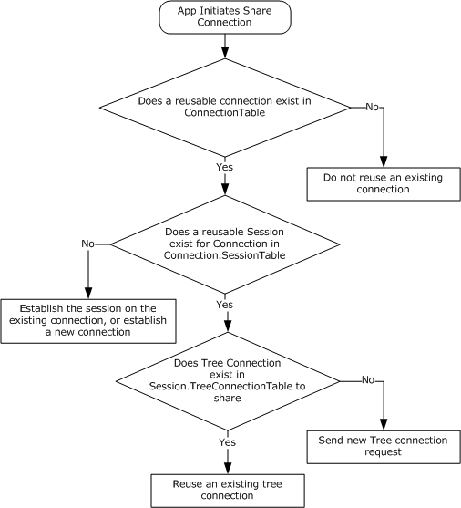{alt="The client MUST follow the steps outlined in this chart" width="5.552083333333333in" height="6.125in"}

##### Connecting to the Target Server[]{.indexref entry="Connecting to the target server"}

The **ServerName** and the optional **TransportIdentifier** provided by the caller are used to establish the connection. The client SHOULD resolve the **ServerName** as described in [\[MS-WPO\]](%5bMS-WPO%5d.pdf#Section_c5f54a7765be40a0bb829e4181d8ab67) section 7.1.4, and SHOULD attempt connections to one or more of the returned addresses. The client can attempt to initiate each such SMB2 connection on all configured transports that it allows[]{#Appendix_A_Target_128 .anchor}[\<128\>](#Appendix_A_128), most commonly Direct TCP and the other transports described in section [2.1](#Section_1dfacde4b5c744948a14a09d3ab4cc83).

The client can choose to prioritize the addresses and/or transport order and try each one sequentially, or try to connect on them all and select one using any implementation-specific heuristic[]{#Appendix_A_Target_129 .anchor}[\<129\>](#Appendix_A_129). The client can accept the **TransportIdentifier** parameter from the calling application, which specifies what transport to use, and then attempt to use the transport specified.

If **IsMutualAuthOverQUICSupported** is TRUE and the client initiates a connection to the server over QUIC, the client MUST look up a **ClientCertificateMappingEntry** with **ClientCertificateMappingEntry.ServerName** matching **ServerName** in **ClientCertificateMappingTable**. If an entry is found, the client MUST send **ClientCertificateMappingEntry.Certificate** to QUIC.

If the [**connection**](#gt_866b0055-ceba-4acf-a692-98452943b981) attempt is successful, a connection object MUST be created, as specified in section [3.2.1.2](#Section_a1df6781a50748a7bcdbbe9ef0c09c97), with the following default parameters:

- **Connection.SessionTable** MUST be set to an empty table.

- **Connection.OutstandingRequests** MUST be set to an empty table.

- **Connection.SequenceWindow** MUST be set to a sequence window, as specified in section [3.2.4.1.6](#Section_bed7a84e33a742899de96042cf8aa7cc), with a single starting [**sequence number**](#gt_9c2d7dfc-4958-48b1-bbab-f23e97e71ff3) available, which is \"0\".

- **Connection.GSSNegotiateToken** MUST be set to an empty array.

- **Connection.Dialect**, if implemented, MUST be set to \"Unknown\".

- **Connection.RequireSigning** MUST be set to **FALSE**.

- **Connection.ServerName** MUST be set to the application-supplied server name.

- **Connection.CompressionIds**, if implemented, MUST be set to empty list.

This connection MUST be inserted into **ConnectionTable**, and processing MUST continue, as specified in section [3.2.4.2.2](#Section_a9d8e20e00d045ecbf8bad2c1ac2d805).

If the connection attempt fails, the client returns the error code to the calling application.

##### Negotiating the Protocol[]{.indexref entry="Negotiating the protocol"}

When a new [**connection**](#gt_866b0055-ceba-4acf-a692-98452943b981) is established, the client MUST negotiate capabilities with the server. The client MAY[]{#Appendix_A_Target_130 .anchor}[\<130\>](#Appendix_A_130) use either of two possible methods for negotiation.

The first is a multi-protocol negotiation that involves sending an SMB message to negotiate the use of SMB2. If the server does not implement the SMB 2 Protocol, this method allows the negotiation to fall back to older SMB dialects, as specified in [\[MS-SMB\]](%5bMS-SMB%5d.pdf#Section_f210069c70864dc2885e861d837df688).

The second method is to send an [SMB2-Only negotiate](#Section_77f696b89aa04ed1abb2c097c0ccb05a) message. This method will result in successful negotiation only for servers that implement the SMB 2 Protocol.

###### Multi-Protocol Negotiate

To negotiate either the SMB 2 Protocol or the SMB Protocol, the client MUST allocate sequence number 0 from **Connection.SequenceWindow**. It MUST construct an SMB_COM_NEGOTIATE message following the syntax as specified in [\[MS-SMB\]](%5bMS-SMB%5d.pdf#Section_f210069c70864dc2885e861d837df688) sections 2.2.4.5.1 and 3.2.4.2 and in [\[MS-CIFS\]](%5bMS-CIFS%5d.pdf#Section_d416ff7cc536406ea9514f04b2fd1d2b) sections 2.2.4.52 and 3.2.4.2.2.

If the client implements the SMB 2.0.2 dialect, the client MUST also include the dialect string "SMB 2.002" in the **SMB_Data.Bytes.Dialects\[\]** array of the request. If the client implements the SMB 2.1 dialect or SMB 3.x dialect family, the client MUST also include the dialect string "SMB 2.???" in the **SMB_Data.Bytes.Dialects\[\]** array of the request.

This request MUST be sent to the server.

###### SMB2-Only Negotiate

To issue an **SMB2-Only negotiate**, the client MUST construct an [SMB2 NEGOTIATE Request](#Section_e14db7ff763a42638b100c3944f52fc5) following the syntax as specified in section 2.2.3:

- Allocate [**sequence number**](#gt_9c2d7dfc-4958-48b1-bbab-f23e97e71ff3) 0 from the **Connection.SequenceWindow** and place it in the **MessageId** field of the [SMB2 header](#Section_5cd6452260b34f3ea157fe66f1228052).

- Set the **Command** field in the SMB2 header to SMB2 NEGOTIATE.

If the application has provided **SpecifiedDialects**, the client MUST do the following:

- Set the **DialectCount** to number of elements in the **SpecifiedDialects**.

- Set the value in **Dialects** array to the values in **SpecifiedDialects**.

Otherwise, if the client implements the SMB 3.x dialect family and an alternate connection is being established to an already connected **Server,** the client SHOULD[]{#Appendix_A_Target_131 .anchor}[\<131\>](#Appendix_A_131) set **DialectCount** to 1 and set **Dialects** array to **Server.DialectRevision**.

Otherwise,

- Set **DialectCount** to 0.

- If the client implements the SMB 2.0.2 dialect, it MUST do the following:

  - Increment the **DialectCount** by 1.

  - Set the value in **Dialects\[DialectCount-1\]** array to 0x0202.

- If the client implements the SMB 2.1 dialect, it MUST do the following:

  - Increment the **DialectCount** by 1.

  - Set the value in **Dialects\[DialectCount-1\]** array to 0x0210.

- If the client implements the SMB 3.0 dialect, it MUST do the following:

  - Increment the **DialectCount** by 1.

  - Set the value in the **Dialects\[DialectCount-1\]** array to 0x0300.

- If the client implements the SMB 3.0.2 dialect, it MUST do the following:

  - Increment the **DialectCount** by 1.

  - Set the value in the **Dialects\[DialectCount-1\]** array to 0x0302.

- If the client implements the SMB 3.1.1 dialect, it MUST do the following:

  - Increment the **DialectCount** by 1.

  - Set the value in the **Dialects\[DialectCount-1\]** array to 0x0311.

<!-- -->

- If the client implements SMB 3.x dialect family, **Connection.OfferedDialects** MUST be set to the values in **Dialects** array.

- If [RequireMessageSigning](#Section_95a74d9693a742eaaf1a688c17c522ee) is TRUE, the client MUST set the SMB2_NEGOTIATE_SIGNING_REQUIRED bit to TRUE in **SecurityMode**. If RequireMessageSigning is FALSE, the client MUST set the SMB2_NEGOTIATE_SIGNING_ENABLED bit to TRUE in **SecurityMode**. The client MUST store the value of the **SecurityMode** field in **Connection.ClientSecurityMode**.

- Set **Capabilities** and **ClientStartTime** to 0.

- If the client implements the SMB 2.1 or SMB 3.x dialect, **ClientGuid** MUST be set to the global **ClientGuid** value. Otherwise, it MUST be set to 0. The client MUST set **Connection.ClientGuid** to the **ClientGuid** initialized above.

- If the client implements the SMB 3.x dialect family, the client MUST set the **Capabilities** field as follows:

  - If **MaxDialect** is "3.0" or "3.0.2", **IsEncryptionSupported** is TRUE and the client supports AES-128-CCM encryption algorithm, the client SHOULD[]{#Appendix_A_Target_132 .anchor}[\<132\>](#Appendix_A_132) set SMB2_GLOBAL_CAP_ENCRYPTION in the **Capabilities** field.

  - If **MaxDialect** is "3.1.1", **IsEncryptionSupported** is TRUE and the client supports any of the encryption algorithms specified in section [2.2.3.1.2](#Section_16693be72b274d3b804bf605bde5bcdd), the client SHOULD[]{#Appendix_A_Target_133 .anchor}[\<133\>](#Appendix_A_133) set SMB2_GLOBAL_CAP_ENCRYPTION in the **Capabilities** field.

  - Remaining bit values in the **Capabilities** field MUST be set as specified in section 2.2.3.

- The client MUST set **Connection.ClientCapabilities** to the **Capabilities** field.

- If the client implements the SMB 3.1.1 dialect, it MUST do the following:

  - Set **NegotiateContextOffset** to 0.

  - Set **NegotiateContextCount** to 0.

  - Add optional padding after **Dialects** array to make the next field 8-byte aligned.

  - Add an SMB2 NEGOTIATE_CONTEXT with **ContextType** as SMB2_PREAUTH_INTEGRITY_CAPABILITIES to the negotiate request as specified in section [2.2.3.1](#Section_15332256522e4a538cd70bd17678a2f7):

    - Increment **NegotiateContextCount** by 1

    - Set **NegotiateContextOffset** to the offset of the SMB2 NEGOTIATE_CONTEXT added above.

    - The SMB2_PREAUTH_INTEGRITY_CAPABILITIES negotiate context\'s **Salt** buffer SHOULD[]{#Appendix_A_Target_134 .anchor}[\<134\>](#Appendix_A_134) be initialized to an implementation-specific number of bytes generated for this request by a cryptographically secure pseudo-random number generator.

  - If **IsEncryptionSupported** is TRUE, it MUST do the following:

    - Increment **NegotiateContextCount** by 1.

    - Add an SMB2_NEGOTIATE_CONTEXT with **ContextType** as SMB2_ENCRYPTION_CAPABILITIES to the negotiate request as specified in section 2.2.3.1.

    - If an alternate connection is being established to an already connected **Server**, set **Ciphers** to **Server.CipherId** and **CipherCount** to 1. Otherwise, set **Ciphers** with the ciphers supported by the client, if any, in the order of preference and **CipherCount** to number of ciphers in **Ciphers** field.[]{#Appendix_A_Target_135 .anchor}[\<135\>](#Appendix_A_135)

  - If **IsCompressionSupported** is TRUE, it MUST do the following:

    - Increment **NegotiateContextCount** by 1.

    - Add an SMB2_NEGOTIATE_CONTEXT with **ContextType** as SMB2_COMPRESSION_CAPABILITIES to the negotiate request as specified in section 2.2.3.1.

    - **CompressionAlgorithms** SHOULD[]{#Appendix_A_Target_136 .anchor}[\<136\>](#Appendix_A_136) be set to the algorithms supported by the client in the order of preference.

    - If **IsChainedCompressionSupported** is TRUE, SMB2_COMPRESSION_CAPABILITIES_FLAG_CHAINED bit MUST be set in **Flags** field.

  - If **IsRDMATransformSupported** is TRUE, it MUST do the following:

    - Increment **NegotiateContextCount** by 1.

    - Add an SMB2 NEGOTIATE_CONTEXT with **ContextType** as SMB2_RDMA_TRANSFORM_CAPABILITIES to the negotiate request as specified in section [2.2.3.1.6](#Section_52b74a7498384f51b2b0efeb23bd79d6).

    - If an alternate connection is being established to an already connected **Server**, set **RDMATransformIds** to **Server.RDMATransformIds**. Otherwise, set **RDMATransformIds** to the RDMA transforms in an implementation-defined manner.[]{#Appendix_A_Target_137 .anchor}[\<137\>](#Appendix_A_137)

- If the client implements the SMB 3.1.1 dialect, the client SHOULD[]{#Appendix_A_Target_138 .anchor}[\<138\>](#Appendix_A_138) add an SMB2 NEGOTIATE_CONTEXT with **ContextType** as SMB2_NETNAME_NEGOTIATE_CONTEXT_ID to the negotiate request as specified in section 2.2.3.1:

  - Increment **NegotiateContextCount** by 1.

  - **NetName** MUST be set to the application-provided **ServerName**.

- If the client implements the SMB 3.1.1 dialect, **IsSigningCapabilitiesSupported** is TRUE, the client MUST add an SMB2 NEGOTIATE_CONTEXT with **ContextType** as SMB2_SIGNING_CAPABILITIES to the negotiate request as specified in section 2.2.3.1:

  - Increment **NegotiateContextCount** by 1.

  - If an alternate connection is being established to an already connected **Server**, set **SigningAlgorithms** to **Server.SigningAlgorithmId** and set **SigningAlgorithmCount** to 1. Otherwise, set **SigningAlgorithms** to the signing algorithms supported by the client, if any, in the order of preference, and set **SigningAlgorithmCount** to the number of elements in the **SigningAlgorithms** field.[]{#Appendix_A_Target_139 .anchor}[\<139\>](#Appendix_A_139)

- If the client implements the SMB 3.1.1 dialect, **IsTransportCapabilitiesSupported** is TRUE, the underlying connection is over QUIC, and **DisableEncryptionOverSecureTransport** is TRUE, the client MUST add an SMB2 NEGOTIATE_CONTEXT with **ContextType** as SMB2_TRANSPORT_CAPABILITIES to the negotiate request as specified in section 2.2.3.1:

  - The client MUST increment **NegotiateContextCount** by 1.

  - The client MUST set **Flags** to SMB2_ACCEPT_TRANSPORT_LEVEL_SECURITY.

This request MUST be sent to the server.

##### Authenticating the User[]{.indexref entry="Authenticating the user"}

To establish a new session, the client MAY[]{#Appendix_A_Target_140 .anchor}[\<140\>](#Appendix_A_140) either:

- Pass the **Connection.GSSNegotiateToken** to the configured GSS authentication mechanism to obtain a GSS output token for the authentication protocol exchange, as specified in [\[MS-SPNG\]](%5bMS-SPNG%5d.pdf#Section_f377a379c24f4a0fa3eb0d835389e28a) section 3.3.5.2.

OR

- Choose to ignore the **Connection.GSSNegotiateToken** that is received from the server, and initiate a normal GSS sequence, as specified in [\[RFC4178\]](https://go.microsoft.com/fwlink/?LinkId=90461) section 3.2.

In either case, it MUST call the GSS authentication protocol with the **MutualAuth** and **Delegate** options. In addition, the client MUST also set the *GSS_C_FRAGMENT_TO_FIT* parameter as specified in \[MS-SPNG\] section 3.3.1. The GSS-API output token is up to a size limit determined by local policy[]{#Appendix_A_Target_141 .anchor}[\<141\>](#Appendix_A_141) when *GSS_C_FRAGMENT_TO_FIT* is set.

If the GSS authentication protocol returns an error, the [**share**](#gt_a49a79ea-dac7-4016-9a84-cf87161db7e3) connect attempt MUST be aborted and the error MUST be returned to the higher-level application.

If the GSS authentication succeeds, the client MUST construct an [SMB2 SESSION_SETUP Request](#Section_5a3c2c28d6b048edb917a86b2ca4575f), as specified in section 2.2.5. The [SMB2 header](#Section_5cd6452260b34f3ea157fe66f1228052) MUST be initialized as follows:

- The **Command** field MUST be set to SMB2 SESSION_SETUP.

- The **MessageId** field is set as specified in section [3.2.4.1.3](#Section_5c5f53169936417b92214686de25d414).

The SMB2 SESSION_SETUP Request MUST be initialized as follows:

- If [RequireMessageSigning](#Section_95a74d9693a742eaaf1a688c17c522ee) is TRUE, the client MUST set the SMB2_NEGOTIATE_SIGNING_REQUIRED bit in the **SecurityMode** field.

> If RequireMessageSigning is FALSE, the client MUST set the SMB2_NEGOTIATE_SIGNING_ENABLED bit in the **SecurityMode** field.

- The **Flags** field MUST be set to 0.

- If the client supports the [**Distributed File System (DFS)**](#gt_0b8086c9-d025-45b8-bf09-6b5eca72713e), as specified in [\[MS-DFSC\]](%5bMS-DFSC%5d.pdf#Section_3109f4be2dbb42c99b8e0b34f7a2135e), the SMB2_GLOBAL_CAP_DFS bit in the **Capabilities** field MUST be set.

- If the client is attempting to reestablish a session, the client MUST set **PreviousSessionId** to its previous session identifier to allow the server to remove any session associated with this identifier. Otherwise, the client MUST set **PreviousSessionId** to 0.

- The GSS output token is copied into the **Buffer** field in the request. The client MUST set **SecurityBufferOffset** and **SecurityBufferLength** to describe the location and length of the GSS output token in the request.

If the client implements the SMB 3.x dialect family and this authentication is for establishing an alternative channel for an existing **Session**, as specified in section [3.2.5.5](#Section_5b80eb317e0a4f24b57015217d28f239), the client MUST also set the following values:

- The **SessionId** field in the SMB2 header MUST be set to the **Session.SessionId** for the new channel being established.

- The SMB2_SESSION_FLAG_BINDING bit MUST be set in the **Flags** field.

- The **PreviousSessionId** field MUST be set to zero.

This request MUST be sent to the server.

###### Application Requests Reauthenticating a User[]{.indexref entry="Application Requests Reauthenticating a User"}

It is possible that the server indicates that authentication has expired, as specified in sections [3.3.5.7](#Section_652e0c1450144470999db174d7b2da87) and [3.3.5.9](#Section_8c61e928924244ed96a098d1032d0d39), or the application or the client itself requests that an existing [**session**](#gt_0cd96b80-a737-4f06-bca4-cf9efb449d12) be reauthenticated. In either case, the client MUST issue a subsequent session setup request for the **SessionId** of the session being reauthenticated. The application SHOULD NOT issue new requests until the reauthentication succeeds.

The client MAY[]{#Appendix_A_Target_142 .anchor}[\<142\>](#Appendix_A_142) either:

- Pass the **Connection.GSSNegotiateToken** to the configured GSS authentication mechanism to obtain a GSS output token for the authentication protocol exchange, as specified in [\[MS-SPNG\]](%5bMS-SPNG%5d.pdf#Section_f377a379c24f4a0fa3eb0d835389e28a) section 3.3.5.2.

or

- Choose to ignore the **Connection.GSSNegotiateToken** received from the server, and initiate a normal GSS sequence as specified in \[MS-SPNG\] section 3.3.4 and [\[RFC4178\]](https://go.microsoft.com/fwlink/?LinkId=90461) section 3.2.

In either case, it initializes the GSS authentication protocol with the **MutualAuth** and **Delegate** options. In addition, the client MUST also set the *GSS_C_FRAGMENT_TO_FIT* parameter as specified in \[MS-SPNG\] section 3.3.1. The GSS-API output token is up to a size limit determined by local policy []{#Appendix_A_Target_143 .anchor}[\<143\>](#Appendix_A_143) when *GSS_C_FRAGMENT_TO_FIT* is set.

If the GSS authentication protocol returns an error, the reauthentication attempt MUST be aborted, and the error MUST be returned to the higher-level application.

If the GSS authentication succeeds, the client MUST construct an [SMB2 SESSION_SETUP request](#Section_5a3c2c28d6b048edb917a86b2ca4575f), as specified in section 2.2.5. The [SMB2 header](#Section_5cd6452260b34f3ea157fe66f1228052) MUST be initialized as follows:

- The **Command** field MUST be set to SMB2 SESSION_SETUP.

- The **MessageId** field is set as specified in section [3.2.4.1.3](#Section_5c5f53169936417b92214686de25d414).

- The **SessionId** field MUST be set to the **Session.SessionId** for the session being reauthenticated.

The SMB2 SESSION_SETUP Request MUST be initialized as follows:

- If [RequireMessageSigning](#Section_95a74d9693a742eaaf1a688c17c522ee) is TRUE, the client MUST set the SMB2_NEGOTIATE_SIGNING_REQUIRED bit in the **SecurityMode** field.

> If RequireMessageSigning is FALSE, the client MUST set the SMB2_NEGOTIATE_SIGNING_ENABLED bit in the **SecurityMode** field.

- The **Flags** field MUST be set to 0.

- If the client supports the [**Distributed File System (DFS)**](#gt_0b8086c9-d025-45b8-bf09-6b5eca72713e), as specified in [\[MS-DFSC\]](%5bMS-DFSC%5d.pdf#Section_3109f4be2dbb42c99b8e0b34f7a2135e), the SMB2_GLOBAL_CAP_DFS bit in the **Capabilities** field MUST be set.

- The **PreviousSessionId** field MUST be set to 0.

- The GSS output token is copied into the **Buffer** field in the request. The client MUST set **SecurityBufferOffset** and **SecurityBufferLength** to describe the location and length of the GSS output token in the request.

This request MUST be sent to the server.

##### Connecting to the Share[]{.indexref entry="Connecting to the share"}

To connect to a [**share**](#gt_a49a79ea-dac7-4016-9a84-cf87161db7e3), the client MUST follow the steps outlined below.

The client MUST construct an [SMB2 TREE_CONNECT Request](#Section_832d213022e84afbaafdb30bb0901798) using the syntax specified in section 2.2.9. The [SMB2 header](#Section_5cd6452260b34f3ea157fe66f1228052) MUST be initialized as follows:

- The **Command** field is set to SMB2 TREE_CONNECT.

- The **MessageId** field is set as specified in section [3.2.4.1.3](#Section_5c5f53169936417b92214686de25d414).

- The **SessionId** field is set to **Session.SessionId** of the [**session**](#gt_0cd96b80-a737-4f06-bca4-cf9efb449d12) that was identified in section [3.2.4.2](#Section_61c686670b8c4300ac8a246a86f2b11d) or established as a result of processing section [3.2.4.2.3](#Section_8b90c3355a644238981384bd734599eb).

The SMB2 TREE_CONNECT Request MUST be initialized as follows:

- If **Connection.Dialect** is \"3.1.1\" and the optional **RemotedIdentity** parameter is true, the client MUST add a tree connect request extension in the **Buffer** field as specified in section [2.2.9.1](#Section_9ca7328bb6ca41a797730fa237261b76), and MUST set the SMB2_TREE_CONNECT_FLAG_EXTENSION_PRESENT bit in the **Flags** field. The target share path, including server name, in the format \"\\\\server\\share\", MUST be copied into the **PathName** field of the tree connection request extension, as specified in section [2.2.9.2.1](#Section_ee7ff41193e0484f9f7331916fee4cb8).\
  \
  The client MUST construct a remoted identity tree connect context, as specified in section 2.2.9.2.1, by setting the User, UserName, Domain, Groups, RestrictedGroups, Privileges, PrimaryGroup, Owner, DefaultDacl, DeviceGroups, UserClaims and DeviceClaims in the SMB2_REMOTED_IDENTITY_TREE_CONNECT context, to the values specified by the application.\
  \
  Otherwise, the target share path, including server name, in the format \"\\\\server\\share\", is copied into the **Buffer** field of the request. **PathOffset** and **PathLength** MUST be set to describe the location and length of the target share path in the request.

- If **Connection.Dialect** is \"3.1.1\" and the optional **ClusterReconnect** parameter is true, the client MUST set the SMB2_TREE_CONNECT_FLAG_CLUSTER_RECONNECT bit in the **Flags** field.

- If **Connection.Dialect** is \"3.1.1\", the optional **SyncRedirect** parameter is true, and the share previously connected includes the SMB2_SHARE_CAP_ASYMMETRIC capability, the client SHOULD[]{#Appendix_A_Target_144 .anchor}[\<144\>](#Appendix_A_144) set the SMB2_TREE_CONNECT_FLAG_REDIRECT_TO_OWNER bit in the **Flags** field.

- If **Connection.Dialect** is \"3.1.1\", **Session.EncryptData** is FALSE, **Session.IsGuest** is FALSE and **Session.IsAnonymous** is FALSE, the request MUST be signed as specified in section [3.2.4.1.1](#Section_973630a88aa1439889a813cf830f194d).

This request MUST be sent to the server. The response from the server MUST be processed as described in section [3.2.5.5](#Section_5b80eb317e0a4f24b57015217d28f239).

#### Application Requests Opening a File[[[]{.indexref entry="Higher-layer triggered events:client:requesting opening of file"}]{.indexref entry="Client:higher-layer triggered events:requesting opening of file"}]{.indexref entry="Triggered events – higher layer:client:requesting opening of file"}

To [**open**](#gt_0d572cce-4683-4b21-945a-7f8035bb6469) a file on a remote share, the application provides the following:

- A handle to the **TreeConnect** representing the share in which the file to be opened exists.

- The path name of the file being opened, as a [**DFS**](#gt_0b8086c9-d025-45b8-bf09-6b5eca72713e) pathname for a DFS share, or relative to the **TreeConnect** for a non-DFS share.

- A handle to the **Session** representing the security context of the user opening the file.

- The required access for the open, as specified in section [2.2.13.1](#Section_b3af3aaf92714419b326eba0341df7d2).

- The sharing mode for the open, as specified in section [2.2.13](#Section_e8fb45c1a03d44cab7ae47385cfd7997).

- The create options to be applied for the open, as specified in section 2.2.13.

- The create disposition for the open, as specified in section 2.2.13.

- The file attributes for the open, as specified in section 2.2.13.

- The impersonation level for the open, as specified in section 2.2.13 (optional).

- The security flags for the open, as specified in section 2.2.13 (optional).

- The requested oplock level or lease state for the open, as specified in section 2.2.13 (optional).

- As outlined in subsequent sections, the application can also provide a series of [**create contexts**](#gt_230c55f3-4b14-43ce-a2d1-26580cf4a023), as specified in section [2.2.13.2](#Section_753646673a934e2cb771592d8d5e876d).

The client MUST verify the **TreeConnect** and **Session** handles. If the handles are invalid, or if no **TreeConnect** referenced by the tree connect handle is found, or if no **Session** referenced by the session handle is found, the client MUST return an implementation-specific error code locally to the calling application.

The client MUST conform to the specification in [\[MS-FSCC\]](%5bMS-FSCC%5d.pdf#Section_efbfe12773ad41409967ec6500e66d5e) section 2.1.5 for the application-supplied path name.

If the handles are valid and a **TreeConnect** and **Session** are found, the caller MUST ensure that the supplied **TreeConnect** is valid within the **Session**. **TreeConnect.Session** MUST match the **Session**.

The client MUST use the **Connection** referenced by **Session.Connection** to send the request to the server.

If the client implements the SMB 2.1 dialect or SMB 3.x dialect family and **Connection.SupportsFileLeasing** is TRUE, the client MUST search the **GlobalFileTable** for an entry matching one of the following:

- The application-supplied PathName if **TreeConnect.IsDfsShare** is TRUE.

- The concatenation of **Connection.ServerName**, **TreeConnect.ShareName**, and the application-supplied PathName, joined with pathname separators (example: server\\share\\path), if **TreeConnect.IsDfsShare** is FALSE.

If an entry is not found, a new File entry MUST be created and added to the **GlobalFileTable** and a **File.LeaseKey**,[]{#Appendix_A_Target_145 .anchor}[\<145\>](#Appendix_A_145) as specified in section [3.2.1.5](#Section_3538a6c525a141e3ba35de0e0633034b), MUST be assigned to the entry.[]{#Appendix_A_Target_146 .anchor}[\<146\>](#Appendix_A_146) **File.OpenTable** MUST be initialized to an empty table and **File.LeaseState** MUST be initialized to SMB2_LEASE_NONE.

If an entry is found, the client SHOULD[]{#Appendix_A_Target_147 .anchor}[\<147\>](#Appendix_A_147) include a lease context with the existing lease key, lease state, and epoch.[]{#Appendix_A_Target_148 .anchor}[\<148\>](#Appendix_A_148)

If **Connection.Dialect** belongs to the SMB 3.x dialect family, **Connection.SupportsDirectoryLeasing** is TRUE, and the file being opened is not the root of the share, the client MUST search the **GlobalFileTable** for the parent directory of the file being opened. The name of the parent directory is obtained by removing the last component of the path used to search the **GlobalFileTable** above. If an entry for the parent directory is not found, a new **File** entry MUST be created for it and added to the **GlobalFileTable** and a **File.LeaseKey**,[]{#Appendix_A_Target_149 .anchor}[\<149\>](#Appendix_A_149) as specified in section 3.2.1.5, MUST be assigned to the entry. **File.OpenTable** MUST be initialized to an empty table and **File.LeaseState** MUST be initialized to SMB2_LEASE_NONE.

If the client accesses a file through multiple paths, such as using different server names or share names or parent directory names, it will create multiple **File** elements, and therefore multiple **File.LeaseKey**s for the same remote file. This loses the performance benefits of sharing cache state across all **Opens** of the same file and can cause additional lease breaks to be generated, as actions by a client through one path will affect caching by that client through other paths. However, the impact is a matter of performance; cache correctness is preserved. If the client accesses the same path across multiple opens, the client will use the same **File** element and therefore the same **File.LeaseKey** is used.

The client MUST construct an SMB2 CREATE Request using the syntax specified in section 2.2.13. The [SMB2 header](#Section_5cd6452260b34f3ea157fe66f1228052) MUST be initialized as follows:

- The **Command** field is set to SMB2 CREATE.

- The **MessageId** field is set as specified in section [3.2.4.1.3](#Section_5c5f53169936417b92214686de25d414).

- The **SessionId** field is set to **TreeConnect.Session.SessionId**.

- The **TreeId** field is set to **TreeConnect.TreeConnectId**.

- If **TreeConnect.IsDfsShare** is TRUE, the SMB2_FLAGS_DFS_OPERATIONS flag is set in the **Flags** field.

The SMB2 CREATE Request MUST be initialized as follows:

- The **SecurityFlags** field is set to 0.

- The **ImpersonationLevel** field is set to the application-provided impersonation level. If the application did not provide an impersonation level, the client sets the **ImpersonationLevel** to **Impersonation**.

- The client sets the **DesiredAccess** field to the value that is provided by the application.

- The client sets the **FileAttributes** field to the attributes that are provided by the application.

- The client sets the **ShareAccess** field to the sharing mode that is provided by the application.

- The client sets the **CreateDisposition** field to the create disposition that is provided by the application.

- The client sets the **CreateOptions** field to the create options that are provided by the application.

- The **RequestedOplockLevel** field is set as below:

  - If **CreateOptions** includes FILE_DIRECTORY_FILE,

    - If **Connection.SupportsDirectoryLeasing** is TRUE, the client SHOULD set **RequestedOplockLevel** field to SMB2_OPLOCK_LEVEL_LEASE.

    - Otherwise, **RequestedOplockLevel** field is set to SMB2_OPLOCK_LEVEL\_ NONE.

  - Otherwise,

    - If the filename is stream name as defined in \[MS-FSCC\] section 2.1.5.3, **RequestedOplockLevel** field is set to SMB2_OPLOCK_LEVEL_NONE.

    - Otherwise, if **Connection.SupportsFileLeasing** is TRUE, the client SHOULD[]{#Appendix_A_Target_150 .anchor}[\<150\>](#Appendix_A_150) set **RequestedOplockLevel** field to SMB2_OPLOCK_LEVEL_LEASE.

    - Otherwise, if the oplock level requested by the application is SMB2_OPLOCK_LEVEL_NONE or SMB2_OPLOCK_LEVEL_II or SMB2_OPLOCK_LEVEL_BATCH, the client MUST set **RequestedOplockLevel** field to the oplock level that is requested by the application.

    - Otherwise, **RequestedOplockLevel** field is set to an implementation-specific oplock level.[]{#Appendix_A_Target_151 .anchor}[\<151\>](#Appendix_A_151)

- The client copies the application-supplied path into the **Buffer**, and sets the **NameLength** to the length, in bytes, of the path and the **NameOffset** to the offset, in bytes, to the path from the beginning of the SMB2 header.

- The client copies any provided create contexts into the **Buffer** after the file name, and sets the **CreateContextsOffset** to the offset, in bytes, to the create contexts from the beginning of the SMB2 header and sets the **CreateContextsLength** to the length, in bytes, of the array of create contexts. If there are no provided create contexts, **CreateContextsLength** and **CreateContextsOffset** MUST be set to 0.

This request MUST be sent to the server. The response from the server MUST be processed as described in section [3.2.5.7](#Section_f86b973b2a01484d901f6788ca53b980).

##### Application Requests Opening a Named Pipe

For opening a named pipe, the application provides the same parameters that are specified in section [3.2.4.3](#Section_448cb9797321459889dfe5c97135b566), except that **TreeConnect.ShareName** will be \"IPC\$\". This share name indicates that the [**open**](#gt_0d572cce-4683-4b21-945a-7f8035bb6469) targets a named pipe.

##### Application Requests Sending a File to Print

For sending a file to a printer, the application [**opens**](#gt_0d572cce-4683-4b21-945a-7f8035bb6469) the root of a print [**share**](#gt_a49a79ea-dac7-4016-9a84-cf87161db7e3), writes data, and closes the file. The semantics and parameters are the same as specified in section [3.2.4.3](#Section_448cb9797321459889dfe5c97135b566), except that **TreeConnect.ShareName** will be the name of a printer share, and the share relative path MUST be NULL.

##### Application Requests Creating a File with Extended Attributes

To create a file with extended attributes, in addition to the parameters that are specified in section [3.2.4.3](#Section_448cb9797321459889dfe5c97135b566), the application provides a buffer of extended attributes in the format that is specified in [\[MS-FSCC\]](%5bMS-FSCC%5d.pdf#Section_efbfe12773ad41409967ec6500e66d5e) section 2.4.16. The client MUST construct a [**create context**](#gt_230c55f3-4b14-43ce-a2d1-26580cf4a023), as specified in section [2.2.13.2.1](#Section_989faa38d97243c191be624acd6a7622), and append it to any other create contexts being issued with this CREATE request.

##### Application Requests Creating a File with a Security Descriptor

To create a file with a security descriptor, in addition to the parameters that are specified in section [3.2.4.3](#Section_448cb9797321459889dfe5c97135b566), the application provides a buffer with a SECURITY_DESCRIPTOR in the format as specified in [\[MS-DTYP\]](%5bMS-DTYP%5d.pdf#Section_cca2742956894a16b2b49325d93e4ba2) section 2.4.6. The client MUST construct a [**create context**](#gt_230c55f3-4b14-43ce-a2d1-26580cf4a023) using the syntax specified for [SMB2_CREATE_SD_BUFFER](#Section_72950da21075496ebd3abac48023cfcf) in section 2.2.13.2.2, and append it to any other create contexts being issued with this CREATE request.

##### Application Requests Creating a File Opened for Durable Operation

To request durable operation on a file being [**opened**](#gt_0d572cce-4683-4b21-945a-7f8035bb6469) or created, in addition to the parameters that are specified in section [3.2.4.3](#Section_448cb9797321459889dfe5c97135b566), the application provides a Boolean indicating whether durability is requested.

If the application is requesting durability, the client MUST do the following:

- If **Connection.Dialect** belongs to the SMB 3.x dialect family, the client MUST construct a create context by using the syntax specified in section [2.2.13.2.11](#Section_5e361a2981a74774861df290ea53a00e), with the following values set:

  - **Timeout** MUST be set to an implementation-specific value []{#Appendix_A_Target_152 .anchor}[\<152\>](#Appendix_A_152).

  - If **TreeConnect.IsCAShare** is TRUE, the client MUST set the SMB2_DHANDLE_FLAG_PERSISTENT bit in the **Flags** field. Otherwise, the client SHOULD perform one of the following:

    - Request a batch oplock by setting **RequestedOplockLevel** in the create request to SMB2_OPLOCK_LEVEL_BATCH.

    - Request a handle caching lease by including an SMB2_CREATE_REQUEST_LEASE or SMB2_CREATE_REQUEST_LEASE_V2 Create Context in the create request with a **LeaseState** that includes SMB2_LEASE_HANDLE_CACHING.

  - **Reserved** MUST be set to zero.

  - **CreateGuid** MUST be set to a newly generated GUID.

- Otherwise, the client MUST construct a create context using the syntax specified in section [2.2.13.2.3](#Section_9999d870b6644e51a1871c3c16a1ae1c). The client SHOULD perform one of the following:

  - Request a batch oplock by setting **RequestedOplockLevel** in the create request to SMB2_OPLOCK_LEVEL_BATCH.

  - Request a handle caching lease by including an SMB2_CREATE_REQUEST_LEASE Create Context in the create request with a **LeaseState** that includes SMB2_LEASE_HANDLE_CACHING.

- The client MUST append the newly constructed create context to any other create contexts being issued with this CREATE request.

If the application is not requesting durability, the client MUST follow the normal processing, as specified in section 3.2.4.3.

##### Application Requests Opening a Previous Version of a File

To open a previous version of a file, in addition to the parameters that are specified in section [3.2.4.3](#Section_448cb9797321459889dfe5c97135b566), the application provides a time stamp for the version to be [**opened**](#gt_0d572cce-4683-4b21-945a-7f8035bb6469), in FILETIME format as specified in [\[MS-DTYP\]](%5bMS-DTYP%5d.pdf#Section_cca2742956894a16b2b49325d93e4ba2) section 2.3.3. The client MUST construct a [**create context**](#gt_230c55f3-4b14-43ce-a2d1-26580cf4a023) following the syntax as specified in section [2.2.13.2.7](#Section_0eeb7dc1f0e1423aa40728b82496345b) using this time stamp. The client MUST append it to any other create contexts being issued with this CREATE request.

##### Application Requests Creating a File with a Specific Allocation Size

To create a file with a specific allocation size, in addition to the parameters specified in section [3.2.4.3](#Section_448cb9797321459889dfe5c97135b566), the application provides an allocation size in LARGE_INTEGER format as specified in [\[MS-DTYP\]](%5bMS-DTYP%5d.pdf#Section_cca2742956894a16b2b49325d93e4ba2) section 2.3.5. The client MUST construct a [**create context**](#gt_230c55f3-4b14-43ce-a2d1-26580cf4a023) following the syntax that is specified in section [2.2.13.2.6](#Section_433917a317714521b441d1994b59a121) and using this allocation size. The client appends it to any other create contexts being issued with this CREATE request.

##### Requesting a Lease on a File or a Directory

To request a lease, in addition to the parameters that are specified in section [3.2.4.3](#Section_448cb9797321459889dfe5c97135b566), the application provides a Boolean value indicating that a lease requires to be taken and a **LeaseState** value (as defined in section [2.2.13.2.8](#Section_250a5100f8b04b32a202f592ce4c05e7)) that indicates the type of lease to be requested.[]{#Appendix_A_Target_153 .anchor}[\<153\>](#Appendix_A_153)

The client MUST fail this request with STATUS_NOT_SUPPORTED in the following cases:

- If **Connection.Dialect** is equal to \"2.0.2\".

- If **Connection.SupportsFileLeasing** is FALSE.

- If **Connection.Dialect** is equal to \"2.1\" and the application provided create options includes FILE_DIRECTORY_FILE.

The client MUST construct an **SMB2 CREATE request** as described in section 3.2.4.3, with a **RequestedOplockLevel** of SMB2_OPLOCK_LEVEL_LEASE.

If **Connection.Dialect** belongs to the SMB 3.x dialect family, the client MUST attach an SMB2_CREATE_REQUEST_LEASE_V2 create context to the request. The create context MUST be formatted as described in section [2.2.13.2.10](#Section_32c16a84123f40a999a800d34964308f) with the following values:

- **LeaseKey** is set to **File.LeaseKey** obtained from section 3.2.4.3.

- The client MUST search the **GlobalFileTable** for the parent directory of the file being opened. (The name of the parent directory is obtained by removing the last component of the path.) If any entry is found, **ParentLeaseKey** is obtained from **File.LeaseKey** of that entry and SMB2_LEASE_FLAG_PARENT_LEASE_KEY_SET bit MUST be set in the Flags field.

- **LeaseState** value provided by the application. If the filename to be opened, followed by a \":\" colon character and a stream name, indicates a named stream as defined in [\[MS-FSCC\]](%5bMS-FSCC%5d.pdf#Section_efbfe12773ad41409967ec6500e66d5e) section 2.1.5, the client SHOULD clear the SMB2_LEASE_HANDLE_CACHING bit in the **LeaseState** field.

- **Epoch** SHOULD be set to 0.

If **Connection.Dialect** is equal to \"2.1\", the client MUST attach an SMB2_CREATE_REQUEST_LEASE create context to the request. The create context MUST be formatted as described in section 2.2.13.2.8, with the **LeaseState** value provided by the application.

##### Application Requests Maximal Access Information of a File

To request maximal access information of a file being [**opened**](#gt_0d572cce-4683-4b21-945a-7f8035bb6469) or created, in addition to the parameters that are specified in section [3.2.4.3](#Section_448cb9797321459889dfe5c97135b566), the application provides a Boolean indicating whether it is requesting maximal access information of a file, and optionally a Timestamp value, in FILETIME format as specified in [\[MS-DTYP\]](%5bMS-DTYP%5d.pdf#Section_cca2742956894a16b2b49325d93e4ba2) section 2.3.3. If the application is requesting this information, the client MUST construct an [SMB2_CREATE_QUERY_MAXIMAL_ACCESS_REQUEST](#Section_5ea408355d404e85977d13cd745d3af8) [**create context**](#gt_230c55f3-4b14-43ce-a2d1-26580cf4a023) using the syntax specified in section 2.2.13.2.5. The client appends it to any other create contexts being issued with this CREATE request.

##### Application Requests Identifier of a File

To request an identifier of a file being opened or created, the client MUST construct an SMB2_CREATE_QUERY_ON_DISK_ID create context using the syntax specified in section [2.2.13.2](#Section_753646673a934e2cb771592d8d5e876d). The client appends it to any other create contexts being issued with this CREATE request.

##### Application Supplies its Identifier

If **Connection.Dialect** belongs to the SMB 3.x dialect family, to associate a create or open with an application-supplied identifier, the client MUST construct an SMB2_CREATE_APP_INSTANCE_ID create context by using the syntax specified in section [2.2.13.2.13](#Section_0c14e78455294b2f8d91a84d32dec7b3). The client appends it to any other create contexts being issued with this CREATE request.

##### Application Provides an Application-Specific Create Context Structure to Open a Remote File

The client MUST construct an SMB2_CREATE_CONTEXT structure using an application-provided structure. The client appends it to any other create contexts issued with this CREATE request.

##### Application Supplies a Version for its Identifier

If **Connection.Dialect** is \"3.1.1\" and the application supplied a version for its identifier, the client MUST construct an SMB2_CREATE_APP_INSTANCE_VERSION create context by using the syntax specified in section [2.2.13.2.15](#Section_dff54760c48541e0978de4b2ccad2707). The client appends it to any other create contexts being issued with this CREATE request.

#### Re-establishing a Durable Open[[[]{.indexref entry="Higher-layer triggered events:client:re-establishing a durable open"}]{.indexref entry="Client:higher-layer triggered events:re-establishing a durable open"}]{.indexref entry="Triggered events – higher layer:client:re-establishing a durable open"}

When an application requests an operation on an open, where **Open.Durable** is TRUE, that existed on a now-disconnected [**connection**](#gt_866b0055-ceba-4acf-a692-98452943b981), the client MUST perform the following:

The client MUST attempt to connect to the target share, as specified in section [3.2.4.2](#Section_61c686670b8c4300ac8a246a86f2b11d), by obtaining the name of the server and the name of the share to connect to from the **Open.FileName**. If this attempt fails, the client MUST fail the re-establishment attempt. If this attempt succeeds, the client MUST construct an [SMB2 CREATE Request](#Section_e8fb45c1a03d44cab7ae47385cfd7997) according to the syntax specified in section 2.2.13. The SMB2 header MUST be initialized as follows:

- The **Command** field is set to SMB2 CREATE.

- The **MessageId** field is set as specified in section [3.2.4.1.3](#Section_5c5f53169936417b92214686de25d414).

- The **SessionId** field is set to **TreeConnect.Session.SessionId**.

- The **TreeId** field is set to **TreeConnect.TreeConnectId**.

The SMB2 CREATE Request MUST be initialized as follows:

- The **SecurityFlags** field is set to 0.

- The **RequestedOplockLevel** field is set to **Open.OplockLevel**.

- The **ImpersonationLevel** field is set to 0.

- The **DesiredAccess** field is set to **Open.DesiredAccess**.

- The **FileAttributes** field is set to **Open.FileAttributes**.

- The **ShareAccess** field is set to **Open.ShareMode**.

- The **CreateDisposition** field is set to **Open.CreateDisposition**.

- The **CreateOptions** field is set to **Open.CreateOptions**.

- The client copies the relative path into **Buffer** and sets **NameLength** to the length, in bytes, of the relative path, and **NameOffset** to the offset, in bytes, to the relative path from the beginning of the [SMB2 header](#Section_5cd6452260b34f3ea157fe66f1228052).

- If **Connection.Dialect** is \"2.1\", an [SMB2_CREATE_DURABLE_HANDLE_RECONNECT](#Section_8fcaf4e5db4d40ec8debf22a33c4ce7b) [**create context**](#gt_230c55f3-4b14-43ce-a2d1-26580cf4a023) is constructed according to the syntax specified in section 2.2.13.2.4. The data value is set to **Open.FileId**, and the create context is appended to the create request.

- If **Connection.Dialect** belongs to the SMB 3.x dialect family, an SMB2_CREATE_DURABLE_HANDLE_RECONNECT_V2 create context is constructed according to the syntax specified in section [2.2.13.2.12](#Section_a6d418a7d2db47c9a1c75802222ad678). The **FileId** value is set to **Open.FileId**, **CreateGuid** is set to **Open.CreateGuid**, and the create context is appended to the create request. If **Open.IsPersistent** is TRUE, the client MUST set SMB2_DHANDLE_FLAG_PERSISTENT bit in the **Flags** field.

- If **Connection.Dialect** is not \"2.0.2\", and the original open was performed by using a lease as specified in section [3.2.4.3.8](#Section_50855e7c0d7141b7a005cc08f728c03a), as indicated by **Open.OplockLevel** set to SMB2_OPLOCK_LEVEL_LEASE, the client MUST re-request the lease as specified in section 3.2.4.3.8 with the exception of the following values:

  - The **LeaseState** field MUST be set to **File.LeaseState** of the file being opened.

  - If **Connection.Dialect** belongs to the SMB 3.x dialect family, the **Epoch** field MUST be set to **File.LeaseEpoch** of the file being opened.

This request MUST be sent to the server.

#### Application Requests Closing a File or Named Pipe[[[]{.indexref entry="Higher-layer triggered events:client:requesting closing of file or named pipe"}]{.indexref entry="Client:higher-layer triggered events:requesting closing of file or named pipe"}]{.indexref entry="Triggered events – higher layer:client:requesting closing of file or named pipe"}

The application provides:

- A handle to the **Open** identifying the file or named pipe to be closed.

- A Boolean that, if set, specifies that it requires the attributes of the file after the close is executed.

If the handle is invalid, or if no **Open** referenced by the handle is found, the client MUST return an implementation-specific error code. If the handle is valid, and **Open** is found, the client MUST proceed as follows.

For the specified **Open**, the client MUST select a connection as specified in section [3.2.4.1.7](#Section_0f4bdf46b6be446db5c91338b2c9c9de). If no connection is available, the client MUST fail the close operation.

Otherwise, the client MUST initialize an [SMB2 CLOSE Request](#Section_f84053b0bcb24f859717536dae2b02bd) by following the syntax specified in section 2.2.15. The [SMB2 header](#Section_5cd6452260b34f3ea157fe66f1228052) MUST be initialized as follows:

- The **Command** field is set to SMB2 CLOSE.

- The **MessageId** field is set as specified in section [3.2.4.1.3](#Section_5c5f53169936417b92214686de25d414).

- The **SessionId** field is set to **Open.TreeConnect.Session.SessionId**.

- The **TreeId** field is set to **Open.TreeConnect.TreeConnectId**.

The SMB2 CLOSE Request MUST be initialized as follows:

- If the application requires to have the attributes of the file returned after close, the client sets SMB2_CLOSE_FLAG_POSTQUERY_ATTRIB to TRUE in the **Flags** field.

- The **FileId** field is set to **Open.FileId**.

This request MUST be sent to the server.

#### Application Requests Reading from a File or Named Pipe[[[]{.indexref entry="Higher-layer triggered events:client:requesting reading from file or named pipe"}]{.indexref entry="Client:higher-layer triggered events:requesting reading from file or named pipe"}]{.indexref entry="Triggered events – higher layer:client:requesting reading from file or named pipe"}

The application provides:

- A handle to the **Open** identifying a file or named pipe.

- The offset from which to read data.

- The number of bytes to read.

- The minimum number of bytes it would like to be read (optional).

- The buffer to receive the data that is read.

- **UnbufferedRead**, A Boolean flag indicating whether the read has to be unbuffered (optional).

- **CompressRead**, A Boolean flag indicating that the response is eligible for compression (optional).

If the handle is invalid, or if no **Open** referenced by the handle is found, the client MUST return an implementation-specific error code. If the handle is valid and **Open** is found, the client MUST proceed as follows.

For the specified **Open**, the client MUST select a connection as specified in section [3.2.4.1.7](#Section_0f4bdf46b6be446db5c91338b2c9c9de). If no connection is available, the client MUST fail the read operation.

Otherwise, the client initializes an [SMB2 READ Request](#Section_320f04f31b2845cdaaa19e5aed810dca) following the syntax specified in section 2.2.19. The [SMB2 header](#Section_5cd6452260b34f3ea157fe66f1228052) MUST be initialized as follows:

- The **Command** field is set to SMB2 READ.

- The **SessionId** field is set to **Open.TreeConnect.Session.SessionId**.

- The **TreeId** field is set to **Open.TreeConnect.TreeConnectId**.

The SMB2 READ Request MUST be initialized as follows:

- If **Connection.Dialect** is \"3.0.2\" or \"3.1.1\", and if the application-supplied **UnbufferedRead** is TRUE, the SMB2_READFLAG_READ_UNBUFFERED bit in the **Flags** field MUST be set.

- If **Connection.Dialect** is \"3.1.1\", **IsCompressionSupported** is TRUE, **Connection.CompressionIds** is not empty, and the application-supplied **CompressRead** or **TreeConnect.CompressData** is TRUE, the SMB2_READFLAG_REQUEST_COMPRESSED bit in the **Flags** field MUST be set.

- The **Length** field is set to the number of bytes the application requested to read.

- The **Offset** field is set to the offset within the file, in bytes, at which the application requested the read to start.

- The client SHOULD[]{#Appendix_A_Target_154 .anchor}[\<154\>](#Appendix_A_154) set **MinimumCount** field to the value that is provided by the application. If no value is provided by the application, the client SHOULD set this field to 0.

- The **FileId** field is set to **Open.FileId**.

- The **Padding** field SHOULD be set to 0x50, which is the default padding of an [SMB2 READ Response](#Section_3e3d2f2c0e2f41eaad07fbca6ffdfd90).

If the number of bytes to read exceeds **Connection.MaxReadSize**, the client MUST split the read up into separate read operations no larger than **Connection.MaxReadSize**. The client MAY send these separate reads in any order.[]{#Appendix_A_Target_155 .anchor}[\<155\>](#Appendix_A_155)

If a client requests reading from a file, **Connection.Dialect** is not \"2.0.2\", and if **Connection.SupportsMultiCredit** is TRUE, the **CreditCharge** field in the SMB2 header MUST be set to ( 1 + (**Length** -- 1) / 65536 ).

If the **Connection** is established in RDMA mode and the size of any single operation exceeds an implementation-specific threshold []{#Appendix_A_Target_156 .anchor}[\<156\>](#Appendix_A_156), and if **Open.TreeConnect.Session.SigningRequired** and **Open.TreeConnect.Session.EncryptData** are both FALSE, then the interface in [\[MS-SMBD\]](%5bMS-SMBD%5d.pdf#Section_1ca5f4aee5b1493db87df4464325e6e3) section 3.1.4.3 Register Buffer MUST be used to register the buffer provided by the calling application on the **Connection** with write permissions, which will receive the data to be read. The returned list of SMB_DIRECT_BUFFER_DESCRIPTOR_V1 structures MUST be stored in **Request.BufferDescriptorList**. The following fields of the request MUST be initialized as follows:

- If **Connection.Dialect** is \"3.0.2\" or \"3.1.1\" and processing of received remote invalidation is supported as specified in \[MS-SMBD\] section 3.1.5.8, the **Channel** field of the request SHOULD be set to SMB2_CHANNEL_RDMA_V1_INVALIDATE. Otherwise, the **Channel** field of the request MUST be set to SMB2_CHANNEL_RDMA_V1.

- The returned list of SMB_DIRECT_BUFFER_DESCRIPTOR_V1 structures MUST be added to the **Buffer** field of the request.

- The **ReadChannelInfoOffset** MUST be set to the offset of the added list from the beginning of the SMB2 header.

- The **ReadChannelInfoLength** MUST be set to the length of the added list.

Otherwise, the following fields of the request MUST be initialized as follows:

- If **Connection.Dialect** belongs to the SMB 3.x dialect family:

  - The **Channel** field MUST be set to SMB2_CHANNEL_NONE.

  - The **ReadChannelInfoOffset** field MUST be set to 0.

  - The **ReadChannelInfoLength** field MUST be set to 0.

- The first byte of the **Buffer** field MUST be set to 0.

The **MessageId** field in the SMB2 header is set as specified in section [3.2.4.1.3](#Section_5c5f53169936417b92214686de25d414), and the request is sent to the server.

#### Application Requests Writing to a File or Named Pipe[[[]{.indexref entry="Higher-layer triggered events:client:requesting writing to file or named pipe"}]{.indexref entry="Client:higher-layer triggered events:requesting writing to file or named pipe"}]{.indexref entry="Triggered events – higher layer:client:requesting writing to file or named pipe"}

The application provides:

- A handle to the **Open** identifying a file or named pipe.

- The offset, in bytes, from where data is written.

- The number of bytes to write.

- A buffer containing the bytes to be written.

- **WriteThrough**, a Boolean flag indicating whether the data has to be written to persistent store on the server before a response is sent (optional).

- **UnbufferedWrite**, a Boolean flag indicating whether the write data is not to be buffered on the server (optional).

- **CompressWrite**, a Boolean flag indicating that the request is eligible for compression (optional).

If the handle is invalid, or if no **Open** referenced by the handle is found, the client MUST return an implementation-specific error code. If the handle is valid and **Open** is found, the client MUST proceed as follows.

For the specified **Open**, the client MUST select a connection as specified in section [3.2.4.1.7](#Section_0f4bdf46b6be446db5c91338b2c9c9de). If no connection is available, the client MUST fail the write operation.

Otherwise, the client initializes an [SMB2 WRITE Request](#Section_e704696133184350be2aa8d69bb59ce8), following the syntax specified in section 2.2.21. The [SMB2 header](#Section_5cd6452260b34f3ea157fe66f1228052) MUST be initialized as follows:

- The **Command** field is set to SMB2 WRITE.

- The **SessionId** field is set to **Open.TreeConnect.Session.SessionId**.

- The **TreeId** field is set to **Open.TreeConnect.TreeConnectId**.

The SMB2 WRITE Request MUST be initialized as follows:

- The **Length** field is set to the number of bytes the application requested to write.

- The **Offset** field is set to the offset within the file, in bytes, at which the application requested the write to start.

- The **FileId** field is set to **Open.FileId**.

- The **DataOffset** field MUST be set to an implementation-specific[]{#Appendix_A_Target_157 .anchor}[\<157\>](#Appendix_A_157) value.

- If **Connection.Dialect** is not \"2.0.2\", and application-supplied WriteThrough is TRUE, the SMB2_WRITEFLAG_WRITE_THROUGH bit in the Flags field MUST be set.

- If **Connection.Dialect** is \"3.0.2\" or \"3.1.1\", and the application-supplied UnbufferedWrite is TRUE, the SMB2_WRITEFLAG_WRITE_UNBUFFERED bit in the Flags field MUST be set.

If the number of bytes to write exceeds the **Connection.MaxWriteSize**, the client MUST split the write into separate write operations no larger than the **Connection.MaxWriteSize**. The client MAY[]{#Appendix_A_Target_158 .anchor}[\<158\>](#Appendix_A_158) send these separate writes in any order.

If the connection is not established in RDMA mode or if the size of the operation is less than or equal to an implementation-specific threshold []{#Appendix_A_Target_159 .anchor}[\<159\>](#Appendix_A_159)or if either **Open.TreeConnect.Session.SigningRequired** or **Open.TreeConnect.Session.EncryptData** is TRUE, the following fields of the request MUST be initialized as follows:

- If **Connection.Dialect** belongs to the SMB 3.x dialect family,

  - The **Channel** field MUST be set to SMB2_CHANNEL_NONE.

  - The **WriteChannelInfoOffset** field MUST be set to 0.

  - The **WriteChannelInfoLength** field MUST be set to 0.

- The **RemainingBytes** field MUST be set to 0.

- The data being written MUST be copied into the Buffer field at **DataOffset** bytes from the beginning of the SMB2 header.

<!-- -->

- The client MUST fill the bytes, if any, between the beginning of the **Buffer** field and the beginning of the data (at **DataOffset**) with zeros.

Otherwise, the interface in [\[MS-SMBD\]](%5bMS-SMBD%5d.pdf#Section_1ca5f4aee5b1493db87df4464325e6e3) section 3.1.4.3 Register Buffer MUST be used to register the buffer on the **Connection** with read permissions, which will supply the data to be written. The returned list of SMB_DIRECT_BUFFER_DESCRIPTOR_V1 structures MUST be stored in **Request.BufferDescriptorList**. The following fields of the request MUST be initialized as follows:

- If **Connection.Dialect** is "3.1.1", **Connection.RDMATransformIds** is not empty,

<!-- -->

- **Channel** field of the request MUST be set to SMB2_CHANNEL_RDMA_TRANSFORM.

- Construct SMB2_RDMA_TRANSFORM structure with the following values:

  - Set **RdmaDescriptorLength** to the size of **Request.BufferDescriptorList**.

  - Set **TransformCount** to 1.

  - If processing of received remote invalidation is supported as specified in \[MS-SMBD\] section 3.1.5.8, the **Channel** SHOULD be set to SMB2_CHANNEL_RDMA_V1_INVALIDATE. Otherwise, **Channel** MUST be set to SMB2_CHANNEL_RDMA_V1.

- Construct SMB2_RDMA_CRYPTO_TRANSFORM structure with the following values:

  - If **Connection.RDMATransformIds** includes SMB2_RDMA_TRANSFORM_ENCRYPTION and the request is encrypted as specified in section [3.2.4.1.8](#Section_6234c8b8e36b4d4c973f9733d97d2428), **TransformType** MUST be set to SMB2_RDMA_TRANSFORM_TYPE_ENCRYPTION. Otherwise, **TransformType** MUST be set to SMB2_RDMA_TRANSFORM_TYPE_SIGNING.

  - If **TransformType** is SMB2_RDMA_TRANSFORM_TYPE_ENCRYPTION

    - If **Connection.CipherID** is AES-128-CCM or AES-256-CCM, **Nonce** MUST be set to 11-byte implementation specific value. If **Connection.CipherID** is AES-128-GCM or AES-256-GCM, **Nonce** MUST be set to 12-byte implementation specific value.

    - Set **Signature** to a value generated using the algorithm specified in **Connection.CipherID** with the following inputs:

      - **Nonce**.

      - Write data to be signed.

      - **Session.EncryptionKey**, as the key for signing.

  - If **TransformType** is SMB2_RDMA_TRANSFORM_TYPE_SIGNING

    - Set **Signature** to a value generated using the algorithm specified in **Connection.SigningAlgorithmId**, as specified in section [3.1.4.1](#Section_a3e9ea1e53c84cff94bdd98fb20417c0). If **Connection.SigningAlgorithmId** is AES-GMAC, **Nonce** set to 12-byte implementation specific value MUST be used for **Signature** generation. Otherwise, **Nonce** MUST be set to empty.

  - Set **SignatureLength** to the size of **Signature** field.

  - Set **NonceLength** to the size of **Nonce** field.

- If TransformType is SMB2_RDMA_TRANSFORM_TYPE_ENCRYPTION, data contained in the buffer registered with \[MS-SMBD\] MUST be encrypted using **Session.EncryptionKey** with the algorithm specified in **Connection.CipherID**.

- **Buffer** field of the request MUST be set to the constructed SMB2_RDMA_TRANSFORM structure, followed by the constructed SMB2_RDMA_CRYPTO_TRANSFORM structure, followed by the list of structures in **Request.BufferDescriptorList**.

- **RdmaDescriptorOffset** in SMB2_RDMA_TRANSFORM structure MUST be set to the sum of the sizes of SMB2_RDMA_TRANSFORM and SMB2_RDMA_CRYPTO_TRANSFORM.

- **WriteChannelInfoLength** MUST be set to **RdmaDescriptorOffset** plus **RdmaDescriptorLength**.

- **WriteChannelInfoOffset** MUST be set to the offset of the **Buffer** field of the request from the beginning of the SMB2 header.

Otherwise if **Connection.Dialect** belongs to the SMB 3.x dialect family,

- If **Connection.Dialect** is \"3.0.2\" or \"3.1.1\" and processing of received remote invalidation is supported as specified in \[MS-SMBD\] section 3.1.5.8, the **Channel** field of the request SHOULD be set to SMB2_CHANNEL_RDMA_V1_INVALIDATE. Otherwise, the Channel field of the request MUST be set to SMB2_CHANNEL_RDMA_V1.

- The returned list of SMB_DIRECT_BUFFER_DESCRIPTOR_V1 structures MUST be added to the **Buffer** field of the request.

- The **WriteChannelInfoOffset** MUST be set to the offset of the added list from the beginning of the SMB2 header.

- The **WriteChannelInfoLength** MUST be set to the length of the added list.

<!-- -->

- The **Length** and **DataOffset** fields MUST be set to 0.

- The **RemainingBytes** field MUST be set to the number of bytes of data being written.

If a client requests writing to a file, **Connection.Dialect** is not \"2.0.2\", and if **Connection.SupportsMultiCredit** is TRUE, the **CreditCharge** field in the SMB2 header MUST be set to ( 1 + (**Length** -- 1) / 65536 ).

The **MessageId** field in the SMB2 header is set as specified in section [3.2.4.1.3](#Section_5c5f53169936417b92214686de25d414).

If **Connection.Dialect** is \"3.1.1\", **IsCompressionSupported** is TRUE, **Connection.CompressionIds** is not empty, and the application-supplied **CompressWrite** or **TreeConnect.CompressData** is TRUE, the client MUST process the request as specified in section [3.1.4.4](#Section_c79ff63c871a49d69940cabdf5f3f4e2).

The request MUST be sent to the server.

#### Application Requests Querying File Attributes[[[]{.indexref entry="Higher-layer triggered events:client:requesting querying for file attributes"}]{.indexref entry="Client:higher-layer triggered events:requesting querying for file attributes"}]{.indexref entry="Triggered events – higher layer:client:requesting querying for file attributes"}

The application provides:

- A handle to the **Open** identifying a file or named pipe.

- The maximum output buffer it will accept.

- The **InformationClass** of the attributes being queried, as specified in [\[MS-FSCC\]](%5bMS-FSCC%5d.pdf#Section_efbfe12773ad41409967ec6500e66d5e) section 2.4.

- If the information being queried is **FileFullEaInformation**, the application also MUST provide the following:

  - A Boolean indicating whether to restart the EA scan.

  - A Boolean indicating whether only a single entry MUST be returned.

The application can also provide one of the following:

- The index of the first EA entry to return from the array of extended attributes that are associated with the file or named pipe. An index value of 1 corresponds to the first extended attribute.

- A list of FILE_GET_EA_INFORMATION structures, as specified in \[MS-FSCC\] section 2.4.16.1.

If the handle is invalid, or if no **Open** referenced by the handle is found, the client MUST return an implementation-specific error code. If the handle is valid and **Open** is found, the client MUST proceed as follows.

For the specified **Open**, the client MUST select a connection as specified in section [3.2.4.1.7](#Section_0f4bdf46b6be446db5c91338b2c9c9de). If no connection is available, the client MUST fail the query operation.

Otherwise, the client initializes an [SMB2 QUERY_INFO Request](#Section_d623b2f7a5cd46398cc971fa7d9f9ba9) following the syntax specified in section 2.2.37. The [SMB2 header](#Section_5cd6452260b34f3ea157fe66f1228052) MUST be initialized as follows:

- The **Command** field is set to SMB2 QUERY_INFO.

- The **MessageId** field is set as specified in section [3.2.4.1.3](#Section_5c5f53169936417b92214686de25d414).

- The **SessionId** field is set to **Open.TreeConnect.Session.SessionId**.

- The **TreeId** field is set to **Open.TreeConnect.TreeConnectId**.

The SMB2 QUERY_INFO Request MUST be initialized as follows:

- The **InfoType** field is set to SMB2_0_INFO_FILE.

- The **FileInfoClass** field is set to the **InformationClass** received from the application.

- The **OutputBufferLength** field is set to the maximum output buffer the calling application will accept.

- If the query is for FileFullEaInformation and the application has provided a list of EAs to query, the **InputBufferOffset** field MUST be set to the offset of the **Buffer** field from the start of the SMB2 header. Otherwise, the **InputBufferOffset** field SHOULD be set to 0.[]{#Appendix_A_Target_160 .anchor}[\<160\>](#Appendix_A_160)

- If the query is for **FileFullEaInformation** and the application has provided a list of EAs to query, the **InputBufferLength** field MUST be set to the length of the FILE_GET_EA_INFORMATION buffer provided by the application, as specified in \[MS-FSCC\] section 2.4.16.1. Otherwise, the **InputBufferLength** field SHOULD be set to 0.

- If the query is for **FileFullEaInformation**, and the application has not provided a list of EAs to query, but has provided an extended attribute index, the **AdditionalInformation** field MUST be set to the extended attribute index provided by the calling application. Otherwise, the **AdditionalInformation** field MUST be set to 0.

- If the query is for **FileFullEaInformation**, the **Flags** field in the SMB2 QUERY_INFO request MUST be set to zero or more of the following bit flags. Otherwise, it MUST be set to 0.

  - SL_RESTART_SCAN if the application requested that the EA scan be restarted.

  - SL_RETURN_SINGLE_ENTRY if the application requested that only a single entry be returned.

  - SL_INDEX_SPECIFIED if the application provided an EA index instead of a list of EAs.

- The **FileId** field is set to **Open.FileId**.

The request MUST be sent to the server.

#### Application Requests Applying File Attributes[[[]{.indexref entry="Higher-layer triggered events:client:requesting applying of file attributes"}]{.indexref entry="Client:higher-layer triggered events:requesting applying of file attributes"}]{.indexref entry="Triggered events – higher layer:client:requesting applying of file attributes"}

The application provides:

- A handle to the **Open** identifying a file or named pipe.

- The **InformationClass** of the information being applied to the file or pipe, as specified in [\[MS-FSCC\]](%5bMS-FSCC%5d.pdf#Section_efbfe12773ad41409967ec6500e66d5e) section 2.4.

- A buffer containing the information being applied.

If the handle is invalid, or if no **Open** referenced by the handle is found, the client MUST return an implementation-specific error code. If the handle is valid and **Open** is found, the client MUST proceed as follows.

For the specified **Open**, the client MUST select a connection as specified in section [3.2.4.1.7](#Section_0f4bdf46b6be446db5c91338b2c9c9de). If no connection is available, the client MUST fail the set operation.

Otherwise, the client initializes an [SMB2 SET_INFO Request](#Section_ee9614c4be544a3c98f1769a7032a0e4) following the syntax specified in section [2.2.37](#Section_d623b2f7a5cd46398cc971fa7d9f9ba9). The [SMB2 header](#Section_5cd6452260b34f3ea157fe66f1228052) MUST be initialized as follows:

- The **Command** field is set to SMB2 SET_INFO.

- The **MessageId** field is set as specified in section [3.2.4.1.3](#Section_5c5f53169936417b92214686de25d414).

- The **SessionId** field is set to **Open.TreeConnect.Session.SessionId**.

- The **TreeId** field is set to **Open.TreeConnect.TreeConnectId**.

The SMB2 SET_INFO Request MUST be initialized as follows:

- The **InfoType** field is set to SMB2_0_INFO_FILE.

- The **FileInfoClass** field is set to the **InformationClass** provided by the application.

- The buffer provided by the client is copied into **Buffer\[\]**.[]{#Appendix_A_Target_161 .anchor}[\<161\>](#Appendix_A_161)

- The **BufferOffset** field is set to the offset, in bytes, from the beginning of the SMB2 header to **Buffer\[\]**.

- The **BufferLength** field is set to the length, in bytes, of the buffer that is provided by the application.

- The **AdditionalInformation** is set to 0.

- The **FileId** field is set to **Open.FileId**.

The request MUST be sent to the server.

#### Application Requests Querying File System Attributes[[[]{.indexref entry="Higher-layer triggered events:client:requesting querying for file system attributes"}]{.indexref entry="Client:higher-layer triggered events:requesting querying for file system attributes"}]{.indexref entry="Triggered events – higher layer:client:requesting querying for file system attributes"}

The application provides:

- A handle to the **Open** identifying a file that resides in the [**file system**](#gt_528b06a4-e67c-43b3-a02d-8738858a691d) whose attributes are being queried.

- The maximum output buffer it will accept.

- The **InformationClass** of the file system attributes being queried, as specified in [\[MS-FSCC\]](%5bMS-FSCC%5d.pdf#Section_efbfe12773ad41409967ec6500e66d5e) section 2.5.

If the handle is invalid, or if no **Open** referenced by the handle is found, the client MUST return an implementation-specific error code. If the handle is valid and **Open** is found, the client MUST proceed as follows.

For the specified **Open**, the client MUST select a connection as specified in section [3.2.4.1.7](#Section_0f4bdf46b6be446db5c91338b2c9c9de). If no connection is available, the client MUST fail the query operation.

Otherwise, the client initializes an [SMB2 QUERY_INFO Request](#Section_d623b2f7a5cd46398cc971fa7d9f9ba9) following the syntax specified in section 2.2.37. The [SMB2 header](#Section_5cd6452260b34f3ea157fe66f1228052) MUST be initialized as follows:

- The **Command** field is set to SMB2 QUERY_INFO.

- The **MessageId** field is set as specified in section [3.2.4.1.3](#Section_5c5f53169936417b92214686de25d414).

- The **SessionId** field is set to **Open.TreeConnect.Session.SessionId**.

- The **TreeId** field is set to **Open.TreeConnect.TreeConnectId**.

The SMB2 QUERY_INFO Request MUST be initialized as follows:

- The **InfoType** field is set to SMB2_0_INFO_FILESYSTEM.

- The **FileInfoClass** field is set to the **InformationClass** that is received from the application.

- The **OutputBufferLength** field is set to the maximum output buffer that the calling application will accept.

- The **InputBufferOffset** field SHOULD[]{#Appendix_A_Target_162 .anchor}[\<162\>](#Appendix_A_162) be set to 0.

- The **InputBufferLength** field is set to 0.

- The **AdditionalInformation** is set to 0.

- The **FileId** field is set to **Open.FileId**.

The request MUST be sent to the server.

#### Application Requests Applying File System Attributes[[[]{.indexref entry="Higher-layer triggered events:client:requesting applying of file system attributes"}]{.indexref entry="Client:higher-layer triggered events:requesting applying of file system attributes"}]{.indexref entry="Triggered events – higher layer:client:requesting applying of file system attributes"}

The application provides:

- A handle to the **Open** identifying a file that resides in the [**file system**](#gt_528b06a4-e67c-43b3-a02d-8738858a691d) whose attributes are being changed.

- The **InformationClass** of the file system attributes being applied, as specified in [\[MS-FSCC\]](%5bMS-FSCC%5d.pdf#Section_efbfe12773ad41409967ec6500e66d5e) section 2.5.

- A buffer that contains the attributes being applied.

If the handle is invalid, or if no **Open** referenced by the handle is found, the client MUST return an implementation-specific error code. If the handle is valid and **Open** is found, the client MUST proceed as follows.

For the specified **Open**, the client MUST select a connection as specified in section [3.2.4.1.7](#Section_0f4bdf46b6be446db5c91338b2c9c9de). If no connection is available, the client MUST fail the set operation.

Otherwise, the client initializes an [SMB2 SET_INFO Request](#Section_ee9614c4be544a3c98f1769a7032a0e4) following the syntax specified in section [2.2.37](#Section_d623b2f7a5cd46398cc971fa7d9f9ba9). The [SMB2 header](#Section_5cd6452260b34f3ea157fe66f1228052) MUST be initialized as follows:

- The **Command** field is set to SMB2 SET_INFO.

- The **MessageId** field is set as specified in section [3.2.4.1.3](#Section_5c5f53169936417b92214686de25d414).

- The **SessionId** field is set to **Open.TreeConnect.Session.SessionId**.

- The **TreeId** field is set to **Open.TreeConnect.TreeConnectId**.

The SMB2 SET_INFO Request MUST be initialized as follows:

- The **InfoType** field is set to SMB2_0_INFO_FILESYSTEM.

- The **FileInfoClass** field is set to the **InformationClass** that is provided by the application.

- The buffer provided by the application is copied into **Buffer\[\]**.

- The **BufferOffset** field is set to the offset, in bytes, from the beginning of the SMB2 header to **Buffer\[\]**.

- The **BufferLength** field is set to the length, in bytes, of the buffer that is provided by the application.

- The **AdditionalInformation** is set to 0.

- The **FileId** field is set to **Open.FileId**.

The request MUST be sent to the server.

#### Application Requests Querying File Security[[[]{.indexref entry="Higher-layer triggered events:client:requesting querying for file security attributes"}]{.indexref entry="Client:higher-layer triggered events:requesting querying for file security attributes"}]{.indexref entry="Triggered events – higher layer:client:requesting querying for file security attributes"}

The application provides:

- A handle to the **Open** identifying a file or named pipe.

- The maximum output buffer it will accept.

- The security attributes it is querying for the file, as specified in the **AdditionalInformation** description of section [2.2.37](#Section_d623b2f7a5cd46398cc971fa7d9f9ba9).

If the handle is invalid, or if no **Open** referenced by the handle is found, the client MUST return an implementation-specific error code. If the handle is valid and **Open** is found, the client MUST proceed as follows.

For the specified **Open**, the client MUST select a connection as specified in section [3.2.4.1.7](#Section_0f4bdf46b6be446db5c91338b2c9c9de). If no connection is available, the client MUST fail the query operation.

Otherwise, the client initializes an SMB2 QUERY_INFO Request following the syntax specified in section 2.2.37. The [SMB2 header](#Section_5cd6452260b34f3ea157fe66f1228052) MUST be initialized as follows:

- The **Command** field is set to SMB2 QUERY_INFO.

- The **MessageId** field is set as specified in section [3.2.4.1.3](#Section_5c5f53169936417b92214686de25d414).

- The **SessionId** field is set to **Open.TreeConnect.Session.SessionId**.

- The **TreeId** field is set to **Open.TreeConnect.TreeConnectId**.

The SMB2 QUERY_INFO Request MUST be initialized as follows:

- The **InfoType** field is set to SMB2_0_INFO_SECURITY.

- The **FileInfoClass** field is set to 0.

- The **OutputBufferLength** field is set to the maximum output buffer that the calling application will accept.

- The **InputBufferOffset** field SHOULD[]{#Appendix_A_Target_163 .anchor}[\<163\>](#Appendix_A_163) be set to 0.

- The **InputBufferLength** field is set to 0.

- The **AdditionalInformation** is set to the security attributes that are provided by the calling application.

- The **FileId** field is set to **Open.FileId**.

The request MUST be sent to the server.

#### Application Requests Applying File Security[[[]{.indexref entry="Higher-layer triggered events:client:requesting applying of file security attributes"}]{.indexref entry="Client:higher-layer triggered events:requesting applying of file security attributes"}]{.indexref entry="Triggered events – higher layer:client:requesting applying of file security attributes"}

The application provides:

- A handle to the **Open** identifying a file or named pipe.

- The security information being applied in security descriptor format, as specified in [\[MS-DTYP\]](%5bMS-DTYP%5d.pdf#Section_cca2742956894a16b2b49325d93e4ba2) section 2.4.6.

- The security attributes it requires to set for the file, as specified in section [2.2.37](#Section_d623b2f7a5cd46398cc971fa7d9f9ba9).

If the handle is invalid, or if no **Open** referenced by the handle is found, the client MUST return an implementation-specific error code. If the handle is valid and **Open** is found, the client MUST proceed as follows.

For the specified **Open**, the client MUST select a connection as specified in section [3.2.4.1.7](#Section_0f4bdf46b6be446db5c91338b2c9c9de). If no connection is available, the client MUST fail the set operation.

Otherwise, the client initializes an [SMB2 SET_INFO Request](#Section_ee9614c4be544a3c98f1769a7032a0e4) following the syntax specified in section 2.2.37. The [SMB2 header](#Section_5cd6452260b34f3ea157fe66f1228052) MUST be initialized as follows:

- The **Command** field is set to SMB2 SET_INFO.

- The **MessageId** field is set as specified in section [3.2.4.1.3](#Section_5c5f53169936417b92214686de25d414).

- The **SessionId** field is set to **Open.TreeConnect.Session.SessionId**.

- The **TreeId** field is set to **Open.TreeConnect.TreeConnectId**.

The SMB2 SET_INFO Request MUST be initialized as follows:

- The **InfoType** field is set to SMB2_0_INFO_SECURITY.

- The **FileInfoClass** field is set to 0.

- The security descriptor that is provided by the client is copied into **Buffer\[\]**.

- The **BufferOffset** field is set to the offset, in bytes, from the beginning of the SMB2 header to **Buffer\[\]**.

- The **BufferLength** field is set to the length, in bytes, of the security descriptor that is provided by the application.

- The **AdditionalInformation** is set to the security attributes that are provided by the calling application.

- The **FileId** field is set to **Open.FileId**.

The request MUST be sent to the server.

#### Application Requests Querying Quota Information[[[]{.indexref entry="Higher-layer triggered events:client:requesting querying for quota information"}]{.indexref entry="Client:higher-layer triggered events:requesting querying for quota information"}]{.indexref entry="Triggered events – higher layer:client:requesting querying for quota information"}

The application provides:

- A handle to the **Open** identifying a directory.

- A Boolean indicating whether the enumeration is being restarted.

- A Boolean indicating whether only a single entry is to be returned.

- The maximum output buffer it will accept.

- It optionally can provide a list of the [**SIDs**](#gt_83f2020d-0804-4840-a5ac-e06439d50f8d) whose quota information is to be queried, in the form of a SidList of FILE_GET_QUOTA_INFORMATION structures linked via the **NextOffset** field, as specified in [\[MS-FSCC\]](%5bMS-FSCC%5d.pdf#Section_efbfe12773ad41409967ec6500e66d5e) section 2.4.41.1.

- It optionally can provide a **StartSid**, in the form of a SID as specified in [\[MS-DTYP\]](%5bMS-DTYP%5d.pdf#Section_cca2742956894a16b2b49325d93e4ba2) section 2.4.2.2, to enumerate quota information from the SID in the **SidBuffer** field.

If the handle is invalid, or if no **Open** referenced by the handle is found, the client MUST return an implementation-specific error code. If the handle is valid and **Open** is found, the client MUST proceed as follows.

For the specified **Open**, the client MUST select a connection as specified in section [3.2.4.1.7](#Section_0f4bdf46b6be446db5c91338b2c9c9de). If no connection is available, the client MUST fail the query operation.

Otherwise, the client initializes an [SMB2 QUERY_INFO Request](#Section_d623b2f7a5cd46398cc971fa7d9f9ba9) following the syntax specified in section 2.2.37. The [SMB2 header](#Section_5cd6452260b34f3ea157fe66f1228052) MUST be initialized as follows:

- The **Command** field is set to SMB2 QUERY_INFO.

- The **MessageId** field is set as specified in section [3.2.4.1.3](#Section_5c5f53169936417b92214686de25d414).

- The **SessionId** field is set to **Open.TreeConnect.Session.SessionId**.

- The **TreeId** field is set to **Open.TreeConnect.TreeConnectId**.

The SMB2 QUERY_INFO Request MUST be initialized as follows:

- The **InfoType** field is set to SMB2_0_INFO_QUOTA.

- The **FileInfoClass** field is set to 0.

- The **OutputBufferLength** field is set to the maximum output buffer that the calling application will accept.

- The **AdditionalInformation** is set to 0.

- The **FileId** field is set to **Open.FileId**.

- An [SMB2_QUERY_QUOTA_INFO](#Section_cc0d71036be5455db834b1f0de1afc6e) structure is constructed and copied into the **Buffer** field of the SMB2 QUERY_INFO structure, and initialized as follows:

  - If only a single entry is to be returned, the client sets **ReturnSingle** to **TRUE**. Otherwise, it is set to FALSE.

  - If the application requires to restart the scan, the client sets **RestartScan** to **TRUE**. Otherwise, it is set to FALSE.

  - **SidListLength**, **StartSidOffset**, and **StartSidLength** are set based on the parameters received from the application as follows:

    - If the application provides a SidList, via one or more FILE_GET_QUOTA_INFORMATION structures linked by **NextEntryOffset**, they MUST be copied to the beginning of the **SidBuffer**, **SidListLength** MUST be set to their length in bytes, **StartSidLength** SHOULD be set to 0, and **StartSidOffset** SHOULD be set to 0.[]{#Appendix_A_Target_164 .anchor}[\<164\>](#Appendix_A_164)\
      \
      Otherwise, if the application provides a **StartSid**, the **SidBuffer** field contains a SID as defined in \[MS-DTYP\] section 2.4.2.2. The **SidListLength** field MUST be set to zero, **StartSidLength** MUST be set to length, in bytes, of the **StartSid**. The **StartSidOffset** field SHOULD be set to offset, in bytes, from the beginning of **SidBuffer**.

    - If neither a SidList nor a **StartSid** are provided by the application, then **SidListLength** MUST be set to 0, **StartSidLength** SHOULD be set to 0, and **StartSidOffset** SHOULD be set to 0.

- The **InputBufferOffset** field is set to the offset, in bytes, from the beginning of the SMB2 header to the SMB2_QUERY_QUOTA_INFO structure.

- The **InputBufferLength** field is set to the size, in bytes, of the SMB2_QUERY_QUOTA_INFO structure, including any trailing buffer for the SidList.

The request MUST be sent to the server.

#### Application Requests Applying Quota Information[[[]{.indexref entry="Higher-layer triggered events:client:requesting applying of quota information"}]{.indexref entry="Client:higher-layer triggered events:requesting applying of quota information"}]{.indexref entry="Triggered events – higher layer:client:requesting applying of quota information"}

The application provides:

- A handle to the **Open** identifying a directory.

- A list of SIDs (as specified in [\[MS-DTYP\]](%5bMS-DTYP%5d.pdf#Section_cca2742956894a16b2b49325d93e4ba2) section 2.4.2) for which quota information is to be applied.

- For each SID, the quota warning threshold and quota limit to be applied, as specified in [\[MS-FSCC\]](%5bMS-FSCC%5d.pdf#Section_efbfe12773ad41409967ec6500e66d5e) section 2.4.41.

If the handle is invalid, or if no **Open** referenced by the handle is found, the client MUST return an implementation-specific error code. If the handle is valid and **Open** is found, the client MUST proceed as follows.

For the specified **Open**, the client MUST select a connection as specified in section [3.2.4.1.7](#Section_0f4bdf46b6be446db5c91338b2c9c9de). If no connection is available, the client MUST fail the set operation.

Otherwise, the client initializes an [SMB2 SET_INFO Request](#Section_ee9614c4be544a3c98f1769a7032a0e4), following the syntax specified in section [2.2.37](#Section_d623b2f7a5cd46398cc971fa7d9f9ba9). The [SMB2 header](#Section_5cd6452260b34f3ea157fe66f1228052) MUST be initialized as follows:

- The **Command** field is set to SMB2 SET_INFO.

- The **MessageId** field is set as specified in section [3.2.4.1.3](#Section_5c5f53169936417b92214686de25d414).

- The **SessionId** field is set to **Open.TreeConnect.Session.SessionId**.

- The **TreeId** field is set to **Open.TreeConnect.TreeConnectId**.

The SMB2 SET_INFO Request MUST be initialized as follows:

- The **InfoType** field is set to SMB2_0_INFO_QUOTA.

- The **FileInfoClass** field is set to 0.

- The **AdditionalInformation** is set to 0.

- The **FileId** field is set to **Open.FileId**.

- The **Buffer** field is set to one or more FILE_QUOTA_INFORMATION structures, as specified in \[MS-FSCC\] section 2.4.41.

  - The **NextEntryOffset** field is set to the offset, in bytes, to the next FILE_QUOTA_INFORMATION structure, or zero if this is the last structure in the buffer.

  - The **Sid** field is set to the application-provided SID, in little-endian binary format as specified in \[MS-DTYP\] section 2.4.2.2.

  - The **SidLength** field is set to the length of the **Sid** field, in bytes.

  - The **ChangeTime** field is set to the current time, as specified in \[MS-DTYP\] section 2.3.3.

  - The **QuotaUsed** field is ignored and can be set to any value.

  - The **QuotaThreshold** field is set to the application provided quota warning threshold.

  - The **QuotaLimit** field is set to the application provided quota limit.

- The **BufferLength** is set to the length, in bytes, of the **Buffer** field. A **BufferLength** exceeding **Connection.MaxTransactSize** will be rejected by the server.

- The **BufferOffset** is set to the offset to the **Buffer**, in bytes, from the beginning of the SMB2 header.

The request MUST be sent to the server.

#### Application Requests Flushing Cached Data[[[]{.indexref entry="Higher-layer triggered events:client:requesting flushing of cached data"}]{.indexref entry="Client:higher-layer triggered events:requesting flushing of cached data"}]{.indexref entry="Triggered events – higher layer:client:requesting flushing of cached data"}

The application provides:

- A handle to the **Open** identifying a file or named pipe for which it requires to flush cached data.

If the handle is invalid, or if no **Open** referenced by the handle is found, the client MUST return an implementation-specific error code. If the handle is valid and **Open** is found, the client MUST proceed as follows.

For the specified **Open**, the client MUST select a connection as specified in section [3.2.4.1.7](#Section_0f4bdf46b6be446db5c91338b2c9c9de). If no connection is available, the client MUST fail the flush operation.

Otherwise, the client initializes an [SMB2 FLUSH Request](#Section_e494678bb1fc44a0b86e8195acf74ad7) by following the syntax specified in section 2.2.17. The [SMB2 header](#Section_5cd6452260b34f3ea157fe66f1228052) MUST be initialized as follows:

- The **Command** field is set to SMB2 FLUSH.

- The **MessageId** field is set as specified in section [3.2.4.1.3](#Section_5c5f53169936417b92214686de25d414).

- The **SessionId** field is set to **Open.TreeConnect.Session.SessionId**.

- The **TreeId** field is set to **Open.TreeConnect.TreeConnectId**.

The SMB2 FLUSH Request MUST be initialized as follows:

- The **FileId** field is set to **Open.FileId**.

The request MUST be sent to the server.

#### Application Requests Enumerating a Directory[[[]{.indexref entry="Higher-layer triggered events:client:requesting enumeration of directory"}]{.indexref entry="Client:higher-layer triggered events:requesting enumeration of directory"}]{.indexref entry="Triggered events – higher layer:client:requesting enumeration of directory"}

The application provides:

- A handle to the **Open** identifying a directory.

- The **InformationClass** of the file information being queried, as specified in [\[MS-FSCC\]](%5bMS-FSCC%5d.pdf#Section_efbfe12773ad41409967ec6500e66d5e) section 2.4.

- The maximum buffer size it will accept in response.

- A Boolean indicating whether the enumeration is restarted.

- A Boolean indicating whether only a single entry is returned.

- A Boolean indicating whether the file specifier has been changed if the enumeration is being restarted.

- A 4-byte index number to resume the enumeration from if the destination [**file system**](#gt_528b06a4-e67c-43b3-a02d-8738858a691d) supports it (optional).

- A file specifier string for the enumeration.

If the handle is invalid, or if no **Open** referenced by the handle is found, the client MUST return an implementation-specific error code. If the handle is valid and **Open** is found, the client MUST proceed as follows.

For the specified **Open**, the client MUST select a connection as specified in section [3.2.4.1.7](#Section_0f4bdf46b6be446db5c91338b2c9c9de). If no connection is available, the client MUST fail the enumeration operation.

Otherwise, the client initializes an [SMB2 QUERY_DIRECTORY Request](#Section_10906442294c46d38515c277efe1f752), following the syntax specified in section [2.2.37](#Section_d623b2f7a5cd46398cc971fa7d9f9ba9). The [SMB2 header](#Section_5cd6452260b34f3ea157fe66f1228052) MUST be initialized as follows:

- The **Command** field is set to SMB2 QUERY_DIRECTORY.

- The **SessionId** field is set to **Open.TreeConnect.Session.SessionId**.

- The **TreeId** field is set to **Open.TreeConnect.TreeConnectId**.

The SMB2 QUERY_DIRECTORY Request MUST be initialized as follows:

- The **FileInformationClass** field is set to the **InformationClass** that is received from the application.

- The **OutputBufferLength** field is set to the maximum output buffer that the calling application will accept.

- If a file specifier string is provided, the client copies it into the **Buffer\[\]** and sets the **FileNameOffset** to the offset, in bytes, from the beginning of the SMB2 header to the start of the **Buffer\[\]**; and the **FileNameLength** to the length, in bytes, of the file specifier string. Otherwise, it sets **FileNameOffset** and **FileNameLength** to 0.

- If a file index was provided by the application, the client sets the value in the **FileIndex** field and sets SMB2_INDEX_SPECIFIED to TRUE in the **Flags** field.

- The **FileId** field is set to **Open.FileId**.

- The **Flags** field MUST be set to a combination of zero or more of the following bit values, as specified in section 2.2.37:

  - SMB2_RESTART_SCANS if the application requested that the enumeration be restarted.

  - SMB2_REOPEN if the application requested that the enumeration be restarted and indicated that the file specifier has changed[]{#Appendix_A_Target_165 .anchor}[\<165\>](#Appendix_A_165).

  - SMB2_RETURN_SINGLE_ENTRY if the application requested that only a single entry be returned.

If **Connection.Dialect** is not \"2.0.2\" and if **Connection.SupportsMultiCredit** is TRUE, the **CreditCharge** field in the SMB2 header MUST be set to ( 1 + (**OutputBufferLength** -- 1) / 65536 ).

The **MessageId** field in the SMB2 header is set as specified in section [3.2.4.1.3](#Section_5c5f53169936417b92214686de25d414), and the request is sent to the server.

##### Application Requests Continuing a Directory Enumeration

If an application requires to continue an enumeration for which only partial results were previously returned, it does so by executing a request, as specified in section [3.2.4.17](#Section_4cb0f00f8eb7465fac34740593b74bc0), but makes sure it does not request restarting the enumeration. Doing so allows it to continue a previous enumeration.

#### Application Requests Change Notifications for a Directory[[[]{.indexref entry="Higher-layer triggered events:client:requesting change of notifications for directory"}]{.indexref entry="Client:higher-layer triggered events:requesting change of notifications for directory"}]{.indexref entry="Triggered events – higher layer:client:requesting change of notifications for directory"}

The application provides:

- A handle to the **Open** identifying a directory.

- The maximum output buffer it will accept.

- A Boolean indicating whether the directory is monitored recursively.

- The completion filter following the syntax specified in section [2.2.35](#Section_598f395ae7a24cc8afb3ccb30dd2df7c), denoting which changes the application would like to be notified of.

If the application requires to be notified when changes occur and does not require to see the actual changes, the maximum output buffer MUST be set to 0.

If the handle is invalid, or if no **Open** referenced by the handle is found, the client MUST return an implementation-specific error code. If the handle is valid and **Open** is found, the client MUST proceed as follows.

For the specified **Open**, the client MUST select a connection as specified in section [3.2.4.1.7](#Section_0f4bdf46b6be446db5c91338b2c9c9de). If no connection is available, the client MUST fail the change notify operation.

Otherwise, the client initializes an SMB2 CHANGE_NOTIFY Request, following the syntax specified in section [2.2.37](#Section_d623b2f7a5cd46398cc971fa7d9f9ba9). The [SMB2 header](#Section_5cd6452260b34f3ea157fe66f1228052) MUST be initialized as follows:

- The **Command** field is set to SMB2 CHANGE_NOTIFY.

- The **MessageId** field is set as specified in section [3.2.4.1.3](#Section_5c5f53169936417b92214686de25d414).

- The **SessionId** field is set to **Open.TreeConnect.Session.SessionId**.

- The **TreeId** field is set to **Open.TreeConnect.TreeConnectId**.

The SMB2 CHANGE_NOTIFY Request MUST be initialized as follows:

- The **CompletionFilter** field is set to the completion filter that is provided by the calling application.

- The **OutputBufferLength** field is set to the maximum output buffer that the calling application will accept.

- The **FileId** field is set to **Open.FileId**.

- If the application requested that the directory be monitored recursively, the client sets SMB2_WATCH_TREE to TRUE in the **Flags** field.

The request MUST be sent to the server.

#### Application Requests Locking of an Array of Byte Ranges[[[]{.indexref entry="Higher-layer triggered events:client:requesting locking of array of byte ranges"}]{.indexref entry="Client:higher-layer triggered events:requesting locking of array of byte ranges"}]{.indexref entry="Triggered events – higher layer:client:requesting locking of array of byte ranges"}

The application provides:

- A handle to the **Open** identifying a file or [**named pipe**](#gt_34f1dfa8-b1df-4d77-aa6e-d777422f9dca).

- An array of byte ranges to lock. For each range, the application provides:

  - A starting offset, in bytes.

  - A length, in bytes.

  - Whether the range is to be locked exclusively, or shared.

  - Whether the lock request is to wait until the lock can be acquired to return, or whether it is to fail immediately if the range is locked by another [**Open**](#gt_0d572cce-4683-4b21-945a-7f8035bb6469).

If the handle is invalid, or if no **Open** referenced by the handle is found, the client MUST return an implementation-specific error code. If the handle is valid and **Open** is found, the client MUST proceed as follows.

For the specified **Open**, the client MUST select a connection as specified in section [3.2.4.1.7](#Section_0f4bdf46b6be446db5c91338b2c9c9de). If no connection is available, the client MUST fail the lock operation.

Otherwise, the client initializes an [SMB2 LOCK Request](#Section_6178b96048b64999b589669f88e9017d) following the syntax specified in section 2.2.26. The [SMB2 header](#Section_5cd6452260b34f3ea157fe66f1228052) MUST be initialized as follows:

- The **Command** field is set to SMB2 LOCK.

- The **MessageId** field is set as specified in section [3.2.4.1.3](#Section_5c5f53169936417b92214686de25d414).

- The **SessionId** field is set to **Open.TreeConnect.Session.SessionId**.

- The **TreeId** field is set to **Open.TreeConnect.TreeConnectId**.

The SMB2 LOCK Request MUST be initialized as follows:

- The **FileId** field is set to **Open.FileId**.

- The **LockCount** field is set to the number of byte ranges being locked.

- For each range being locked, the client creates an [SMB2_LOCK_ELEMENT](#Section_73e941c79b0742f68b0f31c1a2cbf0b2) structure and places it in the **Locks\[\]** array of the request, setting the following values:

  - The offset is set to the offset of the range being locked.

  - The length is set to the length of the range to be locked.

  - If the lock is to be acquired shared, the client sets the SMB2_LOCKFLAG_SHARED_LOCK bit in the **Flags** field.

  - If the lock is to be acquired exclusively, the client sets the SMB2_LOCKFLAG_EXCLUSIVE_LOCK bit in the **Flags** field.

  - If the lock is to fail immediately if the range is already locked, the client sets the SMB2_LOCKFLAG_FAIL_IMMEDIATELY bit in the **Flags** field. If the **Locks\[\]** array has more than one element, the client MUST set SMB2_LOCKFLAG_FAIL_IMMEDIATELY.

If any of the Booleans **Open.ResilientHandle**, **Open.IsPersistent**, or **Connection.SupportsMultiChannel** is TRUE, the client MUST do the following:

- Scan through **Open.OperationBuckets** and find an entry with its **Free** field set to TRUE. If no such element could be found, an implementation-specific error MUST be returned to the application.

- Set the **Free** element of the chosen entry to FALSE.

- The fields of the SMB2 lock request MUST be set as follows:

  - **LockSequenceIndex** is set to the index value of the chosen entry.

  - **LockSequenceNumber** is set to the **SequenceNumber** of the chosen entry.

Otherwise the client MUST set **LockSequenceIndex** and **LockSequenceNumber** to 0.

The request MUST be sent to the server.

#### Application Requests an IO Control Code Operation[[[]{.indexref entry="Higher-layer triggered events:client:requesting IO control code operation"}]{.indexref entry="Client:higher-layer triggered events:requesting IO control code operation"}]{.indexref entry="Triggered events – higher layer:client:requesting IO control code operation"}

If **Connection.SupportsMultiCredit** is TRUE, the **CreditCharge** field in the SMB2 header SHOULD[]{#Appendix_A_Target_166 .anchor}[\<166\>](#Appendix_A_166) be set to (max(**InputCount**, **MaxOutputResponse**) -- 1) / 65536 + 1.

##### Application Requests Enumeration of Previous Versions

The application provides:

- A handle to the **Open** identifying a file on a volume for which the application requires the previous version time stamps.

- The maximum output buffer size that it will accept.

If the handle is invalid, or if no **Open** referenced by the handle is found, the client MUST return an implementation-specific error code. If the handle is valid and **Open** is found, the client MUST proceed as follows.

For the specified **Open**, the client MUST select a connection as specified in section [3.2.4.1.7](#Section_0f4bdf46b6be446db5c91338b2c9c9de). If no connection is available, the client MUST fail the [**FSCTL**](#gt_4ffb96a7-5fad-488e-9438-b7707d2e4226) operation.

Otherwise, the client initializes an [SMB2 IOCTL Request](#Section_5c03c9d615de48a298358fb37f8a79d8) following the syntax specified in section 2.2.31. The [SMB2 header](#Section_5cd6452260b34f3ea157fe66f1228052) MUST be initialized as follows:

- The **Command** field is set to SMB2 IOCTL.

- The **MessageId** field is set as specified in section [3.2.4.1.3](#Section_5c5f53169936417b92214686de25d414).

- The **SessionId** field is set to **Open.TreeConnect.Session.SessionId**.

- The **TreeId** field is set to **Open.TreeConnect.TreeConnectId**.

The SMB2 IOCTL Request MUST be initialized as specified in section 2.2.31, with the exception of the following values:

- The **CtlCode** field is set to FSCTL_SRV_ENUMERATE_SNAPSHOTS.

- The **FileId** field is set to **Open.FileId**.

- The **InputCount** field is set to 0.

- The **MaxInputResponse** field is set to 0.

- The **MaxOutputResponse** field is set to the maximum output buffer size that the application will accept.

- SMB2_0_IOCTL_IS_FSCTL is set to TRUE in the **Flags** field.

The request MUST be sent to the server.

##### Application Requests a Server-Side Data Copy

Requesting a server-side data copy occurs in several steps. These are outlined in the following diagram:

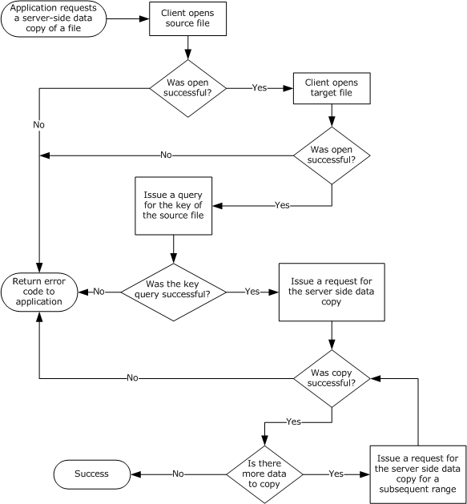{alt="Application requesting a server-side data copy" width="5.5625in" height="5.989583333333333in"}

The method for requesting the key to the source file and for requesting the server-side copy of data ranges is outlined in the following sections.

###### Application Requests a Source File Key

The application provides:

- A handle to the Open identifying a file for which the application requires a key to use in server-side data operations.

If the handle is invalid, or if no **Open** referenced by the handle is found, the client MUST return an implementation-specific error code. If the handle is valid and **Open** is found, the client MUST proceed as follows.

For the specified **Open**, the client MUST select a connection as specified in section [3.2.4.1.7](#Section_0f4bdf46b6be446db5c91338b2c9c9de). If no connection is available, the client MUST fail the [**FSCTL**](#gt_4ffb96a7-5fad-488e-9438-b7707d2e4226) operation.

Otherwise, the client initializes an [SMB2 IOCTL Request](#Section_5c03c9d615de48a298358fb37f8a79d8) following the syntax specified in section 2.2.31. The [SMB2 header](#Section_5cd6452260b34f3ea157fe66f1228052) MUST be initialized as follows:

- The **Command** field is set to SMB2 IOCTL.

- The **MessageId** field is set as specified in section [3.2.4.1.3](#Section_5c5f53169936417b92214686de25d414).

- The **SessionId** field is set to **Open.TreeConnect.Session.SessionId**.

- The **TreeId** field is set to **Open.TreeConnect.TreeConnectId**.

The SMB2 IOCTL Request MUST be initialized as specified in section 2.2.31, with the exception of the following values:

- The **CtlCode** field is set to the FSCTL_SRV_REQUEST_RESUME_KEY.

- The **FileId** field is set to **Open.FileId**.

- The **InputCount** field is set to 0.

- The **OutputOffset** field SHOULD[]{#Appendix_A_Target_167 .anchor}[\<167\>](#Appendix_A_167) be set to 0.

- The **MaxInputResponse** field is set to 0.

- The **MaxOutputResponse** field is set to 32.

- SMB2_0_IOCTL_IS_FSCTL is set to TRUE in the **Flags** field.

The request MUST be sent to the server.

###### Application Requests a Server Side Data Copy

The application provides:

- A handle to the Open identifying the destination file.

- The [**FSCTL**](#gt_4ffb96a7-5fad-488e-9438-b7707d2e4226) code for the server side copy, either FSCTL_SRV_COPYCHUNK or FSCTL_SRV_COPYCHUNK_WRITE.[]{#Appendix_A_Target_168 .anchor}[\<168\>](#Appendix_A_168)

- The key for the source file queried, as specified in the previous section \"Application Requests a Source File Key\".

- An array of ranges to copy. Each item in the array MUST contain the source offset, the destination offset, and the number of bytes to copy.

If the handle is invalid, or if no **Open** referenced by the handle is found, the client MUST return an implementation-specific error code. If the handle is valid and **Open** is found, the client MUST proceed as follows.

For the specified **Open**, the client MUST select a connection as specified in section [3.2.4.1.7](#Section_0f4bdf46b6be446db5c91338b2c9c9de). If no connection is available, the client MUST fail the FSCTL operation.

Otherwise, the client initializes an [SMB2 IOCTL Request](#Section_5c03c9d615de48a298358fb37f8a79d8) following the syntax specified in section 2.2.31. The [SMB2 header](#Section_5cd6452260b34f3ea157fe66f1228052) MUST be initialized as follows:

- The **Command** field is set to SMB2 IOCTL.

- The **MessageId** field is set as specified in section [3.2.4.1.3](#Section_5c5f53169936417b92214686de25d414).

- The **SessionId** field is set to **Open.TreeConnect.Session.SessionId**.

- The **TreeId** field is set to **Open.TreeConnect.TreeConnectId**.

The SMB2 IOCTL Request MUST be initialized as follows:

- The **CtlCode** field MUST be set to the FSCTL code supplied by the application.

- The **FileId** field is set to **Open.FileId**.

- The **Buffer** field is set to an SRV_COPYCHUNK_COPY Request, as specified in section [2.2.31.1](#Section_1c91ae6146ad4953805fafc06ce4c70b).

  - The **SourceKey** field is set to the key of the source file.

  - For each range to be copied, the client initializes the **Chunks** field following the syntax specified in section [2.2.31.1.1](#Section_676ae4b4675849309f73f0853fcad081) using the application provided source offset, destination offset, and length, in bytes.

  - The **ChunkCount** is set to the number of chunks being sent.

- The **InputOffset** field is set to the offset to the **Buffer**, in bytes, from the beginning of the SMB2 header.

- The **InputCount** is set to the size, in bytes, of the **Buffer** field.

- The **OutputOffset** field SHOULD[]{#Appendix_A_Target_169 .anchor}[\<169\>](#Appendix_A_169) be set to zero.

- The **OutputCount** field is set to 0.

- The **MaxInputResponse** field is set to 0.

- The **MaxOutputResponse** field is set to the size of a [SRV_COPYCHUNK_RESPONSE](#Section_80d85df3a4dc4418ac7e93dd67e423e9) structure, as specified in section 2.2.32.1.

- SMB2_0_IOCTL_IS_FSCTL is set to TRUE in the **Flags** field.

The request MUST be sent to the server.

##### Application Requests DFS Referral Information

The application provides the following:

- **ServerName**: The name of the server from which to query referrals.

- **UserCredentials**: An opaque implementation-specific entity that identifies the credentials to be used when authenticating to the remote server.

- The maximum output buffer response size, in bytes.

- An input buffer containing the application-provided structure **REQ_GET_DFS_REFERRAL** specified in [\[MS-DFSC\]](%5bMS-DFSC%5d.pdf#Section_3109f4be2dbb42c99b8e0b34f7a2135e) section 2.2.2 or **REQ_GET_DFS_REFERRAL_EX** specified in \[MS-DFSC\] section 2.2.3.

- The [**FSCTL**](#gt_4ffb96a7-5fad-488e-9438-b7707d2e4226) code for DFS referral information, either FSCTL_DFS_GET_REFERRALS or FSCTL_DFS_GET_REFERRALS_EX.

The client MUST search for an existing **Session** and **TreeConnect** to any share on the server identified by **ServerName** for the user identified by **UserCredentials**. If no **Session** and **TreeConnect** are found, the client MUST establish a new **Session** and **TreeConnect** to IPC\$ on the target server as described in section [3.2.4.2](#Section_61c686670b8c4300ac8a246a86f2b11d) using the supplied **ServerName** and **UserCredentials**.

The client initializes an [SMB2 IOCTL Request](#Section_5c03c9d615de48a298358fb37f8a79d8) following the syntax specified in section 2.2.31. The [SMB2 header](#Section_5cd6452260b34f3ea157fe66f1228052) MUST be initialized as follows:

- The **Command** field is set to SMB2 IOCTL.

- The **MessageId** field is set as specified in section [3.2.4.1.3](#Section_5c5f53169936417b92214686de25d414).

- The **SessionId** field is set to **Session.SessionId**.

- The **TreeId** field is set to **TreeConnect.TreeConnectId**.

The SMB2 IOCTL Request MUST be initialized as follows:

- The **CtlCode** field is set to the application-provided FSCTL code.

- The **FileId** field is set to { 0xFFFFFFFFFFFFFFFF, 0xFFFFFFFFFFFFFFFF }.

- The **InputOffset** field is set to the offset to the **Buffer\[\]**, in bytes, from the beginning of the SMB2 header.

- The **InputCount** field is set to the size of the **Buffer** field.

- The **OutputOffset** field SHOULD[]{#Appendix_A_Target_170 .anchor}[\<170\>](#Appendix_A_170) be set to zero.

- The **OutputCount** field is set to 0.

- The **MaxInputResponse** field is set to 0.

- The **MaxOutputResponse** field is set to the maximum response buffer size that the calling application will accept.

- SMB2_0_IOCTL_IS_FSCTL is set to TRUE in the **Flags** field.

- **Buffer** is set to the application-provided input buffer.

The request MUST be sent to the server using the **Session** and **TreeConnect** obtained as a result of connecting to the IPC\$ share on the server.

##### Application Requests a Pipe Transaction

The application provides:

- A handle to the **Open** identifying the named pipe on which to issue the operation.

- An input buffer.

- A maximum output buffer response size, in bytes.

If the handle is invalid, or if no **Open** referenced by the handle is found, the client MUST return an implementation-specific error code. If the handle is valid and **Open** is found, the client MUST proceed as follows.

For the specified **Open**, the client MUST select a connection as specified in section [3.2.4.1.7](#Section_0f4bdf46b6be446db5c91338b2c9c9de). If no connection is available, the client MUST fail the [**FSCTL**](#gt_4ffb96a7-5fad-488e-9438-b7707d2e4226) operation.

Otherwise, the client initializes an [SMB2 IOCTL Request](#Section_5c03c9d615de48a298358fb37f8a79d8) following the syntax specified in section 2.2.31. The [SMB2 header](#Section_5cd6452260b34f3ea157fe66f1228052) MUST be initialized as follows:

- The **Command** field is set to SMB2 IOCTL.

- The **MessageId** field is set as specified in section [3.2.4.1.3](#Section_5c5f53169936417b92214686de25d414).

- The **SessionId** field is set to **Open.TreeConnect.Session.SessionId**.

- The **TreeId** field is set to **Open.TreeConnect.TreeConnectId**.

The SMB2 IOCTL Request MUST be initialized as follows:

- The **CtlCode** field is set to FSCTL_PIPE_TRANSCEIVE.

- The **FileId** field is set to **Open.FileId**.

- The **InputOffset** field is set to the offset to the **Buffer\[\]**, in bytes, from the beginning of the SMB2 header.

- The **InputCount** field is set to the size, in bytes, of the application-provided input buffer.

- The **OutputOffset** field SHOULD[]{#Appendix_A_Target_171 .anchor}[\<171\>](#Appendix_A_171) be set to zero.

- The **OutputCount** field is set to 0.

- The input buffer that is received from the application is copied into the request at **InputOffset** bytes from the beginning of the SMB2 header.

- The **MaxInputResponse** field is set to 0.

- The **MaxOutputResponse** field is set to the maximum output buffer size that the application will accept.

- SMB2_0_IOCTL_IS_FSCTL is set to TRUE in the **Flags** field.

The request MUST be sent to the server.

##### Application Requests a Peek at Pipe Data

The application provides:

- A handle to the **Open** identifying the named pipe on which to issue the operation.

- The number of bytes to peek at in the pipe buffer.

If the handle is invalid, or if no **Open** referenced by the handle is found, the client MUST return an implementation-specific error code. If the handle is valid and **Open** is found, the client MUST proceed as follows.

For the specified **Open**, the client MUST select a connection as specified in section [3.2.4.1.7](#Section_0f4bdf46b6be446db5c91338b2c9c9de). If no connection is available, the client MUST fail the [**FSCTL**](#gt_4ffb96a7-5fad-488e-9438-b7707d2e4226) operation.

Otherwise, the client initializes an [SMB2 IOCTL Request](#Section_5c03c9d615de48a298358fb37f8a79d8) following the syntax specified in section 2.2.31. The [SMB2 header](#Section_5cd6452260b34f3ea157fe66f1228052) MUST be initialized as follows:

- The **Command** field is set to SMB2 IOCTL.

- The **MessageId** field is set as specified in section [3.2.4.1.3](#Section_5c5f53169936417b92214686de25d414).

- The **SessionId** field is set to **Open.TreeConnect.Session.SessionId**.

- The **TreeId** field is set to **Open.TreeConnect.TreeConnectId**.

The SMB2 IOCTL Request MUST be initialized as specified in section 2.2.31, with the exception of the following values:

- The **CtlCode** field is set to FSCTL_PIPE_PEEK.

- The **FileId** field is set to **Open.FileId**.

- The **InputCount** field is set to 0.

- The **OutputOffset** field SHOULD[]{#Appendix_A_Target_172 .anchor}[\<172\>](#Appendix_A_172) be set to zero.

- The **MaxInputResponse** field is set to 0.

- The **MaxOutputResponse** field is set to the number of bytes that the client requires to peek at.

- SMB2_0_IOCTL_IS_FSCTL is set to TRUE in the **Flags** field.

The request MUST be sent to the server.

##### Application Requests a Pass-Through Operation

An SMB2 server MAY[]{#Appendix_A_Target_173 .anchor}[\<173\>](#Appendix_A_173) support pass-through operation requests.

The application provides:

- A handle to the **Open** identifying a file or named pipe on which to issue the operation.

- An input buffer.

- An output buffer.

- A maximum input buffer response size, in bytes.

- A maximum output buffer response size, in bytes.

- An operation code.

- A Boolean indicating whether the operation is an [**FSCTL**](#gt_4ffb96a7-5fad-488e-9438-b7707d2e4226) or an [**IOCTL**](#gt_09d6bc87-34ed-48e8-b4d4-962e90543462).

If the handle is invalid, or if no **Open** referenced by the handle is found, the client MUST return an implementation-specific error code. If the handle is valid and **Open** is found, the client MUST proceed as follows.

For the specified **Open**, the client MUST select a connection as specified in section [3.2.4.1.7](#Section_0f4bdf46b6be446db5c91338b2c9c9de). If no connection is available, the client MUST fail the FSCTL or IOCTL operation.

Otherwise, the client initializes an [SMB2 IOCTL Request](#Section_5c03c9d615de48a298358fb37f8a79d8) following the syntax specified in section 2.2.31. The [SMB2 header](#Section_5cd6452260b34f3ea157fe66f1228052) MUST be initialized as follows:

- The **Command** field is set to SMB2 IOCTL.

- The **MessageId** field is set as specified in section [3.2.4.1.3](#Section_5c5f53169936417b92214686de25d414).

- The **SessionId** field is set to **Open.TreeConnect.Session.SessionId**.

- The **TreeId** field is set to **Open.TreeConnect.TreeConnectId**.

The SMB2 IOCTL Request MUST be initialized as follows:

- The **CtlCode** field is set to the operation code that is received from the application.

- The **FileId** field is set to **Open.FileId**.

- The **InputOffset** field is set to the offset to the **Buffer\[\]**, in bytes, from the beginning of the SMB2 header.

- The **InputCount** field is set to the size, in bytes, of the application-provided input buffer.

- The input buffer received from the application is copied into the request at **InputOffset** bytes from the beginning of the SMB2 header.

- The **OutputOffset** field SHOULD[]{#Appendix_A_Target_174 .anchor}[\<174\>](#Appendix_A_174) be set to zero.

- The **OutputCount** field is set to 0.

- The **MaxInputResponse** field is set to the maximum input buffer response size, in bytes, that the application will accept.

- The **MaxOutputResponse** field is set to the maximum output buffer response size, in bytes, that the application will accept.

- If the operation is an FSCTL, SMB2_0_IOCTL_IS_FSCTL in the **Flags** field is set to TRUE. Otherwise, it is set to FALSE.

The request MUST be sent to the server.

##### Application Requests Content Information for a File

An application can request Content Information from the server that contains a set of hashes that can be used by the application to retrieve the contents of a specific file using the branch cache, as specified in [\[MS-PCCRC\]](%5bMS-PCCRC%5d.pdf#Section_51cb03f8c0dd45659882aeb5ab0fa07e). This request is not supported for the SMB 2.0.2 dialect. To retrieve the Content Information, the application provides the following:

- The **HashType**, as specified in section [2.2.31.2](#Section_9d15448255324424be1118c578893aa9).

- The **HashVersion**, as specified in section 2.2.31.2.

- The **HashRetrievalType**, as specified in section 2.2.31.2.

- A handle to the **Open** identifying the remote file with which the Content Information is associated.

- The maximum number of bytes to get from the associated Content Information data structure.

- The offset into the Content Information data structure, if the structure is being retrieved across multiple requests, in bytes.

If the handle is invalid, or if no **Open** referenced by the handle is found, the client MUST return an implementation-specific error code. If the handle is valid and **Open** is found, the client MUST proceed as follows.

For the specified **Open**, the client MUST select a connection as specified in section [3.2.4.1.7](#Section_0f4bdf46b6be446db5c91338b2c9c9de). If no connection is available, the client MUST fail this [**FSCTL**](#gt_4ffb96a7-5fad-488e-9438-b7707d2e4226) operation.

Otherwise, the client MUST perform the following:

If **Open.Connection.Dialect** is \"2.0.2\", fail the application request with STATUS_NOT_SUPPORTED. Otherwise, format a SMB2 IOCTL Request following the syntax specified in section [2.2.31](#Section_5c03c9d615de48a298358fb37f8a79d8). The SMB2 header MUST be initialized as follows:

- The **Command** field is set to SMB2 IOCTL.

- The **MessageId** field is set as specified in section [3.2.4.1.3](#Section_5c5f53169936417b92214686de25d414).

- The **SessionId** field is set to **Open.TreeConnect.Session.SessionId**.

- The **TreeId** field is set to **Open.TreeConnect.TreeConnectId**.

The SMB2 IOCTL Request MUST be initialized as follows:

- The **CtlCode** field is set to FSCTL_SRV_READ_HASH.

- The **FileId** field is set to **Open.FileId**.

- The **Buffer** field is set to an SRV_READ_HASH Request, as specified in section 2.2.31.2.

  - The client initializes an SRV_READ_HASH request structure following the syntax specified in section 2.2.31.2 using the application-provided hash type, hash version, hash retrieval type, length, and offset, in bytes.

- The **InputOffset** field is set to the offset to the Buffer, in bytes, from the beginning of the SMB2 header.

- The **InputCount** is set to the size, in bytes, of the **Buffer** field.

- The **OutputOffset** field SHOULD[]{#Appendix_A_Target_175 .anchor}[\<175\>](#Appendix_A_175) be set to zero.

- The **OutputCount** field is set to 0.

- The **MaxInputResponse** field is set to 0.

- The **MaxOutputResponse** field is set to the maximum number of bytes that the application expects to retrieve.

- The SMB2_0_IOCTL_IS_FSCTL in the **Flags** field is set to TRUE.

The request MUST be sent to the server, and the response from the server MUST be handled as described in section [3.2.5.14.7](#Section_6fcd5c0dfc0749e2be20becf4a0b6603).

The status of the response MUST be returned to the application.

##### Application Requests Resiliency on an Open File

The application provides the following:

- A handle to the **Open** identifying the file to on which to request resiliency.

- The time-out for which the server MUST hold the handle [**open**](#gt_0d572cce-4683-4b21-945a-7f8035bb6469) on behalf of the client after a network disconnection, in milliseconds.

If the handle is invalid, or if no **Open** referenced by the handle is found, the client MUST return an implementation-specific error code. If the handle is valid and **Open** is found, the client MUST proceed as follows.

For the specified **Open**, the client MUST select a connection as specified in section [3.2.4.1.7](#Section_0f4bdf46b6be446db5c91338b2c9c9de). If no connection is returned, the client MUST fail the request.

Otherwise, the client MUST perform the following:

If **Open.Connection.Dialect** is equal to \"2.0.2\", the client MUST fail the application request with STATUS_NOT_SUPPORTED. Otherwise, set **Open.ResilientTimeout** to the application supplied time-out.

The client initializes an [SMB2 IOCTL Request](#Section_5c03c9d615de48a298358fb37f8a79d8) following the syntax specified in section 2.2.31. The SMB2 header MUST be initialized as follows:

- The **Command** field is set to SMB2 IOCTL.

- The **MessageId** field is set as specified in section [3.2.4.1.3](#Section_5c5f53169936417b92214686de25d414).

- The **SessionId** field is set to **Open.TreeConnect.Session.SessionId**.

- The **TreeId** field is set to **Open.TreeConnect.TreeConnectId**.

The SMB2 IOCTL Request MUST be initialized as follows:

- The **CtlCode** field MUST be set to FSCTL_LMR_REQUEST_RESILIENCY.

- The **FileId** field MUST be set to **Open.FileId**.

- The **Buffer** field is set to a NETWORK_RESILIENCY_REQUEST Request, as specified in section [2.2.31.3](#Section_17061634f8d54367a0589b4f4a5d4d3c).

  - The **Timeout** field MUST be set to the application-provided time-out (in milliseconds).

- The **InputOffset** field MUST be set to the offset to the **Buffer**, in bytes, from the beginning of the SMB2 header.

- The **InputCount** field MUST be set to the size, in bytes, of the **Buffer** field.

- The **OutputOffset** field SHOULD[]{#Appendix_A_Target_176 .anchor}[\<176\>](#Appendix_A_176) be set to zero.

- The **OutputCount** field MUST be set to 0.

- The **MaxInputResponse** field MUST be set to 0.

- The **MaxOutputResponse** field MUST be set to 0.

- SMB2_0_IOCTL_IS_FSCTL in the **Flags** field MUST be set to TRUE.

The request MUST be sent to the server, and the response from the server MUST be handled as described in section [3.2.5.14.9](#Section_858b331f45094e228a14afa0dcb47317).

The status of the response MUST be returned to the application.

##### Application Requests Waiting for a Connection to a Pipe

The application provides:

- A handle to the **TreeConnect** identifying the connection to the IPC\$ share.

- The name of the [**named pipe**](#gt_34f1dfa8-b1df-4d77-aa6e-d777422f9dca), omitting any prefixes such as \"\\pipe\\\".

- An optional timeout value indicating the maximum amount of time to wait for availability of the pipe, in units of 100 milliseconds.

If the handle is invalid, or if no **TreeConnect** referenced by the tree connect handle is found, the client MUST return an implementation-specific error code locally to the calling application.

If the length of the name of the named pipe is greater than 0xFFFF, the client MUST fail the request and return STATUS_INVALID_PARAMETER to the calling application.

The client initializes an [SMB2 IOCTL Request](#Section_5c03c9d615de48a298358fb37f8a79d8) following the syntax specified in section 2.2.31. The [SMB2 header](#Section_5cd6452260b34f3ea157fe66f1228052) MUST be initialized as follows:

- The **Command** field is set to SMB2 IOCTL.

- The **MessageId** field is set as specified in section [3.2.4.1.3](#Section_5c5f53169936417b92214686de25d414).

- The **SessionId** field is set to **TreeConnect.Session.SessionId**.

- The **TreeId** field is set to **TreeConnect.TreeConnectId**.

The SMB2 IOCTL Request MUST be initialized as specified in section 2.2.31, with the exception of the following values:

- The **CtlCode** field is set to FSCTL_PIPE_WAIT.

- The **FileId** field is set to { 0xFFFFFFFFFFFFFFFF, 0xFFFFFFFFFFFFFFFF }.

- The **MaxInputResponse** field is set to 0.

- The **MaxOutputResponse** field is set to 0.

- SMB2_0_IOCTL_IS_FSCTL is set to TRUE in the **Flags** field.

- The **Buffer** field is set to an FSCTL_PIPE_WAIT Request, as specified in [\[MS-FSCC\]](%5bMS-FSCC%5d.pdf#Section_efbfe12773ad41409967ec6500e66d5e) section 2.3.49.

  - **Timeout** is set to the application provided timeout value, or 0 if none was provided.

  - **TimeoutSpecified** is set to TRUE if the application provided a timeout value, or FALSE otherwise.

  - **Name** is set to the name of the named pipe.

  - **NameLength** is set to the length, in bytes, of the **Name** field.

- The **InputOffset** field is set to the offset to the **Buffer**, in bytes, from the beginning of the SMB2 header.

- The **InputCount** field is set to the size, in bytes, of the **Buffer** field.

The request MUST be sent to the server.

##### Application Requests Querying Server\'s Network Interfaces

This optional interface is applicable only for the SMB 3.x dialect family.

The application provides:

- A handle to the **TreeConnect**.

If the handle is invalid, or if no **TreeConnect** referenced by the tree connect handle is found, the client MUST return an implementation-specific error code locally to the calling application.

The client initializes an SMB2 IOCTL Request following the syntax specified in section [2.2.31](#Section_5c03c9d615de48a298358fb37f8a79d8). The SMB2 header MUST be initialized as follows:

- The **Command** field is set to SMB2 IOCTL.

- The **MessageId** field is set as specified in section [3.2.4.1.3](#Section_5c5f53169936417b92214686de25d414).

- The **SessionId** field is set to **TreeConnect.Session.SessionId**.

- The **TreeId** field is set to **TreeConnect.TreeConnectId**.

The SMB2 IOCTL Request MUST be initialized as specified in section 2.2.31, with the exception of the following values:

- The **CtlCode** field is set to FSCTL_QUERY_NETWORK_INTERFACE_INFO.

- The **FileId** field is set to { 0xFFFFFFFFFFFFFFFF, 0xFFFFFFFFFFFFFFFF }.

- The **InputCount** field is set to 0.

- The **MaxInputResponse** field is set to 0.

- The **MaxOutputResponse** field is set to an implementation-specific[]{#Appendix_A_Target_177 .anchor}[\<177\>](#Appendix_A_177) value.

- SMB2_0_IOCTL_IS_FSCTL is set to TRUE in the **Flags** field.

The request SHOULD be signed as specified in section [3.2.4.1.1](#Section_973630a88aa1439889a813cf830f194d). The request MUST be sent to the server.

##### Application Requests Remote Shared Virtual Disk File Control Operation

The application provides:

- A handle to the Open identifying a shared virtual disk file for which the application requires access.

- Operation Control code.

- Control code payload.

- The maximum output buffer size that it will accept.

If the handle is invalid, or if no **Open** referenced by the handle is found, the client MUST return an implementation-specific error code. If the handle is valid and **Open** is found, the client MUST proceed as follows.

For the specified **Open**, the client MUST select a connection as specified in section [3.2.4.1.7](#Section_0f4bdf46b6be446db5c91338b2c9c9de). If no connection is available, the client MUST fail the request.

Otherwise, the client initializes an SMB2 IOCTL Request following the syntax specified in section [2.2.31](#Section_5c03c9d615de48a298358fb37f8a79d8). The SMB2 header MUST be initialized as follows:

- The **Command** field is set to SMB2 IOCTL.

- The **MessageId** field is set as specified in section [3.2.4.1.3](#Section_5c5f53169936417b92214686de25d414).

- The **SessionId** field is set to **Open.TreeConnect.Session.SessionId**.

- The **TreeId** field is set to **Open.TreeConnect.TreeConnectId**.

The SMB2 IOCTL Request MUST be initialized as follows:

- The **CtlCode** field is set to the application provided control code value.

- The **FileId** field is set to **Open.FileId**.

- The **InputOffset** field MUST be set to the offset from the start of the SMB2 header to the beginning of the **Buffer** field.

- The **InputCount** field is set to the size, in bytes, of the input **Buffer** data.

- The **OutputOffset** field SHOULD[]{#Appendix_A_Target_178 .anchor}[\<178\>](#Appendix_A_178) be set to zero.

- The **OutputCount** field is set to 0.

- The **MaxInputResponse** field is set to 0.

- The **MaxOutputResponse** field is set to the maximum output buffer size that the application will accept.

- The application provided control code payload MUST be copied into **Buffer** field.

- SMB2_0_IOCTL_IS_FSCTL is set to TRUE in the **Flags** field.

The request MUST be sent to the server.

##### Application Requests Extent Duplication

The application provides the following:

- **SourceHandle**: A handle to the **Open** identifying a source file from which the extent is to be copied.

- **TargetHandle**: A handle to the **Open** identifying a file on which to issue the operation.

- **SourceOffset**: The file offset, in bytes, of the start of a range of bytes in a file from which the data is to be copied.

- **DestinationOffset**: The file offset, in bytes, of the start of a range of bytes in a file to which the data is to be copied.

- **ByteCount**: The number of bytes to copy from source to target.

If the **SourceHandle** or **TargetHandle** is invalid, or if no **Open** referenced by these handles is found, the client MUST return an implementation-specific error code. If these handles are valid and the **Open** is found, the client MUST proceed as follows:

- The client initializes an SMB2 IOCTL Request following the syntax specified in section [2.2.31](#Section_5c03c9d615de48a298358fb37f8a79d8). The SMB2 header MUST be initialized as follows:

- The **Command** field is set to SMB2 IOCTL.

- The **MessageId** field is set as specified in section [3.2.4.1.3](#Section_5c5f53169936417b92214686de25d414).

- The **SessionId** field is set to **TreeConnect.Session.SessionId** of the **Open** referenced by **TargetHandle**.

- The **TreeId** field is set to **TreeConnect.TreeConnectId** of the **Open** referenced by **TargetHandle**.

The SMB2 IOCTL Request MUST be initialized as specified in section 2.2.31, with the exception of the following values:

- The **CtlCode** field is set to FSCTL_DUPLICATE_EXTENTS_TO_FILE.

- The **FileId** field is set to the FileID of the **Open** referenced by **TargetHandle**.

- The **MaxInputResponse** field is set to 0.

- The **MaxOutputResponse** field is set to 0.

- SMB2_0_IOCTL_IS_FSCTL is set to TRUE in the **Flags** field.

- The **Buffer** field is set to an SMB2_DUPLICATE_EXTENTS_DATA Request, as specified in [\[MS-FSCC\]](%5bMS-FSCC%5d.pdf#Section_efbfe12773ad41409967ec6500e66d5e) section 2.3.7.2:

  - **SourceFileID** is set to the **FileID** of the **Open** referenced by **SourceHandle**.

  - **SourceFileOffset** is set to the application-provided **SourceOffset**.

  - **DestinationFileOffset** is set to the application-provided **DestinationOffset**.

  - **ByteCount** is set to the application-provided **ByteCount**.

- The **InputOffset** field is set to the offset to the **Buffer**, in bytes, from the beginning of the SMB2 header.

- The **InputCount** field is set to the size, in bytes, of the **Buffer** field.

The request MUST be sent to the server.

##### Application Requests Extended Extent Duplication

The application provides the following:

- **SourceHandle**: A handle to the **Open** identifying a source file from which the extent is to be copied.

- **TargetHandle**: A handle to the **Open** identifying a file on which to issue the operation.

- **SourceOffset**: The file offset, in bytes, of the start of a range of bytes in a file from which the data is to be copied.

- **DestinationOffset**: The file offset, in bytes, of the start of a range of bytes in a file to which the data is to be copied.

- **ByteCount**: The number of bytes to copy from source to target.

- **Flags**: Flags indicating how to process the request, as specified in [\[MS-FSCC\]](%5bMS-FSCC%5d.pdf#Section_efbfe12773ad41409967ec6500e66d5e) section 2.3.9.2.

If the **SourceHandle** or **TargetHandle** is invalid, or if no **Open** referenced by these handles is found, the client MUST return an implementation-specific error code. If these handles are valid and the **Open** is found, the client MUST proceed as follows:

- The client initializes an SMB2 IOCTL Request following the syntax specified in section [2.2.31](#Section_5c03c9d615de48a298358fb37f8a79d8). The SMB2 header MUST be initialized as follows:

- The **Command** field is set to SMB2 IOCTL.

- The **MessageId** field is set as specified in section [3.2.4.1.3](#Section_5c5f53169936417b92214686de25d414).

- The **SessionId** field is set to **TreeConnect.Session.SessionId** of the **Open** referenced by **TargetHandle**.

- The **TreeId** field is set to **TreeConnect.TreeConnectId** of the **Open** referenced by **TargetHandle**.

The SMB2 IOCTL Request MUST be initialized as specified in section 2.2.31, with the exception of the following values:

- The **CtlCode** field is set to FSCTL_DUPLICATE_EXTENTS_TO_FILE_EX.

- The **FileId** field is set to the **FileID** of the **Open** referenced by **TargetHandle**.

- The **MaxInputResponse** field is set to 0.

- The **MaxOutputResponse** field is set to 0.

- SMB2_0_IOCTL_IS_FSCTL is set to TRUE in the **Flags** field.

- The **Buffer** field is set to an SMB2_DUPLICATE_EXTENTS_DATA_EX request, as specified in \[MS-FSCC\] section 2.3.9.2:

  - **StructureSize** is set to 0x30.

  - **SourceFileID** is set to the **FileID** of the **Open** referenced by **SourceHandle**.

  - **SourceFileOffset** is set to the application-provided **SourceOffset**.

  - **DestinationFileOffset** is set to the application-provided **DestinationOffset**.

  - **ByteCount** is set to the application-provided **ByteCount**.

  - **Flags** is set to the application-provided **Flags**.

- The **InputOffset** field is set to the offset to the **Buffer**, in bytes, from the beginning of the SMB2 header.

- The **InputCount** field is set to the size, in bytes, of the **Buffer** field.

The request MUST be sent to the server.

#### Application Requests Unlocking of an Array of Byte Ranges[[[]{.indexref entry="Higher-layer triggered events:client:requesting unlocking of array of byte ranges"}]{.indexref entry="Client:higher-layer triggered events:requesting unlocking of array of byte ranges"}]{.indexref entry="Triggered events – higher layer:client:requesting unlocking of array of byte ranges"}

The application provides:

- A handle to the **Open** identifying a file.

- An array of byte ranges to unlock. For each range, the application provides:

  - A starting offset, in bytes.

  - A length, in bytes.

If the handle is invalid, or if no **Open** referenced by the handle is found, the client MUST return an implementation-specific error code. If the handle is valid and **Open** is found, the client MUST proceed as follows.

For the specified **Open**, the client MUST select a connection as specified in section [3.2.4.1.7](#Section_0f4bdf46b6be446db5c91338b2c9c9de). If no connection is returned, the client MUST fail the application request.

Otherwise, the client initializes an [SMB2 LOCK Request](#Section_6178b96048b64999b589669f88e9017d) following the syntax specified in section 2.2.26. The [SMB2 header](#Section_5cd6452260b34f3ea157fe66f1228052) MUST be initialized as follows:

- The **Command** field is set to SMB2 LOCK.

- The **MessageId** field is set as specified in section [3.2.4.1.3](#Section_5c5f53169936417b92214686de25d414).

- The **SessionId** field is set to **Open.TreeConnect.Session.SessionId**.

- The **TreeId** field is set to **Open.TreeConnect.TreeConnectId**.

The SMB2 LOCK Request MUST be initialized as follows:

- The **FileId** field is set to **Open.FileId**.

- The **LockCount** field is set to the number of byte ranges being unlocked.

- For each range being unlocked, the client creates an [SMB2_LOCK_ELEMENT](#Section_73e941c79b0742f68b0f31c1a2cbf0b2) structure and places it in the **Locks\[\]** array of the request, setting the following values:

  - The offset is set to the offset of the range being unlocked.

  - The length is set to the length of the range to be unlocked.

  - The client sets SMB2_LOCKFLAG_UNLOCK to TRUE in the **Flags** field.

If any of the Booleans **Open.ResilientHandle**, **Open.IsPersistent**, or **Connection.SupportsMultiChannel** are TRUE, the client MUST do the following:

- The client MUST scan through **Open.OperationBuckets** and find an entry with its **Free** element set to TRUE. If no such entry could be found, an implementation-specific error MUST be returned to the application.

- Set the **Free** element of the chosen entry to FALSE.

- The fields of the SMB2 lock request MUST be set as follows:

  - **LockSequenceIndex** is set to the index value of the chosen entry.

  - **LockSequenceNumber** is set to the **SequenceNumber** of the chosen entry.

Otherwise the client MUST set **LockSequenceIndex** and **LockSequenceNumber** to 0.

The request MUST be sent to the server.

#### Application Requests Closing a Share Connection[[[]{.indexref entry="Higher-layer triggered events:client:requesting closing of share connection"}]{.indexref entry="Client:higher-layer triggered events:requesting closing of share connection"}]{.indexref entry="Triggered events – higher layer:client:requesting closing of share connection"}

The application provides a handle to the **TreeConnect**. If the handle is invalid, or if no **TreeConnect** referenced by the handle is found, the client MUST return an implementation-specific error code locally to the calling application. If the handle is valid and a **TreeConnect** is found, the client MUST enumerate all open files on **TreeConnect.Session.Connection.OpenTable** and close those Opens where **Open.TreeConnect** matches the **TreeConnect** by issuing an SMB2 CLOSE as specified in section [3.2.4.5](#Section_fcc1cd9af2c5489dbf90143826b3041e).

The client initializes an [SMB2 TREE_DISCONNECT Request](#Section_8a622ecbffee41b9b4c483ff2d3aba1b) following the syntax specified in section 2.2.11. The [SMB2 header](#Section_5cd6452260b34f3ea157fe66f1228052) MUST be initialized as follows:

- The **Command** field is set to SMB2 TREE_DISCONNECT.

- The **MessageId** field is set as specified in section [3.2.4.1.3](#Section_5c5f53169936417b92214686de25d414).

- The **SessionId** field is set to **TreeConnect.Session.SessionId**.

- The **TreeId** field is set to **TreeConnect.TreeConnectId**.

The SMB2 TREE_DISCONNECT Request MUST be initialized to the default values, as specified in 2.2.11.

The request MUST be sent to the server.

#### Application Requests Terminating an Authenticated Context[[[]{.indexref entry="Higher-layer triggered events:client:requesting termination of authenticated context"}]{.indexref entry="Client:higher-layer triggered events:requesting termination of authenticated context"}]{.indexref entry="Triggered events – higher layer:client:requesting termination of authenticated context"}

The application provides a handle to the **Session**. If the handle is invalid, or if no **Session** referenced by the handle is found, the client MUST return an implementation-specific error code locally to the calling application. If the handle is valid and a **Session** is found, the client MUST close all [**tree connects**](#gt_c65d1989-3473-4fa9-ac45-6522573823e3) in the **Session.TreeConnectTable**, as specified in section [3.2.4.22](#Section_77968a7e4b47464eb15a6628223ce75f).

The client initializes an [SMB2 LOGOFF Request](#Section_abdc4ea952df480e9a3634f104797d2c), following the syntax specified in section 2.2.7. The [SMB2 header](#Section_5cd6452260b34f3ea157fe66f1228052) MUST be initialized as follows:

- The **Command** field is set to SMB2 LOGOFF.

- The **MessageId** field is set as specified in section [3.2.4.1.3](#Section_5c5f53169936417b92214686de25d414).

- The **SessionId** field is set to **Session.SessionId**.

The SMB2 LOGOFF Request MUST be initialized to the default values, as specified in 2.2.7.

The request MUST be sent to the server.

#### Application Requests Canceling an Operation[[[]{.indexref entry="Higher-layer triggered events:client:requesting cancellation of operation"}]{.indexref entry="Client:higher-layer triggered events:requesting cancellation of operation"}]{.indexref entry="Triggered events – higher layer:client:requesting cancellation of operation"}

The application provides the **CancelId** of the operation that is to be canceled.

The client MUST enumerate all connections in the **ConnectionTable** and look up a **Request** in **Connection.OutstandingRequests** where **Request.CancelId** matches the application-supplied **CancelId**. If there is a match, the client performs the following:

The client initializes an [SMB2 CANCEL Request](#Section_91913fc64ec94a83961b370070067e63) following the syntax specified in section 2.2.30. The [SMB2 header](#Section_5cd6452260b34f3ea157fe66f1228052) is initialized as follows:

- The **Command** field MUST be set to SMB2 CANCEL.

- The **MessageId** field SHOULD[]{#Appendix_A_Target_179 .anchor}[\<179\>](#Appendix_A_179) be set to the identifier that is previously used for the request being canceled. Because the same **MessageId** is reused, cancel requests MUST NOT consume a [**sequence number**](#gt_9c2d7dfc-4958-48b1-bbab-f23e97e71ff3).

- If **Request.AsyncId** is not empty, indicating that the command has previously returned an interim response, the client sets **AsyncId** to **Request.AsyncId** and SMB2_FLAGS_ASYNC_COMMAND to TRUE in the **Flags** field and sets **AsyncId** to **Request.AsyncId**.

The **SessionId** field MUST be set to the session identifier that is previously used for the request being canceled. If the session identified by **SessionId** has **Session.SigningRequired** equal to TRUE, the client sets SMB2_FLAGS_SIGNED to TRUE in the **Flags** field. The SMB2 CANCEL Request MUST be initialized to the default values, as specified in 2.2.30.

The request MUST be sent to the server.

No status is returned to the caller.

#### Application Requests the Session Key for an Authenticated Context[[[]{.indexref entry="Higher-layer triggered events:client:requesting session key for authenticated context"}]{.indexref entry="Client:higher-layer triggered events:requesting session key for authenticated context"}]{.indexref entry="Triggered events – higher layer:client:requesting session key for authenticated context"}

The application provides a handle to an **Open** established on the session of interest. If the handle is invalid or if no **Open** referenced by the handle is found, the client MUST return an implementation-specific error code locally to the calling application. If the handle is valid and an **Open** is found and the **Open.TreeConnect** is NULL, the client MUST return an implementation-specific error code locally to the calling application. If the handle is valid and an **Open** is found and the **Open.TreeConnect** is not NULL, the client MUST do the following:

If **Connection.Dialect** belongs to the SMB 3.x dialect family, the client MUST return **Open.TreeConnect.Session.ApplicationKey**. Otherwise, the client MUST return **Open.TreeConnect.Session.SessionKey**.

#### Application Requests Number of Opens on a Tree Connect[[[]{.indexref entry="Higher-layer triggered events:client:requesting number of opens on tree connect"}]{.indexref entry="Client:higher-layer triggered events:requesting number of opens on tree connect"}]{.indexref entry="Triggered events – higher layer:client:requesting number of opens on tree connect"}

The application provides a handle to the **TreeConnect** representing the share to be queried.

The client MUST determine the total number of opens on the **TreeConnect** by enumerating the **Opens** in **TreeConnect.Session.Connection.OpenTable** and counting those **Opens** where **Open.TreeConnect** matches the **TreeConnect**. The resulting count is returned to the calling application.

#### Application Notifies Offline Status of a Server[[[]{.indexref entry="Higher-layer triggered events:client:notifying offline status of server"}]{.indexref entry="Client:higher-layer triggered events:notifying offline status of server"}]{.indexref entry="Triggered events – higher layer:client:notifying offline status of server"}

This optional interface is applicable only for the SMB 3.x dialect family. The application provides the following:

- **ServerName**: The name of the server which became unavailable.

For each **Connection** in the **ConnectionTable** where **Connection.ServerName** matches **ServerName**, the client MUST determine if any **TreeConnect** exists in the **Session.TreeConnectTable** with **TreeConnect.IsScaleoutShare** set to TRUE.

If a tree connect entry is found, the client MUST do the following:

- Disconnect the connection by performing the steps as specified in section [3.2.7.1](#Section_ae543f57d9934905bce03cfc446c1fbb).

- Invoke the event as specified in section [3.2.4.28](#Section_e8460ef725034c67a6192eb2473ac1bb) with **ServerName** set to the caller-supplied **ServerName**.

If no tree connect entry is found, the client MUST disconnect the connection by performing the steps as specified in section 3.2.7.1.

#### Application Notifies Online Status of a Server[[[]{.indexref entry="Higher-layer triggered events:client:notifying online status of server"}]{.indexref entry="Client:higher-layer triggered events:notifying online status of server"}]{.indexref entry="Triggered events – higher layer:client:notifying online status of server"}

This optional interface is applicable only for the SMB 3.x dialect family. The application provides the following:

- **ServerName**: The name of the server which became available.

For each **Open** in the **GlobalFileTable**, where **Open.Session.ChannelList** is empty and the server name identified from **Open.FileName** matches **ServerName**, the client MUST re-establish the durable open as specified in section [3.2.4.4](#Section_3309c3d13daf44489faa81d2d6aa3315).

#### Application Requests Moving to a Server Instance[[[]{.indexref entry="Higher-layer triggered events:client:requesting move to server instance"}]{.indexref entry="Client:higher-layer triggered events:requesting move to server instance"}]{.indexref entry="Triggered events – higher layer:client:requesting move to server instance"}

This optional interface is applicable only for SMB 3.x dialect family. The application provides the following:

- **ServerName**: The name of the server.

- **NewServerAddress**: The IPv4 or IPv6 address of the server which the client is required to move to.

For each **Connection** in the **ConnectionTable** where **Connection.ServerName** matches **ServerName**, the client MUST disconnect the connection by performing the steps as specified in section [3.2.7.1](#Section_ae543f57d9934905bce03cfc446c1fbb).

For each **Open** in the **GlobalFileTable**, where **Open.Session.ChannelList** is empty and the server name identified from **Open.FileName** matches **ServerName**, the client MUST re-establish the durable open as specified in section [3.2.4.4](#Section_3309c3d13daf44489faa81d2d6aa3315), and by using **NewServerAddress** as the **TransportIdentifier** for the rules specified in section [3.2.4.2](#Section_61c686670b8c4300ac8a246a86f2b11d).

### Processing Events and Sequencing Rules[[[[]{.indexref entry="Message processing:client:overview"}]{.indexref entry="Client:message processing:overview"}]{.indexref entry="Sequencing rules:client:overview"}]{.indexref entry="Client:sequencing rules:overview"}

The SMB 2 Protocol client is driven by a series of response messages that are sent by the server. Processing for these messages is determined by the command in the [SMB2 header](#Section_5cd6452260b34f3ea157fe66f1228052) of the response and is detailed for each of the SMB2 response messages in the sections that follow.

#### Receiving Any Message[[[[]{.indexref entry="Message processing:client:receiving any message"}]{.indexref entry="Client:message processing:receiving any message"}]{.indexref entry="Sequencing rules:client:receiving any message"}]{.indexref entry="Client:sequencing rules:receiving any message"}

If the client implements the SMB 3.x dialect family and **ProtocolId** in the header of the received message is 0x424D53FD, the client MUST decrypt the message as specified in section [3.2.5.1.1.1](#Section_d3c03e337dc74d5884280a1484c5c874) before performing the following steps.

If the client implements the SMB 3.1.1 dialect and **ProtocolId** in the header of the received message is 0x424D53FC, the client MUST decompress the message as specified in section [3.2.5.1.1.2](#Section_cd3396cadafd4712af2c7e0cdff5758e) before performing the following steps.

If **ProtocolId** in the header of the received message is 0x424D53FE, the client MUST perform the following:

- Unless specifically noted in a subsequent section, the following logic MUST be applied to any response message that is received from the server by the client. If the status code in the SMB2 header is not equal to STATUS_SUCCESS, the client SHOULD[]{#Appendix_A_Target_180 .anchor}[\<180\>](#Appendix_A_180) retry the operation, in an implementation-specific manner, on the same or different channel. The client MUST ignore the **CreditCharge** field in the SMB2 header.

- If the message size received exceeds **Connection.MaxTransactSize**, the client MAY disconnect the connection.

Otherwise, the client MUST disconnect the connection as specified in section [3.2.7.1](#Section_ae543f57d9934905bce03cfc446c1fbb).

##### Handling the Transformed Message

###### Decrypting the Message

This section is applicable for only the SMB 3.x dialect family.[]{#Appendix_A_Target_181 .anchor}[\<181\>](#Appendix_A_181)

If **IsEncryptionSupported** is TRUE and **Connection.CipherId** is not zero, the client MUST perform the following:

- If the size of the message received from the server is not greater than the size of SMB2 TRANSFORM_HEADER as specified in section [2.2.41](#Section_d6ce2327a4c94793be667b5bad2175fa), the client MUST disconnect the connection as specified in section [3.2.7.1](#Section_ae543f57d9934905bce03cfc446c1fbb).

- If the **Flags/EncryptionAlgorithm** in the SMB2 TRANSFORM_HEADER is not 0x0001, the client MUST disconnect the connection as specified in section 3.2.7.1.

- The client MUST look up the session in the **Connection.SessionTable** using the **SessionId** in the SMB2 TRANSFORM_HEADER of the response. If the session is not found, the client MUST disconnect the connection as specified in section 3.2.7.1.

- The client MUST decrypt the message using **Session.DecryptionKey**. If **Connection.Dialect** is \"3.1.1\", the algorithm specified by **Connection.CipherId** is used. Otherwise, the AES-128-CCM algorithm is used. The client passes in the **Nonce**, **OriginalMessageSize**, **Flags/EncryptionAlgorithm**, and **SessionId** fields of the SMB2 TRANSFORM_HEADER and the encrypted SMB2 message as the Optional Authenticated Data input for the algorithm. If decryption succeeds, the client MUST compare the signature in the SMB2 TRANSFORM_HEADER with the signature returned by the decryption algorithm. If signature verification fails, the client MUST disconnect the connection as specified in section 3.2.7.1.

- If signature verification succeeds, the client MUST perform the following:

  - If **ProtocolId** in the header of the decrypted message is 0x424D53FD indicating a nested encrypted message, the client MUST disconnect the connection as specified in section 3.2.7.1.

  - If **ProtocolId** in the header of the decrypted message is 0x424D53FC indicating a nested compressed message, the client MUST decompress the message as specified in section [3.2.5.1.1.2](#Section_cd3396cadafd4712af2c7e0cdff5758e).

> If decompression succeeds, the client MUST disconnect the connection as specified in section 3.2.7.1 if any of the following conditions is TRUE:

- If the **NextCommand** field in the first SMB2 header of the message is equal to 0 and **SessionId** of the first SMB2 header is not equal to the **SessionId** field in SMB2 TRANSFORM_HEADER of response.

- For each response in a compounded response, if the **SessionId** field of SMB2 header is not equal to the **SessionId** field in the SMB2 TRANSFORM_HEADER.

- Each response in a compounded response chain, except the first one, does not start at an 8-byte aligned boundary.

<!-- -->

- If **ProtocolId** in the header of the decrypted message is 0x424D53FE indicating an SMB2 header, the client MUST further validate the decrypted message:

  - If the **NextCommand** field in the first SMB2 header of the message is equal to 0 and **SessionId** of the first SMB2 header is not equal to the **SessionId** field in SMB2 TRANSFORM_HEADER of response, the client MUST disconnect the connection as specified in section 3.2.7.1.

  - For each response in a compounded response, if the **SessionId** field of SMB2 header is not equal to the **SessionId** field in the SMB2 TRANSFORM_HEADER, the client SHOULD[]{#Appendix_A_Target_182 .anchor}[\<182\>](#Appendix_A_182) disconnect the connection as specified in section 3.2.7.1.

  - If each response in the compounded chain, except the first one, does not start at an 8-byte aligned boundary, the client MUST disconnect the connection as specified in section 3.2.7.1.

Otherwise, the client MUST disconnect the connection as specified in section 3.2.7.1.

###### Decompressing the Message

This section is applicable only for the SMB 3.1.1 dialect.[]{#Appendix_A_Target_183 .anchor}[\<183\>](#Appendix_A_183)

If **IsCompressionSupported** is TRUE and **Connection.CompressionIds** is not empty, the client MUST perform the following:

- The client MUST disconnect the connection as specified in section [3.2.7.1](#Section_ae543f57d9934905bce03cfc446c1fbb) if any of the following conditions are satisfied:

  - If the size of the message received from the server is less than the size of SMB2 COMPRESSION_TRANSFORM_HEADER, specified in section [2.2.42](#Section_1d435f219a214f4c828e624a176cf2a0).

  - If **Flags** field in SMB2 COMPRESSION_TRANSFORM_HEADER is equal to SMB2_COMPRESSION_FLAG_NONE and **Connection.CompressionIds** does not contain **CompressionAlgorithm** in SMB2_COMPRESSION_TRANSFORM_HEADER_UNCHAINED.

  - If **Flags** field in SMB2 COMPRESSION_TRANSFORM_HEADER is equal to SMB2_COMPRESSION_FLAG_CHAINED and **CompressionAlgorithm** in any of the SMB2_COMPRESSION_CHAINED_PAYLOAD_HEADER structures in the chain is neither NONE nor one of the identifiers in **Connection.CompressionIds**.

  - If **OriginalCompressedSegmentSize** in the SMB2 COMPRESSION_TRANSFORM_HEADER is greater than the sum of (256, the size of SMB2 COMPRESSION_TRANSFORM_HEADER, largest of (**Connection.MaxReadSize**, **Connection.MaxWriteSize**, and **Connection.MaxTransactSize**)).

- If **Connection.SupportsChainedCompression** is TRUE and SMB2_COMPRESSION_FLAG_CHAINED is set in the SMB2 COMPRESSION_TRANSFORM_HEADER, the client MUST decompress the data starting at the offset of **CompressionAlgorithm** field as specified in section [3.1.5.3](#Section_c30f35e445244450a646fee338f383ac). Otherwise, the client MUST decompress the data specified at the **Offset** using the algorithm in **CompressionAlgorithm** field.

- The client MUST disconnect the connection as specified in section 3.2.7.1 if any of the following conditions are satisfied:

  - If decompression fails.

  - If the size of the decompressed data is not equal to **OriginalCompressedSegmentSize**.

  - If the **ProtocolId** in the header of the decompressed message is not equal to 0x424D53FE.

Otherwise, the client MUST disconnect the connection as specified in section 3.2.7.1.

##### Finding the Application Request for This Response

The client MUST locate the request for which this response was sent in reply by locating the request in **Connection.OutstandingRequests** using the **MessageId** field of the [SMB2 header](#Section_5cd6452260b34f3ea157fe66f1228052). If the request is not found, the response MUST be discarded as invalid.

If the **MessageId** is 0xFFFFFFFFFFFFFFFF, this is not a reply to a previous request, and the client MUST NOT attempt to locate the request, but instead process it as follows:

If the command field in the SMB2 header is SMB2 OPLOCK_BREAK, it MUST be processed as specified in [3.2.5.19](#Section_a19d6a36c2854b1da09642adce6afb21). Otherwise, the response MUST be discarded as invalid.

##### Verifying the Signature

The client MUST skip the processing in this section if any of the following is TRUE:

- Client implements the SMB 3.x dialect family and decryption in section [3.2.5.1.1.1](#Section_d3c03e337dc74d5884280a1484c5c874) succeeds

- **MessageId** is 0xFFFFFFFFFFFFFFFF

- **Status** in the SMB2 header is STATUS_PENDING

For SMB2 SESSION_SETUP, the client MUST retrieve **SessionId** from SMB2 header of the response. For all other messages, the client MUST retrieve **SessionId** from the corresponding **Request.Message**. The client MUST look up the session in the **Connection.SessionTable** using the **SessionId**.

If the [**session**](#gt_0cd96b80-a737-4f06-bca4-cf9efb449d12) is not found, the response MUST be discarded as invalid. Otherwise if **Session.SigningRequired** is TRUE, the client MUST perform the following:

- If **Connection.Dialect** belongs to the SMB 3.x dialect family, and the received message is an SMB2 SESSION_SETUP Response without a status code equal to STATUS_SUCCESS in the header, the client MUST verify the signature of the message as specified in section [3.1.5.1](#Section_5b570c0b085443248fb5d410692dde3e), using **Session.SigningKey** as the signing key, and passing the response message. For all other messages, the client MUST look up the **Channel** in **Session.ChannelList**, where the **Channel.Connection** matches the connection on which this message is received, and MUST use **Channel.SigningKey** for verifying the signature as specified in section 3.1.5.1.

- Otherwise, the client MUST verify the signature of the message as specified in section 3.1.5.1, using **Session.SessionKey** as the signing key, and passing the response message.

If signature verification fails, the client MUST discard the received message. The client MAY also choose to disconnect the [**connection**](#gt_866b0055-ceba-4acf-a692-98452943b981).

##### Granting Message Credits

If **CreditResponse** is greater than 0, the client MUST insert the newly granted [**credits**](#gt_99b28556-d321-4a40-a062-65b5a49870e3) into the **Connection.SequenceWindow**. For each credit that is granted, the client MUST insert the next highest value into the sequence window, as specified in section [3.2.4.1.6](#Section_bed7a84e33a742899de96042cf8aa7cc). The client MUST then signal any requests that were waiting for available message identifiers to continue processing.

##### Handling Asynchronous Responses

If SMB2_FLAGS_ASYNC_COMMAND is set in the **Flags** field of the [SMB2 header](#Section_5cd6452260b34f3ea157fe66f1228052) of the response and the **Status** field in the SMB2 header is STATUS_PENDING, the client MUST mark the request in **Connection.OutstandingRequests** as being handled asynchronously by storing the **AsyncId** of the response in **Request.AsyncId**. The client SHOULD[]{#Appendix_A_Target_184 .anchor}[\<184\>](#Appendix_A_184) extend the Request Expiration Timer, as specified in section [3.2.6.1](#Section_00d2bbb5e3804582b6618725cf8725fb). Processing of this response is now complete.

If SMB2_FLAGS_ASYNC_COMMAND is set in the **Flags** field of the SMB2 header and **Status** is not STATUS_PENDING, this is a final response to a request which was processed by the server asynchronously, and processing MUST continue as specified below.

##### Handling Session Expiration

If the **Status** field in the [SMB2 header](#Section_5cd6452260b34f3ea157fe66f1228052) is STATUS_NETWORK_SESSION_EXPIRED, the client MUST attempt to reauthenticate the [**session**](#gt_0cd96b80-a737-4f06-bca4-cf9efb449d12) that is identified by the **SessionId** in the SMB2 header, as specified in section [3.2.4.2.3](#Section_8b90c3355a644238981384bd734599eb). If the reauthentication attempt succeeds, the client MUST retry the request that failed with STATUS_NETWORK_SESSION_EXPIRED. If the reauthentication attempt fails, the client MUST fail the operation and terminate the session, as specified in section [3.2.4.23](#Section_58abc9fb252c4e37aeae24e5cae45aba).

##### Handling Incorrectly Formatted Responses

If the client receives a response that does not conform to the structures specified in [2](#Section_b06204b16c334e56b9a88bf48439dfe8), the client MUST discard the response and fail the corresponding application request with an error indicating that an invalid network response was received. The client MAY[]{#Appendix_A_Target_185 .anchor}[\<185\>](#Appendix_A_185) also disconnect the [**connection**](#gt_866b0055-ceba-4acf-a692-98452943b981).

##### Processing the Response

The client MUST process the response based on the **Command** field of the [SMB2 header](#Section_5cd6452260b34f3ea157fe66f1228052) of the response. When the processing is completed, the corresponding request MUST be removed from **Connection.OutstandingRequests**. The corresponding request MUST also be removed from **Open.OutstandingRequests**, if it exists.

If the command that is received is not a valid command, or if the server returned a command that did not match the command of the request, the client SHOULD[]{#Appendix_A_Target_186 .anchor}[\<186\>](#Appendix_A_186) fail the application request with an implementation-specific error that indicates an invalid network response was received.

##### Handling Compounded Responses

A client detects that a server sent a [**compounded response**](#gt_3d5b08e2-38da-4cee-93d8-7e9a32f14670) (multiple responses chained together into a single network send) by checking if the **NextCommand** in the [SMB2 header](#Section_5cd6452260b34f3ea157fe66f1228052) of the response is not equal to 0. The client MUST handle compounded responses by separating them into individual responses, regardless of any compounding used when sending the requests.

If each response in the compounded chain, except the first one, does not start at an 8-byte aligned boundary, the client SHOULD[]{#Appendix_A_Target_187 .anchor}[\<187\>](#Appendix_A_187) disconnect the connection.

For a series of responses compounded together, each response MUST be processed in order as an individual message with a size, in bytes, as determined by the **NextCommand** field in the SMB2 header.

The final response in the compounded response chain will have **NextCommand** equal to 0, and it MUST be processed as an individual message of a size equal to the number of bytes remaining in this receive.

#### Receiving an SMB2 NEGOTIATE Response[[[[]{.indexref entry="Message processing:client:receiving SMB2 NEGOTIATE response"}]{.indexref entry="Client:message processing:receiving SMB2 NEGOTIATE response"}]{.indexref entry="Sequencing rules:client:receiving SMB2 NEGOTIATE response"}]{.indexref entry="Client:sequencing rules:receiving SMB2 NEGOTIATE response"}

If the **Status** field in the [SMB2 header](#Section_5cd6452260b34f3ea157fe66f1228052) of the response is not STATUS_SUCCESS, the client MUST return the error code to the calling application.

The client MUST store the received **MaxTransactSize** in **Connection.MaxTransactSize**, the received **MaxReadSize** in **Connection.MaxReadSize**, the received **MaxWriteSize** in **Connection.MaxWriteSize**, and the received **ServerGuid** in **Connection.ServerGuid**.[]{#Appendix_A_Target_188 .anchor}[\<188\>](#Appendix_A_188) The client MUST store the received security buffer described by **SecurityBufferOffset** and **SecurityBufferLength** into **Connection.GSSNegotiateToken**.

The client SHOULD[]{#Appendix_A_Target_189 .anchor}[\<189\>](#Appendix_A_189) disconnect the connection if the size, in bytes, received in **MaxTransactSize**, **MaxReadSize**, or **MaxWriteSize** is less than 65536.

If the **SecurityMode** field in the [Negotiate Response](#Section_63abf97c0d0947e288d66bfa552949a5) has the SMB2_NEGOTIATE_SIGNING_REQUIRED bit set, the client MUST set **Connection.RequireSigning** to TRUE.

If the client implements SMB 3.1.1, the **DialectRevision** in the SMB2 NEGOTIATE Response is 0x02FF, and the **Connection** is NetBIOS over TCP, the client MUST close the connection. The client MUST establish a new connection to the server, as specified in section [3.2.4.2.1](#Section_b956c354c5844216a4d91986100219fe), by providing the **ServerName** and **TransportIdentifier** indicating Direct TCP transport.

If the **DialectRevision** field in the SMB2 NEGOTIATE Response is 0x02FF, the client MUST issue a new SMB2 NEGOTIATE request as described in section [3.2.4.2.2.2](#Section_77f696b89aa04ed1abb2c097c0ccb05a) with the only exception that the client MUST allocate sequence number 1 from **Connection.SequenceWindow**, and MUST set **MessageId** field of the SMB2 header to 1. Otherwise, the client MUST proceed as follows.

If the **DialectRevision** field in the SMB2 NEGOTIATE Response is equal to one of the values in the **Dialects** field of the SMB2 NEGOTIATE request, the client MUST set **Connection.Dialect** to **DialectRevision.** Otherwise, the client MUST close the connection and SHOULD fail the application request.

If the client implements SMB 2.1 or SMB 3.x dialect family, the client MUST perform the following:

- If SMB2_GLOBAL_CAP_LEASING is set in the **Capabilities** field of the SMB2 NEGOTIATE Response, the client MUST set **Connection.SupportsFileLeasing** to TRUE. Otherwise, it MUST be set to FALSE.

- If SMB2_GLOBAL_CAP_LARGE_MTU is set in the **Capabilities** field of the SMB2 NEGOTIATE Response, the client MUST set **Connection.SupportsMultiCredit** to TRUE. Otherwise, it MUST be set to FALSE.

If **Connection.Dialect** belongs to the SMB 3.x dialect family, the client MUST perform the following:

- If SMB2_GLOBAL_CAP_DIRECTORY_LEASING is set in the **Capabilities** field of the SMB2 NEGOTIATE Response, the client MUST set **Connection.SupportsDirectoryLeasing** to TRUE. Otherwise, it MUST be set to FALSE.

- If SMB2_GLOBAL_CAP_MULTI_CHANNEL is set in the **Capabilities** field of the SMB2 NEGOTIATE Response, the client MUST set **Connection.SupportsMultiChannel** to TRUE. Otherwise, it MUST be set to FALSE.

- If SMB2_GLOBAL_CAP_PERSISTENT_HANDLES is set in the **Capabilities** field of the SMB2 NEGOTIATE Response, the client MUST set **Connection.SupportsPersistentHandles** to TRUE. Otherwise, it MUST be set to FALSE.

- If SMB2_GLOBAL_CAP_ENCRYPTION is set in the **Capabilities** field of the SMB2 NEGOTIATE Response and **Connection.Dialect** is \"3.0\" or \"3.0.2\", the client MUST set **Connection.SupportsEncryption** to TRUE. Otherwise, it MUST be set to FALSE.

- If SMB2_GLOBAL_CAP_NOTIFICATIONS is set in the **Capabilities** field of the SMB2 NEGOTIATE Response and **Connection Dialect** is \"3.1.1\", then the client MUST set the **Connection.SupportsNotifications** to TRUE. Otherwise, it MUST be set to FALSE.

- **Connection.ServerCapabilities** MUST be set to the **Capabilities** field of the SMB2 NEGOTIATE Response.

- **Connection.ServerSecurityMode** MUST be set to the **SecurityMode** field of the SMB2 NEGOTIATE Response.

If the client implements the SMB 3.x dialect family, the client MUST look up the server entry in **ServerList** where **Server.ServerName** matches the **Connection.ServerName**. If an entry is found, the client MUST set **Connection.Server** to the server entry found. Otherwise, the client MUST initialize a server object and MUST set **Server.ServerName** to **Connection.ServerName** and **Connection.Server** to NULL. The client MUST add the **Server** entry to **ServerList**.

If the client implements the SMB 3.x dialect family and **Connection.Server** is not NULL, the client MUST disconnect the connection if any of the following conditions is satisfied:

- **Connection.Server.ServerGUID** does not match ServerGUID in the response.

- **Connection.Server.DialectRevision** does not match DialectRevision in the response.

- **Connection.Server.SecurityMode** does not match SecurityMode in the response.

- **Connection.Server.Capabilities** does not match Capabilities in the response.

If the client implements the SMB 3.x dialect family and **Connection.Server** is NULL, the client MUST set the following values:

- **Connection.Server** to the server entry in **ServerList** where **Server.ServerName** matches the **Connection.ServerName**.

- **Connection.Server.ServerGUID** to ServerGUID in the response

- **Connection.Server.DialectRevision** to DialectRevision in the response

- **Connection.Server.SecurityMode** to SecurityMode in the response

- **Connection.Server.Capabilities** to Capabilities in the response

- **Connection.Server.AddressList** to empty

If **Connection.Dialect** is \"3.1.1\", the client MUST process the **NegotiateContextList** that is specified by the response\'s **NegotiateContextOffset** and **NegotiateContextCount** fields as follows:

- If the **NegotiateContextList** does not contain exactly one SMB2_PREAUTH_INTEGRITY_CAPABILITIES negotiate context, the client MUST return an error to the calling application.

- If the **NegotiateContextList** contains more than one SMB2_ENCRYPTION_CAPABILITIES negotiate context, the client MUST return an error to the calling application.

<!-- -->

- If the **NegotiateContextList** contains more than one SMB2_COMPRESSION_CAPABILITIES negotiate context, the client MUST return an error to the calling application.

- If the **NegotiateContextList** contains more than one SMB2_RDMA_TRANSFORM_CAPABILITIES negotiate context, the client MUST return an error to the calling application.

- If the **NegotiateContextList** contains more than one SMB2_SIGNING_CAPABILITIES negotiate context, the client MUST return an error to the calling application.

- If the **NegotiateContextList** contains more than one SMB2_TRANSPORT_CAPABILITIES negotiate context, the client MUST return an error to the calling application.

- For each context in the received **NegotiateContextList**, if the context is any negotiate context other than SMB2_PREAUTH_INTEGRITY_CAPABILITIES, SMB2_COMPRESSION_CAPABILITIES, SMB2_RDMA_TRANSFORM_CAPABILITIES, SMB2_SIGNING_CAPABILITIES, SMB2_TRANSPORT_CAPABILITIES, and SMB2_ENCRYPTION_CAPABILITIES negotiate context, the client MUST ignore the negotiate context.

- Processing the SMB2_PREAUTH_INTEGRITY_CAPABILITIES negotiate context:

  - The client MUST return an error to the calling application in the following cases:

    - If the **DataLength** of the negotiate context is less than the size of SMB2_PREAUTH_INTEGRITY_CAPABILITIES structure.

    - If **HashAlgorithmCount** is not 1.

    - If **HashAlgorithms\[0\]** is not one of the hash algorithms from the set of hash algorithms that the client specified in its negotiate request.

  - The client MUST set **Connection.PreauthIntegrityHashId** to **HashAlgorithms\[0\]**.

- Processing the SMB2_ENCRYPTION_CAPABILITIES negotiate context

  - The client MUST return an error to the calling application in the following cases:

    - The **DataLength** of the negotiate context is less than the size of SMB2_ENCRYPTION_CAPABILITIES structure.

    - **CipherCount** is not 1.

    - **Ciphers\[0\]** is not 0 and not one of the ciphers that the client specified in its negotiate request.

  - The client MUST set **Connection.CipherId** to **Ciphers\[0\]** and if **Server.CipherId** is empty, set **Server.CipherId** to **Ciphers\[0\]**.

  - If **Connection.CipherId** is nonzero, the client MUST set **Connection.SupportsEncryption** to TRUE. Otherwise, it MUST be set to FALSE.

- Processing the SMB2_COMPRESSION_CAPABILITIES negotiate context

  - If the **DataLength** of the negotiate context is less than the size of SMB2_COMPRESSION_CAPABILITIES structure, the client MUST return an error to the calling application.

  - If **CompressionAlgorithmCount** is zero, the client MUST return an error to the calling application.

  - If the length of the negotiate context is greater than **DataLength** of the negotiate context, the client MUST return an error to the calling application.

  - For each algorithm in **CompressionAlgorithms**, if the value of algorithm is greater than or equal to 32, the client MUST return an error to the calling application.

  - If there is a duplicate value in **CompressionAlgorithms**, the client MUST return an error to the calling application.

  - If **CompressionAlgorithmCount** is 1 and **CompressionAlgorithms** contains "NONE", the client SHOULD[]{#Appendix_A_Target_190 .anchor}[\<190\>](#Appendix_A_190) set **Connection.CompressionIds** to an empty list.

  - Otherwise, for each algorithm in **CompressionAlgorithms**, if the value of algorithm does not match any of the algorithms sent in SMB2 NEGOTIATE request, the client MUST return an error to the calling application.

  - Otherwise, the client MUST set **Connection.CompressionIds** to all the algorithms received in **CompressionAlgorithms**.

  - If SMB2_COMPRESSION_CAPABILITIES_FLAG_CHAINED bit is set in **Flags** field and **IsChainedCompressionSupported** is TRUE, **Connection.SupportsChainedCompression** MUST be set to TRUE.

- Processing the SMB2_RDMA_TRANSFORM_CAPABILITIES negotiate context

  - If the **DataLength** of the negotiate context is less than the size of SMB2_RDMA_TRANSFORM_CAPABILITIES structure, the client MUST return an error to the calling application.

  - If the received **TransformCount** is greater than **TransformCount** sent in the request, the client MUST return an error to the calling application.

  - If any of the values in the received **RDMATransformIds** do not match the transform identifiers sent in the request, the client MUST return an error to the calling application.

  - The client MUST set **Connection.RDMATransformIds** to all the transforms received in **RDMATransformIds**. If **Server.RDMATransformIds** is empty, the client MUST set **Server.RDMATransformIds** to **Connection.RDMATransformIds**.

- Processing the SMB2_SIGNING_CAPABILITIES negotiate context

  - If the **DataLength** of the negotiate context is less than the size of SMB2_SIGNING_CAPABILITIES structure, the client MUST return an error to the calling application.

  - If the received **SigningAlgorithmCount** is not equal to 1, the client MUST return an error to the calling application.

  - If any of the values in the received **SigningAlgorithms** do not match the identifiers sent in the request, the client MUST return an error to the calling application.

  - The client MUST set **Connection.SigningAlgorithmId** to **SigningAlgorithms** received in the response. If **Server.SigningAlgorithmId** is empty, the client MUST set **Server.SigningAlgorithmId** to **Connection.SigningAlgorithmId.**

- Processing the SMB2_TRANSPORT_CAPABILITIES negotiate context

  - If the **DataLength** of the negotiate context is less than the size of SMB2_TRANSPORT_CAPABILITIES structure, the client MUST return an error to the calling application.

  - If the underlying connection is over QUIC and SMB2_ACCEPT_TRANSPORT_LEVEL_SECURITY is set in Flags field, the client MUST set **Connection.AcceptTransportSecurity** to TRUE

If **Connection.Dialect** is \"3.1.1\", the client MUST update its preauthentication integrity hash value as follows:

- The client MUST initialize **Connection.PreauthIntegrityHashValue** with zero.

- The client MUST generate a hash using the **Connection.PreauthIntegrityHashId** algorithm on the string constructed by concatenating **Connection.PreauthIntegrityHashValue** and the negotiate request message retrieved from the first entry of **Connection.OutstandingRequests**. The client MUST set **Connection.PreauthIntegrityHashValue** to the hash value generated above.

- The client MUST generate a hash using **Connection.PreauthIntegrityHashId** algorithm on the string constructed by concatenating **Connection.PreauthIntegrityHashValue** and the negotiate response message, including all bytes from the response\'s SMB2 header to the last byte received from the network. The client MUST set **Connection.PreauthIntegrityHashValue** to the hash value generated above.

The client MUST continue processing, as specified in section [3.2.4.2.3](#Section_8b90c3355a644238981384bd734599eb).

#### Receiving an SMB2 SESSION_SETUP Response[[[[]{.indexref entry="Message processing:client:receiving SMB2 SESSION_SETUP response"}]{.indexref entry="Client:message processing:receiving SMB2 SESSION_SETUP response"}]{.indexref entry="Sequencing rules:client:receiving SMB2 SESSION_SETUP response"}]{.indexref entry="Client:sequencing rules:receiving SMB2 SESSION_SETUP response"}

The client MUST attempt to locate a [**session**](#gt_0cd96b80-a737-4f06-bca4-cf9efb449d12) in **Connection.SessionTable** by using the **SessionId** in the [SMB2 header](#Section_5cd6452260b34f3ea157fe66f1228052) of the [SMB2 SESSION_SETUP Response](#Section_0324190fa31b46669fa95c624273a694).

If a session is not located, this response MUST be handled as a new authentication, as specified in section [3.2.5.3.1](#Section_7fd079ca17e64f02844946b606ea289c).

If a session is located:

- If **Session.Connection** matches the connection on which this response is received, this response MUST be handled as a reauthentication, as specified in section [3.2.5.3.2](#Section_c4887c8183404f0f8264cf90d841f838).

- If **Connection.Dialect** belongs to the SMB 3.x dialect family, and if there is no **Channel** in **Session.ChannelList** where the **Channel.Connection** matches the connection on which this response is received, this response MUST be handled as a session binding, as specified in section [3.2.5.3.3](#Section_9a69764660854597808c765bb2280c6e).

##### Handling a New Authentication

If the **Status** field in the [SMB2 header](#Section_5cd6452260b34f3ea157fe66f1228052) of the response is not STATUS_SUCCESS and is not STATUS_MORE_PROCESSING_REQUIRED, the client MUST return the error code to the calling application that initiated the authentication request and processing is complete.

Otherwise, the client MUST process the GSS token received in the [SMB2 SESSION_SETUP Response](#Section_0324190fa31b46669fa95c624273a694) following the SMB2 header, described by **SecurityBufferOffset** and **SecurityBufferLength**. The client MUST use the configured GSS authentication protocol as specified in [\[MS-SPNG\]](%5bMS-SPNG%5d.pdf#Section_f377a379c24f4a0fa3eb0d835389e28a) section 3.3.5 and [\[RFC4178\]](https://go.microsoft.com/fwlink/?LinkId=90461) section 3.2 to obtain the next GSS output token for the authentication exchange. Based on the result from the GSS authentication protocol, one of the following actions will be taken:

If the GSS protocol indicates an error, the error MUST be returned to the calling application that initiated the authentication request and processing is complete.

If the GSS protocol returns success, and the **Status** code of the SMB2 header of the response was STATUS_SUCCESS, authentication is complete. The client MUST process the message as follows:

If **Connection.Dialect** is \"3.1.1\", and if SMB2_FLAGS_SIGNED is not set in the **Flags** field of the SMB2 packet header of the response, the client MUST return an error to the calling application.

If **Connection.Dialect** is \"3.1.1\", the client MUST look for a session object in the **Connection.PreAuthSessionTable** by using the **SessionId** in the SMB2 header of the SMB2 SESSION_SETUP Response. If a session object is located, the client MUST remove it from **Connection.PreAuthSessionTable** and place it in the **Connection.SessionTable**. Otherwise, the client MUST allocate a session object and place it in the **Connection.SessionTable**.

If **Connection.Dialect** is \"2.0.2\", \"2.1\", \"3.0\", or \"3.0.2\", the client MUST allocate a session object and place it in the **Connection.SessionTable**.

The **Session** object MUST be initialized as follows:

- **Session.SessionId** MUST be set to the **SessionId** in the SMB2 header of the response.

- **Session.TreeConnectTable** MUST be set to an empty table.

- **Session.UserCredentials** MUST be set to the OS-specific entity that identifies the credentials that were used to authenticate to the server.

- **Session.SessionKey** MUST be set to the first 16 bytes of the cryptographic key queried from the GSS protocol for this authenticated context. If the cryptographic key is less than 16 bytes, it is right-padded with zero bytes. If **Connection.Dialect** is "3.1.1" and **Connection.CipherId** is AES-256-CCM or AES-256-GCM, **Session.FullSessionKey** MUST be set to the cryptographic key as queried from the GSS protocol for this authenticated context. For information about how this is calculated for Kerberos authentication using Generic Security Service Application Programming Interface (GSS-API), see [\[MS-KILE\]](%5bMS-KILE%5d.pdf#Section_2a32282edd484ad9a542609804b02cc9) section 3.1.1.2. For information about how this is calculated for NTLM authentication using GSS-API, see [\[MS-NLMP\]](%5bMS-NLMP%5d.pdf#Section_b38c36ed28044868a9ff8dd3182128e4) section 3.1.5.1.

- If **Connection.Dialect** is \"3.1.1\", the client MUST compute its preauthentication integrity hash value as follows:

  - Set **Session.PreauthIntegrityHashValue** to **Connection.PreauthIntegrityHashValue**.

  - The client MUST generate a hash using the **Connection.PreauthIntegrityHashId** algorithm on the string constructed by concatenating the **Session.PreauthIntegrityHashValue** and the session setup request message retrieved from the **Connection.OutstandingRequests**. The client MUST set **Session.PreauthIntegrityHashValue** to the hash value generated above.

- If **Connection.Dialect** belongs to the SMB 3.x dialect family, the client MUST generate **Session.SigningKey**, as specified in section [3.1.4.2](#Section_da4e579e02ce4e27bbce3fc816a3ff92), and pass the following inputs:

  - **Session.SessionKey** as the key derivation key.

  - If **Connection.Dialect** is \"3.1.1\", the case-sensitive ASCII string \"SMBSigningKey\" as the label; otherwise, the case-sensitive ASCII string \"SMB2AESCMAC\" as the label.

  - The label buffer size in bytes, including the terminating null character. The size of \"SMBSigningKey\" is 14. The size of \"SMB2AESCMAC\" is 12.

  - If **Connection.Dialect** is \"3.1.1\", **Session.PreauthIntegrityHashValue** as the context; otherwise, the case-sensitive ASCII string \"SmbSign\" as context for the algorithm.

  - The context buffer size in bytes. If **Connection.Dialect** is \"3.1.1\", the size of **Session.PreauthIntegrityHashValue**. Otherwise, the size of \"SmbSign\", including the terminating null character, is 8.

- If **Connection.Dialect** belongs to the SMB 3.x dialect family, the client MUST allocate a new channel entry with the following values and insert it in **Session.ChannelList**:

  - **Channel.SigningKey** is set to **Session.SigningKey**.

  - **Channel.Connection** is set to the connection on which this response is received.

- If **Connection.Dialect** belongs to the SMB 3.x dialect family, **Session.ApplicationKey** MUST be generated as specified in section 3.1.4.2, and pass the following inputs:

  - **Session.SessionKey** as the key derivation key.

  - If **Connection.Dialect** is \"3.1.1\", the case-sensitive ASCII string \"SMBAppKey\" as the label; otherwise, the case-sensitive ASCII string \"SMB2APP\" as the label.

  - The label buffer size in bytes, including the terminating null character. The size of \"SMBAppKey\" is 10. The size of \"SMB2APP\" is 8.

  - If **Connection.Dialect** is \"3.1.1\", **Session.PreauthIntegrityHashValue** as the context; otherwise, the case-sensitive ASCII string \"SmbRpc\" as context for the algorithm.

  - The context buffer size in bytes. If **Connection.Dialect** is \"3.1.1\", the size of **Session.PreauthIntegrityHashValue**. Otherwise, the size of \"SmbRpc\", including the terminating null character, is 7.

- **Session.Connection** MUST be set to the [**connection**](#gt_866b0055-ceba-4acf-a692-98452943b981) on which this authentication attempt was issued.

- If the global setting [RequireMessageSigning](#Section_95a74d9693a742eaaf1a688c17c522ee) is set to TRUE or **Connection.RequireSigning** is set to TRUE then **Session.SigningRequired** MUST be set to TRUE, otherwise **Session.SigningRequired** MUST be set to FALSE.

- If the security subsystem indicates that the session was established by an anonymous user, **Session.SigningRequired** MUST be set to FALSE and **Session.IsAnonymous** MUST be set to TRUE.

- If the security subsystem indicates that the session was established by a guest user, **Session.SigningRequired** MUST be set to FALSE and **Session.IsGuest** MUST be set to TRUE.

- If the SMB2_SESSION_FLAG_IS_GUEST bit is set in the **SessionFlags** field of the SMB2 SESSION_SETUP Response and one of the following conditions is satisfied, this indicates a SESSION_SETUP failure and the connection MUST be terminated:

  - **RejectGuestAccess** is TRUE.

  - **AllowInsecureGuestAccess** is FALSE and **RequireMessageSigning** is TRUE.

- If the SMB2_SESSION_FLAG_IS_GUEST bit is set in the **SessionFlags** field of the SMB2 SESSION_SETUP Response and if **RequireMessageSigning** is FALSE, **Session.SigningRequired** MUST be set to FALSE.

- If **Connection.Dialect** belongs to the SMB 3.x dialect family and if the SMB2_SESSION_FLAG_ENCRYPT_DATA bit is set in the **SessionFlags** field of the SMB2 SESSION_SETUP Response, **Session.EncryptData** MUST be set to TRUE, and **Session.SigningRequired** MUST be set to FALSE.

- If **Connection.Dialect** belongs to the SMB 3.x dialect family, the SMB2_SESSION_FLAG_IS_GUEST and SMB2_SESSION_FLAG_IS_NULL flags are not set in the **SessionFlags** field of the SMB2 SESSION_SETUP response, and if **Connection.SupportsEncryption** is TRUE, the client MUST do the following:

  - Generate **Session.EncryptionKey**, as specified in section 3.1.4.2, and pass the following inputs:

    - If **Connection.Dialect** is "3.1.1" and **Connection.CipherId** is AES-256-CCM or AES-256-GCM, **Session.FullSessionKey** as the key derivation key. Otherwise, **Session.SessionKey** as the key derivation key.

    - If **Connection.Dialect** is \"3.1.1\", the case-sensitive ASCII string \"SMBC2SCipherKey\" as the label; otherwise, the case-sensitive ASCII string \"SMB2AESCCM\" as the label.

    - The label buffer length in bytes, including the terminating null character. The size of \"SMBC2SCipherKey\" is 16. The size of \"SMB2AESCCM\" is 11.

    - If **Connection.Dialect** is \"3.1.1\", **Session.PreauthIntegrityHashValue** as the context; otherwise, the case-sensitive ASCII string \"ServerIn \" as context for the algorithm (note the blank space at the end).

    - The context buffer size in bytes. If **Connection.Dialect** is \"3.1.1\", the size of **Session.PreauthIntegrityHashValue**. Otherwise, the size of \"ServerIn \", including the terminating null character, is 10.

  - Generate **Session.DecryptionKey**, as specified in section 3.1.4.2, and pass the following inputs:

    - If **Connection.Dialect** is "3.1.1" and **Connection.CipherId** is AES-256-CCM or AES-256-GCM, **Session.FullSessionKey** as the key derivation key. Otherwise, **Session.SessionKey** as the key derivation key.

    - If **Connection.Dialect** is \"3.1.1\", the case-sensitive ASCII string \"SMBS2CCipherKey\" as the label; otherwise, the case-sensitive ASCII string \"SMB2AESCCM\" as the label.

    - The label buffer length in bytes, including the terminating null character. The size of \"SMBS2CCipherKey\" is 16. The size of \"SMB2AESCCM\" is 11.

    - If **Connection.Dialect** is \"3.1.1\", **Session.PreauthIntegrityHashValue** as the context; otherwise, the case-sensitive ASCII string \"ServerOut\" as context for the algorithm.

    - The context buffer size in bytes. If **Connection.Dialect** is \"3.1.1\", the size of **Session.PreauthIntegrityHashValue**. Otherwise, the size of \"ServerOut\", including the terminating null character, is 10.

- **Session.OpenTable** MUST be set to an empty table.

The client MUST generate a handle for the **Session**, and return the handle to the application that initiated the authentication request, and processing is complete.

If the GSS protocol returns success and the **Status** code of the SMB2 header of the response was STATUS_MORE_PROCESSING_REQUIRED, the client MUST process as follows:

- If **Connection.Dialect** is \"3.1.1\", the client MUST look for a session object in **Connection.PreAuthSessionTable** by using the **SessionId** in the SMB2 header of the SMB2 SESSION_SETUP Response. If a session object is not present, the client MUST:

  - Allocate a session object and place it in the **Connection.PreAuthSessionTable**.

  - Set **Session.PreauthIntegrityHashValue** to **Connection.PreauthIntegrityHashValue**.

  - **Session.SessionId** MUST be set to the **SessionId** in the SMB2 header of the response.

The session MUST be updated as follows:

- The client MUST generate a hash using the **Connection.PreauthIntegrityHashId** algorithm on the string constructed by concatenating **Session.PreauthIntegrityHashValue** and the session setup request message retrieved from the **Connection.OutstandingRequests**. The client MUST set **Session.PreauthIntegrityHashValue** to the hash value generated above.

- The client MUST generate a hash using the **Connection.PreauthIntegrityHashId** algorithm on the string constructed by concatenating **Session.PreauthIntegrityHashValue** and the session setup response message, including all bytes from the response\'s SMB2 header to the last byte received from the network. The client MUST set **Session.PreauthIntegrityHashValue** to the hash value generated above.

<!-- -->

- The client MUST send a subsequent [**session**](#gt_0cd96b80-a737-4f06-bca4-cf9efb449d12) setup request to continue the authentication attempt. The client MUST construct an [SMB2 SESSION_SETUP Request](#Section_5a3c2c28d6b048edb917a86b2ca4575f) by following the syntax specified in section 2.2.5. The SMB2 header MUST be initialized as follows:

  - The **Command** field MUST be set to SMB2 SESSION_SETUP.

  - The **MessageId** field is set as specified in section [3.2.4.1.3](#Section_5c5f53169936417b92214686de25d414).

  - The client MUST set the **SessionId** field in the SMB2 header of the new request to the **SessionId** received in the SMB2 header of the response.

The SMB2 SESSION_SETUP Request MUST be initialized as follows:

- If RequireMessageSigning is TRUE, the client MUST set the SMB2_NEGOTIATE_SIGNING_REQUIRED bit in the **SecurityMode** field.

If RequireMessageSigning is FALSE, the client MUST set the SMB2_NEGOTIATE_SIGNING_ENABLED bit in the **SecurityMode** field.

- The client MUST set the **Flags** field to 0.

- If the client supports the [**Distributed File System (DFS)**](#gt_0b8086c9-d025-45b8-bf09-6b5eca72713e), the client MUST set the SMB2_GLOBAL_CAP_DFS bit in the **Capabilities** field. For more information about DFS, see [\[MSDFS\]](https://go.microsoft.com/fwlink/?LinkId=89945).

- The client MUST copy the GSS output token into the response. The client MUST set **SecurityBufferOffset** and **SecurityBufferLength** to describe the GSS output token.

If **Connection.Dialect** belongs to the SMB 3.x dialect family, and the request is for establishing a new channel, the client MUST also implement the following:

- The **SessionId** field in the SMB2 header MUST be set to the **Session.SessionId** for the new channel being established. The SMB2_SESSION_FLAG_BINDING bit MUST be set in the **Flags** field.

- The request MUST be signed as specified in section [3.2.4.1.1](#Section_973630a88aa1439889a813cf830f194d).

This request MUST be sent to the server.

##### Handling a Reauthentication

If the **Status** field in the [SMB2 header](#Section_5cd6452260b34f3ea157fe66f1228052) of the response is not STATUS_SUCCESS and is not STATUS_MORE_PROCESSING_REQUIRED, the client MUST return the error code to the calling application that initiated the reauthentication request and processing is complete.

Otherwise, the client MUST process the Generic Security Service (GSS) token that is received in the [SMB2 SESSION_SETUP response](#Section_0324190fa31b46669fa95c624273a694) following the SMB2 header, described by **SecurityBufferOffset** and **SecurityBufferLength**. The client MUST use the configured GSS authentication protocol, as specified in [\[MS-SPNG\]](%5bMS-SPNG%5d.pdf#Section_f377a379c24f4a0fa3eb0d835389e28a) section 3.3.5 and [\[RFC4178\]](https://go.microsoft.com/fwlink/?LinkId=90461) section 3.2, to obtain the next GSS output token for the authentication exchange. Based on the result from the GSS authentication protocol, one of the following actions will be taken:

If the GSS protocol indicates an error, the error MUST be returned to the calling application that initiated the reauthentication request and processing is complete.

If the GSS protocol returns success and the **Status** code of the SMB2 header of the response was STATUS_SUCCESS, reauthentication is complete. The client MUST return success to the calling application that initiated the reauthentication request.

If the GSS protocol returns success and the Status code of the SMB2 header of the response was STATUS_MORE_PROCESSING_REQUIRED, the client MUST send a subsequent [**session**](#gt_0cd96b80-a737-4f06-bca4-cf9efb449d12) setup request to continue the reauthentication attempt. The client MUST construct an [SMB2 SESSION_SETUP request](#Section_5a3c2c28d6b048edb917a86b2ca4575f) following the syntax specified in section 2.2.5. The SMB2 header MUST be initialized as follows:

- The **Command** field MUST be set to SMB2 SESSION_SETUP.

- The **MessageId** field is set as specified in section [3.2.4.1.3](#Section_5c5f53169936417b92214686de25d414).

- The client MUST set the **SessionId** field in the SMB2 header of the new request to the **SessionId** received in the SMB2 header of the response.

- The client MUST NOT regenerate **Session.SessionKey**. The client MUST NOT regenerate **Session.FullSessionKey** if it is not empty.

The SMB2 SESSION_SETUP request MUST be initialized as follows:

- If [RequireMessageSigning](#Section_95a74d9693a742eaaf1a688c17c522ee) is TRUE, the client MUST set the SMB2_NEGOTIATE_SIGNING_REQUIRED bit in the **SecurityMode** field.

> If RequireMessageSigning is FALSE, the client MUST set the SMB2_NEGOTIATE_SIGNING_ENABLED bit in the **SecurityMode** field.

- The client MUST set the **Flags** field to 0.

- If the client supports the [**Distributed File System (DFS)**](#gt_0b8086c9-d025-45b8-bf09-6b5eca72713e), the client MUST set the SMB2_GLOBAL_CAP_DFS bit in the **Capabilities** field. For more information about DFS, see [\[MSDFS\]](https://go.microsoft.com/fwlink/?LinkId=89945).

- The client MUST copy the GSS output token into the response. The client MUST set **SecurityBufferOffset** and **SecurityBufferLength** to describe the GSS output token.

This request MUST be sent to the server.

##### Handling Session Binding

The processing in this section is only applicable to a client that implements the SMB 3.x dialect family.

If the **Status** field in the SMB2 header of the response is not STATUS_SUCCESS and is not STATUS_MORE_PROCESSING_REQUIRED, the client MUST return the error code to the caller that initiated the session binding request and processing is complete.

If SMB2_SESSION_FLAG_IS_GUEST bit is set in the **SessionFlags** field of the SMB2 SESSION_SETUP Response, the client SHOULD[]{#Appendix_A_Target_191 .anchor}[\<191\>](#Appendix_A_191) return STATUS_INVALID_NETWORK_RESPONSE to the caller.

Otherwise, the client MUST process the Generic Security Service (GSS) token that is received in the SMB2 SESSION_SETUP response following the SMB2 header, specified by the **SecurityBufferOffset** and **SecurityBufferLength** fields. The client MUST use the configured GSS authentication protocol, as specified in [\[MS-SPNG\]](%5bMS-SPNG%5d.pdf#Section_f377a379c24f4a0fa3eb0d835389e28a) section 3.3.5 and [\[RFC4178\]](https://go.microsoft.com/fwlink/?LinkId=90461) section 3.2, to obtain the next GSS output token for the authentication exchange. Based on the result from the GSS authentication protocol, one of the following actions will be taken:

If the GSS protocol indicates an error, the error MUST be returned to the caller that initiated the session binding request and processing is complete.

If the GSS protocol returns success and the **Status** code of the SMB2 header of the response was STATUS_SUCCESS, session binding is complete. The client MUST process the request as follows:

- The client MUST ignore the SMB2_SESSION_FLAG_ENCRYPT_DATA bit in the **SessionFlags** field of the SMB2 SESSION_SETUP Response.

- If **Connection.Dialect** is \"3.1.1\", the client MUST generate a hash using the **Connection.PreauthIntegrityHashId** algorithm on the string constructed by concatenating **Session.PreauthIntegrityHashValue** and the session setup request message retrieved from the **Connection.OutstandingRequests**. The client MUST set **Session.PreauthIntegrityHashValue** to the hash value generated above.

- The client MUST insert a new Channel entry in Session.ChannelList with the following values set:

  - **Channel.SigningKey**: MUST be set to a new signing key generated as specified in section [3.1.4.2](#Section_da4e579e02ce4e27bbce3fc816a3ff92), and passing the following inputs:

    - The first 16 bytes of the cryptographic key queried from the GSS protocol for this authenticated context, as the key derivation key. If the cryptographic key is less than 16 bytes, it is right-padded with zero bytes. For information about how this key is calculated for Kerberos authentication using Generic Security Service Application Programming Interface (GSS-API), see [\[MS-KILE\]](%5bMS-KILE%5d.pdf#Section_2a32282edd484ad9a542609804b02cc9) section 3.1.1.2. For information about how this key is calculated for NTLM authentication using GSS-API, see [\[MS-NLMP\]](%5bMS-NLMP%5d.pdf#Section_b38c36ed28044868a9ff8dd3182128e4) section 3.1.5.1.

    - The case-sensitive ASCII string \"SMB2AESCMAC\" as the label.

    - The label buffer size in bytes, including the terminating null character. The size of \"SMB2AESCMAC\" is 12.

    - The case-sensitive ASCII string \"SmbSign\" as context for the algorithm.

    - The context buffer size in bytes, including the terminating null character. The size of \"SmbSign\" is 8.

  - **Channel.Connection**: MUST be set to the **Connection** on which this response is received.

If the GSS protocol returns success and the Status code of the SMB2 header of the response was STATUS_MORE_PROCESSING_REQUIRED, the client MUST send a subsequent session setup request to continue the reauthentication attempt. The client MUST construct an SMB2 SESSION_SETUP request following the syntax specified in section [2.2.5](#Section_5a3c2c28d6b048edb917a86b2ca4575f). The SMB2 header MUST be initialized as follows:

- The **Command** field MUST be set to SMB2 SESSION_SETUP.

- The **MessageId** field is set as specified in section [3.2.4.1.3](#Section_5c5f53169936417b92214686de25d414).

- The client MUST set the **SessionId** field in the SMB2 header of the new request to the **SessionId** received in the SMB2 header of the response.

- The client MUST NOT regenerate **Session.SessionKey**. The client MUST NOT regenerate **Session.FullSessionKey** if it is not empty.

The SMB2 SESSION_SETUP request MUST be initialized as follows:

- If RequireMessageSigning is TRUE, the client MUST set the SMB2_NEGOTIATE_SIGNING_REQUIRED bit in the **SecurityMode** field.

If RequireMessageSigning is FALSE, the client MUST set the SMB2_NEGOTIATE_SIGNING_ENABLED bit in the **SecurityMode** field.

- The client MUST set the Flags field to zero.

- If the client supports the Distributed File System (DFS), the client MUST set the SMB2_GLOBAL_CAP_DFS bit in the **Capabilities** field. For more information about DFS, see [\[MSDFS\]](https://go.microsoft.com/fwlink/?LinkId=89945).

- The client MUST copy the GSS output token into the response. The client MUST set **SecurityBufferOffset** and **SecurityBufferLength** to describe the GSS output token.

  - The **SessionId** field in the SMB2 header MUST be set to the **Session.SessionId** for the new channel being established.

  - The SMB2_SESSION_FLAG_BINDING bit MUST be set in the **Flags** field.

If **Connection.Dialect** is \"3.1.1\", the client MUST update its **Session.PreauthIntegrityHashValue** as follows:

- The client MUST generate a hash using the **Connection.PreauthIntegrityHashId** algorithm on the string constructed by concatenating **Session.PreauthIntegrityHashValue** and the session setup request message retrieved from the **Connection.OutstandingRequests**. The client MUST set **Session.PreauthIntegrityHashValue** to the hash value generated above.

- The client MUST generate a hash using the **Connection.PreauthIntegrityHashId** algorithm on the string constructed by concatenating **Session.PreauthIntegrityHashValue** and the session setup response message, including all bytes from the response\'s SMB2 header to the last byte received from the network. The client MUST set **Session.PreauthIntegrityHashValue** to the hash value generated above.

This request MUST be sent to the server.

#### Receiving an SMB2 LOGOFF Response[[[[]{.indexref entry="Message processing:client:receiving SMB2 LOGOFF response"}]{.indexref entry="Client:message processing:receiving SMB2 LOGOFF response"}]{.indexref entry="Sequencing rules:client:receiving SMB2 LOGOFF response"}]{.indexref entry="Client:sequencing rules:receiving SMB2 LOGOFF response"}

The client MUST locate the [**session**](#gt_0cd96b80-a737-4f06-bca4-cf9efb449d12) in **Connection.SessionTable** using the **SessionId** in the [SMB2 header](#Section_5cd6452260b34f3ea157fe66f1228052) of the response. The associated session object MUST be removed from **Connection.SessionTable**.

If **Connection.Dialect** belongs to the SMB 3.x dialect family, the client MUST locate the **Session** in **Session.ChannelList** and remove all entries.

For each connection in **ConnectionTable**, the associated session object MUST be removed.

The client MUST return success to the application that requested the [**authenticated context**](#gt_39858d0a-1ad2-4bc5-83de-eed37f151a8d) termination, and it MUST invalidate the **Session** handle.

#### Receiving an SMB2 TREE_CONNECT Response[[[[]{.indexref entry="Message processing:client:receiving SMB2 TREE_CONNECT response"}]{.indexref entry="Client:message processing:receiving SMB2 TREE_CONNECT response"}]{.indexref entry="Sequencing rules:client:receiving SMB2 TREE_CONNECT response"}]{.indexref entry="Client:sequencing rules:receiving SMB2 TREE_CONNECT response"}

If **Connection.Dialect** is \"3.1.1\" and the **Status** field in the SMB2 header of the response is STATUS_SMB_BAD_CLUSTER_DIALECT (0xC05D0001), the client MUST interpret the two bytes of **ErrorContextData** in the SMB2 ERROR Context response as the maximum dialect at which the client can connect to the cluster share. The client MUST connect to the share by passing the server-indicated dialect as the **SpecifiedDialect** and a newly generated **Guid**, as specified in section [3.2.4.2](#Section_61c686670b8c4300ac8a246a86f2b11d).

If **Connection.Dialect** is \"3.1.1\", SMB2_TREE_CONNECT_FLAG_REDIRECT_TO_OWNER bit is set in the **Flags** field of the SMB2 TREE_CONNECT Request, the **Status** field in the SMB2 header of the response is STATUS_BAD_NETWORK_NAME, and the **ErrorId** in the SMB2 ERROR Context response is set to SMB2_ERROR_ID_SHARE_REDIRECT, the client MUST return the Share Redirect Error Context response to the calling application as specified in section [2.2.2.2.2](#Section_f3073a8b9f0f47c091e5ec3be9a49f37).

If the **Status** field of the [SMB2 header](#Section_5cd6452260b34f3ea157fe66f1228052) of the response indicates an error, the client MUST return the received status code to the calling application.

If the **Status** field of the SMB2 header of the response indicates success, the client MUST locate the [**session**](#gt_0cd96b80-a737-4f06-bca4-cf9efb449d12) in the **Connection.SessionTable** using the **SessionId** in the SMB2 header of the response, and locate the request message in **Connection.OutstandingRequests** using the **MessageId**. The client MUST allocate a [**tree connect**](#gt_c65d1989-3473-4fa9-ac45-6522573823e3) object and insert it into the **Session.TreeConnectTable**. The tree connect is initialized as follows:

- **TreeConnect.TreeConnectId** MUST be set to the **TreeId** that is received in the SMB2 header of the response.

- **TreeConnect.Session** MUST be set to the session that is looked up using **SessionId** from the SMB2 header of the response.

- **TreeConnect.IsDfsShare** MUST be set to TRUE, if the SMB2_SHARE_CAP_DFS bit is set in the **Capabilities** field of the response.

- **TreeConnect.IsCAShare** MUST be set to TRUE, if the SMB2_SHARE_CAP_CONTINUOUS_AVAILABILITY bit is set in the **Capabilities** field of the response.

- **TreeConnect.ShareName** MUST be set to the share name, taken from the share path in the request message.

- If **Connection.Dialect** belongs to the SMB 3.x dialect family, **Connection.SupportsEncryption** is TRUE, and if the SMB2_SHAREFLAG_ENCRYPT_DATA bit is set in the **ShareFlags** field of the response, the client MUST do the following:

  - **TreeConnect.EncryptData** MUST be set to TRUE.

If **Connection.Dialect** belongs to the SMB 3.x dialect family, the server MUST look up the **Share** object in **ShareList** where share path name sent in the **Buffer** field of SMB2 TREE_CONNECT request matches **Share.PathName**. If no **Share** object is found, the client MUST allocate a share object and insert into **ShareList**. The share object is initialized as follows:

- **Share.PathName** MUST be set to the path name sent in the **Buffer** field of SMB2 TREE_CONNECT request message.

- **Share.EncryptData** MUST be set to FALSE.

If **Connection.Dialect** belongs to the SMB 3.x dialect family, **Connection.SupportsEncryption** is TRUE, and if the SMB2_SHAREFLAG_ENCRYPT_DATA bit is set in the **ShareFlags** field of the response, the client MUST set **Share.EncryptData** to TRUE. Otherwise, the client MUST set **Share.EncryptData** to FALSE.

If **Connection.Dialect** is \"3.1.1\", **Connection.CompressionIds** is not empty, and the SMB2_SHAREFLAG_COMPRESS_DATA bit is set in the **ShareFlags** field of the response, the client MUST set **ShareTreeConnect.CompressData** to TRUE. Otherwise, the client MUST set **TreeConnectShare.CompressData** to FALSE.

If **Connection.Dialect** is \"3.1.1\" and the SMB2_SHAREFLAG_ISOLATED_TRANSPORT is set in the **ShareFlags** field of the response, the client MUST set **Share.IsolatedTransport** to TRUE. Otherwise, the client MUST set **Share.IsolatedTransport** to FALSE

The client MUST generate a [**handle**](#gt_5044babb-08e3-4bb9-bc12-fe8f542b05ee) for the **TreeConnect** and return the handle and share type received in the response to the application that initiated the connection to the share. The client sets the share type based on **ShareType** in the response.

+-------------------+-----------------------+
| Share type        | ShareType             |
+===================+=======================+
| \"Disk Share\"    | SMB2_SHARE_TYPE_DISK  |
|                   |                       |
|                   | 0x01                  |
+-------------------+-----------------------+
| \"Named Pipe\"    | SMB2_SHARE_TYPE_PIPE  |
|                   |                       |
|                   | 0x02                  |
+-------------------+-----------------------+
| \"Printer Share\" | SMB2_SHARE_TYPE_PRINT |
|                   |                       |
|                   | 0x03                  |
+-------------------+-----------------------+

If **Connection.Dialect** belongs to the SMB 3.x dialect family and the **Capabilities** field in the response includes the SMB2_SHARE_CAP_SCALEOUT bit, the client MUST set **TreeConnect.IsScaleoutShare** to TRUE.

If **Connection.Dialect** belongs to the SMB 3.x dialect family and the **Capabilities** field in the response includes SMB2_SHARE_CAP_CLUSTER and SMB2_SHARE_CAP_CONTINUOUS_AVAILABILITY, the client MUST perform the following:

- If **Connection.Dialect** is \"3.0.2\" or \"3.1.1\" and the **Capabilities** field in the response includes the SMB2_SHARE_CAP_ASYMMETRIC bit, the client MUST verify whether both of the following conditions are true:

  - **Connection.SessionTable** contains only one entry.

  - **Session.TreeConnectTable** contains only one entry.

If either of the preceding conditions is FALSE, the client MUST perform the following:

- Disconnect the tree connection as specified in section [3.2.4.22](#Section_77968a7e4b47464eb15a6628223ce75f).

- Establish a new transport connection by providing the **ServerName** and **TransportIdentifier** used in the previous connection, as specified in section [3.2.4.2.1](#Section_b956c354c5844216a4d91986100219fe).

- Send an SMB2 NEGOTIATE request on the new connection, as specified in section [3.2.4.2.2.2](#Section_77f696b89aa04ed1abb2c097c0ccb05a). The client also provides a newly generated **Guid** to be used as **ClientGuid**.

- If the SMB2 NEGOTIATE request is successful, the client MUST create a new session on the new connection by sending an SMB2 SESSION_SETUP request, as specified in section [3.2.4.2.3](#Section_8b90c3355a644238981384bd734599eb). The client provides the **UserCredentials** used in the previous connection.

- If the SMB2 SESSION_SETUP request is successful, the client MUST send an SMB2 TREE_CONNECT request, as specified in section [3.2.4.2.4](#Section_decadb64961946e58892c634213396d2). The client provides the ShareName used in the previous connection.

- If the SMB2 TREE_CONNECT request is successful, the client SHOULD invoke the event as specified in [\[MS-SWN\]](%5bMS-SWN%5d.pdf#Section_1c404bcb4a194152a465ec9a27cb717d) section 3.2.4.1 by providing **Connection.ServerName** as the *Netname* parameter and **TreeConnect.ShareName** as the *ShareName* parameter, and by setting the *IsShareNameNotificationRequired* parameter to TRUE.

<!-- -->

- Otherwise, the client SHOULD invoke the event as specified in \[MS-SWN\] section 3.2.4.1 by providing **Connection.ServerName** as *Netname* parameter.

If **Connection.Dialect** is not \"3.1.1\", **MaxDialect** belongs to the SMB 3.x dialect family, and **RequireSecureNegotiate** is TRUE, the client MUST validate the SMB2 NEGOTIATE messages originally sent on this connection by sending a signed VALIDATE_NEGOTIATE_INFO request as specified in section [2.2.31.4](#Section_261ec397d6924e3e8bcdc96ce02bb969). The client MUST issue an SMB2 IOCTL Request as follows:

- The SMB2 header MUST be initialized as follows:

  - The **Command** field is set to SMB2 IOCTL.

  - The **MessageId** field is set as specified in section [3.2.4.1.3](#Section_5c5f53169936417b92214686de25d414).

  - The **SessionId** field is set to **TreeConnect.Session.SessionId**.

  - The **TreeId** field is set to **TreeConnect.TreeConnectId**.

- The SMB2 IOCTL Request MUST be initialized as specified in section [2.2.31](#Section_5c03c9d615de48a298358fb37f8a79d8), with the exception of the following values:

  - The **CtlCode** field is set to FSCTL_VALIDATE_NEGOTIATE_INFO.

  - The **FileId** field is set to { 0xFFFFFFFFFFFFFFFF, 0xFFFFFFFFFFFFFFFF }.

  - The **InputOffset** field is set to the offset of the **Buffer\[\]**, in bytes, from the beginning of the SMB2 header.

  - The **InputCount** field is set to the size, in bytes, of the VALIDATE_NEGOTIATE_INFO request structure that is constructed following the syntax specified in section 2.2.31.4.

  - The VALIDATE_NEGOTIATE_INFO request structure is constructed as follows and copied into the request at **InputOffset** bytes from the beginning of the SMB2 header:

    - **Capabilities** is set to **Connection.ClientCapabilities**.

    - **Guid** is set to the **Connection.ClientGuid** value.

    - **SecurityMode** is set to **Connection.ClientSecurityMode**.

    - **Dialects** array SHOULD[]{#Appendix_A_Target_192 .anchor}[\<192\>](#Appendix_A_192) be set to **Connection.OfferedDialects.**

    - Set **DialectCount** to the number of dialects in **Dialects** array.

  - The **OutputOffset** field offset to the **Buffer\[\]**, in bytes, from the beginning of the SMB2 header.

  - The **OutputCount** field is set to 0.

  - The **MaxInputResponse** field is set to 0.

  - The **MaxOutputResponse** field is set to the size of the VALIDATE_NEGOTIATE_INFO response structure as defined in section [2.2.32.6](#Section_9ace71ada6c1456583d84cd9c9a92ea4).

  - The value of the **Flags** field is set to SMB2_0_IOCTL_IS_FSCTL.

- The request MUST be signed as specified in section [3.1.4.1](#Section_a3e9ea1e53c84cff94bdd98fb20417c0), MUST be sent to the server, and the response from the server MUST be handled as specified in section [3.2.5.14.12](#Section_6a5bc90d3c084498905be7dab30b2e0e).

If **Connection.Dialect** belongs to the SMB 3.x dialect family and **Connection.SupportsMultiChannel** is TRUE, **Connection.Server.AddressList** is empty, and both **Session.IsGuest** and **Session.IsAnonymous** are FALSE, the client MUST query the network interfaces on the server, as specified in section [3.2.4.20.10](#Section_147adde4d9364597924a8caa3429c6b0), by passing the **TreeConnect** from **Session.TreeConnectTable**.

#### Receiving an SMB2 TREE_DISCONNECT Response[[[[]{.indexref entry="Message processing:client:receiving SMB2 TREE_DISCONNECT response"}]{.indexref entry="Client:message processing:receiving SMB2 TREE_DISCONNECT response"}]{.indexref entry="Sequencing rules:client:receiving SMB2 TREE_DISCONNECT response"}]{.indexref entry="Client:sequencing rules:receiving SMB2 TREE_DISCONNECT response"}

The client MUST locate the [**session**](#gt_0cd96b80-a737-4f06-bca4-cf9efb449d12) in the **Connection.SessionTable** using the **SessionId** in the [SMB2 header](#Section_5cd6452260b34f3ea157fe66f1228052) of the response. It MUST locate the [**tree connect**](#gt_c65d1989-3473-4fa9-ac45-6522573823e3) in the **Session.TreeConnectTable** using the **TreeId** in the SMB2 header of the response. The associated tree connect object MUST be removed from the **Session.TreeConnectTable** and freed. The client MUST return success to the application that requested the share connection termination, and it MUST invalidate the **TreeConnect** handle. If **Connection.Dialect** belongs to the SMB 3.x dialect family and if **Session.TreeConnectTable** is empty in all sessions in the **Connection.SessionTable** for which **Connection.ServerName** matches the server name, the client SHOULD invoke the event as specified in [\[MS-SWN\]](%5bMS-SWN%5d.pdf#Section_1c404bcb4a194152a465ec9a27cb717d) section 3.2.4.3.

#### Receiving an SMB2 CREATE Response for a New Create Operation[[[[]{.indexref entry="Message processing:client:receiving SMB2 CREATE response for new create operation"}]{.indexref entry="Client:message processing:receiving SMB2 CREATE response for new create operation"}]{.indexref entry="Sequencing rules:client:receiving SMB2 CREATE response for new create operation"}]{.indexref entry="Client:sequencing rules:receiving SMB2 CREATE response for new create operation"}

If the **Status** field of the [SMB2 header](#Section_5cd6452260b34f3ea157fe66f1228052) of the response indicates an error, the client MUST return the received status code to the calling application that initiated the [**open**](#gt_0d572cce-4683-4b21-945a-7f8035bb6469) of a file or named pipe.

The client MUST locate the corresponding request in **Connection.OutstandingRequests** using the **MessageId** field of the SMB2 header. If the request is for a new create operation, then the processing MUST continue as specified below.

If **Connection.Dialect** belongs to the SMB 3.x dialect family and the status code is STATUS_SERVER_UNAVAILABLE, and **Connection.ServerCapabilities** includes SMB2_GLOBAL_CAP_PERSISTENT_HANDLES or SMB2_GLOBAL_CAP_MULTI_CHANNEL, the client SHOULD[]{#Appendix_A_Target_193 .anchor}[\<193\>](#Appendix_A_193) replay the request by setting SMB2_FLAGS_REPLAY_OPERATION bit in the SMB2 header.

If the **Status** field of the SMB2 header of the response indicates success, the client MUST locate the [**session**](#gt_0cd96b80-a737-4f06-bca4-cf9efb449d12) in the **Connection.SessionTable** using the **SessionId** in the SMB2 header of the response. The client MUST locate a [**tree connect**](#gt_c65d1989-3473-4fa9-ac45-6522573823e3) in the **Session.TreeConnectTable** using the **TreeId** in the SMB2 header of the response. The client MUST allocate an open object and initialize it as follows:

- **Open.FileId** MUST be set to the **FileId** that is received in the [SMB2 CREATE Response](#Section_d166aa9e0b53410eb35e3933d8131927) following the SMB2 header.

- **Open.TreeConnect** MUST be set to the tree connect that was looked up in the **Session.TreeConnectTable**.

- **Open.Connection** MUST be set to the [**connection**](#gt_866b0055-ceba-4acf-a692-98452943b981) on which the response was received.

- **Open.OplockLevel** MUST be set to the **OplockLevel** in the SMB2 CREATE Response.

- **Open.Durable** MUST be set to FALSE.

- **Open.ResilientHandle** MUST be set to FALSE.

- **Open.LastDisconnectTime** MUST be set to zero.

- **Open.DesiredAccess** MUST be set to the **DesiredAccess** field of the request.

- **Open.ShareMode** MUST be set to the **ShareAccess** field of the request.

- **Open.CreateOptions** MUST be set to the **CreateOptions** field of the request.

- **Open.FileAttributes** MUST be set to the **FileAttributes** field of the request.

- **Open.CreateDisposition** MUST be set to the **CreateDisposition** field of the request.

- If **TreeConnect.IsDfsShare** is TRUE, **Open.FileName** MUST be initialized with the name from the **Buffer** field of the request.

- If **TreeConnect.IsDfsShare** is FALSE, **Open.FileName** MUST be initialized with the concatenation of **Connection.ServerName**, **TreeConnect.ShareName**, and the name from the **Buffer** field of the request, joined with pathname separators (example: server\\share\\path).

Each entry of **Open.OperationBuckets** MUST be initialized as follows:

Set the **Free** element to TRUE and **SequenceNumber** element to 0.

If the response includes response [**create contexts**](#gt_230c55f3-4b14-43ce-a2d1-26580cf4a023) following the syntax specified in section [2.2.14.2](#Section_893bff0258154bc19693669ed6e85307), the processing described in subsequent subsections MUST be handled if the specified create context is present in the response.

The client MUST insert the Open into the **Session.OpenTable**. If **Connection.Dialect** is not \"2.0.2\" and **Connection.SupportsFileLeasing** is TRUE, the client MUST locate the File corresponding to **Open.FileName** in the **GlobalFileTable**. If no **File** is found, the client MUST create a new **File** entry and add it to the **GlobalFileTable** and assign a new **File.LeaseKey**, as specified in section [3.2.1.5](#Section_3538a6c525a141e3ba35de0e0633034b), to the entry. **File.OpenTable** MUST be initialized to an empty table and **File.LeaseState** MUST be initialized to SMB2_LEASE_NONE. The client MUST insert the Open into **File.OpenTable**.

If **Connection.Dialect** belongs to the SMB 3.x dialect family and **Connection.SupportsDirectoryLeasing** is TRUE, the client MUST search the **GlobalFileTable** for the parent directory of the file being opened. The name of the parent directory is obtained by removing the last component of the path used to search the **GlobalFileTable** above. If an entry is not found, a new **File** entry MUST be created and added to the **GlobalFileTable** and a **File.LeaseKey**, as specified in section 3.2.1.5, MUST be assigned to the entry. **File.OpenTable** MUST be initialized to an empty table and **File.LeaseState** MUST be initialized to SMB2_LEASE_NONE.

The client MUST generate a [**handle**](#gt_5044babb-08e3-4bb9-bc12-fe8f542b05ee) for the **Open**, and it MUST return success and the generated handle to the calling application.

##### SMB2_CREATE_DURABLE_HANDLE_RESPONSE Create Context

If the [SMB2_CREATE_DURABLE_HANDLE_RESPONSE](#Section_a3a11598f22847da82bb9418b9397041) context is present, the client MUST set **Open.Durable** to TRUE. Otherwise, the client MUST set **Open.Durable** to FALSE.

##### SMB2_CREATE_QUERY_MAXIMAL_ACCESS_RESPONSE Create Context

If the [SMB2_CREATE_QUERY_MAXIMAL_ACCESS_RESPONSE](#Section_0fe6be153a7640329a4456f846ac6244) context is present, and **QueryStatus** in the SMB2_CREATE_QUERY_MAXIMAL_ACCESS_RESPONSE context is STATUS_SUCCESS, the client MUST return the **MaximalAccess** received in the context to the calling application.

##### SMB2_CREATE_QUERY_ON_DISK_ID Create Context

If the SMB2_CREATE_QUERY_ON_DISK_ID context is present, the client MUST return the context structure to the calling application.

##### SMB2_CREATE_RESPONSE_LEASE Create Context

If **Connection.Dialect** is not \"2.0.2\" and an SMB2_CREATE_RESPONSE_LEASE create context is present in the [SMB2_CREATE response](#Section_f86b973b2a01484d901f6788ca53b980) returned from the server, it MUST do the following:

- If **Connection.SupportsFileLeasing** is FALSE, the client MUST fail the create request from the application.

- The client MUST locate the file corresponding to **Open.FileName** in the **GlobalFileTable** and copy the **LeaseState** in the response to **File.LeaseState**.

##### SMB2_CREATE_RESPONSE_LEASE_V2 Create Context

If **Connection.Dialect** belongs to the SMB 3.x dialect family and an SMB2_CREATE_RESPONSE_LEASE_V2 create context is present in the SMB2_CREATE response returned from the server, the client MUST locate the **File** entry corresponding to **Open.FileName** in the **GlobalFileTable**.

The client MUST evaluate Δ~epoch~ depending on the lease state change indicated in the table below. The rows in the table represent the lease state currently held by the client (**File.LeaseEpoch**) and the columns represent the **LeaseState** returned in the SMB2_CREATE_RESPONSE_LEASE_V2 create context.

Δ~epoch~ is a 16-bit signed integer indicating if the Epoch value sent by the server is newer than the current Epoch value held by the client. It is evaluated as follows:

- If the **Epoch** value sent by the server is equal to **File.LeaseEpoch**, then Δ~epoch~ is 0.

- If the **Epoch** value sent by the server is not equal to **File.LeaseEpoch** and **Epoch** value sent by the server minus **File.LeaseEpoch** is less than or equal to 32767, then Δ~epoch~ is greater than 0.

+-----------------+---------------------------+-------------------------------------+-------------------------------------+--------------------------+
| New Lease State | R                         | RH                                  | RWH                                 | None                     |
+=================+===========================+=====================================+=====================================+==========================+
| None            | Δ~epoch~=0 : Invalid      | Δ~epoch~=0 : Invalid                | Δ~epoch~=0: Invalid                 |                          |
|                 |                           |                                     |                                     |                          |
|                 | Δ~epoch~\>0 : Upgrade     | Δ~epoch~\>0 : Upgrade               | Δ~epoch~\>0: Upgrade                |                          |
+-----------------+---------------------------+-------------------------------------+-------------------------------------+--------------------------+
| R               | Δ~epoch~=0 : No change    | Δ~epoch~=1: Upgrade                 | Δ~epoch~=1: Upgrade                 | Δ~epoch~\>0: Purge cache |
|                 |                           |                                     |                                     |                          |
|                 | Δ~epoch~\>0 : Purge cache | Δ~epoch~\>1: Upgrade & purge cache. | Δ~epoch~\>1: Upgrade & purge cache. |                          |
|                 |                           |                                     |                                     |                          |
|                 |                           | Δ~epoch~=0: Invalid.                | Δ~epoch~=0 : Invalid                |                          |
+-----------------+---------------------------+-------------------------------------+-------------------------------------+--------------------------+
| RH              | Invalid                   | Δ~epoch~=0 : No change              | Δ~epoch~=1: Upgrade                 |                          |
|                 |                           |                                     |                                     |                          |
|                 |                           | Δ~epoch~\>0 : Purge cache           | Δ~epoch~\>1: Upgrade & purge cache. |                          |
|                 |                           |                                     |                                     |                          |
|                 |                           |                                     | Δ~epoch~=0: Invalid                 |                          |
+-----------------+---------------------------+-------------------------------------+-------------------------------------+--------------------------+
| RWH             | Invalid                   | Invalid                             | Δ~epoch~=0 : No change              |                          |
|                 |                           |                                     |                                     |                          |
|                 |                           |                                     | Δ~epoch~!= 0 : Invalid              |                          |
+-----------------+---------------------------+-------------------------------------+-------------------------------------+--------------------------+

When Δ~epoch~ indicates an upgrade to a new lease state, the client MUST perform the following:

- Set **File.LeaseState** to the **LeaseState** returned in the create context.

- Set **File.LeaseEpoch** to the **Epoch** returned in the create context.

When Δ~epoch~ indicates Purge cache, the client MUST notify the application to purge cached data for the **File**.

##### SMB2_CREATE_DURABLE_HANDLE_RESPONSE_V2 Create Context

If the SMB2_CREATE_DURABLE_HANDLE_RESPONSE_V2 context is present, the client MUST set **Open.Durable** to TRUE. Otherwise, the client MUST set **Open.Durable** to FALSE. If the SMB2_DHANDLE_FLAG_PERSISTENT bit is set in the **Flags** field of the SMB2_CREATE_DURABLE_HANDLE_RESPONSE_V2 context, the client MUST set **Open.IsPersistent** to TRUE, otherwise set to FALSE. **Open.DurableTimeout** MUST be set to **Timeout**.

#### Receiving an SMB2 CREATE Response for an Open Reestablishment[[[[]{.indexref entry="Message processing:client:receiving SMB2 CREATE response for open reestablishment"}]{.indexref entry="Client:message processing:receiving SMB2 CREATE response for open reestablishment"}]{.indexref entry="Sequencing rules:client:receiving SMB2 CREATE response for open reestablishment"}]{.indexref entry="Client:sequencing rules:receiving SMB2 CREATE response for open reestablishment"}

If the **Status** field of the [SMB2 header](#Section_5cd6452260b34f3ea157fe66f1228052) of the response indicates an error, the client MUST return the received status code to the caller of section [3.2.4.4](#Section_3309c3d13daf44489faa81d2d6aa3315) that initiated the open reestablishment operation.

The client MUST locate the corresponding request in **Connection.OutstandingRequests** using the **MessageId** field of the SMB2 header. If the request is for an open reestablishment, then the processing MUST continue as specified below using the **Open** associated with this request in section 3.2.4.4.

If the **Status** field of the SMB2 header of the response indicates success, the client MUST locate the session in the **Connection.SessionTable** using the SessionId in the SMB2 header of the response. The client MUST locate a tree connect in the **Session.TreeConnectTable** using the **TreeId** in the SMB2 header of the response. The following fields MUST be reinitialized:

- **Open.FileId** MUST be set to the **FileId** received in the [SMB2 CREATE Response](#Section_d166aa9e0b53410eb35e3933d8131927) following the SMB2 header.

- **Open.TreeConnect** MUST be set to the [**tree connect**](#gt_c65d1989-3473-4fa9-ac45-6522573823e3) that was looked up in the **Session.TreeConnectTable**.

- **Open.Connection** MUST be set to the [**connection**](#gt_866b0055-ceba-4acf-a692-98452943b981) on which the response was received.

The client MUST insert the [**Open**](#gt_0d572cce-4683-4b21-945a-7f8035bb6469) into the **Session.OpenTable**.

If **Connection.Dialect** is not \"2.0.2\" and **Connection.SupportsFileLeasing** is TRUE, the client MUST locate the File corresponding to **Open.FileName** in the **GlobalFileTable**. If no **File** is found, the client MUST create a new **File** entry and add it to the **GlobalFileTable** and assign a new **File.LeaseKey**, as specified in section [3.2.1.5](#Section_3538a6c525a141e3ba35de0e0633034b), to the entry. **File.OpenTable** MUST be initialized to an empty table and **File.LeaseState** MUST be initialized to SMB2_LEASE_NONE. The client MUST insert the Open into **File.OpenTable**.

If **Connection.Dialect** is not \"2.0.2\" and an SMB2_CREATE_RESPONSE_LEASE create context is present in the SMB2 CREATE response returned from the server, the client MUST do the following:

- If **Connection.SupportsFileLeasing** is FALSE, the client MUST return an error to the caller of section 3.2.4.4 that initiated the open reestablishment operation.

- Otherwise, the client MUST copy the **LeaseState** in the response to **File.LeaseState**.

If **Connection.Dialect** belongs to the SMB 3.x dialect family and an SMB2_CREATE_RESPONSE_LEASE_V2 create context is present in the SMB2 CREATE response returned from the server, the client MUST do the following:

- If **Connection.SupportsDirectoryLeasing** is FALSE, the client MUST return an error to the caller of section 3.2.4.4 that initiated the open reestablishment operation.

- Otherwise, the client MUST copy the **LeaseState** in the response to **File.LeaseState**.

If **Connection.Dialect** belongs to the SMB 3.x dialect family and the **Connection.SupportsDirectoryLeasing** is TRUE, the client MUST search the **GlobalFileTable** for the parent directory of the file opened. The name of the parent directory is obtained by removing the last component of the path in **Open.FileName**. If an entry is not found, a new **File** entry MUST be created and added to the **GlobalFileTable** and a **File.LeaseKey**, as specified in section 3.2.1.5, MUST be assigned to the entry. **File.OpenTable** MUST be initialized to an empty table and **File.LeaseState** MUST be initialized to SMB2_LEASE_NONE.

The client MUST return success to the caller of section 3.2.4.4 that initiated the open reestablishment operation.

The client MUST attempt to replay any requests in **Open.OutstandingRequests**.

#### Receiving an SMB2 CLOSE Response[[[[]{.indexref entry="Message processing:client:receiving SMB2 CLOSE response"}]{.indexref entry="Client:message processing:receiving SMB2 CLOSE response"}]{.indexref entry="Sequencing rules:client:receiving SMB2 CLOSE response"}]{.indexref entry="Client:sequencing rules:receiving SMB2 CLOSE response"}

If the **Status** field of the [SMB2 header](#Section_5cd6452260b34f3ea157fe66f1228052) of the response indicates an error, then the client MUST return the received status code to the calling application.

The client MUST locate the [**Open**](#gt_0d572cce-4683-4b21-945a-7f8035bb6469) in the **Session.OpenTable** using the **FileId** in the SMB2 header of the response.

If **Connection.SupportsLeasing** is TRUE, the client MUST locate the **File** in the **GlobalFileTable** by looking up **Open.FileName**. The client MUST delete the **Open** from the **File.OpenTable**. If all opens in **File.OpenTable** are deleted, and if there is no entry in **GlobalFileTable** whose name with its last component removed matches **Open.FileName** then the entry for this **File** MUST be deleted from the **GlobalFileTable**, and the **File** object MUST be freed.

If **Connection.Dialect** belongs to the SMB 3.x dialect family and **Connection.SupportsDirectoryLeasing** is TRUE, and if the **File** object was freed above, the client MUST scan through the **GlobalFileTable** and remove all **File** objects where **File.OpenTable** is empty and there is no entry in **GlobalFileTable** whose name with its last component removed matches the name of this **File** entry (that is, no child objects exist).

The open object MUST be removed from the **Session.OpenTable** and freed.

If SMB2_CLOSE_FLAG_POSTQUERY_ATTRIB is set in the **Flags** field of the response, the client MUST return file attributes that are returned in the response and success to the calling application.

If SMB2_CLOSE_FLAG_POSTQUERY_ATTRIB is not set, the client MUST ignore the file attributes and return success to the calling application.

#### Receiving an SMB2 FLUSH Response[[[[]{.indexref entry="Message processing:client:receiving SMB2 FLUSH response"}]{.indexref entry="Client:message processing:receiving SMB2 FLUSH response"}]{.indexref entry="Sequencing rules:client:receiving SMB2 FLUSH response"}]{.indexref entry="Client:sequencing rules:receiving SMB2 FLUSH response"}

The client MUST return the received status code in the **Status** field of the [SMB2 header](#Section_5cd6452260b34f3ea157fe66f1228052) of the response to the application that issued the request to flush data on the file or named pipe.

#### Receiving an SMB2 READ Response[[[[]{.indexref entry="Message processing:client:receiving SMB2 READ response"}]{.indexref entry="Client:message processing:receiving SMB2 READ response"}]{.indexref entry="Sequencing rules:client:receiving SMB2 READ response"}]{.indexref entry="Client:sequencing rules:receiving SMB2 READ response"}

If **Connection.Dialect** belongs to the SMB 3.x dialect family, the underlying transport is RDMA, and **Request.BufferDescriptorList** is not empty, then the processing specified in [\[MS-SMBD\]](%5bMS-SMBD%5d.pdf#Section_1ca5f4aee5b1493db87df4464325e6e3) section 3.1.4.4 Deregister Buffer MUST be used to deregister the buffer before returning to the application.

If the **Status** field of the [SMB2 header](#Section_5cd6452260b34f3ea157fe66f1228052) of the response indicates an error, the client MUST return the received status code to the calling application.

If the **Status** field of the SMB2 header of the response indicates success, the client MUST do the following:

- If the underlying transport is not RDMA and SMB2_READFLAG_RESPONSE_RDMA_TRANSFORM bit is set in the **Flags** field, the client MUST return STATUS_INVALID_NETWORK_RESPONSE to the calling application.

- If the underlying transport is not RDMA, copy the received information in the [SMB2 READ Response](#Section_3e3d2f2c0e2f41eaad07fbca6ffdfd90) following the SMB2 header described by **DataOffset** and **DataLength** into the buffer that is provided by the calling application. The client MUST return success and **DataLength** to the application.

- If **Connection.Dialect** is \"3.1.1\", the underlying transport is RDMA, **DataRemaining** is greater than zero, and SMB2_READFLAG_RESPONSE_RDMA_TRANSFORM bit is set in the **Flags** field, the client MUST do the following:

<!-- -->

- The buffer at the offset specified by **DataOffset** MUST be interpreted as SMB2_RDMA_TRANSFORM structure. The client MUST return STATUS_INVALID_NETWORK_RESPONSE to the calling application if any of the following is TRUE:

<!-- -->

- **Connection.RDMATransformIds** is empty.

- **TransformCount** in SMB2_RDMA_TRANSFORM structure is zero.

- SMB2_RDMA_CRYPTO_TRANSFORM structure with **TransformType** equal to SMB2_RDMA_TRANSFORM_TYPE_ENCRYPTION is present and the response received is not encrypted.

- SMB2_RDMA_CRYPTO_TRANSFORM structure with **TransformType** equal to SMB2_RDMA_TRANSFORM_TYPE_SIGNING is present and the response received is encrypted.

<!-- -->

- **Connection.RDMATransformIds** includes SMB2_RDMA_TRANSFORM_ENCRYPTION, the response received is encrypted, and SMB2_RDMA_CRYPTO_TRANSFORM structure with **TransformType** equal to SMB2_RDMA_TRANSFORM_TYPE_ENCRYPTION is not present.

- **Connection.RDMATransformIds** includes SMB2_RDMA_TRANSFORM_SIGNING and SMB2_RDMA_CRYPTO_TRANSFORM structure with **TransformType** equal to SMB2_RDMA_TRANSFORM_TYPE_SIGNING is not present.

- SMB2_RDMA_TRANSFORM structure is followed by more than one SMB2_RDMA_CRYPTO_TRANSFORM structure.

- SMB2_RDMA_TRANSFORM structure is followed by a transform not specified in section [2.2.43](#Section_5cf594dd6fc74c13bb48585069efc285).

- **Connection.RDMATransformIds** includes SMB2_RDMA_TRANSFORM_ENCRYPTION, SMB2_RDMA_CRYPTO_TRANSFORM structure with **TransformType** equal to SMB2_RDMA_TRANSFORM_TYPE_ENCRYPTION is present, and one of the following is TRUE:

  - **SignatureLength** field is greater than 16.

  - **Connection.CipherId** is AES-128-CCM or AES-256-CCM, and the **NonceLength** field is not equal to 11.

  - **Connection.CipherId** is AES-128-GCM or AES-256-GCM, and the **NonceLength** field is not equal to 12.

    - If **Connection.RDMATransformIds** includes SMB2_RDMA_TRANSFORM_SIGNING and the SMB2_RDMA_CRYPTO_TRANSFORM structure with **TransformType** equal to SMB2_RDMA_TRANSFORM_TYPE_SIGNING is present, the server MUST verify the received data as specified in section [3.1.5.1](#Section_5b570c0b085443248fb5d410692dde3e) except that the computed signature is compared with the value in the **Signature** field of SMB2_RDMA_CRYPTO_TRANSFORM. If the signature verification fails, the server MUST fail the request with STATUS_INVALID_SIGNATURE.

- If **Connection.RDMATransformIds** includes SMB2_RDMA_TRANSFORM_ENCRYPTION and the SMB2_RDMA_CRYPTO_TRANSFORM structure with **TransformType** equal to SMB2_RDMA_TRANSFORM_TYPE_ENCRYPTION is present, the data received in the buffer registered with \[MS-SMBD\] MUST be decrypted using **Session.DecryptionKey** with the algorithm specified in **Connection.CipherId** and by passing encrypted data and **Signature**, **Nonce** from the received SMB2_RDMA_CRYPTO_TRANSFORM structure.

- If the size of the decrypted data is not equal to the **DataRemaining** field in the response, the client MUST fail the application request.

<!-- -->

- If the underlying transport is RDMA, the client MUST return success, **DataRemaining**, and the data to the application.

#### Receiving an SMB2 WRITE Response[[[[]{.indexref entry="Message processing:client:receiving SMB2 WRITE response"}]{.indexref entry="Client:message processing:receiving SMB2 WRITE response"}]{.indexref entry="Sequencing rules:client:receiving SMB2 WRITE response"}]{.indexref entry="Client:sequencing rules:receiving SMB2 WRITE response"}

If **Connection.Dialect** belongs to the SMB 3.x dialect family, the underlying transport is RDMA and **Request.BufferDescriptorList** is not empty, then the processing specified in [\[MS-SMBD\]](%5bMS-SMBD%5d.pdf#Section_1ca5f4aee5b1493db87df4464325e6e3) section 3.1.4.4 Deregister Buffer MUST be used to deregister the buffer before returning to the application.

If **Connection.Dialect** belongs to the SMB 3.x dialect family and the status code is STATUS_FILE_NOT_AVAILABLE, and **Connection.ServerCapabilities** includes SMB2_GLOBAL_CAP_PERSISTENT_HANDLES or SMB2_GLOBAL_CAP_MULTI_CHANNEL, the client MUST look up the request in **Connection.OutstandingRequests** using the **MessageId** field of the SMB2 header. If the request is found, the client SHOULD[]{#Appendix_A_Target_194 .anchor}[\<194\>](#Appendix_A_194) replay the request by setting SMB2_FLAGS_REPLAY_OPERATION bit in the SMB2 header.

The client MUST return the received status code in the **Status** field of the [SMB2 header](#Section_5cd6452260b34f3ea157fe66f1228052) of the response to the application that issued the request to write data to the file or named pipe. The client MUST also return the **Count** value from the [SMB2 WRITE Response](#Section_7b80a339f4d345758ce270a06f24f133) following the SMB2 header, indicating how many bytes were written.

#### Receiving an SMB2 LOCK Response[[[[]{.indexref entry="Message processing:client:receiving SMB2 LOCK response"}]{.indexref entry="Client:message processing:receiving SMB2 LOCK response"}]{.indexref entry="Sequencing rules:client:receiving SMB2 LOCK response"}]{.indexref entry="Client:sequencing rules:receiving SMB2 LOCK response"}

The client MUST look up the corresponding request by looking up **Connection.OutstandingRequests** using the **MessageId** from the SMB2 header. If the **LockSequenceIndex** field in the request is nonzero, then the client MUST scan through **Open.OperationBuckets** and find an entry with an index value equal to **LockSequenceIndex**. If an entry is found, set its **Free** element to TRUE, and increment the **SequenceNumber** element of the chosen entry using MOD 16 arithmetic.

The client MUST return the received status code in the **Status** field of the [SMB2 header](#Section_5cd6452260b34f3ea157fe66f1228052) of the response to the application that issued the request to lock or unlock ranges on the file.

#### Receiving an SMB2 IOCTL Response[[[[]{.indexref entry="Message processing:client:receiving SMB2 IOCTL response"}]{.indexref entry="Client:message processing:receiving SMB2 IOCTL response"}]{.indexref entry="Sequencing rules:client:receiving SMB2 IOCTL response"}]{.indexref entry="Client:sequencing rules:receiving SMB2 IOCTL response"}

If **Connection.Dialect** belongs to the SMB 3.x dialect family and the status code is STATUS_FILE_NOT_AVAILABLE, and **Connection.ServerCapabilities** includes SMB2_GLOBAL_CAP_PERSISTENT_HANDLES or SMB2_GLOBAL_CAP_MULTI_CHANNEL, the client MUST look up the request in **Connection.OutstandingRequests** using the **MessageId** field of the SMB2 header. If the request is found, the client SHOULD[]{#Appendix_A_Target_195 .anchor}[\<195\>](#Appendix_A_195) replay the request by setting SMB2_FLAGS_REPLAY_OPERATION bit in the SMB2 header.

If the **OutputCount** field in an [SMB2 IOCTL Response](#Section_f70eccb6e1be4db89c479ac86ef18dbb) is 0, the **OutputOffset** field SHOULD[]{#Appendix_A_Target_196 .anchor}[\<196\>](#Appendix_A_196) be ignored by the client.

[IOCTL](#Section_b1b7cc8a4d244701bc3f220b543ceef8)-specific processing is specified in the following sections.

##### Handling an Enumeration of Previous Versions Response

If the **Status** field of the [SMB2 header](#Section_5cd6452260b34f3ea157fe66f1228052) of the response indicates an error, the client MUST return the received status code to the calling application.

If the **Status** field of the SMB2 header of the response indicates success, the client MUST copy the received information in the [SMB2 IOCTL Response](#Section_f70eccb6e1be4db89c479ac86ef18dbb) following the SMB2 header described by **OutputOffset** and **OutputCount** into the buffer that is provided by the calling application for receiving the response output buffer. The client MUST return success and **OutputCount** to the application.

##### Handling a Server-Side Data Copy Source File Key Response

If the **Status** field of the [SMB2 header](#Section_5cd6452260b34f3ea157fe66f1228052) of the response indicates an error, the client MUST return the received status code to the calling application.

If the **Status** field of the SMB2 header of the response indicates success, the client MUST copy the received information in the [SMB2 IOCTL Response](#Section_f70eccb6e1be4db89c479ac86ef18dbb) following the SMB2 header described by **OutputOffset** and **OutputCount** into the buffer that is provided by the calling application for receiving the response output buffer. The client MUST return success and **OutputCount** to the application.

##### Handling a Server-Side Data Copy Response

If the status code is **STATUS_INVALID_PARAMETER** and the **StructureSize** of the response indicates that the server has provided an [SRV_COPYCHUNK_RESPONSE](#Section_80d85df3a4dc4418ac7e93dd67e423e9), the client MUST return a result of **STATUS_INVALID_PARAMETER** to the application and SHOULD also return the values in the accompanying SRV_COPYCHUNK_RESPONSE that indicate the maximum limits the server supports for server side copy operations.

Otherwise, if the **Status** field of the SMB2 header of the response indicates an error, the client MUST return the received status code to the calling application, ignoring any accompanying SRV_COPYCHUNK_RESPONSE.

If the **Status** field of the [SMB2 header](#Section_5cd6452260b34f3ea157fe66f1228052) of the response indicates success, the client MUST copy the received information in the [SMB2 IOCTL Response](#Section_f70eccb6e1be4db89c479ac86ef18dbb) following the SMB2 header that is described by **OutputOffset** and **OutputCount** into the buffer that is provided by the calling application for receiving the response output buffer. The client MUST return success and the **OutputCount** to the application.

##### Handling a DFS Referral Information Response

If the **Status** field of the [SMB2 header](#Section_5cd6452260b34f3ea157fe66f1228052) of the response indicates an error, the client MUST return the received status code to the calling application.

If the **Status** field of the SMB2 header of the response indicates success, the client MUST copy the received information in the [SMB2 IOCTL Response](#Section_f70eccb6e1be4db89c479ac86ef18dbb) following the SMB2 header that is described by **OutputOffset** and **OutputCount** into the buffer that is provided by the calling application for receiving the response output buffer. The client MUST return success and the **OutputCount** to the application.

##### Handling a Pipe Transaction Response

If the **Status** field of the [SMB2 header](#Section_5cd6452260b34f3ea157fe66f1228052) of the response indicates an error, the client MUST return the received status code to the calling application.

If the **Status** field of the SMB2 header of the response indicates success, the client MUST copy the received information in the [SMB2 IOCTL Response](#Section_f70eccb6e1be4db89c479ac86ef18dbb) following the SMB2 header that is described by the **OutputOffset** and **OutputCount** into the buffer that is provided by the calling application for receiving the response output buffer. The client MUST ignore the **InputOffset** and **InputCount**. The client MUST return success and the **OutputCount** to the application.

##### Handling a Peek at Pipe Data Response

If the **Status** field of the [SMB2 header](#Section_5cd6452260b34f3ea157fe66f1228052) of the response indicates an error, the client MUST return the received status code to the calling application.

If the **Status** field of the SMB2 header of the response indicates success, the client MUST copy the received information in the [SMB2 IOCTL Response](#Section_f70eccb6e1be4db89c479ac86ef18dbb) following the SMB2 header that is described by the **OutputOffset** and **OutputCount** into the buffer that is provided by the calling application for receiving the response output buffer. The client MUST return success and the **OutputCount** to the application.

##### Handling a Content Information Retrieval Response

If the **Status** field of the SMB2 header of the response indicates an error, the client MUST return the received status code to the calling application.

If the **Status** field of the SMB2 header of the response indicates success, the client MUST copy the received information in the [SMB2 IOCTL Response](#Section_f70eccb6e1be4db89c479ac86ef18dbb) following the SMB2 header that is described by the **OutputOffset** and **OutputCount** into the buffer that is provided by the calling application for receiving the response output buffer. The client MUST ignore the **InputOffset** and **InputCount**. The client MUST return success and the **OutputCount** to the application.

##### Handling a Pass-Through Operation Response

If the **Status** field of the [SMB2 header](#Section_5cd6452260b34f3ea157fe66f1228052) of the response indicates an error, the client MUST return the received status code to the calling application.

If the **Status** field of the SMB2 header of the response indicates success, the client MUST copy the received information in the [SMB2 IOCTL Response](#Section_f70eccb6e1be4db89c479ac86ef18dbb) following the SMB2 header that is described by the **InputOffset** and **InputCount** into the buffer that is provided by the calling application for receiving the response input buffer. The client MUST copy the received information in the SMB2 IOCTL Response following the SMB2 header that is described by the **OutputOffset** and **OutputCount** into the buffer that is provided by the calling application for receiving the response output buffer. The client MUST return success, the **InputCount**, and the **OutputCount** to the application.

##### Handling a Resiliency Response

If the **Status** field of the SMB2 header of the response indicates an error, the client MUST return the received status code to the calling application.

If the **Status** field of the SMB2 header of the response indicates success, the client MUST perform the following steps:

1.  The client SHOULD[]{#Appendix_A_Target_197 .anchor}[\<197\>](#Appendix_A_197) setup periodic probing of the [**connection**](#gt_866b0055-ceba-4acf-a692-98452943b981) to detect an unresponsive or dead server or a broken TCP connection.

2.  The client MUST set **Open.ResilientHandle** and **Open.Durable** to TRUE.

3.  The status of the operation MUST be returned to the application.

##### Handling a Pipe Wait Response

The client MUST return the **Status** field of the [SMB2 header](#Section_5cd6452260b34f3ea157fe66f1228052) of the response to the calling application.

##### Handling a Network Interfaces Response

If the **Status** field of the SMB2 header of the response indicates an error, the client MUST return the received status code to the calling application.

If the **Status** field of the SMB2 header of the response indicates success, from the list of network interfaces returned by the server, the client MUST use **IfIndex** to identify distinct interfaces on the server. The client MUST select network interfaces using implementation-specific[]{#Appendix_A_Target_198 .anchor}[\<198\>](#Appendix_A_198) criteria. The client MUST extract IPv4Address and IPv6Address addresses from each selected NETWORK_INTERFACE_INFO structure and MUST set **Connection.Server.AddressList** to the received values.

For each address in **Connection.Server.AddressList** to which there is no existing connection, the client SHOULD[]{#Appendix_A_Target_199 .anchor}[\<199\>](#Appendix_A_199) establish a new transport connection to the server by providing the address as the TransportIdentifier, as specified in section [3.2.4.2.1](#Section_b956c354c5844216a4d91986100219fe). On successful connection, the client MUST send SMB2 NEGOTIATE request on the new connection, as specified in section [3.2.4.2.2.2](#Section_77f696b89aa04ed1abb2c097c0ccb05a). If the SMB2 NEGOTIATE request is successful, the client MUST bind the current Session to the new connection as specified in section [3.2.4.2.3](#Section_8b90c3355a644238981384bd734599eb).

##### Handling a Validate Negotiate Info Response

If the response is neither signed nor encrypted, the client MUST terminate the **Connection**.

If the **Status** field of the SMB2 header of the response is STATUS_ACCESS_DENIED, the client MUST terminate the **Connection**.

If the **Status** field of the SMB2 header of the response indicates success, the client MUST verify the VALIDATE_NEGOTIATE_INFO response received in the Buffer field of the SMB2 IOCTL Response as follows:

- **Capabilities** MUST be equal to **Connection.ServerCapabilities**.

- **Guid** MUST be equal to **Connection.ServerGuid**.

- **SecurityMode** MUST be equal to **Connection.ServerSecurityMode**.

- **Dialect** MUST be equal to **Connection.Dialect**.

If any of the above verifications fails, the client MUST close all the sessions in **Connection.SessionTable** as specified in section [3.2.4.23](#Section_58abc9fb252c4e37aeae24e5cae45aba) and MUST terminate the **Connection**.

Otherwise, the result is successful.

##### Handling a Shared Virtual Disk File Control Response

If the **Status** field of the SMB2 header of the response indicates an error, the client MUST return the received status code to the calling application.

If the **Status** field of the SMB2 header of the response indicates success, the client MUST copy the received information in the SMB2 IOCTL Response following the SMB2 header that is described by **OutputOffset** and **OutputCount**, into the buffer that is provided by the calling application for receiving the response output buffer. The client MUST return success and **OutputCount** to the application.

#### Receiving an SMB2 QUERY_DIRECTORY Response[[[[]{.indexref entry="Message processing:client:receiving SMB2 QUERY_DIRECTORY response"}]{.indexref entry="Client:message processing:receiving SMB2 QUERY_DIRECTORY response"}]{.indexref entry="Sequencing rules:client:receiving SMB2 QUERY_DIRECTORY response"}]{.indexref entry="Client:sequencing rules:receiving SMB2 QUERY_DIRECTORY response"}

If the **Status** field of the [SMB2 header](#Section_5cd6452260b34f3ea157fe66f1228052) of the response indicates an error, the client MUST return the received status code to the calling application.

If the **Status** field of the SMB2 header of the response indicates success, the client MUST copy the received information in the [SMB2 QUERY_DIRECTORY Response](#Section_4f75351b048c4a0c9ea3addd55a71956) following the SMB2 header that is described by the **OutputBufferOffset** and **OutputBufferLength** into the buffer that is provided by the calling application. The client MUST return success and the **OutputBufferLength** to the application.

There can be cases where STATUS_BUFFER_OVERFLOW is returned and the **OutputBufferSize** is set to zero. See [\[MSDOCS-ABEConcepts\]](https://go.microsoft.com/fwlink/?linkid=2196189) for an example of such a case where output entries are filtered when the requester does not have the required permissions. [\[MS-FSA\]](%5bMS-FSA%5d.pdf#Section_860b1516c45247b4bdbc625d344e2041) section 2.1.5.6.3.

#### Receiving an SMB2 CHANGE_NOTIFY Response[[[[]{.indexref entry="Message processing:client:receiving SMB2 CHANGE_NOTIFY response"}]{.indexref entry="Client:message processing:receiving SMB2 CHANGE_NOTIFY response"}]{.indexref entry="Sequencing rules:client:receiving SMB2 CHANGE_NOTIFY response"}]{.indexref entry="Client:sequencing rules:receiving SMB2 CHANGE_NOTIFY response"}

If the **Status** field of the [SMB2 header](#Section_5cd6452260b34f3ea157fe66f1228052) of the response indicates an error, the client MUST return the received status code to the calling application.

If the **Status** field of the SMB2 header of the response indicates success, the client MUST copy the received information in the [SMB2 CHANGE_NOTIFY Response](#Section_14f9d05027b249dfb00954e08e8bf7b5) following the SMB2 header that is described by the **OutputBufferOffset** and **OutputBufferLength** into the buffer that is provided by the calling application. The client MUST return success and the **OutputBufferLength** to the application.

#### Receiving an SMB2 QUERY_INFO Response[[[[]{.indexref entry="Message processing:client:receiving SMB2 QUERY_INFO response"}]{.indexref entry="Client:message processing:receiving SMB2 QUERY_INFO response"}]{.indexref entry="Sequencing rules:client:receiving SMB2 QUERY_INFO response"}]{.indexref entry="Client:sequencing rules:receiving SMB2 QUERY_INFO response"}

If the **Status** field of the [SMB2 header](#Section_5cd6452260b34f3ea157fe66f1228052) of the response indicates an error, the client MUST return the received status code to the calling application. If the error code is either **STATUS_BUFFER_TOO_SMALL** or **STATUS_INFO_LENGTH_MISMATCH** and the [SMB2 ERROR Response](#Section_d4da8b67c18047e3ba7ad24214ac4aaa) following the SMB2 header has a **ByteCount** of 4, the client MUST also return the 4-byte error data to the calling application. This error data indicates the size, in bytes, that is required to successfully query the information.

If the **Status** field of the SMB2 header of the response indicates success, the client MUST copy the received information in the [SMB2 QUERY_INFO Response](#Section_3b1b3598a89844cabfac2dcae065247f) following the SMB2 header that is described by the **OutputBufferOffset** and **OutputBufferLength** into the buffer that is provided by the calling application. The client MUST return success and the **OutputBufferLength** to the application.

#### Receiving an SMB2 SET_INFO Response[[[[]{.indexref entry="Message processing:client:receiving SMB2 SET_INFO response"}]{.indexref entry="Client:message processing:receiving SMB2 SET_INFO response"}]{.indexref entry="Sequencing rules:client:receiving SMB2 SET_INFO response"}]{.indexref entry="Client:sequencing rules:receiving SMB2 SET_INFO response"}

If **Connection.Dialect** belongs to the SMB 3.x dialect family and the status code is STATUS_FILE_NOT_AVAILABLE, and **Connection.ServerCapabilities** includes SMB2_GLOBAL_CAP_PERSISTENT_HANDLES or SMB2_GLOBAL_CAP_MULTI_CHANNEL, the client MUST look up the request in **Connection.OutstandingRequests** using the **MessageId** field of the SMB2 header. If the request is found, the client SHOULD[]{#Appendix_A_Target_200 .anchor}[\<200\>](#Appendix_A_200) replay the request by setting SMB2_FLAGS_REPLAY_OPERATION bit in the SMB2 header.

The client MUST return the received status code in the **Status** field of the [SMB2 header](#Section_5cd6452260b34f3ea157fe66f1228052) of the response to the application that issued the request to set information on the file, underlying object store, or named pipe. This applies for requests to set file information, underlying object store information, quota information, and security information.

#### Receiving an SMB2 OPLOCK_BREAK Notification[[[[]{.indexref entry="Message processing:client:receiving SMB2 OPLOCK_BREAK notification"}]{.indexref entry="Client:message processing:receiving SMB2 OPLOCK_BREAK notification"}]{.indexref entry="Sequencing rules:client:receiving SMB2 OPLOCK_BREAK notification"}]{.indexref entry="Client:sequencing rules:receiving SMB2 OPLOCK_BREAK notification"}

If the **MessageId** field of the [SMB2 header](#Section_5cd6452260b34f3ea157fe66f1228052) of the response is 0xFFFFFFFFFFFFFFFF, this MUST be processed as an [**oplock break**](#gt_5c86b468-90a1-4542-8bde-460c098d2a5a) indication. Otherwise, the client MUST process it as a response to an oplock break acknowledgment.

If **Connection.Dialect** is not \"2.0.2\", the client MUST verify:

- If **Connection.SupportsFileLeasing** is TRUE or **Connection.SupportsDirectoryLeasing** is TRUE, the client MUST use the **StructureSize** field in the SMB2 OPLOCK_BREAK notification to differentiate between an oplock break notification and a lease break notification as specified in [2.2.25](#Section_237ef233d640432a8694266b8e1994ef).

##### Receiving an Oplock Break Notification

The client MUST locate the [**open**](#gt_0d572cce-4683-4b21-945a-7f8035bb6469) in the **Session.OpenTable** using the **FileId** in the [Oplock Break Notification](#Section_90d23bb5cbda410ea5c2ca53674656c9) following the [SMB2 header](#Section_5cd6452260b34f3ea157fe66f1228052). If the open is not found, the client MUST stop processing.

If the open is found, the client MUST take action based on the **Open.OplockLevel** and the new **OplockLevel** that is received in the Oplock Break Notification.

- If **Open.OplockLevel** is SMB2_OPLOCK_LEVEL_II, and the new **OplockLevel** is SMB2_OPLOCK_LEVEL_NONE, the client MUST set **Open.OplockLevel** to SMB2_OPLOCK_LEVEL_NONE and MUST stop processing.

- If **Open.OplockLevel** is SMB2_OPLOCK_LEVEL_EXCLUSIVE and the new **OplockLevel** is SMB2_OPLOCK_LEVEL_NONE or SMB2_OPLOCK_LEVEL_II, locate the **File** in **GlobalFileTable** using **Open.FileName.** The client MUST flush any writes or byte range locks that it has cached locally to the server. The client MUST set **Open.OplockLevel** to new **OplockLevel** and send an oplock break acknowledgment.

- If **Open.OplockLevel** is SMB2_OPLOCK_LEVEL_BATCH and the new **OplockLevel** is SMB2_OPLOCK_LEVEL_EXCLUSIVE, locate the **File** in **GlobalFileTable** using **Open.FileName.** The client MUST process as below:

<!-- -->

- Close any cached handles that have already been closed by the application, as specified in section [3.2.4.5](#Section_fcc1cd9af2c5489dbf90143826b3041e).

- If **File.OpenTable** is empty, stop processing. 

- Otherwise, set **Open.OplockLevel** to new **OplockLevel** and send an oplock break acknowledgment.

- If **Open.OplockLevel** is SMB2_OPLOCK_LEVEL_BATCH, and the new **OplockLevel** is SMB2_OPLOCK_LEVEL_NONE or SMB2_OPLOCK_LEVEL_II, locate the **File** in **GlobalFileTable** using **Open.FileName.** The client MUST process as below:

- For all cached handles in **File.OpenTable**,

- Flush any writes or byte range locks that it has cached locally to the server.

- Close any cached handles that have already been closed by the application, as specified in section 3.2.4.5.

- If **File.OpenTable** is empty, stop processing. 

- Otherwise, set **Open.OplockLevel** to new **OplockLevel** and send an oplock break acknowledgment.

- Otherwise, the client MUST stop processing.

The client MUST construct Oplock Break Acknowledgment following the syntax that is specified in section [2.2.24.1](#Section_8b2f9f4993de479c81c2795b1059deea). The SMB2 header is initialized as follows:

- **Command** MUST be set to SMB2 OPLOCK_BREAK.

- The **MessageId** field is set as specified in section [3.2.4.1.3](#Section_5c5f53169936417b92214686de25d414).

- The client MUST set **SessionId** to **Open.TreeConnect.Session.SessionId**.

- The client MUST set **TreeId** to **Open.TreeConnect.TreeConnectId**.

The Oplock Break Acknowledgment is initialized as follows:

- The **FileId** MUST be set to **Open.FileId**.

- The **OplockLevel** MUST be set to **Open.OplockLevel**.

The Oplock Break Acknowledgment MUST be sent to the server.

##### Receiving a Lease Break Notification

If **Connection.Dialect** is not \"2.0.2\", the client MUST verify:

If **Connection.SupportsDirectoryLeasing** is TRUE or **Connection.SupportsFileLeasing** is TRUE, the client MUST perform the following:

- The client MUST locate the file in the **GlobalFileTable** using the **LeaseKey** in the [Lease Break Notification](#Section_9abe6f73f32f4a23998dee9da2b90e2e). If a file is not found, no further processing is required.

- If a File entry is located, the client MUST take action based on the **File.LeaseState** and the new LeaseState that is received in the Lease Break Notification.

- If **File.LeaseState** includes SMB2_LEASE_WRITE_CACHING and the new LeaseState does not include SMB2_LEASE_WRITE_CACHING, the client MUST flush any cached data associated with this file by issuing one or more SMB2 WRITE requests as described in [3.2.4.7](#Section_49dce94d71fd4fdfb730a60d6b27fbba). It MUST also flush out any cached byte-range locks it has on the file by enumerating the **File.OpenTable** and for each open, send the cached byte-range locks by issuing SMB2 LOCK requests as described in [3.2.4.19](#Section_06d425002ead46598af286dcaec5286e).

- If **File.LeaseState** includes SMB2_LEASE_READ_CACHING and the new LeaseState does not include SMB2_LEASE_READ_CACHING, the client MUST notify the application to purge cached data for the **File**.

- If **File.LeaseState** includes SMB2_LEASE_HANDLE_CACHING and the new LeaseState does not include SMB2_LEASE_HANDLE_CACHING, the client MUST enumerate all handles in **File.OpenTable** and close any cached handles that have already been closed by the application. The close process is described in [3.2.4.5](#Section_fcc1cd9af2c5489dbf90143826b3041e).

- If **Connection.Dialect** belongs to the SMB 3.x dialect family and **File.LeaseState** is equal to the new LeaseState and (**NewEpoch** - **File.LeaseEpoch**) is greater than 1, the client MUST notify the application to purge cached data for the **File**.

- If **Connection.Dialect** belongs to the SMB 3.x dialect family and **NewEpoch** is not equal to **File.LeaseEpoch** and (**NewEpoch -- File.LeaseEpoch**) is less than or equal to 32767, the client MUST copy the new **LeaseState** into **File.LeaseState**. The client MUST set **File.LeaseEpoch** to **NewEpoch**.

- Otherwise, if **Connection.Dialect** is \"2.1\", the new LeaseState granted by the server in the Lease Break Notification MUST be copied to **File.LeaseState**.

- If a lease acknowledgment is required by the server as indicated by the SMB2_NOTIFY_BREAK_LEASE_FLAG_ACK_REQUIRED bit in the **Flags** field of the Lease Break Notification, the client SHOULD[]{#Appendix_A_Target_201 .anchor}[\<201\>](#Appendix_A_201) send a [Lease Break Acknowledgment](#Section_048aae063421418b85b30f7605749596) request described as follows.

  - If all open handles on this file are closed (that is, **File.OpenTable** is empty for this file), the client SHOULD consider it as an implicit acknowledgment of the lease break. No explicit acknowledgment is required.

  - The client MUST construct a Lease Break Acknowledgment request following the syntax specified in 2.2.24.2. The LeaseKey in the request MUST be set to **File.LeaseKey** and the LeaseState in the request MUST be set to **File.LeaseState**.

  - The client MUST choose an Open from among the remaining opens in **File.OpenTable** and it MUST be used to send the acknowledgment to the server, via the connection identified by **Open.Connection**.

    - The [SMB2 header](#Section_5cd6452260b34f3ea157fe66f1228052) is initialized as follows:

      - **Command** MUST be set to SMB2 OPLOCK_BREAK.

      - The **MessageId** field is set as specified in section [3.2.4.1.3](#Section_5c5f53169936417b92214686de25d414).

      - The client MUST set **SessionId** to **Open.TreeConnect.Session.SessionId**.

      - The client MUST set **TreeId** to **Open.TreeConnect.TreeConnectId**.

##### Receiving an Oplock Break Response

If the **Status** field in the SMB2 header of the response to the Oplock Break Acknowledgment is zero, no further processing is required.

Otherwise, the client MUST set **Open.OplockLevel** to SMB2_OPLOCK_LEVEL_NONE.

##### Receiving a Lease Break Response

If the **Status** field in the SMB2 header of the response to the Lease Break Acknowledgment is zero, no further processing is required.

Otherwise, the client MUST set **File.LeaseState** to SMB2_LEASE_NONE and **Open.OplockLevel** to SMB2_OPLOCK_LEVEL_NONE.

#### Receiving a Server to Client Notification

A SMB client can receive a generic **SMB2_SERVER_TO_CLIENT_NOTIFICATION** with an embedded **Notification**. Currently, the only supported **Notification** is the **SMB2_NOTIFY_SESSION_CLOSED** type.

At any time after a SMB client has issued a **SMB2 SESSION SETUP** request to the time the client receives the server's response to the client's **SMB2 LOGOFF** request for the same session, the client can receive a session closed notification.

Like an **SMB2 OPLOCK_BREAK Notification**, the **MessageID** should be set to 0xFFFFFFFFFFFFFFFF. Messages received by the client should not be discarded if the **Command** is equal to the **SMB2_SERVER_TO_CLIENT_NOTIFICATION**.

Upon receiving the session closed notification, the client SHOULD process it in an implementation-specific manner such as cleaning up resources.

### Timer Events[[]{.indexref entry="Timer events:client"}]{.indexref entry="Client:timer events"}

#### Request Expiration Timer Event[]{.indexref entry="Request expiration timer event"}

When the Request Expiration timer expires, the client MUST walk all [**connections**](#gt_866b0055-ceba-4acf-a692-98452943b981) in the **ConnectionTable**. For each connection, the client MUST walk the outstanding requests in **Connection.OutstandingRequests**.

The client MAY[]{#Appendix_A_Target_202 .anchor}[\<202\>](#Appendix_A_202) choose any time-out it requires based on local policy, the type of request, and network characteristics.

If **Request.Timestamp** plus the time-out interval exceeds the current time, the client MUST process the request as if it received a failure response from the server and the client SHOULD[]{#Appendix_A_Target_203 .anchor}[\<203\>](#Appendix_A_203) return an implementation-specific error to the calling application.

The client MAY[]{#Appendix_A_Target_204 .anchor}[\<204\>](#Appendix_A_204) choose to disconnect the connection as well.

#### Idle Connection Timer Event[]{.indexref entry="Idle connection timer event"}

When the Idle Connection timer expires, the client MUST scan through the global **ConnectionTable** (defined in section [3.2.1.1](#Section_89f8c694cbc947fb9996d7ec35106dc4)). For each [**connection**](#gt_866b0055-ceba-4acf-a692-98452943b981) in **ConnectionTable**, for each session in **Connection.SessionTable**, if **Session.OpenTable** is empty and the idle time-out has expired, the client MUST tear down the Connection and all associated Sessions and Tree Connects, in the manner specified in section [3.2.7.1](#Section_ae543f57d9934905bce03cfc446c1fbb). The client is not required to explicitly send [SMB2 LOGOFF](#Section_abdc4ea952df480e9a3634f104797d2c) and [SMB2 TREE_DISCONNECT](#Section_8a622ecbffee41b9b4c483ff2d3aba1b) requests to the server because the teardown of the connection will implicitly result in the teardown of all server [**Sessions**](#gt_0cd96b80-a737-4f06-bca4-cf9efb449d12) and [**Tree Connects**](#gt_c65d1989-3473-4fa9-ac45-6522573823e3) on the connection, as specified in section [3.3.7.1](#Section_eb5bfe9947fe4e878e8708a084dcefb6).

#### Network Interface Information Timer Event

When the Network Interface Information Timer expires, for each server entry in **ServerList**, the client MUST identify a session where **Session.Connection.SupportsMultiChannel** is TRUE and both **Session.IsGuest** and **Session.IsAnonymous** are FALSE, the client MUST set **Server.AddressList** to empty and query the network interfaces on the server, as specified in section [3.2.4.20.10](#Section_147adde4d9364597924a8caa3429c6b0), by passing a **TreeConnect** from **Session.TreeConnectTable**.

### Other Local Events[[]{.indexref entry="Local events:client"}]{.indexref entry="Client:local events"}

#### Handling a Network Disconnect[[[]{.indexref entry="Network disconnect"}]{.indexref entry="Client:local events"}]{.indexref entry="Local events:client"}

When the underlying transport indicates a disconnect, for each **Session** in **Connection.SessionTable**, the client MUST perform the following:

- If **Connection.Dialect** belongs to the SMB 3.x dialect family, and the **Session** has more than one channel in **Session.ChannelList**, the client MUST perform the following actions:

  - The channel entry MUST be removed from the **Session.ChannelList**, where **Channel.Connection** matches the disconnected connection.

  - For each outstanding create request in **Connection.OutstandingRequests** containing SMB2_CREATE_DURABLE_HANDLE_REQUEST_V2 context, the client MUST replay the create request on an alternate channel by setting the SMB2_FLAGS_REPLAY_OPERATION bit in the SMB2 header.

  - **Session.ChannelSequence** MUST be incremented by 1.

  - If **Session.Connection** matches the disconnected connection, **Session.Connection** MUST be set to the first entry in **Session.ChannelList**.

- Otherwise, the client MUST perform the following actions:

  - For each **Open** in **Session.OpenTable**:

    - If **Connection.Dialect** is not \"2.0.2\" and **Connection.SupportsFileLeasing** is TRUE, the client MUST locate the **File** in the **GlobalFileTable** by looking up **Open.FileName**. The client MUST delete the **Open** from the **File.OpenTable**.

    - If **Connection.Dialect** belongs to the SMB 3.x dialect family and if **Connection.SupportsDirectoryLeasing** is TRUE, and if all opens in **File.OpenTable** are deleted and if there is no entry in the **GlobalFileTable** whose name with its last component removed matches the **Open.FileName**, then the entry for the **File** MUST be deleted from the **GlobalFileTable**, and the **File** object MUST be freed.

    - Otherwise, if all opens in **File.OpenTable** are deleted, then the entry for this **File** MUST be deleted from the **GlobalFileTable**, and the **File** object MUST be freed.

  - If **Open.Durable** is not TRUE, the **Open** MUST be removed from the **Session.OpenTable** and freed, and the handle generated for the **Open** MUST be invalidated.

  - If **Open.Durable** is TRUE, the **Open** MUST be removed from the **Session.OpenTable**, the **Open.Connection** MUST be set to NULL, and the **Open.TreeConnect** MUST be set to NULL. The client SHOULD[]{#Appendix_A_Target_205 .anchor}[\<205\>](#Appendix_A_205) attempt to re-establish the durable open as specified in section [3.2.4.4](#Section_3309c3d13daf44489faa81d2d6aa3315). If **Connection.Dialect** belongs to the SMB 3.x dialect family, **Open.Durable** is TRUE, and the client fails to re-establish the durable open within **Open.DurableTimeout** milliseconds, the **Open** MUST be freed and the handle generated for the **Open** MUST be invalidated.

  - If **Open.ResilientHandle** or **Open.IsPersistent** is TRUE, the client MUST perform the following steps:

    - Capture the current system time at which the disconnect occurred into **Open.LastDisconnectTime**.

    - Attempt to reestablish the durable open as specified in section 3.2.4.4.

    - If the reestablishment fails with a network error, the client MUST retry the reestablishment of the open for at least **Open.ResilientTimeout** milliseconds after **Open.LastDisconnectTime**, before giving up.

    - If the reestablishment of the durable handle fails, **Open.Durable** MUST be set to FALSE, **Open.ResilientHandle** MUST be set to FALSE, the **Open** MUST be removed from **Session.OpenTable** and the **Open** MUST be freed, and the handle generated for the **Open** MUST be invalidated.

  - Each **TreeConnect** in **Session.TreeConnectTable** MUST be freed, the handle generated for the **TreeConnect** MUST be invalidated, and the **TreeConnect** entry MUST be removed from **Session.TreeConnectTable**.

  - If **Connection.Dialect** belongs to the SMB 3.x dialect family, the client MUST free the channel and remove the channel entry in **Session.ChannelList**.

  - The client MUST free the **Session** and invalidate the session handle.

If **Connection.Dialect** belongs to the SMB 3.x dialect family and if **Session.TreeConnectTable** is empty in all sessions in the **Connection.SessionTable** for which **Connection.ServerName** matches the server name, the client SHOULD invoke the event as specified in [\[MS-SWN\]](%5bMS-SWN%5d.pdf#Section_1c404bcb4a194152a465ec9a27cb717d) section 3.2.4.3.

Finally, the connection MUST be removed from the **ConnectionTable** and freed.

#### Handling Interface State Change

When an RDMA network interface is disabled, for each connection over the network interface in **ConnectionTable**, the client MUST disconnect the connection as specified in section [3.2.7.1](#Section_ae543f57d9934905bce03cfc446c1fbb).

## Server Details

### Abstract Data Model[[[[]{.indexref entry="Data model – abstract:server"}]{.indexref entry="Data model - abstract:server"}]{.indexref entry="Server:abstract data model"}]{.indexref entry="Abstract data model:server"}

This document specifies a conceptual model of possible data organization that an implementation maintains to participate in this protocol. The described organization is provided to explain how the protocol behaves. This document does not mandate that implementations adhere to this model as long as their external behavior is consistent with what is described in this document. This data model requires elements to be synchronized with the Server Service Remote Protocol \[MS-SRVS\]. An implementation that uses this data model observes atomicity requirements in order that the protocols always maintain an identical view of the common data.

This document assumes the SMB 2 Protocol server is a combination of a server and one or more underlying object store(s). However, an implementation can subdivide the server into whatever functional blocks it chooses, including combining them into a single block.

#### Algorithm for Handling Available Message Sequence Numbers by the Server[[]{.indexref entry="Message sequence numbers algorithm"}]{.indexref entry="Server:message sequence numbers algorithm"}

The server MUST implement an algorithm to manage message [**sequence numbers**](#gt_9c2d7dfc-4958-48b1-bbab-f23e97e71ff3). Sequence numbers are used to associate requests with responses, and to determine what requests are allowed for processing. The algorithm MUST meet the following conditions:

- When an SMB2 transport [**connection**](#gt_866b0055-ceba-4acf-a692-98452943b981) is first established, the allowable sequence numbers that comprise the valid command window for received messages on that connection MUST be the set { 0 }.

- After a sequence number is received, its value MUST never be allowed to be received again. (After the sequence number 0 is received, no other request that uses the sequence number 0 shall be processed.) If the 64-bit sequence wraps, the connection MUST be terminated.

- As [**credits**](#gt_99b28556-d321-4a40-a062-65b5a49870e3) are granted as specified in section [3.3.1.2](#Section_2e366edbb00647e7aa94ef6f71043ced), the acceptable sequence numbers MUST progress in a monotonically increasing manner. For example, if the set consists of { 0 }, and 3 credits are granted, the valid command window set MUST grow to { 0, 1, 2, 3 }.

- The server MUST allow requests to be received out of sequence. For example, if the valid command window set is { 0, 1, 2, 3 }, it is valid to receive a request with sequence number 2 before receiving a request with sequence number 0.

- The server MAY limit the maximum range of the acceptable sequence numbers. For example, if the valid command window set is { 0, 1, 2, 3, 4, 5 }, and the server receives requests for 1, 2, 3, 4, and 5, it MAY[]{#Appendix_A_Target_206 .anchor}[\<206\>](#Appendix_A_206) choose to not grant more credits and keep the valid command window set at { 0 } until the sequence number 0 is received.

- The client\'s request consumes at least one sequence number for any request except the [SMB2 CANCEL Request](#Section_91913fc64ec94a83961b370070067e63). If the negotiated dialect is SMB 2.1 or SMB 3.x and the request is a multi-credit request, it consumes sequence numbers based on the **CreditCharge** field in the SMB2 header, as specified in [3.3.5.2.3](#Section_0326f7840baf45fd9687626859ef5a9b).

For the client side of this algorithm, see section [3.2.4.1.6](#Section_bed7a84e33a742899de96042cf8aa7cc).

#### Algorithm for the Granting of Credits[[]{.indexref entry="Credit granting algorithm"}]{.indexref entry="Server:credit granting algorithm"}

The server MUST implement an algorithm for granting [**credits**](#gt_99b28556-d321-4a40-a062-65b5a49870e3) to the client. Each credit provides the client the capability to send a request to the server. Multiple credits allow for multiple simultaneous requests. The algorithm MUST meet the following conditions:

- The number of credits held by the client MUST be considered as 1 when the [**connection**](#gt_866b0055-ceba-4acf-a692-98452943b981) is established.

- The server MUST ensure that the number of credits held by the client is never reduced to zero. If the condition occurs, there is no way for the client to send subsequent requests for more credits.

- The server MAY[]{#Appendix_A_Target_207 .anchor}[\<207\>](#Appendix_A_207) grant any number of credits up to that which the client requests, or more if required by the preceding rule.

- The server SHOULD[]{#Appendix_A_Target_208 .anchor}[\<208\>](#Appendix_A_208) grant the client a non-zero value of credits in response to any non-zero value requested, within administratively configured limits. The server MUST grant the client at least 1 credit when responding to SMB2 NEGOTIATE.

- The server MAY[]{#Appendix_A_Target_209 .anchor}[\<209\>](#Appendix_A_209) vary the number of credits granted to different clients based on quality of service features, such as identity, behavior, or administrator configuration.

#### Algorithm for Change Notifications in an Object Store[[]{.indexref entry="Change notifications algorithm"}]{.indexref entry="Server:change notifications algorithm"}

The server MUST implement an algorithm that monitors for changes on an object store. The effect of this algorithm MUST be identical to that used to offer the behavior specified in [\[MS-CIFS\]](%5bMS-CIFS%5d.pdf#Section_d416ff7cc536406ea9514f04b2fd1d2b) sections 3.2.4.39 and 3.3.5.59.4. The algorithm MUST meet the following conditions:

- The algorithm MUST perform the change notification processing based on the **CompletionFilter** and SMB2_WATCH_TREE flag in the **Flags** field of the first CHANGE_NOTIFY request on an **Open.LocalOpen**. The algorithm MUST ignore the **CompletionFilter** and SMB2_WATCH_TREE flag in all further requests on the same open.

- If the client sets the SMB2_WATCH_TREE flag in the **Flags** field of the first request on an **Open.LocalOpen**, indicating that an entire tree is being watched, the algorithm MUST monitor all objects beneath the directory on which the operation was issued, instead of simply the immediate children objects of that directory.

- If a client issues multiple change notification requests on the same open to a directory, the server MUST queue the requests and complete them on a First In, First Out (FIFO) basis when changes are indicated by the underlying object store.

- If a change notification request is pending on a directory and a change occurs to the directory contents matching the events to be monitored as specified by the **CompletionFilter**, the server MUST copy the results into the **Buffer** field of the CHANGE_NOTIFY response. The server SHOULD send the maximum number of events that match the **CompletionFilter** of the first CHANGE_NOTIFY request indicated by the underlying object store into a single response up to the maximum of the **OutputBufferLength** field. The server MUST construct the response in the format specified in section [2.2.36](#Section_14f9d05027b249dfb00954e08e8bf7b5) and the change notification information in the format specified in [\[MS-FSCC\]](%5bMS-FSCC%5d.pdf#Section_efbfe12773ad41409967ec6500e66d5e) section 2.7.1. The server MUST then return the results to the client.

#### Algorithm for Leasing in an Object Store[[]{.indexref entry="Leasing algorithm"}]{.indexref entry="Server:leasing algorithm"}

If the server implements the SMB 2.1 or SMB 3.x dialect family and supports leasing, the underlying object store needs to implement an algorithm that permits multiple opens to the same object, as described in [\[MS-FSA\]](%5bMS-FSA%5d.pdf#Section_860b1516c45247b4bdbc625d344e2041) section 2.1.5.1.2, to share the lease state (for valid lease states, see section [3.3.1.12](#Section_212eb8537e504608877e22d42e0664f3)). The algorithm MUST meet the following conditions:

- The algorithm MUST permit a create request from the server to the underlying object store to be accompanied by an implementation-specific[]{#Appendix_A_Target_210 .anchor}[\<210\>](#Appendix_A_210) identifier that indicates the unique server-local context for this lease, which will be referred to as the **ClientLeaseId**.

- The algorithm MUST allow multiple opens to an object that shares the same **ClientLeaseId**. These opens MUST NOT alter the lease state on an object.

- The algorithm MUST permit three different caching capabilities within a lease: READ, WRITE, and HANDLE, with the following semantics:

  - READ caching permits the SMB2 client to cache data read from the object. Before processing one of the following operations from a client with a different **ClientLeaseId**, the object store MUST request that the server revoke READ caching. The object store is not required to wait for acknowledgment:

READ caching on a file:

- The file is opened in a manner that overwrites the existing file.

- Data is written to the file.

- The file size is changed.

- A byte range lock is requested for the file.

READ caching on a directory:

- A new file or directory is added, deleted, or renamed within the directory.

- Directory metadata such as timestamps, file attributes, and file sizes are updated.

<!-- -->

- WRITE caching permits the SMB2 client to cache writes and byte-range locks on an object. Before processing one of the following operations, the underlying object store MUST request that the server revoke WRITE caching, and the object store MUST wait for acknowledgment from the server before proceeding with the operation:

  - The file is opened by a client with a different **ClientLeaseId**, and requested access includes any flags other than FILE_READ_ATTRIBUTES, FILE_WRITE_ATTRIBUTES, and SYNCHRONIZE.

- HANDLE caching permits one or more SMB2 clients to delay closing handles it holds open, or to defer sending opens. Before processing one of the following operations, the underlying object store MUST request that the server revoke HANDLE caching, and the object store MUST wait for acknowledgment before proceeding with the operation:

HANDLE caching on a file:

- A file is opened with an access or share mode incompatible with opens from clients with different **ClientLeaseIds**.

- The parent directory is being renamed.

HANDLE caching on a directory:

- The directory is opened with an access/share mode incompatible with opens from a client with a different **ClientLeaseId**.

- Parent directory is renamed or deleted.

<!-- -->

- The underlying object store SHOULD request that the server revoke multiple lease state flags at the same time if an operation results in the loss of several caching flags.

- The algorithm SHOULD support the following combinations of caching flags on a file: No caching, Read caching, Read + Write caching, Read + Handle caching, and Read + Write + Handle caching. The algorithm SHOULD support No caching, Read caching, and Read + Handle caching on a directory.

- The algorithm MAY[]{#Appendix_A_Target_211 .anchor}[\<211\>](#Appendix_A_211) support other combinations of caching flags.

- The algorithm MUST allow a client to flow one or more creates with the same **ClientLeaseId** to the underlying object store during a lease break without blocking the create until the acknowledgment of the lease break is received.

- The algorithm SHOULD allow additional lease state flags on subsequent opens with the same **ClientLeaseId** to permit upgrading the lease state. The algorithm MUST NOT allow the client to release lease state flags on subsequent opens with the same **ClientLeaseId** to downgrade the lease state.

- If the requested lease state is not a superset of the existing lease state flags for this **ClientLeaseId**, then the requested lease state SHOULD be interpreted as the union of the existing lease state and the requested lease state.

- When the underlying object store requests that the server issue a lease break, it MUST also provide a new lease state for the server to pass to the client as part of the lease break packet, based on the operations that caused the lease break to occur.

#### Global[[]{.indexref entry="Global structures"}]{.indexref entry="Server:global structures"}

The server implements the following:

- **ServerStatistics**: Server statistical information. This contains all the members of **STAT_SRV_0** structure as specified in [\[MS-SRVS\]](%5bMS-SRVS%5d.pdf#Section_accf23b00f57441c918543041f1b0ee9) section 2.2.4.39.

- **ServerEnabled**: A Boolean that indicates whether the SMB2 server is accepting incoming connections or requests.

- **ShareList**: A list of available shares for the system. The structure of a [**share**](#gt_a49a79ea-dac7-4016-9a84-cf87161db7e3) is as specified in section [3.3.1.6](#Section_6fe086cf40ad49d893c514b8c8a7b2d9) and is uniquely indexed by the tuple \<Share.ServerName, Share.Name\>.

- **GlobalOpenTable**: A table containing all the files [**opened**](#gt_0d572cce-4683-4b21-945a-7f8035bb6469) by remote clients on the server, indexed by **Open.DurableFileId**. The structure of an open is as specified in section [3.3.1.10](#Section_eb446d90a17347979e83d09490b203f4). The table MUST support enumeration of all entries in the table.

- **GlobalSessionTable**: A list of all the active [**sessions**](#gt_0cd96b80-a737-4f06-bca4-cf9efb449d12) established to this server, indexed by the **Session.SessionId**.

- **ConnectionList**: A list of all open [**connections**](#gt_866b0055-ceba-4acf-a692-98452943b981) on the server, indexed by the connection endpoint addresses.

- **ServerGuid**: A global identifier for this server.

- **ServerStartTime**: The start time of the SMB2 server, in FILETIME format as specified in [\[MS-DTYP\]](%5bMS-DTYP%5d.pdf#Section_cca2742956894a16b2b49325d93e4ba2) section 2.3.3.

- **IsDfsCapable**: A Boolean that, if set, indicates that the server supports the Distributed File System.

- **ServerSideCopyMaxNumberofChunks**: The maximum number of chunks the server will accept in a server side copy operation.

- **ServerSideCopyMaxChunkSize**: The maximum number of bytes the server will accept in a single chunk for a server side copy operation.

- **ServerSideCopyMaxDataSize**: The maximum total number of bytes the server will accept for a server side copy operation.

If the server implements the SMB 2.1 or SMB 3.x dialect family, it MUST implement the following:

- **ServerHashLevel**: A state that indicates the caching level configured on the server. It takes any of the following three values:

  - **HashEnableAll**: Indicates that caching is enabled for all shares on the server.

  - **HashDisableAll**: Indicates that caching is disabled for all shares on the server.

  - **HashEnableShare**: Indicates that caching is enabled or disabled on a per-share basis.

If the server implements the SMB 2.1 or SMB 3.x dialect family and supports leasing, it MUST implement the following:

- **GlobalLeaseTableList**: A list of all the lease tables as described in [3.3.1.11](#Section_4ae9447d73ab4d4096660e4f48286cff), indexed by the ClientGuid.

If the server implements the SMB 2.1 or SMB 3.x dialect family and supports resiliency, it MUST implement the following:

- **MaxResiliencyTimeout**: The maximum resiliency time-out in milliseconds, for the **Timeout** field of NETWORK_RESILIENCY_REQUEST Request, as specified in section [2.2.31.3](#Section_17061634f8d54367a0589b4f4a5d4d3c).

- **ResilientOpenScavengerExpiryTime**: The time at which the Resilient Open Scavenger Timer, as specified in section [3.3.2.4](#Section_2e2103b997d3440d9c5a226bb7ebd2be), is currently set to expire.

If the server implements the SMB 3.x dialect family, it MUST implement the following:

- **GlobalClientTable**: A list of clients, indexed by the ClientGuid as specified in section [3.3.1.16](#Section_d0f960c863264e7691acb65c1e423db8).

- **EncryptData**: A Boolean that, if set, indicates that the server requires messages to be encrypted after session establishment, per the conditions specified in section [3.3.5.2.9](#Section_b495e2da87114772b292453be0394b49).

- **RejectUnencryptedAccess**: A Boolean that, if set, indicates that the server will reject any unencrypted messages. This flag is applicable only if **EncryptData** is TRUE or if **Share.EncryptData** (as defined in section 3.3.1.6) is TRUE.

- **IsMultiChannelCapable**: A Boolean that, if set, indicates that the server supports the multichannel capability.

- **AllowAnonymousAccess**: A Boolean that, if set, indicates that the server allows anonymous access to named pipes and shares.

If the server implements the SMB 3.0.2 or SMB 3.1.1 dialect, it MUST implement the following:

- **IsSharedVHDSupported**: A Boolean that, if set, indicates that the server supports shared virtual disks.

If the server implements the SMB 3.1.1 dialect, it MUST implement the following:

- **MaxClusterDialect**: The maximum SMB dialect at which clients can access clustered shares on the server.

- **SupportsTreeConnectExtn**: A Boolean that, if set, indicates that the server supports the SMB2 TREE_CONNECT Request Extension.

- **AllowNamedPipeAccessOverQUIC**: A Boolean that, if set, indicates that the server allows opening named pipe when the connection is over QUIC.

- **IsMutualAuthOverQUICSupported**: A Boolean that, if set, the server requires mutual authentication to connect to a client over QUIC transport.

- **ServerCertificateMappingTable**: A table of certificate mapping entries, as specified in section [3.3.1.17](#Section_2f72ab276ab648489d088593bd61463c), indexed by client name.

#### Per Share[[]{.indexref entry="Share"}]{.indexref entry="Server:per share"}

The server implements the following:

- **Share.Name**: A name for the shared resource on this server.

- **Share.ServerName**: The [**NetBIOS**](#gt_b86c44e6-57df-4c48-8163-5e3fa7bdcff4), [**fully qualified domain name (FQDN)**](#gt_1769aec9-237e-44ed-9014-1abb3ec6de6e), or textual IPv4 or IPv6 address that the share is associated with. For more information, see [\[MS-SRVS\]](%5bMS-SRVS%5d.pdf#Section_accf23b00f57441c918543041f1b0ee9) section 3.1.1.7.

- **Share.LocalPath**: A path that describes the local resource that is being shared. This MUST be a store that either provides named pipe functionality, or that offers storage and/or retrieval of files. In the case of the latter, it MAY[]{#Appendix_A_Target_212 .anchor}[\<212\>](#Appendix_A_212) be a device that accepts a file and then processes it in some format, such as a printer.

- **Share.ConnectSecurity**: An authorization policy such as an access control list that describes which users are allowed to connect to this [**share**](#gt_a49a79ea-dac7-4016-9a84-cf87161db7e3).

- **Share.FileSecurity**: An authorization policy such as an access control list that describes what actions users that connect to this share are allowed to perform on the shared resource.[]{#Appendix_A_Target_213 .anchor}[\<213\>](#Appendix_A_213)

- **Share.CscFlags**: The configured offline caching policy for this share. This value MUST be manual caching, automatic caching of files, automatic caching of files and programs, or no offline caching. For more information, see section [2.2.10](#Section_dd34e26ca75e47faaab26efc27502e96). For more information about offline caching, see [\[OFFLINE\]](https://go.microsoft.com/fwlink/?LinkId=90240).

- **Share.IsDfs**: A Boolean that, if set, indicates that this share is configured for [**DFS**](#gt_0b8086c9-d025-45b8-bf09-6b5eca72713e). For more information, see [\[MSDFS\]](https://go.microsoft.com/fwlink/?LinkId=89945).

- **Share.DoAccessBasedDirectoryEnumeration**: A Boolean that, if set, indicates that the results of directory enumerations on this share MUST be trimmed to include only the files and directories that the calling user has the right to access.

- **Share.AllowNamespaceCaching**: A Boolean that, if set, indicates that clients are allowed to cache directory enumeration results for better performance.[]{#Appendix_A_Target_214 .anchor}[\<214\>](#Appendix_A_214)

- **Share.ForceSharedDelete**: A Boolean that, if set, indicates that all [**opens**](#gt_0d572cce-4683-4b21-945a-7f8035bb6469) on this share MUST include FILE_SHARE_DELETE in the sharing access.

- **Share.RestrictExclusiveOpens**: A Boolean that, if set, indicates that users who request read-only access to a file are not allowed to deny other readers.

- **Share.Type**: The value indicates the type of share. It MUST be one of the values that are listed in \[MS-SRVS\] section 2.2.2.4.

- **Share.Remark**: A null-terminated Unicode UTF-16 string that specifies an optional comment about the shared resource.

- **Share.MaxUses**: The value indicates the maximum number of concurrent connections that the shared resource can accommodate.

- **Share.CurrentUses**: The value indicates the number of current trees connected to the shared resource.

- **Share.ForceLevel2Oplock**: A Boolean that, if set, indicates that the server does not issue exclusive caching rights on this share.

- **Share.HashEnabled**: A Boolean that, if set, indicates that the share supports hash generation for branch cache retrieval of data.

- **Share.SnapshotList**: The list of available snapshots in this **Share**.

If the server implements the SMB 3.x dialect family, it MUST implement the following:

- **Share.CATimeout**: The minimum time, in milliseconds, before closing an unreclaimed persistent handle on a continuously available share.

- **Share.IsCA**: A Boolean that, if set, indicates that the share is continuously available.

- **Share.EncryptData**: A Boolean that, if set, indicates that the server requires messages for accessing this share to be encrypted, per the conditions specified in section [3.3.5.2.11](#Section_9a63936087be4d49a1dd4c6be0c020bd).

- **Share.SupportsIdentityRemoting**: A Boolean that, if set, indicates that the share supports identity remoting by the client.

If the server implements the SMB 3.1.1 dialect, it MUST implement the following:

- **Share.CompressData**: A Boolean that, if set, indicates that the server supports compressed read/write messages for accessing this share.

- **Share.IsolatedTransport**: A Boolean that, if set, indicates that the share on the server supports isolated transport.

#### Per Transport Connection[[]{.indexref entry="Transport:connection"}]{.indexref entry="Server:per transport connection"}

The server implements the following:

- **Connection.CommandSequenceWindow**: A list of the [**sequence numbers**](#gt_9c2d7dfc-4958-48b1-bbab-f23e97e71ff3) that is valid to receive from the client at this time. For more information, see section [3.3.1.1](#Section_dec8e90594774c3fbc64b18d97c9f905).

- **Connection.RequestList**: A list of requests, as specified in section [3.3.1.13](#Section_dec15ce9f79249279b9dc5fdc1112a92), that are currently being processed by the server. This list is indexed by the **MessageId** field.

- **Connection.ClientCapabilities**: The capabilities of the client of this [**connection**](#gt_866b0055-ceba-4acf-a692-98452943b981) in a form that MUST follow the syntax as specified in section [2.2.3](#Section_e14db7ff763a42638b100c3944f52fc5).

- **Connection.NegotiateDialect**: A numeric value representing the current state of dialect negotiation between the client and server on this transport connection.

- **Connection.AsyncCommandList**: A list of client requests being handled asynchronously. Each request MUST have been assigned an **AsyncId**.

- **Connection.Dialect**: The dialect of SMB2 negotiated with the client. This value MUST be either \"2.0.2\", \"2.1\", \"3.0\", \"3.0.2\", \"3.1.1\", or \"Unknown\". For the purpose of generalization in the server processing rules, the condition that **Connection.Dialect** is equal to \"3.0\", \"3.0.2\", or \"3.1.1\" is referred to as \"**Connection.Dialect** belongs to the SMB 3.x dialect family\".

- **Connection.ShouldSign**: A Boolean that, if set, indicates that all sessions on this connection (with the exception of anonymous and guest sessions) MUST have signing enabled.

- **Connection.ClientName**: A null-terminated Unicode UTF-16 IP address string, or NetBIOS host name of the client machine.

- **Connection.MaxTransactSize**: The maximum buffer size, in bytes, that the server allows on the transport that established this connection for QUERY_INFO, QUERY_DIRECTORY, SET_INFO and CHANGE_NOTIFY operations. This field is applicable only for buffers sent by the client in [SET_INFO](#Section_ee9614c4be544a3c98f1769a7032a0e4) requests, or returned from the server in [QUERY_INFO](#Section_3b1b3598a89844cabfac2dcae065247f), [QUERY_DIRECTORY](#Section_4f75351b048c4a0c9ea3addd55a71956), and [CHANGE_NOTIFY](#Section_14f9d05027b249dfb00954e08e8bf7b5) responses.

- **Connection.MaxWriteSize**: The maximum buffer size, in bytes, that the server allows to be written on the connection using the [SMB2 WRITE Request](#Section_e704696133184350be2aa8d69bb59ce8).

- **Connection.MaxReadSize**: The maximum buffer size, in bytes, that the server allows to be read on the connection using the [SMB2 READ Request](#Section_320f04f31b2845cdaaa19e5aed810dca).

- **Connection.SupportsMultiCredit**: A Boolean indicating whether the connection supports multi-credit operations.

- **Connection.TransportName**: An implementation-specific name of the transport used by this connection.

- **Connection.SessionTable**: A table of authenticated sessions, as specified in section [3.3.1.8](#Section_fbcbc9528c1f4528a0ab7aed7d52264e), established on this SMB2 transport connection. The table MUST allow lookup by both **Session.SessionId** and by the security context of the user that established the connection.

- **Connection.CreationTime**: The time when the connection was established.

- **Connection.PreauthSessionTable**: A table to store preauthentication hash values for session binding, as specified in section [3.3.1.15](#Section_2dfd00cfdecb4c988be77faa49420e48). The table MUST allow lookup by **PreauthSession.SessionId**.

If the server implements the SMB 2.1 or 3.x dialect family, it MUST implement the following:

- **Connection.ClientGuid**: An identifier for the client machine.

If the server implements the SMB 3.x dialect family, it MUST implement the following:

- **Connection.ServerCapabilities**: The capabilities sent by the server in the SMB2 NEGOTIATE Response on this connection, in a form that MUST follow the syntax as specified in section [2.2.4](#Section_63abf97c0d0947e288d66bfa552949a5).

- **Connection.ClientSecurityMode**: The security mode sent by the client in the SMB2 NEGOTIATE request on this connection, in a form that MUST follow the syntax as specified in section 2.2.3.

- **Connection.ServerSecurityMode**: The security mode received from the server in the SMB2 NEGOTIATE response on this connection, in a form that MUST follow the syntax as specified in section 2.2.4.

- **Connection.ConstrainedConnection**: A Boolean that, if set, indicates that authentication to a non-anonymous principal has not yet been successfully performed on this connection.

If the server implements the SMB 3.1.1 dialect, it MUST also implement the following:

- **Connection.PreauthIntegrityHashId**: The ID of the preauthentication integrity hash function that was negotiated for this connection.

- **Connection.PreauthIntegrityHashValue**: The preauthentication integrity hash value that was computed for the exchange of SMB2 NEGOTIATE request and response messages on this connection.

- **Connection.CipherId**: The ID of the cipher that was negotiated for this connection.

- **Connection.ClientDialects**: An array of dialects received in the SMB2 NEGOTIATE Request on this connection.

- **Connection.CompressionIds:** A list of compression algorithm identifiers, if any, used for this connection. Valid values are specified in section [2.2.3.1.3](#Section_78e0c942ab41472bb1174a95ebe88271).

- **Connection.SupportsChainedCompression:** A Boolean that, if set, indicates that chained compression is supported on this connection.

- **Connection.RDMATransformIds:** A list of RDMA transform identifiers, if any, used for this connection. Valid values are specified in section [2.2.3.1.6](#Section_52b74a7498384f51b2b0efeb23bd79d6).

- **Connection.SigningAlgorithmId**: An identifier of the signing algorithm that was negotiated for this connection.

- **Connection.AcceptTransportSecurity**: A Boolean that, if set, indicates that transport security is enabled and SMB2 encryption is disabled.

- **Connection.ServerCertificateMappingEntry**: A certificate mapping entry, as specified in section [3.3.1.17](#Section_2f72ab276ab648489d088593bd61463c), that is used in QUIC connection establishment.

- **Connection.SupportsNotifications**: A Boolean that, if set, indicates that one-way notifications are supported on this connection.

#### Per Session[[]{.indexref entry="Session"}]{.indexref entry="Server:per session"}

The server implements the following:

- **Session.SessionId**: A numeric value that is used as an index in **GlobalSessionTable**, and (transformed into a 64-bit number) is sent to clients as the **SessionId** in the **SMB2 header**.

- **Session.State**: The current activity state of this [**session**](#gt_0cd96b80-a737-4f06-bca4-cf9efb449d12). This value MUST be either InProgress, Valid, or Expired.

- **Session.SecurityContext**: The [**security context**](#gt_88d49f20-6c95-4b64-a52c-c3eca2fe5709) of the user that authenticated this session. This value MUST be in a form that allows for evaluating security descriptors within the server, as well as being passed to the underlying object store to handle security evaluation that can happen there.

- **Session.IsAnonymous**: A Boolean that, if set, indicates that the session is for an anonymous user.

- **Session.IsGuest**: A Boolean that, if set, indicates that the session is for a guest user.

- **Session.SessionKey**: The first 16 bytes of the cryptographic key for this [**authenticated context**](#gt_39858d0a-1ad2-4bc5-83de-eed37f151a8d). If the cryptographic key is less than 16 bytes, it is right-padded with zero bytes.

- **Session.SigningRequired**: A Boolean that, if set, indicates that all of the messages for this session MUST be signed.

- **Session.OpenTable**: A table of [**opens**](#gt_0d572cce-4683-4b21-945a-7f8035bb6469) of files or named pipes, as specified in section [3.3.1.10](#Section_eb446d90a17347979e83d09490b203f4), that have been opened by this authenticated session and indexed by **Open.FileId**. The server MUST support enumeration of all entries in the table.

- **Session.TreeConnectTable**: A table of [**tree connects**](#gt_c65d1989-3473-4fa9-ac45-6522573823e3) that have been established by this authenticated session to shares on this server, indexed by **TreeConnect.TreeId**. The server MUST allow enumeration of all entries in the table.

- **Session.ExpirationTime**: A value that specifies the time after which the client MUST reauthenticate with the server.

- **Session.Connection**: The [**connection**](#gt_866b0055-ceba-4acf-a692-98452943b981) on which this session was established (see also section [3.3.5.5.1](#Section_ea10b7aeb0534e4cab31a48f7d0a79af)).

- **Session.SessionGlobalId**: A numeric 32-bit value obtained via registration with [\[MS-SRVS\]](%5bMS-SRVS%5d.pdf#Section_accf23b00f57441c918543041f1b0ee9), as specified in \[MS-SRVS\] section 3.1.6.2.

- **Session.CreationTime**: The time the session was established.

- **Session.IdleTime**: The time the session processed its most recent request.

- **Session.UserName**: The name of the user who established the session.

If the server implements the SMB 3.x dialect family, it MUST implement the following:

- **Session.ChannelList**: A list of channels that have been established on this authenticated session, as specified in section [3.3.1.14](#Section_96560a941e28464789eae1901aa9676c).

- **Session.EncryptData**: A Boolean that, if set, indicates that the messages on this session SHOULD be encrypted.

- **Session.EncryptionKey**: For AES-128-CCM and AES-128-GCM encryption algorithms, this is a 128-bit key used for encrypting the messages. For AES-256-CCM and AES-256-GCM encryption algorithms, this is a 256-bit key used for encrypting the messages.

- **Session.DecryptionKey**: For AES-128-CCM and AES-128-GCM encryption algorithms, this is a 128-bit key used for decrypting the messages. For AES-256-CCM and AES-256-GCM encryption algorithms, this is a 256-bit key used for decrypting the messages.

- **Session.SigningKey**: A 128 bit key used for signing the SMB2 messages.

- **Session.ApplicationKey**: A 128-bit key, for the authenticated context, that is queried by the higher-layer applications.

If the server implements the SMB 3.1.1 dialect, it MUST also implement the following:

- **Session.PreauthIntegrityHashValue**: The preauthentication integrity hash value that was computed for the exchange of SMB2 SESSION_SETUP request and response messages for this session.

- **Session.FullSessionKey:** Cryptographic key for this **authenticated context** as returned by underlying authentication protocol.

- **Session.SupportsNotifications**: A Boolean that, if set, indicates the session supports one-way notifications, which is used to check against subsequent connections in multiple binding requests.

#### Per Tree Connect[[]{.indexref entry="Tree connect"}]{.indexref entry="Server:per tree connect"}

The server implements the following:

- **TreeConnect.TreeId**: A numeric value that uniquely identifies a [**tree connect**](#gt_c65d1989-3473-4fa9-ac45-6522573823e3) within the scope of the [**session**](#gt_0cd96b80-a737-4f06-bca4-cf9efb449d12) over which it was established. This value is represented as a 32-bit **TreeId** in the **SMB2 header**. 0xFFFFFFFF(-1) MUST be considered as a reserved and invalid value for the **TreeId**.

- **TreeConnect.Session**: The authenticated session that established this tree connect.

- **TreeConnect.Share**: The [**share**](#gt_a49a79ea-dac7-4016-9a84-cf87161db7e3) that this tree connect was established for.

- **TreeConnect.OpenCount**: A numeric value that indicates the number of files that are currently opened on TreeConnect.

- **TreeConnect.TreeGlobalId**: A numeric value obtained via registration with [\[MS-SRVS\]](%5bMS-SRVS%5d.pdf#Section_accf23b00f57441c918543041f1b0ee9), as specified in \[MS-SRVS\] section 3.1.6.6.

- **TreeConnect.CreationTime**: The time tree connect was established.

- **TreeConnect.MaximalAccess**: Access rights for the user that established the tree connect on **TreeConnect.Share**, in the format specified in section [2.2.13.1](#Section_b3af3aaf92714419b326eba0341df7d2).

- **TreeConnect.RemotedIdentitySecurityContext**: The remoted identity security context of the caller optionally provided by the client via the remoted identity tree connect context.

#### Per Open[[]{.indexref entry="Open"}]{.indexref entry="Server:per open"}

The server implements the following:

- **Open.FileId**: A numeric value that uniquely identifies the [**open**](#gt_0d572cce-4683-4b21-945a-7f8035bb6469) handle to a file or a pipe within the scope of a [**session**](#gt_0cd96b80-a737-4f06-bca4-cf9efb449d12) over which the handle was opened. A 64-bit representation of this value, combined with **Open.DurableFileId** as described below, form the **SMB2_FILEID** described in section [2.2.14.1](#Section_f1d9b40de33545fc9d0b199a31ede4c3).

- **Open.FileGlobalId**: A numeric value obtained via registration with [\[MS-SRVS\]](%5bMS-SRVS%5d.pdf#Section_accf23b00f57441c918543041f1b0ee9), as specified in \[MS-SRVS\] section 3.1.6.4.

- **Open.DurableFileId**: A numeric value that uniquely identifies the open handle to a file or a pipe within the scope of all opens granted by the server, as described by the **GlobalOpenTable**. A 64-bit representation of this value combined with **Open.FileId**, as described above, form the **SMB2_FILEID** described in section 2.2.14.1. This value is the persistent portion of the identifier.

- **Open.Session**: A reference to the authenticated session, as specified in section [3.3.1.8](#Section_fbcbc9528c1f4528a0ab7aed7d52264e), over which this open was performed. If the open is not attached to a session at this time, this value MUST be NULL.

- **Open.TreeConnect**: A reference to the **TreeConnect**, as specified in section [3.3.1.9](#Section_f129e8e1da1245be8fa15d7f2c85e37b), over which the open was performed. If the open is not attached to a **TreeConnect** at this time, this value MUST be NULL.

- **Open.Connection**: A reference to the [**connection**](#gt_866b0055-ceba-4acf-a692-98452943b981), as specified in section [3.3.1.7](#Section_0055d1e118fa4c1c8941df7203d440c7), that created this open. If the open is not attached to a connection at this time, this value MUST be NULL.

- **Open.LocalOpen**: An open of a file or named pipe in the underlying local resource that is used to perform the local operations, such as reading or writing, to the underlying object. For named pipes, **Open.LocalOpen** is shared between the SMB server and RPC server applications which serve RPC requests on a given named pipe. The higher level interfaces described in sections [3.3.4.5](#Section_7d7669e3f9cf443bb5a419451b4e3378) and [3.3.4.11](#Section_b795c708f5b544509c3389f9f5fa30c7) require this shared element.

- **Open.GrantedAccess**: The access granted on this open, as defined in section [2.2.13.1](#Section_b3af3aaf92714419b326eba0341df7d2).

- **Open.OplockLevel**: The current oplock level for this open. This value MUST be one of the **OplockLevel** values defined in section [2.2.14](#Section_d166aa9e0b53410eb35e3933d8131927): SMB2_OPLOCK_LEVEL_NONE, SMB2_OPLOCK_LEVEL_II, SMB2_OPLOCK_LEVEL_EXCLUSIVE, SMB2_OPLOCK_LEVEL_BATCH, or SMB2_OPLOCK_LEVEL_LEASE.

- **Open.OplockState**: The current oplock state of the file. This value MUST be Held, Breaking, or None.

- **Open.OplockTimeout**: The time value that indicates when an oplock that is breaking and has not received an acknowledgment from the client will be acknowledged by the server.

- **Open.IsDurable**: A Boolean that indicates whether the **Open** is preserved for reconnect.

- **Open.DurableOpenTimeout**: The time the server waits before closing a handle that has been preserved for durability, if a client has not reclaimed it.

- **Open.DurableOpenScavengerTimeout**: A time stamp value, if non-zero, representing the maximum time to preserve the open for reclaim.

- **Open.DurableOwner**: A security descriptor that holds the original opener of the open. This allows the server to determine if a caller that is trying to reestablish a [**durable open**](#gt_e051d0d9-14c8-47c3-b1fc-5a3c8370a058) is allowed to do so. If the server implements SMB 2.1 or SMB 3.x and supports resiliency, this value is also used to enforce security during resilient open reestablishment.

- **Open.CurrentEaIndex**: For extended attribute information, this value indicates the current location in an extended attribute information list and allows for the continuing of an enumeration across multiple requests.

- **Open.CurrentQuotaIndex**: For quota queries, this value indicates the current index in the quota information list and allows for the continuation of an enumeration across multiple requests.

- **Open.LockCount**: A numeric value that indicates the number of locks that are held by current open.

- **Open.PathName**: A variable-length Unicode string that contains the local path name on the server that the open is performed on.

- **Open.ResumeKey**: A 24-byte key that identifies a source file in a server-side data copy operation.

- **Open.FileName**: A Unicode file name supplied by the client for this **Open**.

- **Open.CreateOptions**: The create options requested by the client for this **Open**, in the format specified in section [2.2.13](#Section_e8fb45c1a03d44cab7ae47385cfd7997).

- **Open.FileAttributes**: The file attributes used by the client for this **Open**, in the format specified in section 2.2.13.

If the server supports leasing, it MUST implement the following:

- **Open.ClientGuid**: An identifier for the client machine that created this open.

- **Open.Lease**: The lease associated with this open, as defined in [3.3.1.12](#Section_212eb8537e504608877e22d42e0664f3). This value MUST point to a valid lease, or be set to NULL.

If the server supports resiliency, it MUST implement the following:

- **Open.IsResilient**: A Boolean that indicates whether this open has requested resilient operation.

- **Open.ResiliencyTimeout**: A time-out value that indicates how long the server will hold the file open after a disconnect before releasing the open.

- **Open.ResilientOpenTimeout**: A time-out value that indicates when a handle that has been preserved for resiliency will be closed by the system if a client has not reclaimed it.

- **Open.LockSequenceArray**: An array of 64 entries used to maintain lock sequences for resilient opens. Each entry MUST be assigned an index from the range of 1 to 64. Each entry is a structure with the following elements:

  - **SequenceNumber:** A 4-bit integer modulo 16.

  - **Valid:** A Boolean, if set to TRUE, indicates that the **SequenceNumber** element is valid.

If the server implements the SMB 3.x dialect family, it MUST implement the following:

- **Open.CreateGuid**: A 16-byte value that associates this open to a create request.

- **Open.AppInstanceId**: A 16-byte value that associates this open with a calling application.

- **Open.IsPersistent**: A Boolean that indicates whether this open is persistent.

- **Open.ChannelSequence**: A 16-bit identifier indicating the client\'s **Channel** change.

- **Open.OutstandingRequestCount**: A numerical value that indicates the number of outstanding requests issued with **ChannelSequence** equal to **Open.ChannelSequence**. 

- **Open.OutstandingPreRequestCount**: A numerical value that indicates the number of outstanding requests issued with **ChannelSequence** less than **Open.ChannelSequence**.

- **Open.IsReplayEligible**: A Boolean that indicates whether the **Open** is eligible for replay by a CREATE request that can be replayed by reissuing the original CREATE request with the SMB2_FLAGS_REPLAY_OPERATION flag set.

If the server implements the SMB 3.0.2 or SMB 3.1.1 dialect, it MUST implement the following:

- **Open.IsSharedVHDX**: A Boolean that indicates whether this open is a shared virtual disk operation.

If the server implements the SMB 3.1.1 dialect, it MUST implement the following:

- **Open.ApplicationInstanceVersionHigh**: An unsigned 64-bit numeric value representing the most significant value of the application instance version.

- **Open.ApplicationInstanceVersionLow**: An unsigned 64-bit numeric value representing the least significant value of the application instance version.

#### Per Lease Table[[]{.indexref entry="Lease table"}]{.indexref entry="Server:per lease table"}

If the server implements the SMB 2.1 or SMB 3.x dialect family and supports leasing, it implements the following:

- **LeaseTable.ClientGuid**: A global identifier to associate which connections MUST use this LeaseTable.

- **LeaseTable.LeaseList**: A list of lease structures, as defined in section [3.3.1.12](#Section_212eb8537e504608877e22d42e0664f3), indexed by **LeaseKey**.

#### Per Lease[[]{.indexref entry="Lease"}]{.indexref entry="Server:per lease"}

If the server implements the SMB 2.1 or SMB 3.x dialect family and supports leasing, it implements the following:

- **Lease.LeaseKey**: The 128-bit client-generated identifier for this lease.

- **Lease.ClientLeaseId**: The 128-bit implementation-defined server identifier for this lease.

- **Lease.Filename**: The name of the file backing this lease.

- **Lease.LeaseState**: The current state of the lease as indicated by the underlying object store. This value MUST be a combination of the flags described in section [2.2.13.2.8](#Section_250a5100f8b04b32a202f592ce4c05e7) for \"LeaseState\". For the remainder of section [3.3](#Section_461decc561bb48858e2d4ef898f10e6f), these will be referred to as follows:

  -----------------------------------------------------------------------------------------------------
  Lease State                                                                        Abbreviated Name
  ---------------------------------------------------------------------------------- ------------------
  0                                                                                  NONE

  SMB2_LEASE_READ_CACHING                                                            R

  SMB2_LEASE_READ_CACHING \| SMB2_LEASE_WRITE_CACHING                                RW

  SMB2_LEASE_READ_CACHING \| SMB2_LEASE_HANDLE_CACHING                               RH

  SMB2_LEASE_READ_CACHING \| SMB2_LEASE_WRITE_CACHING \| SMB2_LEASE_HANDLE_CACHING   RWH
  -----------------------------------------------------------------------------------------------------

- **Lease.BreakToLeaseState**: The state to which the lease is breaking. This value MUST be a combination of the flags described in section 2.2.13.2.8 for \"**LeaseState**\". For the remainder of section 3.3, these will be referred to as described in the table above.

- **Lease.LeaseBreakTimeout**: The time value that indicates when a lease that is breaking and has not received a [Lease Break Acknowledgment](#Section_ba268951db694eeb9e21917dda0df9e8) from the client will be acknowledged by the server to the underlying object store.

- **Lease.LeaseOpens**: The list of opens associated with this lease.

- **Lease.Breaking**: A Boolean, if set to TRUE, indicating a lease break requiring acknowledgement is in progress.

- **Lease.Held**: A Boolean, if set to TRUE, indicating that at least one **Open** is associated with this lease.

- **Lease.BreakNotification**: A Lease Break Notification, as specified in section [2.2.23.2](#Section_9abe6f73f32f4a23998dee9da2b90e2e), if any, to be sent to the client.

- **Lease.FileDeleteOnClose**: A Boolean, if set to TRUE, indicating that file deletion on close is pending.

If the server implements the SMB 3.x dialect family and supports leasing, it implements the following:

- **Lease.Epoch**: A sequence number incremented by the server on every lease state change.

- **Lease.ParentLeaseKey**: The 128-bit client-generated identifier of the lease for the parent directory of this lease.

- **Lease.Version**: A number indicating the lease version.

#### Per Request[[]{.indexref entry="Request"}]{.indexref entry="Server:per request"}

The server implements the following:

- **Request.MessageId**: The value of the **MessageId** field from the [SMB2 Header](#Section_5cd6452260b34f3ea157fe66f1228052) of the client request.

- **Request.AsyncId**: An asynchronous identifier generated for an Asynchronous Operation, as specified in section [3.3.4.2](#Section_c1692ece7c6d45c8a0e36b53c0483030). The identifier MUST uniquely identify this **Request** among all requests currently being processed asynchronously on a specified SMB2 transport connection. If the request is not being processed asynchronously, this value MUST be set to zero.

- **Request.CancelRequestId**: An implementation-dependent identifier generated by the server to support cancellation of pending requests that are sent to the object store. The identifier MUST be unique among all requests currently being processed by the server and all object store operations being performed by other server applications.[]{#Appendix_A_Target_215 .anchor}[\<215\>](#Appendix_A_215)

- **Request.Open**: A reference to an **Open** of a file or [**named pipe**](#gt_34f1dfa8-b1df-4d77-aa6e-d777422f9dca), as specified in section [3.3.1.10](#Section_eb446d90a17347979e83d09490b203f4). If the request is not associated with an **Open** at this time, this value MUST be NULL.

If the server implements the SMB 3.x dialect family, it MUST implement the following:

- **Request.IsEncrypted**: A Boolean that, if set, indicates that the request has been encrypted.

- **Request.TransformSessionId**: The **SessionId** sent by the client in the SMB2 TRANSFORM_HEADER, if the request is encrypted.

If the server implements the SMB 3.1.1 dialect, it implements the following:

- **Request.CompressReply**: A Boolean that, if set, indicates that the reply to this request is eligible for compression.

#### Per Channel[[]{.indexref entry="Channel"}]{.indexref entry="Server:per channel"}

If the server implements the SMB 3.x dialect family, the server implements the following:

- **Channel.SigningKey**: A 128-bit key used for signing the SMB2 messages on this channel.

- **Channel.Connection**: The connection on which this channel was established.

#### Per PreauthSession

The server implements the following:

- **PreauthSession.SessionId**: A numeric value to identify a session that is used as an index in **GlobalSessionTable**.

- **PreauthSession.PreauthIntegrityHashValue**: The preauthentication integrity hash value that was computed for the exchange of SMB2 SESSION_SETUP request and response messages for this session.

#### Per Client

If the server implements the SMB 3.x dialect family, it implements the following:

**Client.ClientGuid**: An identifier of the client machine.

**Client.Dialect**: The dialect of SMB2 negotiated with the client. This value MUST be either "2.0.2", "2.1", "3.0", "3.0.2", or "3.1.1".

#### Per ServerCertificateMappingEntry

The server implements the following:

- **ServerName**: A server name in the form of a DNS name, IPv4 address, or IPv6 address.

- **Certificate**: An [**ASN.1**](#gt_2ae47996-2ca2-4ca7-9e80-8ba36f62051a) encoded [**X.509**](#gt_2069b65d-b546-4198-abfd-768badc2258e) certificate, sent by the client for the server to be authenticated when the server receives a connection attempt from the client over QUIC. The certificate MUST allow lookup using its thumbprint. Thumbprint is the [**SHA1 hash**](#gt_4b437f5b-b4b8-4601-9b87-3f78803638c7) of the certificate.

- **AccessControlList**: A list of **AccessControlEntry** entries. Each **AccessControlEntry** contains 2 tuples:

<!-- -->

- "allow" or "deny" value.

- SHA256 hash of the certificate or Issuer name

<!-- -->

- **RequireClientAuthentication**: A Boolean that, if set, requires the client to authenticate itself to the server for a connection to be established over QUIC.

- **SkipClientCertificateAccessCheck**: A Boolean that, if set, access check is not performed over **AccessControlList** entries.

- **AllowNamedPipe**: A Boolean that, if set, indicates that opening named pipe is allowed.

#### Algorithm for Determining Client Access to the Server during SMB Over QUIC Mutual Authentication

The server MUST implement an algorithm for determining client access to the server during SMB over QUIC Mutual Authentication.

The server MUST perform the algorithm if the **ServerCertificateMappingEntry.RequireClientAuthentication** is TRUE and **ServerCertificateMappingEntry.SkipClientCertificateAccessCheck** is FALSE.

The server MUST perform the algorithm after QUIC determines that the client certificates are valid and trusted.

Once the server receives the client certificate chain, the server MUST go through each certificate and compute the SHA256 hash and obtain the issuer name for each certificate. Certificates are identified for access control purposes using their SHA256 hash or issuer property.

For each client certificate received, the server MUST look up all **AccessControlEntry** entries of the issuer in **ServerCertificateMappingEntry.AccessControlList**. The algorithm MUST match the SHA256 hash of the received issuer certificate with the SHA256 hash of the certificate corresponding to **AccessControlEntry**.

The server MUST perform the following validations:

A client MUST be granted access only if at least one "allow" entry is found and no "deny" entry is found. Only one "allow" entry is required for access in the chain which indicates that all the certificates below it in the certificate tree are allowed. For the same reason, only one "deny" entry in the chain will cause the client access to be denied. For example, an entry for a leaf certificate will only apply to that certificate. An entry for a certificate authority certificate will apply to all the leaf certificates in the chain up to the certificate authority certificate. The server MAY support root SHA256 entries even though the root certificate is not included in the certificate chain.

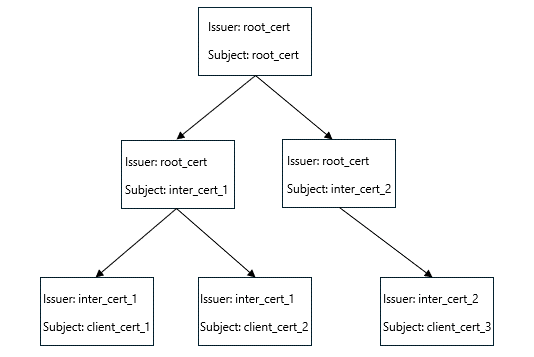{width="5.563276465441819in" height="3.7192694663167103in"}

**Figure: Certificate chain example**

Consider the certificate hierarchy above and suppose the following entries are present in **ServerCertificateMappingEntry.AccessControlList**:

AccessControlEntry\[1\]: Deny to client_cert_2 based on its SHA256 hash

AccessControlEntry\[2\]: Deny to root_cert based on its SHA256 hash

AccessControlEntry\[3\]: Allow to any certificate issued by root_cert

AccessControlEntry\[4\]: Deny to any certificate issued by inter_cert_2

In this example, client_cert_1 is granted access, but client_cert_2 and client_cert_3 are denied access.

Consider each chain separately.

Chain 1: root_cert -\> inter_cert_1 -\> client_cert_1.

There is an issuer entry for issuer name root_cert. client_cert_1 is below root_cert in the certificate chain of trust, so the "allow" applies to client_cert_1. The deny SHA256 entry for root_cert has no effect. The server does not have access to the root certificate and so it cannot compute its SHA256 hash. Therefore, client 1 is granted access.

Chain 2: root_cert -\> inter_cert_1 -\> client_cert_2

The root_cert allow entry applies to client_cert_2, but there is a deny entry for client_cert_2, and so client 2 does not have access. The deny entry for client_cert_2 does not apply to client_cert_1 since client_cert_1 is not below client_cert_2 in the certificate chain of trust.

Chain 3: root_cert -\> inter_cert_2 -\> client_cert_3

The root_cert allow entry applies to client_cert_3, but there is a deny entry for inter_cert_2. The deny entry applies to client_cert_3 since client_cert_3 is below inter_cert_2 in the certificate chain of trust. Therefore, client 3 is denied access.

### Timers[[]{.indexref entry="Timers:server"}]{.indexref entry="Server:timers"}

#### Oplock Break Acknowledgment Timer[]{.indexref entry="Oplock break acknowledgment timer"}

This timer controls the amount of time the server waits for an [**oplock break**](#gt_5c86b468-90a1-4542-8bde-460c098d2a5a) acknowledgment from the client (as specified in section [2.2.24.1](#Section_8b2f9f4993de479c81c2795b1059deea)) after sending an oplock break notification (as specified in section [2.2.23.1](#Section_90d23bb5cbda410ea5c2ca53674656c9)) to the client. The server MUST wait for an interval of time greater than or equal to the oplock break acknowledgment timer. This timer MUST be smaller than the client Request Expiration time, as specified in section [3.2.6.1](#Section_00d2bbb5e3804582b6618725cf8725fb).[]{#Appendix_A_Target_216 .anchor}[\<216\>](#Appendix_A_216)

#### Durable Open Scavenger Timer[]{.indexref entry="Durable open scavenger timer"}

This timer controls the amount of time the server keeps a durable handle active after the underlying transport [**connection**](#gt_866b0055-ceba-4acf-a692-98452943b981) to the client is lost.[]{#Appendix_A_Target_217 .anchor}[\<217\>](#Appendix_A_217) The server MUST keep the durable handle active for at least this amount of time, except in the cases of an [**oplock break**](#gt_5c86b468-90a1-4542-8bde-460c098d2a5a) indicated by the object store as specified in section [3.3.4.6](#Section_2a09fc40161542dfbda62865b8d6da95), administrative actions, or resource constraints.

#### Session Expiration Timer[]{.indexref entry="Session expiration timer"}

This timer controls the periodic scheduling of searching for sessions that have passed their expiration time. The server SHOULD[]{#Appendix_A_Target_218 .anchor}[\<218\>](#Appendix_A_218) schedule this timer such that sessions are expired in a timely manner. This timer is also used for scavenging connections on which the NEGOTIATE and SESSION_SETUP have not been performed within a specified time.

#### Resilient Open Scavenger Timer[]{.indexref entry="Resilient open scavenger timer"}

This timer controls the amount of time the server keeps a resilient handle active after the underlying transport [**connection**](#gt_866b0055-ceba-4acf-a692-98452943b981) to the client is lost. This value is not a constant but set based on the time-out requested by the client as specified in section [3.3.5.15.9](#Section_501e2c585bac4005bdd1a01d08b12d57). The server MUST keep the resilient handle active for that amount of time except in cases of administrative actions or resource constraints.

#### Lease Break Acknowledgment Timer

If the server implements the SMB 2.1 or SMB 3.x dialect family and supports leasing, this timer controls the amount of time the server waits for a [**Lease Break**](#gt_6f48d392-78e1-4fa2-a8cd-65d68fc36b4b) acknowledgment from the client (as specified in section [2.2.24.2](#Section_048aae063421418b85b30f7605749596)) after sending a lease break notification (as specified in section [2.2.23.2](#Section_9abe6f73f32f4a23998dee9da2b90e2e)) to the client. The server MUST wait for an interval of time greater than or equal to the lease break acknowledgment timer. This timer MUST be smaller than the client Request Expiration time, as specified in section [3.2.6.1](#Section_00d2bbb5e3804582b6618725cf8725fb).[]{#Appendix_A_Target_219 .anchor}[\<219\>](#Appendix_A_219)

### Initialization[[]{.indexref entry="Server:initialization"}]{.indexref entry="Initialization:server"}

The server MUST initialize the following:

- All the members in **ServerStatistics** MUST be set to zero.

- **SnapshotList** MUST be set to empty in all shares in **ShareList**.

- **ServerEnabled** MUST be set to FALSE.

- **GlobalOpenTable** MUST be set to an empty table.

- **GlobalSessionTable** MUST be set to an empty table.

- **ServerGuid** MUST be set to a newly generated GUID.

- **ConnectionList** MUST be set to an empty list.

- **ServerStartTime** SHOULD[]{#Appendix_A_Target_220 .anchor}[\<220\>](#Appendix_A_220) be set to zero.

- **IsDfsCapable** MUST be set to FALSE.

- **ServerSideCopyMaxNumberofChunks** MUST be set to an implementation-specific[]{#Appendix_A_Target_221 .anchor}[\<221\>](#Appendix_A_221) default value.

- **ServerSideCopyMaxChunkSize** MUST be set to an implementation-specific[]{#Appendix_A_Target_222 .anchor}[\<222\>](#Appendix_A_222) default value.

- **ServerSideCopyMaxDataSize** MUST be set to an implementation-specific[]{#Appendix_A_Target_223 .anchor}[\<223\>](#Appendix_A_223) default value.

- **ShareList** MUST be set to an empty list.

- **Open.DurableOpenScavengerTimeout** MUST be set to zero.

If the server implements the SMB 2.1 or SMB 3.x dialect family, it MUST initialize the following:

- **ServerHashLevel** MUST be set to an implementation-specific[]{#Appendix_A_Target_224 .anchor}[\<224\>](#Appendix_A_224) default value.

If the server implements the SMB 2.1 or 3.x dialect family and supports leasing, the server MUST initialize the following:

- **GlobalLeaseTableList** MUST be set to an empty list.

If the server implements the SMB 2.1 or SMB 3.x dialect family and supports resiliency, it MUST implement the following:

- **MaxResiliencyTimeout** SHOULD[]{#Appendix_A_Target_225 .anchor}[\<225\>](#Appendix_A_225) be set to an implementation-specific default value.

If the server implements the SMB 3.x dialect family, the server MUST initialize the following:

- **GlobalClientTable** MUST be set to an empty list.

- **EncryptData** MUST be set in an implementation-specific manner.

- **RejectUnencryptedAccess** MUST be set in an implementation-specific manner.[]{#Appendix_A_Target_226 .anchor}[\<226\>](#Appendix_A_226)

- **IsMultiChannelCapable** MUST be set in an implementation-specific manner.[]{#Appendix_A_Target_227 .anchor}[\<227\>](#Appendix_A_227)

- **AllowAnonymousAccess** MUST be set to an implementation-specific[]{#Appendix_A_Target_228 .anchor}[\<228\>](#Appendix_A_228) default value.

If the server implements the SMB 3.0.2 or SMB 3.1.1 dialect, the server MUST initialize the following:

- **IsSharedVHDSupported**: MUST be set to FALSE.

If the server implements the SMB 3.1.1 dialect, the server MUST initialize the following:

- **MaxClusterDialect** MUST be set in an implementation-specific manner.

- **Server.SupportsTreeConnectExtn** MUST be set in an implementation-specific[]{#Appendix_A_Target_229 .anchor}[\<229\>](#Appendix_A_229) manner.

- **AllowNamedPipeAccessOverQUIC** MUST be set in an implementation-specific[]{#Appendix_A_Target_230 .anchor}[\<230\>](#Appendix_A_230) manner.

The server MUST notify the completion of its initialization to the server service by invoking the event as specified in [\[MS-SRVS\]](%5bMS-SRVS%5d.pdf#Section_accf23b00f57441c918543041f1b0ee9) section 3.1.6.14, providing the string \"SMB2\" as an input parameter.

**IsMutualAuthOverQUICSupported** MUST be set in an implementation-specific manner.[]{#Appendix_A_Target_231 .anchor}[\<231\>](#Appendix_A_231)

**ServerCertificateMappingTable** MUST be initialized based on administrator configuration.

### Higher-Layer Triggered Events[[[[[[]{.indexref entry="Triggered events – higher layer:server:overview"}]{.indexref entry="Higher-layer triggered events:server:overview"}]{.indexref entry="Server:higher-layer triggered events:overview"}]{.indexref entry="Triggered events - higher-layer:server"}]{.indexref entry="Higher-layer triggered events:server"}]{.indexref entry="Server:higher-layer triggered events"}

The SMB 2 Protocol server is driven by a series of higher-layer triggered events in the following categories:

- Indications of buffering state changes on local [**opens**](#gt_0d572cce-4683-4b21-945a-7f8035bb6469) ([**oplock breaks**](#gt_5c86b468-90a1-4542-8bde-460c098d2a5a) or lease breaks).

- Requests for the [**session**](#gt_0cd96b80-a737-4f06-bca4-cf9efb449d12) key of authenticated sessions.

- Required actions for sending any outgoing message.

The following sections provide details on the above events.

#### Sending Any Outgoing Message[[[]{.indexref entry="Triggered events – higher layer:server:sending any outgoing message"}]{.indexref entry="Higher-layer triggered events:server:sending any outgoing message"}]{.indexref entry="Server:higher-layer triggered events:sending any outgoing message"}

Unless specifically noted in a subsequent section, the following logic MUST be applied to any response message being sent from the server to the client.

- For every outgoing message, the server MUST calculate the total number of bytes in the message and update the values of **ServerStatistics.sts0_bytessent_low** and **ServerStatistics.sts0_bytessent_high**.

- For the command requests which include **FileId**, if **Connection.Dialect** belongs to the SMB 3.x dialect family and **ChannelSequence** is equal to **Open.ChannelSequence**, the server MUST decrement **Open.OutstandingRequestCount** by 1. Otherwise, the server MUST decrement **Open.OutstandingPreRequestCount** by 1.

- For every outgoing message, the server SHOULD set the **CreditCharge** field in the SMB2 header of the response to the **CreditCharge** value in the SMB2 header of the request.

##### Signing the Message

The server SHOULD[]{#Appendix_A_Target_232 .anchor}[\<232\>](#Appendix_A_232) sign the message under the following conditions:

- If the request was signed by the client, the response message being sent contains a nonzero **SessionId** and a zero **TreeId** in the SMB2 header, and the session identified by **SessionId** has **Session.SigningRequired** equal to TRUE.

- If the request was signed by the client, the response message being sent contains a nonzero **SessionId**, and a nonzero **TreeId** in the SMB2 header, and the session identified by **SessionId** has **Session.SigningRequired** equal to TRUE, if either global **EncryptData** is FALSE or **Connection.ClientCapabilities** does not include the SMB2_GLOBAL_CAP_ENCRYPTION bit.

- If the request was signed by the client, and the response is not an interim response to an asynchronously processed request.

If **Connection.Dialect** belongs to the SMB 3.x dialect family, and if the response being signed is an SMB2 SESSION_SETUP Response without a status code equal to STATUS_SUCCESS in the header, the server MUST use **Session.SigningKey**. For all other responses being signed the server MUST provide **Channel.SigningKey** by looking up the **Channel** in **Session.ChannelList**, where the connection matches the **Channel.Connection**.

Otherwise, the server MUST use **Session.SessionKey** for signing the response.

The server provides the key for signing, the length of the response, and the response itself, and calculates the signature as specified in section [3.1.4.1](#Section_a3e9ea1e53c84cff94bdd98fb20417c0). If the server signs the message, it MUST set the SMB2_FLAGS_SIGNED bit in the **Flags** field of the SMB2 header. If the server encrypts the message, as specified in section [3.1.4.3](#Section_24d74c0c3de140d9a949d169ad84361d), the server MUST set the **Signature** field of the SMB2 header to zero.

##### Granting Credits to the Client

As described in section [3.3.1.1](#Section_dec8e90594774c3fbc64b18d97c9f905), the server maintains a list of message identifiers available for incoming requests. The total number of available message identifiers can change dynamically as the system runs, with the server granting [**credits**](#gt_99b28556-d321-4a40-a062-65b5a49870e3) based on some local policy.

Based on the **CreditRequest** specified in the [SMB2 header](#Section_5cd6452260b34f3ea157fe66f1228052) of a client request, the server MUST determine how many credits it will grant the client on each request by using a vendor-specific algorithm as specified in section [3.3.1.2](#Section_2e366edbb00647e7aa94ef6f71043ced). The server MUST then place the number of credits granted in the **CreditResponse** field in the SMB2 header of the response.

The server consumes one credit for any request except for the [SMB2 CANCEL Request](#Section_91913fc64ec94a83961b370070067e63). If the server implements the SMB 2.1 or SMB 3.x dialect family and the request is a multi-credit request, the server MUST consume multiple credits as specified in section [3.3.5.2.3](#Section_0326f7840baf45fd9687626859ef5a9b). To maintain the same number of credits already granted, the server returns a value equal to the number of credits consumed by this command. To reduce or increase the number of credits granted, the server respectively returns a value less than or greater than the number of credits consumed by this command.

For an asynchronously processed request, any credits to be granted MUST be granted in the interim response, as specified in section [3.3.4.2](#Section_c1692ece7c6d45c8a0e36b53c0483030).[]{#Appendix_A_Target_233 .anchor}[\<233\>](#Appendix_A_233)

##### Sending Compounded Responses

The server MAY[]{#Appendix_A_Target_234 .anchor}[\<234\>](#Appendix_A_234) compound responses to the client.

To compound responses, the server MUST set the **NextCommand** in the first response to the offset, in bytes, from the beginning of the [SMB2 header](#Section_5cd6452260b34f3ea157fe66f1228052) of the first response to the beginning of the 8-byte aligned SMB2 header in the subsequent response. This process MUST be done for each response except the final response in the chain, whose **NextCommand** SHOULD[]{#Appendix_A_Target_235 .anchor}[\<235\>](#Appendix_A_235) be set to 0. The length of the last response in the compounded responses SHOULD be padded to a multiple of 8 bytes. The server MAY[]{#Appendix_A_Target_236 .anchor}[\<236\>](#Appendix_A_236) grant credits separately on each response in the compounded chain. Then the entire response chain MUST be sent to the client as a single submission to the underlying transport.

The server SHOULD NOT[]{#Appendix_A_Target_237 .anchor}[\<237\>](#Appendix_A_237) send the response message when the size is greater than **Connection.MaxTransactSize**+256.

##### Encrypting the Message

If **Connection.Dialect** belongs to the SMB 3.x dialect family and **Connection.ClientCapabilities** includes the SMB2_GLOBAL_CAP_ENCRYPTION bit, the server MUST encrypt the message before sending, if **IsEncryptionSupported** is TRUE and any of the following conditions are satisfied:

- If the message being sent is any response to a client request for which **Request.IsEncrypted** is TRUE.

- If **Session.EncryptData** is TRUE and the response being sent is not SMB2_NEGOTIATE or SMB2 SESSION_SETUP.

- If **Session.EncryptData** is FALSE, the response being sent is not SMB2_NEGOTIATE or SMB2 SESSION_SETUP or SMB2 TREE_CONNECT, and **Share.EncryptData** for the share associated with the **TreeId** in the SMB2 header of the response is TRUE.

The server MUST encrypt the message as specified in section [3.1.4.3](#Section_24d74c0c3de140d9a949d169ad84361d), before sending it to the client.

##### Compressing the Message

If **Connection.Dialect** is 3.1.1, **IsCompressionSupported** is TRUE, **Connection.CompressionIds** is not empty, and **Request.CompressReply** is TRUE, the server SHOULD[]{#Appendix_A_Target_238 .anchor}[\<238\>](#Appendix_A_238) process the message as specified in section [3.1.4.4](#Section_c79ff63c871a49d69940cabdf5f3f4e2), before sending it to the client.

##### Selecting a Connection

If the server implements the SMB 3.x dialect family, the server MUST select **Channel.Connection** from **Open.Session.ChannelList** in an implementation-specific manner.

Otherwise, the server MUST select **Open.Connection**.

#### Sending an Interim Response for an Asynchronous Operation[[[]{.indexref entry="Triggered events – higher layer:server:sending interim response for asynchronous operation"}]{.indexref entry="Higher-layer triggered events:server:sending interim response for asynchronous operation"}]{.indexref entry="Server:higher-layer triggered events:sending interim response for asynchronous operation"}

The server MAY[]{#Appendix_A_Target_239 .anchor}[\<239\>](#Appendix_A_239) choose to send an interim response for any request that is received. It SHOULD[]{#Appendix_A_Target_240 .anchor}[\<240\>](#Appendix_A_240) send an interim response for any request that could potentially block for an indefinite amount of time. If an operation would require asynchronous processing but resources are constrained, the server MAY[]{#Appendix_A_Target_241 .anchor}[\<241\>](#Appendix_A_241) choose to fail that operation with STATUS_INSUFFICIENT_RESOURCES.

An interim response indicates to the client that the request has been received and a full response will come later. The server SHOULD NOT sign an interim response.

To send an interim response for a request, the server MUST generate an asynchronous identifier for it, and **Request.AsyncId** MUST be set to this asynchronous identifier.

- The identifier MUST be an 8-byte value.

- The identifier MUST be unique for all outstanding asynchronous requests on a specified SMB2 transport [**connection**](#gt_866b0055-ceba-4acf-a692-98452943b981).

- The identifier MUST remain valid until the final response for the request is sent.

- The identifier MUST NOT be reused until the final response is sent.

- The identifier MUST be nonzero.

The server MUST insert the **Request** in **Connection.AsyncCommandList**.

The server MUST construct a response packet for the request. The [SMB2 header](#Section_5cd6452260b34f3ea157fe66f1228052) of the response MUST be identical to that in the request with the following changes:

- It MUST set the **Status** field in the SMB2 header to STATUS_PENDING.

- The **NextCommand** field MUST be set to 0 if this is not a compounded response. Otherwise, **NextCommand** MUST be set as specified in section [3.3.4.1.3](#Section_dde8b59f52ca4cf88253211bc43639cf).

- The server MUST set the SMB2_FLAGS_SERVER_TO_REDIR bit in the **Flags** field of the SMB2 header.

- The server MUST set the SMB2_FLAGS_ASYNC_COMMAND bit in the **Flags** field of the SMB2 header.

- It MUST set the **AsyncId** field of the SMB2 header to the value that was generated earlier.

- It MUST set the **CreditResponse** field to the number of credits the server chooses to grant for this request, as specified in section [3.3.1.2](#Section_2e366edbb00647e7aa94ef6f71043ced).

It MUST append an [SMB2 ERROR Response](#Section_d4da8b67c18047e3ba7ad24214ac4aaa) following the SMB2 header, as specified in section 2.2.2, with a **ByteCount** of zero. This response MUST be sent to the client.

#### Sending a Success Response[[[]{.indexref entry="Triggered events – higher layer:server:sending success response"}]{.indexref entry="Higher-layer triggered events:server:sending success response"}]{.indexref entry="Server:higher-layer triggered events:sending success response"}

When the server responds with a success to any command sent by the client, the response message MUST be constructed as specified in this section.

The server MUST fill in the [SMB2 header](#Section_5cd6452260b34f3ea157fe66f1228052) of the success response to match the SMB2 header of the request with the following changes:

- The **Status** field of the SMB2 header MUST be set to the status code provided.

- The **NextCommand** field MUST be set to zero. If this response is later combined with other responses into a compounded response, as specified in section [3.3.4.1.3](#Section_dde8b59f52ca4cf88253211bc43639cf), this value will change.

- The SMB2_FLAGS_SERVER_TO_REDIR bit MUST be set in the **Flags** field of the SMB2 header.

- If **Request.AsyncId** is nonzero, the server MUST set the **AsyncId** field to it, MUST set the SMB2_FLAGS_ASYNC_COMMAND bit in the **Flags** field, and MUST set the **CreditResponse** field to 0.

- Otherwise, the server MUST set the **CreditResponse** field to the number of credits the server chooses to grant the request, as specified in section [3.3.1.2](#Section_2e366edbb00647e7aa94ef6f71043ced).

Any other additional changes to the header will be made on a command-specific basis.

The information that follows the SMB2 header is command-specific, as specified in section [3.3.5](#Section_e1d0883442e041caa833fc26f5132a6f). This response MUST be sent to the client and the request MUST be removed from **Connection.RequestList** and freed.

#### Sending an Error Response[[[]{.indexref entry="Triggered events – higher layer:server:sending error response"}]{.indexref entry="Higher-layer triggered events:server:sending error response"}]{.indexref entry="Server:higher-layer triggered events:sending error response"}

When the server is responding with a failure to any command sent by the client, the response message MUST be constructed as described here. An error code other than one of the following indicates a failure:

- STATUS_MORE_PROCESSING_REQUIRED in an [SMB2 SESSION_SETUP Response](#Section_0324190fa31b46669fa95c624273a694) specified in section 2.2.6.

- STATUS_BUFFER_OVERFLOW in an [SMB2 QUERY_INFO Response](#Section_3b1b3598a89844cabfac2dcae065247f) specified in section 2.2.38.

- STATUS_BUFFER_OVERFLOW in a FSCTL_PIPE_TRANSCEIVE, FSCTL_PIPE_PEEK or FSCTL_DFS_GET_REFERRALS Response specified in section [2.2.32](#Section_f70eccb6e1be4db89c479ac86ef18dbb).[]{#Appendix_A_Target_242 .anchor}[\<242\>](#Appendix_A_242)

- STATUS_BUFFER_OVERFLOW in an [SMB2 READ Response](#Section_3e3d2f2c0e2f41eaad07fbca6ffdfd90) on a named pipe specified in section 2.2.20.

- STATUS_INVALID_PARAMETER in an FSCTL_SRV_COPYCHUNK or FSCTL_SRV_COPYCHUNK_WRITE response, when returning an [SRV_COPYCHUNK_RESPONSE](#Section_80d85df3a4dc4418ac7e93dd67e423e9) as described in section [3.3.5.15.6.2](#Section_a19358986a864491a8a3942ec83b75a4).

- STATUS_NOTIFY_ENUM_DIR in an [SMB2 CHANGE_NOTIFY Response](#Section_14f9d05027b249dfb00954e08e8bf7b5) specified in section 2.2.36.

The server MUST provide the error code of the failure and a data buffer to be returned with the error. If nothing is specified, the buffer MUST be considered to be zero bytes in length.

The server can return any of the following errors if the server, the file, or the share is not ready to process an I/O request from the client.

- STATUS_SERVER_UNAVAILABLE

- STATUS_FILE_NOT_AVAILABLE

- STATUS_SHARE_UNAVAILABLE

The server MUST construct the [SMB2 header](#Section_5cd6452260b34f3ea157fe66f1228052) of the error response to match the SMB2 header of the request with the following changes:

- The **Status** field of the SMB2 header MUST be set to the error code provided.

- The **NextCommand** field MUST be set to 0. If this response is later combined with other responses into a compounded response, as specified in section [3.3.4.1.3](#Section_dde8b59f52ca4cf88253211bc43639cf), this value will change later.

- The SMB2_FLAGS_SERVER_TO_REDIR bit MUST be set in the **Flags** field of the SMB2 header.

- If **Request.AsyncId** is nonzero, the server MUST set the **AsyncId** field to it, and MUST set the SMB2_FLAGS_ASYNC_COMMAND bit in the **Flags** field, and MUST set the **CreditResponse** field to 0.

- Otherwise, the server MUST set the **CreditResponse** field to the number of credits the server chooses to grant the request, as specified in section [3.3.1.2](#Section_2e366edbb00647e7aa94ef6f71043ced).

Following the SMB2 header MUST be an [SMB2 ERROR Response](#Section_d4da8b67c18047e3ba7ad24214ac4aaa) structure, as specified in section 2.2.2.

If **Connection.Dialect** is \"3.1.1\", the server MUST construct an **SMB2 ERROR Response** structure as follows:

- The **ErrorContextCount** of this response MUST be set to the number of **SMB2 ERROR Context** structures to be set in the **ErrorData** array of the response.

- The **ByteCount** of this response MUST be set to the length of the buffer that is provided as part of the error.

- If **ErrorContextCount** is greater than zero, the server MUST format the **ErrorData** array of the response as a variable-length array of **SMB2 ERROR Context** structures as specified in section [2.2.2.1](#Section_9ff8837cc4f7452b92728818a119dae9).

Otherwise, the server MUST construct an **SMB2 ERROR Response** structure as follows:

- The **ErrorContextCount** of this response MUST be set to 0.

- The **ByteCount** of this response MUST be set to the length of the buffer that is provided as part of the error.

- If **ByteCount** is greater than zero, the server MUST format the **ErrorData** array of the response as described in section [2.2.2.2](#Section_7722d25dcec74baf83439ef84f48a52c).

This response MUST then be sent to the client, and the request MUST be removed from **Connection.RequestList** and freed.

#### Server Application Requests Session Key of the Client[[[]{.indexref entry="Triggered events – higher layer:server:requesting session key"}]{.indexref entry="Higher-layer triggered events:server:requesting session key"}]{.indexref entry="Server:higher-layer triggered events:requesting session key"}

An application running on the server issues a query for a [**session**](#gt_0cd96b80-a737-4f06-bca4-cf9efb449d12) key, specifying the **LocalOpen** to a named pipe that has been opened by the SMB2 server on behalf of the remote client. The application also provides a 16-byte buffer to receive the session key.

The server MUST cycle through the entries in the **GlobalOpenTable** and locate the Open for which **Open.LocalOpen** matches the provided **LocalOpen**. If no Open is found, the request MUST be failed with STATUS_OBJECT_NAME_NOT_FOUND.

If **Open.Connection** is NULL, the request MUST be failed with STATUS_NO_TOKEN.

If **Open.TreeConnect.Share.Name** is not equal to \"IPC\$\" (indicating that the open is not a named pipe), the request SHOULD be failed with STATUS_ACCESS_DENIED.

If **Connection.Dialect** belongs to the SMB 3.x dialect family, the server MUST return **Open.TreeConnect.Session.ApplicationKey**. Otherwise, the server MUST return **Open.TreeConnect.Session.SessionKey** to the caller.

#### Object Store Indicates an Oplock Break[[[]{.indexref entry="Triggered events – higher layer:server:object store indicating oplock break"}]{.indexref entry="Higher-layer triggered events:server:object store indicating oplock break"}]{.indexref entry="Server:higher-layer triggered events:object store indicating oplock break"}

The underlying object store on the local resource indicates the breaking of an opportunistic lock, specifying the **LocalOpen** and the new oplock level, a status code of the oplock break, and optionally expects the new oplock level in return. The new oplock level SHOULD[]{#Appendix_A_Target_243 .anchor}[\<243\>](#Appendix_A_243) be SMB2_OPLOCK_LEVEL_NONE or SMB2_OPLOCK_LEVEL_II or SMB2_OPLOCK_LEVEL_EXCLUSIVE. The conditions under which each oplock level is to be indicated are described in [\[MS-FSA\]](%5bMS-FSA%5d.pdf#Section_860b1516c45247b4bdbc625d344e2041) section 2.1.5.18.3.

The server MUST locate the [**open**](#gt_0d572cce-4683-4b21-945a-7f8035bb6469) by walking the **GlobalOpenTable** to find an entry whose **Open.LocalOpen** matches the one provided in the [**oplock break**](#gt_5c86b468-90a1-4542-8bde-460c098d2a5a). If no entry is found, the break indication MUST be ignored and the server MUST complete the oplock break call with SMB2_OPLOCK_LEVEL_NONE as the new oplock level.

If an entry is found, the server MUST perform the following:

For the specified **Open,** the server MUST select the connection as specified in section [3.3.4.1.6](#Section_d59310926f2649eeba1ee1a4222be5a1). If no connection is available, **Open.IsResilient** is FALSE, **Open.IsDurable** is FALSE, and **Open.IsPersistent** is FALSE, the server SHOULD close the Open as specified in section [3.3.4.17](#Section_f6aca12a02ca48168ceb84f78b36a65f).

The server MUST construct an [Oplock Break Notification](#Section_90d23bb5cbda410ea5c2ca53674656c9) following the syntax specified in section 2.2.23.1 to send back to the client. The server MUST set the **Command** in the [SMB2 header](#Section_5cd6452260b34f3ea157fe66f1228052) to SMB2 OPLOCK_BREAK, and the **MessageId** to 0xFFFFFFFFFFFFFFFF. The server SHOULD[]{#Appendix_A_Target_244 .anchor}[\<244\>](#Appendix_A_244) set the SessionId in the SMB2 header to **Open.Session.SessionId**. The server MUST set the TreeId in the SMB2 header to zero. The **FileId** field of the response structure MUST be set to the values from the Open structure, with the volatile part set to **Open.FileId** and the persistent part set to **Open.DurableFileId**. The oplock Level of the response MUST be set to the value provided by the object store. The server MUST set **Open.OplockState** to Breaking and set **Open.OplockTimeout** to the current time plus an implementation-specific default value in milliseconds.[]{#Appendix_A_Target_245 .anchor}[\<245\>](#Appendix_A_245) The message SHOULD NOT be signed.

If the server implements the SMB 3.x dialect family, SMB2 Oplock Break Notification MUST be sent to the client using the first available connection in **Open.Session.ChannelList** where **Channel.Connection** is not NULL. If the server fails to send the notification to the client, the server MUST retry the send using an alternate connection, if available, in **Open.Session.ChannelList**.

Otherwise, SMB2 Oplock Break Notification MUST be sent to the client using **Open.Connection**.

If the notification could not be sent on any connection, the server MUST complete the oplock break from the underlying object store with SMB2_OPLOCK_LEVEL_NONE as the new oplock level and MUST set **Open.OplockLevel** to SMB2_OPLOCK_LEVEL_NONE and **Open.OplockState** to None.

If the server succeeds in sending the notification, the server MUST start the oplock break acknowledgment timer as specified in section [3.3.2.1](#Section_e0254c0bc33d45879b89a6338b028751).

#### Object Store Indicates a Lease Break[[[]{.indexref entry="Triggered events – higher layer:server:object store indicating lease break"}]{.indexref entry="Higher-layer triggered events:server:object store indicating lease break"}]{.indexref entry="Server:higher-layer triggered events:object store indicating lease break"}

The underlying object store indicates the breaking of a lease by specifying the **ClientGuid**, the **ClientLeaseId**, and the new lease state. The new lease state MUST be one of NONE, R, RW, and RH.

When the underlying object store indicates the lease break, the server MUST locate the Lease Table by performing a lookup in **GlobalLeaseTableList** using the provided **ClientGuid** as the lookup key, and then locate the Lease entry by performing a lookup in the **LeaseTable.LeaseList** using the provided **ClientLeaseId** as the lookup key.

If no entry is found, the server MUST complete the lease break call from the underlying object store with \"NONE\" as the new lease state, and take no further action.

If a **Lease** entry is found, the server MUST perform the following:

If **Lease.LeaseOpens** is empty, the server MUST complete the lease break call from the underlying object store with \"NONE\" as the new lease state, set **Lease.LeaseState** to \"NONE\", and take no further action.

If no connection is available among all **Opens** in **Lease.LeaseOpens,** the server MUST close every **Open** as specified in section [3.3.4.17](#Section_f6aca12a02ca48168ceb84f78b36a65f) in one of the following cases:

- **Open.IsDurable**, **Open.IsResilient**, and **Open.IsPersistent** are all FALSE.

- The new lease state indicated by the object store does not contain SMB2_LEASE_HANDLE_CACHING and **Open.IsDurable** is TRUE.

Otherwise, the server MUST construct a Lease Break Notification (section [2.2.23.2](#Section_9abe6f73f32f4a23998dee9da2b90e2e)) message to send to the client.

The server MUST set the **Command** field in the SMB2 header to SMB2 OPLOCK_BREAK, and the **MessageId** field to 0xFFFFFFFFFFFFFFFF. The server MUST set the **SessionId** and **TreeId** fields in the SMB2 header to 0.

If **Lease.LeaseState** is SMB2_LEASE_READ_CACHING, the server MUST set the **Flags** field of the message to zero and MUST set **Open.OplockState** to "None" for all opens in **Lease.LeaseOpens**. The server MUST set **Lease.Breaking** to FALSE, and the **LeaseKey** field MUST be set to **Lease.LeaseKey**.

Otherwise, the server MUST set the Flags field of the message to SMB2_NOTIFY_BREAK_LEASE_FLAG_ACK_REQUIRED, indicating to the client that lease acknowledgment is required. The **LeaseKey** field MUST be set to **Lease.LeaseKey**. The server MUST set **Open.OplockState** to "Breaking" for all Opens in **Lease.LeaseOpens**. The server MUST set the **CurrentLeaseState** field of the message to **Lease.LeaseState**, set **Lease.Breaking** to TRUE, set **Lease.BreakToLeaseState** and the **NewLeaseState** field to the new lease state indicated by the object store, and set **Lease.LeaseBreakTimeout** to the current time plus an implementation-specific[]{#Appendix_A_Target_246 .anchor}[\<246\>](#Appendix_A_246) default value in milliseconds.

If the server implements the SMB 3.x dialect family and **Lease.Version** is 2, the server SHOULD[]{#Appendix_A_Target_247 .anchor}[\<247\>](#Appendix_A_247) set **NewEpoch** to **Lease.Epoch** + 1. Otherwise, **NewEpoch** MUST be set to zero. The server MUST set **Lease.Epoch** to **NewEpoch**.

The message SHOULD NOT be signed. The server MUST set **Lease.BreakNotification** to the newly constructed Lease Break Notification.

The server MUST look up all the connections in **ConnectionList** where **Connection.ClientGuid** matches the provided **ClientGuid**. The server MUST send **Lease.BreakNotification** using the first available connection. If the server fails to send the notification to the client, the server MUST retry the send using an alternate connection available.

If the server succeeds in sending the Lease Break Notification, the server MUST set **Lease.BreakNotification** to empty and MUST start the lease break acknowledgment timer as specified in section [3.3.2.5](#Section_0a2c6b57693a4a48a90d0a48735674e9).

Otherwise, the server MUST perform the following steps:

- If **Open.IsPersistent** is TRUE and **Lease.LeaseState** is not SMB2_LEASE_READ_CACHING, the server MUST take no further action.

- Otherwise, the server MUST set **Open.Lease.Breaking** to FALSE, **Lease.Held** to FALSE, **Open.OplockState** to None, **Lease.BreakNotification** to empty, and MUST complete the lease break call from the underlying object store with \"NONE\" as the new lease state.

#### DFS Server Notifies SMB2 Server That DFS Is Active[[[]{.indexref entry="Triggered events – higher layer:server:notification that DFS is active"}]{.indexref entry="Higher-layer triggered events:server:notification that DFS is active"}]{.indexref entry="Server:higher-layer triggered events:notification that DFS is active"}

In response to this event, the SMB2 server MUST set the global state variable **IsDfsCapable** to TRUE. If the [**DFS**](#gt_0b8086c9-d025-45b8-bf09-6b5eca72713e) server is running on this computer, it MUST notify the SMB2 server that the DFS capability is available via this event.

#### DFS Server Notifies SMB2 Server That a Share Is a DFS Share[[[]{.indexref entry="Triggered events – higher layer:server:notification that share is DFS share"}]{.indexref entry="Higher-layer triggered events:server:notification that share is DFS share"}]{.indexref entry="Server:higher-layer triggered events:notification that share is DFS share"}

In response to this event, the SMB2 server MUST set the **Share.IsDfs** attribute of the [**share**](#gt_a49a79ea-dac7-4016-9a84-cf87161db7e3) specified in section [3.3.1.6](#Section_6fe086cf40ad49d893c514b8c8a7b2d9). When a [**DFS**](#gt_0b8086c9-d025-45b8-bf09-6b5eca72713e) server running on this computer claims a share as a DFS share, it MUST notify the SMB2 server via this event.

#### DFS Server Notifies SMB2 Server That a Share Is Not a DFS Share[[[]{.indexref entry="Triggered events – higher layer:server:notification that share is not DFS share"}]{.indexref entry="Higher-layer triggered events:server:notification that share is not DFS share"}]{.indexref entry="Server:higher-layer triggered events:notification that share is not DFS share"}

In response to this event, the SMB2 server MUST clear the **Share.IsDfs** attribute of the [**share**](#gt_a49a79ea-dac7-4016-9a84-cf87161db7e3) specified in section [3.3.1.6](#Section_6fe086cf40ad49d893c514b8c8a7b2d9).

#### Server Application Requests Security Context of the Client[[[]{.indexref entry="Triggered events – higher layer:server:requesting security context"}]{.indexref entry="Higher-layer triggered events:server:requesting security context"}]{.indexref entry="Server:higher-layer triggered events:requesting security context"}

An application running on the server issues a query for the security context of a client, specifying the **LocalOpen** to a named pipe that has been opened by the SMB2 server on behalf of the remote client.

The server MUST cycle through the entries in the **GlobalOpenTable** and locate the Open for which **Open.LocalOpen** matches the provided **LocalOpen**. If no Open is found, the request MUST be failed with STATUS_OBJECT_NAME_NOT_FOUND.

If **Open.Connection** is NULL, the request MUST be failed with STATUS_NO_TOKEN.

If **Open.TreeConnect.Share.Name** is not equal to \"IPC\$\" (indicating that the open is not a named pipe), the request SHOULD be failed with STATUS_ACCESS_DENIED.

If **Open.TreeConnect.Session.SecurityContext** is NULL, the request MUST be failed with STATUS_NO_TOKEN.

Otherwise, the server MUST return **Open.TreeConnect.Session.SecurityContext** to the caller.

#### Server Application Requests Closing a Session[[[]{.indexref entry="Triggered events – higher layer:server:requesting closing of session"}]{.indexref entry="Higher-layer triggered events:server:requesting closing of session"}]{.indexref entry="Server:higher-layer triggered events:requesting closing of session"}

The calling application provides **GlobalSessionId** of the session to be closed. The server MUST look up **Session** from the **GlobalSessionTable** where **Session.SessionGlobalId** is equal to **GlobalSessionId**, and remove it from the table. If there is no matching session, the call MUST return.

The server MUST deregister the session by invoking the event specified in [\[MS-SRVS\]](%5bMS-SRVS%5d.pdf#Section_accf23b00f57441c918543041f1b0ee9) section 3.1.6.3, providing **GlobalSessionId** as the input parameter. **ServerStatistics.sts0_sopens** MUST be decreased by 1.

The server MUST close every **Open** in **Session.OpenTable** as specified in [3.3.4.17](#Section_f6aca12a02ca48168ceb84f78b36a65f).

The server MUST disconnect every **TreeConnect** in **Session.TreeConnectTable** and deregister **TreeConnect** by invoking the event specified in \[MS-SRVS\] section 3.1.6.7, providing the tuple **\<TreeConnect.Share.ServerName, TreeConnect.Share.Name\>** and **TreeConnect.TreeGlobalId** as the input parameters. For each deregistered **TreeConnect**, **TreeConnect.Share.CurrentUses** MUST be decreased by 1.

The session MUST be torn down and freed.

#### Server Application Registers a Share[[[]{.indexref entry="Triggered events – higher layer:server:registering share"}]{.indexref entry="Higher-layer triggered events:server:registering share"}]{.indexref entry="Server:higher-layer triggered events:registering share"}

The calling application provides a share in SHARE_INFO_503_I structure as specified in [\[MS-SRVS\]](%5bMS-SRVS%5d.pdf#Section_accf23b00f57441c918543041f1b0ee9) section 2.2.4.27 to register a share. The server MUST validate the **SHARE_INFO_503_I** structure as specified in \[MS-SRVS\] section 3.1.4.7. If any member in the structure is invalid, the server MUST return STATUS_INVALID_PARAMETER to the calling application. The server MUST look up the **Share** in the **ShareList**, where shi503_servername matches **Share.ServerName** and shi503_netname matches **Share.Name**. If a matching **Share** is found, the server MUST fail the call with an implementation-dependent error. Otherwise, the server MUST create a new Share with the following value set and insert it into **ShareList** and return STATUS_SUCCESS.

- **Share.Name** MUST be set to shi503_netname.

- **Share.Type** MUST be set to shi503_type. The server SHOULD[]{#Appendix_A_Target_248 .anchor}[\<248\>](#Appendix_A_248) set STYPE_CLUSTER_FS, STYPE_CLUSTER_SOFS, and STYPE_CLUSTER_DFS as specified in \[MS-SRVS\] section 2.2.2.4 in an implementation-defined manner.

- **Share.Remark** MUST be set to shi503_remark.

- **Share.LocalPath** MUST be set to shi503_path.

- **Share.ServerName** MUST be set to the shi503_servername.

- **Share.FileSecurity** MUST be set to shi503_security_descriptor.

- **Share.MaxUses** MUST be set to shi503_max_uses.

- **Share.CurrentUses** MUST be set to 0.

- **Share.CscFlags** MUST be set to 0.

- **Share.IsDfs** MUST be set to FALSE.

- **Share.DoAccessBasedDirectoryEnumeration** MUST be set to FALSE.

- **Share.AllowNamespaceCaching** MUST be set to FALSE.

- **Share.ForceSharedDelete** MUST be set to FALSE.

- **Share.RestrictExclusiveOpens** MUST be set to FALSE.

- **Share.ForceLevel2Oplock** MUST be set to FALSE.

- **Share.HashEnabled** MUST be set to FALSE.

- If the server implements the SMB 3.x dialect family, **Share.EncryptData** MUST be set to FALSE.

- If the server implements the SMB 3.1.1 dialect, **Share.CompressData** MUST be set to FALSE.

If **Share.Name** is equal to \"IPC\$\" or **Share.Type** does not have the STYPE_SPECIAL bit set, as specified in \[MS-SRVS\] section 2.2.2.4, then **Share.ConnectSecurity** SHOULD be set to a [**security descriptor**](#gt_e5213722-75a9-44e7-b026-8e4833f0d350) allowing all users. Otherwise, **Share.ConnectSecurity** SHOULD be set to a security descriptor allowing only administrators.

If the server implements the SMB 3.x dialect family, **Share.CATimeout** MUST be set to an implementation-specific value.[]{#Appendix_A_Target_249 .anchor}[\<249\>](#Appendix_A_249)

#### Server Application Updates a Share[[[]{.indexref entry="Triggered events – higher layer:server:updating share"}]{.indexref entry="Higher-layer triggered events:server:updating share"}]{.indexref entry="Server:higher-layer triggered events:updating share"}

The calling application provides a share in SHARE_INFO_503_I structure and SHARE_INFO_1005 structure as input parameters to update an existing **Share**. The server MUST validate the SHARE_INFO_503_I and SHARE_INFO_1005 structures as specified in [\[MS-SRVS\]](%5bMS-SRVS%5d.pdf#Section_accf23b00f57441c918543041f1b0ee9) section 3.1.4.11. If any member in the structures is invalid, the server MUST return STATUS_INVALID_PARAMETER to the calling application. The server MUST look up the **Share** in the **ShareList**, where shi503_servername matches **Share.ServerName** and shi503_netname matches **Share.Name**. If the matching **Share** is found, the server MUST update the share with the following value set and return STATUS_SUCCESS to the calling application; otherwise the server MUST return an implementation-dependent error.

- **Share.FileSecurity** MUST be set to shi503_security_descriptor.

- **Share.Remark** MUST be set to shi503_remark.

- **Share.MaxUses** MUST be set to shi503_max_uses.

- **Share.CscFlags** MUST be set to the value of SHI1005_flags masked by CSC_MASK as specified in \[MS-SRVS\] section 2.2.4.29.

- **Share.IsDfs** MUST be set to TRUE if SHI1005_flags contains SHI1005_FLAGS_DFS or SHI1005_FLAGS_DFS_ROOT as specified in \[MS-SRVS\] section 2.2.4.29; otherwise, it MUST be set to FALSE.

- **Share.DoAccessBasedDirectoryEnumeration** MUST be set to TRUE if SHI1005_flags contains the SHI1005_FLAGS_ACCESS_BASED_DIRECTORY_ENUM bit as specified in \[MS-SRVS\] section 2.2.4.29; otherwise it MUST be set to FALSE.

- **Share.AllowNamespaceCaching** MUST be set to TRUE if SHI1005_flags contains SHI1005_FLAGS_ALLOW_NAMESPACE_CACHING bit as specified in \[MS-SRVS\] section 2.2.4.29; otherwise it MUST be set to FALSE.

- **Share.ForceSharedDelete** MUST be set to TRUE if SHI1005_flags contains the SHI1005_FLAGS_FORCE_SHARED_DELETE bit as specified in \[MS-SRVS\] section 2.2.4.29; otherwise it MUST be set to FALSE.

- **Share.RestrictExclusiveOpens** MUST be set to TRUE if SHI1005_flags contains the SHI1005_FLAGS_RESTRICT_EXCLUSIVE_OPENS bit as specified in \[MS-SRVS\] section 2.2.4.29; otherwise it MUST be set to FALSE.

- **Share.HashEnabled** MUST be set to TRUE if SHI1005_flags contains the SHI1005_FLAGS_ENABLE_HASH bit as specified in \[MS-SRVS\] section 2.2.4.29; otherwise it MUST be set to FALSE.

- **Share.ForceLevel2Oplock** MUST be set to TRUE if SHI1005_flags contains SHI1005_FLAGS_FORCE_LEVELII_OPLOCK bit as specified in \[MS-SRVS\] section 2.2.4.29; otherwise, it MUST be set to FALSE.

- **Share.IsCA** MUST be set to TRUE if SHI1005_flags contains SHI1005_FLAGS_ENABLE_CA bit as specified in \[MS-SRVS\] section 2.2.4.29; otherwise, it MUST be set to FALSE.

- **Share.EncryptData** MUST be set to TRUE if SHI1005_flags contains SHI1005_FLAGS_ENCRYPT_DATA bit as specified in \[MS-SRVS\] section 2.2.4.29. Otherwise, it MUST be set to FALSE.

- **Share.CompressData** MUST be set to TRUE if SHI1005_flags contains SHI1005_FLAGS_COMPRESS_DATA bit as specified in \[MS-SRVS\] section 2.2.4.29. Otherwise, it MUST be set to FALSE.

#### Server Application Deregisters a Share[[[]{.indexref entry="Triggered events – higher layer:server:deregistering share"}]{.indexref entry="Higher-layer triggered events:server:deregistering share"}]{.indexref entry="Server:higher-layer triggered events:deregistering share"}

The calling application provides tuple \<ServerName, ShareName\> of the [**share**](#gt_a49a79ea-dac7-4016-9a84-cf87161db7e3) that is being deregistered. The server MUST look up the **Share** in **ShareList** where **ServerName** matches **Share.ServerName** and **ShareName** matches **Share.Name**. If a **Share** is found, the server MUST remove it from the list and MUST return STATUS_SUCCESS to the calling application; otherwise, the server MUST return an implementation-specific error.

The server MUST close every **Open** in **GlobalOpenTable** where **Open.TreeConnect** is not NULL and **Open.TreeConnect.Share** matches the current share as specified in [3.3.4.17](#Section_f6aca12a02ca48168ceb84f78b36a65f).

The server MUST enumerate every session in **GlobalSessionTable** and every tree connect in **Session.TreeConnectTable** to free all tree connect objects where **TreeConnect.Share** matches the current share.

#### Server Application Requests Querying a Share[[[]{.indexref entry="Triggered events – higher layer:server:querying share"}]{.indexref entry="Higher-layer triggered events:server:querying share"}]{.indexref entry="Server:higher-layer triggered events:querying share"}

The calling application provides tuple \<ServerName, ShareName\> of the share that is being queried. The server MUST look up the Share in **ShareList** where **ServerName** matches **Share.ServerName** and **ShareName** matches **Share.Name**. If the matching Share is found, the server MUST return a share in SHARE_INFO_503_I structure and SHARE_INFO_1005 structure with the following values set and return STATUS_SUCCESS to the calling application; otherwise the server MUST return an implementation-dependent error.

+---------------------------------------------+---------------------------------------------------------------------------------------------------------------------------------+
| Output Parameters                           | SMB2 Share Properties                                                                                                           |
+=============================================+=================================================================================================================================+
| SHARE_INFO_503_I.shi503_netname             | **Share.Name**                                                                                                                  |
+---------------------------------------------+---------------------------------------------------------------------------------------------------------------------------------+
| SHARE_INFO_503_I.shi503_type                | **Share.Type**                                                                                                                  |
+---------------------------------------------+---------------------------------------------------------------------------------------------------------------------------------+
| SHARE_INFO_503_I.shi503_remark              | **Share.Remark**                                                                                                                |
+---------------------------------------------+---------------------------------------------------------------------------------------------------------------------------------+
| SHARE_INFO_503_I.shi503_permissions         | 0                                                                                                                               |
+---------------------------------------------+---------------------------------------------------------------------------------------------------------------------------------+
| SHARE_INFO_503_I.shi503_max_uses            | **Share.MaxUses**                                                                                                               |
+---------------------------------------------+---------------------------------------------------------------------------------------------------------------------------------+
| SHARE_INFO_503_I.shi503_current_uses        | **Share.CurrentUses**                                                                                                           |
+---------------------------------------------+---------------------------------------------------------------------------------------------------------------------------------+
| SHARE_INFO_503_I.shi503_path                | **Share.LocalPath**                                                                                                             |
+---------------------------------------------+---------------------------------------------------------------------------------------------------------------------------------+
| SHARE_INFO_503_I.shi503_passwd              | **Empty string**                                                                                                                |
+---------------------------------------------+---------------------------------------------------------------------------------------------------------------------------------+
| SHARE_INFO_503_I.shi503_servername          | **Share.ServerName**                                                                                                            |
+---------------------------------------------+---------------------------------------------------------------------------------------------------------------------------------+
| SHARE_INFO_503_I.shi503_security_descriptor | **Share.FileSecurity**                                                                                                          |
+---------------------------------------------+---------------------------------------------------------------------------------------------------------------------------------+
| SHARE_INFO_1005.shi1005_flags               | **ShareFlags** MUST be set based on the individual share properties:                                                            |
|                                             |                                                                                                                                 |
|                                             | - The server MUST set all flags contained in Share.CscFlags.                                                                    |
|                                             |                                                                                                                                 |
|                                             | - The server MUST set the SHI1005_FLAGS_DFS bit if the per-share property **Share.IsDfs** is TRUE.                              |
|                                             |                                                                                                                                 |
|                                             | - The server MUST set the SHI1005_FLAGS_DFS_ROOT bit if the per-share property **Share.IsDfs** is TRUE.                         |
|                                             |                                                                                                                                 |
|                                             | - The server MUST set the SHI1005_FLAGS_ACCESS_BASED_DIRECTORY_ENUM bit if **Share.DoAccessBasedDirectoryEnumeration** is TRUE. |
|                                             |                                                                                                                                 |
|                                             | - The server MUST set the SHI1005_FLAGS_ALLOW_NAMESPACE_CACHING bit if **Share.AllowNamespaceCaching** is TRUE.                 |
|                                             |                                                                                                                                 |
|                                             | - The server MUST set the SHI1005_FLAGS_FORCE_SHARED_DELETE bit if **Share.ForceSharedDelete** is TRUE.                         |
|                                             |                                                                                                                                 |
|                                             | - The server MUST set the SHI1005_FLAGS_RESTRICT_EXCLUSIVE_OPENS bit if **Share.RestrictExclusiveOpens** is TRUE.               |
|                                             |                                                                                                                                 |
|                                             | - The server MUST set the SHI1005_FLAGS_FORCE_LEVELII_OPLOCK bit if **Share.ForceLevel2Oplock** is TRUE.                        |
|                                             |                                                                                                                                 |
|                                             | - The server MUST set the SHI1005_FLAGS_ENABLE_HASH bit if **Share.HashEnabled** is TRUE.                                       |
+---------------------------------------------+---------------------------------------------------------------------------------------------------------------------------------+

#### Server Application Requests Closing an Open[[[]{.indexref entry="Triggered events – higher layer:server:requesting closing of open"}]{.indexref entry="Higher-layer triggered events:server:requesting closing of open"}]{.indexref entry="Server:higher-layer triggered events:requesting closing of open"}

The calling application provides **GlobalFileId** as input parameter. The server MUST look up **Open** in **GlobalOpenTable** where **Open.FileGlobalId** is equal to **GlobalFileId**, and, if the **Open** is found, the server MUST perform the following:

- Remove the **Open** from the **GlobalOpenTable**.

- If **Open.Connection** is not NULL, cancel all requests in **Open.Connection.RequestList** for which **Request.Open** matches the **Open**, as specified in section [3.3.5.16](#Section_57bae3d35dd74a5f92cbfc52e2087dad).

- If **Open.IsSharedVHDX** is TRUE, close the underlying **Open.LocalOpen** as specified in [\[MS-RSVD\]](%5bMS-RSVD%5d.pdf#Section_c865c32647d64a91a62d0e8f26007d15) section 3.2.5.2.

- Close the underlying **Open.LocalOpen**.

- If **Open.Session** is not NULL, remove the **Open** from **Open.Session.OpenTable**.

- If **Open.TreeConnect** is not NULL, decrease **Open.TreeConnect.OpenCount** by 1.

- If **Open.Connection.Dialect** is not \"2.0.2\", the server supports leasing, and **Open.Lease** is not NULL:

  - The server MUST identify a **LeaseTable** by enumerating each entry in **GlobalLeaseTableList** to find the one whose **LeaseTable.LeaseList** contains **Open.Lease**.

  - The server MUST then remove the **Open** from **Open.Lease.LeaseOpens**. If this **Open** is the last open in **Open.Lease.LeaseOpens**, the server MUST set **Open.Lease.Held** to FALSE.

  - If **Open.Lease.Held** is FALSE:

    - If **Open.Lease.Breaking** is TRUE, the server MUST complete the lease break to the underlying object store with NONE as the new lease state. []{#Appendix_A_Target_250 .anchor}[\<250\>](#Appendix_A_250)

    - The server MUST remove the **Open.Lease** from the **LeaseTable.LeaseList** and free the **Open.Lease**.

  - If **LeaseTable.LeaseList** is now empty, the server MAY remove the **LeaseTable** from the **GlobalLeaseTableList** and free the **LeaseTable**.

- Provide **Open.FileGlobalId** as the input parameter and deregister the **Open** by invoking the event specified in [\[MS-SRVS\]](%5bMS-SRVS%5d.pdf#Section_accf23b00f57441c918543041f1b0ee9) section 3.1.6.5.

- The **Open** object is then freed.

- Return STATUS_SUCCESS to the calling application.

If no **Open** is found, the call MUST return an implementation-dependent error.

#### Server Application Queries a Session[[[]{.indexref entry="Triggered events – higher layer:server:querying session"}]{.indexref entry="Higher-layer triggered events:server:querying session"}]{.indexref entry="Server:higher-layer triggered events:querying session"}

The calling application provides **GlobalSessionId** as an identifier for the **Session**. The server MUST look up session in **GlobalSessionTable** where **GlobalSessionId** is equal to **Session.SessionGlobalId**. If **Session** is found, the server MUST return a session in SESSION_INFO_502 structure as specified in [\[MS-SRVS\]](%5bMS-SRVS%5d.pdf#Section_accf23b00f57441c918543041f1b0ee9) section 2.2.4.15 with the following values set and return STATUS_SUCCESS to the calling application.

  -------------------------------------------------------------------------------------------
  SESSION_INFO_502 Parameters   SMB2 Session Properties
  ----------------------------- -------------------------------------------------------------
  sesi502_cname                 **Session.Connection.ClientName**

  sesi502_username              **Session.UserName**

  sesi502_num_opens             The count of entries in **Session.OpenTable**

  sesi502_time                  The current time minus **Session.CreationTime**, in seconds

  sesi502_idle_time             The current time minus **Session.IdleTime**, in seconds

  sesi502_user_flags            SESS_GUEST if **Session.IsGuest** is TRUE

  sesi502_cltype_name           Empty string

  sesi502_transport             **Session.Connection.TransportName**
  -------------------------------------------------------------------------------------------

If no **Session** is found, the server MUST return an implementation-dependent error.

#### Server Application Queries a TreeConnect[[[]{.indexref entry="Triggered events – higher layer:server:querying TreeConnect"}]{.indexref entry="Higher-layer triggered events:server:querying TreeConnect"}]{.indexref entry="Server:higher-layer triggered events:querying TreeConnect"}

The calling application provides **GlobalTreeConnectId** as an identifier for the tree connect. The server MUST enumerate all session entries in **GlobalSessionTable** and look up all **TreeConnect** entries in **Session.TreeConnectTable** where **GlobalTreeConnectId** is equal to **TreeConnect.TreeGlobalId**. If **TreeConnect** is found, the server MUST return **ServerName** and a CONNECT_INFO_1 structure as specified in [\[MS-SRVS\]](%5bMS-SRVS%5d.pdf#Section_accf23b00f57441c918543041f1b0ee9) section 2.2.4.2 with the following values set and return STATUS_SUCCESS to the calling application.

  ----------------------------------------------------------------------------------
  Output Parameters   SMB2 TreeConnect Properties
  ------------------- --------------------------------------------------------------
  coni1_id            **TreeConnect.TreeGlobalId**

  coni1_type          **TreeConnect.Share.Type**

  coni1_num_opens     **TreeConnect.OpenCount**

  coni1_num_users     1

  coni1_time          Current time minus **TreeConnect.CreationTime**, in seconds.

  coni1_username      **TreeConnect.Session.UserName**

  coni1_netname       **TreeConnect.Share.Name**

  ServerName          **TreeConnect.Share.ServerName**
  ----------------------------------------------------------------------------------

If no **TreeConnect** is found, the server MUST return an implementation-dependent error.

#### Server Application Queries an Open[[[]{.indexref entry="Triggered events – higher layer:server:querying Open"}]{.indexref entry="Higher-layer triggered events:server:querying Open"}]{.indexref entry="Server:higher-layer triggered events:querying Open"}

The calling application provides **GlobalFileId** as an identifier for the **Open**. The server MUST look up open in **GlobalOpenTable** where **GlobalFileId** is equal to **Open.FileGlobalId**. If **Open** is found, the server MUST return an open in FILE_INFO_3 structure as specified in [\[MS-SRVS\]](%5bMS-SRVS%5d.pdf#Section_accf23b00f57441c918543041f1b0ee9) section 2.2.4.7 with the following values set and return STATUS_SUCCESS to the calling application.

  ------------------------------------------------------------------------------------------
  FILE_INFO_3 Parameters   SMB2 Open Properties
  ------------------------ -----------------------------------------------------------------
  fi3_id                   **Open.FileGlobalId**

  fi3_permissions          **Open.GrantedAccess**

  fi3_num_locks            **Open.LockCount**

  fi3_path_name            **Open.PathName**

  fi3_username             **Open.Session.UserName**, or empty if **Open.Session** is NULL
  ------------------------------------------------------------------------------------------

If no **Open** is found, the server MUST return an implementation-dependent error.

#### Server Application Requests Transport Binding Change[[[]{.indexref entry="Triggered events – higher layer:server:requesting transport binding change"}]{.indexref entry="Higher-layer triggered events:server:requesting transport binding change"}]{.indexref entry="Server:higher-layer triggered events:requesting transport binding change"}

The application provides:

- **TransportName**: A string containing an implementation-specific name of the transport.

- **ServerName**: An optional string containing the name of the server to be used for binding the transport.

- **EnableFlag**: A Boolean flag indicating whether to enable or disable the transport.

The server MUST use implementation-specific[]{#Appendix_A_Target_251 .anchor}[\<251\>](#Appendix_A_251) means to determine whether **TransportName** is an eligible transport entry as specified in section [2.1](#Section_1dfacde4b5c744948a14a09d3ab4cc83), and if not, the server MUST return ERROR_NOT_SUPPORTED to the caller.

If **EnableFlag** is TRUE, the server SHOULD obtain binding information for the transport from the appropriate standards assignments as specified in section [1.9](#Section_7c797860a3e34b47a45d625462a1fdf3) and **ServerName** []{#Appendix_A_Target_252 .anchor}[\<252\>](#Appendix_A_252)and MUST attempt to start listening on the requested transport endpoint.

If **EnableFlag** is FALSE, the server MUST attempt to stop listening on the transport indicated by **TransportName**.

If the attempt to start or stop listening on the transport succeeds, the server MUST return STATUS_SUCCESS to the caller. Otherwise, it MUST return an implementation-dependent error.

#### Server Application Enables the SMB2 Server[[[]{.indexref entry="Triggered events – higher layer:server:enabling SMB2 server"}]{.indexref entry="Higher-layer triggered events:server:enabling SMB2 server"}]{.indexref entry="Server:higher-layer triggered events:enabling SMB2 server"}

The server MUST verify that the caller of this interface is the server service [\[MS-SRVS\]](%5bMS-SRVS%5d.pdf#Section_accf23b00f57441c918543041f1b0ee9), in an implementation-specific manner.  In this case only, **ServerEnabled** MUST be set to TRUE.

#### Server Application Disables the SMB2 Server[[[]{.indexref entry="Triggered events – higher layer:server:disabling SMB2 server"}]{.indexref entry="Higher-layer triggered events:server:disabling SMB2 server"}]{.indexref entry="Server:higher-layer triggered events:disabling SMB2 server"}

The server MUST verify, in an implementation-specific manner, that the caller of this interface is the server service [\[MS-SRVS\]](%5bMS-SRVS%5d.pdf#Section_accf23b00f57441c918543041f1b0ee9). Only if so, the server MUST take the following actions:

- The server MUST set **ServerEnabled** to FALSE to prevent accepting new connections.

- For each session in **GlobalSessionTable**, the server MUST take the following actions:

  - The server MUST disconnect **Session.Connection**.

  - The server MUST close the session as specified in section [3.3.4.12](#Section_a0264a5b595f472da9711cc142864129), providing **Session.SessionGlobalId** as the input parameter.

- For each **Open** in **GlobalOpenTable**, the server MUST close the open as specified in section [3.3.4.17](#Section_f6aca12a02ca48168ceb84f78b36a65f), providing **Open.FileGlobalId** as the input parameter.

- The server MUST remove and free all the shares in **ShareList**.

- For each connection in **ConnectionList**, the server MUST invoke the event specified in \[MS-SRVS\] section 3.1.6.16 to update the connection count by providing the tuple \<**Connection.TransportName**,FALSE\>. The server MUST remove and free all connections in **ConnectionList**.

#### Server Application Requests Server Statistics[[[]{.indexref entry="Triggered events – higher layer:server:requesting server statistics"}]{.indexref entry="Higher-layer triggered events:server:requesting server statistics"}]{.indexref entry="Server:higher-layer triggered events:requesting server statistics"}

The server MUST return the **ServerStatistics** in a **STAT_SERVER_0** structure as specified in [\[MS-SRVS\]](%5bMS-SRVS%5d.pdf#Section_accf23b00f57441c918543041f1b0ee9) section 2.2.4.39 to the server application with the following values:

  --------------------------------------------------------------------
  STAT_SERVER_0 members     SMB2 ServerStatistics Properties
  ------------------------- ------------------------------------------
  **sts0_start**            zero

  **sts0_fopens**           **ServerStatistics.sts0_fopens**

  **sts0_devopens**         zero

  **sts0_jobsqueued**       **ServerStatistics.sts0_jobsqueued**

  **sts0_sopens**           **ServerStatistics.sts0_sopens**

  **sts0_stimedout**        **ServerStatistics.sts0_stimedout**

  **sts0_serrorout**        zero

  **sts0_pwerrors**         **ServerStatistics.sts0_pwerrors**

  **sts0_permerrors**       **ServerStatistics.sts0_permerrors**

  **sts0_syserrors**        zero

  **sts0_bytessent_low**    **ServerStatistics.sts0_bytessent_low**

  **sts0_bytessent_high**   **ServerStatistics.sts0_bytessent_high**

  **sts0_bytesrcvd_low**    **ServerStatistics.sts0_bytesrcvd_low**

  **sts0_bytesrcvd_high**   **ServerStatistics.sts0_bytesrcvd_high**

  **sts0_avresponse**       zero

  **sts0_reqbufneed**       zero

  **sts0_bigbufneed**       zero
  --------------------------------------------------------------------

#### RSVD Server Notifies SMB2 Server That Shared Virtual Disks Are Supported

In response to this event, the SMB2 server MUST set the global state variable **IsSharedVHDSupported** to TRUE.

### Processing Events and Sequencing Rules[[[[]{.indexref entry="Message processing:server:overview"}]{.indexref entry="Server:message processing:overview"}]{.indexref entry="Sequencing rules:server:overview"}]{.indexref entry="Server:sequencing rules:overview"}

The SMB 2 Protocol server is driven by a series of request messages sent by the client. Processing for these messages is determined by the command in the [SMB2 header](#Section_5cd6452260b34f3ea157fe66f1228052) of the response and is detailed for each of the SMB2 response messages below.

#### Accepting an Incoming Connection[[[[]{.indexref entry="Message processing:server:accepting incoming connection"}]{.indexref entry="Server:message processing:accepting incoming connection"}]{.indexref entry="Sequencing rules:server:accepting incoming connection"}]{.indexref entry="Server:sequencing rules:accepting incoming connection"}

If **ServerEnabled** is FALSE, the server MUST NOT accept any incoming connections.

If **IsMutualAuthOverQUICSupported** is TRUE and the server receives a connection attempt from the client over QUIC, the server MUST send a certificate chain to the client to be authenticated. The server MUST look up a **ServerCertificateMappingEntry** in the **ServerCertificateMappingTable** with **ServerCertificateMappingEntry.ServerName** matching the server name that QUIC is connected to. If the entry is not found, the server MUST terminate the connection. If the entry is found, the server MUST send **ServerCertificateMappingEntry.Certificate** and **ServerCertificateMappingEntry.RequireClientAuthentication** to QUIC and accept the QUIC connection.

If **ServerCertificateMappingEntry.RequireClientAuthentication** is TRUE, the server MUST authenticate the client in addition to the client authenticating the server. QUIC will not allow the connection to be established unless the client presents a valid and trusted certificate chain to the server.

During a connection attempt over QUIC, QUIC notifies SMB server of the client certificate validation results. If the validation fails, the server MUST terminate the connection. If the validation succeeds and **ServerCertificateMappingEntry.SkipClientCertificateAccessCheck** is TRUE, the server MUST notify QUIC that the connection MUST be established. If the validation succeeds and **ServerCertificateMappingEntry.SkipClientCertificateAccessCheck** is FALSE, the server MUST perform the access check algorithm specified in section [3.3.1.18](#Section_cdceb378baf44349aa54394de2d268cd). If the client is denied access to the server, the server MUST pass the access_denied(49) TLS alert code, as specified in [\[RFC8446\]](https://go.microsoft.com/fwlink/?linkid=2147431), to QUIC and MUST terminate the connection. If the access check fails, the server MUST pass the internal_error(80) TLS alert code to QUIC and MUST terminate the connection. If the access check succeeds, the server MUST establish a connection over QUIC.

When the server accepts an incoming [**connection**](#gt_866b0055-ceba-4acf-a692-98452943b981) from any of its registered transports, it MUST allocate a **Connection** object for it. The **Connection** object is initialized as described here.

**Connection.CommandSequenceWindow** is set to a sequence window, as specified in section [3.3.1.1](#Section_dec8e90594774c3fbc64b18d97c9f905), with a starting receive sequence of 0 and a window size of 1.

**Connection.AsyncCommandList** is set to an empty list.

**Connection.RequestList** is set to an empty list.

**Connection.ClientCapabilities** is set to 0.

**Connection.NegotiateDialect** is set to 0xFFFF.

**Connection.Dialect** is set to \"Unknown\".

**Connection.ShouldSign** is set to FALSE.

**Connection.ClientName** is set to be a null-terminated Unicode string of an IP address if the connection is on TCP port 445, or a NetBIOS host name if the connection is on TCP port 139.

**Connection.MaxTransactSize** is set to 0.

**Connection.SupportsMultiCredit** is set to FALSE.

**Connection.TransportName** is set to the implementation-specific name of the transport used by this connection []{#Appendix_A_Target_253 .anchor}[\<253\>](#Appendix_A_253) as obtained by implementation-specific means from the transport that indicated the incoming connection.

**Connection.SessionTable** MUST be set to an empty table.

**Connection.CreationTime** is set to the current time.

**Connection.ConstrainedConnection**, if implemented, MUST be set to TRUE.

**Connection.CompressionIds**, if implemented, MUST be set to an empty list.

**Connection.ServerCertificateMappingEntry** MUST be set to **ServerCertificateMappingEntry** used in QUIC connection establishment.

The server MUST invoke the event specified in [\[MS-SRVS\]](%5bMS-SRVS%5d.pdf#Section_accf23b00f57441c918543041f1b0ee9) section 3.1.6.16 to update the connection count by providing the tuple \<**Connection.TransportName**,TRUE\>.

This connection MUST be inserted into the global **ConnectionList**.

#### Receiving Any Message[[[[]{.indexref entry="Message processing:server:receiving any message"}]{.indexref entry="Server:message processing:receiving any message"}]{.indexref entry="Sequencing rules:server:receiving any message"}]{.indexref entry="Server:sequencing rules:receiving any message"}

If **ProtocolId** in the header of the received message is 0x424D53FF and the command received is SMB_COM_NEGOTIATE, the client MUST process the request as specified in section 3.3.5.3.

If the server implements the SMB 3.x dialect family, and the **ProtocolId** in the header of the received message is 0x424D53FD, the server MUST decrypt the message as specified in section [3.3.5.2.1.1](#Section_94398d1848ff4b6ca32d0154b2e88238) before performing the following steps.

If the server implements the SMB 3.1.1 dialect and the **ProtocolId** in the header of the received message is 0x424D53FC, the server MUST decompress the message as specified in section [3.3.5.2.1.2](#Section_eacbd2d443834ea3b9d9c8ba9f5c9ff4) before performing the following steps.

If **ProtocolId** in the header of the received message is 0x424D53FE, the server MUST perform the following:

> If the received request is not an SMB2 CANCEL, the server MUST create a new **Request** object initialized as follows, and insert it into the **Connection.RequestList** before verifying the connection state, sequence number, or signature.

- **Request.MessageId** MUST be set to the **MessageId** value in the SMB2 header.

- **Request.AsyncId** MUST be set to 0.

- **Request.CancelRequestId** MUST be set to a unique identifier generated by the server. In each invocation of an object store operation, the server MUST pass the **CancelRequestId** as an additional parameter to the operation, in order to support cancellation of in-progress operations as specified in section [3.3.5.16](#Section_57bae3d35dd74a5f92cbfc52e2087dad).[]{#Appendix_A_Target_254 .anchor}[\<254\>](#Appendix_A_254)

- **Request.Open** MUST be set to NULL.

- If the server implements the SMB 3.x dialect family, **Request.IsEncrypted** MUST be initialized to FALSE and **Request.TransformSessionId** MUST be initialized to empty. If the request was successfully received as encrypted as specified in section 3.3.5.2.1.1, **Request.IsEncrypted** MUST be set to TRUE and **Request.TransformSessionId** MUST be set to the **SessionId** value in the SMB2 TRANSFORM_HEADER.

- If **IsCompressionSupported** is TRUE, and the request was successfully received as compressed as specified in section 3.3.5.2.1.1 or section 3.3.5.2.1.2, **Request.CompressReply** MAY be set to TRUE.[]{#Appendix_A_Target_255 .anchor}[\<255\>](#Appendix_A_255)

> If the length of the message exceeds **Connection.MaxTransactSize**+256, the server MUST disconnect the connection.
>
> For a compound request, the server MUST register each SMB2 command as a separate entry in the **Connection.RequestList**, and **Request.MessageId** MUST be set to the **MessageId** values from the individual command headers.
>
> If **Connection.SupportsMultiCredit** is FALSE and the size of the request is greater than 68\*1024 bytes, the server SHOULD[]{#Appendix_A_Target_256 .anchor}[\<256\>](#Appendix_A_256) terminate the connection.
>
> If **Connection.SupportsMultiCredit** is TRUE, the command is other than READ, WRITE, IOCTL, QUERY_DIRECTORY, CHANGE_NOTIFY, QUERY_INFO, or SET_INFO, and the size of the request is greater than 68\*1024 bytes, the server MUST terminate the connection.
>
> For every message received, the server MUST calculate the total number of bytes in the message and update the values of **ServerStatistics.sts0_bytesrcvd_low** and **ServerStatistics.sts0_bytesrcvd_high**.

Otherwise, the server MUST disconnect the connection as specified in section [3.3.7.1](#Section_eb5bfe9947fe4e878e8708a084dcefb6).

##### Handling the Transformed Message

###### Decrypting the Message

This section is applicable for only the SMB 3.x dialect family.[]{#Appendix_A_Target_257 .anchor}[\<257\>](#Appendix_A_257)

If **IsEncryptionSupported** is TRUE and **Connection.CipherId** is not zero, the server MUST perform the following:

- If the size of the message received from the client is not greater than the size of the SMB2 TRANSFORM_HEADER as specified in section [2.2.41](#Section_d6ce2327a4c94793be667b5bad2175fa), the server MUST disconnect the connection as specified in section [3.3.7.1](#Section_eb5bfe9947fe4e878e8708a084dcefb6).

- If the **Flags/EncryptionAlgorithm** in the SMB2 TRANSFORM_HEADER is not 0x0001, the server MUST disconnect the connection as specified in section 3.3.7.1.

- The server MUST look up the session in the **Connection.SessionTable** using the **SessionId** in the SMB2 TRANSFORM_HEADER of the request. If the session is not found, the server MUST disconnect the connection as specified in section 3.3.7.1.

- If **Connection.ConstrainedConnection** is set to TRUE and the request is encrypted, then the server MUST disconnect the connection as specified in section 3.3.7.1.

- If **Connection.ConstrainedConnection** is set to FALSE, **Session.IsAnonymous** or **Session.IsGuest** is set to TRUE and the request is encrypted, then the server SHOULD[]{#Appendix_A_Target_258 .anchor}[\<258\>](#Appendix_A_258) disconnect the connection as specified in section 3.3.7.1.

- The server MUST decrypt the message using **Session.DecryptionKey**. If **Connection.Dialect** is less than \"3.1.1\", then AES-128-CCM MUST be used, as specified in [\[RFC4309\]](https://go.microsoft.com/fwlink/?LinkId=90471). Otherwise, the algorithm specified by the **Connection.CipherId** MUST be used. The server passes in the **Nonce**, **OriginalMessageSize**, **Flags/EncryptionAlgorithm**, and **SessionId** fields of the SMB2 TRANSFORM_HEADER as the Optional Authenticated Data input for the algorithm. If decryption succeeds, the server MUST compare the signature in the SMB2 TRANSFORM_HEADER with the signature returned by the decryption algorithm. If the signature verification fails, the server MUST disconnect the connection as specified in section 3.3.7.1. If the signature verification succeeds, the server MUST continue processing the decrypted packet.

- If the **OriginalMessageSize** field in the SMB2 TRANSFORM_HEADER is not equal to the size of the decrypted message, the server SHOULD[]{#Appendix_A_Target_259 .anchor}[\<259\>](#Appendix_A_259) disconnect the connection as specified in section 3.3.7.1.

- If **ProtocolId** in the header of the decrypted message is 0x424D53FC indicating a nested compressed message, **IsCompressionSupported** is TRUE, and **Connection.CompressionIds** is not empty, the server MUST decompress the message as specified in section [3.3.5.2.1.2](#Section_eacbd2d443834ea3b9d9c8ba9f5c9ff4). If decompression succeeds, the server MUST further validate the message:

  - The server MUST verify if any of the following conditions are true and, if so, the server MUST disconnect the connection as specified in section 3.3.7.1:

    - For a singleton request and the first operation of a compounded request,

      - The size of the decrypted message is less than the size of the SMB2 Header

      - SMB2_FLAGS_RELATED_OPERATIONS is set in the **Flags** field of the SMB2 header of the request

      - The **SessionId** field in the SMB2 header of the request is not equal to **Request.TransformSessionId**.

    - In a compounded request, for each operation in the compounded chain except the first one, SMB2_FLAGS_RELATED_OPERATIONS is not set in the **Flags** field of the SMB2 header of the operation and **SessionId** in the SMB2 header of the operation is not equal to **Request.TransformSessionId**.

    - In a compounded request, each response in a compounded chain, except the first one, does not start at an 8-byte aligned boundary.

- If **ProtocolId** in the header of the decrypted message is 0x424D53FE indicating an SMB2 header, the server MUST further validate the decrypted message:

  - The server MUST verify if any of the following conditions are true and, if so, the server MUST disconnect the connection as specified in section 3.3.7.1:

    - For a singleton request and the first operation of a compounded request,

      - The size of the decrypted message is less than the size of the SMB2 Header

      - SMB2_FLAGS_RELATED_OPERATIONS is set in the **Flags** field of the SMB2 header of the request

      - The **SessionId** field in the SMB2 header of the request is not equal to **Request.TransformSessionId**.

    - In a compounded request, for each operation in the compounded chain except the first one, SMB2_FLAGS_RELATED_OPERATIONS is not set in the **Flags** field of the SMB2 header of the operation and **SessionId** in the SMB2 header of the operation is not equal to **Request.TransformSessionId**.

    - Each request in the compounded chain, except the first one, does not start at an 8-byte aligned boundary.

Otherwise the server MUST disconnect the connection as specified in section 3.3.7.1.

###### Decompressing the Message

This section is applicable only for the SMB 3.1.1 dialect.[]{#Appendix_A_Target_260 .anchor}[\<260\>](#Appendix_A_260)

If **IsCompressionSupported** is TRUE and **Connection.CompressionIds** is not empty, the server MUST perform the following:

- The server MUST disconnect the connection as specified in section [3.3.7.1](#Section_eb5bfe9947fe4e878e8708a084dcefb6) if any of the following conditions are satisfied:

<!-- -->

- If the size of the message received from the client is less than the size of SMB2 COMPRESSION_TRANSFORM_HEADER, specified in section [2.2.42](#Section_1d435f219a214f4c828e624a176cf2a0).

- If **Flags** field in SMB2 COMPRESSION_TRANSFORM_HEADER is equal to SMB2_COMPRESSION_FLAG_NONE and **Connection.CompressionIds** does not contain the **CompressionAlgorithm** field in the SMB2_COMPRESSION_TRANSFORM_HEADER_UNCHAINED.

- If **Flags** field in SMB2 COMPRESSION_TRANSFORM_HEADER is equal to SMB2_COMPRESSION_FLAG_CHAINED and **CompressionAlgorithm** in any of the SMB2_COMPRESSION_CHAINED_PAYLOAD_HEADER structures in the chain is neither NONE nor one of the identifiers in **Connection.CompressionIds**.

- If **OriginalCompressedSegmentSize** in the SMB2 COMPRESSION_TRANSFORM_HEADER is greater than the sum of (256, the size of SMB2 COMPRESSION_TRANSFORM_HEADER, largest of (**Connection.MaxReadSize**, **Connection.MaxWriteSize**, and **Connection.MaxTransactSize**)).

- If **Connection.SupportsChainedCompression** is TRUE and SMB2_COMPRESSION_FLAG_CHAINED is set in the SMB2 COMPRESSION_TRANSFORM_HEADER, the server MUST decompress the data starting at the offset of **CompressionAlgorithm** field as specified in section [3.1.5.3](#Section_c30f35e445244450a646fee338f383ac). Otherwise, the server MUST decompress the data specified at **Offset** using the algorithm in **CompressionAlgorithm** field.

- The server MUST disconnect the connection as specified in section 3.3.7.1 if any of the following conditions are satisfied:

- If decompression fails.

  - If the size of the decompressed data is not equal to **OriginalCompressedSegmentSize**.

  - If the **ProtocolId** in the decompressed message is not equal to 0x424D53FE.

Otherwise the server MUST disconnect the connection as specified in section 3.3.7.1.

##### Verifying the Connection State

If the request being received is not an [SMB2 NEGOTIATE Request](#Section_e14db7ff763a42638b100c3944f52fc5) or a traditional SMB_COM_NEGOTIATE, as described in section [1.7](#Section_fac3655a7eb54337b0ab244bbcd014e8), and **Connection.NegotiateDialect** is 0xFFFF or 0x02FF, the server MUST disconnect the [**connection**](#gt_866b0055-ceba-4acf-a692-98452943b981), as specified in section [3.3.7.1](#Section_eb5bfe9947fe4e878e8708a084dcefb6), and send no reply.

##### Verifying the Sequence Number

If the received request is an SMB2 CANCEL, this section MUST be skipped.

If the received request is an SMB_COM_NEGOTIATE, as described in section [1.7](#Section_fac3655a7eb54337b0ab244bbcd014e8), the server MUST assume that **MessageId** is zero for this request.

The server MUST check that the **MessageId** for the received request falls within the **Connection.CommandSequenceWindow**, as specified in section [3.3.1.7](#Section_0055d1e118fa4c1c8941df7203d440c7).

If **Connection.SupportsMultiCredit** is TRUE and the **CreditCharge** field in the SMB2 header is greater than zero, the server MUST check that a number of **CreditCharge** consecutive sequence numbers starting from **MessageId** fall within the **Connection.CommandSequenceWindow**.

If the server determines that the **MessageId** or the range of **MessageIds** for the incoming request is not valid, the server SHOULD[]{#Appendix_A_Target_261 .anchor}[\<261\>](#Appendix_A_261) terminate the connection. Otherwise, the server MUST remove the **MessageId** or the range of **MessageIds** from the **Connection.CommandSequenceWindow**.

##### Verifying the Signature

If **Connection.Dialect** belongs to the SMB 3.x dialect family and if the decryption in section [3.3.5.2.1.1](#Section_94398d1848ff4b6ca32d0154b2e88238) succeeds, the server MUST skip the processing in this section.

If the [SMB2 header](#Section_5cd6452260b34f3ea157fe66f1228052) of the SMB2 NEGOTIATE request has the SMB2_FLAGS_SIGNED bit set in the **Flags** field, the server MUST fail the request with STATUS_INVALID_PARAMETER.

If the SMB2 header of the request has SMB2_FLAGS_SIGNED set in the **Flags** field and the message is not encrypted, the server MUST verify the signature. If the request is for binding the session, the server MUST look up the [**session**](#gt_0cd96b80-a737-4f06-bca4-cf9efb449d12) in the **GlobalSessionTable** using the **SessionId** in the SMB2 header of the request. For all other requests, the server MUST look up the session in the **Connection.SessionTable** using the **SessionId** in the SMB2 header of the request. If the session is not found, the request MUST be failed, as specified in section [Sending an Error Response (section 3.3.4.4)](#Section_41295064be3f41dc9aa5f68545f945f0), with the error code STATUS_USER_SESSION_DELETED. If the session is found, the server MUST verify the signature of the message as specified in section [3.1.5.1](#Section_5b570c0b085443248fb5d410692dde3e).

If **Session.Connection.Dialect** belongs to the SMB 3.x dialect family, the server MUST use **Session.SigningKey** if the request is for binding a session, and for all other requests the server MUST use **Channel.SigningKey** in **Session.ChannelList**, where **Channel.Connection** matches the connection on which the request is received.

Otherwise, the server MUST use **Session.SessionKey** as the session key to verify the signature.

If **Session.SigningKey**, **Channel.SigningKey**, or **Session.SessionKey** is NULL, the server MUST fail the request with STATUS_NOT_SUPPORTED and MUST stop processing the request.

If the signature verification fails, the server MUST fail the request with the error code STATUS_ACCESS_DENIED. The server MAY also disconnect the [**connection**](#gt_866b0055-ceba-4acf-a692-98452943b981) as specified in section [3.3.7.1](#Section_eb5bfe9947fe4e878e8708a084dcefb6). If signature verification succeeds, the server MUST continue processing on the packet.[]{#Appendix_A_Target_262 .anchor}[\<262\>](#Appendix_A_262)

If the SMB2 header of the request does not have SMB2_FLAGS_SIGNED set in the **Flags** field, the server MUST determine if the client failed to sign a packet that required it. The server MUST look up the session in the **GlobalSessionTable** using the **SessionId** in the SMB2 header of the request. If the session is found and **Session.SigningRequired** is equal to TRUE, the server MUST fail this request with STATUS_ACCESS_DENIED. The server MAY[]{#Appendix_A_Target_263 .anchor}[\<263\>](#Appendix_A_263) also disconnect the connection, as specified in section 3.3.7.1. If either the session is not found, or **Session.SigningRequired** is FALSE, the server continues processing on the packet.

If the connection is disconnected, the server MUST remove the connection from the **ConnectionList**, as specified in section 3.3.7.1.

##### Verifying the Credit Charge and the Payload Size

If **Connection.SupportsMultiCredit** is TRUE, the server MUST verify the **CreditCharge** field in the SMB2 header and the payload size (the size of the data within the variable-length field) of the request or the maximum response size.

- If **CreditCharge** is zero and the payload size of the request or the maximum response size is greater than 64 kilobytes, the server MUST fail the request with the error code STATUS_INVALID_PARAMETER.

- If **CreditCharge** is greater than zero, the server MUST calculate the expected **CreditCharge** for the current operation using the formula specified in section [3.1.5.2](#Section_18183100026a46e187a446013d534b9c). If the calculated credit number is greater than the **CreditCharge**, the server MUST fail the request with the error code STATUS_INVALID_PARAMETER.

##### Handling Incorrectly Formatted Requests

If the server receives a request that does not conform to the structures outlined in section [2](#Section_b06204b16c334e56b9a88bf48439dfe8), the server MUST fail the request, as specified in section [3.3.4.4](#Section_41295064be3f41dc9aa5f68545f945f0), with the error code STATUS_INVALID_PARAMETER. The server MAY[]{#Appendix_A_Target_264 .anchor}[\<264\>](#Appendix_A_264) also disconnect the [**connection**](#gt_866b0055-ceba-4acf-a692-98452943b981).

The server MUST disconnect, as specified in section [3.3.7.1](#Section_eb5bfe9947fe4e878e8708a084dcefb6), without sending an error response if any of the following are true:

- The **Command** code in the [SMB2 header](#Section_5cd6452260b34f3ea157fe66f1228052) does not match one of the command codes in the SMB2 header as specified in section 2.2.1.

- The server receives a request with a length less than the length of the SMB2 header as specified in section 2.2.1.

##### Handling Compounded Requests

If the **NextCommand** field in the [SMB2 header](#Section_5cd6452260b34f3ea157fe66f1228052) of the request is not equal to 0, the server MUST process the received request as a compounded series of requests. The server MAY[]{#Appendix_A_Target_265 .anchor}[\<265\>](#Appendix_A_265) fail requests in a compound chain which require asynchronous processing.

There are two different styles of [**compounded requests**](#gt_3d5b08e2-38da-4cee-93d8-7e9a32f14670), which are described in the following subsections.

If each request in the compounded request chain, except the first one, does not start at an 8-byte aligned boundary, the server SHOULD[]{#Appendix_A_Target_266 .anchor}[\<266\>](#Appendix_A_266) disconnect the connection.

The two styles MUST NOT be intermixed in the same transport send, and in such a case, the server SHOULD[]{#Appendix_A_Target_267 .anchor}[\<267\>](#Appendix_A_267) fail each of the requests with STATUS_INVALID_PARAMETER.

###### Handling Compounded Unrelated Requests

If SMB2_FLAGS_RELATED_OPERATIONS is off in the **Flags** field of the [SMB2 header](#Section_5cd6452260b34f3ea157fe66f1228052) of every request, the received requests MUST be handled as a series of compounded unrelated requests.

The server MUST handle each individual request described in the chain separately. The length of each request is determined by the **NextCommand** value in the SMB2 header of the request. The length of the final request is equal to the length between the beginning of SMB2 header and the end of the received buffer. The server MAY send responses to unrelated compounded requests separately.

###### Handling Compounded Related Requests

If SMB2_FLAGS_RELATED_OPERATIONS is set in the **Flags** field of the [SMB2 header](#Section_5cd6452260b34f3ea157fe66f1228052) of all requests except the first one, the received request MUST be handled as a series of compounded related operations. If the first operation has SMB2_FLAGS_RELATED_OPERATIONS set, the server SHOULD[]{#Appendix_A_Target_268 .anchor}[\<268\>](#Appendix_A_268) fail processing the compound chain request.

The server MUST handle each individual operation that is described in the chain in order. For the first operation, the identifiers for **FileId**, **SessionId**, and **TreeId** MUST be taken from the received operation. For every subsequent operation, the values used for **FileId**, **SessionId**, and **TreeId** MUST be the ones used in processing the previous operation or generated for the previous resulting response.

When the current operation requires a **SessionId** or **TreeId**, and if the previous operation failed to create **SessionId** or **TreeId**, or the previous operation does not contain a **SessionId** or **TreeId**, the server MUST fail the current operation and all subsequent operations with STATUS_INVALID_PARAMETER.

When the current operation requires a **FileId**, and if the previous operation neither contains nor generates a **FileId**, the server MUST fail the current operation and all subsequent operations with STATUS_INVALID_HANDLE.

When the current operation requires a **FileId** and the previous operation either contains or generates a **FileId**, if the previous operation fails with an error, the server SHOULD[]{#Appendix_A_Target_269 .anchor}[\<269\>](#Appendix_A_269) fail the current operation with the same error code returned by the previous operation.

When an operation requires asynchronous processing, the server MUST send an interim response for the current operation as specified in section [3.3.4.2](#Section_c1692ece7c6d45c8a0e36b53c0483030). All the subsequent operations that depend on the current operation MUST also be processed asynchronously.

When all operations are complete, the responses SHOULD be compounded into a single response to return to the client. If the responses are compounded, the server MUST set SMB2_FLAGS_RELATED_OPERATIONS in the **Flags** field of the SMB2 header of all responses except the first one. This indicates that the response was part of a compounded chain.

##### Updating Idle Time

For every request received, the server MUST locate the session, using the **SessionId** in the SMB2 header of the request to do a lookup on the **GlobalSessionTable**. If a session is found, **Session.IdleTime** MUST be set to the current time. If the request does not have an SMB2 header following the syntax specified in section [2.2.1](#Section_5cd6452260b34f3ea157fe66f1228052) or no session is found, no action regarding the idle time is taken.

##### Verifying the Session

If the server implements the SMB 3.x dialect family, **Connection.ConstrainedConnection** is TRUE and **AllowAnonymousAccess** is FALSE, the server MUST disconnect the connection.

The server MUST look up the **Session** in **Connection.SessionTable** by using the **SessionId** in the SMB2 header of the request. If **SessionId** is not found in **Connection.SessionTable**, the server MUST fail the request with STATUS_USER_SESSION_DELETED.

If a session is found and **Session.State** is Expired, the server MUST continue to process the SMB2 LOGOFF, SMB2 CLOSE, and SMB2 LOCK commands. If the command is not one of these, the server SHOULD[]{#Appendix_A_Target_270 .anchor}[\<270\>](#Appendix_A_270) fail the request with STATUS_NETWORK_SESSION_EXPIRED.

If **Session.State** is InProgress, the server MUST continue to process the SMB2 LOGOFF, SMB2 CLOSE, and SMB2 LOCK commands. If the command is not one of these, the server MUST fail the request with an implementation-specific[]{#Appendix_A_Target_271 .anchor}[\<271\>](#Appendix_A_271) error code.

If **Connection.Dialect** belongs to the SMB 3.x dialect family, and **Session.EncryptData** is TRUE, the server MUST do the following:

- If the server supports the 3.1.1 dialect, locate the **Request** in the **Connection.RequestList** for which the **Request.MessageId** matches the **MessageId** value in the SMB2 header of the request.\
  \
  Otherwise, if the server supports the 3.0 or 3.0.2 dialect, and **RejectUnencryptedAccess** is TRUE, locate the **Request** in the **Connection.RequestList** for which **Request.MessageId** matches the **MessageId** value in the SMB2 header of the request.

- If **Request.IsEncrypted** is FALSE, the server MUST fail the request with STATUS_ACCESS_DENIED.

##### Verifying the Channel Sequence Number

If **Connection.Dialect** is equal to \"2.0.2\" or \"2.1\", or the command request does not include **FileId**, this section MUST be skipped.

If the SMB2_FLAGS_REPLAY_OPERATION bit is not set in the **Flags** field of the [SMB2 Header](#Section_5cd6452260b34f3ea157fe66f1228052), the server MUST do the following:

- If **ChannelSequence** in the SMB2 Header is equal to **Open.ChannelSequence**, the server MUST increment **Open.OutstandingRequestCount** by 1.

- Otherwise, if the unsigned difference using 16-bit arithmetic between **ChannelSequence** in the SMB2 header and **Open.ChannelSequence** is less than or equal to 0x7FFF, the server MUST do the following:

  - Increment **Open.OutstandingPreRequestCount** by **Open.OutstandingRequestCount.**

  - Set **Open.OutstandingRequestCount** to 1.

  - Set **Open.ChannelSequence** to **ChannelSequence** in the SMB2 Header.

- Otherwise, the server MUST fail SMB2 WRITE, SET_INFO, and IOCTL requests with STATUS_FILE_NOT_AVAILABLE.

If the SMB2_FLAGS_REPLAY_OPERATION bit is set in the Flags field of the SMB2 Header, the server MUST do the following:

- If **ChannelSequence** in the SMB2 Header is equal to **Open.ChannelSequence** and the following:

  - **Open.OutstandingPreRequestCount** is equal to zero, the server MUST increment **Open.OutstandingRequestCount** by 1. Otherwise, the server MUST fail the SMB2 WRITE, SET_INFO, and IOCTL requests with STATUS_FILE_NOT_AVAILABLE.

- Otherwise, if the unsigned difference using 16-bit arithmetic between **ChannelSequence** in the SMB2 header and **Open.ChannelSequence** is less than or equal to 0x7FFF, the server SHOULD[]{#Appendix_A_Target_272 .anchor}[\<272\>](#Appendix_A_272) perform the following:

  - Increment **Open.OutstandingPreRequestCount** by **Open.OutstandingRequestCount**.

  - Set **Open.ChannelSequence** to **ChannelSequence** in the SMB2 Header.

  - If **Open.OutstandingPreRequestCount** is equal to zero, set **Open.OutstandingRequestCount** to 1. Otherwise, set **Open.OutstandingRequestCount** to 0 and the server MUST fail the SMB2 WRITE, SET_INFO, and IOCTL requests with STATUS_FILE_NOT_AVAILABLE.

- Otherwise, the server MUST fail SMB2 WRITE, SET_INFO, and IOCTL requests with STATUS_FILE_NOT_AVAILABLE.

##### Verifying the Tree Connect

The server MUST look up the **TreeConnect** in **Session.TreeConnectTable** by using the **TreeId** in the SMB2 header of the request. If no tree connect is found, the request MUST be failed with STATUS_NETWORK_NAME_DELETED.

If **Connection.Dialect** belongs to the SMB 3.x dialect family, the server MUST fail the request with STATUS_ACCESS_DENIED in the following cases:

- If the server supports the 3.1.1 dialect, **TreeConnect.Share.EncryptData** is TRUE, **Connection.ServerCapabilities** includes SMB2_GLOBAL_CAP_ENCRYPTION, and **Request.IsEncrypted** is FALSE.\
  \
  Otherwise, if the server supports the 3.0 or 3.0.2 dialect, **EncryptData** or **TreeConnect.Share.EncryptData** is TRUE, **Connection.ServerCapabilities** includes SMB2_GLOBAL_CAP_ENCRYPTION, **RejectUnencryptedAccess** is TRUE, and **Request.IsEncrypted** is FALSE.

- **EncryptData** or **TreeConnect.Share.EncryptData** or **Request.IsEncrypted** is TRUE, **RejectUnencryptedAccess** is TRUE, and **Connection.ServerCapabilities** does not include SMB2_GLOBAL_CAP_ENCRYPTION.

##### Receiving an SVHDX operation Request

This section applies only to servers that implement the SMB 3.0.2 or SMB 3.1.1 dialect.

If **Open.IsSharedVHDX** is TRUE, the server MUST process as follows:

- The server MUST perform Request validation as specified in respective subsections of [3.3.5](#Section_e1d0883442e041caa833fc26f5132a6f).

- The server MUST process the operation as specified in [\[MS-RSVD\]](%5bMS-RSVD%5d.pdf#Section_c865c32647d64a91a62d0e8f26007d15) section 3.2.5, passing the command name, **Open.LocalOpen**, and Request Parameters.

- The server MUST perform Response construction as specified in respective subsections of 3.3.5.

Otherwise, the server MUST process the request as specified in section 3.3.5.

#### Receiving an SMB_COM_NEGOTIATE[[[[]{.indexref entry="Message processing:server:receiving SMB_COM_NEGOTIATE"}]{.indexref entry="Server:message processing:receiving SMB_COM_NEGOTIATE"}]{.indexref entry="Sequencing rules:server:receiving SMB_COM_NEGOTIATE"}]{.indexref entry="Server:sequencing rules:receiving SMB_COM_NEGOTIATE"}

If **Connection.NegotiateDialect** is 0xFFFF, processing MUST continue as specified in [3.3.5.3.1](#Section_bcd6d594017b47fc8742b7d847791783). Otherwise, the server MUST disconnect the connection, as specified in section [3.3.7.1](#Section_eb5bfe9947fe4e878e8708a084dcefb6), without sending a response.

##### SMB 2.1 or SMB 3.x Support

If the server does not implement the SMB 2.1 or 3.x dialect family, processing MUST continue as specified in [3.3.5.3.2](#Section_00a5a917e5f94d31a0d5a5ee7209c61f).

Otherwise, the server MUST scan the dialects provided for the dialect string \"SMB 2.???\". If the string is not present, continue to section 3.3.5.3.2. If the string is present, the server MUST respond with an SMB2 NEGOTIATE Response as specified in [2.2.4](#Section_63abf97c0d0947e288d66bfa552949a5). If the string is present and the underlying connection is either TCP port 445 or RDMA, **Connection.SupportsMultiCredit** MUST be set to TRUE.

The server MUST set the command of the SMB2 header to SMB2 NEGOTIATE. All other values MUST be set following the syntax specified in section [2.2.1](#Section_5cd6452260b34f3ea157fe66f1228052), and any value not defined there with a default MUST be set to 0. The header is followed by an SMB2 NEGOTIATE Response that MUST be constructed as specified in 2.2.4, with the following specific values:

- **SecurityMode** MUST have the SMB2_NEGOTIATE_SIGNING_ENABLED bit set.

- If **RequireMessageSigning** is TRUE, the server MUST also set SMB2_NEGOTIATE_SIGNING_REQUIRED in the **SecurityMode**.

- **DialectRevision** MUST be set to 0x02FF.

- **ServerGuid** is set to the global **ServerGuid** value.

- The **Capabilities** field MUST be set to a combination of zero or more of the following bit values, as specified in section 2.2.4:

  - SMB2_GLOBAL_CAP_DFS if the server supports the Distributed File System.

  - SMB2_GLOBAL_CAP_LEASING if the server supports leasing.

  - SMB2_GLOBAL_CAP_LARGE_MTU if **Connection.SupportsMultiCredit** is TRUE.

- **MaxTransactSize** is set to the maximum buffer size, in bytes, that the server will accept on this connection for QUERY_INFO, QUERY_DIRECTORY, SET_INFO, and CHANGE_NOTIFY operations. This field is applicable only for buffers sent by the client in [SET_INFO](#Section_ee9614c4be544a3c98f1769a7032a0e4) requests, or returned from the server in [QUERY_INFO](#Section_3b1b3598a89844cabfac2dcae065247f), [QUERY_DIRECTORY](#Section_4f75351b048c4a0c9ea3addd55a71956), and [CHANGE_NOTIFY](#Section_14f9d05027b249dfb00954e08e8bf7b5) responses. This value SHOULD[]{#Appendix_A_Target_273 .anchor}[\<273\>](#Appendix_A_273) be greater than or equal to 65536. **Connection.MaxTransactSize** MUST be set to **MaxTransactSize**.

- **MaxReadSize** is set to the maximum size, in bytes, of the Length in an SMB2 READ Request ([2.2.19](#Section_320f04f31b2845cdaaa19e5aed810dca)) that the server will accept on the transport that established this connection. This value SHOULD[]{#Appendix_A_Target_274 .anchor}[\<274\>](#Appendix_A_274) be greater than or equal to 65536. **Connection.MaxReadSize** MUST be set to **MaxReadSize**.

- **MaxWriteSize** is set to the maximum size, in bytes, of the Length in an SMB2 Write Request ([2.2.21](#Section_e704696133184350be2aa8d69bb59ce8)) that the server will accept on the transport that established this connection. This value SHOULD[]{#Appendix_A_Target_275 .anchor}[\<275\>](#Appendix_A_275) be greater than or equal to 65536. **Connection.MaxWriteSize** MUST be set to **MaxWriteSize**.

- **SystemTime** is set to the current time, in **FILETIME** format as specified in [\[MS-DTYP\]](%5bMS-DTYP%5d.pdf#Section_cca2742956894a16b2b49325d93e4ba2) section 2.3.3.

- **ServerStartTime** SHOULD[]{#Appendix_A_Target_276 .anchor}[\<276\>](#Appendix_A_276) be set to zero.

- **SecurityBufferOffset** is set to the offset to the **Buffer** field in the response, in bytes, from the beginning of the SMB2 header.

- **SecurityBufferLength** is set to the length of the data being returned in the **Buffer** field.

- **Buffer** is filled with a GSS token, generated as follows. Alternatively, an empty **Buffer** MAY be returned, which elicits client-initiated authentication with an authentication protocol of the client\'s choice.

The generation of the GSS token for the SMB2 NEGOTIATE Response MUST be done as specified in [\[MS-SPNG\]](%5bMS-SPNG%5d.pdf#Section_f377a379c24f4a0fa3eb0d835389e28a) 3.2.5.2. The server MUST initialize the mechanism with the Integrity, Confidentiality, and Delegate options and use the server-initiated variation as specified in \[MS-SPNG\] section 3.2.5.2.

**Connection.NegotiateDialect** MUST be set to 0x02FF, and the response is sent to the client.

##### SMB 2.0.2 Support

The server MUST scan the dialects provided for the dialect string \"SMB 2.002\". If the string is present, the client understands SMB2, and the server MUST respond with an [SMB2 NEGOTIATE Response](#Section_63abf97c0d0947e288d66bfa552949a5). If the string is not present in the dialect list and the server also implements SMB as specified in [\[MS-SMB\]](%5bMS-SMB%5d.pdf#Section_f210069c70864dc2885e861d837df688), it MUST terminate SMB2 processing on this [**connection**](#gt_866b0055-ceba-4acf-a692-98452943b981) and start SMB processing on this connection. If the string is not present in the dialect list and the server does not implement SMB, the server MUST disconnect the connection, as specified in section [3.3.7.1](#Section_eb5bfe9947fe4e878e8708a084dcefb6), without sending a response.

The server MUST set the command of the [SMB2 header](#Section_5cd6452260b34f3ea157fe66f1228052) to SMB2 NEGOTIATE. All other values MUST be set following the syntax specified in section 2.2.1, and any value not defined there with a default MUST be set to 0. The header is followed by an SMB2 NEGOTIATE Response that MUST be constructed as specified in section 2.2.4, with the following specific values:

- **SecurityMode** MUST have the SMB2_NEGOTIATE_SIGNING_ENABLED bit set.

- If [RequireMessageSigning](#Section_95a74d9693a742eaaf1a688c17c522ee) is TRUE, the server MUST also set SMB2_NEGOTIATE_SIGNING_REQUIRED in the **SecurityMode**.

- **DialectRevision** MUST be set to 0x0202.

- **ServerGuid** is set to the global **ServerGuid** value.

- If the server supports the Distributed File System, set the SMB2_GLOBAL_CAP_DFS bit in the **Capabilities** field of the negotiate response.

- **MaxTransactSize** is set to the maximum buffer size,[]{#Appendix_A_Target_277 .anchor}[\<277\>](#Appendix_A_277) in bytes, that the server will accept on this connection for QUERY_INFO, QUERY_DIRECTORY, SET_INFO, and CHANGE_NOTIFY operations. This field is applicable only for buffers sent by the client in [SET_INFO](#Section_ee9614c4be544a3c98f1769a7032a0e4) requests, or returned from the server in [QUERY_INFO](#Section_3b1b3598a89844cabfac2dcae065247f), [QUERY_DIRECTORY](#Section_4f75351b048c4a0c9ea3addd55a71956), and [CHANGE_NOTIFY](#Section_14f9d05027b249dfb00954e08e8bf7b5) responses. **Connection.MaxTransactSize** MUST be set to **MaxTransactSize**.

- **MaxReadSize** is set to the maximum size,[]{#Appendix_A_Target_278 .anchor}[\<278\>](#Appendix_A_278) in bytes, of the Length in an [SMB2 READ Request](#Section_320f04f31b2845cdaaa19e5aed810dca) (2.2.19) that the server will accept on the transport that established this connection. **Connection.MaxReadSize** MUST be set to **MaxReadSize**.

- **MaxWriteSize** is set to the maximum size,[]{#Appendix_A_Target_279 .anchor}[\<279\>](#Appendix_A_279) in bytes, of the Length in an [SMB2 WRITE Request](#Section_e704696133184350be2aa8d69bb59ce8) (2.2.21) that the server will accept on the transport that established this connection. **Connection.MaxWriteSize** MUST be set to **MaxWriteSize**.

- **SystemTime** is set to the current time, in FILETIME format as specified in [\[MS-DTYP\]](%5bMS-DTYP%5d.pdf#Section_cca2742956894a16b2b49325d93e4ba2) section 2.3.3.

- **ServerStartTime** SHOULD[]{#Appendix_A_Target_280 .anchor}[\<280\>](#Appendix_A_280) be set to zero.

- **SecurityBufferOffset** is set to the offset to the **Buffer** field in the response in bytes from the beginning of the SMB2 header.

- **SecurityBufferLength** is set to the length of the data being returned in the **Buffer** field.

- **Buffer** is filled with a GSS token, generated as follows. Alternatively, an empty **Buffer** MAY be returned, which elicits client-initiated authentication with an authentication protocol of the client\'s choice.

The generation of the GSS token for the SMB2 NEGOTIATE Response MUST be done as specified in [\[MS-SPNG\]](%5bMS-SPNG%5d.pdf#Section_f377a379c24f4a0fa3eb0d835389e28a) section 3.2.5.2. The server MUST initialize the mechanism with the Integrity, Confidentiality, and Delegate options and use the server-initiated variation as specified in \[MS-SPNG\] section 3.2.5.2.

**Connection.Dialect** MUST be set to \"2.0.2\", **Connection.NegotiateDialect** MUST be set to 0x0202, and the response is sent to the client.

**Connection.SupportsMultiCredit** MUST be set to FALSE.

#### Receiving an SMB2 NEGOTIATE Request[[[[]{.indexref entry="Message processing:server:receiving SMB2 NEGOTIATE request"}]{.indexref entry="Server:message processing:receiving SMB2 NEGOTIATE request"}]{.indexref entry="Sequencing rules:server:receiving SMB2 NEGOTIATE request"}]{.indexref entry="Server:sequencing rules:receiving SMB2 NEGOTIATE request"}

When the server receives a request with an [SMB2 header](#Section_5cd6452260b34f3ea157fe66f1228052) with a **Command** value equal to SMB2 NEGOTIATE, it MUST process it as follows:

If **Connection.NegotiateDialect** is 0x0202, 0x0210, 0x0300, 0x0302, or 0x0311, the server MUST disconnect the connection, as specified in section [3.3.7.1](#Section_eb5bfe9947fe4e878e8708a084dcefb6), and not reply.

The server MUST set **Connection.ClientCapabilities** to the capabilities received in the [SMB2 NEGOTIATE request](#Section_e14db7ff763a42638b100c3944f52fc5).

If the server implements the SMB 3.x dialect family, the server MUST set **Connection.ClientSecurityMode** to the **SecurityMode** field of the SMB2 NEGOTIATE Request.

If the server implements the SMB2.1 or 3.x dialect family, the server MUST set **Connection.ClientGuid** to the **ClientGuid** field of the SMB2 NEGOTIATE Request.

If SMB2_NEGOTIATE_SIGNING_REQUIRED is set in **SecurityMode**, the server MUST set **Connection.ShouldSign** to TRUE.

If the **DialectCount** of the SMB2 NEGOTIATE Request is 0, the server MUST fail the request with STATUS_INVALID_PARAMETER.

The server MUST select the greatest common dialect between the dialects it implements and the Dialects array of the SMB2 NEGOTIATE request. If a common dialect is not found, the server MUST fail the request with STATUS_NOT_SUPPORTED.

If the server implements the SMB 3.1.1 dialect, the server MUST set **Connection.ClientDialects** to the **Dialects** field received in the SMB2 NEGOTIATE request.

If a common dialect is found, the server MUST set **Connection.Dialect** to \"2.0.2\", \"2.1\", \"3.0\", \"3.0.2\", or \"3.1.1\", and **Connection.NegotiateDialect** to 0x0202, 0x0210, 0x0300, 0x0302, or 0x0311, accordingly, to reflect the dialect selected.

If the Connection.Dialect is \"3.1.1\", then the server MUST process the **NegotiateContextList** that is specified by the request\'s **NegotiateContextOffset** and **NegotiateContextCount** fields as follows:

- If the **NegotiateContextList** does not contain exactly one SMB2_PREAUTH_INTEGRITY_CAPABILITIES negotiate context, the server MUST fail the negotiate request with STATUS_INVALID_PARAMETER.

- If the **NegotiateContextList** contains more than one SMB2_ENCRYPTION_CAPABILITIES negotiate context, the server MUST fail the negotiate request with STATUS_INVALID_PARAMETER.

- If the **NegotiateContextList** contains more than one SMB2_COMPRESSION_CAPABILITIES negotiate context, the server MUST fail the negotiate request with STATUS_INVALID_PARAMETER.

- If the **NegotiateContextList** contains more than one SMB2_RDMA_TRANSFORM_CAPABILITIES negotiate context, the server MUST fail the negotiate request with STATUS_INVALID_PARAMETER.

- If the **NegotiateContextList** contains more than one SMB2_SIGNING_CAPABILITIES negotiate context, the server MUST fail the negotiate request with STATUS_INVALID_PARAMETER.

- For each context in the received **NegotiateContextList**, if the context is SMB2_NETNAME_NEGOTIATE_CONTEXT_ID or any negotiate context other than SMB2_PREAUTH_INTEGRITY_CAPABILITIES, SMB2_COMPRESSION_CAPABILITIES, SMB2_RDMA_TRANSFORM_CAPABILITIES, SMB2_SIGNING_CAPABILITIES, SMB2_TRANSPORT_CAPABILITIES, or SMB2_ENCRYPTION_CAPABILITIES, the server MUST ignore the negotiate context.

<!-- -->

- Processing the SMB2_PREAUTH_INTEGRITY_CAPABILITIES negotiate context:

  - If the **DataLength** of the negotiate context is less than the size of SMB2_PREAUTH_INTEGRITY_CAPABILITIES structure, the server MUST fail the negotiate request with STATUS_INVALID_PARAMETER.

  - If the SMB2_PREAUTH_INTEGRITY_CAPABILITIES **HashAlgorithms** array does not contain any hash algorithms that the server supports, the server MUST fail the negotiate request with STATUS_SMB_NO_PREAUTH_INTEGRITY_HASH_OVERLAP (0xC05D0000).

  - The server MUST set **Connection.PreauthIntegrityHashId** to one of the hash algorithms in the client\'s SMB2_PREAUTH_INTEGRITY_CAPABILITIES **HashAlgorithms** array. When more than one hash algorithm is supported by the server, the policy for selecting a hash algorithm from the set of hash algorithms that the client and server support is implementation-dependent.

  - The server MUST initialize **Connection.PreauthIntegrityHashValue** with zero.

  - The server MUST generate a hash using the **Connection.PreauthIntegrityHashId** algorithm on the string constructed by concatenating **Connection.PreauthIntegrityHashValue** and the negotiate request message, including all bytes from the request\'s SMB2 header to the last byte received from the network. The server MUST set **Connection.PreauthIntegrityHashValue** to the hash value generated above.

- Processing the SMB2_ENCRYPTION_CAPABILITIES negotiate context:

  - If **IsEncryptionSupported** is FALSE, the server MUST ignore the context.

  - If the **DataLength** of the negotiate context is less than the size of the SMB2_ENCRYPTION_CAPABILITIES structure, the server MUST fail the negotiate request with STATUS_INVALID_PARAMETER.

  - The server MUST set **Connection.CipherId** to one of the ciphers in the client\'s SMB2_ENCRYPTION_CAPABILITIES **Ciphers** array in an implementation-specific manner. If the client and server have no common cipher, the server MUST set **Connection.CipherId** to 0.

- Processing the SMB2_COMPRESSION_CAPABILITIES negotiate context:

  - If **IsCompressionSupported** is FALSE, the server MUST ignore the context.

  - The server MUST fail the negotiate request with STATUS_INVALID_PARAMETER if any of the following conditions are satisfied.

    - If the **DataLength** of the negotiate context is less than the size of the SMB2_COMPRESSION_CAPABILITIES structure.

    - If **CompressionAlgorithmCount** is equal to zero.

  - The server SHOULD[]{#Appendix_A_Target_281 .anchor}[\<281\>](#Appendix_A_281) set **Connection.CompressionIds** to all the supported compression algorithms common to both client and server in the **CompressionAlgorithms** field, in the order they are received**.** If the server does not support any of the algorithms provided by the client, **Connection.CompressionIds** MUST be set to an empty list.

- Processing the SMB2_RDMA_TRANSFORM_CAPABILITIES negotiate context:

  - If **IsRDMATransformSupported** is FALSE, the server MUST ignore the context.

  - The server MUST fail the negotiate request with STATUS_INVALID_PARAMETER if any of the following conditions are satisfied:

    - If the **DataLength** of the negotiate context is less than the size of the SMB2_RDMA_TRANSFORM_CAPABILITIES structure.

    - If **TransformCount** is equal to zero.

  - The server MUST set **Connection.RDMATransformIds** to all the supported RDMA transforms common to both client and server in the **RDMATransformIds** field**.** If the server does not support any of the RDMA transforms provided by the client, **Connection.RDMATransformIds** MUST be set to an empty list.

- Processing the SMB2_SIGNING_CAPABILITIES negotiate context:

  - If **IsSigningCapabilitiesSupported** is FALSE, the server MUST ignore the context.

  - The server MUST fail the negotiate request with STATUS_INVALID_PARAMETER if any of the following conditions are satisfied:

    - If the **DataLength** of the negotiate context is less than the size of the SMB2_SIGNING_CAPABILITIES structure.

    - If **SigningAlgorithmCount** is equal to zero.

  - The server MUST set **Connection.SigningAlgorithmId** to the supported signing algorithm common to both client and server in the **SigningAlgorithms** field. If the server does not support any of the signing algorithms provided by the client, **Connection.SigningAlgorithmId** MUST be set to 1 (AES-CMAC).

- Processing the SMB2_TRANSPORT_CAPABILITIES negotiate context:

  - If **IsTransportCapabilitiesSupported** is FALSE, the server MUST ignore the context.

  - If the DataLength of the negotiate context is less than the size of the SMB2_TRANSPORT_CAPABILITIES structure, the server MUST fail the negotiate request with STATUS_INVALID_PARAMETER.

  - If the underlying connection is over QUIC, **DisableEncryptionOverSecureTransport** is TRUE and SMB2_ACCEPT_TRANSPORT_LEVEL_SECURITY is set in the **Flags** field, the server MUST set **Connection.AcceptTransportSecurity** to TRUE.

The server MUST then construct an [SMB2 NEGOTIATE Response](#Section_63abf97c0d0947e288d66bfa552949a5), as specified in section 2.2.4, with the following specific values, and return STATUS_SUCCESS to the client.

If the common dialect is SMB 2.1 or 3.x dialect family and the underlying connection is either TCP port 445 or RDMA, **Connection.SupportsMultiCredit** MUST be set to TRUE; otherwise, it MUST be set to FALSE.

- **SecurityMode** MUST have the SMB2_NEGOTIATE_SIGNING_ENABLED bit set.

- If **RequireMessageSigning** is TRUE, the server MUST also set SMB2_NEGOTIATE_SIGNING_REQUIRED in the **SecurityMode** field.

- **DialectRevision** MUST be set to the common dialect.

- **ServerGuid** is set to the global **ServerGuid** value.

- The **Capabilities** field MUST be set to a combination of zero or more of the following bit values, as specified in section 2.2.4:

  - SMB2_GLOBAL_CAP_DFS if the server supports the Distributed File System.

  - SMB2_GLOBAL_CAP_LEASING if the server supports leasing.

  - SMB2_GLOBAL_CAP_LARGE_MTU if **Connection.SupportsMultiCredit** is TRUE.

  - SMB2_GLOBAL_CAP_MULTI_CHANNEL if **Connection.Dialect** belongs to the SMB 3.x dialect family, **IsMultiChannelCapable** is TRUE, and SMB2_GLOBAL_CAP_MULTI_CHANNEL is set in the **Capabilities** field of the request.

  - SMB2_GLOBAL_CAP_DIRECTORY_LEASING if **Connection.Dialect** belongs to the SMB 3.x dialect family, the server supports directory leasing, and SMB2_GLOBAL_CAP_DIRECTORY_LEASING is set in the **Capabilities** field of the request.

  - SMB2_GLOBAL_CAP_PERSISTENT_HANDLES if **Connection.Dialect** belongs to the SMB 3.x dialect family, SMB2_GLOBAL_CAP_PERSISTENT_HANDLES is set in the **Capabilities** field of the request, and the server supports persistent handles.

  - SMB2_GLOBAL_CAP_ENCRYPTION if **Connection.Dialect** is \"3.0\" or \"3.0.2\", **IsEncryptionSupported** is TRUE, the server supports AES-128-CCM encryption algorithm and SMB2_GLOBAL_CAP_ENCRYPTION is set in the **Capabilities** field of the request.

  - SMB2_GLOBAL_CAP_NOTIFICATIONS if **Connection.Dialect** is "3.1.1", **IsServerToClientNotificationsSupported** is TRUE, and SMB2_GLOBAL_CAP_NOTIFICATIONS is set in the **Capabilities** field of the request. If SMB2_GLOBAL_CAP_NOTIFICATIONS is set in the **Capabilities** field of the response, the server MUST set **Connection.SupportsNotifications** to TRUE. Otherwise, the server MUST set **Connection.SupportsNotifications** to FALSE.

- **MaxTransactSize** is set to the maximum buffer size, in bytes, that the server will accept on this connection for QUERY_INFO, QUERY_DIRECTORY, SET_INFO and CHANGE_NOTIFY operations. This field is applicable only for buffers sent by the client in [SET_INFO](#Section_ee9614c4be544a3c98f1769a7032a0e4) requests, or returned from the server in [QUERY_INFO](#Section_3b1b3598a89844cabfac2dcae065247f), [QUERY_DIRECTORY](#Section_4f75351b048c4a0c9ea3addd55a71956), and [CHANGE_NOTIFY](#Section_14f9d05027b249dfb00954e08e8bf7b5) responses. This value SHOULD[]{#Appendix_A_Target_282 .anchor}[\<282\>](#Appendix_A_282) be greater than or equal to 65536. **Connection.MaxTransactSize** MUST be set to **MaxTransactSize**.

- **MaxReadSize** is set to the maximum size, in bytes, of the Length in an [SMB2 READ Request (section 2.2.19)](#Section_320f04f31b2845cdaaa19e5aed810dca) that the server will accept on the transport that established this connection. This value SHOULD[]{#Appendix_A_Target_283 .anchor}[\<283\>](#Appendix_A_283) be greater than or equal to 65536. **Connection.MaxReadSize** MUST be set to **MaxReadSize**.

- **MaxWriteSize** is set to the maximum size, in bytes, of the Length in an [SMB2 WRITE Request (section 2.2.21)](#Section_e704696133184350be2aa8d69bb59ce8) that the server will accept on the transport that established this connection. This value SHOULD[]{#Appendix_A_Target_284 .anchor}[\<284\>](#Appendix_A_284) be greater than or equal to 65536. **Connection.MaxWriteSize** MUST be set to **MaxWriteSize**.

- **SystemTime** is set to the current time, in FILETIME format as specified in [\[MS-DTYP\]](%5bMS-DTYP%5d.pdf#Section_cca2742956894a16b2b49325d93e4ba2) section 2.3.3.

- **ServerStartTime** SHOULD[]{#Appendix_A_Target_285 .anchor}[\<285\>](#Appendix_A_285) be set to zero.

- **SecurityBufferOffset** is set to the offset to the **Buffer** field in the response, in bytes, from the beginning of the SMB2 header.

- **SecurityBufferLength** is set to the length of the data being returned in the **Buffer** field.

- **Buffer** is filled with the GSS token, generated as follows. Alternatively, an empty **Buffer** MAY be returned, which elicits client-initiated authentication with an authentication protocol of the client\'s choice.

The generation of the GSS token for the SMB2 NEGOTIATE Response MUST be done as specified in [\[MS-SPNG\]](%5bMS-SPNG%5d.pdf#Section_f377a379c24f4a0fa3eb0d835389e28a) section 3.2.5.2. The server MUST initialize the mechanism with the Integrity, Confidentiality, and Delegate options and use the server-initiated variation as specified in \[MS-SPNG\] section 3.2.5.2.

If **Connection.Dialect** is \"3.1.1\", then the server MUST build a **NegotiateContextList** for its negotiate response as follows:

- Building an SMB2_PREAUTH_INTEGRITY_CAPABILITIES negotiate context:

  - The server MUST add an SMB2_PREAUTH_INTEGRITY_CAPABILITIES negotiate context to the response\'s **NegotiateContextList**.

  - **HashAlgorithmCount** MUST be set to 1.

  - **SaltLength** MUST be set to an implementation-specific[]{#Appendix_A_Target_286 .anchor}[\<286\>](#Appendix_A_286) number of Salt bytes.

  - **HashAlgorithms\[0\]** MUST be set to **Connection.PreauthIntegrityHashId**.

  - The **Salt** buffer MUST be filled with **SaltLength** unique bytes that are generated for this response by a cryptographic secure pseudo-random number generator.

- Building an SMB2_ENCRYPTION_CAPABILITIES negotiate response context:

  - If the server received an SMB2_ENCRYPTION_CAPABILITIES negotiate context in the client\'s negotiate request, the server MUST add an SMB2_ENCRYPTION_CAPABILITIES negotiate context to the response\'s **NegotiateContextList**. Note that the server MUST send an SMB2_ENCRYPTION_CAPABILITIES context even if the client and server have no common cipher. This is done so that the client can differentiate between a server that does not support encryption (no SMB2_ENCRYPTION_CAPABILITIES context in the response\'s **NegotiateContextList**) and a server that supports encryption but does not share a cipher with the client (an SMB2_ENCRYPTION_CAPABILITIES context in the response\'s **NegotiateContextList** that indicates a cipher of 0).

  - **CipherCount** MUST be set to 1.

  - **Ciphers\[0\]** MUST be set to **Connection.CipherId**.

<!-- -->

- Building an SMB2_COMPRESSION_CAPABILITIES negotiate response context:

  - If the server processed the SMB2_COMPRESSION_CAPABILITIES negotiate request context, then the server MUST build an SMB2_COMPRESSION_CAPABILITIES negotiate response context by setting the following:

<!-- -->

- If **IsChainedCompressionSupported** is TRUE and SMB2_COMPRESSION_CAPABILITIES_FLAG_CHAINED bit is set in **Flags** field of negotiate request context, SMB2_COMPRESSION_CAPABILITIES_FLAG_CHAINED bit MUST be set in **Flags** field and **Connection.SupportsChainedCompression** MUST be set to TRUE.

- If **Connection.CompressionIds** is empty,

<!-- -->

- The server SHOULD[]{#Appendix_A_Target_287 .anchor}[\<287\>](#Appendix_A_287) set **CompressionAlgorithmCount** to 1.

- The server SHOULD[]{#Appendix_A_Target_288 .anchor}[\<288\>](#Appendix_A_288) set **CompressionAlgorithms** to "NONE".

  - Otherwise,

- Set **CompressionAlgorithmCount** to the number of compression algorithms in **Connection.CompressionIds**.

- Set **CompressionAlgorithms** to **Connection.CompressionIds.**

- Building an SMB2_RDMA_TRANSFORM_CAPABILITIES negotiate response context:

  - If the server processed the SMB2_RDMA_TRANSFORM_CAPABILITIES negotiate request context, then the server MUST build an SMB2_RDMA_TRANSFORM_CAPABILITIES negotiate response context by setting the following:

    - If **Connection.RDMATransformIds** is empty, set **TransformCount** to 1 and set **RDMATransformIds** to SMB2_RDMA_TRANSFORM_NONE.

    - Otherwise, set **RDMATransformIds** to **Connection.RDMATransformIds** and set **TransformCount** to the number of elements in **RDMATransformIds**.

- Building an SMB2_SIGNING_CAPABILITIES negotiate response context:

  - If the server processed the SMB2_SIGNING_CAPABILITIES negotiate request context, then the server MUST build an SMB2_SIGNING_CAPABILITIES negotiate response context by setting the following:

    - **SigningAlgorithms** MUST be set to **Connection.SigningAlgorithmId**.

    - **SigningAlgorithmCount** MUST be set to 1.

- Building an SMB2_TRANSPORT_CAPABILITIES negotiate response context:

  - If the server processed the SMB2_TRANSPORT_CAPABILITIES negotiate request context, then the server MUST build an SMB2_TRANSPORT_CAPABILITIES negotiate response context by setting the following:

  - If **Connection.AcceptTransportSecurity** is TRUE, **Flags** MUST be set to SMB2_ACCEPT_TRANSPORT_LEVEL_SECURITY.

The status code returned by this operation MUST be one of those defined in [\[MS-ERREF\]](%5bMS-ERREF%5d.pdf#Section_1bc92ddfb79e413cbbaa99a5281a6c90). Common status codes returned by this operation include:

- STATUS_SUCCESS

- STATUS_INSUFFICIENT_RESOURCES

- STATUS_INVALID_PARAMETER

- STATUS_NOT_SUPPORTED

If the server implements the SMB 3.x dialect family, the server MUST store the value of the **SecurityMode** field in **Connection.ServerSecurityMode** and MUST store the value of the **Capabilities** field in **Connection.ServerCapabilities**.

If **Connection.Dialect** is \"3.1.1\", the server MUST do the following:

- The server MUST generate a hash using the **Connection.PreauthIntegrityHashId** algorithm on the string constructed by concatenating **Connection.PreauthIntegrityHashValue** and the negotiate response message, including all bytes from the response\'s SMB2 header to the last byte sent to the network. The server MUST set **Connection.PreauthIntegrityHashValue** to the hash value generated above.

- If **Connection.CipherId** is nonzero, the server MUST set the SMB2_GLOBAL_CAP_ENCRYPTION flag in **Connection.ServerCapabilities**.

#### Receiving an SMB2 SESSION_SETUP Request[[[[]{.indexref entry="Message processing:server:receiving SMB2 SESSION_SETUP request"}]{.indexref entry="Server:message processing:receiving SMB2 SESSION_SETUP request"}]{.indexref entry="Sequencing rules:server:receiving SMB2 SESSION_SETUP request"}]{.indexref entry="Server:sequencing rules:receiving SMB2 SESSION_SETUP request"}

When the server receives a request with an [SMB2 header](#Section_5cd6452260b34f3ea157fe66f1228052) with a **Command** value equal to SMB2 SESSION_SETUP, message handling proceeds as follows:

1.  If the server implements the SMB 3.x dialect family, **Connection.Dialect** does not belong to the SMB 3.x dialect family, **EncryptData** is TRUE, and **RejectUnencryptedAccess** is TRUE, the server MUST fail the request with STATUS_ACCESS_DENIED.

2.  If **Connection.Dialect** belongs to the SMB 3.x dialect family, **EncryptData** is TRUE, **RejectUnencryptedAccess** is TRUE, and **Connection.ClientCapabilities** does not include the SMB2_GLOBAL_CAP_ENCRYPTION bit, the server MUST fail the request with STATUS_ACCESS_DENIED.

3.  If **SessionId** in the SMB2 header of the request is zero, the server MUST process the authentication request as specified in section [3.3.5.5.1](#Section_ea10b7aeb0534e4cab31a48f7d0a79af).

4.  If **Connection.Dialect** belongs to the SMB 3.x dialect family, **IsMultiChannelCapable** is TRUE, and the SMB2_SESSION_FLAG_BINDING bit is set in the **Flags** field of the request, the server MUST perform the following:

    - The server MUST look up the session in **GlobalSessionTable** using the **SessionId** from the SMB2 header. If the session is not found, the server MUST fail the session setup request with STATUS_USER_SESSION_DELETED. If a session is found, the server MUST do the following:

      - If **Connection.Dialect** is not the same as **Session.Connection.Dialect**, the server MUST fail the request with STATUS_INVALID_PARAMETER.

      - If the SMB2_FLAGS_SIGNED bit is not set in the **Flags** field in the header, the server MUST fail the request with error STATUS_INVALID_PARAMETER.

      - If **Session.Connection.ClientGuid** is not the same as **Connection.ClientGuid**, the server MAY fail the request with STATUS_USER_SESSION_DELETED.

      - If **Session.State** is InProgress, the server MUST fail the request with STATUS_REQUEST_NOT_ACCEPTED.

      - If **Session.State** is Expired, the server MUST fail the request with STATUS_NETWORK_SESSION_EXPIRED.

      - If **Session.IsAnonymous** or **Session.IsGuest** is TRUE, the server MUST fail the request with STATUS_NOT_SUPPORTED.

      - If there is a session in **Connection.SessionTable** identified by the **SessionId** in the request, the server MUST fail the request with STATUS_REQUEST_NOT_ACCEPTED.

      - The server MUST verify the signature as specified in section [3.3.5.2.4](#Section_85df16802ee74d25a916a982371ddc75), using the **Session.SigningKey**.

      - The server MUST obtain the security context from the GSS authentication subsystem, and it MUST invoke the GSS_Inquire_context call as specified in [\[RFC2743\]](https://go.microsoft.com/fwlink/?LinkId=90378) section 2.2.6, passing the security context as the input parameter. If the returned \"src_name\" does not match with the **Session.Username**, the server MUST fail the request with error code STATUS_NOT_SUPPORTED.

      - If **Connection.Dialect** is \"3.1.1\", the server MUST look up the PreauthSession in **Connection.PreauthSessionTable** using the **SessionId** from the SMB2 header. If the **PreauthSession** is not found, the server MUST construct a PreauthSession object, insert it into **Connection.PreauthSessionTable**, and continue processing the request. The PreauthSession object MUST be initialized as follows:

        - Set **PreauthSession.PreauthIntegrityHashValue** to **Connection.PreauthIntegrityHashValue**.

        - Set **PreauthSession.SessionID** as **SessionId** from the SMB2 header.

      - If **Connection.Dialect** is \"3.1.1\" and **Session.SupportsNotifications** is not equal to the incoming **Connection.SupportsNotifications**, then the server MUST fail the request with STATUS_INVALID_PARAMETER.

> Otherwise, it MUST continue processing the request.

Otherwise, if the server implements the SMB 3.x dialect family, and **Connection.Dialect** is equal to \"2.0.2\" or \"2.1\" or **IsMultiChannelCapable** is FALSE, and SMB2_SESSION_FLAG_BINDING bit is set in the **Flags** field of the request, the server SHOULD[]{#Appendix_A_Target_289 .anchor}[\<289\>](#Appendix_A_289) fail the session setup request with STATUS_REQUEST_NOT_ACCEPTED.

Otherwise, the server MUST look up the session in **Connection.SessionTable** using the **SessionId** from the SMB2 header. If the session is not found, the server MUST fail the session setup request with STATUS_USER_SESSION_DELETED. If a session is found, proceed with the following steps.

5.  If **Session.State** is Expired, the server MUST process the session setup request as specified in section [3.3.5.5.2](#Section_5ecc02fb0e604cbaafebf13100a6e65e).

6.  If **Session.State** is Valid, the server SHOULD[]{#Appendix_A_Target_290 .anchor}[\<290\>](#Appendix_A_290) process the session setup request as specified in section 3.3.5.5.2.

7.  The server MUST continue processing the request as specified in section [3.3.5.5.3](#Section_5ed93f06a1d248378954fa8b833c2654).

The status code returned by this operation MUST be one of those defined in [\[MS-ERREF\]](%5bMS-ERREF%5d.pdf#Section_1bc92ddfb79e413cbbaa99a5281a6c90). Common status codes returned by this operation include:

- STATUS_LOGON_FAILURE

- STATUS_INSUFFICIENT_RESOURCES

- STATUS_SUCCESS

- STATUS_MORE_PROCESSING_REQUIRED

- STATUS_INVALID_PARAMETER

- STATUS_USER_SESSION_DELETED

- STATUS_REQUEST_NOT_ACCEPTED

- STATUS_PASSWORD_EXPIRED

- SEC_E_INVALID_TOKEN

- SEC_E_NO_CREDENTIALS

##### Authenticating a New Session

A [**session**](#gt_0cd96b80-a737-4f06-bca4-cf9efb449d12) object MUST be allocated for this request. The session MUST be inserted into the **GlobalSessionTable** and a unique **Session.SessionId** is assigned to serve as a lookup key in the table. The session MUST be inserted into **Connection.SessionTable**. The server MUST register the session by invoking the event specified in [\[MS-SRVS\]](%5bMS-SRVS%5d.pdf#Section_accf23b00f57441c918543041f1b0ee9) section 3.1.6.2 and assign the return value to **Session.SessionGlobalId**. **ServerStatistics.sts0_sopens** MUST be increased by 1. The SMB2 server MUST reserve -1 as an invalid **SessionId** and 0 as a **SessionId** for which no session exists. The other values MUST be initialized as follows:

- **Session.Connection** is set to the [**connection**](#gt_866b0055-ceba-4acf-a692-98452943b981) on which the request was received.

- **Session.State** is set to InProgress.

- **Session.SecurityContext** is set to NULL.

- **Session.SessionKey** is set to NULL, indicating that it is uninitialized.

- **Session.SigningRequired** is set to FALSE.

- **Session.OpenTable** is set to an empty table.

- **Session.TreeConnectTable** is set to an empty table.

- **Session.IsAnonymous** is set to FALSE.

- **Session.CreationTime** is set to the current time.

- **Session.IdleTime** is set to the current time.

- If **Connection.Dialect** belongs to the SMB 3.x dialect family, **Session.EncryptData** is set to global **EncryptData**.

- If **Connection.Dialect** belongs to the SMB 3.x dialect family, **Session.ChannelList** MUST be set to an empty list.

- If **Connection.Dialect** is \"3.1.1\", the server MUST set **Session.PreauthIntegrityHashValue** to **Connection.PreauthIntegrityHashValue**.

- If **Connection.Dialect** is \"3.1.1\", the server MUST set **Session.FullSessionKey** to empty.

Using this session, authentication is continued as specified in section [3.3.5.5.3](#Section_5ed93f06a1d248378954fa8b833c2654).

##### Reauthenticating an Existing Session

If **Session.State** is Expired, the server MUST set **Session.State** to InProgress and **Session.SecurityContext** to NULL.

Authentication is continued as specified in section [3.3.5.5.3](#Section_5ed93f06a1d248378954fa8b833c2654). Note that the existing **Session.SessionKey** will be retained.

##### Handling GSS-API Authentication

The server MUST extract the GSS token from the request. The token is **SecurityBufferLength** bytes in length and located **SecurityBufferOffset** bytes from the beginning of the [SMB2 header](#Section_5cd6452260b34f3ea157fe66f1228052). The server MUST invoke GSS_Accept_sec_context, as specified in [\[RFC2743\]](https://go.microsoft.com/fwlink/?LinkId=90378), by passing the GSS token to obtain the next GSS output token for the authentication exchange.[]{#Appendix_A_Target_291 .anchor}[\<291\>](#Appendix_A_291)

If the authentication protocol indicates an error, the server MUST fail the [**session**](#gt_0cd96b80-a737-4f06-bca4-cf9efb449d12) setup request with the error received by placing the 32-bit NTSTATUS code received into the **Status** field of the SMB2 header. The server MUST remove the session object from **GlobalSessionTable** and **Connection.SessionTable** and deregister the session by invoking the event specified in [\[MS-SRVS\]](%5bMS-SRVS%5d.pdf#Section_accf23b00f57441c918543041f1b0ee9) section 3.1.6.3, providing **Session.SessionGlobalId** as an input parameter. The server MUST remove the PreauthSession object from **Connection.PreauthSessionTable**. **ServerStatistics.sts0_sopens** MUST be decreased by 1. The server MUST close every **Open** in **Session.OpenTable** as specified in section [3.3.4.17](#Section_f6aca12a02ca48168ceb84f78b36a65f). The server MUST deregister every **TreeConnect** in **Session.TreeConnectTable** by providing the tuple **\<TreeConnect.Share.ServerName, TreeConnect.Share.Name\>** and **TreeConnect.TreeGlobalId** as the input parameters and invoking the event specified in \[MS-SRVS\] section 3.1.6.7. For each deregistered **TreeConnect**, **TreeConnect.Share.CurrentUses** MUST be decreased by 1. All the tree connects in **Session.TreeConnectTable** MUST be removed and freed. The session object MUST also be freed, and the error response MUST be sent to the client. **ServerStatistics.sts0_pwerrors** MUST be increased by 1.

The following errors can be returned by the GSS-API interface as specified in \[RFC2743\]. STATUS_PASSWORD_EXPIRED SHOULD be treated as GSS_S_CREDENTIALS_EXPIRED, SEC_E_INVALID_TOKEN SHOULD be treated as GSS_S_DEFECTIVE_TOKEN, and SEC_E_NO_CREDENTIALS SHOULD be treated as GSS_S_NO_CRED. All other errors SHOULD be treated as a GSS_S_FAILURE error code. A detailed description of these errors is specified in [\[MS-ERREF\]](%5bMS-ERREF%5d.pdf#Section_1bc92ddfb79e413cbbaa99a5281a6c90).

- STATUS_DOWNGRADE_DETECTED

- STATUS_NO_SUCH_LOGON_SESSION

- SEC_E_WRONG_PRINCIPAL

- STATUS_NO_SUCH_USER

- STATUS_ACCOUNT_DISABLED

- STATUS_ACCOUNT_RESTRICTION

- STATUS_ACCOUNT_LOCKED_OUT

- STATUS_WRONG_PASSWORD

- STATUS_SMARTCARD_WRONG_PIN

- STATUS_ACCOUNT_EXPIRED

- STATUS_PASSWORD_EXPIRED

- STATUS_INVALID_LOGON_HOURS

- STATUS_INVALID_WORKSTATION

- STATUS_PASSWORD_MUST_CHANGE

- STATUS_LOGON_TYPE_NOT_GRANTED

- STATUS_PASSWORD_RESTRICTION

- STATUS_SMARTCARD_SILENT_CONTEXT

- STATUS_SMARTCARD_NO_CARD

- STATUS_SMARTCARD_CARD_BLOCKED

- STATUS_PKINIT_FAILURE

- STATUS_PKINIT_CLIENT_FAILURE

- STATUS_PKINIT_NAME_MISMATCH

- STATUS_NETLOGON_NOT_STARTED

- STATUS_DOMAIN_CONTROLLER_NOT_FOUND

- STATUS_NO_SUCH_DOMAIN

- STATUS_BAD_NETWORK_PATH

- STATUS_TRUST_FAILURE

- STATUS_TRUSTED_RELATIONSHIP_FAILURE

- STATUS_NETWORK_UNREACHABLE

- SEC_E_INVALID_TOKEN

- SEC_E_NO_AUTHENTICATING_AUTHORITY

- SEC_E_NO_CREDENTIALS

- STATUS_INTERNAL_ERROR

- STATUS_NO_MEMORY

- SEC_E_NOT_OWNER

- SEC_E_CERT_WRONG_USAGE

- SEC_E_SMARTCARD_LOGON_REQUIRED

- SEC_E_SHUTDOWN_IN_PROGRESS

- STATUS_LOGON_FAILURE

If the authentication protocol indicates success, the server MUST construct an [SMB2 SESSION_SETUP Response](#Section_0324190fa31b46669fa95c624273a694), specified in section 2.2.6, as described here:

- SMB2_FLAGS_SERVER_TO_REDIR MUST be set in the **Flags** field of the SMB2 header.

- The output token received from the GSS mechanism MUST be returned in the response. **SecurityBufferLength** indicates the length of the output token, and **SecurityBufferOffset** indicates its offset, in bytes, from the beginning of the SMB2 header.

- **Session.SessionId** MUST be placed in the **SessionId** field of the SMB2 header.

If the GSS mechanism indicates that this is the final message in the authentication exchange, the server MUST verify the dialect as follows:

If the server implements the SMB 3.x dialect family and **Session.Connection.Dialect** is not "2.0.2", the server MUST look up a client entry in **GlobalClientTable** using **Session.Connection.ClientGuid**. If no entry is found, the server MUST create a new **Client** entry by setting **Client.ClientGuid** to **Session.Connection.ClientGuid** and **Client.Dialect** to **Session.Connection.Dialect**. The server MUST insert the **Client** entry into **GlobalClientTable**. If an entry is found and **Client.Dialect** is not equal to **Session.Connection.Dialect**, the server MUST close the newly created **Session**, as specified in section [3.3.4.12](#Section_a0264a5b595f472da9711cc142864129), by providing **Session.SessionGlobalId** as the input parameter, and fail the session setup request with STATUS_USER_SESSION_DELETED.

If the dialect verification succeeds, the server MUST perform the following:

1.  If **Connection.Dialect** is \"3.1.1\" and SMB2_SESSION_FLAG_BINDING is set in the **Flags** field of the request, the server MUST generate a hash using the **Connection.PreauthIntegrityHashId** algorithm on the string constructed by concatenating the **PreauthSessionTable.PreauthSession.PreauthIntegrityHashValue** and the session setup request message, including all bytes from the request\'s SMB2 header to the last byte received from the network. The server MUST set **PreauthSessionTable.PreauthSession.PreauthIntegrityHashValue** to the hash value generated above.\
    \
    Otherwise, the server MUST generate a hash using the **Connection.PreauthIntegrityHashId** algorithm on the string constructed by concatenating **Session.PreauthIntegrityHashValue** and the session setup request message, including all bytes from the request\'s SMB2 header to the last byte received from the network. The server MUST set **Session.PreauthIntegrityHashValue** to the hash value generated above.

2.  The status code in the SMB2 header of the response MUST be set to STATUS_SUCCESS. If **Connection.Dialect** belongs to the SMB 3.x dialect family, the server MUST insert the Session into **Connection.SessionTable**. If **Session.ChannelList** does not have a channel entry for which **Channel.Connection** matches the connection on which this request is received, the server MUST allocate a new **Channel** object with the following values and insert it into **Session.ChannelList**:

    - **Channel.SigningKey** is set to NULL.

    - **Channel.Connection** is set to the connection on which this request is received.

3.  If **Session.SecurityContext** is NULL, it MUST be set to a value representing the user that successfully authenticated this [**connection**](#gt_866b0055-ceba-4acf-a692-98452943b981). The security context MUST be obtained from the GSS authentication subsystem. If **Session.SecurityContext** is not NULL or the request is for binding the session, no changes are necessary. The server MUST invoke the GSS_Inquire_context call as specified in \[RFC2743\] section 2.2.6, passing the **Session.SecurityContext** as the input parameter, and set **Session.UserName** to the returned \"src_name\".

4.  The server MUST invoke the GSS_Inquire_context call as specified in \[RFC2743\] section 2.2.6, passing the **Session.SecurityContext** as the context_handle parameter.

> If the returned anon_state is TRUE, the server MUST set **Session.IsAnonymous** to TRUE and the server MAY set the SMB2_SESSION_FLAG_IS_NULL flag in the **SessionFlags** field of the SMB2 SESSION_SETUP Response.
>
> Otherwise, if the returned src_name corresponds to an implementation-specific guest user,[]{#Appendix_A_Target_292 .anchor}[\<292\>](#Appendix_A_292) the server MUST set the SMB2_SESSION_FLAG_IS_GUEST in the **SessionFlags** field of the SMB2 SESSION_SETUP Response and MUST set **Session.IsGuest** to TRUE.

If the server implements the SMB 3.x dialect family and **Session.IsAnonymous** is FALSE, the server MUST set **Connection.ConstrainedConnection** to FALSE.

5.  **Session.SigningRequired** MUST be set to TRUE under the following conditions:

    - If the SMB2_NEGOTIATE_SIGNING_REQUIRED bit is set in the **SecurityMode** field of the client request.

    - If the SMB2_SESSION_FLAG_IS_GUEST bit is not set in the **SessionFlags** field and **Session.IsAnonymous** is FALSE and either **Connection.ShouldSign** or global **RequireMessageSigning** is TRUE.

6.  The server MUST query the session key for this authentication from the underlying authentication protocol and store the session key in **Session.SessionKey**, if **Session.SessionKey** is NULL. **Session.SessionKey** MUST be set as specified in section [3.3.1.8](#Section_fbcbc9528c1f4528a0ab7aed7d52264e), using the value queried from the GSS protocol. If **Session.FullSessionKey** is empty, **Connection.Dialect** is "3.1.1", and **Connection.CipherId** is AES-256-CCM or AES-256-GCM, **Session.FullSessionKey** MUST be set to the cryptographic key as queried from the GSS protocol for this authenticated context. For how this value is calculated for Kerberos authentication via GSS-API, see [\[MS-KILE\]](%5bMS-KILE%5d.pdf#Section_2a32282edd484ad9a542609804b02cc9) section 3.1.1.2. When NTLM authentication via GSS-API is used, **Session.SessionKey** MUST be set to **ExportedSessionKey**, see [\[MS-NLMP\]](%5bMS-NLMP%5d.pdf#Section_b38c36ed28044868a9ff8dd3182128e4) section 3.1.5.1. The server SHOULD choose an authentication mechanism that provides unique and randomly generated session keys in order to secure the integrity of the signing key, encryption key, and decryption key, which are derived using the session key.

7.  If **Connection.Dialect** belongs to the SMB 3.x dialect family, SMB2_SESSION_FLAG_BINDING is not set in the **Flags** field of the request, and the request is not for session reauthentication, the server MUST generate **Session.SigningKey** as specified in section [3.1.4.2](#Section_da4e579e02ce4e27bbce3fc816a3ff92) by providing the following inputs:

    - **Session.SessionKey** as the key derivation key.

    - If **Connection.Dialect** is \"3.1.1\", the case-sensitive ASCII string \"SMBSigningKey\" as the label; otherwise, the case-sensitive ASCII string \"SMB2AESCMAC\" as the label.

    - The label buffer size in bytes, including the terminating null character. The size of \"SMBSigningKey\" is 14. The size of \"SMB2AESCMAC\" is 12.

    - If **Connection.Dialect** is \"3.1.1\", **Session.PreauthIntegrityHashValue** as the context; otherwise, the case-sensitive ASCII string \"SmbSign\" as context for the algorithm.

    - The context buffer size in bytes. If **Connection.Dialect** is \"3.1.1\", the size of **Session.PreauthIntegrityHashValue**. Otherwise, the size of \"SmbSign\", including the terminating null character, is 8.

8.  If **Connection.Dialect** belongs to the SMB 3.x dialect family, SMB2_SESSION_FLAG_BINDING is not set in the **Flags** field of the request, and the request is not for session reauthentication, **Session.ApplicationKey** MUST be generated as specified in section 3.1.4.2 and passing the following inputs:

    - **Session.SessionKey** as the key derivation key.

    - If **Connection.Dialect** is \"3.1.1\", the case-sensitive ASCII string \"SMBAppKey\" as the label; otherwise, the case-sensitive ASCII string \"SMB2APP\" as the label.

    - The label buffer size in bytes, including the terminating null character. The size of \"SMBAppKey\" is 10. The size of \"SMB2APP\" is 8.

    - If **Connection.Dialect** is \"3.1.1\", **Session.PreauthIntegrityHashValue** as the context; otherwise, the case-sensitive ASCII string \"SmbRpc\" as context for the algorithm.

    - The context buffer size in bytes. If **Connection.Dialect** is \"3.1.1\", the size of **Session.PreauthIntegrityHashValue**. Otherwise, the size of \"SmbRpc\", including the terminating null character, is 7.

9.  If **Connection.Dialect** belongs to the SMB 3.x dialect family, SMB2_SESSION_FLAG_BINDING is set in the **Flags** field of the request, and the request is not for session reauthentication, the server MUST generate **Channel.SigningKey** by providing the following input values:

    - The session key returned by the authentication protocol (in step 6) as the key derivation key.

    - If **Connection.Dialect** is \"3.1.1\", the case-sensitive ASCII string \"SMBSigningKey\" as the label; otherwise, the case-sensitive ASCII string \"SMB2AESCMAC\" as the label.

    - The label buffer size in bytes, including the terminating null character. The size of \"SMBSigningKey\" is 14. The size of \"SMB2AESCMAC\" is 12.

    - If **Connection.Dialect** is \"3.1.1\", **PreauthSessionTable.PreauthSession.PreauthIntegrityHashValue** as the context; otherwise, the case-sensitive ASCII string \"SmbSign\" as context for the algorithm.

    - The context buffer size in bytes. If **Connection.Dialect** is \"3.1.1\", the size of **PreauthSessionTable.PreauthSession.PreauthIntegrityHashValue**. Otherwise, the size of \"SmbSign\", including the terminating null character, is 8.

> Otherwise, if **Connection.Dialect** belongs to the SMB 3.x dialect family and SMB2_SESSION_FLAG_BINDING is not set in the **Flags** field of the request, the server MUST set **Channel.SigningKey** as **Session.SigningKey**.\
> \
> The server MUST remove the PreauthSession object identified by **SessionId** from **Connection.PreauthSessionTable**.

10. If global **EncryptData** is TRUE, **Connection.Dialect** belongs to the SMB 3.x dialect family, **Connection.ServerCapabilities** includes SMB2_GLOBAL_CAP_ENCRYPTION, **RejectUnencryptedAccess** is TRUE, and SMB2_SESSION_FLAG_BINDING is not set in the Flags field of the request, the server MUST do the following:

    - Set the SMB2_SESSION_FLAG_ENCRYPT_DATA flag in the **SessionFlags** field of the SMB2 SESSION_SETUP Response.

    - Set **Session.SigningRequired** to FALSE.

    - Set **Session.EncryptData** to TRUE.

Otherwise,

- Set **Session.SigningRequired** to TRUE.

- Set **Session.EncryptData** to FALSE.

11. If **Connection.Dialect** belongs to the SMB 3.x dialect family, SMB2_SESSION_FLAG_BINDING is not set in the **Flags** field of the request, **Session.IsAnonymous** and **Session.IsGuest** are set to FALSE, **Connection.ServerCapabilities** includes the SMB2_GLOBAL_CAP_ENCRYPTION bit, and the request is not for session reauthentication, the server MUST do the following:

    - Generate **Session.EncryptionKey** as specified in section 3.1.4.2 by providing the following inputs:

      - If **Connection.Dialect** is "3.1.1" and **Connection.CipherId** is AES-256-CCM or AES-256-GCM, **Session.FullSessionKey** as the key derivation key. Otherwise, **Session.SessionKey** as the key derivation key.

      - If **Connection.Dialect** is \"3.1.1\", the case-sensitive ASCII string \"SMBS2CCipherKey\" as the label; otherwise, the case-sensitive ASCII string \"SMB2AESCCM\" as the label.

      - The label buffer length in bytes, including the terminating null character. The size of \"SMBS2CCipherKey\" is 16. The size of \"SMB2AESCCM\" is 11.

      - If **Connection.Dialect** is \"3.1.1\", **Session.PreauthIntegrityHashValue** as the context; otherwise, the case-sensitive ASCII string \"ServerOut\" as context for the algorithm.

      - The context buffer size in bytes. If **Connection.Dialect** is \"3.1.1\", the size of **Session.PreauthIntegrityHashValue**; otherwise, the size of \"ServerOut\", including the terminating null character, is 10.

    - Generate **Session.DecryptionKey** as specified in section 3.1.4.2 by providing the following inputs:

      - If **Connection.Dialect** is "3.1.1" and **Connection.CipherId** is AES-256-CCM or AES-256-GCM, **Session.FullSessionKey** as the key derivation key. Otherwise, **Session.SessionKey** as the key derivation key.

      - If **Connection.Dialect** is \"3.1.1\", the case-sensitive ASCII string \"SMBC2SCipherKey\" as the label; otherwise, the case-sensitive ASCII string \"SMB2AESCCM\" as the label.

      - The label buffer length in bytes, including the terminating null character. The size of \"SMBC2SCipherKey\" is 16. The size of \"SMB2AESCCM\" is 11.

      - If **Connection.Dialect** is \"3.1.1\", **Session.PreauthIntegrityHashValue** as the context; otherwise, the case-sensitive ASCII string \"ServerIn \" as context for the algorithm (note the blank space at the end.)

      - The context buffer size in bytes. If **Connection.Dialect** is \"3.1.1\", the size of **Session.PreauthIntegrityHashValue**; otherwise, the size of \"ServerIn \", including the terminating null character, is 10.

12. If the SMB2_SESSION_FLAG_IS_GUEST bit is not set in the **SessionFlags** field, and **Session.IsAnonymous** is FALSE, the server MUST sign the final session setup response before sending it to the client, as follows:

    - If **Connection.Dialect** belongs to the 3.x dialect family, and SMB2_SESSION_FLAG_BINDING is set in the **Flags** field of the request, the server MUST use **Channel.SigningKey**.

    - Otherwise, the server MUST use **Session.SigningKey**.

13. If the **PreviousSessionId** field of the request is not equal to zero, the server MUST take the following actions:

    1.  The server MUST look up the old session in **GlobalSessionTable**, where **Session.SessionId** matches **PreviousSessionId**. If no session is found, no other processing is necessary.

    2.  If a session is found with **Session.SessionId** equal to **PreviousSessionId**, the server MUST determine if the old session and the newly established session are created by the same user by comparing the user identifiers obtained from the **Session.SecurityContext** on the new and old session.

        1.  If the **PreviousSessionId** and **SessionId** values in the SMB2 header of the request are equal, the server SHOULD[]{#Appendix_A_Target_293 .anchor}[\<293\>](#Appendix_A_293) ignore **PreviousSessionId** and no other processing is required.

        2.  Otherwise, if the server determines the authentications were for the same user, the server MUST remove the old session from the **GlobalSessionTable** and also from the **Connection.SessionTable**, as specified in section [3.3.7.1](#Section_eb5bfe9947fe4e878e8708a084dcefb6).

        3.  Otherwise, if the server determines that the authentications were for different users, the server MUST ignore the **PreviousSessionId** value.

14. **Session.State** MUST be set to Valid.

15. **Session.ExpirationTime** MUST be set to the expiration time returned by the GSS authentication subsystem. If the GSS authentication subsystem does not return an expiration time, the **Session.ExpirationTime** is set to infinity.

16. If **Connection.Dialect** is "3.1.1" and **IsServerToClientNotificationsSupported** is TRUE, the server MUST set **Session.SupportsNotifications** to **Connection.SupportsNotifications**.

The GSS-API can indicate that this is not the final message in the authentication exchange by using the GSS_S_CONTINUE_NEEDED semantics as specified in [\[MS-SPNG\]](%5bMS-SPNG%5d.pdf#Section_f377a379c24f4a0fa3eb0d835389e28a) section 3.3.1. If the GSS mechanism indicates that this is not the final message of the authentication exchange, the following additional steps MUST be taken:

- The status code in the SMB2 header of the response MUST be set to STATUS_MORE_PROCESSING_REQUIRED.

- If **Connection.Dialect** belongs to the SMB 3.x dialect family, and if the SMB2_SESSION_FLAG_BINDING is set in the **Flags** field of the request, the server MUST sign the response by using **Session.SigningKey**.

- If **Connection.Dialect** is \"3.1.1\", SMB2_SESSION_FLAG_BINDING is not set in the **Flags** field of the request, and this is not a session reauthentication request, the server MUST set the preauthentication hash as follows:

  - The server MUST generate a hash using the **Connection.PreauthIntegrityHashId** algorithm on the string constructed by concatenating **Session.PreauthIntegrityHashValue** and the session setup request message, including all bytes from the request\'s SMB2 header to the last byte received from the network. The server MUST set **Session.PreauthIntegrityHashValue** to the hash value generated above.

  - The server MUST generate a hash using the **Connection.PreauthIntegrityHashId** algorithm on the string constructed by concatenating **Session.PreauthIntegrityHashValue** and the session setup response message, including all bytes from the response\'s SMB2 header to the last byte sent to the network. The server MUST set **Session.PreauthIntegrityHashValue** to the hash value generated above.

> Otherwise, if **Connection.Dialect** is \"3.1.1\", SMB2_SESSION_FLAG_BINDING is set in the **Flags** field of the request, and the server MUST set the preauthentication hash as follows:

- The server MUST generate a hash using the **Connection.PreauthIntegrityHashId** algorithm on the string constructed by concatenating **PreauthSessionTable.PreauthSession.PreauthIntegrityHashValue** and the session setup request message, including all bytes from the request\'s SMB2 header to the last byte received from the network. The server MUST set **PreauthSessionTable.PreauthSession.PreauthIntegrityHashValue** to the hash value generated above.

- The server MUST generate a hash using the **Connection.PreauthIntegrityHashId** algorithm on the string constructed by concatenating **PreauthSessionTable.PreauthSession.PreauthIntegrityHashValue** and the session setup response message, including all bytes from the response\'s SMB2 header to the last byte sent to the network. The server MUST set **PreauthSessionTable.PreauthSession.PreauthIntegrityHashValue** to the hash value generated above.

#### Receiving an SMB2 LOGOFF Request[[[[]{.indexref entry="Message processing:server:receiving SMB2 LOGOFF request"}]{.indexref entry="Server:message processing:receiving SMB2 LOGOFF request"}]{.indexref entry="Sequencing rules:server:receiving SMB2 LOGOFF request"}]{.indexref entry="Server:sequencing rules:receiving SMB2 LOGOFF request"}

When the server receives a request with an [SMB2 header](#Section_5cd6452260b34f3ea157fe66f1228052) with a **Command** value equal to SMB2 LOGOFF, message handling MUST proceed as follows.

The server MUST locate the [**session**](#gt_0cd96b80-a737-4f06-bca4-cf9efb449d12) being logged off, as specified in section [3.3.5.2.9](#Section_b495e2da87114772b292453be0394b49).

For each **Open** in **Session.OpenTable**, the server MUST perform the following:

- If **Open.IsResilient** is TRUE, the server MUST do the following:

  - The server MUST set **Open.Session**, **Open.Connection**, and **Open.TreeConnect** to NULL.

  - The server MUST set **Open.ResilientOpenTimeout** to the current time plus **Open.ResiliencyTimeOut**.

  - The server SHOULD[]{#Appendix_A_Target_294 .anchor}[\<294\>](#Appendix_A_294) start or reset the Resilient Open Scavenger Timer, as specified in section [3.3.2.4](#Section_2e2103b997d3440d9c5a226bb7ebd2be), under the following conditions:

    - If the Resilient Open Scavenger Timer is not already active.

    - If the Resilient Open Scavenger Timer is active and **ResilientOpenScavengerExpiryTime** is greater than **Open.ResilientOpenTimeOut**.

> In both of the preceding cases, the server MUST set the timer to expire at **Open.ResilientOpenTimeOut** and MUST set **ResilientOpenScavengerExpiryTime** to **Open.ResilientOpenTimeOut**.

- If **Open.IsDurable** is TRUE, the server MUST do the following:

  - The server MUST set **Open.Session**, **Open.Connection**, and **Open.TreeConnect** to NULL.

  - The server MUST set **Open.DurableOpenScavengerTimeOut** to the current time plus **Open.DurableOpenTimeOut**.

  - The server MUST start the Durable Open Scavenger Timer, as specified in section [3.3.2.2](#Section_399b0664de5449ccb505d9539823c002).

- Otherwise the server MUST close the **Open** as specified in section [3.3.4.17](#Section_f6aca12a02ca48168ceb84f78b36a65f).

Any [**tree connects**](#gt_c65d1989-3473-4fa9-ac45-6522573823e3) in **Session.TreeConnectTable** of the old session MUST be deregistered by invoking the event specified in [\[MS-SRVS\]](%5bMS-SRVS%5d.pdf#Section_accf23b00f57441c918543041f1b0ee9) section 3.1.6.7, providing the tuple **\<TreeConnect.Share.ServerName, TreeConnect.Share.Name\>** and **TreeConnect.TreeGlobalId** as input parameters, and each of them MUST be freed. For each deregistered **TreeConnect**, **TreeConnect.Share.CurrentUses** MUST be decreased by 1.

If **Connection.Dialect** belongs to the SMB 3.x dialect family, the server MUST remove the session from each **Channel.Connection.SessionTable** in **Session.ChannelList**. All channels in **Session.ChannelList** MUST be removed and freed.

The server MUST remove this session from the **GlobalSessionTable** and also from the **Connection.SessionTable**, and deregister the session by invoking the event specified in \[MS-SRVS\] section 3.1.6.3, providing **Session.SessionGlobalId** as input parameter. **ServerStatistics.sts0_sopens** MUST be decreased by 1.

The server MUST construct an [SMB2 LOGOFF Response](#Section_7539feb46fbb499681ac06863bb1a89e) with a status code of STATUS_SUCCESS, following the syntax specified in section 2.2.8, and send it to the client. The session itself is then freed.

The status code returned by this operation MUST be one of those defined in [\[MS-ERREF\]](%5bMS-ERREF%5d.pdf#Section_1bc92ddfb79e413cbbaa99a5281a6c90). Common status codes returned by this operation include:

- STATUS_SUCCESS

- STATUS_USER_SESSION_DELETED

- STATUS_INVALID_PARAMETER

- STATUS_NETWORK_SESSION_EXPIRED

- STATUS_ACCESS_DENIED

#### Receiving an SMB2 TREE_CONNECT Request[[[[]{.indexref entry="Message processing:server:receiving SMB2 TREE_CONNECT request"}]{.indexref entry="Server:message processing:receiving SMB2 TREE_CONNECT request"}]{.indexref entry="Sequencing rules:server:receiving SMB2 TREE_CONNECT request"}]{.indexref entry="Server:sequencing rules:receiving SMB2 TREE_CONNECT request"}

When the server receives a request with an [SMB2 header](#Section_5cd6452260b34f3ea157fe66f1228052) with a **Command** value equal to SMB2 TREE_CONNECT, message handling proceeds as follows:

The server MUST locate the authenticated [**session**](#gt_0cd96b80-a737-4f06-bca4-cf9efb449d12), as specified in section [3.3.5.2.9](#Section_b495e2da87114772b292453be0394b49).

If **Connection.Dialect** is \"3.1.1\" and **Session.IsAnonymous** and **Session.IsGuest** are set to FALSE and the request is not signed or not encrypted, then the server MUST disconnect the connection.

The server MUST parse the Unicode string in the **Buffer** field, specified by **PathOffset** and **PathLength** fields, to extract the hostname and sharename components, as specified in [\[MS-DTYP\]](%5bMS-DTYP%5d.pdf#Section_cca2742956894a16b2b49325d93e4ba2) section 2.2.49. If the **Buffer** field is not in the format specified in section [2.2.9](#Section_832d213022e84afbaafdb30bb0901798), the server MUST fail the request with STATUS_INVALID_PARAMETER. Otherwise, the server MUST provide the tuple **\<hostname, sharename\>** parsed from the request message to invoke the event specified in [\[MS-SRVS\]](%5bMS-SRVS%5d.pdf#Section_accf23b00f57441c918543041f1b0ee9) section 3.1.6.8, to normalize the hostname by resolving server aliases and evaluating share scope. The server MUST use **\<normalized hostname, sharename\>** to look up the **Share** in **ShareList**. If no [**share**](#gt_a49a79ea-dac7-4016-9a84-cf87161db7e3) with a matching share name and server name is found, the server MUST fail the request with STATUS_BAD_NETWORK_NAME. If a share is found, the server MUST do the following:

If **Share.Type** is STYPE_CLUSTER_FS, STYPE_CLUSTER_SOFS, or STYPE_CLUSTER_DFS as specified in \[MS-SRVS\] section 2.2.2.4 and **Connection.Dialect** is greater than **MaxClusterDialect** and SMB2_TREE_CONNECT_FLAG_CLUSTER_RECONNECT is not set in **Flags/Reserved** field, the server MUST fail the request with STATUS_SMB_BAD_CLUSTER_DIALECT (0xC05D0001) and if **Connection.Dialect** is SMB 3.1.1, the server MUST return error data as specified in section [2.2.2](#Section_d4da8b67c18047e3ba7ad24214ac4aaa) with **ByteCount** set to 10, **ErrorContextCount** set to 1, and **ErrorData** set to SMB2 ERROR Context response formatted as **ErrorDataLength** set to 2, **ErrorId** set to 0, and **ErrorData** set to **MaxClusterDialect**; otherwise, the server MUST return error data as specified in section 2.2.2 with **ByteCount** set to 2 and **ErrorContextData** set to **MaxClusterDialect**.

If the server implements the SMB 3.x dialect family, **EncryptData** or **Share.EncryptData** is TRUE, **RejectUnencryptedAccess** is TRUE, and **Connection.ServerCapabilities** does not include SMB2_GLOBAL_CAP_ENCRYPTION, the server MUST fail the request with STATUS_ACCESS_DENIED.

If **Connection.Dialect** belongs to the SMB 3.x dialect family, **Share.EncryptData** is TRUE, **RejectUnencryptedAccess** is TRUE, and **Connection.ClientCapabilities** does not include the SMB2_GLOBAL_CAP_ENCRYPTION bit, the server MUST fail the request with STATUS_ACCESS_DENIED.

The server MUST determine whether the user represented by **Session.SecurityContext** is granted access based on the authorization policy specified in **Share.ConnectSecurity**. If the server determines that it does not grant access, the server MUST fail the request with STATUS_ACCESS_DENIED.

The server MUST provide the tuple **\<hostname, sharename\>** to invoke the event specified in \[MS-SRVS\] section 3.1.6.15 to get the total number of current uses of the share. If the total number of current uses is equal to or greater than **Share.MaxUses**, the server MUST fail the request with STATUS_REQUEST_NOT_ACCEPTED.

If **TreeConnect.Share.Type** is STYPE_CLUSTER_SOFS as specified in \[MS-SRVS\] section 2.2.2.4, **Connection.Dialect** is \"3.1.1\" and the SMB2_TREE_CONNECT_FLAG_REDIRECT_TO_OWNER bit is set in the **Flags** field of the SMB2 TREE_CONNECT request, the server MUST query the underlying object store in an implementation-specific manner to determine whether the share is hosted on this node. If not, the server MUST fail the tree connect request by setting the **Status** field in SMB2 header to STATUS_BAD_NETWORK_NAME, return error data as specified in section 2.2.2 with **ErrorData** set to SMB2 ERROR Context response formatted as **ErrorId** set to SMB2_ERROR_ID_SHARE_REDIRECT, and **ErrorContextData** set to the Share Redirect error context data as specified in section [2.2.2.2.2](#Section_f3073a8b9f0f47c091e5ec3be9a49f37) with **IPAddrMoveList** set to the list of IP addresses determined for where to access the share.

If **Connection.Dialect** is \"3.1.1\", **Server.SupportsTreeConnectExtn** is TRUE, and the SMB2_TREE_CONNECT_FLAG_EXTENSION_PRESENT bit is set in the **Flags** field of the SMB2 TREE_CONNECT request, the server MUST process the SMB2 tree connect contexts described in section [2.2.9.1](#Section_9ca7328bb6ca41a797730fa237261b76). If an SMB2_REMOTED_IDENTITY_TREE_CONNECT context is present and **Share.SupportsIdentityRemoting** is set, the server MUST perform the following:

- If the **TicketType** is not 0x0001, ignore the context and continue tree connect processing.\
  \
  Otherwise, the server MUST obtain User, UserName, Domain, Groups, RestrictedGroups, Privileges, PrimaryGroup, Owner, DefaultDacl, DeviceGroups, UserClaims, and DeviceClaims from the SMB2_REMOTED_IDENTITY_TREE_CONNECT context, and use them to impersonate the remoted identity as specified in \[MS-DTYP\] section 2.7.1. If successful, set **TreeConnect.RemotedIdentitySecurityContext** to the impersonated security context.

The server MUST allocate a [**tree connect**](#gt_c65d1989-3473-4fa9-ac45-6522573823e3) object and insert it into **Session.TreeConnectTable**. The server MUST provide the tuple **\<hostname, sharename\>** and MUST register **TreeConnect** by invoking the event specified in \[MS-SRVS\] section 3.1.6.6 and assign the return value to **TreeConnect.TreeGlobalId**. The other initial values MUST be set as follows:

- **TreeConnect.TreeId** MUST be set to a value generated to uniquely identify this tree connect in the **Session.TreeConnectTable**. The SMB2 server MUST reserve -1 for invalid **TreeId**.

- **TreeConnect.Session** MUST be set to the session found on the **SessionId** lookup.

- **TreeConnect.Share** MUST be set to the share found on the lookup.

- **TreeConnect.OpenCount** MUST be set to 0.

- **TreeConnect.CreationTime** MUST be set to current time.

- **TreeConnect.Share.CurrentUses** MUST be increased by 1.

The **SMB2 TREE_CONNECT** response MUST be constructed following the syntax specified in section [2.2.10](#Section_dd34e26ca75e47faaab26efc27502e96), as described here:

- **ShareFlags** MUST be set based on the individual share properties (**Share.CscFlags**, **Share.DoAccessBasedDirectoryEnumeration**, **Share.AllowNamespaceCaching**, **Share.ForceSharedDelete**, **Share.RestrictExclusiveOpens**, **Share.HashEnabled**, **Share.ForceLevel2Oplock**, **Share.IsDfs**, **Share.EncryptData**.)

  - The server MUST set all flags contained in **Share.CscFlags**.

  - The server SHOULD[]{#Appendix_A_Target_295 .anchor}[\<295\>](#Appendix_A_295) set the SMB2_SHAREFLAG_DFS bit if the per-share property **Share.IsDfs** is TRUE, indicating that the share is part of a [**DFS**](#gt_0b8086c9-d025-45b8-bf09-6b5eca72713e) namespace.

  - The server SHOULD[]{#Appendix_A_Target_296 .anchor}[\<296\>](#Appendix_A_296) set the SMB2_SHAREFLAG_DFS_ROOT bit if the per-share property **Share.IsDfs** is TRUE, indicating that the share is part of a DFS namespace.

  - The server MUST set the SMB2_SHAREFLAG_ACCESS_BASED_DIRECTORY_ENUM bit if **Share.DoAccessBasedDirectoryEnumeration** is TRUE and **ServerHashLevel** is not **HashDisableAll**.

  - The server MUST set the SMB2_SHAREFLAG_ALLOW_NAMESPACE_CACHING bit if **Share.AllowNamespaceCaching** is TRUE.

  - The server MUST set the SMB2_SHAREFLAG_FORCE_SHARED_DELETE bit if **Share.ForceSharedDelete** is TRUE.

  - The server MUST set the SMB2_SHAREFLAG_RESTRICT_EXCLUSIVE_OPENS bit if **Share.RestrictExclusiveOpens** is TRUE.

  - If **Connection.Dialect** belongs to the SMB 3.x dialect family, and **Share.EncryptData** is TRUE, the server MUST do the following:

    - Set the SMB2_SHAREFLAG_ENCRYPT_DATA bit.

  - If **Share.HashEnabled** is TRUE and **ServerHashLevel** is not **HashDisableAll**.

    - If **Connection.Dialect** belongs to the SMB 3.x dialect family, the server MUST set the SMB2_SHAREFLAG_ENABLE_HASH_V1 and SMB2_SHAREFLAG_ENABLE_HASH_V2 bits in an implementation-specific manner.[]{#Appendix_A_Target_297 .anchor}[\<297\>](#Appendix_A_297)

    - Otherwise, it SHOULD[]{#Appendix_A_Target_298 .anchor}[\<298\>](#Appendix_A_298) set the SMB2_SHAREFLAG_ENABLE_HASH_V1 bit.

  - The server MUST set the SMB2_SHAREFLAG_FORCE_LEVELII_OPLOCK bit if **Share.ForceLevel2Oplock** is TRUE.

- **ShareType** MUST be set based on the resource being shared, as indicated by **Share.Type**:

  - If this share provides access to named pipes, as indicated by resource type STYPE_IPC as specified in \[MS-SRVS\] section 2.2.2.4, **ShareType** MUST be set to SMB2_SHARE_TYPE_PIPE.

  - If this share provides access to a printer, as indicated by the resource type STYPE_PRINTQ as specified in \[MS-SRVS\] section 2.2.2.4, **ShareType** MUST be set to SMB2_SHARE_TYPE_PRINT.

  - Otherwise, **ShareType** MUST be set to SMB2_SHARE_TYPE_DISK.

- If **Share.IsDfs** is TRUE, the server MUST set the SMB2_SHARE_CAP_DFS bit in the **Capabilities** field.

- If **Connection.Dialect** belongs to the SMB 3.x dialect family and **Share.IsCA** is TRUE, the server MUST set the SMB2_SHARE_CAP_CONTINUOUS_AVAILABILITY bit in the **Capabilities** field.

- If **Connection.Dialect** belongs to the SMB 3.x dialect family and **TreeConnect.Share.Type** is STYPE_CLUSTER_SOFS as specified in \[MS-SRVS\] section 2.2.2.4, the server MUST set the SMB2_SHARE_CAP_SCALEOUT bit in the **Capabilities** field.

- If **Connection.Dialect** belongs to the SMB 3.x dialect family and **TreeConnect.Share.Type** is STYPE_CLUSTER_FS, STYPE_CLUSTER_SOFS, or STYPE_CLUSTER_DFS as specified in \[MS-SRVS\] section 2.2.2.4, the server MUST set the SMB2_SHARE_CAP_CLUSTER bit in the **Capabilities** field.

- If **Connection.Dialect** is \"3.0.2\" or \"3.1.1\", **TreeConnect.Share.Type** is STYPE_CLUSTER_SOFS as specified in \[MS-SRVS\] section 2.2.2.4, and **TreeConnect.Share** is asymmetric, the server MUST set the SMB2_SHARE_CAP_ASYMMETRIC bit in the **Capabilities** field.

- If **Connection.Dialect** is \"3.1.1\" and **TreeConnect.Share.SupportsIdentityRemoting** is set, the server MUST set the SMB2_SHAREFLAG_IDENTITY_REMOTING bit in the **ShareFlags** field of the SMB2 TREE_CONNECT response.

- If **Connection.Dialect** is \"3.1.1\", **TreeConnect.Share.Type** is STYPE_CLUSTER_SOFS as specified in \[MS-SRVS\] section 2.2.2.4, and the SMB2_TREE_CONNECT_FLAG_REDIRECT_TO_OWNER bit is set in the **Flags** field of the SMB2 TREE_CONNECT request and the SMB2_SHARE_CAP_ASYMMETRIC bit is set in the **Capabilities** field, the server SHOULD[]{#Appendix_A_Target_299 .anchor}[\<299\>](#Appendix_A_299) set the SMB2_SHARE_CAP_REDIRECT_TO_OWNER bit in the **Capabilities** field.

- **MaximalAccess** MUST be set to the highest access the user described by **Session.SecurityContext** would have when accessing resources underneath the security descriptor **Share.FileSecurity**. The server MUST set **TreeConnect.MaximalAccess** to **MaximalAccess**.

The response MUST then be sent to the client.

The status code returned by this operation MUST be one of those defined in [\[MS-ERREF\]](%5bMS-ERREF%5d.pdf#Section_1bc92ddfb79e413cbbaa99a5281a6c90). Common status codes returned by this operation include:

- STATUS_SUCCESS

- STATUS_ACCESS_DENIED

- STATUS_INSUFFICIENT_RESOURCES

- STATUS_BAD_NETWORK_NAME

- STATUS_INVALID_PARAMETER

- STATUS_USER_SESSION_DELETED

- STATUS_NETWORK_SESSION_EXPIRED

- STATUS_SERVER_UNAVAILABLE

#### Receiving an SMB2 TREE_DISCONNECT Request[[[[]{.indexref entry="Message processing:server:receiving SMB2 TREE_DISCONNECT request"}]{.indexref entry="Server:message processing:receiving SMB2 TREE_DISCONNECT request"}]{.indexref entry="Sequencing rules:server:receiving SMB2 TREE_DISCONNECT request"}]{.indexref entry="Server:sequencing rules:receiving SMB2 TREE_DISCONNECT request"}

When the server receives a request with an [SMB2 header](#Section_5cd6452260b34f3ea157fe66f1228052) having a **Command** value equal to SMB2 TREE_DISCONNECT, message handling proceeds as follows:

Session Verification:

The server MUST locate the [**session**](#gt_0cd96b80-a737-4f06-bca4-cf9efb449d12), as specified in section [3.3.5.2.9](#Section_b495e2da87114772b292453be0394b49).

Tree Connect Verification:

The server MUST locate the tree connection, as specified in section [3.3.5.2.11](#Section_9a63936087be4d49a1dd4c6be0c020bd).

For any **Open** in **Session.OpenTable**, if **Open.TreeConnect** matches the tree connect being disconnected, the server MUST close the **Open** as specified in section [3.3.4.17](#Section_f6aca12a02ca48168ceb84f78b36a65f).

The server MUST provide the tuple **\<TreeConnect.Share.ServerName, TreeConnect.Share.Name\>** and **TreeConnect.TreeGlobalId** as input parameters and deregister **TreeConnect** by invoking the event specified in [\[MS-SRVS\]](%5bMS-SRVS%5d.pdf#Section_accf23b00f57441c918543041f1b0ee9) section 3.1.6.7. **TreeConnect.Share.CurrentUses** MUST be decreased by 1. The [**tree connect**](#gt_c65d1989-3473-4fa9-ac45-6522573823e3) MUST then be removed from **Session.TreeConnectTable** and freed. The server MUST initialize an [SMB2 TREE_DISCONNECT Response](#Section_aeac92de8db348f8a8b7bfee28b9fd9e) following the syntax specified in section 2.2.12, and send it to the client.

The status code returned by this operation MUST be one of those defined in [\[MS-ERREF\]](%5bMS-ERREF%5d.pdf#Section_1bc92ddfb79e413cbbaa99a5281a6c90). Common status codes returned by this operation include:

- STATUS_SUCCESS

- STATUS_INSUFFICIENT_RESOURCES

- STATUS_USER_SESSION_DELETED

- STATUS_NETWORK_NAME_DELETED

- STATUS_INVALID_PARAMETER

- STATUS_NETWORK_SESSION_EXPIRED

- STATUS_ACCESS_DENIED

#### Receiving an SMB2 CREATE Request[[[[]{.indexref entry="Message processing:server:receiving SMB2 CREATE request"}]{.indexref entry="Server:message processing:receiving SMB2 CREATE request"}]{.indexref entry="Sequencing rules:server:receiving SMB2 CREATE request"}]{.indexref entry="Server:sequencing rules:receiving SMB2 CREATE request"}

When the server receives a request with an [SMB2 header](#Section_5cd6452260b34f3ea157fe66f1228052) with a **Command** value equal to SMB2 CREATE, message handling proceeds as described in the following sections.

If **Connection.Dialect** belongs to the SMB 3.x dialect family and the request does not contain SMB2_CREATE_DURABLE_HANDLE_RECONNECT Create Context or SMB2_CREATE_DURABLE_HANDLE_RECONNECT_V2 Create Context, the server MUST look up an existing open in the **GlobalOpenTable** where **Open.FileName** matches the file name in the **Buffer** field of the request. If an **Open** entry is found, and if all the following conditions are satisfied, the server SHOULD[]{#Appendix_A_Target_300 .anchor}[\<300\>](#Appendix_A_300) fail the request with STATUS_FILE_NOT_AVAILABLE.

- **Open.IsPersistent** is TRUE

- **Open.Connection** is NULL

The server MAY[]{#Appendix_A_Target_301 .anchor}[\<301\>](#Appendix_A_301) validate the create contexts before session verification.

Session Verification:

The server MUST locate the [**session**](#gt_0cd96b80-a737-4f06-bca4-cf9efb449d12), as specified in section [3.3.5.2.9](#Section_b495e2da87114772b292453be0394b49).

Tree Connect Verification:

The server MUST locate the tree connection, as specified in section [3.3.5.2.11](#Section_9a63936087be4d49a1dd4c6be0c020bd).

The server MUST fail the request with STATUS_INVALID_PARAMETER in the following cases:

- If **NameLength** number of bytes in the **Buffer** field extends beyond the CREATE request received.

- If **NameLength** is not a multiple of 2.

- If **NameOffset** is less than the **Buffer** field offset.

Path Name Validation:

The server MUST verify the request size. If the size of the SMB2 CREATE Request (excluding the SMB2 header) is less than specified in the **StructureSize** field, then the request MUST be failed with STATUS_INVALID_PARAMETER.

The server MUST extract the target path name for the create from the [SMB2 CREATE Request](#Section_e8fb45c1a03d44cab7ae47385cfd7997).

If the request received has SMB2_FLAGS_DFS_OPERATIONS set in the **Flags** field of the SMB2 header, and **TreeConnect.Share.IsDfs** is TRUE, the server MUST verify the value of **IsDfsCapable**:

- If **IsDfsCapable** is TRUE, the server MUST invoke the interface defined in [\[MS-DFSC\]](%5bMS-DFSC%5d.pdf#Section_3109f4be2dbb42c99b8e0b34f7a2135e) section 3.2.4.1 to normalize the path name by supplying the target path name.

- If **IsDfsCapable** is FALSE, the server MUST fail the request with STATUS_FS_DRIVER_REQUIRED.

If the request received does not have the SMB2_FLAGS_DFS_OPERATIONS flag set in the **Flags** field of the SMB2 header, or **TreeConnect.Share.IsDfs** is FALSE, the server MUST NOT invoke normalization and continue the create process.

If normalization fails, the server MUST fail the create request with the error code returned by the DFS normalization routine.

If the normalization procedure succeeds, returning an altered target name, the modified name MUST be used for further operations.

If the file name in the **Buffer** field of the request fails to resolve the pathname components as specified in [\[MS-FSCC\]](%5bMS-FSCC%5d.pdf#Section_efbfe12773ad41409967ec6500e66d5e) section 2.1.5.1, the server SHOULD[]{#Appendix_A_Target_302 .anchor}[\<302\>](#Appendix_A_302) fail the request with STATUS_INVALID_PARAMETER.

The server MUST verify the file name in an implementation-specific manner.[]{#Appendix_A_Target_303 .anchor}[\<303\>](#Appendix_A_303)

For pipe opens, the server MUST ignore **FileAttributes**.

For print files, if the **FileAttributes** field includes FILE_ATTRIBUTE_DIRECTORY, the server MUST fail the open with the error code STATUS_NOT_SUPPORTED.

If the [**share**](#gt_a49a79ea-dac7-4016-9a84-cf87161db7e3) that is the target of the create request is the IPC\$ share and **Session.IsAnonymous** is TRUE, the server MUST invoke the event specified in [\[MS-SRVS\]](%5bMS-SRVS%5d.pdf#Section_accf23b00f57441c918543041f1b0ee9) section 3.1.6.17 by providing the target name as the input parameter. If the event returns FALSE, indicating that no matching [**named pipe**](#gt_34f1dfa8-b1df-4d77-aa6e-d777422f9dca) is found that allows an anonymous user, the server MUST fail the request with STATUS_ACCESS_DENIED and increase **ServerStatistics.sts0_permerrors** by 1. Otherwise, the server MUST continue the open processing.

If the share that is the target of the create request is a printer, the server MUST validate the **DesiredAccess** and **CreateDisposition** fields of the request. If the **DesiredAccess** value does not include one or more of the FILE_WRITE_DATA, FILE_APPEND_DATA, or GENERIC_WRITE bits, the server SHOULD[]{#Appendix_A_Target_304 .anchor}[\<304\>](#Appendix_A_304) fail the request with STATUS_NOT_SUPPORTED. If the **DesiredAccess** value contains any other bits, the server MUST fail the request with STATUS_NOT_SUPPORTED. If the **CreateDisposition** value is other than FILE_CREATE, the server SHOULD[]{#Appendix_A_Target_305 .anchor}[\<305\>](#Appendix_A_305) fail the request with STATUS_OBJECT_NAME_NOT_FOUND.

If any intermediate component of the path specified in the create request is a [**symbolic link**](#gt_04f1ed93-15cb-4090-8204-c43bec8c7398), the server MUST return an error as specified in section [2.2.2.2.1](#Section_f15ae37da7874bf29940025a8c9c0022). Symbolic links MUST NOT be evaluated by the server.

If the final component of the path is a symbolic link, the server behavior depends on whether the flag FILE_OPEN_REPARSE_POINT was specified in the **CreateOptions** field of the request. If FILE_OPEN_REPARSE_POINT was specified, the server MUST open the underlying file or directory and return a handle to it. Otherwise, the server MUST return an error as specified in section 2.2.2.2.1.

Create Context Validation:

The server MUST fail create contexts having a **NameLength** less than 4 with a STATUS_INVALID_PARAMETER error.

If the size of each individual create context is not equal to the **DataLength** of the create context, the server MUST fail the request with STATUS_INVALID_PARAMETER.

The following subsections detail server behavior when various [**create contexts**](#gt_230c55f3-4b14-43ce-a2d1-26580cf4a023) are provided in the request and describe how that affects server operation.

If the server implements the SMB 3.x dialect family and all of the following conditions are TRUE, the server MUST look up an Open in **GlobalOpenTable** where **Open.IsReplayEligible** is TRUE and **Open.CreateGuid** matches the **CreateGuid** in the SMB2_CREATE_DURABLE_HANDLE_REQUEST_V2 create context and **Open.ClientGuid** matches the **ClientGuid** of the connection that received this request:

- The SMB2_FLAGS_REPLAY_OPERATION bit is set in the SMB2 header.

- The request includes an SMB2_CREATE_DURABLE_HANDLE_REQUEST_V2 create context.

- The **Treeconnect.Share.Type** is STYPE_DISKTREE as specified in \[MS-SRVS\] section 2.2.2.4.

If an **Open** is found, the server MUST perform the following:

- The server MUST fail the create request with STATUS_ACCESS_DENIED in the following cases:

  - **Open.DurableOwner** is NULL or is not the user represented by **Session.SecurityContext**.

  - If **Open.Lease** is not NULL and **Open.Lease.LeaseKey** is not equal to the **LeaseKey** specified in the SMB2_CREATE_REQUEST_LEASE or SMB2_CREATE_REQUEST_LEASE_V2 Create Context.

- If **Open.Session.SessionId** is not equal to the current **Session.SessionId**, the server MUST fail the request with STATUS_DUPLICATE_OBJECTID.

- If **Open.IsPersistent** is TRUE and the SMB2_DHANDLE_FLAG_PERSISTENT bit is not set in the Flags field of the SMB2_CREATE_DURABLE_HANDLE_REQUEST_V2 Create Context, the server SHOULD[]{#Appendix_A_Target_306 .anchor}[\<306\>](#Appendix_A_306) fail the request with STATUS_INVALID_PARAMETER.

- Construct the create response from **Open**, as specified in the \"Response Construction\" phase; the remaining create processing MUST be skipped.

Open Execution:

If the FILE_DELETE_ON_CLOSE flag is set in **CreateOptions** and **Treeconnect.MaximalAccess** does not include DELETE or GENERIC, the server SHOULD[]{#Appendix_A_Target_307 .anchor}[\<307\>](#Appendix_A_307) fail the request with STATUS_ACCESS_DENIED.

When opening a named pipe, if the **ImpersonationLevel** level is Delegate, the server MUST fail the request with STATUS_BAD_IMPERSONATION_LEVEL.

If the connection is over QUIC, **IsMutualAuthOverQUICSupported** is FALSE, **AllowNamedPipeAccessOverQUIC** is FALSE, and a named pipe is being opened, the server MUST fail the request with STATUS_ACCESS_DENIED.

If the connection is over QUIC, **IsMutualAuthOverQUICSupported** is TRUE, and a named pipe is being opened, and **Connection.ServerCertificateMappingEntry.AllowNamedPipe** is FALSE, the server MUST fail the request with STATUS_ACCESS_DENIED.

If **TreeConnect.Share.Type** is STYPE_DISKTREE as specified in \[MS-SRVS\] section 2.2.2.4, the server MUST do the following:

- If **DesiredAccess** is zero, the server SHOULD[]{#Appendix_A_Target_308 .anchor}[\<308\>](#Appendix_A_308) fail the request with STATUS_ACCESS_DENIED.

- If **TreeConnect.Share.RestrictExclusiveOpens** is TRUE and the **ShareAccess** field does not include FILE_SHARE_READ, and the **DesiredAccess** field does not include GENERIC_ALL, GENERIC_WRITE, FILE_WRITE_DATA, FILE_WRITE_ATTRIBUTES, FILE_WRITE_EA, or FILE_APPEND_DATA, the server SHOULD[]{#Appendix_A_Target_309 .anchor}[\<309\>](#Appendix_A_309) set FILE_SHARE_READ in the **ShareAccess** field.

- If **TreeConnect.Share.ForceSharedDelete** is TRUE, the server MUST set FILE_SHARE_DELETE in the **ShareAccess** field.

- If **DesiredAccess** is not equal to **TreeConnect.MaximalAccess** and **TreeConnect.Share.ConnectSecurity** is not empty, the server MUST perform as below:

  - Clear ACCESS_SYSTEM_SECURITY in **DesiredAccess**. If **DesiredAccess** is zero, the server MUST fail the request with STATUS_ACCESS_DENIED.

  - If **Session.SecurityContext** is empty, the server MUST fail the request with STATUS_ACCESS_DENIED.

  - The server MUST perform access check for the share in the underlying object store using the parameters **Session.SecurityContext**, **TreeConnect.Share.ConnectSecurity** and **DesiredAccess**.[]{#Appendix_A_Target_310 .anchor}[\<310\>](#Appendix_A_310) If the underlying object store returns a failure and **TreeConnect.Share.DoAccessBasedDirectoryEnumeration** is TRUE and **CreateDisposition** is FILE_OPEN, the server MUST fail the request with STATUS_OBJECT_NAME_NOT_FOUND. Otherwise, if the underlying object store returns a failure, the server MUST fail the request with STATUS_ACCESS_DENIED.

- If **TreeConnect.Share.ForceLevel2Oplock** is TRUE, and **RequestedOplockLevel** is SMB2_OPLOCK_LEVEL_BATCH or SMB2_OPLOCK_LEVEL_EXCLUSIVE, the server SHOULD[]{#Appendix_A_Target_311 .anchor}[\<311\>](#Appendix_A_311) set **RequestedOplockLevel** to SMB2_OPLOCK_LEVEL_II.

If **Connection.Dialect** belongs to the SMB 3.x dialect family, **TreeConnect.Share.Type** is STYPE_CLUSTER_SOFS as specified in \[MS-SRVS\] section 2.2.2.4, and the **RequestedOplockLevel** is SMB2_OPLOCK_LEVEL_BATCH, the server MUST set **RequestedOplockLevel** to SMB2_OPLOCK_LEVEL_II.

If **Connection.Dialect** belongs to the SMB 3.x dialect family, **Connection.ServerCapabilities** include SMB2_GLOBAL_CAP_PERSISTENT_HANDLES, **TreeConnect.Share.Type** is STYPE_DISKTREE and **TreeConnect.Share.IsCA** is TRUE, the server MUST set FILE_WRITE_THROUGH in **CreateOptions** field in the request.

If **CreateOptions** includes FILE_NO_INTERMEDIATE_BUFFERING, the server MUST set FILE_APPEND_DATA to zero in the **DesiredAccess** field in the request.

The server MUST set the following flags to zero in the **CreateOptions** field:

- FILE_COMPLETE_IF_OPLOCKED

- FILE_SYNCHRONOUS_IO_ALERT

- FILE_SYNCHRONOUS_IO_NONALERT

- FILE_OPEN_FOR_FREE_SPACE_QUERY

The server MUST use **TreeConnect.RemotedIdentitySecurityContext** if present, otherwise the server MUST use the security context of the session in **Session.SecurityContext** to attempt to [**open**](#gt_0d572cce-4683-4b21-945a-7f8035bb6469) the named object in the underlying object store using the parameters specified for **DesiredAccess**, **FileAttributes**, **ShareAccess**, **CreateDisposition**, **CreateOptions**, and the **PathName**. The **PathName** MUST be parsed relative to **TreeConnect.Share.LocalPath**. The server MUST map these flags to match the semantics of its implementation-specific object store [\[MS-FSA\]](%5bMS-FSA%5d.pdf#Section_860b1516c45247b4bdbc625d344e2041).[]{#Appendix_A_Target_312 .anchor}[\<312\>](#Appendix_A_312) See section 2.2.13 for more details on the exact meaning of the various flags and options. If the underlying object store returns a failure for the attempted Open, the server MUST send an SMB2 ERROR response with an error code as specified in section [2.2.2](#Section_d4da8b67c18047e3ba7ad24214ac4aaa). The same rules apply when opening named pipe and print files, except that some flags and options are not supported when opening named pipes and print files. The flags and options that are not supported when opening named pipes and print files are specified in section 2.2.13.

Failed Open Handling:

If the underlying object store returns a failure indicating that the attempted open operation failed due to the presence of a symbolic link in the target path name, the server MUST fail the create operation with the error code STATUS_STOPPED_ON_SYMLINK, and pass back the error to the client by constructing an error response as specified in section 2.2.2.2.1.[]{#Appendix_A_Target_313 .anchor}[\<313\>](#Appendix_A_313)

If the underlying object store returns STATUS_ACCESS_DENIED, **ServerStatistics.sts0_permerrors** MUST be increased by 1.

Successful Open Initialization:

If the open is successful, the server MUST allocate an open object for this open and insert it into **Session.OpenTable** and **GlobalOpenTable**. If **TreeConnect.Share.Type** is not equal to STYPE_PRINTQ as specified in \[MS-SRVS\] section 2.2.2.4, **ServerStatistics.sts0_fopens** MUST be increased by 1. If **TreeConnect.Share.Type** is equal to STYPE_PRINTQ as specified in \[MS-SRVS\] section 2.2.2.4, **ServerStatistics.sts0_jobsqueued** MUST be increased by 1. The server MUST also register the **Open** by invoking the event specified in \[MS-SRVS\] section 3.1.6.4 and assign the return value to **Open.FileGlobalId**. The other initial values MUST be set as follows:

- **Open.FileId** is set to a generated value that uniquely identifies this Open in **Session.OpenTable**. The SMB2 server MUST reserve -1 for invalid **FileId**.

- **Open.DurableFileId** is set to a generated value that uniquely identifies this open in **GlobalOpenTable**.

- **Open.Session** is set to refer to the session that performed the open.

- **Open.Connection** is set to refer to the [**connection**](#gt_866b0055-ceba-4acf-a692-98452943b981) on which the open request was received.

- **Open.ClientGuid** is set to **Open.Connection.ClientGuid**.

- **Open.LocalOpen** is set to the open of the object in the local resource received as part of the local create operation.

- If **DesiredAccess** is equal to **TreeConnect.MaximalAccess**, the server MUST set **Open.GrantedAccess** to **TreeConnect.MaximalAccess**.

- If **DesiredAccess** is not equal to **TreeConnect.MaximalAccess** and **TreeConnect.Share.ConnectSecurity** is empty, the server MUST set **Open.GrantedAccess** to FILE_READ_DATA \| FILE_WRITE_DATA \| FILE_APPEND_DATA \| FILE_READ_EA \| FILE_WRITE_EA \| FILE_DELETE_CHILD \| FILE_EXECUTE \| FILE_READ_ATTRIBUTES \| FILE_WRITE_ATTRIBUTES \| DELETE \| READ_CONTROL \| WRITE_DAC \| WRITE_OWNER \| SYNCHRONIZE.

Otherwise,

If MAXIMUM_ALLOWED is not included in the **DesiredAccess**, the server MUST set **Open.GrantedAccess** to the **DesiredAccess** specified in the request. Otherwise, the server MUST set **Open.GrantedAccess** to **DesiredAccess** with GENERIC_ALL set.

- If **DesiredAccess** received in the request includes ACCESS_SYSTEM_SECURITY, the server MUST set ACCESS_SYSTEM_SECURITY in **Open.GrantedAccess**.

- If **Open.GrantedAccess** includes FILE_EXECUTE, the server MUST set FILE_READ_DATA in **Open.GrantedAccess**.

- **Open.OplockLevel** is set to SMB2_OPLOCK_LEVEL_NONE.

- **Open.OplockState** is set to None.

- **Open.OplockTimeout** is set to 0.

- **Open.IsDurable** is set to FALSE.

- **Open.DurableOpenTimeout** is set to 0.

- **Open.DurableOwner** is set to NULL.

- **Open.CurrentEaIndex** is set to 1.

- **Open.CurrentQuotaIndex** is set to 1.

- **Open.TreeConnect** is set to refer to the **TreeConnect** on which the open request was performed and **Open.TreeConnect.OpenCount** MUST be increased by 1.

- **Open.LockCount** is set to 0.

- **Open.PathName** is set to the full local path that the current open is performed on.

- **Open.FileName** MUST be set to the file name in the **Buffer** field of the request.

- **Open.CreateOptions** MUST be set to the **CreateOptions** field of the request.

- **Open.FileAttributes** MUST be set to the **FileAttributes** field of the request.

If **Connection.Dialect** is not \"2.0.2\" and the server supports leasing, the server MUST initialize the following:

- **Open.Lease** MUST be set to NULL.

If **Connection.Dialect** is not \"2.0.2\" and the server supports resiliency, the server MUST initialize the following:

- **Open.IsResilient** MUST be set to FALSE.

- **Open.ResilientOpenTimeout** MUST be set to 0.

- Each entry of **Open.LockSequenceArray** MUST be initialized as follows:

  - Set **Valid** to FALSE.

If the server implements the SMB 3.x dialect family, the server MUST initialize the following:

- If the server does not implement the SMB 3.1.1 dialect, **Open.AppInstanceId** MUST be set to **AppInstanceId** in the SMB2_CREATE_APP_INSTANCE_ID create context request if the create request includes the SMB2_CREATE_DURABLE_HANDLE_REQUEST_V2 and SMB2_CREATE_APP_INSTANCE_ID create contexts. Otherwise, **Open.AppInstanceId** MUST be set to the **AppInstanceId** field in the SMB2_CREATE_APP_INSTANCE_ID create context request.

- **Open.CreateGuid** MUST be set to NULL.

- **Open.IsPersistent** MUST be set to FALSE.

- **Open.ChannelSequence** MUST be set to **ChannelSequence** in the SMB2 Header of the request.

If both an SMB2_CREATE_APP_INSTANCE_ID and an SMB2_CREATE_APP_INSTANCE_VERSION are present in the request and **Open.Connection.Dialect** is not 2.0.2, 2.1, 3.0, or 3.0.2:

- **Open.ApplicationInstanceVersionHigh** MUST be set to the AppInstanceVersionHigh in the SMB2_CREATE_APP_INSTANCE_VERSION create context.

- **Open.ApplicationInstanceVersionLow** MUST be set to the AppInstanceVersionLow in the SMB2_CREATE_APP_INSTANCE_VERSION create context request.

The server MUST locate the **Request** in **Connection.RequestList** for which **Request.MessageId** matches the **MessageId** value in the SMB2 header, and set **Request.Open** to the **Open**.

Oplock Acquisition:

If the server does not support leasing and **RequestedOplockLevel** is set to SMB2_OPLOCK_LEVEL_LEASE, the server MUST ignore the \"RqLs\" create context.

If the server supports leasing, the name of the create context is \"RqLs\" as defined in section [2.2.13.2](#Section_753646673a934e2cb771592d8d5e876d), and **RequestedOplockLevel** is set to SMB2_OPLOCK_LEVEL_LEASE, the server MUST do the following:

- If the size of the **Buffer**, in bytes, of the SMB2_CREATE_CONTEXT is not equal to the size of the SMB2_CREATE_REQUEST_LEASE (0x20) or the size of the SMB2_CREATE_REQUEST_LEASE_V2 ( 0x34), the server MUST fail the request with STATUS_INVALID_PARAMETER.

- If **Connection.Dialect** is \"2.1\" or belongs to the \"3.x\" dialect family, and the **DataLength** field equals 0x20, the server MUST attempt to acquire a lease on the open from the underlying object store as described in section [3.3.5.9.8](#Section_24cfce295d804651ba5fa2661c666b41).

- If **Connection.Dialect** belongs to the \"3.x\" dialect family, and the **DataLength** field equals 0x34, the server MUST attempt to acquire a lease on the open from the underlying object store, as described in section [3.3.5.9.11](#Section_fc4f8879f2954995b71e21f309d8d7c8).

- If the lease level is not granted and if the lease level requested contains SMB2_LEASE_WRITE_CACHING, the server will remove the SMB2_LEASE_WRITE_CACHING bit and if there are still any bits left, it will try to acquire the lease again with reduced bits. If that fails, the server will take away the SMB2_LEASE_HANDLE_CACHING bit and see if any bits are left. If yes, then it will try to acquire the lease again.

- Otherwise, the server MUST fail the request with STATUS_INVALID_PARAMETER.

If the open is successful, the shared resource is not a named pipe, and the **RequestedOplockLevel** is not SMB2_OPLOCK_LEVEL_NONE, the server MUST attempt to acquire an oplock on the open from the underlying object store.[]{#Appendix_A_Target_314 .anchor}[\<314\>](#Appendix_A_314) If the underlying object store grants the oplock, then **Open.OplockState** MUST be set to Held and **Open.OplockLevel** MUST be set to the level of the oplock acquired. Otherwise, the server MUST perform the following steps:

- If the **RequestedOplockLevel** is SMB2_OPLOCK_LEVEL_II, then the server MUST set **RequestedOplockLevel** to SMB2_OPLOCK_LEVEL_NONE.

- Otherwise, the server MUST set the **RequestedOplockLevel** to SMB2_OPLOCK_LEVEL_II, and attempt to acquire an oplock on the open from the underlying object store.

  - If the underlying object store grants an oplock for SMB2_OPLOCK_LEVEL_II, then **Open.OplockState** MUST be set to Held and **Open.OplockLevel** MUST be set to the level of the oplock acquired.

  - Otherwise, the server MUST set **RequestedOplockLevel** to SMB2_OPLOCK_LEVEL_NONE.

Response Construction:

The server MUST construct a response following the syntax specified in section [2.2.14](#Section_d166aa9e0b53410eb35e3933d8131927). The values MUST be set as follows:

- **OplockLevel** is set to **Open.OplockLevel**.

- If **Connection.Dialect** belongs to the SMB 3.x dialect family and **Open.LocalOpen** is a [**reparse point**](#gt_4fed0b53-5fc8-4818-886f-93d87f3035e1), and the create request Create Options do not contain FILE_OPEN_REPARSE_POINT, set the SMB2_CREATE_FLAG_REPARSEPOINT bit in the **Flags** field.

- **CreateAction** is set to the action taken by the create following the syntax specified in section 2.2.14.

- **CreationTime** is set to the value queried from the object store for when the object was created.[]{#Appendix_A_Target_315 .anchor}[\<315\>](#Appendix_A_315)

- **LastAccessTime** is set to the value queried from the object store for when the object was last accessed.[]{#Appendix_A_Target_316 .anchor}[\<316\>](#Appendix_A_316)

- **LastWriteTime** is set to the value queried from the object store for when the object was last written to.[]{#Appendix_A_Target_317 .anchor}[\<317\>](#Appendix_A_317)

- **ChangeTime** is set to the value queried from the object store for when the object was last modified, including attribute changes.[]{#Appendix_A_Target_318 .anchor}[\<318\>](#Appendix_A_318)

- **AllocationSize** is set to the amount of space reserved for the object, in bytes, on the underlying object store.[]{#Appendix_A_Target_319 .anchor}[\<319\>](#Appendix_A_319) If this is a named pipe, **AllocationSize** SHOULD be 0.[]{#Appendix_A_Target_320 .anchor}[\<320\>](#Appendix_A_320)

- **EndofFile** is set to the size of the requested [**stream**](#gt_f3529cd8-50da-4f36-aa0b-66af455edbb6) of the object in bytes.[]{#Appendix_A_Target_321 .anchor}[\<321\>](#Appendix_A_321) For named pipes this value SHOULD be 0.[]{#Appendix_A_Target_322 .anchor}[\<322\>](#Appendix_A_322)

- **FileAttributes** MUST be set to the attributes of the object following the syntax specified in section 2.2.14.[]{#Appendix_A_Target_323 .anchor}[\<323\>](#Appendix_A_323)

- **FileId.Persistent** MUST be set to **Open.DurableFileId**.

- **FileId.Volatile** MUST be set to **Open.FileId**.

- **CreateContextsOffset** MUST be set to the offset, in bytes, from the beginning of the SMB2 header to the first SMB2_CREATE_CONTEXT response. If no SMB2_CREATE_CONTEXT response is returned, this value MUST be set to 0.

- **CreateContextsLength** MUST be set to the length, in bytes, of the list of SMB2_CREATE_CONTEXT response structures. If no SMB2_CREATE_CONTEXT response structure is returned, this value MUST be set to 0.

This response MUST be sent back to the client.

The status code returned by this operation MUST be one of those defined in [\[MS-ERREF\]](%5bMS-ERREF%5d.pdf#Section_1bc92ddfb79e413cbbaa99a5281a6c90). Common status codes returned by this operation include:

- STATUS_SUCCESS

- STATUS_INSUFFICIENT_RESOURCES

- STATUS_ACCESS_DENIED

- STATUS_OBJECT_NAME_NOT_FOUND

- STATUS_INVALID_PARAMETER

- STATUS_STOPPED_ON_SYMLINK

- STATUS_USER_SESSION_DELETED

- STATUS_NETWORK_NAME_DELETED

- STATUS_NETWORK_SESSION_EXPIRED

- STATUS_NOT_SUPPORTED

- STATUS_EAS_NOT_SUPPORTED

- STATUS_DISK_FULL

- STATUS_FILE_CLOSED

The following create contexts are potentially received as part of the create request. In each subsection, handling this create context is outlined.

##### Handling the SMB2_CREATE_EA_BUFFER Create Context

The client is requesting that an array of extended attributes be applied to the file that is being created. The server MUST ignore this Create Context for requests to open an existing file, a pipe, or a printer. This [**create context**](#gt_230c55f3-4b14-43ce-a2d1-26580cf4a023) can be combined with any of those listed here except [SMB2_CREATE_DURABLE_HANDLE_RECONNECT](#Section_8fcaf4e5db4d40ec8debf22a33c4ce7b).

The processing changes involved for this create context are:

If **IsSharedVHDSupported** is TRUE and the file name in the **Buffer** field ends with \":SharedVirtualDisk\", the processing changes for this create context are:

- In the \"Open Execution\" phase, this request MUST be processed as specified in [\[MS-RSVD\]](%5bMS-RSVD%5d.pdf#Section_c865c32647d64a91a62d0e8f26007d15) section 3.2.5.7 by providing the file name, **Open.CreateOptions**, and SMB2_CREATE_EA_BUFFER Create Context.

- In the \"Successful Open Initialization\" phase, the server MUST set **Open.IsSharedVHDX** to TRUE.

Otherwise, in the \"Open Execution\" phase, the server MUST pass the received extended attributes array to the underlying object store to be stored on the created file.[]{#Appendix_A_Target_324 .anchor}[\<324\>](#Appendix_A_324) If the object store does not support extended attributes, the server MUST fail the [**open**](#gt_0d572cce-4683-4b21-945a-7f8035bb6469) request with STATUS_EAS_NOT_SUPPORTED.

##### Handling the SMB2_CREATE_SD_BUFFER Create Context

The client is requesting that a specific security descriptor be applied to the file that is being created. The server MUST ignore this Create Context for requests to open an existing file, a pipe, or a printer.

The processing changes involved for this [**create context**](#gt_230c55f3-4b14-43ce-a2d1-26580cf4a023) are:

In the \"Open Execution\" phase, the server MUST pass the received security descriptor to the underlying object store to be stored on the created file.[]{#Appendix_A_Target_325 .anchor}[\<325\>](#Appendix_A_325) If the object store does not support file security, the value MAY[]{#Appendix_A_Target_326 .anchor}[\<326\>](#Appendix_A_326) be ignored or STATUS_NOT_SUPPORTED SHOULD be returned to the client.

##### Handling the SMB2_CREATE_ALLOCATION_SIZE Create Context

The client is requesting that a specific allocation size be set for the file that is being created. The server SHOULD support this create context request.[]{#Appendix_A_Target_327 .anchor}[\<327\>](#Appendix_A_327) If the server does not support it, the [SMB2_CREATE_ALLOCATION_SIZE](#Section_433917a317714521b441d1994b59a121) create context request MUST be ignored.

The processing changes involved for this [**create context**](#gt_230c55f3-4b14-43ce-a2d1-26580cf4a023) are:

In the \"Open Execution\" phase, the server MUST pass the received allocation size to the underlying object store to reserve the requested space for the created file.[]{#Appendix_A_Target_328 .anchor}[\<328\>](#Appendix_A_328) If the object store does not have sufficient space available to hold a file of the requested size, the server MUST fail the [**open**](#gt_0d572cce-4683-4b21-945a-7f8035bb6469) request with STATUS_DISK_FULL.

##### Handling the SMB2_CREATE_TIMEWARP_TOKEN Create Context

The client is requesting that the create operation be performed on a [**snapshot**](#gt_24e415c9-f158-4de0-b687-598511501c68) of the underlying object store taken at a previous time.

The processing changes involved for this [**create context**](#gt_230c55f3-4b14-43ce-a2d1-26580cf4a023) are:

In the \"Path Name Validation\" phase, the server MUST verify that a snapshot of the underlying object store at the time stamp provided in the create context exists.[]{#Appendix_A_Target_329 .anchor}[\<329\>](#Appendix_A_329) If it does not, the server MUST fail the request with STATUS_OBJECT_NAME_NOT_FOUND.

In the \"Open Execution\" phase, the server MUST perform the [**open**](#gt_0d572cce-4683-4b21-945a-7f8035bb6469) on the snapshot of the underlying object store taken at the time specified, instead of using the current view of the object store.[]{#Appendix_A_Target_330 .anchor}[\<330\>](#Appendix_A_330)

##### Handling the SMB2_CREATE_QUERY_MAXIMAL_ACCESS_REQUEST Create Context

The client is requesting that the server return maximal access information if the last modified time for the object that was [**opened**](#gt_0d572cce-4683-4b21-945a-7f8035bb6469), as returned by the underlying object store, is not equal to the time stamp provided by the client in the [**create context**](#gt_230c55f3-4b14-43ce-a2d1-26580cf4a023).

The processing changes involved for this create context are:

In the \"Response Construction\" phase, the server MUST construct an SMB2_CREATE_QUERY_MAXIMAL_ACCESS_RESPONSE create context, following the syntax specified in section [2.2.14.2.5](#Section_0fe6be153a7640329a4456f846ac6244), and include it in the buffer described by the response fields **CreateContextsLength** and **CreateContextsOffset**. This structure MUST have the following values set:

- If the **ChangeTime** is not equal to the Timestamp in the request create context, the server MUST calculate the maximal access that the user identified by **Session.SecurityContext** has on the object that was opened. []{#Appendix_A_Target_331 .anchor}[\<331\>](#Appendix_A_331)

- If the **ChangeTime** is equal to the Timestamp in the request create context, the server MUST set **QueryStatus** to STATUS_NONE_MAPPED and **MaximalAccess** to zero.

If no time stamp is present in the request, the server MUST return maximal access information unconditionally.

##### Handling the SMB2_CREATE_DURABLE_HANDLE_REQUEST Create Context

The client is requesting that the [**open**](#gt_0d572cce-4683-4b21-945a-7f8035bb6469) be marked for durable operation. If the underlying object store does not support durable operation, the server MUST ignore the SMB2_CREATE_DURABLE_HANDLE_REQUEST create context.

If the create request also includes an SMB2_CREATE_DURABLE_HANDLE_RECONNECT create context, the server MUST process the create context as specified in section [3.3.5.9.7](#Section_ba7499c346794d07a82ac80d9c2c6905) and skip this section.

If the create request also includes an SMB2_CREATE_DURABLE_HANDLE_REQUEST_V2 or SMB2_CREATE_DURABLE_HANDLE_RECONNECT_V2 create context, the server SHOULD[]{#Appendix_A_Target_332 .anchor}[\<332\>](#Appendix_A_332) fail the create request with STATUS_INVALID_PARAMETER.

If the **RequestedOplockLevel** field in the create request is not set to SMB2_OPLOCK_LEVEL_BATCH and the create request does not include an SMB2_CREATE_REQUEST_LEASE create context with a **LeaseState** field that includes the SMB2_LEASE_HANDLE_CACHING bit value, the server MUST ignore this create context and skip this section.

If an SMB2_CREATE_REQUEST_LEASE Create Context or an SMB2_CREATE_REQUEST_LEASE_V2 Create Context is also present in the request and the lease is being requested on a directory, the server MUST ignore this SMB2_CREATE_DURABLE_HANDLE_REQUEST Create Context and skip this section.

The processing changes involved for this [**create context**](#gt_230c55f3-4b14-43ce-a2d1-26580cf4a023) are:

In the \"Successful Open Initialization\" phase, if the underlying object store does not grant durability, the server MUST skip the rest of the processing in this phase. Otherwise, the server MUST set **Open.IsDurable** to TRUE and **Open.DurableOwner** to a [**security descriptor**](#gt_e5213722-75a9-44e7-b026-8e4833f0d350) accessible only by the user represented by **Open.Session.SecurityContext** and **Open.DurableOpenTimeout** MUST be set to an implementation specific value[]{#Appendix_A_Target_333 .anchor}[\<333\>](#Appendix_A_333).

In the \"Response Construction\" phase, the server MUST construct an [SMB2_CREATE_DURABLE_HANDLE_RESPONSE](#Section_a3a11598f22847da82bb9418b9397041) response create context, following the syntax specified in section 2.2.14.2.3, and include it in the buffer described by the response **CreateContextsLength** and **CreateContextsOffset**.

##### Handling the SMB2_CREATE_DURABLE_HANDLE_RECONNECT Create Context

The client is requesting a reconnect to an existing durable or resilient open.

There is no processing done for \"Path Name Validation\" or \"Open Execution\" as listed in the section above.

The processing changes involved for this [**create context**](#gt_230c55f3-4b14-43ce-a2d1-26580cf4a023) are:

1.  If the create request also includes an [SMB2_CREATE_DURABLE_HANDLE_REQUEST](#Section_9999d870b6644e51a1871c3c16a1ae1c) create context, the server MUST ignore the SMB2_CREATE_DURABLE_HANDLE_REQUEST create context.

2.  If the create request also contains an [SMB2_CREATE_DURABLE_HANDLE_REQUEST_V2](#Section_5e361a2981a74774861df290ea53a00e) or [SMB2_CREATE_DURABLE_HANDLE_RECONNECT_V2](#Section_a6d418a7d2db47c9a1c75802222ad678) create context, the server SHOULD[]{#Appendix_A_Target_334 .anchor}[\<334\>](#Appendix_A_334) fail the request with STATUS_INVALID_PARAMETER.

3.  The server MUST look up an existing open in the **GlobalOpenTable** by doing a lookup with the **FileId.Persistent** portion of the create context. If the lookup fails, the server SHOULD[]{#Appendix_A_Target_335 .anchor}[\<335\>](#Appendix_A_335) fail the request with STATUS_OBJECT_NAME_NOT_FOUND and proceed as specified in \"Failed Open Handling\" in section [3.3.5.9](#Section_8c61e928924244ed96a098d1032d0d39).

4.  If any **Open.Lease** is not NULL and **Open.ClientGuid** is not equal to the **ClientGuid** of the connection that received this request, the server MUST fail the request with STATUS_OBJECT_NAME_NOT_FOUND.

5.  If **Open.Lease** is not NULL, **Open.Lease.FileDeleteOnClose** is FALSE, and **Open.Lease.FileName** does not match the file name specified in the **Buffer** field of the SMB2 CREATE request, the server MUST fail the request with STATUS_INVALID_PARAMETER.

6.  If any of the following conditions is TRUE, the server MUST fail the request with STATUS_OBJECT_NAME_NOT_FOUND.

    - **Open.Lease** is not NULL and the SMB2_CREATE_REQUEST_LEASE_V2 or the SMB2_CREATE_REQUEST_LEASE create context is not present.

    - **Open.Lease** is NULL and the SMB2_CREATE_REQUEST_LEASE_V2 or the SMB2_CREATE_REQUEST_LEASE create context is present.

    - **Open.IsDurable** is TRUE, **Open.Lease** is NULL, and **Open.OplockLevel** is not equal to SMB2_OPLOCK_LEVEL_BATCH.

    - **Open.IsDurable** is TRUE and **Open.Lease.LeaseState** does not contain SMB2_LEASE_HANDLE_CACHING.

    - **Open.IsDurable** is FALSE and **Open.IsResilient** is FALSE or unimplemented.

    - **Open.Session** is not NULL.

    - The SMB2_CREATE_REQUEST_LEASE_V2 create context is also present in the request, **Connection.Dialect** belongs to the SMB 3.x dialect family, the server supports directory leasing, **Open.Lease** is not NULL, and **Open.Lease.LeaseKey** does not match the **LeaseKey** provided in the SMB2_CREATE_REQUEST_LEASE_V2 create context.

    - The SMB2_CREATE_REQUEST_LEASE create context is also present in the request, **Connection.Dialect** is \"2.1\" or belongs to the SMB 3.x dialect family, the server supports leasing, **Open.Lease** is not NULL, and **Open.Lease.LeaseKey** does not match the **LeaseKey** provided in the SMB2_CREATE_REQUEST_LEASE create context.

7.  If **Open.Lease** is not NULL, the server supports leasing and if **Lease.Version** is 1 and the request does not contain the SMB2_CREATE_REQUEST_LEASE create context or if **Lease.Version** is 2 and the request does not contain the SMB2_CREATE_REQUEST_LEASE_V2 create context, the server SHOULD[]{#Appendix_A_Target_336 .anchor}[\<336\>](#Appendix_A_336) fail the request with STATUS_OBJECT_NAME_NOT_FOUND.

8.  If the user represented by **Session.SecurityContext** is not the same user denoted by **Open.DurableOwner**, the server MUST fail the request with STATUS_ACCESS_DENIED and proceed as specified in \"Failed Open Handling\" in section 3.3.5.9.

9.  The server MUST set the **Open.Connection** to refer to the [**connection**](#gt_866b0055-ceba-4acf-a692-98452943b981) that received this request.

10. The server MUST set the **Open.Session** to refer to the session that received this request.

11. The server MUST set the **Open.TreeConnect** to refer to the tree connect that received this request, and **Open.TreeConnect.OpenCount** MUST be increased by 1.

12. **Open.FileId** MUST be set to a generated value that uniquely identifies this **Open** in **Session.OpenTable**.

13. The server MUST insert the [**open**](#gt_0d572cce-4683-4b21-945a-7f8035bb6469) into the **Session.OpenTable** with the **Open.FileId** as the new key.

14. The \"Successful Open Initialization\" and \"Oplock Acquisition\" phases MUST be skipped, and processing MUST continue as specified in \"Response Construction\".

15. In the \"Response Construction\" phase:

The server MAY[]{#Appendix_A_Target_337 .anchor}[\<337\>](#Appendix_A_337) construct an SMB2_CREATE_DURABLE_HANDLE_RESPONSE create context, as specified in section [2.2.14.2.3](#Section_a3a11598f22847da82bb9418b9397041), and include it in the buffer described by the response **CreateContextsLength** and **CreateContextsOffset** fields.

If the server supports directory leasing, **Open.Lease** is not NULL, and **Lease.Version** is 2, then the server MUST construct an SMB2_CREATE_RESPONSE_LEASE_V2 create context, following the syntax specified in section [2.2.14.2.11](#Section_1bccd8d3a13e42889c7b26e498052a25), and include it in the buffer described by the response **CreateContextsLength** and **CreateContextsOffset** fields. This structure MUST have the following values set:

- **LeaseKey** MUST be set to **Lease.LeaseKey**.

- **LeaseState** MUST be set to **Lease.LeaseState**.

- If **Lease.ParentLeaseKey** is not empty, **ParentLeaseKey** MUST be set to **Lease.ParentLeaseKey**, and the SMB2_LEASE_FLAG_PARENT_LEASE_KEY_SET bit MUST be set in the **Flags** field of the response.

If the server supports leasing, **Open.Lease** is not NULL, and **Lease.Version** is 1, then the server MUST construct an [SMB2_CREATE_RESPONSE_LEASE](#Section_a60d6c9515ca4c69816ec145506108a3) create context, following the syntax specified in section 2.2.14.2.10, and include it in the buffer described by the response **CreateContextsLength** and **CreateContextsOffset** fields. This structure MUST have the following values set:

- **LeaseKey** MUST be set to **Lease.LeaseKey**.

- **LeaseState** MUST be set to **Lease.LeaseState**.

If **Open.IsPersistent** is TRUE, **Open.Lease.Breaking** is TRUE, and **Open.Lease.BreakNotification** is not empty, the server MUST send **Open.Lease.BreakNotification** to the client over an available connection in **ConnectionList** where **Open.ClientGuid** matches **Connection.ClientGuid**. If the server succeeds in sending the notification, the server MUST set **Open.Lease.BreakNotification** to empty and MUST start the lease break acknowledgment timer as specified in section [3.3.2.5](#Section_0a2c6b57693a4a48a90d0a48735674e9).

##### Handling the SMB2_CREATE_REQUEST_LEASE Create Context

This section applies only to servers that implement the SMB 2.1 or 3.x dialect family.

If both SMB2_CREATE_DURABLE_HANDLE_RECONNECT and SMB2_CREATE_REQUEST_LEASE create contexts are present in the request, they are processed as specified in section [3.3.5.9.7](#Section_ba7499c346794d07a82ac80d9c2c6905), and this section does not apply.

If both SMB2_CREATE_DURABLE_HANDLE_RECONNECT_V2 and SMB2_CREATE_REQUEST_LEASE create contexts are present in the request, they are processed as specified in section [3.3.5.9.12](#Section_62ba68d088064aefa229eefb5827160f), and this section does not apply.

If the server does not support leasing, the server MUST ignore the [SMB2_CREATE_REQUEST_LEASE Create Context](#Section_2c8e8cc7d9e640fcad0acf65cd07c87c) request.

If **RequestedOplockLevel** is not SMB2_OPLOCK_LEVEL_LEASE, the server SHOULD[]{#Appendix_A_Target_338 .anchor}[\<338\>](#Appendix_A_338) ignore the SMB2_CREATE_REQUEST_LEASE Create Context request.

By specifying a **RequestedOplockLevel** of SMB2_OPLOCK_LEVEL_LEASE, the client is requesting that a lease be acquired for this open. If the request does not provide an SMB2_CREATE_REQUEST_LEASE Create Context, the lease request MUST be ignored and **Open.OplockLevel** MUST be set to SMB2_OPLOCK_LEVEL_NONE.

The processing changes involved in acquiring the lease are:

In the \"Path Name Validation\" phase, the server MUST attempt to locate a Lease Table by performing a lookup in **GlobalLeaseTableList** using **Connection.ClientGuid** as the lookup key. If no **LeaseTable** is found, one MUST be allocated and the following values set:

- **LeaseTable.ClientGuid** is set to **Connection.ClientGuid**.

- **LeaseTable.LeaseList** is set to an empty list.

If the allocation fails, the create request MUST be failed with STATUS_INSUFFICIENT_RESOURCES.

The server MUST attempt to locate a Lease by performing a lookup in the **LeaseTable.LeaseList** using the **LeaseKey** in the [SMB2_CREATE_REQUEST_LEASE](#Section_250a5100f8b04b32a202f592ce4c05e7) as the lookup key. If a lease is found, **Lease.FileDeleteOnClose** is FALSE, and **Lease.Filename** does not match the file name for the incoming request, the request MUST be failed with STATUS_INVALID_PARAMETER.

If no lease is found, one MUST be allocated with the following values set:

- **Lease.LeaseKey** is set to the **LeaseKey** in the **SMB2_CREATE_REQUEST_LEASE** create context.

- **Lease.ClientLeaseId** is set to a value as specified in section [3.3.1.4](#Section_d8df943d6ad74b309f5896ae90fc6204).

- **Lease.Filename** is set to the file being opened.

- **Lease.LeaseState** is set to NONE.

- **Lease.BreakToLeaseState** is set to NONE.

- **Lease.LeaseBreakTimeout** is set to 0.

- **Lease.LeaseOpens** is set to an empty list.

- **Lease.Breaking** is set to FALSE.

- **Lease.FileDeleteOnClose** is set to FALSE.

- If **Connection.Dialect** belongs to the SMB 3.x dialect family, **Lease.Version** is set to 1.

If the allocation fails, the create request MUST be failed with STATUS_INSUFFICIENT_RESOURCES. Otherwise, if a **LeaseTable** was created it MUST be added to the **GlobalLeaseTableList**, and if a Lease was created it MUST be added to the **LeaseTable.LeaseList**.

At this point, execution of create continues as described in [3.3.5.9](#Section_8c61e928924244ed96a098d1032d0d39) until the Oplock Acquisition phase.

During \"Oplock Acquisition\", if the underlying object store does not support leasing, the server SHOULD fall back to requesting a batch oplock instead of a lease and continue processing as described in \"Oplock Acquisition\". If the underlying object store does support leasing, the following steps are taken:

If **TreeConnect.Share.ForceLevel2Oplock** is TRUE, and **LeaseState** includes SMB2_LEASE_WRITE_CACHING, the server MUST clear the bit SMB2_LEASE_WRITE_CACHING in the **LeaseState** field.

If **Connection.Dialect** belongs to the SMB 3.x dialect family, **TreeConnect.Share.Type** is STYPE_CLUSTER_SOFS as specified in [\[MS-SRVS\]](%5bMS-SRVS%5d.pdf#Section_accf23b00f57441c918543041f1b0ee9) section 2.2.2.4, and if **LeaseState** includes SMB2_LEASE_READ_CACHING, the server MUST set **LeaseState** to SMB2_LEASE_READ_CACHING, otherwise set **LeaseState** to SMB2_LEASE_NONE.

If the caching state requested in **LeaseState** of the **SMB2_CREATE_REQUEST_LEASE** is not a superset of **Lease.LeaseState** or if **Lease.Breaking** is TRUE, the server MUST NOT promote **Lease.LeaseState**. If the lease state requested is a superset of **Lease.LeaseState** and **Lease.Breaking** is FALSE, the server MUST request promotion of the lease state from the underlying object store to the new caching state.[]{#Appendix_A_Target_339 .anchor}[\<339\>](#Appendix_A_339)

If the object store succeeds this request, **Lease.LeaseState** MUST be set to the new caching state. If **Lease.Breaking** is TRUE, the server MUST return the existing **Lease.LeaseState** to client and set **LeaseFlags** to be SMB2_LEASE_FLAG_BREAK_IN_PROGRESS. At this point, execution continues as described in section 3.3.5.9 until the \"Response Construction\" phase.

In the \"Response Construction\" phase, the server MUST construct an [SMB2_CREATE_RESPONSE_LEASE](#Section_a60d6c9515ca4c69816ec145506108a3) response create context, following the syntax specified in section 2.2.14.2.10, and include it in the buffer described by the response **CreateContextsLength** and **CreateContextsOffset**. This structure MUST have the following values set:

- **LeaseKey** MUST be set to **Lease.LeaseKey**.

- **LeaseState** MUST be set to **Lease.LeaseState**.

The server MUST set **Open.OplockState** to Held, set **Open.Lease** to a reference to **Lease**, set **Open.OplockLevel** to SMB2_OPLOCK_LEVEL_LEASE, and add **Open** to **Lease.LeaseOpens**. If this **Open** is the first open in **Lease.LeaseOpens**, the server MUST set **Lease.Held** to TRUE. The remainder of open response construction continues as described in \"Response Construction\".

If **Open.Lease** is not NULL and **CreateOptions** field in the CREATE request includes FILE_DELETE_ON_CLOSE, the server MUST set **Open.Lease.FileDeleteOnClose** to TRUE.

##### Handling the SMB2_CREATE_QUERY_ON_DISK_ID Create Context

If the create request also contains either of the SMB2_CREATE_DURABLE_HANDLE_RECONNECT or SMB2_CREATE_DURABLE_HANDLE_RECONNECT_V2 contexts, this section MUST be skipped.

The server MUST construct an SMB2_CREATE_QUERY_ON_DISK_ID Create Context structure, as specified in section [2.2.14.2.9](#Section_5c9779391d8f4774911121e9195f3aca).

The server MUST set the **DiskFileId** by querying the underlying object store in an implementation-specific manner. The **DiskFileId** value MUST be the same as the value returned in an SMB2 QUERY_INFO response to an SMB2 QUERY_INFO request with the **FileInformationClass** field set to the FileInternalInformation value, as specified in section [3.3.5.20.1](#Section_d64e045164a2425a848e52a7dddab7b9). The **DiskFileId** value SHOULD uniquely identify the file among all other files sharing the same **VolumeId** value on the server.

The server MUST set the **VolumeId** field by querying the underlying object store in an implementation-specific manner. The **VolumeId** value SHOULD uniquely identify the storage volume for all volumes on the server.

In the \"Response Construction\" phase, the server MUST include the create context in the buffer described by the **CreateContextsLength** and **CreateContextsOffset** fields of the response.

##### Handling the SMB2_CREATE_DURABLE_HANDLE_REQUEST_V2 Create Context

This section applies only to servers that implement the SMB 3.x dialect family.

If the create request also includes an SMB2_CREATE_DURABLE_HANDLE_REQUEST create context, or an SMB2_CREATE_DURABLE_HANDLE_RECONNECT or SMB2_CREATE_DURABLE_HANDLE_RECONNECT_V2 create context, the server MUST fail the create request with STATUS_INVALID_PARAMETER.

If the create request also includes the SMB2_CREATE_APP_INSTANCE_ID create context, the server MUST process the SMB2_CREATE_DURABLE_HANDLE_REQUEST_V2 create context only after processing the SMB2_CREATE_APP_INSTANCE_ID create context.

The server MUST locate the **Open** in **GlobalOpenTable** where **Open.IsReplayEligible** is TRUE and **Open.CreateGuid** matches the **CreateGuid** in the SMB2_CREATE_DURABLE_HANDLE_REQUEST_V2 create context, and **Open.ClientGuid** matches the **ClientGuid** of the connection that received this request.

If an **Open** is not found, the server MUST continue the create process specified in the \"Open Execution\" Phase, and perform the following additional steps:

- The server MUST set **Open.CreateGuid** to the **CreateGuid** in SMB2_CREATE_DURABLE_HANDLE_REQUEST_V2.

- In the \"Successful Open Initialization\" phase, the server MUST perform the following:

  - If **Open.FileAttributes** includes FILE_ATTRIBUTE_DIRECTORY or the underlying object store does not grant durability, the server MUST skip the rest of the processing in this section.

  - If the underlying object store grants durability, the server MUST perform the following:

    - The server MUST set **Open.IsDurable** to TRUE.

    - The server MUST also set **Open.DurableOwner** to a security descriptor accessible only by the user represented by **Open.Session.SecurityContext**.

    - If the SMB2_DHANDLE_FLAG_PERSISTENT bit is set in the Flags field of the request, **TreeConnect.Share.IsCA** is TRUE, and **Connection.ServerCapabilities** includes SMB2_GLOBAL_CAP_PERSISTENT_HANDLES, the server MUST set **Open.IsPersistent** to TRUE.

    - The server MUST set **Open.IsReplayEligible** to TRUE if **TreeConnect.Share.Type** is STYPE_DISKTREE and any of the following conditions are satisfied:

      - **Open.IsPersistent** is TRUE.

      - **Open.FileAttributes** does not include FILE_ATTRIBUTE_DIRECTORY and **Open.GrantedAccess** includes FILE_READ_DATA, FILE_EXECUTE, FILE_WRITE_DATA, FILE_APPEND_DATA, or DELETE access.

If an **Open** is found and the SMB2_FLAGS_REPLAY_OPERATION bit is not set in the SMB2 header, the server MUST fail the request with STATUS_DUPLICATE_OBJECTID.

If an **Open** is found and the SMB2_FLAGS_REPLAY_OPERATION bit is set in the SMB2 header, the server MUST set **Open.Connection** to the connection that received this request.

If **Open.IsDurable** is TRUE, the server SHOULD[]{#Appendix_A_Target_340 .anchor}[\<340\>](#Appendix_A_340) construct an SMB2_CREATE_DURABLE_HANDLE_RESPONSE_V2 response create context, with the following values set, as specified in section [2.2.14.2.12](#Section_48c1049f25a44f239a5711ddd72ce985).

- If **Open.IsPersistent** is TRUE, the server MUST set the SMB2_DHANDLE_FLAG_PERSISTENT bit in the **Flags** field.

- The **Buffer** specified by the response MUST include the **CreateContextsLength** and **CreateContextsOffset** fields.

- If SMB2_FLAGS_REPLAY_OPERATION bit is set in the SMB2 header, **Timeout** field MUST be set to **Open.DurableOpenTimeout**.

- Otherwise, the server MUST perform the following:

  - If the **Timeout** value in the request is not zero, the **Timeout** value in the response SHOULD[]{#Appendix_A_Target_341 .anchor}[\<341\>](#Appendix_A_341) be set to whichever is smaller, the **Timeout** value in the request or 300 seconds.

  - If the **Timeout** value in the request is zero, the **Timeout** value in the response SHOULD[]{#Appendix_A_Target_342 .anchor}[\<342\>](#Appendix_A_342) be set to an implementation-specific value.

  - **Open.DurableOpenTimeout** MUST be set to the **Timeout** value in the response.

##### Handling the SMB2_CREATE_REQUEST_LEASE_V2 Create Context

This section applies only to servers that implement the SMB 3.x dialect family.

If both SMB2_CREATE_DURABLE_HANDLE_RECONNECT and SMB2_CREATE_REQUEST_LEASE_V2 create contexts are present in the request, they are processed as specified in section [3.3.5.9.7](#Section_ba7499c346794d07a82ac80d9c2c6905), and this section does not apply.

If both SMB2_CREATE_DURABLE_HANDLE_RECONNECT_V2 and SMB2_CREATE_REQUEST_LEASE_V2 create contexts are present in the request, they are processed as specified in section [3.3.5.9.12](#Section_62ba68d088064aefa229eefb5827160f), and this section does not apply.

If the server does not support leasing, the server MUST ignore the SMB2_CREATE_REQUEST_LEASE_V2 Create Context request.

If **Connection.Dialect** does not belong to the SMB 3.x dialect family or if **RequestedOplockLevel** is not SMB2_OPLOCK_LEVEL_LEASE, the server SHOULD[]{#Appendix_A_Target_343 .anchor}[\<343\>](#Appendix_A_343) ignore the SMB2_CREATE_REQUEST_LEASE_V2 Create Context request.

By specifying a **RequestedOplockLevel** of SMB2_OPLOCK_LEVEL_LEASE, the client is requesting that a lease be acquired for this open. If the request does not provide an SMB2_CREATE_REQUEST_LEASE_V2 Create Context, the lease request MUST be ignored and **Open.OplockLevel** MUST be set to SMB2_OPLOCK_LEVEL_NONE.

The processing changes involved in acquiring the lease are:

In the \"Path Name Validation\" phase, the server MUST attempt to locate a Lease Table by performing a lookup in **GlobalLeaseTableList** using **Connection.ClientGuid** as the lookup key. If no **LeaseTable** is found, one MUST be allocated and the following values set:

- **LeaseTable.ClientGuid** is set to **Connection.ClientGuid**.

- **LeaseTable.LeaseList** is set to an empty list.

If the allocation fails, the create request MUST be failed with STATUS_INSUFFICIENT_RESOURCES.

The server MUST attempt to locate a Lease by performing a lookup in the **LeaseTable.LeaseList** using the **LeaseKey** in the SMB2_CREATE_REQUEST_LEASE_V2 as the lookup key. If a lease is found, **Lease.FileDeleteOnClose** is FALSE, and **Lease.Filename** does not match the file name for the incoming request, the request MUST be failed with STATUS_INVALID_PARAMETER.

If a lease is found, the server MUST construct an SMB2_CREATE_RESPONSE_LEASE_V2 response create context as specified below.

If no lease is found, one MUST be allocated with the following values set:

- **Lease.LeaseKey** is set to the **LeaseKey** in the SMB2_CREATE_REQUEST_LEASE_V2 create context.

- If the SMB2_LEASE_FLAG_PARENT_LEASE_KEY_SET bit is set in the **Flags** field of the request, **Lease.ParentLeaseKey** MUST be set to the **ParentLeaseKey** of the request.

- **Lease.ClientLeaseId** is set to a value as specified in section [3.3.1.4](#Section_d8df943d6ad74b309f5896ae90fc6204)

- **Lease.Filename** is set to the file being opened.

- **Lease.LeaseState** is set to NONE.

- **Lease.BreakToLeaseState** is set to NONE.

- **Lease.LeaseBreakTimeout** is set to 0.

- **Lease.LeaseOpens** is set to an empty list.

- **Lease.Breaking** is set to FALSE.

- **Lease.Epoch** is set to 0.

- **Lease.FileDeleteOnClose** is set to FALSE.

- **Lease.Version** is set to 2.

If the allocation fails, the create request MUST be failed with STATUS_INSUFFICIENT_RESOURCES. Otherwise, if a **LeaseTable** was created it MUST be added to the **GlobalLeaseTableList**, and if a Lease was created it MUST be added to the **LeaseTable.LeaseList**.

At this point, execution of create continues as described in [3.3.5.9](#Section_8c61e928924244ed96a098d1032d0d39) until the \"Oplock Acquisition\" phase.

During \"Oplock Acquisition\", if the underlying object store does not support leasing, the server SHOULD fall back to requesting a batch oplock instead of a lease and continue processing as described in \"Oplock Acquisition\". If the underlying object store does support leasing, the following steps are taken:

If **TreeConnect.Share.ForceLevel2Oplock** is TRUE, and **LeaseState** includes SMB2_LEASE_WRITE_CACHING, the server MUST clear the bit SMB2_LEASE_WRITE_CACHING in the **LeaseState** field.

If the **FileAttributes** field in the request includes FILE_ATTRIBUTE_DIRECTORY and **LeaseState** includes SMB2_LEASE_WRITE_CACHING, the server MUST clear the bit SMB2_LEASE_WRITE_CACHING in the **LeaseState** field.

If **TreeConnect.Share.Type** is STYPE_CLUSTER_SOFS as specified in [\[MS-SRVS\]](%5bMS-SRVS%5d.pdf#Section_accf23b00f57441c918543041f1b0ee9) section 2.2.2.4, and if **LeaseState** includes SMB2_LEASE_READ_CACHING, the server MUST set **LeaseState** to SMB2_LEASE_READ_CACHING, otherwise set **LeaseState** to SMB2_LEASE_NONE.

If the caching state requested in **LeaseState** of the SMB2_CREATE_REQUEST_LEASE_V2 is not a superset of **Lease.LeaseState** or if **Lease.Breaking** is TRUE, the server MUST NOT promote **Lease.LeaseState**. If the lease state requested is a superset of **Lease.LeaseState** and **Lease.Breaking** is FALSE, the server MUST request promotion of the lease state from the underlying object store to the new caching state.[]{#Appendix_A_Target_344 .anchor}[\<344\>](#Appendix_A_344)

If the object store succeeds this request, **Lease.LeaseState** MUST be set to the new caching state. The server MUST increment **Lease.Epoch** by 1. If **Lease.Breaking** is TRUE, the server MUST return the existing **Lease.LeaseState** to client and set **Flags** to be SMB2_LEASE_FLAG_BREAK_IN_PROGRESS. At this point, execution continues as described in section 3.3.5.9 until the \"Response Construction\" phase.

In the \"Response Construction\" phase, the server MUST construct an SMB2_CREATE_RESPONSE_LEASE_V2 response create context, following the syntax specified in section [2.2.14.2.11](#Section_1bccd8d3a13e42889c7b26e498052a25), and include it in the buffer described by the response **CreateContextsLength** and **CreateContextsOffset**. This structure MUST have the following values set:

- **LeaseKey** MUST be set to **Lease.LeaseKey**.

- **LeaseState** MUST be set to **Lease.LeaseState**.

- If **Lease.ParentLeaseKey** is not empty, **ParentLeaseKey** MUST be set to **Lease.ParentLeaseKey**, and the SMB2_LEASE_FLAG_PARENT_LEASE_KEY_SET bit MUST be set in the **Flags** field of the response.

- **Epoch** MUST be set to **Lease.Epoch**.

The server MUST set **Open.OplockState** to Held, set **Open.Lease** to a reference to **Lease**, set **Open.OplockLevel** to SMB2_OPLOCK_LEVEL_LEASE, and add **Open** to **Lease.LeaseOpens**. If this **Open** is the first open in **Lease.LeaseOpens**, the server MUST set **Lease.Held** to TRUE. The remainder of open response construction continues as described in the \"Response Construction\" phase.

If **Open.Lease** is not NULL and **CreateOptions** field in the CREATE request includes FILE_DELETE_ON_CLOSE, the server MUST set **Open.Lease.FileDeleteOnClose** to TRUE.

##### Handling the SMB2_CREATE_DURABLE_HANDLE_RECONNECT_V2 Create Context

This section applies only to servers that implement the SMB 3.x dialect family.

There is no processing done for \"Path Name Validation\" as listed in section [3.3.5.9](#Section_8c61e928924244ed96a098d1032d0d39).

The processing changes involved for this create context are:

- The server MUST look up an existing **Open** in the **GlobalOpenTable** by doing a lookup with the **FileId.Persistent** portion of the create context.

- If the lookup fails:

  - If the request includes the SMB2_DHANDLE_FLAG_PERSISTENT bit in the **Flags** field of the SMB2_CREATE_DURABLE_HANDLE_RECONNECT_V2 create context, **TreeConnect.Share.IsCA** is TRUE, and **Connection.ServerCapabilities** includes SMB2_GLOBAL_CAP_PERSISTENT_HANDLES, the server MUST look up an existing Open in the **GlobalOpenTable** by doing a lookup with the **CreateGuid** of the create context. If the lookup fails, the server SHOULD[]{#Appendix_A_Target_345 .anchor}[\<345\>](#Appendix_A_345) fail the request with STATUS_OBJECT_NAME_NOT_FOUND and proceed as specified in \"Failed Open Handling\" in section 3.3.5.9.

  - Otherwise, the server SHOULD[]{#Appendix_A_Target_346 .anchor}[\<346\>](#Appendix_A_346) fail the request with STATUS_OBJECT_NAME_NOT_FOUND and proceed as specified in \"Failed Open Handling\" in section 3.3.5.9.

- If any of the following conditions is TRUE, the server MUST fail the request with STATUS_OBJECT_NAME_NOT_FOUND:

  - **Open.Lease** is not NULL and **Open.ClientGuid** is not equal to the **ClientGuid** of the connection that received this request.

  - If **Open.IsPersistent** is TRUE and the SMB2_DHANDLE_FLAG_PERSISTENT bit is not set in the **Flags** field of the SMB2_CREATE_DURABLE_HANDLE_RECONNECT_V2 Create Context, the server SHOULD[]{#Appendix_A_Target_347 .anchor}[\<347\>](#Appendix_A_347) fail the request with STATUS_OBJECT_NAME_NOT_FOUND.

  - **Open.CreateGuid** is not equal to the **CreateGuid** in the request.

  - **Open.IsDurable** is FALSE and **Open.IsResilient** is FALSE or unimplemented.

  - **Open.Session** is not NULL.

  - **Open.Lease** is NULL and the SMB2_CREATE_REQUEST_LEASE or SMB2_CREATE_REQUEST_LEASE_V2 create context is present.

  - **Open.IsDurable** is TRUE, **Open.Lease** is NULL, and **Open.OplockLevel** is not equal to SMB2_OPLOCK_LEVEL_BATCH.

  - **Open.Lease** is NOT NULL and the SMB2_CREATE_REQUEST_LEASE or SMB2_CREATE_REQUEST_LEASE_V2 create context is not present.

  - **Open.IsDurable** is TRUE and **Open.Lease.LeaseState** does not contain SMB2_LEASE_HANDLE_CACHING.

  - The SMB2_CREATE_REQUEST_LEASE_V2 create context is also present in the request, the server supports directory leasing, and **Open.Lease.LeaseKey** does not match the **LeaseKey** provided in the SMB2_CREATE_REQUEST_LEASE_V2 create context.

  - The SMB2_CREATE_REQUEST_LEASE create context is also present in the request, the server supports leasing, and **Open.Lease.LeaseKey** does not match the **LeaseKey** provided in the SMB2_CREATE_REQUEST_LEASE create context.

- If **Open.Lease** is not NULL, the server supports leasing, **Lease.Version** is 1, and the request does not contain the SMB2_CREATE_REQUEST_LEASE create context, or if **Lease.Version** is 2 and the request does not contain the SMB2_CREATE_REQUEST_LEASE_V2 create context, the server SHOULD[]{#Appendix_A_Target_348 .anchor}[\<348\>](#Appendix_A_348) fail the request with STATUS_OBJECT_NAME_NOT_FOUND.

- If any of the following conditions is TRUE, the server MUST fail the request with STATUS_INVALID_PARAMETER:

  - The CREATE request also contains the SMB2_CREATE_DURABLE_HANDLE_REQUEST context, the SMB2_CREATE_DURABLE_HANDLE_RECONNECT context, or the SMB2_CREATE_DURABLE_HANDLE_REQUEST_V2 context.

  - **Open.Lease** is not NULL, **Open.Lease.FileDeleteOnClose** is FALSE, and **Open.Lease.FileName** does not match the file name specified in the **Buffer** field of the SMB2 CREATE request.

  - If **Open.IsPersistent** is FALSE and the SMB2_DHANDLE_FLAG_PERSISTENT bit is set in the **Flags** field of the SMB2_CREATE_DURABLE_HANDLE_RECONNECT_V2 Create Context, the server SHOULD[]{#Appendix_A_Target_349 .anchor}[\<349\>](#Appendix_A_349) fail the request with STATUS_INVALID_PARAMETER.

- If the user represented by **Session.SecurityContext** is not the same user denoted by **Open.DurableOwner**, the server MUST fail the request with STATUS_ACCESS_DENIED and proceed as specified in \"Failed Open Handling\" in section 3.3.5.9.

- The server MUST set the **Open.Connection** to refer to the connection that received this request.

- The server MUST set the **Open.Session** to refer to the session that received this request.

- The server MUST set the **Open.TreeConnect** to refer to the tree connect that received this request, and **Open.TreeConnect.OpenCount** MUST be increased by 1.

- **Open.FileId** MUST be set to a generated value that uniquely identifies this **Open** in **Session.OpenTable**.

- The server MUST insert the Open into the **Session.OpenTable** with the **Open.FileId** as the new key.

- If **Open.IsSharedVHDX** and **Open.IsPersistent** are TRUE, the request MUST be processed as specified in [\[MS-RSVD\]](%5bMS-RSVD%5d.pdf#Section_c865c32647d64a91a62d0e8f26007d15) section 3.2.5.1 by providing **Open.LocalOpen**.

The \"Successful Open Initialization\" and \"Oplock Acquisition\" phases MUST be skipped, and processing MUST continue as specified in \"Response Construction\".

In the \"Response Construction\" phase:

If the server supports directory leasing, **Open.Lease** is not NULL, and **Lease.Version** is 2, then the server MUST construct an SMB2_CREATE_RESPONSE_LEASE_V2 create context that follows the syntax specified in section [2.2.14.2.11](#Section_1bccd8d3a13e42889c7b26e498052a25), and include it in the buffer described by the response **CreateContextsLength** and **CreateContextsOffset** fields. This structure MUST have the following values set:

- **LeaseKey** MUST be set to **Lease.LeaseKey**.

- **LeaseState** MUST be set to **Lease.LeaseState**.

- If **Lease.ParentLeaseKey** is not empty, **ParentLeaseKey** MUST be set to **Lease.ParentLeaseKey**, and the SMB2_LEASE_FLAG_PARENT_LEASE_KEY_SET bit MUST be set in the **Flags** field of the response.

- **Epoch** SHOULD[]{#Appendix_A_Target_350 .anchor}[\<350\>](#Appendix_A_350) be set to **Lease.Epoch**.

If the server supports leasing, **Open.Lease** is not NULL, and **Lease.Version** is 1, then the server MUST construct an SMB2_CREATE_RESPONSE_LEASE create context that follows the syntax specified in section [2.2.14.2.10](#Section_a60d6c9515ca4c69816ec145506108a3), and include it in the buffer described by the response **CreateContextsLength** and **CreateContextsOffset** fields. This structure MUST have the following values set:

- **LeaseKey** MUST be set to **Lease.LeaseKey**.

- **LeaseState** MUST be set to **Lease.LeaseState**.

If **Open.IsPersistent** is TRUE, **Open.Lease.Breaking** is TRUE, and **Open.Lease.BreakNotification** is not empty, the server MUST send **Open.Lease.BreakNotification** to the client over an available connection in **ConnectionList** where **Open.ClientGuid** matches **Connection.ClientGuid**. If the server succeeds in sending the notification, the server MUST set **Open.Lease.BreakNotification** to empty and MUST start the lease break acknowledgment timer as specified in section [3.3.2.5](#Section_0a2c6b57693a4a48a90d0a48735674e9).

##### Handling the SMB2_CREATE_APP_INSTANCE_ID and SMB2_CREATE_APP_INSTANCE_VERSION Create Contexts

This section applies only to servers that implement the SMB 3.x dialect family.

If the create request also includes the SMB2_CREATE_DURABLE_HANDLE_RECONNECT_V2 create context, the server MUST process the SMB2_CREATE_DURABLE_HANDLE_RECONNECT_V2 create context as specified in section [3.3.5.9.12](#Section_62ba68d088064aefa229eefb5827160f), and this section MUST be skipped.

The server MAY validate the **StructureSize** field of the create context.

The server MUST attempt to locate an **Open** in **GlobalOpenTable** where:

- **AppInstanceId** in the request is equal to **Open.AppInstanceId**.

- Target path name is equal to **Open.PathName**.

- **Open.TreeConnect.Share** is equal to **TreeConnect.Share**.

- **Open.Session.Connection.ClientGuid** is not equal to the current **Connection.ClientGuid**.

> If an **Open** is found, **Connection.Dialect** is \"3.1.1\", the request includes the SMB2_CREATE_APP_INSTANCE_VERSION context, **Open.ApplicationInstanceVersionHigh** and **Open.ApplicationInstanceVersionLow** are not empty, and either of the following is true, then the CREATE operation MUST be failed with STATUS_FILE_FORCED_CLOSED (0xC00000B6):

- **Open.ApplicationInstanceVersionHigh** is greater than the **AppInstanceVersionHigh** field in the SMB2_CREATE_APP_INSTANCE_VERSION create context.

- **Open.ApplicationInstanceVersionHigh** is equal to the **AppInstanceVersionHigh** and **Open.ApplicationInstanceVersionLow** is greater than or equal to the **AppInstanceVersionLow** fields provided in the SMB2_CREATE_APP_INSTANCE_VERSION create context.

If the server implements SMB dialect 3.1.1, an **Open** is found, **Open.ApplicationInstanceVersionHigh** and **Open.ApplicationInstanceVersionLow** are not empty, and the request does not include the SMB2_CREATE_APP_INSTANCE_VERSION create context, then the CREATE operation MUST be failed with STATUS_FILE_FORCED_CLOSED (0xC00000B6).

If an **Open** is found, the server MUST calculate the maximal access that the user, identified by **Session.SecurityContext**, has on the file being opened.[]{#Appendix_A_Target_351 .anchor}[\<351\>](#Appendix_A_351) If the maximal access includes GENERIC_READ access, the server MUST close the open as specified in [3.3.4.17](#Section_f6aca12a02ca48168ceb84f78b36a65f).

If **Open.CreateGuid** is NULL, and **Open.TreeConnect.Share.IsCA** is FALSE, the server SHOULD[]{#Appendix_A_Target_352 .anchor}[\<352\>](#Appendix_A_352) close the open as specified in section 3.3.4.17.

The server MUST then continue the create process specified in the \"Open Execution\" Phase.

##### Handling the SVHDX_OPEN_DEVICE_CONTEXT Create Context

This section applies only to servers that implement the SMB 3.0.2 or SMB 3.1.1 dialect.

If **IsSharedVHDSupported** is FALSE, the server MUST ignore the create context.

If the create request has any other create contexts, the server MUST process those create contexts before processing the SVHDX_OPEN_DEVICE_CONTEXT.

If **IsSharedVHDSupported** is TRUE and the file name in the **Buffer** field ends with \":SharedVirtualDisk\", the processing changes involved for this create context are:

- In the \"Open Execution\" phase, this request MUST be processed as specified in [\[MS-RSVD\]](%5bMS-RSVD%5d.pdf#Section_c865c32647d64a91a62d0e8f26007d15) section 3.2.5.1 by providing the file name, **Open.CreateOptions**, and the SVHDX_OPEN_DEVICE_CONTEXT Create Context.

- In the \"Successful Open Initialization\" phase, the server MUST set **Open.IsSharedVHDX** to TRUE.

- In the \"Response Construction\" phase:

  - If the RSVD server has returned a response create context, as specified in \[MS-RSVD\] sections 2.2.4.31 and 2.2.4.33, the server MUST include it in the buffer described by the response **CreateContextsLength** and **CreateContextsOffset** fields.

If **IsSharedVHDSupported** is TRUE and the file name in the **Buffer** field does not end with \":SharedVirtualDisk\", the processing changes involved for this create context are:

- The server MUST set **Open.IsSharedVHDX** to FALSE.

- If **OriginatorFlags** in SVHDX_OPEN_DEVICE_CONTEXT is set to SVHDX_ORIGINATOR_VHDMP, the server MUST fail the request with STATUS_VHD_SHARED. Otherwise, the create operation MUST be ignored.

#### Receiving an SMB2 CLOSE Request[[[[]{.indexref entry="Message processing:server:receiving SMB2 CLOSE request"}]{.indexref entry="Server:message processing:receiving SMB2 CLOSE request"}]{.indexref entry="Sequencing rules:server:receiving SMB2 CLOSE request"}]{.indexref entry="Server:sequencing rules:receiving SMB2 CLOSE request"}

When the server receives a request with an [SMB2 header](#Section_5cd6452260b34f3ea157fe66f1228052) with a **Command** value equal to SMB2 CLOSE, message handling proceeds as follows:

The server MAY[]{#Appendix_A_Target_353 .anchor}[\<353\>](#Appendix_A_353) validate the open before session verification.

The server MUST locate the [**session**](#gt_0cd96b80-a737-4f06-bca4-cf9efb449d12), as specified in section [3.3.5.2.9](#Section_b495e2da87114772b292453be0394b49).

Next, the server MUST locate the [**open**](#gt_0d572cce-4683-4b21-945a-7f8035bb6469) being closed by performing a lookup in the **Session.OpenTable**, using **FileId.Volatile** of the request as the lookup key. If no open is found, or if **Open.DurableFileId** is not equal to **FileId.Persistent**, the server MUST fail the request with STATUS_FILE_CLOSED.

The server MUST locate the tree connection, as specified in section [3.3.5.2.11](#Section_9a63936087be4d49a1dd4c6be0c020bd).

The server MUST locate the Request in **Connection.RequestList** for which **Request.MessageId** matches the **MessageId** value in the SMB2 header and set **Request.Open** to the **Open**.

If SMB2_CLOSE_FLAG_POSTQUERY_ATTRIB is set in the **Flags** field of the request, the server MUST query the creation time, last access time, last write time, change time, allocation size in bytes, end of file in bytes, and file attributes of the file from the underlying object store in an implementation-specific manner[]{#Appendix_A_Target_354 .anchor}[\<354\>](#Appendix_A_354).

The server MUST close the **Open** as specified in section [3.3.4.17](#Section_f6aca12a02ca48168ceb84f78b36a65f).

The server then MUST construct the response following the syntax specified in section [2.2.16](#Section_c0c15c573f3e452bb51c9cc650a13f7b). The values MUST be set as follows:

- If the attributes of the file were requested and can be fetched, the server MUST set the **Flags** field to SMB2_CLOSE_FLAG_POSTQUERY_ATTRIB. Otherwise **Flags** MUST be set to 0.

- If SMB2_CLOSE_FLAG_POSTQUERY_ATTRIB was set:

  - **CreationTime**, **LastAccessTime**, **LastWriteTime**, **ChangeTime**, **AllocationSize**, **EndofFile**, and **FileAttributes** MUST be set to the values returned from the attribute query.

- If SMB2_CLOSE_FLAG_POSTQUERY_ATTRIB was not set:

  - **CreationTime**, **LastAccessTime**, **LastWriteTime**, **ChangeTime**, **AllocationSize**, **EndofFile**, and **FileAttributes** MUST all be set to 0.

The response MUST then be sent to the client.

The Server MUST send an [SMB2 CHANGE_NOTIFY Response](#Section_14f9d05027b249dfb00954e08e8bf7b5) with STATUS_NOTIFY_CLEANUP status code for all pending CHANGE_NOTIFY requests associated with the **FileId** that is closed.

The status code returned by this operation MUST be one of those defined in [\[MS-ERREF\]](%5bMS-ERREF%5d.pdf#Section_1bc92ddfb79e413cbbaa99a5281a6c90). Common status codes returned by this operation include:

- STATUS_SUCCESS

- STATUS_INSUFFICIENT_RESOURCES

- STATUS_FILE_CLOSED

- STATUS_NETWORK_NAME_DELETED

- STATUS_USER_SESSION_DELETED

- STATUS_INVALID_PARAMETER

- STATUS_NETWORK_SESSION_EXPIRED

- STATUS_ACCESS_DENIED

#### Receiving an SMB2 FLUSH Request[[[[]{.indexref entry="Message processing:server:receiving SMB2 FLUSH request"}]{.indexref entry="Server:message processing:receiving SMB2 FLUSH request"}]{.indexref entry="Sequencing rules:server:receiving SMB2 FLUSH request"}]{.indexref entry="Server:sequencing rules:receiving SMB2 FLUSH request"}

When the server receives a request with an [SMB2 header](#Section_5cd6452260b34f3ea157fe66f1228052) with a **Command** value equal to SMB2 FLUSH, message handling proceeds as follows:

The server MUST locate the [**session**](#gt_0cd96b80-a737-4f06-bca4-cf9efb449d12), as specified in section [3.3.5.2.9](#Section_b495e2da87114772b292453be0394b49).

The server MUST locate the tree connection, as specified in section [3.3.5.2.11](#Section_9a63936087be4d49a1dd4c6be0c020bd).

Next the server MUST locate the [**open**](#gt_0d572cce-4683-4b21-945a-7f8035bb6469) being flushed by performing a lookup in the **Session.OpenTable**, using the **FileId.Volatile** of the request as the lookup key. If no open is found, or if **Open.DurableFileId** is not equal to **FileId.Persistent**, the server MUST fail the request with STATUS_FILE_CLOSED. Otherwise, the server MUST locate the **Request** in **Connection.RequestList** for which **Request.MessageId** matches the **MessageId** value in the SMB2 header, and set **Request.Open** to the **Open**.

If **Open.IsPersistent** is FALSE and **Open.IsReplayEligible** is TRUE, the server MUST set **Open.IsReplayEligible** to FALSE.

If the **Open** is on a file and **Open.GrantedAccess** includes neither FILE_WRITE_DATA nor FILE_APPEND_DATA, the server MUST fail the request with STATUS_ACCESS_DENIED.

If the **Open** is on a directory and **Open.GrantedAccess** includes neither FILE_ADD_FILE nor FILE_ADD_SUBDIRECTORY, the server MUST fail the request with STATUS_ACCESS_DENIED.

If **Open.IsPersistent** is TRUE, the server MUST succeed the operation and MUST respond with an SMB2 FLUSH Response specified in section [2.2.18](#Section_42f78e6ae25f48f58f08b4f1bb4c4fa4).

Otherwise, the server MUST issue a request to the underlying object store to flush any cached data for **Open.LocalOpen**.[]{#Appendix_A_Target_355 .anchor}[\<355\>](#Appendix_A_355) If this is a file, the object store MUST propagate any cached data to underlying storage. If this is a named pipe, the server MUST wait for all data written to the pipe to be consumed by a reader. This operation MUST block until the flush is complete. (The server SHOULD[]{#Appendix_A_Target_356 .anchor}[\<356\>](#Appendix_A_356) choose to handle this request asynchronously, as specified in section [3.3.4.2](#Section_c1692ece7c6d45c8a0e36b53c0483030).)

If the operation succeeds, the server MUST initialize a response following the syntax specified in section 2.2.18.

If the operation fails, the server MUST return the error code to the client.

The status code returned by this operation MUST be one of those defined in [\[MS-ERREF\]](%5bMS-ERREF%5d.pdf#Section_1bc92ddfb79e413cbbaa99a5281a6c90). Common status codes returned by this operation include:

- STATUS_SUCCESS

- STATUS_INSUFFICIENT_RESOURCES

- STATUS_ACCESS_DENIED

- STATUS_FILE_CLOSED

- STATUS_NETWORK_NAME_DELETED

- STATUS_USER_SESSION_DELETED

- STATUS_NETWORK_SESSION_EXPIRED

- STATUS_INVALID_PARAMETER

- STATUS_PIPE_BROKEN

- STATUS_DISK_FULL

- STATUS_CANCELLED

#### Receiving an SMB2 READ Request[[[[]{.indexref entry="Message processing:server:receiving SMB2 READ request"}]{.indexref entry="Server:message processing:receiving SMB2 READ request"}]{.indexref entry="Sequencing rules:server:receiving SMB2 READ request"}]{.indexref entry="Server:sequencing rules:receiving SMB2 READ request"}

When the server receives a request with an [SMB2 header](#Section_5cd6452260b34f3ea157fe66f1228052) with a **Command** value equal to SMB2 READ, message handling proceeds as follows:

The server MUST locate the [**session**](#gt_0cd96b80-a737-4f06-bca4-cf9efb449d12), as specified in section [3.3.5.2.9](#Section_b495e2da87114772b292453be0394b49).

The server MUST locate the tree connection, as specified in section [3.3.5.2.11](#Section_9a63936087be4d49a1dd4c6be0c020bd).

Next the server MUST locate the [**open**](#gt_0d572cce-4683-4b21-945a-7f8035bb6469) that is being read from, by performing a lookup in the **Session.OpenTable**, using the **FileId.Volatile** of the request as the lookup key. If no open is found, or if **Open.DurableFileId** is not equal to **FileId.Persistent**, the server MUST fail the request with STATUS_FILE_CLOSED. Otherwise, the server MUST locate the **Request** in **Connection.RequestList** for which **Request.MessageId** matches the **MessageId** value in the SMB2 header, and set **Request.Open** to the **Open**.

If **Open.IsPersistent** is FALSE and **Open.IsReplayEligible** is TRUE, the server MUST set **Open.IsReplayEligible** to FALSE.

If **Open.GrantedAccess** does not allow for FILE_READ_DATA, the request MUST be failed with STATUS_ACCESS_DENIED.

The server SHOULD[]{#Appendix_A_Target_357 .anchor}[\<357\>](#Appendix_A_357) fail the request with STATUS_INVALID_PARAMETER if the **Length** field is greater than **Connection.MaxReadSize**.

If **Connection.SupportsMultiCredit** is TRUE the server MUST validate **CreditCharge** based on **Length**, as specified in section [3.3.5.2.5](#Section_fba3123bf5664d8f97150f529e856d25). If the validation fails, it MUST fail the read request with STATUS_INVALID_PARAMETER.

If the server implements the SMB 3.0.2 or SMB 3.1.1 dialect, the read is being executed on a named pipe, and the SMB2_READFLAG_READ_UNBUFFERED bit is set in the **Flags** field, the server MUST fail the request with STATUS_INVALID_PARAMETER.

If **Connection.Dialect** belongs to the SMB 3.x dialect family and if any of the following conditions are TRUE, the server MUST fail the request with STATUS_INVALID_PARAMETER:

- **Connection.Dialect** is \"3.0.2\" or \"3.1.1\" and **Channel** is not equal to SMB2_CHANNEL_RDMA_V1_INVALIDATE or SMB2_CHANNEL_RDMA_V1 or SMB2_CHANNEL_NONE.

- **Connection.Dialect** is \"3.0\" and **Channel** is not equal to SMB2_CHANNEL_RDMA_V1 or SMB2_CHANNEL_NONE.

- **Channel** is equal to SMB2_CHANNEL_RDMA_V1 or SMB2_CHANNEL_RDMA_V1_INVALIDATE and any of the following conditions is TRUE:

  - The underlying **Connection** is not RDMA.

  - **Length**, **ReadChannelInfoOffset**, or **ReadChannelInfoLength** is equal to 0.

The server MUST issue a read to the underlying object store represented by **Open.LocalOpen** for the length, in bytes, given by **Length**, at the offset, in bytes, from the beginning of the file, provided in **Offset**. If the server implements the SMB 3.0.2 or SMB 3.1.1 dialect and if the SMB2_READFLAG_READ_UNBUFFERED bit is set in the **Flags** field of the request, the server SHOULD[]{#Appendix_A_Target_358 .anchor}[\<358\>](#Appendix_A_358) indicate to the underlying object store not to buffer the read data.

If the read is being executed on a named pipe, and the pipe is in blocking mode (the default), the operation could block for a long time, so the server MAY[]{#Appendix_A_Target_359 .anchor}[\<359\>](#Appendix_A_359) choose to handle it asynchronously, as specified in section [3.3.4.2](#Section_c1692ece7c6d45c8a0e36b53c0483030). To query a pipe\'s blocking mode, use the FilePipeInformation file information class, as specified in [\[MS-FSCC\]](%5bMS-FSCC%5d.pdf#Section_efbfe12773ad41409967ec6500e66d5e) section 2.4.37. To change a pipe\'s blocking mode, use an [SMB2 SET_INFO Request](#Section_ee9614c4be544a3c98f1769a7032a0e4) with the FilePipeInformation file information class, as specified in \[MS-FSCC\] section 2.4.37.[]{#Appendix_A_Target_360 .anchor}[\<360\>](#Appendix_A_360) If the read is not finished in 0.5 milliseconds, the server MUST send an interim response to the client.

If the read fails, the server MUST fail the request using the error code received from the read operation. If the underlying object store returns fewer bytes than specified by the **MinimumCount** field of the request, the server MUST fail the request with STATUS_END_OF_FILE.

If the read succeeds, the server MUST construct a read response using the syntax specified in section [2.2.20](#Section_3e3d2f2c0e2f41eaad07fbca6ffdfd90) with the following values.

If the request **Channel** field contains the value SMB2_CHANNEL_NONE, then:

- **DataOffset** MUST be set to the offset into the response, in bytes, from the beginning of the SMB2 header where the data is located.

- If the number of bytes returned from the underlying object store is more than the **Length** field in the request, **DataLength** MUST be set to the **Length** field of the request. Otherwise, **DataLength** MUST be set to the number of bytes returned from the underlying object store.

- The data MUST be copied into the response.

- **DataRemaining** MUST be set to zero.

If **IsCompressionSupported** is TRUE, **Connection.CompressionIds** is not empty, underlying **Connection** is not RDMA, and **Flags** field in the request includes SMB2_READFLAG_REQUEST_COMPRESSED, **Request.CompressReply** MUST be set to TRUE.

If the request **Channel** field contains the value SMB2_CHANNEL_RDMA_V1 or SMB2_CHANNEL_RDMA_V1_INVALIDATE, the server MUST do the following:

- If **Connection.Dialect** is "3.1.1" and **Connection.RDMATransformIds** is not empty, the server MUST do the following:

<!-- -->

- Construct SMB2_RDMA_TRANSFORM structure by setting **Channel** to SMB2_CHANNEL_NONE, **TransformCount** to 1, and **RdmaDescriptorOffset** and **RdmaDescriptorLength** to zero.

- If **Request.IsEncrypted** is TRUE and **Connection.RDMATransformIds** includes SMB2_RDMA_TRANSFORM_ENCRYPTION, the server MUST construct an SMB2_RDMA_CRYPTO_TRANSFORM structure with the following values:

<!-- -->

- Set TransformType to SMB2_RDMA_TRANSFORM_TYPE_ENCRYPTION.

- If **Connection.CipherID** is AES-128-CCM or AES-256-CCM, **Nonce** MUST be set to an 11-byte implementation-specific value. If **Connection.CipherID** is AES-128-GCM or AES-256-GCM, **Nonce** MUST be set to a 12-byte implementation-specific value.

- Set **Signature** to a value generated using the algorithm specified in **Connection.CipherID** with the following inputs:

  - **Nonce**.

  - Read data to be signed.

  - **Session.EncryptionKey**, as the key for signing.

<!-- -->

- Otherwise, if SMB2_FLAGS_SIGNED bit is set in the **Flags** field of the SMB2 header and **Connection.RDMATransformIds** includes SMB2_RDMA_TRANSFORM_SIGNING, the server MUST construct an SMB2_RDMA_CRYPTO_TRANSFORM structure with the following values:

  - Set **TransformType** to SMB2_RDMA_TRANSFORM_TYPE_SIGNING.

  - Set **Signature** to a value generated using the algorithm specified in **Connection.SigningAlgorithmId**, as specified in section [3.1.4.1](#Section_a3e9ea1e53c84cff94bdd98fb20417c0). If **Connection.SigningAlgorithmId** is AES-GMAC, **Nonce** set to 12-byte implementation specific value MUST be used for **Signature** generation. Otherwise, **Nonce** MUST be set to empty.

- Set **SignatureLength** to the length of the **Signature** field.

- Set **NonceLength** to the length of the **Nonce** field.

<!-- -->

- **Buffer** field of the response MUST be set to the constructed SMB2_RDMA_TRANSFORM structure, followed by the constructed SMB2_RDMA_CRYPTO_TRANSFORM structure.

- **DataLength** field of the response MUST be set to the sum of the sizes of SMB2_RDMA_TRANSFORM and SMB2_RDMA_CRYPTO_TRANSFORM structures.

- SMB2_READFLAG_RESPONSE_RDMA_TRANSFORM bit in the **Flags** field of the response MUST be set.

- If **TransformType** in SMB2_RDMA_CRYPTO_TRANSFORM structure is SMB2_RDMA_TRANSFORM_TYPE_ENCRYPTION, the read data MUST be encrypted using **Session.EncryptionKey** with the algorithm specified in **Connection.CipherId**.

- Otherwise, **DataLength** MUST be set to zero.

<!-- -->

- The **DataOffset** field MUST be set to the offset into the response, in bytes, from the beginning of the SMB2 header to the **Buffer** field.

- If the number of bytes returned from the underlying object store is more than the **Length** field in the request, **DataRemaining** MUST be set to the **Length** field of the request. Otherwise, **DataRemaining** MUST be set to the number of bytes returned from the underlying object store.

- The data MUST NOT be copied into the response.

- The data MUST be sent via the processing specified in [\[MS-SMBD\]](%5bMS-SMBD%5d.pdf#Section_1ca5f4aee5b1493db87df4464325e6e3) section 3.1.4.5, providing the **Connection**, the data, and the array of SMB_DIRECT_BUFFER_DESCRIPTOR_V1 structures passed in the request at offset **ReadChannelInfoOffset** and of length **ReadChannelInfoLength** fields.

The response MUST then be sent to the client. If the request **Channel** field contains the value SMB2_CHANNEL_RDMA_V1_INVALIDATE, then the Token in the first element of the array of SMB_DIRECT_BUFFER_DESCRIPTOR_V1 structures passed in the request MUST additionally be supplied, as specified in \[MS-SMBD\] section 3.1.4.2.

The status code returned by this operation MUST be one of those defined in [\[MS-ERREF\]](%5bMS-ERREF%5d.pdf#Section_1bc92ddfb79e413cbbaa99a5281a6c90). Common status codes returned by this operation include:

- STATUS_SUCCESS

- STATUS_INSUFFICIENT_RESOURCES

- STATUS_ACCESS_DENIED

- STATUS_FILE_CLOSED

- STATUS_NETWORK_NAME_DELETED

- STATUS_USER_SESSION_DELETED

- STATUS_NETWORK_SESSION_EXPIRED

- STATUS_INVALID_PARAMETER

- STATUS_END_OF_FILE

- STATUS_PIPE_BROKEN

- STATUS_BUFFER_OVERFLOW

- STATUS_CANCELLED

- STATUS_FILE_LOCK_CONFLICT

#### Receiving an SMB2 WRITE Request[[[[]{.indexref entry="Message processing:server:receiving SMB2 WRITE request"}]{.indexref entry="Server:message processing:receiving SMB2 WRITE request"}]{.indexref entry="Sequencing rules:server:receiving SMB2 WRITE request"}]{.indexref entry="Server:sequencing rules:receiving SMB2 WRITE request"}

When the server receives a request with an [SMB2 header](#Section_5cd6452260b34f3ea157fe66f1228052) with a **Command** value equal to SMB2 WRITE, message handling proceeds as follows:

The server MUST locate the [**session**](#gt_0cd96b80-a737-4f06-bca4-cf9efb449d12), as specified in section [3.3.5.2.9](#Section_b495e2da87114772b292453be0394b49).

The server MUST locate the tree connection, as specified in section [3.3.5.2.11](#Section_9a63936087be4d49a1dd4c6be0c020bd).

Next the server MUST locate the [**open**](#gt_0d572cce-4683-4b21-945a-7f8035bb6469) being written to by performing a lookup in the **Session.OpenTable**, using **FileId.Volatile** of the request as the lookup key. If no open is found, or if **Open.DurableFileId** is not equal to **FileId.Persistent**, the server MUST fail the request with STATUS_FILE_CLOSED. Otherwise, the server MUST locate the **Request** in **Connection.RequestList** for which **Request.MessageId** matches the **MessageId** value in the SMB2 Header, and set **Request.Open** to the **Open**.

If **Open.IsPersistent** is FALSE and **Open.IsReplayEligible** is TRUE, the server MUST set **Open.IsReplayEligible** to FALSE.

If the range being written to is within the existing file size and **Open.GrantedAccess** does not include FILE_WRITE_DATA, or if the range being written to extends the file size and **Open.GrantedAccess** does not include FILE_APPEND_DATA, the server SHOULD[]{#Appendix_A_Target_361 .anchor}[\<361\>](#Appendix_A_361) fail the request with STATUS_ACCESS_DENIED.

The server SHOULD[]{#Appendix_A_Target_362 .anchor}[\<362\>](#Appendix_A_362) fail the request with STATUS_INVALID_PARAMETER if the **Length** field is greater than **Connection.MaxWriteSize**.

If **Connection.Dialect** belongs to the SMB 3.x dialect family and if any of the following conditions are TRUE, the server MUST fail the request with STATUS_INVALID_PARAMETER:

- **Connection.Dialect** is \"3.1.1\" and one of the following conditions is TRUE:

  - **IsRDMATransformSupported** is TRUE and **Channel** is not equal to SMB2_CHANNEL_RDMA_TRANSFORM, SMB2_CHANNEL_RDMA_V1_INVALIDATE, SMB2_CHANNEL_RDMA_V1, or SMB2_CHANNEL_NONE.

  - **Channel** is not equal to SMB2_CHANNEL_RDMA_V1_INVALIDATE, SMB2_CHANNEL_RDMA_V1, or SMB2_CHANNEL_NONE.

- **Connection.Dialect** is \"3.0.2\" and **Channel** is not equal to SMB2_CHANNEL_RDMA_V1_INVALIDATE or SMB2_CHANNEL_RDMA_V1 or SMB2_CHANNEL_NONE.

- **Connection.Dialect** is \"3.0\" and **Channel** is not equal to SMB2_CHANNEL_RDMA_V1 or SMB2_CHANNEL_NONE.

- **Channel** is equal to SMB2_CHANNEL_RDMA_V1, SMB2_CHANNEL_RDMA_V1_INVALIDATE, or SMB2_CHANNEL_RDMA_TRANSFORM and any of the following conditions is TRUE:

  - The underlying **Connection** is not RDMA.

  - **Length** or **DataOffset** are not equal to 0.

  - **RemainingBytes**, **WriteChannelInfoOffset**, or **WriteChannelInfoLength** are equal to 0.

If **Channel** is equal to SMB2_CHANNEL_NONE and **DataOffset** is greater than 0x100, the server MUST fail the request with STATUS_INVALID_PARAMETER.

If **Channel** is equal to SMB2_CHANNEL_NONE and the number of bytes received in **Buffer** is less than (**DataOffset** + **Length**), the server MUST fail the request with STATUS_INVALID_PARAMETER.

If **Connection.SupportsMultiCredit** is TRUE, the server MUST validate **CreditCharge** based on **Length**, as specified in section [3.3.5.2.5](#Section_fba3123bf5664d8f97150f529e856d25). If the validation fails, it MUST fail the write request with STATUS_INVALID_PARAMETER.

If the server implements the SMB 3.x dialect family, and if a write is being executed on a named pipe and the **Flags** field is set to SMB2_WRITEFLAG_WRITE_UNBUFFERED or SMB2_WRITEFLAG_WRITE_THROUGH, the server MUST fail the request with STATUS_INVALID_PARAMETER.

The server SHOULD[]{#Appendix_A_Target_363 .anchor}[\<363\>](#Appendix_A_363) ignore undefined bits in the **Flags** field.

If the server implements the SMB 3.0.2 or SMB 3.1.1 dialect, **Connection.Dialect** is not \"3.0.2\" or \"3.1.1\", and the SMB2_WRITEFLAG_WRITE_UNBUFFERED bit is set in the **Flags** field, the server MUST ignore the bit.

If **Connection.Dialect** belongs to the SMB 3.x dialect family and the **Channel** field contains the value SMB2_CHANNEL_RDMA_V1, SMB2_CHANNEL_RDMA_V1_INVALIDATE, or SMB2_CHANNEL_RDMA_TRANSFORM, the server MUST do the following:

- If **Connection.Dialect** is \"3.1.1\" and **Channel** is equal to SMB2_CHANNEL_RDMA_TRANSFORM, the server MUST return STATUS_INVALID_PARAMETER to the client in the following conditions:

  - **Connection.RDMATransformIds** is empty.

  - **WriteChannelInfoLength** is less than the size of SMB2_RDMA_TRANSFORM structure.

  - **TransformCount** is 0 in SMB2_RDMA_TRANSFORM structure.

  - **Connection.RDMATransformIds** does not contain SMB2_RDMA_TRANSFORM_ENCRYPTION, and SMB2_RDMA_CRYPTO_TRANSFORM with **TransformType** equal to SMB2_RDMA_TRANSFORM_TYPE_ENCRYPTION is present.

  - **Connection.RDMATransformIds** does not contain SMB2_RDMA_TRANSFORM_SIGNING, and SMB2_RDMA_CRYPTO_TRANSFORM with **TransformType** equal to SMB2_RDMA_TRANSFORM_TYPE_SIGNING is present.

  - SMB2_RDMA_CRYPTO_TRANSFORM with TransformType equal to SMB2_RDMA_TRANSFORM_TYPE_ENCRYPTION is present and **Request.IsEncrypted** is FALSE.

  - More than one SMB2_RDMA_CRYPTO_TRANSFORM structures with **TransformType** equal to SMB2_RDMA_TRANSFORM_TYPE_ENCRYPTION or SMB2_RDMA_TRANSFORM_TYPE_SIGNING are present.

  - More than one SMB2_RDMA_CRYPTO_TRANSFORM structures with **TransformType** equal to SMB2_RDMA_TRANSFORM_TYPE_ENCRYPTION are present.

  - Two SMB2_RDMA_CRYPTO_TRANSFORM structures with **TransformType** equal to SMB2_RDMA_TRANSFORM_TYPE_ENCRYPTION and SMB2_RDMA_TRANSFORM_TYPE_SIGNING are present.

  - SMB2_RDMA_CRYPTO_TRANSFORM with **TransformType** equal to SMB2_RDMA_TRANSFORM_TYPE_SIGNING is present and SMB2_FLAGS_SIGNED bit is not set in the Flags field of the SMB2 header.

  - An array of SMB_DIRECT_BUFFER_DESCRIPTOR_V1 structures does not begin at the first 8-byte aligned offset after SMB2_RDMA_CRYPTO_TRANSFORM structure from the beginning of the **Buffer** field.

  - SMB2_RDMA_TRANSFORM structure is followed by a transform not specified in section [2.2.43](#Section_5cf594dd6fc74c13bb48585069efc285).

- The server MUST return STATUS_INVALID_PARAMETER to the client in the following conditions:

  - **RemainingBytes** field is greater than **Connection.MaxWriteSize**.

  - **Length** field of the first SMB_DIRECT_BUFFER_DESCRIPTOR_V1 structure is zero.

  - Sum of the values of **Length** fields in all SMB_DIRECT_BUFFER_DESCRIPTOR_V1 structures is less than **RemainingBytes**.

- If **Channel** is equal to SMB2_CHANNEL_RDMA_TRANSFORM, **Connection.RDMATransformIds** includes SMB2_RDMA_TRANSFORM_ENCRYPTION, and SMB2_RDMA_CRYPTO_TRANSFORM with **TransformType** equal to SMB2_RDMA_TRANSFORM_TYPE_ENCRYPTION is present, the data MUST first be obtained via the processing specified in [\[MS-SMBD\]](%5bMS-SMBD%5d.pdf#Section_1ca5f4aee5b1493db87df4464325e6e3) section 3.1.4.6, providing the **Connection**, a newly allocated buffer to receive the data, and the array of SMB_DIRECT_BUFFER_DESCRIPTOR_V1 structures passed in the request at offset **RdmaDescriptorOffset** and of length **RdmaDescriptorLength** fields of SMB2_RDMA_TRANSFORM structure.

  - The server MUST fail the request with STATUS_AUTH_TAG_MISMATCH if one of the following is TRUE:

    - **SignatureLength** field is greater than 16.

    - **Connection.CipherId** is AES-128-CCM or AES-256-CCM and **NonceLength** field is not equal to 11.

    - **Connection.CipherId** is AES-128-GCM or AES-256-GCM and **NonceLength** field is not equal to 12.

  - The data obtained MUST be decrypted using the algorithm specified in **Connection.CipherId** and **Session.DecryptionKey** by passing encrypted data and **Signature** and **Nonce,** from the received SMB2_RDMA_CRYPTO_TRANSFORM structure. If the size of the decrypted data is not equal to **RemainingBytes** field in the request, the server MUST fail the request with STATUS_BAD_DATA.

  - If **Channel** is equal to SMB2_CHANNEL_RDMA_TRANSFORM, **Connection.RDMATransformIds** includes SMB2_RDMA_TRANSFORM_SIGNING, and SMB2_RDMA_CRYPTO_TRANSFORM with **TransformType** equal to SMB2_RDMA_TRANSFORM_TYPE_SIGNING is present, the data MUST first be obtained via the processing specified in \[MS-SMBD\] section 3.1.4.6, providing the Connection, a newly allocated buffer to receive the data, and the array of SMB_DIRECT_BUFFER_DESCRIPTOR_V1 structures passed in the request at offset **RdmaDescriptorOffset** and of length **RdmaDescriptorLength** fields of SMB2_RDMA_TRANSFORM structure. The server MUST verify the received data as specified in section [3.1.5.1](#Section_5b570c0b085443248fb5d410692dde3e) except that the computed signature is compared with the value in **Signature** field of SMB2_RDMA_CRYPTO_TRANSFORM. If the signature verification fails, the server MUST fail the request with STATUS_INVALID_SIGNATURE.

- Otherwise, the data MUST be first obtained via the processing specified in \[MS-SMBD\] section 3.1.4.6, providing the **Connection**, a newly allocated buffer to receive the data, and the array of SMB_DIRECT_BUFFER_DESCRIPTOR_V1 structures passed in the request at offset **WriteChannelInfoOffset** and of length **WriteChannelInfoLength** fields.

If **Connection.Dialect** is \"3.0.2\" or \"3.1.1\", SMB2_WRITEFLAG_WRITE_THROUGH is set in the **Flags** field of the request, SMB2_WRITEFLAG_WRITE_UNBUFFERED is not set in the **Flags** field of the request, and **Open.CreateOptions** doesn\'t include the FILE_NO_INTERMEDIATE_BUFFERING bit, the server MUST fail the request with STATUS_INVALID_PARAMETER.

If **Connection.Dialect** is \"2.1\" or \"3.0\", SMB2_WRITEFLAG_WRITE_THROUGH is set in the **Flags** field of the request, and **Open.CreateOptions** doesn\'t include the FILE_NO_INTERMEDIATE_BUFFERING bit, the server MUST fail the request with STATUS_INVALID_PARAMETER.

The server MUST issue a write to the underlying object store represented by **Open.LocalOpen** for the length, in bytes, given by **Length**, at the offset, in bytes, from the beginning of the file, provided in **Offset**. If **Connection.Dialect** is not \"2.0.2\", and SMB2_WRITEFLAG_WRITE_THROUGH is set in the **Flags** field of the SMB2 WRITE Request, the server SHOULD[]{#Appendix_A_Target_364 .anchor}[\<364\>](#Appendix_A_364) indicate to the underlying object store that the write is to be written to underlying storage before completion is returned. If the server implements the SMB 3.0.2 or SMB 3.1.1 dialect, and if the SMB2_WRITEFLAG_WRITE_UNBUFFERED bit is set in the **Flags** field of the request, the server SHOULD indicate to the underlying object store that the write data is not to be buffered.

If the write is being executed on a named pipe, and the pipe is in blocking mode (the default), the operation could block for a long time, so the server MAY[]{#Appendix_A_Target_365 .anchor}[\<365\>](#Appendix_A_365) choose to handle it asynchronously, as specified in section [3.3.4.2](#Section_c1692ece7c6d45c8a0e36b53c0483030). To query a pipe\'s blocking mode, use the FilePipeInformation file information class, as specified in [\[MS-FSCC\]](%5bMS-FSCC%5d.pdf#Section_efbfe12773ad41409967ec6500e66d5e) section 2.4.37. To change a pipe\'s blocking mode, use an [SMB2 SET_INFO Request](#Section_ee9614c4be544a3c98f1769a7032a0e4) with the FilePipeInformation file information class, as specified in \[MS-FSCC\] section 2.4.37.

If the write fails, the server MUST fail the request with the error code received from the write.

If the write succeeds, the server MUST construct a write response following the syntax specified in section [2.2.22](#Section_7b80a339f4d345758ce270a06f24f133) with the following values:

- **Count** MUST be set to the number of bytes written.

- **Remaining** MUST be set to zero.

- **WriteChannelInfoOffset** MUST be set to zero.

- **WriteChannelInfoLength** MUST be set to zero.

The response MUST then be sent to the client.

The Token in the first element of the array of SMB_DIRECT_BUFFER_DESCRIPTOR_V1 structures passed in the request MUST additionally be supplied, as specified in \[MS-SMBD\] section 3.1.4.2, if any of the following conditions is TRUE:

- **Channel** field in the request is equal to SMB2_CHANNEL_RDMA_TRANSFORM, and the **Channel** field in SMB2_RDMA_TRANSFORM structure is equal to SMB2_CHANNEL_RDMA_V1_INVALIDATE.

- **Channel** field in the request is equal to SMB2_CHANNEL_RDMA_V1_INVALIDATE.

The status code returned by this operation MUST be one of those defined in [\[MS-ERREF\]](%5bMS-ERREF%5d.pdf#Section_1bc92ddfb79e413cbbaa99a5281a6c90). Common status codes returned by this operation include:

- STATUS_SUCCESS

- STATUS_INSUFFICIENT_RESOURCES

- STATUS_ACCESS_DENIED

- STATUS_FILE_CLOSED

- STATUS_NETWORK_NAME_DELETED

- STATUS_USER_SESSION_DELETED

- STATUS_NETWORK_SESSION_EXPIRED

- STATUS_INVALID_PARAMETER

- STATUS_PIPE_BROKEN

- STATUS_DISK_FULL

- STATUS_CANCELLED

- STATUS_FILE_LOCK_CONFLICT

#### Receiving an SMB2 LOCK Request[[[[]{.indexref entry="Message processing:server:receiving SMB2 LOCK request"}]{.indexref entry="Server:message processing:receiving SMB2 LOCK request"}]{.indexref entry="Sequencing rules:server:receiving SMB2 LOCK request"}]{.indexref entry="Server:sequencing rules:receiving SMB2 LOCK request"}

When the server receives a request that has an [SMB2 header (section 2.2.1)](#Section_5cd6452260b34f3ea157fe66f1228052) with a **Command** value equal to SMB2 LOCK, message handling proceeds as follows:

The server MAY[]{#Appendix_A_Target_366 .anchor}[\<366\>](#Appendix_A_366) validate the open before session verification.

The server MUST locate the [**Session**](#gt_0cd96b80-a737-4f06-bca4-cf9efb449d12), as specified in section [3.3.5.2.9](#Section_b495e2da87114772b292453be0394b49).

The server MUST locate the Tree Connect, as specified in section [3.3.5.2.11](#Section_9a63936087be4d49a1dd4c6be0c020bd).

Next, the server MUST locate the [**Open**](#gt_0d572cce-4683-4b21-945a-7f8035bb6469) on which the client is requesting a lock or unlock by performing a lookup in the **Session.OpenTable**, using the **FileId.Volatile** of the request as the lookup key. If no Open is found, or if **Open.DurableFileId** is not equal to **FileId.Persistent**, the server MUST fail the request with STATUS_FILE_CLOSED. Otherwise, the server MUST locate the **Request** in **Connection.RequestList** for which **Request.MessageId** matches the **MessageId** value in the SMB2 header, and set **Request.Open** to the **Open**.

If **Open.IsPersistent** is FALSE and **Open.IsReplayEligible** is TRUE, the server MUST set **Open.IsReplayEligible** to FALSE.

If **Connection.Dialect** is not \"2.0.2\", the server MUST use **LockSequenceIndex** as an index into **Open.LockSequenceArray** in order to locate the [**sequence number**](#gt_9c2d7dfc-4958-48b1-bbab-f23e97e71ff3) entry. If the index exceeds the maximum extent of the **Open.LockSequenceArray**, or **LockSequenceIndex** is 0, or if the **Open.LockSequenceArray\[LockSequenceIndex\].Valid** is FALSE, the server MUST continue lock/unlock processing. Otherwise, if **Open.IsResilient** or **Open.IsDurable** or **Open.IsPersistent** is TRUE or if **Connection.Dialect** belongs to the SMB 3.x dialect family and **Connection.ServerCapabilities** includes SMB2_GLOBAL_CAP_MULTI_CHANNEL bit, the server SHOULD[]{#Appendix_A_Target_367 .anchor}[\<367\>](#Appendix_A_367) perform lock sequence verification by comparing **LockSequenceNumber** to the **SequenceNumber** located above. If the sequence numbers are not equal, the server MUST reset the entry by setting **Open.LockSequenceArray\[LockSequenceIndex\].Valid** to FALSE and continue with regular processing. If the sequence numbers are equal, success is returned to the client without further processing.

If the flags of the initial [SMB2_LOCK_ELEMENT](#Section_73e941c79b0742f68b0f31c1a2cbf0b2) in the **Locks** array of the request has SMB2_LOCKFLAG_UNLOCK set, the server MUST process the lock array as a series of unlocks. Otherwise, it MUST process the lock array as a series of lock requests.

The status code returned by this operation MUST be one of those defined in [\[MS-ERREF\]](%5bMS-ERREF%5d.pdf#Section_1bc92ddfb79e413cbbaa99a5281a6c90). Common status codes returned by this operation include:

- STATUS_SUCCESS

- STATUS_INSUFFICIENT_RESOURCES

- STATUS_ACCESS_DENIED

- STATUS_FILE_CLOSED

- STATUS_NETWORK_NAME_DELETED

- STATUS_USER_SESSION_DELETED

- STATUS_NETWORK_SESSION_EXPIRED

- STATUS_INVALID_PARAMETER

- STATUS_FILE_LOCK_CONFLICT

- STATUS_CANCELLED

- STATUS_LOCK_NOT_GRANTED

- STATUS_RANGE_NOT_LOCKED

##### Processing Unlocks

For each [SMB2_LOCK_ELEMENT](#Section_73e941c79b0742f68b0f31c1a2cbf0b2) entry in the **Locks** array, if either SMB2_LOCKFLAG_SHARED_LOCK or SMB2_LOCKFLAG_EXCLUSIVE_LOCK is set, the server MUST fail the request with STATUS_INVALID_PARAMETER and stop processing further entries in the **Locks** array, and all successfully processed unlock operations will not be rolled back.

If SMB2_LOCKFLAG_FAIL_IMMEDIATELY is set, the server MAY[]{#Appendix_A_Target_368 .anchor}[\<368\>](#Appendix_A_368) ignore this flag.

The server MUST issue the byte-range unlock request to the underlying object store using **Open.LocalOpen**, and passing the **Offset** and **Length** (in bytes) from the SMB2_LOCK_ELEMENT entry.[]{#Appendix_A_Target_369 .anchor}[\<369\>](#Appendix_A_369) If the unlock operation fails, the server MUST fail the operation with the error code received from the object store and stop processing further entries in the **Locks** array.

Otherwise, the server MUST decrease **Open.LockCount** by 1. If there are remaining entries in the **Locks** array, the server MUST continue processing the next entry in the **Locks** array as specified above.

After all entries are successfully unlocked, if **Connection.Dialect** is not \"2.0.2\" and if **Open.IsResilient** or **Open.IsDurable**, or **Open.IsPersistent** is TRUE or **Connection.ServerCapabilities** includes the SMB2_GLOBAL_CAP_MULTI_CHANNEL bit, the server MUST set **Valid** to TRUE and set **SequenceNumber** to **LockSequenceNumber** in the entry specified by **Open.LockSequenceArray\[LockSequenceIndex\]** to indicate that the unlock request has been successfully processed by the server.

The server MUST construct an [SMB2 LOCK Response](#Section_e215700a102c450aa5987ec2a99cd82c) following the syntax specified in section 2.2.27, and the SMB2 LOCK Response MUST be sent to the client.

##### Processing Locks

If the **Locks** array has more than one entry and the **Flags** field in any of these entries does not have SMB2_LOCKFLAG_FAIL_IMMEDIATELY set, the server SHOULD[]{#Appendix_A_Target_370 .anchor}[\<370\>](#Appendix_A_370) fail the request with STATUS_INVALID_PARAMETER. For each SMB2_LOCK_ELEMENT entry in the **Locks** array, if SMB2_LOCKFLAG_UNLOCK is set, the server MUST fail the request with STATUS_INVALID_PARAMETER and stop processing further entries in the **Locks** array. All successfully processed Lock operations are not rolled back. For combinations of Lock Flags other than those that are defined in the **Flags** field of section [2.2.26.1](#Section_73e941c79b0742f68b0f31c1a2cbf0b2), the server SHOULD fail the request with STATUS_INVALID_PARAMETER.

The server MUST issue a byte-range lock request to the underlying object store using **Open.LocalOpen** and passing the **Offset** and **Length** (in bytes) from the SMB2_LOCK_ELEMENT entry.[]{#Appendix_A_Target_371 .anchor}[\<371\>](#Appendix_A_371) If SMB2_LOCKFLAG_SHARED_LOCK is set, the lock MUST be acquired in a manner that allows read operations and other shared lock operations from other [**opens**](#gt_0d572cce-4683-4b21-945a-7f8035bb6469), but disallows writes to the region specified by the lock. If SMB2_LOCKFLAG_EXCLUSIVE_LOCK is set, the lock MUST be acquired in a manner that does not allow read, write, or lock operations from other opens for the range specified.[]{#Appendix_A_Target_372 .anchor}[\<372\>](#Appendix_A_372)

If the range being locked is already locked by another open in a way that does not allow this open to take a lock on the range, and if SMB2_LOCKFLAG_FAIL_IMMEDIATELY is set, the server MUST fail the request with STATUS_LOCK_NOT_GRANTED and MUST unlock any ranges locked as part of processing the previous entries in the **Locks** array of this request. It MUST decrement **Open.LockCount** by the number of locks unlocked. It MUST stop processing any remaining entries in the **Locks** array and MUST fail the operation with the error code received from the lock operation.

Otherwise, the server MUST increase **Open.LockCount** by 1. If there are remaining entries in the **Locks** array, the server MUST continue processing the next entry in the **Locks** array as described previously.

If **Connection.Dialect** is not \"2.0.2\" and if **Open.IsResilient** or **Open.IsDurable**, or **Open.IsPersistent** is TRUE or **Connection.ServerCapabilities** includes SMB2_GLOBAL_CAP_MULTI_CHANNEL bit, the server MUST set **Valid** to TRUE and set **SequenceNumber** to **LockSequenceNumber** in the entry specified by **Open.LockSequenceArray\[LockSequenceIndex\]** to indicate that the lock request has been successfully processed by the server.

The server MUST construct an [SMB2 LOCK Response](#Section_e215700a102c450aa5987ec2a99cd82c) following the syntax specified in section 2.2.27, and the SMB2 LOCK Response MUST be sent to the client.

#### Receiving an SMB2 IOCTL Request[[[[]{.indexref entry="Message processing:server:receiving SMB2 IOCTL request"}]{.indexref entry="Server:message processing:receiving SMB2 IOCTL request"}]{.indexref entry="Sequencing rules:server:receiving SMB2 IOCTL request"}]{.indexref entry="Server:sequencing rules:receiving SMB2 IOCTL request"}

When the server receives a request with an [SMB2 Header](#Section_5cd6452260b34f3ea157fe66f1228052) with a **Command** value equal to SMB2 IOCTL, message handling proceeds as follows:

The server MUST locate the [**session**](#gt_0cd96b80-a737-4f06-bca4-cf9efb449d12), as specified in section [3.3.5.2.9](#Section_b495e2da87114772b292453be0394b49).

The server MUST locate the tree connection, as specified in section [3.3.5.2.11](#Section_9a63936087be4d49a1dd4c6be0c020bd).

If the **Flags** field of the request is not SMB2_0_IOCTL_IS_FSCTL, the server MUST fail the request with STATUS_NOT_SUPPORTED.

If the **CtlCode** is FSCTL_DFS_GET_REFERRALS, FSCTL_DFS_GET_REFERRALS_EX, FSCTL_QUERY_NETWORK_INTERFACE_INFO, FSCTL_VALIDATE_NEGOTIATE_INFO, or FSCTL_PIPE_WAIT and the value of **FileId** in the SMB2 Header of the request is not 0xFFFFFFFFFFFFFFFF, then the server MUST fail the request with STATUS_INVALID_PARAMETER.

For **CtlCode** values other than FSCTL_DFS_GET_REFERRALS, FSCTL_DFS_GET_REFERRALS_EX, FSCTL_QUERY_NETWORK_INTERFACE_INFO, FSCTL_VALIDATE_NEGOTIATE_INFO, and FSCTL_PIPE_WAIT, the server MUST locate the [**open**](#gt_0d572cce-4683-4b21-945a-7f8035bb6469) on which the client is requesting the operation by performing a lookup in **Session.OpenTable** by using the **FileId.Volatile** field of the request as the lookup key. If no open is found or if **Open.DurableFileId** is not equal to **FileId.Persistent**, the server MUST fail the request with STATUS_FILE_CLOSED. Otherwise, the server MUST locate the **Request** in **Connection.RequestList** for which **Request.MessageId** matches the **MessageId** value in the SMB2 header, and set **Request.Open** to the **Open**.

If **Open.IsPersistent** is FALSE and **Open.IsReplayEligible** is TRUE, the server MUST set **Open.IsReplayEligible** to FALSE.

If either **InputCount**, **MaxInputResponse**, or **MaxOutputResponse** is greater than **Connection.MaxTransactSize**, the server SHOULD[]{#Appendix_A_Target_373 .anchor}[\<373\>](#Appendix_A_373) fail the request with STATUS_INVALID_PARAMETER.

If **InputCount** is not equal to zero, the server MUST fail the request with STATUS_INVALID_PARAMETER in the following cases:

- If **InputOffset** is greater than zero but less than (size of SMB2 header + size of the SMB2 IOCTL request not including **Buffer**).

- If **InputOffset** is not a multiple of 8 bytes.

- If **InputOffset** is greater than size of SMB2 Message.

- If (**InputOffset** + **InputCount**) is greater than size of SMB2 Message.

If **InputCount** is equal to zero and **InputOffset** is greater than size of SMB2 Message, the server MAY[]{#Appendix_A_Target_374 .anchor}[\<374\>](#Appendix_A_374) fail the request with STATUS_INVALID_PARAMETER.

The server SHOULD[]{#Appendix_A_Target_375 .anchor}[\<375\>](#Appendix_A_375) ignore **OutputOffset** and **OutputCount** fields.

Note that any padding inserted in the response message between the input buffer and output buffer to align the output buffer to an 8-byte boundary, if necessary, is not included in the size of either the input or the output buffer.

The server MUST NOT return an output buffer containing more bytes of data than the **MaxOutputResponse** value specified by the client. If the underlying object store indicates an insufficient buffer passed in with STATUS_BUFFER_OVERFLOW, the server SHOULD set the **OutputCount** in the IOCTL response structure to the size of the data returned in that buffer by the underlying object store and SHOULD[]{#Appendix_A_Target_376 .anchor}[\<376\>](#Appendix_A_376) copy **OutputCount** bytes into the output buffer, and MUST return a status of STATUS_BUFFER_OVERFLOW.

If **Connection.SupportsMultiCredit** is TRUE, the server MUST validate **CreditCharge** based on the maximum of (**InputCount** + **OutputCount**) and (**MaxInputResponse** + **MaxOutputResponse**), as specified in section [3.3.5.2.5](#Section_fba3123bf5664d8f97150f529e856d25). If the validation fails, it MUST fail the [**IOCTL**](#gt_09d6bc87-34ed-48e8-b4d4-962e90543462) request with STATUS_INVALID_PARAMETER.

The server SHOULD[]{#Appendix_A_Target_377 .anchor}[\<377\>](#Appendix_A_377) fail the request with STATUS_NOT_SUPPORTED when an FSCTL is not allowed on the server, and SHOULD[]{#Appendix_A_Target_378 .anchor}[\<378\>](#Appendix_A_378) fail the request with STATUS_INVALID_DEVICE_REQUEST when the FSCTL is allowed, but is not supported on the [**file system**](#gt_528b06a4-e67c-43b3-a02d-8738858a691d) on which the file or directory handle specified by the FSCTL exists, as specified in [\[MS-FSCC\]](%5bMS-FSCC%5d.pdf#Section_efbfe12773ad41409967ec6500e66d5e) section 2.2.

If **IsSharedVHDSupported** is FALSE, and **CtlCode** is FSCTL_SVHDX_SYNC_TUNNEL_REQUEST, FSCTL_QUERY_SHARED_VIRTUAL_DISK_SUPPORT, or FSCTL_SVHDX_ASYNC_TUNNEL_REQUEST, the server MUST fail the request with STATUS_INVALID_DEVICE_REQUEST.

Processing for a specific **CtlCode** is as specified in subsequent sections.

The status code returned by this operation MUST be one of those defined in [\[MS-ERREF\]](%5bMS-ERREF%5d.pdf#Section_1bc92ddfb79e413cbbaa99a5281a6c90). Common status codes returned by this operation include:

- STATUS_SUCCESS

- STATUS_INSUFFICIENT_RESOURCES

- STATUS_ACCESS_DENIED

- STATUS_FILE_CLOSED

- STATUS_NETWORK_NAME_DELETED

- STATUS_USER_SESSION_DELETED

- STATUS_NETWORK_SESSION_EXPIRED

- STATUS_CANCELLED

- STATUS_INVALID_PARAMETER

- STATUS_BUFFER_OVERFLOW

- STATUS_NOT_SUPPORTED

- STATUS_BUFFER_TOO_SMALL

- STATUS_OBJECT_NAME_NOT_FOUND

- STATUS_END_OF_FILE

- STATUS_INVALID_DEVICE_REQUEST

##### Handling an Enumeration of Previous Versions Request

When the server receives a request with an [SMB2 header](#Section_5cd6452260b34f3ea157fe66f1228052) with a **Command** value equal to SMB2 IOCTL and a **CtlCode** of FSCTL_SRV_ENUMERATE_SNAPSHOTS, message handling proceeds as follows:

If the **MaxOutputResponse** of the request is less than 16 bytes, the server MUST fail the request with STATUS_INVALID_PARAMETER.

The server SHOULD[]{#Appendix_A_Target_379 .anchor}[\<379\>](#Appendix_A_379) refresh the snapshot list by querying the timestamps of available previous versions of the share. The server MUST construct **Share.SnapshotList** so that the list contains only the snapshots that are active.

The server MUST calculate the size required to return the [SRV_SNAPSHOT_ARRAY](#Section_24bb31a372f44aa692961cfd3813d21a) structure containing the previous version array based on the number of previous versions of the file available in the listed snapshots in **Share.SnapshotList** as constructed in the previous paragraph.

If there are no previous versions of the file available or if the size required in bytes is greater than the **MaxOutputResponse** received in the SMB2 IOCTL request, the server MUST construct an SRV_SNAPSHOT_ARRAY structure following the syntax specified in section 2.2.32.2, with the following values:

- **NumberOfSnapShots** MUST be set to the number of previous versions of the file available in the listed snapshots in **Share.SnapshotList**.

- **NumberOfSnapShotsReturned** MUST be set to 0.

- **SnapShotArraySize** SHOULD[]{#Appendix_A_Target_380 .anchor}[\<380\>](#Appendix_A_380) be set to the size, in bytes, required to receive all of the previous version timestamps of the file listed in **Share.SnapshotList**.

Otherwise, the server MUST construct an SRV_SNAPSHOT_ARRAY structure following the syntax specified in section 2.2.32.2, with the following values:

- **NumberOfSnapShots** MUST be set to the number of previous versions of the file available in the listed snapshots in **Share.SnapshotList**.

- **NumberOfSnapShotsReturned** MUST be set to the number of previous version timestamps being returned in the **SnapShots** array.

- **SnapShotArraySize** MUST be set to the size, in bytes, of the **SnapShots** array.

- The **SnapShots** array MUST list the time stamps in textual GMT format for all of the previous version timestamps listed in **Share.SnapshotList**, as specified in section 2.2.32.2.

The server MUST then construct an [SMB2 IOCTL response](#Section_f70eccb6e1be4db89c479ac86ef18dbb) following the syntax specified in section 2.2.32, with the following values:

- **CtlCode** MUST be set to FSCTL_SRV_ENUMERATE_SNAPSHOTS.

- **FileId.Persistent** MUST be set to **Open.DurableFileId**. **FileId.Volatile** MUST be set to **Open.FileId**.

- **InputOffset** SHOULD be set to the offset, in bytes, from the beginning of the SMB2 header to the **Buffer\[\]** field of the response.

- **InputCount** SHOULD be set to zero.

- **OutputOffset** MUST be set to **InputOffset** + **InputCount**, rounded up to a multiple of 8.

- **OutputCount** MUST be set to the size of the SRV_SNAPSHOT_ARRAY that is constructed, as specified above.

- **Flags** MUST be set to zero.

- The server MUST copy the constructed SRV_SNAPSHOT_ARRAY into the **Buffer** field at the **OutputOffset** computed above.

The response MUST be sent to the client.

##### Handling a DFS Referral Information Request

When the server receives a request with an [SMB2 header](#Section_5cd6452260b34f3ea157fe66f1228052) with a **Command** value equal to SMB2 IOCTL, and a **CtlCode** of FSCTL_DFS_GET_REFERRALS or FSCTL_DFS_GET_REFERRALS_EX, message handling proceeds as follows:

If **IsDfsCapable** is set to FALSE, the server MUST return STATUS_FS_DRIVER_REQUIRED to the client.

The server MUST invoke the event as specified in [\[MS-DFSC\]](%5bMS-DFSC%5d.pdf#Section_3109f4be2dbb42c99b8e0b34f7a2135e) section 3.2.4.2 and pass the following:

- The IP address of the client.

- The buffer containing the DFS referral request packet.

- **IsExtendedReferral**: Set to TRUE when **CtlCode** is FSCTL_DFS_GET_REFERRALS_EX.

- The maximum size of the response data buffer that will be accepted by the client, as indicated by **MaxOutputResponse** field in the request.

If [**DFS**](#gt_0b8086c9-d025-45b8-bf09-6b5eca72713e) returns a failure, the server MUST fail the request with the error code received from DFS. If the error returned from DFS is STATUS_BUFFER_OVERFLOW, the server SHOULD[]{#Appendix_A_Target_381 .anchor}[\<381\>](#Appendix_A_381) copy the data returned by DFS into a normal FSCTL_GET_DFS_REFERRALS response and return STATUS_BUFFER_OVERFLOW to the client as noted in sections [3.3.4.4](#Section_41295064be3f41dc9aa5f68545f945f0) and [3.3.5.15](#Section_c348a671775049f89e61cc59fa1a5701).

If DFS returns success and a response buffer containing the referrals, the server MUST then construct an [SMB2 IOCTL response](#Section_f70eccb6e1be4db89c479ac86ef18dbb) following the syntax specified in section 2.2.32, with the following values:

- **CtlCode** MUST be set to the **CtlCode** in the request.

- **FileId** MUST be set to { 0xFFFFFFFFFFFFFFFF, 0xFFFFFFFFFFFFFFFF }.

- **InputOffset** SHOULD be set to the offset, in bytes, from the beginning of the SMB2 header to the **Buffer\[\]** field of the response.

- **InputCount** SHOULD be set to zero.

- **OutputOffset** MUST be set to **InputOffset** + **InputCount**, rounded up to a multiple of 8.

- **OutputCount** MUST be set to the number of bytes received from DFS.

- **Flags** MUST be set to zero.

- The server MUST copy the buffer that was received from DFS into the **Buffer** field at the **OutputOffset** computed above.

The response MUST be sent to the client.

##### Handling a Pipe Transaction Request

When the server receives a request with an [SMB2 header](#Section_5cd6452260b34f3ea157fe66f1228052) with a **Command** value equal to SMB2 IOCTL, and a **CtlCode** of FSCTL_PIPE_TRANSCEIVE, message handling proceeds as follows.

If the share on which the request is being executed is not a named pipe share, the server SHOULD[]{#Appendix_A_Target_382 .anchor}[\<382\>](#Appendix_A_382) fail the request with STATUS_NOT_SUPPORTED.

The server MUST attempt to write the number of bytes specified in the request by the **InputCount** field into the [**named pipe**](#gt_34f1dfa8-b1df-4d77-aa6e-d777422f9dca). If the write attempt fails, the server MUST fail the request returning the error code received from the named pipe.

The server MUST then attempt to read the number of bytes specified in the request by **MaxOutputResponse** from the named pipe. If the read attempt fails, the server MUST fail the request returning the error code received from the named pipe. For more information on reading from a pipe, see section [3.3.5.12](#Section_21e8b34334e94fca8d9303dd2d3e961e).

If the read/write attempt is not finished in 1 millisecond, the server MUST send an interim response to the client. If the read/write attempt succeeds,[]{#Appendix_A_Target_383 .anchor}[\<383\>](#Appendix_A_383) the server MUST then construct an [SMB2 IOCTL response](#Section_f70eccb6e1be4db89c479ac86ef18dbb) following the syntax specified in section 2.2.32, with the following values:

- **CtlCode** MUST be set to FSCTL_PIPE_TRANSCEIVE.

- **FileId.Persistent** MUST be set to **Open.DurableFileId**. **FileId.Volatile** MUST be set to **Open.FileId**.

- **InputOffset** SHOULD be set to the offset, in bytes, from the beginning of the SMB2 header to the **Buffer\[\]** field of the response.

- **InputCount** SHOULD[]{#Appendix_A_Target_384 .anchor}[\<384\>](#Appendix_A_384) be set to zero.

- If any data was read from the pipe, **OutputOffset** MUST be set to **InputOffset** + **InputCount**, rounded up to a multiple of 8. Otherwise, **OutputOffset** SHOULD[]{#Appendix_A_Target_385 .anchor}[\<385\>](#Appendix_A_385) be set to zero.

- **OutputCount** MUST be set to the number of bytes read from the pipe. If no data is to be returned, the server MUST set **OutputCount** to zero.

- **Flags** MUST be set to zero.

- The server MUST copy the bytes read into the **Buffer** field at the **OutputOffset** computed above.

The response MUST be sent to the client.

##### Handling a Peek at Pipe Data Request

When the server receives a request with an [SMB2 header](#Section_5cd6452260b34f3ea157fe66f1228052) with a **Command** value equal to SMB2 IOCTL, and a **CtlCode** of FSCTL_PIPE_PEEK, message handling proceeds as follows:

The server MUST attempt to read the number of bytes specified in the request by **MaxOutputResponse** from the named pipe without removing the bytes from the pipe. If the read attempt fails, the server MUST fail the request and return the error code received from the named pipe. An FSCTL_PIPE_PEEK MUST never block. A **MaxOutputResponse** value of zero is allowed.

If the share on which the request is being executed is not a named pipe share, the server SHOULD[]{#Appendix_A_Target_386 .anchor}[\<386\>](#Appendix_A_386) fail the request with STATUS_NOT_SUPPORTED.

If the read attempt succeeds, the server MUST then construct an [SMB2 IOCTL response](#Section_f70eccb6e1be4db89c479ac86ef18dbb) by following the syntax specified in section 2.2.32, with the following values:

- **CtlCode** MUST be set to FSCTL_PIPE_PEEK.

- **FileId.Persistent** MUST be set to **Open.DurableFileId**. **FileId.Volatile** MUST be set to **Open.FileId**.

- **InputOffset** SHOULD be set to the offset, in bytes, from the beginning of the SMB2 header to the **Buffer\[\]** field of the response.

- **InputCount** SHOULD be set to zero.

- If any data was read from the pipe, **OutputOffset** MUST be set to **InputOffset** + **InputCount**, rounded up to a multiple of 8. Otherwise, **OutputOffset** SHOULD[]{#Appendix_A_Target_387 .anchor}[\<387\>](#Appendix_A_387) be set to zero.

- **OutputCount** MUST be set to the number of bytes read from the pipe.

- **Flags** MUST be set to zero.

- The server MUST copy the bytes read into the **Buffer** field at the **OutputOffset** computed above.

The response MUST be sent to the client.

##### Handling a Source File Key Request

When the server receives a request with an [SMB2 header](#Section_5cd6452260b34f3ea157fe66f1228052) with a **Command** value equal to SMB2 IOCTL, and a **CtlCode** of FSCTL_SRV_REQUEST_RESUME_KEY, message handling proceeds as follows.

The [SRV_REQUEST_RESUME_KEY Response](#Section_feeba6793f2042b8b16a1235d0696897) is an opaque 24 byte blob followed by optional context as described in 2.2.32.3.[]{#Appendix_A_Target_388 .anchor}[\<388\>](#Appendix_A_388)

The server MUST provide a 24-byte value that is used to uniquely identify the [**open**](#gt_0d572cce-4683-4b21-945a-7f8035bb6469). The server SHOULD use **Open.DurableFileId**, or alternately, MAY use an internally generated value that is unique for all opens on the server.[]{#Appendix_A_Target_389 .anchor}[\<389\>](#Appendix_A_389) The server MUST set the **Open.ResumeKey** and **ResumeKey** values in the SRV_REQUEST_RESUME_KEY Response to the generated value.

If the maximum output buffer size specified is too small to contain an **SRV_REQUEST_RESUME_KEY** structure, the server MUST return the status STATUS_INVALID_PARAMETER.

The server MUST construct an [SMB2 IOCTL response](#Section_f70eccb6e1be4db89c479ac86ef18dbb) following the syntax specified in section 2.2.32, with the following values:

- **CtlCode** MUST be set to FSCTL_SRV_REQUEST_RESUME_KEY.

- **FileId.Persistent** MUST be set to **Open.DurableFileId**. **FileId.Volatile** MUST be set to **Open.FileId**.

- **InputOffset** SHOULD be set to the offset, in bytes, from the beginning of the SMB2 header to the **Buffer\[\]** field of the response.

- **InputCount** SHOULD be set to zero.

- **OutputOffset** MUST be set to **InputOffset** + **InputCount**, rounded up to a multiple of 8.

- **OutputCount** MUST be set to 32.

- **Flags** MUST be set to zero.

- The server MUST copy the constructed **SRV_REQUEST_RESUME_KEY** that is used to identify the open into the **Buffer** field at the **OutputOffset** computed above.

The response MUST be sent to the client.

##### Handling a Server-Side Data Copy Request

When the server receives a request with an [SMB2 header](#Section_5cd6452260b34f3ea157fe66f1228052) with a **Command** value equal to SMB2 IOCTL, and a **CtlCode** of FSCTL_SRV_COPYCHUNK or FSCTL_SRV_COPYCHUNK_WRITE, message handling proceeds as follows:

The server MUST locate the source [**open**](#gt_0d572cce-4683-4b21-945a-7f8035bb6469) from where data will be read by locating the open where **Open.ResumeKey** matches the **SourceKey** that was received in the [SRV_COPYCHUNK_COPY](#Section_1c91ae6146ad4953805fafc06ce4c70b) structure, which was received in the buffer described by the **InputCount** and **InputOffset** fields of the [SMB2 IOCTL Request](#Section_5c03c9d615de48a298358fb37f8a79d8). If the open is not found, the server MUST fail the request with STATUS_OBJECT_NAME_NOT_FOUND.

If the **MaxOutputResponse** value in the SMB2 IOCTL Request is less than the size of the [SRV_COPYCHUNK_RESPONSE](#Section_80d85df3a4dc4418ac7e93dd67e423e9) structure, the server MUST fail the SMB2 IOCTL Request with STATUS_INVALID_PARAMETER.

If the **MaxOutputResponse** value in the SMB2 IOCTL Request is greater than or equal to the size of the SRV_COPYCHUNK_RESPONSE structure and any of the following are true, the server MUST send an SMB2 IOCTL Response as specified in section [3.3.5.15.6.2](#Section_a19358986a864491a8a3942ec83b75a4):

- The **InputCount** value in the SMB2 IOCTL Request is less than the size of the **Buffer** field containing the SRV_COPYCHUNK_COPY structure.

- The **ChunkCount** value is greater than **ServerSideCopyMaxNumberofChunks**.

- The **Length** value in a single chunk is greater than **ServerSideCopyMaxChunkSize** or equal to zero.

- Sum of Lengths in all chunks is greater than **ServerSideCopyMaxDataSize**.

- The **TargetOffset** value in any chunk is less than zero but not equal to 0xFFFFFFFFFFFFFFFF.

- The **Open.TreeConnect** value of the source or destination file is on a named pipe file system.

The server MUST fail the request with STATUS_ACCESS_DENIED if any of the following are true:

- The **Open.GrantedAccess** of the source file does not include FILE_READ_DATA access.

- The **Open.GrantedAccess** of the destination file does not include FILE_WRITE_DATA or FILE_APPEND_DATA.

- The **Open.GrantedAccess** of the destination file does not include FILE_READ_DATA, and the **CtlCode** is FSCTL_SRV_COPYCHUNK.

If the **Open.GrantedAccess** value of the destination file does not include FILE_WRITE_DATA or FILE_APPEND_DATA, then the request MUST be failed with STATUS_ACCESS_DENIED. If the **Open.GrantedAccess** value of the source file does not include FILE_READ_DATA access, then the request MUST be failed with STATUS_ACCESS_DENIED.

If **Open.TreeConnect.Session** of the destination file is not equal to **Open.TreeConnect.Session** of the source file, the server MUST fail the request with STATUS_OBJECT_NAME_NOT_FOUND.

The server SHOULD[]{#Appendix_A_Target_390 .anchor}[\<390\>](#Appendix_A_390) verify that no byte-range locks conflicting with read access to the source file region starting from **SourceOffset** and extending **Length** bytes, and with write access to the destination file region starting from **TargetOffset** and extending **Length** bytes, are held. If any such locks are found, the server MUST not perform the copy and MUST fail the request as specified in section [3.3.5.15.6.1](#Section_27659167b3b74925a589710f96b20ea6). If no such locks are found, starting with the first chunk received in the **Chunks** field, the server MUST copy each chunk from the source file to the destination file in an implementation-specific manner. If the copy operation fails, the server MUST fail the request as specified in section 3.3.5.15.6.1.

If all ranges are copied successfully, the server MUST construct an [SMB2 IOCTL Response](#Section_f70eccb6e1be4db89c479ac86ef18dbb) following the syntax specified in the section 2.2.32, with the following values:

- **CtlCode** MUST be set to FSCTL_SRV_COPYCHUNK or FSCTL_SRV_COPYCHUNK_WRITE.

- **FileId.Persistent** MUST be set to **Open.DurableFileId**. **FileId.Volatile** MUST be set to **Open.FileId**.

- **InputOffset** SHOULD be set to the offset, in bytes, from the beginning of the SMB2 header to the **Buffer\[\]** field of the response.

- **InputCount** SHOULD be set to zero.

- **OutputOffset** MUST be set to **InputOffset** + **InputCount**, rounded up to a multiple of 8.

- **OutputCount** MUST be set to 12.

- **Flags** MUST be set to zero.

- The server MUST copy a SRV_COPYCHUNK_RESPONSE following the syntax specified in section 2.2.32.1 into the **Buffer** field at the **OutputOffset** computed above. **ChunksWritten** MUST be set to the number of chunks processed. **ChunkBytesWritten** MUST be set to zero. **TotalBytesWritten** MUST be set to the total number of bytes written to the destination file across all chunk writes.

The response MUST be sent to the client.

###### Sending a Copy Failure Server-Side Copy Response

If a range is encountered that is not copied successfully, the server MUST construct an [SMB2 IOCTL Response](#Section_f70eccb6e1be4db89c479ac86ef18dbb) following the syntax specified in section 2.2.32, with the following values:

- **Status** in the [SMB2 header](#Section_5cd6452260b34f3ea157fe66f1228052) MUST be set to the error that is returned during processing, as specified in section [3.3.5.15.6](#Section_cd0162e4765042938a2ad696923203ef).

- **CtlCode** MUST be set to the **CtlCode** value in the [SMB2 IOCTL Request](#Section_5c03c9d615de48a298358fb37f8a79d8).

- **FileId.Persistent** MUST be set to **Open.DurableFileId**. **FileId.Volatile** MUST be set to **Open.FileId**.

- **InputOffset** SHOULD be set to the offset, in bytes, from the beginning of the SMB2 header to the **Buffer\[\]** field of the response.

- **InputCount** SHOULD be set to zero.

- **OutputOffset** MUST be set to **InputOffset** + **InputCount**, rounded up to a multiple of 8.

- **OutputCount** MUST be set to 12.

- **Flags** MUST be set to zero.

- The server MUST copy a [SRV_COPYCHUNK_RESPONSE](#Section_80d85df3a4dc4418ac7e93dd67e423e9) following the syntax specified in section 2.2.32.1 into the **Buffer** field at the **OutputOffset** computed above. **ChunksWritten** MUST be set to the number of chunks successfully written. If the error was encountered partway through a write, **ChunkBytesWritten** MUST be set to the number of bytes written in the final, partial write. Otherwise, **ChunkBytesWritten** MUST be set to 0. **TotalBytesWritten** MUST be set to the total number of bytes written to the destination file across all chunk writes.

The response MUST be sent to the client.

###### Sending an Invalid Parameter Server-Side Copy Response

The server MUST construct an [SMB2 IOCTL Response](#Section_f70eccb6e1be4db89c479ac86ef18dbb), following the syntax specified in section 2.2.32, with the following values:

- **Status** in the [SMB2 header](#Section_5cd6452260b34f3ea157fe66f1228052) MUST be set to STATUS_INVALID_PARAMETER.

- **CtlCode** MUST be set to the **CtlCode** value in the [SMB2 IOCTL Request](#Section_5c03c9d615de48a298358fb37f8a79d8).

- **FileId.Persistent** MUST be set to **Open.DurableFileId**. **FileId.Volatile** MUST be set to **Open.FileId**.

- **InputOffset** SHOULD be set to the offset, in bytes, from the beginning of the SMB2 header to the **Buffer\[\]** field of the response.

- **InputCount** SHOULD be set to zero.

- **OutputOffset** MUST be set to **InputOffset** + **InputCount**, rounded up to a multiple of 8.

- **OutputCount** MUST be set to 12.

- Flags MUST be set to zero.

- The server MUST copy a [SRV_COPYCHUNK_RESPONSE](#Section_80d85df3a4dc4418ac7e93dd67e423e9), following the syntax specified in section 2.2.32.1, into the **Buffer** field at the **OutputOffset** computed above, with the following differences. **ChunksWritten** MUST be set **ServerSideCopyMaxNumberofChunks**. **ChunkBytesWritten** MUST be set **ServerSideCopyMaxChunkSize**. **TotalBytesWritten** MUST be set to **ServerSideCopyMaxDataSize**.

The response MUST be sent to the client.

##### Handling a Content Information Retrieval Request

When the server receives a request that has an SMB2 header with a **Command** value equal to SMB2 IOCTL and a **CtlCode** of FSCTL_SRV_READ_HASH, message handling proceeds as follows:

The server MUST fail the [SRV_READ_HASH request (section 2.2.31.2)](#Section_9d15448255324424be1118c578893aa9) with the error code specified in the following cases:

- If the server does not support SRV_READ_HASH requests, it MUST fail the request with STATUS_NOT_SUPPORTED.[]{#Appendix_A_Target_391 .anchor}[\<391\>](#Appendix_A_391)

- If the server supports SRV_READ_HASH requests but does not have the branch cache feature available, it SHOULD[]{#Appendix_A_Target_392 .anchor}[\<392\>](#Appendix_A_392) fail the request with STATUS_HASH_NOT_PRESENT.

- The server MUST fail the request with error STATUS_BUFFER_TOO_SMALL if any of the following cases:

  - **InputCount** in the request is less than the size of a SRV_READ_HASH request

  - **HashRetrievalType** is SRV_HASH_RETRIEVE_HASH_BASED and **MaxOutputResponse** in the request is less than the size of the SRV_HASH_RETRIEVE_HASH_BASED structure

  - **HashRetrievalType** is SRV_HASH_RETRIEVE_FILE_BASED and **MaxOutputResponse** in the request is less than the size of the SRV_HASH_RETRIEVE_FILE_BASED structure

- The server MUST fail the SRV_READ_HASH request with an error of STATUS_INVALID_PARAMETER in the following cases:

  - If the **HashType** field of the SRV_READ_HASH request is not equal to SRV_HASH_TYPE_PEER_DIST.

  - If the server implements only the SMB 2.1 dialect and the **HashVersion** field is not equal to SRV_HASH_VER_1.

  - If the server implements the SMB 3.x dialect family and the **HashVersion** field is not equal to either SRV_HASH_VER_1 or SRV_HASH_VER_2.

  - If the **HashRetrievalType** field is not equal to SRV_HASH_RETRIEVE_HASH_BASED or SRV_HASH_RETRIEVE_FILE_BASED.

  - If the **HashVersion** field is equal to SRV_HASH_VER_1 and the **HashRetrievalType** field is not equal to SRV_HASH_RETRIEVE_HASH_BASED.

  - If the **HashVersion** field is equal to SRV_HASH_VER_2 and the **HashRetrievalType** field is not equal to SRV_HASH_RETRIEVE_FILE_BASED.

- If **ServerHashLevel** is **HashDisableAll**, the server MUST fail the SRV_READ_HASH request with error code STATUS_HASH_NOT_SUPPORTED.

- If the **HashRetrievalType** is SRV_HASH_RETRIEVE_HASH_BASED the server MUST open the [**Content Information File**](#gt_2523a985-62d3-46d5-8307-542c5509d7f7) from the object store for the object represented by **Open.LocalOpen** with the specified offset. If the Content Information File open fails, the server MUST fail the request with STATUS_HASH_NOT_PRESENT.

- If the **HashRetrievalType** is SRV_HASH_RETRIEVE_FILE_BASED the server MUST open the Content Information File from the object store for the object represented by **Open.LocalOpen**. If the Content Information File open fails, the server MUST fail the request with STATUS_HASH_NOT_PRESENT.

- If **ServerHashLevel** is **HashEnableShare** and **Open.TreeConnect.Share.HashEnabled** is FALSE, the server MUST fail the SRV_READ_HASH request with error code STATUS_HASH_NOT_SUPPORTED.

If **HashRetrievalType** is SRV_HASH_RETRIEVE_HASH_BASED, the **Length** MUST be set to min\[(**MaxOutputResponse**-16), **Length** in the request\]. If **HashRetrievalType** is SRV_HASH_RETRIEVE_FILE_BASED, the **Length** MUST be set to min\[(**MaxOutputResponse**-24), **Length** in the request\].

The server MUST open the Content Information File from the object store for the object represented by **Open.LocalOpen** and read **Length** number of bytes at the specified **Offset**. If the Content Information File open fails, the server MUST fail the SRV_READ_HASH request with the error code returned by object store.

If the Content Information File open succeeds, the server MUST verify the following:

- If the Content Information File is empty, the server MUST fail the SRV_READ_HASH request with the error code STATUS_HASH_NOT_PRESENT.

- If **HashRetrievalType** is SRV_HASH_RETRIEVE_HASH_BASED and the **Offset** field of the SRV_READ_HASH request is equal to or beyond the end of the Content Information File, the server MUST fail the SRV_READ_HASH request with error code STATUS_END_OF_FILE.

- If the **HashRetrievalType** is SRV_HASH_RETRIEVE_FILE_BASED and **Offset** field of the SRV_READ_HASH request is equal to or beyond the end of the file represented by **Open.LocalOpen**, the server MUST fail the SRV_READ_HASH request with error code STATUS_END_OF_FILE.

- The Content Information File MUST start with a valid [HASH_HEADER](#Section_c3e390879819470f856ddd6941c91196) as specified in section 2.2.32.4.1.

  - If the **HashType** field in the HASH_HEADER is not equal to the **HashRetrievalType** field of the SRV_READ_HASH request, the server MUST fail the SRV_READ_HASH request with the error code STATUS_HASH_NOT_PRESENT.

  - If the **HashVersion** field in the HASH_HEADER is not equal to the **HashVersion** field of the SRV_READ_HASH request, the server MUST fail the SRV_READ_HASH request with the error code STATUS_HASH_NOT_PRESENT.

  - If the **Dirty** field in the HASH_HEADER is a nonzero value, the server MUST fail the SRV_READ_HASH request with the error code STATUS_HASH_NOT_PRESENT.

  - If the server implements the SMB 3.x dialect family and the **HashVersion** field in the SRV_READ_HASH Request is SRV_HASH_VER_2, the server MUST set **HashBlobLength** in the HASH_HEADER to zero.

If the Content Information File is verified successfully, the server MUST construct an SMB2 IOCTL response following the syntax specified in section [2.2.32](#Section_f70eccb6e1be4db89c479ac86ef18dbb), with the following values:

- **CtlCode** MUST be set to FSCTL_SRV_READ_HASH.

- **FileId.Persistent** MUST be set to **Open.DurableFileId**.

- **FileId.Volatile** MUST be set to **Open.FileId**.

- **InputOffset** SHOULD be set to the offset, in bytes, from the beginning of the SMB2 header to the **Buffer\[\]** field of the response.

- **InputCount** SHOULD be set to 0.

- **OutputOffset** MUST be set to **InputOffset** + **InputCount**, rounded up to a multiple of 8.

- **OutputCount** MUST be set to the size of [SRV_READ_HASH Response](#Section_b9c0587fe77a4d439d25d22534f1055d), including the variable length for [**Content Information**](#gt_4400f3c3-f4cb-4f27-84ab-ae4b66adf09a).

- **Flags** MUST be set to zero.

- If the **HashRetrievalType** is SRV_HASH_RETRIEVE_HASH_BASED, the server MUST copy a SRV_READ_HASH Response following the syntax specified in section [2.2.32.4.2](#Section_954d4108f1064e47bd4b0950564ec080) into the **Buffer** field at the **OutputOffset** computed above. The server MUST set the Offset to the **Offset** field in the SRV_READ_HASH request and **BufferLength** to the length of the returned content.

- If the **HashRetrievalType** is SRV_HASH_RETRIEVE_FILE_BASED, the server MUST copy a SRV_READ_HASH Response following the syntax specified in section [2.2.32.4.3](#Section_9ac2430d7f7c4b409c61866df1d39099) into the **Buffer** field at the **OutputOffset** computed above. The server SHOULD[]{#Appendix_A_Target_393 .anchor}[\<393\>](#Appendix_A_393) set the **FileDataOffset** and **FileDataLength** fields to the offset and length of the region of the object that is covered by the returned content. If the **Offset** field in the SRV_READ_HASH request is zero, the server MUST also copy the HASH_HEADER from the Content Information File, as specified in section 2.2.32.4.1, at the beginning of the **Buffer\[\]** field of the response.

##### Handling a Pass-Through Operation Request

Pass-through requests are [**I/O Control**](#gt_09d6bc87-34ed-48e8-b4d4-962e90543462) requests and [**File System Control (FSCTL)**](#gt_4ffb96a7-5fad-488e-9438-b7707d2e4226) requests with a **CtlCode** value that is not specified in section [2.2.31](#Section_5c03c9d615de48a298358fb37f8a79d8). As noted in section [3.3.5.15](#Section_c348a671775049f89e61cc59fa1a5701), the server MUST fail I/O Control requests with STATUS_NOT_SUPPORTED.

Pass-through FSCTL requests fall further into two types, those for which a **CtlCode** value matches an FSCTL function number defined in [\[MS-FSCC\]](%5bMS-FSCC%5d.pdf#Section_efbfe12773ad41409967ec6500e66d5e) section 2.3, and those that do not. When the latter type of pass-through request does not meet the private FSCTL requirements of \[MS-FSCC\] section 2.3, the server MUST NOT pass the request to the underlying object store and MUST fail the request by sending a response of STATUS_NOT_SUPPORTED.

Otherwise, when the server receives a pass-through FSCTL request, the server SHOULD[]{#Appendix_A_Target_394 .anchor}[\<394\>](#Appendix_A_394) pass it through to the underlying object store.

The server MUST pass the following to the underlying object store: **CtlCode**, the input buffer described by **InputOffset** and **InputCount**, the output buffer described by **OutputOffset** and **OutputCount**, the **MaxOutputResponse** as the maximum output buffer size, in bytes, for the response, and **MaxInputResponse** as the maximum input buffer size, in bytes, for the response. Where the **CtlCode** value matches an FSCTL function number defined in \[MS-FSCC\], the server SHOULD verify that the above buffers and sizes conform to the requirements of the corresponding structures defined in \[MS-FSCC\] section 2.3, and use the **FileId** from the SMB2 IOCTL request to obtain the handle described in \[MS-FSCC\] section 2.3 to pass to the object store. Where the **CtlCode** value is not defined in \[MS-FSCC\], the server SHOULD[]{#Appendix_A_Target_395 .anchor}[\<395\>](#Appendix_A_395) ensure that the other requirements for private FSCTLs defined in \[MS-FSCC\] are met.

If the underlying object store returns a failure, the server MUST fail the request and send a response with an error code, as specified in [\[MS-ERREF\]](%5bMS-ERREF%5d.pdf#Section_1bc92ddfb79e413cbbaa99a5281a6c90) section 2.2.

Note that a successful FSCTL pass-through request could return 0 bytes of output buffer data, and have **OutputCount** set to 0. Similarly, it is possible for a valid FSCTL pass-through request to send 0 bytes of input buffer data, depending on the requirements of the FSCTL.

If the operation succeeds, the server MUST then construct an [SMB2 IOCTL Response](#Section_f70eccb6e1be4db89c479ac86ef18dbb) following the syntax specified in section 2.2.32, with the following values:

- **CtlCode** MUST be set to the **CtlCode** of the request.

- **FileId.Persistent** MUST be set to **Open.DurableFileId**. **FileId.Volatile** MUST be set to **Open.FileId**.

- **InputOffset** SHOULD be set to the offset, in bytes, from the beginning of the [SMB2 header](#Section_5cd6452260b34f3ea157fe66f1228052) to the **Buffer\[\]** field of the response.

- **InputCount** MUST be set to the number of input bytes the object store is returning to the client.

- If the object store is returning output data to the client, **OutputOffset** MUST be set to **InputOffset** + **InputCount**, rounded up to a multiple of 8. Otherwise, **OutputOffset** SHOULD[]{#Appendix_A_Target_396 .anchor}[\<396\>](#Appendix_A_396) be set to zero.

- The server MUST set the **OutputCount** to the actual number of bytes returned by the underlying object store in the output buffer.

- **Flags** MUST be set to zero.

- The server MUST copy the input and output response bytes into the ranges in **Buffer** described by **InputOffset**/**InputCount** and **OutputOffset**/**OutputCount**.

The response MUST be sent to the client.

##### Handling a Resiliency Request

This section applies only to servers that implement the SMB 2.1 or the SMB 3.x dialect family.

When the server receives a request with an SMB2 header with a **Command** value equal to SMB2 IOCTL and a **CtlCode** [FSCTL_LMR_REQUEST_RESILIENCY](#Section_17061634f8d54367a0589b4f4a5d4d3c), message handling proceeds as follows.

If **Open.Connection.Dialect** is \"2.0.2\", the server MAY[]{#Appendix_A_Target_397 .anchor}[\<397\>](#Appendix_A_397) fail the request with STATUS_INVALID_DEVICE_REQUEST.

Otherwise, if the server does not support FSCTL_LMR_REQUEST_RESILIENCY requests, the server SHOULD fail the request with STATUS_NOT_SUPPORTED.

If **InputCount** is smaller than the size of the **NETWORK_RESILIENCY_REQUEST request** as specified in section 2.2.31.3, or if the requested **Timeout** in seconds is greater than **MaxResiliencyTimeout** in seconds, the request MUST be failed with STATUS_INVALID_PARAMETER.

**Open.IsDurable** MUST be set to FALSE. **Open.IsResilient** MUST be set to TRUE. If the value of the **Timeout** field specified in **NETWORK_RESILIENCY_REQUEST** of the request is not zero, **Open.ResiliencyTimeout** MUST be set to the value of the **Timeout** field; otherwise, **Open.ResiliencyTimeout** SHOULD be set to an implementation-specific value.[]{#Appendix_A_Target_398 .anchor}[\<398\>](#Appendix_A_398) **Open.DurableOwner** MUST be set to a security descriptor accessible only by the user represented by **Open.Session.SecurityContext**.

The server MUST construct an SMB2 IOCTL response following the syntax specified in section [2.2.32](#Section_f70eccb6e1be4db89c479ac86ef18dbb), with the following values:

- **CtlCode** MUST be set to FSCTL_LMR_REQUEST_RESILIENCY.

- **FileId.Persistent** MUST be set to **Open.DurableFileId**. **FileId.Volatile** MUST be set to **Open.FileId**.

- **InputOffset** SHOULD be set to the offset, in bytes, from the beginning of the SMB2 header to the **Buffer\[\]** field of the response.

- **InputCount** SHOULD be set to zero.

- **OutputOffset** MUST be set to **InputOffset** + **InputCount**, rounded up to a multiple of 8.

- **OutputCount** MUST be set to zero.

- **Flags** MUST be set to zero.

The response MUST be sent to the client.

##### Handling a Pipe Wait Request

When the server receives a request with an [SMB2 header](#Section_5cd6452260b34f3ea157fe66f1228052) with a **Command** value equal to SMB2 IOCTL and a **CtlCode** of FSCTL_PIPE_WAIT, message handling proceeds as follows.

The server MUST ensure that the **Name** field of the FSCTL_PIPE_WAIT request identifies a [**named pipe**](#gt_34f1dfa8-b1df-4d77-aa6e-d777422f9dca). If the **Name** field is malformed, or no such object exists, the server MUST fail the request with STATUS_OBJECT_NAME_NOT_FOUND. If an object of that name exists, but it is not a named pipe, the server MUST fail the request with **STATUS_INVALID_DEVICE_REQUEST**.

The server MUST attempt to wait for a connection to the specified named pipe. If **TimeoutSpecified** is TRUE in the FSCTL_PIPE_WAIT request, the server MUST wait for the amount of time specified in the **Timeout** field in the FSCTL_PIPE_WAIT request for a connection to the named pipe. If no connection is available within the specified time, the server MUST fail the request with STATUS_IO_TIMEOUT. If **TimeoutSpecified** is FALSE, the server MUST wait forever for a connection to the named pipe.

If a connection to the specified named pipe is available, the server MUST construct an [SMB2 IOCTL Response](#Section_f70eccb6e1be4db89c479ac86ef18dbb) by following the syntax specified in section 2.2.32, with the exception of the following values:

- The **CtlCode** field MUST be set to FSCTL_PIPE_WAIT.

- The **FileId** field MUST be set to { 0xFFFFFFFFFFFFFFFF, 0xFFFFFFFFFFFFFFFF }.

- The **OutputCount** field MUST be set to 0.

The response MUST be sent to the client.

##### Handling a Query Network Interface Request

This section applies only to servers that implement the SMB 3.x dialect family.

When the server receives a request with an SMB2 header with a **Command** value equal to SMB2 IOCTL and a **CtlCode** of FSCTL_QUERY_NETWORK_INTERFACE_INFO, message handling proceeds as follows:

If the server receives a request that is not signed, the server MAY fail the request with STATUS_ACCESS_DENIED.

If **Connection.Dialect** does not belong to the SMB 3.x dialect family or **Connection.ServerCapabilities** does not include SMB2_GLOBAL_CAP_MULTI_CHANNEL, the server MAY fail the request with STATUS_NOT_SUPPORTED.

Otherwise, the server MUST enumerate the local network interfaces in an implementation-specific manner. For each IP address in each network interface, the server MUST construct a NETWORK_INTERFACE_INFO structure as specified in section [2.2.32.5](#Section_fcd862d11b8542df92b1e103199f531f), with the following values:

- The server MUST NOT include the IP address for a network interface with **IfIndex** equal to zero.

- **IfIndex**, **Capability**, and **LinkSpeed** MUST be set in an implementation-specific manner.

- The **Family** field in **SockAddr_Storage** MUST be set based on the IP address format. The **Buffer** field in **SockAddr_Storage** MUST be set as specified in section [2.2.32.5.1](#Section_4b77102f769f414db13747cabfe8be8f).

If a network interface has multiple IP addresses, **IfIndex** MUST be the same in all NETWORK_INTERFACE_INFO structures for those IP addresses.

The server MUST construct an SMB2 IOCTL Response by following the syntax specified in section [2.2.32](#Section_f70eccb6e1be4db89c479ac86ef18dbb), with the exception of the following values:

- The **CtlCode** field MUST be set to FSCTL_QUERY_NETWORK_INTERFACE_INFO.

- The **FileId** field MUST be set to { 0xFFFFFFFFFFFFFFFF, 0xFFFFFFFFFFFFFFFF }.

- **InputOffset** SHOULD be set to the offset, in bytes, from the beginning of the SMB2 header to the **Buffer\[\]** field of the response.

- **InputCount** SHOULD be set to zero.

- **OutputOffset** MUST be set to **InputOffset** + **InputCount**, rounded up to a multiple of 8.

- **OutputCount** MUST be set to the size of the NETWORK_INTERFACE_INFO that was previously constructed.

- **Flags** MUST be set to zero.

- The server MUST copy the constructed array of NETWORK_INTERFACE_INFO structures into the **Buffer** field at the **OutputOffset** that was previously computed.

The response MUST be sent to the client.

##### Handling a Validate Negotiate Info Request

This section applies only to servers that implement the SMB 3.x dialect family.

When the server receives a request with an SMB2 header with a **Command** value equal to SMB2 IOCTL, and a **CtlCode** of FSCTL_VALIDATE_NEGOTIATE_INFO, message handling proceeds as follows:

- If **Connection.Dialect** is \"3.1.1\", the server MUST terminate the transport connection and free the **Connection** object.

- If **MaxOutputResponse** in the IOCTL request is less than the size of a VALIDATE_NEGOTIATE_INFO Response, the server MUST terminate the transport connection and free the **Connection** object.

- If the server implements the SMB 3.1.1 dialect and if the **Dialects** array of the VALIDATE_NEGOTIATE_INFO request structure is not equal to **Connection.ClientDialects**, the server MUST terminate the transport connection and free the **Connection** object. Otherwise, the server MUST determine the greatest common dialect between the dialects it implements and the **Dialects** array of the VALIDATE_NEGOTIATE_INFO request. If no dialect is matched, or if the value is not equal to **Connection.Dialect**, the server MUST terminate the transport connection and free the **Connection** object.

- If the **Guid** received in the VALIDATE_NEGOTIATE_INFO request structure is not equal to the **Connection.ClientGuid**, the server MUST terminate the transport connection and free the **Connection** object.

- If the **SecurityMode** received in the VALIDATE_NEGOTIATE_INFO request structure is not equal to **Connection.ClientSecurityMode**, the server MUST terminate the transport connection and free the **Connection** object.

- If **Connection.ClientCapabilities** is not equal to the **Capabilities** received in the VALIDATE_NEGOTIATE_INFO request structure, the server MUST terminate the transport connection and free the **Connection** object.

The server MUST construct the VALIDATE_NEGOTIATE_INFO Response specified in section [2.2.32.6](#Section_9ace71ada6c1456583d84cd9c9a92ea4), as follows:

- **Capabilities** is set to **Connection.ServerCapabilities**.

- **Guid** is set to **ServerGuid**.

- **SecurityMode** is set to **Connection.ServerSecurityMode**.

- **Dialect** is set to **Connection.Dialect**.

The server MUST then construct an SMB2 IOCTL response following the syntax specified in section [2.2.32](#Section_f70eccb6e1be4db89c479ac86ef18dbb), with the following values:

- **CtlCode** MUST be set to FSCTL_VALIDATE_NEGOTIATE_INFO.

- **FileId** MUST be set to { 0xFFFFFFFFFFFFFFFF, 0xFFFFFFFFFFFFFFFF }.

- **InputOffset** SHOULD be set to the offset, in bytes, from the beginning of the SMB2 header to the **Buffer\[\]** field of the response.

- **InputCount** SHOULD be set to zero.

- **OutputOffset** MUST be set to **InputOffset** + **InputCount**, rounded up to a multiple of 8.

- **OutputCount** MUST be set to the size of the VALIDATE_NEGOTIATE_INFO response that is constructed as above.

- **Flags** MUST be set to zero.

- The server MUST copy the constructed VALIDATE_NEGOTIATE_INFO Response structure into the **Buffer** field at the **OutputOffset** computed above.

The response MUST be sent to the client.

##### Handling a Set Reparse Point Request

This section applies only to servers that implement the SMB 3.x dialect family.

When the server receives a request that contains an SMB2 header with a **Command** value equal to SMB2 IOCTL and a **CtlCode** of FSCTL_SET_REPARSE_POINT, message handling proceeds as follows:

If the **ReparseTag** field in FSCTL_SET_REPARSE_POINT, as specified in [\[MS-FSCC\]](%5bMS-FSCC%5d.pdf#Section_efbfe12773ad41409967ec6500e66d5e) section 2.3.81, is not IO_REPARSE_TAG_SYMLINK, the server SHOULD verify that the caller has the required permissions to execute this FSCTL.[]{#Appendix_A_Target_399 .anchor}[\<399\>](#Appendix_A_399) If the caller does not have the required permissions, the server MUST fail the call with an error code of STATUS_ACCESS_DENIED.

The server MUST process this request as a pass-through operation as specified in section [3.3.5.15.8](#Section_0cd969e950db4146a69644afa060172b).

##### Handling a File Level Trim Request

This section applies only to servers that implement the SMB 3.x dialect family.

When the server receives a request that contains an SMB2 header with a **Command** value equal to SMB2 IOCTL and a **CtlCode** of FSCTL_FILE_LEVEL_TRIM, message handling proceeds as follows:

If the **Key** field in FSCTL_FILE_LEVEL_TRIM, as specified in [\[MS-FSCC\]](%5bMS-FSCC%5d.pdf#Section_efbfe12773ad41409967ec6500e66d5e) section 2.3.13, is not zero, the server MUST fail the request with an error code of STATUS_INVALID_PARAMETER.

The server MUST process this request as a pass-through operation as specified in section [3.3.5.15.8](#Section_0cd969e950db4146a69644afa060172b).

##### Handling a Shared Virtual Disk Sync Tunnel Request

This section applies only to servers that implement the SMB 3.0.2 or SMB 3.1.1 dialect.

When the server receives a request with an SMB2 header with a **Command** value equal to SMB2 IOCTL and a **CtlCode** of FSCTL_SVHDX_SYNC_TUNNEL_REQUEST, message handling proceeds as follows.

If **Open.IsSharedVHDX** is TRUE, the server MUST invoke the event as specified in [\[MS-RSVD\]](%5bMS-RSVD%5d.pdf#Section_c865c32647d64a91a62d0e8f26007d15) section 3.2.5.5 by providing the following input parameters:

- **Open.LocalOpen**

- **Buffer** containing the Shared Virtual Disk Sync Tunnel request

- The maximum size of the response that will be accepted by the client, as indicated by **MaxOutputResponse** field in the request.

Otherwise, the server MUST fail the request with STATUS_INVALID_DEVICE_REQUEST.

##### Handling a Query Shared Virtual Disk Support Request

This section applies only to servers that implement the SMB 3.0.2 or SMB 3.1.1 dialect.

When the server receives a request with an SMB2 header with a Command value equal to SMB2 IOCTL and a CtlCode of FSCTL_QUERY_SHARED_VIRTUAL_DISK_SUPPORT, message handling proceeds as follows:

If **IsSharedVHDSupported** is TRUE, the server MUST invoke the event as specified in [\[MS-RSVD\]](%5bMS-RSVD%5d.pdf#Section_c865c32647d64a91a62d0e8f26007d15) section 3.2.5.6 by providing the following input parameters:

- **Open.LocalOpen**

- **Open.FileName**

- The maximum size of the response that will be accepted by the client, as indicated by **MaxOutputResponse** field in the request.

Otherwise, the server MUST fail the request with STATUS_INVALID_DEVICE_REQUEST.

##### Handling a Duplicate Extents To File Request

When the server receives a request that contains an SMB2 header with a **Command** value equal to SMB2 IOCTL and a CtlCode of FSCTL_DUPLICATE_EXTENTS_TO_FILE, message handling proceeds as follows:

If **InputCount** in SMB2 IOCTL Request is less than the size of SMB2_DUPLICATE_EXTENTS_DATA Request, as specified in [\[MS-FSCC\]](%5bMS-FSCC%5d.pdf#Section_efbfe12773ad41409967ec6500e66d5e) section 2.3.7.2, the server MUST fail the request with an error code of STATUS_INVALID_PARAMETER.

If no **Open.FileId** identified by the **Volatile** subfield of the **SourceFileID** field in SMB2_DUPLICATE_EXTENTS_DATA, as specified in \[MS-FSCC\] section 2.3.7.2, is found in **Session.OpenTable**, the server MUST fail the request with an error code of STATUS_INVALID_HANDLE.

The server MUST process this request as a pass-through operation as specified in section [3.3.5.15.8](#Section_0cd969e950db4146a69644afa060172b).

##### Handling an Extended Duplicate Extents To File Request

When the server receives a request that contains an SMB2 header with a **Command** value equal to SMB2 IOCTL and a **CtlCode** of FSCTL_DUPLICATE_EXTENTS_TO_FILE_EX, message handling proceeds as follows:

If the **InputCount** in SMB2 IOCTL request is less than the size of SMB2_DUPLICATE_EXTENTS_DATA_EX request, as specified in [\[MS-FSCC\]](%5bMS-FSCC%5d.pdf#Section_efbfe12773ad41409967ec6500e66d5e) section 2.3.9.2, the server MUST fail the request with an error code of STATUS_INVALID_PARAMETER.

If the **Open.FileId** identified by the **Volatile** subfield of the **SourceFileID** field in SMB2_DUPLICATE_EXTENTS_DATA_EX, as specified in \[MS-FSCC\] section 2.3.9.2, is not found in **Session.OpenTable**, the server MUST fail the request with an error code of STATUS_INVALID_HANDLE.

The server MUST process this request as a pass-through operation as specified in section [3.3.5.15.8](#Section_0cd969e950db4146a69644afa060172b).

##### Handling a Set Read CopyNumber Request

This section applies only to servers that implement the SMB 3.1.1 dialect.

When the server receives a request that contains an SMB2 header with a **Command** value equal to SMB2 IOCTL and a **CtlCode** of FSCTL_MARK_HANDLE, message handling proceeds as follows:

If the **InputCount** in SMB2 IOCTL request is less than the size of FSCTL_MARK_HANDLE request, as specified in [\[MS-FSCC\]](%5bMS-FSCC%5d.pdf#Section_efbfe12773ad41409967ec6500e66d5e) section 2.3.39, the server MUST fail the request with STATUS_INVALID_PARAMETER.

The server MUST fail the request with STATUS_NOT_SUPPORTED in the following cases:

- If **Connection.Dialect** is \"2.0.2\", \"2.1\", "3.0" or \"3.0.2\".

- If **HandleInfo** received in the request is not one of the values defined in \[MS-FSCC\] section 2.3.39.

The server MUST process this request as a pass-through operation as specified in section [3.3.5.15.8](#Section_0cd969e950db4146a69644afa060172b).

#### Receiving an SMB2 CANCEL Request[[[[]{.indexref entry="Message processing:server:receiving SMB2 CANCEL request"}]{.indexref entry="Server:message processing:receiving SMB2 CANCEL request"}]{.indexref entry="Sequencing rules:server:receiving SMB2 CANCEL request"}]{.indexref entry="Server:sequencing rules:receiving SMB2 CANCEL request"}

When the server receives a request with an [SMB2 header](#Section_5cd6452260b34f3ea157fe66f1228052) with a **Command** value equal to SMB2 CANCEL, message handling proceeds as follows:

An [SMB2 CANCEL Request](#Section_91913fc64ec94a83961b370070067e63) does not contain a [**sequence number**](#gt_9c2d7dfc-4958-48b1-bbab-f23e97e71ff3) that MUST be checked. Thus, the server MUST NOT process the received packet as specified in section [3.3.5.2.3](#Section_0326f7840baf45fd9687626859ef5a9b).

If SMB2_FLAGS_SIGNED bit is set in the **Flags** field of the SMB2 header of the cancel request, the server MUST verify the session, as specified in section [3.3.5.2.9](#Section_b495e2da87114772b292453be0394b49).

If SMB2_FLAGS_ASYNC_COMMAND is set in the Flags field of the SMB2 header of the cancel request, the server SHOULD[]{#Appendix_A_Target_400 .anchor}[\<400\>](#Appendix_A_400) search for a request in **Connection.AsyncCommandList** where **Request.AsyncId** matches the **AsyncId** of the incoming cancel request. If SMB2_FLAGS_ASYNC_COMMAND is not set, then the server MUST search for a request in **Connection.RequestList** where **Request.MessageId** matches the **MessageId** of the incoming cancel request.

If a request is not found, the server MUST stop processing for this cancel request. No response is sent.

If a request is found, the server SHOULD[]{#Appendix_A_Target_401 .anchor}[\<401\>](#Appendix_A_401) attempt to cancel the request that was found, referred to here as the target request. If the target request is successfully canceled, the target request MUST be failed by sending an ERROR response packet as specified in section [2.2.2](#Section_d4da8b67c18047e3ba7ad24214ac4aaa), with the status field of the SMB2 header (specified in section 2.2.1) set to STATUS_CANCELLED. If the target request is not successfully canceled, processing of the target request MUST continue and no response is sent to the cancel request.

The cancel request indicates that the client is required to get a response for the target request, whether successful or not. The server MUST expedite the cancellation request by following the above steps.

#### Receiving an SMB2 ECHO Request[[[[]{.indexref entry="Message processing:server:receiving SMB2 ECHO request"}]{.indexref entry="Server:message processing:receiving SMB2 ECHO request"}]{.indexref entry="Sequencing rules:server:receiving SMB2 ECHO request"}]{.indexref entry="Server:sequencing rules:receiving SMB2 ECHO request"}

When the server receives a request with an [SMB2 header](#Section_5cd6452260b34f3ea157fe66f1228052) with a **Command** value equal to SMB2 ECHO, message handling proceeds as follows:

If **Connection.SessionTable** is empty, the server SHOULD[]{#Appendix_A_Target_402 .anchor}[\<402\>](#Appendix_A_402) disconnect the connection.

The server MUST verify the session, as specified in section [3.3.5.2.9](#Section_b495e2da87114772b292453be0394b49), if any of the following conditions is TRUE:

- SMB2_FLAGS_SIGNED bit is set in the **Flags** field of the SMB2 header of the request.

- The request is not encrypted, and the **SessionId** field of the SMB2 header of the request is not zero.

The server MUST construct an [SMB2 ECHO Response](#Section_2abe9b3cc5ab417fbcc39ab51f2fce35) following the syntax specified in section 2.2.29 and MUST send it to the client.

The status code returned by this operation MUST be one of those defined in [\[MS-ERREF\]](%5bMS-ERREF%5d.pdf#Section_1bc92ddfb79e413cbbaa99a5281a6c90). Common status codes returned by this operation include:

- STATUS_SUCCESS

- STATUS_INVALID_PARAMETER

#### Receiving an SMB2 QUERY_DIRECTORY Request[[[[]{.indexref entry="Message processing:server:receiving SMB2 QUERY_DIRECTORY request"}]{.indexref entry="Server:message processing:receiving SMB2 QUERY_DIRECTORY request"}]{.indexref entry="Sequencing rules:server:receiving SMB2 QUERY_DIRECTORY request"}]{.indexref entry="Server:sequencing rules:receiving SMB2 QUERY_DIRECTORY request"}

When the server receives a request with an [SMB2 header](#Section_5cd6452260b34f3ea157fe66f1228052) with a **Command** value equal to SMB2 QUERY_DIRECTORY, message handling proceeds as follows:

The server MUST locate the [**session**](#gt_0cd96b80-a737-4f06-bca4-cf9efb449d12), as specified in section [3.3.5.2.9](#Section_b495e2da87114772b292453be0394b49).

The server MUST locate the tree connection, as specified in section [3.3.5.2.11](#Section_9a63936087be4d49a1dd4c6be0c020bd).

Next, the server MUST locate the [**open**](#gt_0d572cce-4683-4b21-945a-7f8035bb6469) for the directory to be queried by performing a lookup in the **Session.OpenTable**, using the **FileId.Volatile** of the request as the lookup key. If no open is found, or if **Open.DurableFileId** is not equal to **FileId.Persistent**, the server MUST fail the request with STATUS_FILE_CLOSED. Otherwise, the server MUST locate the **Request** in **Connection.RequestList** for which **Request.MessageId** matches the **MessageId** value in the SMB2 header, and set **Request.Open** to the **Open**.

If **Open.IsPersistent** is FALSE and **Open.IsReplayEligible** is TRUE, the server MUST set **Open.IsReplayEligible** to FALSE.

If the open is not an open to a directory, the server MUST process the request as follows:

- If **SMB2_REOPEN** is set in the **Flags** field of the SMB2 QUERY_DIRECTORY request, the request MUST be failed with an implementation-specific error code.[]{#Appendix_A_Target_403 .anchor}[\<403\>](#Appendix_A_403)

- Otherwise, the request MUST be failed with STATUS_INVALID_PARAMETER.

If **OutputBufferLength** is greater than **Connection.MaxTransactSize**, the server SHOULD[]{#Appendix_A_Target_404 .anchor}[\<404\>](#Appendix_A_404) fail the request with STATUS_INVALID_PARAMETER.

If **Connection.SupportsMultiCredit** is TRUE, the server MUST validate **CreditCharge** based on **OutputBufferLength**, as specified in section [3.3.5.2.5](#Section_fba3123bf5664d8f97150f529e856d25). If the validation fails, it MUST fail the request with STATUS_INVALID_PARAMETER.

If **Open.GrantedAccess** does not include FILE_LIST_DIRECTORY, the operation MUST be failed with STATUS_ACCESS_DENIED.

The information classes supported are specified in [\[MS-FSCC\]](%5bMS-FSCC%5d.pdf#Section_efbfe12773ad41409967ec6500e66d5e) section 2.4. The supported classes for the query are:

- FileDirectoryInformation

- FileFullDirectoryInformation

- FileBothDirectoryInformation

- FileIdFullDirectoryInformation

- FileIdBothDirectoryInformation

- FileNamesInformation

- FileIdExtdDirectoryInformation

- FileId64ExtdDirectoryInformation

- FileId64ExtdBothDirectoryInformation

- FileIdAllExtdDirectoryInformation

- FileIdAllExtdBothDirectoryInformation

If any other information class is specified in the **FileInformationClass** field of the [SMB2 QUERY_DIRECTORY Request](#Section_10906442294c46d38515c277efe1f752), the server MUST fail the operation with STATUS_INVALID_INFO_CLASS. If the information class requested is not supported by the server, the server MUST fail the request with STATUS_NOT_SUPPORTED.

If SMB2_RESTART_SCANS or SMB2_REOPEN is set in the **Flags** field of the SMB2 QUERY_DIRECTORY Request, the server MUST restart the scan with the search pattern specified, in an implementation-specific manner[]{#Appendix_A_Target_405 .anchor}[\<405\>](#Appendix_A_405).

If SMB2_RETURN_SINGLE_ENTRY is set in the **Flags** field of the request, the server MUST return only a single entry.

The server MUST invoke the query directory procedure from the underlying object store in an implementation-specific manner[]{#Appendix_A_Target_406 .anchor}[\<406\>](#Appendix_A_406).

The server MAY[]{#Appendix_A_Target_407 .anchor}[\<407\>](#Appendix_A_407) choose to support resuming enumerations by index number, if SMB2_INDEX_SPECIFIED is set in the **Flags** field and an index number is specified in the **FileIndex** field of the SMB2 QUERY_DIRECTORY Request.

If **TreeConnect.Share.DoAccessBasedDirectoryEnumeration** is TRUE and the object store supports security, the server MUST also exclude entries for which the user represented by **Session.SecurityContext** is not granted GENERIC_READ and FILE_LIST_DIRECTORY access.

Otherwise, the server MUST construct an [SMB2_QUERY_DIRECTORY Response](#Section_4f75351b048c4a0c9ea3addd55a71956) following the syntax specified in section 2.2.34, with the following values:

- **OutputBufferOffset** MUST be set to the offset, in bytes, from the beginning of the SMB2 header where the enumeration data is being placed, the offset to **Buffer\[\]**.

- **OutputBufferLength** MUST be set to the length, in bytes, of the result of the enumeration.

- The enumeration data MUST be copied into **Buffer\[\]**.

The response MUST be sent to the client.

The status code returned by this operation MUST be one of those defined in [\[MS-ERREF\]](%5bMS-ERREF%5d.pdf#Section_1bc92ddfb79e413cbbaa99a5281a6c90). Common status codes returned by this operation include:

- STATUS_SUCCESS

- STATUS_INSUFFICIENT_RESOURCES

- STATUS_ACCESS_DENIED

- STATUS_FILE_CLOSED

- STATUS_NETWORK_NAME_DELETED

- STATUS_USER_SESSION_DELETED

- STATUS_NETWORK_SESSION_EXPIRED

- STATUS_INVALID_PARAMETER

- STATUS_INVALID_INFO_CLASS

- STATUS_NO_SUCH_FILE

- STATUS_CANCELLED

- STATUS_NOT_SUPPORTED

- STATUS_OBJECT_NAME_INVALID

- STATUS_VOLUME_DISMOUNTED

- STATUS_INVALID_INFO_CLASS

- STATUS_FILE_CORRUPT_ERROR

- STATUS_NO_MORE_FILES

#### Receiving an SMB2 CHANGE_NOTIFY Request[[[[]{.indexref entry="Message processing:server:receiving SMB2 CHANGE_NOTIFY request"}]{.indexref entry="Server:message processing:receiving SMB2 CHANGE_NOTIFY request"}]{.indexref entry="Sequencing rules:server:receiving SMB2 CHANGE_NOTIFY request"}]{.indexref entry="Server:sequencing rules:receiving SMB2 CHANGE_NOTIFY request"}

When the server receives a request that has an [SMB2 header](#Section_5cd6452260b34f3ea157fe66f1228052) with a **Command** value equal to SMB2 CHANGE_NOTIFY, message handling proceeds as follows.

The server MUST locate the [**session**](#gt_0cd96b80-a737-4f06-bca4-cf9efb449d12), as specified in section [3.3.5.2.9](#Section_b495e2da87114772b292453be0394b49).

The server MUST locate the tree connection, as specified in section [3.3.5.2.11](#Section_9a63936087be4d49a1dd4c6be0c020bd).

Next, the server MUST locate the [**open**](#gt_0d572cce-4683-4b21-945a-7f8035bb6469) on which the client is requesting a change notification by performing a lookup in the **Session.OpenTable**, using the **FileId.Volatile** of the request as the lookup key. If no open is found, or if **Open.DurableFileId** is not equal to **FileId.Persistent**, the server MUST fail the request with STATUS_FILE_CLOSED. Otherwise, the server MUST locate the **Request** in **Connection.RequestList** for which **Request.MessageId** matches the **MessageId** value in the SMB2 header, and set **Request.Open** to the **Open**.

If **Open.IsPersistent** is FALSE and **Open.IsReplayEligible** is TRUE, the server MUST set **Open.IsReplayEligible** to FALSE.

If **OutputBufferLength** is greater than **Connection.MaxTransactSize**, the server SHOULD[]{#Appendix_A_Target_408 .anchor}[\<408\>](#Appendix_A_408) fail the request with STATUS_INVALID_PARAMETER.

If **Connection.SupportsMultiCredit** is TRUE, the server MUST validate **CreditCharge** based on **OutputBufferLength**, as specified in section [3.3.5.2.5](#Section_fba3123bf5664d8f97150f529e856d25). If the validation fails, it MUST fail the request with STATUS_INVALID_PARAMETER.

If the open is not an open to a directory, the request MUST be failed with STATUS_INVALID_PARAMETER.

If **Open.GrantedAccess** does not include FILE_LIST_DIRECTORY, the operation MUST be failed with STATUS_ACCESS_DENIED.

Because change notify operations are not guaranteed to complete within a deterministic amount of time, the server SHOULD[]{#Appendix_A_Target_409 .anchor}[\<409\>](#Appendix_A_409) handle this operation asynchronously as specified in section [3.3.4.2](#Section_c1692ece7c6d45c8a0e36b53c0483030).

If the underlying object store does not support change notifications, the server MUST fail this request with STATUS_NOT_SUPPORTED.

The server MUST register a change notification on the underlying object store for the directory that is specified by **Open.LocalOpen**, using the completion filter supplied in the **CompletionFilter** field of the client request.[]{#Appendix_A_Target_410 .anchor}[\<410\>](#Appendix_A_410) If SMB2_WATCH_TREE is set in the **Flags** field of the client request, the server MUST request that the change notify monitor all subtrees of the directory that is specified by **Open.LocalOpen**. The server indicates the maximum amount of notification data that it can accept by passing in the **OutputBufferLength** that is received from the client. An **OutputBufferLength** of zero indicates that the client allows the occurrence of an event but the client does not allow the notification data details. A Change notification request processed by the server with invalid bits in the **CompletionFilter** field MUST ignore the invalid bits and process the valid bits. If there are no valid bits in the **CompletionFilter**, the request will remain pending until the change notification is canceled or the directory handle is closed.

The server MUST process a change notification request in the object store as specified by the algorithm in section [3.3.1.3](#Section_1e03994fccce4fc8a3704efa610b3e05).

The server MUST send an SMB2 CHANGE_NOTIFY Response only if a change occurs. An SMB2 CHANGE_NOTIFY Request (section [2.2.35](#Section_598f395ae7a24cc8afb3ccb30dd2df7c)) will result in, at most, one response from the server. The server can choose to aggregate multiple changes into the same response. The server MUST include at least one FILE_NOTIFY_INFORMATION structure if it detects a change.

If the server is unable to copy the results into the buffer of the [SMB2 CHANGE_NOTIFY Response](#Section_14f9d05027b249dfb00954e08e8bf7b5), then the server MUST construct the response as described below, with an **OutputBufferLength** of zero, and set the Status in the SMB2 header to STATUS_NOTIFY_ENUM_DIR.

If the object store returns an error, the server MUST fail the request with the error code received.

If the object store returns success, the server MUST construct an SMB2 CHANGE_NOTIFY Response following the syntax that is specified in section 2.2.36 with the following values:

- **OutputBufferOffset** MUST be set to the offset, in bytes, from the beginning of the SMB2 header where the enumeration data is being placed, the offset to **Buffer\[\]**.

- **OutputBufferLength** MUST be set to the length, in bytes, of the result of the enumeration. It is valid for length to be 0, indicating a change occurred but it could not be fit within the buffer.

- The change data MUST be copied into **Buffer\[\]**.

The response MUST be sent to the client.

The status code returned by this operation MUST be one of those defined in [\[MS-ERREF\]](%5bMS-ERREF%5d.pdf#Section_1bc92ddfb79e413cbbaa99a5281a6c90). Common status codes returned by this operation include:

- STATUS_SUCCESS

- STATUS_INSUFFICIENT_RESOURCES

- STATUS_ACCESS_DENIED

- STATUS_FILE_CLOSED

- STATUS_NETWORK_NAME_DELETED

- STATUS_USER_SESSION_DELETED

- STATUS_NETWORK_SESSION_EXPIRED

- STATUS_CANCELLED

- STATUS_INVALID_PARAMETER

- STATUS_NOTIFY_ENUM_DIR

#### Receiving an SMB2 QUERY_INFO Request[[[[]{.indexref entry="Message processing:server:receiving SMB2 QUERY_INFO request"}]{.indexref entry="Server:message processing:receiving SMB2 QUERY_INFO request"}]{.indexref entry="Sequencing rules:server:receiving SMB2 QUERY_INFO request"}]{.indexref entry="Server:sequencing rules:receiving SMB2 QUERY_INFO request"}

When the server receives a request with an [SMB2 header](#Section_5cd6452260b34f3ea157fe66f1228052) with a **Command** value equal to SMB2 QUERY_INFO, message handling proceeds as follows:

The server MUST locate the [**session**](#gt_0cd96b80-a737-4f06-bca4-cf9efb449d12), as specified in section [3.3.5.2.9](#Section_b495e2da87114772b292453be0394b49).

The server MUST locate the tree connection, as specified in section [3.3.5.2.11](#Section_9a63936087be4d49a1dd4c6be0c020bd).

Next, the server MUST locate the [**open**](#gt_0d572cce-4683-4b21-945a-7f8035bb6469) on which the client is requesting the information by performing a lookup in the **Session.OpenTable**, using the **FileId.Volatile** of the request as the lookup key. If no open is found, or if **Open.DurableFileId** is not equal to **FileId.Persistent**, the server MUST fail the request with STATUS_FILE_CLOSED. Otherwise, the server MUST locate the **Request** in **Connection.RequestList** for which **Request.MessageId** matches the **MessageId** value in the SMB2 header, and set **Request.Open** to the **Open**.

If **Open.IsPersistent** is FALSE and **Open.IsReplayEligible** is TRUE, the server MUST set **Open.IsReplayEligible** to FALSE.

If **OutputBufferLength** is greater than **Connection.MaxTransactSize**, the server SHOULD[]{#Appendix_A_Target_411 .anchor}[\<411\>](#Appendix_A_411) fail the request with STATUS_INVALID_PARAMETER.

If **Connection.SupportsMultiCredit** is TRUE, the server MUST validate **CreditCharge** based on the maximum of **InputBufferLength** and **OutputBufferLength**, as specified in section [3.3.5.2.5](#Section_fba3123bf5664d8f97150f529e856d25). If the validation fails, it MUST fail the request with STATUS_INVALID_PARAMETER.

The server MUST verify the **InputBufferLength** as noted in the following:

- For quota requests, if the **InputBufferLength** is not equal to the size of SMB2_QUERY_QUOTA_INFO in the request, the server MUST fail the request with STATUS_INVALID_PARAMETER.

- For FileFullEaInformation requests, if **InputBufferLength** is not equal to the size of **Buffer** in the request, the server MUST fail the request with STATUS_INVALID_PARAMETER.

- For other information queries, the server MUST ignore the **InputBufferLength** value.

The remaining processing for this request depends on the **InfoType** that is requested and described below.

The status code returned by this operation MUST be one of those defined in [\[MS-ERREF\]](%5bMS-ERREF%5d.pdf#Section_1bc92ddfb79e413cbbaa99a5281a6c90). Common status codes returned by this operation include:

- STATUS_SUCCESS

- STATUS_INSUFFICIENT_RESOURCES

- STATUS_ACCESS_DENIED

- STATUS_FILE_CLOSED

- STATUS_NETWORK_NAME_DELETED

- STATUS_USER_SESSION_DELETED

- STATUS_NETWORK_SESSION_EXPIRED

- STATUS_INVALID_PARAMETER

- STATUS_INVALID_INFO_CLASS

- STATUS_NOT_SUPPORTED

- STATUS_EA_LIST_INCONSISTENT

- STATUS_BUFFER_OVERFLOW

- STATUS_CANCELLED

- STATUS_INFO_LENGTH_MISMATCH

##### Handling SMB2_0_INFO_FILE

The information classes that are supported for querying files are listed in section [2.2.37](#Section_d623b2f7a5cd46398cc971fa7d9f9ba9). Documentation for these is provided in [\[MS-FSCC\]](%5bMS-FSCC%5d.pdf#Section_efbfe12773ad41409967ec6500e66d5e) section 2.4.

Requests for information classes that are not listed in section 2.2.37 but which are documented in section 2.4 of \[MS-FSCC\] SHOULD[]{#Appendix_A_Target_412 .anchor}[\<412\>](#Appendix_A_412) be failed with STATUS_NOT_SUPPORTED.

Requests for information classes not documented in \[MS-FSCC\] section 2.4 SHOULD[]{#Appendix_A_Target_413 .anchor}[\<413\>](#Appendix_A_413) be failed with STATUS_INVALID_INFO_CLASS.

If the server does not implement the SMB 3.x dialect family and the request is for the FileIdInformation information class, the server MUST fail the request with STATUS_NOT_SUPPORTED.

For **FileNormalizedNameInformation** information class requests, if not supported by the server implementation[]{#Appendix_A_Target_414 .anchor}[\<414\>](#Appendix_A_414), or if **Connection.Dialect** is \"2.0.2\", \"2.1\" or \"3.0.2\", the server MUST fail the request with STATUS_NOT_SUPPORTED.

If the request is for the FilePositionInformation information class, the SMB2 server SHOULD[]{#Appendix_A_Target_415 .anchor}[\<415\>](#Appendix_A_415) set the **CurrentByteOffset** field to zero. The **CurrentByteOffset** field is part of the **FILE_POSITION_INFORMATION** structure specified in section 2.4.40 of \[MS-FSCC\].

If the object store supports security and the information class is FileBasicInformation, FileAllInformation, FilePipeInformation, FilePipeLocalInformation, FilePipeRemoteInformation, FileNetworkOpenInformation, or FileAttributeTagInformation, and **Open.GrantedAccess** does not include FILE_READ_ATTRIBUTES, the server MUST fail the request with STATUS_ACCESS_DENIED.

If the object store supports security and the information class is FileFullEaInformation and **Open.GrantedAccess** does not include FILE_READ_EA, the server MUST fail the request with STATUS_ACCESS_DENIED.

The server MUST query the information requested from the underlying object store.[]{#Appendix_A_Target_416 .anchor}[\<416\>](#Appendix_A_416)

If the information class is **FileAllInformation**, the server SHOULD[]{#Appendix_A_Target_417 .anchor}[\<417\>](#Appendix_A_417) return an empty **FileNameInformation** by setting **FileNameLength** field to zero and **FileName** field to an empty string. If the store does not support the data requested, the server MUST fail the request with STATUS_NOT_SUPPORTED.

If the information class is **FileNormalizedNameInformation**, the server MUST convert the information returned from the underlying object store to a [**normalized path name**](#gt_ddee8c72-9376-4c59-b84a-da7d8826b326), as defined in \[MS-FSCC\] section 2.1.5, in an implementation-specific manner. If the normalized path name is not relative to **TreeConnect.Share.LocalPath**, the server MUST fail the request with STATUS_NOT_SUPPORTED. Otherwise, the server MUST return the normalized path name.

Depending on the information class, the output data consists of a fixed portion followed by optional variable-length data. If the **OutputBufferLength** given in the client request is zero or is insufficient to hold the fixed-length part of the information requested, the server MUST fail the request with STATUS_INFO_LENGTH_MISMATCH and MUST return error data as specified in section [2.2.2](#Section_d4da8b67c18047e3ba7ad24214ac4aaa) with **ByteCount** set to 8, **ErrorDataLength** set to 0, and **ErrorId** set to 0 if **Connection.Dialect** is \"3.1.1\"; otherwise, **ByteCount** set to zero.

If the underlying object store returns an error, the server MUST fail the request with the error code received.

If the underlying object store returns only a portion of the variable-length data, the server MUST construct a response as described below but set the **Status** field in the [SMB2 header](#Section_5cd6452260b34f3ea157fe66f1228052) to STATUS_BUFFER_OVERFLOW. If FileFullEaInformation is being queried and the requested entries do not fit in the **Buffer** field of the response, the server MUST construct a response as described below but set the **Status** field in the SMB2 header to STATUS_BUFFER_OVERFLOW.

If the underlying object store returns the information successfully, the server MUST construct an [SMB2 QUERY_INFO Response](#Section_3b1b3598a89844cabfac2dcae065247f) with the following values:

- **OutputBufferOffset** MUST be set to the offset, in bytes, from the beginning of the SMB2 header to the attribute data at **Buffer\[\]**.

- **OutputBufferLength** MUST be set to the length of the attribute data being returned to the client.

- The data MUST be placed in the response in **Buffer\[\]**.

The response MUST then be sent to the client.

**FullEaList**: The list of extended attribute entries maintained by underlying object store.

**EaIndex**: Index of the EA in **FullEaList** to start enumerating EA entries. It starts from 1.

**EaList**: The list of FILE_GET_EA_INFORMATION structures as specified in \[MS-FSCC\] section 2.4.16.1.

If the object store supports security and the information class is set to FileFullEaInformation, the server MUST return one or more extended attribute entries associated with the current Open, as follows:

- If **EaList** is specified by the client, the server MUST query the EA entries from **FullEaList** through the EA names in **EaList** until the buffer is full or has run to the end of **EaList**. The **EaList** is contained at the offset **InputBufferOffset**, starting from the SMB2 header with the length set to **InputBufferLength**.

- If SL_INDEX_SPECIFIED is not set in the **Flags** field and **EaList** is not specified, the server MUST enumerate the EA entries from **FullEaList** starting at **Open.CurrentEaIndex** until the buffer is full or has run out of the EA entries in **FullEaList**. **Open.CurrentEaIndex** MUST be incremented by the number of EA entries returned to the client.

- If SL_RESTART_SCAN is set in the **Flags** field, the server MUST ignore it if either SL_INDEX_SPECIFIED is set in the **Flags** field or **EaList** is specified by the client. Otherwise, the server MUST set **Open.CurrentEaIndex** to 1.

- If SL_INDEX_SPECIFIED is set in the **Flags** field, it SHOULD be ignored by the server if **EaList** is specified by the client. Otherwise, the server MUST use **EaIndex** as the starting index in **FullEaList** to enumerate the EA entries until the buffer is full or has run out of the EA entries in **FullEaList**. If an out-of-range **EaIndex** is specified, the server MUST fail the request with STATUS_NONEXISTENT_EA_ENTRY.

- If SL_RETURN_SINGLE_ENTRY is set in the **Flags** field, the server MUST return the single EA entry to the client.

##### Handling SMB2_0_INFO_FILESYSTEM

The information classes that are supported for querying [**file systems**](#gt_528b06a4-e67c-43b3-a02d-8738858a691d) are listed in section [2.2.37](#Section_d623b2f7a5cd46398cc971fa7d9f9ba9). Documentation for these is provided in [\[MS-FSCC\]](%5bMS-FSCC%5d.pdf#Section_efbfe12773ad41409967ec6500e66d5e) section 2.5.

Requests for information classes not listed in section 2.2.37 but documented in \[MS-FSCC\] section 2.5 SHOULD be failed with STATUS_NOT_SUPPORTED.

Requests for information classes not documented in \[MS-FSCC\] section 2.5 SHOULD be failed with STATUS_INVALID_INFO_CLASS.

The server MUST query the information requested from the underlying volume that hosts the [**open**](#gt_0d572cce-4683-4b21-945a-7f8035bb6469) in the object store.[]{#Appendix_A_Target_418 .anchor}[\<418\>](#Appendix_A_418) If the store does not support the data requested, the server MUST fail the request with STATUS_NOT_SUPPORTED.

Depending on the information class, the output data consists of a fixed portion followed by optional variable-length data. If the **OutputBufferLength** given in the client request is either zero or is insufficient to hold the fixed length part of the information requested, the server MUST fail the request with STATUS_INFO_LENGTH_MISMATCH and MUST return error data, as specified in section [2.2.2](#Section_d4da8b67c18047e3ba7ad24214ac4aaa) with **ByteCount** set to 8, **ErrorDataLength** set to 0, and **ErrorId** set to 0 if **Connection.Dialect** is \"3.1.1\"; otherwise, **ByteCount** set to zero.

If the underlying object store returns an error, the server MUST fail the request with the error code received.

If the underlying object store returns only a portion of the variable-length data, the server MUST construct a success response as described below but set the **Status** in the [SMB2 header](#Section_5cd6452260b34f3ea157fe66f1228052) to STATUS_BUFFER_OVERFLOW.

If the underlying object store returns the information successfully, the server MUST construct an [SMB2 QUERY_INFO Response](#Section_3b1b3598a89844cabfac2dcae065247f) with the following values:

- **OutputBufferOffset** MUST be set to the offset, in bytes, from the beginning of the SMB2 header to the attribute data at **Buffer\[\]**.

- **OutputBufferLength** MUST be set to the length of the attribute data being returned to the client.

- The data MUST be placed in the response in **Buffer\[\]**. If **FileInfoClass** is **FileFsAttributeInformation**, the server SHOULD[]{#Appendix_A_Target_419 .anchor}[\<419\>](#Appendix_A_419) clear the bits FILE_SUPPORTS_USN_JOURNAL, FILE_SUPPORTS_OPEN_BY_FILE_ID, FILE_SUPPORTS_TRANSACTIONS, FILE_RETURNS_CLEANUP_RESULT_INFO, FILE_SUPPORTS_POSIX_UNLINK_RENAME in **FileSystemAttributes** field, specified in **FileFsAttributeInformation** structure in \[MS-FSCC\] section 2.5.1, in **Buffer\[\]**.

The response MUST then be sent to the client.[]{#Appendix_A_Target_420 .anchor}[\<420\>](#Appendix_A_420)

##### Handling SMB2_0_INFO_SECURITY

This section assumes knowledge about security concepts, as described in [\[MS-WPO\]](%5bMS-WPO%5d.pdf#Section_c5f54a7765be40a0bb829e4181d8ab67) section 9 and specified in [\[MS-DTYP\]](%5bMS-DTYP%5d.pdf#Section_cca2742956894a16b2b49325d93e4ba2).

The server MUST ignore any flag value in the **AdditionalInformation** field that is not specified in section [2.2.37](#Section_d623b2f7a5cd46398cc971fa7d9f9ba9).

The server SHOULD[]{#Appendix_A_Target_421 .anchor}[\<421\>](#Appendix_A_421) call into the underlying object store to query the security descriptor for the object.

The fields required in the resulting security descriptor are denoted by the flags given in the **AdditionalInformation** field of the request.

If the **OutputBufferLength** given in the client request is either zero or is insufficient to hold the information requested, the server MUST fail the request with STATUS_BUFFER_TOO_SMALL. If **Connection.Dialect** is \"3.1.1\", the server MUST return error data containing the buffer size, in bytes, that would be required to return the requested information, as specified in section [2.2.2](#Section_d4da8b67c18047e3ba7ad24214ac4aaa), with **ByteCount** set to 12, **ErrorContextCount** set to 1, and **ErrorData** set to SMB2 ERROR Context response with **ErrorDataLength** set to 4, **ErrorId** set to 0, and **ErrorContextData** is set to the buffer size, in bytes, indicating the minimum required buffer length; otherwise, the server MUST return error data with **ByteCount** set to 4 and **ErrorData** set to a 4-byte value indicating the minimum required buffer length. The server MUST NOT return STATUS_BUFFER_OVERFLOW with an incomplete security descriptor to the client as in the previous cases. If the underlying object store returns an error, the server MUST fail the request with the error code received.

If the underlying object store returns the information successfully, the server MUST construct an [SMB2 QUERY_INFO Response](#Section_3b1b3598a89844cabfac2dcae065247f) with the following values:

- **OutputBufferOffset** MUST be set to the offset, in bytes, from the beginning of the [SMB2 header](#Section_5cd6452260b34f3ea157fe66f1228052) to the attribute data at **Buffer\[\]**.

- **OutputBufferLength** MUST be set to the length of the attribute data being returned to the client.

- The security descriptor MUST be placed in the response in **Buffer\[\]**.

The response MUST then be sent to the client.

##### Handling SMB2_0_INFO_QUOTA

The server\'s object store MAY support quotas that are associated with a security principal. If the server exposes support for quotas, it MUST allow security principals to be identified using [**security identifiers (SIDs)**](#gt_83f2020d-0804-4840-a5ac-e06439d50f8d) in the format that is specified in [\[MS-DTYP\]](%5bMS-DTYP%5d.pdf#Section_cca2742956894a16b2b49325d93e4ba2) section 2.4.2.2.[]{#Appendix_A_Target_422 .anchor}[\<422\>](#Appendix_A_422)

If the underlying object store does not support user quotas, the server MUST fail the request with STATUS_NOT_SUPPORTED.

The server MUST verify that the **InputBufferOffset** and **InputBufferLength** of the client request describe an [SMB2_QUERY_QUOTA_INFO](#Section_cc0d71036be5455db834b1f0de1afc6e) structure following the syntax specified in section 2.2.37.1. If not, the server MUST fail the request with STATUS_INVALID_PARAMETER.

The server MUST query the quota information retrieved from the underlying volume that hosts the [**open**](#gt_0d572cce-4683-4b21-945a-7f8035bb6469) in the object store.[]{#Appendix_A_Target_423 .anchor}[\<423\>](#Appendix_A_423)

**FullQuotaList**: The list of the volume\'s quota information entries maintained by the underlying object store.

**SidList**: The list of **FILE_GET_QUOTA_INFORMATION** structures as specified in [\[MS-FSCC\]](%5bMS-FSCC%5d.pdf#Section_efbfe12773ad41409967ec6500e66d5e) section 2.4.41.1.

- If **ReturnSingle** is TRUE, the server MUST return at most a single quota information entry to the client.

- If **SidListLength** is nonzero, the server MUST ignore the values of **StartSidOffset** and **StartSidLength**, and enumerate the quota information entries for all the SIDs specified in **SidList**. If **SidList** is not a list of FILE_GET_QUOTA_INFORMATION structures linked via the **NextEntryOffset** field, the server MUST fail the request with STATUS_INVALID_PARAMETER. If the server can\'t find the corresponding quota information entry through the SID specified in the FILE_GET_QUOTA_INFORMATION structure, then the server MUST return FILE_QUOTA_INFORMATION for the SID with the following fields set to zero: **ChangeTime**, **QuotaUsed**, **QuotaThreshold**, and **QuotaLimit**.

- If **SidListLength** is zero, **SidBuffer.StartSid** is nonzero and **StartSidLength** is nonzero, the server SHOULD enumerate the quota information entries for the SIDs following the **StartSid**.

- If **StartSidLength** or **StartSidOffset** or **SidListLength** are nonzero, the server MUST ignore the value of **RestartScan**.

- If **StartSidLength** and **StartSidOffset** and **SidListLength** are all zero, the server MUST check the value of **RestartScan**. If **RestartScan** is TRUE, the server MUST set **Open.CurrentQuotaIndex** to 1. The server MUST use **Open.CurrentQuotaIndex** as the starting index in **FullQuotaList** to enumerate the quota information entries until the buffer is full or has run out of the quota information entries in **FullQuotaList**. **Open.CurrentQuotaIndex** MUST be incremented by the number of quota information entries returned to the client.

The server MUST return STATUS_SUCCESS if at least one FILE_QUOTA_INFORMATION entry is returned.

If the **OutputBufferLength** given in the client request is either zero or is insufficient to hold single FILE_QUOTA_INFORMATION entry, the server MUST fail the request with STATUS_BUFFER_TOO_SMALL and return error data, as specified in section [2.2.2](#Section_d4da8b67c18047e3ba7ad24214ac4aaa), with **ByteCount** set to zero.

If the underlying object store returns STATUS_NO_MORE_ENTRIES, indicating that no information was returned, the server MUST set the same error in the **Status** field of the [SMB2 header](#Section_5cd6452260b34f3ea157fe66f1228052). The server MUST also construct an [SMB2 QUERY_INFO Response](#Section_3b1b3598a89844cabfac2dcae065247f) with **OutputBufferOffset**, **OutputBufferLength** and **Buffer** set to 0.

If the underlying object store returns any other error, the server MUST fail the entire request with the error code received.

If the underlying object store returns the information successfully, the server MUST construct an SMB2 QUERY_INFO Response with the following values:

- **OutputBufferOffset** MUST be set to the offset, in bytes, from the beginning of the SMB2 header to the attribute data at **Buffer\[\]**.

- **OutputBufferLength** MUST be set to the length of the attribute data being returned to the client.

- The data MUST be placed in the response in **Buffer\[\]**.

The response MUST then be sent to the client.

#### Receiving an SMB2 SET_INFO Request[[[[]{.indexref entry="Message processing:server:receiving SMB2 SET_INFO request"}]{.indexref entry="Server:message processing:receiving SMB2 SET_INFO request"}]{.indexref entry="Sequencing rules:server:receiving SMB2 SET_INFO request"}]{.indexref entry="Server:sequencing rules:receiving SMB2 SET_INFO request"}

When the server receives a request with an [SMB2 Header](#Section_5cd6452260b34f3ea157fe66f1228052) with a **Command** value equal to SMB2 SET_INFO, message handling proceeds as follows:

The server MUST locate the [**session**](#gt_0cd96b80-a737-4f06-bca4-cf9efb449d12), as specified in section [3.3.5.2.9](#Section_b495e2da87114772b292453be0394b49).

The server MUST locate the tree connection, as specified in section [3.3.5.2.11](#Section_9a63936087be4d49a1dd4c6be0c020bd).

Next, the server MUST locate the [**open**](#gt_0d572cce-4683-4b21-945a-7f8035bb6469) on which the client is requesting to set information by performing a lookup in **Session.OpenTable** using **FileId.Volatile** of the request as the lookup key. If no open is found, or if **Open.DurableFileId** is not equal to **FileId.Persistent**, the server MUST fail the request with STATUS_FILE_CLOSED. Otherwise, the server MUST locate the **Request** in **Connection.RequestList** for which **Request.MessageId** matches the **MessageId** value in the SMB2 header, and set **Request.Open** to the **Open**.

If **Open.IsPersistent** is FALSE and **Open.IsReplayEligible** is TRUE, the server MUST set **Open.IsReplayEligible** to FALSE.

If **BufferLength** is greater than **Connection.MaxTransactSize**, the server SHOULD[]{#Appendix_A_Target_424 .anchor}[\<424\>](#Appendix_A_424) fail the request with STATUS_INVALID_PARAMETER.

If the **BufferLength** field is zero, the server SHOULD fail the request with STATUS_INVALID_PARAMETER.

If **Connection.SupportsMultiCredit** is TRUE, the server MUST validate **CreditCharge** based on **BufferLength**, as specified in section [3.3.5.2.5](#Section_fba3123bf5664d8f97150f529e856d25). If the validation fails, it MUST fail the request with STATUS_INVALID_PARAMETER.

The remaining processing for this request depends on the **InfoType** requested, as described below.

The status code returned by this operation MUST be one of those defined in [\[MS-ERREF\]](%5bMS-ERREF%5d.pdf#Section_1bc92ddfb79e413cbbaa99a5281a6c90). Common status codes returned by this operation include:

- STATUS_SUCCESS

- STATUS_INSUFFICIENT_RESOURCES

- STATUS_ACCESS_DENIED

- STATUS_FILE_CLOSED

- STATUS_NETWORK_NAME_DELETED

- STATUS_USER_SESSION_DELETED

- STATUS_NETWORK_SESSION_EXPIRED

- STATUS_INVALID_PARAMETER

- STATUS_INVALID_INFO_CLASS

- STATUS_NOT_SUPPORTED

- STATUS_EA_LIST_INCONSISTENT

- STATUS_CANCELLED

##### Handling SMB2_0_INFO_FILE

The information classes that are supported for setting file information are listed in section [2.2.39](#Section_ee9614c4be544a3c98f1769a7032a0e4). Documentation for these is provided in [\[MS-FSCC\]](%5bMS-FSCC%5d.pdf#Section_efbfe12773ad41409967ec6500e66d5e) section 2.4.

Requests for information classes documented in \[MS-FSCC\] section 2.4 with \"Set\" not specified in the Uses column are not allowed and SHOULD be failed with STATUS_INVALID_INFO_CLASS.

Requests for information classes not documented in section 2.4 of \[MS-FSCC\] SHOULD[]{#Appendix_A_Target_425 .anchor}[\<425\>](#Appendix_A_425) be failed with STATUS_INVALID_INFO_CLASS.

Requests for information classes not listed in section 2.2.39 but documented in \[MS-FSCC\] section 2.4 with \"Set\" specified in the Uses column are not allowed and SHOULD be failed with STATUS_NOT_SUPPORTED.

If FileInfoClass is FileRenameInformation, the server does the following:

- If the size of the buffer is less than the size of FILE_RENAME_INFORMATION_TYPE_2 as specified in \[MS-FSCC\] section 2.4.42.2, the server MUST fail the request with STATUS_INFO_LENGTH_MISMATCH.

- If the file name pointed to by the *FileName* parameter of the FILE_RENAME_INFORMATION_TYPE_2, as specified in \[MS-FSCC\] section 2.4.42.2, contains a separator character, then the server MUST fail the request with STATUS_NOT_SUPPORTED.

- If the RootDirectory field of FILE_RENAME_INFORMATION_TYPE_2 as specified in \[MS-FSCC\] section 2.4.42.2 is zero, the **FileName** field MUST specify a full pathname as specified in \[MS-FSCC\] section 2.1.5 to be assigned to the file. If the **RootDirectory** field is not zero, the server MUST return STATUS_INVALID_PARAMETER.

If the object store supports security and **FileInfoClass** is FileBasicInformation or FilePipeInformation, and **Open.GrantedAccess** does not include FILE_WRITE_ATTRIBUTES, the server MUST fail the request with STATUS_ACCESS_DENIED.

If the object store supports security and **FileInfoClass** is FileRenameInformation, FileDispositionInformation, or FileShortNameInformation, and **Open.GrantedAccess** does not include DELETE, the server MUST fail the request with STATUS_ACCESS_DENIED.

If the object store supports security and **FileInfoClass** is FileFullEaInformation, and **Open.GrantedAccess** does not include FILE_WRITE_EA, the server MUST fail the request with STATUS_ACCESS_DENIED.

If the object store supports security and **FileInfoClass** is FileFullEaInformation and the EA buffer in the **Buffer** field is not in a valid format, the server MUST fail the request with STATUS_EA_LIST_INCONSISTENT.

If the object store supports security and **FileInfoClass** is FileAllocationInformation, FileEndOfFileInformation, or FileValidDataLengthInformation, and **Open.GrantedAccess** does not include FILE_WRITE_DATA, the server MUST fail the request with STATUS_ACCESS_DENIED.

The server MUST apply the information requested to the underlying object store.[]{#Appendix_A_Target_426 .anchor}[\<426\>](#Appendix_A_426) If the store does not support the information class requested, the server MUST fail the request with STATUS_NOT_SUPPORTED.

If the underlying object store returns an error, the server MUST fail the request with the error code received.

Otherwise, the server MUST initialize an [SMB2 SET_INFO Response](#Section_c4318eb4bdab49b79352abd7005c7f19) following the syntax given in section 2.2.40.

If the underlying object store returns successfully, **FileInfoClass** is FileDispositionInformation, **Connection.Dialect** is not "2.0.2" , and **Open.Lease** is not NULL, the server MUST set **Open.Lease.FileDeleteOnClose** to TRUE.

If the underlying object store returns successfully, **FileInfoClass** is FileRenameInformation, **Connection.Dialect** is not "2.0.2", and **Open.Lease** is not NULL, the server MUST update **Open.Lease.Filename** to the new name for the file and **Open.Lease.FileDeleteOnClose** to FALSE.

The response MUST then be sent to the client.

##### Handling SMB2_0_INFO_FILESYSTEM

The information classes that are supported for setting underlying object store information are listed in section [2.2.39](#Section_ee9614c4be544a3c98f1769a7032a0e4). Documentation for these is provided [\[MS-FSCC\]](%5bMS-FSCC%5d.pdf#Section_efbfe12773ad41409967ec6500e66d5e) section 2.5. Requests for information classes not listed in section 2.2.39 but documented in section 2.5 of \[MS-FSCC\] for Uses of \"Set\" or \"LOCAL\" MUST be failed with STATUS_NOT_SUPPORTED. Requests for information classes not documented in section 2.5 of \[MS-FSCC\] or documented in section 2.5 of \[MS-FSCC\] for Uses of only \"Query\" MUST be failed with STATUS_INVALID_INFO_CLASS.

If the object store supports security and the information class is FileFsControlInformation or FileFsObjectIdInformation and **Open.GrantedAccess** does not include FILE_WRITE_DATA, the server MUST fail the request with STATUS_ACCESS_DENIED.

The server MUST apply the information requested to the underlying object store.[]{#Appendix_A_Target_427 .anchor}[\<427\>](#Appendix_A_427) If the underlying object store returns an error, the server MUST fail the request with the error code received. Otherwise, the server MUST initialize an [SMB2 SET_INFO Response](#Section_c4318eb4bdab49b79352abd7005c7f19) following the syntax given in section 2.2.40. The response MUST then be sent to the client.

##### Handling SMB2_0_INFO_SECURITY

The following section assumes knowledge about security concepts as described in [\[MS-WPO\]](%5bMS-WPO%5d.pdf#Section_c5f54a7765be40a0bb829e4181d8ab67) section 9 and specified in [\[MS-DTYP\]](%5bMS-DTYP%5d.pdf#Section_cca2742956894a16b2b49325d93e4ba2).[]{#Appendix_A_Target_428 .anchor}[\<428\>](#Appendix_A_428)

The server MUST ignore any flag value in the **AdditionalInformation** field that is not specified in section [2.2.39](#Section_ee9614c4be544a3c98f1769a7032a0e4).

1.  If SACL_SECURITY_INFORMATION is set in the **AdditionalInformation** field of the request, and **Open.GrantedAccess** does not include ACCESS_SYSTEM_SECURITY, the server MUST fail the request with STATUS_ACCESS_DENIED.

2.  If DACL_SECURITY_INFORMATION is set in the **AdditionalInformation** field of the request, and **Open.GrantedAccess** does not include WRITE_DAC, the server MUST fail the request with STATUS_ACCESS_DENIED.

3.  If the object store supports security, either LABEL_SECURITY_INFORMATION, GROUP_SECURITY_INFORMATION, or OWNER_SECURITY_INFORMATION is set in the **AdditionalInformation** field of the request, and **Open.GrantedAccess** does not include WRITE_OWNER, the server MUST fail the request with STATUS_ACCESS_DENIED.

4.  If ATTRIBUTE_SECURITY_INFORMATION is set in the **AdditionalInformation** field of the request, and **Open.GrantedAccess** does not include WRITE_DAC, the server SHOULD[]{#Appendix_A_Target_429 .anchor}[\<429\>](#Appendix_A_429) fail the request with STATUS_ACCESS_DENIED.

5.  If SCOPE_SECURITY_INFORMATION is set in the **AdditionalInformation** field of the request, and **Open.GrantedAccess** does not include ACCESS_SYSTEM_SECURITY, the server SHOULD[]{#Appendix_A_Target_430 .anchor}[\<430\>](#Appendix_A_430) fail the request with STATUS_ACCESS_DENIED.

6.  If BACKUP_SECURITY_INFORMATION is set in the **AdditionalInformation** field of the request, and **Open.GrantedAccess** does not include WRITE_DAC, WRITE_OWNER and ACCESS_SYSTEM_SECURITY the server SHOULD[]{#Appendix_A_Target_431 .anchor}[\<431\>](#Appendix_A_431) fail the request with STATUS_ACCESS_DENIED.

7.  The server MUST call into the underlying object store to set the security on the object.[]{#Appendix_A_Target_432 .anchor}[\<432\>](#Appendix_A_432)

The fields being applied in the provided security descriptor are denoted by the flags given in the **AdditionalInformation** field of the request.

If the underlying object store returns an error, the server MUST fail the request with the error code received.

Otherwise, the server MUST initialize an [SMB2 SET_INFO Response](#Section_c4318eb4bdab49b79352abd7005c7f19) following the syntax given in section 2.2.40.

The response MUST then be sent to the client.

##### Handling SMB2_0_INFO_QUOTA

The server\'s object store MAY support quotas associated with a security principal. If the server exposes support for quotas, it MUST allow security principals to be identified using [**security identifiers (SIDs)**](#gt_83f2020d-0804-4840-a5ac-e06439d50f8d) in the format specified in [\[MS-DTYP\]](%5bMS-DTYP%5d.pdf#Section_cca2742956894a16b2b49325d93e4ba2) section 2.4.2.2.[]{#Appendix_A_Target_433 .anchor}[\<433\>](#Appendix_A_433)

If the object store does not support quotas, the server MUST fail the request with STATUS_NOT_SUPPORTED.

If the user represented by **Session.SecurityContext** is not granted the right to manage quotas on the underlying volume in the object store, the server MUST fail the request with STATUS_ACCESS_DENIED.

The server MUST apply the provided quota information to the underlying volume that hosts the [**open**](#gt_0d572cce-4683-4b21-945a-7f8035bb6469) in the object store.[]{#Appendix_A_Target_434 .anchor}[\<434\>](#Appendix_A_434)

If the underlying object store returns an error, the server MUST fail the request with the error code received.

Otherwise, the server MUST initialize an [SMB2 SET_INFO Response](#Section_c4318eb4bdab49b79352abd7005c7f19) following the syntax given in section 2.2.40.

The response MUST then be sent to the client.

#### Receiving an SMB2 OPLOCK_BREAK Acknowledgment[[[[]{.indexref entry="Message processing:server:receiving SMB2 OPLOCK_BREAK acknowledgment"}]{.indexref entry="Server:message processing:receiving SMB2 OPLOCK_BREAK acknowledgment"}]{.indexref entry="Sequencing rules:server:receiving SMB2 OPLOCK_BREAK acknowledgment"}]{.indexref entry="Server:sequencing rules:receiving SMB2 OPLOCK_BREAK acknowledgment"}

When the server receives a request with an [SMB2 header](#Section_5cd6452260b34f3ea157fe66f1228052) with a **Command** value equal to SMB2 OPLOCK_BREAK, message handling proceeds as follows:

- If **Connection.Dialect** is not \"2.0.2\", and the **StructureSize** of the request is equal to 36, the server MUST process the request as described in section [3.3.5.22.2](#Section_0ccd85cd5e1d4dc2969871b4c87c0cec).

- Otherwise, the server MUST process the request as described in section [3.3.5.22.1](#Section_90f21fc930944d29842d55e9aeaf1d05).

##### Processing an Oplock Acknowledgment

The server MUST locate the [**session**](#gt_0cd96b80-a737-4f06-bca4-cf9efb449d12), as specified in section [3.3.5.2.9](#Section_b495e2da87114772b292453be0394b49).

The server MUST locate the tree connection, as specified in section [3.3.5.2.11](#Section_9a63936087be4d49a1dd4c6be0c020bd).

Next, the server MUST locate the [**open**](#gt_0d572cce-4683-4b21-945a-7f8035bb6469) on which the client is acknowledging an [**oplock break**](#gt_5c86b468-90a1-4542-8bde-460c098d2a5a) by performing a lookup in **Session.OpenTable** using **FileId.Volatile** of the request as the lookup key. If no open is found, or if **Open.DurableFileId** is not equal to **FileId.Persistent**, the server MUST fail the request with STATUS_FILE_CLOSED. Otherwise, the server MUST locate the **Request** in **Connection.RequestList** for which **Request.MessageId** matches the **MessageId** value in the [SMB2 header](#Section_5cd6452260b34f3ea157fe66f1228052), and set **Request.Open** to the **Open**.

If **Open.IsPersistent** is FALSE and **Open.IsReplayEligible** is TRUE, the server MUST set **Open.IsReplayEligible** to FALSE.

If **Open.OplockState** is not Breaking, the server MUST stop processing the acknowledgment, and send an error response with STATUS_INVALID_DEVICE_STATE.

If the **OplockLevel** in the acknowledgment is SMB2_OPLOCK_LEVEL_LEASE, the server MUST complete the oplock break request received from the object store as described in section [3.3.4.6](#Section_2a09fc40161542dfbda62865b8d6da95), with a new level SMB2_OPLOCK_LEVEL_NONE in an implementation-specific manner,[]{#Appendix_A_Target_435 .anchor}[\<435\>](#Appendix_A_435) and set **Open.OplockLevel** to SMB2_OPLOCK_LEVEL_NONE, and **Open.OplockState** to None, send an error response with STATUS_INVALID_PARAMETER and stop processing.

If any of the following conditions is TRUE, the server MUST complete the oplock break request received from the object store, as described in section 3.3.4.6, with a new level SMB2_OPLOCK_LEVEL_NONE in an implementation-specific manner[]{#Appendix_A_Target_436 .anchor}[\<436\>](#Appendix_A_436), set **Open.OplockLevel** to SMB2_OPLOCK_LEVEL_NONE and **Open.OplockState** to None, send an error response with STATUS_INVALID_OPLOCK_PROTOCOL, and stop processing:

- If **Open.OplockLevel** is SMB2_OPLOCK_LEVEL_EXCLUSIVE, and if **OplockLevel** is not SMB2_OPLOCK_LEVEL_II or SMB2_OPLOCK_LEVEL_NONE.

- If **Open.OplockLevel** is SMB2_OPLOCK_LEVEL_BATCH and if **OplockLevel** is not SMB2_OPLOCK_LEVEL_II, or SMB2_OPLOCK_LEVEL_NONE, or SMB2_OPLOCK_LEVEL_EXCLUSIVE.

- If **Open.OplockLevel** is SMB2_OPLOCK_LEVEL_II, and **OplockLevel** is not SMB2_OPLOCK_LEVEL_NONE.

If **OplockLevel** is SMB2_OPLOCK_LEVEL_EXCLUSIVE, the server MUST complete the oplock break request received from the object store as described in section 3.3.4.6, with a new level SMB2_OPLOCK_LEVEL_NONE in an implementation-specific manner.[]{#Appendix_A_Target_437 .anchor}[\<437\>](#Appendix_A_437)

If **OplockLevel** is SMB2_OPLOCK_LEVEL_II or SMB2_OPLOCK_LEVEL_NONE, the server MUST complete the oplock break request received from the object store as described in section 3.3.4.6, with a new level received in **OplockLevel** in an implementation-specific manner.[]{#Appendix_A_Target_438 .anchor}[\<438\>](#Appendix_A_438)

If the object store indicates an error, the server MUST set the **Open.OplockLevel** to SMB2_OPLOCK_LEVEL_NONE, the **Open.OplockState** to None, send the error response with the error code received, and stop processing.

If the object store indicates success, the server MUST update **Open.OplockLevel** and **Open.OplockState** as follows:

- If **OplockLevel** is SMB2_OPLOCK_LEVEL_EXCLUSIVE, set **Open.OplockLevel** to SMB2_OPLOCK_LEVEL_NONE and **Open.OplockState** to None.

- If **OplockLevel** is SMB2_OPLOCK_LEVEL_II, set **Open.OplockLevel** to SMB2_OPLOCK_LEVEL_II and **Open.OplockState** to Held.

- If **OplockLevel** is SMB2_OPLOCK_LEVEL_NONE, set **Open.OplockLevel** to SMB2_OPLOCK_LEVEL_NONE and the **Open.OplockState** to None.

The server then MUST construct an oplock break response using the syntax specified in section [2.2.25.1](#Section_b43b5ee5da3e4d7386abdcac3b354301) with the following value:

- **OplockLevel** MUST be set to **Open.OplockLevel**.

This response MUST then be sent to the client.

The status code returned by this operation MUST be one of those defined in [\[MS-ERREF\]](%5bMS-ERREF%5d.pdf#Section_1bc92ddfb79e413cbbaa99a5281a6c90). Common status codes returned by this operation include:

- STATUS_ACCESS_DENIED

- STATUS_FILE_CLOSED

- STATUS_INVALID_OPLOCK_PROTOCOL

- STATUS_INVALID_PARAMETER

- STATUS_INVALID_DEVICE_STATE

- STATUS_NETWORK_NAME_DELETED

- STATUS_USER_SESSION_DELETED

##### Processing a Lease Acknowledgment

The server MUST locate the session, as specified in section [3.3.5.2.9](#Section_b495e2da87114772b292453be0394b49).

The server MUST locate the tree connection, as specified in section [3.3.5.2.11](#Section_9a63936087be4d49a1dd4c6be0c020bd).

Next, the server MUST locate the Lease Table by performing a lookup in **GlobalLeaseTableList** using **Connection.ClientGuid** as the lookup key. If no lease table is found, the server MUST fail the request with STATUS_OBJECT_NAME_NOT_FOUND.

The server MUST locate the lease on which the client is acknowledging a lease break by performing a lookup in **LeaseTable.LeaseList** using the **LeaseKey** of the request as the lookup key. If no lease is found, the server MUST fail the request with STATUS_OBJECT_NAME_NOT_FOUND.

If there is an **Open** in **Lease.LeaseOpens** where **Open.IsPersistent** is FALSE and **Open.IsReplayEligible** is TRUE, the server MUST set **Open.IsReplayEligible** to FALSE.

If **Lease.Breaking** is FALSE, the server MUST fail the request with STATUS_UNSUCCESSFUL.

If **LeaseState** is not a subset of **Lease.BreakToLeaseState**, the server MUST fail the request with STATUS_REQUEST_NOT_ACCEPTED.

The server completes the lease break request received from the object store as described in section [3.3.4.7](#Section_c367fad4c00f4778913dc0560ead1360). The server MUST set **Lease.LeaseState** to **LeaseState** received in the request, **Open.OplockState** to "Held", and **Lease.Breaking** to FALSE.

The server then MUST construct a lease break response using the syntax specified in section [2.2.25.2](#Section_9c814bbb43a246fe94d8d713a58cd702) with the following values:

- **LeaseKey** MUST be set to **Lease.LeaseKey**.

- **LeaseState** MUST be set to **Lease.LeaseState**.

This response MUST then be sent to the client.

The status code returned by this operation MUST be one of those defined in [\[MS-ERREF\]](%5bMS-ERREF%5d.pdf#Section_1bc92ddfb79e413cbbaa99a5281a6c90). Common status codes returned by this operation include:

- STATUS_ACCESS_DENIED

- STATUS_OBJECT_NAME_NOT_FOUND

- STATUS_INVALID_OPLOCK_PROTOCOL

- STATUS_INVALID_PARAMETER

- STATUS_INVALID_DEVICE_STATE

- STATUS_NETWORK_NAME_DELETED

- STATUS_USER_SESSION_DELETED

### Timer Events[[]{.indexref entry="Timer events:server"}]{.indexref entry="Server:timer events"}

#### Oplock Break Acknowledgment Timer Event[[[]{.indexref entry="Oplock break acknowledgment timer event"}]{.indexref entry="Server:timer events"}]{.indexref entry="Timer events:server"}

The [**oplock break**](#gt_5c86b468-90a1-4542-8bde-460c098d2a5a) acknowledgment timer MUST be started when the server sends an oplock break notification (as specified in section [2.2.23.1](#Section_90d23bb5cbda410ea5c2ca53674656c9)) to the client as a result of the underlying object store indicating an oplock break on a file.

When the oplock break acknowledgment timer expires, the server MUST scan for oplock breaks that have not been acknowledged by the client within the configured time. It does this by enumerating all [**opens**](#gt_0d572cce-4683-4b21-945a-7f8035bb6469) in the **GlobalOpenTable**. For each open, if **Open.OplockState** is Breaking and **Open.OplockTimeout** is earlier than the current time, the server MUST acknowledge the oplock break to the underlying object store represented by **Open.LocalOpen** with SMB2_OPLOCK_LEVEL_NONE as the new oplock level, and MUST set **Open.OplockLevel** to SMB2_OPLOCK_LEVEL_NONE, and **Open.OplockState** to None.

The timer MUST be restarted if there is an open where **Open.OplockState** is equal to "Breaking".

#### Durable Open Scavenger Timer Event[]{.indexref entry="Durable open scavenger timer event"}

The [**durable open**](#gt_e051d0d9-14c8-47c3-b1fc-5a3c8370a058) scavenger timer MUST be started (if it is not already active) when the transport [**connection**](#gt_866b0055-ceba-4acf-a692-98452943b981) associated with a durable open is lost.

When the durable open scavenger timer expires, the server MUST scan for durable opens that have not been reclaimed by a client within the configured time. It does this by enumerating all [**opens**](#gt_0d572cce-4683-4b21-945a-7f8035bb6469) in the **GlobalOpenTable**. For each open, if **Open.IsDurable** is TRUE and **Open.DurableOpenScavengerTimeout** is earlier than the system time, the server MUST close the open as specified in section [3.3.4.17](#Section_f6aca12a02ca48168ceb84f78b36a65f). The server MUST guarantee that the open is not closed before the timer expires. The configured time, if any, sent to the client is a lower bound.

If there is an **Open** in **GlobalOpenTable** where **Open.IsDurable** is TRUE, and connection is available as specified in section [3.3.4.1.6](#Section_d59310926f2649eeba1ee1a4222be5a1), the timer MUST be restarted.

#### Session Expiration Timer Event[]{.indexref entry="Session expiration timer event"}

When the session expiration timer expires, the server MUST walk each **Session** in the **GlobalSessionTable**. If the **Session.State** is Valid and the **Session.ExpirationTime** has passed, the **Session.State** MUST be set to Expired and **ServerStatistics.sts0_stimedout** MUST be increased by 1. For each **Connection** in the global **ConnectionList** where the current time minus **Connection.CreationTime** is more than an implementation-specific time-out,[]{#Appendix_A_Target_439 .anchor}[\<439\>](#Appendix_A_439) the server MUST disconnect the **Connection**, as specified in section [3.3.7.1](#Section_eb5bfe9947fe4e878e8708a084dcefb6), if any of the following conditions are TRUE:

- **Connection.Dialect** is \"Unknown\".

- **Connection.Dialect** is not \"Unknown\", and **Connection.SessionTable** is empty.

- **Connection.Dialect** is not \"Unknown\", **Connection.SessionTable** is not empty, and there is no **Session** in **Connection.SessionList** where **Session.State** is Valid or Expired.

#### Resilient Open Scavenger Timer Event[]{.indexref entry="Resilient open scavenger timer event"}

If the server implements the SMB 2.1 or SMB 3.x dialect family and supports resiliency, it MUST implement this timer event.

When the resilient open scavenger timer expires, the server MUST scan for resilient [**opens**](#gt_0d572cce-4683-4b21-945a-7f8035bb6469) that have not been reclaimed by a client within the configured time. It does this by enumerating all opens in the **GlobalOpenTable**. For each open, if **Open.IsResilient** is TRUE and **Open.ResilientOpenTimeout** is earlier than the current time, the server MUST close the Open as specified in section [3.3.4.17](#Section_f6aca12a02ca48168ceb84f78b36a65f).

If there is an **Open** in **GlobalOpenTable** where **Open.IsResilient** is TRUE, and connection is available as specified in section [3.3.4.1.6](#Section_d59310926f2649eeba1ee1a4222be5a1), the server MUST set **ResilientOpenScavengerExpiryTime** to the next resilient open time-out and the timer MUST be restarted.

#### Lease Break Acknowledgment Timer Event

The [**Lease Break**](#gt_6f48d392-78e1-4fa2-a8cd-65d68fc36b4b) acknowledgment timer MUST be started when the server sends a lease break notification (as specified in section [2.2.23.2](#Section_9abe6f73f32f4a23998dee9da2b90e2e)) to the client as a result of the underlying object store indicating a lease break on a file.

When the lease break acknowledgment timer expires, the server MUST scan for lease breaks that have not been acknowledged by the client within the configured time. It does this by enumerating all lease tables in **GlobalLeaseTableList**. For each lease table, it enumerates all leases in **LeaseTable.LeaseList**. For each lease, if **Lease.Breaking** is TRUE and **Lease.LeaseBreakTimeout** is earlier than the current time, the server MUST acknowledge the lease break to the underlying object store represented by the opens in **Lease.LeaseOpens** with NONE as the new lease state and MUST set **Lease.LeaseState** to NONE and **Lease.Breaking** to FALSE.

The timer MUST be restarted if there is a lease where **Lease.Breaking** is set to TRUE.

### Other Local Events[[]{.indexref entry="Local events:server"}]{.indexref entry="Server:local events"}

#### Handling Loss of a Connection[[[]{.indexref entry="Transport:disconnect"}]{.indexref entry="Server:local events"}]{.indexref entry="Local events:server"}

When the underlying transport indicates loss of a [**connection**](#gt_866b0055-ceba-4acf-a692-98452943b981) or after the server initiates a transport disconnect, for each session in **Connection.SessionTable**, the server MUST perform the following:

If **Connection.Dialect** belongs to the SMB 3.x dialect family and if the **Session** has more than one channel in **Session.ChannelList**, the server MUST perform the following action:

- All requests in **Session.Channel.Connection.RequestList** MUST be canceled. The server SHOULD[]{#Appendix_A_Target_440 .anchor}[\<440\>](#Appendix_A_440) pass the **CancelRequestId** to the object store to request cancellation of the pending operation.

- The channel entry MUST be removed from the **Session.ChannelList** where **Channel.Connection** matches the disconnected connection.

- If **Session.Connection** matches the disconnected connection, **Session.Connection** MUST be set to the first entry in **Session.ChannelList**.

Otherwise, the server MUST perform the following actions:

- The server MUST iterate over the **Session.OpenTable** and determine whether each **Open** is to be preserved for reconnect. If any of the following conditions is satisfied, it indicates that the **Open** is to be preserved for reconnect.

  - **Open.IsResilient** is TRUE.

  - **Open.OplockLevel** is equal to SMB2_OPLOCK_LEVEL_BATCH and **Open.OplockState** is equal to Held, and **Open.IsDurable** is TRUE.

  - **Open.OplockLevel** is equal to SMB2_OPLOCK_LEVEL_LEASE, **Lease.LeaseState** contains SMB2_LEASE_HANDLE_CACHING, **Open.OplockState** is equal to Held, and **Open.IsDurable** is TRUE.

  - **Open.IsPersistent** is TRUE.

If the **Open** is to be preserved for reconnect, perform the following actions:

- Set **Open.Connection** to NULL, **Open.Session** to NULL, **Open.TreeConnect** to NULL.

- If **Open.IsResilient** is TRUE, set **Open.ResilientOpenTimeOut** to the current time plus **Open.ResiliencyTimeout**. The server SHOULD[]{#Appendix_A_Target_441 .anchor}[\<441\>](#Appendix_A_441) start or reset the Resilient Open Scavenger Timer, as specified in section [3.3.2.4](#Section_2e2103b997d3440d9c5a226bb7ebd2be), under the following conditions:

  - If the Resilient Open Scavenger Timer is not already active.

  - If the Resilient Open Scavenger Timer is active and **ResilientOpenScavengerExpiryTime** is greater than **Open.ResilientOpenTimeOut**.

In both of the preceding cases, the server MUST set the timer to expire at **Open.ResilientOpenTimeOut** and MUST set **ResilientOpenScavengerExpiryTime** to **Open.ResilientOpenTimeOut**.

- If **Open.IsDurable** is TRUE, the server MUST do the following:

  - The server MUST set **Open.DurableOpenScavengerTimeout** to the system time plus **Open.DurableOpenTimeOut**.

  - The server MUST start the durable open scavenger timer, as specified in sections [3.3.2.2](#Section_399b0664de5449ccb505d9539823c002).

If the **Open** is not to be preserved for reconnect, the server MUST close the [**Open**](#gt_0d572cce-4683-4b21-945a-7f8035bb6469) as specified in section [3.3.4.17](#Section_f6aca12a02ca48168ceb84f78b36a65f).

- The server MUST disconnect every **TreeConnect** in **Session.TreeConnectTable** and deregister the **TreeConnect** by invoking the event specified in [\[MS-SRVS\]](%5bMS-SRVS%5d.pdf#Section_accf23b00f57441c918543041f1b0ee9) section 3.1.6.7, providing the tuple **\<TreeConnect.Share.ServerName, TreeConnect.Share.Name\>** and **TreeConnect.TreeGlobalId** as the input parameters, and the **TreeConnect** MUST be removed from **Session.TreeConnectTable** and freed. For each deregistered **TreeConnect**, **TreeConnect.Share.CurrentUses** MUST be decreased by 1.

- The server MUST deregister the **Session** by invoking the event specified in \[MS-SRVS\] section 3.1.6.3, providing **Session.SessionGlobalId** as the input parameter, and the **Session** MUST be removed from **GlobalSessionTable** and freed. **ServerStatistics.sts0_sopens** MUST be decreased by 1.

All requests in **Connection.RequestList** MUST be canceled. The server SHOULD[]{#Appendix_A_Target_442 .anchor}[\<442\>](#Appendix_A_442) pass the **CancelRequestId** to the object store to request cancellation of the pending operation.

The server MUST invoke the event specified in \[MS-SRVS\] section 3.1.6.16 to update the connection count by providing the tuple **\<Connection.TransportName,FALSE\>.**

The connection MUST be removed from **ConnectionList** and MUST be freed.

If the server implements the SMB 3.x dialect family, the server MUST enumerate all connections in **ConnectionList** using the removed **Connection.ClientGuid** where **Connection.Dialect** is not "2.0.2". If no Connection entry is found, the server MAY remove the **Client** entry identified by **Connection.ClientGuid** from **GlobalClientTable**.

# Protocol Examples[]{.indexref entry="Examples:overview"}

The following sections describe common scenarios that indicate normal traffic flow in order to illustrate the function of the SMB 2 Protocol.

## Connecting to a Share by Using a Multi-Protocol Negotiate[[]{.indexref entry="Multi-protocol negotiate example"}]{.indexref entry="Examples:multi-protocol negotiate"}

The following diagram shows the steps taken by a client that is negotiating SMB2 by using an SMB-style negotiate.

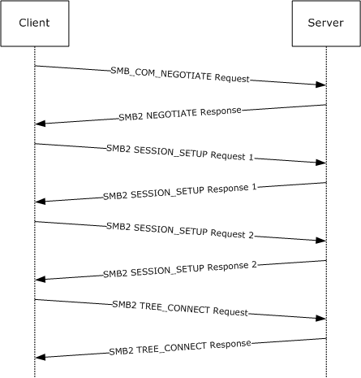{alt="Client negotiating SMB2 with SMB-style negotiate" width="5.541666666666667in" height="5.791666666666667in"}

1.  The client sends an SMB negotiate packet with the string \"SMB 2.002\" in the dialect string list, along with the other SMB dialects the client implements.

<!-- -->

2.  Smb: C; Negotiate, Dialect = PC NETWORK PROGRAM 1.0, LANMAN1.0, Windows for Workgroups 3.1a, LM1.2X002, LANMAN2.1, NT LM 0.12, SMB 2.002

    Protocol: SMB

    Command: Negotiate 114(0x72)

    SMBHeader: Command, TID: 0xFFFF, PID: 0xFEFF, UID: 0x0000, MID: 0x0000

    Flags: 24 (0x18)

    Bit0: (\...\....0) SMB_FLAGS_LOCK_AND_READ_OK: LOCK_AND_READ and WRITE_AND_CLOSE not supported (obsoleted)

    Bit1: (\...\...0.) SMB_FLAGS_SEND_NO_ACK \[not implemented\]

    Bit2: (\.....0..) Reserved (value is zero)

    Bit3: (\....1\...) SMB_FLAGS_CASE_INSENSITIVE: SMB paths are case-insensitive

    Bit4: (\...1\....) SMB_FLAGS_CANONICALIZED_PATHS: Canonicalized File and pathnames (obsoleted)

    Bit5: (..0\.....) SMB_FLAGS_OPLOCK: No Oplocks supported for OPEN, CREATE & CREATE_NEW (obsoleted)

    Bit6: (.0\...\...) SMB_FLAGS_OPLOCK_NOTIFY_ANY: No Notifications supported for OPEN, CREATE & CREATE_NEW (obsoleted)

    Bit7: (0\...\....) SMB_FLAGS_SERVER_TO_REDIR: Command - SMB is being sent from the client

    Flags2: 51283 (0xC853)

    Bit00: (\...\...\...\...\...1) SMB_FLAGS2_KNOWS_LONG_NAMES: May return long file names

    Bit01: (\...\...\...\.....1.) SMB_FLAGS2_KNOWS_EAS: Understands extended attributes

    Bit02: (\...\...\...\....0..) SMB_FLAGS2_SMB_SECURITY_SIGNATURE: Not security signature-enabled

    Bit03: (\...\...\...\...0\...) Reserved

    Bit04: (\...\...\.....1\....) Reserved

    Bit05: (\...\...\....0\.....) SMB_FLAGS2_SMB_SECURITY_SIGNATURE_REQUIRED: SMB packets are signed

    Bit06: (\...\...\...1\...\...) SMB_FLAGS2_IS_LONG_NAME: Any path name in the request is a long name

    Bit07: (\...\.....0\...\....) Reserved

    Bit08: (\...\....0\...\.....) Reserved

    Bit09: (\...\...0\...\...\...) Reserved

    Bit10: (\.....0\...\...\....) SMB_FLAGS2_REPARSE_PATH: Not requesting Reparse path

    Bit11: (\....1\...\...\.....) SMB_FLAGS2_EXTENDED_SECURITY: Aware of extended security

    Bit12: (\...0\...\...\...\...) SMB_FLAGS2_DFS: No DFS namespace

    Bit13: (..0\...\...\...\....) SMB_FLAGS2_PAGING_IO: Read operation will NOT be permitted if has no read permission

    Bit14: (.1\...\...\...\.....) SMB_FLAGS2_NT_STATUS: Using 32-bit NT status error codes

    Bit15: (1\...\...\...\...\...) SMB_FLAGS2_UNICODE: Using UNICODE strings

    PIDHigh: 0 (0x0)

    SecuritySignature: 0x0

    Reserved: 0 (0x0)

    TreeID: 65535 (0xFFFF)

    Reserved: 0 (0x0)

    UserID: 0 (0x0)

    MultiplexID: 0 (0x0)

    CNegotiate:

    WordCount: 0 (0x0)

    ByteCount: 109 (0x6D)

    Dialect: PC NETWORK PROGRAM 1.0

    BufferFormat: Dialect 2(0x2)

    DialectName: PC NETWORK PROGRAM 1.0

    Dialect: LANMAN1.0

    BufferFormat: Dialect 2(0x2)

    DialectName: LANMAN1.0

    Dialect: Windows for Workgroups 3.1a

    BufferFormat: Dialect 2(0x2)

    DialectName: Windows for Workgroups 3.1a

    Dialect: LM1.2X002

    BufferFormat: Dialect 2(0x2)

    DialectName: LM1.2X002

    Dialect: LANMAN2.1

    BufferFormat: Dialect 2(0x2)

    DialectName: LANMAN2.1

    Dialect: NT LM 0.12

    BufferFormat: Dialect 2(0x2)

    DialectName: NT LM 0.12

    Dialect: SMB 2.002

    BufferFormat: Dialect 2(0x2)

    DialectName: SMB 2.002

<!-- -->

2.  The server receives the SMB negotiate request and finds dialect \"SMB 2.002\". The server responds with an SMB2 negotiate.

<!-- -->

66. Smb2: R NEGOTIATE

    SMB2Header:

    Size: 64 (0x40)

    CreditCharge: 0 (0x0)

    Status: STATUS_SUCCESS

    Command: NEGOTIATE

    Credits: 1 (0x1)

    Flags: 1 (0x1)

    ServerToRedir: \...\...\...\...\...\...\...\...\...\....1 Server to Client

    AsyncCommand: \...\...\...\...\...\...\...\...\...\...0. Command is not asynchronous

    Related: \...\...\...\...\...\...\...\...\.....0.. Packet is single message

    Signed: \...\...\...\...\...\...\...\...\....0\... Packet is not signed

    Reserved: 0 (0x0)

    DFS: 0\...\...\...\...\...\...\...\...\...\.... Command is not a DFS Operation

    NextCommand: 0 (0x0)

    MessageId: 0 (0x0)

    Reserved: 0 (0x0)

    TreeId: 0 (0x0)

    SessionId: 0 (0x0)

    RNegotiate:

    Size: 65 (0x41)

    SecurityMode: Signing Enabled

    DialectRevision: 0x0202

    Reserved: 0 (0x0)

    Guid: {3F5CF209-A4E5-0049-A7D6-6A456D5CA5CF}

    Capabilities: 1 (0x1)

    DFS: \...\...\...\...\...\...\...\...\...\....1 DFS available

    MaxTransactSize: 65536 (0x10000)

    MaxReadSize: 65536 (0x10000)

    MaxWriteSize: 65536 (0x10000)

    SystemTime: 127972992061679232 (0x1C6A6C21CAE2680)

    ServerStartTime: 127972985895467232 (0x1C6A6C0AD2538E0)

    SecurityBufferOffset: 128 (0x80)

    SecurityBufferLength: 30 (0x1E)

    Reserved2: 0 (0x0)

    Buffer:

<!-- -->

3.  The client queries GSS for the authentication token and sends an [SMB2 SESSION_SETUP Request](#Section_5a3c2c28d6b048edb917a86b2ca4575f) with the output token received from GSS.

<!-- -->

104. Smb2: C SESSION SETUP

     Smb2: C SESSION SETUP

     SMB2Header:

     Size: 64 (0x40)

     CreditCharge: 0 (0x0)

     Status: STATUS_SUCCESS

     Command: SESSION SETUP

     Credits: 126 (0x7E)

     Flags: 0 (0x0)

     ServerToRedir: \...\...\...\...\...\...\...\...\...\....0 Client to Server

     AsyncCommand: \...\...\...\...\...\...\...\...\...\...0. Command is not asynchronous

     Related: \...\...\...\...\...\...\...\...\.....0.. Packet is single message

     Signed: \...\...\...\...\...\...\...\...\....0\... Packet is not signed

     Reserved: 0 (0x0)

     DFS: 0\...\...\...\...\...\...\...\...\...\.... Command is not a DFS Operation

     NextCommand: 0 (0x0)

     MessageId: 1 (0x1)

     Reserved: 0 (0x0)

     TreeId: 0 (0x0)

     SessionId: 0 (0x0)

     CSessionSetup:

     Size: 25 (0x19)

     VcNumber: 0 (0x0)

     SecurityMode: Signing Enabled

     Capabilities: 1 (0x1)

     DFS: \...\...\...\...\...\...\...\...\...\....1 DFS available

     Channel: 0 (0x0)

     SecurityBufferOffset: 88 (0x58)

     SecurityBufferLength: 74 (0x4A)

     Buffer: (74 bytes)

<!-- -->

4.  The server processes the token received with GSS and gets a return code indicating a subsequent round trip is required. The server responds to the client with an [SMB2 SESSION_SETUP Response](#Section_0324190fa31b46669fa95c624273a694) with **Status** equal to STATUS_MORE_PROCESSING_REQUIRED and the response containing the output token from GSS.

<!-- -->

136. Smb2: R SESSION SETUP (Status=STATUS_MORE_PROCESSING_REQUIRED)

     Smb2: R SESSION SETUP (Status=STATUS_MORE_PROCESSING_REQUIRED)

     SMB2Header:

     Size: 64 (0x40)

     CreditCharge: 0 (0x0)

     Status: STATUS_MORE_PROCESSING_REQUIRED

     Command: SESSION SETUP

     Credits: 2 (0x2)

     Flags: 1 (0x1)

     ServerToRedir: \...\...\...\...\...\...\...\...\...\....1 Server to Client

     AsyncCommand: \...\...\...\...\...\...\...\...\...\...0. Command is not asynchronous

     Related: \...\...\...\...\...\...\...\...\.....0.. Packet is single message

     Signed: \...\...\...\...\...\...\...\...\....0\... Packet is not signed

     Reserved: 0 (0x0)

     DFS: 0\...\...\...\...\...\...\...\...\...\.... Command is not a DFS Operation

     NextCommand: 0 (0x0)

     MessageId: 1 (0x1)

     Reserved: 0 (0x0)

     TreeId: 0 (0x0)

     SessionId: 4398046511113 (0x40000000009)

     RSessionSetup:

     Size: 9 (0x9)

     SessionFlags: Normal session

     SecurityBufferOffset: 72 (0x48)

     SecurityBufferLength: 219 (0xDB)

     Buffer: (219 bytes)

<!-- -->

5.  The client processes the received token with GSS and sends an SMB2 SESSION_SETUP Request with the output token received from GSS and the **SessionId** received on the previous response.

<!-- -->

164. Smb2: C SESSION SETUP

     Smb2: C SESSION SETUP

     SMB2Header:

     Size: 64 (0x40)

     CreditCharge: 0 (0x0)

     Status: STATUS_SUCCESS

     Command: SESSION SETUP

     Credits: 125 (0x7D)

     Flags: 0 (0x0)

     ServerToRedir: \...\...\...\...\...\...\...\...\...\....0 Client to Server

     AsyncCommand: \...\...\...\...\...\...\...\...\...\...0. Command is not asynchronous

     Related: \...\...\...\...\...\...\...\...\.....0.. Packet is single message

     Signed: \...\...\...\...\...\...\...\...\....0\... Packet is not signed

     Reserved: 0 (0x0)

     DFS: 0\...\...\...\...\...\...\...\...\...\.... Command is not a DFS Operation

     NextCommand: 0 (0x0)

     MessageId: 2 (0x2)

     Reserved: 0 (0x0)

     TreeId: 0 (0x0)

     SessionId: 4398046511113 (0x40000000009)

     CSessionSetup:

     Size: 25 (0x19)

     VcNumber: 0 (0x0)

     SecurityMode: Signing Enabled

     Capabilities: 1 (0x1)

     DFS: \...\...\...\...\...\...\...\...\...\....1 DFS available

     Channel: 0 (0x0)

     SecurityBufferOffset: 88 (0x58)

     SecurityBufferLength: 245 (0xF5)

     Buffer: (245 bytes)

<!-- -->

6.  The server processes the token received with GSS and gets a successful return code. The server responds to client with an SMB2 SESSION_SETUP Response with **Status** equal to STATUS_SUCCESS and the response containing the output token from GSS.

<!-- -->

196. Smb2: R SESSION SETUP

     Smb2: R SESSION SETUP

     SMB2Header:

     Size: 64 (0x40)

     CreditCharge: 0 (0x0)

     Status: STATUS_SUCCESS

     Command: SESSION SETUP

     Credits: 3 (0x3)

     Flags: 9 (0x9)

     ServerToRedir: \...\...\...\...\...\...\...\...\...\....1 Server to Client

     AsyncCommand: \...\...\...\...\...\...\...\...\...\...0. Command is not asynchronous

     Related: \...\...\...\...\...\...\...\...\.....0.. Packet is single message

     Signed: \...\...\...\...\...\...\...\...\....1\... Packet is signed

     Reserved: 0 (0x0)

     DFS: 0\...\...\...\...\...\...\...\...\...\.... Command is not a DFS Operation

     NextCommand: 0 (0x0)

     MessageId: 2 (0x2)

     Reserved: 0 (0x0)

     TreeId: 0 (0x0)

     SessionId: 4398046511113 (0x40000000009)

     RSessionSetup:

     Size: 9 (0x9)

     SessionFlags: Normal session

     SecurityBufferOffset: 72 (0x48)

     SecurityBufferLength: 29 (0x1D)

     Buffer: (29 bytes)

<!-- -->

7.  The client completes the authentication and sends an [SMB2 TREE_CONNECT Request](#Section_832d213022e84afbaafdb30bb0901798) with the **SessionId** for the [**session**](#gt_0cd96b80-a737-4f06-bca4-cf9efb449d12), and a [**tree connect**](#gt_c65d1989-3473-4fa9-ac45-6522573823e3) request containing the [**Unicode**](#gt_c305d0ab-8b94-461a-bd76-13b40cb8c4d8) [**share**](#gt_a49a79ea-dac7-4016-9a84-cf87161db7e3) name \"\\\\smb2server\\IPC\$\".

<!-- -->

224. Smb2: C TREE CONNECT \\\\smb2server\\IPC\$

     SMB2Header:

     Size: 64 (0x40)

     CreditCharge: 0 (0x0)

     Status: STATUS_SUCCESS

     Command: TREE CONNECT

     Credits: 123 (0x7B)

     Flags: 0 (0x0)

     ServerToRedir: \...\...\...\...\...\...\...\...\...\....0 Client to Server

     AsyncCommand: \...\...\...\...\...\...\...\...\...\...0. Command is not asynchronous

     Related: \...\...\...\...\...\...\...\...\.....0.. Packet is single message

     Signed: \...\...\...\...\...\...\...\...\....0\... Packet is not signed

     Reserved: 0 (0x0)

     DFS: 0\...\...\...\...\...\...\...\...\...\.... Command is not a DFS Operation

     NextCommand: 0 (0x0)

     MessageId: 3 (0x3)

     Reserved: 0 (0x0)

     TreeId: 0 (0x0)

     SessionId: 4398046511113 (0x40000000009)

     CTreeConnect:

     Size: 9 (0x9)

     Reserved: 0 (0x0)

     PathOffset: 72 (0x48)

     PathLength: 34 (0x22)

     Share: \\\\smb2server\\IPC\$

<!-- -->

8.  The server responds with an [SMB2 TREE_CONNECT Response](#Section_dd34e26ca75e47faaab26efc27502e96) with **MessageId** of 3, CreditResponse of 5, **Status** equal to STATUS_SUCCESS, **SessionId** of 0x40000000009, and **TreeId** set to the locally generated identifier 0x1.

<!-- -->

251. Smb2: R TREE CONNECT TID=0x1

     SMB2Header:

     Size: 64 (0x40)

     CreditCharge: 0 (0x0)

     Status: STATUS_SUCCESS

     Command: TREE CONNECT

     Credits: 5 (0x5)

     Flags: 1 (0x1)

     ServerToRedir: \...\...\...\...\...\...\...\...\...\....1 Server to Client

     AsyncCommand: \...\...\...\...\...\...\...\...\...\...0. Command is not asynchronous

     Related: \...\...\...\...\...\...\...\...\.....0.. Packet is single message

     Signed: \...\...\...\...\...\...\...\...\....0\... Packet is not signed

     Reserved: 0 (0x0)

     DFS: 0\...\...\...\...\...\...\...\...\...\.... Command is not a DFS Operation

     NextCommand: 0 (0x0)

     MessageId: 3 (0x3)

     Reserved: 0 (0x0)

     TreeId: 1 (0x1)

     SessionId: 4398046511113 (0x40000000009)

     RTreeConnect:

     Size: 16 (0x10)

     ShareType: Pipe

     Reserved: 0 (0x0)

     Flags: No Caching

     Capabilities: 0 (0x0)

     MaximalAccess: 2032127 (0x1F01FF)

Further operations can now continue, using the **SessionId** and **TreeId** generated in the [**connection**](#gt_866b0055-ceba-4acf-a692-98452943b981) to this share.

## Negotiating SMB 2.1 dialect by using Multi-Protocol Negotiate[[]{.indexref entry="Negotiating SMB 2.10 dialect by using multi-protocol negotiate example"}]{.indexref entry="Examples:negotiating SMB 2.10 dialect by using multi-protocol negotiate"}

The following diagram shows the steps taken by a client that is negotiating SMB 2.1 dialect by using an SMB-style negotiate.

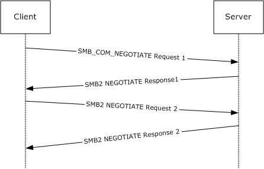{alt="Client negotiating SMB 2.1 dialect with SMB-style negotiate" width="5.545833333333333in" height="3.5388888888888888in"}

1.  The client sends an SMB negotiate packet with the string \"SMB 2.???\" in the dialect string list, along with the other SMB dialects the client implements.

<!-- -->

279. Smb: C; Negotiate, Dialect = PC NETWORK PROGRAM 1.0, LANMAN1.0, Windows for Workgroups 3.1a, LM1.2X002, LANMAN2.1, NT LM 0.12, SMB 2.002, SMB 2.???

     Protocol: SMB

     Command: Negotiate 114(0x72)

     NTStatus: 0x0, Facility = FACILITY_SYSTEM, Severity = STATUS_SEVERITY_SUCCESS, Code = (0) STATUS_SUCCESS

     Code: (\...\...\...\...\....0000000000000000) (0) STATUS_SUCCESS

     Facility: (\...0000000000000\...\...\...\...\....) FACILITY_SYSTEM

     Customer: (..0\...\...\...\...\...\...\...\...\.....) NOT Customer Defined

     Severity: (00\...\...\...\...\...\...\...\...\...\...) STATUS_SEVERITY_SUCCESS

     SMBHeader: Command, TID: 0xFFFF, PID: 0xFEFF, UID: 0x0000, MID: 0x0000

     Flags: 24 (0x18)

     LockAndRead: (\...\....0) LOCK_AND_READ and WRITE_AND_UNLOCK NOT supported (Obsolete) (SMB_FLAGS_LOCK_AND_READ_OK)

     NoAck: (\...\...0.) An ACK response is needed (SMB_FLAGS_SEND_NO_ACK\[only applicable when SMB transport is NetBIOS over IPX\])

     Reserved_bit2: (\.....0..) Reserved (Must Be Zero)

     CaseInsensitive: (\....1\...) SMB paths are caseinsensitive (SMB_FLAGS_CASE_INSENSITIVE)

     Canonicalized: (\...1\....) Canonicalized File and pathnames (Obsolete) (SMB_FLAGS_CANONICALIZED_PATHS)

     Oplock: (..0\.....) Oplocks NOT supported for OPEN, CREATE & CREATE_NEW (Obsolete) (SMB_FLAGS_OPLOCK)

     OplockNotify: (.0\...\...) Notifications NOT supported for OPEN, CREATE & CREATE_NEW (Obsolete) (SMB_FLAGS_OPLOCK_NOTIFY_ANY)

     FromServer: (0\...\....) Command SMB is being sent from the client (SMB_FLAGS_SERVER_TO_REDIR)

     Flags2: 51283 (0xC853)

     KnowsLongFiles: (\...\...\...\...\...1) Understands Long File Names (SMB_FLAGS2_KNOWS_LONG_NAMES)

     ExtendedAttribs: (\...\...\...\.....1.) Understands extended attributes (SMB_FLAGS2_KNOWS_EAS)

     SignEnabled: (\...\...\...\....0..) Security signatures NOT enabled (SMB_FLAGS2_SMB_SECURITY_SIGNATURE)

     Compressed: (\...\...\...\...0\...) Compression Disabled for REQ_NT_WRITE_ANDX and RESP_READ_ANDX (SMB_FLAGS2_COMPRESSED)

     SignRequired: (\...\...\.....1\....) Security Signatures are required (SMB_FLAGS2_SMB_SECURITY_SIGNATURE_REQUIRED)

     Reserved_bit5: (\...\...\....0\.....) Reserved (Must Be Zero)

     LongFileNames: (\...\...\...1\...\...) Use Long File Names (SMB_FLAGS2_IS_LONG_NAME)

     Reserved_bits7_9: (\...\...000\...\....) Reserved (Must Be Zero)

     ReparsePath: (\.....0\...\...\....) NOT a Reparse path (SMB_FLAGS2_REPARSE_PATH)

     ExtSecurity: (\....1\...\...\.....) Aware of extended security (SMB_FLAGS2_EXTENDED_SECURITY)

     Dfs: (\...0\...\...\...\...) NO DFS namespace (SMB_FLAGS2_DFS)

     Paging: (..0\...\...\...\....) Read operation will NOT be permitted unless user has permission (NO Paging IO) (SMB_FLAGS2_PAGING_IO)

     StatusCodes: (.1\...\...\...\.....) Using 32bit NT status error codes (SMB_FLAGS2_NT_STATUS)

     Unicode: (1\...\...\...\...\...) Using UNICODE strings (SMB_FLAGS2_UNICODE)

     PIDHigh: 0 (0x0)

     SecuritySignature: 0x0

     Reserved: 0 (0x0)

     TreeID: 65535 (0xFFFF)

     Reserved: 0 (0x0)

     UserID: 0 (0x0)

     MultiplexID: 0 (0x0)

     CNegotiate:

     WordCount: 0 (0x0)

     ByteCount: 120 (0x78)

     Dialect: PC NETWORK PROGRAM 1.0

     BufferFormat: Dialect 2(0x2)

     DialectName: PC NETWORK PROGRAM 1.0

     Dialect: LANMAN1.0

     BufferFormat: Dialect 2(0x2)

     DialectName: LANMAN1.0

     Dialect: Windows for Workgroups 3.1a

     BufferFormat: Dialect 2(0x2)

     DialectName: Windows for Workgroups 3.1a

     Dialect: LM1.2X002

     BufferFormat: Dialect 2(0x2)

     DialectName: LM1.2X002

     Dialect: LANMAN2.1

     BufferFormat: Dialect 2(0x2)

     DialectName: LANMAN2.1

     Dialect: NT LM 0.12

     BufferFormat: Dialect 2(0x2)

     DialectName: NT LM 0.12

     Dialect: SMB 2.002

     BufferFormat: Dialect 2(0x2)

     DialectName: SMB 2.002

     Dialect: SMB 2.???

     BufferFormat: Dialect 2(0x2)

     DialectName: SMB 2.???

<!-- -->

2.  The server receives the SMB negotiate request and finds the \"SMB 2.???\" string in the dialect string list. The server responds with an [SMB2 NEGOTIATE Response](#Section_63abf97c0d0947e288d66bfa552949a5) with the DialectRevision set to 0x02ff.

<!-- -->

346. Smb2: R NEGOTIATE (0x0), GUID={1ED9580F5FEF1AA04B9DDB1C77C63757}, Mid = 0

     SMBIdentifier: SMB

     SMB2Header: R NEGOTIATE (0x0)

     Size: 64 (0x40)

     CreditCharge: 0 (0x0)

     Status: 0x0, Facility = FACILITY_SYSTEM, Severity = STATUS_SEVERITY_SUCCESS, Code = (0) STATUS_SUCCESS

     Code: (\...\...\...\...\....0000000000000000) (0) STATUS_SUCCESS

     Facility: (\...0000000000000\...\...\...\...\....) FACILITY_SYSTEM

     Customer: (..0\...\...\...\...\...\...\...\...\.....) NOT Customer Defined

     Severity: (00\...\...\...\...\...\...\...\...\...\...) STATUS_SEVERITY_SUCCESS

     Command: NEGOTIATE (0x0)

     Credits: 1 (0x1)

     Flags: 0x1

     ServerToRedir: (\...\...\...\...\...\...\...\...\...\....1) Server to Client (SMB2_FLAGS_SERVER_TO_REDIR)

     AsyncCommand: (\...\...\...\...\...\...\...\...\...\...0.) Command is not asynchronous (SMB2_FLAGS_ASYNC_COMMAND)

     Related: (\...\...\...\...\...\...\...\...\.....0..) Packet is single message (SMB2_FLAGS_RELATED_OPERATIONS)

     Signed: (\...\...\...\...\...\...\...\...\....0\...) Packet is not signed (SMB2_FLAGS_SIGNED)

     Reserved4_27: (\....000000000000000000000000\....)

     DFS: (\...0\...\...\...\...\...\...\...\...\....) Command is not a DFS Operation (SMB2_FLAGS_DFS_OPERATIONS)

     Reserved29_31: (000\...\...\...\...\...\...\...\...\.....)

     NextCommand: 0 (0x0)

     MessageId: 0 (0x0)

     Reserved: 0 (0x0)

     TreeId: 0 (0x0)

     SessionId: 0 (0x0)

     Signature: Binary Large Object (16 Bytes)

     RNegotiate:

     Size: 65 (0x41)

     SecurityMode: Signing Enabled (0x1)

     DialectRevision: 767 (0x2FF)

     Reserved: 0 (0x0)

     Guid: {1ED9580F5FEF1AA04B9DDB1C77C63757}

     Capabilities: 0x3

     DFS: (\...\...\...\...\...\...\...\...\...\....1) DFS available

     Reserved_bits1_31: (0000000000000000000000000000001.) Reserved

     MaxTransactSize: 1048576 (0x100000)

     MaxReadSize: 1048576 (0x100000)

     MaxWriteSize: 1048576 (0x100000)

     SystemTime: 12/29/2008, 11:18:59 PM

     SystemStartTime: 12/05/2008, 11:55:51 PM

     SecurityBufferOffset: 128 (0x80)

     SecurityBufferLength: 120 (0x78)

     Reserved2: 541936672 (0x204D4C20)

     securityBlob:

<!-- -->

3.  The client receives the SMB2 NEGOTIATE Response. The client issues a new [SMB2 NEGOTIATE Request](#Section_e14db7ff763a42638b100c3944f52fc5) with a new dialect 0x0210 appended along with other SMB2 dialects.

<!-- -->

390. Smb2: C NEGOTIATE (0x0), GUID={9879BE56-0D00-58BA-11DD-D5F0AF3A5B5D}, Mid = 1

     SMBIdentifier: SMB

     SMB2Header: C NEGOTIATE (0x0)

     Size: 64 (0x40)

     CreditCharge: 0 (0x0)

     Status: 0x0, Facility = FACILITY_SYSTEM, Severity = STATUS_SEVERITY_SUCCESS, Code = (0) STATUS_SUCCESS

     Code: (\...\...\...\...\....0000000000000000) (0) STATUS_SUCCESS

     Facility: (\...0000000000000\...\...\...\...\....) FACILITY_SYSTEM

     Customer: (..0\...\...\...\...\...\...\...\...\.....) NOT Customer Defined

     Severity: (00\...\...\...\...\...\...\...\...\...\...) STATUS_SEVERITY_SUCCESS

     Command: NEGOTIATE (0x0)

     Credits: 0 (0x0)

     Flags: 0x0

     ServerToRedir: (\...\...\...\...\...\...\...\...\...\....0) Client to Server (SMB2_FLAGS_SERVER_TO_REDIR)

     AsyncCommand: (\...\...\...\...\...\...\...\...\...\...0.) Command is not asynchronous (SMB2_FLAGS_ASYNC_COMMAND)

     Related: (\...\...\...\...\...\...\...\...\.....0..) Packet is single message (SMB2_FLAGS_RELATED_OPERATIONS)

     Signed: (\...\...\...\...\...\...\...\...\....0\...) Packet is not signed (SMB2_FLAGS_SIGNED)

     Reserved4_27: (\....000000000000000000000000\....)

     DFS: (\...0\...\...\...\...\...\...\...\...\....) Command is not a DFS Operation (SMB2_FLAGS_DFS_OPERATIONS)

     Reserved29_31: (000\...\...\...\...\...\...\...\...\.....)

     NextCommand: 0 (0x0)

     MessageId: 1 (0x1)

     Reserved: 0 (0x0)

     TreeId: 0 (0x0)

     SessionId: 0 (0x0)

     Signature: Binary Large Object (16 Bytes)

     CNegotiate:

     Size: 36 (0x24)

     DialectCount: 2 (0x2)

     SecurityMode: Signing Enabled (0x1)

     Reserved: 0 (0x0)

     Capabilities: 0x0

     DFS: (\...\...\...\...\...\...\...\...\...\....0) DFS unavailable

     Reserved_bits1_31: (0000000000000000000000000000000.) Reserved

     Guid: {9879BE56-0D00-58BA-11DD-D5F0AF3A5B5D}

     StartTime: No Time Specified (0)

     Dialects:

     Dialects: 514 (0x202)

     Dialects: 528 (0x210)

<!-- -->

4.  The server receives the SMB2 negotiate request and finds dialect 0x0210. The server sends an SMB2 NEGOTIATE Response with DialectRevision set to 0x0210.

<!-- -->

429. Smb2: R NEGOTIATE (0x0), GUID={1ED9580F-5FEF-1AA0-4B9D-DB1C77C63757}, Mid = 1

     SMBIdentifier: SMB

     SMB2Header: R NEGOTIATE (0x0)

     Size: 64 (0x40)

     CreditCharge: 0 (0x0)

     Status: 0x0, Facility = FACILITY_SYSTEM, Severity = STATUS_SEVERITY_SUCCESS, Code = (0) STATUS_SUCCESS

     Code: (\...\...\...\...\....0000000000000000) (0) STATUS_SUCCESS

     Facility: (\...0000000000000\...\...\...\...\....) FACILITY_SYSTEM

     Customer: (..0\...\...\...\...\...\...\...\...\.....) NOT Customer Defined

     Severity: (00\...\...\...\...\...\...\...\...\...\...) STATUS_SEVERITY_SUCCESS

     Command: NEGOTIATE (0x0)

     Credits: 1 (0x1)

     Flags: 0x1

     ServerToRedir: (\...\...\...\...\...\...\...\...\...\....1) Server to Client (SMB2_FLAGS_SERVER_TO_REDIR)

     AsyncCommand: (\...\...\...\...\...\...\...\...\...\...0.) Command is not asynchronous (SMB2_FLAGS_ASYNC_COMMAND)

     Related: (\...\...\...\...\...\...\...\...\.....0..) Packet is single message (SMB2_FLAGS_RELATED_OPERATIONS)

     Signed: (\...\...\...\...\...\...\...\...\....0\...) Packet is not signed (SMB2_FLAGS_SIGNED)

     Reserved4_27: (\....000000000000000000000000\....)

     DFS: (\...0\...\...\...\...\...\...\...\...\....) Command is not a DFS Operation (SMB2_FLAGS_DFS_OPERATIONS)

     Reserved29_31: (000\...\...\...\...\...\...\...\...\.....)

     NextCommand: 0 (0x0)

     MessageId: 1 (0x1)

     Reserved: 0 (0x0)

     TreeId: 0 (0x0)

     SessionId: 0 (0x0)

     Signature: Binary Large Object (16 Bytes)

     RNegotiate:

     Size: 65 (0x41)

     SecurityMode: Signing Enabled (0x1)

     DialectRevision: 528 (0x210)

     Reserved: 0 (0x0)

     Guid: {1ED9580F-5FEF-1AA0-4B9D-DB1C77C63757}

     Capabilities: 0x3

     DFS: (\...\...\...\...\...\...\...\...\...\....1) DFS available

     Reserved_bits1_31: (0000000000000000000000000000001.) Reserved

     MaxTransactSize: 1048576 (0x100000)

     MaxReadSize: 1048576 (0x100000)

     MaxWriteSize: 1048576 (0x100000)

     SystemTime: 12/29/2008, 11:18:59 PM

     SystemStartTime: 12/05/2008, 11:55:51 PM

     SecurityBufferOffset: 128 (0x80)

     SecurityBufferLength: 120 (0x78)

     Reserved2: 0 (0x0)

     securityBlob:

## Connecting to a Share by Using an SMB2 Negotiate[[]{.indexref entry="SMB2 negotiate example"}]{.indexref entry="Examples:SMB2 negotiate"}

The following diagram shows the steps taken by a client that is negotiating SMB2 by using an SMB2 negotiate.

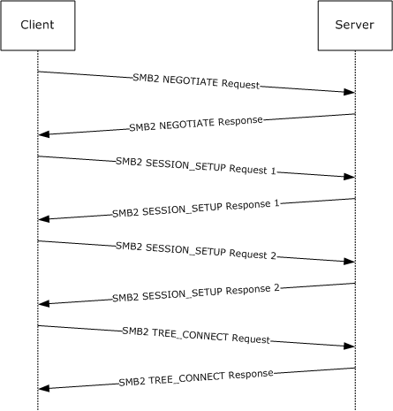{alt="Client negotiating SMB2 with SMB2 negotiate" width="5.560416666666667in" height="5.794444444444444in"}

1.  The client sends an SMB2 negotiate packet with the dialect 0x0202 in the **Dialects** array.

<!-- -->

474. Smb2: C NEGOTIATE

     SMB2Header:

     Size: 64 (0x40)

     CreditCharge: 0 (0x0)

     Status: STATUS_SUCCESS

     Command: NEGOTIATE

     Credits: 126 (0x7E)

     Flags: 0 (0x0)

     ServerToRedir: \...\...\...\...\...\...\...\...\...\....0 Client to Server

     AsyncCommand: \...\...\...\...\...\...\...\...\...\...0. Command is not asynchronous

     Related: \...\...\...\...\...\...\...\...\.....0.. Packet is single message

     Signed: \...\...\...\...\...\...\...\...\....0\... Packet is not signed

     Reserved: 0 (0x0)

     DFS: 0\...\...\...\...\...\...\...\...\...\.... Command is not a DFS Operation

     NextCommand: 0 (0x0)

     MessageId: 0 (0x0)

     Reserved: 0 (0x0)

     TreeId: 0 (0x0)

     SessionId: 0 (0x0)

     CNegotiate:

     Size: 36 (0x24)

     DialectCount: 1 (0x1)

     SecurityMode: Signing Enabled

     Reserved: 0 (0x0)

     Capabilities: 0 (0x0)

     Guid: {00000000-0000-0000-0000-000000000000}

     StartTime: 0 (0x0)

     Dialects: 514 (0x0202)

<!-- -->

2.  The server receives the [SMB2 NEGOTIATE Request](#Section_e14db7ff763a42638b100c3944f52fc5) and finds dialect 0x0202. The server responds with an SMB2 negotiate.

<!-- -->

503. Smb2: R NEGOTIATE

     SMB2Header:

     Size: 64 (0x40)

     CreditCharge: 0 (0x0)

     Status: STATUS_SUCCESS

     Command: NEGOTIATE

     Credits: 1 (0x1)

     Flags: 1 (0x1)

     ServerToRedir: \...\...\...\...\...\...\...\...\...\....1 Server to Client

     AsyncCommand: \...\...\...\...\...\...\...\...\...\...0. Command is not asynchronous

     Related: \...\...\...\...\...\...\...\...\.....0.. Packet is single message

     Signed: \...\...\...\...\...\...\...\...\....0\... Packet is not signed

     Reserved: 0 (0x0)

     DFS: 0\...\...\...\...\...\...\...\...\...\.... Command is not a DFS Operation

     NextCommand: 0 (0x0)

     MessageId: 0 (0x0)

     Reserved: 0 (0x0)

     TreeId: 0 (0x0)

     SessionId: 0 (0x0)

     RNegotiate:

     Size: 65 (0x41)

     SecurityMode: Signing Enabled

     DialectRevision: 514 (0x0202)

     Reserved: 0 (0x0)

     Guid: {3F5CF209-A4E5-0049-A7D6-6A456D5CA5CF}

     Capabilities: 1 (0x1)

     DFS: \...\...\...\...\...\...\...\...\...\....1 DFS available

     MaxTransactSize: 65536 (0x10000)

     MaxReadSize: 65536 (0x10000)

     MaxWriteSize: 65536 (0x10000)

     SystemTime: 127972992061679232 (0x1C6A6C21CAE2680)

     ServerStartTime: 127972985895467232 (0x1C6A6C0AD2538E0)

     SecurityBufferOffset: 128 (0x80)

     SecurityBufferLength: 30 (0x1E)

     Reserved2: 0 (0x0)

     Buffer:

<!-- -->

3.  The client queries GSS for the authentication token and sends an [SMB2 SESSION_SETUP Request](#Section_5a3c2c28d6b048edb917a86b2ca4575f) with the output token received from GSS.

<!-- -->

539. Smb2: C SESSION SETUP

     SMB2Header:

     Size: 64 (0x40)

     CreditCharge: 0 (0x0)

     Status: STATUS_SUCCESS

     Command: SESSION SETUP

     Credits: 126 (0x7E)

     Flags: 0 (0x0)

     ServerToRedir: \...\...\...\...\...\...\...\...\...\....0 Client to Server

     AsyncCommand: \...\...\...\...\...\...\...\...\...\...0. Command is not asynchronous

     Related: \...\...\...\...\...\...\...\...\.....0.. Packet is single message

     Signed: \...\...\...\...\...\...\...\...\....0\... Packet is not signed

     Reserved: 0 (0x0)

     DFS: 0\...\...\...\...\...\...\...\...\...\.... Command is not a DFS Operation

     NextCommand: 0 (0x0)

     MessageId: 1 (0x1)

     Reserved: 0 (0x0)

     TreeId: 0 (0x0)

     SessionId: 0 (0x0)

     CSessionSetup:

     Size: 25 (0x19)

     VcNumber: 0 (0x0)

     SecurityMode: Signing Enabled

     Capabilities: 1 (0x1)

     DFS: \...\...\...\...\...\...\...\...\...\....1 DFS available

     Channel: 0 (0x0)

     SecurityBufferOffset: 88 (0x58)

     SecurityBufferLength: 74 (0x4A)

     Buffer: (74 bytes)

<!-- -->

4.  The server processes the token received with GSS and gets a return code indicating a subsequent round trip is required. The server responds to the client with an [SMB2 SESSION_SETUP Response](#Section_0324190fa31b46669fa95c624273a694) with **Status** equal to STATUS_MORE_PROCESSING_REQUIRED and the response containing the output token from GSS.

<!-- -->

568. Smb2: R SESSION SETUP (Status=STATUS_MORE_PROCESSING_REQUIRED)

     SMB2Header:

     Size: 64 (0x40)

     CreditCharge: 0 (0x0)

     Status: STATUS_MORE_PROCESSING_REQUIRED

     Command: SESSION SETUP

     Credits: 2 (0x2)

     Flags: 1 (0x1)

     ServerToRedir: \...\...\...\...\...\...\...\...\...\....1 Server to Client

     AsyncCommand: \...\...\...\...\...\...\...\...\...\...0. Command is not asynchronous

     Related: \...\...\...\...\...\...\...\...\.....0.. Packet is single message

     Signed: \...\...\...\...\...\...\...\...\....0\... Packet is not signed

     Reserved: 0 (0x0)

     DFS: 0\...\...\...\...\...\...\...\...\...\.... Command is not a DFS Operation

     NextCommand: 0 (0x0)

     MessageId: 1 (0x1)

     Reserved: 0 (0x0)

     TreeId: 0 (0x0)

     SessionId: 4398046511113 (0x40000000009)

     RSessionSetup:

     Size: 9 (0x9)

     SessionFlags: Normal session

     SecurityBufferOffset: 72 (0x48)

     SecurityBufferLength: 219 (0xDB)

     Buffer: (219 bytes)

<!-- -->

5.  The client processes the received token with GSS and sends an SMB2 SESSION_SETUP Request with the output token received from GSS and the **SessionId** received on the previous response.

<!-- -->

593. Smb2: C SESSION SETUP

     SMB2Header:

     Size: 64 (0x40)

     CreditCharge: 0 (0x0)

     Status: STATUS_SUCCESS

     Command: SESSION SETUP

     Credits: 125 (0x7D)

     Flags: 0 (0x0)

     ServerToRedir: \...\...\...\...\...\...\...\...\...\....0 Client to Server

     AsyncCommand: \...\...\...\...\...\...\...\...\...\...0. Command is not asynchronous

     Related: \...\...\...\...\...\...\...\...\.....0.. Packet is single message

     Signed: \...\...\...\...\...\...\...\...\....0\... Packet is not signed

     Reserved: 0 (0x0)

     DFS: 0\...\...\...\...\...\...\...\...\...\.... Command is not a DFS Operation

     NextCommand: 0 (0x0)

     MessageId: 2 (0x2)

     Reserved: 0 (0x0)

     TreeId: 0 (0x0)

     SessionId: 4398046511113 (0x40000000009)

     CSessionSetup:

     Size: 25 (0x19)

     VcNumber: 0 (0x0)

     SecurityMode: Signing Enabled

     Capabilities: 1 (0x1)

     DFS: \...\...\...\...\...\...\...\...\...\....1 DFS available

     Channel: 0 (0x0)

     SecurityBufferOffset: 88 (0x58)

     SecurityBufferLength: 245 (0xF5)

     Buffer: (245 bytes)

<!-- -->

6.  The server processes the token received with GSS and gets a successful return code. The server responds to the client with an SMB2 SESSION_SETUP Response with **Status** equal to STATUS_SUCCESS and the response containing the output token from GSS.

<!-- -->

622. Smb2: R SESSION SETUP

     SMB2Header:

     Size: 64 (0x40)

     CreditCharge: 0 (0x0)

     Status: STATUS_SUCCESS

     Command: SESSION SETUP

     Credits: 3 (0x3)

     Flags: 9 (0x9)

     ServerToRedir: \...\...\...\...\...\...\...\...\...\....1 Server to Client

     AsyncCommand: \...\...\...\...\...\...\...\...\...\...0. Command is not asynchronous

     Related: \...\...\...\...\...\...\...\...\.....0.. Packet is single message

     Signed: \...\...\...\...\...\...\...\...\....1\... Packet is signed

     Reserved: 0 (0x0)

     DFS: 0\...\...\...\...\...\...\...\...\...\.... Command is not a DFS Operation

     NextCommand: 0 (0x0)

     MessageId: 2 (0x2)

     Reserved: 0 (0x0)

     TreeId: 0 (0x0)

     SessionId: 4398046511113 (0x40000000009)

     RSessionSetup:

     Size: 9 (0x9)

     SessionFlags: Normal session

     SecurityBufferOffset: 72 (0x48)

     SecurityBufferLength: 29 (0x1D)

     Buffer: (29 bytes)

<!-- -->

7.  The client completes the authentication and sends an [SMB2 TREE_CONNECT Request](#Section_832d213022e84afbaafdb30bb0901798) with the **SessionId** for the [**session**](#gt_0cd96b80-a737-4f06-bca4-cf9efb449d12), and a [**tree connect**](#gt_c65d1989-3473-4fa9-ac45-6522573823e3) request containing the [**Unicode**](#gt_c305d0ab-8b94-461a-bd76-13b40cb8c4d8) [**share**](#gt_a49a79ea-dac7-4016-9a84-cf87161db7e3) name \"\\\\smb2server\\IPC\$\".

<!-- -->

647. Smb2: C TREE CONNECT \\\\smb2server\\IPC\$

     SMB2Header:

     Size: 64 (0x40)

     CreditCharge: 0 (0x0)

     Status: STATUS_SUCCESS

     Command: TREE CONNECT

     Credits: 123 (0x7B)

     Flags: 0 (0x0)

     ServerToRedir: \...\...\...\...\...\...\...\...\...\....0 Client to Server

     AsyncCommand: \...\...\...\...\...\...\...\...\...\...0. Command is not asynchronous

     Related: \...\...\...\...\...\...\...\...\.....0.. Packet is single message

     Signed: \...\...\...\...\...\...\...\...\....0\... Packet is not signed

     Reserved: 0 (0x0)

     DFS: 0\...\...\...\...\...\...\...\...\...\.... Command is not a DFS Operation

     NextCommand: 0 (0x0)

     MessageId: 3 (0x3)

     Reserved: 0 (0x0)

     TreeId: 0 (0x0)

     SessionId: 4398046511113 (0x40000000009)

     CTreeConnect:

     Size: 9 (0x9)

     Reserved: 0 (0x0)

     PathOffset: 72 (0x48)

     PathLength: 34 (0x22)

     Share: \\\\smb2server\\IPC\$

<!-- -->

8.  The server responds with an [SMB2 TREE_CONNECT Response](#Section_dd34e26ca75e47faaab26efc27502e96) with **MessageId** of 3, CreditResponse of 5, **Status** equal to STATUS_SUCCESS, **SessionId** of 0x40000000009, and **TreeId** set to the locally generated identifier 0x1.

<!-- -->

672. Smb2: R TREE CONNECT TID=0x1

     SMB2Header:

     Size: 64 (0x40)

     CreditCharge: 0 (0x0)

     Status: STATUS_SUCCESS

     Command: TREE CONNECT

     Credits: 5 (0x5)

     Flags: 1 (0x1)

     ServerToRedir: \...\...\...\...\...\...\...\...\...\....1 Server to Client

     AsyncCommand: \...\...\...\...\...\...\...\...\...\...0. Command is not asynchronous

     Related: \...\...\...\...\...\...\...\...\.....0.. Packet is single message

     Signed: \...\...\...\...\...\...\...\...\....0\... Packet is not signed

     Reserved: 0 (0x0)

     DFS: 0\...\...\...\...\...\...\...\...\...\.... Command is not a DFS Operation

     NextCommand: 0 (0x0)

     MessageId: 3 (0x3)

     Reserved: 0 (0x0)

     TreeId: 1 (0x1)

     SessionId: 4398046511113 (0x40000000009)

     RTreeConnect:

     Size: 16 (0x10)

     ShareType: Pipe

     Reserved: 0 (0x0)

     Flags: No Caching

     Capabilities: 0 (0x0)

     MaximalAccess: 2032127 (0x1F01FF)

Further operations can now continue, using the **SessionId** and **TreeId** generated in the [**connection**](#gt_866b0055-ceba-4acf-a692-98452943b981) to this share.

## Executing an Operation on a Named Pipe[[[]{.indexref entry="Named pipe example"}]{.indexref entry="Pipe - named - example"}]{.indexref entry="Examples:named pipe"}

The following diagram demonstrates the steps taken to execute transactions over a named pipe using both individual reads and writes, and the transact named pipe operation. Assume that this sequence starts on a [**connection**](#gt_866b0055-ceba-4acf-a692-98452943b981) where the [**session**](#gt_0cd96b80-a737-4f06-bca4-cf9efb449d12) and [**tree connect**](#gt_c65d1989-3473-4fa9-ac45-6522573823e3) have been established as described in previous sections with **SessionId** = 0x4000000000D and **TreeId** 0x1, and messages have been exchanged such that the current **MessageId** is 9.

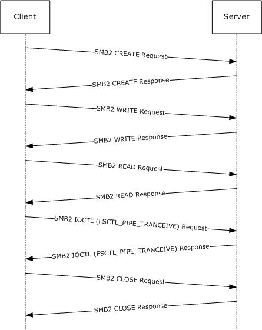{alt="Executing an operation on a named pipe" width="5.503472222222222in" height="6.950694444444444in"}

1.  The client sends an [SMB2 CREATE Request](#Section_e8fb45c1a03d44cab7ae47385cfd7997) to [**open**](#gt_0d572cce-4683-4b21-945a-7f8035bb6469) the named pipe \"srvsvc\".

<!-- -->

698. Smb2: C CREATE srvsvc

     SMB2Header:

     Size: 64 (0x40)

     CreditCharge: 0 (0x0)

     Status: STATUS_SUCCESS

     Command: CREATE

     Credits: 111 (0x6F)

     Flags: 0 (0x0)

     ServerToRedir: \...\...\...\...\...\...\...\...\...\....0 Client to Server

     AsyncCommand: \...\...\...\...\...\...\...\...\...\...0. Command is not asynchronous

     Related: \...\...\...\...\...\...\...\...\.....0.. Packet is single message

     Signed: \...\...\...\...\...\...\...\...\....0\... Packet is not signed

     Reserved: 0 (0x0)

     DFS: 0\...\...\...\...\...\...\...\...\...\.... Command is not a DFS Operation

     NextCommand: 0 (0x0)

     MessageId: 9 (0x9)

     Reserved: 0 (0x0)

     TreeId: 1 (0x1)

     SessionId: 4398046511117 (0x4000000000D)

     CCreate:

     Size: 57 (0x39)

     SecurityFlags: 0 (0x0)

     RequestedOplockLevel: 9 (0x9)

     ImpersonationLevel: 2 (0x2)

     SmbCreateFlags: 0 (0x0)

     Reserved: 0(0x0)

     DesiredAccess: 0x0012019f

     read: (\...\...\...\...\...\...\...\...\...\....1) Read Data

     write: (\...\...\...\...\...\...\...\...\...\...1.) Write Data

     append: (\...\...\...\...\...\...\...\...\.....1..) Append Data

     readEA: (\...\...\...\...\...\...\...\...\....1\...) Read EA

     writeEA: (\...\...\...\...\...\...\...\...\...1\....) Write EA

     FileExecute: (\...\...\...\...\...\...\...\.....0\.....) No File Execute

     FileDeleted: (\...\...\...\...\...\...\...\....0\...\...) No File Delete

     FileRead: (\...\...\...\...\...\...\...\...1\...\....) File Read Attributes

     FileWrite: (\...\...\...\...\...\...\.....1\...\.....) File Write Attributes

     FileAttributes: 0x00000000

     ReadOnly: (\...\...\...\...\...\...\...\...\...\....0) Read/Write

     Hidden: (\...\...\...\...\...\...\...\...\...\...0.) Not Hidden

     System: (\...\...\...\...\...\...\...\...\.....0..) Not System

     Reserverd3: 0 (0x0)

     Directory: (\...\...\...\...\...\...\...\...\...0\....) File

     Archive: (\...\...\...\...\...\...\...\.....0\.....) Not Archive

     Device: (\...\...\...\...\...\...\...\....0\...\...) Not Device

     Normal: (\...\...\...\...\...\...\...\...0\...\....) Not Normal

     Temporary: (\...\...\...\...\...\...\.....0\...\.....) Permanent

     Sparse: (\...\...\...\...\...\...\....0\...\...\...) Not Sparse

     Reparse: (\...\...\...\...\...\...\...0\...\...\....) Not Reparse Point

     Compressed: (\...\...\...\...\...\.....0\...\...\.....) Uncompressed

     Offline: (\...\...\...\...\...\....0\...\...\...\...) Content indexed

     NotIndexed: (\...\...\...\...\...\...0\...\...\...\....) Permanent

     Encrypted: (\...\...\...\...\.....0\...\...\...\.....) Unencrypted

     ShareAccess: Shared for Read/Write

     CreateDisposition: Open

     CreateOptions: 0x00400040

     dir: (\...\...\...\...\...\...\...\...\...\....0) non-directory

     write: (\...\...\...\...\...\...\...\...\...\...0.) non-write through

     sq: (\...\...\...\...\...\...\...\...\.....0..) non-sequentially writing allowed

     buffer: (\...\...\...\...\...\...\...\...\....0\...) intermediate buffering allowed

     alert: (\...\...\...\...\...\...\...\...\...0\....) IO alerts bits not set

     nonalert: (\...\...\...\...\...\...\...\.....0\.....) IO non-alerts bit not set

     nondir: (\...\...\...\...\...\...\...\....1\...\...) Operation is on non-directory file

     connect: (\...\...\...\...\...\...\...\...0\...\....) tree connect bit not set

     oplock: (\...\...\...\...\...\...\.....0\...\.....) complete if oplocked bit not set

     EA: (\...\...\...\...\...\...\....0\...\...\...) no EA knowledge bit is not set

     filename: (\...\...\...\...\...\...\...0\...\...\....) 8.3 filenames bit is not set

     random: (\...\...\...\...\...\.....0\...\...\.....) random access bit is not set

     delete: (\...\...\...\...\...\....0\...\...\...\...) delete on close bit is not set

     open: (\...\...\...\...\...\...0\...\...\...\....) open by filename

     backup: (\...\...\...\...\.....0\...\...\...\.....) open for backup bit not set

     NameOffset: 120 (0x78)

     NameLength: 12 (0xC)

     CreateContextsOffset: 0 (0x0)

     CreateContextsLength: 0 (0x0)

     Name: srvsvc

<!-- -->

2.  The server responds with an [SMB2 CREATE Response](#Section_d166aa9e0b53410eb35e3933d8131927) with the **FileId** for the pipe open.

<!-- -->

773. Smb2: R CREATE FID=

     SMB2Header:

     Size: 64 (0x40)

     CreditCharge: 0 (0x0)

     Status: STATUS_SUCCESS

     Command: CREATE

     Credits: 1 (0x1)

     Flags: 1 (0x1)

     ServerToRedir: \...\...\...\...\...\...\...\...\...\....1 Server to Client

     AsyncCommand: \...\...\...\...\...\...\...\...\...\...0. Command is not asynchronous

     Related: \...\...\...\...\...\...\...\...\.....0.. Packet is single message

     Signed: \...\...\...\...\...\...\...\...\....0\... Packet is not signed

     Reserved: 0 (0x0)

     DFS: 0\...\...\...\...\...\...\...\...\...\.... Command is not a DFS Operation

     NextCommand: 0 (0x0)

     MessageId: 9 (0x9)

     Reserved: 0 (0x0)

     TreeId: 1 (0x1)

     SessionId: 4398046511117 (0x4000000000D)

     RCreate:

     Size: 89 (0x59)

     OplockLevel: 0 (0x0)

     Reserved1: 9 (0x9)

     CreateAction: 1 (0x1)

     CreationTime: 0 (0x0)

     LastAccessTime: 0 (0x0)

     LastWriteTime: 0 (0x0)

     ChangeTime: 0 (0x0)

     AllocationSize: 4096 (0x1000)

     EndOfFile: 0 (0x0)

     FileAttributes: 0x00000080

     ReadOnly: (\...\...\...\...\...\...\...\...\...\....0) Read/Write

     Hidden: (\...\...\...\...\...\...\...\...\...\...0.) Not Hidden

     System: (\...\...\...\...\...\...\...\...\.....0..) Not System

     Reserverd3: 0 (0x0)

     Directory: (\...\...\...\...\...\...\...\...\...0\....) File

     Archive: (\...\...\...\...\...\...\...\.....0\.....) Not Archive

     Device: (\...\...\...\...\...\...\...\....0\...\...) Not Device

     Normal: (\...\...\...\...\...\...\...\...1\...\....) Normal

     Temporary: (\...\...\...\...\...\...\.....0\...\.....) Permanent

     Sparse: (\...\...\...\...\...\...\....0\...\...\...) Not Sparse

     Reparse: (\...\...\...\...\...\...\...0\...\...\....) Not Reparse Point

     Compressed: (\...\...\...\...\...\.....0\...\...\.....) Uncompressed

     Offline: (\...\...\...\...\...\....0\...\...\...\...) Content indexed

     NotIndexed: (\...\...\...\...\...\...0\...\...\...\....) Permanent

     Encrypted: (\...\...\...\...\.....0\...\...\...\.....) Unencrypted

     Reserved2: 7536758 (0x730076)

     Fid:

     Persistent: 5 (0x5)

     Volatile: -4294967291 (0xFFFFFFFF00000005)

     CreateContextsOffset: 0 (0x0)

     CreateContextsLength: 0 (0x0)

<!-- -->

3.  The client sends an [SMB2 WRITE Request](#Section_e704696133184350be2aa8d69bb59ce8) to write data into the pipe.

<!-- -->

825. Smb2: C WRITE 0x74 bytes at offset 0 (0x0)

     SMB2Header:

     Size: 64 (0x40)

     CreditCharge: 0 (0x0)

     Status: STATUS_SUCCESS

     Command: WRITE

     Credits: 111 (0x6F)

     Flags: 0 (0x0)

     ServerToRedir: \...\...\...\...\...\...\...\...\...\....0 Client to Server

     AsyncCommand: \...\...\...\...\...\...\...\...\...\...0. Command is not asynchronous

     Related: \...\...\...\...\...\...\...\...\.....0.. Packet is single message

     Signed: \...\...\...\...\...\...\...\...\....0\... Packet is not signed

     Reserved: 0 (0x0)

     DFS: 0\...\...\...\...\...\...\...\...\...\.... Command is not a DFS Operation

     NextCommand: 0 (0x0)

     MessageId: 10 (0xA)

     Reserved: 0 (0x0)

     TreeId: 1 (0x1)

     SessionId: 4398046511117 (0x4000000000D)

     CWrite:

     Size: 49 (0x31)

     DataOffset: 112 (0x70)

     DataLength: 116 (0x74)

     Offset: 0 (0x0)

     Fid:

     Persistent: 5 (0x5)

     Volatile: -4294967291 (0xFFFFFFFF00000005)

     Channel: 0 (0x0)

     RemainingBytes: 0 (0x0)

     WriteChannelInfoOffset: 0 (0x0)

     WriteChannelInfoLength: 0 (0x0)

     Flags: 0 (0x0)

     Data: (116 bytes)

<!-- -->

4.  The server responds with an [SMB2 WRITE Response](#Section_7b80a339f4d345758ce270a06f24f133) indicating the data was written successfully.

<!-- -->

858. Smb2: R WRITE 0x74 bytes written

     SMB2Header:

     Size: 64 (0x40)

     CreditCharge: 0 (0x0)

     Status: STATUS_SUCCESS

     Command: WRITE

     Credits: 1 (0x1)

     Flags: 1 (0x1)

     ServerToRedir: \...\...\...\...\...\...\...\...\...\....1 Server to Client

     AsyncCommand: \...\...\...\...\...\...\...\...\...\...0. Command is not asynchronous

     Related: \...\...\...\...\...\...\...\...\.....0.. Packet is single message

     Signed: \...\...\...\...\...\...\...\...\....0\... Packet is not signed

     Reserved: 0 (0x0)

     DFS: 0\...\...\...\...\...\...\...\...\...\.... Command is not a DFS Operation

     NextCommand: 0 (0x0)

     MessageId: 10 (0xA)

     Reserved: 0 (0x0)

     TreeId: 1 (0x1)

     SessionId: 4398046511117 (0x4000000000D)

     RWrite:

     Size: 17 (0x11)

     Reserved: 0 (0x0)

     DataLength: 116 (0x74)

     Remaining: 0 (0x0)

     WriteChannelInfoOffset: 0 (0x0)

     WriteChannelInfoLength: 0 (0x0)

<!-- -->

5.  The client sends an [SMB2 READ Request](#Section_320f04f31b2845cdaaa19e5aed810dca) to read data from the pipe.

<!-- -->

884. Smb2: C READ 0x400 bytes from offset 0 (0x0)

     SMB2Header:

     Size: 64 (0x40)

     CreditCharge: 0 (0x0)

     Status: STATUS_SUCCESS

     Command: READ

     Credits: 111 (0x6F)

     Flags: 0 (0x0)

     ServerToRedir: \...\...\...\...\...\...\...\...\...\....0 Client to Server

     AsyncCommand: \...\...\...\...\...\...\...\...\...\...0. Command is not asynchronous

     Related: \...\...\...\...\...\...\...\...\.....0.. Packet is single message

     Signed: \...\...\...\...\...\...\...\...\....0\... Packet is not signed

     Reserved: 0 (0x0)

     DFS: 0\...\...\...\...\...\...\...\...\...\.... Command is not a DFS Operation

     NextCommand: 0 (0x0)

     MessageId: 11 (0xB)

     Reserved: 0 (0x0)

     TreeId: 1 (0x1)

     SessionId: 4398046511117 (0x4000000000D)

     CRead:

     Size: 49 (0x31)

     Padding: 80 (0x50)

     Reserved: 0 (0x0)

     DataLength: 1024 (0x400)

     Offset: 0 (0x0)

     Fid:

     Persistent: 5 (0x5)

     Volatile: -4294967291 (0xFFFFFFFF00000005)

     MinimumCount: 0 (0x0)

     Channel: 0 (0x0)

     RemainingBytes: 0 (0x0)

     ReadChannelInfoOffset: 0 (0x0)

     ReadChannelInfoLength: 0 (0x0)

<!-- -->

6.  The server responds with an [SMB2 READ Response](#Section_3e3d2f2c0e2f41eaad07fbca6ffdfd90) with the data that was read.

<!-- -->

917. Smb2: R READ 0x5c bytes read

     SMB2Header:

     Size: 64 (0x40)

     CreditCharge: 0 (0x0)

     Status: STATUS_SUCCESS

     Command: READ

     Credits: 1 (0x1)

     Flags: 1 (0x1)

     ServerToRedir: \...\...\...\...\...\...\...\...\...\....1 Server to Client

     AsyncCommand: \...\...\...\...\...\...\...\...\...\...0. Command is not asynchronous

     Related: \...\...\...\...\...\...\...\...\.....0.. Packet is single message

     Signed: \...\...\...\...\...\...\...\...\....0\... Packet is not signed

     Reserved: 0 (0x0)

     DFS: 0\...\...\...\...\...\...\...\...\...\.... Command is not a DFS Operation

     NextCommand: 0 (0x0)

     MessageId: 11 (0xB)

     Reserved: 0 (0x0)

     TreeId: 1 (0x1)

     SessionId: 4398046511117 (0x4000000000D)

     RRead:

     Size: 17 (0x11)

     DataOffset: 80 (0x50)

     Reserved: 0 (0x0)

     DataLength: 92 (0x5C)

     DataRemaining: 0 (0x0)

     Reserved2: 0 (0x0)

     Data: (92 bytes)

<!-- -->

7.  The client sends an [SMB2 IOCTL Request](#Section_5c03c9d615de48a298358fb37f8a79d8) to perform a pipe transaction, writing data into the buffer and then reading the response in a single operation.

<!-- -->

944. Smb2: C IOCTL

     SMB2Header:

     Size: 64 (0x40)

     CreditCharge: 0 (0x0)

     Status: STATUS_SUCCESS

     Command: IOCTL

     Credits: 111 (0x6F)

     Flags: 0 (0x0)

     ServerToRedir: \...\...\...\...\...\...\...\...\...\....0 Client to Server

     AsyncCommand: \...\...\...\...\...\...\...\...\...\...0. Command is not asynchronous

     Related: \...\...\...\...\...\...\...\...\.....0.. Packet is single message

     Signed: \...\...\...\...\...\...\...\...\....0\... Packet is not signed

     Reserved: 0 (0x0)

     DFS: 0\...\...\...\...\...\...\...\...\...\.... Command is not a DFS Operation

     NextCommand: 0 (0x0)

     MessageId: 12 (0xC)

     Reserved: 0 (0x0)

     TreeId: 1 (0x1)

     SessionId: 4398046511117 (0x4000000000D)

     CIoCtl:

     Size: 57 (0x39)

     Reserved: 0 (0x0)

     Code: 0x0011c017

     Fid:

     Persistent: 5 (0x5)

     Volatile: -4294967291 (0xFFFFFFFF00000005)

     InputOffset: 120 (0x78)

     InputCount: 68 (0x44)

     MaxInputResponse: 0 (0x0)

     OutputOffset: 120 (0x78)

     OutputCount: 0 (0x0)

     MaxOutputResponse: 1024 (0x400)

     Flags: 1 (0x1)

     Reserved2: 0 (0x0)

     Input: (68 bytes)

<!-- -->

8.  The server sends an [SMB2 IOCTL Response](#Section_f70eccb6e1be4db89c479ac86ef18dbb) with the data that was read.

<!-- -->

979. Smb2: R IOCTL

     SMB2Header:

     Size: 64 (0x40)

     CreditCharge: 0 (0x0)

     Status: STATUS_SUCCESS

     Command: IOCTL

     Credits: 1 (0x1)

     Flags: 1 (0x1)

     ServerToRedir: \...\...\...\...\...\...\...\...\...\....1 Server to Client

     AsyncCommand: \...\...\...\...\...\...\...\...\...\...0. Command is not asynchronous

     Related: \...\...\...\...\...\...\...\...\.....0.. Packet is single message

     Signed: \...\...\...\...\...\...\...\...\....0\... Packet is not signed

     Reserved: 0 (0x0)

     DFS: 0\...\...\...\...\...\...\...\...\...\.... Command is not a DFS Operation

     NextCommand: 0 (0x0)

     MessageId: 12 (0xC)

     Reserved: 0 (0x0)

     TreeId: 1 (0x1)

     SessionId: 4398046511117 (0x4000000000D)

     RIoCtl:

     Size: 49 (0x31)

     Reserved: 0 (0x0)

     Code: 0x0011c017

     Method: \...\...\...\...\...\...\...\...\...\...11 Method neither

     Function: 0x005

     Access: \...\...\...\...\....11\...\...\...\..... Read/Write

     Device: 0x0011

     Fid:

     Persistent: 5 (0x5)

     Volatile: -4294967291 (0xFFFFFFFF00000005)

     InputOffset: 112 (0x70)

     InputCount: 68 (0x44)

     OutputOffset: 184 (0xB8)

     OutputCount: 112 (0x70)

     Flags: 0 (0x0)

     Reserved2: 0 (0x0)

     Input: (68 bytes)

     Output: (112 bytes)

<!-- -->

9.  The client sends an [SMB2 CLOSE Request](#Section_f84053b0bcb24f859717536dae2b02bd) to close the named pipe.

<!-- -->

1017. Smb2: C CLOSE FID=

      SMB2Header:

      Size: 64 (0x40)

      CreditCharge: 0 (0x0)

      Status: STATUS_SUCCESS

      Command: CLOSE

      Credits: 111 (0x6F)

      Flags: 0 (0x0)

      ServerToRedir: \...\...\...\...\...\...\...\...\...\....0 Client to Server

      AsyncCommand: \...\...\...\...\...\...\...\...\...\...0. Command is not asynchronous

      Related: \...\...\...\...\...\...\...\...\.....0.. Packet is single message

      Signed: \...\...\...\...\...\...\...\...\....0\... Packet is not signed

      Reserved: 0 (0x0)

      DFS: 0\...\...\...\...\...\...\...\...\...\.... Command is not a DFS Operation

      NextCommand: 0 (0x0)

      MessageId: 13 (0xD)

      Reserved: 0 (0x0)

      TreeId: 1 (0x1)

      SessionId: 4398046511117 (0x4000000000D)

      CClose:

      Size: 24 (0x18)

      Flags: 1 (0x1)

      Reserved: 0 (0x0)

      Fid:

      Persistent: 5 (0x5)

      Volatile: -4294967291 (0xFFFFFFFF00000005)

<!-- -->

10. The server sends an [SMB2 CLOSE Response](#Section_c0c15c573f3e452bb51c9cc650a13f7b) to indicate the close was successful.

<!-- -->

1043. Smb2: R CLOSE

      SMB2Header:

      Size: 64 (0x40)

      CreditCharge: 0 (0x0)

      Status: STATUS_SUCCESS

      Command: CLOSE

      Credits: 1 (0x1)

      Flags: 1 (0x1)

      ServerToRedir: \...\...\...\...\...\...\...\...\...\....1 Server to Client

      AsyncCommand: \...\...\...\...\...\...\...\...\...\...0. Command is not asynchronous

      Related: \...\...\...\...\...\...\...\...\.....0.. Packet is single message

      Signed: \...\...\...\...\...\...\...\...\....0\... Packet is not signed

      Reserved: 0 (0x0)

      DFS: 0\...\...\...\...\...\...\...\...\...\.... Command is not a DFS Operation

      NextCommand: 0 (0x0)

      MessageId: 13 (0xD)

      Reserved: 0 (0x0)

      TreeId: 1 (0x1)

      SessionId: 4398046511117 (0x4000000000D)

      RClose:

      Size: 60 (0x3C)

      Flags: 0 (0x0)

      Reserved: 0 (0x0)

      CreationTime: 0 (0x0)

      LastAccessTime: 0 (0x0)

      LastWriteTime: 0 (0x0)

      ChangeTime: 0 (0x0)

      AllocationSize: 0 (0x0)

      EndOfFile: 0 (0x0)

      FileAttributes: 0x00000000

      ReadOnly: (\...\...\...\...\...\...\...\...\...\....0) Read/Write

      Hidden: (\...\...\...\...\...\...\...\...\...\...0.) Not Hidden

      System: (\...\...\...\...\...\...\...\...\.....0..) Not System

      Reserverd3: 0 (0x0)

      Directory: (\...\...\...\...\...\...\...\...\...0\....) File

      Archive: (\...\...\...\...\...\...\...\.....0\.....) Not Archive

      Device: (\...\...\...\...\...\...\...\....0\...\...) Not Device

      Normal: (\...\...\...\...\...\...\...\...0\...\....) Not Normal

      Temporary: (\...\...\...\...\...\...\.....0\...\.....) Permanent

      Sparse: (\...\...\...\...\...\...\....0\...\...\...) Not Sparse

      Reparse: (\...\...\...\...\...\...\...0\...\...\....) Not Reparse Point

      Compressed: (\...\...\...\...\...\.....0\...\...\.....) Uncompressed

      Offline: (\...\...\...\...\...\....0\...\...\...\...) Content indexed

      NotIndexed: (\...\...\...\...\...\...0\...\...\...\....) Permanent

      Encrypted: (\...\...\...\...\.....0\...\...\...\.....)

## Reading from a Remote File[[]{.indexref entry="Remote files:reading - example"}]{.indexref entry="Examples:remote files:reading"}

The following diagram demonstrates the steps taken to [**open**](#gt_0d572cce-4683-4b21-945a-7f8035bb6469) a remote file, read from it, and close it. Assume that this sequence starts on a [**connection**](#gt_866b0055-ceba-4acf-a692-98452943b981) where the [**session**](#gt_0cd96b80-a737-4f06-bca4-cf9efb449d12) and [**tree connect**](#gt_c65d1989-3473-4fa9-ac45-6522573823e3) have been established as described in previous sections with **SessionId** of 0x40000000011 and **TreeId** of 0x5, and messages have been exchanged such that the current **MessageId** is 10.

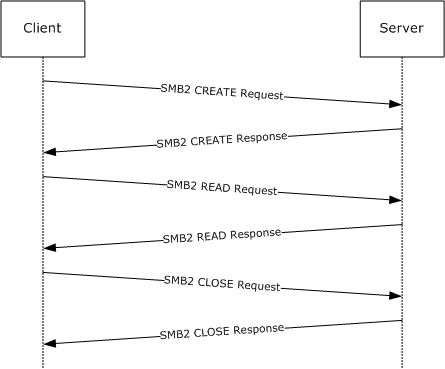{alt="Reading from a remote file" width="5.560416666666667in" height="4.595833333333333in"}

1.  The client sends an [SMB2 CREATE Request](#Section_e8fb45c1a03d44cab7ae47385cfd7997) for the file \"testfile.txt\".

<!-- -->

1089. Smb2: C CREATE testfile.txt

      SMB2Header:

      Size: 64 (0x40)

      CreditCharge: 0 (0x0)

      Status: STATUS_SUCCESS

      Command: CREATE

      Credits: 111 (0x6F)

      Flags: 0 (0x0)

      ServerToRedir: \...\...\...\...\...\...\...\...\...\....0 Client to Server

      AsyncCommand: \...\...\...\...\...\...\...\...\...\...0. Command is not asynchronous

      Related: \...\...\...\...\...\...\...\...\.....0.. Packet is single message

      Signed: \...\...\...\...\...\...\...\...\....0\... Packet is not signed

      Reserved: 0 (0x0)

      DFS: 0\...\...\...\...\...\...\...\...\...\.... Command is not a DFS Operation

      NextCommand: 0 (0x0)

      MessageId: 10 (0xA)

      Reserved: 0 (0x0)

      TreeId: 5 (0x5)

      SessionId: 4398046511121 (0x40000000011)

      CCreate:

      Size: 57 (0x39)

      SecurityFlags: 0 (0x0)

      RequestedOplockLevel: 9 (0x9)

      ImpersonationLevel: 2 (0x2)

      SmbCreateFlags: 0 (0x0)

      Reserved: 0 (0x0)

      DesiredAccess: 0x00120089

      read: (\...\...\...\...\...\...\...\...\...\....1) Read Data

      write: (\...\...\...\...\...\...\...\...\...\...0.) No Write Data

      append: (\...\...\...\...\...\...\...\...\.....0..) No Append Data

      readEA: (\...\...\...\...\...\...\...\...\....1\...) Read EA

      writeEA: (\...\...\...\...\...\...\...\...\...0\....) No Write EA

      FileExecute: (\...\...\...\...\...\...\...\.....0\.....) No File Execute

      FileDeleted: (\...\...\...\...\...\...\...\....0\...\...) No File Delete

      FileRead: (\...\...\...\...\...\...\...\...1\...\....) File Read Attributes

      FileWrite: (\...\...\...\...\...\...\.....0\...\.....) No File Write Attributes

      FileAttributes: 0x00000080

      ReadOnly: (\...\...\...\...\...\...\...\...\...\....0) Read/Write

      Hidden: (\...\...\...\...\...\...\...\...\...\...0.) Not Hidden

      System: (\...\...\...\...\...\...\...\...\.....0..) Not System

      Reserverd3: 0 (0x0)

      Directory: (\...\...\...\...\...\...\...\...\...0\....) File

      Archive: (\...\...\...\...\...\...\...\.....0\.....) Not Archive

      Device: (\...\...\...\...\...\...\...\....0\...\...) Not Device

      Normal: (\...\...\...\...\...\...\...\...1\...\....) Normal

      Temporary: (\...\...\...\...\...\...\.....0\...\.....) Permanent

      Sparse: (\...\...\...\...\...\...\....0\...\...\...) Not Sparse

      Reparse: (\...\...\...\...\...\...\...0\...\...\....) Not Reparse Point

      Compressed: (\...\...\...\...\...\.....0\...\...\.....) Uncompressed

      Offline: (\...\...\...\...\...\....0\...\...\...\...) Content indexed

      NotIndexed: (\...\...\...\...\...\...0\...\...\...\....) Permanent

      Encrypted: (\...\...\...\...\.....0\...\...\...\.....) Unencrypted

      ShareAccess: Shared for Read/Write

      CreateDisposition: Open

      CreateOptions: 0x00000060

      dir: (\...\...\...\...\...\...\...\...\...\....0) non-directory

      write: (\...\...\...\...\...\...\...\...\...\...0.) non-write through

      sq: (\...\...\...\...\...\...\...\...\.....0..) non-sequentially writing allowed

      buffer: (\...\...\...\...\...\...\...\...\....0\...) intermediate buffering allowed

      alert: (\...\...\...\...\...\...\...\...\...0\....) IO alerts bits not set

      nonalert: (\...\...\...\...\...\...\...\.....1\.....) Do synchronous IO non-alerts

      nondir: (\...\...\...\...\...\...\...\....1\...\...) Operation is on non-directory file

      connect: (\...\...\...\...\...\...\...\...0\...\....) tree connect bit not set

      oplock: (\...\...\...\...\...\...\.....0\...\.....) complete if oplocked bit not set

      EA: (\...\...\...\...\...\...\....0\...\...\...) no EA knowledge bit is not set

      filename: (\...\...\...\...\...\...\...0\...\...\....) 8.3 filenames bit is not set

      random: (\...\...\...\...\...\.....0\...\...\.....) random access bit is not set

      delete: (\...\...\...\...\...\....0\...\...\...\...) delete on close bit is not set

      open: (\...\...\...\...\...\...0\...\...\...\....) open by filename

      backup: (\...\...\...\...\.....0\...\...\...\.....) open for backup bit not set

      NameOffset: 120 (0x78)

      NameLength: 24 (0x18)

      CreateContextsOffset: 0 (0x0)

      CreateContextsLength: 0 (0x0)

      Name: testfile.txt

<!-- -->

2.  The server responds with an [SMB2 CREATE Response](#Section_d166aa9e0b53410eb35e3933d8131927) giving the **FileId** of the opened file.

<!-- -->

1164. Smb2: R CREATE FID=

      SMB2Header:

      Size: 64 (0x40)

      CreditCharge: 0 (0x0)

      Status: STATUS_SUCCESS

      Command: CREATE

      Credits: 1 (0x1)

      Flags: 1 (0x1)

      ServerToRedir: \...\...\...\...\...\...\...\...\...\....1 Server to Client

      AsyncCommand: \...\...\...\...\...\...\...\...\...\...0. Command is not asynchronous

      Related: \...\...\...\...\...\...\...\...\.....0.. Packet is single message

      Signed: \...\...\...\...\...\...\...\...\....0\... Packet is not signed

      Reserved: 0 (0x0)

      DFS: 0\...\...\...\...\...\...\...\...\...\.... Command is not a DFS Operation

      NextCommand: 0 (0x0)

      MessageId: 10 (0xA)

      Reserved: 0 (0x0)

      TreeId: 5 (0x5)

      SessionId: 4398046511121 (0x40000000011)

      RCreate:

      Size: 89 (0x59)

      OplockLevel: 9 (0x9)

      Reserved1: 9 (0x9)

      CreateAction: 1 (0x1)

      CreationTime: 127972992877715232 (0x1C6A6C24D51DF20)

      LastAccessTime: 127972992923579232 (0x1C6A6C2500DB360)

      LastWriteTime: 127972992923579232 (0x1C6A6C2500DB360)

      ChangeTime: 127972992923579232 (0x1C6A6C2500DB360)

      AllocationSize: 104 (0x68)

      EndOfFile: 98 (0x62)

      FileAttributes: 0x00000020

      ReadOnly: (\...\...\...\...\...\...\...\...\...\....0) Read/Write

      Hidden: (\...\...\...\...\...\...\...\...\...\...0.) Not Hidden

      System: (\...\...\...\...\...\...\...\...\.....0..) Not System

      Reserverd3: 0 (0x0)

      Directory: (\...\...\...\...\...\...\...\...\...0\....) File

      Archive: (\...\...\...\...\...\...\...\.....1\.....) Archive

      Device: (\...\...\...\...\...\...\...\....0\...\...) Not Device

      Normal: (\...\...\...\...\...\...\...\...0\...\....) Not Normal

      Temporary: (\...\...\...\...\...\...\.....0\...\.....) Permanent

      Sparse: (\...\...\...\...\...\...\....0\...\...\...) Not Sparse

      Reparse: (\...\...\...\...\...\...\...0\...\...\....) Not Reparse Point

      Compressed: (\...\...\...\...\...\.....0\...\...\.....) Uncompressed

      Offline: (\...\...\...\...\...\....0\...\...\...\...) Content indexed

      NotIndexed: (\...\...\...\...\...\...0\...\...\...\....) Permanent

      Encrypted: (\...\...\...\...\.....0\...\...\...\.....) Unencrypted

      Reserved2: 0 (0x0)

      Fid:

      Persistent: 17 (0x11)

      Volatile: -4294967287 (0xFFFFFFFF00000009)

      CreateContextsOffset: 0 (0x0)

      CreateContextsLength: 0 (0x0)

<!-- -->

3.  The client sends an [SMB2 READ Request](#Section_320f04f31b2845cdaaa19e5aed810dca) to read data from the file.

<!-- -->

1216. Smb2: C READ 0x62 bytes from offset 0 (0x0)

      SMB2Header:

      Size: 64 (0x40)

      CreditCharge: 0 (0x0)

      Status: STATUS_SUCCESS

      Command: READ

      Credits: 111 (0x6F)

      Flags: 0 (0x0)

      ServerToRedir: \...\...\...\...\...\...\...\...\...\....0 Client to Server

      AsyncCommand: \...\...\...\...\...\...\...\...\...\...0. Command is not asynchronous

      Related: \...\...\...\...\...\...\...\...\.....0.. Packet is single message

      Signed: \...\...\...\...\...\...\...\...\....0\... Packet is not signed

      Reserved: 0 (0x0)

      DFS: 0\...\...\...\...\...\...\...\...\...\.... Command is not a DFS Operation

      NextCommand: 0 (0x0)

      MessageId: 11 (0xB)

      Reserved: 0 (0x0)

      TreeId: 5 (0x5)

      SessionId: 4398046511121 (0x40000000011)

      CRead:

      Size: 49 (0x31)

      Padding: 80 (0x50)

      Reserved: 0 (0x0)

      DataLength: 98 (0x62)

      Offset: 0 (0x0)

      Fid:

      Persistent: 17 (0x11)

      Volatile: -4294967287 (0xFFFFFFFF00000009)

      MinimumCount: 0 (0x0)

      Channel: 0 (0x0)

      RemainingBytes: 0 (0x0)

      ReadChannelInfoOffset: 0 (0x0)

      ReadChannelInfoLength: 0 (0x0)

<!-- -->

4.  The server responds with an [SMB2 READ Response](#Section_3e3d2f2c0e2f41eaad07fbca6ffdfd90) with the data read from the file.

<!-- -->

1249. Smb2: R READ 0x62 bytes read

      SMB2Header:

      Size: 64 (0x40)

      CreditCharge: 0 (0x0)

      Status: STATUS_SUCCESS

      Command: READ

      Credits: 1 (0x1)

      Flags: 1 (0x1)

      ServerToRedir: \...\...\...\...\...\...\...\...\...\....1 Server to Client

      AsyncCommand: \...\...\...\...\...\...\...\...\...\...0. Command is not asynchronous

      Related: \...\...\...\...\...\...\...\...\.....0.. Packet is single message

      Signed: \...\...\...\...\...\...\...\...\....0\... Packet is not signed

      Reserved: 0 (0x0)

      DFS: 0\...\...\...\...\...\...\...\...\...\.... Command is not a DFS Operation

      NextCommand: 0 (0x0)

      MessageId: 11 (0xB)

      Reserved: 0 (0x0)

      TreeId: 5 (0x5)

      SessionId: 4398046511121 (0x40000000011)

      RRead:

      Size: 17 (0x11)

      DataOffset: 80 (0x50)

      Reserved: 0 (0x0)

      DataLength: 98 (0x62)

      DataRemaining: 0 (0x0)

      Reserved2: 0 (0x0)

      Data: (98 bytes)

<!-- -->

5.  The client sends an [SMB2 CLOSE Request](#Section_f84053b0bcb24f859717536dae2b02bd) to close the file.

<!-- -->

1276. Smb2: C CLOSE FID=

      SMB2Header:

      Size: 64 (0x40)

      CreditCharge: 0 (0x0)

      Status: STATUS_SUCCESS

      Command: CLOSE

      Credits: 111 (0x6F)

      Flags: 0 (0x0)

      ServerToRedir: \...\...\...\...\...\...\...\...\...\....0 Client to Server

      AsyncCommand: \...\...\...\...\...\...\...\...\...\...0. Command is not asynchronous

      Related: \...\...\...\...\...\...\...\...\.....0.. Packet is single message

      Signed: \...\...\...\...\...\...\...\...\....0\... Packet is not signed

      Reserved: 0 (0x0)

      DFS: 0\...\...\...\...\...\...\...\...\...\.... Command is not a DFS Operation

      NextCommand: 0 (0x0)

      MessageId: 12 (0xC)

      Reserved: 0 (0x0)

      TreeId: 5 (0x5)

      SessionId: 4398046511121 (0x40000000011)

      CClose:

      Size: 24 (0x18)

      Flags: 1 (0x1) \<- Post-query attributes

      Reserved: 0 (0x0)

      Fid:

      Persistent: 9 (0x9)

      Volatile: -4294967295 (0xFFFFFFFF00000001)

<!-- -->

6.  The server sends an [SMB2 CLOSE Response](#Section_c0c15c573f3e452bb51c9cc650a13f7b) indicating the close was successful.

<!-- -->

1302. Smb2: R CLOSE

      SMB2Header:

      Size: 64 (0x40)

      CreditCharge: 0 (0x0)

      Status: STATUS_SUCCESS

      Command: CLOSE

      Credits: 1 (0x1)

      Flags: 1 (0x1)

      ServerToRedir: \...\...\...\...\...\...\...\...\...\....1 Server to Client

      AsyncCommand: \...\...\...\...\...\...\...\...\...\...0. Command is not asynchronous

      Related: \...\...\...\...\...\...\...\...\.....0.. Packet is single message

      Signed: \...\...\...\...\...\...\...\...\....0\... Packet is not signed

      Reserved: 0 (0x0)

      DFS: 0\...\...\...\...\...\...\...\...\...\.... Command is not a DFS Operation

      NextCommand: 0 (0x0)

      MessageId: 12 (0xC)

      Reserved: 0 (0x0)

      TreeId: 5 (0x5)

      SessionId: 4398046511121 (0x40000000011)

      RClose:

      Size: 60 (0x3C)

      Flags: 1 (0x1)

      Reserved: 0 (0x0)

      CreationTime: 127972990708847232 (0x1C6A6C1CC0B9280)

      LastAccessTime: 127972993090343232 (0x1C6A6C259FE5140)

      LastWriteTime: 127972992877715232 (0x1C6A6C24D51DF20)

      ChangeTime: 127972992877715232 (0x1C6A6C24D51DF20)

      AllocationSize: 0 (0x0)

      EndOfFile: 0 (0x0)

      FileAttributes: 0x00000010

      ReadOnly: (\...\...\...\...\...\...\...\...\...\....0) Read/Write

      Hidden: (\...\...\...\...\...\...\...\...\...\...0.) Not Hidden

      System: (\...\...\...\...\...\...\...\...\.....0..) Not System

      Reserverd3: 0 (0x0)

      Directory: (\...\...\...\...\...\...\...\...\...1\....) Directory

      Archive: (\...\...\...\...\...\...\...\.....0\.....) Not Archive

      Device: (\...\...\...\...\...\...\...\....0\...\...) Not Device

      Normal: (\...\...\...\...\...\...\...\...0\...\....) Not Normal

      Temporary: (\...\...\...\...\...\...\.....0\...\.....) Permanent

      Sparse: (\...\...\...\...\...\...\....0\...\...\...) Not Sparse

      Reparse: (\...\...\...\...\...\...\...0\...\...\....) Not Reparse Point

      Compressed: (\...\...\...\...\...\.....0\...\...\.....) Uncompressed

      Offline: (\...\...\...\...\...\....0\...\...\...\...) Content indexed

      NotIndexed: (\...\...\...\...\...\...0\...\...\...\....) Permanent

      Encrypted: (\...\...\...\...\.....0\...\...\...\.....) Unencrypted

## Writing to a Remote File[[]{.indexref entry="Remote files:writing - example"}]{.indexref entry="Examples:remote files:writing"}

The following diagram demonstrates the steps taken to [**open**](#gt_0d572cce-4683-4b21-945a-7f8035bb6469) a remote file, write to it, and close it. Assume that this sequence starts on a [**connection**](#gt_866b0055-ceba-4acf-a692-98452943b981) where the [**session**](#gt_0cd96b80-a737-4f06-bca4-cf9efb449d12) and [**tree connect**](#gt_c65d1989-3473-4fa9-ac45-6522573823e3) have been established as described in previous sections, and messages have been exchanged such that the current **MessageId** is 30. Let us assume **TreeId** is set to 0x1 and **SessionId** is set to 0x40000000015 for all requests and responses listed below.

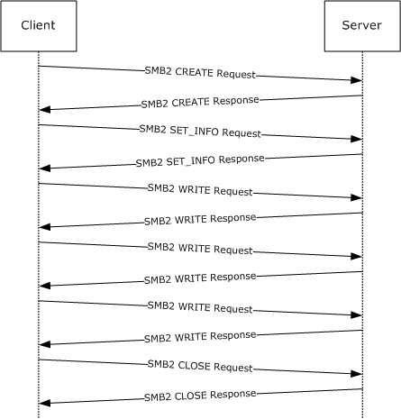{alt="Writing to a remote file" width="5.5625in" height="5.791666666666667in"}

1.  The client sends an [SMB2 CREATE Request](#Section_e8fb45c1a03d44cab7ae47385cfd7997) for the file \"test.dat\".

<!-- -->

1348. Smb2: C CREATE test.dat

      SMB2Header:

      Size: 64 (0x40)

      CreditCharge: 0 (0x0)

      Status: STATUS_SUCCESS

      Command: CREATE

      Credits: 111 (0x6F)

      Flags: 0 (0x0)

      ServerToRedir: \...\...\...\...\...\...\...\...\...\....0 Client to Server

      AsyncCommand: \...\...\...\...\...\...\...\...\...\...0. Command is not asynchronous

      Related: \...\...\...\...\...\...\...\...\.....0.. Packet is single message

      Signed: \...\...\...\...\...\...\...\...\....0\... Packet not signed

      Reserved: 0 (0x0)

      DFS: 0\...\...\...\...\...\...\...\...\...\.... Command is not a DFS Operation

      NextCommand: 0 (0x0)

      MessageId: 10 (0xA)

      Reserved: 0 (0x0)

      TreeId: 1 (0x1)

      SessionId: 4398046511125 (0x40000000015)

      CCreate:

      Size: 57 (0x39)

      SecurityFlags: 0 (0x0)

      RequestedOplockLevel: 9 (0x9)

      ImpersonationLevel: 2 (0x2)

      SmbCreateFlags: 0 (0x0)

      Reserved: 0 (0x0)

      DesiredAccess: 0x00130197

      read: (\...\...\...\...\...\...\...\...\...\....1) Read Data

      write: (\...\...\...\...\...\...\...\...\...\...1.) Write Data

      append: (\...\...\...\...\...\...\...\...\.....1..) Append Data

      readEA: (\...\...\...\...\...\...\...\...\....0\...) No Read EA

      writeEA: (\...\...\...\...\...\...\...\...\...1\....) Write EA

      FileExecute: (\...\...\...\...\...\...\...\.....0\.....) No File Execute

      FileDeleted: (\...\...\...\...\...\...\...\....0\...\...) No File Delete

      FileRead: (\...\...\...\...\...\...\...\...1\...\....) File Read Attributes

      FileWrite: (\...\...\...\...\...\...\.....1\...\.....) File Write Attributes

      FileAttributes: 0x00000020

      ReadOnly: (\...\...\...\...\...\...\...\...\...\....0) Read/Write

      Hidden: (\...\...\...\...\...\...\...\...\...\...0.) Not Hidden

      System: (\...\...\...\...\...\...\...\...\.....0..) Not System

      Reserverd3: 0 (0x0)

      Directory: (\...\...\...\...\...\...\...\...\...0\....) File

      Archive: (\...\...\...\...\...\...\...\.....1\.....) Archive

      Device: (\...\...\...\...\...\...\...\....0\...\...) Not Device

      Normal: (\...\...\...\...\...\...\...\...0\...\....) Not Normal

      Temporary: (\...\...\...\...\...\...\.....0\...\.....) Permanent

      Sparse: (\...\...\...\...\...\...\....0\...\...\...) Not Sparse

      Reparse: (\...\...\...\...\...\...\...0\...\...\....) Not Reparse Point

      Compressed: (\...\...\...\...\...\.....0\...\...\.....) Uncompressed

      Offline: (\...\...\...\...\...\....0\...\...\...\...) Content indexed

      NotIndexed: (\...\...\...\...\...\...0\...\...\...\....) Permanent

      Encrypted: (\...\...\...\...\.....0\...\...\...\.....) Unencrypted

      ShareAccess: No sharing

      CreateDisposition: Overwrite if

      CreateOptions: 0x0000004c

      dir: (\...\...\...\...\...\...\...\...\...\....0) Non-directory

      write: (\...\...\...\...\...\...\...\...\...\...0.) Non-write through

      sq: (\...\...\...\...\...\...\...\...\.....1..) Data is written

      to the file sequentially

      buffer: (\...\...\...\...\...\...\...\...\....1\...) Do not do intermediate

      buffering

      alert: (\...\...\...\...\...\...\...\...\...0\....) IO alerts bits not set

      nonalert: (\...\...\...\...\...\...\...\.....0\.....) IO non-alerts bit not set

      nondir: (\...\...\...\...\...\...\...\....1\...\...) Operation is on non-directory

      file

      connect: (\...\...\...\...\...\...\...\...0\...\....) Tree connect bit not set

      oplock: (\...\...\...\...\...\...\.....0\...\...

      ..) Complete if oplocked bit is not

      set

      EA: (\...\...\...\...\...\...\....0\...\...\...) No EA knowledge bit is not set

      filename: (\...\...\...\...\...\...\...0\...\...\....) 8.3 filenames bit is not set

      random: (\...\...\...\...\...\.....0\...\...\.....) Random access bit is not set

      delete: (\...\...\...\...\...\....0\...\...\...\...) Delete on close bit is not set

      open: (\...\...\...\...\...\...0\...\...\...\....) Open by filename

      backup: (\...\...\...\...\.....0\...\...\...\.....) Open for backup bit not set

      NameOffset: 120 (0x78)

      NameLength: 16 (0x10)

      CreateContextsOffset: 0 (0x0)

      CreateContextsLength: 0 (0x0)

      Name: test.dat

<!-- -->

2.  The server responds with an [SMB2 CREATE Response](#Section_d166aa9e0b53410eb35e3933d8131927) with the **FileId** of the opened file.

<!-- -->

1429. Smb2: R CREATE FID=

      SMBIdentifier: SMB

      SMB2Header:

      Size: 64 (0x40)

      CreditCharge: 0 (0x0)

      Status: STATUS_SUCCESS

      Command: CREATE

      Credits: 1 (0x1)

      Flags: 1 (0x1)

      ServerToRedir: \...\...\...\...\...\...\...\...\...\....1 Server to Client

      AsyncCommand: \...\...\...\...\...\...\...\...\...\...0. Command not asynchronous

      Related: \...\...\...\...\...\...\...\...\.....0.. Packet is single message

      Signed: \...\...\...\...\...\...\...\...\....0\... Packet not signed

      Reserved: 0 (0x0)

      DFS: 0\...\...\...\...\...\...\...\...\...\.... Command not DFS Operation

      NextCommand: 0 (0x0)

      MessageId: 10 (0xA)

      Reserved: 0 (0x0)

      TreeId: 1 (0x1)

      SessionId: 4398046511125 (0x40000000015)

      RCreate:

      Size: 89 (0x59)

      OplockLevel: 9 (0x9)

      Reserved1: 9 (0x9)

      CreateAction: 2 (0x2)

      CreationTime: 127972994486543232 (0x1C6A6C2AD36A380)

      LastAccessTime: 127972994486543232 (0x1C6A6C2AD36A380)

      LastWriteTime: 127972994486543232 (0x1C6A6C2AD36A380)

      ChangeTime: 127972994486543232 (0x1C6A6C2AD36A380)

      AllocationSize: 765952 (0xBB000)

      EndOfFile: 0 (0x0)

      FileAttributes: 0x00000020

      ReadOnly: (\...\...\...\...\...\...\...\...\...\....0) Read/Write

      Hidden: (\...\...\...\...\...\...\...\...\...\...0.) Not Hidden

      System: (\...\...\...\...\...\...\...\...\.....0..) Not System

      Reserverd3: 0 (0x0)

      Directory: (\...\...\...\...\...\...\...\...\...0\....) File

      Archive: (\...\...\...\...\...\...\...\.....1\.....) Archive

      Device: (\...\...\...\...\...\...\...\....0\...\...) Not Device

      Normal: (\...\...\...\...\...\...\...\...0\...\....) Not Normal

      Temporary: (\...\...\...\...\...\...\.....0\...\.....) Permanent

      Sparse: (\...\...\...\...\...\...\....0\...\...\...) Not Sparse

      Reparse: (\...\...\...\...\...\...\...0\...\...\....) Not Reparse Point

      Compressed: (\...\...\...\...\...\.....0\...\...\.....) Uncompressed

      Offline: (\...\...\...\...\...\....0\...\...\...\...) Content indexed

      NotIndexed: (\...\...\...\...\...\...0\...\...\...\....) Permanent

      Encrypted: (\...\...\...\...\.....0\...\...\...\.....) Unencrypted

      Reserved2: 0 (0x0)

      Fid:

      Persistent: 25 (0x19)

      Volatile: -4294967291

      (0xFFFFFFFF00000005)

      CreateContextsOffset: 0 (0x0)

      CreateContextsLength: 0 (0x0)

<!-- -->

3.  The client sends an [SMB2 SET_INFO Request](#Section_ee9614c4be544a3c98f1769a7032a0e4) to set **FileEndOfFileInformation** (specified in [\[MS-FSCC\]](%5bMS-FSCC%5d.pdf#Section_efbfe12773ad41409967ec6500e66d5e) section 2.4.14) to 0x2f000.

<!-- -->

1484. Smb2: C SET INFORMATION

      SMB2Header:

      Size: 64 (0x40)

      CreditCharge: 0 (0x0)

      Status: STATUS_SUCCESS

      Command: SET INFORMATION

      Credits: 111 (0x6F)

      Flags: 0 (0x0)

      ServerToRedir: \...\...\...\...\...\...\...\...\...\....0 Client to Server

      AsyncCommand: \...\...\...\...\...\...\...\...\...\...0. Command not asynchronous

      Related: \...\...\...\...\...\...\...\...\.....0.. Packet is single message

      Signed: \...\...\...\...\...\...\...\...\....0\... Packet not signed

      Reserved: 0 (0x0)

      DFS: 0\...\...\...\...\...\...\...\...\...\.... Command not DFS Operation

      NextCommand: 0 (0x0)

      MessageId: 11 (0xB)

      Reserved: 0 (0x0)

      TreeId: 1 (0x1)

      SessionId: 4398046511125 (0x40000000015)

      CSetInfo:

      Size: 33 (0x21)

      InfoType: 1 (0x1)

      FileInformationClass:

      FileEndOfFileInformation

      BufferLength: 8 (0x8)

      BufferOffset: 96 (0x60)

      Reserved: 0 (0x0)

      AdditionalInformation: 0 (0x0)

      Fid:

      Persistent: 25 (0x19)

      Volatile: -4294967291

      (0xFFFFFFFF00000005)

      Buffer: (8 bytes) 0x000000000002f000

<!-- -->

4.  The server sends an [SMB2 SET_INFO Response](#Section_c4318eb4bdab49b79352abd7005c7f19) with success.

<!-- -->

1518. Smb2: R SET INFORMATION

      SMB2Header:

      Size: 64 (0x40)

      CreditCharge: 0 (0x0)

      Status: STATUS_SUCCESS

      Command: SET INFORMATION

      Credits: 1 (0x1)

      Flags: 1 (0x1)

      ServerToRedir: \...\...\...\...\...\...\...\...\...\....1 Server to Client

      AsyncCommand: \...\...\...\...\...\...\...\...\...\...0. Command not asynchronous

      Related: \...\...\...\...\...\...\...\...\.....0.. Packet is single message

      Signed: \...\...\...\...\...\...\...\...\....0\... Packet not signed

      Reserved: 0 (0x0)

      DFS: 0\...\...\...\...\...\...\...\...\...\.... Command not DFS Operation

      NextCommand: 0 (0x0)

      MessageId: 11 (0xB)

      Reserved: 0 (0x0)

      TreeId: 1 (0x1)

      SessionId: 4398046511125 (0x40000000015)

      RSetInfo:

      Size: 2 (0x2)

<!-- -->

5.  The client sends an [SMB2 WRITE Request](#Section_e704696133184350be2aa8d69bb59ce8) to write the first 0x10000 bytes.

<!-- -->

1540. Smb2: C WRITE 0x10000 bytes at

      offset 0 (0x0)

      SMB2Header:

      Size: 64 (0x40)

      CreditCharge: 0 (0x0)

      Status: STATUS_SUCCESS

      Command: WRITE

      Credits: 111 (0x6F)

      Flags: 0 (0x0)

      ServerToRedir: \...\...\...\...\...\...\...\...\...\....0 Client to Server

      AsyncCommand: \...\...\...\...\...\...\...\...\...\...0. Command not asynchronous

      Related: \...\...\...\...\...\...\...\...\.....0.. Packet is single message

      Signed: \...\...\...\...\...\...\...\...\....0\... Packet not signed

      Reserved: 0 (0x0)

      DFS: 0\...\...\...\...\...\...\...\...\...\.... Command not DFS Operation

      NextCommand: 0 (0x0)

      MessageId: 12 (0xC)

      Reserved: 0 (0x0)

      TreeId: 1 (0x1)

      SessionId: 4398046511125 (0x40000000015)

      CWrite:

      Size: 49 (0x31)

      DataOffset: 112 (0x70)

      DataLength: 65536 (0x10000)

      Offset: 0 (0x0)

      Fid:

      Persistent: 25 (0x19)

      Volatile: -4294967291

      (0xFFFFFFFF00000005)

      Channel: 0 (0x0)

      RemainingBytes: 0 (0x0)

      WriteChannelInfoOffset: 0 (0x0)

      WriteChannelInfoLength: 0 (0x0)

      Flags: 0 (0x0)

<!-- -->

6.  The server responds with an [SMB2 WRITE Response](#Section_7b80a339f4d345758ce270a06f24f133) indicating 0x10000 bytes were written.

<!-- -->

1575. Smb2: R WRITE 0x10000 bytes

      written

      SMB2Header:

      Size: 64 (0x40)

      CreditCharge: 0 (0x0)

      Status: STATUS_SUCCESS

      Command: WRITE

      Credits: 1 (0x1)

      Flags: 1 (0x1)

      ServerToRedir: \...\...\...\...\...\...\...\...\...\....1 Server to Client

      AsyncCommand: \...\...\...\...\...\...\...\...\...\...0. Command not asynchronous

      Related: \...\...\...\...\...\...\...\...\.....0.. Packet is single message

      Signed: \...\...\...\...\...\...\...\...\....0\... Packet not signed

      Reserved: 0 (0x0)

      DFS: 0\...\...\...\...\...\...\...\...\...\.... Command not DFS Operation

      NextCommand: 0 (0x0)

      MessageId: 12 (0xC)

      Reserved: 0 (0x0)

      TreeId: 1 (0x1)

      SessionId: 4398046511125 (0x40000000015)

      RWrite:

      Size: 17 (0x11)

      Reserved: 0 (0x0)

      DataLength: 65536 (0x10000)

      Remaining: 0 (0x0)

      WriteChannelInfoOffset: 0 (0x0)

      WriteChannelInfoLength: 0 (0x0)

<!-- -->

7.  The client sends an SMB2 WRITE Request to write the next 0x10000 bytes.

<!-- -->

1603. Smb2: C WRITE 0x10000 bytes at

      offset 65536 (0x10000)

      SMB2Header:

      Size: 64 (0x40)

      CreditCharge: 0 (0x0)

      Status: STATUS_SUCCESS

      Command: WRITE

      Credits: 111 (0x6F)

      Flags: 0 (0x0)

      ServerToRedir: \...\...\...\...\...\...\...\...\...\....0 Client to Server

      AsyncCommand: \...\...\...\...\...\...\...\...\...\...0. Command not asynchronous

      Related: \...\...\...\...\...\...\...\...\.....0.. Packet is single message

      Signed: \...\...\...\...\...\...\...\...\....0\... Packet not signed

      Reserved: 0 (0x0)

      DFS: 0\...\...\...\...\...\...\...\...\...\.... Command not DFS Operation

      NextCommand: 0 (0x0)

      MessageId: 13 (0xD)

      Reserved: 0 (0x0)

      TreeId: 1 (0x1)

      SessionId: 4398046511125 (0x40000000015)

      CWrite:

      Size: 49 (0x31)

      DataOffset: 112 (0x70)

      DataLength: 65536 (0x10000)

      Offset: 65536 (0x10000)

      Fid:

      Persistent: 25 (0x19)

      Volatile: -4294967291

      (0xFFFFFFFF00000005)

      Channel: 0 (0x0)

      RemainingBytes: 0 (0x0)

      WriteChannelInfoOffset: 0 (0x0)

      WriteChannelInfoLength: 0 (0x0)

      Flags: 0 (0x0)

<!-- -->

8.  The server responds with an SMB2 WRITE Response indicating 0x10000 bytes were written.

<!-- -->

1638. Smb2: R WRITE 0x10000 bytes

      written

      SMB2Header:

      Size: 64 (0x40)

      CreditCharge: 0 (0x0)

      Status: STATUS_SUCCESS

      Command: WRITE

      Credits: 1 (0x1)

      Flags: 1 (0x1)

      ServerToRedir: \...\...\...\...\...\...\...\...\...\....1 Server to Client

      AsyncCommand: \...\...\...\...\...\...\...\...\...\...0. Command not asynchronous

      Related: \...\...\...\...\...\...\...\...\.....0.. Packet is single message

      Signed: \...\...\...\...\...\...\...\...\....0\... Packet not signed

      Reserved: 0 (0x0)

      DFS: 0\...\...\...\...\...\...\...\...\...\.... Command not DFS Operation

      NextCommand: 0 (0x0)

      MessageId: 13 (0xD)

      Reserved: 0 (0x0)

      TreeId: 1 (0x1)

      SessionId: 4398046511125 (0x40000000015)

      RWrite:

      Size: 17 (0x11)

      Reserved: 0 (0x0)

      DataLength: 65536 (0x10000)

      Remaining: 0 (0x0)

      WriteChannelInfoOffset: 0 (0x0)

      WriteChannelInfoLength: 0 (0x0)

<!-- -->

9.  The client sends an SMB2 WRITE Request to write the final 0xf000 bytes.

<!-- -->

1666. Smb2: C WRITE 0xF000 bytes at

      offset 131072 (0x20000)

      SMB2Header:

      Size: 64 (0x40)

      CreditCharge: 0 (0x0)

      Status: STATUS_SUCCESS

      Command: WRITE

      Credits: 111 (0x6F)

      Flags: 0 (0x0)

      ServerToRedir: \...\...\...\...\...\...\...\...\...\....0 Client to Server

      AsyncCommand: \...\...\...\...\...\...\...\...\...\...0. Command not asynchronous

      Related: \...\...\...\...\...\...\...\...\.....0.. Packet is single message

      Signed: \...\...\...\...\...\...\...\...\....0\... Packet is not signed

      Reserved: 0 (0x0)

      DFS: 0\...\...\...\...\...\...\...\...\...\.... Command not DFS Operation

      NextCommand: 0 (0x0)

      MessageId: 14 (0xE)

      Reserved: 0 (0x0)

      TreeId: 1 (0x1)

      SessionId: 4398046511125 (0x40000000015)

      CWrite:

      Size: 49 (0x31)

      DataOffset: 112 (0x70)

      DataLength: 61440 (0xF000)

      Offset: 131072 (0x20000)

      Fid:

      Persistent: 25 (0x19)

      Volatile: -4294967291

      (0xFFFFFFFF00000005)

      Channel: 0 (0x0)

      RemainingBytes: 0 (0x0)

      WriteChannelInfoOffset: 0 (0x0)

      WriteChannelInfoLength: 0 (0x0)

      Flags: 0 (0x0)

<!-- -->

10. The server responds with an SMB2 WRITE Response indicating 0xf000 bytes were written.

<!-- -->

1701. Smb2: R WRITE 0xF000 bytes

      written

      SMB2Header:

      Size: 64 (0x40)

      CreditCharge: 0 (0x0)

      Status: STATUS_SUCCESS

      Command: WRITE

      Credits: 1 (0x1)

      Flags: 1 (0x1)

      ServerToRedir: \...\...\...\...\...\...\...\...\...\....1 Server to Client

      AsyncCommand: \...\...\...\...\...\...\...\...\...\...0. Command not asynchronous

      Related: \...\...\...\...\...\...\...\...\.....0.. Packet is single message

      Signed: \...\...\...\...\...\...\...\...\....0\... Packet not signed

      Reserved: 0 (0x0)

      DFS: 0\...\...\...\...\...\...\...\...\...\.... Command not DFS Operation

      NextCommand: 0 (0x0)

      MessageId: 14 (0xE)

      Reserved: 0 (0x0)

      TreeId: 1 (0x1)

      SessionId: 4398046511125 (0x40000000015)

      RWrite:

      Size: 17 (0x11)

      Reserved: 0 (0x0)

      DataLength: 61440 (0xF000)

      Remaining: 0 (0x0)

      WriteChannelInfoOffset: 0 (0x0)

      WriteChannelInfoLength: 0 (0x0)

<!-- -->

11. The client sends an [SMB2 CLOSE Request](#Section_f84053b0bcb24f859717536dae2b02bd) to close the opened file.

<!-- -->

1729. Smb2: C CLOSE FID=

      SMB2Header:

      Size: 64 (0x40)

      CreditCharge: 0 (0x0)

      Status: STATUS_SUCCESS

      Command: CLOSE

      Credits: 111 (0x6F)

      Flags: 0 (0x0)

      ServerToRedir: \...\...\...\...\...\...\...\...\...\....0 Client to Server

      AsyncCommand: \...\...\...\...\...\...\...\...\...\...0. Command not asynchronous

      Related: \...\...\...\...\...\...\...\...\.....0.. Packet is single message

      Signed: \...\...\...\...\...\...\...\...\....0\... Packet not signed

      Reserved: 0 (0x0)

      DFS: 0\...\...\...\...\...\...\...\...\...\.... Command not DFS Operation

      NextCommand: 0 (0x0)

      MessageId: 15 (0xF)

      Reserved: 0 (0x0)

      TreeId: 1 (0x1)

      SessionId: 4398046511125 (0x40000000015)

      CClose:

      Size: 24 (0x18)

      Flags: 1 (0x1)

      Reserved: 0 (0x0)

      Fid:

      Persistent: 25 (0x19)

      Volatile: -4294967291

      (0xFFFFFFFF00000005)

<!-- -->

12. The server sends an [SMB2 CLOSE Response](#Section_c0c15c573f3e452bb51c9cc650a13f7b) indicating the close was successful.

<!-- -->

1757. Smb2: R CLOSE

      SMBIdentifier: SMB

      SMB2Header:

      Size: 64 (0x40)

      CreditCharge: 0 (0x0)

      Status: STATUS_SUCCESS

      Command: CLOSE

      Credits: 1 (0x1)

      Flags: 1 (0x1)

      ServerToRedir: \...\...\...\...\...\...\...\...\...\....1 Server to Client

      AsyncCommand: \...\...\...\...\...\...\...\...\...\...0. Command not asynchronous

      Related: \...\...\...\...\...\...\...\...\.....0.. Packet is single message

      Signed: \...\...\...\...\...\...\...\...\....0\... Packet not signed

      Reserved: 0 (0x0)

      DFS: 0\...\...\...\...\...\...\...\...\...\.... Command not DFS Operation

      NextCommand: 0 (0x0)

      MessageId: 15 (0xF)

      Reserved: 0 (0x0)

      TreeId: 1 (0x1)

      SessionId: 4398046511125 (0x40000000015)

      RClose:

      Size: 60 (0x3C)

      Flags: 1 (0x1)

      Reserved: 0 (0x0)

      CreationTime: 127972994486543232

      (0x1C6A6C2AD36A380)

      LastAccessTime: 127972994494343232

      (0x1C6A6C2ADADA840)

      LastWriteTime: 127965940833141721

      (0x1C6A0585EB543D9)

      ChangeTime: 127972993511484705

      (0x1C6A6C273186D21)

      AllocationSize: 196608 (0x30000)

      EndOfFile: 192512 (0x2F000)

      FileAttributes: 0x00000020

      ReadOnly: (\...\...\...\...\...\...\...\...\...\....0) Read/Write

      Hidden: (\...\...\...\...\...\...\...\...\...\...0.) Not Hidden

      System: (\...\...\...\...\...\...\...\...\.....0..) Not System

      Reserverd3: 0 (0x0)

      Directory: (\...\...\...\...\...\...\...\...\...0\....) File

      Archive: (\...\...\...\...\...\...\...\.....1\.....) Archive

      Device: (\...\...\...\...\...\...\...\....0\...\...) Not Device

      Normal: (\...\...\...\...\...\...\...\...0\...\....) Not Normal

      Temporary: (\...\...\...\...\...\...\.....0\...\.....) Permanent

      Sparse: (\...\...\...\...\...\...\....0\...\...\...) Not Sparse

      Reparse: (\...\...\...\...\...\...\...0\...\...\....) Not Reparse Point

      Compressed: (\...\...\...\...\...\.....0\...\...\.....) Uncompressed

      Offline: (\...\...\...\...\...\....0\...\...\...\...) Content indexed

      NotIndexed: (\...\...\...\...\...\...0\...\...\...\....) Permanent

      Encrypted: (\...\...\...\...\.....0\...\...\...\.....) Unencrypted

## Disconnecting a Share and Logging Off[[[[]{.indexref entry="Disconnecting example"}]{.indexref entry="Logging off example"}]{.indexref entry="Examples:disconnecting"}]{.indexref entry="Examples:logging off"}

The following diagram demonstrates the steps taken to close a [**tree connect**](#gt_c65d1989-3473-4fa9-ac45-6522573823e3) and log off a [**session**](#gt_0cd96b80-a737-4f06-bca4-cf9efb449d12). Assume that this sequence starts on a [**connection**](#gt_866b0055-ceba-4acf-a692-98452943b981) where the session and tree connect have been established as described in previous sections with **SessionId** of 0x40000000015 and **TreeId** of 0x1.

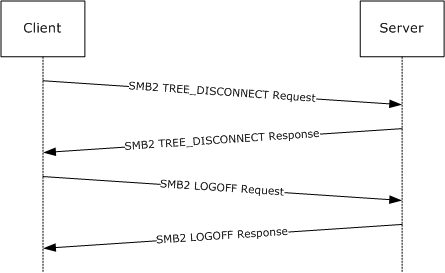{alt="Disconnecting a share and logging off a session" width="5.560416666666667in" height="3.404166666666667in"}

1.  The client sends an [SMB2 TREE_DISCONNECT Request](#Section_8a622ecbffee41b9b4c483ff2d3aba1b) for the tree connect.

<!-- -->

1808. Smb2: C TREE DISCONNECT TID=0x1

      SMB2Header:

      Size: 64 (0x40)

      CreditCharge: 0 (0x0)

      Status: STATUS_SUCCESS

      Command: TREE DISCONNECT

      Credits: 111 (0x6F)

      Flags: 0 (0x0)

      ServerToRedir: \...\...\...\...\...\...\...\...\...\....0 Client to Server

      AsyncCommand: \...\...\...\...\...\...\...\...\...\...0. Command is not asynchronous

      Related: \...\...\...\...\...\...\...\...\.....0.. Packet is single message

      Signed: \...\...\...\...\...\...\...\...\....0\... Packet is not signed

      Reserved: 0 (0x0)

      DFS: 0\...\...\...\...\...\...\...\...\...\.... Command is not a DFS Operation

      NextCommand: 0 (0x0)

      MessageId: 32 (0x20)

      Reserved: 0 (0x0)

      TreeId: 1 (0x1)

      SessionId: 4398046511125 (0x40000000015)

      CTreeDisconnect:

      Size: 4 (0x4)

      Reserved: 0 (0x0)

<!-- -->

2.  The server responds with an [SMB2 TREE_DISCONNECT Response](#Section_aeac92de8db348f8a8b7bfee28b9fd9e) indicating success.

<!-- -->

1830. Smb2: R TREE DISCONNECT

      SMB2Header:

      Size: 64 (0x40)

      CreditCharge: 0 (0x0)

      Status: STATUS_SUCCESS

      Command: TREE DISCONNECT

      Credits: 1 (0x1)

      Flags: 1 (0x1)

      ServerToRedir: \...\...\...\...\...\...\...\...\...\....1 Server to Client

      AsyncCommand: \...\...\...\...\...\...\...\...\...\...0. Command is not asynchronous

      Related: \...\...\...\...\...\...\...\...\.....0.. Packet is single message

      Signed: \...\...\...\...\...\...\...\...\....0\... Packet is not signed

      Reserved: 0 (0x0)

      DFS: 0\...\...\...\...\...\...\...\...\...\.... Command is not a DFS Operation

      NextCommand: 0 (0x0)

      MessageId: 32 (0x20)

      Reserved: 0 (0x0)

      TreeId: 1 (0x1)

      SessionId: 4398046511125 (0x40000000015)

      RTreeDisconnect:

      Size: 4 (0x4)

      Reserved: 0 (0x0)

<!-- -->

3.  The client sends an [SMB2 LOGOFF Request](#Section_abdc4ea952df480e9a3634f104797d2c) for the session.

<!-- -->

1852. Smb2: C LOGOFF

      SMB2Header:

      Size: 64 (0x40)

      CreditCharge: 0 (0x0)

      Status: STATUS_SUCCESS

      Command: LOGOFF

      Credits: 111 (0x6F)

      Flags: 0 (0x0)

      ServerToRedir: \...\...\...\...\...\...\...\...\...\....0 Client to Server

      AsyncCommand: \...\...\...\...\...\...\...\...\...\...0. Command is not asynchronous

      Related: \...\...\...\...\...\...\...\...\.....0.. Packet is single message

      Signed: \...\...\...\...\...\...\...\...\....0\... Packet is not signed

      Reserved: 0 (0x0)

      DFS: 0\...\...\...\...\...\...\...\...\...\.... Command is not a DFS Operation

      NextCommand: 0 (0x0)

      MessageId: 33 (0x21)

      Reserved: 0 (0x0)

      TreeId: 0 (0x0)

      SessionId: 4398046511125 (0x40000000015)

      CLogoff:

      Size: 4 (0x4)

      Reserved: 0 (0x0)

<!-- -->

4.  The server responds with an [SMB2 LOGOFF Response](#Section_7539feb46fbb499681ac06863bb1a89e) indicating success.

<!-- -->

1874. Smb2: R LOGOFF

      SMB2Header:

      Size: 64 (0x40)

      CreditCharge: 0 (0x0)

      Status: STATUS_SUCCESS

      Command: LOGOFF

      Credits: 1 (0x1)

      Flags: 1 (0x1)

      ServerToRedir: \...\...\...\...\...\...\...\...\...\....1 Server to Client

      AsyncCommand: \...\...\...\...\...\...\...\...\...\...0. Command is not asynchronous

      Related: \...\...\...\...\...\...\...\...\.....0.. Packet is single message

      Signed: \...\...\...\...\...\...\...\...\....0\... Packet is not signed

      Reserved: 0 (0x0)

      DFS: 0\...\...\...\...\...\...\...\...\...\.... Command is not a DFS Operation

      NextCommand: 0 (0x0)

      MessageId: 33 (0x21)

      Reserved: 0 (0x0)

      TreeId: 0 (0x0)

      SessionId: 4398046511125 (0x40000000015)

      RLogoff:

      Size: 4 (0x4)

      Reserved: 0 (0x0)

## Establish Alternate Channel[[]{.indexref entry="Examples:establishing alternate channel"}]{.indexref entry="Establishing alternate channel example"}

The following diagram demonstrates the steps taken to establish an alternate [**channel**](#gt_9964c8b0-1d25-4e8e-9dd1-4a51577698f5).

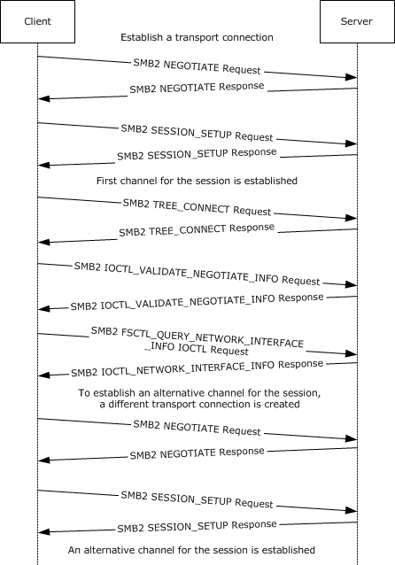{alt="Establishing an alternate channel" width="4.829861111111111in" height="6.950694444444444in"}

1.  The client sends an [SMB2 NEGOTIATE Request](#Section_e14db7ff763a42638b100c3944f52fc5) with dialect 0x300 in the **Dialects** array, and SMB2_GLOBAL_CAP_MULTI_CHANNEL(0x00000008) bit set in **Capabilities**.

<!-- -->

1897. SMB2: C NEGOTIATE (0x0), ClientGUID={F62E4D0B-C685-E48B-40B6-D815CB56FF6E}

      CNegotiate:

      StructureSize: 36 (0x24)

      DialectCount: 3 (0x3)

      SecurityMode: 1 (0x1)

      SMB2NEGOTIATESIGNINGENABLED: (\...\...\...\...\...1) security signatures are enabled on the client.

      SMB2NEGOTIATESIGNINGREQUIRED: (\...\...\...\.....0.) security signatures are not required by the client.

      Reserved: (00000000000000..) Reserved

      Reserved: 0 (0x0)

      Capabilities: 0x7F

      ClientGuid: {F62E4D0B-C685-E48B-40B6-D815CB56FF6E}

      ClientStartTime: No Time Specified (0)

      Dialects:

      Dialects: 514 (0x202)

      Dialects: 528 (0x210)

      Dialects: 768 (0x300)

<!-- -->

2.  The server receives the SMB2 NEGOTIATE Request and finds dialect 0x0300. The server responds with an [SMB2 NEGOTIATE Response](#Section_63abf97c0d0947e288d66bfa552949a5) with dialect 0x300 in the **DialectRevision**, and the SMB2_GLOBAL_CAP_MULTI_CHANNEL(0x00000008) bit set in **Capabilities**.

<!-- -->

1914. SMB2: R NEGOTIATE (0x0), ServerGUID={1B005379-8063-F0B6-4907-4957998700A1}

      SMBIdByte: 254 (0xFE)

      SMBIdentifier: SMB

      SMB2Header: R NEGOTIATE (0x0),TID=0x0000, MID=0x0000, PID=0xFEFF, SID=0x0000

      StructureSize: 64 (0x40)

      CreditCharge: 0 (0x0)

      Status: 0x0, Code = (0) STATUS_SUCCESS, Facility = FACILITY_SYSTEM, Severity = STATUS_SEVERITY_SUCCESS

      Flags: 0x1

      NextCommand: 0 (0x0)

      MessageId: 0 (0x0)

      Reserved: 65279 (0xFEFF)

      TreeId: 0 (0x0)

      SessionId: 0 (0x0)

      Signature: Binary Large Object (16 Bytes)

      RNegotiate:

      StructureSize: 65 (0x41)

      SecurityMode: 1 (0x1)

      SMB2NEGOTIATESIGNINGENABLED: (\...\...\...\...\...1) security signatures are enabled on the client.

      SMB2NEGOTIATESIGNINGREQUIRED: (\...\...\...\.....0.) security signatures are not required by the client.

      Reserved: (00000000000000..) Reserved

      DialectRevision: (0x300) - SMB 3.0 dialect revision number.

      Reserved: 0 (0x0)

      ServerGuid: {1B005379-8063-F0B6-4907-4957998700A1}

      Capabilities: 0x7F

      MaxTransactSize: 1048576 (0x100000)

      MaxReadSize: 1048576 (0x100000)

      MaxWriteSize: 1048576 (0x100000)

      SystemTime: 05/11/2012, 06:41:20.036527 UTC

      ServerStartTime: 05/10/2012, 09:56:03.345351 UTC

      SecurityBufferOffset: 128 (0x80)

      SecurityBufferLength: 120 (0x78)

      Reserved2: 0 (0x0)

<!-- -->

3.  The client queries GSS for the authentication token and sends an [SMB2 SESSION_SETUP Request](#Section_5a3c2c28d6b048edb917a86b2ca4575f) with the output token received from GSS.

<!-- -->

1947. SMB2: C SESSION SETUP (0x1)

      CSessionSetup:

      StructureSize: 25 (0x19)

      Flags: 0 (0x0)

      SecurityMode: 1 (0x1)

      Capabilities: 0x1

      Channel: 0 (0x0)

      SecurityBufferOffset: 88 (0x58)

      SecurityBufferLength: 74 (0x4A)

      PreviousSessionId: 0 (0x0)

      securityBlob:  

<!-- -->

4.  The server processes the token received with GSS and gets a return code. The GSS return code indicates that an additional exchange is required to complete the authentication. The server responds to the client with an [SMB2 SESSION_SETUP Response](#Section_0324190fa31b46669fa95c624273a694) with **Status** equal to STATUS_MORE_PROCESSING_REQUIRED and the response containing the output token from GSS.

<!-- -->

1959. SMB2: R - NT Status: System - Error, Code = (22) STATUS_MORE_PROCESSING_REQUIRED SESSION SETUP (0x1), SessionFlags=0x0

      SMBIdByte: 254 (0xFE)

      SMBIdentifier: SMB

      SMB2Header: R SESSION SETUP (0x1),TID=0x0000, MID=0x0001, PID=0xFEFF, SID=0x4000001

      StructureSize: 64 (0x40)

      CreditCharge: 0 (0x0)

      Status: 0xC0000016, Code = (22) STATUS_MORE_PROCESSING_REQUIRED, Facility = FACILITY_SYSTEM, Severity = STATUS_SEVERITY_ERROR

      Command: SESSION SETUP (0x1)

      Credits: 1 (0x1)

      Flags: 0x1

      NextCommand: 0 (0x0)

      MessageId: 1 (0x1)

      Reserved: 65279 (0xFEFF)

      TreeId: 0 (0x0)

      SessionId: 1130302315429889 (0x4040104000001)

      Signature: Binary Large Object (16 Bytes)

      RSessionSetup:

      StructureSize: 9 (0x9)

      SessionFlags: 0x0

      SecurityBufferOffset: 72 (0x48)

      SecurityBufferLength: 349 (0x15D)

<!-- -->

5.  The client processes the received token with GSS and sends an SMB2 SESSION_SETUP Request with the output token received from GSS and the **SessionId** received on the previous response.

<!-- -->

1981. SMB2: C SESSION SETUP (0x1)

      SMBIdByte: 254 (0xFE)

      SMBIdentifier: SMB

      SMB2Header: C SESSION SETUP (0x1),TID=0x0000, MID=0x0002, PID=0xFEFF, SID=0x4000001

      StructureSize: 64 (0x40)

      CreditCharge: 0 (0x0)

      ChannelSequence: (0x0) - (SMB 3.00 and later only)

      Reserved2: 0 (0x0)

      Command: SESSION SETUP (0x1)

      Credits: 10 (0xA)

      Flags: 0x0

      NextCommand: 0 (0x0)

      MessageId: 2 (0x2)

      Reserved: 65279 (0xFEFF)

      TreeId: 0 (0x0)

      SessionId: 1130302315429889 (0x4040104000001)

      Signature: Binary Large Object (16 Bytes)

      SMB2: C SESSION SETUP (0x1)

      CSessionSetup:

      StructureSize: 25 (0x19)

      Flags: 0 (0x0)

      SecurityMode: 1 (0x1)

      Capabilities: 0x1

      Channel: 0 (0x0)

      SecurityBufferOffset: 88 (0x58)

      SecurityBufferLength: 625 (0x271)

      PreviousSessionId: 0 (0x0)

<!-- -->

6.  The server processes the token received with GSS and gets a successful return code. The server responds to the client with an SMB2 SESSION_SETUP Response with **Status** equal to STATUS_SUCCESS and the response containing the output token from GSS.

<!-- -->

2009. SMB2: R SESSION SETUP (0x1), SessionFlags=0x0

      SMBIdByte: 254 (0xFE)

      SMBIdentifier: SMB

      SMB2Header: R SESSION SETUP (0x1),TID=0x0000, MID=0x0002, PID=0xFEFF, SID=0x4000001

      StructureSize: 64 (0x40)

      CreditCharge: 0 (0x0)

      Status: 0x0, Code = (0) STATUS_SUCCESS, Facility = FACILITY_SYSTEM, Severity = STATUS_SEVERITY_SUCCESS

      Flags: 0x9

      NextCommand: 0 (0x0)

      MessageId: 2 (0x2)

      Reserved: 65279 (0xFEFF)

      TreeId: 0 (0x0)

      SessionId: 1130302315429889 (0x4040104000001)

      Signature: Binary Large Object (16 Bytes)

      RSessionSetup:

      StructureSize: 9 (0x9)

      SessionFlags: 0x0

      SecurityBufferOffset: 72 (0x48)

      SecurityBufferLength: 29 (0x1D)

<!-- -->

7.  The client completes the authentication and sends an [SMB2 TREE_CONNECT Request](#Section_832d213022e84afbaafdb30bb0901798) with the **SsessionId** for the [**session**](#gt_0cd96b80-a737-4f06-bca4-cf9efb449d12), and a [**tree connect**](#gt_c65d1989-3473-4fa9-ac45-6522573823e3) request containing the [**Unicode**](#gt_c305d0ab-8b94-461a-bd76-13b40cb8c4d8) [**share**](#gt_a49a79ea-dac7-4016-9a84-cf87161db7e3) name \"\\\\smb2server\\share\".

<!-- -->

2029. SMB2: C TREE CONNECT (0x3), Path:\\\\smb2server\\share

      SMBIdByte: 254 (0xFE)

      SMBIdentifier: SMB

      SMB2Header: C TREE CONNECT (0x3),TID=0x0000, MID=0x0003, PID=0xFEFF, SID=0x4000001

      StructureSize: 64 (0x40)

      CreditCharge: 0 (0x0)

      ChannelSequence: (0x0) - (SMB 3.00 and later only)

      Reserved2: 0 (0x0)

      Command: TREE CONNECT (0x3)

      Credits: 10 (0xA)

      Flags: 0x0

      NextCommand: 0 (0x0)

      MessageId: 3 (0x3)

      Reserved: 65279 (0xFEFF)

      TreeId: 0 (0x0)

      SessionId: 1130302315429889 (0x4040104000001)

      Signature: Binary Large Object (16 Bytes)

      CTreeConnect:

      StructureSize: 9 (0x9)

      Reserved: 0 (0x0)

      PathOffset: 72 (0x48)

      PathLength: 42 (0x2A)

      Path:\\\\smb2server\\share

<!-- -->

8.  The server responds with an [SMB2 TREE_CONNECT Response](#Section_dd34e26ca75e47faaab26efc27502e96) with the **MessageId** of 3, the **CreditResponse** of 5, the **Status** equal to STATUS_SUCCESS, the **SessionId** of 0x8040030000075, and **TreeId** set to the locally generated identifier 0x1.

<!-- -->

2053. SMB2: R TREE CONNECT (0x3), TID=0x1

      SMBIdByte: 254 (0xFE)

      SMBIdentifier: SMB

      SMB2Header: R TREE CONNECT (0x3),TID=0x0001, MID=0x0003, PID=0xFEFF, SID=0x4000001

      StructureSize: 64 (0x40)

      CreditCharge: 0 (0x0)

      Status: 0x0, Code = (0) STATUS_SUCCESS, Facility = FACILITY_SYSTEM, Severity = STATUS_SEVERITY_SUCCESS

      Flags: 0x1

      NextCommand: 0 (0x0)

      MessageId: 3 (0x3)

      Reserved: 65279 (0xFEFF)

      TreeId: 1 (0x1)

      SessionId: 1130302315429889 (0x4040104000001)

      Signature: Binary Large Object (16 Bytes)

      RTreeConnect: 0x1

      StructureSize: 16 (0x10)

      ShareType: Disk (0x1)

      Reserved: 0 (0x0)

      ShareFlags: 2048 (0x800)

      Capabilities: 0x0

      MaximalAccess: 0x1F01FF

<!-- -->

9.  The client sends a FSCTL_VALIDATE_NEGOTIATE_INFO IOCTL request with the **Dialects** array set to 0x202, 0x210, and 0x300, along with the expected server capabilities, security mode, and GUID, to protect against a downgrade attack.

<!-- -->

2075. SMB2: C IOCTL (0xb), FID=0xFFFFFFFFFFFFFFFF, FSCTL_VALIDATE_NEGOTIATE_INFO

      CIoCtl:

      StructureSize: 57 (0x39)

      Reserved: 0 (0x0)

      CtlCode: FSCTL_VALIDATE_NEGOTIATE_INFO

      FileId: Persistent: 0xFFFFFFFFFFFFFFFF, Volatile: 0xFFFFFFFFFFFFFFFF

      Persistent: 18446744073709551615 (0xFFFFFFFFFFFFFFFF)

      volatile: 18446744073709551615 (0xFFFFFFFFFFFFFFFF)

      InputOffset: 120 (0x78)

      InputCount: 30 (0x1E)

      MaxInputResponse: 0 (0x0)

      OutputOffset: 120 (0x78)

      OutputCount: 0 (0x0)

      MaxOutputResponse: 24 (0x18)

      Flags: (00000000000000000000000000000001) FSCTL request

      Reserved2: 0 (0x0)

      ValidateNegotiate:

      Capabilities: 0x7F

      Guid: {F62E4D0B-C685-E48B-40B6-D815CB56FF6E}

      SecurityMode: 1 (0x1)

      DialectCount: 3 (0x3)

      Dialects:

      Dialects: 514 (0x202)

      Dialects: 528 (0x210)

      Dialects: 768 (0x300)

<!-- -->

10. The server determines that dialect, capabilities, security mode, and GUID are as expected, and sends an FSCTL_VALIDATE_NEGOTIATE_INFO IOCTL Response with the established values for the [**connection**](#gt_866b0055-ceba-4acf-a692-98452943b981) in an [SMB2 IOCTL Response](#Section_f70eccb6e1be4db89c479ac86ef18dbb). Upon receiving and validating these, the client successfully validates the end-to-end negotiation and processing proceeds to using the session.

<!-- -->

2101. SMB2: R IOCTL (0xb), FSCTL_VALIDATE_NEGOTIATE_INFO

      SMBIdByte: 254 (0xFE)

      SMBIdentifier: SMB

      SMB2Header: R IOCTL (0xb),TID=0x0001, MID=0x0004, PID=0x000D, SID=0x4000001

      StructureSize: 64 (0x40)

      CreditCharge: 1 (0x1)

      Status: 0x0, Code = (0) STATUS_SUCCESS, Facility = FACILITY_SYSTEM, Severity = STATUS_SEVERITY_SUCCESS

      Flags: 0x9

      NextCommand: 0 (0x0)

      MessageId: 4 (0x4)

      Reserved: 13 (0xD)

      TreeId: 1 (0x1)

      SessionId: 1130302315429889 (0x4040104000001)

      Signature: Binary Large Object (16 Bytes)

      RIoCtl:

      StructureSize: 49 (0x31)

      Reserved: 0 (0x0)

      CtlCode: FSCTL_VALIDATE_NEGOTIATE_INFO

      FileId: Persistent: 0xFFFFFFFFFFFFFFFF, Volatile: 0xFFFFFFFFFFFFFFFF

      Persistent: 18446744073709551615 (0xFFFFFFFFFFFFFFFF)

      volatile: 18446744073709551615 (0xFFFFFFFFFFFFFFFF)

      InputOffset: 112 (0x70)

      InputCount: 0 (0x0)

      OutputOffset: 112 (0x70)

      OutputCount: 24 (0x18)

      Flags: 0 (0x0)

      Reserved2: 0 (0x0)

      ValidateNegotiate:

      Capabilities: 0x7F

      Dialect: 768 (0x300)

<!-- -->

11. To establish an alternative channel, the client sends an FSCTL_QUERY_NETWORK_INTERFACE_INFO IOCTL request to query the available network interface on the server.

<!-- -->

2131. SMB2: C IOCTL (0xb), FID=0xFFFFFFFFFFFFFFFF, FSCTL_QUERY_NETWORK_INTERFACE_INFO

      SMBIdByte: 254 (0xFE)

      SMBIdentifier: SMB

      SMB2Header: C IOCTL (0xb),TID=0x0001, MID=0x0005, PID=0x000D, SID=0x4000001

      StructureSize: 64 (0x40)

      CreditCharge: 1 (0x1)

      ChannelSequence: (0x0) - (SMB 3.00 and later only)

      Reserved2: 0 (0x0)

      Command: IOCTL (0xb)

      Credits: 10 (0xA)

      Flags: 0x0

      NextCommand: 0 (0x0)

      MessageId: 5 (0x5)

      Reserved: 13 (0xD)

      TreeId: 1 (0x1)

      SessionId: 1130302315429889 (0x4040104000001)

      Signature: Binary Large Object (16 Bytes)

      CIoCtl:

      StructureSize: 57 (0x39)

      Reserved: 0 (0x0)

      CtlCode: FSCTL_QUERY_NETWORK_INTERFACE_INFO

      FileId: Persistent: 0xFFFFFFFFFFFFFFFF, Volatile: 0xFFFFFFFFFFFFFFFF

      InputOffset: 0 (0x0)

      InputCount: 0 (0x0)

      MaxInputResponse: 0 (0x0)

      OutputOffset: 0 (0x0)

      OutputCount: 0 (0x0)

      MaxOutputResponse: 1000 (0x3E8)

      Flags: (00000000000000000000000000000001) FSCTL request

      Reserved2: 0 (0x0)

<!-- -->

12. The server sends a [NETWORK_INTERFACE_INFO Response](#Section_fcd862d11b8542df92b1e103199f531f) in an SMB2 IOCTL Response with the available network interfaces.

<!-- -->

2161. SMB2: R IOCTL (0xb), FSCTL_QUERY_NETWORK_INTERFACE_INFO

      RIoCtl:

      StructureSize: 49 (0x31)

      Reserved: 0 (0x0)

      CtlCode: FSCTL_QUERY_NETWORK_INTERFACE_INFO

      FileId: Persistent: 0xFFFFFFFFFFFFFFFF, Volatile: 0xFFFFFFFFFFFFFFFF

      InputOffset: 112 (0x70)

      InputCount: 0 (0x0)

      OutputOffset: 112 (0x70)

      OutputCount: 912 (0x390)

      Flags: 0 (0x0)

      Reserved2: 0 (0x0)

      InterfaceInfo:

      Next: 152 (0x98)

      IfIndex: 12 (0xC)

      Capability: 1 (0x1)

      RSSCapable: 1 (0x1)

      RDMACapable: 0 (0x0)

      Reserved: 0 (0x0)

      Reserved: 0 (0x0)

      LinkSpeed: 10000000000 (0x2540BE400)

      SockAddr: 172.25.220.21:0

      Family: 2 (0x2)

      IPv4: 172.25.220.21:0

      Port: 0 (0x0)

      Address: 172.25.220.21

      Reserved: Binary Large Object (8 Bytes)

      EntryPadding: Binary Large Object (112 Bytes)

<!-- -->

13. The client selects any one network interface pair to establish a new connection, and sends an SMB2 NEGOTIATE Request with dialect 0x300 in the **Dialects** array, and SMB2_GLOBAL_CAP_MULTI_CHANNEL(0x00000008) bit set in **Capabilities**.

<!-- -->

2190. SMB2: C NEGOTIATE (0x0), ClientGUID={F62E4D0B-C685-E48B-40B6-D815CB56FF6E}

      SMBIdByte: 254 (0xFE)

      SMBIdentifier: SMB

      SMB2Header: C NEGOTIATE (0x0),TID=0x0000, MID=0x0000, PID=0xFEFF, SID=0x0000

      StructureSize: 64 (0x40)

      CreditCharge: 0 (0x0)

      ChannelSequence: (0x0) - (SMB 3.00 and later only)

      Reserved2: 0 (0x0)

      Command: NEGOTIATE (0x0)

      Credits: 10 (0xA)

      Flags: 0x0

      NextCommand: 0 (0x0)

      MessageId: 0 (0x0)

      Reserved: 65279 (0xFEFF)

      TreeId: 0 (0x0)

      SessionId: 0 (0x0)

      Signature: Binary Large Object (16 Bytes)

      CNegotiate:

      StructureSize: 36 (0x24)

      DialectCount: 3 (0x3)

      SecurityMode: 1 (0x1)

      Reserved: 0 (0x0)

      Capabilities: 0x3F

      ClientGuid: {F62E4D0B-C685-E48B-40B6-D815CB56FF6E}

      ClientStartTime: No Time Specified (0)

      Dialects:

      Dialects: 514 (0x202)

      Dialects: 528 (0x210)

      Dialects: 768 (0x300)

<!-- -->

14. The server responds with an SMB2 NEGOTIATE Response with dialect 0x300 in the **DialectRevision**, and SMB2_GLOBAL_CAP_MULTI_CHANNEL(0x00000008) bit set in **Capabilities**.

<!-- -->

2219. SMB2: R NEGOTIATE (0x0), ServerGUID={1B005379-8063-F0B6-4907-4957998700A1}

      RNegotiate:

      StructureSize: 65 (0x41)

      SecurityMode: 1 (0x1)

      DialectRevision: (0x300) - SMB 3.0 dialect revision number.

      Reserved: 0 (0x0)

      ServerGuid: {1B005379-8063-F0B6-4907-4957998700A1}

      Capabilities: 0x3F

      MaxTransactSize: 1048576 (0x100000)

      MaxReadSize: 1048576 (0x100000)

      MaxWriteSize: 1048576 (0x100000)

      SystemTime: 05/11/2012, 06:41:49.996099 UTC

      ServerStartTime: 05/10/2012, 09:56:03.345351 UTC

      SecurityBufferOffset: 128 (0x80)

      SecurityBufferLength: 120 (0x78)

      Reserved2: 0 (0x0)

<!-- -->

15. The client sends an SMB2 SESSION_SETUP Request with SMB2_SESSION_FLAG_BINDING set in the **Flags** field and previous channel/session SessionId (0x4040104000001) set in the Header, **PreviousSessionId** field set to 0, and sign the message using Session.SigningKey derived from AES-128-CMAC. Because the request and response are signed, the client does not need to revalidate the negotiation.

<!-- -->

2236. SMB2: C SESSION SETUP (0x1)

      SMBIdByte: 254 (0xFE)

      SMBIdentifier: SMB

      SMB2Header: C SESSION SETUP (0x1),TID=0x0000, MID=0x0001, PID=0xFEFF, SID=0x4000001

      StructureSize: 64 (0x40)

      CreditCharge: 0 (0x0)

      ChannelSequence: (0x0) - (SMB 3.00 and later only)

      Reserved2: 0 (0x0)

      Command: SESSION SETUP (0x1)

      Credits: 10 (0xA)

      Flags: 0x8

      NextCommand: 0 (0x0)

      MessageId: 1 (0x1)

      Reserved: 65279 (0xFEFF)

      TreeId: 0 (0x0)

      SessionId: 1130302315429889 (0x4040104000001)

      Signature: Binary Large Object (16 Bytes)

      CSessionSetup:

      StructureSize: 25 (0x19)

      Flags: 1 (0x1)

      SessionBind: (\...\....1) bind this connection to an existing session (specified in PreviousSessionId)

      Reserved: (0000000.) Reserved

      SecurityMode: 1 (0x1)

      Capabilities: 0x1

      Channel: 0 (0x0)

      SecurityBufferOffset: 88 (0x58)

      SecurityBufferLength: 74 (0x4A)

      PreviousSessionId: 0 (0x0)

<!-- -->

16. The server processes the token received with GSS and gets a return code. The GSS return code indicates that an additional exchange is required to complete the authentication. The server responds to the client with an SMB2 SESSION_SETUP Response with **Status** equal to STATUS_MORE_PROCESSING_REQUIRED and the response containing the output token from GSS.

<!-- -->

2265. SMB2: R - NT Status: System - Error, Code = (22) STATUS_MORE_PROCESSING_REQUIRED SESSION SETUP (0x1), SessionFlags=0x0

      RSessionSetup:

      StructureSize: 9 (0x9)

      SessionFlags: 0x0

      GU: (\...\...\...\...\...0) NOT a guest user

      NU: (\...\...\...\.....0.) NOT a NULL user

      Reserved_bits2_15: (00000000000000..) Reserved

      SecurityBufferOffset: 72 (0x48)

      SecurityBufferLength: 349 (0x15D)

<!-- -->

17. The client processes the received token with GSS and sends an SMB2 SESSION_SETUP Request with the output token received from GSS and the **SessionId** received on the response.

<!-- -->

2275. SMB2: C SESSION SETUP (0x1)

      CSessionSetup:

      StructureSize: 25 (0x19)

      Flags: 1 (0x1)

      SessionBind: (\...\....1) bind this connection to an existing session (specified in PreviousSessionId)

      Reserved: (0000000.) Reserved

      SecurityMode: 1 (0x1)

      Capabilities: 0x1

      Channel: 0 (0x0)

      SecurityBufferOffset: 88 (0x58)

      SecurityBufferLength: 625 (0x271)

      PreviousSessionId: 0 (0x0)

<!-- -->

18. The server processes the token received with GSS and gets a successful return code. The server responds to the client with an SMB2 SESSION_SETUP Response with **Status** equal to STATUS_SUCCESS and the response containing the output token from GSS.

<!-- -->

2288. SMB2: R SESSION SETUP (0x1), SessionFlags=0x0

      SMBIdByte: 254 (0xFE)

      RSessionSetup:

      StructureSize: 9 (0x9)

      SessionFlags: 0x0

      GU: (\...\...\...\...\...0) NOT a guest user

      NU: (\...\...\...\.....0.) NOT a NULL user

      Reserved_bits2_15: (00000000000000..) Reserved

      SecurityBufferOffset: 72 (0x48)

      SecurityBufferLength: 29 (0x1D)

      securityBlob:

<!-- -->

19. An alternate channel has been established for the session.

## Replay Create Request on an Alternate Channel

The following diagram demonstrates the steps taken to replay an [SMB2 CREATE Request](#Section_e8fb45c1a03d44cab7ae47385cfd7997) on an alternate [**channel**](#gt_9964c8b0-1d25-4e8e-9dd1-4a51577698f5).

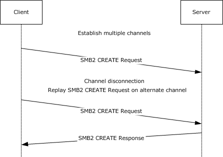{alt="Replay Create Request on an alternate channel" width="5.560416666666667in" height="3.89375in"}

1.  The client establishes an alternate channel for a [**session**](#gt_0cd96b80-a737-4f06-bca4-cf9efb449d12) as described in section [4.8](#Section_2e32e57a166f46aeabe817fa3c897890)

2.  The client sends an SMB2 CREATE Request with SMB2_CREATE_DURABLE_HANDLE_REQUEST_V2 and SMB2_CREATE_REQUEST_LEASE_V2 [**create contexts**](#gt_230c55f3-4b14-43ce-a2d1-26580cf4a023).

<!-- -->

2299. SMB2: C CREATE (0x5), Da(RW), Sh(RWD), DH2Q+RqLs(RWH-PK), File=Replay.txt@#14

      SMBIdByte: 254 (0xFE)

      SMBIdentifier: SMB

      SMB2Header: C CREATE (0x5),TID=0x0001, MID=0x0006, PID=0x000D, SID=0x4000059

      StructureSize: 64 (0x40)

      CreditCharge: 0 (0x0)

      ChannelSequence: (0x0) - (SMB 3.0 and later only)

      Reserved2: 0 (0x0)

      Command: CREATE (0x5)

      Credits: 10 (0xA)

      Flags: 0x0

      SMB2_FLAGS_REPLAY_OPERATION: (..0\...\...\...\...\...\...\...\...\.....) Command is a Replay Operation

      NextCommand: 0 (0x0)

      MessageId: 6 (0x6)

      Reserved: 13 (0xD)

      TreeId: 1 (0x1)

      SessionId: 1130302315429977 (0x4040104000059)

      Signature: Binary Large Object (16 Bytes)

      CCreate: 0x1

      StructureSize: 57 (0x39)

      SecurityFlags: 0 (0x0)

      RequestedOplockLevel: SMB2_OPLOCK_LEVEL_LEASE - A lease is requested.

      ImpersonationLevel: Impersonation - The application-requested impersonation level is Impersonation.

      SmbCreateFlags: 0 (0x0)

      Reserved: 0 (0x0)

      DesiredAccess: 0x12019F

      FileAttributes:

      FSCCFileAttribute: 32 (0x20)

      ShareAccess: Shared for Read/Write/Delete (0x00000007)

      CreateDisposition: (0x00000003) Open the file if it already exists; otherwise, create the file.

      CreateOptions: 0x40

      NameOffset: 120 (0x78)

      NameLength: 20 (0x14)

      CreateContextsOffset: 144 (0x90)

      CreateContextsLength: 132 (0x84)

      Name: Replay.txt

      ContextPadding: Binary Large Object (4 Bytes)

      Context: DH2Q,Request Durable Handle Open v2

      Context:

      ECPRequestDurableHandleV2: Request Durable Handle v2

      Timeout: 0 (0x0)

      Flags: 0 (0x0)

      Reserved: (\...\...\...\...\...\...\...\...\...\....0) Reserved

      Persistent: (\...\...\...\...\...\...\...\...\...\...0.)

      Reserved2: (000000000000000000000000000000..) Reserved

      Reserved: 0 (0x0)

      CreateGuid: {33AA3970-EF1A-60A4-4BF1-11F5F9FBBFDB}

      Context: RqLs,Lease Request/Response

      Context:

      CreateRequestLeaseV2: The requested lease state:0x7

      LeaseKey: {5A0E33E0-478A-9FA7-4286-B52390B5857B}

      LeaseState: 7 (0x7)

      READ: (\...\...\...\...\...\...\...\...\...\....1) A read caching lease is requested

      HANDLE: (\...\...\...\...\...\...\...\...\...\...1.) A handle caching lease is requested

      WRITE: (\...\...\...\...\...\...\...\...\.....1..) A write caching lease is requested

      Reserved: (00000000000000000000000000000\...) Reserved

      LeaseFlags: 4 (0x4)

      Reserved: (\...\...\...\...\...\...\...\...\...\...00) Reserved

      ParentKeyValid: (\...\...\...\...\...\...\...\...\.....1..) Parent lease key field is valid

      Reserved2: (00000000000000000000000000000\...) Reserved

      LeaseDuration: 0 (0x0)

      ParentLeaseKey: {5B4F4EAD-B0E6-B997-4222-50FADEC1FD86}

      Epoch: 0 (0x0)

<!-- -->

3.  The [**connection**](#gt_866b0055-ceba-4acf-a692-98452943b981) on which the client sent the SMB2 CREATE request is disconnected; the client cannot receive the [SMB2 CREATE response](#Section_d166aa9e0b53410eb35e3933d8131927). Since there is another connection on which the same session was bound, the client after a timeout, sends a replay SMB2 CREATE request on that connection. The client sends the SMB2 CREATE request on the alternate channel with the same parameters and create contexts as the original request except that SMB2_FLAGS_REPLAY_OPERATION bit is set in the **Flags** field of the SMB2 Header.

<!-- -->

2363. SMB2: C CREATE (0x5), Da(RW), Sh(RWD), DH2Q+RqLs(RWH-PK), File=Replay.txt@#23

      SMBIdByte: 254 (0xFE)

      SMBIdentifier: SMB

      SMB2Header: C CREATE (0x5),TID=0x0001, MID=0x0006, PID=0x000D, SID=0x4000059

      StructureSize: 64 (0x40)

      CreditCharge: 0 (0x0)

      ChannelSequence: (0x0) - (SMB 3.0 and later only)

      Reserved2: 0 (0x0)

      Command: CREATE (0x5)

      Credits: 10 (0xA)

      Flags: 0x0

      SMB2_FLAGS_REPLAY_OPERATION: (..1\...\...\...\...\...\...\...\...\.....) Command is a Replay Operation

      NextCommand: 0 (0x0)

      MessageId: 6 (0x6)

      Reserved: 13 (0xD)

      TreeId: 1 (0x1)

      SessionId: 1130302315429977 (0x4040104000059)

      Signature: Binary Large Object (16 Bytes)

      CCreate: 0x1

      StructureSize: 57 (0x39)

      SecurityFlags: 0 (0x0)

      RequestedOplockLevel: SMB2_OPLOCK_LEVEL_LEASE - A lease is requested.

      ImpersonationLevel: Impersonation - The application-requested impersonation level is Impersonation.

      SmbCreateFlags: 0 (0x0)

      Reserved: 0 (0x0)

      DesiredAccess: 0x12019F

      FileAttributes:

      FSCCFileAttribute: 32 (0x20)

      ShareAccess: Shared for Read/Write/Delete (0x00000007)

      CreateDisposition: (0x00000003) Open the file if it already exists; otherwise, create the file.

      CreateOptions: 0x40

      NameOffset: 120 (0x78)

      NameLength: 20 (0x14)

      CreateContextsOffset: 144 (0x90)

      CreateContextsLength: 132 (0x84)

      Name: Replay.txt

      ContextPadding: Binary Large Object (4 Bytes)

      Context: DH2Q,Request Durable Handle Open v2

      Context:

      ECPRequestDurableHandleV2: Request Durable Handle v2

      Timeout: 0 (0x0)

      Flags: 0 (0x0)

      Reserved: (\...\...\...\...\...\...\...\...\...\....0) Reserved

      Persistent: (\...\...\...\...\...\...\...\...\...\...0.)

      Reserved2: (000000000000000000000000000000..) Reserved

      Reserved: 0 (0x0)

      CreateGuid: {33AA3970-EF1A-60A4-4BF1-11F5F9FBBFDB}

      Context: RqLs,Lease Request/Response

      Context:

      CreateRequestLeaseV2: The requested lease state:0x7

      LeaseKey: {5A0E33E0-478A-9FA7-4286-B52390B5857B}

      LeaseState: 7 (0x7)

      READ: (\...\...\...\...\...\...\...\...\...\....1) A read caching lease is requested

      HANDLE: (\...\...\...\...\...\...\...\...\...\...1.) A handle caching lease is requested

      WRITE: (\...\...\...\...\...\...\...\...\.....1..) A write caching lease is requested

      Reserved: (00000000000000000000000000000\...) Reserved

      LeaseFlags: 4 (0x4)

      Reserved: (\...\...\...\...\...\...\...\...\...\...00) Reserved

      ParentKeyValid: (\...\...\...\...\...\...\...\...\.....1..) Parent lease key field is valid

      Reserved2: (00000000000000000000000000000\...) Reserved

      LeaseDuration: 0 (0x0)

      ParentLeaseKey: {5B4F4EAD-B0E6-B997-4222-50FADEC1FD86}

      Epoch: 0 (0x0)

<!-- -->

4.  The server responds with an SMB2 CREATE response with SMB2_CREATE_DURABLE_HANDLE_REQUEST_V2 and SMB2_CREATE_REQUEST_LEASE_V2 create contexts.

<!-- -->

2427. SMB2: R CREATE (0x5), RqLs(RWH-PK)+DH2Q, FID=0x10100000001(Replay.txt@#23)

      SMBIdByte: 254 (0xFE)

      SMBIdentifier: SMB

      SMB2Header: R CREATE (0x5),TID=0x0001, MID=0x0003, PID=0x000D, SID=0x4000059

      StructureSize: 64 (0x40)

      CreditCharge: 0 (0x0)

      Status: 0x0, Code = (0) STATUS_SUCCESS, Facility = FACILITY_SYSTEM, Severity = STATUS_SEVERITY_SUCCESS

      Command: CREATE (0x5)

      Credits: 10 (0xA)

      Flags: 0x20000001

      SMB2_FLAGS_REPLAY_OPERATION: (..1\...\...\...\...\...\...\...\...\.....) Command is a Replay Operation

      NextCommand: 0 (0x0)

      MessageId: 3 (0x3)

      Reserved: 13 (0xD)

      TreeId: 1 (0x1)

      SessionId: 1130302315429977 (0x4040104000059)

      Signature: Binary Large Object (16 Bytes)

      RCreate: 0x1

      StructureSize: 89 (0x59)

      OplockLevel: SMB2_OPLOCK_LEVEL_LEASE - A lease is requested.

      Flags: 0 (0x0)

      CreateAction: Opened (0x00000001)

      CreationTime: 05/11/2012, 09:23:05.943750 UTC

      LastAccessTime: 05/11/2012, 09:23:05.943750 UTC

      LastWriteTime: 05/11/2012, 09:23:05.943750 UTC

      ChangeTime: 05/11/2012, 09:23:05.943750 UTC

      AllocationSize: 0 (0x0)

      EndofFile: 0 (0x0)

      FileAttributes:

      FSCCFileAttribute: 32 (0x20)

      Reserved2: 0 (0x0)

      FileId: Persistent: 0x10000010000001D, Volatile: 0x10100000001

      Persistent: 72057598332895261 (0x10000010000001D)

      volatile: 1103806595073 (0x10100000001)

      CreateContextsOffset: 152 (0x98)

      CreateContextsLength: 112 (0x70)

      Context: RqLs,Lease Request/Response

      Context:

      CreateResponseLeaseV2: The response lease state:0x087

      LeaseKey: {5A0E33E0-478A-9FA7-4286-B52390B5857B}

      LeaseState: 7 (0x7)

      READ: (\...\...\...\...\...\...\...\...\...\....1) A read caching lease is granted

      HANDLE: (\...\...\...\...\...\...\...\...\...\...1.) A handle caching lease is granted

      WRITE: (\...\...\...\...\...\...\...\...\.....1..) A write caching lease is granted

      Reserved: (00000000000000000000000000000\...) Reserved

      LeaseFlags: 4 (0x4)

      Reserved1: (\...\...\...\...\...\...\...\...\...\....0) Reserved

      BREAK: (\...\...\...\...\...\...\...\...\...\...0.)

      ParentKeyValid: (\...\...\...\...\...\...\...\...\.....1..) Parent lease key field is valid

      Reserved: (00000000000000000000000000000\...) Reserved

      LeaseDuration: 0 (0x0)

      ParentLeaseKey: {5B4F4EAD-B0E6-B997-4222-50FADEC1FD86}

      Epoch: 1 (0x1)

      ContextPadding: Binary Large Object (4 Bytes)

      Context: DH2Q,Request Durable Handle Open v2

      Context:

      ECPResponseDurableHandleV2: Response Durable Handle V2

      Timeout: 60000 (0xEA60)

      Flags: 0 (0x0)

      Reserved: (\...\...\...\...\...\...\...\...\...\....0) Reserved

      Persistent: (\...\...\...\...\...\...\...\...\...\...0.)

      Reserved2: (000000000000000000000000000000..) Reserved

## Negotiating Transport Level Encryption

The following diagram demonstrates using transport (QUIC) encryption instead of SMB2 encryption for SMB2 messages.

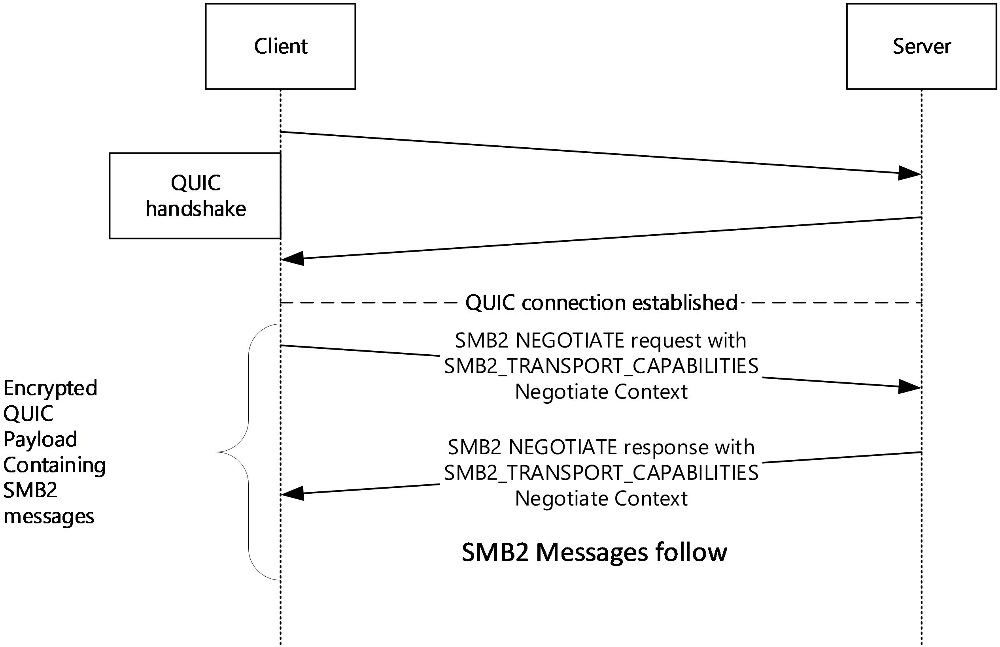{alt="Negotiating Transport Level Encryption" width="5.8493055555555555in" height="3.783333333333333in"}

1.  The client establishes a QUIC transport connection to the server. On successful QUIC connection, the client starts communicating to the server using SMB2 protocol over QUIC transport. All SMB2 messages are encapsulated inside QUIC protocol. \"smb\" is the ALPN used to differentiate SMB2 messages over QUIC. By default, all QUIC message payloads are encrypted on the wire and so are SMB2 messages.

2.  The client sends SMB2 NEGOTIATE request with dialect 0x0311 in the **Dialects** array. SMB2_TRANSPORT_CAPABILITIES Negotiate context is added to **NegotiateContextList** to indicate whether transport level encryption is used or not.

When SMB2_ACCEPT_TRANSPORT_LEVEL_SECURITY is set in the context, transport level security is accepted and SMB2 encryption is skipped. Otherwise, SMB2 encryption is offered over QUIC connection.

2490. *   * SMB2 Header

          SMB2 Negotiate Protocol Request (0x00)

              StructureSize: 0x0024

              DialectCount: 5

              SecurityMode: 0x01, Signing enabled

              Reserved: 0

              Capabilities: 0x0000007F

              ClientGuid: 21a63604-ef37-11ea-bb9e-00155d546615

              NegotiateContextOffset: 0x00000070

              NegotiateContextCount: 4

              Reserved: 0

              Dialect: SMB 2.0.2 (0x0202)

              Dialect: SMB 2.1 (0x0210)

              Dialect: SMB 3.0 (0x0300)

              Dialect: SMB 3.0.2 (0x0302)

              Dialect: SMB 3.1.1 (0x0311)

              Negotiate Context: SMB2_PREAUTH_INTEGRITY_CAPABILITIES

              Negotiate Context: SMB2_TRANSPORT_CAPABILITIES

                  ContextType: SMB2_TRANSPORT_CAPABILITIES (0x0006)

                  DataLength: 4

                  Reserved: 0

                  Flags: SMB2_ACCEPT_TRANSPORT_LEVEL_SECURITY (0x00000001)

<!-- -->

3.  The server responds with SMB2 NEGOTIATE response with required Negotiate contexts including SMB2_TRANSPORT_CAPABILITIES context. The server responds with SMB2_ACCEPT_TRANSPORT_LEVEL_SECURITY Flag set in the Negotiate Context indicating that transport level encryption is accepted and SMB2 encryption is skipped over QUIC connection.

<!-- -->

2512. *   *SMB2 Header

         SMB2 Negotiate Protocol Response (0x00)

              StructureSize: 0x0041

              SecurityMode: 0x03, Signing enabled, Signing required

              DialectRevision: SMB 3.1.1 (0x0311)

              NegotiateContextCount: 4

              ServerGuid: f782a72d-49f9-47a5-84de-fefd411065df

              Capabilities: 0x0000007F

              MaxTransactSize: 8388608

              MaxReadSize: 8388608

              MaxWriteSize: 8388608

              SystemTime: Jul 16, 2021 07:42:53.634690300 UTC

              ServerStartTime: 0

              SecurityBufferOffset: 0x00000080

              SecurityBufferLength: 120

              SecurityBlob: 607606062b0601050502a06c306aa03c303a060a2b06010401823702021e06092a864882...

              NegotiateContextOffset: 0x000000F8

              NegotiateContext: SMB2_PREAUTH_INTEGRITY_CAPABILITIES

              Negotiate Context: SMB2_TRANSPORT_CAPABILITIES

                  ContextType: SMB2_TRANSPORT_CAPABILITIES (0x0006)

                  DataLength: 4

                  Reserved: 0

                  Flags: SMB2_ACCEPT_TRANSPORT_LEVEL_SECURITY (0x00000001)

<!-- -->

4.  SMB2 messages continue to flow over QUIC connection. There is no change in SMB2 protocol messages when the transport is QUIC.

## Sending and Processing a Session Closed Notification

1.  The SMB server constructs and sends the following payload to indicate to the client that the associated SMB2 session has been closed:

> **SMB2 (Server Message Block Protocol Version No. 2)**

2535. SMB2 Header

      Size: 0x40

      CreditCharge: 0x0

      Status: STATUS_SUCCESS

      Command: SERVER TO CLIENT NOTIFICATION

      Credits: 0x0

      Flags: SMB2_FLAGS_SERVER_TO_REDIR (0x00000001)

      ServerToRedir: \...\...\...\...\...\...\...\...\...\....1 Server to Client

      AsyncCommand: \...\...\...\...\...\...\...\...\...\...0. Command is not asynchronous

      Related: \...\...\...\...\...\...\...\...\.....0.. Packet is a single message

      Signed: \...\...\...\...\...\...\...\...\....0\... Packet is not signed

      DFS: 0\...\...\...\...\...\...\...\...\...\.... Command is not a DFS operation

      NextCommand: 0x0

      MessageId: 0xFFFFFFFFFFFFFFFF

      Reserved: 0x0

      TreeId: 0x0

      SessionId: 0x40000000000

      SMB2 Server to Client Notification

      StructureSize: 0x12

      Reserved: 0x0

      NotificationType: 0x0 (SmbNotifySessionsClosed)

      Notification: SMB2 Notify Session Closed

      SMB2 Notify Session Closed

      Reserved: 0x0

      1.  The SMB client, once the notification is received, processes the necessary intents (implementation-specific) based on cleaning up resources for the associated session-connection path on which the notification was received.

### Nuances with Multichannel, Signing, & Encryption

In the case of multichannel, if the notification was not associated with a specific **Session** and it is scoped to a specific client, then the server should iterate over the **Client.ConnectionList** corresponding to the **ClientGuid** to find the available connections from the client for the **Server** to try using. The server should send the notification using the first available **Connection**, and if the server fails for whatever reason, then the server should retry with the next available **Connection**.

If the notification is associated with a specific **Session**, then the **Server** should iterate over the **Session.ChannelList** to try the first available **Channel.Connection**. If the **Server** fails for whatever reason, then the **Server** should retry with the next available **Channel.Connection**.

In the case when encryption is enabled over SMB, there are two scenarios to handle:

> 1\. If the notification is NOT associated with a **Session**, then encryption will not work unless the notification is broadcasted to all sessions to use the **Session's** encryption keys.
>
> 2\. If the notification is associated with a specific **Session**, then the notification should be encrypted.

The session closed notification in the previous example (section [4.11](#Section_8a93e7af7cef435cb8778e4e54a89e58)) will only be used for scenario 2 as it needs to be associated with a specific **Session**.

Regarding signing, notifications MAY be signed. SMB2+ clients need to be aware that incoming notifications can have a randomly generated 64-bit **MessageId**, as in the case of AES-128-GMAC for nonce generation, so that clients do not confuse notifications that have random MIDs with actual server responses to client requests.

If an **SMB2_SERVER_TO_CLIENT_NOTIFICATION** should be signed and it is associated with the session, and if that session is not configured to require SMB encryption, but is configured to require SMB2 signing, then sign the notification. In the previous example (section 4.11), the session closed notification will not be signed.

If signing is enabled, the **SMB2_FLAGS_SIGNED** flag should be set in the **SMB2 HEADER** payload's **Flags**.

# Security[]{.indexref entry="Security:overview"}

The following sections specify security considerations for implementers of the SMB 2 Protocol.

## Security Considerations for Implementers[[]{.indexref entry="Implementer - security considerations"}]{.indexref entry="Security:implementer considerations"}

The protocol does not sign [**oplock break**](#gt_5c86b468-90a1-4542-8bde-460c098d2a5a) requests from the server to the client if message signing is enabled. This could allow attackers to affect performance but it does not allow them to deny access or alter data.

The protocol does not require cancel requests from the client to the server to be signed if message signing is enabled. This could allow attackers to cancel previously sent messages from the client to the server on the same SMB2 transport connection.

The previous versions support does potentially allow access to versions of a file that have been deleted or modified, and so could allow access to information that was not available without these extensions. However, this access is still subject to the same access checks it would have normally been subject to.

The SMB 2.0.2 and SMB 2.1 dialects do not support encryption. The SMB 3.x dialect family optionally allows for encryption. For data that requires stricter security, encryption by the SMB protocol version 3 is preferred. Alternatively, encryption of the data by the underlying transport is provided.

All SMB2 dialects use a session key returned by the authentication mechanism to generate keys for signing, encryption, and decryption. If the session keys are nonrandom or can be forced to be repeated in a predictable manner, attackers could deduce the signing and decryption keys and thereby gain access to messages and data.

## Index of Security Parameters[[[[]{.indexref entry="Parameter index - security"}]{.indexref entry="Parameters - security index"}]{.indexref entry="Index of security parameters"}]{.indexref entry="Security:parameter index"}

  ---------------------------------------------------------------------------------------------------------------------------------------------------------------------------------------------------------------
  Security parameter               Section
  -------------------------------- ------------------------------------------------------------------------------------------------------------------------------------------------------------------------------
  SHA-256 hashing                  [3.1.4.1](#Section_a3e9ea1e53c84cff94bdd98fb20417c0) and [3.1.5.1](#Section_5b570c0b085443248fb5d410692dde3e)

  CMAC-128 hashing                 3.1.4.1 and 3.1.5.1

  AES-GMAC hashing                 3.1.4.1 and 3.1.5.1

  Cryptographic key generation     [3.1.4.2](#Section_da4e579e02ce4e27bbce3fc816a3ff92)

  CCM-128 and CCM-256 encryption   [3.1.4.3](#Section_24d74c0c3de140d9a949d169ad84361d), [3.2.5.1.1.1](#Section_d3c03e337dc74d5884280a1484c5c874), and [3.3.5.2.1.1](#Section_94398d1848ff4b6ca32d0154b2e88238)

  GCM-128 and GCM-256 encryption   3.1.4.3, 3.2.5.1.1.1, and 3.3.5.2.1.1

  GSSAPI authentication            [3.2.4.2.3](#Section_8b90c3355a644238981384bd734599eb)

  GSSAPI authentication            [3.3.5.5.3](#Section_5ed93f06a1d248378954fa8b833c2654)
  ---------------------------------------------------------------------------------------------------------------------------------------------------------------------------------------------------------------

# Appendix A: Product Behavior[]{.indexref entry="Product behavior"}

The information in this specification is applicable to the following Microsoft products or supplemental software. References to product versions include updates to those products.

The terms \"earlier\" and \"later\", when used with a product version, refer to either all preceding versions or all subsequent versions, respectively. The term \"through\" refers to the inclusive range of versions. Applicable Microsoft products are listed chronologically in this section.

**Windows Client**

- Windows Vista operating system

- Windows 7 operating system

- Windows 8 operating system

- Windows 8.1 operating system

- Windows 10 operating system

- Windows 11 operating system

**Windows Server**

- Windows Server 2008 operating system

- Windows Server 2008 R2 operating system

- Windows Server 2012 operating system

- Windows Server 2012 R2 operating system

- Windows Server 2016 operating system

- Windows Server operating system

- Windows Server 2019 operating system

- Windows Server 2022 operating system

- Windows Server 2025 operating system

Exceptions, if any, are noted in this section. If an update version, service pack or Knowledge Base (KB) number appears with a product name, the behavior changed in that update. The new behavior also applies to subsequent updates unless otherwise specified. If a product edition appears with the product version, behavior is different in that product edition.

Unless otherwise specified, any statement of optional behavior in this specification that is prescribed using the terms \"SHOULD\" or \"SHOULD NOT\" implies product behavior in accordance with the SHOULD or SHOULD NOT prescription. Unless otherwise specified, the term \"MAY\" implies that the product does not follow the prescription.

[\<1\> Section 1.6](#Appendix_A_Target_1): The following table illustrates the support of SMB 2 protocol on various Windows operating system versions.

  -------------------------------------------------------------------------------------------------------------------------------------------------------------------------------------------------------------------------------------------------------
  Operating System                                                                                                         SMB 2 dialects supported
  ------------------------------------------------------------------------------------------------------------------------ ------------------------------------------------------------------------------------------------------------------------------
  Windows 10, Windows Server 2016, Windows Server operating system, Windows Server 2019, Windows Server 2022, Windows 11   SMB 3.1.1, SMB 3.0.2, SMB 3.0, SMB 2.1, SMB 2.0.2

  Windows 8.1, Windows Server 2012 R2                                                                                      SMB 3.0.2, SMB 3.0, SMB 2.1, SMB 2.0.2

  Windows 8, Windows Server 2012                                                                                           SMB 3.0, SMB 2.1, SMB 2.0.2

  Windows 7, Windows Server 2008 R2                                                                                        SMB 2.1, SMB 2.0.2

  Windows Vista operating system with Service Pack 1 (SP1), Windows Server 2008                                            SMB 2.0.2

  Previous versions of Windows                                                                                             None. They support the SMB Protocol, as specified in [\[MS-SMB\]](%5bMS-SMB%5d.pdf#Section_f210069c70864dc2885e861d837df688)
  -------------------------------------------------------------------------------------------------------------------------------------------------------------------------------------------------------------------------------------------------------

Windows Vista RTM implemented dialect 2.000, which was not interoperable and was obsoleted by Windows Vista SP1.

[\<2\> Section 2.1](#Appendix_A_Target_2): Windows 11, version 24H2 operating system and later and Windows Server 2025 and later SMB2 servers allow listening on any configured port only when the transport is QUIC.

Windows 11, version 24H2 and later and Windows Server 2025 and later SMB2 clients can connect to an SMB2 server that allows listening on any configured port over TCP, RDMA and QUIC transports.

By default, Windows SMB2 clients and servers always use a single stream per QUIC connection. Sending or receiving more than one stream per connection will be blocked by the underlying transport QUIC.

[\<3\> Section 2.2.1.2](#Appendix_A_Target_3): Windows clients set this field to 0xFEFF.

[\<4\> Section 2.2.1.2](#Appendix_A_Target_4): Windows servers do not use this field in the request processing and return the value received in the request.

[\<5\> Section 2.2.2](#Appendix_A_Target_5): Windows 10 v1703 operating system and prior and Windows Server 2016 and prior set **ErrorData** to one uninitialized byte when **ByteCount** is zero.

[\<6\> Section 2.2.2.2.1](#Appendix_A_Target_6): Windows-based servers will never follow a symlink. It is the client\'s responsibility to evaluate the symlink and access the actual file using the symlink. Windows-based servers only return STATUS_STOPPED_ON_SYMLINK when the open fails due to presence of a symlink.

[\<7\> Section 2.2.2.2.1](#Appendix_A_Target_7): Windows-based servers will return an absolute target to a local resource in the format of \"\\??\\C:\\\...\" where C: is the drive mount point on the local system and \... is replaced by the remainder of the path to the target.

[\<8\> Section 2.2.3](#Appendix_A_Target_8): Windows-based SMB2 servers fail the request and return STATUS_INVALID_PARAMETER, if the **DialectCount** field is greater than 64.

[\<9\> Section 2.2.3](#Appendix_A_Target_9): Windows 8.1 operating system and later and Windows Server 2012 R2 operating system and later fail the request with STATUS_NOT_SUPPORTED if the **Reserved** field is set to a nonzero value.

[\<10\> Section 2.2.3](#Appendix_A_Target_10): Windows Vista SP1 and Windows Server 2008 do not support this dialect revision.

[\<11\> Section 2.2.3](#Appendix_A_Target_11): Windows Vista SP1, Windows Server 2008, Windows 7, and Windows Server 2008 R2 do not support this dialect revision.

[\<12\> Section 2.2.3](#Appendix_A_Target_12): Windows Vista SP1, Windows Server 2008, Windows 7, Windows Server 2008 R2, Windows 8, and Windows Server 2012 do not support the SMB 3.0.2 dialect.

[\<13\> Section 2.2.3](#Appendix_A_Target_13): Windows Vista SP1, Windows Server 2008, Windows 7, Windows Server 2008 R2, Windows 8, Windows Server 2012, Windows 8.1, and Windows Server 2012 R2 do not support the SMB 3.1.1 dialect.

[\<14\> Section 2.2.3.1](#Appendix_A_Target_14): Windows 10 v1809 operating system operating system and prior and Windows Server v1809 operating system operating system and prior do not send or process SMB2_COMPRESSION_CAPABILITIES.

[\<15\> Section 2.2.3.1](#Appendix_A_Target_15): Windows 10 v1809 operating system and prior and Windows Server v1809 operating system and prior do not send or process SMB2_NETNAME_NEGOTIATE_CONTEXT_ID.

[\<16\> Section 2.2.3.1](#Appendix_A_Target_16): Windows 10 v1909 operating system and prior and Windows Server v1909 operating system and prior do not send or process SMB2_TRANSPORT_CAPABILITIES.

[\<17\> Section 2.2.3.1](#Appendix_A_Target_17): Windows 10 operating system and prior and Windows Server v20H2 operating system and prior do not send or process SMB2_RDMA_TRANSFORM_CAPABILITIES.

[\<18\> Section 2.2.3.1](#Appendix_A_Target_18): Windows 10 operating system and prior and Windows Server v20H2 operating system and prior do not send or process SMB2_SIGNING_CAPABILITIES.

[\<19\> Section 2.2.3.1.5](#Appendix_A_Target_19): Windows 10 v2004 operating system, Windows 10 v20H2 operating system, Windows Server v2004 operating system, and Windows Server v20H2 do not send or process SMB2_ACCEPT_TRANSPORT_LEVEL_SECURITY.

[\<20\> Section 2.2.4](#Appendix_A_Target_20): Windows Vista SP1 and Windows Server 2008 do not support this dialect revision.

[\<21\> Section 2.2.4](#Appendix_A_Target_21): Windows Vista SP1, Windows Server 2008, Windows 7 and Windows Server 2008 R2 do not support this dialect revision.

[\<22\> Section 2.2.4](#Appendix_A_Target_22): Windows Vista SP1, Windows Server 2008, Windows 7, Windows Server 2008 R2, Windows 8, and Windows Server 2012 do not support this dialect revision.

[\<23\> Section 2.2.4](#Appendix_A_Target_23): Windows Vista SP1, Windows Server 2008, Windows 7, Windows Server 2008 R2, Windows 8, Windows Server 2012, Windows 8.1, and Windows Server 2012 R2 do not support the SMB 3.1.1 dialect.

[\<24\> Section 2.2.4](#Appendix_A_Target_24): The \"SMB 2.???\" dialect string is not supported by SMB2 clients and servers in Windows Vista SP1 and Windows Server 2008.

[\<25\> Section 2.2.4](#Appendix_A_Target_25): Windows-based SMB2 servers can set this field to any value.

[\<26\> Section 2.2.4](#Appendix_A_Target_26): Windows--based SMB2 servers generate a new **ServerGuid** each time they are started.

[\<27\> Section 2.2.4](#Appendix_A_Target_27): Windows clients do not enforce the **MaxTransactSize** value.

[\<28\> Section 2.2.5](#Appendix_A_Target_28): Windows-based clients always set the **Capabilities** field to SMB2_GLOBAL_CAP_DFS(0x00000001) and the server will ignore them on receipt.

[\<29\> Section 2.2.5](#Appendix_A_Target_29): Windows clients set the **Buffer** with a token as produced by the NTLM authentication protocol in the case, see [\[MS-NLMP\]](%5bMS-NLMP%5d.pdf#Section_b38c36ed28044868a9ff8dd3182128e4) section 3.1.5.1.

[\<30\> Section 2.2.6](#Appendix_A_Target_30): Windows clients set the **Buffer** with a token as produced by the NTLM authentication protocol in the case, see \[MS-NLMP\] section 3.1.5.1.

[\<31\> Section 2.2.9](#Appendix_A_Target_31): Windows 10 v1703 and prior and Windows Server 2016 and prior do not support the SMB2_TREE_CONNECT_FLAG_REDIRECT_TO_OWNER flag.

[\<32\> Section 2.2.9](#Appendix_A_Target_32): The Windows SMB 2 Protocol client translates any names of the form \\\\server\\pipe to \\\\server\\IPC\$ before sending a request on the network.

[\<33\> Section 2.2.10](#Appendix_A_Target_33): SMB2_SHAREFLAG_FORCE_LEVELII_OPLOCK is not supported on Windows Vista SP1 and Windows Server 2008.

[\<34\> Section 2.2.10](#Appendix_A_Target_34): Windows 10 v1703 and prior and Windows Server 2016 and prior do not send or process this flag.

[\<35\> Section 2.2.10](#Appendix_A_Target_35): Windows 10 operating system and prior and Windows Server v20H2 operating system and prior do not send or process this flag.

[\<36\> Section 2.2.13](#Appendix_A_Target_36): Windows-based clients never use exclusive oplocks. Because there are no situations where the client would require an exclusive oplock where it would not also require an SMB2_OPLOCK_LEVEL_BATCH, it always requests an SMB2_OPLOCK_LEVEL_BATCH.

[\<37\> Section 2.2.13](#Appendix_A_Target_37): When opening a printer file or a named pipe, Windows-based servers ignore these **ShareAccess** values.

[\<38\> Section 2.2.13](#Appendix_A_Target_38): When opening a printer object, Windows-based servers ignore this value.

[\<39\> Section 2.2.13](#Appendix_A_Target_39): When opening a printer object, Windows-based servers ignore this value.

[\<40\> Section 2.2.13](#Appendix_A_Target_40): When opening a printer object, Windows-based servers ignore this value.

[\<41\> Section 2.2.13](#Appendix_A_Target_41): Windows-based servers reserve all bits that are not specified in the table. If any of the reserved bits are set, STATUS_NOT_SUPPORTED is returned.

[\<42\> Section 2.2.13](#Appendix_A_Target_42): Windows SMB2 clients do not initialize this bit. The bit contains the value specified by the caller when requesting the open.

[\<43\> Section 2.2.13](#Appendix_A_Target_43): Windows SMB2 clients do not initialize this bit. The bit contains the value specified by the caller when requesting the open.

[\<44\> Section 2.2.13](#Appendix_A_Target_44): Windows SMB2 clients do not initialize this bit. The bit contains the value specified by the caller when requesting the open.

[\<45\> Section 2.2.13](#Appendix_A_Target_45): Windows SMB2 clients do not initialize this bit. The bit contains the value specified by the caller when requesting the open.

[\<46\> Section 2.2.13](#Appendix_A_Target_46): Windows SMB2 clients do not initialize this bit. The bit contains the value specified by the caller when requesting the open.

[\<47\> Section 2.2.13](#Appendix_A_Target_47): Windows Vista SP1, Windows Server 2008, Windows 7, Windows 8, and Windows 8.1-based clients will set this bit when it is requested by the application.

[\<48\> Section 2.2.13.1.1](#Appendix_A_Target_48): Windows sets this flag to the value passed in by the higher-level application.

[\<49\> Section 2.2.13.1.1](#Appendix_A_Target_49): Windows 7 operating system and later and Windows Server 2008 R2 operating system and later do not ignore the SYNCHRONIZE bit, and pass it to the underlying object store. If the caller requests SYNCHRONIZE in the *DesiredAccess* parameter, but the SYNCHRONIZE access is not granted to the caller for the object being created or opened, the underlying object store fails the request and returns STATUS_ACCESS_DENIED. When SYNCHRONIZE access is granted, the SYNCHRONIZE bit is returned in **MaximalAccess** field of SMB2_CREATE_QUERY_MAXIMAL_ACCESS_RESPONSE with no other behavior.

[\<50\> Section 2.2.13.1.1](#Appendix_A_Target_50): Windows fails the create request with STATUS_ACCESS_DENIED if the caller does not have the SeSecurityPrivilege, as specified in [\[MS-LSAD\]](%5bMS-LSAD%5d.pdf#Section_1b5471ef4c334a91b079dfcbb82f05cc) section 3.1.1.2.1.

[\<51\> Section 2.2.13.1.2](#Appendix_A_Target_51): Windows sets this flag to the value passed in by the higher-level application.

[\<52\> Section 2.2.13.1.2](#Appendix_A_Target_52): Windows 7 operating system and later and Windows Server 2008 R2 operating system and later do not ignore the SYNCHRONIZE bit, and pass it to the underlying object store. If the caller requests SYNCHRONIZE in the **DesiredAccess** parameter, but the SYNCHRONIZE access is not granted to the caller for the object being created or opened, the underlying object store fails the request and returns STATUS_ACCESS_DENIED. When SYNCHRONIZE access is granted, the SYNCHRONIZE bit is returned in **MaximalAccess** field of [SMB2_CREATE_QUERY_MAXIMAL_ACCESS_RESPONSE (section 2.2.14.2.5)](#Section_0fe6be153a7640329a4456f846ac6244) with no other behavior.

[\<53\> Section 2.2.13.1.2](#Appendix_A_Target_53): Windows fails the create request with STATUS_ACCESS_DENIED if the caller does not have the SeSecurityPrivilege, as specified in \[MS-LSAD\] section 3.1.1.2.1.

[\<54\> Section 2.2.13.2](#Appendix_A_Target_54): If DataLength is 0, Windows-based clients set this field to any value.

[\<55\> Section 2.2.13.2.8](#Appendix_A_Target_55): Windows 7 operating system and later and Windows Server 2008 R2 operating system and later acting as SMB servers support the following combinations of values: 0, READ, READ \| WRITE, READ \| HANDLE, READ \| WRITE \| HANDLE.

[\<56\> Section 2.2.13.2.10](#Appendix_A_Target_56): Windows Server 2012 operating system and later support the following combinations of values: 0, READ, READ \| WRITE, READ \| HANDLE, READ \| WRITE \| HANDLE.

[\<57\> Section 2.2.14](#Appendix_A_Target_57): Windows-based SMB2 servers always return FILE_OPENED for pipes with successful opens.

[\<58\> Section 2.2.14](#Appendix_A_Target_58): Windows-based SMB2 servers can set this field to any value.

[\<59\> Section 2.2.14.2.11](#Appendix_A_Target_59): Windows 8 operating system and later and Windows Server 2012 operating system and later set this field to an arbitrary value.

[\<60\> Section 2.2.19](#Appendix_A_Target_60): Windows 10 v1809 and prior and Windows Server v1809 and prior do not send or process SMB2_READFLAG_REQUEST_COMPRESSED flag.

[\<61\> Section 2.2.20](#Appendix_A_Target_61): Windows 10 operating system and prior and Windows Server v20H2 operating system and prior do not send or process SMB2_READFLAG_RESPONSE_RDMA_TRANSFORM flag.

[\<62\> Section 2.2.21](#Appendix_A_Target_62): Windows 10 operating system and prior and Windows Server v20H2 operating system and prior do not send or process SMB2_CHANNEL_RDMA_TRANSFORM flag.

[\<63\> Section 2.2.24.2](#Appendix_A_Target_63): Windows clients always set the LeaseState in the Lease Break Acknowledgment to be equal to the LeaseState in the [Lease Break Notification](#Section_9abe6f73f32f4a23998dee9da2b90e2e) from the server.

[\<64\> Section 2.2.31](#Appendix_A_Target_64): Windows clients set the **OutputOffset** field equal to the **InputOffset** field.

[\<65\> Section 2.2.31.1.1](#Appendix_A_Target_65): Windows clients set this field to an arbitrary value.

[\<66\> Section 2.2.32](#Appendix_A_Target_66): Windows--based SMB2 servers set **InputCount** to the same value as the value received in the IOCTL request for the following FSCTLs.

- FSCTL_FIND_FILES_BY_SID

- FSCTL_GET_RETRIEVAL_POINTERS

- FSCTL_QUERY_ALLOCATED_RANGES

- FSCTL_READ_FILE_USN_DATA

- FSCTL_RECALL_FILE

- FSCTL_WRITE_USN_CLOSE_RECORD

Windows clients ignore the **InputCount** field.

[\<67\> Section 2.2.32](#Appendix_A_Target_67): Windows--based SMB2 servers set **OutputOffset** to **InputOffset** + **InputCount**, rounded up to a multiple of 8.

[\<68\> Section 2.2.32.2](#Appendix_A_Target_68): Windows-based SMB2 server will place 2 extra bytes set to zero in the SRV_SNAPSHOT_ARRAY response, if **NumberOfSnapShotsReturned** is zero.

[\<69\> Section 2.2.32.3](#Appendix_A_Target_69): Windows-based servers always send 4 bytes of zero for the **Context** field.

[\<70\> Section 2.2.32.4.1](#Appendix_A_Target_70): Windows--based SMB2 servers and clients do not check **SourceFileName**. It is ignored.

[\<71\> Section 2.2.32.5.1.2](#Appendix_A_Target_71): Windows 10 v1709 operating system through Windows 10 v1909 and Windows Server v1709 operating system through Windows Server v1909 set this field to any value.

[\<72\> Section 2.2.33](#Appendix_A_Target_72): Windows 10 operating system and prior and Windows Server 2022 operating system and prior do not send or process this information class.

[\<73\> Section 2.2.33](#Appendix_A_Target_73): Windows 11, version 23H2 operating system and prior and Windows Server 2022 and prior do not send or process FileId64ExtdDirectoryInformation information class.

[\<74\> Section 2.2.33](#Appendix_A_Target_74): Windows 11, version 23H2 and prior and Windows Server 2022 and prior do not send or process FileId64ExtdBothDirectoryInformation information class.

[\<75\> Section 2.2.33](#Appendix_A_Target_75): Windows 11, version 23H2 and prior and Windows Server 2022 and prior do not send or process FileIdAllExtdDirectoryInformation information class.

[\<76\> Section 2.2.33](#Appendix_A_Target_76): Windows 11, version 23H2 and prior and Windows Server 2022 and prior do not send or process FileIdAllExtdBothDirectoryInformation information class.

[\<77\> Section 2.2.33](#Appendix_A_Target_77): SMB2 wildcard characters are based on Windows wildcard characters, as described in [\[MS-FSA\]](%5bMS-FSA%5d.pdf#Section_860b1516c45247b4bdbc625d344e2041) section 2.1.4.4, Algorithm for Determining if a FileName Is in an Expression. For more information on wildcard behavior in Windows, see [\[FSBO\]](https://go.microsoft.com/fwlink/?LinkId=140636) section 7.

[\<78\> Section 2.2.37](#Appendix_A_Target_78): Windows SMB2 servers ignore the **FileInfoClass** field for quota queries. Windows SMB2 clients set the **FileInfoClass** field to 0x20 for quota queries.

[\<79\> Section 2.2.37](#Appendix_A_Target_79): Windows clients set this value to the offset from the start of the [SMB2 header](#Section_5cd6452260b34f3ea157fe66f1228052) to the beginning of the **Buffer** field.

[\<80\> Section 2.2.37](#Appendix_A_Target_80): Windows clients send a 1-byte buffer of 0 when **InputBufferLength** is set to 0.

[\<81\> Section 2.2.37.1](#Appendix_A_Target_81): Windows-based clients never send a request using the **SidBuffer** format 2.

[\<82\> Section 2.2.39](#Appendix_A_Target_82): Windows-based servers will fail the request with STATUS_INVALID_PARAMETER if **BufferOffset** is less than 0x60 or greater than 0xA0.

[\<83\> Section 2.2.41](#Appendix_A_Target_83): Windows 8 operating system and later and Windows Server 2012 operating system and later set this field to an arbitrary value.

[\<84\> Section 2.2.42.1](#Appendix_A_Target_84): Windows 10 v1809 and prior and Windows Server v1809 and prior do not send or process SMB2 COMPRESSION_TRANSFORM_HEADER_UNCHAINED.

[\<85\> Section 2.2.42.2](#Appendix_A_Target_85): Windows 10 v1909 and prior and Windows Server v1909 and prior do not send or process SMB2_COMPRESSION_TRANSFORM_HEADER_CHAINED.

[\<86\> Section 2.2.42.2.1](#Appendix_A_Target_86): Windows 10 v1909 and prior and Windows Server v1909 and prior do not send or process SMB2_COMPRESSION_CHAINED_PAYLOAD_HEADER.

[\<87\> Section 2.2.42.2.2](#Appendix_A_Target_87): Windows 10 v1909 and prior and Windows Server v1909 and prior do not send or process SMB2_COMPRESSION_PATTERN_PAYLOAD_V1.

[\<88\> Section 2.2.43](#Appendix_A_Target_88): Windows 10 operating system and prior and Windows Server v20H2 operating system and prior do not send or process RDMA transforms.

[\<89\> Section 2.2.43.1](#Appendix_A_Target_89): Windows 10 operating system and prior and Windows Server v20H2 operating system and prior do not send or process RDMA transforms.

[\<90\> Section 3.1.3](#Appendix_A_Target_90): By default, Windows-based servers set the [RequireMessageSigning](#Section_95a74d9693a742eaaf1a688c17c522ee) value to TRUE for domain controllers and FALSE for all other machines.

[\<91\> Section 3.1.3](#Appendix_A_Target_91): Windows 8 and later and Windows Server 2012 and later set **IsEncryptionSupported** to TRUE.

[\<92\> Section 3.1.3](#Appendix_A_Target_92): Windows 10 v1903 operating system and later and Windows Server v1903 operating system and later set **IsCompressionSupported** to TRUE.

[\<93\> Section 3.1.3](#Appendix_A_Target_93): Windows 10 v2004 and later and Windows Server v2004 and later operating systems set **IsChainedCompressionSupported** to TRUE.

[\<94\> Section 3.1.3](#Appendix_A_Target_94): Windows 11 operating system and later and Windows Server 2022 operating system and later set **IsRDMATransformSupported** to TRUE.

[\<95\> Section 3.1.3](#Appendix_A_Target_95): Windows 11 operating system and later and Windows Server 2022 operating system and later set this to TRUE.

[\<96\> Section 3.1.3](#Appendix_A_Target_96): Windows 11 and later and Windows Server 2022 and later set **IsSigningCapabilitiesSupported** to TRUE.

[\<97\> Section 3.1.3](#Appendix_A_Target_97): Windows 10 v2004 and later and Windows Server v2004 and later set **IsTransportCapabilitiesSupported** to TRUE.

[\<98\> Section 3.1.3](#Appendix_A_Target_98): Windows 11, version 24H2 and later and Windows Server 2022, 23H2 operating system and later set **IsServerToClientNotificationsSupported** to TRUE.

[\<99\> Section 3.1.4.3](#Appendix_A_Target_99): Windows-based clients and servers do not encrypt the message if the connection is NetBIOS over TCP.

[\<100\> Section 3.1.4.4](#Appendix_A_Target_100): Windows-based clients and servers do not compress the message if the connection is over RDMA.

[\<101\> Section 3.1.4.4](#Appendix_A_Target_101): Windows-based clients choose to selectively compress only segments of SMB2 requests with large payloads, whose size is greater than 4096 bytes.

[\<102\> Section 3.2.1.2](#Appendix_A_Target_102): Windows clients do not enforce the **MaxTransactSize** value.

[\<103\> Section 3.2.2.1](#Appendix_A_Target_103): The Windows-based client implements this timer with a default value of 60 seconds. The client does not enforce this timer for the following commands:

- Named Pipe Read

- Named Pipe Write

- Directory Change Notifications

- Blocking byte range lock requests

- FSCTLs: FSCTL_PIPE_PEEK, FSCTL_PIPE_TRANSCEIVE, FSCTL_PIPE_WAIT

[\<104\> Section 3.2.2.2](#Appendix_A_Target_104): The Windows-based clients scan existing connections every 10 seconds and disconnect idle connects that have no open files and that have had no activity for 10 or more seconds.

[\<105\> Section 3.2.2.3](#Appendix_A_Target_105): Windows clients set this timer to 600 seconds, except Windows Vista, Windows Server 2008, Windows 7, and Windows Server 2008 R2 clients, which do not implement this timer.

[\<106\> Section 3.2.3](#Appendix_A_Target_106): Windows clients set **RejectGuestAccess** to TRUE by default.

[\<107\> Section 3.2.3](#Appendix_A_Target_107): Windows clients set **AllowInsecureGuestAccess** to FALSE by default.

[\<108\> Section 3.2.3](#Appendix_A_Target_108): Windows 8 operating system and later and Windows Server 2012 operating system and later clients set this based on a stored value in the registry.

[\<109\> Section 3.2.3](#Appendix_A_Target_109): Windows 10 v1903 and later, and Windows Server v1903 and later set this to FALSE.

[\<110\> Section 3.2.3](#Appendix_A_Target_110): Windows 11 with [\[MSKB-5035854\]](https://go.microsoft.com/fwlink/?linkid=2260955), Windows 11, version 22H2 operating system with [\[MSKB-5035942\]](https://go.microsoft.com/fwlink/?linkid=2261409), Windows Server 2022 with [\[MSKB-5035857\]](https://go.microsoft.com/fwlink/?linkid=2281610), Windows Server 2022, 23H2, Windows 11, version 24H2 and later, and Windows Server 2025 and later set **IsMutualAuthOverQUICSupported** to TRUE.

[\<111\> Section 3.2.4.1.1](#Appendix_A_Target_111): A client can selectively sign requests, and the server will sign the corresponding responses.

[\<112\> Section 3.2.4.1.2](#Appendix_A_Target_112): Windows-based clients require a minimum of 4 [**credits**](#gt_99b28556-d321-4a40-a062-65b5a49870e3).

[\<113\> Section 3.2.4.1.2](#Appendix_A_Target_113): The Windows-based client will request credits up to a configurable maximum of 128 by default. A Windows-based client sends a **CreditRequest** value of 0 for an [SMB2 NEGOTIATE Request](#Section_e14db7ff763a42638b100c3944f52fc5) and expects the server to grant at least 1 credit. In subsequent requests, the client will request credits sufficient to maintain its total outstanding limit at the configured maximum.

[\<114\> Section 3.2.4.1.3](#Appendix_A_Target_114): Windows 7 operating system and later and Windows Server 2008 R2 operating system and later SMB2 clients will block any newly initiated multi-credit requests that exceed the shortage, but will send out other requests that can be satisfied using the available credits.

[\<115\> Section 3.2.4.1.3](#Appendix_A_Target_115): Windows-based clients set the **MessageId** field to 0, when the **AsyncId** field is set to an asynchronous identifier of the request.

[\<116\> Section 3.2.4.1.4](#Appendix_A_Target_116): Windows-based clients do not send compounded CREATE + READ/WRITE requests when the payload size of the WRITE request or the anticipated response of the READ request is greater than 65536.

[\<117\> Section 3.2.4.1.4](#Appendix_A_Target_117): Windows SMB2 Server allows a mix of related and unrelated compound requests in the same transport send. Upon encountering a request with SMB2_FLAGS_RELATED_OPERATIONS not set Windows SMB2 Server treats it as the start of a chain.

[\<118\> Section 3.2.4.1.4](#Appendix_A_Target_118): The Windows-based client does not send unrelated [**compounded requests**](#gt_3d5b08e2-38da-4cee-93d8-7e9a32f14670).

[\<119\> Section 3.2.4.1.4](#Appendix_A_Target_119): Windows-based clients will compound certain related requests to improve performance, by combining a Create with another operation, such as an attribute query.

[\<120\> Section 3.2.4.1.5](#Appendix_A_Target_120): Windows 7 and Windows Server 2008 R2 SMB2 clients set **CreditCharge** to 1 for IOCTL requests.

[\<121\> Section 3.2.4.1.5](#Appendix_A_Target_121): Windows 7 operating system and later and Windows Server 2012 operating system and later based SMB2 clients set the **CreditCharge** field to 1 if **Connection.SupportsMultiCredit** is FALSE.

[\<122\> Section 3.2.4.1.7](#Appendix_A_Target_122): Windows-based clients choose the **Channel** with the least value of **Channel.Connection.OutstandingRequests**.

[\<123\> Section 3.2.4.1.8](#Appendix_A_Target_123): Windows 10 v20H2 operating system and prior and Windows Server v20H2 operating system and prior encrypt the message as specified in section [3.1.4.3](#Section_24d74c0c3de140d9a949d169ad84361d) before sending.

[\<124\> Section 3.2.4.1.9](#Appendix_A_Target_124): Windows 10 v1903 and later, and Windows Server v1903 and later do not compress SMB2 NEGOTIATE request and SMB2 OPLOCK_BREAK Acknowledgment.

[\<125\> Section 3.2.4.2](#Appendix_A_Target_125): Windows-based clients always set up a new transport connection when establishing a new session to a server.

[\<126\> Section 3.2.4.2](#Appendix_A_Target_126): Windows will reuse an existing session only if the access is by the same logged-on user and the **Connection.ServerName** matches the application-supplied **ServerName**.

[\<127\> Section 3.2.4.2](#Appendix_A_Target_127): Windows will reuse the connection to establish a new session, if a connection is available and **Connection.ServerName** matches the application-supplied **ServerName**

[\<128\> Section 3.2.4.2.1](#Appendix_A_Target_128): Windows clients initiate new transport connections to the server with Direct TCP and NetBIOS over TCP. Windows 10 v1511 Enterprise operating system and Windows Server 2012 operating system and later do not initiate a new transport connection with RDMA, but do after a multichannel exchange if a suitable interface is available.

[\<129\> Section 3.2.4.2.1](#Appendix_A_Target_129): Windows Vista SP1 and Windows Server 2008 clients enumerate all transports, send a Direct TCP connection request, and then, after 500 milliseconds, send connection requests to all other eligible addresses and all other NetBIOS over TCP transports.

Windows 7 and Windows Server 2008 R2 clients enumerate all transports, send a Direct TCP connection request, and then, after 1,000 milliseconds, send connection requests to all other eligible addresses and all other NetBIOS over TCP transports.

Windows 8 operating system and later and Windows Server 2012 operating system and later clients look up a server entry in **ServerList** where **Server.ServerName** matches the **ServerName** to which the connection is established. If no entry is found, the clients enumerate all transports, send a Direct TCP connection request, and then, after 1,000 milliseconds, send connection requests to all other eligible addresses over Direct TCP and NetBIOS over TCP transports. If an entry is found, the clients send a Direct TCP connection request, and then, after 1,000 milliseconds, enumerate all transports and send connection requests to all Direct TCP addresses.

In each case, the first successful connection is used and all others are closed.

[\<130\> Section 3.2.4.2.2](#Appendix_A_Target_130): The Windows-based client will initiate a multi-protocol negotiation unless it has previously negotiated with this server and the negotiated server\'s **DialectRevision** is equal to 0x0202, 0x0210, 0x0300, 0x0302, or 0x0311. In the latter case, it will initiate an [SMB2-Only negotiate](#Section_77f696b89aa04ed1abb2c097c0ccb05a).

[\<131\> Section 3.2.4.2.2.2](#Appendix_A_Target_131): Windows 8, Windows Server 2012, Windows 8.1, and Windows Server 2012 R2 set **Dialects** array to all the dialects the client implements and **DialectCount** to the number of dialects in **Dialects** array.

[\<132\> Section 3.2.4.2.2.2](#Appendix_A_Target_132): Windows 8 operating system, Windows 8.1, Windows Server 2012 operating system and Windows Server 2012 R2 always set SMB2_GLOBAL_CAP_ENCRYPTION in the **Capabilities** field if **IsEncryptionSupported** is TRUE.

[\<133\> Section 3.2.4.2.2.2](#Appendix_A_Target_133): Windows 10, Windows 11 without [\[MSKB-5036894\]](https://go.microsoft.com/fwlink/?linkid=2264227), Windows 11 v22H2 without [\[MSKB-5036980\]](https://go.microsoft.com/fwlink/?linkid=2264653), Windows 11, version 23H2 without \[MSKB-5036980\], Windows Server 2016, Windows Server 2022 without [\[MSKB-5036909\]](https://go.microsoft.com/fwlink/?linkid=2264304) and Windows Server 2022, 23H2 without [\[MSKB-5036910\]](https://go.microsoft.com/fwlink/?linkid=2263465) always set SMB2_GLOBAL_CAP_ENCRYPTION in the **Capabilities** field if **IsEncryptionSupported** is TRUE.

[\<134\> Section 3.2.4.2.2.2](#Appendix_A_Target_134): Windows 10, and Windows Server 2016 operating system and later use 32 bytes of Salt.

[\<135\> Section 3.2.4.2.2.2](#Appendix_A_Target_135): Windows 10 and Windows Server 2016 through Windows Server v20H2 initialize with AES-128-GCM(0x0002), followed by AES-128-CCM(0x0001).

Windows 11 operating system and later and Windows Server 2022 operating system and later initialize with AES-128-GCM(0x0002), followed by AES-128-CCM(0x0001), followed by AES-256-GCM(0x0004), followed by AES-256-CCM(0x0003).

[\<136\> Section 3.2.4.2.2.2](#Appendix_A_Target_136): Windows 10 v1903, Windows 10 v1909, Windows Server v1903, and Windows Server v1909 operating systems initialize with LZ77(0x0002) followed by LZ77+Huffman(0x0003) followed by LZNT1(0x0001).

Windows 10 v2004 through Windows 11, version 23H2 and Windows Server v2004 through Windows Server 2022, 23H2 initialize with Pattern_V1(0x0004), followed by LZ77(0x0002), followed by LZ77+Huffman(0x0003), followed by LZNT1(0x0001).

Windows 11, version 24H2 and later and Windows Server 2025 and later initialize with Pattern_V1(0x0004), followed by LZ77(0x0002), followed by LZ77+Huffman(0x0003), followed by LZNT1(0x0001), followed by LZ4(0x0005).

[\<137\> Section 3.2.4.2.2.2](#Appendix_A_Target_137): Windows 11 operating system and later and Windows Server 2022 operating system and later set **RDMATransformIds** to SMB2_RDMA_TRANSFORM_ENCRYPTION (0x0001) and SMB2_RDMA_TRANSFORM_SIGNING (0x0002).

[\<138\> Section 3.2.4.2.2.2](#Appendix_A_Target_138): Windows 10 v1809 and prior and Windows Server v1809 and prior do not support SMB2_NETNAME_NEGOTIATE_CONTEXT_ID.

[\<139\> Section 3.2.4.2.2.2](#Appendix_A_Target_139): Windows 11 operating system and later and Windows Server 2022 operating system and later initialize with AES-GMAC(0x0002), followed by AES-CMAC(0x0001), followed by HMAC-SHA256(0x0000).

[\<140\> Section 3.2.4.2.3](#Appendix_A_Target_140): Windows-based clients implement the first option that is specified.

[\<141\> Section 3.2.4.2.3](#Appendix_A_Target_141): All the GSS-API tokens used by Windows SMB2 clients are up to 4Kbytes in size. SMB2 servers always instruct the GSS_API server to expect the *GSS_C_FRAGMENT_TO_FIT*.

[\<142\> Section 3.2.4.2.3.1](#Appendix_A_Target_142): Windows-based clients implement the first option that is specified.

[\<143\> Section 3.2.4.2.3.1](#Appendix_A_Target_143): All the GSS-API tokens used by Windows SMB2 clients are up to 4Kbytes in size. SMB2 servers always instruct the GSS_API server to expect the *GSS_C_FRAGMENT_TO_FIT*.

[\<144\> Section 3.2.4.2.4](#Appendix_A_Target_144): Windows 11 v22H2 without [\[MSKB-5037853\]](https://go.microsoft.com/fwlink/?linkid=2270126), Windows 11, version 23H2 without \[MSKB-5037853\] and Windows Server 2022, 23H2 without [\[MSKB-5037781\]](https://go.microsoft.com/fwlink/?linkid=2267687) set SMB2_TREE_CONNECT_FLAG_REDIRECT_TO_OWNER bit in the **Flags** field of SMB2 TREE_CONNECT request if the share previously connected includes either SMB2_SHAREFLAG_ISOLATED_TRANSPORT flag or SMB2_SHARE_CAP_ASYMMETRIC capability.

[\<145\> Section 3.2.4.3](#Appendix_A_Target_145): Windows clients set **File.LeaseKey** to a newly generated GUID as specified in [\[MS-DTYP\]](%5bMS-DTYP%5d.pdf#Section_cca2742956894a16b2b49325d93e4ba2) section 2.3.4.2.

[\<146\> Section 3.2.4.3](#Appendix_A_Target_146): On Windows 7 operating system and Windows Server 2008 R2, a 128-bit **ClientLeaseId** is generated by an arithmetic combination of **LeaseKey** and **ClientGuid**, which is passed to the object store at open/create time. On Windows 8 operating system and later and Windows Server 2012 operating system and later, the **LeaseKey** in the request is used as the **ClientLeaseId**.

[\<147\> Section 3.2.4.3](#Appendix_A_Target_147): Although not required, failure to include the lease context can result in a lease break.

[\<148\> Section 3.2.4.3](#Appendix_A_Target_148): On Windows 8, Windows Server 2012, Windows 8.1, and Windows Server 2012 R2, the **Lease.ClientLeaseId** and **Lease.ParentLeaseKey** are passed to the object store in the form of **TargetOplockKey** and **ParentOplockKey**. A new or existing lease is thereby associated with the resulting open.

To acquire or promote the lease as dictated by the SMB2_CREATE_REQUEST_LEASE_V2 Create Context, a subsequent object store call is invoked as described in. \[MS-FSA\] section 2.1.5.18 Server Requests an Oplock. The *Open* parameter passed is the Open result from the above operation, and the Type parameter is LEVEL_GRANULAR to indicate a Lease request. The **RequestedOplockLevel** field is constructed to include zero or more bits as follows.

  ---------------------------------------------------------------------------------------
  Object Store RequestedOplockLevel bit to be set   SMB2 Lease.LeaseState bit requested
  ------------------------------------------------- -------------------------------------
  READ_CACHING                                      SMB2_LEASE_READ_CACHING

  WRITE_CACHING                                     SMB2_LEASE_WRITE_CACHING

  HANDLE_CACHING                                    SMB2_LEASE_HANDLE_CACHING
  ---------------------------------------------------------------------------------------

The Status code returned indicates whether the requested lease was granted.

[\<149\> Section 3.2.4.3](#Appendix_A_Target_149): Windows clients set **File.LeaseKey** to a newly generated GUID as specified in \[MS-DTYP\] section 2.3.4.2.

[\<150\> Section 3.2.4.3](#Appendix_A_Target_150): Microsoft Windows lease-aware clients always include SMB2_OPLOCK_LEVEL_LEASE if the open can potentially cause a lease break.

[\<151\> Section 3.2.4.3](#Appendix_A_Target_151): Windows-based clients will request a batch oplock for file creates when application does not provide a requested oplock level, or an exclusive oplock is specified, or a lease is requested.

[\<152\> Section 3.2.4.3.5](#Appendix_A_Target_152): Windows 8 operating system and later and Windows Server 2012 operating system and later clients set this to zero.

[\<153\> Section 3.2.4.3.8](#Appendix_A_Target_153): A Windows client application requestsSMB2_LEASE_READ_CACHING and SMB2_LEASE_HANDLE_CACHING when a file is opened for read access. In addition, a Windows client application requests SMB2_LEASE_WRITE_CACHING if the file is being opened for write access.

[\<154\> Section 3.2.4.6](#Appendix_A_Target_154): Windows-based clients set **MinimumCount** field to 0.

[\<155\> Section 3.2.4.6](#Appendix_A_Target_155): Windows-based clients will try to send multiple read commands at the same time, starting at the lowest offset and working to the highest.

[\<156\> Section 3.2.4.6](#Appendix_A_Target_156): Windows-based clients default to 4 KB.

[\<157\> Section 3.2.4.7](#Appendix_A_Target_157): Windows-based clients set the **DataOffset** field to 0x70, which indicates that the payload is always placed at the beginning of the **Buffer** field.

[\<158\> Section 3.2.4.7](#Appendix_A_Target_158): Windows-based clients will try to send multiple write commands at the same time, starting at the lowest offset and working to the highest.

[\<159\> Section 3.2.4.7](#Appendix_A_Target_159): Windows-based clients default to 4 KB.

[\<160\> Section 3.2.4.8](#Appendix_A_Target_160): Windows clients set this value to the offset from the start of the SMB2 header to the beginning of the **Buffer** field.

[\<161\> Section 3.2.4.9](#Appendix_A_Target_161): In a SET_INFO request where **FileInfoClass** is set to FileRenameInformation, Windows Vista SP1, Windows Server 2008, Windows 7, and Windows Server 2008 R2 clients append up to 4 additional padding bytes set to arbitrary values.

[\<162\> Section 3.2.4.10](#Appendix_A_Target_162): Windows clients set this value to the offset from the start of the SMB2 header to the beginning of the **Buffer** field.

[\<163\> Section 3.2.4.12](#Appendix_A_Target_163): Windows clients set this value to the offset from the start of the SMB2 header to the beginning of the **Buffer** field.

[\<164\> Section 3.2.4.14](#Appendix_A_Target_164): Windows-based clients will set **StartSidLength** and **StartSidOffset** to any value.

[\<165\> Section 3.2.4.17](#Appendix_A_Target_165): The Windows SMB2 server implementation closes and reopens the directory handle in order to \"reset\" the enumeration state. So any outstanding operations on the directory handle will be failed with a STATUS_FILE_CLOSED error.

[\<166\> Section 3.2.4.20](#Appendix_A_Target_166): Windows 7 and Windows Server 2008 R2 SMB2 clients set **CreditCharge** to 1 for IOCTL requests.

[\<167\> Section 3.2.4.20.2.1](#Appendix_A_Target_167): Windows clients set this field to **InputOffset** + **InputCount**, rounded up to a multiple of 8 bytes.

[\<168\> Section 3.2.4.20.2.2](#Appendix_A_Target_168): Windows applications use FSCTL_SRV_COPYCHUNK if the target file handle has FILE_READ_DATA access. Otherwise, they use the FSCTL_SRV_COPYCHUNK_WRITE.

[\<169\> Section 3.2.4.20.2.2](#Appendix_A_Target_169): Windows clients set the **OutputOffset** field to **InputOffset** + **InputCount**, rounded up to a multiple of 8 bytes.

[\<170\> Section 3.2.4.20.3](#Appendix_A_Target_170): Windows clients set the **OutputOffset** field to **InputOffset** + **InputCount**, rounded up to a multiple of 8 bytes.

[\<171\> Section 3.2.4.20.4](#Appendix_A_Target_171): Windows clients set the **OutputOffset** field to **InputOffset** + **InputCount**, rounded up to a multiple of 8 bytes.

[\<172\> Section 3.2.4.20.5](#Appendix_A_Target_172): Windows clients set the **OutputOffset** field to **InputOffset** + **InputCount**, rounded up to a multiple of 8 bytes.

[\<173\> Section 3.2.4.20.6](#Appendix_A_Target_173): Windows-based SMB2 servers pass File System Control requests through to the [**local object store**](#gt_e8cc17be-a4d2-4bde-aa8a-08935e47255e) but do not support I/O Control requests and fail such requests with STATUS_NOT_SUPPORTED.

[\<174\> Section 3.2.4.20.6](#Appendix_A_Target_174): Windows clients set the **OutputOffset** field to **InputOffset** + **InputCount**, rounded up to a multiple of 8 bytes.

[\<175\> Section 3.2.4.20.7](#Appendix_A_Target_175): Windows clients set the **OutputOffset** field to the sum of the values of the **InputOffset** and the **InputCount** fields, rounded up to a multiple of 8 bytes.

[\<176\> Section 3.2.4.20.8](#Appendix_A_Target_176): Windows clients set the **OutputOffset** field to **InputOffset** + **InputCount**, rounded up to a multiple of 8 bytes.

[\<177\> Section 3.2.4.20.10](#Appendix_A_Target_177): Windows clients set this to 64 kilobytes.

[\<178\> Section 3.2.4.20.11](#Appendix_A_Target_178): Windows clients set the **OutputOffset** field to **InputOffset**.

[\<179\> Section 3.2.4.24](#Appendix_A_Target_179): Windows based clients set the **MessageId** field to 0, when the **AsyncId** field is set to an asynchronous identifier of the request.

[\<180\> Section 3.2.5.1](#Appendix_A_Target_180): For the following error codes, Windows-based clients will retry the operation up to three times and then retry the operation every 5 seconds until the count of milliseconds specified by **Open.ResilientTimeout** is exceeded:

- STATUS_SERVER_UNAVAILABLE

- STATUS_FILE_NOT_AVAILABLE

- STATUS_SHARE_UNAVAILABLE

[\<181\> Section 3.2.5.1.1.1](#Appendix_A_Target_181): Windows-based clients discard the message if it is encrypted and the connection is NetBIOS over TCP.

[\<182\> Section 3.2.5.1.1.1](#Appendix_A_Target_182): Windows 8.1 and Windows Server 2012 R2 continue to process the entire compound response if SMB2_FLAGS_RELATED_OPERATIONS is set in the Flags field of the SMB2 header of the response.

[\<183\> Section 3.2.5.1.1.2](#Appendix_A_Target_183): Windows-based clients discard the message if it is compressed and the connection is over RDMA.

[\<184\> Section 3.2.5.1.5](#Appendix_A_Target_184): Windows clients extend the Request Expiration Timer for requests being processed asynchronously as follows:

If the registry value ExtendedSessTimeout in HKLM\\System\\CurrentControlSet\\Services\\LanmanWorkStation\\Parameters\\ is set, the clients use the same value. Otherwise, the clients extend the expiration time to four times the value of default session timeout.

Windows Vista SP1, Windows Server 2008, Windows 7 and Windows Server 2008 R2 never enforce a timeout on SMB2 CHANGE_NOTIFY requests, SMB2 LOCK requests without the SMB2_LOCKFLAG_FAIL_IMMEDIATELY flag, SMB2 READ requests on named pipes, SMB2 WRITE requests on named pipes, and the FSCTL_PIPE_PEEK, FSCTL_PIPE_TRANSCEIVE and FSCTL_PIPE_WAIT named pipe FSCTLs.

[\<185\> Section 3.2.5.1.7](#Appendix_A_Target_185): Windows-based clients will not disconnect the [**connection**](#gt_866b0055-ceba-4acf-a692-98452943b981), but will simply fail the request.

[\<186\> Section 3.2.5.1.8](#Appendix_A_Target_186): Windows-based SMB 2 Protocol clients do not check the validity of the command in the response.

[\<187\> Section 3.2.5.1.9](#Appendix_A_Target_187): Windows-based clients ignore 8-byte alignment boundary checking in a compounded chain.

[\<188\> Section 3.2.5.2](#Appendix_A_Target_188): Windows-based clients will not use the **MaxTransactSize** and will use the **ServerGuid** to determine if the client and server are the same machine.

[\<189\> Section 3.2.5.2](#Appendix_A_Target_189): Windows Vista SP1, Windows Server 2008, Windows 7, Windows Server 2008 R2, Windows 8, Windows Server 2012, Windows 8.1, and Windows Server 2012 R2 disconnect the connection if **MaxTransactSize**, **MaxReadSize**, or **MaxWriteSize** is less than 4096.

[\<190\> Section 3.2.5.2](#Appendix_A_Target_190): Windows 10 v1903 through Windows 10 v20H2 and Windows Server v1903 through Windows Server v20H2 will disconnect the connection.

[\<191\> Section 3.2.5.3.3](#Appendix_A_Target_191): Windows 8, Windows 8.1, Windows Server 2012, and Windows Server 2012 R2 operating system do not perform this verification.

[\<192\> Section 3.2.5.5](#Appendix_A_Target_192): Windows 10 v1507 operating system through Windows 10 v1909, Windows Server 2016 operating system and later set **Dialects** array to all the dialects the client implements.

[\<193\> Section 3.2.5.7](#Appendix_A_Target_193): Windows 8 operating system and later and Windows Server 2012 operating system and later replay the create operation up to three times or until all channels in the session are disconnected.

[\<194\> Section 3.2.5.12](#Appendix_A_Target_194): Windows 8 operating system and later and Windows Server 2012 operating system and later replay the write operation up to three times or until all channels in the session are disconnected.

[\<195\> Section 3.2.5.14](#Appendix_A_Target_195): Windows 8 operating system and later and Windows Server 2012 operating system and later replay the IOCTL operation up to three times or until all of the channels in the session are disconnected.

[\<196\> Section 3.2.5.14](#Appendix_A_Target_196): If the **OutputCount** field in an [SMB2 IOCTL Response](#Section_f70eccb6e1be4db89c479ac86ef18dbb) is 0 and the **OutputOffset** exceeds the size of the SMB2 response, Windows clients will return STATUS_INVALID_NETWORK_RESPONSE to the application.

[\<197\> Section 3.2.5.14.9](#Appendix_A_Target_197): Windows clients enable TCP keepalives to detect broken connections.

[\<198\> Section 3.2.5.14.11](#Appendix_A_Target_198): Windows-based SMB2 clients will choose the interfaces using the following criteria:

1.  Skip the interfaces in NETWORK_INTERFACE_INFO Response where **IfIndex** is 0.

2.  For each interface returned in NETWORK_INTERFACE_INFO Response, if the interface has both link-local and non-link-local IP addresses, skip the link-local IP address.

3.  If there is one or more multiple link-local addresses (suppose there are Y such interfaces), select local interfaces which have only link-local addresses (suppose there are X such local interfaces).

4.  Build a destination address list, include all server non-link-local addresses and X\*Y server link-local addresses.

5.  For each RDMA capable address pair, duplicate the address pair, one for RDMA and one for Direct TCP.

6.  Sort address pairs by which address pair is best suited for connection between client and server.

7.  For each address pair, compute

    - Link speed of the pair = min( link speed of local interface, link speed of remote interface)

    - RSS capable = RSS capable of local interface and RSS capable of remote interface

8.  If there are RDMA capable address pairs, select them.

    - Otherwise if there are RSS capable address pairs, select them.

    - Otherwise select remaining address pairs.

9.  Select the pairs with the highest link speed from the selected address pairs.

10. Select local/remote address pairs so that all eligible local/remote interfaces are used and the connections are distributed among local and remote interfaces.

11. By default, Windows clients create four connections per RSS-capable address pair or two connections per RDMA-capable address pair or only a single connection when the address pair is neither RSS-capable nor RDMA-capable.

[\<199\> Section 3.2.5.14.11](#Appendix_A_Target_199): By default, Windows 8 and later will try to establish alternate channels if **Connection.OutstandingRequests** exceeds 8. By default, Windows Server 2012 operating system and later will try to establish alternate channels if **Connection.OutstandingRequests** exceeds 1.

[\<200\> Section 3.2.5.18](#Appendix_A_Target_200): Windows 8 operating system and later and Windows Server 2012 operating system and later replay the SetInfo operation up to three times or until all of the channels in the session are disconnected.

[\<201\> Section 3.2.5.19.2](#Appendix_A_Target_201): Windows clients do not send a Lease Break Acknowledgement when they have an outstanding SMB2 CREATE Request on the same **File**.

[\<202\> Section 3.2.6.1](#Appendix_A_Target_202): Windows clients use a default time-out of 60 seconds.

[\<203\> Section 3.2.6.1](#Appendix_A_Target_203): Windows-based clients return a STATUS_CONNECTION_DISCONNECTED error code to the calling application.

[\<204\> Section 3.2.6.1](#Appendix_A_Target_204): The Windows-based clients will disconnect the connection.

[\<205\> Section 3.2.7.1](#Appendix_A_Target_205): When the reestablishment of the durable handle fails with a network error, Windows clients retry the reestablishment three times.

[\<206\> Section 3.3.1.1](#Appendix_A_Target_206): Windows-based servers will limit the maximum range of [**sequence numbers**](#gt_9c2d7dfc-4958-48b1-bbab-f23e97e71ff3). If a client has been granted 10 credits, the server will not allow the difference between the smallest available sequence number and the largest available sequence number to exceed 2\*10 = 20. Therefore, if the client has sequence number 10 available and does not send it, the server will stop granting credits as the client nears sequence number 30, and eventually will grant no further credits until the client sends sequence number 10.

[\<207\> Section 3.3.1.2](#Appendix_A_Target_207): A Windows-based server will grant some portion of the client request based on available resources and the number of credits the client is currently taking advantage of. A Windows--based server grants credits based on usage but will attempt to enforce fairness if there are insufficient credits.

[\<208\> Section 3.3.1.2](#Appendix_A_Target_208): Windows-based SMB2 servers support a configurable minimum credit limit below which the client is unconditionally granted all credits it requests, and a configurable maximum credit limit above which credits are never granted, as follows:

  ---------------------------------------------------------------------------------------------------------------------------------------------------------------------------------------------------------------------------------
  SMB2 server                                                                                                                                                                                   Default minimum   Default maximum
  --------------------------------------------------------------------------------------------------------------------------------------------------------------------------------------------- ----------------- -----------------
  Windows Vista SP1, Windows 7, Windows 8, Windows 8.1, Windows 10, and Windows 11                                                                                                              128               2048

  Windows Server 2008, Windows Server 2008 R2, Windows Server 2012, Windows Server 2012 R2, Windows Server 2016, Windows Server operating system, Windows Server 2019 and Windows Server 2022   512               8192
  ---------------------------------------------------------------------------------------------------------------------------------------------------------------------------------------------------------------------------------

[\<209\> Section 3.3.1.2](#Appendix_A_Target_209): A Windows--based server does not currently scale credits based on quality of service features.

[\<210\> Section 3.3.1.4](#Appendix_A_Target_210): On Windows 7 and Windows Server 2008 R2, a 128-bit **ClientLeaseId** is generated by an arithmetic combination of **LeaseKey** and **ClientGuid**, which is passed to the object store at open/create time. On Windows 8 operating system and later and Windows Server 2012 operating system and later, the **LeaseKey** in the request is used as the **ClientLeaseId**.

[\<211\> Section 3.3.1.4](#Appendix_A_Target_211): Windows 7 operating system and later and Windows Server 2008 R2 operating system and later based SMB2 servers support only the levels described above, and Windows 7 operating system and later and Windows Server 2008 R2 operating system and later based SMB2 clients request only those levels.

[\<212\> Section 3.3.1.6](#Appendix_A_Target_212): Windows-based servers allow the sharing of both printers and traditional file shares.

[\<213\> Section 3.3.1.6](#Appendix_A_Target_213): In Windows, this abstract state element contains the security descriptor for the share.

[\<214\> Section 3.3.1.6](#Appendix_A_Target_214): Windows-based SMB2 clients do not cache directory enumeration results.

[\<215\> Section 3.3.1.13](#Appendix_A_Target_215): The Windows SMB2 server allocates an I/O request (IRP) structure which it uses to locally request action from the object store. The **Request.CancelRequestId** is set to the unique address of this structure.

[\<216\> Section 3.3.2.1](#Appendix_A_Target_216): Windows SMB2 servers set this timer to 35 seconds.

[\<217\> Section 3.3.2.2](#Appendix_A_Target_217): Windows-based SMB2 servers set this timer to a constant value of 16 minutes.

[\<218\> Section 3.3.2.3](#Appendix_A_Target_218): Windows-based servers implement this timer with a constant value of 45 seconds.

[\<219\> Section 3.3.2.5](#Appendix_A_Target_219): Windows SMB2 servers set this timer to 35 seconds.

[\<220\> Section 3.3.3](#Appendix_A_Target_220): Windows Vista SP1, Windows Server 2008, Windows 7, Windows Server 2008 R2, Windows 8, Windows Server 2012, Windows 8.1, Windows Server 2012 R2, Windows 10 v1507 through Windows 10 v1703, and Windows Server 2016 set the **ServerStartTime** to the time at which the SMB2 server was started.

[\<221\> Section 3.3.3](#Appendix_A_Target_221): Windows-based SMB2 servers set this value to 256.

[\<222\> Section 3.3.3](#Appendix_A_Target_222): Windows-based SMB2 servers set this value to 1 MB.

[\<223\> Section 3.3.3](#Appendix_A_Target_223): Windows-based SMB2 servers set this value to 16 MB.

[\<224\> Section 3.3.3](#Appendix_A_Target_224): Windows-based servers initialize **ServerHashLevel** based on a stored value in the registry.

[\<225\> Section 3.3.3](#Appendix_A_Target_225): Windows 7 operating system and later and Windows Server 2008 R2 operating system and later SMB2 servers provide a constant maximum resiliency time-out of 300000 milliseconds.

[\<226\> Section 3.3.3](#Appendix_A_Target_226): Windows 8 operating system and later and Windows Server 2012 operating system and later by default, set **RejectUnencryptedAccess** to TRUE. If the registry value **RejectUnencryptedAccess** under HKLM\\System\\CurrentControlSet\\Services\\LanmanServer\\Parameters\\ is set to zero, **RejectUnencryptedAccess** is set to FALSE.

[\<227\> Section 3.3.3](#Appendix_A_Target_227): Windows 8 operating system and later and Windows Server 2012 operating system and later set **IsMultiChannelCapable** to TRUE.

[\<228\> Section 3.3.3](#Appendix_A_Target_228): Windows 8 operating system and later and Windows Server 2012 operating system and later initialize **AllowAnonymousAccess** based on a stored value in the registry.

[\<229\> Section 3.3.3](#Appendix_A_Target_229): Windows 10 v1709, Windows Server operating system operating system and later set this value to TRUE.

[\<230\> Section 3.3.3](#Appendix_A_Target_230): By default, Windows 11 operating system and later and Windows Server 2022 operating system and later set **AllowNamedPipeAccessOverQUIC** to FALSE.

[\<231\> Section 3.3.3](#Appendix_A_Target_231): Windows 11 with \[MSKB-5035854\], Windows 11 v22H2 with \[MSKB-5035942\], Windows Server 2022 with \[MSKB-5035857\], Windows Server 2022, 23H2, Windows 11, version 24H2 and later, and Windows Server 2025 and later set **IsMutualAuthOverQUICSupported** to TRUE.

Windows 11 with \[MSKB-5035854\], Windows 11 v22H2 with \[MSKB-5035942\], Windows Server 2022 with \[MSKB-5035857\], Windows Server 2022, 23H2 with [\[MSKB-5035856\]](https://go.microsoft.com/fwlink/?linkid=2261319), Windows 11, version 24H2 and later, and Windows Server 2025 and later support Client Access Control capability over QUIC.

[\<232\> Section 3.3.4.1.1](#Appendix_A_Target_232): Windows-based servers always sign the final session setup response when the user is neither anonymous nor guest.

Windows 8, Windows Server 2012, Windows 8.1 without [\[MSKB-2976995\]](https://go.microsoft.com/fwlink/?LinkId=509960) and Windows Server 2012 R2 without \[MSKB-2976995\] servers fail to sign responses other than SMB2_NEGOTIATE, SMB2_SESSION_SETUP, and SMB2_TREE_CONNECT when **Session.SigningRequired** is TRUE, global **EncryptData** is TRUE, **RejectUnencryptedAccess** is FALSE and either **Connection.Dialect** is \"2.0.2\" or \"2.1\" or **Connection.ClientCapabilities** does not include SMB2_GLOBAL_CAP_ENCRYPTION.

[\<233\> Section 3.3.4.1.2](#Appendix_A_Target_233): For an asynchronously processed request, Windows-based servers grant credits on the interim response and do not grant credits on the final response. The interim response grants credits to keep the transaction from stalling in case the client is out of credits.

[\<234\> Section 3.3.4.1.3](#Appendix_A_Target_234): The Windows-based server compounds responses for any received compounded operations. Otherwise, it does not compound responses.

[\<235\> Section 3.3.4.1.3](#Appendix_A_Target_235): When there are not enough credits to process a subsequent compounded request, Windows SMB2 servers set the **NextCommand** field to the size of the last SMB2 response message including the SMB2 header.

[\<236\> Section 3.3.4.1.3](#Appendix_A_Target_236): Windows-based servers grant all credits in the final response of the compounded chain, and grant 0 credits in all responses other than the final response.

[\<237\> Section 3.3.4.1.3](#Appendix_A_Target_237): Windows-based servers do not calculate the size of the response message; servers depend on the transport to send the response message.

[\<238\> Section 3.3.4.1.5](#Appendix_A_Target_238): Windows 10 v2004, Windows 10 v20H2, Windows Server v2004, and Windows Server v20H2 do not compress the message if **Connection.CompressionIds** does not include LZNT1, LZ77 and LZ77+Huffman algorithms.

[\<239\> Section 3.3.4.2](#Appendix_A_Target_239): Windows-based servers send interim responses for the following operations if they cannot be completed immediately:

- [SMB2_CREATE](#Section_e8fb45c1a03d44cab7ae47385cfd7997), if the underlying object store indicates an Oplock/Lease Break Notification or if access/sharing modes are incompatible with another existing open

- [SMB2_CHANGE_NOTIFY](#Section_598f395ae7a24cc8afb3ccb30dd2df7c)

- Byte Range Lock

- Named Pipe Read on a blocking named pipe

- Named Pipe Write on a blocking named pipe

- Large file write

- FSCTL_PIPE_TRANSCEIVE

- FSCTL_SRV_COPYCHUNK or FSCTL_SRV_COPYCHUNK_WRITE, when oplock break happens

- [SMB2 FLUSH](#Section_e494678bb1fc44a0b86e8195acf74ad7) on a named pipe

- FSCTL_GET_DFS_REFERRALS

[\<240\> Section 3.3.4.2](#Appendix_A_Target_240): Windows-based servers incorrectly process the FSCTL_PIPE_WAIT request on named pipes synchronously.

[\<241\> Section 3.3.4.2](#Appendix_A_Target_241): Windows-based servers enforce a configurable blocking operation credit, which defaults to 64 on Windows Vista SP1 operating system and later, and defaults to 512 on Windows Server 2008 operating system and later.

[\<242\> Section 3.3.4.4](#Appendix_A_Target_242): For Windows 7 operating system and later and Windows Server 2008 R2 operating system and later, STATUS_BUFFER_OVERFLOW will be returned for FSCTL_GET_RETRIEVAL_POINTERS and FSCTL_GET_REPARSE_POINT, along with the ones mentioned in section [3.3.4.4](#Section_41295064be3f41dc9aa5f68545f945f0).

[\<243\> Section 3.3.4.6](#Appendix_A_Target_243): In Windows-based SMB2 servers, underlying object store never breaks opportunistic lock to SMB2_OPLOCK_LEVEL_EXCLUSIVE oplock level.

[\<244\> Section 3.3.4.6](#Appendix_A_Target_244): Windows Vista SP1, Windows Server 2008, Windows 7, Windows Server 2008 R2, Windows 8, Windows Server 2012, Windows 8.1, and Windows Server 2012 R2 set the SessionId in the SMB2 header to zero.

[\<245\> Section 3.3.4.6](#Appendix_A_Target_245): Windows-based SMB2 servers set **Open.OplockTimeout** to the current time plus 35000 milliseconds. If **Open.IsPersistent** is TRUE, **Open.OplockTimeout** is set to the current time plus 60000 milliseconds.

[\<246\> Section 3.3.4.7](#Appendix_A_Target_246): Windows-based SMB2 servers set **Lease.LeaseBreakTimeout** to the current time plus 35000 milliseconds. If **Open.IsPersistent** is TRUE, Windows 8 and Windows Server 2012 set **Lease.LeaseBreakTimeout** to the current time plus 60000 milliseconds. If **Open.IsPersistent** is TRUE, Windows 8.1 operating system and later and Windows Server 2012 R2 operating system and later set **Lease.LeaseBreakTimeout** to the current time plus 180000 milliseconds.

[\<247\> Section 3.3.4.7](#Appendix_A_Target_247): Windows 8 through Windows 10 v1909, Windows Server 2012 through Windows Server v1909, Windows 10 v2004 through Windows 10, version 22H2 operating system without [\[MSKB-5037849\]](https://go.microsoft.com/fwlink/?linkid=2270125), Windows Server v2004 through Windows Server v20H2 without \[MSKB-5037849\], Windows 11 without [\[MSKB-5039213\]](https://go.microsoft.com/fwlink/?linkid=2271958), Windows 11 v22H2 without \[MSKB-5037853\], Windows 11, version 23H2 without \[MSKB-5037853\], Windows 11, version 24H2 without [\[MSKB-5040529\]](https://go.microsoft.com/fwlink/?linkid=2277306), Windows Server 2022 without [\[MSKB-5039227\]](https://go.microsoft.com/fwlink/?linkid=2271959) and Windows Server 2022, 23H2 without [\[MSKB-5039236\]](https://go.microsoft.com/fwlink/?linkid=2272069) and later do not increment **Lease.Epoch** when setting **NewEpoch** in Lease Break Notification in the following cases:

- On the server initiated close of an open which is the last open in **Open.Lease.LeaseOpens**, the server sends a Lease Break Notification to break the lease by setting **NewLeaseState** to SMB2_LEASE_NONE and **Status** field in the SMB2 Header to STATUS_FILE_CLOSED.

- While handling a Lease Break Acknowledgment, due to a conflicting open, if the object store does not grant WRITE_CACHING or HANDLE_CACHING, as specified in \[MS-FSA\] section 2.1.5.19, the server sends another Lease Break Notification to further downgrade the lease state.

[\<248\> Section 3.3.4.13](#Appendix_A_Target_248): Windows Server 2012 and Windows Server 2012 R2 set these bits as appropriate for shared volume configurations.

[\<249\> Section 3.3.4.13](#Appendix_A_Target_249): By default, Windows 8 operating system and later and Windows Server 2012 operating system and later set **Share.CATimeout** to zero.

[\<250\> Section 3.3.4.17](#Appendix_A_Target_250): Windows Lease break is described in \[MS-FSA\] section 2.1.5.18. The *Open* parameter passed is the **Open.Local** value from the current close operation, the *Type* parameter is LEVEL_GRANULAR to indicate a Lease request, and the *RequestedOplockLevel* parameter is zero.

Windows servers never send SMB2 Lease Break Notification to the client when the **Open** is being closed.

[\<251\> Section 3.3.4.21](#Appendix_A_Target_251): For each supported transport type as listed in section [2.1](#Section_1dfacde4b5c744948a14a09d3ab4cc83), the Windows SMB2 server attempts to form an association with the specified device with local calls specific to each supported transport type and rejects the entry if none of the associations succeed.

[\<252\> Section 3.3.4.21](#Appendix_A_Target_252): On Windows, **ServerName** is used only when the transport is [**NetBIOS**](#gt_b86c44e6-57df-4c48-8163-5e3fa7bdcff4) over TCP.

[\<253\> Section 3.3.5.1](#Appendix_A_Target_253): Possible Windows-specific values for **Connection.TransportName** are listed in a product behavior note attached to [\[MS-SRVS\]](%5bMS-SRVS%5d.pdf#Section_accf23b00f57441c918543041f1b0ee9) section 2.2.4.96.

[\<254\> Section 3.3.5.2](#Appendix_A_Target_254): Windows performs cancellation of in-progress requests via the interface in \[MS-FSA\] section 2.1.5.20, Server Requests Canceling an Operation, passing **Request.CancelRequestId** as an input parameter.

[\<255\> Section 3.3.5.2](#Appendix_A_Target_255): Windows 10 v1903 and later, and Windows Server v1903 and later set this to TRUE.

[\<256\> Section 3.3.5.2](#Appendix_A_Target_256): Windows 7 without [\[MSKB-2536275\]](https://go.microsoft.com/fwlink/?LinkId=294564), and Windows Server 2008 R2 without \[MSKB-2536275\] terminate the connection when the size of the request is greater than 64\*1024 bytes.

Windows Vista SP1 and Windows Server 2008 on Direct TCP transport disconnect the connection if the size of the message exceeds 128\*1024 bytes, and Windows Vista SP1 and Windows Server 2008 on NetBIOS over TCP transport will disconnect the connection if the size of the message exceeds 64\*1024 bytes.

[\<257\> Section 3.3.5.2.1.1](#Appendix_A_Target_257): Windows-based servers will discard the message if it is encrypted and the connection is NetBIOS over TCP.

[\<258\> Section 3.3.5.2.1.1](#Appendix_A_Target_258): Windows-based servers will not disconnect the connection.

[\<259\> Section 3.3.5.2.1.1](#Appendix_A_Target_259): Windows 8, Windows Server 2012, Windows 8.1, and Windows Server 2012 R2 disconnect the connection if **OriginalMessageSize** is greater than 1028 kilobytes.

[\<260\> Section 3.3.5.2.1.2](#Appendix_A_Target_260): Windows-based servers discard the message if it is compressed and the connection is over RDMA.

[\<261\> Section 3.3.5.2.3](#Appendix_A_Target_261): For an SMB2 Write request with an invalid **MessageId**, Windows 8 and Windows Server 2012 will stop processing the request and any further requests on that connection.

[\<262\> Section 3.3.5.2.4](#Appendix_A_Target_262): Windows-based servers will not disconnect the connection due to a mismatched signature.

[\<263\> Section 3.3.5.2.4](#Appendix_A_Target_263): Windows-based servers will not disconnect the connection due to an unsigned packet.

[\<264\> Section 3.3.5.2.6](#Appendix_A_Target_264): Windows-based servers will disconnect the connection when it processes packets that are smaller than the SMB2 header or packets that contain an invalid SMB2 command. For all other validations, it will not disconnect the connection but simply return the error.

[\<265\> Section 3.3.5.2.7](#Appendix_A_Target_265): In Windows Vista and later, and Windows Server 2008 and later, when an operation in a compound request requires asynchronous processing, Windows-based servers fail them with STATUS_INTERNAL_ERROR except for the following two cases: when a create request in the compound request triggers an oplock break, or when the operation is last in the compound request.

In all SMB2 servers, if a create request in a compound chain is processed asynchronously due to an oplock break, Windows-based servers send an interim response to the client. If there are one or more conflicting create operations in a compounded request, Windows-based servers send an oplock break notification for the completed create prior to sending any response, and the level of the broken oplock is not updated in all prior create responses in the compound response.

[\<266\> Section 3.3.5.2.7](#Appendix_A_Target_266): Windows-based servers ignore 8-byte alignment boundary checking in a compounded chain.

[\<267\> Section 3.3.5.2.7](#Appendix_A_Target_267): Windows-based SMB2 servers allow a mix of related and unrelated compound requests in the same transport send. Upon encountering a request with SMB2_FLAGS_RELATED_OPERATIONS not set, a Windows-based SMB2 server treats it as the start of a chain.

[\<268\> Section 3.3.5.2.7.2](#Appendix_A_Target_268): If SMB2_FLAGS_RELATED_OPERATIONS is present in the first request, Windows-based servers fail all related requests in the compounded chain with error STATUS_INVALID_PARAMETER.

[\<269\> Section 3.3.5.2.7.2](#Appendix_A_Target_269): If the previous session expired, Windows Vista SP1, Windows Server 2008, Windows 7, and Windows Server 2008 R2 servers fail the next request in the compounded chain with STATUS_NETWORK_SESSION_EXPIRED, and the subsequent requests in the compounded chain will be failed with STATUS_INVALID_PARAMETER.

[\<270\> Section 3.3.5.2.9](#Appendix_A_Target_270): Windows Vista SP1, Windows Server 2008, Windows 7, and Windows Server 2008 R2 servers do not fail the request if the SMB2 header of the request has SMB2_FLAGS_SIGNED set in the **Flags** field and the request is not an SMB2 LOCK request as specified in section [2.2.26](#Section_6178b96048b64999b589669f88e9017d).

[\<271\> Section 3.3.5.2.9](#Appendix_A_Target_271): Windows-based servers fail the request with 0x80090302 when the authentication method is GSS-API.

[\<272\> Section 3.3.5.2.10](#Appendix_A_Target_272): Windows 8 and Windows Server 2012 perform the following:

If **Open.OutstandingPreRequestCount** is equal to zero,

- Set **Open.ChannelSequence** to **ChannelSequence** in the SMB2 Header.

- Increment **Open.OutstandingPreRequestCount** by **Open.OutstandingRequestCount**.

- Set **Open.OutstandingRequestCount** to 1.

Otherwise, fail the request with STATUS_FILE_NOT_AVAILABLE.

[\<273\> Section 3.3.5.3.1](#Appendix_A_Target_273): If the underlying transport is NETBIOS over TCP, Windows-based servers set **MaxTransactSize** to 65536. Otherwise, **MaxTransactSize** is set based on the following table.

  ------------------------------------------------------------------------------------------------------------------------------------------------------
  Windows version\\Connection.Dialect                                                                                                  MaxTransactSize
  ------------------------------------------------------------------------------------------------------------------------------------ -----------------
  Windows 7\\Windows Server 2008 R2                                                                                                    1048576

  Windows 8 without [\[MSKB-2934016\]](https://go.microsoft.com/fwlink/?LinkId=403955)\\Windows Server 2012 without \[MSKB-2934016\]   1048576

  All other SMB2 servers                                                                                                               8388608
  ------------------------------------------------------------------------------------------------------------------------------------------------------

[\<274\> Section 3.3.5.3.1](#Appendix_A_Target_274): If the underlying transport is NETBIOS over TCP, Windows-based servers set **MaxReadSize** to 65536. Otherwise, **MaxReadSize** is set based on the following table.

  ------------------------------------------------------------------------------------------------
  Windows version\\Connection.Dialect                                                MaxReadSize
  ---------------------------------------------------------------------------------- -------------
  Windows 7\\Windows Server 2008 R2                                                  1048576

  Windows 8 without \[MSKB-2934016\]\\Windows Server 2012 without \[MSKB-2934016\]   1048576

  All other SMB2 servers                                                             8388608
  ------------------------------------------------------------------------------------------------

[\<275\> Section 3.3.5.3.1](#Appendix_A_Target_275): If the underlying transport is NETBIOS over TCP, Windows-based servers set **MaxWriteSize** to 65536. Otherwise, **MaxWriteSize** is based on the following table.

  -------------------------------------------------------------------------------------------------
  Windows version\\Connection.Dialect                                                MaxWriteSize
  ---------------------------------------------------------------------------------- --------------
  Windows 7\\Windows Server 2008 R2                                                  1048576

  Windows 8 without \[MSKB-2934016\]\\Windows Server 2012 without \[MSKB-2934016\]   1048576

  All other SMB2 servers                                                             8388608
  -------------------------------------------------------------------------------------------------

[\<276\> Section 3.3.5.3.1](#Appendix_A_Target_276): Windows Vista SP1, Windows Server 2008, Windows 7, Windows Server 2008 R2, Windows 8, Windows Server 2012, Windows 8.1, Windows Server 2012 R2, Windows 10 v1507 through Windows 10 v1703, and Windows Server 2016 set the **ServerStartTime** to the global **ServerStartTime** value.

[\<277\> Section 3.3.5.3.2](#Appendix_A_Target_277): Windows-based servers set this to a default value of 65536.

[\<278\> Section 3.3.5.3.2](#Appendix_A_Target_278): Windows-based servers set **MaxReadSize** to a default value of 65536.

[\<279\> Section 3.3.5.3.2](#Appendix_A_Target_279): Windows-based servers set **MaxWriteSize** to a default value of 65536.

[\<280\> Section 3.3.5.3.2](#Appendix_A_Target_280): Windows Vista SP1, Windows Server 2008, Windows 7, Windows Server 2008 R2, Windows 8, Windows Server 2012, Windows 8.1, Windows Server 2012 R2, Windows 10 v1507 through Windows 10 v1703, and Windows Server 2016 set the **ServerStartTime** to the global **ServerStartTime** value.

[\<281\> Section 3.3.5.4](#Appendix_A_Target_281): Windows 10 v1903, Windows 10 v1909, Windows Server v1903, and Windows Server v1909 only set **CompressionAlgorithms** to the first common algorithm supported by the client and server.

Windows 10 v2004 and Windows Server v2004 select a common pattern scanning algorithm and the first common compression algorithm, specified in section [2.2.3.1.3](#Section_78e0c942ab41472bb1174a95ebe88271), supported by the client and server.

[\<282\> Section 3.3.5.4](#Appendix_A_Target_282): If the underlying transport is NETBIOS over TCP, Windows-based servers set **MaxTransactSize** to 65536. Otherwise, **MaxTransactSize** is set based on the following table.

  --------------------------------------------------------------------------------------------------------------------
  Windows version\\Connection.Dialect                                                2.0.2   All other SMB2 dialects
  ---------------------------------------------------------------------------------- ------- -------------------------
  Windows Vista SP1\\Windows Server 2008                                             65536   N/A

  Windows 7\\Windows Server 2008 R2                                                  65536   1048576

  Windows 8 without \[MSKB-2934016\]\\Windows Server 2012 without \[MSKB-2934016\]   65536   1048576

  All other SMB2 servers                                                             65536   8388608
  --------------------------------------------------------------------------------------------------------------------

[\<283\> Section 3.3.5.4](#Appendix_A_Target_283): If the underlying transport is NETBIOS over TCP, Windows-based servers set **MaxReadSize** to 65536. Otherwise, **MaxReadSize** is set based on the following table.

  --------------------------------------------------------------------------------------------------------------------
  Windows version\\Connection.Dialect                                                2.0.2   All other SMB2 dialects
  ---------------------------------------------------------------------------------- ------- -------------------------
  Windows Vista SP1\\Windows Server 2008                                             65536   N/A

  Windows 7\\Windows Server 2008 R2                                                  65536   1048576

  Windows 8 without \[MSKB-2934016\]\\Windows Server 2012 without \[MSKB-2934016\]   65536   1048576

  All other SMB2 servers                                                             65536   8388608
  --------------------------------------------------------------------------------------------------------------------

[\<284\> Section 3.3.5.4](#Appendix_A_Target_284): If the underlying transport is NETBIOS over TCP, Windows-based servers set **MaxWriteSize** to 65536. Otherwise, **MaxWriteSize** is set based on the following table.

  --------------------------------------------------------------------------------------------------------------------
  Windows version\\Connection.Dialect                                                2.0.2   All other SMB2 dialects
  ---------------------------------------------------------------------------------- ------- -------------------------
  Windows Vista SP1\\Windows Server 2008                                             65536   N/A

  Windows 7\\Windows Server 2008 R2                                                  65536   1048576

  Windows 8 without \[MSKB-2934016\]\\Windows Server 2012 without \[MSKB-2934016\]   65536   1048576

  All other SMB2 servers                                                             65536   8388608
  --------------------------------------------------------------------------------------------------------------------

[\<285\> Section 3.3.5.4](#Appendix_A_Target_285): Windows Vista SP1, Windows Server 2008, Windows 7, Windows Server 2008 R2, Windows 8, Windows Server 2012, Windows 8.1, Windows Server 2012 R2, Windows 10 v1507 through Windows 10 v1703, and Windows Server 2016 set the **ServerStartTime** to the global **ServerStartTime** value.

[\<286\> Section 3.3.5.4](#Appendix_A_Target_286): Windows 10, and Windows Server 2016 operating system and later use 32 bytes of Salt.

[\<287\> Section 3.3.5.4](#Appendix_A_Target_287): Windows 10 v2004, Windows Server v2004, Windows 10 v20H2, Windows Server v20H2, and Windows 10 v21H1 operating system operating systems without [\[MSKB-5001391\]](https://go.microsoft.com/fwlink/?linkid=2172882) set **CompressionAlgorithmCount** to 0.

[\<288\> Section 3.3.5.4](#Appendix_A_Target_288): Windows 10 v2004, Windows Server v2004, Windows 10 v20H2, Windows Server v20H2, and Windows 10 v21H1 operating systems without \[MSKB-5001391\] set **CompressionAlgorithms** to empty.

[\<289\> Section 3.3.5.5](#Appendix_A_Target_289): Windows 8 and Windows Server 2012 look up the session in **GlobalSessionTable** using the **SessionId** from the SMB2 header if the SMB2_SESSION_FLAG_BINDING bit is set in the **Flags** field of the request. If the session is found, the server fails the request with STATUS_REQUEST_NOT_ACCEPTED. If the session is not found, the server fails the request with STATUS_USER_SESSION_DELETED.

[\<290\> Section 3.3.5.5](#Appendix_A_Target_290): Windows Vista SP1 and Windows Server 2008 servers fail the session setup request with STATUS_REQUEST_NOT_ACCEPTED.

[\<291\> Section 3.3.5.5.3](#Appendix_A_Target_291): Windows Vista SP1 operating system and later and Windows Server 2008 operating system and later will also accept raw Kerberos messages and implicit NTLM messages as part of GSS authentication.

[\<292\> Section 3.3.5.5.3](#Appendix_A_Target_292): Windows by default uses the [**guest account**](#gt_0377d4d6-d45e-4121-8f20-cba8f7fbb7a4) to represent guest users. Alternatively, any user account that is a member of the well-known BUILTIN_GUESTS or DOMAIN_GUESTS group (see \[MS-DTYP\] section 2.4.2.4) is considered a guest account.

[\<293\> Section 3.3.5.5.3](#Appendix_A_Target_293): Windows 7 and Windows Server 2008 R2 remove the current session from **GlobalSessionTable** and **Connection.SessionTable** but the SESSION_SETUP request succeeds, if the **PreviousSessionId** and **SessionId** values in the SMB2 header of the request are equal and the authentications were for the same user. Further requests using this **SessionId** will fail with STATUS_USER_SESSION_DELETED.

[\<294\> Section 3.3.5.6](#Appendix_A_Target_294): Windows 7, Windows Server 2008 R2, Windows 8, Windows Server 2012, Windows 8.1, and Windows Server 2012 R2 servers will not reset **ResilientOpenScavengerExpiryTime**.

[\<295\> Section 3.3.5.7](#Appendix_A_Target_295): Windows-based SMB2 servers do not set this bit in the **ShareFlags** field.

[\<296\> Section 3.3.5.7](#Appendix_A_Target_296): Windows-based SMB2 servers do not set this bit in the **ShareFlags** field.

[\<297\> Section 3.3.5.7](#Appendix_A_Target_297): Windows Server 2012 and Windows Server 2012 R2 set these two bits based on group policy settings.

[\<298\> Section 3.3.5.7](#Appendix_A_Target_298): Windows Vista SP1 and Windows Server 2008 do not support the SMB2_SHAREFLAG_ENABLE_HASH_V1 bit.

[\<299\> Section 3.3.5.7](#Appendix_A_Target_299): Windows Server v1709 and later support the SMB2_SHARE_CAP_REDIRECT_TO_OWNER bit.

[\<300\> Section 3.3.5.9](#Appendix_A_Target_300): If **Open.ClientGuid** is not equal to the **ClientGuid** of the connection that received this request, **Open.Lease.LeaseState** is equal to RWH, or **Open.OplockLevel** is equal to SMB2_OPLOCK_LEVEL_BATCH, Windows-based servers will attempt to break the lease/oplock and return STATUS_PENDING to process the create request asynchronously. Otherwise, if **Open.Lease.LeaseState** does not include SMB2_LEASE_HANDLE_CACHING and **Open.OplockLevel** is not equal to SMB2_OPLOCK_LEVEL_BATCH, Windows-based servers return STATUS_FILE_NOT_AVAILABLE.

[\<301\> Section 3.3.5.9](#Appendix_A_Target_301): Windows Vista and Windows Server 2008 validate the create requests before session verification as described in the \"Create Context Validation\" phase in section [3.3.5.9](#Section_8c61e928924244ed96a098d1032d0d39).

[\<302\> Section 3.3.5.9](#Appendix_A_Target_302): Windows-based servers accept the path names containing Dot Directory Names specified in [\[MS-FSCC\]](%5bMS-FSCC%5d.pdf#Section_efbfe12773ad41409967ec6500e66d5e) section 2.1.5.1 and attempt to normalize the path name by removing the pathname components of \".\" and \"..\". Windows-based servers fail the CREATE request with STATUS_INVALID_PARAMETER if the file name in the **Buffer** field of the request begins in the form \"subfolder\\..\\\", for example \"x\\..\\y.txt\".

[\<303\> Section 3.3.5.9](#Appendix_A_Target_303): Windows-based SMB2 servers fail an SMB2 CREATE request with STATUS_ACCESS_DENIED if the file name in the request is one of the following: \"LPT1\", \"LPT2\", \"LPT3\",\"LPT4\", \"LPT5\", \"LPT6\", \"LPT7\", \"LPT8\", \"LPT9\", \"COM1\", \"COM2\", \"COM3\", \"COM4\", \"COM5\", \"COM6\", \"COM7\", \"COM8\", \"COM9\", \"PRN\", \"AUX\", \"NUL\", \"CON\", and \"CLOCK\$\".

[\<304\> Section 3.3.5.9](#Appendix_A_Target_304): Windows-based servers ignore **DesiredAccess** values other than FILE_WRITE_DATA, FILE_APPEND_DATA and GENERIC_WRITE if any one of these values is specified.

[\<305\> Section 3.3.5.9](#Appendix_A_Target_305): Windows-based servers fail requests having a **CreateDisposition** of FILE_OPEN or FILE_OVERWRITE, but ignore values of FILE_SUPERSEDE, FILE_OPEN_IF and FILE_OVERWRITE_IF.

[\<306\> Section 3.3.5.9](#Appendix_A_Target_306): Windows 8, Windows Server 2012, Windows 8.1, and Windows Server 2012 R2 do not perform this verification and continue to process the request.

[\<307\> Section 3.3.5.9](#Appendix_A_Target_307): Windows Vista SP1, Windows Server 2008, Windows 7, Windows Server 2008 R2, Windows 8, and Windows Server 2012 do not perform this verification.

[\<308\> Section 3.3.5.9](#Appendix_A_Target_308): Windows Vista, Windows Server 2008, Windows 7, and Windows Server 2008 R2 operating systems do not perform this verification and continue to process the request.

[\<309\> Section 3.3.5.9](#Appendix_A_Target_309): Windows-based SMB2 servers check only for FILE_WRITE_DATA, FILE_WRITE_ATTRIBUTES, FILE_WRITE_EA, and FILE_APPEND_DATA in the **DesiredAccess** field.

[\<310\> Section 3.3.5.9](#Appendix_A_Target_310): Windows performs the access check by mapping SMB2 parameters to the object store parameters as described in \[MS-FSA\] section 2.1.4.14 AccessCheck \-- Algorithm to Perform a General Access Check.

  ------------------------------------------------------------
  Object Store parameter   SMB2 parameter
  ------------------------ -----------------------------------
  SecurityContext          Session.SecurityContext

  SecurityDescriptor       TreeConnect.Share.ConnectSecurity

  DesiredAccess            DesiredAccess
  ------------------------------------------------------------

[\<311\> Section 3.3.5.9](#Appendix_A_Target_311): Windows Vista SP1 and Windows Server 2008 do not support the SMB2_SHAREFLAG_FORCE_LEVELII_OPLOCK flag and ignore the **TreeConnect.Share.ForceLevel2Oplock** value.

[\<312\> Section 3.3.5.9](#Appendix_A_Target_312): Windows performs the following open/create mappings from SMB2 parameters to the object store as described in \[MS-FSA\] section 2.1.5.1 Server Requests an Open of a File.

+------------------------+-------------------------+----------------------------------------------------------------------------------------------------------------------------------------------------------------------------+
| Object Store parameter | SMB2 parameter          | Notes                                                                                                                                                                      |
+========================+=========================+============================================================================================================================================================================+
| DesiredAccess          | DesiredAccess           |                                                                                                                                                                            |
+------------------------+-------------------------+----------------------------------------------------------------------------------------------------------------------------------------------------------------------------+
| DesiredFileAttributes  | FileAttributes          |                                                                                                                                                                            |
+------------------------+-------------------------+----------------------------------------------------------------------------------------------------------------------------------------------------------------------------+
| ShareAccess            | ShareAccess             |                                                                                                                                                                            |
+------------------------+-------------------------+----------------------------------------------------------------------------------------------------------------------------------------------------------------------------+
| CreateDisposition      | CreateDisposition       |                                                                                                                                                                            |
+------------------------+-------------------------+----------------------------------------------------------------------------------------------------------------------------------------------------------------------------+
| CreateOptions          | CreateOptions           |                                                                                                                                                                            |
+------------------------+-------------------------+----------------------------------------------------------------------------------------------------------------------------------------------------------------------------+
| SecurityContext        | Session.SecurityContext | SecurityFlags and ImpersonationLevel are not passed to the object store                                                                                                    |
|                        |                         |                                                                                                                                                                            |
|                        | SecurityFlags           |                                                                                                                                                                            |
|                        |                         |                                                                                                                                                                            |
|                        | ImpersonationLevel      |                                                                                                                                                                            |
+------------------------+-------------------------+----------------------------------------------------------------------------------------------------------------------------------------------------------------------------+
| PathName               | PathName                | Relative to TreeConnect.Share.LocalPath                                                                                                                                    |
+------------------------+-------------------------+----------------------------------------------------------------------------------------------------------------------------------------------------------------------------+
| RootOpen               | TreeConnect.Share       | A **LocalOpen** representing **TreeConnect.Share.LocalPath**. Windows SMB2 servers maintain such a **LocalOpen** for each active Share.                                    |
+------------------------+-------------------------+----------------------------------------------------------------------------------------------------------------------------------------------------------------------------+
| IsCaseInsensitive      | TRUE                    | Windows-based SMB2 servers always handle path names as case-insensitive.                                                                                                   |
+------------------------+-------------------------+----------------------------------------------------------------------------------------------------------------------------------------------------------------------------+
| TargetOplockKey        | ClientLeaseId           | Only passed when RequestedOplockLevel is set to SMB2_OPLOCK_LEVEL_LEASE.                                                                                                   |
|                        |                         |                                                                                                                                                                            |
|                        |                         | Otherwise, TargetOplockKey is set to NULL.                                                                                                                                 |
+------------------------+-------------------------+----------------------------------------------------------------------------------------------------------------------------------------------------------------------------+
| ParentOplockKey        | ParentLeaseKey          | ParentLeaseKey is obtained from the SMB2_CREATE_REQUEST_LEASE_V2 create context request.                                                                                   |
|                        |                         |                                                                                                                                                                            |
|                        |                         | Only passed when RequestedOplockLevel is set to SMB2_OPLOCK_LEVEL_LEASE and SMB2_LEASE_FLAG_PARENT_LEASE_KEY_SET flag is set in the Flags field of create context request. |
|                        |                         |                                                                                                                                                                            |
|                        |                         | Otherwise, ParentOplockKey is set to NULL.                                                                                                                                 |
+------------------------+-------------------------+----------------------------------------------------------------------------------------------------------------------------------------------------------------------------+

Windows performs the following mappings from object store results to SMB2 response.

  -----------------------------------------------------------------------------------------------------------
  Object Store result   SMB2 response   Notes
  --------------------- --------------- ---------------------------------------------------------------------
  CreateAction          CreateAction    

  Open                  FileId          The FileId to Open mapping is computed and maintained by the server
  -----------------------------------------------------------------------------------------------------------

[\<313\> Section 3.3.5.9](#Appendix_A_Target_313): Windows-based servers will receive the data from the local create operation for constructing the error response when a [**symbolic link**](#gt_04f1ed93-15cb-4090-8204-c43bec8c7398) is present in the target path name.

[\<314\> Section 3.3.5.9](#Appendix_A_Target_314): Windows Oplock acquisition is described in \[MS-FSA\] section 2.1.5.18. Oplock acquisition is an optional step in open/create processing; the *Open* parameter passed is the **Open.Local** result from the open or create operation, and the Type parameter is mapped as follows.

  --------------------------------------------------------
  Object Store oplock Type   SMB2 oplock level
  -------------------------- -----------------------------
  LEVEL_BATCH                SMB2_OPLOCK_LEVEL_BATCH

  LEVEL_ONE                  SMB2_OPLOCK_LEVEL_EXCLUSIVE

  LEVEL_TWO                  SMB2_OPLOCK_LEVEL_II
  --------------------------------------------------------

The **Status** code returned indicates whether the requested oplock was granted.

[\<315\> Section 3.3.5.9](#Appendix_A_Target_315): Windows obtains **CreationTime** from the object store FileBasicInformation \[MS-FSA\] section 2.1.5.12.6 and \[MS-FSCC\] section 2.4.7.

[\<316\> Section 3.3.5.9](#Appendix_A_Target_316): Windows obtains **LastAccessTime** from the object store FileBasicInformation \[MS-FSA\] section 2.1.5.12.6 and \[MS-FSCC\] section 2.4.7.

[\<317\> Section 3.3.5.9](#Appendix_A_Target_317): Windows obtains **LastWriteTime** from the object store FileBasicInformation \[MS-FSA\] section 2.1.5.12.6 and \[MS-FSCC\] section 2.4.7.

[\<318\> Section 3.3.5.9](#Appendix_A_Target_318): Windows obtains **ChangeTime** from the object store FileBasicInformation \[MS-FSA\] section 2.1.5.12.6 and \[MS-FSCC\] section 2.4.7.

[\<319\> Section 3.3.5.9](#Appendix_A_Target_319): Windows obtains **AllocationSize** from the object store FileStandardInformation \[MS-FSA\] section 2.1.5.12.27 and \[MS-FSCC\] section 2.4.47.

[\<320\> Section 3.3.5.9](#Appendix_A_Target_320): Windows-based SMB2 servers will set AllocationSize to any value for the named pipe.

[\<321\> Section 3.3.5.9](#Appendix_A_Target_321): Windows obtains **EndOfFile** from the object store FileStandardInformation \[MS-FSA\] section 2.1.5.12.27 and \[MS-FSCC\] section 2.4.47.

[\<322\> Section 3.3.5.9](#Appendix_A_Target_322): Windows-based SMB2 servers will set EndofFile to any value for the named pipe.

[\<323\> Section 3.3.5.9](#Appendix_A_Target_323): Windows obtains **FileAttributes** from the object store FileBasicInformation \[MS-FSA\] section 2.1.5.12.6 and \[MS-FSCC\] section 2.4.7.

[\<324\> Section 3.3.5.9.1](#Appendix_A_Target_324): Windows sets extended attributes on a newly created file with the **FSCTL_SET_OBJECT_ID_EXTENDED FSCTL** \[MS-FSA\] section 2.1.5.10.36 and \[MS-FSCC\] section 2.3.81.

[\<325\> Section 3.3.5.9.2](#Appendix_A_Target_325): Windows sets security attributes on a newly created file with the Application requests setting of security information \[MS-FSA\] section 2.1.5.17.

[\<326\> Section 3.3.5.9.2](#Appendix_A_Target_326): Windows will ignore security descriptors if the underlying object store does not support them.

[\<327\> Section 3.3.5.9.3](#Appendix_A_Target_327): Windows-based servers support this request.

[\<328\> Section 3.3.5.9.3](#Appendix_A_Target_328): Windows sets allocation size on a newly created file with the FileAllocationInformation \[MS-FSA\] section 2.1.5.15.1 and \[MS-FSCC\] section 2.4.4, after converting bytes to volume cluster size.

[\<329\> Section 3.3.5.9.4](#Appendix_A_Target_329): Windows validates that a snapshot with the time stamp provided exists by forming a **FileBothDirectoryInformation** object store request for the file including the provided [**\@GMT token**](#gt_9fb4d987-6d9a-4ef5-81be-eeae393afb40) in the path, as described in \[MS-SMB\] section 2.2.1.1.1 and \[MS-FSA\] section 2.1.5.6.3.1.

[\<330\> Section 3.3.5.9.4](#Appendix_A_Target_330): Windows opens a file on a snapshot with the time stamp provided by the file including the provided \@GMT token in the path, as described in \[MS-SMB\] section 2.2.1.1.1 and \[MS-FSA\] section 2.1.5.1.

[\<331\> Section 3.3.5.9.5](#Appendix_A_Target_331): Windows computes the MaximalAccess to return by querying the security attributes of the file with \[MS-FSA\] section 2.1.5.14, and performing an access check against the credentials provided by the request. **QueryStatus** is set to the **Status** returned in that operation.

[\<332\> Section 3.3.5.9.6](#Appendix_A_Target_332): Windows Vista SP1, Windows 7, Windows Server 2008, and Windows Server 2008 R2 ignore undefined create contexts.

[\<333\> Section 3.3.5.9.6](#Appendix_A_Target_333): Windows Vista, Windows Server 2008, Windows 7, and Windows Server 2008 R2 set **Open.DurableOpenTimeout** to 16 minutes. Windows 8, Windows Server 2012, Windows 8.1, Windows Server 2012 R2, Windows 10, Windows Server 2016, and Windows Server set **Open.DurableOpenTimeout** to 2 minutes.

[\<334\> Section 3.3.5.9.7](#Appendix_A_Target_334): Windows Vista SP1, Windows Server 2008, Windows 7 and Windows Server 2008 R2 ignore undefined create contexts.

[\<335\> Section 3.3.5.9.7](#Appendix_A_Target_335): If the **Session** was established by invalidating the previous session by specifying **PreviousSessionId** in the SMB2 SESSION_SETUP request, Windows 8.1 and Windows Server 2012 R2 close the durable opens established on the previous session.

[\<336\> Section 3.3.5.9.7](#Appendix_A_Target_336): Windows 8, Windows Server 2012, Windows 8.1 and Windows Server 2012 R2 do not perform lease version verification.

[\<337\> Section 3.3.5.9.7](#Appendix_A_Target_337): Windows Vista SP1, Windows Server 2008, Windows 7, and Windows Server 2008 R2 servers respond with the SMB2_CREATE_DURABLE_HANDLE_RESPONSE create context after a successful reconnect of a durable open.

[\<338\> Section 3.3.5.9.8](#Appendix_A_Target_338): Windows 7, Windows Server 2008 R2, Windows 8, Windows Server 2012, Windows 8.1, and Windows Server 2012 R2 do not ignore the SMB2_CREATE_REQUEST_LEASE create context when **RequestedOplockLevel** is not equal to SMB2_OPLOCK_LEVEL_LEASE.

[\<339\> Section 3.3.5.9.8](#Appendix_A_Target_339): On Windows 7, Windows Server 2008 R2, Windows 8, Windows Server 2012, Windows 8.1, and Windows Server 2012 R2, the **Lease.ClientLeaseId** is passed to the object store when processing continues at open/create time. A new or existing lease is thereby associated with the resulting open.

To acquire or promote the lease as dictated by the SMB2_CREATE_REQUEST_LEASE Create Context, a subsequent object store call is invoked as described in \[MS-FSA\] section 2.1.5.18. The *Open* parameter passed is an internally-managed open that refers to the same file, stream, and oplock key as **Open.LocalOpen** but is otherwise distinct from **Open.LocalOpen**, and the *Type* parameter is LEVEL_GRANULAR to indicate a Lease request. The **RequestedOplockLevel** parameter is constructed to include zero or more bits as follows.

  ---------------------------------------------------------------------------------------
  Object Store RequestedOplockLevel bit to be set   SMB2 Lease.LeaseState bit requested
  ------------------------------------------------- -------------------------------------
  READ_CACHING                                      SMB2_LEASE_READ_CACHING

  WRITE_CACHING                                     SMB2_LEASE_WRITE_CACHING

  HANDLE_CACHING                                    SMB2_LEASE_HANDLE_CACHING
  ---------------------------------------------------------------------------------------

The Status code returned indicates whether the requested lease was granted.

[\<340\> Section 3.3.5.9.10](#Appendix_A_Target_340): Windows-based servers send the SMB2_CREATE_DURABLE_HANDLE_RESPONSE_V2 response create context to the client if any of the following conditions is satisfied:

- **Open.IsPersistent** is TRUE

- **Open.OplockLevel** is equal to SMB2_OPLOCK_LEVEL_BATCH

- **Open.Lease.LeaseState** contains SMB2_LEASE_HANDLE_CACHING

[\<341\> Section 3.3.5.9.10](#Appendix_A_Target_341): If the **Timeout** value in the request is not zero, Windows 8, Windows Server 2012, Windows 8.1, and Windows Server 2012 R2 SMB2 servers set **Timeout** to the **Timeout** value in the request.

[\<342\> Section 3.3.5.9.10](#Appendix_A_Target_342): If the **Timeout** value in the request is zero and **Share.CATimeout** is not zero, Windows 8, Windows Server 2012, Windows 8.1, Windows Server 2012 R2, Windows 10, Windows Server 2016, and Windows Server SMB2 servers set **Timeout** to **Share.CATimeout**. If the **Timeout** value in the request is zero and **Share.CATimeout** is zero, Windows 8 and Windows Server 2012 SMB2 servers set **Timeout** to 60 seconds.

[\<343\> Section 3.3.5.9.11](#Appendix_A_Target_343): Windows 8, Windows Server 2012, Windows 8.1, and Windows Server 2012 R2 servers do not ignore the SMB2_CREATE_REQUEST_LEASE_V2 create context when **Connection.Dialect** is equal to \"2.1\" or if **RequestedOplockLevel** is not equal to SMB2_OPLOCK_LEVEL_LEASE.

[\<344\> Section 3.3.5.9.11](#Appendix_A_Target_344): On Windows 8, Windows Server 2012, Windows 8.1, and Windows Server 2012 R2, the **Lease.ClientLeaseId** and **Lease.ParentLeaseKey** are passed to the object store in the form of **TargetOplockKey** and **ParentOplockKey**. A new or existing lease is thereby associated with the resulting open.

To acquire or promote the lease as dictated by the SMB2_CREATE_REQUEST_LEASE_V2 Create Context, a subsequent object store call is invoked as described in \[MS-FSA\] section 2.1.5.18 Server Requests an Oplock. The *Open* parameter passed is an internally-managed open that refers to the same file, stream, and oplock key as **Open.LocalOpen** but is otherwise distinct from **Open.LocalOpen**, and the Type parameter is LEVEL_GRANULAR to indicate a Lease request. The **RequestedOplockLevel** field is constructed to include zero or more bits as follows.

  ---------------------------------------------------------------------------------------
  Object Store RequestedOplockLevel bit to be set   SMB2 Lease.LeaseState bit requested
  ------------------------------------------------- -------------------------------------
  READ_CACHING                                      SMB2_LEASE_READ_CACHING

  WRITE_CACHING                                     SMB2_LEASE_WRITE_CACHING

  HANDLE_CACHING                                    SMB2_LEASE_HANDLE_CACHING
  ---------------------------------------------------------------------------------------

The Status code returned indicates whether the requested lease was granted.

[\<345\> Section 3.3.5.9.12](#Appendix_A_Target_345): Windows 8 with [\[KB2770917\]](https://go.microsoft.com/fwlink/?LinkId=321737) and Windows Server 2012 with \[KB2770917\] fail the CREATE request with STATUS_INVALID_PARAMETER.

[\<346\> Section 3.3.5.9.12](#Appendix_A_Target_346): If the **Session** was established by specifying **PreviousSessionId** in the SMB2 SESSION_SETUP request, therefore invalidating the previous session, Windows 8.1 and Windows Server 2012 R2 close the durable opens established on the previous session.

[\<347\> Section 3.3.5.9.12](#Appendix_A_Target_347): If **Open.OplockLevel** is equal to SMB2_OPLOCK_LEVEL_BATCH or **Open.Lease.LeaseState** includes SMB2_LEASE_HANDLE_CACHING, Windows 8, Windows Server 2012, Windows 8.1, and Windows Server 2012 R2 continue to process the request.

[\<348\> Section 3.3.5.9.12](#Appendix_A_Target_348): Windows 8, Windows Server 2012, Windows 8.1, and Windows Server 2012 R2 do not perform Lease version verification.

[\<349\> Section 3.3.5.9.12](#Appendix_A_Target_349): Windows 8, Windows Server 2012, Windows 8.1, and Windows Server 2012 R2 do not perform this verification and continue to process the request.

[\<350\> Section 3.3.5.9.12](#Appendix_A_Target_350): When an open, with **Open.IsPersistent** set to TRUE, is being reconnected due to server failover, Windows Server 2012 and later perform the following:

- If **Lease.LeaseState** includes SMB2_LEASE_WRITE_CACHING, **Epoch** and **Lease.Epoch** are set to **Epoch** field in the Create Context request.

- If **Lease.LeaseState** does not include SMB2_LEASE_WRITE_CACHING, **Epoch** and **Lease.Epoch** are set to **Epoch** field in the Create Context request incremented by 1.

[\<351\> Section 3.3.5.9.13](#Appendix_A_Target_351): Windows SMB3 servers compute the maximal access to return by querying the security attributes of the file with \[MS-FSA\] section 2.1.5.14, and performing an access check against the credentials provided by the request.

[\<352\> Section 3.3.5.9.13](#Appendix_A_Target_352): Windows Server 2012 and Windows Server 2012 R2 servers do not close the open.

[\<353\> Section 3.3.5.10](#Appendix_A_Target_353): Windows Vista, Windows Server 2008, Windows 7, and Windows Server 2008 R2 validate the open before verifying the session.

[\<354\> Section 3.3.5.10](#Appendix_A_Target_354): Windows obtains FileNetworkOpenInformation from the object store as described in \[MS-FSA\] section 2.1.5.12.21 and \[MS-FSCC\] section 2.4.34.

Windows-based servers do not return an updated ChangeTime unless **Open.GrantedAccess** includes FILE_WRITE_DATA, FILE_WRITE_ATTRIBUTES, FILE_WRITE_EA, or FILE_APPEND_DATA and any prior WRITE/SET_INFO operations were performed on that **Open**.

[\<355\> Section 3.3.5.11](#Appendix_A_Target_355): Windows flushes any cached data to the file with Server Requests Flushing Cached Data \[MS-FSA\] section 2.1.5.7.

[\<356\> Section 3.3.5.11](#Appendix_A_Target_356): If the request target is a named pipe or file, Windows-based servers handle this request asynchronously.

[\<357\> Section 3.3.5.12](#Appendix_A_Target_357): Windows 7 and Windows Server 2008 R2 fail the request with STATUS_BUFFER_OVERFLOW if the **Length** field is greater than **Connection.MaxReadSize**. Windows Vista SP1 and Windows Server 2008 will fail the request with STATUS_BUFFER_OVERFLOW if the **Length** field is greater than 524288.

[\<358\> Section 3.3.5.12](#Appendix_A_Target_358): Windows reads from a file with Server Requests a Read \[MS-FSA\] section 2.1.5.3.

  ---------------------------------------------------------------------------------------------------------------------------------------------
  Object Store parameter   SMB2 parameter
  ------------------------ --------------------------------------------------------------------------------------------------------------------
  ByteOffset               Offset

  ByteCount                Length

  Open                     Open.Local

  Key                      0

  Unbuffered               Set to TRUE if SMB2_READFLAG_READ_UNBUFFERED is set in the **Flags** field of the request, otherwise set to FALSE.
  ---------------------------------------------------------------------------------------------------------------------------------------------

[\<359\> Section 3.3.5.12](#Appendix_A_Target_359): Windows SMB2 servers send an interim response to the client and handle the read asynchronously if the read is not finished in 0.5 milliseconds.

[\<360\> Section 3.3.5.12](#Appendix_A_Target_360): Windows-based servers handle the following commands asynchronously: SMB2 Create (section 2.2.13) when this create would result in an oplock break, [SMB2 IOCTL Request (section 2.2.31)](#Section_5c03c9d615de48a298358fb37f8a79d8) for FSCTL_PIPE_TRANSCEIVE if it blocks for more than 1 millisecond, SMB2 IOCTL Request for FSCTL_SRV_COPYCHUNK or FSCTL_SRV_COPYCHUNK_WRITE (section 2.2.31) when oplock break happens, SMB2 Change_Notify Request (section 2.2.35) if it blocks for more than 0.5 milliseconds, [SMB2 Read request (section 2.2.19)](#Section_320f04f31b2845cdaaa19e5aed810dca) for named pipes if it blocks for more than 0.5 milliseconds, [SMB2 Write request (section 2.2.21)](#Section_e704696133184350be2aa8d69bb59ce8) for named pipes if it blocks for more than 0.5 milliseconds, SMB2 Write Request (section 2.2.21) for large file write, SMB2 lock request (section 2.2.26) if the SMB2_LOCKFLAG_FAIL_IMMEDIATELY flag is not set, and SMB2 FLUSH Request (section 2.2.17) for named pipes.

[\<361\> Section 3.3.5.13](#Appendix_A_Target_361): Windows SMB2 servers allow the operation when either FILE_APPEND_DATA or FILE_WRITE_DATA is set in **Open.GrantedAccess**.

[\<362\> Section 3.3.5.13](#Appendix_A_Target_362): Windows 7 and Windows Server 2008 R2 fail the request with STATUS_BUFFER_OVERFLOW instead of STATUS_INVALID_PARAMETER if the **Length** field is greater than **Connection.MaxWriteSize**. Windows Vista SP1 and Windows Server 2008 do not validate the Length field in SMB2 Write Request.

[\<363\> Section 3.3.5.13](#Appendix_A_Target_363): If the **Flags** field contains any bit values other than those specified in section 2.2.21, Windows Vista SP1, Windows Server 2008, Windows 7, Windows Server 2008 R2, Windows 8, and Windows Server 2012 fail the request with STATUS_INVALID_PARAMETER.

[\<364\> Section 3.3.5.13](#Appendix_A_Target_364): Windows writes to a file with Server Requests a Write \[MS-FSA\] section 2.1.5.4.

  -------------------------------------------------------------------------------------------------------------------------------------------
  Object Store parameter   SMB2 parameter
  ------------------------ ------------------------------------------------------------------------------------------------------------------
  ByteOffset               ByteOffset

  ByteCount                ByteCount

  InputBuffer              Buffer

  Open                     Open.Local

  Key                      0

  Unbuffered               Set to TRUE if SMB2_WRITEFLAG_WRITE_UNBUFFERED is set in the Flags field of the request, otherwise set to FALSE.
  -------------------------------------------------------------------------------------------------------------------------------------------

[\<365\> Section 3.3.5.13](#Appendix_A_Target_365): Windows-based servers handle the following commands asynchronously:

- SMB2 CREATE Request (section 3.3.5.9) when this create would result in an oplock break.

- SMB2 IOCTL Request (section [3.3.5.15](#Section_c348a671775049f89e61cc59fa1a5701)) for FSCTL_PIPE_TRANSCEIVE if it blocks for more than 1 millisecond. For FSCTL_SRV_COPYCHUNK or FSCTL_SRV_COPYCHUNK_WRITE, when an oplock break happens.

- SMB2 CHANGE_NOTIFY Request (section [3.3.5.19](#Section_05869c3239f04726afc9671b76ae5ca7)) if it blocks for more than 0.5 milliseconds.

- SMB2 READ Request (section [3.3.5.12](#Section_21e8b34334e94fca8d9303dd2d3e961e)) for named pipes if it blocks for more than 0.5 milliseconds.

- SMB2 WRITE Request (section [3.3.5.13](#Section_829f93f5ed104f12834742d235019459)) for named pipes if it blocks for more than 0.5 milliseconds.

- SMB2 WRITE Request (section 3.3.5.13) for large file write.

- SMB2 LOCK Request (section [3.3.5.14](#Section_a2f8b1ccebe043789da94e25de5c628f)) if the SMB2_LOCKFLAG_FAIL_IMMEDIATELY flag is not set.

- SMB2 FLUSH Request (section [3.3.5.11](#Section_026984f638af4408820050557eb0a286)) for named pipes.

[\<366\> Section 3.3.5.14](#Appendix_A_Target_366): Windows Vista, Windows Server 2008, Windows 7, and Windows Server 2008 R2 validate the open before verifying the session.

[\<367\> Section 3.3.5.14](#Appendix_A_Target_367): Windows 7 and Windows Server 2008 R2 perform lock sequence verification only when **Open.IsResilient** is TRUE.

Windows 8 through Windows 10 v1909 and Windows Server 2012 through Windows Server v1909 perform lock sequence verification only when **Open.IsResilient** or **Open.IsPersistent** is TRUE.

[\<368\> Section 3.3.5.14.1](#Appendix_A_Target_368): Windows-based servers ignore this value while processing Unlocks.

[\<369\> Section 3.3.5.14.1](#Appendix_A_Target_369): Windows processes unlock with Server Requests unlock of a Byte-Range \[MS-FSA\] section 2.1.5.9.

  -----------------------------------------
  Object Store parameter   SMB2 parameter
  ------------------------ ----------------
  FileOffset               Offset

  Length                   Length

  Open                     Open.Local

  LockKey                  0
  -----------------------------------------

[\<370\> Section 3.3.5.14.2](#Appendix_A_Target_370): Windows-based servers check for SMB2_LOCKFLAG_FAIL_IMMEDIATELY only for the first element of the **Locks** array.

[\<371\> Section 3.3.5.14.2](#Appendix_A_Target_371): Refer to \[FSBO\] for implementation-specific details of how byte range locks can be implemented.

[\<372\> Section 3.3.5.14.2](#Appendix_A_Target_372): Windows processes lock with Server Requests a Byte-Range Lock \[MS-FSA\] section 2.1.5.8.

  --------------------------------------------------------------------------------------------------------------
  Object Store parameter   SMB2 parameter
  ------------------------ -------------------------------------------------------------------------------------
  FileOffset               Offset

  Length                   Length

  ExclusiveLock            FALSE if SMB2_LOCKFLAG_SHARED_LOCK set, or TRUE if SMB2_LOCKFLAG_EXCLUSIVE_LOCK set

  FailImmediately          TRUE if SMB2_LOCKFLAG_FAIL_IMMEDIATELY set

  Open                     Open.Local

  LockKey                  0
  --------------------------------------------------------------------------------------------------------------

[\<373\> Section 3.3.5.15](#Appendix_A_Target_373): Windows Vista SP1 and Windows Server 2008 SMB2 servers fail an IOCTL request with STATUS_INVALID_PARAMETER if \[ max(**InputCount**, **MaxInputResponse**) + max(**OutputCount**, **MaxOutputResponse**) \] is greater than 262144.

[\<374\> Section 3.3.5.15](#Appendix_A_Target_374): Windows 8 and later and Windows Server 2012 and later do not fail the request.

[\<375\> Section 3.3.5.15](#Appendix_A_Target_375): Windows Vista, Windows Server 2008, Windows 7, and Windows Server 2008 R2 fail the request with STATUS_INVALID_PARAMETER in the following cases:

- If **OutputCount** is not equal to zero and **OutputOffset** is greater than zero but less than (size of SMB2 header + size of the SMB2 IOCTL request not including **Buffer**).

- If **OutputCount** is not equal to zero and **OutputOffset** is greater than size of SMB2 Message.

- If **OutputCount** is not equal to zero and **OutputOffset** is not rounded up to a multiple of 8 bytes.

- If (**OutputOffset** + **OutputCount**) is greater than size of SMB2 Message.

- If **OutputCount** is greater than zero and **OutputOffset** is less than (**InputOffset** + **InputCount**).

Windows 7 and Windows Server 2008 R2 fail the request with STATUS_INVALID_PARAMETER if **OutputOffset** or **OutputCount** is greater than size of SMB2 Message.

[\<376\> Section 3.3.5.15](#Appendix_A_Target_376): Windows 7, Windows Server 2008 R2, Windows 8, Windows Server 2012, Windows 8.1, and Windows Server 2012 R2 SMB2 servers copy the **OutputCount** bytes into the output buffer for the following [**FSCTLs**](#gt_4ffb96a7-5fad-488e-9438-b7707d2e4226):

- FSCTL_GET_RETRIEVAL_POINTERS

- FSCTL_GET_REPARSE_POINT

- FSCTL_PIPE_TRANSCEIVE

- FSCTL_PIPE_PEEK

- FSCTL_DFS_GET_REFERRALS

Windows Vista SP1 and Windows Server 2008 SMB2 servers copy the **OutputCount** bytes into the output buffer for the following FSCTLs:

- FSCTL_PIPE_TRANSCEIVE

- FSCTL_PIPE_PEEK

- FSCTL_DFS_GET_REFERRALS

All other FSCTL commands will be failed with error STATUS_BUFFER_OVERFLOW through error response specified in section [2.2.2](#Section_d4da8b67c18047e3ba7ad24214ac4aaa).

[\<377\> Section 3.3.5.15](#Appendix_A_Target_377): Windows 8 and later and Windows Server 2012 and later allow only the **CtlCode** values, as specified in section 2.2.31, and the following **CtlCode** values, as specified in \[MS-FSCC\] section 2.3.

  -----------------------------------------------------------------
  FSCTL name                                FSCTL function number
  ----------------------------------------- -----------------------
  FSCTL_CREATE_OR_GET_OBJECT_ID             0x900c0

  FSCTL_DELETE_OBJECT_ID                    0x900a0

  FSCTL_DELETE_REPARSE_POINT                0x900ac

  FSCTL_FILESYSTEM_GET_STATISTICS           0x90060

  FSCTL_FIND_FILES_BY_SID                   0x9008f

  FSCTL_GET_COMPRESSION                     0x9003c

  FSCTL_GET_NTFS_VOLUME_DATA                0x90064

  FSCTL_GET_OBJECT_ID                       0x9009c

  FSCTL_GET_REPARSE_POINT                   0x900a8

  FSCTL_GET_RETRIEVAL_POINTERS              0x90073

  FSCTL_IS_PATHNAME_VALID                   0x9002c

  FSCTL_LMR_SET_LINK_TRACKING_INFORMATION   0x1400ec

  FSCTL_OFFLOAD_READ                        0x94264

  FSCTL_OFFLOAD_WRITE                       0x98268

  FSCTL_QUERY_FAT_BPB                       0x90058

  FSCTL_QUERY_FILE_REGIONS                  0x90284

  FSCTL_QUERY_ALLOCATED_RANGES              0x940cf

  FSCTL_QUERY_ON_DISK_VOLUME_INFO           0x9013c

  FSCTL_QUERY_SPARING_INFO                  0x90138

  FSCTL_READ_FILE_USN_DATA                  0x900eb

  FSCTL_SET_COMPRESSION                     0x9c040

  FSCTL_SET_DEFECT_MANAGEMENT               0x98134

  FSCTL_SET_INTEGRITY_INFORMATION           0x9c280

  FSCTL_SET_OBJECT_ID                       0x90098

  FSCTL_SET_OBJECT_ID_EXTENDED              0x900bc

  FSCTL_SET_REPARSE_POINT                   0x900a4

  FSCTL_SET_SPARSE                          0x900c4

  FSCTL_SET_ZERO_DATA                       0x980c8

  FSCTL_SET_ZERO_ON_DEALLOCATION            0x90194

  FSCTL_WRITE_USN_CLOSE_RECORD              0x900ef
  -----------------------------------------------------------------

Windows 8.1 and later and Windows Server 2012 R2 and later allow these additional **CtlCode** values, as specified in [\[MS-RSVD\]](%5bMS-RSVD%5d.pdf#Section_c865c32647d64a91a62d0e8f26007d15).

  -----------------------------------------------------------------
  FSCTL name                                FSCTL function number
  ----------------------------------------- -----------------------
  FSCTL_SVHDX_SYNC_TUNNEL_REQUEST           0x90304

  FSCTL_QUERY_SHARED_VIRTUAL_DISK_SUPPORT   0x90300
  -----------------------------------------------------------------

Windows 10 and later and Windows Server 2016 and later allow the additional **CtlCode** value, as specified in \[MS-RSVD\].

  ----------------------------------------------------------
  FSCTL name                         FSCTL function number
  ---------------------------------- -----------------------
  FSCTL_SVHDX_ASYNC_TUNNEL_REQUEST   0x90364

  ----------------------------------------------------------

Windows 10 and later and Windows Server 2016 and later allow the additional **CtlCode** value, as specified in \[MS-FSCC\].

  ---------------------------------------------------------
  FSCTL name                        FSCTL function number
  --------------------------------- -----------------------
  FSCTL_DUPLICATE_EXTENTS_TO_FILE   0x98344

  ---------------------------------------------------------

Windows 10 v1607 operating system and later and Windows Server 2016 operating system and later allow the additional **CtlCode** value, as specified in \[MS-FSCC\].

  -------------------------------------------
  FSCTL name          FSCTL function number
  ------------------- -----------------------
  FSCTL_MARK_HANDLE   0x900FC

  -------------------------------------------

Windows 10 v1803 operating system and later and Windows Server v1803 operating system and later allow the additional **CtlCode** value, as specified in \[MS-FSCC\].

  ------------------------------------------------------------------------
  FSCTL name                           FSCTL function number
  ------------------------------------ -----------------------------------
  FSCTL_DUPLICATE_EXTENTS_TO_FILE_EX   0x983e8‬

  ------------------------------------------------------------------------

Windows 10 and later and Windows Server 2016 and later allow the additional **CtlCode** value, as specified in [\[MS-SQOS\]](%5bMS-SQOS%5d.pdf#Section_ccff4c80055e4ca7b3c5f3dc80068dcb).

  ---------------------------------------------------------------------
  FSCTL name                        FSCTL function number
  --------------------------------- -----------------------------------
  FSCTL_STORAGE_QOS_CONTROL         0x90350

  ---------------------------------------------------------------------

Windows 11 operating system and later and Windows Server 2022 operating system and later allow the additional **CtlCode** value, as specified in \[MS-FSCC\].

  -------------------------------------------------------------------------------
  FSCTL name                                  FSCTL function number
  ------------------------------------------- -----------------------------------
  FSCTL_GET_RETRIEVAL_POINTERS_AND_REFCOUNT   0x903D3

  FSCTL_GET_RETRIEVAL_POINTER_COUNT           0x9042B

  FSCTL_REFS_STREAM_SNAPSHOT_MANAGEMENT       0x90440
  -------------------------------------------------------------------------------

Windows 11 and later and Windows Server 2022 and later allow the additional **CtlCode** value, as specified in \[MS-FSCC\].

  ------------------------------------------------------------------------
  FSCTL name                           FSCTL function number
  ------------------------------------ -----------------------------------
  FSCTL_SET_INTEGRITY_INFORMATION_EX   0x90380

  ------------------------------------------------------------------------

[\<378\> Section 3.3.5.15](#Appendix_A_Target_378): For the following FSCTLs, Windows Vista SP1, Windows Server 2008, Windows 7, and Windows Server 2008 R2 return STATUS_FILE_CLOSED instead of STATUS_INVALID_DEVICE_REQUEST:

- FSCTL_QUERY_NETWORK_INTERFACE_INFO

- FSCTL_DFS_GET_REFERRALS_EX

- FSCTL_VALIDATE_NEGOTIATE_INFO

[\<379\> Section 3.3.5.15.1](#Appendix_A_Target_379): If **MaxOutputResponse** is not 16 bytes, Windows-based servers do not refresh the snapshots.

[\<380\> Section 3.3.5.15.1](#Appendix_A_Target_380): Windows-based SMB2 servers will place two extra bytes set to zero in the **SnapShots** array and set **SnapShotArraySize** to two, if **NumberOfSnapShots** is zero.

[\<381\> Section 3.3.5.15.2](#Appendix_A_Target_381): A Windows-based DFS server does not return any data to the caller if the buffer supplied to FSCTL_GET_DFS_REFERRALS is too small.

[\<382\> Section 3.3.5.15.3](#Appendix_A_Target_382): Windows-based servers return STATUS_INVALID_DEVICE_REQUEST if the FSCTL_PIPE_TRANSCEIVE being executed is not a named pipe share.

[\<383\> Section 3.3.5.15.3](#Appendix_A_Target_383): Windows SMB2 servers send an interim response to the client if the read/write attempt is not finished in 1 millisecond.

[\<384\> Section 3.3.5.15.3](#Appendix_A_Target_384): Some Windows--based SMB2 servers return the input buffer that was received in the request as part of the response. Windows 7, Windows Server 2008 R2, Windows 8, Windows Server 2012, Windows 8.1, and Windows Server 2012 R2 will not return the input buffer that was received in the request, and the **InputCount** field is always zero. Windows Vista SP1 and Windows Server 2008 will send back the input buffer based on the **InputOffset** and **InputCount** fields indicated in the request.

[\<385\> Section 3.3.5.15.3](#Appendix_A_Target_385): Windows--based SMB2 servers set **OutputOffset** to **InputOffset** + **InputCount**, rounded up to a multiple of 8.

[\<386\> Section 3.3.5.15.4](#Appendix_A_Target_386): Windows-based servers return STATUS_INVALID_DEVICE_REQUEST, if FSCTL_PIPE_PEEK request being executed is not a named pipe share.

[\<387\> Section 3.3.5.15.4](#Appendix_A_Target_387): Windows SMB2 servers will set **OutputOffset** to **InputOffset** + **InputCount**, rounded up to a multiple of 8.

[\<388\> Section 3.3.5.15.5](#Appendix_A_Target_388): Windows-based servers do not support any additional contexts.

[\<389\> Section 3.3.5.15.5](#Appendix_A_Target_389): Windows-based servers construct the 24-byte blob using **Open.DurableFileId** and other pieces of information which include the process ID of the caller and a timestamp.

[\<390\> Section 3.3.5.15.6](#Appendix_A_Target_390): Windows Vista SP1, Windows Server 2008, Windows 7, and Windows Server 2008 R2 do not verify byte-range locks on both source and destination files.

[\<391\> Section 3.3.5.15.7](#Appendix_A_Target_391): Windows 7, Windows Server 2008 R2, Windows 8, Windows Server 2012, Windows 8.1, and Windows Server 2012 R2 servers support the FSCTL_SRV_READ_HASH request.

[\<392\> Section 3.3.5.15.7](#Appendix_A_Target_392): When the branch cache feature is available and the file size is less than 65,536 bytes, Windows servers fail the request with STATUS_HASH_NOT_PRESENT.

[\<393\> Section 3.3.5.15.7](#Appendix_A_Target_393): Windows-based servers set the **FileDataOffset** field to the starting offset from the segment covering the **Offset** requested in the SRV_READ_HASH request.

[\<394\> Section 3.3.5.15.8](#Appendix_A_Target_394): The following FSCTLs are explicitly blocked by Windows-based SMB2 server and are not passed through to the object store. They are failed with STATUS_NOT_SUPPORTED.

FSCTL_REQUEST_OPLOCK_LEVEL_1 (0x00090000)

FSCTL_REQUEST_OPLOCK_LEVEL_2 (0x00090004)

FSCTL_REQUEST_BATCH_OPLOCK (0x00090008)

FSCTL_REQUEST_FILTER_OPLOCK (0x0009005C)

FSCTL_OPLOCK_BREAK_ACKNOWLEDGE (0x0009000C)

FSCTL_OPBATCH_ACK_CLOSE_PENDING (0x00090010)

FSCTL_OPLOCK_BREAK_NOTIFY (0x00090014)

FSCTL_MOVE_FILE (0x00090074)

FSCTL_QUERY_RETRIEVAL_POINTERS (0x0009003B)

FSCTL_PIPE_ASSIGN_EVENT (0x00110000)

FSCTL_GET_VOLUME_BITMAP (0x0009006F)

FSCTL_GET_NTFS_FILE_RECORD (0x00090068)

FSCTL_INVALIDATE_VOLUMES (0x00090054)

FSCTL_READ_USN_JOURNAL (0x000900BB)

FSCTL_CREATE_USN_JOURNAL (0x000900E7)

FSCTL_QUERY_USN_JOURNAL (0x000900F4)

FSCTL_DELETE_USN_JOURNAL (0x000900F8)

FSCTL_ENUM_USN_DATA (0x000900B3)

FSCTL_QUERY_DEPENDENT_VOLUME (0x000901F0)

FSCTL_SD_GLOBAL_CHANGE (0x000901F4)

FSCTL_GET_BOOT_AREA_INFO (0x00090230)

FSCTL_GET_RETRIEVAL_POINTER_BASE (0x00090234)

FSCTL_SET_PERSISTENT_VOLUME_STATE (0x00090238)

FSCTL_QUERY_PERSISTENT_VOLUME_STATE (0x0009023C)

FSCTL_REQUEST_OPLOCK (0x00090240)

FSCTL_TXFS_MODIFY_RM (0x00098144)

FSCTL_TXFS_QUERY_RM_INFORMATION (0x00094148)

FSCTL_TXFS_ROLLFORWARD_REDO (0x00098150)

FSCTL_TXFS_ROLLFORWARD_UNDO (0x00098154)

FSCTL_TXFS_START_RM (0x00098158)

FSCTL_TXFS_SHUTDOWN_RM (0x0009815C)

FSCTL_TXFS_READ_BACKUP_INFORMATION (0x00094160)

FSCTL_TXFS_WRITE_BACKUP_INFORMATION (0x00098164)

FSCTL_TXFS_CREATE_SECONDARY_RM (0x00098168)

FSCTL_TXFS_GET_METADATA_INFO (0x0009416C)

FSCTL_TXFS_GET_TRANSACTED_VERSION (0x00094170)

FSCTL_TXFS_SAVEPOINT_INFORMATION (0x00098178)

FSCTL_TXFS_CREATE_MINIVERSION (0x0009817C)

FSCTL_TXFS_TRANSACTION_ACTIVE (0x0009418C)

FSCTL_TXFS_LIST_TRANSACTIONS (0x000941E4)

FSCTL_TXFS_READ_BACKUP_INFORMATION2 (0x000901F8)

FSCTL_TXFS_WRITE_BACKUP_INFORMATION2 (0x00090200)

FSCTL_QUERY_FILE_REGIONS (0x00090284)

FSCTL_IS_CSV_FILE (0x00090248)

FSCTL_IS_FILE_ON_CSV_VOLUME (0x0009025C)

Windows 10 v1511 operating system and prior and Windows Server 2012 R2 operating system and prior block FSCTL_MARK_HANDLE (0x000900FC) and do not pass it through to the object store. The request is failed with STATUS_NOT_SUPPORTED.

Windows Vista SP1, Windows 7, Windows Server 2008, and Windows Server 2008 R2 fail FSCTLs whose transfer type is METHOD_NEITHER with error STATUS_NOT_SUPPORTED except the following ones. For more information about FSCTL transfer type, see [\[MSDN-IoCtlCodes\]](https://go.microsoft.com/fwlink/?LinkId=120805).

FSCTL_PIPE_TRANSCEIVE (0x0011C017)

FSCTL_QUERY_ALLOCATED_RANGES (0x000940CF)

FSCTL_WRITE_USN_CLOSE_RECORD (0x000900EF)

FSCTL_READ_FILE_USN_DATA (0x000900EB)

FSCTL_GET_RETRIEVAL_POINTERS (0x00090073)

FSCTL_FIND_FILES_BY_SID (0x0009008F)

FSCTL_SRV_READ_HASH (0x001441BB)

[\<395\> Section 3.3.5.15.8](#Appendix_A_Target_395): Windows performs passthrough FSCTL operations via Server Requests an FsControl Request \[MS-FSA\] section 2.1.5.10.

[\<396\> Section 3.3.5.15.8](#Appendix_A_Target_396): Windows--based SMB2 servers will set **OutputOffset** to **InputOffset** + **InputCount**, rounded up to a multiple of 8.

[\<397\> Section 3.3.5.15.9](#Appendix_A_Target_397): Windows 7, Windows Server 2008 R2, Windows 8, Windows Server 2012, Windows 8.1, and Windows Server 2012 R2 servers process the FSCTL_LMR_REQUEST_RESILIENCY request regardless of the negotiated dialect.

[\<398\> Section 3.3.5.15.9](#Appendix_A_Target_398): Windows 7 and Windows Server 2008 R2 servers keep the resilient handle open indefinitely when the requested **Timeout** value is equal to zero. Windows 8, Windows Server 2012, Windows 8.1, and Windows Server 2012 R2 servers set a constant value of 120 seconds.

[\<399\> Section 3.3.5.15.13](#Appendix_A_Target_399): Windows 8, Windows Server 2012, Windows 8.1, and Windows Server 2012 R2 require that the caller is a member of the Administrators group.

[\<400\> Section 3.3.5.16](#Appendix_A_Target_400): Windows-based servers use only the 30 least significant bits of **AsyncId** to look up a request in **Connection.AsyncCommandList**.

[\<401\> Section 3.3.5.16](#Appendix_A_Target_401): When being handled by an object store, Windows performs cancellation of in-progress requests via the interface in \[MS-FSA\] section 2.1.5.20, Server Requests Canceling an Operation, passing **Request.CancelRequestId** as an input parameter. Windows does not attempt to cancel other in-progress requests.

[\<402\> Section 3.3.5.17](#Appendix_A_Target_402): Windows Vista SP1, Windows 7, Windows Server 2008, and Windows Server 2008 R2 servers do not disconnect the connection.

[\<403\> Section 3.3.5.18](#Appendix_A_Target_403): Windows Vista SP1, Windows Server 2008, Windows 7, Windows Server 2008 R2, Windows 8, Windows Server 2012, Windows 8.1, and Windows Server 2012 R2 fail the request with STATUS_NOT_SUPPORTED.

[\<404\> Section 3.3.5.18](#Appendix_A_Target_404): Windows-based SMB2 servers fail the request with STATUS_INVALID_PARAMETER if **OutputBufferLength** is greater than 65536.

[\<405\> Section 3.3.5.18](#Appendix_A_Target_405): Windows Vista SP1, Windows Server 2008, Windows 7, and Windows Server 2008 R2 close and reopen the directory handle prior to processing the request.

[\<406\> Section 3.3.5.18](#Appendix_A_Target_406): Windows-based servers perform query directory requests, as specified in \[MS-FSA\] section 2.1.5.6 with the following input parameters:

- *Open* is set to **Open.LocalOpen**.

- *FileInformationClass* is set to the **InformationClass** that is received in the SMB2 QUERY_DIRECTORY Request.

- *OutputBufferSize* is set to the **OutputBufferLength** that is received in the SMB2 QUERY_DIRECTORY Request.

- If SMB2_RESTART_SCANS or SMB2_REOPEN is set in the **Flags** field of the SMB2 QUERY_DIRECTORY Request, *RestartScan* is set to TRUE.

- If SMB2_RETURN_SINGLE_ENTRY is set in the **Flags** field of the request, *ReturnSingleEntry* is set to TRUE.

- *FileIndex* is set to 0.

- *FileNamePattern* is set to the search pattern specified in the SMB2 QUERY_DIRECTORY by **FileNameOffset** and **FileNameLength**.

When SMB2_REOPEN is set in the **Flags** field of SMB2 QUERY_DIRECTORY request and the object store does not return any files, Windows 10 v1803 through Windows 11, and Windows Server 2019 fail the request with STATUS_NO_MORE_FILES.

When SMB2_REOPEN is set in the **Flags** field of SMB2 QUERY_DIRECTORY request and the object store does not return any files, Windows 11 v22H2 and Windows 11, version 23H2 with [\[MSKB-5062663\]](https://go.microsoft.com/fwlink/?linkid=2326502), Windows 11, version 24H2 with [\[MSKB-5062660\]](https://go.microsoft.com/fwlink/?linkid=2326402) and later, Windows Server 2022 with [\[MSKB-5063880\]](https://go.microsoft.com/fwlink/?linkid=2327426) and Windows Server 2022, 23H2 with [\[MSKB-5063899\]](https://go.microsoft.com/fwlink/?linkid=2327818) and Windows Server 2025 with \[MSKB-5062660\] and later fail the request with STATUS_NO_SUCH_FILE.

[\<407\> Section 3.3.5.18](#Appendix_A_Target_407): Windows-based servers ignore SMB2_INDEX_SPECIFIED in **Flags** field and **FileIndex** value.

[\<408\> Section 3.3.5.19](#Appendix_A_Target_408): Windows-based SMB2 servers fail the request with STATUS_INVALID_PARAMETER if **OutputBufferLength** is greater than 65536.

[\<409\> Section 3.3.5.19](#Appendix_A_Target_409): Windows-based servers handle the following commands asynchronously: SMB2 Create (section 2.2.13) when this create would result in an oplock break, SMB2 IOCTL Request (section 2.2.31) for FSCTL_PIPE_TRANSCEIVE if it blocks for more than 1 millisecond, SMB2 IOCTL Request for FSCTL_SRV_COPYCHUNK or FSCTL_SRV_COPYCHUNK_WRITE (section 2.2.31) when oplock break happens, SMB2 Change_Notify Request (section 2.2.35) if it blocks for more than 0.5 milliseconds, SMB2 Read Request (section 2.2.19) for named pipes if it blocks for more than 0.5 milliseconds, SMB2 Write Request (section 2.2.21) for named pipes if it blocks for more than 0.5 milliseconds, SMB2 Write Request (section 2.2.21) for large file write, SMB2 lock Request (section 2.2.26) if the SMB2_LOCKFLAG_FAIL_IMMEDIATELY flag is not set, and SMB2 FLUSH Request (section 2.2.17) for named pipes.

[\<410\> Section 3.3.5.19](#Appendix_A_Target_410): Windows requests ChangeNotify processing via Server Requests Change Notifications for a Directory in \[MS-FSA\] section 2.1.5.11. If the SMB2_WATCH_TREE flag is set, the WatchTree boolean is passed as TRUE. ChangeNotify notification is reported as described in \[MS-FSA\] section 2.1.5.11.1.

[\<411\> Section 3.3.5.20](#Appendix_A_Target_411): Windows-based SMB2 servers fail the request with STATUS_INVALID_PARAMETER if **OutputBufferLength** is greater than 65536.

[\<412\> Section 3.3.5.20.1](#Appendix_A_Target_412): Windows-based SMB2 servers fail the following request levels with STATUS_INVALID_INFO_CLASS instead of STATUS_NOT_SUPPORTED: 1, 2, 3, 10, 11, 12, 13, 19, 20, 27, 31, 36, 37, 38, 39, 40, 50.

[\<413\> Section 3.3.5.20.1](#Appendix_A_Target_413): Windows-based SMB2 servers fail the following request levels with STATUS_NOT_SUPPORTED instead of STATUS_INVALID_INFO_CLASS: 41, 43, 47, 49, 51, and 53. Windows-based SMB2 servers fail requests of level 52 with STATUS_INFO_LENGTH_MISMATCH.

[\<414\> Section 3.3.5.20.1](#Appendix_A_Target_414): Windows 10 v1709, Windows Server v1709 and prior do not support the **FileNormalizedNameInformation** information class.

[\<415\> Section 3.3.5.20.1](#Appendix_A_Target_415): Windows-based SMB2 servers will set **CurrentByteOffset** to any value.

[\<416\> Section 3.3.5.20.1](#Appendix_A_Target_416): Windows performs SMB2 GET_INFO SMB2_0_INFO_FILE processing as specified in the subsection of \[MS-FSA\] section 2.1.5.12, corresponding to the requested FILE_INFORMATION_CLASS value of the **FileInfoClass** request field, as listed in section [2.2.37](#Section_d623b2f7a5cd46398cc971fa7d9f9ba9).

[\<417\> Section 3.3.5.20.1](#Appendix_A_Target_417): If the information class is **FileAllInformation**, Windows Vista SP1, Windows Server 2008, Windows 7, Windows Server 2008 R2, Windows 8, Windows Server 2012, Windows 8.1, and Windows Server 2012 R2 return an absolute path to the file name as part of **FileNameInformation**.

[\<418\> Section 3.3.5.20.2](#Appendix_A_Target_418): Windows performs SMB2 GET_INFO SMB2_0_INFO_FILESYSTEM processing via the subsection of \[MS-FSA\] section 2.1.5.13 corresponding to the requested FS_INFORMATION_CLASS value of the **FileInfoClass** request field, as listed in section 2.2.37.

[\<419\> Section 3.3.5.20.2](#Appendix_A_Target_419): Windows 7 through Windows 11 and Windows Server 2008 R2 operating system through Windows Server 2022 SMB2 servers do not clear the bits FILE_RETURNS_CLEANUP_RESULT_INFO, FILE_SUPPORTS_POSIX_UNLINK_RENAME before sending to the client.

[\<420\> Section 3.3.5.20.2](#Appendix_A_Target_420): SetFsInfo calls to Windows-based servers fail with STATUS_ACCESS_DENIED because Windows-based servers do not allow setting volume information over the network.

[\<421\> Section 3.3.5.20.3](#Appendix_A_Target_421): Windows performs SMB2 GET_INFO SMB2_0_INFO_SECURITY processing via Server Requests a Query of Security Information (\[MS-FSA\] section 2.1.5.14).

[\<422\> Section 3.3.5.20.4](#Appendix_A_Target_422): Windows-based servers do support quotas, if configured.

[\<423\> Section 3.3.5.20.4](#Appendix_A_Target_423): Windows performs SMB2 GET_INFO SMB2_0_INFO_QUOTA processing via Server Requests a Query of Quota Information (\[MS-FSA\] section 2.1.5.21).

[\<424\> Section 3.3.5.21](#Appendix_A_Target_424): Windows-based SMB2 servers fail the request with STATUS_INVALID_PARAMETER if **BufferLength** is greater than 65536.

[\<425\> Section 3.3.5.21.1](#Appendix_A_Target_425): Windows-based SMB2 servers fail the following request levels with STATUS_NOT_SUPPORTED instead of STATUS_INVALID_INFO_CLASS: 30, 41, 42, 43.

[\<426\> Section 3.3.5.21.1](#Appendix_A_Target_426): Windows performs SMB2 SET_INFO SMB2_0_INFO_FILE processing via the subsection of \[MS-FSA\] section 2.1.5.15 corresponding to the requested FILE_INFORMATION_CLASS value of the **FileInfoClass** request field, as listed in section 2.2.37.

[\<427\> Section 3.3.5.21.2](#Appendix_A_Target_427): Windows performs SMB2 SET_INFO SMB2_0_INFO_FILESYSTEM processing via the subsection of \[MS-FSA\] section 2.1.5.16 corresponding to the requested FS_INFORMATION_CLASS value of the **FileInfoClass** request field, as listed in section 2.2.37.

[\<428\> Section 3.3.5.21.3](#Appendix_A_Target_428): If the underlying object store does not support object security based on Access Control Lists (as specified in \[MS-DTYP\] section 2.4.5), it returns STATUS_SUCCESS.

[\<429\> Section 3.3.5.21.3](#Appendix_A_Target_429): Windows Server 2008, Windows 7 and Windows Server 2008 R2 ignore the ATTRIBUTE_SECURITY_INFORMATION flag value.

[\<430\> Section 3.3.5.21.3](#Appendix_A_Target_430): Windows Server 2008, Windows 7 and Windows Server 2008 R2 ignore the SCOPE_SECURITY_INFORMATION flag value.

[\<431\> Section 3.3.5.21.3](#Appendix_A_Target_431): Windows Server 2008, Windows 7 and Windows Server 2008 R2 ignore the BACKUP_SECURITY_INFORMATION flag value.

[\<432\> Section 3.3.5.21.3](#Appendix_A_Target_432): Windows performs SMB2 SET_INFO SMB2_0_INFO_SECURITY processing via Server Requests Setting of Security Information \[MS-FSA\] section 2.1.5.17.

[\<433\> Section 3.3.5.21.4](#Appendix_A_Target_433): Windows-based servers do support quotas, if configured.

[\<434\> Section 3.3.5.21.4](#Appendix_A_Target_434): Windows performs SMB2 SET_INFO SMB2_0_INFO_QUOTA processing via Server Requests Setting of Quota Information (\[MS-FSA\] section 2.1.5.22).

[\<435\> Section 3.3.5.22.1](#Appendix_A_Target_435): Windows-based servers complete the [**oplock break**](#gt_5c86b468-90a1-4542-8bde-460c098d2a5a) indication request with the object store by providing the following SMB2 parameters as input parameters, as specified \[MS-FSA\] section 2.1.5.19:

  -------------------------------------------------
  Object Store parameter   SMB2 parameter
  ------------------------ ------------------------
  Open                     Open.LocalOpen

  Type                     SMB2_OPLOCK_LEVEL_NONE
  -------------------------------------------------

[\<436\> Section 3.3.5.22.1](#Appendix_A_Target_436): Windows-based servers complete the oplock break indication request with the object store by providing the following SMB2 parameters as input parameters, as specified \[MS-FSA\] section 2.1.5.19:

  -------------------------------------------------
  Object Store parameter   SMB2 parameter
  ------------------------ ------------------------
  Open                     Open.LocalOpen

  Type                     SMB2_OPLOCK_LEVEL_NONE
  -------------------------------------------------

[\<437\> Section 3.3.5.22.1](#Appendix_A_Target_437): Windows-based servers complete the oplock break indication request with the object store by providing the following SMB2 parameters as input parameters, as specified \[MS-FSA\] section 2.1.5.19:

  -------------------------------------------------
  Object Store parameter   SMB2 parameter
  ------------------------ ------------------------
  Open                     Open.LocalOpen

  Type                     SMB2_OPLOCK_LEVEL_NONE
  -------------------------------------------------

[\<438\> Section 3.3.5.22.1](#Appendix_A_Target_438): If multiple conflicting **Opens** occur before an Oplock Acknowledgment for the first oplock break is received, that change the server oplock state to a level that is lower than the pending notification, the server fails the Oplock Acknowledgment with STATUS_REQUEST_NOT_ACCEPTED. Windows-based servers complete the oplock break indication request with the object store by providing the following SMB2 parameters as input parameters, as specified in \[MS-FSA\] section 2.1.5.19:

  -----------------------------------------
  Object Store parameter   SMB2 parameter
  ------------------------ ----------------
  Open                     Open.LocalOpen

  Type                     OplockLevel
  -----------------------------------------

[\<439\> Section 3.3.6.3](#Appendix_A_Target_439): Windows-based servers use a constant time-out value of 45 seconds.

[\<440\> Section 3.3.7.1](#Appendix_A_Target_440): Windows performs cancellation of in-progress requests via the interface in \[MS-FSA\] section 2.1.5.20, Server Requests Canceling an Operation, passing **Request.CancelRequestId** as an input parameter.

[\<441\> Section 3.3.7.1](#Appendix_A_Target_441): Windows 7, Windows Server 2008 R2, Windows 8, Windows Server 2012, Windows 8.1, and Windows Server 2012 R2 servers will not reset **ResilientOpenScavengerExpiryTime**.

[\<442\> Section 3.3.7.1](#Appendix_A_Target_442): Windows performs cancellation of in-progress requests via the interface in \[MS-FSA\] section 2.1.5.20, Server Requests Canceling an Operation, passing **Request.CancelRequestId** as an input parameter.

# Change Tracking[[]{.indexref entry="Tracking changes"}]{.indexref entry="Change tracking"}

This section identifies changes that were made to this document since the last release. Changes are classified as Major, Minor, or None.

The revision class **Major** means that the technical content in the document was significantly revised. Major changes affect protocol interoperability or implementation. Examples of major changes are:

- A document revision that incorporates changes to interoperability requirements.

- A document revision that captures changes to protocol functionality.

The revision class **Minor** means that the meaning of the technical content was clarified. Minor changes do not affect protocol interoperability or implementation. Examples of minor changes are updates to clarify ambiguity at the sentence, paragraph, or table level.

The revision class **None** means that no new technical changes were introduced. Minor editorial and formatting changes may have been made, but the relevant technical content is identical to the last released version.

The changes made to this document are listed in the following table. For more information, please contact <dochelp@microsoft.com>.

  -----------------------------------------------------------------------------------------------------------------------------------------------------------------------------------------------------------------------------------------------------
  Section                                                                                           Description                                                                                                                        Revision class
  ------------------------------------------------------------------------------------------------- ---------------------------------------------------------------------------------------------------------------------------------- ----------------
  [3.3.5.18](#Section_29dfcc9b3aec406babb50b4fe96712e2) Receiving an SMB2 QUERY_DIRECTORY Request   30446 : Added a Windows Behavior Note to specify server processing of SMB2 QUERY_DIRECTORY request when SMB2_REOPEN flag is set.   Major

  -----------------------------------------------------------------------------------------------------------------------------------------------------------------------------------------------------------------------------------------------------

# Index

A

Abstract data model

client ([section 3.1.1](#abstract-data-model) 154, [section 3.2.1](#abstract-data-model-1) 161)

server ([section 3.1.1](#abstract-data-model) 154, [section 3.3.1](#abstract-data-model-2) 258)

[Access mask encoding](#smb2-access-mask-encoding) 76

[Applicability](#applicability-statement) 28

[Application Requests Reauthenticating a User](#application-requests-reauthenticating-a-user) 180

[Authenticating the user](#authenticating-the-user) 179

C

[Capability negotiation](#versioning-and-capability-negotiation) 28

[Change notifications algorithm](#algorithm-for-change-notifications-in-an-object-store) 259

[Change tracking](#change-tracking) 490

Channel ([section 3.2.1.8](#per-channel) 167, [section 3.3.1.14](#per-channel-1) 272)

Client

abstract data model ([section 3.1.1](#abstract-data-model) 154, [section 3.2.1](#abstract-data-model-1) 161)

[global connections](#global-1) 161

[higher-layer triggered events](#higher-layer-triggered-events-1) 169

[notifying offline status of server](#application-notifies-offline-status-of-a-server) 222

[notifying online status of server](#application-notifies-online-status-of-a-server) 223

[overview](#higher-layer-triggered-events-1) 169

[re-establishing a durable open](#re-establishing-a-durable-open) 187

[requesting applying of file attributes](#application-requests-applying-file-attributes) 195

[requesting applying of file security attributes](#application-requests-applying-file-security) 198

[requesting applying of file system attributes](#application-requests-applying-file-system-attributes) 196

[requesting applying of quota information](#application-requests-applying-quota-information) 200

[requesting cancellation of operation](#application-requests-canceling-an-operation) 221

[requesting change of notifications for directory](#application-requests-change-notifications-for-a-directory) 203

[requesting closing of file or named pipe](#application-requests-closing-a-file-or-named-pipe) 188

[requesting closing of share connection](#application-requests-closing-a-share-connection) 221

[requesting connection to share](#application-requests-a-connection-to-a-share) 173

[requesting enumeration of directory](#application-requests-enumerating-a-directory) 202

[requesting flushing of cached data](#application-requests-flushing-cached-data) 201

[requesting IO control code operation](#application-requests-an-io-control-code-operation) 205

[requesting locking of array of byte ranges](#application-requests-locking-of-an-array-of-byte-ranges) 204

[requesting move to server instance](#application-requests-moving-to-a-server-instance) 223

[requesting number of opens on tree connect](#application-requests-number-of-opens-on-a-tree-connect) 222

[requesting opening of file](#application-requests-opening-a-file) 182

[requesting querying for file attributes](#application-requests-querying-file-attributes) 193

[requesting querying for file security attributes](#application-requests-querying-file-security) 197

[requesting querying for file system attributes](#application-requests-querying-file-system-attributes) 196

[requesting querying for quota information](#application-requests-querying-quota-information) 199

[requesting reading from file or named pipe](#application-requests-reading-from-a-file-or-named-pipe) 189

[requesting session key for authenticated context](#application-requests-the-session-key-for-an-authenticated-context) 222

[requesting termination of authenticated context](#application-requests-terminating-an-authenticated-context) 221

[requesting unlocking of array of byte ranges](#application-requests-unlocking-of-an-array-of-byte-ranges) 220

[requesting writing to file or named pipe](#application-requests-writing-to-a-file-or-named-pipe) 191

[sending any outgoing message](#sending-any-outgoing-message) 169

[signing outgoing message](#signing-an-outgoing-message) 155

initialization ([section 3.1.3](#initialization) 154, [section 3.2.3](#initialization-1) 168)

local events ([section 3.1.7](#other-local-events) 161, [section 3.2.7](#other-local-events-1) 256, [section 3.2.7.1](#handling-a-network-disconnect) 256)

message processing

[overview](#processing-events-and-sequencing-rules-1) 223

[receiving any message](#receiving-any-message) 223

[receiving SMB2 CHANGE_NOTIFY response](#receiving-an-smb2-change_notify-response) 252

[receiving SMB2 CLOSE response](#receiving-an-smb2-close-response) 246

[receiving SMB2 CREATE response for new create operation](#receiving-an-smb2-create-response-for-a-new-create-operation) 242

[receiving SMB2 CREATE response for open reestablishment](#receiving-an-smb2-create-response-for-an-open-reestablishment) 245

[receiving SMB2 FLUSH response](#receiving-an-smb2-flush-response) 247

[receiving SMB2 IOCTL response](#receiving-an-smb2-ioctl-response) 249

[receiving SMB2 LOCK response](#receiving-an-smb2-lock-response) 248

[receiving SMB2 LOGOFF response](#receiving-an-smb2-logoff-response) 239

[receiving SMB2 NEGOTIATE response](#receiving-an-smb2-negotiate-response) 227

[receiving SMB2 OPLOCK_BREAK notification](#receiving-an-smb2-oplock_break-notification) 253

[receiving SMB2 QUERY_DIRECTORY response](#receiving-an-smb2-query_directory-response) 252

[receiving SMB2 QUERY_INFO response](#receiving-an-smb2-query_info-response) 252

[receiving SMB2 READ response](#receiving-an-smb2-read-response) 247

[receiving SMB2 SESSION_SETUP response](#receiving-an-smb2-session_setup-response) 232

[receiving SMB2 SET_INFO response](#receiving-an-smb2-set_info-response) 252

[receiving SMB2 TREE_CONNECT response](#receiving-an-smb2-tree_connect-response) 239

[receiving SMB2 TREE_DISCONNECT response](#receiving-an-smb2-tree_disconnect-response) 242

[receiving SMB2 WRITE response](#receiving-an-smb2-write-response) 248

[verifying incoming message](#verifying-an-incoming-message) 159

[message sequence numbers algorithm](#algorithm-for-handling-available-message-sequence-numbers-by-the-client) 172

[per channel](#per-channel) 167

[per open](#per-application-open-of-a-file) 166

[per pending request](#per-pending-request) 167

[per session](#per-session) 164

[per SMB2 transport connection](#per-smb2-transport-connection) 162

[per tree connect](#per-tree-connect) 165

[per unique open file](#per-open-file) 165

[required global data](#global) 154

sequencing rules

[overview](#processing-events-and-sequencing-rules-1) 223

[receiving any message](#receiving-any-message) 223

[receiving SMB2 CHANGE_NOTIFY response](#receiving-an-smb2-change_notify-response) 252

[receiving SMB2 CLOSE response](#receiving-an-smb2-close-response) 246

[receiving SMB2 CREATE response for new create operation](#receiving-an-smb2-create-response-for-a-new-create-operation) 242

[receiving SMB2 CREATE response for open reestablishment](#receiving-an-smb2-create-response-for-an-open-reestablishment) 245

[receiving SMB2 FLUSH response](#receiving-an-smb2-flush-response) 247

[receiving SMB2 IOCTL response](#receiving-an-smb2-ioctl-response) 249

[receiving SMB2 LOCK response](#receiving-an-smb2-lock-response) 248

[receiving SMB2 LOGOFF response](#receiving-an-smb2-logoff-response) 239

[receiving SMB2 NEGOTIATE response](#receiving-an-smb2-negotiate-response) 227

[receiving SMB2 OPLOCK_BREAK notification](#receiving-an-smb2-oplock_break-notification) 253

[receiving SMB2 QUERY_DIRECTORY response](#receiving-an-smb2-query_directory-response) 252

[receiving SMB2 QUERY_INFO response](#receiving-an-smb2-query_info-response) 252

[receiving SMB2 READ response](#receiving-an-smb2-read-response) 247

[receiving SMB2 SESSION_SETUP response](#receiving-an-smb2-session_setup-response) 232

[receiving SMB2 SET_INFO response](#receiving-an-smb2-set_info-response) 252

[receiving SMB2 TREE_CONNECT response](#receiving-an-smb2-tree_connect-response) 239

[receiving SMB2 TREE_DISCONNECT response](#receiving-an-smb2-tree_disconnect-response) 242

[receiving SMB2 WRITE response](#receiving-an-smb2-write-response) 248

[verifying incoming message](#verifying-an-incoming-message) 159

timer events ([section 3.1.6](#timer-events) 160, [section 3.2.6](#timer-events-1) 256)

timers ([section 3.1.2](#timers) 154, [section 3.2.2](#timers-1) 168)

[Connecting to the share](#connecting-to-the-share) 181

[Connecting to the target server](#connecting-to-the-target-server) 175

[Connections - global](#global-1) 161

[Credit granting algorithm](#algorithm-for-the-granting-of-credits) 259

D

[Data - global](#global) 154

Data model - abstract

[client](#abstract-data-model-1) 161

[server](#abstract-data-model-2) 258

Data model -- abstract

client ([section 3.1.1](#abstract-data-model) 154, [section 3.2.1](#abstract-data-model-1) 161)

server ([section 3.1.1](#abstract-data-model) 154, [section 3.3.1](#abstract-data-model-2) 258)

[Directory_Access_Mask packet](#directory_access_mask) 78

[Disconnecting example](#disconnecting-a-share-and-logging-off) 430

[Durable open scavenger timer](#durable-open-scavenger-timer) 275

[Durable open scavenger timer event](#durable-open-scavenger-timer-event) 390

E

[Establishing alternate channel example](#establish-alternate-channel) 432

Examples

[disconnecting](#disconnecting-a-share-and-logging-off) 430

[establishing alternate channel](#establish-alternate-channel) 432

[logging off](#disconnecting-a-share-and-logging-off) 430

[multi-protocol negotiate](#connecting-to-a-share-by-using-a-multi-protocol-negotiate) 394

[named pipe](#executing-an-operation-on-a-named-pipe) 409

[negotiating SMB 2.10 dialect by using multi-protocol negotiate](#negotiating-smb-2.1-dialect-by-using-multi-protocol-negotiate) 399

[overview](#protocol-examples) 394

remote files

[reading](#reading-from-a-remote-file) 416

[writing](#writing-to-a-remote-file) 421

[SMB2 negotiate](#connecting-to-a-share-by-using-an-smb2-negotiate) 404

F

[Fields - vendor-extensible](#vendor-extensible-fields) 30

[Fields -- vendor-extensible](#vendor-extensible-fields) 30

[File_Pipe_Printer_Access_Mask packet](#file_pipe_printer_access_mask) 77

G

[Global connections](#global-1) 161

[Global data](#global) 154

[Global structures](#global-2) 261

[Glossary](#glossary) 15

H

[HASH_HEADER packet](#hash_header) 127

Higher-layer triggered events

[client](#higher-layer-triggered-events-1) 169

[notifying offline status of server](#application-notifies-offline-status-of-a-server) 222

[notifying online status of server](#application-notifies-online-status-of-a-server) 223

[overview](#higher-layer-triggered-events-1) 169

[re-establishing a durable open](#re-establishing-a-durable-open) 187

[requesting applying of file attributes](#application-requests-applying-file-attributes) 195

[requesting applying of file security attributes](#application-requests-applying-file-security) 198

[requesting applying of file system attributes](#application-requests-applying-file-system-attributes) 196

[requesting applying of quota information](#application-requests-applying-quota-information) 200

[requesting cancellation of operation](#application-requests-canceling-an-operation) 221

[requesting change of notifications for directory](#application-requests-change-notifications-for-a-directory) 203

[requesting closing of file or named pipe](#application-requests-closing-a-file-or-named-pipe) 188

[requesting closing of share connection](#application-requests-closing-a-share-connection) 221

[requesting connection to share](#application-requests-a-connection-to-a-share) 173

[requesting enumeration of directory](#application-requests-enumerating-a-directory) 202

[requesting flushing of cached data](#application-requests-flushing-cached-data) 201

[requesting IO control code operation](#application-requests-an-io-control-code-operation) 205

[requesting locking of array of byte ranges](#application-requests-locking-of-an-array-of-byte-ranges) 204

[requesting move to server instance](#application-requests-moving-to-a-server-instance) 223

[requesting number of opens on tree connect](#application-requests-number-of-opens-on-a-tree-connect) 222

[requesting opening of file](#application-requests-opening-a-file) 182

[requesting querying for file attributes](#application-requests-querying-file-attributes) 193

[requesting querying for file security attributes](#application-requests-querying-file-security) 197

[requesting querying for file system attributes](#application-requests-querying-file-system-attributes) 196

[requesting querying for quota information](#application-requests-querying-quota-information) 199

[requesting reading from file or named pipe](#application-requests-reading-from-a-file-or-named-pipe) 189

[requesting session key for authenticated context](#application-requests-the-session-key-for-an-authenticated-context) 222

[requesting termination of authenticated context](#application-requests-terminating-an-authenticated-context) 221

[requesting unlocking of array of byte ranges](#application-requests-unlocking-of-an-array-of-byte-ranges) 220

[requesting writing to file or named pipe](#application-requests-writing-to-a-file-or-named-pipe) 191

[sending any outgoing message](#sending-any-outgoing-message) 169

[signing outgoing message](#signing-an-outgoing-message) 155

[server](#higher-layer-triggered-events-2) 277

[deregistering share](#server-application-deregisters-a-share) 287

[disabling SMB2 server](#server-application-disables-the-smb2-server) 291

[enabling SMB2 server](#server-application-enables-the-smb2-server) 291

[notification that DFS is active](#dfs-server-notifies-smb2-server-that-dfs-is-active) 284

[notification that share is DFS share](#dfs-server-notifies-smb2-server-that-a-share-is-a-dfs-share) 284

[notification that share is not DFS share](#dfs-server-notifies-smb2-server-that-a-share-is-not-a-dfs-share) 284

[object store indicating lease break](#object-store-indicates-a-lease-break) 282

[object store indicating oplock break](#object-store-indicates-an-oplock-break) 282

[overview](#higher-layer-triggered-events-2) 277

[querying Open](#server-application-queries-an-open) 290

[querying session](#server-application-queries-a-session) 289

[querying share](#server-application-requests-querying-a-share) 287

[querying TreeConnect](#server-application-queries-a-treeconnect) 289

[registering share](#server-application-registers-a-share) 285

[requesting closing of open](#server-application-requests-closing-an-open) 288

[requesting closing of session](#server-application-requests-closing-a-session) 284

[requesting security context](#server-application-requests-security-context-of-the-client) 284

[requesting server statistics](#server-application-requests-server-statistics) 291

[requesting session key](#server-application-requests-session-key-of-the-client) 281

[requesting transport binding change](#server-application-requests-transport-binding-change) 290

[sending any outgoing message](#sending-any-outgoing-message-1) 277

[sending error response](#sending-an-error-response) 280

[sending interim response for asynchronous operation](#sending-an-interim-response-for-an-asynchronous-operation) 279

[sending success response](#sending-a-success-response) 279

[signing outgoing message](#signing-an-outgoing-message) 155

[updating share](#server-application-updates-a-share) 286

I

[Idle connection timer](#idle-connection-timer) 168

[Idle connection timer event](#idle-connection-timer-event) 256

[Implementer - security considerations](#security-considerations-for-implementers) 449

[Incoming message - verifying](#verifying-an-incoming-message) 159

[Index of security parameters](#index-of-security-parameters) 449

[Informative references](#informative-references) 21

Initialization

client ([section 3.1.3](#initialization) 154, [section 3.2.3](#initialization-1) 168)

server ([section 3.1.3](#initialization) 154, [section 3.3.3](#initialization-2) 275)

[Introduction](#introduction) 15

L

[Lease](#per-lease) 270

[Lease table](#per-lease-table) 270

[Leasing algorithm](#algorithm-for-leasing-in-an-object-store) 260

Local events

client ([section 3.1.7](#other-local-events) 161, [section 3.2.7](#other-local-events-1) 256, [section 3.2.7.1](#handling-a-network-disconnect) 256)

server ([section 3.1.7](#other-local-events) 161, [section 3.3.7](#other-local-events-2) 392, [section 3.3.7.1](#handling-loss-of-a-connection) 392)

[Logging off example](#disconnecting-a-share-and-logging-off) 430

M

Message processing

client

[overview](#processing-events-and-sequencing-rules-1) 223

[receiving any message](#receiving-any-message) 223

[receiving SMB2 CHANGE_NOTIFY response](#receiving-an-smb2-change_notify-response) 252

[receiving SMB2 CLOSE response](#receiving-an-smb2-close-response) 246

[receiving SMB2 CREATE response for new create operation](#receiving-an-smb2-create-response-for-a-new-create-operation) 242

[receiving SMB2 CREATE response for open reestablishment](#receiving-an-smb2-create-response-for-an-open-reestablishment) 245

[receiving SMB2 FLUSH response](#receiving-an-smb2-flush-response) 247

[receiving SMB2 IOCTL response](#receiving-an-smb2-ioctl-response) 249

[receiving SMB2 LOCK response](#receiving-an-smb2-lock-response) 248

[receiving SMB2 LOGOFF response](#receiving-an-smb2-logoff-response) 239

[receiving SMB2 NEGOTIATE response](#receiving-an-smb2-negotiate-response) 227

[receiving SMB2 OPLOCK_BREAK notification](#receiving-an-smb2-oplock_break-notification) 253

[receiving SMB2 QUERY_DIRECTORY response](#receiving-an-smb2-query_directory-response) 252

[receiving SMB2 QUERY_INFO response](#receiving-an-smb2-query_info-response) 252

[receiving SMB2 READ response](#receiving-an-smb2-read-response) 247

[receiving SMB2 SESSION_SETUP response](#receiving-an-smb2-session_setup-response) 232

[receiving SMB2 SET_INFO response](#receiving-an-smb2-set_info-response) 252

[receiving SMB2 TREE_CONNECT response](#receiving-an-smb2-tree_connect-response) 239

[receiving SMB2 TREE_DISCONNECT response](#receiving-an-smb2-tree_disconnect-response) 242

[receiving SMB2 WRITE response](#receiving-an-smb2-write-response) 248

[verifying incoming message](#verifying-an-incoming-message) 159

server

[accepting incoming connection](#accepting-an-incoming-connection) 292

[overview](#processing-events-and-sequencing-rules-2) 292

[receiving any message](#receiving-any-message-1) 293

[receiving SMB_COM_NEGOTIATE](#receiving-an-smb_com_negotiate) 301

[receiving SMB2 CANCEL request](#receiving-an-smb2-cancel-request) 374

[receiving SMB2 CHANGE_NOTIFY request](#receiving-an-smb2-change_notify-request) 377

[receiving SMB2 CLOSE request](#receiving-an-smb2-close-request) 345

[receiving SMB2 CREATE request](#receiving-an-smb2-create-request) 324

[receiving SMB2 ECHO request](#receiving-an-smb2-echo-request) 374

[receiving SMB2 FLUSH request](#receiving-an-smb2-flush-request) 347

[receiving SMB2 IOCTL request](#receiving-an-smb2-ioctl-request) 357

[receiving SMB2 LOCK request](#receiving-an-smb2-lock-request) 355

[receiving SMB2 LOGOFF request](#receiving-an-smb2-logoff-request) 319

[receiving SMB2 NEGOTIATE request](#receiving-an-smb2-negotiate-request) 304

[receiving SMB2 OPLOCK_BREAK acknowledgment](#receiving-an-smb2-oplock_break-acknowledgment) 388

[receiving SMB2 QUERY_DIRECTORY request](#receiving-an-smb2-query_directory-request) 375

[receiving SMB2 QUERY_INFO request](#receiving-an-smb2-query_info-request) 379

[receiving SMB2 READ request](#receiving-an-smb2-read-request) 348

[receiving SMB2 SESSION_SETUP request](#receiving-an-smb2-session_setup-request) 310

[receiving SMB2 SET_INFO request](#receiving-an-smb2-set_info-request) 384

[receiving SMB2 TREE_CONNECT request](#receiving-an-smb2-tree_connect-request) 320

[receiving SMB2 TREE_DISCONNECT request](#receiving-an-smb2-tree_disconnect-request) 324

[receiving SMB2 WRITE request](#receiving-an-smb2-write-request) 351

[verifying incoming message](#verifying-an-incoming-message) 159

Message sequence numbers algorithm ([section 3.2.4.1.6](#algorithm-for-handling-available-message-sequence-numbers-by-the-client) 172, [section 3.3.1.1](#algorithm-for-handling-available-message-sequence-numbers-by-the-server) 258)

Messages

[overview](#messages) 32

[signing outgoing](#signing-an-outgoing-message) 155

[SMB2 CANCEL Request](#smb2-cancel-request) 117

[SMB2 CHANGE_NOTIFY Request](#smb2-change_notify-request) 135

[SMB2 CHANGE_NOTIFY Response](#smb2-change_notify-response) 137

[SMB2 CLOSE Request](#smb2-close-request) 98

[SMB2 CLOSE Response](#smb2-close-response) 99

[SMB2 COMPRESSION_TRANSFORM_HEADER](#smb2-compression_transform_header) 148

[SMB2 CREATE Request](#smb2-create-request) 71

[SMB2 CREATE Response](#smb2-create-response) 89

[SMB2 ECHO Request](#smb2-echo-request) 116

[SMB2 ECHO Response](#smb2-echo-response) 116

[SMB2 ERROR Response](#smb2-error-response) 40

[SMB2 FLUSH Request](#smb2-flush-request) 100

[SMB2 FLUSH Response](#smb2-flush-response) 101

[SMB2 IOCTL Request](#smb2-ioctl-request) 117

[SMB2 IOCTL Response](#smb2-ioctl-response) 123

[SMB2 LOCK Request](#smb2-lock-request) 114

[SMB2 LOCK Response](#smb2-lock-response) 116

[SMB2 LOGOFF Request](#smb2-logoff-request) 61

[SMB2 LOGOFF Response](#smb2-logoff-response) 61

[SMB2 NEGOTIATE Request](#smb2-negotiate-request) 47

[SMB2 NEGOTIATE Response](#smb2-negotiate-response) 54

[SMB2 Packet Header](#smb2-packet-header) 34

[SMB2 QUERY_DIRECTORY Request](#smb2-query_directory-request) 132

[SMB2 QUERY_DIRECTORY Response](#smb2-query_directory-response) 134

[SMB2 QUERY_INFO Request](#smb2-query_info-request) 137

[SMB2 QUERY_INFO Response](#smb2-query_info-response) 142

[SMB2 READ Request](#smb2-read-request) 101

[SMB2 READ Response](#smb2-read-response) 103

[SMB2 SESSION_SETUP Request](#smb2-session_setup-request) 59

[SMB2 SESSION_SETUP Response](#smb2-session_setup-response) 60

[SMB2 SET_INFO Request](#smb2-set_info-request) 143

[SMB2 SET_INFO Response](#smb2-set_info-response) 145

[SMB2 TRANSFORM_HEADER](#smb2-transform_header) 146

[SMB2 TREE_CONNECT Request](#smb2-tree_connect-request) 62

[SMB2 TREE_CONNECT Response](#smb2-tree_connect-response) 68

[SMB2 TREE_DISCONNECT Request](#smb2-tree_disconnect-request) 71

[SMB2 TREE_DISCONNECT Response](#smb2-tree_disconnect-response) 71

[SMB2 WRITE Request](#smb2-write-request) 105

[SMB2 WRITE Response](#smb2-write-response) 107

[SMB2_RDMA_TRANSFORM](#smb2_rdma_transform) 150

[syntax](#message-syntax) 32

[transport](#transport) 32

[verifying incoming](#verifying-an-incoming-message) 159

[Multi-protocol negotiate example](#connecting-to-a-share-by-using-a-multi-protocol-negotiate) 394

N

[Named pipe example](#executing-an-operation-on-a-named-pipe) 409

[Negotiating SMB 2.10 dialect by using multi-protocol negotiate example](#negotiating-smb-2.1-dialect-by-using-multi-protocol-negotiate) 399

[Negotiating the protocol](#negotiating-the-protocol) 176

[Network disconnect](#handling-a-network-disconnect) 256

[NETWORK_INTERFACE_INFO_Response packet](#network_interface_info-response) 129

[NETWORK_RESILIENCY_REQUEST_Request packet](#network_resiliency_request-request) 122

[Normative references](#normative-references) 19

O

Open ([section 3.2.1.6](#per-application-open-of-a-file) 166, [section 3.3.1.10](#per-open) 268)

[Oplock break acknowledgment timer](#oplock-break-acknowledgment-timer) 275

[Oplock break acknowledgment timer event](#oplock-break-acknowledgment-timer-event) 390

[Outgoing message - signing](#signing-an-outgoing-message) 155

[Overview (synopsis)](#overview) 23

P

[Parameter index - security](#index-of-security-parameters) 449

[Parameters - security index](#index-of-security-parameters) 449

[Pending request](#per-pending-request) 167

[Pipe - named - example](#executing-an-operation-on-a-named-pipe) 409

[Preconditions](#prerequisitespreconditions) 27

[Prerequisites](#prerequisitespreconditions) 27

[Product behavior](#appendix-a-product-behavior) 450

R

[References](#references) 19

[informative](#informative-references) 21

[normative](#normative-references) 19

[Relationship to other protocols](#relationship-to-other-protocols) 26

Remote files

[reading - example](#reading-from-a-remote-file) 416

[writing - example](#writing-to-a-remote-file) 421

[Request](#per-request) 271

[Request expiration timer](#request-expiration-timer) 168

[Request expiration timer event](#request-expiration-timer-event) 256

[Resilient open scavenger timer](#resilient-open-scavenger-timer) 275

[Resilient open scavenger timer event](#resilient-open-scavenger-timer-event) 391

S

Security

[implementer considerations](#security-considerations-for-implementers) 449

[overview](#security) 449

[parameter index](#index-of-security-parameters) 449

Sequencing rules

client

[overview](#processing-events-and-sequencing-rules-1) 223

[receiving any message](#receiving-any-message) 223

[receiving SMB2 CHANGE_NOTIFY response](#receiving-an-smb2-change_notify-response) 252

[receiving SMB2 CLOSE response](#receiving-an-smb2-close-response) 246

[receiving SMB2 CREATE response for new create operation](#receiving-an-smb2-create-response-for-a-new-create-operation) 242

[receiving SMB2 CREATE response for open reestablishment](#receiving-an-smb2-create-response-for-an-open-reestablishment) 245

[receiving SMB2 FLUSH response](#receiving-an-smb2-flush-response) 247

[receiving SMB2 IOCTL response](#receiving-an-smb2-ioctl-response) 249

[receiving SMB2 LOCK response](#receiving-an-smb2-lock-response) 248

[receiving SMB2 LOGOFF response](#receiving-an-smb2-logoff-response) 239

[receiving SMB2 NEGOTIATE response](#receiving-an-smb2-negotiate-response) 227

[receiving SMB2 OPLOCK_BREAK notification](#receiving-an-smb2-oplock_break-notification) 253

[receiving SMB2 QUERY_DIRECTORY response](#receiving-an-smb2-query_directory-response) 252

[receiving SMB2 QUERY_INFO response](#receiving-an-smb2-query_info-response) 252

[receiving SMB2 READ response](#receiving-an-smb2-read-response) 247

[receiving SMB2 SESSION_SETUP response](#receiving-an-smb2-session_setup-response) 232

[receiving SMB2 SET_INFO response](#receiving-an-smb2-set_info-response) 252

[receiving SMB2 TREE_CONNECT response](#receiving-an-smb2-tree_connect-response) 239

[receiving SMB2 TREE_DISCONNECT response](#receiving-an-smb2-tree_disconnect-response) 242

[receiving SMB2 WRITE response](#receiving-an-smb2-write-response) 248

[verifying incoming message](#verifying-an-incoming-message) 159

server

[accepting incoming connection](#accepting-an-incoming-connection) 292

[overview](#processing-events-and-sequencing-rules-2) 292

[receiving any message](#receiving-any-message-1) 293

[receiving SMB_COM_NEGOTIATE](#receiving-an-smb_com_negotiate) 301

[receiving SMB2 CANCEL request](#receiving-an-smb2-cancel-request) 374

[receiving SMB2 CHANGE_NOTIFY request](#receiving-an-smb2-change_notify-request) 377

[receiving SMB2 CLOSE request](#receiving-an-smb2-close-request) 345

[receiving SMB2 CREATE request](#receiving-an-smb2-create-request) 324

[receiving SMB2 ECHO request](#receiving-an-smb2-echo-request) 374

[receiving SMB2 FLUSH request](#receiving-an-smb2-flush-request) 347

[receiving SMB2 IOCTL request](#receiving-an-smb2-ioctl-request) 357

[receiving SMB2 LOCK request](#receiving-an-smb2-lock-request) 355

[receiving SMB2 LOGOFF request](#receiving-an-smb2-logoff-request) 319

[receiving SMB2 NEGOTIATE request](#receiving-an-smb2-negotiate-request) 304

[receiving SMB2 OPLOCK_BREAK acknowledgment](#receiving-an-smb2-oplock_break-acknowledgment) 388

[receiving SMB2 QUERY_DIRECTORY request](#receiving-an-smb2-query_directory-request) 375

[receiving SMB2 QUERY_INFO request](#receiving-an-smb2-query_info-request) 379

[receiving SMB2 READ request](#receiving-an-smb2-read-request) 348

[receiving SMB2 SESSION_SETUP request](#receiving-an-smb2-session_setup-request) 310

[receiving SMB2 SET_INFO request](#receiving-an-smb2-set_info-request) 384

[receiving SMB2 TREE_CONNECT request](#receiving-an-smb2-tree_connect-request) 320

[receiving SMB2 TREE_DISCONNECT request](#receiving-an-smb2-tree_disconnect-request) 324

[receiving SMB2 WRITE request](#receiving-an-smb2-write-request) 351

[verifying incoming message](#verifying-an-incoming-message) 159

Server

abstract data model ([section 3.1.1](#abstract-data-model) 154, [section 3.3.1](#abstract-data-model-2) 258)

[change notifications algorithm](#algorithm-for-change-notifications-in-an-object-store) 259

[credit granting algorithm](#algorithm-for-the-granting-of-credits) 259

[global structures](#global-2) 261

[higher-layer triggered events](#higher-layer-triggered-events-2) 277

[deregistering share](#server-application-deregisters-a-share) 287

[disabling SMB2 server](#server-application-disables-the-smb2-server) 291

[enabling SMB2 server](#server-application-enables-the-smb2-server) 291

[notification that DFS is active](#dfs-server-notifies-smb2-server-that-dfs-is-active) 284

[notification that share is DFS share](#dfs-server-notifies-smb2-server-that-a-share-is-a-dfs-share) 284

[notification that share is not DFS share](#dfs-server-notifies-smb2-server-that-a-share-is-not-a-dfs-share) 284

[object store indicating lease break](#object-store-indicates-a-lease-break) 282

[object store indicating oplock break](#object-store-indicates-an-oplock-break) 282

[overview](#higher-layer-triggered-events-2) 277

[querying Open](#server-application-queries-an-open) 290

[querying session](#server-application-queries-a-session) 289

[querying share](#server-application-requests-querying-a-share) 287

[querying TreeConnect](#server-application-queries-a-treeconnect) 289

[registering share](#server-application-registers-a-share) 285

[requesting closing of open](#server-application-requests-closing-an-open) 288

[requesting closing of session](#server-application-requests-closing-a-session) 284

[requesting security context](#server-application-requests-security-context-of-the-client) 284

[requesting server statistics](#server-application-requests-server-statistics) 291

[requesting session key](#server-application-requests-session-key-of-the-client) 281

[requesting transport binding change](#server-application-requests-transport-binding-change) 290

[sending any outgoing message](#sending-any-outgoing-message-1) 277

[sending error response](#sending-an-error-response) 280

[sending interim response for asynchronous operation](#sending-an-interim-response-for-an-asynchronous-operation) 279

[sending success response](#sending-a-success-response) 279

[signing outgoing message](#signing-an-outgoing-message) 155

[updating share](#server-application-updates-a-share) 286

initialization ([section 3.1.3](#initialization) 154, [section 3.3.3](#initialization-2) 275)

[leasing algorithm](#algorithm-for-leasing-in-an-object-store) 260

local events ([section 3.1.7](#other-local-events) 161, [section 3.3.7](#other-local-events-2) 392, [section 3.3.7.1](#handling-loss-of-a-connection) 392)

message processing

[accepting incoming connection](#accepting-an-incoming-connection) 292

[overview](#processing-events-and-sequencing-rules-2) 292

[receiving any message](#receiving-any-message-1) 293

[receiving SMB_COM_NEGOTIATE](#receiving-an-smb_com_negotiate) 301

[receiving SMB2 CANCEL request](#receiving-an-smb2-cancel-request) 374

[receiving SMB2 CHANGE_NOTIFY request](#receiving-an-smb2-change_notify-request) 377

[receiving SMB2 CLOSE request](#receiving-an-smb2-close-request) 345

[receiving SMB2 CREATE request](#receiving-an-smb2-create-request) 324

[receiving SMB2 ECHO request](#receiving-an-smb2-echo-request) 374

[receiving SMB2 FLUSH request](#receiving-an-smb2-flush-request) 347

[receiving SMB2 IOCTL request](#receiving-an-smb2-ioctl-request) 357

[receiving SMB2 LOCK request](#receiving-an-smb2-lock-request) 355

[receiving SMB2 LOGOFF request](#receiving-an-smb2-logoff-request) 319

[receiving SMB2 NEGOTIATE request](#receiving-an-smb2-negotiate-request) 304

[receiving SMB2 OPLOCK_BREAK acknowledgment](#receiving-an-smb2-oplock_break-acknowledgment) 388

[receiving SMB2 QUERY_DIRECTORY request](#receiving-an-smb2-query_directory-request) 375

[receiving SMB2 QUERY_INFO request](#receiving-an-smb2-query_info-request) 379

[receiving SMB2 READ request](#receiving-an-smb2-read-request) 348

[receiving SMB2 SESSION_SETUP request](#receiving-an-smb2-session_setup-request) 310

[receiving SMB2 SET_INFO request](#receiving-an-smb2-set_info-request) 384

[receiving SMB2 TREE_CONNECT request](#receiving-an-smb2-tree_connect-request) 320

[receiving SMB2 TREE_DISCONNECT request](#receiving-an-smb2-tree_disconnect-request) 324

[receiving SMB2 WRITE request](#receiving-an-smb2-write-request) 351

[verifying incoming message](#verifying-an-incoming-message) 159

[message sequence numbers algorithm](#algorithm-for-handling-available-message-sequence-numbers-by-the-server) 258

[per channel](#per-channel-1) 272

[per lease](#per-lease) 270

[per lease table](#per-lease-table) 270

[per open](#per-open) 268

[per request](#per-request) 271

[per session](#per-session-1) 266

[per share](#per-share-1) 263

[per transport connection](#per-transport-connection) 264

[per tree connect](#per-tree-connect-1) 267

[required global data](#global) 154

sequencing rules

[accepting incoming connection](#accepting-an-incoming-connection) 292

[overview](#processing-events-and-sequencing-rules-2) 292

[receiving any message](#receiving-any-message-1) 293

[receiving SMB_COM_NEGOTIATE](#receiving-an-smb_com_negotiate) 301

[receiving SMB2 CANCEL request](#receiving-an-smb2-cancel-request) 374

[receiving SMB2 CHANGE_NOTIFY request](#receiving-an-smb2-change_notify-request) 377

[receiving SMB2 CLOSE request](#receiving-an-smb2-close-request) 345

[receiving SMB2 CREATE request](#receiving-an-smb2-create-request) 324

[receiving SMB2 ECHO request](#receiving-an-smb2-echo-request) 374

[receiving SMB2 FLUSH request](#receiving-an-smb2-flush-request) 347

[receiving SMB2 IOCTL request](#receiving-an-smb2-ioctl-request) 357

[receiving SMB2 LOCK request](#receiving-an-smb2-lock-request) 355

[receiving SMB2 LOGOFF request](#receiving-an-smb2-logoff-request) 319

[receiving SMB2 NEGOTIATE request](#receiving-an-smb2-negotiate-request) 304

[receiving SMB2 OPLOCK_BREAK acknowledgment](#receiving-an-smb2-oplock_break-acknowledgment) 388

[receiving SMB2 QUERY_DIRECTORY request](#receiving-an-smb2-query_directory-request) 375

[receiving SMB2 QUERY_INFO request](#receiving-an-smb2-query_info-request) 379

[receiving SMB2 READ request](#receiving-an-smb2-read-request) 348

[receiving SMB2 SESSION_SETUP request](#receiving-an-smb2-session_setup-request) 310

[receiving SMB2 SET_INFO request](#receiving-an-smb2-set_info-request) 384

[receiving SMB2 TREE_CONNECT request](#receiving-an-smb2-tree_connect-request) 320

[receiving SMB2 TREE_DISCONNECT request](#receiving-an-smb2-tree_disconnect-request) 324

[receiving SMB2 WRITE request](#receiving-an-smb2-write-request) 351

[verifying incoming message](#verifying-an-incoming-message) 159

timer events ([section 3.1.6](#timer-events) 160, [section 3.3.6](#timer-events-2) 390, [section 3.3.6.1](#oplock-break-acknowledgment-timer-event) 390)

timers ([section 3.1.2](#timers) 154, [section 3.3.2](#timers-2) 275)

Session ([section 3.2.1.3](#per-session) 164, [section 3.3.1.8](#per-session-1) 266)

[Session expiration timer](#session-expiration-timer) 275

[Session expiration timer event](#session-expiration-timer-event) 391

[Share](#per-share-1) 263

[SMB2 CANCEL Request message](#smb2-cancel-request) 117

[SMB2 CHANGE_NOTIFY Request message](#smb2-change_notify-request) 135

[SMB2 CHANGE_NOTIFY Response message](#smb2-change_notify-response) 137

[SMB2 CLOSE Request message](#smb2-close-request) 98

[SMB2 CLOSE Response message](#smb2-close-response) 99

[SMB2 COMPRESSION_TRANSFORM_HEADER message](#smb2-compression_transform_header) 148

[SMB2 CREATE Request message](#smb2-create-request) 71

[SMB2 CREATE Response message](#smb2-create-response) 89

[SMB2 ECHO Request message](#smb2-echo-request) 116

[SMB2 ECHO Response message](#smb2-echo-response) 116

[SMB2 ERROR Response message](#smb2-error-response) 40

[SMB2 FLUSH Request message](#smb2-flush-request) 100

[SMB2 FLUSH Response message](#smb2-flush-response) 101

[SMB2 IOCTL Request message](#smb2-ioctl-request) 117

[SMB2 IOCTL Response message](#smb2-ioctl-response) 123

[SMB2 LOCK Request message](#smb2-lock-request) 114

[SMB2 LOCK Request packet](#smb2-lock-request) 114

[SMB2 LOCK Response message](#smb2-lock-response) 116

[SMB2 LOGOFF Request message](#smb2-logoff-request) 61

[SMB2 LOGOFF Response message](#smb2-logoff-response) 61

[SMB2 negotiate example](#connecting-to-a-share-by-using-an-smb2-negotiate) 404

[SMB2 NEGOTIATE Request message](#smb2-negotiate-request) 47

[SMB2 NEGOTIATE Response message](#smb2-negotiate-response) 54

[SMB2 Packet Header](#smb2-packet-header) 34

[SMB2 Packet Header message](#smb2-packet-header) 34

[SMB2 QUERY_DIRECTORY Request message](#smb2-query_directory-request) 132

[SMB2 QUERY_DIRECTORY Response message](#smb2-query_directory-response) 134

[SMB2 QUERY_INFO Request message](#smb2-query_info-request) 137

[SMB2 QUERY_INFO Response message](#smb2-query_info-response) 142

[SMB2 READ Request message](#smb2-read-request) 101

[SMB2 READ Response message](#smb2-read-response) 103

[SMB2 SESSION_SETUP Request message](#smb2-session_setup-request) 59

[SMB2 SESSION_SETUP Response message](#smb2-session_setup-response) 60

[SMB2 SET_INFO Request message](#smb2-set_info-request) 143

[SMB2 SET_INFO Response message](#smb2-set_info-response) 145

[SMB2 TRANSFORM_HEADER message](#smb2-transform_header) 146

[SMB2 TREE_CONNECT Request message](#smb2-tree_connect-request) 62

[SMB2 TREE_CONNECT Response message](#smb2-tree_connect-response) 68

[SMB2 TREE_DISCONNECT Request message](#smb2-tree_disconnect-request) 71

[SMB2 TREE_DISCONNECT Response message](#smb2-tree_disconnect-response) 71

[SMB2 WRITE Request message](#smb2-write-request) 105

[SMB2 WRITE Response message](#smb2-write-response) 107

[SMB2_CANCEL_Request packet](#smb2-cancel-request) 117

[SMB2_CHANGE_NOTIFY_Request packet](#smb2-change_notify-request) 135

[SMB2_CHANGE_NOTIFY_Response packet](#smb2-change_notify-response) 137

[SMB2_CLOSE_Request packet](#smb2-close-request) 98

[SMB2_CLOSE_Response packet](#smb2-close-response) 99

[SMB2_CREATE_ALLOCATION_SIZE](#smb2_create_allocation_size-1) 94

[SMB2_CREATE_ALLOCATION_SIZE packet](#smb2_create_allocation_size) 83

[SMB2_CREATE_APP_INSTANCE_ID packet](#smb2_create_app_instance_id) 88

[SMB2_CREATE_CONTEXT Response Values](#smb2_create_context-response-values) 92

[SMB2_CREATE_CONTEXT_Request_Values packet](#smb2_create_context-request-values) 80

[SMB2_CREATE_DURABLE_HANDLE_RECONNECT](#smb2_create_durable_handle_reconnect-1) 94

[SMB2_CREATE_DURABLE_HANDLE_RECONNECT packet](#smb2_create_durable_handle_reconnect) 83

[SMB2_CREATE_DURABLE_HANDLE_RECONNECT_V2 packet](#smb2_create_durable_handle_reconnect_v2) 87

[SMB2_CREATE_DURABLE_HANDLE_REQUEST packet](#smb2_create_durable_handle_request) 82

[SMB2_CREATE_DURABLE_HANDLE_REQUEST_V2 packet](#smb2_create_durable_handle_request_v2) 86

[SMB2_CREATE_DURABLE_HANDLE_RESPONSE packet](#smb2_create_durable_handle_response) 93

[SMB2_CREATE_DURABLE_HANDLE_RESPONSE_V2 packet](#smb2_create_durable_handle_response_v2) 97

[SMB2_CREATE_EA_BUFFER](#smb2_create_ea_buffer-1) 93

[SMB2_CREATE_QUERY_MAXIMAL_ACCESS_REQUEST packet](#smb2_create_query_maximal_access_request) 83

[SMB2_CREATE_QUERY_MAXIMAL_ACCESS_RESPONSE packet](#smb2_create_query_maximal_access_response) 94

[SMB2_CREATE_QUERY_ON_DISK_ID](#smb2_create_query_on_disk_id) 85

[SMB2_CREATE_QUERY_ON_DISK_ID packet](#smb2_create_query_on_disk_id-1) 94

[SMB2_CREATE_Request packet](#smb2-create-request) 71

[SMB2_CREATE_REQUEST_LEASE packet](#smb2_create_request_lease) 84

[SMB2_CREATE_REQUEST_LEASE_V2 packet](#smb2_create_request_lease_v2) 85

[SMB2_CREATE_Response packet](#smb2-create-response) 89

[SMB2_CREATE_RESPONSE_LEASE packet](#smb2_create_response_lease) 95

[SMB2_CREATE_RESPONSE_LEASE_V2 packet](#smb2_create_response_lease_v2) 96

[SMB2_CREATE_SD_BUFFER](#smb2_create_sd_buffer-1) 93

[SMB2_CREATE_TIMEWARP_TOKEN](#smb2_create_timewarp_token-1) 94

[SMB2_CREATE_TIMEWARP_TOKEN packet](#smb2_create_timewarp_token) 83

[SMB2_ECHO_Request packet](#smb2-echo-request) 116

[SMB2_ECHO_Response packet](#smb2-echo-response) 116

[SMB2_ENCRYPTION_CAPABILITIES packet](#smb2_encryption_capabilities) 51

[SMB2_ERROR_Response packet](#smb2-error-response) 40

[SMB2_FILEID packet](#smb2_fileid) 92

[SMB2_FLUSH_Request packet](#smb2-flush-request) 100

[SMB2_FLUSH_Response packet](#smb2-flush-response) 101

[SMB2_IOCTL_Request packet](#smb2-ioctl-request) 117

[SMB2_IOCTL_Response packet](#smb2-ioctl-response) 123

[SMB2_Lease_Break_Acknowledgment packet](#lease-break-acknowledgment) 111

[SMB2_Lease_Break_Notification packet](#lease-break-notification) 108

[SMB2_Lease_Break_Response packet](#lease-break-response) 113

[SMB2_LOCK_ELEMENT packet](#smb2_lock_element-structure) 115

[SMB2_LOCK_Request packet](#smb2-lock-request) 114

[SMB2_LOCK_Response packet](#smb2-lock-response) 116

[SMB2_LOGOFF_Request packet](#smb2-logoff-request) 61

[SMB2_LOGOFF_Response packet](#smb2-logoff-response) 61

[SMB2_NEGOTIATE_CONTEXT_Request_Values packet](#smb2-negotiate_context-request-values) 49

[SMB2_NEGOTIATE_Request packet](#smb2-negotiate-request) 47

[SMB2_NEGOTIATE_Response packet](#smb2-negotiate-response) 54

[SMB2_Oplock_Break_Acknowledgment packet](#oplock-break-acknowledgment) 110

[SMB2_Oplock_Break_Notification packet](#oplock-break-notification) 107

[SMB2_Oplock_Break_Response packet](#oplock-break-response) 112

[SMB2_Packet_Header_ASYNC packet](#smb2-packet-header---async) 34

[SMB2_Packet_Header_SYNC packet](#smb2-packet-header---sync) 37

[SMB2_Packet_Transport packet](#transport) 32

[SMB2_PREAUTH_INTEGRITY_CAPABILITIES packet](#smb2_preauth_integrity_capabilities) 50

[SMB2_QUERY_DIRECTORY_Request packet](#smb2-query_directory-request) 132

[SMB2_QUERY_DIRECTORY_Response packet](#smb2-query_directory-response) 134

[SMB2_QUERY_INFO_Request packet](#smb2-query_info-request) 137

[SMB2_QUERY_INFO_Response packet](#smb2-query_info-response) 142

[SMB2_QUERY_QUOTA_INFO packet](#smb2_query_quota_info) 141

[SMB2_RDMA_TRANSFORM message](#smb2_rdma_transform) 150

[SMB2_READ_Request packet](#smb2-read-request) 101

[SMB2_READ_Response packet](#smb2-read-response) 103

[SMB2_SESSION_SETUP_Request packet](#smb2-session_setup-request) 59

[SMB2_SESSION_SETUP_Response packet](#smb2-session_setup-response) 60

[SMB2_SET_INFO_Request packet](#smb2-set_info-request) 143

[SMB2_SET_INFO_Response packet](#smb2-set_info-response) 145

[SMB2_TRANSFORM_HEADER packet](#smb2-transform_header) 146

[SMB2_TREE_CONNECT_Request packet](#smb2-tree_connect-request) 62

[SMB2_TREE_CONNECT_Response packet](#smb2-tree_connect-response) 68

[SMB2_TREE_DISCONNECT_Request packet](#smb2-tree_disconnect-request) 71

[SMB2_TREE_DISCONNECT_Response packet](#smb2-tree_disconnect-response) 71

[SMB2_WRITE_Request packet](#smb2-write-request) 105

[SMB2_WRITE_Response packet](#smb2-write-response) 107

[SOCKADDR_IN packet](#sockaddr_in) 131

[SOCKADDR_IN6 packet](#sockaddr_in6) 131

[SOCKADDR_STORAGE packet](#sockaddr_storage) 130

[SRV_COPYCHUNK packet](#srv_copychunk) 120

[SRV_COPYCHUNK_COPY packet](#srv_copychunk_copy) 119

[SRV_COPYCHUNK_RESPONSE packet](#srv_copychunk_response) 124

[SRV_HASH_RETRIEVE_FILE_BASED_Response packet](#srv_hash_retrieve_file_based) 128

[SRV_READ_HASH packet](#srv_read_hash-request) 121

[SRV_READ_HASH response](#srv_read_hash-response) 126

[SRV_READ_HASH_Response packet](#srv_hash_retrieve_hash_based) 128

[SRV_REQUEST_RESUME_KEY_Response packet](#srv_request_resume_key-response) 126

[SRV_SNAPSHOT_ARRAY packet](#srv_snapshot_array) 125

[Standards assignments](#standards-assignments) 30

[Symbolic_Link_Error_Response packet](#symbolic-link-error-response) 42

[Syntax](#message-syntax) 32

T

Timer events

client ([section 3.1.6](#timer-events) 160, [section 3.2.6](#timer-events-1) 256)

server ([section 3.1.6](#timer-events) 160, [section 3.3.6](#timer-events-2) 390, [section 3.3.6.1](#oplock-break-acknowledgment-timer-event) 390)

Timers

client ([section 3.1.2](#timers) 154, [section 3.2.2](#timers-1) 168)

server ([section 3.1.2](#timers) 154, [section 3.3.2](#timers-2) 275)

[Tracking changes](#change-tracking) 490

[Transport](#transport) 32

[connection](#per-transport-connection) 264

[disconnect](#handling-loss-of-a-connection) 392

[messages](#transport) 32

[Transport connection](#per-smb2-transport-connection) 162

Tree connect ([section 3.2.1.4](#per-tree-connect) 165, [section 3.3.1.9](#per-tree-connect-1) 267)

Triggered events -- higher layer

client

[notifying offline status of server](#application-notifies-offline-status-of-a-server) 222

[notifying online status of server](#application-notifies-online-status-of-a-server) 223

[overview](#higher-layer-triggered-events-1) 169

[re-establishing a durable open](#re-establishing-a-durable-open) 187

[requesting applying of file attributes](#application-requests-applying-file-attributes) 195

[requesting applying of file security attributes](#application-requests-applying-file-security) 198

[requesting applying of file system attributes](#application-requests-applying-file-system-attributes) 196

[requesting applying of quota information](#application-requests-applying-quota-information) 200

[requesting cancellation of operation](#application-requests-canceling-an-operation) 221

[requesting change of notifications for directory](#application-requests-change-notifications-for-a-directory) 203

[requesting closing of file or named pipe](#application-requests-closing-a-file-or-named-pipe) 188

[requesting closing of share connection](#application-requests-closing-a-share-connection) 221

[requesting connection to share](#application-requests-a-connection-to-a-share) 173

[requesting enumeration of directory](#application-requests-enumerating-a-directory) 202

[requesting flushing of cached data](#application-requests-flushing-cached-data) 201

[requesting IO control code operation](#application-requests-an-io-control-code-operation) 205

[requesting locking of array of byte ranges](#application-requests-locking-of-an-array-of-byte-ranges) 204

[requesting move to server instance](#application-requests-moving-to-a-server-instance) 223

[requesting number of opens on tree connect](#application-requests-number-of-opens-on-a-tree-connect) 222

[requesting opening of file](#application-requests-opening-a-file) 182

[requesting querying for file attributes](#application-requests-querying-file-attributes) 193

[requesting querying for file security attributes](#application-requests-querying-file-security) 197

[requesting querying for file system attributes](#application-requests-querying-file-system-attributes) 196

[requesting querying for quota information](#application-requests-querying-quota-information) 199

[requesting reading from file or named pipe](#application-requests-reading-from-a-file-or-named-pipe) 189

[requesting session key for authenticated context](#application-requests-the-session-key-for-an-authenticated-context) 222

[requesting termination of authenticated context](#application-requests-terminating-an-authenticated-context) 221

[requesting unlocking of array of byte ranges](#application-requests-unlocking-of-an-array-of-byte-ranges) 220

[requesting writing to file or named pipe](#application-requests-writing-to-a-file-or-named-pipe) 191

[sending any outgoing message](#sending-any-outgoing-message) 169

[signing outgoing message](#signing-an-outgoing-message) 155

server

[deregistering share](#server-application-deregisters-a-share) 287

[disabling SMB2 server](#server-application-disables-the-smb2-server) 291

[enabling SMB2 server](#server-application-enables-the-smb2-server) 291

[notification that DFS is active](#dfs-server-notifies-smb2-server-that-dfs-is-active) 284

[notification that share is DFS share](#dfs-server-notifies-smb2-server-that-a-share-is-a-dfs-share) 284

[notification that share is not DFS share](#dfs-server-notifies-smb2-server-that-a-share-is-not-a-dfs-share) 284

[object store indicating lease break](#object-store-indicates-a-lease-break) 282

[object store indicating oplock break](#object-store-indicates-an-oplock-break) 282

[overview](#higher-layer-triggered-events-2) 277

[querying Open](#server-application-queries-an-open) 290

[querying session](#server-application-queries-a-session) 289

[querying share](#server-application-requests-querying-a-share) 287

[querying TreeConnect](#server-application-queries-a-treeconnect) 289

[registering share](#server-application-registers-a-share) 285

[requesting closing of open](#server-application-requests-closing-an-open) 288

[requesting closing of session](#server-application-requests-closing-a-session) 284

[requesting security context](#server-application-requests-security-context-of-the-client) 284

[requesting server statistics](#server-application-requests-server-statistics) 291

[requesting session key](#server-application-requests-session-key-of-the-client) 281

[requesting transport binding change](#server-application-requests-transport-binding-change) 290

[sending any outgoing message](#sending-any-outgoing-message-1) 277

[sending error response](#sending-an-error-response) 280

[sending interim response for asynchronous operation](#sending-an-interim-response-for-an-asynchronous-operation) 279

[sending success response](#sending-a-success-response) 279

[signing outgoing message](#signing-an-outgoing-message) 155

[updating share](#server-application-updates-a-share) 286

Triggered events - higher-layer

[client](#higher-layer-triggered-events-1) 169

[server](#higher-layer-triggered-events-2) 277

U

[Unique open file](#per-open-file) 165

V

[VALIDATE_NEGOTIATE_INFO_Request packet](#validate_negotiate_info-request) 122

[VALIDATE_NEGOTIATE_INFO_Response packet](#validate_negotiate_info-response) 132

[Vendor-extensible fields](#vendor-extensible-fields) 30

[Versioning](#versioning-and-capability-negotiation) 28
